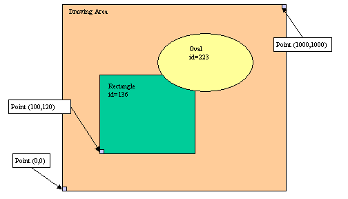

[Back to Contents](../index.html)

------------------------------------------------------------------------

# [Canvas]{#PAGE_HEADER}

This page describes the usage of Canvas.

- [What is Canvas?](#WHATIS)
- [Basics](#DEFINITION)
- [Functions](#FUNCTIONS)

*See also:* [Forms](FormSpecFiles.html), [Windows](WindowsAndForms.html)

------------------------------------------------------------------------

### [What is Canvas?]{#WHATIS}

By using Canvas, you can draw simple shapes in a specific area of a
[form](FormSpecFiles.html). Canvas can draw lines, rectangles, ovals,
circles, texts, arcs, and polygons. Keys can be bound to graphical
elements for selection with a right or left mouse click.

In programs, you select a given Canvas area by name and you create the
shapes in the [Abstract User Interface tree](DynamicUI.html) by using
the built-in [DOM API](XmlUtils.html).

The painted canvas is automatically displayed on the front end when an
interactive instruction is executed (like [MENU](Menus.html) or
[INPUT](RecordInput.html)).

The canvas area represents an abstract drawing page where you define
size and location of shapes with coordinates from (0,0) to (1000,1000).
The origin point  (0,0), is on the left-bottom of the drawing area.

{border="0" width="504" height="288"}

Each canvas element is identified by a unique number (id). You can use
this identifier to bind mouse clicks to canvas elements.

------------------------------------------------------------------------

### [Basics]{#DEFINITION}

#### Purpose:

Use **Canvas** to draw simple shapes in a specific area of a
[form](FormSpecFiles.html). 

#### Syntax:

`<Canvas colName="`*`name`*`" >`\
`  `[`{`]{.underline}` <CanvasArc `*`canvasitem-attribute="value"`*` `[`[...]`]{.underline}` />`\
`  `[`|`]{.underline}` <CanvasCircle `*`canvasitem-attribute`*`="`*`value"`*` `[`[...]`]{.underline}` />`\
`  `[`|`]{.underline}` <CanvasLine `*`canvasitem-attribute`*`="`*`value"`*` `[`[...]`]{.underline}` />`\
`  `[`|`]{.underline}` <CanvasOval `*`canvasitem-attribute`*`="`*`value"`*` `[`[...]`]{.underline}` />`\
`  `[`|`]{.underline}` <CanvasPolygon `*`canvasitem-attribute`*`="`*`value"`*` `[`[...]`]{.underline}` />`\
`  `[`|`]{.underline}` <CanvasRectangle `*`canvasitem-attribute`*`="`*`value"`*` `[`[...]`]{.underline}` />`\
`  `[`|`]{.underline}` <CanvasText `*`canvasitem-attribute`*`="`*`value"`*` `[`[...]`]{.underline}` />`\
`  `[`}`]{.underline}` `[`[...]`]{.underline}\
`</Canvas>`\
[`[...]`]{.underline}

#### Notes:

1.  You define the content of canvas areas in the Abstract User
    Interface tree.
2.  If the form defines canvas areas, the Abstract User Interface tree
    contains empty `<Canvas>` nodes that you can fill with canvas items.
3.  A canvas node is identified in the program by the `colName`
    attribute.
4.  You can get the canvas [DomNode](ClassDomNode.html) by name with the
    `Window.getElement(`*`name`*`)` method.
5.  You cannot drop canvas nodes, as they are read-only in a form
    definition.

The following table describes all the types of canvas element that are
supported:

  ------------------- --------------------------------------------------------------------------------------------------------------
  **Name**            **Description**
  `CanvasArc`         Arc defined by the bounding square top left point, a diameter, a start angle, a end angle, and a fill color.
  `CanvasCircle`      Circle defined by the bounding square top left point, a diameter, and a fill color.
  `CanvasLine`        Line defined by a start point, an end point, a width, and a fill color.
  `CanvasOval`        Oval defined by rectangle (with start point and end point), and a fill color.
  `CanvasPolygon`     Polygon defined by a list of points, and a fill color.
  `CanvasRectangle`   Rectangle defined by a start point, an end point, and a fill color.
  `CanvasText`        Text defined by a start point, an anchor hint, the text, and a fill color.
  ------------------- --------------------------------------------------------------------------------------------------------------

The following table describes the attributes of canvas elements:

  ----------------------- ----------------------- -----------------------
  **Name**                **Values**              **Description**

  `startX`                `INTEGER (0->1000)`     X position of starting
                                                  point.

  `startY`                `INTEGER (0->1000)`     Y position of starting
                                                  point.

  `endX`                  `INTEGER (0->1000)`     X position of ending
                                                  point.

  `endY`                  `INTEGER (0->1000)`     Y position of ending
                                                  point.

  `xyList`                `STRING`                Space-separated list of
                                                  Y X coordinates. For
                                                  example: \"23 45 56
                                                  78\".\
                                                  Warning! For historical
                                                  and compatibility
                                                  reasons, the xyList is
                                                  actually a list of
                                                  (Y,X) coordinates.

  `width`                 `INTEGER`               Width of the shape. 

  `height`                `INTEGER`               Height of the shape. 

  `diameter`              `INTEGER`               Diameter for circles
                                                  and arcs. 

  `startDegrees`          `INTEGER`               Beginning of the
                                                  angular range occupied
                                                  by an arc.

  `extentDegrees`         `INTEGER`               Size of the angular
                                                  range occupied by an
                                                  arc.

  `text`                  `STRING`                The text to draw.

  `anchor`                `"n","e","w","s"`       Anchor hint to give the
                                                  draw direction for
                                                  texts.

  `fillColor`             `STRING`                Name of the color to be
                                                  used for the element.

  `acceleratorKey1`       `STRING`                Name of the key
                                                  associated to a left
                                                  button click.

  `acceleratorKey3`       `STRING`                Name of the key
                                                  associated to a right
                                                  button click.
  ----------------------- ----------------------- -----------------------

#### Usage:

First, you must define a drawing area in the form file. The drawing area
is defined by a form field declared with the attribute
[WIDGET=\"CANVAS\"](FSFAttributes.html#FA_WIDGET). In the following
example, the name of the canvas field is \'`canvas01`\'. This field name
identifies the drawing area:

``` linenumber
01 DATABASE FORMONLY
02 LAYOUT
03 GRID
04 {
05   Canvas example:
06   [ca01                         ]
07   [                             ]
08   [                             ]
09   [                             ]
10   [                             ]
11   [                             ]
12 }
13 END
14 END
15 ATTRIBUTES
16 CANVAS ca01 : canvas01;
17 END
```

In programs, you draw canvas shapes by creating Canvas nodes in the
[Abstract User Interface tree](DynamicUI.html) with the [DOM API
utilities](XmlUtils.html).

Define a variable to hold the DOM node of the canvas and a second to
handle children created for shapes:

``` linenumber
01 DEFINE c, s om.DomNode
```

Define a window object variable; open a window with the form containing
the canvas area; get the current window object, and then get the canvas
DOM node:

``` linenumber
01 DEFINE w ui.Window
02 OPEN WINDOW w1 WITH FORM "form1"
03 LET w = ui.Window.getCurrent()
04 LET c = w.findNode("Canvas","canvas01")
```

Create a child node with a specific type defining the shape:

``` linenumber
01 LET s = c.createChild("CanvasRectangle")
```

Set attributes to complete the shape definition:

``` linenumber
01 CALL s.setAttribute( "fillColor", "red" )
02 CALL s.setAttribute( "startX", 10 )
03 CALL s.setAttribute( "startY", 20 )
04 CALL s.setAttribute( "endX", 100 )
05 CALL s.setAttribute( "endY", 150 )
```

It is possible to bind keys / actions to Canvas items in order to let
the end user select elements with a mouse click. You can assign a
function key for left-button mouse clicks with the `acceleratorKey1`
attribute, while `acceleratorKey2` is used to detect right-button mouse
clicks. The function keys you can bind are F1 to F255. If the user
clicks on a Canvas item bound to key actions, the corresponding action
handler will be executed in the current dialog. Several canvas items can
be bound to the same action keys; In order to identify what items have
been selected by a mouse click, you can use the `drawGetClickedItemId()`
function of [fgldraw.4gl](#FUNCTIONS). This method will return the AUI
tree node id of the Canvas items that was selected (i.e. s.getId()).

``` linenumber
01 ... Create the Canvas item with s node variable ...
02 CALL s.setAttribute( "acceleratorKey1", "F50" )
03 MENU "test"
04    COMMAND KEY (F50)
05       IF drawGetClickedItemId() = s.getId() THEN
06         ...
07       END IF
08 ...
09 END MENU
```

To clear a given shape in the canvas, remove the element in the canvas
node:

``` linenumber
01 CALL c.removeChild(s)
```

To clear the drawing area completely, remove all children of the canvas
node:

``` linenumber
01 LET s=c.getFirstChild()
02 WHILE s IS NOT NULL
03   CALL c.removeChild(s)
04   LET s=c.getFirstChild()
05 END WHILE
```

------------------------------------------------------------------------

### [Functions]{#FUNCTIONS}

The following table describes the built-in functions provided for
backward compatibility with version 3. This list is provided to let you
search for existing code using these functions. You are free to use
these old functions or use the technique described in the sections
above. For more details about the functions listed below, see the
FGLDIR/src/fgldraw.4gl source code.

  --------------------------- --------------------------------------------------------------------------------------------------------------------------------------------
  **Name**                    **Description**
  `drawInit()`                Initializes the drawing API. It is mandatory to call this function at the beginning of your program, before the first display instruction.
  `drawSelect()`              Selects a canvas area for drawing.
  `drawDisableColorLines()`   By default shapes are paint with borders. This function enables/disables border drawing.
  `drawLineWidth()`           Defines the width of lines.
  `drawAnchor()`              Defines the anchor hint for texts.
  `drawLine()`                Draws a line in the selected canvas.
  `drawCircle()`              Draws a circle in the selected canvas.
  `drawArc()`                 Draws an arc in the selected canvas.
  `drawRectangle()`           Draws a rectangle in the selected canvas.
  `drawOval()`                Draws an oval in the selected canvas.
  `drawText()`                Draws a text in the selected canvas.
  `drawPolygon()`             Draws a polygon in the selected canvas.
  `drawClear()`               Clears the selected canvas.
  `drawButtonLeft()`          Enables left mouse click on a canvas element.
  `drawButtonRight()`         Enables right mouse click on a canvas element.
  `drawClearButton()`         Disables all mouse clicks on a canvas element.
  `drawGetClickedItemId()`    Returns the id of the last clicked canvas element
  --------------------------- --------------------------------------------------------------------------------------------------------------------------------------------
