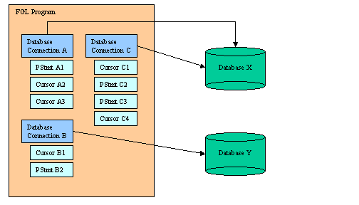

[Back to Contents](../index.html)

------------------------------------------------------------------------

# [Database Connections]{#PAGE_HEADER}

Summary:

- [What is a database connection?](#DBCONN)
- [Database Specification](#DBSPEC)
  - [Global Configuration Parameters](#DBCGLOBPRM)
    - [Default Database Driver](#DBCDEFDRV)
    - [User authentication callback function](#DBCUSERAUTH)
  - [Connection parameters](#DS_ODI_CONNPARAMS)
    - [Source](#DS_ODI_CP_SOURCE)
    - [Driver](#DS_ODI_CP_DRIVER)
    - [Username/Password](#DS_ODI_CP_USERPSWD)
  - [Connection parameters in the connection string](#DS_ODI_CPCSTR)
  - [Keep the compiled programs configurable](#DS_ODI_PROGFLX)
  - [Direct database specification](#DS_ODI_DIRECT)
  - [Indirect database specification](#DS_ODI_INDIRECT)
  - [IBM Informix](#DS_ODI_IFXEMUL) [emulations
    parameters](#DS_ODI_IFXEMUL)
  - [Database vendor specific parameters](#DS_ODI_DBVSPEC)
  - [IBM Informix](#DS_ODI_IFXENVW) [environment variables on Windows
    platforms](#DS_ODI_IFXENVW)
  - [Database user authentication](#USER_AUTH)
    - [Specifying user name and login with CONNECT](#UA_CONNECT)
    - [Specifying user name and login with DATABASE](#UA_DATABASE)
    - [Order of precedence for database user
      specification](#UA_PRECEDENCE)
    - [Authenticating users with Genero db](#UA_ADS)
    - [Authenticating users with IBM Informix](#UA_IFX)
    - [Authenticating users with Oracle](#UA_ORA)
    - [Authenticating user with SQL Server](#UA_MSV)
- [Database Client Environments](#DBCENV)
- [The FGLSQLDEBUG environment variable](#FGLSQLDEBUG)
- [The SQLCA record](#SQLCA_RECORD)
- [STATUS, SQLCA.SQLCODE, SQLSTATE and SQLERRMESSAGE](#ERRORINFO)
- [Interrupting SQL Statements](#SQLINTERRUPTION)
- Unique-session mode:
  - [Opening a connection](#DC_DATABASE) (`DATABASE`)
  - [Closing a connection](#DC_CLOSE_DATABASE) (`CLOSE DATABASE`)
- Multi-session mode:
  - [Opening connections](#DC_CONNECT_TO) (`CONNECT TO`)
  - [Selecting connections](#DC_SET_CONNECTION) (`SET CONNECTION`)
  - [Closing connections](#DC_DISCONNECT) (`DISCONNECT`)

*See also:* [Transactions](Transactions.html), [Static
SQL](StaticSql.html), [Dynamic SQL](DynamicSql.html), [Result
Sets](ResultSets.html), [SQL Errors](Exceptions.html#SQLERRORS), [SQL
Warnings](Exceptions.html#SQLWARNINGS), [Programs](Programs.html).

------------------------------------------------------------------------

### [What is a database connection?]{#DBCONN}

A Database Connection is a session of work, opened by the program to
communicate with a specific database server, in order to execute SQL
statements as a specific user.

**Warning: Before working with database connections, make sure you have
properly installed and configured Genero BDL, using the correct database
[client environment](Installation.html#INST_SR_DBCLIENT) and
[driver](#DS_ODI_CP_DRIVER). It is very important to understand database
client settings, regarding user authentication as well as [database
client character set configuration](Localization.html#DBCLIENT).**

Schema example of BDL program using three database connections:

{border="0" width="504" height="288"}

The database user can be identified explicitly for each connection.
Usually, the user is identified by a login and a password, or by using
the authentication mechanism of the operating system (or even from a
tier security system).

The database connection instructions [can not]{.underline} be prepared
as [Dynamic SQL](DynamicSql.html) statements; they must be static SQL
statements.

There are two kind of connection modes:  *unique-session* and
*multi-session* mode. When using the `DATABASE` and `CLOSE DATABASE`
instructions, you are in *unique-session* mode. When using the
`CONNECT TO`, `SET CONNECTION` and `DISCONNECT` instructions you are in
*multi-session* mode. [The modes are not compatible]{.underline}. It is
strongly recommended that you choose the session mode and not mix both
kinds of instructions.

In *unique-session* mode, you simply connect with the `DATABASE`
instruction; that creates a current session. You disconnect from the
current session with the `CLOSE DATABASE` instruction, or when another
`DATABASE` instruction is executed, or when the program ends.

In *multi-session* mode, you open a session with the `CONNECT TO`
instruction; that creates a current session. You can open other
connections with subsequent `CONNECT TO` instructions. To switch to a
specific session, use the `SET CONNECTION` instruction; this suspends
other opened connections. Finally, you disconnect from the current, from
a specific, or from all sessions with the `DISCONNECT` instruction. The
end of the program disconnects all sessions automatically.

Once connected to a database server, you have a current database
session. Any subsequent SQL statement is executed in the context of the
current database session.

------------------------------------------------------------------------

### [Database Specification]{#DBSPEC}

The database specification identifies the SQL data server and the
database entity the Genero BDL program must connect to in order to
execute SQL statements to read from or modify the database tables.

Depending on the database server type, there are different ways to
specify the SQL data source. For example, when you connect to Oracle,
you cannot specify the database server as you do with IBM Informix by
using the \'`dbname@dbserver`\' notation. At some point you will have to
specify the database driver to be loaded, the database server
(INFORMIXSERVER, ORACLE_SID/TNSNAME, SQL Server instance), the name of
the database (or database schema, if the server does not support the
concept of individual database entities), and if user authentication is
needed, the database user, with a login and password.

**Warning: There are different ways to give connection information and
it is possible to mix the different methods to specify these parameters.
However, if provided, the database user name and password have to be
specified together with the same method.**

The database specification is provided in Genero BDL programs by the
`DATABASE` or `CONNECT TO` instruction. We recommend you to use the
`CONNECT TO` instruction, as it allows to specify a user and password):

`CONNECT TO `*`dbspec`*` [USER `*`username`*` USING `*`password`*`]`\
or\
`DATABASE `*`dbspec`*

For portability reasons, it is not recommended that you use database
vendor specific syntax (such as \'`dbname@dbserver`\') in the `DATABASE`
or `CONNECT TO` instructions. We recommend using a simple symbol
instead, and configuring the connection parameters in external resource
files. The **Open Database Interface** architecture allows this indirect
database specification using entries from the
[FGLPROFILE](FglProfile.html) configuration file.

When a `DATABASE` or `CONNECT TO` instruction is executed with the
parameter *dbspec*, the runtime system first looks into
[FGLPROFILE](FglProfile.html) for entries starting with
`dbi.database.`*`dbspec`*, and uses [indirect database
specification](#DS_ODI_INDIRECT) if such connection parameters are
found. Otherwise, the runtime system will do [direct database
specification](#DS_ODI_DIRECT), by using the *dbspec* database
specification to connect to the server.

**Warning: When using FGLPROFILE entries for database specification,
keep in mind that entries must be written in lowercase. See
[FGLPROFILE](FglProfile.html) for more details.**

------------------------------------------------------------------------

#### [Global Configuration Parameters]{#DBCGLOBPRM}

##### [Default Database Driver]{#DBCDEFDRV}

The next [FGLPROFILE](FglProfile.html) entry defines a default database
driver to be loaded, if the driver is not specified by the connection
instruction:

    dbi.default.driver = "driver-name"

Here driver-name must be a value database driver name, without the .so
or .DLL extension. See [database driver list](#driver_names) for
possible values.

If the above configuration entry is not defined, the driver name
defaults to **dbmdefault**.

##### [User authentication callback function]{#DBCUSERAUTH}

When using the [DATABASE instruction](#DC_DATABASE), you can define an
[FGLPROFILE](FglProfile.html) entry with the name of a function to be
called when the `DATABASE` instruction is executed, in order to let you
provide a user name and password for the database connection.

    dbi.default.userauth.callback = "[module-name.]function-name"

**Warning: This callback method [is not a password encryption
solution]{.underline}, it is only provided as workaround to let you
provide a user name and password for the database connection initiated
by `DATABASE` instructions without modifying existing programs. You
should use the [CONNECT TO instruction](#DC_CONNECT_TO) with the 
`USER`/`USING` clause instead. This feature is provided mainly for
non-IBM Informix drivers, when a lot of legacy code is using the
`DATABASE` instruction. When using the IBM Informix driver, the callback
method is called, but the user name and password are ignored by the
`DATABASE` instruction: Only `CONNECT TO` will take the login parameters
into account for IBM Informix.**

The callback function must have the following signature:

    CALL function-name(dbspec STRING)
         RETURNING STRING (username), STRING (password)

If you do not specify the module name, the callback function must be
linked to the 42r program. By using the \"*module-name.function-name*\"
syntax in the FGLPROFILE entry, the runtime system will automatically
load the module. In both cases, the module must be located in a
directory where the runtime system can find it. See the
[FGLLDPATH](EnvironmentVariables.html#EV_FGLLDPATH) environment variable
for more details.

You typically use the value of *dbspec* to identify the database source,
read username and encrypted password from [FGLPROFILE](FglProfile.html)
entries with the
[fgl_getResource()](BuiltInFunctions.html#BF_FGL_GETRESOURCE) function,
then decrypt password with the algorithm of your choice and return
username and decrypted password.

Callback function example:

``` linenumber
01 FUNCTION getUserAuth(dbspec)
02    DEFINE dbspec STRING
03    DEFINE un, ep STRING
04    LET un = fgl_getResource("dbi.database."||dbspec||".username")  -- standard entry
05    LET ep = fgl_getResource("dbi.database."||dbspec||".password.encrypted")  -- custom entry
06    RETURN un, decrypt_user_password(dbspec, un, ep)
07 END FUNCTION
```

------------------------------------------------------------------------

#### [[Connection parameters]{#DS_ODI_CONNPARAMS}]{.underline}

This section describes the different parameters which need to be
specified in order to connect to a database. The parameters can be
provided with different methods (in the connection string or in
FGLPROFILE settings). Some of these parameters are optional, for example
if the database user is authenticated by the operating system,
username/password parameters are not needed.

------------------------------------------------------------------------

##### [Source]{#DS_ODI_CP_SOURCE}

The \"**source**\" parameter identifies the data source name. The
following table describes the meaning of this parameter for the
supported databases:

::: {align="center"}
  ----------------------- ----------------------------- -----------------------
  **Database Type**       **Value of \"source\" entry** **Description**

  **Genero db**           `datasource`                  ODBC Data Source

  **Generic ODBC**        `datasource`                  ODBC Data Source

  **IBM Informix**        `dbname[@dbserver]`           IBM Informix database
                                                        specification

  **IBM DB2**             `dsname`                      DB2 Catalogued Database

  **MySQL**               `dbname[@host[:port]]`\       Database Name @ Host
                          or\                           Name : TCP Port\
                          `dbname[@localhost~socket]`   or\
                                                        Database Name @ Local
                                                        host \~ Unix socket
                                                        file

  **ORACLE**              `tnsname`                     Oracle TNS Service name

  **PostgreSQL**          `dbname[@host[:port]]`        Database Name @ Host
                                                        Name : TCP Port

  **SQL Server**          `datasource`                  ODBC Data Source

  **SQLite**              `filename`                    Database file path

  **Sybase Adaptive       `dbname[@engine]`             Database Name @ Engine
  Server Enterprise                                     Name
  (ASE)**                                               

  **Sybase Adaptive       `dbname[@engine]`             Database Name @ Engine
  Server Anywhere (ASA)**                               Name
  ----------------------- ----------------------------- -----------------------
:::

If the \"**source**\" parameter is defined with an empty value (\"\"),
the database interface connects to the default database server, which is
usually the local server.

If the \"**source**\" entry is [not present]{.underline} in
[FGLPROFILE](FglProfile.html), the [Direct Database
Specification](#DS_ODI_DIRECT) method takes place.

------------------------------------------------------------------------

##### [Driver]{#DS_ODI_CP_DRIVER}

The \"**driver**\" parameter identifies the type of database driver to
be loaded. Here you specify the name of the shared library or DLL to be
used, without the .so or .DLL exntesion.

**Warning: Driver file names do not have to be specified with a file
extension.**

For example:

    dbi.database.stores.driver = "dbmifx9x"

You can define a default driver with the [Default Database
Driver](#DBCDEFDRV) FGLPROFILE entry. If this entry is not defined, and
if no driver parameter is defined for the data source, the driver name
defaults to **dbmdefault**. The default driver dbmdefault is a copy of a
specific driver type that was chosen during Genero BDL installation.

The shared libraries implementing Genero BDL database drivers are
located in **FGLDIR/dbdrivers** on both UNIX and Windows platforms. Some
drivers may not be available on a specific platform (usually, because
the target database client does not exist on that platform). See below
for a complete list of available drivers. Contact your support if you do
not find the driver you are looking for.

**Warning: The selected driver must correspond to the database client
type and version. For example, you should not use a dbmads380 driver
with Genero 3.81.**

[The following table lists the database driver names to be used
according to the database client type and version:]{#driver_names}

  ------------------ ---------- -------------------------------------------------------------- ----------------------------------------------------------------------------- ----------------------------
  **Driver names**    **Type**  **Database client software version**                           **Unix shared  libraries**                                                    **Microsoft Windows DLLs**
  dbmads3x              ads     Genero db Client 3.x                                           libaodbc.so                                                                   aodbc.dll
  dbmads380             ads     Genero db Client 3.80 and higher                               libaodbc.so                                                                   aodbc.dll
  dbmads381             ads     Genero db Client 3.81 and higher                               libaodbc.so                                                                   aodbc.dll
  dbmasa8x              asa     Sybase ASA Client 8.x                                          libdblib8.so                                                                  dblibtm.dll
  dbmase0Fx             ase     Sybase ASE Open Client Library 15.x                            libsybct.so, libsybcs.so                                                      libsybct.dll, libsybcs.dll
  dbmdb28x              db2     DB2 Client 8.x                                                 libdb2.so                                                                     db2cli.dll
  dbmdb29x              db2     DB2 Client 9.x                                                 libdb2.so                                                                     db2cli.dll
  dbmesm90              esm     EasySoft ODBC client for SQL Server 2005                       libessqlsrv.so                                                                **N/A**
  dbmesmA0              esm     EasySoft ODBC client for SQL Server 2008                       libessqlsrv.so                                                                **N/A**
  dbmifx9x              ifx     IBM Informix CSDK 2.80 and higher                              libifsql.so, libifasf.so, libifgen.so, libifos.so, libifgls.so, libifglx.so   isqlt09a.dll
  dbmmys50x             mys     MySQL Client 5.0.x                                             libmysqlclient.so                                                             libmysql.dll
  dbmmys51x             mys     MySQL Client 5.1.x                                             libmysqlclient.so                                                             libmysql.dll
  dbmmys54x             mys     MySQL Client 5.4.x                                             libmysqlclient.so                                                             libmysql.dll
  dbmmys55x             mys     MySQL Client 5.5.x                                             libmysqlclient.so                                                             libmysql.dll
  dbmmys60x             mys     MySQL Client 6.0.x                                             libmysqlclient.so                                                             libmysql.dll
  dbmmsv80              msv     SQL Server Client 8.x (MDAC ODBC) (SQL Server 2000)            **N/A**                                                                       odbc32.dll / SQLSRV32.DLL
  dbmmsv90              msv     SQL Server Client 9.x (MDAC ODBC) (SQL Server 2005)            **N/A**                                                                       odbc32.dll / SQLSRV32.DLL
  dbmodc3x              odc     Generic ODBC Client (ODBC 3.x)                                 libodbc.so                                                                    odbc32.dll
  dbmora81x             ora     Oracle OCI Client 8.1.x                                        libclntsh.so                                                                  oci.dll
  dbmora82x             ora     Oracle OCI Client 8.2.x                                        libclntsh.so                                                                  oci.dll
  dbmora92x             ora     Oracle OCI Client 9.2.x                                        libclntsh.so                                                                  oci.dll
  dbmoraA1x             ora     Oracle OCI Client 10.1.x                                       libclntsh.so                                                                  oci.dll
  dbmoraA2x             ora     Oracle OCI Client 10.2.x                                       libclntsh.so                                                                  oci.dll
  dbmoraB1x             ora     Oracle OCI Client 11.1.x                                       libclntsh.so                                                                  oci.dll
  dbmoraB2x             ora     Oracle OCI Client 11.2.x                                       libclntsh.so                                                                  oci.dll
  dbmpgs81x             pgs     PostgreSQL Client 8.1.x                                        libpq.so                                                                      libpq.dll
  dbmpgs82x             pgs     PostgreSQL Client 8.2.x                                        libpq.so                                                                      libpq.dll
  dbmpgs83x             pgs     PostgreSQL Client 8.3.x                                        libpq.so                                                                      libpq.dll
  dbmpgs84x             pgs     PostgreSQL Client 8.4.x                                        libpq.so                                                                      libpq.dll
  dbmsnc90              snc     SQL Server Client 9.x (SQL Native client) (SQL Server 2005)    **N/A**                                                                       odbc32.dll / SQLNCLI.DLL
  dbmsncA0              snc     SQL Server Client 10.x (SQL Native client) (SQL Server 2008)   **N/A**                                                                       odbc32.dll / SQLNCLI.DLL
  dbmftm90              ftm     FreeTDS ODBC client for SQL Server 2005                        libtdsodbc.so                                                                 **N/A**
  dbmsqt3xx             sqt     SQLite 3.x                                                     libsqlite3.so                                                                 sqtlite3.dll
  ------------------ ---------- -------------------------------------------------------------- ----------------------------------------------------------------------------- ----------------------------

------------------------------------------------------------------------

##### [Username / Password]{#DS_ODI_CP_USERPSWD}

The \"**username**\" and \"**password**\" parameters define the default
database user, when the program uses the [DATABASE](#DC_DATABASE)
instruction or the [CONNECT TO](#DC_CONNECT_TO) instruction without the
`USER` clause.

**Warning: The \"username\" and \"password\" FGLPROFILE entries are [not
encrypted]{.underline}. These parameters are provided to simplify
migration and should not be used in production. You better use CONNECT
TO with a USER / USING clause to avoid any security hole, setup OS user
authentication or use the connection callback method. Example of
database servers supporting OS user authentication: IBM Informix,
Oracle, SQL Server and Genero db.**

**Warning: For backward compatibility reasons, when using the IBM
Informix driver, the username / password specification is ignored by the
`DATABASE` instruction, only the `CONNECT TO` instruction takes external
(or callback) login parameters into account.**

For more details about database login see [Database user
authentication](#USER_AUTH).

------------------------------------------------------------------------

#### [[Specifying connection parameters in the connection string]{#DS_ODI_CPCSTR}]{.underline}

For development or testing purpose, you can specify connection
parameters in the database specification string used by the `DATABASE`
and `CONNECT TO` instructions. We do not recommend to hardcode
connection string parameters for a program to be installed on a
production site, you should use the [Indirect Database
Specification](#DS_ODI_INDIRECT) method instead, or build the connection
string at runtime to keep the database connection flexible.

Note that the connection string parameters [override]{.underline} the
`dbi.database` connection parameters defined in FGLPROFILE.

A **plus sign** in the database specification starts the list of
connection parameters. Each parameter is defined with a name followed by
an equal sign an a value enclosed in single quotes. Connection string
parameters must be separated by a comma:

    dbname+parameter='value'[,...]

In the above syntax, *parameter* can be one of the following:

::: {align="center"}
  ----------------------------------- ------------------------------------------
  **Parameter**                       **Description**

  `resource`                          Specifies which \'`dbi.database`\' entries
                                      have to be read from the
                                      [FGLPROFILE](FglProfile.html)
                                      configuration file.\
                                      When this property is set, the database
                                      interface reads
                                      `dbi.database.`*`name`*`.*` entries, where
                                      *name* is the value specified for the
                                      *resource* parameter. 

  `driver`                            Defines the database driver library to be
                                      loaded (filename without extension).\
                                      See [Driver](#DS_ODI_CP_DRIVER) for more
                                      details.

  `source`                            Specifies the data source of the database
                                      (for example, Oracle\'s TNS name).\
                                      See [Source](#DS_ODI_CP_SOURCE) for more
                                      details.

  `username`                          Defines the name of the database user.\
                                      See
                                      [Username/Password](#DS_ODI_CP_USERPSWD)
                                      for more details.

  `password`                          Defines the password of the database
                                      user.\
                                      See
                                      [Username/Password](#DS_ODI_CP_USERPSWD)
                                      for more details.\
                                      **Warning: You should not hardcode the
                                      user passwords in your sources!**
  ----------------------------------- ------------------------------------------
:::

In the following example, **driver**, **source** and **resource** are
specified in the connection string:

``` linenumber
01 MAIN
02    DEFINE db CHAR(50)
03    LET db = "stores+driver='dbmora',source='orcl',resource='ora'"
04    DATABASE db
05    ...
06 END MAIN
```

------------------------------------------------------------------------

#### [Keep the compiled programs configurable]{#DS_ODI_PROGFLX}

You can use a string variable with the [DATABASE](#DC_DATABASE) or
[CONNECT TO](#DC_CONNECT_TO) statement, in order to specify the database
source at runtime (to be loaded from your own configuration file or from
an environment variable). This solution gives you the best flexibility.

``` linenumber
01 MAIN
02    DEFINE db, us, pwd CHAR(50)
03    LET db = arg_val(1)
03    LET us = arg_val(2)
03    LET pwd = arg_val(3)
04    CONNECT TO db USER us USING pwd
05    ...
06 END MAIN
```

------------------------------------------------------------------------

#### [[Direct database specification method]{#DS_ODI_DIRECT}]{.underline}

The **Direct Database Specification** method takes place when the
database name used in the program is not used in
[FGLPROFILE](FglProfile.html) to define the data source with a
\'`dbi.database.dbname.source`\' entry.  In this case, the database
specification used in the connection instruction is used as the data
source.

This method is well known for standard IBM Informix drivers, where you
directly specify the database name and, if needed, the IBM Informix
server:

``` linenumber
01 MAIN
02    DATABASE stores@orion
03    ...
04 END MAIN
```

In the next example, the database server is PostgreSQL. The string used
in the connection instruction defines the PostgreSQL database (stock),
the host (localhost), and the TCP service (5432) the postmaster is
listening to. As PostgreSQL syntax is not allowed in standard BDL, a
CHAR variable must be used:

``` linenumber
01 MAIN
02    DEFINE db CHAR(50)
03    LET db = "stock@localhost:5432"
04    DATABASE db
05    ...
06 END MAIN
```

------------------------------------------------------------------------

#### [[Indirect database specification method]{#DS_ODI_INDIRECT}]{.underline}

Indirect Database Specification method takes place when the database
name used in the connection instruction corresponds to a
\'`dbi.database.dbname.source`\' entry defined in the
[FGLPROFILE](FglProfile.html) configuration file. In this case, the
*dbname* database specification is used as a key to read the connection
information from the configuration file.

In [FGLPROFILE](FglProfile.html), the entries starting with
\'`dbi.database`\' group information defining connection parameters for
indirect database specification:

    dbi.database.dbname.source   = "value"
    dbi.database.dbname.driver   = "value"
    dbi.database.dbname.username = "value"
    dbi.database.dbname.password = "value"  -- Warning: not encrypted, do not use in production!

**Warning: FGLPROFILE entry names are converted to lower case when
loaded by the runtime system. In order to avoid any mistakes, it is
recommended to write FGLPROFILE entry names and program database names
in lower case.**

In the next example, the program specifies a data source with the name
**stores**, and FGLPROFILE defines the *source* and *driver* parameters
for the **stores** data source:

Program:

``` linenumber
01 MAIN
02    DATABASE stores
03    ...
04 END MAIN
```

FGLPROFILE:

    dbi.database.stores.source   = "stock@localhost:5432"
    dbi.database.stores.driver   = "dbmpgs721"

The indirect database specification technique is flexible: The database
name in programs is a kind of alias for the real database which is
defined in an external FGLPROFILE resource file, where entries can be
easily changed on production sites without needing program
re-compilation. For example, with this method, your can develop your
application with the database name \"stores\" and connect to a database
\"stores1\" in a production environment.

The *source*, *driver*, *username/password* entries are described in
detail in [Connection parameters](#DS_ODI_CONNPARAMS).

------------------------------------------------------------------------

#### [[IBM Informix]{.underline}]{#DS_ODI_IFXEMUL} [[emulation parameters in FGLPROFILE]{.underline}]{#DS_ODI_IFXEMUL}

To simplify the migration process to other databases, the database
interface and drivers can emulate some IBM Informix-specific features
like SERIAL columns and temporary tables; the drivers can also do some
SQL syntax translation.

**Warning: Avoid using IBM Informix emulations; write portable SQL code
instead as described in [SQL Programming](SqlProgramming.html). IBM
Informix emulations are only provided to help you in the migration
process. Disabling IBM Informix emulations improves performance, because
SQL statements do not have to be parsed to search for IBM
Informix-specific syntax.**

Emulations can be controlled with FGLPROFILE parameters. You can disable
all possible switches step-by-step, in order to test your programs for
SQL compatibility.

Global switch to enable or disable IBM Informix emulations:

    dbi.database.dbname.ifxemul = { true | false }

Feature specific switches:

The \'ifxemul.datatype\' switches define whether the specified data type
must be converted to a native type (for example, when creating a table):

    dbi.database.dbname.ifxemul.datatype.type = { true | false }

Here, *type* can be one of:

- char
- varchar
- datetime
- decimal
- money
- float
- real
- integer
- smallint
- serial
- text
- byte
- bigint
- bigserial
- int8
- serial8
- boolean

To control SERIAL generation type, you can use the following switch:

    dbi.database.dbname.ifxemul.datatype.serial.emulation = { "native" | "regtable" | "trigseq" }

When using \"native\", the database driver creates a native sequence
generator - it is fast, but not fully compatible to IBM Informix SERIAL.
When using \"regtable\", you must have the SERIALREG table created - it
is slower than the \"native\" emulation, but compatible to IBM Informix
SERIAL. The serial emulation \"trigseq\", can be used by some database
drivers, to use triggers with native sequence generators.

The \'temptables\' switch can be used to control temporary table
emulation:

    dbi.database.dbname.ifxemul.temptables = { true | false }

The \'temptables.emulation\' switch can be used to specify what type of
tables must be used to emulate temporary tables:

    dbi.database.dbname.ifxemul.temptables.emulation = { "default" | "global" }

The \'dblquotes\' switch can be used to define whether double quoted
strings must be converted to single quoted strings:

    dbi.database.dbname.ifxemul.dblquotes = { true | false }

If this emulation is enabled, all double quoted strings are converted,
including database object names.

The \'outers\' switch can be used to control IBM Informix OUTER
specification:

    dbi.database.dbname.ifxemul.outers = { true | false }

It is better to use standard ISO outer joins in your SQL statements.

The \'today\' switch can be used to convert the TODAY keyword to a
native expression returning the current date:

    dbi.database.dbname.ifxemul.today = { true | false }

The \'current\' switch can be used to convert the CURRENT X TO Y
expressions to a native expression returning the current time:

    dbi.database.dbname.ifxemul.current = { true | false }

The \'selectunique\' switch can be used to convert the SELECT UNIQUE to
SELECT DISTINCT:

    dbi.database.dbname.ifxemul.selectunique = { true | false }

It is better to replace all UNIQUE keywords by DISTINCT.

The \'colsubs\' switch can be used to control column sub-strings
expressions (col\[x,y\]) to native sub-string expressions:

    dbi.database.dbname.ifxemul.colsubs = { true | false }

The \'matches\' switch can be used to define whether MATCHES expressions
must be converted to LIKE expressions:

    dbi.database.dbname.ifxemul.matches = { true | false }

It is better to use the LIKE operator in your SQL statements.

The \'length\' switch can be used to define whether LENGTH function
names have to be converted to the native equivalent:

    dbi.database.dbname.ifxemul.length = { true | false }

The \'rowid\' switch can be used to define whether ROWID keywords have
to be converted to native equivalent (for example, OID in PostgreSQL):

    dbi.database.dbname.ifxemul.rowid = { true | false }

It is better to use primary keys instead.

The \'listupdate\' switch can be used to convert the UPDATE statements
using non-ANSI syntax:

    dbi.database.dbname.ifxemul.listupdate = { true | false }

The \'extend\' switch can be used to convert simple EXTEND() expressions
to native date/time expressions:

    dbi.database.dbname.ifxemul.extend = { true | false }

------------------------------------------------------------------------

#### [[Defining database vendor specific parameters in FGLPROFILE]{.underline}]{#DS_ODI_DBVSPEC}

Some database vendor specific connection parameters can be configured by
using [FGLPROFILE](FglProfile.html) entries with the following syntax:

    dbi.database.dsname.dbtype.param.[.subparam] = "value"

The table below describes all database vendor specific parameters
supported:

::: {align="center"}
  ----------------------------------- ------------------------------------------------------------------------------------------------------------------------------------------------
  **Database Server**                 **Parameters**

  **Genero db**                        

                                      **dbi.database.*dsname*.ads.schema\**
                                      Name of the database schema to be selected after connection is established.\
                                      Example:\
                                      `dbi.database.`**`stores`**`.ads.schema = "store2"`\
                                      Usage:\
                                      Set this parameter to a specific schema in order to share the same table with all users.

                                      **dbi.database.*dsname*.ads.compatibility.check\**
                                      Defines the server compatibility checking at connection time.\
                                      Example:\
                                      `dbi.database.`**`stores`**`.ads.compatibility.check = "INFORMIX"`\
                                      Usage:\
                                      This entry can be used to bypass the COMPATIBILITY_MODE server parameter checking when connecting to the database. By default (starting with the
                                      3.80 driver) COMPATIBILITY_MODE must be INFORMIX. Using \"none\" will bypass the checking; Any other value will force database compatibility
                                      mode checking. Default is \"INFORMIX\".

                                      **dbi.database.*dsname*.ads.driver.mode\**
                                      Defines the driver mode, to make the driver behave like an older driver version.\
                                      Example:\
                                      `dbi.database.`**`stores`**`.ads.driver.mode = "3.61"`\
                                      Usage:\
                                      This entry can be set to a specific Genero db version, to force the driver to use the IBM Informix emulations of an older driver version. For
                                      example, when using a driver for 3.80, the default mode is \"3.80\" and the new native DATETIME and/or INTERVAL types are used. If you want to
                                      use the old DATETIME / INTERVAL emulation, set the above entry to \"3.61\".

  **IBM DB2**                          

                                      **dbi.database.*dsname*.db2.schema\**
                                      Name of the database schema to be selected after connection is established.\
                                      Example:\
                                      `dbi.database.`**`stores`**`.db2.schema = "store2"`\
                                      Usage:\
                                      Set this parameter to a specific schema in order to share the same table with all users.

                                      **dbi.database.*dsname*.db2.prepare.deferred\**
                                      True/False Boolean to enable/disable deferred prepare.\
                                      Example:\
                                      `dbi.database.`**`stores`**`.db2.prepare.deferred = true`\
                                      Usage:\
                                      Set this parameter to true if you do not need to get SQL errors during PREPARE statements: SQL statements will be sent to the server when
                                      executing the statement (OPEN or EXECUTE). The default is false (SQL statements are sent to the server when doing the PREPARE).

  **ORACLE**                           

                                      **dbi.database.*dsname*.ora.schema\**
                                      Name of the database schema to be selected after connection is established.\
                                      Example:\
                                      `dbi.database.`**`stores`**`.ora.schema = "store2"`\
                                      Usage:\
                                      Set this parameter to a specific schema in order to share the same table with all users.

                                      **dbi.database.*dsname*.ora.prefetch.rows\**
                                      Maximum number of rows to be pre-fetched.\
                                      Example:\
                                      `dbi.database.`**`stores`**`.ora.prefetch.rows = 50`\
                                      Usage:\
                                      You can use this parameter to increase performance by defining the maximum number of rows to be fetched automatically. However, the bigger this
                                      parameter is, the more memory is used by each program. This parameter applies to all cursors in the application.\
                                      The default is 10 rows.

                                      **dbi.database.*dsname*.ora.prefetch.memory\**
                                      Maximum buffer size for pre-fetching (in bytes).\
                                      Example:\
                                      `dbi.database.`**`stores`**`.ora.prefetch.memory = 4096`\
                                      Usage:\
                                      This parameter is equivalent to prefetch.rows, but here you can specify the memory size instead of the number of rows. As prefetch.rows, this
                                      parameter applies to all cursors in the application.\
                                      The default is 0, which means that memory size is not included in computing the number of rows to pre-fetch.

                                      **dbi.database.*dsname*.ora.sid.command\**
                                      SQL command (SELECT) to generate a unique session id (used for temp table names).\
                                      Example:\
                                      `dbi.database.`**`stores`**`.ora.sid.command = "SELECT TO_CHAR(SID)||'_'||TO_CHAR(SERIAL#) FROM V$SESSION WHERE AUDSID=USERENV('SESSIONID')"`\
                                      Usage:\
                                      By default the driver uses \"SELECT USERENV(\'SESSIONID\') FROM DUAL\". This is the standard session identifier in Oracle, but it can become a
                                      very large number and can\'t be reset.\
                                      This parameter gives you the freedom to provide your own way to generate a session id.\
                                      The SELECT statement must return a single row with one single column.\
                                      Value can be an integer or an identifier.

                                      **dbi.database.*dsname*.ora.cursor.scroll.emul\**
                                      Switch to enable scrollable cursor emulation to workaround Oracle bugs.\
                                      Example:\
                                      `dbi.database.`**`stores`**`.ora.cursor.scroll.emul = true`\
                                      Usage:\
                                      A lot of customers have reported bugs with native Oracle scrollable cursors. To workaround these bugs, you can set this entry and enable
                                      client-side scrollable cursors emulation. You should however use native scroll cursors if possible, these are more efficient as the emulation.
                                      Temporary files will be created on the application server if this option is true. \
                                      Default is true for ODI drivers designed for Oracle versions \<= 9.0, false for more recent versions of Oracle.

  **SQL Server (MDAC)**                

                                      **dbi.database.*dsname*.msv.logintime\**
                                      Connection timeout (in seconds).\
                                      Example:\
                                      `dbi.database.`**`stores`**`.msv.logintime = 5`\
                                      Usage:\
                                      Set this parameter to raise an SQL error if the connection can not be established after the given number of seconds.\
                                      The default is 5 seconds.

                                      **dbi.database.*dsname*.msv.prefetch.rows\**
                                      Maximum number of rows to be pre-fetched.\
                                      Example:\
                                      `dbi.database.`**`stores`**`.msv.prefetch.rows = 50`\
                                      Usage:\
                                      You can use this parameter to increase performance. However, the bigger this parameter is, the more memory is used by each program.\
                                      The default is 10 rows.

  **SQL Server (NCLI)**                

                                      **dbi.database.*dsname*.snc.logintime\**
                                      Connection timeout (in seconds).\
                                      Example:\
                                      `dbi.database.`**`stores`**`.snc.logintime = 5`\
                                      Usage:\
                                      Set this parameter to raise an SQL error if the connection can not be established after the given number of seconds.\
                                      The default is 5 seconds.

                                      **dbi.database.*dsname*.snc.prefetch.rows\**
                                      Maximum number of rows to be pre-fetched.\
                                      Example:\
                                      `dbi.database.`**`stores`**`.snc.prefetch.rows = 50`\
                                      Usage:\
                                      You can use this parameter to increase performance. However, the bigger this parameter is, the more memory is used by each program.\
                                      The default is 10 rows.

                                      **dbi.database.*dsname*.snc.widechar\**
                                      True/False Boolean to control Wide Char usage for character string data.\
                                      You can set this parameter to false if you use char/varchar columns in the SQL Server database.\
                                      Example:\
                                      `dbi.database.`**`stores`**`.snc.widechar = false`\
                                      Usage:\
                                      By default the SNC driver uses Wide Char ODBC functions, by converting the character data from the current locale to UCS/2, adding the N prefix
                                      before string literals and binding SQL parameters with SQL_C_WCHAR + SQL_WCHAR/SQL_WVARCHAR types.\
                                      If you set this parameter to false, the driver will pass the character strings as is without charset conversion, leave the string literals
                                      without N prefix and bind character string parameters with SQL_C_CHAR + SQL_CHAR/SQL_VARCHAR.\
                                      The default is true (use wide chars).

  **SQL Server (FreeTDS)**             

                                      **dbi.database.*dsname*.ftm.logintime\**
                                      Connection timeout (in seconds).\
                                      Example:\
                                      `dbi.database.`**`stores`**`.ftm.logintime = 5`\
                                      Usage:\
                                      Set this parameter to raise an SQL error if the connection can not be established after the given number of seconds.\
                                      The default is 5 seconds.

                                      **dbi.database.*dsname*.ftm.prefetch.rows\**
                                      Maximum number of rows to be pre-fetched.\
                                      Example:\
                                      `dbi.database.`**`stores`**`.ftm.prefetch.rows = 50`\
                                      Usage:\
                                      You can use this parameter to increase performance. However, the bigger this parameter is, the more memory is used by each program.\
                                      The default is 10 rows.

  **SQL Server (EasySoft)**            

                                      **dbi.database.*dsname*.esm.logintime\**
                                      Connection timeout (in seconds).\
                                      Example:\
                                      `dbi.database.`**`stores`**`.esm.logintime = 5`\
                                      Usage:\
                                      Set this parameter to raise an SQL error if the connection can not be established after the given number of seconds.\
                                      The default is 5 seconds.

                                      **dbi.database.*dsname*.esm.prefetch.rows\**
                                      Maximum number of rows to be pre-fetched.\
                                      Example:\
                                      `dbi.database.`**`stores`**`.esm.prefetch.rows = 50`\
                                      Usage:\
                                      You can use this parameter to increase performance. However, the bigger this parameter is, the more memory is used by each program.\
                                      The default is 10 rows.

  **Sybase Adaptive Server Enterprise  
  (ASE)**                             

                                      **dbi.database.*dsname*.ase.logintime\**
                                      Connection timeout (in seconds).\
                                      Example:\
                                      `dbi.database.`**`stores`**`.asa.logintime = 10`\
                                      Usage:\
                                      Set this parameter to raise an SQL error if the connection can not be established after the given number of seconds.\
                                      The default is 5 seconds.

                                      **dbi.database.*dsname*.ase.prefetch,rows\**
                                      Maximum number of rows to be pre-fetched.\
                                      Example:\
                                      `dbi.database.`**`stores`**`.ase.prefetch.rows = 50`\
                                      Usage:\
                                      You can use this parameter to increase performance. However, the bigger this parameter is, the more memory is used by each program.\
                                      The default is 10 rows.

  **Sybase Adaptive Server Anywhere    
  (ASA)**                             

                                      **dbi.database.*dsname*.asa.logintime\**
                                      Connection timeout (in seconds).\
                                      Example:\
                                      `dbi.database.`**`stores`**`.asa.logintime = 10`\
                                      Usage:\
                                      Set this parameter to raise an SQL error if the connection can not be established after the given number of seconds.\
                                      The default is 5 seconds.
  ----------------------------------- ------------------------------------------------------------------------------------------------------------------------------------------------
:::

------------------------------------------------------------------------

#### [IBM Informix]{#DS_ODI_IFXENVW} [environment variables on Windows platforms]{#DS_ODI_IFXENVW}

On Windows platforms, in a C console application, the IBM Informix
environment variables must be set with a call to **ifx_putenv()**. See
INFORMIX ESQL/C documentation for more details about environment
settings.

By default, the database driver automatically calls **ifx_putenv()** for
all standard IBM Informix environment variables such as INFORMIXDIR with
the current value set in the console environment. You can specify
additional environment variables to be set with the following FGLPROFILE
entries:

**dbi.stdifx.environment.count = *max\*
dbi.stdifx.environment.*index* = \"*variable*\"**

------------------------------------------------------------------------

### [Database user authentication]{#USER_AUTH}

Connecting to a database server is not just specifying a database name.
IBM Informix 4gl programmers are used to write \"`DATABASE dbname`\" to
get connected. But this is only possible when the database server is
configured to trust Operating System users. Only a few database server
support OS authentication. Database users are usually defined in the
database server and must be explicitly identified by a user name and
password. However, some database servers support external authentication
methods, which can be used with Genero. See DB specific documentation
for more details.

#### [[Specifying a user name and password with CONNECT]{#UA_CONNECT}]{.underline}

In order to specify a user name and password, you typically use the
[CONNECT instruction](#DC_CONNECT_TO) with the `USER`/`USING` clause:

``` linenumber
01 MAIN
02    DEFINE login_variable, pswd_variable STRING
03    -- get username and password from login dialog or custom configuration source
04    CONNECT TO "orc1fox+driver='dbmoraA2x'" USER login_variable USING pswd_variable
05    ...
06 END MAIN
```

This is the recommended way to connect to a database server.

#### [Specifying a user name and password with DATABASE]{#UA_DATABASE}

The [DATABASE instruction](#DC_DATABASE) does not support the
`USER`/`USING` clause as `CONNECT`. If you don\'t use Operating System
authentication or any another (external) method that does not require a
user authentication to connect to the database, you must provide a user
name and password in some way.

**Warning: For backward compatibility reasons, when using the IBM
Informix driver, the username / password specification is ignored by the
`DATABASE` instruction, only the `CONNECT TO` instruction takes external
(or callback) login parameters into account.**

Default login and password could be specified with the
**dbi.database.*dbname*.username** and
**dbi.database.*dbname*.password** [FGLPROFILE
entries](#DS_ODI_INDIRECT), but we strongly discourage you to do this
for security reasons (the password is in clear).

You can dynamically provide the username and password with the [user
authentication callback function](#DBCUSERAUTH) by defining a global
FGLPROFILE entry.

You can also specify the login parameters in the connection string used
in the database name specification in ` DATABASE` instruction.

#### [Order of precedence for database user specification]{#UA_PRECEDENCE}

Database user login can be specified with different methods, as show in
the following table. Precedence order if defined from top to bottom:

::: {align="center"}
+:---------------------------------------------------------------------+:---------------------------------------+:------------------------------+
| **Connection Instruction**                                           | **FGLPROFILE**                         | **Effect**                    |
+----------------------------------------------------------------------+----------------------------------------+-------------------------------+
| `CONNECT TO "dbname" USER "`*`user`*`" USING "`*`pswd`*`"`\          | N/A (ignored)                          | The user information in the   |
|    or\                                                               |                                        | `USER`/`USING` clause of the  |
| `DEFINE db VARCHAR(200)`\                                            |                                        | ` CONNECT TO` instruction or  |
| `LET db = "dbname+username='`*`username`*`',password='`*`pswd`*`'"`\ |                                        | in the connection string of   |
| `DATABASE db`                                                        |                                        | the ` DATABASE` instruction   |
|                                                                      |                                        | are used to identify the      |
|                                                                      |                                        | actual user. are used to      |
|                                                                      |                                        | identify the actual user.\    |
|                                                                      |                                        | Note that connection string   |
|                                                                      |                                        | can also be used with         |
|                                                                      |                                        | `CONNECT TO`.                 |
+----------------------------------------------------------------------+----------------------------------------+-------------------------------+
| `DATABASE dbname`**\**                                               | No specific `dbi.*` entry              | No user login and password is |
|    or\                                                               |                                        | provided to the database      |
| ` CONNECT TO "dbname"`**\**                                          |                                        | server. Usually, the          |
|                                                                      |                                        | Operating System              |
|                                                                      |                                        | authentication takes place.   |
+----------------------------------------------------------------------+----------------------------------------+-------------------------------+
| `DATABASE dbname`**\**                                               | `dbi.default.userauth.callback = "fx"` | Callback function `fx` is     |
|    or\                                                               |                                        | called to get user name and   |
| ` CONNECT TO "dbname"`**\**                                          |                                        | password when connection      |
|                                                                      |                                        | instruction is executed.      |
+----------------------------------------------------------------------+----------------------------------------+-------------------------------+
| `DATABASE dbname`**\**                                               | `dbi.database.dbname.username = ...`\  | The                           |
|    or\                                                               | `dbi.database.dbname.password = ...`   | [FGLPROFILE](FglProfile.html) |
| ` CONNECT TO "dbname"`**\**                                          |                                        | default user name and         |
|                                                                      |                                        | password are used to connect  |
|                                                                      |                                        | to the database server.\      |
|                                                                      |                                        | **NOT RECOMMENDED IN          |
|                                                                      |                                        | PRODUCTION!**                 |
+----------------------------------------------------------------------+----------------------------------------+-------------------------------+
:::

#### [[Authenticating users with Genero db]{.underline}]{#UA_ADS}

When using Genero db, you must declare users in the database with the
`CREATE USER` command. Users can be authenticated as database users or
as operating system users. With database-only users, you need to give a
login and password with the `USER`/`USING` clause of the [CONNECT
instruction](#DC_CONNECT_TO). With OS authenticated users, no
`USER`/`USING` clause is needed and the program can also use the
[DATABASE instruction](#DC_DATABASE).

In order to create a DB user authenticated by the Operating System, use
the ` IDENTIFIED EXTERNALLY` clause in the `CREATE USER` command:\
\
   mydb\> CREATE USER username IDENTIFIED EXTERNALLY;\
\
The OS users will be able to connect to the database if the
\$ANTSHOME/Server/ants.rhosts file contains an entry to identify the OS
user.\
\
**Warning:** Pay attention to the user name, which can be case-sensitive
according to the database configuration settings. You can check the name
of the database users by querying the system tables (ANTS_ALL_USERS in
3.80).\
\
See the Genero db documentation for more details about OS users
creation.

#### [[Authenticating users with IBM Informix]{#UA_IFX}]{.underline}

IBM Informix users are operating system users with database connection
privileges, if the client program resides on the same machine as the
database server, you typically use OS authentication and don\'t need to
provide a user name and password. However, you need to specify a user
name and password if you want to connect to a remove server that does
not have trusted connection configured.

#### [[Authenticating users with Oracle]{#UA_ORA}]{.underline}

Oracle users can be authenticated in different manner: as DB users, as
OS users or with another external authentication method like Kerberos.

If you don\'t specify the `USER`/`USING` clause, OS authentication takes
place.

An Oracle connection can also be established as SYSDBA or SYSOPER users.
This is possible with Genero by specifying the following strings after
the user name in the `USER` clause of the [CONNECT
instruction](#DC_CONNECT_TO):

  -------------------------------------------------- -------------------------------------------------
  **String passed to USER clause after user name**   **Effect as Oracle connection**
  `/SYSDBA`                                          Connection will be established as SYSDBA user.
  `/SYSOPER`                                         Connection will be established as SYSOPER user.
  -------------------------------------------------- -------------------------------------------------

Note that you must specify the user login before the /SYSDBA or /SYSOPER
strings:

``` linenumber
01 CONNECT TO "orc1fox+driver='dbmoraA2x'" USER "orauser/SYSDBA" USING "fourjs"
```

#### [[Authenticating users with SQL Server]{#UA_MSV}]{.underline}

SQL Server users can be authenticated as DB users or with the Windows
users.

If you don\'t specify the `USER`/`USING` clause, OS authentication takes
place.

------------------------------------------------------------------------

## [Database Client Environment]{#DBCENV}

To connect to a database server, the BDL programs must be executed in
the correct database client environment. The database client software is
usually included in the database server software, so you do not need to
install it when your programs are executed on the same machine as the
database server. However, you may need to install the database client
software in three-tier configurations, where applications and database
servers run on different systems.

This section describes basic configuration elements of the database
client environment for some well-known database servers.

### Genero db

1.  The **ANTSHOME** environment variable must define the Genero db
    software installation path.
2.  The **PATH** environment variable must define the access path to
    database client programs.
3.  On UNIX, **LD_LIBRARY_PATH** (or equivalent) must hold the path to
    **\$ANTSHOME/antsodbc** to find libaodbc.so.
4.  On Windows, **PATH** must hold the path to **%ANTSHOME\$\\antsodbc**
    to find AODBC.DLL.
5.  The ANTS ODBC client library \'**libaodbc\***\' must be available.
6.  You can make a connection test with the ANTS **antscmd** tool.

### IBM DB2 Universal Database

1.  The **DB2DIR** environment variable must define the DB2 software
    installation path.
2.  The **PATH** environment variable must define the access path to
    database client programs.
3.  On UNIX, **LD_LIBRARY_PATH** (or equivalent) must hold the path to
    **\$DB2DIR/lib**.
4.  The DB2 client library \'**DB2DIR/lib/libdb2\***\' must be
    available.
5.  The **remote server node** and the **remote database** must be
    declared locally with the CATALOG db2 command.
6.  You can make a connection test with the IBM **db2** tool.

### IBM Informix Dynamic Server

1.  The **INFORMIXDIR** environment variable must define the IBM
    Informix software installation path.
2.  The **PATH** environment variable must define the access path to
    database client programs.
3.  On UNIX, **LD_LIBRARY_PATH** (or equivalent) must hold the path to
    **\$INFORMIXDIR/lib:\$INFORMIXDIR/lib/esql**.
4.  The IBM Informix client libraries \'**INFORMIXDIR/lib/\***\' must be
    available.
5.  The **INFORMIXSERVER** environment variable can be used to define
    the name of the database server.
6.  The **sqlhost** file must define the database server identified by
    INFORMIXSERVER.
7.  You can make a connection test with the IBM Informix **dbaccess**
    tool.

### MySQL

1.  The **MYSQLDIR** environment variable must define the MySQL software
    installation path.
2.  The **PATH** environment variable must define the access path to
    database client programs.
3.  On UNIX, **LD_LIBRARY_PATH** (or equivalent) must hold the path to
    **\$MYSQLDIR/lib**.
4.  You can make a connection test with the **mysql** tool.

### Oracle

1.  The **ORACLE_HOME** environment variable must define the Oracle
    software installation path.
2.  The **ORACLE_SID** environment variable can be used to define the
    name of the local database instance.
3.  The **PATH** environment variable must define the access path to
    database client programs.
4.  On UNIX, **LD_LIBRARY_PATH** (or equivalent) must hold the path to
    **\$ORACLE_HOME/lib**.
5.  The Oracle client library \'**ORACLE_HOME/lib/libclntsh\***\' must
    be available.
6.  The **TNSNAMES.ORA** file must define the database server
    identifiers for remote connections (the **Oracle Listener** must be
    started on the database server to allow remote connections).
7.  The **SQLNET.ORA** file must define network settings for remote
    connections.
8.  You can make a connection test with the Oracle **sqlplus** tool.

### PostgreSQL

1.  The **PGDIR** environment variable must define the PostgreSQL
    software installation path.
2.  The **PATH** environment variable must define the access path to
    database client programs.
3.  On UNIX, **LD_LIBRARY_PATH** (or equivalent) must hold the path to
    **\$PGDIR/lib**.
4.  The PostgreSQL client library \'**PGDIR/lib/libpq\***\' must be
    available.
5.  On the database server, the **pg_hba.conf** file must define
    security policies.
6.  You can make a connection test with the PostgreSQL **psql** tool.

### SQL Server

1.  Make sure that **ODBC data source** is defined on database client
    and database server systems, with the correct ODBC driver. Note that
    Genero FGL provides different sort of SQL Server drivers:
    - The **MSV** driver is based on the Microsoft Data Access
      Components (MDAC) ODBC driver (SQLSRV32.DLL). This driver is
      obsolete if you are using SQL Server 2005.
    - The **SNC** driver  is based on the **SQL Native Client** ODBC
      driver (SQLNCLI.DLL). This is the new driver to be used with SQL
      Server 2005.
    - The **FTM** driver  is based on the **FreeTDS** ODBC driver
      (libtdsodbc.so). This driver can be used if you want to connect to
      SQL Server from a UNIX machine.
    - The **ESM** driver  is based on the **EasySoft** ODBC driver
      (libessqlsrv.so). This driver can be used if you want to connect
      to SQL Server from a UNIX machine.
2.  On Windows platforms, the **PATH** environment variable must define
    the access path to database client programs (**ODBC32.DLL**).\
    On UNIX/Linux platforms, check database client software
    documentation for environment settings (**LD_LIBRARY_PATH**,
    **ldconfig**).
3.  On Windows, Check the SQL Server Client configuration with the
    **Client Network Utility** tool: Verify that the ANSI to OEM
    conversion corresponds to the execution of Genero BDL applications
    in a CONSOLE environment.\
    On UNIX/Linux platforms, check that the client character set
    parameter of the ODBC data source corresponds the the locale used by
    the application (LANG/LC_ALL).
4.  On Windows, you can make a connection test with the Microsoft
    **Query Analyzer** tool.\
    On UNIX/Linux, see client software documentation for available SQL
    command tools (**isql** for example).

### SQLite

1.  The **SQLite** library must be installed on the server.
2.  The SQLite library uses **UTF-8**. If the current character set
    (LANG/LC_ALL) is not UTF-8, like plain ASCII or UTF-8, the ODI
    driver will try to load the **iconv DLL** to make conversions. If
    the iconv library is not found, the driver cannot be used.
3.  You can make a connection test with the **sqlite3\*.bin** command
    line tool.

### Sybase Adaptive Server Enterprise (ASE)

1.  The **SYBASE** environment variable must define the Sybase ASE
    software installation path.
2.  The **PATH** environment variable must define the access path to
    database client programs.
3.  On UNIX, **LD_LIBRARY_PATH** (or equivalent) must hold the path to
    the client libraries **libsybct.so** and **libsybcs.so**.\
    On Windows, the path to the DLLs must be defined in **PATH**.
4.  Check the Sybase Client configuration, especially server name
    definition in connection\'s directory source, see DSQUERY
    environment variable.
5.  You can make a connection test with the Sybase **ISQL** tool.

### Sybase Adaptive Server Anywhere (ASA)

1.  The **ASADIR** environment variable must define the Sybase ASA
    software installation path.
2.  The **PATH** environment variable must define the access path to
    database client programs.
3.  Check the Sybase Client configuration.
4.  You can make a connection test with the Sybase **ISQL** tool.

------------------------------------------------------------------------

### [FGLSQLDEBUG]{#FGLSQLDEBUG}

You can set the
**[FGLSQLDEBUG](EnvironmentVariables.html#EV_FGLSQLDEBUG)** environment
variable to get debug information on SQL instructions. This variable can
be set to an integer value from 0 to 10, according to the debugging
details you want to see. The debug messages are sent to the standard
error stream. If needed, you can redirect the standard error output into
a file.

Unix (shell) example:

`FGLSQLDEBUG=3`\
`export FGLSQLDEBUG`\
`fglrun myprog 2>sqldbg.txt`

An SQL debug header is printed [before]{.underline} executing the
underlying ODI driver code. If the driver code crashes or raises an
assertion, you can easily find the last SQL instruction that was
executed by the program, and report to you support center.

------------------------------------------------------------------------

### [SQLCA]{#SQLCA_RECORD}

#### Purpose:

The ` SQLCA` variable is a predefined record containing information
about the execution of an SQL statement.

#### Syntax:

` SQLCA`

#### Definition:

    DEFINE SQLCA RECORD
      SQLCODE INTEGER,
      SQLERRM CHAR(71),
      SQLERRP CHAR(8),
      SQLERRD ARRAY[6] OF INTEGER,
      SQLAWARN CHAR(7)
    END RECORD

#### Notes:

1.  The ` SQLCA` record is filled after any SQL statement execution.
2.  The \"SQLCA\" name stands for \"SQL Communication Area\".
3.  `SQLCODE` contains the SQL execution code ( 0 = OK, 100 = not row
    found, \<0 = error ).
4.  `SQLERRM` contains the IBM Informix error message parameter.
5.  `SQLERRP` is not used at this time.
6.  `SQLERRD[1]` is not used at this time.
7.  `SQLERRD[2]` contains the last SERIAL or the native SQL error code.
8.  `SQLERRD[3]` contains the number of rows processed in the last
    statement (server dependent).
9.  `SQLERRD[4]` contains the estimated CPU cost for the query (server
    dependent).
10. `SQLERRD[5]` contains the offset of the error in the SQL statement
    text (server dependent).
11. `SQLERRD[6]` contains the ROWID of the last row that was processed
    (server dependent).
12. `SQLAWARN` contains the ANSI warning represented by a W character at
    a given position in the string.
13. `SQLAWARN[1]` is set to W when any of the other warning characters
    have been set to W.
14. `SQLAWARN[2-7]` have specific meanings, see database server
    documentation for more details.

#### Usage:

The `SQLCA` pre-defined record is used to get an SQL execution
diagnostic. Error and warning information can be found in this
structure.

**Warning: `SQLCA` is not designed to be modified by user code, it must
be used as a read-only record.**

#### Example:

``` linenumber
01 MAIN
02   WHENEVER ERROR CONTINUE
02   DATABASE stores
03   SELECT COUNT(*) FROM foo   -- Table should not exist!
04   DISPLAY SQLCA.SQLCODE, SQLCA.SQLERRD[2]
05 END MAIN
```

------------------------------------------------------------------------

### [STATUS, SQLCA.SQLCODE, SQLSTATE and SQLERRMESSAGE]{#ERRORINFO}

If an error occurs during an SQL statement execution, you can get the
error description in the `STATUS`, `SQLCA.SQLCODE`, `SQLSTATE` and
`SQLERRMESSAGE` built-in registers.

**Warning: `SQLSTATE` is an ANSI standard specification, but not all
database servers support this register. For example, Oracle 8.x and 9.0
engines do not support SQLSTATE.**

`STATUS` is the global language error code register, set for any kind of
error (even non-SQL). When an SQL error occurs, the IBM Informix SQL
error code held by `SQLCA.SQLCODE` is copied into `STATUS`. The register
`SQLCA.SQLCODE` returns the IBM Informix error code. `SQLSTATE` returns
the standard ANSI error code and `SQLERRMESSAGE` returns the database
specific error message.

Use `SQLCA.SQLCODE` for SQL error management, and `STATUS` for 4gl
errors.

When connecting to a non-IBM Informix database, the database driver
tries to convert the native SQL error to an IBM Informix error which
will be copied into the `SQLCA.SQLCODE` and `STATUS` registers. If the
native SQL error cannot be converted, `SQLCA.SQLCODE` and `STATUS` will
be set to **[-6372](FglErrors.html#-6372)** (General SQL Error), you can
then check the native SQL error in `SQLCA.SQLERRD[2]`. Note that the
native SQL error code is always available in `SQLCA.SQLERRD[2]`, even if
it could not be converted to an IBM Informix error.

Some SQL instructions can produce SQL Warnings which can be detected by
using the `SQLCA.SQLAWARN` register. By default SQL Warnings do not stop
the program execution. You can trap SQL Warnings with
`WHENEVER WARNING`.

If an unexpected problem happens within the database driver, the driver
will return the error **[-6319](FglErrors.html#-6319)** (Internal error
in the database library). When this SQL error occurs, you should set the
[FGLSQLDEBUG](EnvironmentVariables.html#EV_FGLSQLDEBUG) environment
variable to get more details about the internal error.

See also: [STATUS](Programs.html#PV_STATUS), [SQLCA](#SQLCA_RECORD),
[SQLSTATE](Operators.html#OP_SQLSTATE),
[SQLERRMESSAGE](Operators.html#OP_SQLERRMESSAGE),
[Exceptions](Exceptions.html).

------------------------------------------------------------------------

### [Interrupting SQL]{#SQLINTERRUPT} [Statements]{#SQLINTERRUPTION}

#### Syntax:

`OPTIONS SQL INTERRUPT `[`{`]{.underline}` ON `[`|`]{.underline}` OFF `[`}`]{.underline}

#### Notes:

1.  By default, SQL interruption is OFF.

#### Warnings:

1.  Not all database servers support SQL interruption.
2.  You must set [INT_FLAG](Programs.html#PV_INT_FLAG) to FALSE before
    executing the SQL statement.

#### Usage:

Typical Genero BDL programs control the interrupt signals, by using the
following instructions:

> [DEFER INTERRUPT](Programs.html)\
> [DEFER QUIT](Programs.html)

If the database server supports SQL interruption, the runtime system can
enable interruption of long SQL queries when you set the SQL INTERRUPT
[program option](Programs.html#PROGRAM_OPTIONS). When the program gets
an interrupt signal from the system, the running SQL statement is
stopped and the [INT_FLAG](Programs.html#PV_INT_FLAG) global variable is
set to [TRUE](Programs.html#PC_TRUE).

#### Example:

``` linenumber
01 MAIN
02    DEFER INTERRUPT
03    DEFER QUIT
04    DATABASE stock
05    OPTIONS SQL INTERRUPT ON
06    LET INT_FLAG = FALSE
07    SELECT COUNT(*) FROM items WHERE items_value > 100
08    IF INT_FLAG THEN
09       DISPLAY "Query was interrupted by user"
10    END IF
11 END MAIN
```

------------------------------------------------------------------------

### [DATABASE]{#DC_DATABASE}

#### Purpose:

Opens a new database connection in [unique-session](#DBCONN) mode.

#### Syntax:

`DATABASE `[`{`]{.underline}` `*`dbname`*[`[`]{.underline}`@`*`dbserver`*[`]`]{.underline}` `[`|`]{.underline}` `*`variable`*` `[`|`]{.underline}` `*`string`*` `[`}`]{.underline}` `[`[`]{.underline}`EXCLUSIVE`[`]`]{.underline}

#### Notes:

1.  *dbname* identifies the database name.
2.  *dbserver* identifies the IBM Informix database server
    (INFORMIXSERVER). **Informix only!**
3.  *variable* can be any character string defined
    [variable](Variables.html) containing the [database
    specification](#DBSPEC).
4.  *string* can be a [string literal](Literals.html#LT_STRING)
    containing the [database specification](#DBSPEC).

#### Usage:

The `DATABASE` instruction opens a connection to the database server,
like [CONNECT TO](#DC_CONNECT_TO), but without user and password
specification. 

By default the database user is identified by the current operating
system user, but it can be authenticated according to [database
specification](#DBSPEC) parameters.

The `EXCLUSIVE` keyword can be used to open an IBM Informix database in
exclusive mode to prevent access by anyone but the current user.
**Informix only!**

If a current connection exists, it is automatically closed before
connecting to the new database.

The connection is closed with the [CLOSE DATABASE](#DC_CLOSE_DATABASE)
instruction, or when the program ends.

If the connection could not be established, the instruction raises an
[exception](Exceptions.html).  For example, if you specify a database
that the runtime system cannot locate, or cannot open, or for which the
user of your program does not have access privileges, an exception is
raised.

#### Warnings:

1.  When used in a program block, the `DATABASE` instruction has a
    different meaning than when it is used outside a program block. See
    [Database Schema Specification](Programs.html#DB_SCHEMA) for more
    details.
2.  The `EXCLUSIVE` keyword is specific to IBM Informix databases; do
    not use this keyword when programming for non-IBM Informix
    databases.

**Tips:**

1.  The [CONNECT TO](#DC_CONNECT_TO) instructions allow better control
    over database connections; you should use these instructions instead
    of `DATABASE` and `CLOSE DATABASE`.

#### Example 1: Using a static database name.

``` linenumber
01 MAIN
02    DATABASE stores
03    SELECT COUNT(*) FROM customer
04 END MAIN
```

#### Example 2: Using a variable.

``` linenumber
01 MAIN
02    DEFINE dbname VARCHAR(100)
03    LET dbname = arg_val(1)
04    DATABASE dbname
05    SELECT COUNT(*) FROM customer
06 END MAIN
```

------------------------------------------------------------------------

### [CLOSE DATABASE]{#DC_CLOSE_DATABASE}

#### Purpose:

Closes the current database connection when in [unique-session](#DBCONN)
mode.

#### Syntax:

`CLOSE DATABASE`

#### Usage:

The `CLOSE DATABASE` instruction closes the current database connect
opened by the [DATABASE](#DC_DATABASE) instruction.

#### Warnings:

1.  The current connection is automatically closed when the
    [program](Programs.html) ends. 

#### Example:

``` linenumber
01 MAIN
02    DATABASE stores1
03    CLOSE DATABASE
04    DATABASE stores2
05    CLOSE DATABASE
06 END MAIN
```

------------------------------------------------------------------------

### [CONNECT TO]{#DC_CONNECT_TO}

#### Purpose:

Opens a new database session in [multi-session](#DBCONN) mode.

#### Syntax:

`CONNECT TO `[`{`]{.underline}` `*`dbname`*` `[`|`]{.underline}` DEFAULT `[`}`]{.underline}` `[`[`]{.underline}` AS `*`session`*` `[`]`]{.underline}\
`    `[`[`]{.underline}` USER `*`username`*` USING `*`password`*` `[`]`]{.underline}\
`    `[`[`]{.underline}` WITH CONCURRENT TRANSACTION `[`]`]{.underline}

#### Notes:

1.  *dbname* is a [string expression](Expressions.html#EX_STRING)
    identifying the [database specification](#DBSPEC).
2.  *session* is a [string expression](Expressions.html#EX_STRING)
    identifying the database session. [By default, it is
    *dbname*]{.underline}.
3.  *username* is a [string expression](Expressions.html#EX_STRING)
    identifying the name of the database user.
4.  *password* is a [string expression](Expressions.html#EX_STRING)
    identifying the password of the database user.

#### Usage:

The `CONNECT TO` instruction opens a database connection. If the
instruction successfully connects to the database environment, the
connection becomes the *current database session* for the application.

An application can connect to several database environments at the same
time, and it can establish multiple connections to the same database
environment, provided each connection has a unique connection name. If
you need only one connection to a database, you can use the
[DATABASE](#DC_DATABASE) instruction.

The connection is closed with the [DISCONNECT](#DC_DISCONNECT)
instruction, or when the program ends.

With IBM Informix database servers, when using the `DEFAULT `keyword,
you connect to the default IBM Informix database server, identified by
the INFORMIXSERVER environment variable, without any database selection.

By default the database user is identified by the current operating
system user, but it can be authenticated according to [database
specification](#DBSPEC) parameters.

When the `USER `*`username`*` USING `*`password`* clause is specified,
the database user is identified by *username* and *password*, ignoring
all other settings defined by the [database specification](#DBSPEC). See
also [Database user authentication](#USER_AUTH).

The `WITH CONCURRENT TRANSACTION` clause allows a program to open
several transactions concurrently in different database sessions.

#### Warnings:

1.  The session name is case-sensitive.
2.  You cannot include a `CONNECT TO` statement within a
    [PREPARE](DynamicSql.html) instruction.
3.  When using IBM Informix databases on UNIX, the only restriction on
    establishing multiple connections to the same database environment
    is that an application can establish only one connection to each
    local server that uses the shared-memory connection mechanism. To
    find out whether a local server uses the shared-memory connection
    mechanism or the local-loopback connection mechanism, examine the
    **\$INFORMIXDIR/etc/sqlhosts** file.

#### Example:

``` linenumber
01 MAIN
02    CONNECT TO "stores1" -- Session name is "stores1"
03    CONNECT TO "stores1" AS "SA" -- Session name is "SA"
04    CONNECT TO "stores2" AS "SB" USER "scott" USING "tiger"
05 END MAIN
```

------------------------------------------------------------------------

### [SET CONNECTION]{#DC_SET_CONNECTION}

#### Purpose:

Selects the current session when in [multi-session](#DBCONN) mode.

#### Syntax:

`SET CONNECTION `[`{`]{.underline}` `[`{`]{.underline}` `*`session`*` `[`|`]{.underline}` DEFAULT `[`}`]{.underline}` `[`[`]{.underline}`DORMANT`[`]`]{.underline}` `[`|`]{.underline}` CURRENT DORMANT `[`}`]{.underline}

#### Notes:

1.  *session* is a [string expression](Expressions.html#EX_STRING)
    identifying the name of the database session to be set as current.

#### Usage:

The `SET CONNECTION` instruction make a given connection current.

When using the `DEFAULT `keyword, it identifies the default database
server connection established with a `CONNECT TO DEFAULT` or a
`DATABASE` instruction. **Informix only!**

To make the current connection dormant, use `CURRENT DORMANT `keyword.
**Informix only!**

#### Warnings:

1.  The session name is case-sensitive.
2.  You cannot include a `SET CONNECTION` statement within a
    [PREPARE](DynamicSql.html) instruction.
3.  The `CURRENT DORMANT` option is only supported for compatibility
    with IBM Informix; there is no need to make a connection dormant in
    Genero BDL programs.

#### Example:

``` linenumber
01 MAIN
02    CONNECT TO "stores1"
03    CONNECT TO "stores1" AS "SA"
04    CONNECT TO "stores2" AS "SB"
05    SET CONNECTION "stores1"    -- Select first session
06    SET CONNECTION "SA"         -- Select second session
07    SET CONNECTION "stores1"    -- Select first session again
08 END MAIN
```

------------------------------------------------------------------------

### [DISCONNECT]{#DC_DISCONNECT}

#### Purpose:

Terminates database sessions when in [multi-session](#DBCONN) mode.

#### Syntax:

`DISCONNECT `[`{`]{.underline}` ALL `[`|`]{.underline}` CURRENT `[`|`]{.underline}` `*`session`*` `[`}`]{.underline}

#### Notes:

1.  *session* is a [string expression](Expressions.html#EX_STRING)
    identifying the name of the database session to be terminated.

#### Usage:

The `DISCONNECT` instruction closed a given database connection.

When using the `DEFAULT `keyword, it identifies the default database
server connection established with a `CONNECT TO DEFAULT` or a
`DATABASE` instruction. **Informix only!**

Use the `ALL` keyword to terminate all opened connections. From that
point, you must [establish a new connection](#DC_CONNECT_TO) to execute
SQL statements.

Use the `CURRENT` keyword to terminate the current connection only. From
that point, you must [select another connection](#DC_SET_CONNECTION) or
[establish a new connection](#DC_CONNECT_TO) to execute SQL statements.

#### Warnings:

1.  The session name is case-sensitive.
2.  You cannot include a `DISCONNECT` statement within a
    [PREPARE](DynamicSql.html) instruction.
3.  If a `DISCONNECT` statement is used while a
    [transaction](Transactions.html) is active, it is automatically
    rolled back.

#### Example:

``` linenumber
01 MAIN
02    CONNECT TO "stores1"
03    CONNECT TO "stores1" AS "SA"
04    CONNECT TO "stores2" AS "SB" USER "scott" USING "tiger"
05    -- SB is the current database session
06    DISCONNECT "stores1" -- Continue with SB
07    DISCONNECT "SB" -- SB is no longer the current session
08    SET CONNECTION "SA" -- Select second session
09 END MAIN
```
