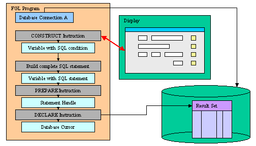

[Back to Contents](../index.html)

------------------------------------------------------------------------

# [Query By Example]{#PAGE_HEADER}

Summary:

- [Basics](#BASICS)
  - [Query Operators](#QUERY_OPERATORS)
- [Syntax](#SYNTAX)
- [Usage](#USAGE)
  - [Programming Steps](#PROG_STEPS)
  - [Instruction Configuration](#INSTRUCTION_CONFIG)
  - [Default Actions](#DEFAULT_ACTIONS)
  - [Control Blocks](#CONTROL_BLOCKS)
  - [Control Blocks Execution Order](#CTRLBLOCK_EXECUTION)
  - [Interaction Blocks](#INTERACTION_BLOCKS)
  - [Control Instructions](#CONTROL_INSTRUCTIONS)
  - [Control Class](#CONTROL_CLASS)
  - [Control Functions](#CONTROL_FUNCTIONS)
- [Examples](#EXAMPLES)
  - [Example 1: Simple CONSTRUCT](#EXAMPLE_1)
  - [Example 2: CONSTRUCT followed by SQL Query](#EXAMPLE_2)

*See also:* [Flow Control](FlowControl.html), [Dynamic
SQL](DynamicSql.html), [Result Sets](ResultSets.html)

------------------------------------------------------------------------

### [Basics]{#BASICS}

#### [What is Query By Example (QBE)?]{#WHATIS}

Query By Example enables a user to query a database by specifying values
(or ranges of values) for screen fields that correspond to the database.
The runtime system converts the search filters entered by the user into
a Boolean SQL condition that can be used in the `WHERE` clause of a
prepared `SELECT` statement.

The `CONSTRUCT` instruction handles Query By Example input in the
[current open form](WindowsAndForms.html) and generates the SQL
condition in a [string variable](Variables.html). You can then use
[Dynamic SQL](DynamicSql.html) instructions to execute the SQL statement
to produce a [result set](ResultSets.html):

{height="288" width="504" border="0"}

#### [Query Operators]{#QUERY_OPERATORS}

The following table lists all relational operators that can be used
during a Query By Example input:

::: {align="center"}
+------------------+-------------------------+-------------------------+
| **Symbol**       | **Meaning**             | **Pattern**             |
+------------------+-------------------------+-------------------------+
| Any simple data type                                                 |
+------------------+-------------------------+-------------------------+
| `=`              | Is Null                 | =                       |
+------------------+-------------------------+-------------------------+
| `==`             | Equal to                | == *value*              |
+------------------+-------------------------+-------------------------+
| `>`              | Greater than            | \> *value*              |
+------------------+-------------------------+-------------------------+
| `>=`             | Greater than or equal   | \>= *value*             |
|                  | to                      |                         |
+------------------+-------------------------+-------------------------+
| `<`              | Less than               | \< *value*              |
+------------------+-------------------------+-------------------------+
| `<=`             | Less than or equal to   | \<= *value*             |
+------------------+-------------------------+-------------------------+
| `<> `*`or`*` !=` | Not equal to            | != *value*, \<\>        |
|                  |                         | *value*                 |
+------------------+-------------------------+-------------------------+
| `: `*`or`*` ..`  | Range                   | *value1*:*value2*,      |
|                  |                         | *value1*..*value2*      |
+------------------+-------------------------+-------------------------+
| `|`              | List of values          | *value1* \| *value2*    |
+------------------+-------------------------+-------------------------+
| Character data types only                                            |
+------------------+-------------------------+-------------------------+
| `*`              | Wildcard for any string | \*x, x\*, \*x\*         |
+------------------+-------------------------+-------------------------+
| `?`              | Single-character        | ?x, x?, ?x?, x??        |
|                  | wildcard                |                         |
+------------------+-------------------------+-------------------------+
| `[`*`c`*`]`      | A set of characters     | \[a-z\]\*, \[xy\]?      |
+------------------+-------------------------+-------------------------+
:::

------------------------------------------------------------------------

### [Syntax]{#SYNTAX}

#### Purpose:

The `CONSTRUCT` instruction handles [Query By Example input](#BASICS).

#### Syntax 1: [Implicit field-to-column mapping]{#CONSTRUCT_BY_NAME}

`CONSTRUCT BY NAME `*[`variable`](#variable)*` ON `*[`column-list`](#column-list)*\
`  `[`[`]{.underline}` ATTRIBUTES ( `[`{`]{.underline}` `*[`display-attribute`](#display-attributes)*` `[`|`]{.underline}` `*[`control-attribute`](#control-attributes)*` `[`}`]{.underline}` `[`[,...]`]{.underline}` ) `[`]`\]{.underline}
`   `[`[`]{.underline}` HELP `*[`help-number`](#help-number)*` `[`]`]{.underline}\
[`[`]{.underline}` `*[`dialog-control-block`](#dialog-control-block)\
` `*` `[`[...]`]{.underline}*\*
` END CONSTRUCT `[`]`]{.underline}

#### Syntax 2: [Explicit field-to-column mapping]{#CONSTRUCT}

`CONSTRUCT `*[`variable`](#variable)*` ON `*[`column-list`](#column-list)*` FROM `*[`field-list`](#field-list)*\
`  `[`[`]{.underline}` ATTRIBUTES ( `[`{`]{.underline}` `*[`display-attribute`](#display-attributes)*` `[`|`]{.underline}` `*[`control-attribute`](#control-attributes)*` `[`}`]{.underline}` `[`[,...]`]{.underline}` ) `[`]`\]{.underline}
`   `[`[`]{.underline}` HELP `*[`help-number`](#help-number)*` `[`]`]{.underline}\
[`[`]{.underline}` `*[`dialog-control-block`](#dialog-control-block)\
` `*` `[`[...]`]{.underline}*\*
` END CONSTRUCT `[`]`]{.underline}

where *[column-list]{#column-list}* defines a list of database columns
as:

[`{`]{.underline}` `*[`column-name`](#column-name)*\
[`|`]{.underline}` `*[`table-name`](#table-name)*`.*`\
[`|`]{.underline}` `*[`table-name`](#table-name)*`.`*[`column-name`](#column-name)*\
[`}`]{.underline}` `[`[,...]`]{.underline}

where *[field-list]{#field-list}* defines a list of fields with one or
more of:

[`{`]{.underline}` `*[`field-name`](#field-name)*\
[`|`]{.underline}` `*[`table-name`](#table-name)*`.*`\
[`|`]{.underline}` `*[`table-name`](#table-name)*`.`*[`field-name`](#field-name)*\
[`|`]{.underline}` `*[`screen-array`](#screen-array)*`[`*[`line`](#screen-array-line)*`].*`\
[`|`]{.underline}` `*[`screen-array`](#screen-array)*`[`*[`line`](#screen-array-line)*`].`*[`field-name`](#field-name)*\
[`|`]{.underline}` `*[`screen-record`](#screen-record)*`.*`\
[`|`]{.underline}` `*[`screen-record`](#screen-record)*`.`*[`field-name`](#field-name)*\
[`}`]{.underline}` `[`[,...]`]{.underline}

where *[dialog-control-block]{#dialog-control-block}* is one of:

[`{`]{.underline}` BEFORE CONSTRUCT`\
[`|`]{.underline}` AFTER CONSTRUCT`\
[`|`]{.underline}` BEFORE FIELD `*[`field-spec`](#field-spec)*` `[`[,...]`]{.underline}\
[`|`]{.underline}` AFTER FIELD `*[`field-spec`](#field-spec)*` `[`[,...]`]{.underline}\
[`|`]{.underline}` ON IDLE `*[`idle-seconds`](#idle-seconds)*\
[`|`]{.underline}` ON ACTION `*[`action-name`](#action-name)*` `[`[`]{.underline}`INFIELD `*[`field-spec`](#field-spec)*[`]`]{.underline}\
[`|`]{.underline}` ON KEY ( `*[`key-name`](#key-name)*` `[`[,...]`]{.underline}` )`\
[`}`\]{.underline}
`    `*[`dialog-statement`](#dialog-statement)*\
`    `[`[...]`]{.underline}

where *[dialog-statement]{#dialog-statement}* is one of :

[`{`]{.underline}` `*[`statement`](#statement)*\
[`|`]{.underline}` NEXT FIELD `[`{`]{.underline}` NEXT `[`|`]{.underline}` PREVIOUS `[`|`]{.underline}` `*[`field-spec`](#field-spec)*` `[`}`]{.underline}\
[`|`]{.underline}` CONTINUE CONSTRUCT`\
[`|`]{.underline}` EXIT CONSTRUCT `\
[`}`]{.underline}

where *[field-spec]{#field-spec}* identifies a unique field with one of:

[`{`]{.underline}` `*[`field-name`](#field-name)*\
[`|`]{.underline}` `*[`table-name`](#table-name)*`.`*[`field-name`](#field-name)*\
[`|`]{.underline}` `*[`screen-array`](#screen-array)*`.`*[`field-name`](#field-name)*\
[`|`]{.underline}` `*[`screen-record`](#screen-record)*`.`*[`field-name`](#field-name)*\
[`}`]{.underline}` `

#### Notes:

1.  *[variable]{#variable}* is the variable that will contain the SQL
    condition built by the `CONSTRUCT` instruction.
2.  The `ON` clause defines the list of [form
    fields](FormSpecFiles.html) in which the user can enter search
    criteria.
3.  *[column-name]{#column-name}* is the identifier of a [database
    column](FormSpecFiles.html#SECTION_ATTRIBUTES) of the [current
    form](WindowsAndForms.html).
4.  *[table-name]{#table-name}* is the identifier of a [database
    table](FormSpecFiles.html#SECTION_TABLES) of the [current
    form](WindowsAndForms.html).
5.  *[field-name]{#field-name}* is the identifier of a
    [field](FormSpecFiles.html#SECTION_ATTRIBUTES) of the [current
    form](WindowsAndForms.html).
6.  The `BY NAME` keyword implicitly maps [form
    fields](FormSpecFiles.html)  to the database columns listed in the
    `ON` clause.
7.  Use the `FROM field-list` clause if you need to map [form
    fields](FormSpecFiles.html) to database columns explicitly.
8.  *[screen-array]{#screen-array}* is the [screen
    array](FormSpecFiles.html#SECTION_INSTRUCTIONS) that will be used in
    the [current form](WindowsAndForms.html).
9.  *[line]{#screen-array-line}* is a screen array line in the form.
10. *[screen-record]{#screen-record}* is the identifier of a [screen
    record](FormSpecFiles.html#SECTION_INSTRUCTIONS) of the [current
    form](WindowsAndForms.html).
11. *[help-number]{#help-number}* is an integer that allows you to
    associate a [help message](MessageFiles.html) number with the
    instruction.
12. *[key-name]{#key-name}* is a hot-key identifier (like `F11` or
    `Control-z`).
13. *[action-name]{#action-name}* identifies an
    [action](InteractionModel.html) that can be executed by the user.
14. *[idle-seconds]{#idle-seconds}* is an [integer
    literal](Literals.html) or [variable](Variables.html) that defines a
    number of seconds.
15. *[statement]{#statement}* is any instruction supported by the
    language.

The following table shows the *options* supported by the `CONSTRUCT`
statement:

::: {align="center"}
  ----------------------------------- ------------------------------------
  **Attribute**                       **Description**

  `HELP `*`help-number`*              Defines the help number when help is
                                      invoked by the user, where
                                      *help-number* is an [integer
                                      literal](Literals.html#LT_INTEGER)
                                      or a [program
                                      variable](Variables.html). **\
                                      Warning:** The HELP *option*
                                      overrides the HELP *attribute*!
  ----------------------------------- ------------------------------------
:::

The following table shows the
*[display-attributes]{#display-attributes}* supported by the `CONSTRUCT`
statement.  The *display-attributes* affect console-based applications
only, they do not affect GUI-based applications.

::: {align="center"}
  --------------------------------------------------------- ----------------------------------------------
  **Attribute**                                             **Description**
  `BLACK, BLUE, CYAN, GREEN, MAGENTA, RED, WHITE, YELLOW`   The TTY color of the entered text.
  `BOLD, DIM, INVISIBLE, NORMAL`                            The TTY font attribute of the entered text.
  `REVERSE, BLINK, UNDERLINE`                               The TTY video attribute of the entered text.
  --------------------------------------------------------- ----------------------------------------------
:::

The following table shows the
*[control-attributes]{#control-attributes}* supported by the `CONSTRUCT`
statement:

::: {align="center"}
  ----------------------------------- --------------------------------------------
  **Attribute**                       **Description**

  `NAME = `*`string`*                 Identifies the dialog statement with a clear
                                      name.

  `HELP `*`= help-number`*            Defines the help number when help is invoked
                                      by the user, where *help-number* is an
                                      [integer literal](Literals.html#LT_INTEGER)
                                      or a [program variable](Variables.html). **\
                                      Warning:** The HELP *option* overrides the
                                      HELP *attribute*!

  `FIELD ORDER FORM`                  Indicates that the tabbing order of fields
                                      is defined by the
                                      [TABINDEX](FSFAttributes.html#FA_TABINDEX)
                                      attribute of form fields.

  `ACCEPT = `*`bool`*                 Indicates if the default *accept* action
                                      should be added to the dialog. If not
                                      specified, the action is registered.

  `CANCEL = `*`bool`*                 Indicates if the default *cancel* action
                                      should be added to the dialog. If not
                                      specified, the action is registered.
  ----------------------------------- --------------------------------------------
:::

------------------------------------------------------------------------

### [Usage]{#USAGE}

The `CONSTRUCT` statement produces an SQL condition corresponding to all
search criteria that a user specifies in the fields. The instruction
fills a character variable with that SQL condition, and you can use the
content of this variable to create the `WHERE` clause of a `SELECT`
statement.

#### Warnings:

1.  The SQL condition is generated according to the current database
    session, which defines the type of the database server. Therefore,
    the program must be [connected](Connections.html) to a database
    server before entering the `CONSTRUCT` block. The generated SQL
    condition is specific to the database server and may not be used
    with other types of servers.
2.  There can be only one `BEFORE CONSTRUCT` and one `AFTER CONSTRUCT`
    in a `CONSTRUCT` block.
3.  `AFTER CONSTRUCT` is not performed if an `EXIT CONSTRUCT` is
    performed, or if  the `Interrupt` or `Quit` key is pressed and a
    [DEFER INTERRUPT](Programs.html#SIGNAL_HANDLING) or [DEFER
    QUIT](Programs.html#SIGNAL_HANDLING)  statement is not in effect..
4.  The [WORDWRAP](FSFAttributes.html#FA_WORDWRAP) field attribute is
    not used by the `CONSTRUCT` instruction.
5.  Make sure that the [INT_FLAG](Programs.html#PV_INT_FLAG) variable is
    set to [FALSE](Programs.html#PC_FALSE) before entering the
    `CONSTRUCT` block.
6.  The `ON KEY` blocks are supported for backward compatibility; use
    `ON ACTION` instead.

#### [Programming Steps]{#PROG_STEPS}

To use the `CONSTRUCT` statement, you must do the following:

1.  Declare a variable with the [DEFINE](Variables.html#VA_DEFINE)
    statement, it can be [CHAR](DataTypes.html#DT_CHAR) or
    [VARCHAR](DataTypes.html#DT_VARCHAR), but
    [STRING](DataTypes.html#DT_STRING) data type is preferred.
2.  Open and display the form, using an [OPEN
    WINDOW](WindowsAndForms.html#OPEN_WINDOW) with the `WITH FORM`
    clause or the [OPEN FORM / DISPLAY
    FORM](WindowsAndForms.html#OPEN_FORM) instructions.
3.  Set the [INT_FLAG](Programs.html#PV_INT_FLAG) variable to
    [FALSE](Programs.html#PC_FALSE).
4.  Describe the `CONSTRUCT` statement if needed, with
    *dialog-control-blocks* to control the environment in which the user
    enters search criteria.
5.  After the interaction statement block, test the
    [INT_FLAG](Programs.html#PV_INT_FLAG) pre-defined variable to check
    if the dialog was canceled ([INT_FLAG](Programs.html#PV_INT_FLAG) =
    [TRUE](Programs.html#PC_TRUE) ) or validated
    ([INT_FLAG](Programs.html#PV_INT_FLAG) =
    [FALSE](Programs.html#PC_FALSE) ). If the `INT_FLAG` variable is
    `TRUE`, you should reset it to `FALSE` to not disturb code that
    relies on this variable to detect interruption events from the GUI
    front-end or TUI console.
6.  If the dialog was validated, execute the query in the database (see
    below). 

The `CONSTRUCT` statement activates the [current
form](WindowsAndForms.html). This is the form most recently displayed
or, if you are using more than one window, the form currently displayed
in the current window. You can specify the current window by using the
[CURRENT WINDOW](FormSpecFiles.html) statement. When the `CONSTRUCT`
statement completes execution, the form is cleared and deactivated.

Screen field tabbing order is defined by the order of the field names in
the `FROM` clause; by default this is the list of column names in the
`ON` clause when no `FROM` clause is specified.

To complete the search functionality of your program, you must implement
the following steps after the `CONSTRUCT` instruction:

1.  Concatenate the [variable](Variables.html) that contains the Boolean
    SQL expression with other strings, to create a string representation
    of an SQL statement to be executed. The Boolean SQL expression
    generated by the `CONSTRUCT` statement is typically used to create
    `SELECT` statements, but it can be used in `DELETE` and `UPDATE`
    statements.
2.  Use the [PREPARE](DynamicSql.html#DS_PREPARE) statement to create an
    executable SQL statement from the character string that was
    generated in the previous step.
3.  Execute the prepared statement in one of the following ways:
    - If the SQL statement produces a [result set](ResultSets.html)
      (like `SELECT`), use a database cursor with
      [DECLARE](ResultSets.html#RS_DECLARE) and
      [FOREACH](ResultSets.html#RS_FOREACH) instructions (or else
      [OPEN](ResultSets.html#RS_OPEN) and
      [FETCH](ResultSets.html#RS_FETCH)) to execute the prepared SQL
      statement.
    - If the SQL statement [does not]{.underline} produce a [result
      set](ResultSets.html) (like `DELETE`), use the
      [EXECUTE](DynamicSql.html#DS_EXECUTE) statement to execute an SQL
      statement.

If no criteria were entered, the string `' 1=1'` is assigned to
*variable*. This is a Boolean SQL expression that always evaluates to
TRUE so that all rows are returned.

After executing the `CONSTRUCT` instruction, the runtime system sets the
[INT_FLAG](Programs.html#PV_INT_FLAG) variable to
[TRUE](Programs.html#PC_TRUE) if the input was canceled by the user.

When the `CONSTRUCT` statement completes execution, the form is cleared.

------------------------------------------------------------------------

#### [Instruction Configuration]{#INSTRUCTION_CONFIG}

The `ATTRIBUTES` clause specifications override all default attributes
and temporarily override any display attributes that the
[OPTIONS](Programs.html#PROGRAM_OPTIONS) or the [OPEN
WINDOW](WindowsAndForms.html#OPEN_WINDOW) statement specified for these
fields. While the `CONSTRUCT` statement is executing, the runtime system
ignores the `INVISIBLE` attribute.

- [HELP option](#HELP_option)
- [FIELD ORDER FORM option](#FIELD_ORDER)
- [ACCEPT option](#ACCEPT_option)
- [CANCEL option](#CANCEL_option)

##### [HELP option]{#HELP_option}

The `HELP` clause specifies the number of a [help
message](MessageFiles.html) to display if the user invokes the help
while the focus is in any field used by the instruction. The predefined
*help* action is automatically created by the runtime system. You can
bind [action views](InteractionModel.html) to the *help* action.

#### **Warnings:**

1.  The HELP *option* overrides the HELP *attribute*!

##### [FIELD ORDER FORM option]{#FIELD_ORDER}

By default, the tabbing order is defined by the column list in the
instruction description. You can control the tabbing order by using the
`FIELD ORDER FORM` attribute: When this attribute is used, the tabbing
order is defined by the [TABINDEX](FSFAttributes.html#FA_TABINDEX)
attribute of the form fields.

##### [ACCEPT option]{#ACCEPT_option}

The `ACCEPT` attribute can be set to [FALSE](Programs.html#PC_FALSE) to
avoid the automatic creation of the *accept* default action. This option
can be used for example when you want to write a specific validation
procedure, by using [ACCEPT CONSTRUCT](#ACCEPT_CONSTRUCT).

##### [CANCEL option]{#CANCEL_option}

The `CANCEL` attribute can be set to [FALSE](Programs.html#PC_FALSE) to
avoid the automatic creation of the *cancel* default action. This is
useful for example when you only need a validation action (*accept*), or
when you want to write a specific cancellation procedure, by using [EXIT
CONSTRUCT](#EXIT_CONSTRUCT).

Note that if the `CANCEL=FALSE` option is set, no *[close
action](InteractionModel.html#XCROSS_CLOSE)* will be created, and you
must write an `ON ACTION close` control block to create an explicit
action.

------------------------------------------------------------------------

#### [Default Actions]{#DEFAULT_ACTIONS}

When an `CONSTRUCT` instruction executes, the runtime system creates a
set of [default actions](InteractionModel.html). See the [control block
execution order](#CTRLBLOCK_EXECUTION) to understand what control blocks
are executed when a specific action is fired.

The following table lists the default actions created for this dialog:

  ----------------------------------- --------------------------------------------
  **Default action**                  **Description**

  `accept`                            Validates the `CONSTRUCT` dialog (validates
                                      field criteria)\
                                      *Creation can be avoided with* `ACCEPT`
                                      *attribute.*

  `cancel`                            Cancels the `CONSTRUCT` dialog (no
                                      validation, INT_FLAG is set)\
                                      *Creation can be avoided with* `CANCEL`
                                      *attribute.*

  `close`                             By default, cancels the `CONSTRUCT` dialog
                                      (no validation, INT_FLAG is set)\
                                      Default action view is hidden. See [Windows
                                      closed by the
                                      user](InteractionModel.html#XCROSS_CLOSE).

  `help`                              Shows the help topic defined by the `HELP`
                                      clause.\
                                      *Only created when a* `HELP` *clause is
                                      defined.*
  ----------------------------------- --------------------------------------------

The `accept` and `cancel` default actions can be avoided with the
`ACCEPT` and `CANCEL` dialog control attributes:

``` linenumber
01  CONSTRUCT BY NAME cond ON field1 ATTRIBUTES (CANCEL=FALSE)
02       ...  
```

------------------------------------------------------------------------

#### [Control Blocks]{#CONTROL_BLOCKS}

- [BEFORE CONSTRUCT block](#BEFORE_CONSTRUCT_block)
- [AFTER CONSTRUCT block](#AFTER_CONSTRUCT_block)
- [BEFORE FIELD block](#BEFORE_FIELD_block)
- [AFTER FIELD block](#AFTER_FIELD_block)

##### [BEFORE CONSTRUCT block]{#BEFORE_CONSTRUCT_block}

Use a `BEFORE CONSTRUCT` block to execute instructions
[before]{.underline} the runtime system gives control to the user for
search criteria input.

##### [AFTER CONSTRUCT block]{#AFTER_CONSTRUCT_block}

Use an `AFTER CONSTRUCT` block to execute instructions
[after]{.underline} the user has finished search criteria input.

##### [BEFORE FIELD block]{#BEFORE_FIELD_block}

A `BEFORE FIELD` block is executed each time the cursor enters into the
specified field, when moving the focus from field to field. The `BEFORE`
`FIELD` block is also executed when using [NEXT FIELD](#NEXT_FIELD).

**Warning: When using the default `FIELD ORDER CONSTRAINT` mode, the
dialog executes the `BEFORE FIELD` block of the field corresponding to
the first variable of the `CONSTRUCT`, even if that field is not
editable ([NOENTRY](FSFAttributes.html#FA_NOENTRY), hidden or disabled).
The block is executed when you enter the dialog. This behavior is
supported for backward compatibility. The block is [not]{.underline}
executed when using the `FIELD ORDER FORM`.**

**Warning: With the `FIELD ORDER FORM` mode, for each dialog executing
the first time with a specific form, the `BEFORE FIELD` block might be
fired for the first field of the initial tabbing list defined by the
form, even if that field was hidden or moved around in a table. The
dialog then behaves as if a `NEXT FIELD first-visible-column` would have
been done in the `BEFORE FIELD` of that field.**

##### [AFTER FIELD block]{#AFTER_FIELD_block}

Use an `AFTER FIELD `*`field-name`* block to execute instructions when
the user moves to another field.

------------------------------------------------------------------------

#### [Interaction Blocks]{#INTERACTION_BLOCKS}

- [ON IDLE block](#ON_IDLE_block)
- [ON ACTION block](#ON_ACTION_block)
- [ON KEY block](#ON_KEY_block)

##### [ON IDLE block]{#ON_IDLE_block}

The `ON IDLE `*`idle-seconds`* clause defines a set of instructions that
must be executed after *idle-seconds* of inactivity. This can be used,
for example, to quit the dialog after the user has not interacted with
the program for a specified period of time. The parameter *idle-seconds*
must be an [integer literal](Literals.html) or
[variable](Variables.html). If it evaluates to zero, the timeout is
disabled.

You should not use the `ON IDLE` trigger with a short timeout period
such as 1 or 2 seconds; The purpose of this trigger is to give the
control back to the program after a relatively long period of inactivity
(10, 30 or 60 seconds). This is typically the case when the end user
leaves the workstation, or got a phone call. The program can then
execute some code before the user gets the control back.

``` linenumber
01 ...
02    ON IDLE 30
03       IF ask_question("Do you want to leave the dialog?") THEN
04          EXIT INPUT
05       END IF
06 ...  
```

##### [ON ACTION block]{#ON_ACTION_block}

You can use `ON ACTION` blocks to execute a sequence of instructions
when the user raises a specific action. This is the preferred solution
compared to `ON KEY` blocks, because `ON ACTION` blocks use abstract
names to control user interaction.

``` linenumber
01 ...
02    ON ACTION zoom
03       CALL zoom_customers() RETURNING st, cust_id, cust_name
04       ...  
```

You can add the [INFIELD
*field-spec*](InteractionModel.html#ON_ACTION_INFIELD) clause to the
`ON ACTION `*`action-name`* statement to make the runtime system
enable/disable the action automatically when the focus enters/leaves the
specified field:

``` linenumber
01    ON ACTION zoom INFIELD customer_city
02       LET rec.customer_city = zoom_city()  
```

For more details about `ON ACTION` and binding action views, see
[Interaction Model](InteractionModel.html#CTRLGACTIONS).

##### [ON KEY block]{#ON_KEY_block}

For backward compatibility, you can use `ON KEY` blocks to execute a
sequence of instructions when the user presses a specific key. The
following key names are accepted by the compiler:

::: {align="center"}
  --------------------------- -----------------------------------------------------------------------------------------
  **Key Name**                **Description**
  `ACCEPT`                    The validation key.
  `INTERRUPT`                 The interruption key.
  `ESC` or `ESCAPE`           The ESC key (not recommended, use `ACCEPT` instead).
  `TAB`                       The TAB key (not recommended).
  `Control-`*`char`*          A control key where *char* can be any character except A, D, H, I, J, K, L, M, R, or X.
  `F1` through `F255`         A function key.
  `DELETE`                    The key used to delete a new row in an array.
  `INSERT`                    The key used to insert a new row in an array.
  `HELP`                      The help key.
  `LEFT`                      The left arrow key.
  `RIGHT`                     The right arrow key.
  `DOWN`                      The down arrow key.
  `UP`                        The up arrow key.
  `PREVIOUS` or `PREVPAGE`    The previous page key.
  `NEXT` or `NEXTPAGE`        The next page key.
  --------------------------- -----------------------------------------------------------------------------------------
:::

An `ON KEY` block defines one to four different action objects that will
be identified by the key name in lowercase
(`ON KEY(F5,F6) = creates Action f5 + Action f6`). Each action object
will get an *acceleratorName* assigned. In
[GUI](FglTerms.html#GRAPHICAL_USER_INTERFACE) mode, Action Defaults are
applied for `ON KEY` actions by using the name of the key. You can
define secondary accelerator keys, as well as default decoration
attributes like button text and image, by using the key name as action
identifier. Note that the action name is always in lowercase letters.
See [Action Defaults](ActionDefaults.html) for more details.

**Warning: Check carefully the `ON KEY CONTROL-?` statements because
they may result in having duplicate accelerators for multiple actions
due to the accelerators defined by [Action
Defaults](ActionDefaults.html). Additionally, `ON KEY` statements used
with `ESC`, `TAB`, `UP`, `DOWN`, `LEFT`, `RIGHT`, `HELP`, ` NEXT`,
`PREVIOUS`, `INSERT`, `CONTROL-M`, `CONTROL-X`, `CONTROL-V`, `CONTROL-C`
and `CONTROL-A` should be avoided for use in GUI programs, because it\'s
very likely to clash with default accelerators defined in the Action
Defaults.**

By default, `ON KEY` actions are not decorated with a default button in
the action frame (i.e. [default action
view](InteractionModel.html#DEFAULT_ACTION_VIEWS)). You can show the
default button by configuring a `text` attribute with the [Action
Defaults](ActionDefaults.html#ACTDEFTEXT).

------------------------------------------------------------------------

#### [Control Block Execution Order]{#CTRLBLOCK_EXECUTION}

The following table shows the order in which the runtime system executes
the control blocks in the `CONSTRUCT` instruction, according to the user
action:

::: {align="center"}
+-----------------------------------+-----------------------------------+
| **Context / User action**         | **Control Block execution order** |
+-----------------------------------+-----------------------------------+
| Entering the dialog               | 1.  `BEFORE CONSTRUCT`            |
|                                   | 2.  `BEFORE FIELD` (first field)  |
+-----------------------------------+-----------------------------------+
| Moving from field A to field B    | 1.  `AFTER FIELD` (for field A)   |
|                                   | 2.  `BEFORE FIELD` (for field B)  |
+-----------------------------------+-----------------------------------+
| Validating the dialog             | 1.  `AFTER FIELD`                 |
|                                   | 2.  `AFTER CONSTRUCT`             |
+-----------------------------------+-----------------------------------+
| Canceling the dialog              | 1.  `AFTER CONSTRUCT`             |
+-----------------------------------+-----------------------------------+
:::

------------------------------------------------------------------------

#### [Control Instructions]{#CONTROL_INSTRUCTIONS}

- [CONTINUE CONSTRUCT](#CONTINUE_CONSTRUCT)
- [EXIT CONSTRUCT](#EXIT_CONSTRUCT)
- [ACCEPT CONSTRUCT](#ACCEPT_CONSTRUCT)
- [NEXT FIELD](#NEXT_FIELD)

##### [Continuing the dialog]{#CONTINUE_CONSTRUCT}: CONTINUE CONSTRUCT

`CONTINUE CONSTRUCT` skips all subsequent statements in the current
control block and gives the control back to the dialog. This instruction
is useful when program control is nested within multiple conditional
statements, and you want to return the control to the dialog. Note that
if this instruction is called in a control block that is not
`AFTER CONSTRUCT`, further control blocks might be executed according to
the context. Actually, `CONTINUE CONSTRUCT` just instructs the dialog to
continue as if the code in the control block was terminated (i.e. it\'s
a kind of `GOTO end_of_control_block`). However, when executed in
`AFTER CONSTRUCT`, the focus returns to the most recently occupied field
in the current form, giving the user another chance to enter data in
that field. In this case the `BEFORE FIELD` of the current field will be
fired.

Note that you can also use the `NEXT FIELD` control instruction to give
the focus to a specific field and force the dialog to continue. However,
unlike `CONTINUE CONSTRUCT`, the `NEXT FIELD` instruction will also skip
the further control blocks that are normally executed.

##### [Leaving the dialog]{#EXIT_CONSTRUCT}: EXIT CONSTRUCT

`EXIT CONSTRUCT` terminates the `CONSTRUCT` instruction without
executing any other statement.

##### [Validating the dialog]{#ACCEPT_CONSTRUCT}: ACCEPT CONSTRUCT

The `ACCEPT CONSTRUCT` instruction validates the `CONSTRUCT` instruction
and exits the `CONSTRUCT` instruction if no error is raised. The
`AFTER FIELD` and `AFTER CONSTRUCT` control blocks will be executed.
Statements after the `ACCEPT CONSTRUCT` will not be executed.

##### [Moving to a field]{#NEXT_FIELD}: NEXT FIELD

The `NEXT FIELD `*`field-name`* instruction gives the focus to the
specified field. You typically use this instruction to control field
input dynamically, in `BEFORE FIELD` or `AFTER FIELD` blocks.

Abstract field identification is supported with the `CURRENT`, `NEXT`
and `PREVIOUS` keywords. These keywords represent  the current, next and
previous fields respectively. When using `FIELD ORDER FORM`, the `NEXT`
and `PREVIOUS` options follow the tabbing order defined by the form.
Otherwise, they follow the order defined by the input binding list (with
the `FROM` or `BY NAME` clause). Note that when selecting a non-editable
field with `NEXT FIELD NEXT`, the runtime system will re-select the
current field since it is the next editable field in the dialog. As a
result the end user sees no change.

Non-editable fields are fields defined with the
[NOENTRY](FSFAttributes.html#FA_NOENTRY) attribute, fields disabled with
[ui.Dialog.setFieldActive(\"*field-name*\",
FALSE)](ClassDialog.html#setFieldActive), or fields using a widget that
does not allow input, such as a
[LABEL](FormSpecFiles.html#FF_ITEMTYPE_LABEL). If a `NEXT FIELD`
instruction selects a non-editable field, the next editable field gets
the focus (defined by the [FIELD ORDER](#FIELD_ORDER) mode used by the
dialog). However, the `BEFORE FIELD` and `AFTER FIELD` blocks of
non-editable fields are executed when a `NEXT FIELD` instruction selects
such a field.

------------------------------------------------------------------------

#### [Control Class]{#CONTROL_CLASS}

Inside the dialog instruction, the predefined keyword `DIALOG`
represents the current dialog object. It can be used to execute methods
provided in the [dialog](ClassDialog.html) built-in class.

For example, you can enable or disable an action with the
[ui.Dialog.setActionActive()](ClassDialog.html#setActionActive) dialog
method, or you can hide and show the default action view with
[ui.Dialog.setActionHidden()](ClassDialog.html#setActionHidden):

``` linenumber
01 ...
02    BEFORE CONSTRUCT
03       CALL DIALOG.setActionActive("refresh",FALSE)
04    AFTER FIELD field1
05       CALL DIALOG.setActionHidden("refresh",1)  
```

The [ui.Dialog.setFieldActive()](ClassDialog.html#setFieldActive) method
can be used to enable or disable a field during the dialog. This
instruction takes an integer expression as argument.

``` linenumber
01 ...
02    ON CHANGE custid
03       CALL DIALOG.setFieldActive( "custaddr", FALSE )
04 ...  
```

------------------------------------------------------------------------

#### [Control Functions]{#CONTROL_FUNCTIONS}

The language provides several [built-in
functions](BuiltInFunctions.html) and [operators](Operators.html) to use
in an `CONSTRUCT` statement. You can access the field buffers and
keystroke buffers with:

- [FIELD_TOUCHED()](Operators.html#OP_FIELD_TOUCHED)
- [GET_FLDBUF()](Operators.html#OP_GET_FLDBUF)
- [INFIELD()](Operators.html#OP_INFIELD)
- [FGL_DIALOG_GETFIELDNAME()](BuiltInFunctions.html#BF_FGL_DIALOG_GETFIELDNAME)
- [FGL_DIALOG_GETBUFFER()](BuiltInFunctions.html#BF_FGL_DIALOG_GETBUFFER)
- [FGL_DIALOG_SETBUFFER()](BuiltInFunctions.html#BF_FGL_DIALOG_SETBUFFER)

------------------------------------------------------------------------

### [Examples]{#EXAMPLES}

#### [Example 1: Simple CONSTRUCT]{#EXAMPLE_1}

Form definition in the *const.per* file:

``` linenumber
01 DATABASE formonly
02 
03 LAYOUT
04 GRID
05 {
06     FirstName  [f001     ]
07     LastName   [f002     ]
08     e-Mail     [f003     ]
09 }
10 END
11 END
12 
13 ATTRIBUTES
14 f001 = formonly.field1 TYPE CHAR;
15 f002 = formonly.field2 TYPE CHAR;
16 f003 = formonly.field3 TYPE CHAR;
17 END  
```

Program:

``` linenumber
01 MAIN
02     DEFINE condition STRING
03     DATABASE stores
04     OPEN FORM f1 FROM "const"
05     DISPLAY FORM f1
06     CONSTRUCT condition
07         ON first_name, last_name, mail
08         FROM field1, field2, field3
09     DISPLAY condition
10 END MAIN  
```

#### [Example 2: CONSTRUCT followed by SQL Query]{#EXAMPLE_2}

Form definition in the *const.per* file:

``` linenumber
01 DATABASE stores
02 
03 LAYOUT
04 GRID
05 {
06     FirstName  [f001     ]
07     LastName   [f002     ]
08 }
09 END
10 END
11 
12 TABLES
13 customer
14 END
15 
16 ATTRIBUTES
17 f001 = customer.first_name;
18 f002 = customer.last_name;
19 END  
```

Program:

``` linenumber
01 MAIN
02 
03     DEFINE condition STRING
04     DEFINE statement STRING
05     DEFINE cust RECORD
06                first_name CHAR(30),
07                last_name CHAR(30)
08           END RECORD 
09     
10     DATABASE stores
11     
12     OPEN FORM f1 FROM "const"
13     DISPLAY FORM f1
14     
15     CONSTRUCT BY NAME condition ON first_name, last_name
16        BEFORE CONSTRUCT
17           DISPLAY "A*" TO first_name
18           DISPLAY "B*" TO last_name
19     END CONSTRUCT
20     
21     LET statement = 
22     "SELECT first_name, last_name FROM customer WHERE " || condition
23     DISPLAY "SQL : " || statement
24     
25     PREPARE s1 FROM statement
26     DECLARE c1 CURSOR FOR s1
27     FOREACH c1 INTO cust.*
28         DISPLAY cust.*
29     END FOREACH
30 
31 END MAIN 
```
