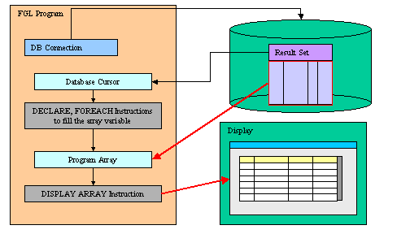
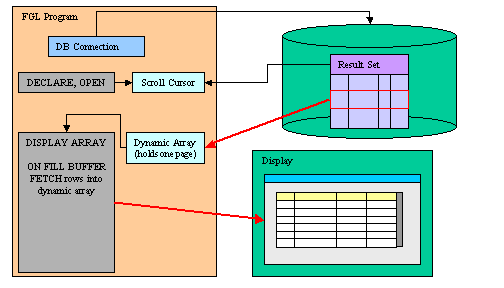

[Back to Contents](../index.html)

------------------------------------------------------------------------

# [Array Display]{#PAGE_HEADER}

Summary:

- [Basics](#BASICS)
  - [The full list mode](#FULLMODE)
  - [The paged mode](#PAGEDMODE)
  - [Built-in sort](#BUILT_IN_SORT)
  - [Multi-range selection](#MULTI_RANGE_SELECTION)
  - [Tree-view lists](#TREE_VIEWS)
  - [Drag and Drop](#DRAG_AND_DROP)
- [Syntax](#SYNTAX)
- [Usage](#USAGE)
  - [Programming Steps](#PROG_STEPS)
  - [Variable Binding](#VARIABLE_BINDING)
  - [Instruction Configuration](#INSTRUCTION_CONFIG)
  - [Default Actions](#DEFAULT_ACTIONS)
  - [Data Blocks](#DATA_BLOCKS)
  - [Control Blocks](#CONTROL_BLOCKS)
  - [Control Blocks Execution Order](#CTRLBLOCK_EXECUTION)
  - [Interaction Blocks](#INTERACTION_BLOCKS)
  - [Control Instructions](#CONTROL_INSTRUCTIONS)
  - [Control Class](#CONTROL_CLASS)
  - [Control Functions](#CONTROL_FUNCTIONS)
- [Scrolling Rows Up and Down](#SCROLL) (`SCROLL`)
- [Examples](#EXAMPLES)
  - [Full list mode example](#EXAMPLE1)
  - [Paged mode example](#EXAMPLE2)

*See also:* [Arrays](Arrays.html), [Records](Records.html), [Result
Sets](ResultSets.html), [Programs](Programs.html),
[Windows](WindowsAndForms.html), [Forms](FormSpecFiles.html), [Input
Array](InputArray.html)

------------------------------------------------------------------------

### [Basics]{#BASICS}

With `DISPLAY ARRAY`, you can let the user browse a list of records,
using a [static or dynamic array](Arrays.html) as the data buffer. The
`DISPLAY ARRAY` instruction can work in *[full list](#FULLMODE)* mode or
in *[paged](#PAGEDMODE)* mode. In *full list* mode, you must copy all
the data you want to display into the array. In *paged* mode, you
provide data rows dynamically during the dialog, using a dynamic array
to hold one page of data. The *full list* mode should be used for a
short and static list of rows, while the *paged* mode can be used for an
infinite number of rows. Additionally, the *paged* mode allows you to
fetch fresh data from the database.

#### [The full list mode]{#FULLMODE}

In *full list* mode, the `DISPLAY ARRAY` instruction uses a [static or
dynamic program array](Arrays.html) defined with a [record
structure](Records.html) corresponding to (or to a part of ) a
[screen-array](FormSpecFiles.html#SECTION_INSTRUCTIONS) of a
[form](FormSpecFiles.html). The program array is filled with data rows
before `DISPLAY ARRAY` is executed. In this case, the list is static and
cannot be updated until the instruction is exited.

{border="0" width="504" height="288"}

#### [The paged mode]{#PAGEDMODE} {#the-paged-mode align="left"}

In *paged* mode, the `DISPLAY ARRAY` instruction uses a [dynamic program
array](Arrays.html) defined with a [record structure](Records.html)
corresponding to (or to a part of ) a
[screen-array](FormSpecFiles.html#SECTION_INSTRUCTIONS) of a
[form](FormSpecFiles.html). The total number of rows is defined by the
`COUNT` attribute, which can be -1 to specify an infinite or undefined
number of rows when the dialog starts. The program array is filled
dynamically with data rows *as needed* during the `DISPLAY ARRAY`
execution. The `ON FILL BUFFER` clause is required, to feed the
`DISPLAY ARRAY` instruction with pages of data. The statements in the
`ON FILL BUFFER` clause are executed automatically by the runtime system
each time a new page of data is needed.

{border="0" width="504" height="288"}

#### Warnings:

1.  With paged mode, the user cannot sort data by clicking on a column
    header.
2.  [Multi-range selection](#MULTI_RANGE_SELECTION) is not supported if
    the paged mode uses an undefined number of rows (COUNT=-1).
3.  It is not possible to use a [treeview](TreeViews.html) with the
    paged mode, treeviews can be filled dynamically with `ON EXPAND` /
    `ON COLLAPSE` triggers.

#### [Built-in sort]{#BUILT_IN_SORT} {#built-in-sort align="left"}

The `DISPLAY ARRAY` dialog implements built-in row sorting which can be
used if the dialog is combined with a
[TABLE](FormSpecFiles.html#FF_CONTAINER_TABLE) or a
[TREE](FormSpecFiles.html#FF_CONTAINER_TREE) container; when the end
user clicks on a column header of the table, the rows are automatically
sorted in ascending or descending order.

For more details about the built-in sort feature, see the [Multiple
Dialogs page](MultipleDialogs.html#table-sort).

#### [Multi-range selection]{#MULTI_RANGE_SELECTION} {#multi-range-selection align="left"}

`DISPLAY ARRAY` can support multiple row selection with the
[ui.Dialog.setSelectionMode()](ClassDialog.html#setSelectionMode)
method. By default, the `DISPLAY ARRAY` instruction highlights only the
current row. When multi-row selection is enabled, the end user can
select one or several rows with the standard keyboard and mouse click
combinations. The program can then query the DIALOG class for selected
rows.

#### [Tree-View lists]{#TREE_VIEWS} {#tree-view-lists align="left"}

`DISPLAY ARRAY` can be used to implement the controller for a tree-view
list widget. The tree node structure is defined by the program array
rows, and the form must define a `TREE` container.

See the [Tree Views](TreeViews.html) page for more details.

#### [Drag and Drop]{#DRAG_AND_DROP} {#drag-and-drop align="left"}

`DISPLAY ARRAY` supports new control blocks to implement drag & drop
operations.

See the [Drag and Drop](DragAndDrop.html) page for more details.

------------------------------------------------------------------------

### [DISPLAY ARRAY]{#DISPLAY_ARRAY}

#### Purpose:

The ` DISPLAY ARRAY` instruction controls the display of a program array
on the screen.

#### [Syntax:]{#SYNTAX}

`DISPLAY ARRAY `*[`array`](#array)*` TO `*[`screen-array`](#screen-array)*`.*`\
`  `[`[`]{.underline}` HELP `*[`help-number`](#help-number)*` `[`]`\]{.underline}
`   `` `[`[`]{.underline}` ATTRIBUTES ( `[`{`]{.underline}` `*[`display-attribute`](#display-attributes)*` `[`|`]{.underline}` `*[`control-attribute`](#control-attributes)*` `[`}`]{.underline}` `[`[,...]`]{.underline}` `` ) `[`]`\
`[`]{.underline}` `*[`dialog-control-block`](#dialog-control-block)\
` `*` `[`[...]`]{.underline}*\*
` END DISPLAY `[`]`]{.underline}

where *[dialog-control-block]{#dialog-control-block}* is one of :

` `[`{`]{.underline}` BEFORE DISPLAY`\
[`|`]{.underline}` AFTER DISPLAY`\
[`|`]{.underline}` BEFORE ROW`\
[`|`]{.underline}` AFTER ROW`\
[`|`]{.underline}` ON IDLE `*[`idle-seconds`](#idle-seconds)*\
[`|`]{.underline}` ON ACTION `*[`action-name`](#action-name)*\
[`|`]{.underline}` ON FILL BUFFER`\
[`|`]{.underline}` ON EXPAND ( `*[`row-index`](#row-index)*` )`\
[`|`]{.underline}` ON COLLAPSE ( `*[`row-index`](#row-index)*` )`\
[`|`]{.underline}` ON DRAG_START ( `*[`dnd-object`](#dnd-object)*` )`\
[`|`]{.underline}` ON DRAG_FINISH ( `*[`dnd-object`](#dnd-object)*` )`\
[`|`]{.underline}` ON DRAG_ENTER ( `*[`dnd-object`](#dnd-object)*` )`\
[`|`]{.underline}` ON DRAG_OVER ( `*[`dnd-object`](#dnd-object)*` )`\
[`|`]{.underline}` ON DROP ( `*[`dnd-object`](#dnd-object)*` )`\
[`|`]{.underline}` ON KEY ( `*[`key-name`](#key-name)*` `[`[,...]`]{.underline}` )`\
[`}`\]{.underline}
`     `*[`dialog-statement`](#dialog-statement)*\
`    `[`[...]`]{.underline}

where *[dialog-statement]{#dialog-statement}* is one of :

` `[`{`]{.underline}` `*[`statement`](#statement)\*
` `[`|`]{.underline}` EXIT DISPLAY`\
[`|`]{.underline}` CONTINUE DISPLAY`\
[`|`]{.underline}` ACCEPT DISPLAY`\
[`}`]{.underline}

#### Notes:

1.  *[array]{#array}* is a [static or dynamic array](Arrays.html)
    containing the records you want to display.
2.  *[screen-array]{#screen-array}* is the name of the [screen
    array](FormSpecFiles.html#SECTION_INSTRUCTIONS) used to display
    data.
3.  *[help-number]{#help-number}* is an integer that associates a [help
    message](MessageFiles.html) number with the instruction.
4.  *[key-name]{#key-name}* is an hot-key identifier (such as `F11` or
    `Control-z`).
5.  *[action-name]{#action-name}* identifies an
    [action](InteractionModel.html) that can be executed by the user.
6.  *[idle-seconds]{#idle-seconds}* is an [integer
    literal](Literals.html) or [variable](Variables.html) that defines a
    number of seconds.
7.  *[row-index]{#row-index}* identifies the program variable which
    holds the row index corresponding to the [tree node](TreeViews.html)
    that has been expanded or collapsed.
8.  *[dnd-object]{#dnd-object}* references a
    [ui.DragDrop](ClassDragDrop.html) variable defined in the scope of
    the dialog.
9.  *[statement]{#statement}* is any instruction supported by the
    language.

The following table shows the
*[display-attributes]{#display-attributes}* supported by the
`DISPLAY ARRAY` statement. The *display-attributes* affect console-based
applications only, they do not affect GUI-based applications.

::: {align="center"}
  --------------------------------------------------------- ------------------------------------------------
  **Attribute**                                             **Description**
  `BLACK, BLUE, CYAN, GREEN, MAGENTA, RED, WHITE, YELLOW`   The TTY color of the displayed data.
  `BOLD, DIM, NORMAL`                                       The TTY font attribute of the displayed data.
  `REVERSE, BLINK, UNDERLINE`                               The TTY video attribute of the displayed data.
  --------------------------------------------------------- ------------------------------------------------
:::

The following table shows the
*[control-attributes]{#control-attributes}* supported by the
`DISPLAY ARRAY` statement:

::: {align="center"}
  --------------------------------------------------------------------- ---------------------------------------------------
  **Attribute**                                                         **Description**

  `COUNT = `*`row-count`*                                               Defines the number of data rows when using a static
                                                                        array or the total number of rows when using the
                                                                        paged mode (can be -1 for infinite). *row-count*
                                                                        can be an [integer
                                                                        literal](Literals.html#LT_INTEGER) or a [program
                                                                        variable](Variables.html). This is the equivalent
                                                                        of the
                                                                        [SET_COUNT()](BuiltInFunctions.html#BF_SET_COUNT)
                                                                        built-in function.

  `HELP = `*`int-expr`*                                                 Defines the help number when help is invoked by the
                                                                        user.

  `KEEP CURRENT ROW `[`[`]{.underline}`=`*`bool`*[`]`]{.underline}` `   Keeps current row highlighted after execution of
                                                                        the instruction.\
                                                                        Note: This attribute is not available in DIALOG
                                                                        instruction.

  `UNBUFFERED `[`[`]{.underline}` =`*`bool`*[`]`]{.underline}` `        Indicates that the dialog must be sensitive to
                                                                        program variable changes. The *bool* parameter can
                                                                        be an [integer literal](Literals.html#LT_INTEGER)
                                                                        or a [program variable](Variables.html).

  `CANCEL = `*`bool`*` `                                                Indicates if the default *cancel* action should be
                                                                        added to the dialog. If not specified, the action
                                                                        is registered.

  `ACCEPT = `*`bool`*` `                                                Indicates if the default *accept* action should be
                                                                        added to the dialog. If not specified, the action
                                                                        is registered.
  --------------------------------------------------------------------- ---------------------------------------------------
:::

------------------------------------------------------------------------

### [Usage:]{#USAGE}

#### Warnings:

1.  Make sure that the [INT_FLAG](Programs.html#PV_INT_FLAG) variable is
    set to [FALSE](Programs.html#PC_FALSE) before entering the
    `DISPLAY ARRAY` block.
2.  The `INVISIBLE` attribute is ignored.
3.  While the `ON KEY` block is supported for backward compatibility, it
    is recommended that you use `ON ACTION` instead.

#### [Programming Steps]{#PROG_STEPS}

The following steps describe how to use the `DISPLAY ARRAY` statement:

1.  Create a [form specification file](FormSpecFiles.html) containing a
    [screen array](FormSpecFiles.html#SECTION_INSTRUCTIONS). The screen
    array identifies the presentation elements to be used by the runtime
    system to display the rows.
2.  Make sure that the program controls interruption handling with
    [DEFER INTERRUPT](Programs.html#SIGNAL_HANDLING), to manage the
    validation/cancellation of the interactive dialog.
3.  Define an [array of records](Arrays.html) with the
    [DEFINE](Variables.html) instruction. The members of the program
    array must correspond to the elements of the screen array, by number
    and data types. You can use a static or a dynamic array for a [full
    list](#FULLMODE) mode, but you must use a dynamic array for a
    [paged](#PAGEDMODE) mode.
4.  Open and display the form, using an [OPEN
    WINDOW](WindowsAndForms.html#OPEN_WINDOW) with the `WITH FORM`
    clause or the [OPEN FORM / DISPLAY
    FORM](WindowsAndForms.html#OPEN_FORM) instructions.
5.  If you want to use the full list mode, fill the program array with
    data, for example with a [result set cursor](ResultSets.html),
    counting the number of program records being filled with retrieved
    data.
6.  Set the [INT_FLAG](Programs.html#PV_INT_FLAG) variable to
    [FALSE](Programs.html#PC_FALSE).
7.  Write the `DISPLAY ARRAY` statement block. When using a [static
    array](Arrays.html), specifying the number of rows with the `COUNT`
    attribute in the `ATTRIBUTES` clause.
8.  If you want to use the paged mode, define the total number of rows
    with the `COUNT` attribute (can be -1 for infinite number of rows),
    and add the `ON FILL BUFFER` clause inside the instruction, and
    write the code to fill the dynamic array with the expected rows from
    `fgl_dialog_getBufferStart()` to `fgl_dialog_getBufferLength()`.
9.  If multi-row selection is needed, call the
    [ui.Dialog.setSelectionMode()](ClassDialog.html#setSelectionMode)
    method in `BEFORE DISPLAY` to enable this mode.
10. Inside the `DISPLAY ARRAY` statement, control the behavior of the
    selection list with `BEFORE DISPLAY`, `BEFORE ROW`, `AFTER ROW`,
    `AFTER DISPLAY` and `ON KEY` blocks.
11. After the interaction statement block, test the
    [INT_FLAG](Programs.html#PV_INT_FLAG) pre-defined variable to check
    if the dialog was canceled ([INT_FLAG](Programs.html#PV_INT_FLAG) =
    [TRUE](Programs.html#PC_TRUE) ) or validated
    ([INT_FLAG](Programs.html#PV_INT_FLAG) =
    [FALSE](Programs.html#PC_FALSE) ). If the `INT_FLAG` variable is
    `TRUE`, you should reset it to `FALSE` to not disturb code that
    relies on this variable to detect interruption events from the GUI
    front-end or TUI console.
12. If needed, get the selected row with the
    [ARR_CURR()](BuiltInFunctions.html#BF_ARR_CURR) built-in function.

------------------------------------------------------------------------

#### [Variable Binding]{#VARIABLE_BINDING}

The ` DISPLAY ARRAY` statement binds the members of the [array of
record](Arrays.html) to the [screen array
fields](FormSpecFiles.html#SECTION_ATTRIBUTES) specified with the `TO`
keyword. Array members and screen array fields are bound [by
position]{.underline} (i.e. not by name). The number of variables in
each record of the program array must be the same as the number of
fields in each screen record (that is, in a single row of the screen
array).

**Warning: Keep in mind that array members are bound to screen array
fields by position, so you must make sure that the members of the array
are defined in the same order as the screen array fields.**

When using the `UNBUFFERED` attribute, the instruction is sensitive to
program variable changes. This means that you do not have to `DISPLAY`
the values; setting the program variable used by the dialog
automatically displays the data into the corresponding form field.

``` linenumber
01 ...
02    ON ACTION change
03       LET arr[arr_curr()].field1 = newValue()
04 ...
```

If the program array has the same structure as a database table (this is
the case when the array is defined with a
[LIKE](Variables.html#VA_DEFINE) clause), you may not want to
display/use some of the columns. You can achieve this by used [PHANTOM
fields](FormSpecFiles.html#FF_PHANTOM_FIELDS) in the screen array
definition. Phantom fields will only be used to bind program variables,
and will not be transmitted to the front-end for display.

------------------------------------------------------------------------

#### [Instruction Configuration]{#INSTRUCTION_CONFIG}

The ` ATTRIBUTES` clause specifications override all default attributes
and temporarily override any display attributes that the
[OPTIONS](Programs.html#PROGRAM_OPTIONS) or the [OPEN
WINDOW](WindowsAndForms.html#OPEN_WINDOW) statement specified for these
fields. While the `DISPLAY ARRAY` statement is executing, the runtime
system ignores the `INVISIBLE` attribute.

- [HELP option](#HELP_option_)
- [COUNT option](#COUNT_option)
- [KEEP CURRENT ROW option](#KEEP_CURRENT_ROW_option)
- [ACCEPT option](#ACCEPT_option)
- [CANCEL option](#CANCEL_option)

##### [HELP option]{#HELP_option_}

The `HELP` clause specifies the number of a [help
message](MessageFiles.html) to display if the user invokes the help
while executing the instruction. The predefined *help* action is
automatically created by the runtime system. You can bind [action
views](InteractionModel.html) to the \'help\' action.

#### **Warnings:**

1.  The HELP *option* overrides the HELP *attribute*!

##### [COUNT option]{#COUNT_option}

When using a [dynamic array](Arrays.html), the number of rows to be
displayed is defined by the number of elements in the dynamic array; the
`COUNT` attribute is ignored.

When using a [static array](Arrays.html) or the [paged
mode](#PAGEDMODE), the number of rows to be displayed is defined by the
`COUNT` attribute. You can also use the
[SET_COUNT()](BuiltInFunctions.html#BF_SET_COUNT) built-in function, but
it is supported for backward compatibility only. If you don\'t know the
total number of rows for the paged mode, you can specify -1 for the
` COUNT` attribute (or in the SET_COUNT() call before the dialog block):
With `COUNT=-1`, the dialog will ask for rows by executing
`ON FILL BUFFER` until you provide less rows as asked, or if you reset
the number of rows to a value higher as -1 with
[ui.Dialog.setArrayLength()](ClassDialog.html#setArrayLength). 

##### [KEEP CURRENT ROW option]{#KEEP_CURRENT_ROW_option}

Depending on the list container used in the form, the current row may be
highlighted during the execution of the dialog, and cleared when the
instruction ends. You can change this default behavior by using the
`KEEP CURRENT ROW` attribute, to force the runtime system to keep the
current row highlighted.

##### [ACCEPT option]{#ACCEPT_option}

The `ACCEPT` attribute can be set to [FALSE](Programs.html#PC_FALSE) to
avoid the automatic creation of the *accept* default action. Use this
attribute when you want to write a specific validation procedure by
using [ACCEPT DISPLAY](#ACCEPT_DISPLAY).

##### [CANCEL option]{#CANCEL_option}

The `CANCEL` attribute can be set to [FALSE](Programs.html#PC_FALSE) to
avoid the automatic creation of the *cancel* default action. Use this
attribute when you only need a validation action (accept), or when you
want to write a specific cancellation procedure by using [EXIT
DISPLAY](#EXIT_DISPLAY).

Note that if the `CANCEL=FALSE` option is set, no *[close
action](InteractionModel.html#XCROSS_CLOSE)* will be created, and you
must write an `ON ACTION close` control block to create an explicit
action.

------------------------------------------------------------------------

#### [Default Actions]{#DEFAULT_ACTIONS}

When an `DISPLAY ARRAY` instruction executes, the runtime system creates
a set of [default actions](InteractionModel.html). See the [control
block execution order](#CTRLBLOCK_EXECUTION) to understand what control
blocks are executed when a specific action is fired.

The following table lists the default actions created for this dialog:

  ----------------------------------- --------------------------------------------
  **Default action**                  **Description**

  `accept`                            Validates the `DISPLAY ARRAY` dialog
                                      (validates current row selection)\
                                      *Creation can be avoided with* `ACCEPT`
                                      *attribute.*

  `cancel`                            Cancels the `DISPLAY ARRAY` dialog (no
                                      validation, INT_FLAG is set)\
                                      *Creation can be avoided with* `CANCEL`
                                      *attribute.*

  `close `                            By default, cancels the `DISPLAY ARRAY`
                                      dialog (no validation, INT_FLAG is set)\
                                      Default action view is hidden. See [Windows
                                      closed by the
                                      user](InteractionModel.html#XCROSS_CLOSE).

  `help`                              Shows the help topic defined by the `HELP`
                                      clause.\
                                      *Only created when a* ` HELP` *clause is
                                      defined.*

  `nextrow`                           Moves to the next row in a list displayed in
                                      one row of fields.\
                                      *Only created if* `DISPLAY ARRAY` *used with
                                      a screen record having only one row.*

  `prevrow`                           Moves to the previous row in a list
                                      displayed in one row of fields.\
                                      *Only created if* `DISPLAY ARRAY` *used with
                                      a screen record having only one row.*

  `firstrow`                          Moves to the first row in a list displayed
                                      in one row of fields.\
                                      *Only created if* `DISPLAY ARRAY` *used with
                                      a screen record having only one row.*

  `lastrow`                           Moves to the last row in a list displayed in
                                      one row of fields.\
                                      *Only created if* `DISPLAY ARRAY` *used with
                                      a screen record having only one row.*
  ----------------------------------- --------------------------------------------

The `accept` and `cancel` default actions can be avoided with the
`ACCEPT` and `CANCEL` dialog control attributes:

``` linenumber
01  DISPLAY ARRAY arr TO sr.* ATTRIBUTES( CANCEL=FALSE, ... )
02       ...
```

------------------------------------------------------------------------

#### [Data Blocks]{#DATA_BLOCKS}

Data blocks are dialog triggers which are fired when the dialog
controller needs data to feed the view with values. Such blocks are
typically used when record list data is provided dynamically, with the
paged mode of when implementing dynamic tree-views.

- [ON FILL BUFFER block](#ON_FILL_BUFFER_block)
- [ON EXPAND block](#ON_EXPAND_block)
- [ON COLLAPSE block](#ON_COLLAPSE_block)

##### [ON FILL BUFFER block]{#ON_FILL_BUFFER_block}

The `ON FILL BUFFER` block is used to fill a page of rows into the
dynamic array, according to an offset and a number of rows. The offset
can be retrieved with the
[FGL_DIALOG_GETBUFFERSTART()](BuiltInFunctions.html#BF_FGL_DIALOG_GETBUFFERSTART)
built-in function and the number of rows to provide is defined by the
[FGL_DIALOG_GETBUFFERLENGTH()](BuiltInFunctions.html#BF_FGL_DIALOG_GETBUFFERLENGTH)
built-in function.

A typical paged display array consists of a scroll cursor providing the
list of records to be displayed. Scroll cursors use a static result set.
If you want to display fresh data, you can write advanced paged display
array instructions by using a scroll cursor providing the primary keys
of the reference result set, plus a prepared cursor used to fetch rows
on demand in the `ON FILL BUFFER` clause. In this case, you may need to
check if a row still exists when fetching a record with the second
cursor.

Before starting a paged display array, you do normally count the total
number of rows in the result set (SELECT COUNT(\*)) and give this number
to the dialog with the [COUNT](#COUNT_option) option or SET_COUNT()
function. You can start the dialog with an undefined number of rows by
specifying -1. The dialog will continue to ask for rows with
`ON FILL BUFFER` until you provide less rows as expected for the page,
or if you reset the total number of rows to a value different from -1
with [ui.Dialog.setArrayLength()](ClassDialog.html#setArrayLength).

 See [Example 2](#EXAMPLE2) for a typical paged mode implementation.

##### [ON EXPAND block]{#ON_EXPAND_block} {#on-expand-block align="left"}

This block is executed when a treeview node is expanded (i.e. opened).
Typically used to implement dynamic trees, where nodes are added
according to the nodes opened by the end user. See
[TreeViews](#TREE_VIEWS) for more details.

##### [ON COLLAPSE block]{#ON_COLLAPSE_block} {#on-collapse-block align="left"}

This block is executed when a treeview node is collapsed (i.e. closed).
Typically used to implement dynamic trees, where nodes are added
according to the nodes opened by the end user. See
[TreeViews](#TREE_VIEWS) for more details.

------------------------------------------------------------------------

#### [Control Blocks]{#CONTROL_BLOCKS}

- [BEFORE DISPLAY block](#BEFORE_DISPLAY_block)
- [AFTER DISPLAY block](#AFTER_DISPLAY_block)
- [BEFORE ROW block](#BEFORE_ROW_block)
- [AFTER ROW block](#AFTER_ROW_block)

##### [BEFORE DISPLAY block]{#BEFORE_DISPLAY_block}

The `BEFORE DISPLAY` block is executed one time, before the runtime
system gives control to the user. You can implement dialog
initialization tasks in this block.

##### [AFTER DISPLAY block]{#AFTER_DISPLAY_block}

The `AFTER DISPLAY` block is executed one time, after the user has
validated or canceled the dialog and before the runtime system executes
the instruction that appears just after the `DISPLAY ARRAY` block. You
typically implement dialog finalization in this block.

##### [BEFORE ROW block]{#BEFORE_ROW_block}

The `BEFORE ROW` block is executed each time the user moves to another
row, after the destination row is made the current one.

When the dialog starts, `BEFORE ROW` will be executed for the current
row, but only if there are data rows in the array.

When called in this block, the
[ARR_CURR()](BuiltInFunctions.html#BF_ARR_CURR)  function returns the
index of the current row.

##### [AFTER ROW block]{#AFTER_ROW_block}

The `AFTER ROW` block is executed each time the user moves to another
row,  before the current row is left. When called in this block, the
[ARR_CURR()](BuiltInFunctions.html#BF_ARR_CURR) function returns the
index of the current row.

#### [Control Block Execution Order]{#CTRLBLOCK_EXECUTION}

The following table shows the order in which the runtime system executes
the control blocks in the `DISPLAY ARRAY` instruction, according to the
user action:

+-----------------------------------+-----------------------------------+
| **Context / User action**         | **Control Block execution order** |
+-----------------------------------+-----------------------------------+
| Entering the dialog               | 1.  `BEFORE DISPLAY`              |
|                                   | 2.  `BEFORE ROW`                  |
+-----------------------------------+-----------------------------------+
| Moving to a different row         | 1.  `AFTER ROW `(the current row) |
|                                   | 2.  `BEFORE ROW `(the new row)    |
+-----------------------------------+-----------------------------------+
| Validating the dialog             | 1.  `AFTER ROW`                   |
|                                   | 2.  `AFTER DISPLAY`               |
+-----------------------------------+-----------------------------------+
| Canceling the dialog              | 1.  `AFTER ROW`                   |
|                                   | 2.  `AFTER INPUT`                 |
+-----------------------------------+-----------------------------------+

------------------------------------------------------------------------

#### [Interaction Blocks]{#INTERACTION_BLOCKS}

- [ON IDLE block](#ON_IDLE_block)
- [ON ACTION block](#ON_ACTION_block)
- [ON KEY block](#ON_KEY_block)
- [ON DRAG\* and ON DROP blocks](#ON_DRAG_DROP_blocks)

##### [ON IDLE block]{#ON_IDLE_block}

The `ON IDLE `*`idle-seconds`* clause defines a set of instructions that
must be executed after *idle-seconds* of inactivity. This can be used,
for example, to quit the dialog after the user has not interacted with
the program for a specified period of time. The parameter *idle-seconds*
must be an [integer literal](Literals.html) or
[variable](Variables.html). If it evaluates to zero, the timeout is
disabled.

You should not use the `ON IDLE` trigger with a short timeout period
such as 1 or 2 seconds; The purpose of this trigger is to give the
control back to the program after a relatively long period of inactivity
(10, 30 or 60 seconds). This is typically the case when the end user
leaves the workstation, or got a phone call. The program can then
execute some code before the user gets the control back.

``` linenumber
01 ...
02    ON IDLE 30
03       IF ask_question("Do you want to leave the dialog?") THEN
04          EXIT DISPLAY
05       END IF
06 ...
```

##### [ON ACTION block]{#ON_ACTION_block}

You can use `ON ACTION` blocks to execute a sequence of instructions
when the user raises a specific action. This is the preferred solution
compared to `ON KEY` blocks, because `ON ACTION` blocks use abstract
names to control user interaction.

``` linenumber
01 ...
02    ON ACTION zoom
03       CALL zoom_customers() RETURNING st, cust_id, cust_name
04       ...
```

For more details about `ON ACTION` and binding action views, see
[Interaction Model](InteractionModel.html#CTRLGACTIONS).

##### [ON KEY block]{#ON_KEY_block}

For backward compatibility, you can use `ON KEY` blocks to execute a
sequence of instructions when the user presses a specific key. The
following key names are accepted by the compiler:

::: {align="center"}
  --------------------------- -----------------------------------------------------------------------------------------
  **Key Name**                **Description**
  `ACCEPT`                    The validation key.
  `INTERRUPT`                 The interruption key.
  `ESC` or `ESCAPE`           The ESC key (not recommended, use `ACCEPT` instead).
  `TAB`                       The TAB key (not recommended).
  `Control-`*`char`*          A control key where *char* can be any character except A, D, H, I, J, K, L, M, R, or X.
  `F1` through `F255`         A function key.
  `DELETE`                    The key used to delete a new row in an array.
  `INSERT`                    The key used to insert a new row in an array.
  `HELP`                      The help key.
  `LEFT`                      The left arrow key.
  `RIGHT`                     The right arrow key.
  `DOWN`                      The down arrow key.
  `UP`                        The up arrow key.
  `PREVIOUS` or `PREVPAGE`    The previous page key.
  `NEXT` or `NEXTPAGE`        The next page key.
  --------------------------- -----------------------------------------------------------------------------------------
:::

An `ON KEY` block defines one to four different action objects that will
be identified by the key name in lowercase
(`ON KEY(F5,F6) = creates Action f5 + Action f6`). Each action object
will get an *acceleratorName* assigned. In
[GUI](FglTerms.html#GRAPHICAL_USER_INTERFACE) mode, Action Defaults are
applied for `ON KEY` actions by using the name of the key. You can
define secondary accelerator keys, as well as default decoration
attributes like button text and image, by using the key name as action
identifier. Note that the action name is always in lowercase letters.
See [Action Defaults](ActionDefaults.html) for more details.

**Warning: Check carefully the `ON KEY CONTROL-?` statements because
they may result in having duplicate accelerators for multiple actions
due to the accelerators defined by [Action
Defaults](ActionDefaults.html). Additionally, `ON KEY` statements used
with` ESC`,` TAB`,` UP`,` DOWN`,` LEFT`,` RIGHT`,` HELP`,` NEXT`,` PREVIOUS`,` INSERT`,` CONTROL-M`,` CONTROL-X`,` CONTROL-V`,` CONTROL-C`
and `CONTROL-A` should be avoided for use in GUI programs, because it\'s
very likely to clash with default accelerators defined in the Action
Defaults.**

By default, `ON KEY` actions are not decorated with a default button in
the action frame (i.e. [default action
view](InteractionModel.html#DEFAULT_ACTION_VIEWS)). You can show the
default button by configuring a `text` attribute with the [Action
Defaults](ActionDefaults.html#ACTDEFTEXT).

##### [ON DRAG\* and ON DROP blocks]{#ON_DRAG_DROP_blocks} {#on-drag-and-on-drop-blocks align="left"}

These interaction blocks are used to implement Drag & Drop in a
`DISPLAY ARRAY` controlling a table or treeview.

For more details, see [Drag and Drop](#DRAG_AND_DROP) description in
this page.

------------------------------------------------------------------------

#### [Control Instructions]{#CONTROL_INSTRUCTIONS}

- [CONTINUE DISPLAY instruction](#CONTINUE_DISPLAY)
- [EXIT DISPLAY instruction](#EXIT_DISPLAY)
- [ACCEPT DISPLAY instruction](#ACCEPT_DISPLAY)

##### [Continuing the dialog: CONTINUE DISPLAY]{#CONTINUE_DISPLAY}

`CONTINUE DISPLAY` skips all subsequent statements in the current
control block and gives the control back to the dialog. This instruction
is useful when program control is nested within multiple conditional
statements, and you want to return the control to the dialog. Note that
if this instruction is called in a control block that is not
`AFTER DISPLAY`, further control blocks might be executed according to
the context. Actually, `CONTINUE DISPLAY` just instructs the dialog to
continue as if the code in the control block was terminated (i.e. it\'s
a kind of `GOTO end_of_control_block`). However, when executed in
`AFTER DISPLAY`, the focus returns to the current row in the list,
giving the user another chance to browse and select a row. In this case
the `BEFORE ROW` of the current row will be fired.

##### [Leaving the dialog]{#EXIT_DISPLAY}: EXIT DISPLAY

You can use the `EXIT DISPLAY` to terminate the `DISPLAY ARRAY`
instruction and resume the program execution at the instruction
immediately following the `DISPLAY ARRAY` block.

##### [Validating the dialog]{#ACCEPT_DISPLAY}: ACCEPT DISPLAY

The `ACCEPT DISPLAY` instruction validates the `DISPLAY ARRAY`
instruction and exits the `DISPLAY ARRAY` instruction. The
`AFTER DISPLAY` control block will be executed. Statements after
`ACCEPT DISPLAY` will not be executed.

------------------------------------------------------------------------

#### [Control Class]{#CONTROL_CLASS}

Inside the dialog instruction, the predefined keyword `DIALOG`
represents the current dialog object. It can be used to execute methods
provided in the [DIALOG](ClassDialog.html) built-in class.

For example, you can enable or disable an action with the
[ui.Dialog.setActionActive()](ClassDialog.html#setActionActive) dialog
method, or you can hide and show a default action view with
[ui.Dialog.setActionHidden()](ClassDialog.html#setActionHidden):

``` linenumber
01 ...
02    BEFORE DISPLAY
03       CALL DIALOG.setActionActive("refresh",FALSE)
```

------------------------------------------------------------------------

#### [Control Functions]{#CONTROL_FUNCTIONS}

The language provides several [built-in
functions](BuiltInFunctions.html) and [operators](Operators.html) to use
in a `DISPLAY ARRAY` statement. You can use the following built-in
functions to keep track of the relative states of the current row, the
program array, and the screen array or to access the field buffers and
keystroke buffers. These functions and operators are:

- [ARR_CURR()](BuiltInFunctions.html#BF_ARR_CURR)
- [FGL_SET_ARR_CURR()](BuiltInFunctions.html#BF_FGL_SET_ARR_CURR)
- [ARR_COUNT()](BuiltInFunctions.html#BF_ARR_COUNT)
- [SCR_LINE()](BuiltInFunctions.html#BF_SCR_LINE)
- [SET_COUNT()](BuiltInFunctions.html#BF_SET_COUNT)

------------------------------------------------------------------------

### [SCROLL]{#SCROLL}

#### Purpose:

The `SCROLL` instruction specifies vertical movements of displayed
values in all or some of the fields of a screen array within the current
form.

#### Syntax:

`SCROLL `*`field-list`*` `[`{`]{.underline}` UP `[`|`]{.underline}` DOWN `[`}`]{.underline}` `[`[`]{.underline}` BY `*`lines`*` `[`]`]{.underline}` `

where *field-list* is :

[`{`]{.underline}` `*`field-name`*\
[`|`]{.underline}` `*`table-name`*`.*`\
[`|`]{.underline}` `*`table-name`*`.`*`field-name`*\
[`|`]{.underline}` `*`screen-array`*`[`*`line`*`].*`\
[`|`]{.underline}` `*`screen-array`*`[`*`line`*`].`*`field-name`*\
[`|`]{.underline}` `*`screen-record`*`.*`\
[`|`]{.underline}` `*`screen-record`*`.`*`field-name`*\
[`}`]{.underline}` `[`[,...]`]{.underline}` `

#### Notes:

1.  *field-name* is the identifier of a
    [field](FormSpecFiles.html#SECTION_ATTRIBUTES) of the [current
    form](WindowsAndForms.html).
2.  *table-name* is the identifier of a [database
    table](FormSpecFiles.html#SECTION_TABLES) of the [current
    form](WindowsAndForms.html).
3.  *screen-record* is the identifier of a [screen
    record](FormSpecFiles.html#SECTION_INSTRUCTIONS) of the [current
    form](WindowsAndForms.html).
4.  *screen-array* is the name of the [screen
    array](FormSpecFiles.html#SECTION_INSTRUCTIONS) used of the [current
    form](WindowsAndForms.html).
5.  *lines* is an integer [literal](Literals.html) or
    [variables](Variables.html) that specifies how far (in lines) to
    scroll the display.

#### Warnings:

1.  It is recommended that you NOT use this instruction in
    [GUI](FglTerms.html#GRAPHICAL_USER_INTERFACE) mode.

------------------------------------------------------------------------

### [Examples]{#EXAMPLES}

#### [Example 1]{#EXAMPLE1}: Full list mode

Form definition file \"custlist.per\":

``` linenumber
01 DATABASE stores
02
03 LAYOUT
04 TABLE
05 {
06  Id       Name         LastName
07 [f001    |f002        |f003        ]
08 [f001    |f002        |f003        ]
09 [f001    |f002        |f003        ]
10 [f001    |f002        |f003        ]
11 [f001    |f002        |f003        ]
12 [f001    |f002        |f003        ]
13 }
14 END
15 END
16 
17 TABLES
18 customer
19 END
20
21 ATTRIBUTES
22 f001 = customer.customer_num;
23 f002 = customer.fname;
24 f003 = customer.lname;
25 END
26
27 INSTRUCTIONS
28 DELIMITERS "||";
29 SCREEN RECORD srec[6] (
30        customer.customer_num,
31        customer.fname,
32        customer.lname);
33 END
```

Application:

``` linenumber
01 MAIN
02   DEFINE cnt INTEGER
03   DEFINE arr ARRAY[500] OF RECORD
04             id INTEGER,
05             fname CHAR(30),
06             lname CHAR(30)
07         END RECORD 
08
09   DATABASE stores7
10   
11   OPEN FORM f1 FROM "custlist"
12   DISPLAY FORM f1
13
14   DECLARE c1 CURSOR FOR
15     SELECT customer_num, fname, lname FROM customer
16   LET cnt = 1
17   FOREACH c1 INTO arr[cnt].*
18     LET cnt = cnt + 1
19   END FOREACH
20   LET cnt = cnt - 1
21   DISPLAY ARRAY arr TO srec.* ATTRIBUTES(COUNT=cnt)
22     ON ACTION print
23        DISPLAY "Print a report"
24   END DISPLAY
25 END MAIN
```

#### [Example 2]{#EXAMPLE2}: Paged mode

Form definition file \"custlist.per\" (same as example 1)

Application:

``` linenumber
01 MAIN
02   DEFINE arr DYNAMIC ARRAY OF RECORD
03             id INTEGER,
04             fname CHAR(30),
05             lname CHAR(30)
06         END RECORD 
07   DEFINE cnt, ofs, len, row, i INTEGER
08
09   DATABASE stores7
10
11   OPEN FORM f1 FROM "custlist"
12   DISPLAY FORM f1
13
14   DECLARE c1 SCROLL CURSOR FOR
15          SELECT customer_num, fname, lname FROM customer
16   OPEN c1
17   DISPLAY ARRAY arr TO srec.* ATTRIBUTES(COUNT=-1)
18     ON FILL BUFFER
19        LET ofs = fgl_dialog_getBufferStart()
20        LET len = fgl_dialog_getBufferLength()
21        LET row = ofs
22        FOR i=1 TO len
23           FETCH ABSOLUTE row c1 INTO arr[i].*
24           IF SQLCA.SQLCODE!=0 THEN
25             CALL DIALOG.setArrayLength("srec",row-1)
26             EXIT FOR
27           END IF
28           LET row = row + 1
29        END FOR
30     AFTER DISPLAY
31        IF NOT int_flag THEN
32           DISPLAY "Selected customer is #"
33                   || arr[arr_curr()-ofs+1].id
34        END IF
35   END DISPLAY
36 END MAIN


```
