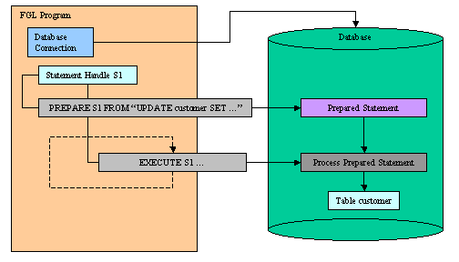
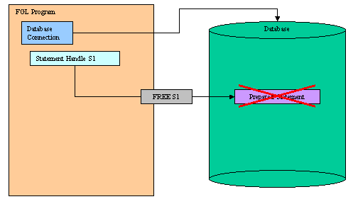

[Back to Contents](../index.html)

------------------------------------------------------------------------

# [Dynamic SQL Management]{#PAGE_HEADER}

Summary:

- [What is Dynamic SQL Management?](#DYNSQL)
- [Preparing an SQL statement](#DS_PREPARE) (`PREPARE`)
- [Executing prepared statements](#DS_EXECUTE) (`EXECUTE`)
- [Releasing prepared statements](#DS_FREE) (`FREE`)
- [Immediate execution](#DS_EXECUTE_IMMEDIATE) (`EXECUTE IMMEDIATE`)

*See also:* [Transactions](Transactions.html), [Positioned
Updates](PositionedUpdates.html), [Static SQL](StaticSql.html), [Result
Sets](ResultSets.html), [SQL Errors](Exceptions.html#SQLERRORS),
[Declaring a cursor](ResultSets.html#RS_DECLARE) (`DECLARE`).

------------------------------------------------------------------------

### [What is Dynamic SQL management?]{#DYNSQL}

BDL includes basic SQL instructions in the language syntax (see [Static
SQL](StaticSql.html)), but only a limited number of SQL instructions are
supported this way. Dynamic SQL Management allows you to execute any
kind of SQL statement, hard coded or created at runtime, with or without
SQL parameters, returning or not returning a result set. 

In order to execute an SQL statement with Dynamic SQL, you must first
[prepare](#DS_PREPARE) the SQL statement to initialize a [statement
handle]{.underline}, then you [execute](#DS_EXECUTE) the [prepared
statement]{.underline} one or more times:

{border="0" width="504" height="288"}

When you no longer need the [prepared statement]{.underline}, you can
[free](#DS_FREE) the statement handle to release allocated resources:

{border="0" width="504" height="288"}

When using [insert cursors](InsertCursors.html) or SQL statements that
produce a result set (like `SELECT`), you must
[declare](ResultSets.html#RS_DECLARE) a cursor with a prepared statement
handle.

Prepared SQL statements can contain SQL parameters by using `?`
placeholders in the SQL text. In this case, the `EXECUTE` or `OPEN`
instruction supplies input values in the `USING` clause.

To increase performance efficiency, you can use the `PREPARE`
instruction, together with an `EXECUTE` instruction in a loop, to
eliminate overhead caused by redundant parsing and optimizing. For
example, an `UPDATE` statement located within a `WHILE` loop is parsed
each time the loop runs. If you prepare the `UPDATE` statement outside
the loop, the statement is parsed only once, eliminating overhead and
speeding statement execution.

------------------------------------------------------------------------

### [PREPARE]{#DS_PREPARE}

#### Purpose:

This instruction prepares an SQL statement for execution in the current
[database connection](Connections.html).

#### Syntax:

`PREPARE `*`sid`*` FROM `*`sqltext`*

#### Notes:

1.  *sid* is an identifier to handle the prepared SQL statement.
2.  *sqltext* is a [string expression](Expressions.html#EX_STRING)
    containing the SQL statement to be prepared.

#### Usage:

The `PREPARE` instruction allocates resources for an SQL statement
handle, in the context of the [current connection](Connections.html).
The SQL text is sent to the database server for parsing, validation and
to generate the execution plan.

Prepared SQL statements can be executed with the [EXECUTE](#DS_EXECUTE)
instruction, or, when the SQL statement generates a result set, the
prepared statement can be used to declare [cursors](ResultSets.html)
with the [DECLARE](ResultSets.html#RS_DECLARE) instruction.

A statement identifier (*sid*) can represent only one SQL statement at a
time. You can execute a new `PREPARE` instruction with an existing
statement identifier if you wish to assign the text of a different SQL
statement to the statement identifier. The scope of reference of the
*sid* statement identifier is local to the module where it is declared.

The SQL statement can have parameter placeholders, identified by the
question mark (`?`) character.

Resources allocated by `PREPARE` can be released later by the
[FREE](#DS_FREE) instruction.

#### Warnings:

1.  You cannot directly reference a [variable](Variables.html) in the
    text of a prepared SQL statement; you must use question mark (`?`)
    placeholders instead.
2.  The number of prepared statements in a single program is limited by
    the database server and the available memory. Make sure that you
    [free](#DS_FREE) the resources when you no longer need the prepared
    statement.
3.  The identifier of a statement that was prepared in one module cannot
    be referenced from another module.
4.  You cannot use question mark (`?`) placeholders for SQL identifiers
    such as a table name or a column name; you must specify these
    identifiers in the statement text when you prepare it.
5.  Some database servers like Informix support multiple SQL statement
    preparation in a unique `PREPARE` instruction, but most database
    servers avoid multiple statements.

#### Example:

``` linenumber
01 FUNCTION deleteOrder(n)
02   DEFINE n INTEGER
03   PREPARE s1 FROM "DELETE FROM order WHERE key=?"
04   EXECUTE s1 USING n
05   FREE s1
06 END FUNCTION
```

------------------------------------------------------------------------

### [EXECUTE]{#DS_EXECUTE}

#### Purpose:

This instruction runs an SQL statement previously
[prepared](#DS_PREPARE) in the same [database
connection](Connections.html).

#### Syntax:

`EXECUTE `*`sid`*` `[`[`]{.underline}` USING `*`pvar`*` `[`{`]{.underline}`IN`[`|`]{.underline}`OUT`[`|`]{.underline}`INOUT`[`}`]{.underline}` `[`[,...]`]{.underline}` `[`]`]{.underline}` `[`[`]{.underline}` INTO `*`fvar`*` `[`[,...]`]{.underline}` `[`]`]{.underline}

#### Notes:

1.  *sid* is an identifier to handle the [prepared](#DS_PREPARE) SQL
    statement.
2.  *pvar* is a [variable](Variables.html) containing an input value for
    an SQL parameter.
3.  *fvar* is a [variable](Variables.html) used as fetch buffer, when
    the prepared statement returns a single database row.

#### Usage:

The `EXECUTE` instruction performs the execution of a [prepared SQL
statement](#DS_PREPARE). Once prepared, an SQL statement can be executed
as often as needed.

If the SQL statement has (`?`) parameter placeholders, you must specify
the `USING` clause to provide a list of variables as parameter buffers.
Parameter values are assigned [by position]{.underline}.

If the SQL statement returns a result set [with one row]{.underline},
you can specify the `INTO` clause to provide a list of variables to
receive the result set column values. Fetched values are assigned [by
position]{.underline}. If the SQL statement returns a result set with
more than one row, the instruction raises an
[exception](Exceptions.html).

The `IN`, `OUT` or `INOUT` options can be used to call stored procedures
having input / output parameters. Use the `IN`, `OUT` or `INOUT` options
to indicate if a parameter is respectively for input, output or both.
For more details about stored procedure calls, see [SQL
Programming](SqlProgramming.html).

#### Warnings:

1.  You cannot use strings or numeric constants in the ` USING` or
    ` INTO` list. All elements must be [program
    variables](Variables.html).
2.  You cannot execute a prepared SQL statement based on database tables
    if the table structure has changed (`ALTER TABLE`) since the
    [PREPARE](#DS_PREPARE) instruction; you must re-prepare the SQL
    statement.
3.  The `IN`, `OUT` or `INOUT` options can only be used for simple
    variables, you cannot specify those options for a complete record
    with the record.\* notation.

#### Example:

``` linenumber
01 MAIN
02   DEFINE var1 CHAR(20)
03   DEFINE var2 INTEGER
04 
05   DATABASE stores
06 
07   PREPARE s1 FROM "UPDATE tab SET col=? WHERE key=?"
08   LET var1 = "aaaa"
09   LET var2 = 345
10   EXECUTE s1 USING var1, var2
11 
12   PREPARE s2 FROM "SELECT col FROM tab WHERE key=?"
13   LET var2 = 564
14   EXECUTE s2 USING var2 INTO var1
15 
16   PREPARE s3 FROM "CALL myproc(?,?)"
17   LET var1 = 'abc'
18   EXECUTE s3 USING var1 IN, var2 OUT
19 
20 END MAIN
```

------------------------------------------------------------------------

### [FREE]{#DS_FREE}

#### Purpose:

This instruction releases the resources allocated to a
[prepared](#DS_PREPARE) statement.

#### Syntax:

`FREE `*`sid`*` `

#### Notes:

1.  *sid* is the identifier of the [prepared](#DS_PREPARE) SQL
    statement.

#### Usage:

The `FREE` instruction takes the name of a statement as parameter.

All resources allocated to the SQL statement handle are released.

#### Warnings:

1.  After resources are released, the statement identifier cannot be
    referenced by a [cursor](ResultSets.html), or by the
    [EXECUTE](#DS_EXECUTE) statement, until you [prepare](#DS_PREPARE)
    the statement again.

#### Tips:

1.  Free the statement if it is not needed anymore, this saves resources
    on the database client and database server side.

#### Example:

``` linenumber
01 FUNCTION update_customer_name( key, name )
02   DEFINE key INTEGER
03   DEFINE name CHAR(10)
04   PREPARE s1 FROM "UPDATE customer SET name=? WHERE customer_num=?"
05   EXECUTE s1 USING name, key
06   FREE s1
07 END FUNCTION
```

------------------------------------------------------------------------

### [EXECUTE IMMEDIATE]{#DS_EXECUTE_IMMEDIATE}

#### Purpose:

This instruction performs a simple SQL execution without SQL parameters
or result set.

#### Syntax:

`EXECUTE IMMEDIATE `*`sqltext`*

#### Notes:

1.  *sqltext* is a [string expression](Expressions.html#EX_STRING)
    containing the SQL statement to be executed.

#### Usage:

The `EXECUTE IMMEDIATE` instruction passes an SQL statement to the
database server for execution in the current [database
connection](Connections.html).

The SQL statement must be a single statement without parameters,
returning no result set.

This instruction performs the functions of [PREPARE](#DS_PREPARE),
[EXECUTE](#DS_EXECUTE) and [FREE](#DS_FREE) in one step. 

#### Warnings:

1.  The  SQL statement cannot contain SQL parameters.
2.  The  SQL statement must not produce a result set.

#### Example:

``` linenumber
01 MAIN
02   DATABASE stores
03   EXECUTE IMMEDIATE "UPDATE tab SET col='aaa' WHERE key=345"
04 END MAIN
```
