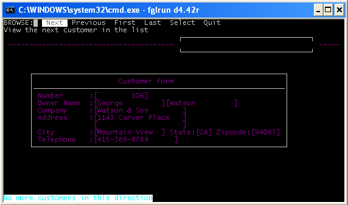
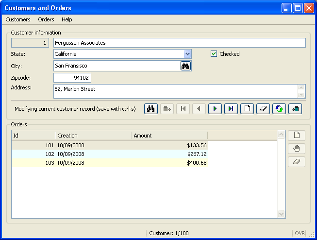
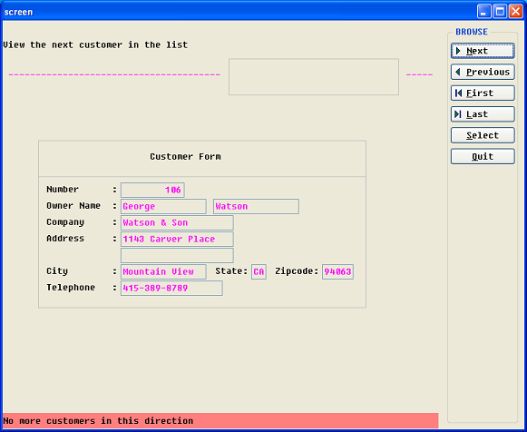
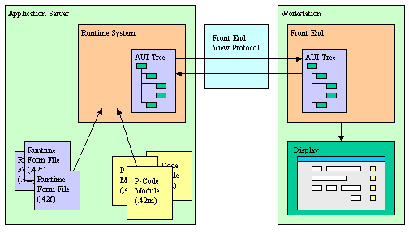
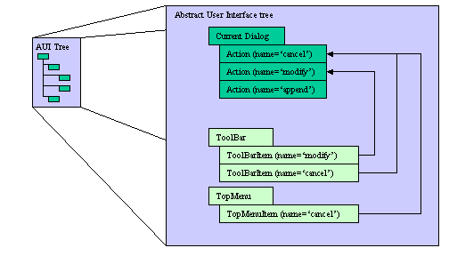

[Back to Contents](../index.html)

------------------------------------------------------------------------

# [The Dynamic User Interface]{#PAGE_HEADER}

Summary:

- [Genero user interface modes](#RENDERING)
  - [Text mode rendering](#TEXT_RENDERING)
  - [Graphical mode rendering](#GRAPHICAL_RENDERING)
    - [Traditional GUI mode](#TRADITIONAL_MODE)
      - [What is the Traditional GUI mode designed for?](#TTM_INTRO)
      - [Enabling the Traditional GUI mode](#TTM_CONFIG)
      - [Window rendering rules](#TTM_WINDOWS_FORMS)
      - [Function key shifting](#TTM_FKEY_SHIFT)
      - [PROMPT rendering](#TTM_PROMPT)
- [The Dynamic User Interface](#DYNAMICUI)
  - [The concept](#DUI_CONCEPT)
  - [When is the front-end synchronized?](#FE_SYNC)
- [Connecting to the front-end](#CONNECTION)
  - [Defining the Target Front End](#FETARGET)
  - [Front End Identification](#FEIDENT)
  - [Warning: Security Issue](#SECISSUE1)
  - [Front End connection timeout](#FECONN_TIMEOUT)
  - [Front End connection lost](#FECONN_LOST)
  - [Disabling protocol compression](#FECONN_COMPRESSION)
  - [Front End Errors](#FEERRORS)
- [The Abstract User Interface](#ABSTRACTUI)
  - [What does the Abstract User Interface tree contain?](#AUI_CONTENT)
  - [Manipulating the Abstract User Interface](#AUI_MANIP)
  - [XML Node Type and Attribute Names](#AUI_NAMES)
  - [Actions in the Abstract user Interface tree](#AUI_ACTIONS)
  - [The Front End Protocol](#FEPROTOCOL)
- [Special Features](#SPECIAL_FEATURES)
  - [Setting Key Labels](#SETTING_KEY_LABELS)
  - [Automatic front-end startup](#AUTOSTART)
  - [Text mode screen dump](#SCREENDUMP)
- [Configuring your text terminal](#TERMINAL_CONFIGURATION)
  - [Environment variables](#TERMCONF_ENV)
  - [Terminal capabilities](#TERMCONF_TERMCAP)

*See also:* [Form Files](FormSpecFiles.html), [Windows and
Forms](WindowsAndForms.html), [Interaction
Model](InteractionModel.html).

------------------------------------------------------------------------

## [Genero user interface modes]{#RENDERING} {#genero-user-interface-modes align="left"}

### [Text mode rendering]{#TEXT_RENDERING}

Genero\'s [Text User Interface](FglTerms.html#TEXT_USER_INTERFACE) has
been designed for character-based terminals. This mode can be used to
run your application on a text terminal hardware or in a terminal
emulator.

In TUI mode, the application windows/forms will display within the
current console/terminal window as shown in the next screen-shot:

{border="0" width="572" height="337"}

By default, applications forms are displayed in [GUI
mode](#GRAPHICAL_RENDERING) as described later in this section. In order
to run your applications in text mode, set the
[FGLGUI](EnvironmentVariables.html#EV_FGLGUI) environment variable to 0
(zero).

Note that you may need to configure you terminal capabilities with TERM
and TERMCAP environment variables, as described later in [Configuring
your text terminal](#TERMINAL_CONFIGURATION).

### [Graphical mode rendering]{#GRAPHICAL_RENDERING}

Genero is designed to provide a real graphical look and feel. Compared
to the text mode interface as with Informix 4GL applications, this is a
significant improvement for the end user. For example, with Genero, when
using the GUI mode, you get real resizable windows when executing an
[OPEN WINDOW](WindowsAndForms.html) instruction.

The [Graphical User Interface](FglTerms.html#GRAPHICAL_USER_INTERFACE)
mode is enabled by default in Genero. You can also set the
[FGLGUI](EnvironmentVariables.html#EV_FGLGUI) environment variable to 1.
In GUI mode, the application will display on the [front-end
workstation](#CONNECTION) identified with the
[FGLSERVER](EnvironmentVariables.html#EV_FGLSERVER) environment
variable. Application windows/forms will be rendered with real GUI
widgets providing a nice look-and-feel as shown in the next screen-shot:

{border="0" width="653" height="494"}

#### [Traditional GUI mode]{#TRADITIONAL_MODE}

##### [What is the Traditional GUI mode designed for?]{#TTM_INTRO}

With the GUI mode of Genero, you immediately get the benefit of standard
GUI widgets and windows. Forms are rendered as real movable and
resizable windows, form labels and fields become widgets using variable
fonts, toolbars and pull-down menus are displayed, and error messages
are displayed in the status bar. This can, however, be annoying if you
have to migrate from a project that was developed with Informix 4GL or
Four Js BDS products.

Genero supports the **Traditional GUI mode** to simplify migration from
Informix 4GL or from Four Js BDS. When using this mode, Genero windows
will be displayed as simple boxes in a main front-end window, as shown
in the next screen-shot:

{border="0" width="581" height="476"}

##### [Enabling the Traditional GUI mode]{#TTM_CONFIG}

The traditional GUI mode can be enabled with the following
[FGLPROFILE](FglProfile.html#ENTRYLIST) entry:

       gui.uiMode = "traditional"  

By default, the Traditional GUI mode is off.

##### [Window rendering rules]{#TTM_WINDOWS_FORMS}

If the Traditional GUI mode is set, the [OPEN
WINDOW](WindowsAndForms.html#OPEN_WINDOW) statement works differently
according to the bound forms.

On the Front-End side, there is one unique main graphical window (a
top-level widget called \"Compatibility Window Container\") created to
host all the Genero windows containing traditional forms. Traditional
forms are form files which have a
[SCREEN](FormSpecFiles.html#SECTION_SCREEN) section instead of the
Genero specific [LAYOUT](FormSpecFiles.html#SECTION_LAYOUT) section.
When migrating from an Informix 4GL or FourJ\'s BDS project, all forms
initially contain a `SCREEN` section; hence all windows opened in
traditional mode will appear in the Compatibility Window Container.\
\
To renovate a form file with Genero graphical items such as group boxes,
buttons and tables, a `LAYOUT` section must be created. If the renovated
form file is loaded via `OPEN WINDOW ... WITH FORM form-file` then, even
in traditional mode, the freshly created window will appear as a new
top-level widget on the Front-End side. This opens a smooth migration
path using the traditional mode; as a first step, it is possible to
migrate/enhance the most important forms, while keeping the rest of the
application forms running in the original rendering.\
\
Note, however, that the following combination does not work in
Traditional GUI mode:

1.  `OPEN WINDOW `*`window_id`*` AT `*`line`*`, `*`column`*` WITH `*`height`*` ROWS, `*`width`*` COLUMNS` 
2.  `OPEN FORM `*`form_id`*` FROM "`*`form_file`*`"` (*form_file* is
    defined with a `LAYOUT` section)
3.  `DISPLAY FORM `*`form_id`*

A runtime error results, because you cannot display a form with dynamic
geometry in a fixed geometry container. Only forms with a `SCREEN`
section can be displayed at a later stage in a window that was initially
opened inside the Compatibility Window Container.

##### [Function key shifting]{#TTM_FKEY_SHIFT}

When the traditional mode is enabled, you can map Shift-Fx and
Control-Fx key strokes to F(x+offset) actions. The offset is defined
with the gui.key.add_function entry:

       gui.key.add_function = 12  

This entry defines the number of function keys of the keyboard (default
is 12). When defined as 12, a Shift-F1 will be received as an F13 (12+1)
action event by the program, and a Control-F1 will be F25 (12\*2+1).

##### [PROMPT rendering]{#TTM_PROMPT}

Unlike in TUI mode or with the BDS/WTK products, Genero renders the
[PROMPT](Prompt.html) instruction in a separate modal window, even when
the traditional GUI mode is enabled. The `PROMPT` window will appear on
top of the Compatibility Window Container.

------------------------------------------------------------------------

## [The Dynamic User Interface]{#DYNAMICUI}

### [The concept]{#DUI_CONCEPT}

The Dynamic User Interface (DUI) is a global concept for a new, open
[User Interface](FglTerms.html#USER_INTERFACE) programming toolkit and
deployment components, based on the usage of
[XML](http://www.w3c.org/XML){target="new"} standards and [built-in
classes](BuiltInClasses.html).

The purpose of the DUI is to support different kinds of display devices
by using the same source code, introducing an abstract definition of the
user interface that can be manipulated at runtime as a tree of user
interface objects. This tree is called the [Abstract User
Interface](#ABSTRACTUI).

The [Runtime System](FglTerms.html#RUNTIME_SYSTEM) is in charge of the
Abstract User Interface tree and the [Front
End](FglTerms.html#FRONT_END) is in charge of making this abstract tree
visible on the screen. The [Front End](FglTerms.html#FRONT_END) gets a
copy of that tree which is automatically synchronized by the runtime by
using the [Front End Protocol](#FEPROTOCOL).

In development, application screens are defined by [Form Specification
Files](FormSpecFiles.html). These files are used by the [Form
Compiler](Tools.html#TL_FGLFORM) to produce the Runtime Form Files that
can be deployed in production environments.

### Architectural schema

The following schema describes the Dynamic User Interface concept,
showing how the Abstract User Interface tree is shared by the [Runtime
System](FglTerms.html#RUNTIME_SYSTEM) and the [Front
End](FglTerms.html#FRONT_END):

{border="0" width="504" height="288"}

### [When is the front-end synchronized?]{#FE_SYNC}

The Abstract User Interface tree on the front-end is synchronized with
the [Runtime System](FglTerms.html#RUNTIME_SYSTEM) AUI tree when a user
interaction instruction takes the control. This means that the user will
not see any display as long as the program is doing batch processing,
until an interactive statement is reached.

For example, the following program shows nothing:

      01 MAIN
      02   DEFINE cnt INTEGER
      03   OPEN WINDOW w WITH FORM "myform"
      04   FOR cnt=1 TO 10
      05     DISPLAY BY NAME cnt
      06     SLEEP 1
      07   END FOR
      08 END MAIN  

If you want to show something on the screen while the program is running
in a batch procedure, you must force synchronization with the front-end,
by calling the `refresh()` method of the [Interface built-in
class](ClassInterface.html):

      01 MAIN
      02   DEFINE cnt INTEGER
      03   OPEN WINDOW w WITH FORM "myform"
      04   FOR cnt=1 TO 10
      05     DISPLAY BY NAME cnt
      06     CALL ui.Interface.refresh()   -- Sync the front-end!
      07     SLEEP 1
      08   END FOR
      09 END MAIN  

**[Warning!]{#SECISSUE2}** When the AUI trees are synchronized, only the
changes are sent to the front-end. If a modification has been made that
does not result in a change in the values of the attributes of a node of
the tree (for example, you change the contents of an image file but keep
the same name), that modification will not be sent to the front-end.

------------------------------------------------------------------------

## [Connecting to the front-end]{#CONNECTION} {#connecting-to-the-front-end align="left"}

### [Defining the Target Front-End]{#FETARGET} {#defining-the-target-front-end align="left"}

In [GUI](#GRAPHICAL_RENDERING) mode, when the first interactive
instruction like [MENU](Menus.html) or [INPUT](RecordInput.html) is
executed, the runtime system establishes a tcp connection to the
front-end. The front-end acts as a graphical server for the runtime
system.

On the runtime system side, the front-end is identified by the
[FGLSERVER](EnvironmentVariables.html#EV_FGLSERVER) environment
variable. This variable defines the hostname of the machine where the
front-end resides, and the number of the front-end instance to be used.

The syntax for FGLSERVER is **hostname\[:servernum\]**:

      $ FGLSERVER=fox:1
      $ fglrun myprog  

The **servernum** parameter is a whole number that defines the instance
of the front-end. It is actually defining a tcp port number, starting
from 6400. For example, if **servernum** equals 2, the tcp port number
used is 6402 (6400+2). 

This is the standard/basic connection technique, but you can set up
different types of configurations. For example, you can have the
front-end connect to an application server via ssh, to pass through
firewalls over the internet. Refer to the front-end documentation for
more details.

### [Front-End Identification]{#FEIDENT} {#front-end-identification align="left"}

The front-end can open a terminal session on the application server to
start a program from the user workstation. This is done by using a ssh,
rlogin, or telnet terminal session. When the terminal session is open,
the front-end sends a couple of shell commands to set environment
variables like [FGLSERVER](EnvironmentVariables.html#EV_FGLSERVER)
before starting the Genero program to display the application on the
front-end where the terminal session was initiated.

In this configuration, front-end identification takes place. The
front-end identification prevents the display of application windows on
a front-end that did not start the Genero application on the server. If
the front-end was not identified, it would result in an important
security problem, as anyone could run a fake application that could
display on any front-end and ask for a password.

**[Warning (Security Issue):]{#SECISSUE1} Front-end identification is
achieved by setting two environment variables in the terminal session,
which identify the front-end. The runtime system sends the first
identifier back when connecting to the front-end, and the front-end
sends the second id in the returning connection string. The Front-end
checks the first id, and refuses the connection if that id does not
correspond to the original id set in the terminal session. The runtime
system checks the second id send by the front-end in the connection
string, and refuses the connection if that id does not correspond to the
environment variable set in the terminal session. There can be a
security hole if users can overwrite the program or the shell script
started by the front-end terminal session. It is then possible to change
the front-end identification environment variables and FGLSERVER, in
order to display the application on another workstation to read
confidential data. As long as basic application users do not have read
and write privileges on the program files, there is no risk. To make
sure that program files on the server side are protected from basic
users, create a special user on the server to manage the application
program files, and give other users only read access to those files. As
long as basic users cannot modify programs on the server side, there is
no security issue.**

### [Front-End connection timeout]{#FECONN_TIMEOUT}

When initiating the connection to the front-end, if the front-end
program is stopped, the host machine is down, or a firewall drops
connections for the port used by Genero, the program will stop with an
error after a given timeout. This timeout can be specified with this
[FGLPROFILE](FglProfile.html) entry:

      gui.connection.timeout = seconds  

The default timeout is 30 seconds.

### [Front-End connection lost]{#FECONN_LOST}

When a program has started and the runtime system waits for a user
action, but the end user does not do anything, the front-end sends a
\'ping\' event every 5 minutes to keep the tcp connection alive. This
situation can happen if the user leaves the workstation for a while
without closing the application. The Front-End ping is a normal
situation and part of the GUI client/server protocol. However, if the
front-end program is not stopped properly (when killed by a system
reboot, for example), the tcp connection is lost and the runtime system
does not receive any more \'ping\' events. In this case, the runtime
system waits for a specified time before it stops with fatal error
**[-8062](FglErrors.html#-8062)**. You can configure this timeout with
an [FGLPROFILE](FglProfile.html) entry:

      gui.protocol.pingTimeout = 800  

By default, the runtime system waits for 600 seconds (10 minutes).

**Warning: If you set this timeout to a value lower than the ping delay
of the front-end, the program will stop with a fatal error after that
timeout, even if the tcp connection is still alive. For example, with a
front-end having a ping delay of 5 minutes, the minimum value for this
parameter should be about 330 seconds (5 minutes + 30 seconds to make
sure the client ping arrives).**

### [Disabling protocol compression]{#FECONN_COMPRESSION}

GUI protocol compression uses unnecessary processor resources if the
communication with the front-end is fast (for example, on a 100 Mbps
Ethernet network compression is not needed). To disable compression, set
this [FGLPROFILE](FglProfile.html) entry: 

      gui.protocol.format = "block"  

See also [Front-End Protocol](FEProtocol.html#COMPRESSION).

### [Front-End Errors]{#FEERRORS}

When the [Front End](FglTerms.html#FRONT_END) receives an invalid order,
it stops the application. The [Runtime
System](FglTerms.html#RUNTIME_SYSTEM) then stops and displays the
following message:

      Program stopped at 'xxx.4gl', line number yy.
      FORMS statement error number -6313.
      The UserInterface has been destroyed: <message>.  

The following error messages can occur:

  --------------------------------------------------------- ----------------------------------------------------------------------------------------------------
  **Message**                                               **Description**
  Application was terminated by user                        The front-end has been stopped or the user has clicked on the \"Terminate application\" button.
  Unexpected interface version sent by the runtime system   The runtime system and the front-end versions are not fully compatible.
  The container \'*container_name*\' already exists         The same [WCI](MDIWindows.html) container has been started twice.
  The container  \'*container_name*\' was destroyed         The parent [WCI](MDIWindows.html) container has been stopped while some children are still running
  The container \'*container_name*\' doesn\'t exist         The [WCI](MDIWindows.html) parent of the current child doesn\'t exist.
  Invalid AUI Tree: Multiple Start Menu nodes               The AUI Tree contains two Start Menu Nodes - *should not happen*.
  --------------------------------------------------------- ----------------------------------------------------------------------------------------------------

------------------------------------------------------------------------

## [The Abstract User Interface]{#ABSTRACTUI}

The Abstract User Interface (AUI) is a
[DOM](http://www.w3c.org/DOM){target="new"} tree describing the objects
of the [User Interface](FglTerms.html#USER_INTERFACE) of a
[Program](FglTerms.html#PROGRAM) at a given time. A copy of the AUI tree
is held by both the Front End and the [Runtime
System](FglTerms.html#RUNTIME_SYSTEM). AUI Tree synchronization is
automatically done by the Runtime System using the [Front End
Protocol](#FEPROTOCOL). The programs can manipulate the AUI tree by
using [built-in classes](ClassInterface.html) and [XML
utilities](XmlUtils.html).

------------------------------------------------------------------------

### [What does the Abstract User Interface tree contain?]{#AUI_CONTENT}

The Abstract User Interface defines a tree of objects organized by
parent/child relationship. The different kinds of user interface objects
are defined by attributes. The AUI tree can be serialized as text
according to the [XML](http://www.w3c.org/XML){target="new"} standard
notation.

The following example shows a part of an AUI tree defining a
[Toolbar](Toolbars.html) serialized with the XML notation:

      <ToolBar>
        <ToolBarItem name="f5" text="List" image="list" />
        <ToolBarSeparator/>
        <ToolBarItem name="Query" text="Query" image="search" />
        <ToolBarItem name="Add" text="Append" image="add" />
        ...
      </ToolBar>  

------------------------------------------------------------------------

### [Manipulating the Abstract User Interface tree]{#AUI_MANIP}

#### Modifying the AUI tree with built-in classes

The objects of the Abstract User Interface tree can be queried and
modified at runtime with specific built-in classes like
[ui.Form](ClassForm.html), provided to manipulate form elements.

The next code example gets the current window object, then gets the
current form in that window, and hides a group-box form element
identified by the name \"gb1\":

      01 DEFINE w ui.Window
      02 DEFINE f ui.Form
      03 LET w = ui.Window.getCurrent()
      04 LET f = w.getForm()
      05 CALL f.setElementHidden("gb1",1)

#### Using low-level APIs to modifying the AUI tree

In very special cases, you can also directly access the nodes of the AUI
tree by using DOM API classes like [DomDocument](ClassDomDocument.html)
and [DomNode](ClassDomNode.html). 

**Warning: As we continue to add new features to the product we
encounter situations that may force us to modify the AUI Tree in order
to add new elements/attributes. If you are using the low level API\'s to
directly modify the tree, your code may be slightly impacted when we
release a change in the AUI Tree structure. In order to minimize the
impact of any such Abstract User Interface changes we would like to
suggest the following course of action with regards to use of the
DOM/SAX API\'s:\
1. Modify the tree at your own discretion understanding that in the
future, changes to the AUI tree may be implemented.\
2. Place all custom calls to the DOM/SAX API within centralized Library
functions that are accessible to all modules, as opposed to scattering
function calls throughout your code base.\
3. Do not create nodes or change attributes that are not explicitly
documented as modifiable. For example, TopMenu or ToolBar nodes can be
created and configured dynamically, but you should not add FormField
nodes to existing forms, or modify yourself the \'active\' attribute of
fields or actions.**

To get the user interface nodes at runtime, the language provides
different kinds of API functions or methods, according to the context.
For example, to get the root of the Abstract User Interface tree, call
the [ui.Interface.getRootNode()](ClassInterface.html) method. You can
also get the current form node with [ui.Form.getNode()](ClassForm.html)
or search for an element by name with the
[ui.Form.findNode()](ClassForm.html) method.

------------------------------------------------------------------------

### [XML Node Types and Attribute Names]{#AUI_NAMES}

By tradition BDL uses uppercase keywords, such as LABEL in form files,
and the examples in this documentation reflect that convention. The BDL
language itself is not case-sensitive. However, XML is case-sensitive,
and by convention node types use uppercase/lowercase combinations to
indicate word boundaries. In BDL, therefore, the nodes and attributes of
an Abstract User Interface tree are handled as follows:

- **Node** **types** - the first letter of the node type is always
  capitalized. Subsequent letters are lower-case, unless the type
  consists of multiple words joined together. In that case, the first
  letter of each of the multiple words is capitalized (the CamelCase
  convention). Examples: Label, FormField, DateEdit, Edit
- **Attribute** **names** - the first letter of the name is always
  lower-case; subsequent letters are also lower-case, unless the name
  consists of multiple words joined together. In that case, the first
  letter of each subsequent word is capitalized (the Lower CamelCase
  convention). Examples: text, colName, width, tabIndex
- **Attribute values** - the values are enclosed in quotes, and BDL does
  not convert them.

**Warning:** **If you reference Nodes or Attributes in your BDL code,
you must always respect the naming conventions.**

------------------------------------------------------------------------

### [Actions in the Abstract User Interface tree]{#AUI_ACTIONS}

The Abstract User Interface identifies all possible actions that can be
received by the current interactive instruction with a list of *Action*
nodes. The list of possible actions are held by a *Dialog* node. An
*Action* node is identified by the \'name\' attribute and defines common
properties such as the accelerator key, default image, and default text.

Interactive elements are bound to *Action* nodes by the \'name\'
attribute. For example, a Toolbar item (button) with the name \'cancel\'
is bound to the *Action* node having the name \'cancel\', which in turn
defines the accelerator key, the default text, and the default image for
the button.

{border="0" width="504" height="288"}

When an interactive element is used (such as a form field input, toolbar
button click, or menu option selection), an *ActionEvent* node is sent
to the runtime system. The name of the *ActionEvent* node identifies
what *Action* occurred and the \'idRef\' attribute indicates the source
element of the action.

See also [Front End Events](FEProtocol.html#FEEVENTS) for more details.

------------------------------------------------------------------------

### [The Front End Protocol]{#FEPROTOCOL}

The Front End Protocol (FEP) is an internal protocol used by the
[Runtime System](FglTerms.html#RUNTIME_SYSTEM) to synchronize the
[Abstract User Interface](#ABSTRACTUI) representation on the [Front
End](FglTerms.html#FRONT_END) side. This protocol defines a simple set
of operations to edit the Abstract User Interface tree. This protocol is
based on a command processing principle (send command, receive answer)
and can be serialized to be transported over any network protocol, like
HTTP for example.

Both the Abstract User Interface and the Front End Protocol are public
to allow third parties to develop their own Front Ends. This enables
applications to be deployed on very specific
[Workstations](FglTerms.html#WORKSTATION).

Refer to [Front End Protocol](FEProtocol.html) for more details about
the operations supported by this communication protocol.

------------------------------------------------------------------------

## [Special Features]{#SPECIAL_FEATURES}

This section describes special features regarding the user interface
domain:

- [Setting Key Labels](#SETTING_KEY_LABELS)
- [Automatic Front-End Startup](#AUTOSTART)

### [Setting Key Labels]{#SETTING_KEY_LABELS}

#### Definition

This feature allows you to define the labels of keys, to show a specific
text in the default action button created for the key.

**Warning: Key label definition is provided for backward compatibility,
to set action/key labels you should use [Action
Defaults](ActionDefaults.html) instead.**

#### Syntax:

- FGLPROFILE definitions\
  \
  `key.`*`key-name`*`.text = "`*`label`*`"`\
  \
- Program-level key labels\
  \
  `CALL FGL_SETKEYLABEL( "`*`key-name"`*`, "`*`label`*`" )`\
  \
- Form level key labels\
  \
  `KEYS`\
  *`key-name`*` = `[`[`]{.underline}`%`[`]`]{.underline}`"`*`label`*`"`\
  [`[...]`]{.underline}\
  `[END]`\
  ` `
- Dialog level key labels\
  \
  `CALL FGL_DIALOG_SETKEYLABEL( "`*`key-name"`*`, "`*`label`*`" )`\
  \
- Field level key labels\
  \
  `KEY `*`key-name`*` = `[`[`]{.underline}`%`[`]`]{.underline}`"`*`label`*`"   `
  (as field [attribute](FSFAttributes.html#FA_KEY))

#### Notes:

1.  *key-name* is the name of the key as described below.
2.  *label* is the text to be displayed in the default action view
    (button).

#### Usage:

Traditional 4GL applications use a lot of function keys and/or control
keys to manage user actions. For example, in the following interactive
dialog, the function key `F10` is used to show a detail window:

      01 INPUT BY NAME myrecord.*
      02    ON KEY (F10)
      03       CALL ShowDetail()
      04 END INPUT

For backward compatibility, the language allows you to specify a label
to be displayed in a default action button created specifically for the
key.

By default, if you do not specify a label, no action button is displayed
for a function key or control key.

If the text provided for the key label is empty or NULL, the default
action button will not be displayed.

The following table shows the key names recognized by the runtime
system:

::: {align="center"}
  ---------------------------- ----------------------------------------------------------------------------------------
  **Key Name**                 **Description**
  `f1` to `f255`               Function keys.
  `control-a` to `control-z`   Control keys.
  `accept`                     Predefined dialog validation action.
  `interrupt`                  Predefined dialog cancellation action (note action name is *cancel*, not *interrupt*).
  `insert`                     Predefined [INPUT ARRAY](InputArray.html) dialog row insertion action.
  `append`                     Predefined [INPUT ARRAY](InputArray.html) dialog row addition action.
  `delete`                     Predefined [INPUT ARRAY](InputArray.html) dialog row deletion action.
  `help`                       Predefined help action.
  ---------------------------- ----------------------------------------------------------------------------------------
:::

You can define key labels at different levels, from the default settings
to a specific field, to show a specific label for the key when the focus
is in that field. The order of precedence for key label definition is
the following:

1.  The label defined with the [KEY](FSFAttributes.html#FA_KEY)
    attribute of the form field.
2.  The label defined for the current dialog, using the
    [FGL_DIALOG_SETKEYLABEL](BuiltInFunctions.html#BF_FGL_DIALOG_SETKEYLABEL)
    function.
3.  The label defined in the [KEYS](FormSpecFiles.html#SECTION_KEYS)
    section of the [form specification file](FormSpecFiles.html).
4.  The label defined as default for a program, using the
    [FGL_SETKEYLABEL](BuiltInFunctions.html#BF_FGL_SETKEYLABEL)
    function.
5.  The label defined in the [FGLPROFILE](FglProfile.html) configuration
    file (`key.`*`key-name`*`.text` entries).

**Warning: In Genero, you typically define action labels with [Action
Defaults](ActionDefaults.html). However, if key labels are defined, they
will overwrite the text defined in Action Defaults for the corresponding
key action. Note that in BDS 3.xx versions, default key labels are
defined in FGLDIR/etc/fglprofile. These defaults have been commented out
in Genero to have Action Defaults text applied (In Genero, by default,
FGL_GETKEYLABEL() returns NULL for all keys). If you want to get the
same default key labels as in BDS 3.xx, uncomment the key.\* lines in
FGLDIR/etc/fglprofile.**

You can query the label defined at the program level with the
[FGL_GETKEYLABEL](BuiltInFunctions.html#BF_FGL_GETKEYLABEL) function
and, for the current interactive instruction, with the
[FGL_DIALOG_GETKEYLABEL](BuiltInFunctions.html#BF_FGL_DIALOG_GETKEYLABEL)
function.

### [Automatic front-end startup]{#AUTOSTART}

#### Definition

The runtime system tries to open a connection to the graphical front-end
according to the [FGLSERVER](EnvironmentVariables.html#EV_FGLSERVER)
environment variable. This requires having the front-end already started
and listening to the TCP port defined according to FGLSERVER.

In some configurations, such as *X11 workstations* or *METAFRAME/Citrix
Winframe* or *Microsoft Windows Terminal Server*, each user may want to
start his own front-end to have a dedicated process. This can be done by
starting the front-end automatically when the Genero program executes,
according to the DISPLAY (X11) or SESSIONNAME/CLIENTNAME (WTSE)
environment variables.

#### Usage:

Automatic front-end startup settings are defined with
`gui.server.autostart.*` entries in [FGLPROFILE](FglProfile.html).

In a first time, the runtime system tries to establish the connection
without starting the GUI server (in a normal usage, it is already
started). The GUI server (i.e. front-end) is identified by the
[FGLSERVER](EnvironmentVariables.html#EV_FGLSERVER) environment
variable. If FGLSERVER is not defined, it defaults to **localhost:0**,
except if `gui.server.autostart.wsmap `entries are defined in
FGLPROFILE. When `wsmap` entries are defined, workstation id to GUI
server id mapping takes place and FGLSERVER defaults to **localhost:n**,
where **n** is the GUI server number found from `wsmap` entries.

If this first connection fails and the `gui.server.autostart.cmd` entry
is defined, the runtime system executes the command to start the GUI
server, then waits for n seconds as defined by
`gui.server.autostart.wait` entry, and after this delay tries to connect
to the front-end. If the connection fails, it tries again for a number
of attempts defined by the `gui.server.autostart.repeat` entry. Finally,
it the last try failed, the runtime system stops with a GUI connection
error **-6300**. 

**Warning: If the `gui.server.autostart.cmd` entry is not defined,
neither workstation id to GUI id mapping, nor automatic front-end
startup is done.**

Here is a detailed description of each `gui.server.autostart` FGLPROFILE
entry:

The \'**cmd**\' entry is used to define the command to be executed to
start the front-end:

` gui.server.autostart.cmd = "/opt/app/gdc-2.30/bin/gdc -p %d -q -M"`

Here, **%d** will be replaced by the TCP port the front-end must listen
to.

By default the runtime system waits for two seconds before it tries to
connect to the front-end. You can change this delay with the
\'**wait**\' entry:

` gui.server.autostart.wait = 5   -- wait five seconds`

The runtime system tries to connect to the front-end ten times. You can
change this with the \'**repeat**\' entry:

` gui.server.autostart.repeat = 3 -- repeat three times`

The following FGLPROFILE entries can be used to define workstation id to
front-end id mapping:

` gui.server.autostart.wsmap.max = 3`\
` gui.server.autostart.wsmap.0.names = "fox:1.0,fox.sxb.4js.com:1.0"`\
` gui.server.autostart.wsmap.1.names = "wolf:1.0,wolf.sxb.4js.com:1.0"`\
` gui.server.autostart.wsmap.2.names = "wolf:2.0,wolf.sxb.4js.com:2.0"`

The first \'**wsmap.max**\' entry defines the maximum number of
front-end identifiers to look for. The \'**wsmap.N.names**\' entries
define a mapping for each GUI server, where **N** is the front-end
identifier. The value of those entries defines a comma-separated list of
workstation names to match. If no wsmap entries are defined, the GUI
server number will default to zero.

**Warning: Note that for gui.server.autostart.wsmap entries, the first
GUI server number starts at zero.**

On X11 configurations, a workstation is identified by the **DISPLAY**
environment variable. In the above example, \"**fox:1.0**\" identifies a
workstation that will make the runtime start a front-end with the number
**1**.

On Windows Terminal Server, the **CLIENTNAME** environment variable
identifies the workstation. If no corresponding front-end id can be
found in the \'**wsmap**\' entries, the front-end number defaults to the
id of the session defined by the **SESSIONNAME** environment variable,
[plus one]{.underline}. The value of this variable has the form
\"***protocol*\#*id***\"; for example, \"**RDP-Tcp#4**\" would
automatically define a front-end id of **5** (4+1).

#### Tips:

1.  If the front-end processes are started on the same machine as the
    runtime system, you do not need to set the FGLSERVER environment
    variable. This will then default to \'**localhost:*****id***\',
    where *id* will be detected according to the \'wsmap\' workstation
    mapping entries.

2.  If the front-end is executed on a middle-tier machine that is
    different from the application server, **MIDHOST** for example, you
    can set FGLSERVER to \"MIDHOST\" without a GUI server id. The
    workstation mapping will automatically find the id according to
    \'wsmap\' settings.

3.  Some clients, such as the Genero Desktop Client (GDC), raise the
    control panel to the top of the window stack when you try to restart
    it. In this case the program window might be hidden by the GDC
    control panel. To avoid this problem, you can use the -M option to
    start the GDC in minimized mode.

### [Text mode screen dump]{#SCREENDUMP0}

For compatibility with IBM Informix 4gl, Genero supports the
[DBSCREENDUMP](EnvironmentVariables.html#EV_DBSCREENDUMP) and
[DBSCREENOUT](EnvironmentVariables.html#EV_DBSCREENOUT) environment
variables for debugging purpose, to let you do a screen shot when
running in TUI mode and write the result into a file.

To enable TUI screen shot, set either DBSCREENDUMP or DBSCREENOUT to the
name of the output file, then run your Genero program with FGLGUI=0 set
and press the CONTROL-P key to dump the current screen. Each time you
press CONTROL-P the output file will be overwritten.

The DBSCREENDUMP variable writes the screen with escape sequences of TTY
attributes, while DBSCREENOUT writes only the characters displayed on
the screen, which makes the output more readable.

If both variables are set, the runtime will generate both output files.
You should however use different file names, otherwise the output is
undefined.

------------------------------------------------------------------------

## [Configuring your text terminal]{#SPECIAL_FEATURES0}

This section covers topics about text terminal configuration when using
the [TUI mode](#TEXT_RENDERING).

### [Environment variables]{#TERMCONF_ENV}

To run a Genero application in text mode, you must define the
[FGLGUI](EnvironmentVariables.html#EV_FGLGUI) environment variable to 0.

On UNIX platforms, the [TERM](EnvironmentVariables.html#EV_TERM)
environment variable must be set and define the terminal type/name. For
example, if you execute the application in an xterm window, set
TERM=xtermix. The Genero runtime system will search for the terminal
capabilities in the file defined by the
[TERMCAP](EnvironmentVariables.html#EV_TERMCAP) environment variable.

On Windows platforms, you can run applications in text mode inside a CMD
Console Window. You must not set the TERM environment variable in this
case.

### [Terminal capabilities]{#TERMCONF_TERMCAP}

Genero provides a default file defining terminal capabilities in
FGLDIR/etc/termcap, but you can modify this file or add new terminal
definitions. If you plan to modify the default termcap file, we strongly
recommend that you make a copy of the original termcap file and point to
the new file with the TERMCAP environment variable.

Note that terminal type and terminal capabilities definition is not a
Genero-specific configuration: TERM and TERMCAP (or TERMINFO) are also
used by other UNIX applications and commands. However, Genero only
supports TERMCAP databases (TERMINFO will be supported in a future
version).

In this section we will briefly describe the syntax of the termcap file.
For a complete definition please refer to your operating system
documentation (see man pages describing the termcap file syntax).

#### [Termcap syntax]{#TERMCAP_SYNTAX_BASICS}

All termcap entries contain a list of terminal names, followed by a list
of terminal capabilities, in the following format:

- Each capability, including the last one in the entry, is followed by a
  colon ( : ).
- ESCAPE is specified as a backslash ( \\ ) followed by the letter E.
  CTRL is specified as a caret (\^). Do not use the ESCAPE or CTRL keys
  to indicate escape sequences or control characters in a termcap entry.
- Entries must be defined on a single logical line; a backslash ( \\ )
  appears at the end of each line that wraps to the next line.
- Comment lines begin with a sharp sign (#).

Example: xterm terminal definition:

    xterm|xterm terminal emulator:\
    :km:mi:ms:xn:pt:\
    :co#80:li#24:\
    :is=\E[r\E[m\E[2J\E[H\E[?7h\E[?1;3;4;6l:\
    ...

##### [Terminal Names]{#TERMCAP_TERM_NAMES}

Termcap entries begin with one or more names for the terminal, each
separated by a vertical ( \| ) bar. Any one of these names can be used
for access to the termcap entry.

##### [Boolean Capabilities]{#TERMCAP_BOOL_CAPS}

Boolean capabilities are two-character codes indicating whether a
terminal has a specific feature. If the Boolean capability exists in the
termcap entry, the terminal has that particular feature. For example:

    :bs:am:
    # bs backspace with CTRL-H
    # am automatic margins

##### [Numeric Capabilities]{#TERMCAP_NUM_CAPS}

Numeric capabilities are two-character codes followed by a sharp symbol
( \# ) and a value. For example:

    :co#80:li#24:
    # co number of columns in a line
    # li number of lines on the screen

Genero BDL assumes that the value is zero for any numeric capabilities
that are not listed,

##### [String Capabilities]{#TERMCAP_STRING_CAPS}

String capabilities specify a sequence that can be used to perform a
terminal operation.

A string capability is a two-character code, followed by an equal sign (
= ) and a string ending at the next delimiter ( : ).

Most termcap entries include string capabilities for clearing the
screen, arrow keys, cursor movement, underscore, function keys, etc. For
example, some string capabilities for a Wyse 50 terminal are shown
below:

    :ce=\Et:cl=\E*:\
    :nd=^L:up=^K:\
    :so=\EG4:se=\EG0:
    # ce=\Et clear to end of line
    # cl=\E* clear the screen
    # nd=^L non-destructive cursor right
    # up=^K up one line
    # so=\EG4 start stand-out
    # se=\EG0 end stand-out

#### [Genero-specific termcap definitions]{#TERMCAP_GENERO_SPECIFIC}

##### [Extending Function Key Definitions]{#TERMCAP_FUNC_KEYS}

In TUI mode, Genero BDL recognizes function keys F1 through F36. These
keys correspond to the termcap capabilities k0 through k9, followed by
kA through kZ.

The termcap entry for these capabilities is the sequence of ASCII
characters your terminal sends when you press the function keys (or any
other keys you choose to use as function keys).

The next example shows some function key definitions for the xterm
terminal:

    k0=\E[11~:k1=\E[12~:k2=\E[13~:k3=\E[14~:\
    ...
    k9=\E[21~:kA=\E[23~:kB=\E[24~:\

##### [Defining dialog action keys]{#TERMCAP_ACTION_KEYS}

Dialog action keys for insert, delete and list navigation can be defined
with the following capabilities:

- **ki**: Insert line (default is CTRL-J)
- **kj**: Delete line (default is CTRL-K)
- **kf**: Next page (default is CTRL-M)
- **kg**: Previous page (default is CTRL-N)

Note: You can also use the [OPTIONS](Programs.html#PROGRAM_OPTIONS)
statement to name other function keys or CTRL keys for these operations.

##### [Specifying Characters for Window Borders]{#TERMCAP_WINDOWS_BORDERS}

Genero BDL uses the graphics characters in the termcap file when you
specify a window border in an [OPEN
WINDOW](WindowsAndForms.html#OPEN_WINDOW) statement.

Genero BDL uses characters defined in the termcap file to draw the
border of a window. If no characters are defined in this file, the
runtime system uses the hyphen ( - ) for horizontal lines, the vertical
bar ( \| ) for vertical lines, and the plus sign ( + ) for corners.

Steps to define the graphical characters for window borders for your
terminal type:

1.  Determine the escape sequences for turning the terminal graphics
    mode ON and OFF (Refer to the manual of your terminal). For example,
    on Wyse 50 terminals, the escape sequence for entering graphics mode
    is ESC H\^B, and the escape sequence for leaving graphics mode is
    ESC H\^C.
2.  Identify the ASCII equivalents for the six graphics characters that
    Genero requires to draw the window borders. The ASCII equivalent of
    a graphics character is the key you would press in graphics mode to
    obtain the indicated character. The six graphical characters needed
    by Genero are:
    1.  The upper left corner
    2.  The lower left corner
    3.  The upper right corner
    4.  The lower right corner
    5.  The horizontal line
    6.  The vertical line
3.  Edit the termcap entry for your terminal, and define the following
    string capabilities:
    - **gs**: The escape sequence for entering graphics mode. In the
      termcap file, ESCAPE is represented as a backslash ( \\ ) followed
      by the letter E; CTRL is represented as a caret ( \^ ). For
      example, the Wyse 50 escape sequence ESC-H CTRL-B is represented
      as \\EH\^B.
    - **ge**: The escape sequence for leaving graphics mode. For
      example, the Wyse 50 escape sequence ESC-H CTRL-C is represented
      as \\EH\^C.
    - **gb**: The concatenated, ordered list of ASCII equivalents for
      the six graphics characters used to draw the border. Using the
      order as listed in (2).\
      For example, if you are using a Wyse 50 terminal, you would add
      the following, in a linear sequence:\
      `:gs=\EH^B:ge=\EH^C:gb=2135z6:\`

For terminals without graphics capabilities, you must enter a blank
value for the **gs** and **ge** capabilities. For **gb**, enter the
characters you want Genero to use for the window border. The following
example shows possible values for **gs**, **ge**, and **gb** in an entry
for a terminal without graphics capabilities:

    :gs=:ge=:gb=.|.|_|:

With these settings, window borders would be drawn using underscores (
\_ ) for horizontal lines, vertical bars ( \| ) for vertical lines,
periods ( . ) for the top corners, and vertical bars ( \| ) for the
lower corners.

##### [Adding Color and Intensity]{#TERMCAP_COLOR_INTENSITY}

In TUI mode, a Genero program can be written either for a monochrome or
a color terminal, and then you can run the program on either type of
terminal. If you set up the termcap files as described here, the color
attributes and the intensity attributes are related, as shown in the
next table:

  ------------ ----------- --------------- ----------------------------------------------------------------------------------------------
   **Number**  **Color**   **Intensity**   **Note**
       0       WHITE       NORMAL          
       1       YELLOW      BOLD            
       2       MAGENTA     BOLD            
       3       RED         BOLD (\*)       If the keyword BOLD is indicated as the attribute, the field will be RED on a color terminal
       4       CYAN        DIM             
       5       GREEN       DIM             
       6       BLUE        DIM (\*)        If the keyword DIM is indicated as the attribute, the field will be BLUE on a color terminal
       7       BLACK       INVISIBLE       
  ------------ ----------- --------------- ----------------------------------------------------------------------------------------------

The background for colors is BLACK in all cases. In either color or
monochrome mode, you can add the REVERSE, BLINK, or UNDERLINE attributes
if your terminal supports them.

##### [The ZA String Capability]{#TERMCAP_ZA}

Genero uses a parameterized string capability named **ZA** in the
termcap file to determine color assignments. Unlike other termcap string
capabilities that you set to a literal sequence of ASCII characters, ZA
is a function string that depends on the following four parameters:

  --------------- ---------- -------------------------------------------------
   **Parameter**   **Name**  **Description**
         1            p1     Color number between 0 and 7 (see above table).
         2            p2     0 = Normal; 1 = Reverse.
         3            p3     0 = No-Blink; 1 = Blink.
         4            p3     0 = No-underscore; 1 = Underscore.
  --------------- ---------- -------------------------------------------------

ZA uses the values of these four parameters and a stack machine to
determine which characters to send to the terminal. The ZA function is
called, and these parameters are evaluated, when a color or intensity
attribute is encountered in a Genero program. Use the information in
your terminal manual to set the ZA parameters to the correct values for
your terminal.

The ZA string uses stack operations to push values onto the stack or to
pop values off the stack. Typically, the instructions in the ZA string
push a parameter onto the stack, compare it to one or more constants,
and then send an appropriate sequence of characters to the terminal.
More complex operations are often necessary; by storing the display
attributes in static stack machine registers (named a through z), you
can have terminal-specific optimizations.

The different stack operators that you can use to write the descriptions
are summarized below. For a complete discussion of stack operators, see
your operating system documentation.

###### [Operators That Send Characters to the Terminal]{#TERMCAP_ZA_OP_SEND}

- **%d** pops a numeric value from the stack and sends a maximum of
  three digits to the terminal. For example, if the value 145 is at the
  top of the stack, %d pops the value off the stack and sends the ASCII
  representations of 1, 4, and 5 to the terminal. If the value 2005 is
  at the top of the stack, %d pops the value off the stack and sends the
  ASCII representation of 5 to the terminal.\
- **%2d** pops a numeric value from the stack and sends a maximum of two
  digits to the terminal, padding to two places. For example, if the
  value 145 is at the top of the stack, %2d pops the value off the stack
  and sends the ASCII representations of 4 and 5 to the terminal. If the
  value 5 is at the top of the stack, %2d pops the value off the stack
  and sends the ASCII representations of 0 and 5 to the terminal.\
- **%3d** pops a numeric value from the stack and sends a maximum of
  three digits to the terminal, padding to three places. For example, if
  the value 7 is at the top of the stack, %3d pops the value off the
  stack and sends the ASCII representations of 0, 0, and 7 to the
  terminal.\
- **%c** pops a single character from the stack and sends it to the
  terminal.

###### [Operators That Manipulate the Stack]{#TERMCAP_ZA_OP_STACK}

- **%p\[1-9\]** pushes the value of the specified parameter on the
  stack. The notation for parameters is p1, p2, \... p9. For example, if
  the value of p1 is 3, %p1 pushes 3 on the stack.
- **%P\[a-z\]** pops a value from the stack and stores it in the
  specified variable. The notation for variables is Pa, Pb, \... Pz. For
  example, if the value 45 is on the top of the stack, %Pb pops 45 from
  the stack and stores it in the variable Pb.
- **%g\[a-z\]** gets the value stored in the corresponding variable
  (P\[a-z\]) and pushes it on the stack. For example, if the value 45 is
  stored in the variable Pb, %gb gets 45 from Pb and pushes it on the
  stack.
- **%´c´** pushes a single character on the stack. For example, %´k´
  pushes k on the stack.
- **%{n}** pushes an integer constant on the stack. The integer can be
  any length and can be either positive or negative. For example, %{0}
  pushes the value 0 on the stack.
- **%S\[a-z\]** pops a value from the stack and stores it in the
  specified static variable. (Static storage is nonvolatile since the
  stored value remains from one attribute evaluation to the next.) The
  notation for static variables is Sa, Sb, \... Sz. For example, if the
  value 45 is on the top of the stack, %Sb pops 45 from the stack and
  stores it in the static variable Sb. This value is accessible for the
  duration of the Genero program.
- **%G\[a-z\]** gets the value stored in the corresponding static
  variable (S\[a-z\]) and pushes it on the stack. For example, if the
  value 45 is stored in the variable Sb, %Gb gets 45 from Sb and pushes
  it on the stack.

###### [Arithmetic Operators]{#TERMCAP_ZA_OP_ARITH}

Each arithmetic operator pops the top two values from the stack,
performs an operation, and pushes the result on the stack.

- **%+** Addition.\
  For example, %{2}%{3}%+ is equivalent to 2+3.
- **%-** Subtraction.\
  For example, %{7}%{3}%- is equivalent to 7-3.
- **%\*** Multiplication.\
  For example, %{6}%{3}%\* is equivalent to 6\*3.
- **%/** Integer division.\
  For example, %{7}%{3}%/ is equivalent to 7/3 and produces a result of
  2.
- **%m** Modulus (or remainder).\
  For example, %{7}%{3}%m is equivalent to (7 mod 3) and produces a
  result of 1.

###### [Bit Operators]{#TERMCAP_ZA_OP_BIT}

The following bit operators pop the top two values from the stack,
perform an operation, and push the result on the stack:

- **%&** Bit-and.\
  For example, %{12}%{21}%& is equivalent to (12 and 21) and produces a
  result of 4.
- **%\|** Bit-or.\
  For example, %{12}%{21}%\| is equivalent to (12 or 21) and produces a
  result of 29.
- **%\^** Exclusive-or.\
  For example, %{12}%{21}%\^ is equivalent to (12 exclusive-or 21) and
  produces a result of 25.

The following unary operator pops the top value from the stack, performs
an operation, and pushes the result on the stack:

- **%\~** Bitwise complement.\
  For example, %{25}%\~ results in a value of -26.

###### [Logical Operators]{#TERMCAP_ZA_OP_LOGIC}

The following logical operators pop the top two values from the stack,
perform an operation, and push the logical result (0 for false or 1 for
true) on the stack:

- **%=** Equal to.\
  For example, if the parameter p1 has the value 3, the expression
  %p1%{2}%= is equivalent to 3=2 and produces a result of 0 (false).
- **%\>** Greater than.\
  For example, if the parameter p1 has the value 3, the expression
  %p1%{0}%\> is equivalent to 3\>0 and produces a result of 1 (true).
- **%\<** Less than.\
  For example, if the parameter p1 has the value 3, the expression
  %p1%{4}%\< is equivalent to 3\<4 and produces a result of 1 (true).

The following unary operator pops the top value from the stack, performs
an operation, and pushes the logical result (0 or 1) on the stack.

- **%!** Logical negation.\
  This operator produces a value of zero for all nonzero numbers and a
  value of 1 for zero. For example, %{2}%! results in a value of 0, and
  %{0}%! results in a value of 1.

###### [Conditional Statements]{#TERMCAP_ZA_OP_COND}

The conditional statement has the following format:

     %? expr %t thenpart %e elsepart %;

The *%e elsepart* is optional. You can nest conditional statements in
the *thenpart* or the *elsepart*.

When Genero evaluates a conditional statement, it pops the top value
from the stack and evaluates it as either true or false. If the value is
true, the runtime performs the operations after the %t; otherwise it
performs the operations after the %e (if any).

For example, the expression:

    %?%p1%{3}%=%t;31%;

is equivalent to:

    if p1 = 3 then print ";31"

Assuming that p1 in the example has the value 3, Genero would perform
the following steps:

- **%?** does not perform an operation but is included to make the
  conditional statement easier to read.
- **%p1** pushes the value of p1 on the stack.
- **%{3}** pushes the value 3 on the stack.
- **%=** pops the value of p1 and the value 3 from the stack, evaluates
  the Boolean expression p1=3, and pushes the resulting value 1 (true)
  on the stack.
- **%t** pops the value from the stack, evaluates 1 as true, and
  executes the operations after %t. (Since '';31'' is not a stack
  machine operation, Genero prints '';31'' to the terminal.)
- **%;** terminates the conditional statement.

###### [ZA example]{#TERMCAP_ZA_EXAMPLE}

The ZA sequence for the ID Systems Corporation ID231 (color terminal)
is:

    ZA =
    \E[0;                # Print lead-in
    %?%p1%{0}%=%t%{7}    # Encode color number (translate color number to number for the ID231 term)
    %e%p1%{1}%=%t%{3}    # 
    %e%p1%{2}%=%t%{5}    # 
    %e%p1%{3}%=%t%{1}    #
    %e%p1%{4}%=%t%{6}    #
    %e%p1%{5}%=%t%{2}    #
    %e%p1%{6}%=%t%{4}    #
    %e%p1%{7}%=%t%{0}%;  #
    %?%p2%t30;%{40}%+%2d # if p2 is set, print ’30’ and ’40’ + color number (reverse)
    %e40;%{30}%+%2d%;    #  else print ’40’ and ’30’ + color number (normal)
    %?%p3%t;5%;          # if p3 is set, print 5 (blink)
    %?%p4%t;4%;          # if p4 is set, print 4 (underline)
    m                    # print ’m’ to end character sequence
