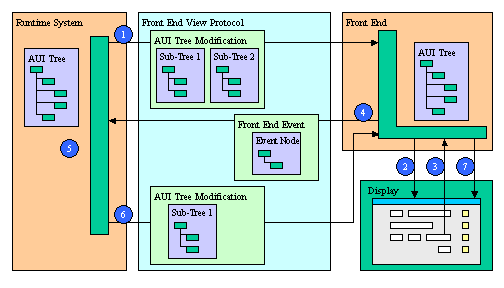

[Back to Contents](../index.html)

------------------------------------------------------------------------

# [Front End Protocol]{#PAGE_HEADER}

This page describes the **Front End Protocol**: the communication
between the [Runtime System](FglTerms.html#RUNTIME_SYSTEM) and the
[Front End](FglTerms.html#FRONT_END).

- [Definition of the Front End Protocol](#DEFINITION)
- [Runtime System Commands](#RSCOMMANDS)
- [Front End Events](#FEEVENTS)
- [Communication Initialization](#INITIALIZATION)
- [GUI Protocol Compression](#COMPRESSION)
- [GUI Protocol Debugging Variable](#FGLGUIDEBUG)

------------------------------------------------------------------------

### [Definition of Front End Protocol]{#DEFINITION}

The purpose of the **Front End Protocol** is to synchronize the
**Abstract User Interface (AUI) Tree** maintained by the Runtime System
and the corresponding copy held by the Front End. For more details about
these concepts, see the [Dynamic User Interface](DynamicUI.html).

The **AUI Tree** is used by the Front End to create graphical objects.
The Front End and the Runtime System have the same version of the AUI
Tree. This way, communications correspond to AUI Tree synchronization
operations: on one hand the Front End sends **modification requests** to
the Runtime System (also called Front End Events); on the other hand,
the Runtime System analyses and validates Front End requests, performs
some codes if required, and sends back **modification orders**.

The following schema describes typical communication between the Runtime
System and the Front End:

{border="0" width="504" height="288"}

1.  [Initialization](#INITIALIZATION) phase: The Runtime System sends
    the initial AUI Tree.
2.  The Front End builds the Graphical User Interface according to the
    AUI Tree.
3.  The Front End waits for a user interaction (mouse click, keyboard
    typing).
4.  When the user performs some interaction, the Front End sends [Front
    End Events](#FEEVENTS) corresponding to the modifications made by
    the user.
5.  [Front End Events](#FEEVENTS) are analyzed and validated by the
    runtime system.
6.  The Runtime System sends back the result of the Front End requests,
    by the way of [AUI Tree Modifications Commands](#RSCOMMANDS).
7.  When receiving these commands, the Front End modifies its version of
    the AUI Tree and updates the Graphical User Interface. It then waits
    for new user interactions (step 3).

------------------------------------------------------------------------

### [String Literals]{#STRING_LITTERALS}

In the Front End Protocol, the type of all attributes is
[string](DataTypes.html#DT_STRING). The value of the attributes follows
the same rules as 4gl [string literals](Literals.html#LT_STRING):

- values are enclosed between double quotes : `"`
- CR character is `\n`
- TAB character is `\t`
- double quotes character is `\"`

#### Example:

``` linenumber
01   { GroupBox 25 {  { text "this is a \"GroupBox\""} } {}}
```

------------------------------------------------------------------------

### [Runtime System Commands]{#RSCOMMANDS}

The Runtime System sends commands to the Front End in order to modify
the User Interface. As discussed earlier, these commands are
modifications of the AUI Tree. Modifications can be:

- [Adding children to a node](#CMD_AN)
- [Changing node attributes](#CMD_UN)
- [Removing a node](#CMD_RN)

#### Syntax:

    om command-id 
    { 
      [ { { appendNodeCommand | updateNodeCommand | removeNodeCommand } } ] [...]
    }

#### Notes:

- *command-id* is the number of the command. This number is
  automatically increased for each command sent by the application to
  the Front End. The very first *appendNodeCommand* used to initialize
  the Protocol is command 0.

**Warning:** **There is no verification made about this order. The
communication wire is supposed to be reliable and the Runner and the
Front End do not perform verification about lost commands.**

------------------------------------------------------------------------

### [Append Node Command]{#CMD_AN}

The **an** command adds one or several children and their attributes to
a specified node. Several children (and sub-children) and can be added
in the same **an** command. This command is sent by the Runtime System
when there are new graphical objects to display, and to
[initialize](#INITIALIZATION) communication.

#### Syntax:

      an parent-id new-node

Where *new-node* is :

      tagName new-id { [ attribute-list ] } { [ child-list ] } }

Where *attribute-list* is :

      { attribute-name "attribute-value" } [...]

Where *children-list* is :

      { new-node } [...]

#### Notes:

1.  *parent-id* identifies the existing node.
2.  *tag-name* identifies the type of the added child. The list of
    possible children for each node is defined in the AUI Tree.
3.  *new-id* is a unique id for the new node created.
4.  *attribute-name* is the name of the attribute of the node.
5.  *attribute-value* is the value of the attribute.

#### Example:

This example shows an `an` command that creates a [Menu](Menus.html) (a
Menu node is added) :


    01 an 0 Menu 356 { { active "1"} { text "MAIN"} { posY "0"} { selection "357"} }
    02 {
    03   { MenuAction 357 { { name "Option1"} { text "Option1"} { comment ""} } {}} 
    04   { MenuAction 358 { { name "Flow"} { text "Flow"} { comment ""} } {}} 
    05   { MenuAction 359 { { name "Window"} { text "Window"} { comment "OPEN WINDOW"} } {}} 
    06   { MenuAction 360 { { name "Form"} { text "Form"} { comment "form: scroll, erase..."} } {}} 
    07   { MenuAction 361 { { name "Dialog"} { text "Dialog"} { comment ""} } {}} 
    08   { MenuAction 362 { { name "Display"} { text "Display"} { comment ""} } {}} 
    09   { MenuAction 363 { { name "Options"} { text "Options"} { comment "OPTIONS"} } {}} 
    10   { MenuAction 364 { { name "Exit"} { text "Exit"} { comment ""} } {}} 
    11 }

------------------------------------------------------------------------

### [Remove Node Command]{#CMD_RN}

The **rn** command removes a specific node. This command is used when
graphical objects are no longer required and need to be removed from the
User Interface.

#### Syntax:

      rn node-id

#### Notes:

1.  *node-id* identifies the existing node to be deleted

#### Example:

This example shows a `rn` command that removes a node from the AUI Tree;
in this example, the node removed would be a MenuAction node created by
the `an` command in the previous example.

``` linenumber
01 rn 357
```

------------------------------------------------------------------------

### [Update Node Command]{#CMD_UN}

The **un** command modifies some attributes of a specific node. This
command is used to modify the aspect of a widget, for example to
validate the value entered by a user in a form field. This command is
also used to confirm a focus change, modifying the `focus` attribute of
the UserInterface node.

#### Syntax:

      un node-id { [ attribute-list ] }

Where *attribute-list* is :

      { attribute-name "attribute-value" } [...]

#### Notes:

1.  *node-id* identifies the modified node.
2.  *attribute-name* is the name of the attribute of the node.
3.  *attribute-value* is the value of the attribute.

#### Example:

This example shows an `un` command confirming a focus change: the focus
now goes to the [Menu](Menus.html) option identified by id \"358\",
created by the `an` command described in the example below. The
UserInterface node has always an id equal to 0 (zero).

``` linenumber
01 un 0 { focus "358" }
```

------------------------------------------------------------------------

### [Front End Events]{#FEEVENTS}

The Front End sends \"modification requests\" represented as \"Front End
Events\" to the Runtime system. A group of modification requests can be
sent in the same `event _om` command.

These events can be:

- events associated to any defined action (`ActionEvent`). This type of
  event is sent if a user invokes an enabled Action: Action within
  Dialog, MenuAction within Menu or StartMenuCommand within StartMenu.

- events associated to closing the current window (`CloseWindowEvent`).
  This type of event is sent if a user wants to close the current
  Window.

- events associated to modifications of the User Interface
  (`ConfigureEvent`). This type of event is sent if a user modifies
  something in the User Interface. Typically, this is used for focus
  changes or when data is entered in a form field.

- events associated to Keyboard action which can not be handled by any
  other event (`KeyEvent`). This type of event is sent to notify the
  Runtime System that a user has pressed one of the following keys :
  `tab`, `shift+tab`, `key_up`, `key_down`, `page_up`, `page_down`. 

- events associated to local functions (`FunctionCallEvent`). This type
  of event is sent when a local function is over, to sent back the
  result of this function. Typically, local functions are [DDE
  Functions](WinDDE.html), [winexec](UtilityFunctions.html#UF_WINEXEC).

- events sent by the Front End to terminate an application
  (`DestroyEvent`). This type of event is sent when there is an error on
  the Front End side that needs that the application terminates.

A very basic Front End needs only to handle `KeyEvent` events, and can
send all keys pressed by the user to the Runtime System. For performance
and more enhancements, most of the key pressed events are handled
locally by the Front End. Only the keys mentioned above are sent. 

#### Syntax:

    event _om command-id {} 
    { 
      { { ConfigureEvent 0 { { idRef "object-id" } attribute-list  } }
      | { KeyEvent 0 { { keyName "key-value" } } }
      | { ActionEvent 0 { { idRef  "object-id" } } }
      | { FunctionCallEvent 0 { { result "result-value" } } }
      | { DestroyEvent 0 { { status "status-value" } { message "message-value" } } }
      } [...]
    }

Where *attribute-list* is :

    { attribute-name "attribute-value" } [...]

#### Notes:

1.  *command-id* is the number of the event. This number is increased
    automatically for each `event _om` command sent by the Front End to
    Runtime System. 
2.  *object-id* is the id of the node which is concerned by the event.
    Typically, this is the id of the object which has been changed by
    the user, such as a form field.
3.  *attribute-name* is the name of the attribute of the node.
4.  *attribute-value* is the value of the attribute.
5.  *key-value* is the value of the key pressed.
6.  *result-value* is the value returned by the local function, after it
    completes execution.
7.  *status-value* is the error identifier that causes the
    `DestroyEvent`.
8.  *message-value* is the error message explaining the reason of the
    `DestroyEvent`.

#### Example:

This example shows an `event _om` command corresponding to the following
interaction:

- the user enters a value into a field. A `ConfigureEvent` with the new
  value is sent.
- the user click with the mouse in another field. A` ConfigureEvent`
  with the position of the cursor in the new field is sent.

<!-- -->


    01 event _om 3 {} 
    02  { 
    03    { ConfigureEvent 0 { { idRef "35" } { value "someText" } { cursor "4" } } }
    04    { ConfigureEvent 0 { { idRef "32" } { cursor "6" } } } 
    05  }           

------------------------------------------------------------------------

### [Communication Initialization]{#INITIALIZATION}

Communication is initiated by the Runtime System, which sends some meta
information to the Front End. The meta information sent is
\"`encoding"`. The Front End replies with some information, to include
the version of the Front End. With communication initialized, the
Runtime System sends the first version of the AUI Tree, generated
according to the interactive elements used in the program (see
[Menus](Menus.html), [Windows and Forms](WindowsAndForms.html)).

The root node of the Tree is the UserInterface node. This node is sent
once to the Front End. The append node command (`an`) is used to create
the root node with an id of zero (\'0\'). The append node command is
then used to add all the children needed by the Front End to build the
initial Graphical User Interface.

#### DVM meta message syntax:

    DVM :   meta Connection {
                  { encoding "character-set" }
                  { protocolVersion "protocol-version" }
                  { interfaceVersion "interface-version" }
                  { runtimeVersion "runtime-version" }
                  { compression "zlib|none" }
                  { encapsulation "0|1" }
            }

#### Notes:

1.  *character-set* defines the encoding character code set used in the
    protocol.
2.  The compression attribute defines the type of compression used. The
    compression method can be \"zlib\" or \"none\". When \"zlib\" is
    used the encapsulation must be enabled. If this attribute is not set
    the default value is \"none\". When the DVM send this attribute it
    is a request. The compression is only used once the front-end
    validates this request.
3.  *protocol-version* defines the version of the protocol (commands).
4.  *interface-version* defines the version of the user interface (nodes
    and attributes).
5.  *runtime-version* defines the version of runtime system (VM).

#### Front-end meta message syntax:

    FE :    meta Client {
                  { name "client-type" }
                  { version "client-version" }
                  { host "hostname" }
                  { port "tcpport" }
                  { connections "count" }
                  { frontEndID2 "frontend-ID2" }
                  { compression "zlib|none" }
                  { encapsulation "0|1" }
                  { filetransfer "0|1" }
            }

#### Notes:

1.  *client-type* is the type of the front end, for example, GDC.
2.  *client-version* is the version of the Front End.
3.  *hostname* is the network address (alphanumeric value) of the
    computer hosting the Front End.
4.  *tcpport* is the network port number used by the connection.
5.  *count* is the number of connections established with the front-end.
6.  *frontend-ID2* identifies the front-end for authentication rules.

------------------------------------------------------------------------

### [GUI Protocol Compression]{#COMPRESSION}

Compression might be used in the GUI protocol to reduce the amount of
data exchanged between the front-end and the application server.
Compression is typically useful on slow networks. The compression
algorithm is provided by the standard ZLIB library of the system.

Compression makes sense on slow networks (for example, with a phone-line
dialup modem, or broadband modem based networks); On fast networks (like
100 Mbps Ethernet based networks), compression uses un-necessary
processor time.

Compression is disabled by default, and can be enabled with this
[FGLPROFILE](FglProfile.html) entry:

    gui.protocol.format = "zlib"

If the above parameter is defined, but the ZLIB library is not installed
on your system, compression cannot be supported, and the program will
stop with error [-6317](FglErrors.html#-6317).

Note that when using the Genero Web Client (GWC/GAS), compression is not
useful and is automatically disabled.

------------------------------------------------------------------------

### [GUI Protocol Debugging Variable]{#FGLGUIDEBUG}

To properly see the GUI communication in a front-end log window, set the
environment variable
[FGLGUIDEBUG](EnvironmentVariables.html#EV_FGLGUIDEBUG) to 1.
