[Back to Contents](../index.html)

------------------------------------------------------------------------

# [Form Specification Files]{#PAGE_HEADER}

Summary:

- [Definition](#DEFINITION)
- [Concepts](#CONCEPTS)
  - [Form Items](#FF_FORM_ITEM)
  - [Form Fields](#FF_FORM_FIELD)
    - [Fields defined with a database column](#FF_DATABASE_FIELDS)
    - [FORMONLY fields](#FF_FORMONLY_FIELD)
  - [Phantom Fields](#FF_PHANTOM_FIELDS)
  - [Item Tags](#FF_ITEM_TAG)
  - [HBox Tags](#FF_HBOX_TAG)
  - [Layout Tags](#FF_LAYOUT_TAG)
- [Form file structure](#STRUCTURE)
  - [SCHEMA](#SECTION_SCHEMA) section
  - [ACTION DEFAULTS](#SECTION_ACTDEFS) section
  - [TOPMENU](#SECTION_TOPMENU) section
  - [TOOLBAR](#SECTION_TOOLBAR) section
  - [SCREEN](#SECTION_SCREEN) section
  - [LAYOUT](#SECTION_LAYOUT) section
    - [HBOX](#FF_CONTAINER_HBOX) container
    - [VBOX](#FF_CONTAINER_VBOX) container
    - [GROUP](#FF_CONTAINER_GROUP) container
    - [FOLDER](#FF_CONTAINER_FOLDER) container
    - [PAGE](#FF_CONTAINER_PAGE) container
    - [GRID](#FF_CONTAINER_GRID) container
    - [SCROLLGRID](#FF_CONTAINER_SCROLLGRID) container
    - [TABLE](#FF_CONTAINER_TABLE) container
    - [TREE](#FF_CONTAINER_TREE) container
  - [TABLES](#SECTION_TABLES) section
  - [ATTRIBUTES](#SECTION_ATTRIBUTES) section
    - [PHANTOM fields](#FF_PHANTOM_FIELDS)
    - [FIELD](#FF_ITEMTYPE_FIELD) item type
    - [EDIT](#FF_ITEMTYPE_EDIT) item type
    - [BUTTON](#FF_ITEMTYPE_BUTTON) item type
    - [BUTTONEDIT](#FF_ITEMTYPE_BUTTONEDIT) item type
    - [CANVAS](#FF_ITEMTYPE_CANVAS) item type
    - [COMBOBOX](#FF_ITEMTYPE_COMBOBOX) item type
    - [CHECKBOX](#FF_ITEMTYPE_CHECKBOX) item type
    - [DATEEDIT](#FF_ITEMTYPE_DATEEDIT) item type
    - [GROUP](#FF_ITEMTYPE_GROUP) item type
    - [IMAGE](#FF_ITEMTYPE_IMAGE) item type
    - [LABEL](#FF_ITEMTYPE_LABEL) item type
    - [PROGRESSBAR](#FF_ITEMTYPE_PROGRESSBAR) item type
    - [RADIOGROUP](#FF_ITEMTYPE_RADIOGROUP) item type
    - [SCROLLGRID](#FF_ITEMTYPE_SCROLLGRID) item type
    - [SLIDER](#FF_ITEMTYPE_SLIDER) item type
    - [SPINEDIT](#FF_ITEMTYPE_SPINEDIT) item type
    - [TABLE](#FF_ITEMTYPE_TABLE) item type
    - [TEXTEDIT](#FF_ITEMTYPE_TEXTEDIT) item type
    - [TIMEEDIT](#FF_ITEMTYPE_TIMEEDIT) item type
    - [WEBCOMPONENT](#FF_ITEMTYPE_WEBCOMPONENT) item type
    - [TREE](#FF_ITEMTYPE_TREE) item type
  - [INSTRUCTIONS](#SECTION_INSTRUCTIONS) section
    - [Screen records](#FF_SCREEN_RECORD)
    - [Screen arrays](#FF_SCREEN_ARRAY)
    - [Field delimiters](#FF_FIELD_DELIMITERS)
  - [KEYS](#SECTION_KEYS) section
- Miscellaneous
  - [Boolean Expressions](#BOOLEXPR)
  - [Compiling Form Files](#COMPILING)
  - [Using Forms in Programs](#USING)

*See also:* [Form Attributes](FSFAttributes.html), [Database
Schema](DatabaseSchema.html), [Localized
Strings](LocalizedStrings.html), [Windows and
Forms](WindowsAndForms.html), [Dynamic User Interface](DynamicUI.html).

------------------------------------------------------------------------

### [Definition]{#DEFINITION}

#### Purpose:

A Form Specification File is a source file that defines an application
screen. This file defines the disposition, presentation, and behavior of
screen elements called [Form Items](#FF_FORM_ITEM).

#### Syntax:

*`filename`*`.per`

#### Notes:

1.  A form specification file is a text-based source file using a
    specific syntax.
2.  Form specification files have a **.per** suffix.
3.  To be used by programs, form specification files must be compiled
    into **.42f** files with the [fglform](Tools.html#TL_FGLFORM) tool.
4.  See the [structure](#STRUCTURE) of a form specification file for
    more details about writing  **.per** files.

#### Warnings:

1.  Compiled form files must be distributed to production sites.

------------------------------------------------------------------------

### [Concepts]{#CONCEPTS}

To write a form specification file, you need to understand the following
concepts:

- [Form Items](#FF_FORM_ITEM)
- [Form Fields](#FF_FORM_FIELD)
- [Item Tags](#FF_ITEM_TAG)
- [HBox Tags](#FF_HBOX_TAG)
- [Layout Tags](#FF_LAYOUT_TAG)
- [Form Structure](#STRUCTURE)

A form file is described with a specific [structure](#STRUCTURE), based
on a [layout](#SECTION_LAYOUT) definition using
[containers](#CONTAINERS) which hold [Form Items](#FF_FORM_ITEM).

------------------------------------------------------------------------

### [Form file structure]{#STRUCTURE}

A form specification file is defined by a set of sections, which must
appear in the order listed below.

- The [SCHEMA](#SECTION_SCHEMA) section
- The [ACTION DEFAULTS](#SECTION_ACTDEFS) section
- The [TOPMENU](#SECTION_TOPMENU) section
- The [TOOLBAR](#SECTION_TOOLBAR) section
- The [LAYOUT](#SECTION_LAYOUT) section
- The [TABLES](#SECTION_TABLES) section
- The [ATTRIBUTES](#SECTION_ATTRIBUTES) section
- The [INSTRUCTIONS](#SECTION_INSTRUCTIONS) section

#### Notes:

1.  Each section must begin with the keyword for which it is named.
2.  The ` LAYOUT` and ` ATTRIBUTES` sections are mandatory.
3.  The `SCHEMA`, `TOPMENU`, `TOOLBAR`, `TABLES` and ` INSTRUCTIONS`
    sections are optional.

------------------------------------------------------------------------

### [SCHEMA Section]{#SECTION_SCHEMA}

Each form specification file can begin with a `SCHEMA` section
identifying the database schema (if any) on which the form is based.
This can be any database schema that is defined with a [database schema
file](DatabaseSchema.html). Form field data types can be automatically
extracted from the schema file if you specify the table and column name
in the form field definition (see [ATTRIBUTES](#SECTION_ATTRIBUTES)
section). 

#### Syntax 1:

`SCHEMA `[`{`]{.underline}` `*`database`*[`[`]{.underline}`@`*`dbserver`*[`]`]{.underline}` `[`|`]{.underline}` `*`string`*` `[`|`]{.underline}` FORMONLY `[`}`]{.underline}` `

1.  This section is optional; if you do not specify it, database schema
    specification defaults to `SCHEMA FORMONLY`.
2.  *database* is the name of the [database schema](DatabaseSchema.html)
    to be used for the form compilation.
3.  *dbserver* identifies the Informix database server (INFORMIXSERVER)
    (see warnings).
4.  *string* can be a [string literal](Literals.html#LT_STRING)
    containing the database name.
5.  You can create a form that is not related to any database schema by
    using the ` FORMONLY` keyword. When using this option, you must omit
    the [TABLES](#SECTION_TABLES) section and define field data types
    explicitly in the [ATTRIBUTES](#SECTION_ATTRIBUTES) section.

#### Warnings:

1.  The `DATABASE` instruction is supported for backward compatibility,
    we recommend using `SCHEMA` instead.
2.  The *database* and *dbserver* specifications are supported (but
    ignored) for backward compatibility with Informix form
    specifications.
3.  When using a specific database schema, the field data types are
    taken from the [schema](DatabaseSchema.html) file **during
    compilation**. Make sure that the schema file of the [development
    database](FglTerms.html#DEVELOPMENT_DATABASE) corresponds to the
    [production database](FglTerms.html#PRODUCTION_DATABASE); otherwise
    the form fields defined in the compiled version of your forms will
    not match the table structures of the production database.

#### Syntax 2:(supported for backward compatibility)

`DATABASE `[`{`]{.underline}` `*`database`*[`[`]{.underline}`@`*`dbserver`*[`]`]{.underline}` `[`|`]{.underline}` `*`string`*` `[`|`]{.underline}` FORMONLY `[`}`]{.underline}` `[`[`]{.underline}` WITHOUT NULL INPUT `[`]`]{.underline}

The `DATABASE` syntax is supported for compatibility with Informix 4gl;
using `SCHEMA` is recommended.

#### Notes:

1.  This section is optional; if you do not specify it, database schema
    specification defaults to `FORMONLY`.
2.  *database* is the name of the [database schema](DatabaseSchema.html)
    to be used for the form compilation.
3.  *dbserver* identifies the Informix database server (INFORMIXSERVER)
    (see warnings).
4.  *string* can be a [string literal](Literals.html#LT_STRING)
    containing the database name.
5.  You can create a form that is not related to any database schema by
    using the ` FORMONLY` keyword. When using this option, you must omit
    the [TABLES](#SECTION_TABLES) section and define field data types
    explicitly in the [ATTRIBUTES](#SECTION_ATTRIBUTES) section.
6.  The use of the `WITHOUT NULL INPUT` option is supported for backward
    compatibility, but is ignored.

------------------------------------------------------------------------

### [ACTION DEFAULTS Section]{#SECTION_ACTDEFS}

The `ACTION DEFAULTS` section defines local action view default
attributes for the form elements.

#### Syntax:

`ACTION DEFAULTS`\
`  ACTION `*`action-identifier`*` ( `*`action-attribute`*` `[`[`]{.underline}`,...`[`]`]{.underline}` )`\
`  `[`[`]{.underline}`...`[`]`\]{.underline}
`END`

Notes:

1.  The `ACTION DEFAULTS` section must appear after
    [SCHEMA](#SECTION_SCHEMA).
2.  This section is optional.
3.  *action-identifier* defines the name of the action.
4.  *action-attribute* defines an attribute value.\
    Valid attribute values include:\
    [TEXT](FSFAttributes.html#FA_TEXT),
    [IMAGE](FSFAttributes.html#FA_IMAGE),
    [COMMENT](FSFAttributes.html#FA_COMMENT),
    [ACCELERATOR](FSFAttributes.html#FA_ACCELERATOR),
    [ACCELERATOR2](FSFAttributes.html#FA_ACCELERATOR2),
    [ACCELERATOR3](FSFAttributes.html#FA_ACCELERATOR3),
    [ACCELERATOR4](FSFAttributes.html#FA_ACCELERATOR4),
    [DEFAULTVIEW](FSFAttributes.html#FA_DEFAULTVIEW),
    [VALIDATE](FSFAttributes.html#FA_VALIDATE),
    [CONTEXTMENU](FSFAttributes.html#FA_CONTEXTMENU).

#### Usage:

The `ACTION DEFAULTS` section centralizes action view attributes (text,
comment, image, accelerators) at the form level. 

You give a list of `ACTION` elements and specify attributes for each
action. The action is identified by the name following the `ACTION`
keyword, and attributes are specified in a list between parenthesis.

The attributes defined in this section are applied to form action views
like Buttons, Toolbar buttons, or Topmenu options, if the individual
action views do not explicitly define their own attributes.

If an attribute is not found in the form action defaults, and has not
been defined specifically for the individual action view, the runtime
system searches for the attribute value in the global action defaults.

See [Action Defaults](ActionDefaults.html) and [Interaction
Model](InteractionModel.html) for more details about each attribute.

#### Example:

``` linenumber
01 ACTION DEFAULTS
02   ACTION accept ( COMMENT="Commit order record changes", CONTEXTMENU=NO )
03   ACTION cancel ( TEXT="Stop", IMAGE="stop", ACCELERATOR=SHIFT-F2, VALIDATE=NO )
04   ACTION print ( COMMENT="Print order information", ACCELERATOR=CONTROL-P, ACCELERATOR2=F5 )
05   ACTION zoom1 ( COMMENT="Open items list", VALIDATE=NO )
06   ACTION zoom2 ( COMMENT="Open customers list", VALIDATE=NO )
07 END
```

------------------------------------------------------------------------

### [TOPMENU Section]{#SECTION_TOPMENU}

The `TOPMENU` section defines a pull-down menu with options that are
bound to [actions](InteractionModel.html).

#### Syntax:

`TOPMENU `[`[`]{.underline}*`menu-identifier`*[`]`]{.underline}` ( `*`menu-attribute`*` `[`[`]{.underline}`,...`[`]`]{.underline}` )`\
`  `*`group`*\
`  `[`[`]{.underline}`...`[`]`\]{.underline}
`END`

where *group* is:

`GROUP `*`group-identifier`*` ( `*`group-attribute`*` `[`[`]{.underline}`,...`[`]`]{.underline}` )`\
`  `[`{`]{.underline}` `*`command`*\
`  `[`|`]{.underline}` `*`group`*\
`  `[`|`]{.underline}` `*`separator`*\
`  `[`}`]{.underline}` `[`[`]{.underline}`...`[`]`\]{.underline}
`END`

where *command* is:

`COMMAND `*`command-identifier`*` ( `*`command-attribute`*` `[`[`]{.underline}`,...`[`]`]{.underline}` )`

and *separator* is:

`SEPARATOR `[`[`]{.underline}*`separator-identifier`[`]`]{.underline}*` ( `*`separator-attribute`*` `[`[`]{.underline}`,...`[`]`]{.underline}` )`

Notes:

1.  The `TOPMENU` section must appear in the sequence described in [Form
    File Structure.](#STRUCTURE)
2.  This section is optional.
3.  *menu-identifier* defines the name of the top menu (optional).
4.  *group-identifier* defines the name of the group.
5.  *command-identifier* defines the name of the action to bind to. The
    action name can be prefixed with the [sub-dialog
    identifier](MultipleDialogs.html#binding-actions).
6.  *separator-identifier* defines the name of the separator (optional).
7.  *menu-attribute* can be: [STYLE](FSFAttributes.html#FA_STYLE),
    [TAG](FSFAttributes.html#FA_TAG).
8.  *group-attribute* is one of: [STYLE](FSFAttributes.html#FA_STYLE),
    [TEXT](FSFAttributes.html#FA_TEXT),
    [IMAGE](FSFAttributes.html#FA_IMAGE),
    [COMMENT](FSFAttributes.html#FA_COMMENT),
    [TAG](FSFAttributes.html#FA_TAG),
    [HIDDEN](FSFAttributes.html#FA_HIDDEN).
9.  *command-attribute* is one of: [STYLE](FSFAttributes.html#FA_STYLE),
    [TEXT](FSFAttributes.html#FA_TEXT),
    [IMAGE](FSFAttributes.html#FA_IMAGE),
    [COMMENT](FSFAttributes.html#FA_COMMENT),
    [TAG](FSFAttributes.html#FA_TAG),
    [HIDDEN](FSFAttributes.html#FA_HIDDEN),
    [ACCELERATOR](FSFAttributes.html#FA_ACCELERATOR).
10. *separator-attribute* is one of:
    [STYLE](FSFAttributes.html#FA_STYLE),
    [TAG](FSFAttributes.html#FA_TAG),
    [HIDDEN](FSFAttributes.html#FA_HIDDEN).

#### Usage:

The `TOPMENU` section is provided to define a pull-down menu in a
form. You build a tree of `GROUP` elements to design the pull-down menu.
A `GROUP` can contain `COMMAND`, `SEPARATOR` or `GROUP` children. A
`COMMAND` defines a pull-down menu option that triggers an action when
it is selected. In the Topmenu specification, *command-identifier*
defines which action a menu option is bound to. For example, if you
define a Topmenu option as \"`COMMAND zoom`\", it can be controlled by
an \"`ON ACTION zoom`\" clause in an interactive instruction.

The Topmenu commands are enabled according to the actions defined by the
current interactive instruction, which can be [MENU](Menus.html),
[INPUT](RecordInput.html), [INPUT ARRAY](InputArray.html), [DISPLAY
ARRAY](DisplayArray.html) or [CONSTRUCT](Construct.html). See also
[Interaction Model](InteractionModel.html) for more details about action
management. You can use the [Predefined
Actions](InteractionModel.html#PREDEFACTIONS) to bind Topmenu commands
to common actions such as dialog validation and cancellation.

An accelerator name can be defined for a TopMenu Command; this
accelerator name will be used for display in the command item. You must
define he same accelerator in the [Action Defaults](ActionDefaults.html)
section for the action name of the TopMenu command.

`TOPMENU` elements can get a `style` attribute in order to use a
specific rendering/decoration following [Presentation
Style](PresentationStyles.html) definitions.

See also: [Topmenus](Topmenus.html).

#### Example:

``` linenumber
01 TOPMENU tm ( STYLE="mystyle" )
02   GROUP form (TEXT="Form")
03      COMMAND help (TEXT="Help", IMAGE="quest")
04      COMMAND quit (TEXT="Quit")
05   END
06   GROUP edit (TEXT="Edit")
07      COMMAND accept (TEXT="Validate", IMAGE="ok", TAG="acceptMenu")
08      COMMAND cancel (TEXT="Cancel", IMAGE="cancel")
09      SEPARATOR
10      COMMAND editcut   -- Gets its decoration from action defaults
11      COMMAND editcopy  -- Gets its decoration from action defaults
12      COMMAND editpaste -- Gets its decoration from action defaults
13   END
14   GROUP records (TEXT="Records")
15      COMMAND append (TEXT="Add", IMAGE="plus")
16      COMMAND delete (TEXT="Remove", IMAGE="minus")
17      COMMAND update (TEXT="Modify", IMAGE="accept")
18      SEPARATOR (TAG="lastSeparator")
19      COMMAND search (TEXT="Search", IMAGE="find")
20   END
21 END
```

------------------------------------------------------------------------

### [TOOLBAR Section]{#SECTION_TOOLBAR}

The `TOOLBAR` section defines a toolbar with buttons that are bound to
[actions](InteractionModel.html).

#### Syntax:

`TOOLBAR [`*`toolbar-identifier]`*` `[`[`]{.underline}` ( `*`toolbar-attribute`*` `[`[`]{.underline}`,...`[`]`]{.underline}` ) `[`]`]{.underline}\
`  { ITEM `*`item-identifier`*`  `[`[`]{.underline}` ( `*`item-attribute`*` `[`[`]{.underline}`,...`[`]`]{.underline}` ) `[`]`]{.underline}\
`  | SEPARATOR `[`[`]{.underline}*`separator-identifier`*[`]`]{.underline}` `[`[`]{.underline}` ( `*`separator-attribute`*` `[`[`]{.underline}`,...`[`]`]{.underline}` ) `[`]`]{.underline}\
`  }`\
`  `[`[`]{.underline}`...`[`]`\]{.underline}
`END`

#### Notes:

1.  The `TOOLBAR` section must appear in the sequence described in [Form
    File Structure.](#STRUCTURE)
2.  This section is optional.
3.  *toolbar-identifier* defines the name of the toolbar (optional). 
4.  *item-identifier* defines the name of the action to bind to. Can be
    prefixed with the [sub-dialog
    identifier](MultipleDialogs.html#binding-actions).
5.  *separator-identifier* defines the name of the separator
    (optional). 
6.  *toolbar-attribute* is one of: [STYLE](FSFAttributes.html#FA_STYLE),
    [TAG](FSFAttributes.html#FA_TAG),
    [BUTTONTEXTHIDDEN](FSFAttributes.html#FA_BUTTONTEXTHIDDEN).
7.  *item-attribute* is one of: [STYLE](FSFAttributes.html#FA_STYLE),
    [TAG](FSFAttributes.html#FA_TAG),
    [TEXT](FSFAttributes.html#FA_TEXT),
    [IMAGE](FSFAttributes.html#FA_IMAGE),
    [COMMENT](FSFAttributes.html#FA_COMMENT),
    [HIDDEN](FSFAttributes.html#FA_HIDDEN).
8.  *separator-attribute* is one of:
    [STYLE](FSFAttributes.html#FA_STYLE),
    [TAG](FSFAttributes.html#FA_TAG),
    [HIDDEN](FSFAttributes.html#FA_HIDDEN).

#### Usage:

The `TOOLBAR` section defines a toolbar in a form. A `TOOLBAR` section
defines a set of `ITEM` elements that can be grouped by using a
`SEPARATOR` element. Each `ITEM` defines a toolbar button associated to
an [action](InteractionModel.html) by name. The `SEPARATOR` keyword
specifies a vertical line.

The Toolbar buttons are enabled according to the actions defined by the
current interactive instruction, which can be [MENU](Menus.html),
[INPUT](RecordInput.html), [INPUT ARRAY](InputArray.html), [DISPLAY
ARRAY](DisplayArray.html) or [CONSTRUCT](Construct.html). See also
[Interaction Model](InteractionModel.html) for more details about action
management. You can use the [Predefined
Actions](InteractionModel.html#PREDEFACTIONS) to bind toolbar buttons to
common actions such as dialog validation and cancellation.

The `TOOLBAR` supports the
[BUTTONTEXTHIDDEN](FSFAttributes.html#FA_BUTTONTEXTHIDDEN) attribute to
hide the labels of buttons. Button labels are visible by default.

`TOOLBAR` elements can get a `style` attribute in order to use a
specific rendering/decoration following [Presentation
Style](PresentationStyles.html) definitions.

See also: [Toolbars](Toolbars.html).

#### Example:

``` linenumber
01 TOOLBAR tb ( STYLE="mystyle" )
02   ITEM accept ( TEXT="Ok", IMAGE="ok" )
03   ITEM cancel ( TEXT="Cancel", IMAGE="cancel" )
04   SEPARATOR
05   ITEM editcut   -- Gets its decoration from action defaults
06   ITEM editcopy  -- Gets its decoration from action defaults
07   ITEM editpaste -- Gets its decoration from action defaults
08   SEPARATOR ( TAG="lastSeparator")
09   ITEM append ( TEXT="Append", IMAGE="add" )
10   ITEM update ( TEXT="Update", IMAGE="modify" )
11   ITEM delete ( TEXT="Delete", IMAGE="del" )
12   ITEM search ( TEXT="Search", IMAGE="find" )
13 END
```

------------------------------------------------------------------------

### [SCREEN Section]{#SECTION_SCREEN}

To implement forms for dump terminals in TUI mode, you must define a
` SCREEN` section in place of `LAYOUT`.

#### Syntax:

`SCREEN `[`[`]{.underline}` SIZE `*`lines`*` `[`[`]{.underline}` BY `*`chars`*` `[`]`]{.underline}` `[`]`]{.underline}` `[`[`]{.underline}` TITLE "`*`title`*`" `[`]`]{.underline}\
`{`\
`  `[`{`]{.underline}` `*`text`*` `[`|`]{.underline}` [ `*`item-tag`*` `[`[`]{.underline}` | `*`item-tag`*` `[`]`]{.underline}` `[`[...]`]{.underline}` ] `[`}`]{.underline}\
`  `[`[...]`]{.underline}\
`}`\
[`[`]{.underline}`END`[`]`]{.underline}

#### Notes:

1.  The SCREEN section must be used to design
    [TUI](FglTerms.html#TEXT_USER_INTERFACE) mode screens.
2.  This section is [mandatory]{.underline}, unless you use a
    [LAYOUT](#SECTION_LAYOUT) section instead.
3.  *lines* is the number of characters the form can display vertically.
    The default is 24.
4.  *chars* is the number of characters the form can display
    horizontally. The default is the maximum number of characters in any
    line of the screen definition.
5.  *title* is the title for the topwindow. 
6.  The `{}` curly braces are used to delimit the body of the screen.
7.  See [LAYOUT](#SECTION_LAYOUT) section for the definition of
    *item-tag* and *text*.
8.  The ` END` keyword is optional.

#### The screen body

Inside the ` SCREEN` section, you can define the position of text labels
and form fields.

Horizontal lines can be specified with a set of dash characters.

**Warning: Avoid TAB characters inside the curly-brace delimited area.
If used, TAB characters will be replaced by 8 blanks.**

#### Example:

``` linenumber
01 SCREEN
02 {
03   CustId  : [f001   ] Name: [f002                ]
04   Address : [f003                                ]
05             [f003                                ]
06   ------------------------------------------------
07 }
08 END
```

------------------------------------------------------------------------

### [LAYOUT Section]{#SECTION_LAYOUT}

The ` LAYOUT` section defines the graphical alignment of the form by
using a tree of *layout containers*.

#### Syntax:

`LAYOUT `[`[`]{.underline}`(`*`attribute`*[`[`]{.underline}`=`*`value`*[`][,...]`]{.underline}`)`[`]`]{.underline}\
`  `*`root-layout-container`*\
[`[`]{.underline}`END`[`]`]{.underline}

#### Notes:

1.  The `LAYOUT` section must appear in the sequence described in [Form
    File Structure.](#STRUCTURE)
2.  This section is [mandatory]{.underline}, unless you use a
    [SCREEN](#SECTION_SCREEN) section for backward compatibility.
3.  *attribute* can, for example, be
    \'[TEXT](FSFAttributes.html#FA_TEXT)\' to define the title of the
    top window.
4.  *root-layout-container* is the first container that holds other
    containers.
5.  Indentation is supported in the `LAYOUT` section.
6.  The `END` keyword is optional.

#### Attributes:

[IMAGE](FSFAttributes.html#FA_IMAGE),
[MINHEIGHT](FSFAttributes.html#FA_MINHEIGHT),
[MINWIDTH](FSFAttributes.html#FA_MINWIDTH),
[TEXT](FSFAttributes.html#FA_TEXT), [TAG](FSFAttributes.html#FA_TAG),
[STYLE](FSFAttributes.html#FA_STYLE),
[VERSION](FSFAttributes.html#FA_VERSION),
[SPACING](FSFAttributes.html#FA_SPACING),
[WINDOWSTYLE](FSFAttributes.html#FA_WINDOWSTYLE).

#### Usage:

You define the layout tree of the form by associating *[layout
containers](#CONTAINERS)*. Different kinds of layout containers are
provided, each of them having a specific role. Some containers can hold
children containers, while others can define a *screen area*. Containers
using a *screen area* define a formatted region containing *static text
labels*, *[item tags](#FF_ITEM_TAG)* and *[layout
tags](#FF_LAYOUT_TAG)*. The ` END` keyword is mandatory; it defines the
end of a container block.

> `LAYOUT`\
> `  VBOX`\
> `    GRID`\
> `      `*`grid-area`*\
> `    END`\
> `    GROUP`\
> `      HBOX`\
> `        GRID`\
> `          `*`grid-area`*\
> `        END`\
> `        TABLE`\
> `          `*`table-area`*\
> `        END`\
> `      END`\
> `    END`\
> `  END`\
> `END`

The above definition would result in a layout tree that looks like this:

> `-- VBOX`\
> `   |`\
> `   +-- GRID 1`\
> `   |`\
> `   +-- GROUP`\
> `       |`\
> `       +-- HBOX`\
> `           |`\
> `           +-- GRID 2`\
> `           |`\
> `           +-- TABLE 1`

The layout section can also contain a simple ` GRID` container
(equivalent to a V3 SCREEN definition):

> `LAYOUT`\
> `  GRID`\
> `    `*`grid-area`*\
> `  END`\
> `END`

#### Description of attributes:

The [MINHEIGHT](FSFAttributes.html#FA_MINHEIGHT),
[MINWIDTH](FSFAttributes.html#FA_MINWIDTH) attributes can be used to
specify a minimum width and height for the form. You typically use these
attributes to force the form to get a bigger size as the default when it
is first rendered. Note that if the front-end stores window sizes, these
attributes will only be significant the first time the form is opened,
or each time the [VERSION](FSFAttributes.html#FA_VERSION) attribute is
changed.

The [VERSION](FSFAttributes.html#FA_VERSION) attribute can be used to
specify a version for the form. This allows you to indicate that the
form content has changed. Typically used to avoid having the front-end
reload the saved window settings.

The [IMAGE](FSFAttributes.html#FA_IMAGE) attribute can be used to define
the icon of the window that will display the form. This attribute will
automatically be applied to the parent window node when a form is
loaded. See [Windows and Forms](WindowsAndForms.html#WINDOW_ICONS) for
more details.

The [TEXT](FSFAttributes.html#FA_TEXT) attribute can be used to define
the title of the window that will display the form. This attribute will
automatically be applied to the parent window node when a form is
loaded. See [Windows and Forms](WindowsAndForms.html#WINDOW_TITLES) for
more details.

The [SPACING](FSFAttributes.html#FA_SPACING) attribute can be used to
give a hint to the front-end to define the gad between form elements.

The [STYLE](FSFAttributes.html#FA_STYLE) attribute defines the
[decoration style](PresentationStyles.html) for form elements, you can
for example define a font property for all form elements.  See [Windows
and Forms](WindowsAndForms.html#WINDOW_STYLES) for more details.

With the [WINDOWSTYLE](FSFAttributes.html#FA_WINDOWSTYLE) attribute, you
can define the window type and decoration. This attribute will
automatically be applied to the parent window when a form is loaded. See
[Windows and Forms](WindowsAndForms.html#WINDOW_STYLES) for more
details. For backward compatibility, the `STYLE` attribute is used as
the default `WINDOWSTYLE` if this attribute is not used.

#### Example:

``` linenumber
01 LAYOUT ( TEXT="Customers", WINDOWSTYLE="dialog", VERSION="1.20" )
```

------------------------------------------------------------------------

### [[Layout Containers]{#CONTAINERS}]{.underline}

Layout Containers are blocks holding other layout containers or defining
a formatted screen region.

#### Syntax:

*`container-type`*` `[`[`]{.underline}`identifier`[`]`]{.underline}` `[`[`]{.underline}`(`*`attribute`*[`[`]{.underline}`=`*`value`*[`][,...]`]{.underline}`)`[`]`]{.underline}\
`  `*`child-container`*\
`  `[`[...]`]{.underline}\
`END`

where *child-container* can be:

[`{`]{.underline}\
`  VBOX `[`[`]{.underline}`identifier`[`]`]{.underline}` `[`[`]{.underline}`(`*`attribute`*[`[`]{.underline}`=`*`value`*[`][,...]`]{.underline}`)`[`]`]{.underline}\
`    `*`child-container`*\
`    `[`[...]`]{.underline}\
`  END`\
[`|`]{.underline}\
`  HBOX `[`[`]{.underline}`identifier`[`]`]{.underline}` `[`[`]{.underline}`(`*`attribute`*[`[`]{.underline}`=`*`value`*[`][,...]`]{.underline}`)`[`]`]{.underline}\
`    `*`child-container`*\
`    `[`[...]`]{.underline}\
`  END`\
[`|`]{.underline}\
`  GROUP `[`[`]{.underline}`identifier`[`]`]{.underline}` `[`[`]{.underline}`(`*`attribute`*[`[`]{.underline}`=`*`value`*[`][,...]`]{.underline}`)`[`]`]{.underline}\
`    `*`child-container`*\
`    `[`[...]`]{.underline}\
`  END`\
[`|`]{.underline}\
`  FOLDER `[`[`]{.underline}`identifier`[`]`]{.underline}` `[`[`]{.underline}`(`*`attribute`*[`[`]{.underline}`=`*`value`*[`][,...]`]{.underline}`)`[`]`]{.underline}\
`    PAGE `[`[`]{.underline}`identifier`[`]`]{.underline}` `[`[`]{.underline}`(`*`attribute`*[`[`]{.underline}`=`*`value`*[`][,...]`]{.underline}`)`[`]`]{.underline}\
`      `*`child-container`*\
`      `[`[...]`]{.underline}\
`    END`\
`    `[`[...]`]{.underline}\
`  END`\
[`|`]{.underline}\
`  GRID `[`[`]{.underline}`identifier`[`]`]{.underline}` `[`[`]{.underline}`(`*`attribute`*[`[`]{.underline}`=`*`value`*[`][,...]`]{.underline}`)`[`]`]{.underline}\
`  {`\
`   `*`grid-area`*\
`  }`\
`  END`\
[`|`]{.underline}\
`  SCROLLGRID `[`[`]{.underline}`identifier`[`]`]{.underline}` `[`[`]{.underline}`(`*`attribute`*[`[`]{.underline}`=`*`value`*[`][,...]`]{.underline}`)`[`]`]{.underline}\
`  {`\
`   `*`scroll-area`*\
`  }`\
`  END`\
[`|`]{.underline}\
`  TABLE `[`[`]{.underline}`identifier`[`]`]{.underline}` `[`[`]{.underline}`(`*`attribute`*[`[`]{.underline}`=`*`value`*[`][,...]`]{.underline}`)`[`]`]{.underline}\
`  {`\
`   `*`table-area`*\
`  }`\
`  END`\
[`|`]{.underline}\
`  TREE `[`[`]{.underline}`identifier`[`]`]{.underline}` `[`[`]{.underline}`(`*`attribute`*[`[`]{.underline}`=`*`value`*[`][,...]`]{.underline}`)`[`]`]{.underline}\
`  {`\
`   `*`tree-view-area`*\
`  }`\
`  END`\
[`}`]{.underline}

#### Notes:

1.  *container-type* defines the type of container. A container type can
    be one of the keywords listed below.
2.  *identifier* is an optional name that can be used in the program to
    identify the container.
3.  *attribute* is a predefined attribute name that can be used to
    customize the layout container.
4.  *value* can be a quoted string, an integer, or a boolean value
    (TRUE/FALSE).
5.  *grid-area* is a text block delimited by curly braces, containing
    *static text labels*, *[item tags](#FF_ITEM_TAG)* and *[layout
    tags](#FF_LAYOUT_TAG)*.\
    See [GRID](#FF_CONTAINER_GRID) for more details.
6.  *scroll-area* is a text block similar to *grid-area*, except that
    you can define multiple rows for a list-grid view.\
    See [SCROLLGRID](#FF_CONTAINER_SCROLLGRID) for more details.
7.  *table-area* is a special kind of *grid-area*, used to define the
    columns of a screen array.\
    See [TABLE](#FF_CONTAINER_TABLE) for more details.
8.  *tree-view-area* is a special kind of *grid-area*, used to define
    the columns of a screen array.\
    See [TREE](#FF_CONTAINER_TREE) for more details.
9.  The position of the opening curly brace defines the left-most
    character in a *screen- area*, *scroll-area* and *table-area*.
10. The *grid-area*, *scroll-area* and *table-area* must end with a line
    having a closing curly brace.
11. The ` END` keyword is [mandatory]{.underline}.

#### Type of Containers:

Different types of *layout containers* are provided, each of them having
a specific usage:

::: {align="center"}
  ------------------------------------------ ------------------------------------------------------------ -----------------------
  **Name**                                   **Can Hold**                                                 **Description**

  [`VBOX`](#FF_CONTAINER_VBOX)               `VBOX, HBOX, GROUP, FOLDER, GRID, SCROLLGRID, TABLE, TREE`   Packs contained
                                                                                                          elements vertically,
                                                                                                          without any decoration.

  [`HBOX`](#FF_CONTAINER_HBOX)               `VBOX, HBOX, GROUP, FOLDER, GRID, SCROLLGRID, TABLE, TREE`   Packs contained
                                                                                                          elements horizontally,
                                                                                                          without any decoration.

  [`GROUP`](#FF_CONTAINER_GROUP)             `VBOX, HBOX, GROUP, FOLDER, GRID, SCROLLGRID, TABLE, TREE`   Decorates the contained
                                                                                                          element with a rounded
                                                                                                          box that has a title.

  [`FOLDER`](#FF_CONTAINER_FOLDER)           `PAGE`                                                       Presents contained
                                                                                                          pages in a folder tab.\
                                                                                                          Can only contain PAGE
                                                                                                          children!

  [`PAGE`](#FF_CONTAINER_PAGE)               `VBOX, HBOX, GROUP, FOLDER, GRID, SCROLLGRID, TABLE, TREE`   Defines a page of a
                                                                                                          `FOLDER` container.\
                                                                                                          Can only be used in
                                                                                                          FOLDER!

  [`GRID`](#FF_CONTAINER_GRID)               *`grid-area`*                                                Unique-record
                                                                                                          presentation with
                                                                                                          positioned fields and
                                                                                                          labels.

  [`SCROLLGRID`](#FF_CONTAINER_SCROLLGRID)   *`scroll-area`*                                              Multiple-record
                                                                                                          presentation with
                                                                                                          positioned fields and
                                                                                                          labels.

  [`TABLE`](#FF_CONTAINER_TABLE)             *`table-area`*                                               Record-list
                                                                                                          presentation with
                                                                                                          columns and rows.

  [`TREE`](#FF_CONTAINER_TREE)               *`tree-view-area`*                                           Record-list
                                                                                                          presentation with
                                                                                                          tree-view and
                                                                                                          additional columns.
  ------------------------------------------ ------------------------------------------------------------ -----------------------
:::

#### Identifying Containers:

In most cases you do not need to give a name to a container because it
is only used in the form file to define the layout. However, if you want
to change some attributes at runtime, you must identify the container.
You can give a name to the container by writing an *identifier* after
the container type, for example:

``` linenumber
01 GROUP group1 (TEXT="Customer")
```

In this example, the group name is \'`group1`\', and it can be used in a
program to identify the element:

``` linenumber
01 DEFINE w ui.Window
02 DEFINE g om.DomNode
03 LET w = ui.Window.getCurrent()
04 LET g = w.findNode("Group","group1")
05 CALL g.setAttribute("text","This is the first group") 
```

------------------------------------------------------------------------

### [HBOX Container]{#FF_CONTAINER_HBOX}

The `HBOX` container automatically packs the contained elements
[horizontally]{.underline} from left to right. Contained elements are
packed in the order in which they appear in the ` LAYOUT` section of the
form file. No decoration is added when you use a `HBOX` container. By
combining ` VBOX` and ` HBOX` containers, you can define any alignment
you choose.

#### Syntax:

`HBOX `[`[`]{.underline}*`identifier`*[`]`]{.underline}` `[`[`]{.underline}`(`*`attribute`*[`[`]{.underline}`=`*`value`*[`][,...]`]{.underline}`)`[`]`\]{.underline}
`   `*`layout-container`*\
`  `[`[...]`\]{.underline}
` END`

#### Attributes:

[COMMENT](FSFAttributes.html#FA_COMMENT),
[FONTPITCH](FSFAttributes.html#FA_FONTPITCH),
[HIDDEN](FSFAttributes.html#FA_HIDDEN),
[STYLE](FSFAttributes.html#FA_STYLE),
[SPLITTER](FSFAttributes.html#FA_SPLITTER),
[TAG](FSFAttributes.html#FA_TAG).

#### Example:

``` linenumber
01 HBOX
02   GROUP ( TEXT = "Customer" )
03   {
04    ...
05   }
06   END
07   TABLE
08   {
09    ...
10   }
11   END
12 END
```

------------------------------------------------------------------------

### [VBOX Container]{#FF_CONTAINER_VBOX}

The `VBOX` container automatically packs the contained elements
[vertically]{.underline} from top to bottom. Contained elements are
packed in the order in which they appear in the ` LAYOUT` section of the
form file. No decoration is added when you use a `VBOX` container. By
combining ` VBOX` and ` HBOX` containers, you can define any alignment
you choose.

#### Syntax:

`VBOX `[`[`]{.underline}*`identifier`*[`]`]{.underline}` `[`[`]{.underline}` (`*`attribute`*[`[`]{.underline}`=`*`value`*[`][,...]`]{.underline}`)`[`]`\]{.underline}
`   `*`layout-container`*\
`  `[`[...]`\]{.underline}
` END`

#### Attributes:

[COMMENT](FSFAttributes.html#FA_COMMENT),
[FONTPITCH](FSFAttributes.html#FA_FONTPITCH),
[HIDDEN](FSFAttributes.html#FA_HIDDEN),
[STYLE](FSFAttributes.html#FA_STYLE),
[SPLITTER](FSFAttributes.html#FA_SPLITTER),
[TAG](FSFAttributes.html#FA_TAG).

#### Example:

``` linenumber
01 VBOX
02   GROUP ( TEXT = "Customer" )
03   {
04    ...
05   }
06   END
07   TABLE
08   {
09    ...
10   }
11   END
12 END
```

------------------------------------------------------------------------

### [GROUP Container]{#FF_CONTAINER_GROUP}

A `GROUP` container can be used to display a titled box (usually called
a *groupbox*) around contained elements. To display a groupbox widget
around a set of fields, you simply put a ` GROUP` declaration around a
` GRID` definition. If you want to include several children in a
`GROUP`, you can add a ` VBOX` or ` HBOX` into the ` GROUP,` to define
how these elements are aligned.

#### Syntax:

`GROUP `[`[`]{.underline}*`identifier`*[`]`]{.underline}` `[`[`]{.underline}`(`*`attribute`*[`[`]{.underline}`=`*`value`*[`][,...]`]{.underline}`)`[`]`\]{.underline}
`   `*`layout-container`*\
`  `[`[...]`\]{.underline}
` END`

#### Attributes:

[COMMENT](FSFAttributes.html#FA_COMMENT),
[FONTPITCH](FSFAttributes.html#FA_FONTPITCH),
[STYLE](FSFAttributes.html#FA_STYLE), [TAG](FSFAttributes.html#FA_TAG),
[HIDDEN](FSFAttributes.html#FA_HIDDEN).
[TEXT](FSFAttributes.html#FA_TEXT).

#### Usage:

Note that when using the `GROUP` container syntax, you cannot set the
[GRIDCHILDRENINPARENT](FSFAttributes.html#FA_GRIDCHILDRENINPARENT)
attribute. This attribute makes sense only if the parent of the `GROUP`
is a `GRID`. 

#### Example:

``` linenumber
01 GROUP ( TEXT = "Customer" )
02   VBOX
03     GRID
04     {
05      ...
06     }
07     END
08     TABLE
09     {
10      ...
11     }
12     END
13   END
14 END
```

------------------------------------------------------------------------

### [FOLDER Container]{#FF_CONTAINER_FOLDER}

A `FOLDER` container can be used to display children (pages) inside a
\"folder tab\" widget. You must define each folder page with a
[PAGE](#FF_CONTAINER_PAGE) container inside the `FOLDER` container. Each
`PAGE` container will be displayed on a separate folder page, accessed
by TAB CONTROL click. If you want to include several containers in one
page of a `FOLDER`, you can add a `VBOX` or an `HBOX` container to
define how these elements are aligned.

#### Syntax:

`FOLDER `[`[`]{.underline}*`identifier`*[`]`]{.underline}` `[`[`]{.underline}`(`*`attribute`*[`[`]{.underline}`=`*`value`*[`][,...]`]{.underline}`)`[`]`]{.underline}\
`  `*`page-definition`*\
`  `[`[...]`]{.underline}\
`END`

#### Attributes:

[COMMENT](FSFAttributes.html#FA_COMMENT),
[FONTPITCH](FSFAttributes.html#FA_FONTPITCH),
[STYLE](FSFAttributes.html#FA_STYLE), [TAG](FSFAttributes.html#FA_TAG),
[HIDDEN](FSFAttributes.html#FA_HIDDEN).

In the above syntax, the *page-definition* defines one page of the
folder. See [PAGE](#FF_CONTAINER_PAGE) container for more details.

------------------------------------------------------------------------

### [PAGE Container]{#FF_CONTAINER_PAGE}

A `PAGE` container can only be a child of a
[FOLDER](#FF_CONTAINER_FOLDER) container. A `PAGE` container is defined
as follows:

`PAGE `[`[`]{.underline}*`identifier`*[`]`]{.underline}` `[`[`]{.underline}`(`*`attribute`*[`[`]{.underline}`=`*`value`*[`][,...]`]{.underline}`)`[`]`]{.underline}\
`  `*`layout-container`*\
`  `[`[...]`]{.underline}\
`END`

#### Attributes:

[ACTION](FSFAttributes.html#FA_ACTION),
[COMMENT](FSFAttributes.html#FA_COMMENT),
[STYLE](FSFAttributes.html#FA_STYLE), [TAG](FSFAttributes.html#FA_TAG),
[HIDDEN](FSFAttributes.html#FA_HIDDEN),
[IMAGE](FSFAttributes.html#FA_IMAGE),
[TEXT](FSFAttributes.html#FA_TEXT).

#### Usage:

By default `PAGE` containers are used to group elements for decoration
only. With the [TABINDEX](FSFAttributes.html#FA_TABINDEX) form field
attribute, you can define which field gets the focus when a folder page
is selected. 

The [TEXT](FSFAttributes.html#FA_TEXT) attributes defines the label of
the folder page. The [IMAGE](FSFAttributes.html#FA_IMAGE) attribute can
be used to specify which image to use as an icon.

If needed, you can use the [ACTION](FSFAttributes.html#FA_ACTION)
attribute to bind an action to a folder page. When the page is selected,
the program gets the corresponding action event.

**Tips:**

1.  To bring a folder page to the top, use [NEXT
    FIELD](MultipleDialogs.html#NEXT_FIELD) to one of the active fields
    of the page, or use the
    [ui.Form.ensureFieldVisible()](ClassForm.html#ensureFieldVisible)
    method if the fields are disabled/unused or the
    [ui.Form.ensureElementVisible()](ClassForm.html#ensureElementVisible)
    method if the page does not contain focusable elements.

#### Example:

``` linenumber
01 FOLDER
02   PAGE p1 ( TEXT="Global info" )
03     GRID
04     {
05      ...
06     }
07     END
08   END
09   PAGE p2 ( IMAGE="list" )
10     TABLE
11     {
12      ...
13     }
14     END
15   END
16 END
```

------------------------------------------------------------------------

### [GRID Container]{#FF_CONTAINER_GRID}

The `GRID` container declares a formatted text block defining the
dimensions and the positions of the logical elements of a screen for a
unique-record presentation. With `GRID`, you can specify the position of
labels, form fields for data entry or additional interactive objects
such as buttons. You design the layout of a `GRID` by using static text,
[item tags](#FF_ITEM_TAG), [HBox tags](#FF_HBOX_TAG), and [layout
tags](#FF_LAYOUT_TAG).

#### Syntax:

`GRID `[`[`]{.underline}*`identifier`*[`]`]{.underline}` `[`[`]{.underline}`(`*`attribute`*[`[`]{.underline}`=`*`value`*[`][,...]`]{.underline}` )`[`]`]{.underline}\
`{`\
`  `[`{`]{.underline}` `*`text`\
`  `[`|`]{.underline}` item-tag`\
`  `[`|`]{.underline}` hbox-tag`\
`  `[`|`]{.underline}` layout-tag`\
`  `[`|`]{.underline}` h-line`*` `[`}`]{.underline}\
`  `[`[...]`]{.underline}\
`} `\
`END`

#### Notes:

1.  *text* is literal text that will appear in the form as a static
    label.
2.  *item-tag* defines the position and length of a [Form
    Item](#FF_FORM_ITEM).
3.  *hbox-tag* defines the position and length of several [Form
    Items](#FF_FORM_ITEM) inside an horizontal box.
4.  *layout-tag* defines the position and length of a [layout
    tag](#FF_LAYOUT_TAG).
5.  *h-line* is a set of dash characters defining a horizontal line.

#### Attributes:

[COMMENT](FSFAttributes.html#FA_COMMENT),
[FONTPITCH](FSFAttributes.html#FA_FONTPITCH),
[STYLE](FSFAttributes.html#FA_STYLE), [TAG](FSFAttributes.html#FA_TAG),
[HIDDEN](FSFAttributes.html#FA_HIDDEN).

#### Usage:

A `GRID` container defines a layout area based on character cells. It is
used to place Form Items such as labels, fields, or buttons at a
specific position. Form items are located with [item tags](#FF_ITEM_TAG)
in the grid layout area. You can use [layout tags](#FF_LAYOUT_TAG) to
place some type of containers inside a grid.

**Warning: Avoid TAB characters inside the curly-brace delimited area.
If used, TAB characters will be replaced by 8 blanks.**

#### Example:

Simple `GRID` example defining 3 labels and 3 fields:

``` linenumber
01 GRID
02 {
03  Id:   [f1] Name: [f2    ]
04  Addr: [f3           ]
05 }
06 END
```

For more details about layout rules in grids, see [Form
Rendering](Layout.html).

------------------------------------------------------------------------

### [SCROLLGRID Container]{#FF_CONTAINER_SCROLLGRID}

The `SCROLLGRID` container declares a formatted text block defining the
dimensions and the position of the logical elements of a screen for a
multi-record presentation. This container is similar to the
[GRID](#FF_CONTAINER_GRID) container, except that you can repeat the
screen elements on several \"row-templates\", in order to design a
multiple-record view that appears with a vertical scrollbar.

#### Syntax:

`SCROLLGRID `[`[`]{.underline}*`identifier`*[`]`]{.underline}` `[`[`]{.underline}`(`*`attribute`*[`[`]{.underline}`=`*`value`*[`][,...]`]{.underline}`)`[`]`]{.underline}\
`{`\
`  `*`row-template`\*
`   `[`[...]`]{.underline}\
`} `\
`END`

where *row-template* is a text block containing:

[`{`]{.underline}` `*`text`\
[`|`]{.underline}` item-tag`\
[`|`]{.underline}` h-line`*` `[`}`]{.underline}\
[`[...]`]{.underline}

#### Notes:

1.  *text* is literal text that will appear in the form.
2.  *item-tag* defines the [position and length](#FF_ITEM_TAG) of a
    [Form Item](#FF_FORM_ITEM).
3.  *h-line* is a set of dash characters defining a horizontal line.

#### Attributes:

[COMMENT](FSFAttributes.html#FA_COMMENT),
[FONTPITCH](FSFAttributes.html#FA_FONTPITCH),
[GRIDCHILDRENINPARENT](FSFAttributes.html#FA_GRIDCHILDRENINPARENT),
[STYLE](FSFAttributes.html#FA_STYLE), [TAG](FSFAttributes.html#FA_TAG),
[HIDDEN](FSFAttributes.html#FA_HIDDEN).

#### Usage:

Same layout rules apply as in a [GRID](#FF_CONTAINER_GRID) container.

**Warning: Avoid TAB characters inside the curly-brace delimited area.
If used, TAB characters will be replaced by 8 blanks.**

#### Example:

``` linenumber
01 SCROLLGRID
02 {
03  Id:    [f001   ]   Name: [f002                         ]
04  Addr:  [f003                                           ]
05  --------------------------------------------------------
06  Id:    [f001   ]   Name: [f002                         ]
07  Addr:  [f003                                           ]
08  --------------------------------------------------------
09  Id:    [f001   ]   Name: [f002                         ]
10  Addr:  [f003                                           ]
11  --------------------------------------------------------
12  Id:    [f001   ]   Name: [f002                         ]
13  Addr:  [f003                                           ]
14  --------------------------------------------------------
15 }
16 END
```

------------------------------------------------------------------------

### [TABLE Container]{#FF_CONTAINER_TABLE}

The `TABLE` container defines the presentation of a list of records,
bound to a [screen record list](#SECTION_INSTRUCTIONS) (also called
\"*screen array*\"). When using this layout container with curly braces,
the position of the static labels and [item tags](#FF_ITEM_TAG) is
automatically detected by the form compiler to build a graphical object
displaying a list of records. Column titles for the table list can be
defined in the table layout, or as attributes in the definition of the
form fields that make up the table columns.

#### Syntax:

`TABLE `[`[`]{.underline}*`identifier`*[`]`]{.underline}` `[`[`]{.underline}`(`*`attribute`*[`[`]{.underline}`=`*`value`*[`][,...]`]{.underline}`)`[`]`]{.underline}\
`{`\
` `*`title`*` `[`[...]`\]{.underline}
`[`*`identifier`*` `[`[`]{.underline}`|`[`...]`]{.underline}` ]`\
[`[...]`]{.underline}\
`} `\
`END`

#### Notes:

1.  *title* is the text to be displayed as column title.
2.  *identifier* references a [Form Item](#FF_FORM_ITEM).

#### Attributes:

[COMMENT](FSFAttributes.html#FA_COMMENT),
[DOUBLECLICK](FSFAttributes.html#FA_DOUBLECLICK),
[HIDDEN](FSFAttributes.html#FA_HIDDEN),
[FONTPITCH](FSFAttributes.html#FA_FONTPITCH),
[STYLE](FSFAttributes.html#FA_STYLE), [TAG](FSFAttributes.html#FA_TAG),
[UNHIDABLECOLUMNS](FSFAttributes.html#FA_UNHIDABLECOLUMNS),
[UNMOVABLECOLUMNS](FSFAttributes.html#FA_UNMOVABLECOLUMNS),
[UNSIZABLECOLUMNS](FSFAttributes.html#FA_UNSIZABLECOLUMNS),
[UNSORTABLECOLUMNS](FSFAttributes.html#FA_UNSORTABLECOLUMNS),
[WANTFIXEDPAGESIZE](FSFAttributes.html#FA_WANTFIXEDPAGESIZE),
[WIDTH](FSFAttributes.html#FA_WIDTH),
[HEIGHT](FSFAttributes.html#FA_HEIGHT).

#### Usage:

To create a table view, you must define the following elements in the
form file: 

1.  The layout of the list, with a `TABLE` container in the
    [LAYOUT](#SECTION_LAYOUT) section.
2.  The column data types and field properties, in the
    [ATTRIBUTES](#SECTION_ATTRIBUTES) section.
3.  The field list definition to group [form fields](#FF_FORM_FIELD)
    together with a [screen array](#FF_SCREEN_ARRAY), in the
    [INSTRUCTIONS](#SECTION_INSTRUCTIONS) section.

The default width and height of a table are defined respectively by the
columns and the number of lines used in the table layout. You can
overwrite the defaults by specifying the
[WIDTH](FSFAttributes.html#FA_WIDTH) and
[HEIGHT](FSFAttributes.html#FA_HEIGHT) attributes, as in the following
example:

``` linenumber
01 TABLE t1 ( WIDTH = 5 COLUMNS, HEIGHT = 10 LINES )
```

You design the `TABLE` layout in curly braces. The layout can contain
column titles as well as the tag identifiers for each column\'s [form
fields](#FF_FORM_FIELD). The [form compiler](Tools.html#TL_FGLFORM) can
associate column titles in the table layout with the form field columns
if they are aligned properly - the first character of each column title
must appear at the same text column position as the first character of
the tag identifier for the form field. In the following example,
`Title1` and `Title2` will be associated with  `column1` and `column2`,
but `Title3` cannot be identified as a column title:

``` linenumber
01 TABLE
02 {
03  Title1      Title2                Title3
04 [column1    |column2              |column3               ]
05 [column1    |column2              |column3               ]
06 [column1    |column2              |column3               ]
07 }
08 END
```

**Warning: Avoid TAB characters inside the curly-brace delimited area.
If used, TAB characters will be replaced by 8 blanks.**

The height of table columns can be defined by adding empty tags below
column tags (this makes sense only when using widgets that can get a
height such as [TEXTEDIT](#FF_ITEMTYPE_TEXTEDIT) or
[IMAGE](#FF_ITEMTYPE_IMAGE)):

``` linenumber
01 TABLE
02 {
03  Title1      Title2                Title3
04 [column1    |column2              |column3               ]
05 [           |                     |                      ]
06 [column1    |column2              |column3               ]
07 [           |                     |                      ]
08 [column1    |column2              |column3               ]
09 [           |                     |                      ]
10 }
11 END
```

The column data type and additional properties are defined in the
[ATTRIBUTES](#SECTION_ATTRIBUTES) section, as [form
fields](#FF_FORM_FIELD):

``` linenumber
01 ATTRIBUTES
02 EDIT column1 = customer.cust_num;
03 EDIT column2= customer.cust_name, 
04 EDIT column3= customer.cust_cdate;
```

As an alternative, you can set the column titles of a table container by
using the [TITLE](FSFAttributes.html#FA_TITLE) attribute in the
definition of the form fields, instead of using column header text in
the table layout. This allows you to use [Localized
Strings](LocalizedStrings.html) for the column titles:

``` linenumber
01 TABLE
02 {
03  [c1  |c2          |c3         ]
04  [c1  |c2          |c3         ]
05  [c1  |c2          |c3         ]
06 }
07 END
08 ...
09 ATTRIBUTES
10 EDIT c1 = FORMONLY.col1, TITLE=%"Num";
11 LABEL c2 = FORMONLY.col2, TITLE=%"Name";
12 CHECKBOX c3 = FORMONLY.col3, TITLE=%"Status", VALUECHECKED="Y", VALUEUNCHECKED="N";;
13 ...
```

Each form field of the table must be grouped in the [INSTRUCTIONS
section](#SECTION_INSTRUCTIONS) in a [screen
record](#SECTION_INSTRUCTIONS) definition:

``` linenumber
01  SCREEN RECORD listarr( col1, col2, col3 )
```

The screen record identifies the record list in BDL programs when you
use an [INPUT ARRAY](InputArray.html) or [DISPLAY
ARRAY](DisplayArray.html) instruction:

``` linenumber
01 INPUT ARRAY custarr FROM listarr.*
```

**Warning: The screen record definition must have exactly the same
columns as the TABLE container. However, the order of the screen record
fields can be different from the column order, to match the program
array elements, for example when the database table defines the columns
(DEFINE LIKE) in a different order as the form table.**

By default, the current row in a `TABLE` is highlighted in display mode
([DISPLAY ARRAY](DisplayArray.html)), but it is not highlighted in input
mode ([INPUT ARRAY](InputArray.html), [CONSTRUCT](Construct.html)). You
can set decoration attributes of a table with a style; see [style
attributes of the Table class](PresentationStyles.html#STYATT_TABLE).

With  the [DOUBLECLICK](FSFAttributes.html#FA_DOUBLECLICK) attribute,
you can define a particular action to be sent when the user
double-clicks on a row. 

After a dialog execution, the current row may be unselected, depending
on the [KEEP CURRENT ROW](DisplayArray.html#SYNTAX) dialog attribute.

Some front-ends support different presentation options which can be
controlled by a [style attribute](PresentationStyles.html#STYATT_TABLE).
You can for example hide the column headers or define the highlight
color for selected rows.

#### Example:

``` linenumber
01 SCHEMA videolab
02 LAYOUT ( TEXT="Customer list" )
03 TABLE ( TAG="normal" )
04 {
05   Num     Customer name              Date       S
06  [c1     |c2                        |c3        |c4 ]
07  [c1     |c2                        |c3        |c4 ]
08  [c1     |c2                        |c3        |c4 ]
09  [c1     |c2                        |c3        |c4 ]
10  [c1     |c2                        |c3        |c4 ]
11  [c1     |c2                        |c3        |c4 ]
12 }
13 END
14 END
15 TABLES
16 customer
17 END
18 ATTRIBUTES
19 EDIT c1 = customer.cust_num;
20 EDIT c2 = customer.cust_name;
21 EDIT c3 = customer.cust_cdate;
22 CHECKBOX c4 = customer.cust_status;
23 END
24 INSTRUCTIONS
25  SCREEN RECORD custlist( cust_num, cust_name, cust_cdate, cust_status )
26 END
```

------------------------------------------------------------------------

### [TREE Container]{#FF_CONTAINER_TREE}

The `TREE` container defines the presentation of a list of ordered
records in a tree-view widget.

#### Syntax:

`TREE `[`[`]{.underline}*`identifier`*[`]`]{.underline}` `[`[`]{.underline}`(`*`attribute`*[`[`]{.underline}`=`*`value`*[`][,...]`]{.underline}`)`[`]`]{.underline}\
`{`\
` `*`title`*` `[`[...]`\]{.underline}
`[`*`name_column`*`   `[`[`]{.underline}`|`*`identifier`*`   `[`[`]{.underline}`|`[`...]`]{.underline}` `[`]`]{.underline}` ]`\
[`[...]`]{.underline}\
`} `\
`END`

#### Notes:

1.  *title* is the text to be displayed as column title.
2.  *iname_column* is a mandatory column referencing a [Form
    Item](#FF_FORM_ITEM) defining the node text.
3.  *identifier* references a [Form Item](#FF_FORM_ITEM).

#### Warnings:

1.  The first column in the TREE container must be the field defining
    the text of the tree-view nodes.
2.  The [screen array](#SECTION_INSTRUCTIONS) definition must have
    exactly the same number of columns as the `TREE` container.
3.  If column titles are used in the table layout, the first line of a
    table-area must be a set of text entries defining the column titles.
    The column title can contain blank characters, but several blanks
    will be interpreted as a column title separator.
4.  When column titles are used in the tree layout, the second line
    defines the columns, referencing [form fields](#FF_FORM_FIELD)
    receiving data. Otherwise, the first line defines the columns. This
    line can be repeated several times on the other lines.

#### Attributes:

[COMMENT](FSFAttributes.html#FA_COMMENT),
[DOUBLECLICK](FSFAttributes.html#FA_DOUBLECLICK),
[HIDDEN](FSFAttributes.html#FA_HIDDEN),
[FONTPITCH](FSFAttributes.html#FA_FONTPITCH),
[STYLE](FSFAttributes.html#FA_STYLE), [TAG](FSFAttributes.html#FA_TAG),
[UNHIDABLECOLUMNS](FSFAttributes.html#FA_UNHIDABLECOLUMNS),
[UNMOVABLECOLUMNS](FSFAttributes.html#FA_UNMOVABLECOLUMNS),
[UNSIZABLECOLUMNS](FSFAttributes.html#FA_UNSIZABLECOLUMNS),
[UNSORTABLECOLUMNS](FSFAttributes.html#FA_UNSORTABLECOLUMNS),
[WANTFIXEDPAGESIZE](FSFAttributes.html#FA_WANTFIXEDPAGESIZE),
[WIDTH](FSFAttributes.html#FA_WIDTH),
[HEIGHT](FSFAttributes.html#FA_HEIGHT),
[PARENTIDCOLUMN](FSFAttributes.html#FA_PARENTIDCOLUMN),
[IDCOLUMN](FSFAttributes.html#FA_IDCOLUMN),
[EXPANDEDCOLUMN](FSFAttributes.html#FA_EXPANDEDCOLUMN),
[ISNODECOLUMN](FSFAttributes.html#FA_ISNODECOLUMN),
[IMAGEEXPANDED](FSFAttributes.html#FA_IMAGEEXPANDED),
[IMAGECOLLAPSED](FSFAttributes.html#FA_IMAGECOLLAPSED),
[IMAGELEAF](FSFAttributes.html#FA_IMAGELEAF).

#### Usage:

To create a tree view, you must define the following elements in the
form file: 

1.  The layout of the tree-view, with a `TREE` container in the
    [LAYOUT](#SECTION_LAYOUT) section.
2.  The column data types and field properties, in the
    [ATTRIBUTES](#SECTION_ATTRIBUTES) section.
3.  The field list definition to group [form fields](#FF_FORM_FIELD)
    together with a [screen array](#FF_SCREEN_ARRAY), in the
    [INSTRUCTIONS](#SECTION_INSTRUCTIONS) section.

Tree view definitions are very similar to regular table containers;
before reading further about tree views, you should be familiar with
[TABLE containers](#FF_CONTAINER_TABLE).

See the [Tree View page](TreeViews.html) for more details about
tree-view programming in Genero.

------------------------------------------------------------------------

### [[Form Items]{#FF_FORM_ITEM}]{.underline}

A **Form Item** defines a form element. For example, a Form Item can be
an input area (such as an [EDIT](#FF_ITEMTYPE_EDIT) field), a push
[BUTTON](#FF_ITEMTYPE_BUTTON), or a layout element (such as a
[GROUPBOX](#FF_ITEMTYPE_GROUP)). The position and length of a Form Item
is defined by a place holder called \'tag\' ([Item Tag](#FF_ITEM_TAG),
[HBox Tag](#FF_HBOX_TAG) or [Layout Tag](#FF_LAYOUT_TAG)). Such place
holders are used in the body of [GRID](#FF_CONTAINER_GRID),
[SCROLLGRID](#FF_CONTAINER_SCROLLGRID) and [TABLE](#FF_CONTAINER_TABLE)
containers. The appearance and the behavior of a Form Item is defined in
the [ATTRIBUTES](#SECTION_ATTRIBUTES) section. Form Items defined for
data management are called [Form Fields](#FF_FORM_FIELD).

Form Items can be [identified with a unique name]{.underline}. [Form
Fields](#FF_FORM_FIELD) have to be identified with the *tabname.colname*
specification after the equal sign, while other (non-field) form items
like [static labels](#FF_ITEMTYPE_LABEL) and
[groupboxes](#FF_ITEMTYPE_GROUP) can get an optional *item name*, and
identifier to be specified after the colon sign. The *tabname.colname*
or the *item name* will be copied to the *name* attribute of the
corresponding node in the .42f file. This identifier can then be used in
programs to find a specific form element in the form, for example to
hide a complete groupbox with [ui.Form.setElementHidden(\"name\",
1)](ClassForm.html#setElementHidden).

#### Example:

``` linenumber
01 SCHEMA carstore
02 LAYOUT( TEXT = "Vehicles" )
03   GRID
04   {
05    <G g1                                  >
06     Number:   [f1            ]
07     Name:     [f2                        ]
08               [b1              ]
09 
10   }
11   END
12 END
13 TABLES
14   vehicle
15 END
16 ATTRIBUTES
17   GROUP g1 : group1, TEXT="Identification" ;
18   EDIT f1 = vehicle.num;
19   EDIT f2 = vehicle.name;
20   BUTTON b1 : validate, TEXT="Ok";
21 END
```

------------------------------------------------------------------------

### [[Form Fields]{#FF_FORM_FIELD}]{.underline}

A Form Field is a [Form Item](#FF_FORM_ITEM) dedicated to data
management.  It associates a Form Item with a [screen record
field](#SECTION_INSTRUCTIONS). A Form Field defines an area where the
user can view and edit data, depending on its description in the form
specification file and the interactive statements in the program. The
interactive instruction in your program must mediate between screen
record fields and database columns by using program
[variables](Variables.html).

#### [Fields defined with a database column]{#FF_DATABASE_FIELDS}

Unless a form field is [FORMONLY](#FF_FORMONLY_FIELD), its field
description must specify the SQL identifier of a database column as the
name of the display field. Fields are associated with database columns
only during the compilation of the form specification file. During the
compilation process, the form compiler examines the [database schema
file](DatabaseSchema.html) to identify the data type of the column, and
two optional files, containing the definitions of the **syscolval** and
**syscolatt** tables, for default values of the attributes that you have
associated with any columns of the database.

#### Syntax:

*`item-type`*` `*`item-tag`*` = `[`[`]{.underline}*`table`*`.`[`]`]{.underline}*`column`\
`                    `*` `[`[`]{.underline}` , `*`attribute-list`*` `[`]`]{.underline}` ;`

#### Notes:

1.  *item-type* references an item type like [EDIT](#FF_ITEMTYPE_EDIT).
2.  *item-tag* identifies the layout location of the field.
3.  *\[table.\]column* defines the underlying database column and thus
    the field type for [CONSTRUCT](Construct.html).
4.  *attribute-list* is a list of field attributes. 

After the form compiler extracts any default attributes and identifies
data types from the schema file, the association between fields and
database columns is broken, and the form cannot distinguish the name or
synonym of a table or view from the name of a screen record.

#### Example:

``` linenumber
01 EDIT f001 = customer.fname, NOT NULL, REQUIRED, COMMENTS="Customer name" ;
```

The programs only have access to [screen record
fields](#SECTION_INSTRUCTIONS), in order to display or input data using
program [variables](Variables.html). Regardless of how you define them,
there is no implicit relationship between the values of program
variables, form fields, and database columns. Even, for example, if you
declare a variable `lname LIKE customer.lname`, the changes that you
make to the variable do not imply any change in the column value.
Functional relationships among these entities must be specified in the
logic of your program, through screen interaction statements, and
through SQL statements. It is up to the programmer to determine what
data a form displays and what to do with data values that the user
enters into the fields of a form. You must indicate the binding
explicitly in any statement that connects variables to forms or to
database columns.

**Warning: If a form field is declared with a table column using the
[SERIAL, SERIAL8 or BIGSERIAL SQL type](Variables.html#DATABASE_TYPES),
the field will automatically get the
[NOENTRY](FSFAttributes.html#FA_NOENTRY) attribute.**

#### [FORMONLY Form Fields]{#FF_FORMONLY_FIELD}

`FORMONLY` form fields are not associated with columns of any database
table or view. They can be used to enter or display the values of
program variables. If the [SCHEMA](#SECTION_SCHEMA) section specifies
`FORMONLY`, this is the only kind of Form Item description that you can
specify in the [ATTRIBUTES](#SECTION_ATTRIBUTES) section.

#### Syntax:

*`item-type`*` `*`item-tag`*` = FORMONLY.`*`field`*` `[`[`]{.underline}` TYPE `[`{`]{.underline}` LIKE `[`[`]{.underline}*`table`*`.`[`]`]{.underline}*`column`*` `[`|`]{.underline}` `*`datatype`*` `[`[`]{.underline}`NOT NULL`[`]`]{.underline}` `[`}`]{.underline}` `[`]`]{.underline}\
`                     `[`[`]{.underline}` , `*`attribute-list`*` `[`]`]{.underline}` ;`

The optional data type specification uses a restricted subset of the
[data type](DataTypes.html) declaration syntax that the
[DEFINE](Variables.html) statement supports. When using ` CHAR` or
` VARCHAR` data types, you do not have to specify the length, because it
is defined by the size of the field tag in the [LAYOUT](#SECTION_LAYOUT)
section. Additionally, the [STRING](DataTypes.html#DT_STRING) data type
is not supported.

The `NOT NULL` keywords specify that if you reference the form field in
an [INPUT](RecordInput.html) statement, the user must enter a non-null
value in the field. This option is more restrictive than the `REQUIRED`
attribute, which permits the user to enter a `NULL` value.

#### Example:

``` linenumber
01 EDIT f001 = FORMONLY.total TYPE DECIMAL(10,2), NOENTRY ;
```

#### [Field Input Length]{#FF_FIELD_MAXLENGTH}

The input length of a form field is the number of characters the user
can type into the text editor. The input length is defined by the [data
type]{.underline} of the program variable used by the dialog and the
[width]{.underline} of the [item tag](#FF_ITEM_TAG). The width of the
item tag is defined by the number of ASCII characters used between the
square braces.

``` linenumber
01      [f01 ]    -- width = 4
```

When the program variable is defined with a
[DATE](DataTypes.html#DT_DATE) data type, the input length is the
maximum of:

- the number of characters of the [FORMAT](FSFAttributes.html#FA_FORMAT)
  attribute, if this attribute is used
- the width of the form field, defined by the item-tag.

When the program variable is defined with a [character or
numeric](DataTypes.html) data type, the input length is defined by the
width of the form field. This means, the maximum number of characters a
user can input is defined by the size of the item-tag in the form.

For character data types, you can specify the
[SCROLL](FSFAttributes.html#FA_SCROLL) attribute to force the input
length to be as large as the program variable. For example, when using a
CHAR(20) variable with a form field defined with an item-tag large as 3
characters, the input length will be 20 characters instead of 3.

**Warning: In a multi-byte character set, the input length represents
the number of bytes in the locale of the application. In other words, it
is the number of bytes used by the character string in the [character
set used by the runtime system](Localization.html). For example, when
using a Chinese BIG5 encoding, a field having a width of 6 ASCII
characters in the form file, represents a maximum input length of 6
bytes. In BIG5, Latin characters (a,b,c) use one byte each, while
Chinese characters use 2 bytes. So, if the input length is 6, the user
can enter 6 Latin characters like \"abcdef\", or 4 Latin characters and
one Chinese, or 3 Chinese characters.**

*Remark:* When you display a program variable to a form field with the
[DISPLAY TO](RecordDisplay.html#DISPLAY_TO) or [DISPLAY BY
NAME](RecordDisplay.html#DISPLAY_BY_NAME) instruction, the input length
is used to truncate the text resulting from the data conversion. If the
resulting text does not fit into the input length, the runtime system
displays star characters (asterisks) in the form field, to indicate a
size overflow.

------------------------------------------------------------------------

### [[Phantom Fields]{#FF_PHANTOM_FIELDS}]{.underline}

`PHANTOM` fields define screen-record or screen-array fields which are
not used in the `LAYOUT` section. 

#### Syntax:

`PHANTOM `[`{`]{.underline}` `[`[`]{.underline}*`table`*`.`[`]`]{.underline}*`column`*` `[`|`]{.underline}` FORMONLY.`*`fieldname`*` `[`}`]{.underline}` `*`;`*` `

#### Notes:

1.  *\[table.\]column* defines the underlying database column.
2.  FORMONLY.*fieldname* defines a phantom field not based on a database
    column.

#### Usage:

A `PHANTOM` field defines a form field listed in a
[screen-record](#FF_SCREEN_RECORD) or [screen-array](#FF_SCREEN_ARRAY),
but does not have to be displayed in one of the containers of the
[LAYOUT section](#SECTION_LAYOUT). The phantom fields can be used by
dialog instructions of programs but are never displayed in the form.

For example, if you want to implement a screen-array with all the
columns of a database table defined in the [schema
file](DatabaseSchema.html), but you don\'t want to display all the
columns in the [TABLE container](#FF_CONTAINER_TABLE) of the `LAYOUT`
section, you must use `PHANTOM` fields. With the screen-array matching
the database table, you can easily write program code to fetch all
columns into an array defined with a [LIKE
clause](Variables.html#VA_DEFINE).

Note that `PHANTOM` field data is never send to the front-ends.
Therefore, you can use a phantom field to store critical data that must
not go out of the application server. 

#### Example:

``` linenumber
01 SCHEMA carstore
02 LAYOUT( TEXT = "Vehicles" )
03   GRID
04   {
05    <T t1                                  >
06     Num      Name            Price
07    [c1      |c2             |c3           ]
08    [c1      |c2             |c3           ]
09    [c1      |c2             |c3           ]
10   }
11   END
12 END
13 TABLES
14   vehicle
15 END
16 ATTRIBUTES
17   TABLE  t1 : table1;
18   EDIT  c1 = vehicle.num;
19   EDIT  c2 = vehicle.name;
20   EDIT  c3 = vehicle.price;
21   PHANTOM  vehicle.available;  -- not used in layout
22 END
23 INSTRUCTIONS
24   SCREEN RECORD  sr(vehicle.*);
25 END
```

------------------------------------------------------------------------

### [[Item Tags]{#FF_ITEM_TAG}]{.underline}

An Item Tag defines the position and size of a [Form
Item](#FF_FORM_ITEM) in a *grid-area* of a [GRID](#FF_CONTAINER_GRID) or
[SCROLLGRID](#FF_CONTAINER_SCROLLGRID).

#### Syntax:

`[`*`identifier`*` `[`[`]{.underline}`-`[`]`]{.underline}` `` `[`[`]{.underline}`|`[`...]`]{.underline}` ]`

#### Notes:

1.  *identifier* references a [Form Item](#FF_FORM_ITEM).
2.  The optional `-` dash defines the real width of the element.
3.  The `|` pipe can be used as item tag separator (equivalent to `][`).

#### Usage:

An item tag is delimited by square braces (`[]`) and contains an
identifier used to reference the description of the Form Item in the
[ATTRIBUTES](#SECTION_ATTRIBUTES) section.

Each item tag must be indicated by left and right delimiters to show the
length of the item and its position within the container layout. Both
delimiters must appear on the same line. You must use left and right
braces (`[]`) to delimit item tags. The number of characters and the
delimiters define the width of the region to be used by the item:

``` linenumber
01 GRID
02 {
03   Name:  [f001                               ]
04 }
05 END
```

The Form Item position starts after the open square brace and the length
is defined by the number of characters between the square braces. The
following example defines a Form Item starting at position 3, with a
length of 2:

``` linenumber
01 GRID
02 {
03 1234567890
04  [f1]
05 }
06 END
```

By default, the real width of the Form Item is defined by the number of
characters used between the tag delimiters. For some special items like
[BUTTONEDIT](#FF_ITEMTYPE_BUTTONEDIT), [COMBOBOX](#FF_ITEMTYPE_COMBOBOX)
and [DATEEDIT](#FF_ITEMTYPE_DATEEDIT), the width of the field is
adjusted to include the button. The form compiler computes the width as:
*width*=*nbchars*-2 if *nbchars*\>2:

``` linenumber
01 GRID
02 {
03  1234567
04 [f1     ]  -- this EDIT gets a width of 7
05 [f2     ]  -- this BUTTONEDIT gets a width of 5 (7-2)
06 }
07 END
```

If the default width generated by the form compiler does not fit, the
`-` dash symbol can be used to define the real width of the item. In the
following example, the Form Item occupies 7 grid cells, but gets a real
width of 5 (i.e. for an EDIT field, you would be able to enter 5
characters):

``` linenumber
01 GRID
02 {
03  1234567
04 [f1   - ]
05 }
06 END
```

To make two items appear directly next to each other, you can use the
pipe symbol (`|`) to indicate the end of the first item and the
beginning of the second item:

``` linenumber
01 GRID
02 {
03   Info:  [f001    |f002             |f003    ]
04 }
05 END
```

If you need the form to support items with a specific height (more that
one line), you can specify *multiple-segment* item tags that occupy
several lines of a *grid-area*. To create a multiple-segment item,
repeat the item tag delimiters without the item *identifier* on
successive lines:

``` linenumber
01 GRID
02 {
03   Multi-segment: [f001                               ]
04                  [                                   ]
05                  [                                   ]
06                  [                                   ]
07                  [                                   ]
08 }
09 END
```

#### Warnings:

1.  This notation applies to the new [LAYOUT](#SECTION_LAYOUT) section
    [only]{.underline}. For backward compatibility (when using a
    [SCREEN](#SECTION_SCREEN) section), multiple-segment items can be
    specified by repeating the *identifier* in sub-lines.

If the same item tag (i.e. using the same *identifier*) appears more
than once in the layout, it defines a column of a [screen
array](#SECTION_INSTRUCTIONS):

``` linenumber
01 GRID
02 {
03   Single-line array:
04     [f001          ] [f002          ]  [f003          ]
05     [f001          ] [f002          ]  [f003          ]
06     [f001          ] [f002          ]  [f003          ]
07     [f001          ] [f002          ]  [f003          ]
08 }
09 END
```

You can even define a multi-line list of fields: 

``` linenumber
01 GRID
02 {
03   Multi-line array:
04     [f001          ]  [f002          ]
05         [f003                                          ]
06     [f001          ]  [f002          ]
07         [f003                                          ]
08     [f001          ]  [f002          ]
09         [f003                                          ]
10     [f001          ]  [f002          ]
11         [f003                                          ]
12 }
13 END
```

------------------------------------------------------------------------

### [[HBox Tags]{#FF_HBOX_TAG}]{.underline}

An HBox Tag defines the position and size in a
[GRID](#FF_CONTAINER_GRID) of an horizontal box containing several [Form
Items](#FF_FORM_ITEM).

#### Syntax:

`[ `*`element`*` : `[`[...]`]{.underline}` ]`

where *element* can be:

[`{`]{.underline}` `*`identifier`*` `[`[`]{.underline}`-`[`]`]{.underline}` `` `[`|`]{.underline}` `*`string-literal`*` `[`|`]{.underline}` `*`spacer`*` `[`}`]{.underline}` `

#### Notes:

1.  *identifier* references a [Form Item](#FF_FORM_ITEM).
2.  The optional `-` dash defines the real width of the element.
3.  *string-literal* is quoted text that defines a static label.
4.  *spacer* is zero or more blanks that define an invisible element
    that expends automatically.
5.  The colon is a delimiter for HBox Tag elements.

#### Warnings:

1.  HBox Tags are not allowed for fields of Screen Arrays; you will get
    a form compiler error as the AUI structure does not allow this. The
    client needs a Matrix Element directly in a Grid or a ScrollGrid to
    perform the necessary positioning calculations for the individual
    fields.

#### Usage:

HBox Tags are provided to control the alignment of Form Items in a grid.
HBox tags allow you to stack Form Items horizontally without the
elements being influenced by elements above or below. In an HBox, you
can mix Form Items, static labels and spacers. A typical use of the HBox
is to have zip-code/city form fields side by side with predictable
spacing in-between.

An HBox tag is delimited by square braces (`[]`) and must contain at
least one *string-list* or an *identifier* preceded or followed by a
colon (`:`). A *string-list* is combination of *string-literals* (quoted
text) and *spacers* (blank characters). The colon is a delimiter for
HBox tag elements, which are included in the horizontal box.

The following example shows simple HBox tags:

``` linenumber
01 GRID
02 {
03  ["Label:":        ]
04  [f001       :     ]
05  [  :f002          ]
06 }
07 END
```

In this example:

1.  Line 03 contains two elements: a static label and a spacer.
2.  Line 04 contains two elements: a form item and a spacer.
3.  Line 05 contains two elements: a spacer followed by a form item.

An HBox tag defines the position and width (in [grid
cells](#FF_CONTAINER_GRID)) of several [Form Items](#FF_FORM_ITEM)
grouped inside an horizontal box. The position and width (in [grid
cells](#FF_CONTAINER_GRID)) of the horizontal box is defined by the
square braces (`[]`) delimiting the HBox tag.

When using an *identifier*, you define the position of a [Form
Item](#FF_FORM_ITEM) which is described in the
[ATTRIBUTES](#SECTION_ATTRIBUTES) section. When using a *string-list*,
you can define static labels and/or spacers. The following example
defines an HBox tag generating 7 items (a static label, a spacer, a Form
Item, a spacer, a static label, a spacer and a Form Item):

``` linenumber
01 GRID
02 {
03  ["Num:"  :num  :  :"Name:"  :name          ]
04 }
05 END
```

A *spacer* is an invisible element that automatically expands. It can be
used to align elements left, right or center in the HBox. The following
example defines 3 HBoxes with the same width. Each HBox contains one
field. The first field is aligned to the left, the second is aligned to
the right and third is centered:

``` linenumber
01 GRID
02 {
03  [left  :              ]
04  [          :right     ]
05  [      :centered:     ]
06 }
07 END
08
09 ATTRIBUTES
10  LABEL left : label1, TEXT="LEFT";
11  LABEL right : label2, TEXT="RIGHT";
12  LABEL centered : label3, TEXT="CENTER";
13 END
```

When you use string literals, the quotes define where the label starts
and stops. If there is free space after the quote that ends the label,
then it is filled by a spacer. Consider the following example:

``` linenumber
01 GRID
02 {
03  [     :"Label1"     ]
04  [          :"Label2"]
05 }
06 END
```

In this example:

1.  Line `03`{.linenumber} contains a spacer, followed by the static
    label, followed by another spacer. The quotation marks end the
    string literal; a colon is not required to delimit the label from
    the final spacer.
2.  Line `04`{.linenumber} contains a spacer, followed by the static
    label. Because there is no empty space between the end of the static
    label and the closing bracket of the HBox Tag ( `]` ).

A typical use of HBox tags is to vertically align some [Form
Items](#FF_FORM_ITEM) - that must appear on the same line - with one or
more Form Items that appear on the other lines:

``` linenumber
01 GRID
02 {
03  Id:      [num   :"Name: ":name        ]
04  Address: [street                    : ]
05           [zipcode:city                ]
06  Phones:  [phone        :fax           ]
07 }
08 END
```

In the above example, the form compiler will generate a grid containing
7 elements (3 Labels and  4 HBoxes):

1.  The label \"Id:\",
2.  The HBox A which defines 3 cells, where:
    - The field \'num\' will occupy the cell (1,1),
    - The label \"Name:\" will occupy the cell (2,1),
    - The field \'name\' will occupy the cell (3,1).
3.  The label \"Address:\" will occupy cell (1,2),
4.  The HBox B which defines 1 cell, where:
    - The field \'street\' will occupy the cell (1,1).
5.  The HBox C which defines 2 cells, where:
    - The field \'zipcode\' will occupy the cell (1,1),
    - The field \'city\' will occupy the cell (2,1).
6.  The label \"Phones:\" will occupy cell (1,4),
7.  The HBox B  which defines 2 cells, where:
    - The field \'phone\' will occupy the cell (1,1),
    - The field \'fax\' will occupy the cell (2,1).

Inside an HBox tag, the positions and widths of elements are independent
of other HBoxes. It is not possible to align elements over HBoxes. The
position of items inside an HBox depends on the spacer and the real size
of the elements. The following example does not align the items as you
would expect, following the character positions in the layout
definition:

``` linenumber
01 GRID
02 {
03   ["Num:     "  :fnum  :        ]
04   ["Name:    "  :fname          ]
05 }
06 END
```

A big advantage in using elements in an HBox is that the fields gets
their real sizes according to the .per definition. The following example
illustrates the case:

``` linenumber
01 GRID
02 {
03  MMMMM
04 [f1   ]
05 [f2 : ]
06 }
07 END
```

Here all items will occupy the same number of grid columns (5). The
MMMMM static label will have the largest width and define the width of
the 5 grid cells. The first field is defined with a normal item tag, and
expands to the width of the 5 grid cells. The line 5 defines an HBox
that will expand to the size of the 5 grid cells, according to the
static label, but its child element - the field f2 - gets a size
corresponding to the number of characters used before the \':\' colon
(i.e. 3 characters).

If the default width generated by the form compiler does not fit, the
`-` dash symbol can be used to define the real width of the item. In the
following example, the HBox tag occupies 20 grid cells, the first Form
Item gets a width of 5, and the second Form Item gets a width of 3:

``` linenumber
01 GRID
02 {
03  12345678901234567890
04 [f1   - :f2 -    :   ]
05 }
06 END
```

The `-` dash size indicator is especially useful in
[BUTTONEDIT](#FF_ITEMTYPE_BUTTONEDIT), [DATEEDIT](#FF_ITEMTYPE_DATEEDIT)
and [COMBOBOX](#FF_ITEMTYPE_COMBOBOX) form fields, for which the default
width computed by the form compiler may not fit. See
[BUTTONEDIT](#FF_ITEMTYPE_BUTTONEDIT) for example. 

In the following example, a static label is positioned above a
[TEXTEDIT](#FF_ITEMTYPE_TEXTEDIT) field. The label will be centered over
the [TEXTEDIT](#FF_ITEMTYPE_TEXTEDIT) field, and will remain centered as
the field expands or contracts with the resizing of the window.

``` linenumber
01 GRID
02 {
03  [ :"label": ]
04  [textedit   ]
05 }
06 END
07
08 ATTRIBUTES
09  TEXTEDIT textedit = formonly.textedit, STRETCH=BOTH;
10 END
```

------------------------------------------------------------------------

### [[Layout Tags]{#FF_LAYOUT_TAG}]{.underline}

Layout Tags can be used to define layout containers inside the frame of
a grid-based container.

#### Syntax:

`<`*`type`*` `[`[`]{.underline}*`identifier`*[`]`]{.underline}`  >`\
` `*`content`\*
`<                   >`

or

`<`*`type`*` `[`[`]{.underline}*`identifier`*[`]`]{.underline}`  >`\
` `*`content`*` `

#### Notes:

1.  A *layout tag* is delimited by angle braces (`<>`).
2.  *type* defines the kind of layout tag to be inserted at this
    position.
3.  *identifier* defines the name of the layout tag that can optionally
    be used in the [ATTRIBUTE](#SECTION_ATTRIBUTES) section to define
    attributes.
4.  *identifier* must be unique in the form specification file.
5.  *identifier* is optional.
6.  *content* defines Form Items inside the layout tag.
7.  Note that the (`< >`) ending tag is optional.

#### Usage:

While complex layout with nested frames can be defined with
[HBOX](#FF_CONTAINER_HBOX) and [VBOX](#FF_CONTAINER_VBOX) containers, it
is also possible to define a form with a complex layout by using layout
tags within a grid.

A layout tag defines a *layout region* in a frame of a grid-based
container (such as the [GRID](#FF_CONTAINER_GRID) or
[SCROLLGRID](#FF_CONTAINER_SCROLLGRID) containers).

A layout tag has a type that defines what kind of container will be
generated in the compiled form. The following table shows the different
type of layout tags:

::: {align="center"}
  -------------- ----------- -----------------------------------------------------------------------------------------------------------------------------------
  **Tag Type**   **Abbr.**   **Description**
  `GROUP`        `G`         Defines a group box layout tag, resulting in the same presentation as the [GROUP](#FF_CONTAINER_GROUP) container.
  `TABLE`        `T`         Defines a list view layout tag, resulting in the same presentation as the [TABLE](#FF_CONTAINER_TABLE) container.
  `TREE`         *`N/A`*     Defines a tree-view list view layout tag, resulting in the same presentation as the [TREE](#FF_CONTAINER_TREE) container.
  `SCROLLGRID`   `S`         Defines a scrollable grid layout tag, resulting in the same presentation as the [SCROLLGRID](#FF_CONTAINER_SCROLLGRID) container.
  -------------- ----------- -----------------------------------------------------------------------------------------------------------------------------------
:::

In the [ATTRIBUTE](#SECTION_ATTRIBUTES) section, you can specify
attributes for the element corresponding to the layout tag. In the
following example, the layout tag **g1** is defined in the `ATTRIBUTE`
section with the `GROUP` Form Item type to set the name and text:

``` linenumber
01 LAYOUT
02 GRID
03 {
04 <GROUP g1        >
05 [text1           ]
06 [                ]
07 [                ]
08 <                >
09 }
10 END
11 END
12 ATTRIBUTES
13 GROUP g1:group1, TEXT="Description";
14 TEXTEDIT text1=FORMONLY.text1;
15 END
```

The *layout region* is a rectangle, in which the width is defined by the
length of the layout tag, and the height by a closing tag (`< >`) .

In the following example, the layout region defined by the layout tag
named \"group1\" is shown in yellow:

``` linenumber
01 <GROUP group1            >
02                           
03                           
04 <                        >
```

Form Items must be placed inside the layout region, shown in light blue
here. Note that the \[ \] square brackets are not part of the form item
width and can be place at the same X position as the layout tag
delimiters:

``` linenumber
01 <GROUP group1            >
02  Item:     [f001         ]
03  Quantity: [f002    ]     
04  Date:     [f003         ]
05 <                        >
```

Note that the ` [ ]` square brace delimiters [are not
counted]{.underline} to define the width of an [item tag](#FF_ITEM_TAG).
The width of the item is defined by the number of character between the
square braces. Thus, the following layout is valid and can be compiled:

``` linenumber
01 <GROUP group1            >
02 [f001                    ]
03 [f002                    ]
04  Static labels must fit!! 
05 <                        >
06 <TABLE table1            >
07 [colA  |colB             ]
08 [colA  |colB             ]
09 [colA  |colB             ]
10 [colA  |colB             ]
```

You can place several layout tags on the same layout line in order to
split the frame horizontally. The following example defines six layout
regions (four group boxes and two tables):

``` linenumber
01 <GROUP group1     ><GROUP group2             ><GROUP group4   >
02  FName: [f001     ] Phone: [f004             ][f012           ]
03  LName: [f002     ] EMail: [f005             ][               ]
04 <                 ><                         >[               ]
05 <GROUP group3                                >[               ]
06 [f010                                        ][               ]
07 <                                            ><               >
08 <TABLE table1              ><TABLE table2                     >
09 [c11   |c12   |c13         ][c21   |c22                       ]
10 [c11   |c12   |c13         ][c21   |c22                       ]
11 [c11   |c12   |c13         ][c21   |c22                       ]
12 [c11   |c12   |c13         ][c21   |c22                       ]
13 <                          ><                                 >
```

The `< >` closing layout tag is optional. When not specified, the end of
the layout region is defined by the underlying layout tag or by the end
of the current grid. However, the ending tag must be specified if the
form compiler cannot detect the end of the layout region. This is
usually the case with group layout tags. In the next example, the table
does not need an ending layout tag because it is defined by the starting
tag of the group, but the group needs and ending tag otherwise it would
include the last field (*field3*). Additionally, if *field3* would have
a different size, the form compiler would raise an error because the
group and the last field geometry would conflict. 

``` linenumber
01 <TABLE table1     >
02 [colA  |colB      ]
03 [colA  |colB      ]
04 [colA  |colB      ]
05 [colA  |colB      ]
06 [colA  |colB      ]
07 [colA  |colB      ]
08 <GROUP group2     >
09 [field1           ]
10 [field2           ]
11 <                 >
10 [field3           ]
```

It is possible to mix container layout tags with singular form items.
You typically put form items using a large area of the form, such as
[IMAGEs](#FF_ITEMTYPE_IMAGE), [TEXTEDITs](#FF_ITEMTYPE_TEXTEDIT). Note
that the ` [ ]` square brace delimiters are not used to compute the size
of the singular form items:

``` linenumber
01  <GROUP group1           >[image1         ]
02   FName: [f001           ][               ]
03   LName: [f002           ][               ]
04  <                       >[               ]
05 [textedit1                |               ]
06 [                         |               ]
07 [                         |               ]
```

Table layout tags can be embedded inside group layout tags:

``` linenumber
01  <GROUP group1           >
02   <TABLE table1         > 
03   [colA  |colB          ] 
04   [colA  |colB          ] 
05   [colA  |colB          ] 
06   [colA  |colB          ] 
07  <                       >
```

HBox or VBox containers with splitter are automatically created by the
form compiler in the following conditions:

- HBox is created when two or more stretchable elements are stacked side
  by side and touch each other (no space between).
- VBox is created when two or more stretchable elements are stacked
  vertically and touch each other (no space between).

Stretchable elements are containers such as
[TABLEs](#FF_ITEMTYPE_TABLE), or form items like
[IMAGEs](#FF_ITEMTYPE_IMAGE), [TEXTEDITs](#FF_ITEMTYPE_TEXTEDIT) with
[STRETCH attribute](FSFAttributes.html#FA_STRETCH).

**Warning: No HBox or VBox will be created if the elements are in a
[SCROLLGRID](#FF_ITEMTYPE_SCROLLGRID) container.**

The example below defines two tables stacked vertically, generating a
VBox with splitter (note that ending tags are omitted):

``` linenumber
01 <TABLE table1     >
02 [colA  |colB      ]
03 [colA  |colB      ]
04 [colA  |colB      ]
05 [colA  |colB      ]
06 <TABLE table2     >
07 [colC  |colD      ]
08 [colC  |colD      ]
```

Below the layout defines two stretchable
[TEXTEDITs](#FF_ITEMTYPE_TEXTEDIT) placed side by side which would
generate an automatic HBox with splitter. Note that to make both
textedits touch you need to use a pipe delimiter in between:

``` linenumber
01 [textedit1         |textedit2                ]
02 [                  |                         ]
03 [                  |                         ]
04 [                  |                         ]
```

The next layout example would make the form compiler create an automatic
VBox with splitter to hold *table2* and *textedit1*, plus an HBox with
splitter to hold *table1* and the first VBox (note that we must use a
pipe character to delimit the end of *colB* and *textedit1* so that both
tables can be placed side by side):

``` linenumber
01 <TABLE table1     ><TABLE table2           >
02 [colA  |colB      ][colC|colD              ]
03 [colA  |colB      ][colC|colD              ]
04 [colA  |colB      ][colC|colD              ]
05 [colA  |colB      |textedit1                ]
06 [colA  |colB      |                         ]
07 [colA  |colB      |                         ]
```

If you want to avoid automatic HBox or VBox with splitter creation, you
must add blanks between elements:

``` linenumber
01 <TABLE table1     >  <TABLE table2           >
02 [colA  |colB      ]  [colC|colD              ]
03 [colA  |colB      ]  [colC|colD              ]
04 [colA  |colB      ]  [colC|colD              ]
05 [colA  |colB      ]
06 [colA  |colB      ] [textedit1                ]
07 [colA  |colB      ] [                         ]
08 [colA  |colB      ] [                         ]
```

#### Examples:

The typical Ok/Cancel window:

``` linenumber
01 LAYOUT
02 GRID
03 {
04 <GROUP g1                   >
05 [com                        ]
06 <                           >
07 [            :bok   |bno    ]
08 }
09 END
10 END
11 ATTRIBUTES
12 LABEL com: comment;
13 BUTTON bok: accept;
14 BUTTON bno: cancel;
15 ...
```

The following example shows multiple uses of layout tags:

``` linenumber
01 LAYOUT
02 GRID
03 {
04 <SCROLLGRID scrollgrid1            ><GROUP g1         >
05  Ident: [f001   ] [f002            ] [text1           ]
06         [f003                      ] [                ]
07  Ident: [f001   ] [f002            ] [                ]
08         [f003                      ] [                ]
09  Ident: [f001   ] [f002            ] [                ]
10         [f003                      ] [                ]
11 <                                   ><                >
12 <GROUP g2                                             >
13 [text2                                                ]
14 [                                                     ]
15 [                                                     ]
16 <                                                     >
17 <TABLE t1                                             >
18   Num      Name               State  Value
19 [col1    |col2              |col3  |col4              ]
20 [col1    |col2              |col3  |col4              ]
21 [col1    |col2              |col3  |col4              ]
22 [col1    |col2              |col3  |col4              ]
23 <                                                     >
24 }
25 END
26 END
27 ATTRIBUTES
28 GROUP g1:group1, TEXT="Comment";
29 GROUP g2: TEXT="Description";
30 TABLE t1:table1, UNSORTABLECOLUMNS;
31 ...
```

------------------------------------------------------------------------

### [[Form layout example]{#FF_EXAMPLE1}]{.underline}

``` linenumber
01 LAYOUT ( TEXT = "Customer orders" )
02   VBOX
03     GROUP group1 ( TEXT = "Customer" )
04       GRID
05       {
06         <GROUP Name                                         >
07          [f001                                             ]
08         <                                                   >
09         <GROUP Identifiers       ><GROUP Contact            >
10          FCode: [f002           ]  Phone: [f004            ]
11          LNumb: [f003           ]  EMail: [f005            ]
12         <                        ><                         >
13       }
14       END
15     END
16     TABLE
17     {
18       OrdNo  Date       Ship date   Weight
19      [c01   |c02       |c03        |c04        ]
20      [c01   |c02       |c03        |c04        ]
21      [c01   |c02       |c03        |c04        ]
22      [c01   |c02       |c03        |c04        ]
23     }
24     END 
25     FOLDER
26       PAGE pg1 ( TEXT = "Address" )
27         GRID
28         {
29            Address:  [f011                           ]
30            State:    [f012            ]
31            Zip Code: [f013      ]
32         }
33         END
34       END
35       PAGE pg2 ( TEXT = "Comments" )
36         GRID
37         {
38           [f021                                      ]
39           [                                          ]
40           [                                          ]
41           [                                          ]
42         }
43         END
44       END
45     END
46   END
47 END
```

------------------------------------------------------------------------

### [TABLES Section]{#SECTION_TABLES}

The ` TABLES` section lists every table or view referenced elsewhere in
the form specification file (specifically the
[ATTRIBUTES](#SECTION_ATTRIBUTES) section).

#### Syntax:

`TABLES`\
[`[`]{.underline}` `*`alias`*` = `[`[`]{.underline}*`database`*[`[`]{.underline}*`@dbserver`*[`]`]{.underline}`:`[`][`]{.underline}*`owner.`*[`]`]{.underline}` `[`]`]{.underline}` `*`table`*` `[`[,...]`]{.underline}\
[`[`]{.underline}`END`[`]`]{.underline}

#### Notes:

1.  *alias* represents an alias name for the given table.
2.  *table* is the name of the database table.
3.  *database* is the name of the database of the table (see warnings).
4.  *dbserver* identifies the Informix database server (INFORMIXSERVER)
    (see warnings).
5.  *owner* is the name of the table owner (see warnings).

#### Usage:

This section is mandatory when form fields reference database columns
defined in the [schema file](DatabaseSchema.html). The ` TABLES` section
must follow the [LAYOUT](#SECTION_LAYOUT) section, and the
[SCHEMA](#SECTION_SCHEMA) section must also exist to define the database
schema. The ` END` keyword is optional.

Field identifiers in programs or in other sections of the form
specification file can reference screen fields as *column*,
*alias.colum*n, or *table.column*.

The same *alias* must also appear in screen interaction statements of
programs that reference screen fields linked to the columns of a table
that has an *alias*.

If a table requires the name of an *owner* or of a *databas*e as a
qualifier, the [TABLES](#SECTION_TABLES) section must also declare an
alias for the table. The *alias* can be the same identifier as *table*.

#### Warnings:

1.  For backward compatibility with the Informix form specification, the
    comma separator is optional and the *database*, *dbserver* and
    *owner* specifications are ignored.

#### Example:

``` linenumber
01 SCHEMA stores
02 LAYOUT
03 {
04   ...
05 }
06 END
07 TABLES
08  customer,
09  orders
10 END
11 ...
```

------------------------------------------------------------------------

### [ATTRIBUTES Section]{#SECTION_ATTRIBUTES}

The ` ATTRIBUTES` section describes properties of the elements used in
the form.

#### Syntax:

`ATTRIBUTES`\
[`{`]{.underline}` `*`form-field-definition`*` `[`|`]{.underline}` `*`phantom-field-definition`*` `[`|`]{.underline}` `*`form-item-definition`*` `[`}`\
`[...]`]{.underline}\
[`[`]{.underline}`END`[`]`]{.underline}

where *form-field-definition* is:

*`item-type`*` `*`item-tag`*` = `*`field-name`*` `[`[`]{.underline}` , `*`attribute-list`*` `[`]`]{.underline}` ;`

where *phantom-field-definition* is:

`PHANTOM `*`field-name`*` ;`

where *form-item-definition* is:

*`item-type`*` `*`item-tag`*` : `*`item-name`*` `[`[`]{.underline}` , `*`attribute-list`*` `[`]`]{.underline}` ;`

#### Notes:

1.  The ` ATTRIBUTES` section is mandatory.
2.  This section must follow the [LAYOUT](#SECTION_LAYOUT) section or if
    present, the [TABLES](#SECTION_TABLES) section.
3.  The ` END` keyword is optional.
4.  Each *item-tag* used in the [LAYOUT](#SECTION_LAYOUT) section must
    be described in this section.
5.  *item-type* defines the type of the Form Item.
6.  *item-tag* is the name of the screen element used in the
    [LAYOUT](#SECTION_LAYOUT) section.
7.  *field-name* defines the screen record field to be associated to the
    Form Item. See [Field Definition](#FF_FIELD_DEFINITION) for more
    details.
8.  PHANTOM fields can be used to omit table columns in the layout. See
    [Phantom Fields](#FF_PHANTOM_FIELDS) for more details.
9.  *item-name* identifies the Form Item, used to identify items not
    defined as [Form Fields](#FF_FORM_FIELD).
10. *attribute-list* defines the aspect and behavior of the Form Item.
    See [Attribute List](#FF_ATTRIBUTE_LIST) for more details.

#### Usage:

A Form Item definition is associated *by name* to an [Item
Tag](#FF_ITEM_TAG) or [Layout Tag](#FF_LAYOUT_TAG) defined in [the
LAYOUT section](#SECTION_LAYOUT).

In order to define a [Form Field](#FF_FORM_FIELD), the Form Item
definition must use the equal sign notation to associate a screen record
field with the Form Item. If the Form Item is not associated with a
screen record field (for example, a push button), you must use the colon
notation.

Form item definitions can optionally include an *attribute-list* to
specify the appearance and behavior of the item. For example, you can
define acceptable input values, on-screen comments, and default values
for fields.

When no screen record is defined in the
[INSTRUCTION](#SECTION_INSTRUCTIONS) section, a default screen record is
built for each set of Form Items declared with the same table name.

The order in which you list the Form Items determines the order of
fields in the default screen records that the form compiler creates for
each table.

#### Tips:

1.  To define Form Items as form fields, you are not required to specify
    *table* unless the name *column* is not unique within the form
    specification. However, it is recommended that you always specify
    *table***.***column* rather than the unqualified *column* name. As
    you can refer to field names collectively through a screen record
    built upon all the fields linked to the same table, your forms might
    be easier to work with if you specify *table* for each field. For
    more information on declaring screen records, see the
    [INSTRUCTIONS](#SECTION_INSTRUCTIONS) section.

#### Form Item Types:

The *item-type* defines the kind of Form Item, to indicate which
graphical object must be used to display the form element. The following
table describes the supported Form Item types:

::: {align="center"}
  ------------------------------------------- ---------------------------------------------------------------------------------
  **Form Item Type**                          **Description**
  [BUTTON](#FF_ITEMTYPE_BUTTON)               Standard push button with a label or a picture.
  [BUTTONEDIT](#FF_ITEMTYPE_BUTTONEDIT)       Line edit box with a button on the right side.
  [CANVAS](#FF_ITEMTYPE_CANVAS)               Area reserved for drawing.
  [CHECKBOX](#FF_ITEMTYPE_CHECKBOX)           Boolean entry with a box and a text label.
  [COMBOBOX](#FF_ITEMTYPE_COMBOBOX)           Field with a button that opens a list of values.
  [DATEEDIT](#FF_ITEMTYPE_DATEEDIT)           Line edit box with a button that opens a calendar window.
  [EDIT](#FF_ITEMTYPE_EDIT)                   Simple line edit box for data input or display.
  [FIELD](#FF_ITEMTYPE_FIELD)                 Abstract form field that can be defined in [schema files](DatabaseSchema.html).
  [GROUP](#FF_ITEMTYPE_GROUP)                 Group container specified with a [layout tag](#FF_LAYOUT_TAG).
  [IMAGE](#FF_ITEMTYPE_IMAGE)                 Area where a picture file can be displayed.
  [LABEL](#FF_ITEMTYPE_LABEL)                 Simple read-only text widget.
  [PROGRESSBAR](#FF_ITEMTYPE_PROGRESSBAR)     Progress bar widget to display an integer value.
  [RADIOGROUP](#FF_ITEMTYPE_RADIOGROUP)       Field presented with a set of radio buttons.
  [SCROLLGRID](#FF_ITEMTYPE_SCROLLGRID)       Scrollable grid container specified with a [layout tag](#FF_LAYOUT_TAG).
  [SLIDER](#FF_ITEMTYPE_SLIDER)               Slider widget to enter an integer value within a defined range.
  [SPINEDIT](#FF_ITEMTYPE_SPINEDIT)           Text editor to enter an integer value.
  [TABLE](#FF_ITEMTYPE_TABLE)                 Table container specified with a [layout tag](#FF_LAYOUT_TAG).
  [TEXTEDIT](#FF_ITEMTYPE_TEXTEDIT)           Multi-line edit box for data input or display.
  [TIMEEDIT](#FF_ITEMTYPE_TIMEEDIT)           Text editor to enter time values.
  [TREE](#FF_ITEMTYPE_TREE)                   Tree container specified with a [layout tag](#FF_LAYOUT_TAG).
  [WEBCOMPONENT](#FF_ITEMTYPE_WEBCOMPONENT)   Defines a Web Component field implemented with an external widget.
  ------------------------------------------- ---------------------------------------------------------------------------------
:::

#### Warnings:

1.  When used in a table some graphical objects are rendered only when
    the user enters in the field. For example
    `RadioGroup, CheckBox, ComboBox, ProgressBar ...`

#### Example:

``` linenumber
01 ATTRIBUTES
02  EDIT f001 = player.name, REQUIRED, COMMENT="Enter player's name";
03  EDIT f002 = player.ident, NOENTRY;
04  COMBOBOX f003 = player.level, NOT NULL, ITEMS=((1,"Beginner"),(2,"Normal"),(3,"Expert"));
05  CHECKBOX f004 = FORMONLY.winner, VALUECHECKED=1, VALUEUNCHECKED=0, TEXT="Winner";
06  BUTTON b1 : print, TEXT="Print Report";
07  GROUP g1 : print, TEXT="Description";
08 END
```

------------------------------------------------------------------------

### [Field Definition]{#FF_FIELD_DEFINITION}

The *field-name* as used in the [ATTRIBUTES
syntax](#SECTION_ATTRIBUTES), associates the Form Item to a [screen
record field](#SECTION_INSTRUCTIONS) to define a [Form
Field](#FF_FORM_FIELD).

#### Syntax:

A field definition can reference a database column defined in the
[database schema files](DatabaseSchema.html):

` `[`[`]{.underline}*`table`*`.`[`]`]{.underline}*`column`*` `

or, it can be defined as a [FORMONLY](#FF_FORMONLY_FIELD) field. The
data type of the field is defined with an indirect reference to a
database column or with an explicit data type:

`FORMONLY.`*`field`*` `[`[`]{.underline}` TYPE `[`{`]{.underline}` LIKE `[`[`]{.underline}*`table`*`.`[`]`]{.underline}*`column`*` `[`|`]{.underline}` `*`datatype`*` `[`[`]{.underline}`NOT NULL`[`]`]{.underline}` `[`}`]{.underline}` `[`]`]{.underline}` `

#### Notes:

1.  *table* is the name or alias of a table, synonym, or view, as
    declared in the [TABLES](#SECTION_TABLES) section.
2.  *column* is the unqualified SQL identifier of a database column.
3.  *field* is an identifier associated with a [FORMONLY form
    field](#FF_FORMONLY_FIELD) (not associated with any database
    column).
4.  *datatype* is any [data type](DataTypes.html). When no data type is
    specified, the default is [CHAR](DataTypes.html#DT_CHAR).

#### Example:

``` linenumber
01 ATTRIBUTES
02  EDIT f001 = player.name, REQUIRED, COMMENT="Enter player's name";
03 END
```

------------------------------------------------------------------------

### [Attribute List]{#FF_ATTRIBUTE_LIST}

The *attribute-list* as used in the [ATTRIBUTES
syntax](#SECTION_ATTRIBUTES) describes how the runtime system should
display and handle a [Form Item](#FF_FORM_ITEM).

#### Syntax:

*`attribute`*` `[`[`]{.underline}` = `[`{`]{.underline}` `*`value`*` `[`|`]{.underline}` `*`value-list`*` `[`}`]{.underline}` `[`]`]{.underline}` `[`[`]{.underline}`,`[`...]`]{.underline}

where *value-list* is:

`( `[`{`]{.underline}` `*`value`*` `[`|`]{.underline}` `*`value-list`*` `[`}`]{.underline}` `[`[`]{.underline}`,`[`...]`]{.underline}` )`

#### Notes:

1.  *attribute* identifies the attribute.
2.  *value* is a string, date or numeric literal, or predefined constant
    like TODAY.
3.  *value-list* is a set of values separated by comma, supporting
    sub-set definitions as in \"`(1,(21,22),(31,32,33))`\".

#### Usage:

The attribute list can by used, for example, to supply a default value,
limit the values that can be entered, or set the text and color of the
Form Item.

------------------------------------------------------------------------

### [FIELD Item Type]{#FF_ITEMTYPE_FIELD}

#### Purpose:

The `FIELD` item type defines a generic form field that can be defined
in database schema files.

#### Syntax:

`FIELD `*`item-tag`*` = `*`field-name`*` `[`[`]{.underline}` , `*`attribute-list`*` `[`]`]{.underline}` ;`

#### Notes:

1.  *item-tag* is an identifier that defines the name of the item tag.
2.  *field-name* identifies the screen record field. See [Field
    Definition](#FF_FIELD_DEFINITION) for more details.
3.  *attribute-list* defines the aspect and behavior of the Form Item.

#### Attributes:

[COMMENT](FSFAttributes.html#FA_COMMENT),
[DEFAULT](FSFAttributes.html#FA_DEFAULT),
[FONTPITCH](FSFAttributes.html#FA_FONTPITCH),
[HIDDEN](FSFAttributes.html#FA_HIDDEN), [NOT
NULL](FSFAttributes.html#FA_NOT_NULL),
[NOENTRY](FSFAttributes.html#FA_NOENTRY),
[REQUIRED](FSFAttributes.html#FA_REQUIRED),
[SAMPLE](FSFAttributes.html#FA_SAMPLE),
[STYLE](FSFAttributes.html#FA_STYLE),
[SIZEPOLICY](FSFAttributes.html#FA_SIZEPOLICY),
[TAG](FSFAttributes.html#FA_TAG),
[TABINDEX](FSFAttributes.html#FA_TABINDEX).

*Table Column only:* [UNSORTABLE](FSFAttributes.html#FA_UNSORTABLE),
[UNSIZABLE](FSFAttributes.html#FA_UNSIZABLE),
[UNHIDABLE](FSFAttributes.html#FA_UNHIDABLE),
[UNMOVABLE](FSFAttributes.html#FA_UNMOVABLE),
[TITLE](FSFAttributes.html#FA_TITLE).

#### Example:

``` linenumber
01 FIELD f001 = order.state, REQUIRED, STYLE="important";
```

#### Usage:

This item type defines a generic form field for data input or display.
The real item type (i.e. the widget) and the attributes must be defined
in the database schema files.

The definition of the form field is determined by the **.val** database
schema file, based on the *field-name* (table.column). The item type
(EDIT, COMBOBOX, etc) is defined by the [ITEMTYPE](DatabaseSchema.html)
attribute in the **.val** schema file.

By using this form field specification, you can centralize the
definition of form fields in the database schema file, to enforce
reusability. You can, for example, specify that the \"order.state\"
database column is a [COMBOBOX](#FF_ITEMTYPE_COMBOBOX), with a list of
[ITEMS](FSFAttributes.html#FA_ITEMS), as if the field was defined
directly in the **.per** form specification file.

It is also possible to use the attributes defined in the database schema
files with other Form Item types.

The attributes defined directly in the form specification file take
precedence over the attributes defined in the database schema files.

The database schema files can be edited manually or by using a tool.

See also [Form Field](#FF_FORM_FIELD), [Database
Schema](DatabaseSchema.html).

------------------------------------------------------------------------

### [EDIT Item Type]{#FF_ITEMTYPE_EDIT}

#### Purpose:

The `EDIT` item type defines a simple line-edit field.

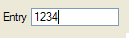{border="0" width="129" height="38"}

#### Syntax:

`EDIT `*`item-tag`*` = `*`field-name`*` `[`[`]{.underline}` , `*`attribute-list`*` `[`]`]{.underline}` ;`

#### Notes:

1.  *item-tag* is an identifier that defines the name of the item tag.
2.  *field-name* identifies the screen record field. See [Field
    Definition](#FF_FIELD_DEFINITION) for more details.
3.  *attribute-list* defines the aspect and behavior of the Form Item.

#### Attributes:

[AUTONEXT](FSFAttributes.html#FA_AUTONEXT),
[CENTURY](FSFAttributes.html#FA_CENTURY),
[COLOR](FSFAttributes.html#FA_COLOR), [COLOR
WHERE](FSFAttributes.html#FA_COLOR_WHERE),
[COMMENT](FSFAttributes.html#FA_COMMENT),
[DEFAULT](FSFAttributes.html#FA_DEFAULT), [DISPLAY
LIKE](FSFAttributes.html#FA_DISPLAY_LIKE),
[DOWNSHIFT](FSFAttributes.html#FA_DOWNSHIFT),
[HIDDEN](FSFAttributes.html#FA_HIDDEN),
[FONTPITCH](FSFAttributes.html#FA_FONTPITCH),
[FORMAT](FSFAttributes.html#FA_FORMAT),
[IMAGECOLUMN](FSFAttributes.html#FA_IMAGECOLUMN),
[INCLUDE](FSFAttributes.html#FA_INCLUDE),
[INVISIBLE](FSFAttributes.html#FA_INVISIBLE),
[JUSTIFY](FSFAttributes.html#FA_JUSTIFY),
[KEY](FSFAttributes.html#FA_KEY), [NOT
NULL](FSFAttributes.html#FA_NOT_NULL),
[NOENTRY](FSFAttributes.html#FA_NOENTRY),
[PICTURE](FSFAttributes.html#FA_PICTURE),
[PROGRAM](FSFAttributes.html#FA_PROGRAM),
[REQUIRED](FSFAttributes.html#FA_REQUIRED),
[REVERSE](FSFAttributes.html#FA_REVERSE),
[SAMPLE](FSFAttributes.html#FA_SAMPLE),
[STYLE](FSFAttributes.html#FA_STYLE),
[SCROLL](FSFAttributes.html#FA_SCROLL),
[SIZEPOLICY](FSFAttributes.html#FA_SIZEPOLICY),
[TAG](FSFAttributes.html#FA_TAG),
[TABINDEX](FSFAttributes.html#FA_TABINDEX),
[UPSHIFT](FSFAttributes.html#FA_UPSHIFT), [VALIDATE
LIKE](FSFAttributes.html#FA_VALIDATE_LIKE),
[VERIFY](FSFAttributes.html#FA_VERIFY).

*Table Column only:* [UNSORTABLE](FSFAttributes.html#FA_UNSORTABLE),
[UNSIZABLE](FSFAttributes.html#FA_UNSIZABLE),
[UNHIDABLE](FSFAttributes.html#FA_UNHIDABLE),
[UNMOVABLE](FSFAttributes.html#FA_UNMOVABLE),
[TITLE](FSFAttributes.html#FA_TITLE). 

#### Example:

``` linenumber
01 EDIT f001 = customer.state, REQUIRED, INCLUDE=(0,1,2);
```

#### Usage:

Defines a simple line edit box for data input or display.

See also [Form Field](#FF_FORM_FIELD).

------------------------------------------------------------------------

### [BUTTONEDIT Item Type]{#FF_ITEMTYPE_BUTTONEDIT}

#### Purpose:

The `BUTTONEDIT` item type defines a line-edit with a push-button that
can trigger an action.

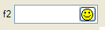{border="0" width="133" height="38"}

#### Syntax:

`BUTTONEDIT `*`item-tag`*` = `*`field-name`*` `[`[`]{.underline}` , `*`attribute-list`*` `[`]`]{.underline}` ;`

#### Notes:

1.  *item-tag* is an identifier that defines the name of the item tag.
2.  *field-name* identifies the screen record field. See [Field
    Definition](#FF_FIELD_DEFINITION) for more details.
3.  *attribute-list* defines the aspect and behavior of the Form Item.

#### Attributes:

[ACTION](FSFAttributes.html#FA_ACTION),
[AUTONEXT](FSFAttributes.html#FA_AUTONEXT),
[CENTURY](FSFAttributes.html#FA_CENTURY),
[COLOR](FSFAttributes.html#FA_COLOR), [COLOR
WHERE](FSFAttributes.html#FA_COLOR_WHERE),
[COMMENT](FSFAttributes.html#FA_COMMENT),
[DEFAULT](FSFAttributes.html#FA_DEFAULT), [DISPLAY
LIKE](FSFAttributes.html#FA_DISPLAY_LIKE),
[DOWNSHIFT](FSFAttributes.html#FA_DOWNSHIFT),
[FONTPITCH](FSFAttributes.html#FA_FONTPITCH),
[HIDDEN](FSFAttributes.html#FA_HIDDEN),
[FORMAT](FSFAttributes.html#FA_FORMAT),
[IMAGE](FSFAttributes.html#FA_IMAGE),
[INCLUDE](FSFAttributes.html#FA_INCLUDE),
[INVISIBLE](FSFAttributes.html#FA_INVISIBLE),
[JUSTIFY](FSFAttributes.html#FA_JUSTIFY),
[KEY](FSFAttributes.html#FA_KEY), [NOT
NULL](FSFAttributes.html#FA_NOT_NULL),
[NOENTRY](FSFAttributes.html#FA_NOENTRY),
[PICTURE](FSFAttributes.html#FA_PICTURE),
[PROGRAM](FSFAttributes.html#FA_PROGRAM),
[REVERSE](FSFAttributes.html#FA_REVERSE),
[SAMPLE](FSFAttributes.html#FA_SAMPLE),
[SCROLL](FSFAttributes.html#FA_SCROLL),
[SIZEPOLICY](FSFAttributes.html#FA_SIZEPOLICY),
[STYLE](FSFAttributes.html#FA_STYLE),
[REQUIRED](FSFAttributes.html#FA_REQUIRED),
[TAG](FSFAttributes.html#FA_TAG),
[TABINDEX](FSFAttributes.html#FA_TABINDEX),
[UPSHIFT](FSFAttributes.html#FA_UPSHIFT), [VALIDATE
LIKE](FSFAttributes.html#FA_VALIDATE_LIKE),
[VERIFY](FSFAttributes.html#FA_VERIFY).

*Table Column only:* [UNSORTABLE](FSFAttributes.html#FA_UNSORTABLE),
[UNSIZABLE](FSFAttributes.html#FA_UNSIZABLE),
[UNHIDABLE](FSFAttributes.html#FA_UNHIDABLE),
[UNMOVABLE](FSFAttributes.html#FA_UNMOVABLE),
[TITLE](FSFAttributes.html#FA_TITLE). 

#### Example:

``` linenumber
01 BUTTONEDIT f001 = customer.state, REQUIRED, IMAGE="smiley", ACTION=zoom;
```

#### Usage:

The `BUTTONEDIT` Form Item defines a line edit box with a button on the
right side.

This kind of Form Item is typically used to open a new window for data
selection.

The [ACTION](FSFAttributes.html#FA_ACTION) attribute defines the name of
the action to be sent to the program when the user clicks on the
button.  The [IMAGE](FSFAttributes.html#FA_IMAGE) attribute defines the
picture to be displayed in the button.

When you use an [HBox tag](#FF_HBOX_TAG) combined to the
[SAMPLE](FSFAttributes.html#FA_SAMPLE) attribute, it is possible to
specify the exact with of a `BUTTONEDIT`.

By default, the real width of `BUTTONEDIT`, `DATEEDIT` and `COMBOBOX` is
computed as follows (*nbchars* represents the number of characters used
in the form layout by the [item tag](#FF_ITEM_TAG) to define the width
of the item):

If *nbchars* is greater as 2, *width* = *nbchars* - 2; otherwise,
*width* = *nbchars*.

For example:

``` linenumber
01 LAYOUT
02 GRID
03 {
04  ButtonEdit A  [ba     ]
05  ButtonEdit B  [bb:    ]
06  ButtonEdit C  [bc   : ]
07  ButtonEdit D  [bd  -: ]
08 }
09 END
10 END
11 ATTRIBUTES
12 BUTTONEDIT ba = FORMONLY.ba, SAMPLE="0",  ACTION=zoom1;
13 BUTTONEDIT bb = FORMONLY.bb, SAMPLE="M",  ACTION=zoom2;
14 BUTTONEDIT bc = FORMONLY.bc, SAMPLE="Pi", ACTION=zoom3;
15 BUTTONEDIT bd = FORMONLY.bd, SAMPLE="0",  ACTION=zoom4;
16 END
```

Here the `BUTTONEDIT` **ba** occupies 7 grid columns and gets a real
width of 5 (7-2). The [SAMPLE](FSFAttributes.html#FA_SAMPLE) attribute
makes the edit field part as large as 5 characters \'0\' in the current
font, so with this field you can input or display only 5 digits.

The `BUTTONEDIT` **bb**, which is in an [HBox tag](#FF_HBOX_TAG) that
occupies 7 grid columns, gets a width of 2. Since the
[SAMPLE](FSFAttributes.html#FA_SAMPLE) attribute is \"M\", one can input
2 characters as wide as an \"M\".

The `BUTTONEDIT` **bc**, which is in an [HBox tag](#FF_HBOX_TAG) that
occupies 7 grid columns, gets a width of 3 (5-2). Since the
[SAMPLE](FSFAttributes.html#FA_SAMPLE) attribute is \"Pi\", the edit
field part will be as large as the word \"Pi\". (If `SAMPLE` contains
more than 1 character it must have the same number of characters as in
the field definition).

When using an [HBox tag](#FF_HBOX_TAG), one can  explicitly specify the
width of the field with the dash size indicator: The `BUTTONEDIT`
**bd**, which is in an [HBox tag](#FF_HBOX_TAG) that occupies 7 grid
columns, gets a width of 4 (because of the dash size indicator). Since
the [SAMPLE](FSFAttributes.html#FA_SAMPLE) attribute is \"0\", the edit
field part will be as large as 4 digits.

See also [Form Field](#FF_FORM_FIELD).

------------------------------------------------------------------------

### [TEXTEDIT Item Type]{#FF_ITEMTYPE_TEXTEDIT}

#### Purpose:

The `TEXTEDIT` item type defines a multi line-edit field.

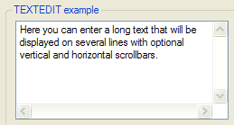{border="0" width="259" height="139"}

#### Syntax:

`TEXTEDIT `*`item-tag`*` = `*`field-name`*` `[`[`]{.underline}` , `*`attribute-list`*` `[`]`]{.underline}` ;`

#### Notes:

1.  *item-tag* is an identifier that defines the name of the item tag.
2.  *field-name* identifies the screen record field. See [Field
    Definition](#FF_FIELD_DEFINITION) for more details.
3.  *attribute-list* defines the aspect and behavior of the Form Item.

#### Attributes:

[COLOR](FSFAttributes.html#FA_COLOR), [COLOR
WHERE](FSFAttributes.html#FA_COLOR_WHERE),
[COMMENT](FSFAttributes.html#FA_COMMENT),
[DEFAULT](FSFAttributes.html#FA_DEFAULT),
[DOWNSHIFT](FSFAttributes.html#FA_DOWNSHIFT),
[FONTPITCH](FSFAttributes.html#FA_FONTPITCH),
[HIDDEN](FSFAttributes.html#FA_HIDDEN),
[INCLUDE](FSFAttributes.html#FA_INCLUDE),
[JUSTIFY](FSFAttributes.html#FA_JUSTIFY),
[KEY](FSFAttributes.html#FA_KEY), [NOT
NULL](FSFAttributes.html#FA_NOT_NULL),
[NOENTRY](FSFAttributes.html#FA_NOENTRY),
[PROGRAM](FSFAttributes.html#FA_PROGRAM),
[REQUIRED](FSFAttributes.html#FA_REQUIRED),
[SAMPLE](FSFAttributes.html#FA_SAMPLE),
[SCROLLBARS](FSFAttributes.html#FA_SCROLLBARS),
[SIZEPOLICY](FSFAttributes.html#FA_SIZEPOLICY),
[STYLE](FSFAttributes.html#FA_STYLE),
[STRETCH](FSFAttributes.html#FA_STRETCH),
[TAG](FSFAttributes.html#FA_TAG),
[TABINDEX](FSFAttributes.html#FA_TABINDEX),
[UPSHIFT](FSFAttributes.html#FA_UPSHIFT), [VALIDATE
LIKE](FSFAttributes.html#FA_VALIDATE_LIKE),
[WANTTABS](FSFAttributes.html#FA_WANTTABS),
[WANTNORETURNS](FSFAttributes.html#FA_WANTNORETURNS).

*Table Column only:* [UNSORTABLE](FSFAttributes.html#FA_UNSORTABLE),
[UNSIZABLE](FSFAttributes.html#FA_UNSIZABLE),
[UNHIDABLE](FSFAttributes.html#FA_UNHIDABLE),
[UNMOVABLE](FSFAttributes.html#FA_UNMOVABLE),
[TITLE](FSFAttributes.html#FA_TITLE). 

#### Example:

``` linenumber
01 TEXTEDIT f001 = customer.address, WANTTABS, SCROLLBARS=BOTH;
```

#### Usage:

This kind of form field allows the user to enter a long text on multiple
lines.

By default, when the focus is in a `TEXTEDIT` field, the TAB key moves
to the next field, while the RETURN key adds a NewLine (ASCII 10)
character in the text. To control the user input when the TAB and RETURN
keys are pressed, you can specify the
[WANTTABS](FSFAttributes.html#FA_WANTTABS) and
[WANTNORETURNS](FSFAttributes.html#FA_WANTNORETURNS) attributes. When
you specify [WANTTABS](FSFAttributes.html#FA_WANTTABS), the TAB key is
consumed by the `TEXTEDIT` field, and a TAB character is added to the
text. When you specify
[WANTNORETURNS](FSFAttributes.html#FA_WANTNORETURNS), the RETURN key is
[not]{.underline} consumed by the `TEXTEDIT` field, and the dialog is
validated.

You can use the [SCROLLBARS](FSFAttributes.html#FA_SCROLLBARS) attribute
to define vertical and/or horizontal scrollbars for the `TEXTEDIT` form
field. By default, this attribute is set to `VERTICAL` for `TEXTEDIT`
fields. The [STRETCH](FSFAttributes.html#FA_STRETCH) attribute can be
used to force the `TEXTEDIT` field to stretch when the parent container
is resized. Values can be `NONE`, `X`, `Y` or `BOTH`. By default, this
attribute is set to `NONE` for `TEXTEDIT` fields. Note that using either
the `SCROLLBARS` or the `STRETCH` attribute will automatically set the
`SCROLL` attribute, to bypass the size limit defined by the the [screen
tag](#FF_ITEM_TAG) and use the size of the program variable instead. For
more details about size limitation, see the [SCROLL attribute
definition](FSFAttributes.html#FA_SCROLL).

Some front-ends support different text formats which can be controlled
by a [style attribute](PresentationStyles.html#STYATT_TEXTEDIT). You can
for example display and input HTML content in a `TEXTEDIT`.

See also [Form Field](#FF_FORM_FIELD).

------------------------------------------------------------------------

### [DATEEDIT Item Type]{#FF_ITEMTYPE_DATEEDIT}

#### Purpose:

The `DATEEDIT` item type defines a line-edit with a button that opens a
calendar.

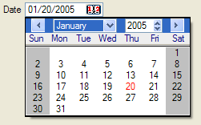{border="0" width="251" height="156"}

#### Syntax:

`DATEEDIT `*`item-tag`*` = `*`field-name`*` `[`[`]{.underline}` , `*`attribute-list`*` `[`]`]{.underline}` ;`

#### Notes:

1.  *item-tag* is an identifier that defines the name of the item tag.
2.  *field-name* identifies the screen record field. See [Field
    Definition](#FF_FIELD_DEFINITION) for more details.
3.  *attribute-list* defines the aspect and behavior of the Form Item.

#### Attributes:

[CENTURY](FSFAttributes.html#FA_CENTURY),
[COLOR](FSFAttributes.html#FA_COLOR), [COLOR
WHERE](FSFAttributes.html#FA_COLOR_WHERE),
[COMMENT](FSFAttributes.html#FA_COMMENT),
[DEFAULT](FSFAttributes.html#FA_DEFAULT),
[FONTPITCH](FSFAttributes.html#FA_FONTPITCH),
[FORMAT](FSFAttributes.html#FA_FORMAT),
[HIDDEN](FSFAttributes.html#FA_HIDDEN),
[INCLUDE](FSFAttributes.html#FA_INCLUDE),
[JUSTIFY](FSFAttributes.html#FA_JUSTIFY),
[KEY](FSFAttributes.html#FA_KEY), [NOT
NULL](FSFAttributes.html#FA_NOT_NULL),
[NOENTRY](FSFAttributes.html#FA_NOENTRY),
[REQUIRED](FSFAttributes.html#FA_REQUIRED),
[SAMPLE](FSFAttributes.html#FA_SAMPLE),
[SIZEPOLICY](FSFAttributes.html#FA_SIZEPOLICY),
[STYLE](FSFAttributes.html#FA_STYLE), [TAG](FSFAttributes.html#FA_TAG),
[TABINDEX](FSFAttributes.html#FA_TABINDEX), [VALIDATE
LIKE](FSFAttributes.html#FA_VALIDATE_LIKE).

*Table Column only:* [UNSORTABLE](FSFAttributes.html#FA_UNSORTABLE),
[UNSIZABLE](FSFAttributes.html#FA_UNSIZABLE),
[UNHIDABLE](FSFAttributes.html#FA_UNHIDABLE),
[UNMOVABLE](FSFAttributes.html#FA_UNMOVABLE),
[TITLE](FSFAttributes.html#FA_TITLE).

#### Example:

``` linenumber
01 DATEEDIT f001 = order.shipdate;
```

#### Usage:

This item type defines a line-edit with a button on the right that opens
a calendar, dedicated to [DATE](DataTypes.html#DT_DATE) input.

When you use an [HBox tag](#FF_HBOX_TAG) combined with the
[SAMPLE](FSFAttributes.html#FA_SAMPLE) attribute, it is possible to
specify the exact wdith of a `DATEEDIT`.\
By default, the real width is computed as *width*=*nbchars*-2 when
*nbchars*\>2.\
For more details about HBox tag and width computing rules, see
[BUTTONEDIT](#FF_ITEMTYPE_BUTTONEDIT).

#### Warnings:

1.  When the [SAMPLE](FSFAttributes.html#FA_SAMPLE) attribute is not
    specified, the default width for a `DATEEDIT` is dependent upon
    [DBDATE](EnvironmentVariables.html#EV_DBDATE), and
    [FORMAT](FSFAttributes.html#FA_FORMAT) when this attribute is used
    in the field.

Some front-ends support different presentation options which can be
controlled by a [style
attribute](PresentationStyles.html#STYATT_DATEEDIT). You can for example
change the first day of the week, or the icon of the button.

See also [Form Field](#FF_FORM_FIELD).

------------------------------------------------------------------------

### [COMBOBOX Item Type]{#FF_ITEMTYPE_COMBOBOX}

#### Purpose:

The `COMBOBOX` item type defines a line-edit with a drop-down list of
values.

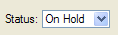{border="0" width="118" height="35"}

#### Syntax:

`COMBOBOX `*`item-tag`*` = `*`field-name`*` `[`[`]{.underline}` , `*`attribute-list`*` `[`]`]{.underline}` ;`

#### Notes:

1.  *item-tag* is an identifier that defines the name of the item tag.
2.  *field-name* identifies the screen record field. See [Field
    Definition](#FF_FIELD_DEFINITION) for more details.
3.  *attribute-list* defines the aspect and behavior of the Form Item.

#### Attributes:

[COLOR](FSFAttributes.html#FA_COLOR), [COLOR
WHERE](FSFAttributes.html#FA_COLOR_WHERE),
[COMMENT](FSFAttributes.html#FA_COMMENT),
[DEFAULT](FSFAttributes.html#FA_DEFAULT),
[DOWNSHIFT](FSFAttributes.html#FA_DOWNSHIFT),
[FONTPITCH](FSFAttributes.html#FA_FONTPITCH),
[HIDDEN](FSFAttributes.html#FA_HIDDEN),
[KEY](FSFAttributes.html#FA_KEY),
[INCLUDE](FSFAttributes.html#FA_INCLUDE),
[INITIALIZER](FSFAttributes.html#FA_INITIALIZER),
[ITEMS](FSFAttributes.html#FA_ITEMS),
[JUSTIFY](FSFAttributes.html#FA_JUSTIFY), [NOT
NULL](FSFAttributes.html#FA_NOT_NULL),
[NOENTRY](FSFAttributes.html#FA_NOENTRY),
[QUERYEDITABLE](FSFAttributes.html#FA_QUERYEDITABLE),
[REQUIRED](FSFAttributes.html#FA_REQUIRED),
[SAMPLE](FSFAttributes.html#FA_SAMPLE),
[SCROLL](FSFAttributes.html#FA_SCROLL),
[SIZEPOLICY](FSFAttributes.html#FA_SIZEPOLICY),
[STYLE](FSFAttributes.html#FA_STYLE),
[UPSHIFT](FSFAttributes.html#FA_UPSHIFT),
[TAG](FSFAttributes.html#FA_TAG),
[TABINDEX](FSFAttributes.html#FA_TABINDEX), [VALIDATE
LIKE](FSFAttributes.html#FA_VALIDATE_LIKE).

*Table Column only:* [UNSORTABLE](FSFAttributes.html#FA_UNSORTABLE),
[UNSIZABLE](FSFAttributes.html#FA_UNSIZABLE),
[UNHIDABLE](FSFAttributes.html#FA_UNHIDABLE),
[UNMOVABLE](FSFAttributes.html#FA_UNMOVABLE),
[TITLE](FSFAttributes.html#FA_TITLE).

#### Example:

``` linenumber
01 COMBOBOX f001 = customer.city, ITEMS=((1,"Paris"),(2,"Madrid"),(3,"London"));
02 COMBOBOX f002 = customer.sector, REQUIRED, ITEMS=("SA","SB","SC");
03 COMBOBOX f003 = customer.state, NOT NULL, INITIALIZER=myinit;
```

#### Usage:

This item type defines a line-edit with a button on the right side that
opens a drop-down list.

The values of the drop-down list are defined by the
[ITEMS](FSFAttributes.html#FA_ITEMS) attribute. You can define a simple
list of values like `("A","B","C","D", ... )` or you can define a list
of key/label combinations like in
`((1,"Paris"),(2,"Madrid"),(3,"London"))`. In the second case, the
labels (i.e. the city names) will be displayed according to the key
value (the city number) hold by the field.

The [INITIALIZER](FSFAttributes.html#FA_INITIALIZER) attribute allows
you to define an initialization function for the `COMBOBOX`. This
function will be invoked at runtime when the form is loaded, to fill the
item list dynamically with database records, for example. It is
recommended that you use the [TAG](FSFAttributes.html#FA_TAG) attribute,
so you can identify in the program  the kind of `COMBOBOX` Form Item to
be initialized. Note that the initialization function name if converted
to lowercase by [fglform](Tools.html#TL_FGLFORM).

If neither [ITEMS](FSFAttributes.html#FA_ITEMS) nor
[INITIALIZER](FSFAttributes.html#FA_INITIALIZER) attributes are
specified, the form compiler automatically fills the list of items with
the values of the [INCLUDE](FSFAttributes.html#FA_INCLUDE) attribute,
when specified. However, the item list will not automatically be
populated with include range values (i.e. values defined using the TO
keyword). The [INCLUDE](FSFAttributes.html#FA_INCLUDE) attribute can be
specified directly in the form or indirectly in the schema files.

During an [INPUT](RecordInput.html), a `COMBOBOX` field value can only
be one of the values specified in the
[ITEMS](FSFAttributes.html#FA_ITEMS) attribute. During an
[CONSTRUCT](Construct.html), a `COMBOBOX` field gets an additional
\'empty\' item (even if the field is [NOT
NULL](FSFAttributes.html#FA_NOT_NULL)), to let the user clear the search
condition.

If one of the items is explicitly defined with `NULL` and the [NOT
NULL](FSFAttributes.html#FA_NOT_NULL) attribute is omitted; In `INPUT`,
selecting the corresponding combobox list item sets the field value to
null. In `CONSTRUCT`, selecting the list item corresponding to null will
be equivalent to the [= query operator](Construct.html#QUERY_OPERATORS),
which will generate a \"*colname is null*\" SQL condition.

During a [CONSTRUCT](Construct.html), a `COMBOBOX` is not editable by
default: The end-user is forced to set one of the values of the list as
defined by the [ITEMS](FSFAttributes.html#FA_ITEMS) attribute, or set
the \'empty\' item. The
[QUERYEDITABLE](FSFAttributes.html#FA_QUERYEDITABLE) attribute can be
used to force the `COMBOBOX` to be editable during a
[CONSTRUCT](Construct.html) instruction, in order to allow free search
criterion input such as \"`A*`\". If `QUERYEDITABLE` is used and the
`ITEMS` are defined with key/label combinations, the text entered by the
user will be automatically searched in the list of items. If a label
corresponds, the key will be used in the SQL criterion, otherwise the
text entered by the user will be used. For example, if the items are
defined as `((1,"Paris"),(2,"Madrid"),(3,"London"))`, and the user
enters \"`Paris`\" in the field, the item `(1,"Paris")` will match and
will be generate \"*colname = 1*\". If the user enters \"`>2`\", the
text does not match any item so it will be used as is and generate the
SQL \"*colname \> 2*\". Users may enter values like \"`Par*`\", but in
this case the runtime system will raise an error because this criterion
does is not valid for the numeric data type of the field. To avoid
end-user confusion, a `COMBOBOX` defined with key/label combinations
should not use the `QUERYEDITABLE` attribute. 

When using an [HBox tag](#FF_HBOX_TAG) combined with the
[SAMPLE](FSFAttributes.html#FA_SAMPLE) attribute, it is possible to
specify the exact width of a `COMBOBOX`.\
By default, the real width is computed as *width*=*nbchars*-2 when
*nbchars*\>2.\
For more details about HBox tag and width computing rules, see
[BUTTONEDIT](#FF_ITEMTYPE_BUTTONEDIT).

Some front-ends support different presentation options which can be
controlled by a [style
attribute](PresentationStyles.html#STYATT_COMBOBOX). You can for example
enable the first item to be selected when pressing keys.

See also [Form Field](#FF_FORM_FIELD).

------------------------------------------------------------------------

### [CHECKBOX Item Type]{#FF_ITEMTYPE_CHECKBOX}

#### Purpose:

The `CHECKBOX` item type defines a boolean checkbox field.

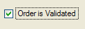{border="0" width="122" height="43"}

#### Syntax:

`CHECKBOX `*`item-tag`*` = `*`field-name`*` `[`[`]{.underline}` , `*`attribute-list`*` `[`]`]{.underline}` ;`

#### Notes:

1.  *item-tag* is an identifier that defines the name of the item tag.
2.  *field-name* identifies the screen record field. See [Field
    Definition](#FF_FIELD_DEFINITION) for more details.
3.  *attribute-list* defines the aspect and behavior of the Form Item.

#### Attributes:

[COLOR](FSFAttributes.html#FA_COLOR), [COLOR
WHERE](FSFAttributes.html#FA_COLOR_WHERE),
[COMMENT](FSFAttributes.html#FA_COMMENT),
[DEFAULT](FSFAttributes.html#FA_DEFAULT),
[FONTPITCH](FSFAttributes.html#FA_FONTPITCH),
[HIDDEN](FSFAttributes.html#FA_HIDDEN),
[INCLUDE](FSFAttributes.html#FA_INCLUDE),
[JUSTIFY](FSFAttributes.html#FA_JUSTIFY),
[KEY](FSFAttributes.html#FA_KEY), [NOT
NULL](FSFAttributes.html#FA_NOT_NULL),
[NOENTRY](FSFAttributes.html#FA_NOENTRY),
[REQUIRED](FSFAttributes.html#FA_REQUIRED),
[SAMPLE](FSFAttributes.html#FA_SAMPLE),
[SIZEPOLICY](FSFAttributes.html#FA_SIZEPOLICY),
[STYLE](FSFAttributes.html#FA_STYLE), [TAG](FSFAttributes.html#FA_TAG),
[TABINDEX](FSFAttributes.html#FA_TABINDEX),
[TEXT](FSFAttributes.html#FA_TEXT), [VALIDATE
LIKE](FSFAttributes.html#FA_VALIDATE_LIKE),
[VALUECHECKED](FSFAttributes.html#FA_VALUECHECKED),
[VALUEUNCHECKED](FSFAttributes.html#FA_VALUEUNCHECKED).

*Table Column only:* [UNSORTABLE](FSFAttributes.html#FA_UNSORTABLE),
[UNSIZABLE](FSFAttributes.html#FA_UNSIZABLE),
[UNHIDABLE](FSFAttributes.html#FA_UNHIDABLE),
[UNMOVABLE](FSFAttributes.html#FA_UNMOVABLE),
[TITLE](FSFAttributes.html#FA_TITLE). 

#### Example:

``` linenumber
01 CHECKBOX f001 = customer.active, REQUIRED, TEXT="Active", VALUECHECKED="Y", VALUEUNCHECKED="N";
```

#### Usage:

The `CHECKBOX` item type defines a boolean entry with a box and a text
label.

The [TEXT](FSFAttributes.html#FA_TEXT) attribute defines the label to be
displayed near the check box.

The box shows a checkmark when the form field contains the value defined
in the [VALUECHECKED](FSFAttributes.html#FA_VALUECHECKED) attribute 
(for example: `"Y"`), and shows no checkmark if the field value is equal
to the value defined by the
[VALUEUNCHECKED](FSFAttributes.html#FA_VALUEUNCHECKED) attribute (for
example: `"N"`). If you do not specify the
[VALUECHECKED](FSFAttributes.html#FA_VALUECHECKED) or
[VALUEUNCHECKED](FSFAttributes.html#FA_VALUEUNCHECKED) attributes, they
respectively default to `TRUE` (integer 1) and `FALSE` (integer 0).

By default, during an [INPUT](RecordInput.html), a `CHECKBOX` field can
have three states:

- Grayed ([NULL](Programs.html#PC_NULL) value)
- Checked ([VALUECHECKED](FSFAttributes.html#FA_VALUECHECKED) value)
- Unchecked ([VALUEUNCHECKED](FSFAttributes.html#FA_VALUEUNCHECKED)
  value)

If the field is declared as [NOT NULL](FSFAttributes.html#FA_NOT_NULL),
the initial state can be grayed if the default value is
[NULL](Programs.html#PC_NULL); once the user has changed the state of
the `CHECKBOX` field, it switches only between Checked and Unchecked
states.

During an [CONSTRUCT](Construct.html), a `CHECKBOX` field
[always]{.underline} has three possible states (even if the field is
[NOT NULL](FSFAttributes.html#FA_NOT_NULL)), to let the user clear the
search condition:

- Grayed (No search condition)
- Checked (Condition column =
  [VALUECHECKED](FSFAttributes.html#FA_VALUECHECKED) value)
- Unchecked (Condition column =
  [VALUEUNCHECKED](FSFAttributes.html#FA_VALUEUNCHECKED) value)

See also [Form Field](#FF_FORM_FIELD).

------------------------------------------------------------------------

### [RADIOGROUP Item Type]{#FF_ITEMTYPE_RADIOGROUP}

#### Purpose:

The `RADIOGROUP` item type defines a set of radio buttons.

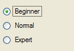{border="0" width="125" height="86"}

#### Syntax:

`RADIOGROUP `*`item-tag`*` = `*`field-name`*` `[`[`]{.underline}` , `*`attribute-list`*` `[`]`]{.underline}` ;`

#### Notes:

1.  *item-tag* is an identifier that defines the name of the item tag.
2.  *field-name* identifies the screen record field. See [Field
    Definition](#FF_FIELD_DEFINITION) for more details.
3.  *attribute-list* defines the aspect and behavior of the Form Item.

#### Attributes:

[COLOR](FSFAttributes.html#FA_COLOR), [COLOR
WHERE](FSFAttributes.html#FA_COLOR_WHERE),
[COMMENT](FSFAttributes.html#FA_COMMENT),
[DEFAULT](FSFAttributes.html#FA_DEFAULT),
[FONTPITCH](FSFAttributes.html#FA_FONTPITCH),
[HIDDEN](FSFAttributes.html#FA_HIDDEN),
[INCLUDE](FSFAttributes.html#FA_INCLUDE),
[ITEMS](FSFAttributes.html#FA_ITEMS),
[JUSTIFY](FSFAttributes.html#FA_JUSTIFY),
[KEY](FSFAttributes.html#FA_KEY), [NOT
NULL](FSFAttributes.html#FA_NOT_NULL),
[NOENTRY](FSFAttributes.html#FA_NOENTRY),
[ORIENTATION](FSFAttributes.html#FA_ORIENTATION),
[REQUIRED](FSFAttributes.html#FA_REQUIRED),
[SAMPLE](FSFAttributes.html#FA_SAMPLE),
[SIZEPOLICY](FSFAttributes.html#FA_SIZEPOLICY),
[STYLE](FSFAttributes.html#FA_STYLE), [TAG](FSFAttributes.html#FA_TAG),
[TABINDEX](FSFAttributes.html#FA_TABINDEX), [VALIDATE
LIKE](FSFAttributes.html#FA_VALIDATE_LIKE).

*Table Column only:* [UNSORTABLE](FSFAttributes.html#FA_UNSORTABLE),
[UNSIZABLE](FSFAttributes.html#FA_UNSIZABLE),
[UNHIDABLE](FSFAttributes.html#FA_UNHIDABLE),
[UNMOVABLE](FSFAttributes.html#FA_UNMOVABLE),
[TITLE](FSFAttributes.html#FA_TITLE).

#### Example:

``` linenumber
01 RADIOGROUP f001 = player.level, ITEMS=((1,"Beginner"),(2,"Normal"),(3,"Expert"));
```

#### Usage:

This item type defines a set of radio buttons where each button is
associated with a value defined in the
[ITEMS](FSFAttributes.html#FA_ITEMS) attribute.

The text associated with each value will be used as the label of the
corresponding radio button, for example:

`((1,"Beginner"),(2,"Normal"),(3,"Expert"))`

If the [ITEMS](FSFAttributes.html#FA_ITEMS) attribute is not specified,
the form compiler automatically fills the list of items with the values
of the [INCLUDE](FSFAttributes.html#FA_INCLUDE) attribute, when
specified. However, the item list will not automatically be populated
with include range values (i.e. values defined using the TO keyword).
The [INCLUDE](FSFAttributes.html#FA_INCLUDE) attribute can be specified
directly in the form or indirectly in the schema files.

During an [INPUT](RecordInput.html), a `RADIOGROUP` field value can only
be one of the values specified in the
[ITEMS](FSFAttributes.html#FA_ITEMS) attribute. During an
[CONSTRUCT](Construct.html), a `RADIOGROUP` field allows to uncheck all
items (even if the field is [NOT NULL](FSFAttributes.html#FA_NOT_NULL)),
to let the user clear the search condition.

If one of the items is explicitly defined with `NULL` and the [NOT
NULL](FSFAttributes.html#FA_NOT_NULL) attribute is omitted; In `INPUT`,
selecting the corresponding radio button sets the field value to null.
In `CONSTRUCT`, selecting the radio button corresponding to null will be
equivalent to the [= query operator](Construct.html#QUERY_OPERATORS),
which will generate a \"*colname is null*\" SQL condition.

Use the [ORIENTATION](FSFAttributes.html#FA_ORIENTATION) attribute to
define if the radio group must be displayed vertically or horizontally.

Some front-ends support different presentation options which can be
controlled by a [style
attribute](PresentationStyles.html#STYATT_RADIOGROUP). You can for
example define what item has to be selected firsts when pressing keys.

See also [Form Field](#FF_FORM_FIELD).

------------------------------------------------------------------------

### [LABEL Item Type]{#FF_ITEMTYPE_LABEL}

#### Purpose:

The `LABEL` item type defines a simple text area to display a read-only
value.

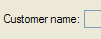{border="0" width="101" height="39"}

#### Syntax 1: Defining a Form Field Label

`LABEL `*`item-tag`*` = `*`field-name`*` `[`[`]{.underline}` , `*`attribute-list`*` `[`]`]{.underline}` ;`

#### Syntax 2: Defining a Static Label

`LABEL `*`item-tag`*` : `*`item-name`*` `[`[`]{.underline}` , `*`attribute-list`*` `[`]`]{.underline}` ;`

#### Notes:

1.  *item-tag* is an identifier that defines the name of the item tag.
2.  *field-name* identifies the screen record field. See [Field
    Definition](#FF_FIELD_DEFINITION) for more details.
3.  *item-name* identifies the form element (name attribute in .42f) of
    a static label. See [Form Items](#FF_FORM_ITEM) for more details.
4.  *attribute-list* defines the aspect and behavior of the Form Item.

#### Attributes:

[COLOR](FSFAttributes.html#FA_COLOR), [COLOR
WHERE](FSFAttributes.html#FA_COLOR_WHERE),
[COMMENT](FSFAttributes.html#FA_COMMENT),
[FONTPITCH](FSFAttributes.html#FA_FONTPITCH),
[HIDDEN](FSFAttributes.html#FA_HIDDEN),
[IMAGECOLUMN](FSFAttributes.html#FA_IMAGECOLUMN),
[JUSTIFY](FSFAttributes.html#FA_JUSTIFY),
[REVERSE](FSFAttributes.html#FA_REVERSE),
[SAMPLE](FSFAttributes.html#FA_SAMPLE),
[SIZEPOLICY](FSFAttributes.html#FA_SIZEPOLICY),
[STYLE](FSFAttributes.html#FA_STYLE), [TAG](FSFAttributes.html#FA_TAG).

*Form Field Label only:* [FORMAT](FSFAttributes.html#FA_FORMAT),
[SAMPLE](FSFAttributes.html#FA_SAMPLE).

*Static Label only:* [TEXT](FSFAttributes.html#FA_TEXT).

*Table Column only:* [UNSORTABLE](FSFAttributes.html#FA_UNSORTABLE),
[UNSIZABLE](FSFAttributes.html#FA_UNSIZABLE),
[UNHIDABLE](FSFAttributes.html#FA_UNHIDABLE),
[UNMOVABLE](FSFAttributes.html#FA_UNMOVABLE),
[TITLE](FSFAttributes.html#FA_TITLE).

#### Example:

``` linenumber
01 LABEL f001 = vehicle.description; -- This is a form field label
02 LABEL lab1 : label1, TEXT="Hello"; -- This is a static label
```

#### Usage:

This item type can be used to define a read-only text area as a form
field or as a static label.

Some front-ends support different presentation options which can be
controlled by a [style attribute](PresentationStyles.html#STYATT_LABEL).
You can for example change the text format to render HTML content.

*[Form Field Label]{.underline}*

This type of label item must be used to display values that change often
during program execution, like database information. The text of the
label is defined by the value of the corresponding form field. The text
can be changed from the BDL program by using the [DISPLAY
TO](RecordDisplay.html#DISPLAY_TO) instruction to set the value of the
field, or within a list by using a [DISPLAY ARRAY](DisplayArray.html).
This kind of Form Item does not allow data entry; it is only used to
display values.

See also [Form Field](#FF_FORM_FIELD) for more details.

*[Static Label]{.underline}*

This type of label item must be used to display text that does not
change often, like field descriptions. The text of the label is defined
by the [TEXT](FSFAttributes.html#FA_TEXT) attribute; the item is not a
form field. The text can be changed from the BDL program by using the
API provided to manipulate the user interface (see Dynamic User
Interface for more details). It is not possible to change the text with
a [DISPLAY TO](RecordDisplay.html#DISPLAY_TO) instruction. This kind of
item is not affected by instructions such as [CLEAR
FORM](RecordDisplay.html#CLEAR_FORM). Static labels display only
character text values, and therefore do not follow any justification
rule as form field labels.

------------------------------------------------------------------------

### [IMAGE Item Type]{#FF_ITEMTYPE_IMAGE}

#### Purpose:

The `IMAGE` item type defines an area that can display an image from a
pixel-map file.

#### Syntax 1: Defining a Form Field Image

`IMAGE `*`item-tag`*` = `*`field-name`*` `[`[`]{.underline}` , `*`attribute-list`*` `[`]`]{.underline}` ;`

#### Syntax 2: Defining a Static Image

`IMAGE `*`item-tag`*` : `*`item-name`*` `[`[`]{.underline}` , `*`attribute-list`*` `[`]`]{.underline}` ;`

#### Notes:

1.  *item-tag* is an identifier that defines the name of the item tag.
2.  *field-name* identifies the screen record field. See [Field
    Definition](#FF_FIELD_DEFINITION) for more details.
3.  *item-name* identifies the form element (name attribute in .42f) of
    a static image. See [Form Items](#FF_FORM_ITEM) for more details.
4.  *attribute-list* defines the aspect and behavior of the Form Item.

#### Attributes:

[AUTOSCALE](FSFAttributes.html#FA_AUTOSCALE),
[COMMENT](FSFAttributes.html#FA_COMMENT),
[HEIGHT](FSFAttributes.html#FA_HEIGHT),
[HIDDEN](FSFAttributes.html#FA_HIDDEN),
[STYLE](FSFAttributes.html#FA_STYLE),
[STRETCH](FSFAttributes.html#FA_STRETCH),
[TAG](FSFAttributes.html#FA_TAG), [WIDTH](FSFAttributes.html#FA_WIDTH).

*Static Image only:* [IMAGE](FSFAttributes.html#FA_IMAGE).

*Image Field only:* [COLOR](FSFAttributes.html#FA_COLOR), [COLOR
WHERE](FSFAttributes.html#FA_COLOR_WHERE),
[FONTPITCH](FSFAttributes.html#FA_FONTPITCH),
[JUSTIFY](FSFAttributes.html#FA_JUSTIFY),
[SIZEPOLICY](FSFAttributes.html#FA_SIZEPOLICY),
[SAMPLE](FSFAttributes.html#FA_SAMPLE).

*Table Column only:* [UNSORTABLE](FSFAttributes.html#FA_UNSORTABLE),
[UNSIZABLE](FSFAttributes.html#FA_UNSIZABLE),
[UNHIDABLE](FSFAttributes.html#FA_UNHIDABLE),
[UNMOVABLE](FSFAttributes.html#FA_UNMOVABLE),
[TITLE](FSFAttributes.html#FA_TITLE).

#### Example:

``` linenumber
01 IMAGE f001 = cars.picture, HEIGHT=300 PIXELS, WIDTH=400 PIXELS, STRETCH=BOTH;
02 IMAGE img1 : logo, IMAGE="fourjs.gif", STRETCH=BOTH;
```

#### Usage:

The `IMAGE` item type defines an area where a picture file can be
displayed. An `IMAGE` form item can be defined as a form field or as a
static image.

The [STRETCH](FSFAttributes.html#FA_STRETCH) attribute can be used to
define how the image widget size must change when the parent container
is resized. Values can be `NONE`, `X`, `Y` or `BOTH`. Default value is
`NONE` for `IMAGE` fields.

The [AUTOSCALE](FSFAttributes.html#FA_AUTOSCALE) attribute can be set to
indicate if the image must be scaled to the available space defined by
the width and height of the form item. If you do not specify
`AUTOSCALE`, the image widget will get scrollbars if the picture size is
larger as the image widget size.

You can define the size of an image widget by using the
[WIDTH](FSFAttributes.html#FA_WIDTH) and
[HEIGHT](FSFAttributes.html#FA_HEIGHT) attributes, but this will only
have an effect if the
[SIZEPOLICY]{style="color: #008000; font-family: Courier New"} attribute
is set to [FIXED]{style="color: #008000; font-family: Courier New"}. If
the
[WIDTH]{style="color: #008000; font-family: Courier New"}/[HEIGHT]{style="color: #008000; font-family: Courier New"}
attributes are not used, the size of the image widget defaults to the
relative width and height defined by the *[item-tag](#FF_ITEM_TAG)* in
the form layout section. Note that the size specified by `WIDTH` and
`HEIGHT` defines the size of the image widget. On some platforms, the
image widgets automatically add a border to the source picture.
Therefore, to avoid automatic scrollbars, you might need to increase the
size of the image form item if a border is used. For example, if your
image source has a size of 500x500 pixels and the widget displays a
border with as size of 1 pixel, you will have to set `WIDTH` and
`HEIGHT` to 502 pixels, otherwise either scrollbars will appear, or the
image will shrink if
[AUTOSCALE]{style="color: #008000; font-family: Courier New"} is used.
Alternatively, you can avoid the image border with a [presentation style
attribute](PresentationStyles.html#STYATT_COMMON).

The [SIZEPOLICY](FSFAttributes.html#FA_SIZEPOLICY) attribute is used to
control how the size of the image widget is set:

- When [SIZEPOLICY]{style="color: #008000; font-family: Courier New"} is
  [INITIAL]{style="color: #008000; font-family: Courier New"}, the size
  of the widget will be defined by the first picture displayed in the
  form element, and that size will not change if other pictures with
  different sizes are displayed in the widget.
- If [SIZEPOLICY]{style="color: #008000; font-family: Courier New"}
  attribute is set to
  [FIXED]{style="color: #008000; font-family: Courier New"}, the size of
  the widget will be defined by the form specification file, either by
  the size of the *[item-tag](#FF_ITEM_TAG)* in the layout, or by the
  [WIDTH]{style="color: #008000; font-family: Courier New"} and
  [HEIGHT]{style="color: #008000; font-family: Courier New"} attributes.
  Note that with a fixed image widget size, if
  [AUTOSCALE]{style="color: #008000; font-family: Courier New"} is not
  used, scrollbars may appear if the picture is greater than the widget.
- When [SIZEPOLICY]{style="color: #008000; font-family: Courier New"} is
  [DYNAMIC]{style="color: #008000; font-family: Courier New"}, the size
  of the widget will automatically adapted to the size of the pictures
  displayed in the image form item. With this option, the
  [AUTOSCALE]{style="color: #008000; font-family: Courier New"}
  attribute makes no sense and will have no effect.

  ----------------------------------- ------------------------------------------- ------------------------------------------------------------------------------------------------------------------ -------------------------------------------------------------------------------------------------------------------------------
  **Widget Size**                     **Picture Size**                            [[`SIZEPOLICY`]{style="font-family: Arial"}](FSFAttributes.html#FA_SIZEPOLICY)                                     [[`AUTOSCALE`]{style="font-family: Arial"}](FSFAttributes.html#FA_AUTOSCALE)[` `]{style="color: #000000; font-family: Arial"}
  Size of Form Specification File     Size of Widget (image may shrink or grow)   [INITIAL]{style="color: #008000; font-family: Courier New"}, [FIXED]{style="color: #008000;                        [TRUE [(Attribute is set)]{style="color: #000000;
                                                                                                          font-family: Courier New"}, [ DYNAMIC]{style="color: #008000; font-family: Courier New"}                           font-family: Arial"}]{style="color: #008000; font-family: Courier New"}
  Size of Form Specification File     Original Size (Scrollbars may appear)       [FIXED]{style="color: #008000; font-family: Courier New"}                                                          [FALSE ]{style="color: #008000; font-family: Courier New"}[(Attribute is not set)]{style="color: #000000;
                                                                                                                                                                                                                             font-family: Arial"}
  Size of Picture (widget can grow)   Original Size                               [INITIAL]{style="color: #008000; font-family: Courier New"}, []{style="color: #008000;                             [FALSE ]{style="color: #008000; font-family: Courier New"}[(Attribute is not set)]{style="color: #000000;
                                                                                                          font-family: Courier New"}[ DYNAMIC]{style="color: #008000; font-family: Courier New"}                             font-family: Arial"}
  ----------------------------------- ------------------------------------------- ------------------------------------------------------------------------------------------------------------------ -------------------------------------------------------------------------------------------------------------------------------

*[[Form Field Image]{#FF_IMAGE_FIELD}]{.underline}*

This type of image item must be used to display values that change often
during program execution, for example if the image is stored in the
database. The picture resource is defined by the value of the field.
This value can be changed from the BDL program by using the [DISPLAY BY
NAME / DISPLAY TO](RecordDisplay.html#DISPLAY_TO) instruction or just by
changing the value of the program variable bound to the image field,
when using the
[UNBUFFERED]{style="color: #008000; font-family: Courier New"} mode in
an interactive instruction.

When using a string variable containing a file name or file path, the
values of an [IMAGE]{style="color: #008000; font-family: Courier New"}
field defining the picture resource follow the same rules as the
[IMAGE](FSFAttributes.html#FA_IMAGE) attribute of static images (see
also [FGLIMAGEPATH](EnvironmentVariables.html#EV_FGLIMAGEPATH)).
However, images displayed by program to image fields are considered as
valid files to be transferred to the clients without risk and do not
follow the FGLIMAGEPATH security restrictions. Images are searched
according to the path list defined in FGLIMAGEPATH.

When [located in a file](Variables.html#VA_LOCATE), the content of a
[BYTE](DataTypes.html#DT_BYTE) variable can be automatically displayed
to an [IMAGE]{style="color: #008000; font-family: Courier New"} in
field, by using [DISPLAY BY NAME / DISPLAY
TO](RecordDisplay.html#DISPLAY_TO) or when the BYTE variable is
controlled by a dialog instruction.

See also [Form Field](#FF_FORM_FIELD).

*[[Static Image]{#FF_STATIC_IMAGE}]{.underline}*

This type of image item must be used to display an image that does not
change often, such as background pictures or logos. The resource of the
image is defined by the [IMAGE](FSFAttributes.html#FA_IMAGE) attribute;
the item is not a form field: This kind of item is not affected by
instructions such as [CLEAR FORM](RecordDisplay.html#CLEAR_FORM) or the
[DISPLAY TO](RecordDisplay.html#DISPLAY_TO) instruction. The image
resource can be changed from the BDL program by using the API provided
to manipulate the user interface (see [Dynamic User
Interface](DynamicUI.html) for more details). For more details about
supported image resources, read the section dedicated to the
[IMAGE](FSFAttributes.html#FA_IMAGE) attribute (see also
[FGLIMAGEPATH](EnvironmentVariables.html#EV_FGLIMAGEPATH)).

------------------------------------------------------------------------

### [PROGRESSBAR Item Type]{#FF_ITEMTYPE_PROGRESSBAR}

#### Purpose:

The `PROGRESSBAR` item type defines a horizontal bar with a progress
indicator.

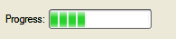{border="0" width="195" height="43"}

#### Syntax:

`PROGRESSBAR `*`item-tag`*` = `*`field-name`*` `[`[`]{.underline}` , `*`attribute-list`*` `[`]`]{.underline}` ;`

#### Notes:

1.  *item-tag* is an identifier that defines the name of the item tag.
2.  *field-name* identifies the screen record field. See [Field
    Definition](#FF_FIELD_DEFINITION) for more details.
3.  *attribute-list* defines the aspect and behavior of the Form Item.

#### Attributes:

[COLOR](FSFAttributes.html#FA_COLOR), [COLOR
WHERE](FSFAttributes.html#FA_COLOR_WHERE),
[COMMENT](FSFAttributes.html#FA_COMMENT),
[FONTPITCH](FSFAttributes.html#FA_FONTPITCH),
[HIDDEN](FSFAttributes.html#FA_HIDDEN),
[JUSTIFY](FSFAttributes.html#FA_JUSTIFY),
[VALUEMIN](FSFAttributes.html#FA_VALUEMIN),
[VALUEMAX](FSFAttributes.html#FA_VALUEMAX),
[SAMPLE](FSFAttributes.html#FA_SAMPLE),
[SIZEPOLICY](FSFAttributes.html#FA_SIZEPOLICY),
[STYLE](FSFAttributes.html#FA_STYLE), [TAG](FSFAttributes.html#FA_TAG).

*Table Column only:* [UNSORTABLE](FSFAttributes.html#FA_UNSORTABLE),
[UNSIZABLE](FSFAttributes.html#FA_UNSIZABLE),
[UNHIDABLE](FSFAttributes.html#FA_UNHIDABLE),
[UNMOVABLE](FSFAttributes.html#FA_UNMOVABLE),
[TITLE](FSFAttributes.html#FA_TITLE).

#### Example:

``` linenumber
01 PROGRESSBAR f001 = workstate.position, VALUEMIN=-100, VALUEMAX=+100;
```

#### Usage:

This item type can be used to show progress information.

The position of the progress bar is defined by the value of the
corresponding form field. The value can be changed from the BDL program
by using the [DISPLAY TO](RecordDisplay.html#DISPLAY_TO) instruction to
set the value of the field. This kind of Form Item does not allow data
entry; it is only used to display integer values.

The [VALUEMIN](FSFAttributes.html#FA_VALUEMIN) and
[VALUEMAX](FSFAttributes.html#FA_VALUEMAX) attributes define
respectively the lower and upper integer limit of the progress
information. Any value outside this range will not be displayed. Default
values are `VALUEMIN=0` and `VALUEMAX=100`.

Some front-ends support different presentation options which can be
controlled by a [style
attribute](PresentationStyles.html#STYATT_PROGRESSBAR). You can for
example define of a percentage must be displayed.

See also [Form Field](#FF_FORM_FIELD).

#### Warnings:

1.  This widget has to be used with a
    [SMALLINT](DataTypes.html#DT_SMALLINT) or
    [INTEGER](DataTypes.html#DT_INTEGER) variable, larger types like
    [BIGINT](DataTypes.html#DT_BIGINT) or
    [DECIMAL](DataTypes.html#DT_DECIMAL) are not supported.

------------------------------------------------------------------------

### [SLIDER Item Type]{#FF_ITEMTYPE_SLIDER}

#### Purpose:

The `SLIDER` item type defines a horizontal or vertical slider.

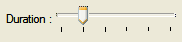{border="0" width="182" height="42"}

#### Syntax:

`SLIDER `*`item-tag`*` = `*`field-name`*` `[`[`]{.underline}` , `*`attribute-list`*` `[`]`]{.underline}` ;`

#### Notes:

1.  *item-tag* is an identifier that defines the name of the item tag.
2.  *field-name* identifies the screen record field. See [Field
    Definition](#FF_FIELD_DEFINITION) for more details.
3.  *attribute-list* defines the aspect and behavior of the Form Item.

#### Attributes:

[COLOR](FSFAttributes.html#FA_COLOR), [COLOR
WHERE](FSFAttributes.html#FA_COLOR_WHERE),
[COMMENT](FSFAttributes.html#FA_COMMENT),
[DEFAULT](FSFAttributes.html#FA_DEFAULT),
[FONTPITCH](FSFAttributes.html#FA_FONTPITCH),
[HIDDEN](FSFAttributes.html#FA_HIDDEN),
[INCLUDE](FSFAttributes.html#FA_INCLUDE),
[JUSTIFY](FSFAttributes.html#FA_JUSTIFY),
[ORIENTATION](FSFAttributes.html#FA_ORIENTATION),
[SAMPLE](FSFAttributes.html#FA_SAMPLE),
[SIZEPOLICY](FSFAttributes.html#FA_SIZEPOLICY),
[STEP](FSFAttributes.html#FA_STEP),
[STYLE](FSFAttributes.html#FA_STYLE),
[TABINDEX](FSFAttributes.html#FA_TABINDEX),
[TAG](FSFAttributes.html#FA_TAG), [VALIDATE
LIKE](FSFAttributes.html#FA_VALIDATE_LIKE),
[VALUEMIN](FSFAttributes.html#FA_VALUEMIN),
[VALUEMAX](FSFAttributes.html#FA_VALUEMAX).

*Table Column only:* [UNSORTABLE](FSFAttributes.html#FA_UNSORTABLE),
[UNSIZABLE](FSFAttributes.html#FA_UNSIZABLE),
[UNHIDABLE](FSFAttributes.html#FA_UNHIDABLE),
[UNMOVABLE](FSFAttributes.html#FA_UNMOVABLE),
[TITLE](FSFAttributes.html#FA_TITLE).

#### Example:

``` linenumber
01 SLIDER f001 = workstate.duration, VALUEMIN=0, VALUEMAX=5, STEP=1;
```

#### Usage:

This item type defines a classic widget for controlling a bounded value.
It lets the user move a slider along a horizontal or vertical groove and
translates the slider\'s position into a value within the legal range.

The [VALUEMIN](FSFAttributes.html#FA_VALUEMIN) and
[VALUEMAX](FSFAttributes.html#FA_VALUEMAX) attributes define
respectively the lower and upper integer limit of the slider
information. Any value outside this range will not be displayed; the
step between two marks is defined by the
[STEP](FSFAttributes.html#FA_STEP) attribute. The
[ORIENTATION](FSFAttributes.html#FA_ORIENTATION) attribute defines
whether the `SLIDER` is displayed vertically or horizontally. If
`VALUEMIN` and/or `VALUEMAX` are not specified, they default
respectively to 0 (zero) and 5.

See also [Form Field](#FF_FORM_FIELD).

#### Warnings:

1.  This widget has to be used with a
    [SMALLINT](DataTypes.html#DT_SMALLINT) or
    [INTEGER](DataTypes.html#DT_INTEGER) variable, larger types like
    [BIGINT](DataTypes.html#DT_BIGINT) or
    [DECIMAL](DataTypes.html#DT_DECIMAL) are not supported.
2.  This widget is not designed for [CONSTRUCT](Construct.html), as you
    can only select one value.

------------------------------------------------------------------------

### [SPINEDIT Item Type]{#FF_ITEMTYPE_SPINEDIT}

#### Purpose:

The `SPINEDIT` item type defines a spin box widget (spin button).

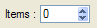{border="0" width="97" height="28"}

#### Syntax:

`SPINEDIT `*`item-tag`*` = `*`field-name`*` `[`[`]{.underline}` , `*`attribute-list`*` `[`]`]{.underline}` ;`

#### Notes:

1.  *item-tag* is an identifier that defines the name of the item tag.
2.  *field-name* identifies the screen record field. See [Field
    Definition](#FF_FIELD_DEFINITION) for more details.
3.  *attribute-list* defines the aspect and behavior of the Form Item.

#### Attributes:

[COLOR](FSFAttributes.html#FA_COLOR), [COLOR
WHERE](FSFAttributes.html#FA_COLOR_WHERE),
[COMMENT](FSFAttributes.html#FA_COMMENT),
[DEFAULT](FSFAttributes.html#FA_DEFAULT),
[FONTPITCH](FSFAttributes.html#FA_FONTPITCH),
[HIDDEN](FSFAttributes.html#FA_HIDDEN),
[INCLUDE](FSFAttributes.html#FA_INCLUDE),
[JUSTIFY](FSFAttributes.html#FA_JUSTIFY), [NOT
NULL](FSFAttributes.html#FA_NOT_NULL),
[NOENTRY](FSFAttributes.html#FA_NOENTRY),
[REQUIRED](FSFAttributes.html#FA_REQUIRED),
[SAMPLE](FSFAttributes.html#FA_SAMPLE),
[SIZEPOLICY](FSFAttributes.html#FA_SIZEPOLICY),
[STEP](FSFAttributes.html#FA_STEP),
[STYLE](FSFAttributes.html#FA_STYLE),
[TABINDEX](FSFAttributes.html#FA_TABINDEX),
[TAG](FSFAttributes.html#FA_TAG), [VALIDATE
LIKE](FSFAttributes.html#FA_VALIDATE_LIKE),
[VALUEMIN](FSFAttributes.html#FA_VALUEMIN),
[VALUEMAX](FSFAttributes.html#FA_VALUEMAX).

*Table Column only:* [UNSORTABLE](FSFAttributes.html#FA_UNSORTABLE),
[UNSIZABLE](FSFAttributes.html#FA_UNSIZABLE),
[UNHIDABLE](FSFAttributes.html#FA_UNHIDABLE),
[UNMOVABLE](FSFAttributes.html#FA_UNMOVABLE),
[TITLE](FSFAttributes.html#FA_TITLE).

#### Example:

``` linenumber
01 SPINEDIT f001 = command.nbItems, STEP=5;
```

#### Usage:

This item type allows the user to choose a value either by clicking the
up/down buttons to increase/decrease the value currently displayed, or
by typing the value directly into the spin box.

The step between two values is defined by the
[STEP](FSFAttributes.html#FA_STEP) attribute.

The [VALUEMIN](FSFAttributes.html#FA_VALUEMIN) and
[VALUEMAX](FSFAttributes.html#FA_VALUEMAX) attributes define
respectively the lower and upper integer limit of the spin-edit range.\
Default values are `VALUEMIN=0` and `VALUEMAX=100`.

See also [Form Field](#FF_FORM_FIELD).

#### Warnings:

1.  This widget has to be used with a
    [SMALLINT](DataTypes.html#DT_SMALLINT) or
    [INTEGER](DataTypes.html#DT_INTEGER) variable, larger types like
    [BIGINT](DataTypes.html#DT_BIGINT) or
    [DECIMAL](DataTypes.html#DT_DECIMAL) are not supported.
2.  This widget is not designed for [CONSTRUCT](Construct.html), as you
    can only enter an integer value.

------------------------------------------------------------------------

### [TIMEEDIT Item Type]{#FF_ITEMTYPE_TIMEEDIT}

#### Purpose:

The `TIMEEDIT` item type defines a time editor widget.

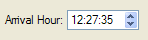{border="0" width="148" height="40"}

#### Syntax:

`TIMEEDIT `*`item-tag`*` = `*`field-name`*` `[`[`]{.underline}` , `*`attribute-list`*` `[`]`]{.underline}` ;`

#### Notes:

1.  *item-tag* is an identifier that defines the name of the item tag.
2.  *field-name* identifies the screen record field. See [Field
    Definition](#FF_FIELD_DEFINITION) for more details.
3.  *attribute-list* defines the aspect and behavior of the Form Item.

#### Attributes:

[COLOR](FSFAttributes.html#FA_COLOR), [COLOR
WHERE](FSFAttributes.html#FA_COLOR_WHERE),
[COMMENT](FSFAttributes.html#FA_COMMENT),
[DEFAULT](FSFAttributes.html#FA_DEFAULT),
[FONTPITCH](FSFAttributes.html#FA_FONTPITCH),
[HIDDEN](FSFAttributes.html#FA_HIDDEN),
[INCLUDE](FSFAttributes.html#FA_INCLUDE),
[JUSTIFY](FSFAttributes.html#FA_JUSTIFY), [NOT
NULL](FSFAttributes.html#FA_NOT_NULL),
[NOENTRY](FSFAttributes.html#FA_NOENTRY),
[REQUIRED](FSFAttributes.html#FA_REQUIRED),
[SAMPLE](FSFAttributes.html#FA_SAMPLE),
[SIZEPOLICY](FSFAttributes.html#FA_SIZEPOLICY),
[STYLE](FSFAttributes.html#FA_STYLE),
[TABINDEX](FSFAttributes.html#FA_TABINDEX),
[TAG](FSFAttributes.html#FA_TAG), [VALIDATE
LIKE](FSFAttributes.html#FA_VALIDATE_LIKE).

*Table Column only:* [UNSORTABLE](FSFAttributes.html#FA_UNSORTABLE),
[UNSIZABLE](FSFAttributes.html#FA_UNSIZABLE),
[UNHIDABLE](FSFAttributes.html#FA_UNHIDABLE),
[UNMOVABLE](FSFAttributes.html#FA_UNMOVABLE),
[TITLE](FSFAttributes.html#FA_TITLE).

#### Example:

``` linenumber
01 TIMEEDIT f001 = pakcage.arrTime;
```

#### Usage:

This item type allows the user to edit times by using the keyboard or
the arrow keys to increase/decrease time values.

See also [Form Field](#FF_FORM_FIELD).

#### Warnings:

1.  With this widget, the user can only enter a [DATETIME HOUR TO
    SECOND](DataTypes.html#DT_DATETIME) value.
2.  This widget is not designed for [CONSTRUCT](Construct.html), as you
    can only enter time.

------------------------------------------------------------------------

### [WEBCOMPONENT Item Type]{#FF_ITEMTYPE_WEBCOMPONENT}

#### Purpose:

The `WEBCOMPONENT` item type defines a generic form field that can
receive an external widget.

#### Syntax:

`WEBCOMPONENT `*`item-tag`*` = `*`field-name`*` `[`[`]{.underline}` , `*`attribute-list`*` `[`]`]{.underline}` ;`

#### Notes:

1.  *item-tag* is an identifier that defines the name of the item tag.
2.  *field-name* identifies the screen record field. See [Field
    Definition](#FF_FIELD_DEFINITION) for more details.
3.  *attribute-list* defines the aspect and behavior of the Form Item.

#### Attributes:

[COLOR](FSFAttributes.html#FA_COLOR), [COLOR
WHERE](FSFAttributes.html#FA_COLOR_WHERE),
[COMPONENTTYPE](FSFAttributes.html#FA_COMPONENTTYPE),
[COMMENT](FSFAttributes.html#FA_COMMENT),
[DEFAULT](FSFAttributes.html#FA_DEFAULT),
[FONTPITCH](FSFAttributes.html#FA_FONTPITCH),
[HEIGHT](FSFAttributes.html#FA_HEIGHT),
[HIDDEN](FSFAttributes.html#FA_HIDDEN),
[INCLUDE](FSFAttributes.html#FA_INCLUDE),
[JUSTIFY](FSFAttributes.html#FA_JUSTIFY), [NOT
NULL](FSFAttributes.html#FA_NOT_NULL),
[NOENTRY](FSFAttributes.html#FA_NOENTRY),
[PROPERTIES](FSFAttributes.html#FA_PROPERTIES),
[REQUIRED](FSFAttributes.html#FA_REQUIRED),
[SCROLLBARS](FSFAttributes.html#FA_SCROLLBARS),
[SIZEPOLICY](FSFAttributes.html#FA_SIZEPOLICY),
[STYLE](FSFAttributes.html#FA_STYLE),
[STRETCH](FSFAttributes.html#FA_STRETCH),
[TAG](FSFAttributes.html#FA_TAG),
[TABINDEX](FSFAttributes.html#FA_TABINDEX), [VALIDATE
LIKE](FSFAttributes.html#FA_VALIDATE_LIKE),
[WIDTH](FSFAttributes.html#FA_WIDTH).

*Table Column only:* [UNSORTABLE](FSFAttributes.html#FA_UNSORTABLE),
[UNSIZABLE](FSFAttributes.html#FA_UNSIZABLE),
[UNHIDABLE](FSFAttributes.html#FA_UNHIDABLE),
[UNMOVABLE](FSFAttributes.html#FA_UNMOVABLE),
[TITLE](FSFAttributes.html#FA_TITLE).

#### Usage:

The `WEBCOMPONENT` item type defines a form field which can be
implemented with a plug-in mechanism on the front-end side.

You must define the type of the widget with the
[COMPONENTTYPE](FSFAttributes.html#FA_COMPONENTTYPE) attribute. This
attribute is mandatory to identify the external widget that will be used
for this field.

The [SCROLLBARS](FSFAttributes.html#FA_SCROLLBARS) and
[STRETCH](FSFAttributes.html#FA_STRETCH) attributes can be used to
define the behavior of the widget regarding sizing.

The [PROPERTIES](FSFAttributes.html#FA_PROPERTIES) attribute is
typically used to define attributes that are specific to a given WEB
Component. For example, a chart component might have properties to
define x-axis and y-axis labels.

The value of a `WEBCOMPONENT` field is usually (XML) formatted, and
holds the data that will be rendered by the external widget through the
JavaScript shell.

See also [Using Web Components](WebComponent.html).

#### Example:

``` linenumber
01 WEBCOMPONENT f001 = FORMONLY.mycal, COMPONENTTYPE="Calendar", STRETCH=BOTH, STYLE="regular";
```

------------------------------------------------------------------------

### [BUTTON Item Type]{#FF_ITEMTYPE_BUTTON}

#### Purpose:

The `BUTTON` item type defines a push-button that can trigger an action.

{border="0" width="114" height="31"}

#### Syntax:

`BUTTON `*`item-tag`*` : `*`item-name`*` `[`[`]{.underline}` , `*`attribute-list`*` `[`]`]{.underline}` ;`

#### Notes:

1.  *item-tag* is an identifier that defines the name of the item tag.
2.  *item-name* identifies the button and the corresponding action the
    button must be bound to.\
    This name can be prefixed with the [sub-dialog
    identifier](MultipleDialogs.html#binding-actions).
3.  *attribute-list* defines the aspect and behavior of the Form Item.

#### Attributes:

[COMMENT](FSFAttributes.html#FA_COMMENT),
[FONTPITCH](FSFAttributes.html#FA_FONTPITCH),
[HIDDEN](FSFAttributes.html#FA_HIDDEN),
[IMAGE](FSFAttributes.html#FA_IMAGE),
[SAMPLE](FSFAttributes.html#FA_SAMPLE),
[SIZEPOLICY](FSFAttributes.html#FA_SIZEPOLICY),
[STYLE](FSFAttributes.html#FA_STYLE),
[TABINDEX](FSFAttributes.html#FA_TABINDEX),
[TAG](FSFAttributes.html#FA_TAG), [TEXT](FSFAttributes.html#FA_TEXT).

#### Example:

``` linenumber
01 BUTTON btn1 : print, TEXT="Print Report", IMAGE="printer";
```

#### Usage:

This item type defines a standard push button with a label or a picture.

In the `BUTTON` Form Item, the label is defined with the
[TEXT](FSFAttributes.html#FA_TEXT) attribute, the picture is defined by
the [IMAGE](FSFAttributes.html#FA_IMAGE) attribute, and the
[COMMENT](FSFAttributes.html#FA_COMMENT) attribute can be used to define
a help bubble for the button.

When controlled by a `COMMAND` action handler in a `DIALOG` interactive
instruction, form buttons can get the focus and thus be part of the
tabbing list ([TABINDEX](FSFAttributes.html#FA_TABINDEX)). For more
details see [tabbing order handling](MultipleDialogs.html#tabbing-order)
in Multiple Dialogs.

------------------------------------------------------------------------

### [CANVAS Item Type]{#FF_ITEMTYPE_CANVAS}

#### Purpose:

The `CANVAS` item type defines an area in which you can draw shapes.

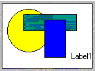{border="0" width="216" height="144"}

#### Syntax:

`CANVAS `*`item-tag`*` : `*`item-name`*` `[`[`]{.underline}` , `*`attribute-list`*` `[`]`]{.underline}` ;`

#### Notes:

1.  *item-tag* is an identifier that defines the name of the item tag.
2.  *item-name* identifies the form element (name attribute in .42f) of
    a canvas. See [Form Items](#FF_FORM_ITEM) for more details.
3.  *attribute-list* defines the aspect and behavior of the Form Item.

#### Attributes:

[COMMENT](FSFAttributes.html#FA_COMMENT),
[HIDDEN](FSFAttributes.html#FA_HIDDEN),
[TAG](FSFAttributes.html#FA_TAG).

#### Example:

``` linenumber
01 CANVAS cvs1 : canvas1;
```

#### Usage:

See [Canvas](Canvas.html) for more details.

------------------------------------------------------------------------

### [GROUP Item Type]{#FF_ITEMTYPE_GROUP}

#### Purpose:

The `GROUP` item type defines attributes for a groupbox layout tag.

#### Syntax:

`GROUP `*`layout-tag`*` : `*`item-name`*` `[`[`]{.underline}` , `*`attribute-list`*` `[`]`]{.underline}` ;`

#### Notes:

1.  *layout-tag* is an identifier that defines the name of the layout
    tag.
2.  *item-name* identifies the form element (name attribute in .42f) of
    a groupbox. See [Form Items](#FF_FORM_ITEM) for more details.
3.  *attribute-list* defines the aspect and behavior of the Form Item.

#### Attributes:

[COMMENT](FSFAttributes.html#FA_COMMENT),
[FONTPITCH](FSFAttributes.html#FA_FONTPITCH),
[GRIDCHILDRENINPARENT](FSFAttributes.html#FA_GRIDCHILDRENINPARENT),
[HIDDEN](FSFAttributes.html#FA_HIDDEN),
[STYLE](FSFAttributes.html#FA_STYLE), [TAG](FSFAttributes.html#FA_TAG),
[TEXT](FSFAttributes.html#FA_TEXT).

#### Example:

``` linenumber
01 GROUP g1 : group1, TEXT="Description", GRIDCHILDRENINPARENT;
```

#### Usage:

Use this item type to specify the attributes of a
[GROUP](#FF_CONTAINER_GROUP) container defined with a [layout
tag](#FF_LAYOUT_TAG).

------------------------------------------------------------------------

### [SCROLLGRID Item Type]{#FF_ITEMTYPE_SCROLLGRID}

#### Purpose:

The `SCROLLGRID` item type defines attributes for a scrollgrid layout
tag.

#### Syntax:

`SCROLLGRID `*`layout-tag`*` : `*`item-name`*` `[`[`]{.underline}` , `*`attribute-list`*` `[`]`]{.underline}` ;`

#### Notes:

1.  *layout-tag* is an identifier that defines the name of the layout
    tag.
2.  *item-name* identifies the form element (name attribute in .42f) of
    a scrollgrid. See [Form Items](#FF_FORM_ITEM) for more details.
3.  *attribute-list* defines the aspect and behavior of the Form Item.

#### Attributes:

[COMMENT](FSFAttributes.html#FA_COMMENT),
[FONTPITCH](FSFAttributes.html#FA_FONTPITCH),
[GRIDCHILDRENINPARENT](FSFAttributes.html#FA_GRIDCHILDRENINPARENT),
[HIDDEN](FSFAttributes.html#FA_HIDDEN),
[STYLE](FSFAttributes.html#FA_STYLE), [TAG](FSFAttributes.html#FA_TAG).

#### Example:

``` linenumber
01 SCROLLGRID sg1 : scrollgrid1, GRIDCHILDRENINPARENT;
```

#### Usage:

Use this item type to specify the attributes of a
[SCROLLGRID](#FF_CONTAINER_SCROLLGRID) container defined with a [layout
tag](#FF_LAYOUT_TAG).

------------------------------------------------------------------------

### [TABLE Item Type]{#FF_ITEMTYPE_TABLE}

#### Purpose:

The `TABLE` item type defines attributes for a table layout tag.

#### Syntax:

`TABLE `*`layout-tag`*` : `*`item-name`*` `[`[`]{.underline}` , `*`attribute-list`*` `[`]`]{.underline}` ;`

#### Notes:

1.  *layout-tag* is an identifier that defines the name of the layout
    tag.
2.  *item-name* identifies the form element (name attribute in .42f) of
    a table. See [Form Items](#FF_FORM_ITEM) for more details.
3.  *attribute-list* defines the aspect and behavior of the Form Item.

#### Attributes:

[COMMENT](FSFAttributes.html#FA_COMMENT),
[DOUBLECLICK](FSFAttributes.html#FA_DOUBLECLICK),
[FONTPITCH](FSFAttributes.html#FA_FONTPITCH),
[HEIGHT](FSFAttributes.html#FA_HEIGHT),
[HIDDEN](FSFAttributes.html#FA_HIDDEN),
[STYLE](FSFAttributes.html#FA_STYLE), [TAG](FSFAttributes.html#FA_TAG),
[UNHIDABLECOLUMNS](FSFAttributes.html#FA_UNHIDABLECOLUMNS),
[UNMOVABLECOLUMNS](FSFAttributes.html#FA_UNMOVABLECOLUMNS),
[UNSIZABLECOLUMNS](FSFAttributes.html#FA_UNSIZABLECOLUMNS),
[UNSORTABLECOLUMNS](FSFAttributes.html#FA_UNSORTABLECOLUMNS),
[WANTFIXEDPAGESIZE](FSFAttributes.html#FA_WANTFIXEDPAGESIZE),
[WIDTH](FSFAttributes.html#FA_WIDTH).

#### Example:

``` linenumber
01 TABLE t1 : table1, UNSORTABLECOLUMNS;
```

#### Usage:

Use this item type to specify the attributes of a
[TABLE](#FF_CONTAINER_TABLE) defined with a [layout
tag](#FF_LAYOUT_TAG).

With  the [DOUBLECLICK](FSFAttributes.html#FA_DOUBLECLICK) attribute,
you can define a particular action to be send when the user
double-clicks on a row. 

By default, a table allow to hide, move, resize columns and sort the
list when the user clicks on a column header. The
[UNHIDABLECOLUMNS](FSFAttributes.html#FA_UNHIDABLECOLUMNS),
[UNMOVABLECOLUMNS](FSFAttributes.html#FA_UNMOVABLECOLUMNS),
[UNSIZABLECOLUMNS](FSFAttributes.html#FA_UNSIZABLECOLUMNS),
[UNSORTABLECOLUMNS](FSFAttributes.html#FA_UNSORTABLECOLUMNS) attributes
can be used to deny these features.

The [WIDTH](FSFAttributes.html#FA_WIDTH) and
[HEIGHT](FSFAttributes.html#FA_HEIGHT) attributes can be used to specify
a initial geometry for the table.

By default, tables can be resized in height. Use the
[WANTFIXEDPAGESIZE](FSFAttributes.html#FA_WANTFIXEDPAGESIZE) attribute
to deny table resizing.

------------------------------------------------------------------------

### [TREE Item Type]{#FF_ITEMTYPE_TREE}

The `TREE` item type defines attributes for a tree layout tag.

#### Syntax:

`TREE `*`layout-tag`*` : `*`item-name`*` `[`[`]{.underline}` , `*`attribute-list`*` `[`]`]{.underline}` ;`\
` `

#### Notes:

1.  *layout-tag* is an identifier that defines the name of the layout
    tag.
2.  *item-name* identifies the form element (name attribute in .42f) of
    a table. See [Form Items](#FF_FORM_ITEM) for more details.
3.  *attribute-list* defines the aspect and behavior of the Form Item.

#### Attributes:

[COMMENT](FSFAttributes.html#FA_COMMENT),
[DOUBLECLICK](FSFAttributes.html#FA_DOUBLECLICK),
[HIDDEN](FSFAttributes.html#FA_HIDDEN),
[FONTPITCH](FSFAttributes.html#FA_FONTPITCH),
[STYLE](FSFAttributes.html#FA_STYLE), [TAG](FSFAttributes.html#FA_TAG),
[UNHIDABLECOLUMNS](FSFAttributes.html#FA_UNHIDABLECOLUMNS),
[UNMOVABLECOLUMNS](FSFAttributes.html#FA_UNMOVABLECOLUMNS),
[UNSIZABLECOLUMNS](FSFAttributes.html#FA_UNSIZABLECOLUMNS),
[UNSORTABLECOLUMNS](FSFAttributes.html#FA_UNSORTABLECOLUMNS),
[WANTFIXEDPAGESIZE](FSFAttributes.html#FA_WANTFIXEDPAGESIZE),
[WIDTH](FSFAttributes.html#FA_WIDTH),
[HEIGHT](FSFAttributes.html#FA_HEIGHT),
[PARENTIDCOLUMN](FSFAttributes.html#FA_PARENTIDCOLUMN),
[IDCOLUMN](FSFAttributes.html#FA_IDCOLUMN),
[EXPANDEDCOLUMN](FSFAttributes.html#FA_EXPANDEDCOLUMN),
[ISNODECOLUMN](FSFAttributes.html#FA_ISNODECOLUMN),
[IMAGEEXPANDED](FSFAttributes.html#FA_IMAGEEXPANDED),
[IMAGECOLLAPSED](FSFAttributes.html#FA_IMAGECOLLAPSED),
[IMAGELEAF](FSFAttributes.html#FA_IMAGELEAF).

#### Usage:

The tree layout tag defines a tree region in the frame of a grid-based
container, providing the same presentation as a [TREE
container](#FF_CONTAINER_TREE). See the [Tree
Container](#FF_CONTAINER_TREE) discussion for specific information about
the mandatory and optional columns in a tree view.   See also the [Tree
View page](TreeViews.html) for more details about tree-view programming
in Genero.

------------------------------------------------------------------------

### [INSTRUCTIONS Section]{#SECTION_INSTRUCTIONS}

The ` INSTRUCTIONS` section can specify screen arrays, non-default
screen records and field delimiters.

#### Syntax:

`INSTRUCTIONS`\
[`{`]{.underline}` `*`screen-record`*` `[`|`]{.underline}` `*`screen-array`*` `[`}`]{.underline}` `[`[`]{.underline}`;`[`]`\
`[...]`]{.underline}\
[`[`]{.underline}` `*`delimiters`*` `[`[`]{.underline}`;`[`]`]{.underline}` `[`]`\
`[`]{.underline}` DEFAULT SAMPLE = "`*`string`*`" `[`]`\
`[`]{.underline}`END`[`]`]{.underline}

where *screen-record* is:

`SCREEN RECORD `*`record-name`*` ( `*`field-list`*`  )`

where *screen-array* is:

`SCREEN RECORD `*`array-name`*` [ `*`size`*` ] ( `*`field-list`*` )`

where *field-list* is:

[`{`]{.underline}` `*`table`*`.* `[`|`]{.underline}` `*`field`*` `[`[`]{.underline}` `[`{`]{.underline}`THROUGH`[`|`]{.underline}`THRU`[`}`]{.underline}` `*`lastfield`*` `[`]`]{.underline}` `[`[`]{.underline}`,`[`...]`]{.underline}` `[`}`]{.underline}

and where *delimiters* is:

`DELIMITERS "`*`AB`*`" `**TUI Only!**

#### Notes:

1.  The ` INSTRUCTIONS` section is optional. If present, it must appear
    after the [ATTRIBUTES](#SECTION_ATTRIBUTES) section.
2.  The ` END` keyword is optional.
3.  *record-name* is the name of an explicit screen record.
4.  *array-name* is the name of an explicit screen array.
5.  *size* is an integer representing the number of screen records in
    the screen array.
6.  *field* is a field identifier as defined in the right operand of a
    field definition in the [ATTRIBUTES](#SECTION_ATTRIBUTES) section.
7.  *table*.\* notation instructs the form compiler to build the screen
    record with all fields declared in the
    [ATTRIBUTES](#SECTION_ATTRIBUTES) section for the given table.
8.  *A* and *B* define the opening and closing field delimiters for
    character based terminals.

#### Warnings:

1.  You must specify the *table* qualifier if the field name is not
    unique among the fields in the [ATTRIBUTES](#SECTION_ATTRIBUTES)
    section, or if *table* is a required [alias](#SECTION_TABLES).
2.  `DELIMITERS` is provided for backward compatibility; it is only
    useful when using character terminals.

#### Example:

``` linenumber
01 ...
02 INSTRUCTIONS
03 SCREEN RECORD s_items[10]
04   ( stock.*,
05     items.quantity,
06     FORMONLY.total_price )
07 DELIMITERS "[]"
08 END
```

#### Default sample:

The `DEFAULT SAMPLE` directive defines the default sample text for all
fields. See the [SAMPLE attribute](FSFAttributes.html#FA_SAMPLE) for
more details:

``` linenumber
01 DEFAULT SAMPLE = "MMM"
```

#### [Screen records:]{#FF_SCREEN_RECORD}

A *screen record* is a group of fields that screen interaction
statements of the program can reference as a single object. By
establishing a correspondence between a set of screen fields (the screen
record) and a set of program variables (typically a program record), you
can pass values between the program and the fields of the screen record.
In many applications, it is convenient to define a screen record that
corresponds to a *row* of a database table.

The form compiler builds *default screen recor*ds that consist of all
the screen fields linked to the same database table within a given form.
A *default record* is automatically created for each table that is used
to reference a field in the [ATTRIBUTES](#SECTION_ATTRIBUTES) section.
The components of the default record correspond to the set of display
fields that are linked to columns in that table. The name of the default
screen record is the table name (or the alias, if you have declared an
alias for that table in the [TABLES](#SECTION_TABLES) section). For
example, all the fields linked to columns of the **customer** table
constitute a default screen record whose name is **customer**. If a form
includes one or more [FORMONLY fields](#FF_FORMONLY_FIELD), those fields
constitute a default screen record called **formonly**.

Like the name of a screen field, the identifier of a screen record must
be unique within the form, and it has a scope that is restricted to when
its form is open. Statements can reference *record* only when the screen
form that includes it is being displayed. The form compiler returns an
error if *record* is the same as the name or alias of a table in the
[TABLES](#SECTION_TABLES) section.

In the `INSTRUCTIONS` section of a form specification file, you can
declare *explicit screen records* by using the `SCREEN RECORD` keywords
to declare a name for the screen record and to specify a list of fields
that are members of the screen record.

#### [Screen arrays:]{#FF_SCREEN_ARRAY}

A *screen array* is usually a repetitive array of fields in the screen
layout, each containing identical groups of screen fields. Each *row* of
a screen array is a screen record. Each *column* of a screen array
consists of fields with the same field tag in the
[LAYOUT](#SECTION_LAYOUT) section of the form specification file.

You must declare screen arrays in the ` INSTRUCTIONS` section with the
`SCREEN RECORD` keyword, as in the declaration of a screen record, but
with an additional parameter to specify the *number of screen records*
in the array.

The *size* value should be the number of lines in the logical form where
the set of fields that comprise each screen record is repeated within
the screen array. For example, a GRID container of the
[LAYOUT](#SECTION_LAYOUT) section might represent a screen array like
this:

``` linenumber
01 ...
02 LAYOUT
03 GRID
04 {
05   OrdId      Date        Total Price
06  [f001      |f002       |f003       ]
07  [f001      |f002       |f003       ]
08  [f001      |f002       |f003       ]
09  [f001      |f002       |f003       ]
10 }
11 END
12 END
13 ...
```

This example requires a *size* of `[4]`. Except for the *size*
parameter, the syntax for specifying the identifier and the field names
of a screen array is the same as for a simple screen record.

You can reference the names of the screen array in the [DISPLAY
TO](RecordInput.html), [DISPLAY ARRAY](DisplayArray.html),
[INPUT](RecordInput.html) and [INPUT ARRAY](InputArray.html) statements
of programs, but only when the screen form that includes the screen
array is the current form.

#### Warnings:

1.  You cannot define multiple screen arrays for the same
    [TABLE](#FF_CONTAINER_TABLE) definition. Only one `SCREEN RECORD`
    specification is allowed.

#### Using screen records and screen arrays in programs:

Screen records and screen arrays can display program records. If the
fields in the screen record have the same sequence of data types as the
columns in a database table, you can use the screen record to simplify
operations that pass values between program variables and rows of the
database.

#### [Field delimiters:]{#FF_FIELD_DELIMITERS}

When using the [TUI mode](FglTerms.html#TEXT_USER_INTERFACE), you can
change the field delimiters displayed on the screen. By default, field
delimiters are simple brackets ( \[ \] ) and can be changed to any other
printable character, including blank spaces. The ` DELIMITERS`
instruction tells the form compiler what symbols to use as field
delimiters when the runtime system displays the form on the screen. The
opening and closing delimiter marks must be enclosed within quotation
marks ( \" ).

To use only one space between fields, in the [LAYOUT](#SECTION_LAYOUT)
section, substitute a pipe symbol ( \| ) for paired back-to-back ( \]\[
) brackets that separate adjacent fields. In the ` INSTRUCTIONS`
section, define some symbol as both the beginning and the ending
delimiter. For example, you could specify \"\| \|\" or \"/ /\" or \":
:\" or \" \" (blanks).

Field delimiters are not displayed when using the [GUI
mode](FglTerms.html#GRAPHICAL_USER_INTERFACE).

------------------------------------------------------------------------

### [KEYS Section]{#SECTION_KEYS}

The ` KEYS` section can be used to define default key labels for the
current form.

#### Syntax:

`KEYS`\
*`key-name`*` = `[`[`]{.underline}`%`[`]`]{.underline}`"`*`label`*`"`\
[`[...]`]{.underline}\
[`[`]{.underline}`END`[`]`]{.underline}

#### Notes:

1.  The ` KEYS` section is optional. If present, it must appear after
    the [INSTRUCTIONS](#SECTION_INSTRUCTIONS) section.
2.  The ` END` keyword is optional.
3.  *key-name* is the name of a key ( like `F10`, `Control-z` ).
4.  *label* is the text to be displayed in the button corresponding to
    the key.

#### Warnings:

1.  The `KEYS` section is supported for backward compatibility. See also
    [Setting Key Labels](DynamicUI.html#SETTING_KEY_LABELS).

#### Example:

``` linenumber
01 ...
02 KEYS
03 F10 = "City list"
04 F11 = "State list"
05 F15 = "Validate"
06 END
```

For more details, see \"[Setting Key
Labels](DynamicUI.html#SETTING_KEY_LABELS)\".

------------------------------------------------------------------------

### [Boolean expressions in form files]{#BOOLEXPR}

#### Purpose:

This section describes the syntax supported for Boolean expressions in
form specification files, as in the [COLOR
WHERE](FSFAttributes.html#FA_COLOR_WHERE) attribute specification, for
example.

#### Syntax:

[`[`]{.underline}`(`[`]`]{.underline}` `*`boolexpr`*` `[`{`]{.underline}`AND`[`|`]{.underline}`OR`[`}`]{.underline}` `*`boolexpr`*` `[`[`]{.underline}`)`[`]`]{.underline}` `[`[...]`]{.underline}

where *boolexpr* is:

[`[`]{.underline}`NOT`[`]`]{.underline}\
[`{`]{.underline}` `*`expression`*\
`    `[`{`]{.underline}`   =`\
`    `[`|`]{.underline}`   <>`[\]{.underline}
`    `[`|`]{.underline}`   <=`[\]{.underline}
`    `[`|`]{.underline}`   >=`[\]{.underline}
`    `[`|`]{.underline}`   <`[\]{.underline}
`    `[`|`]{.underline}`   >`[\]{.underline}
`    `[`|`]{.underline}`   !=`[\]{.underline}
`    `[`|`]{.underline}`   IS `[`[`]{.underline}`NOT`[`]`]{.underline}` NULL`\
`    `[`|`]{.underline}`   `[`[`]{.underline}`NOT`[`]`]{.underline}` BETWEEN `*`expression`*` AND `*`expression`*\
`    `[`}`]{.underline}\
[`|`]{.underline}` `*`charexpr`*` `\
`    `[`{`]{.underline}`   `[`[`]{.underline}`NOT`[`]`]{.underline}` MATCHES "`*`string`*`"`[\]{.underline}
`    `[`|`]{.underline}`   `[`[`]{.underline}`NOT`[`]`]{.underline}` LIKE "`*`string`*`"`\
`    `[`}`]{.underline}\
[`}`]{.underline}

#### Notes:

1.  *expression* can be the current field tag, a character string,
    numeric or datetime [literal](Literals.html).
2.  *charexpr* can be the current field tag or a character string
    [literal](Literals.html).
3.  When a *field-tag* is used in the Boolean expression, the runtime
    system replaces *field-tag* at runtime with the current value in the
    screen field and evaluates the expression.

------------------------------------------------------------------------

### [Compiling form files]{#COMPILING}

In order for your program to work with a screen form, you must create a
form specification file that conforms to the syntax described earlier in
this section, and then compile the form. You must use the [form
compiler](Tools.html#TL_FGLFORM) to do the compilation. Form compilation
requires that the [database schema files](DatabaseSchema.html) already
exist if the form specification file uses a [SCHEMA
specification](#SECTION_SCHEMA).

#### Warnings:

1.  Make sure that the [database schema files](DatabaseSchema.html) of
    the [development database](FglTerms.html#DEVELOPMENT_DATABASE)
    correspond to the [production
    database](FglTerms.html#PRODUCTION_DATABASE), otherwise the form
    fields defined in the compiled version of your forms will not match
    the table structures of the production database.

#### Tips:

1.  As compiled form files depend on both the source files and the
    [database schema files](DatabaseSchema.html), it is strongly
    recommended that you use the MAKE utility to manage form file
    compilation. In the makefiles, you should define the dependence
    rules according to these constraints.

------------------------------------------------------------------------

### [Using forms in programs]{#USING}

To work with a screen form, the application requires a *form driver,*
which is a logical set of interactive statements that control the
display of the form, bind form fields to program variables, and respond
to actions by the user in fields.

Compiled forms must be loaded by the program with the [OPEN
FORM](WindowsAndForms.html#OPEN_FORM) or the [OPEN WINDOW WITH
FORM](WindowsAndForms.html#WITHFORM) instruction.

#### Warnings:

1.  The
    [DBPATH](EnvironmentVariables.html#EV_DBPATH)/[FGLRESOURCEPATH](EnvironmentVariables.html#EV_FGLRESOURCEPATH)
    environment variable must contain the directory where the compiled
    form file is located, if the form file is not in the current
    directory.

Once a form is loaded, the program can manipulate forms to display or
let the user edit data, with instructions like [DISPLAY
TO](RecordInput.html), [INPUT](RecordInput.html), [INPUT
ARRAY](InputArray.html), [DISPLAY ARRAY](DisplayArray.html) and
[CONSTRUCT](Construct.html).  Program variables are used as display
and/or input buffers.
