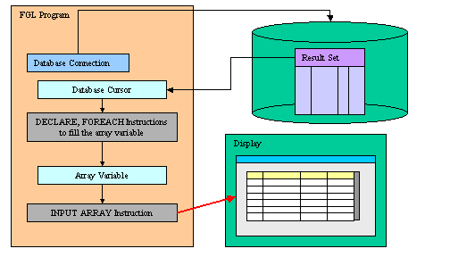
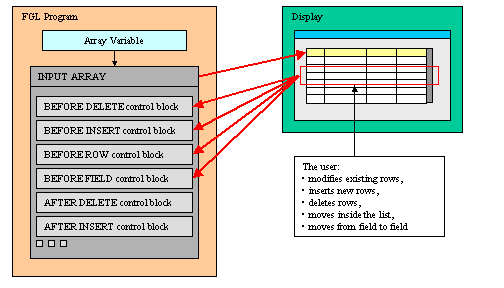
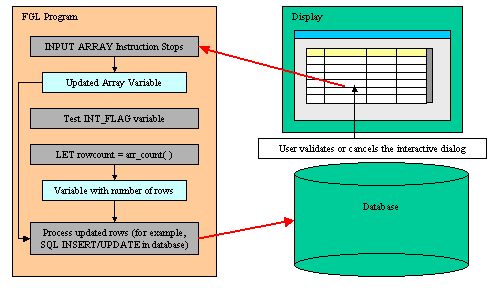

[Back to Contents](../index.html)

------------------------------------------------------------------------

# [Array Input]{#PAGE_HEADER}

Summary:

- [Basics](#BASICS)
  - [Built-in sort](#BUILT_IN_SORT)
- [Syntax](#SYNTAX)
- [Usage](#USAGE)
  - [Programming Steps](#PROG_STEPS)
  - [Variable Binding](#VARIABLE_BINDING)
  - [Instruction Configuration](#INSTRUCTION_CONFIG)
  - [Default Actions](#DEFAULT_ACTIONS)
  - [Control Blocks](#CONTROL_BLOCKS)
  - [Control Blocks Execution Order](#CTRLBLOCK_EXECUTION)
  - [Interaction Blocks](#INTERACTION_BLOCKS)
  - [Control Instructions](#CONTROL_INSTRUCTIONS)
  - [Control Class](#CONTROL_CLASS)
  - [Control Functions](#CONTROL_FUNCTIONS)
- [Examples](#EXAMPLES)
  - [Basic INPUT ARRAY](#EXAMPLE_1)
  - [INPUT ARRAY using default values](#EXAMPLE_2)
  - [INPUT ARRAY using dynamic array](#EXAMPLE_3)
  - [INPUT ARRAY updating database table](#EXAMPLE_4)

*See also:* [Arrays](Arrays.html), [Records](Records.html), [Result
Sets](ResultSets.html), [Programs](Programs.html),
[Windows](WindowsAndForms.html), [Forms](FormSpecFiles.html), [Display
Array](DisplayArray.html)

------------------------------------------------------------------------

### [Basics]{#BASICS}

The `INPUT ARRAY` instruction associates a [program array](Arrays.html)
of [records](Records.html) with a
[screen-array](FormSpecFiles.html#SECTION_INSTRUCTIONS) defined in a
[form](FormSpecFiles.html) so that the user can update the list of
records. The `INPUT ARRAY` statement activates the current form (the
form that was most recently displayed or the form in the [current
window](WindowsAndForms.html)):

{border="0" width="504" height="288"}

During the `INPUT ARRAY` execution, the user can edit or delete existing
rows, insert new rows, and move inside the list of records. The user can
insert new rows with the insert key, which is by default `F1`, or delete
existing rows with the delete key, which is by default `F2`. The program
controls the behavior of the instruction with control blocks:

{border="0" width="504" height="288"}

To terminate the `INPUT ARRAY` execution, the user can validate (or
cancel) the dialog to commit (or invalidate) the modifications made in
the list of records:

{border="0" width="504" height="288"}

When the statement completes execution, the form is de-activated. After
the user terminates the input (for example, with the Accept key), the
program must test the [INT_FLAG](Programs.html#PV_INT_FLAG) variable to
check if the dialog was validated (or canceled) and then use
[INSERT](StaticSql.html#SS_INSERT), [DELETE](StaticSql.html#SS_DELETE),
or [UPDATE](StaticSql.html#SS_UPDATE) SQL statements to modify the
appropriate database tables. The database can also be updated during the
execution of the `INPUT ARRAY` statement.

#### [Built-in sort]{#BUILT_IN_SORT} {#built-in-sort align="left"}

The `INPUT ARRAY` dialog implements built-in row sorting which can be
used if the dialog is combined with a
[TABLE](FormSpecFiles.html#FF_CONTAINER_TABLE) container. When the end
user clicks on a column header of the table, the rows are automatically
sorted in ascending or descending order.

For more details about the built-in sort feature, see the [Multiple
Dialogs page](MultipleDialogs.html#table-sort).

------------------------------------------------------------------------

### [INPUT ARRAY]{#INPUT_ARRAY}

#### Purpose:

The `INPUT ARRAY` supports data entry by users into a [screen
array](FormSpecFiles.html#SECTION_INSTRUCTIONS) and stores the entered
data in an [array of records](Arrays.html).

#### [Syntax]{#SYNTAX}:

`INPUT ARRAY `*[`array`](#array)*\
`  `[`[`]{.underline}` WITHOUT DEFAULTS `[`]`]{.underline}\
`  FROM `*[`screen-array`](#screen-array)*`.* `*` `\*
`  `[`[`]{.underline}` ATTRIBUTES ( `[`{`]{.underline}` `*[`display-attribute`](#display-attributes)*` `[`|`]{.underline}` `*[`control-attribute`](#control-attributes)*` `[`}`]{.underline}` `[`[,...]`]{.underline}` `
` ``) `[`]`\]{.underline}
` `*` `*` `[`[`]{.underline}` HELP `*[`help-number`](#help-number)*` `[`]`]{.underline}\
[`[`]{.underline}` `*[`dialog-control-block`](#dialog-control-block)*\
`  `[`[...]`\]{.underline}
` END INPUT `[`]`]{.underline}` `

where *[dialog-control-block]{#dialog-control-block}* is one of:

` `[`{`]{.underline}` BEFORE INPUT`\
[`|`]{.underline}` AFTER INPUT`\
[`|`]{.underline}` AFTER DELETE`\
[`|`]{.underline}` BEFORE ROW`\
[`|`]{.underline}` AFTER ROW`\
[`|`]{.underline}` BEFORE FIELD `*[`field-spec`](#field-spec)*` `[`[,...]`]{.underline}\
[`|`]{.underline}` AFTER FIELD `*[`field-spec`](#field-spec)*` `[`[,...]`]{.underline}\
[`|`]{.underline}` ON ROW CHANGE`\
[`|`]{.underline}` ON CHANGE `*[`field-spec`](#field-spec)*` `[`[,...]`]{.underline}\
[`|`]{.underline}` ON IDLE `*[`idle-seconds`](#idle-seconds)*\
[`|`]{.underline}` ON ACTION `*[`action-name`](#action-name)*` `[`[`]{.underline}`INFIELD `*[`field-spec`](#field-spec)*[`]`]{.underline}\
[`|`]{.underline}` ON KEY ( `*[`key-name`](#key-name)*` `[`[,...]`]{.underline}` )`\
[`|`]{.underline}` BEFORE INSERT`\
[`|`]{.underline}` AFTER INSERT`\
[`|`]{.underline}` BEFORE DELETE`\
[`}`\]{.underline}
`     `*[`dialog-statement`](#dialog-statement)*\
`     `[`[...]`]{.underline}` `

where *[dialog-statement]{#dialog-statement}* is one of:

[`{`]{.underline}` `*[`statement`](#statement)\*
` `[`|`]{.underline}` ACCEPT INPUT`\
[`|`]{.underline}` CONTINUE INPUT`\
[`|`]{.underline}` EXIT INPUT`\
[`|`]{.underline}` NEXT FIELD `[`{`]{.underline}` CURRENT `[`|`]{.underline}` NEXT `[`|`]{.underline}` PREVIOUS `[`|`]{.underline}` `*[`field-spec`](#field-spec)*` `[`}`]{.underline}\
[`|`]{.underline}` CANCEL DELETE`\
[`|`]{.underline}` CANCEL INSERT`\
[`}`]{.underline}

where *[field-spec]{#field-spec}* identifies a unique field with one of:

[`{`]{.underline}` `*[`field-name`](#field-name)*\
[`|`]{.underline}` `*[`table-name`](#table-name)*`.`*[`field-name`](#field-name)*\
[`|`]{.underline}` `*[`screen-array`](#screen-array)*`.`*[`field-name`](#field-name)*\
[`|`]{.underline}` `*[`screen-record`](#screen-record)*`.`*[`field-name`](#field-name)*\
[`}`]{.underline}` `

#### Notes:

1.  *[array]{#array}* is the [array of records](Arrays.html) that will
    be filled by the `INPUT ARRAY` statement.
2.  *[help-number]{#help-number}* is an integer that allows you to
    associate a [help message](MessageFiles.html) number with the
    instruction.
3.  *[field-name]{#field-name}* is the identifier of a
    [field](FormSpecFiles.html#SECTION_ATTRIBUTES) of the [current
    form](WindowsAndForms.html).
4.  *[table-name]{#table-name}* is the identifier of a [database
    table](FormSpecFiles.html#SECTION_TABLES) of the [current
    form](WindowsAndForms.html).
5.  *[screen-record]{#screen-record}* is the identifier of a [screen
    record](FormSpecFiles.html#SECTION_INSTRUCTIONS) of the [current
    form](WindowsAndForms.html).
6.  *[screen-array]{#screen-array}* is the [screen
    array](FormSpecFiles.html#SECTION_INSTRUCTIONS) that will be used in
    the form.
7.  *[action-name]{#action-name}* identifies an
    [action](InteractionModel.html) that can be executed by the user.
8.  *[idle-seconds]{#idle-seconds}* is an [integer
    literal](Literals.html) or [variable](Variables.html) that defines a
    number of seconds.
9.  *[key-name]{#key-name}* is a hot-key identifier (like `F11` or
    `Control-z`).
10. *[statement]{#statement}* is any instruction supported by the
    language.

The following table shows the *options* supported by the `INPUT ARRAY`
statement:

::: {align="center"}
  ----------------------------------- ------------------------------------------
  **Attribute**                       **Description**

  `HELP `*`help-number`*              Defines the help number when help is
                                      invoked by the user, where *help-number*
                                      is an [integer
                                      literal](Literals.html#LT_INTEGER) or a
                                      [program variable](Variables.html).

  `WITHOUT DEFAULTS`                  Indicates that the `INPUT ARRAY` must use
                                      program array data when the dialog
                                      starts.\
                                      The
                                      [DEFAULT](FSFAttributes.html#FA_DEFAULT)
                                      form attributes will always be used for
                                      new created rows.
  ----------------------------------- ------------------------------------------
:::

The following table shows the
*[display-attributes]{#display-attributes}* supported by the
`INPUT ARRAY` statement.  The *display-attributes* affect console-based
applications only, they do not affect GUI-based applications.

::: {align="center"}
  --------------------------------------------------------- ------------------------------------------------
  **Attribute**                                             **Description**
  `BLACK, BLUE, CYAN, GREEN, MAGENTA, RED, WHITE, YELLOW`   The TTY color of the displayed data.
  `BOLD, DIM, INVISIBLE, NORMAL`                            The TTY font attribute of the displayed data.
  `REVERSE, BLINK, UNDERLINE`                               The TTY video attribute of the displayed data.
  --------------------------------------------------------- ------------------------------------------------
:::

The following table shows the
*[control-attributes]{#control-attributes}* supported by the
`INPUT ARRAY` statement:

::: {align="center"}
  --------------------------------------------------------------------- ---------------------------------------------------
  **Attribute**                                                         **Description**

  `HELP = `*`help-number`*                                              Defines the help number when help is invoked by the
                                                                        user, where *help-number* is an [integer
                                                                        literal](Literals.html#LT_INTEGER) or a [program
                                                                        variable](Variables.html).

  `WITHOUT DEFAULTS `[`[`]{.underline}`=`*`bool`*[`]`]{.underline}      Indicates that the `INPUT ARRAY` must use program
                                                                        array data when the dialog starts. The *bool*
                                                                        parameter can be an [integer
                                                                        literal](Literals.html#LT_INTEGER) or a [program
                                                                        variable](Variables.html) that evaluates to
                                                                        [TRUE](Programs.html#PC_TRUE) or
                                                                        [FALSE](Programs.html#PC_FALSE).\
                                                                        The [DEFAULT](FSFAttributes.html#FA_DEFAULT) form
                                                                        attributes will always be used for new created
                                                                        rows.

  `FIELD ORDER FORM`                                                    Indicates that the tabbing order of fields is
                                                                        defined by the
                                                                        [TABINDEX](FSFAttributes.html#FA_TABINDEX)
                                                                        attribute of form fields. The default order in
                                                                        which the focus moves from field to field in the
                                                                        screen array is determined by the order of the
                                                                        members in the array variable used by the
                                                                        `INPUT ARRAY` statement. The [program
                                                                        options](Programs.html#PROGRAM_OPTIONS) instruction
                                                                        can also change this behavior with
                                                                        `FIELD ORDER FORM` options.

  `UNBUFFERED `[`[`]{.underline}` =`*`bool`*[`]`]{.underline}` `        Indicates that the dialog must be sensitive to
                                                                        program variable changes. The *bool* parameter can
                                                                        be an [integer literal](Literals.html#LT_INTEGER)
                                                                        or a [program variable](Variables.html).

  `COUNT = `*`row-count`*                                               Defines the number of data rows in the static
                                                                        array. The *row-count* can be an [integer
                                                                        literal](Literals.html#LT_INTEGER) or a [program
                                                                        variable](Variables.html). This is the equivalent
                                                                        of the
                                                                        [SET_COUNT()](BuiltInFunctions.html#BF_SET_COUNT)
                                                                        built-in function.

  `MAXCOUNT = `*`row-count`*                                            Defines the maximum number of data rows that can be
                                                                        entered in the program array, where *row-count* can
                                                                        be an [integer literal](Literals.html#LT_INTEGER)
                                                                        or a [program variable](Variables.html).

  `ACCEPT = `*`bool`*` `                                                Indicates if the default *accept* action should be
                                                                        added to the dialog. If not specified, the action
                                                                        is registered. The *bool* parameter can be an
                                                                        [integer literal](Literals.html#LT_INTEGER) or a
                                                                        [program variable](Variables.html).

  `CANCEL = `*`bool`*` `                                                Indicates if the default *cancel* action should be
                                                                        added to the dialog. If not specified, the action
                                                                        is registered. The *bool* parameter can be an
                                                                        [integer literal](Literals.html#LT_INTEGER) or a
                                                                        [program variable](Variables.html). 

  `APPEND ROW `[`[`]{.underline}` =`*`bool`*[`]`]{.underline}` `        Defines if the user can append new rows at the end
                                                                        of the list. The *bool* parameter can be an
                                                                        [integer literal](Literals.html#LT_INTEGER) or a
                                                                        [program variable](Variables.html) that evaluates
                                                                        to [TRUE](Programs.html#PC_TRUE) or
                                                                        [FALSE](Programs.html#PC_FALSE).

  `INSERT ROW `[`[`]{.underline}` =`*`bool`*[`]`]{.underline}           Defines if the user can insert new rows inside the
                                                                        list. The *bool* parameter can be an [integer
                                                                        literal](Literals.html#LT_INTEGER) or a [program
                                                                        variable](Variables.html) that evaluates to
                                                                        [TRUE](Programs.html#PC_TRUE) or
                                                                        [FALSE](Programs.html#PC_FALSE).

  `DELETE ROW `[`[`]{.underline}` =`*`bool`*[`]`]{.underline}           Defines if the user can delete rows. The *bool*
                                                                        parameter can be an [integer
                                                                        literal](Literals.html#LT_INTEGER) or a [program
                                                                        variable](Variables.html) that evaluates to
                                                                        [TRUE](Programs.html#PC_TRUE) or
                                                                        [FALSE](Programs.html#PC_FALSE).

  `AUTO APPEND `[`[`]{.underline}` =`*`bool`*[`]`]{.underline}          Defines if a temporary row will be created
                                                                        automatically when needed. The *bool* parameter can
                                                                        be an [integer literal](Literals.html#LT_INTEGER)
                                                                        or a [program variable](Variables.html) that
                                                                        evaluates to [TRUE](Programs.html#PC_TRUE) or
                                                                        [FALSE](Programs.html#PC_FALSE).

  `KEEP CURRENT ROW `[`[`]{.underline}`=`*`bool`*[`]`]{.underline}` `   Keeps current row highlighted after execution of
                                                                        the instruction.
  --------------------------------------------------------------------- ---------------------------------------------------
:::

------------------------------------------------------------------------

### [Usage]{#USAGE}

#### [Programming Steps]{#PROG_STEPS} 

The following steps describe how to use the `INPUT ARRAY` statement:

1.  Create a [form specification file](FormSpecFiles.html) containing a
    [screen array](FormSpecFiles.html#SECTION_INSTRUCTIONS). The screen
    array identifies the presentation elements to be used by the runtime
    system to display the rows.
2.  Make sure that the program controls interruption handling with
    [DEFER INTERRUPT](Programs.html#SIGNAL_HANDLING), to manage the
    validation/cancellation of the interactive dialog.
3.  Define an [array of records](Arrays.html) with the
    [DEFINE](Variables.html) instruction. The members of the program
    array must correspond to the elements of the screen array, by number
    and data types. If you want to input data from a reduced set of
    columns, you must define a second [screen
    array](FormSpecFiles.html#SECTION_INSTRUCTIONS), containing the
    limited list of form fields, in the form file. You can then use the
    second screen array in an `INPUT ARRAY a FROM sa.*` instruction.
4.  Open and display the form, using a [OPEN
    WINDOW](WindowsAndForms.html#OPEN_WINDOW) with the `WITH FORM`
    clause or the [OPEN FORM / DISPLAY
    FORM](WindowsAndForms.html#OPEN_FORM) instructions.
5.  If needed, fill the program array with data, for example with a
    [result set cursor](ResultSets.html), counting the number of program
    records being filled with retrieved data.
6.  Set the [INT_FLAG](Programs.html#PV_INT_FLAG) variable to
    [FALSE](Programs.html#PC_FALSE).
7.  Write the `INPUT ARRAY` statement to handle data input. Inside the
    `INPUT ARRAY` statement, control the behavior of the instruction
    with [control blocks](#CONTROL_BLOCKS) such as `BEFORE INPUT`,
    `BEFORE INSERT`, `BEFORE DELETE`, `BEFORE ROW`, `BEFORE FIELD`,
    `AFTER INSERT`, `AFTER DELETE`, `AFTER FIELD`, `AFTER ROW`,
    `AFTER INPUT` and `ON ACTION` blocks.
8.  Get the new number of rows with the
    [ARR_COUNT()](BuiltInFunctions.html#BF_ARR_COUNT) built-in function
    or with [DIALOG.getArrayLength()](ClassDialog.html#getArrayLength).
9.  After the interaction statement block, test the
    [INT_FLAG](Programs.html#PV_INT_FLAG) pre-defined variable to check
    if the dialog was canceled ([INT_FLAG](Programs.html#PV_INT_FLAG) =
    [TRUE](Programs.html#PC_TRUE) ) or validated
    ([INT_FLAG](Programs.html#PV_INT_FLAG) =
    [FALSE](Programs.html#PC_FALSE) ). If the `INT_FLAG` variable is
    `TRUE`, you should reset it to `FALSE` to not disturb code that
    relies on this variable to detect interruption events from the GUI
    front-end or TUI console.

#### Warnings:

1.  Make sure that the [INT_FLAG](Programs.html#PV_INT_FLAG) variable is
    set to [FALSE](Programs.html#PC_FALSE) before entering the
    `INPUT ARRAY` block.
2.  You can only use the `CANCEL INSERT` keyword in the `BEFORE INSERT`
    or `AFTER INSERT` blocks.
3.  You can only use the `CANCEL DELETE` keyword in the `BEFORE DELETE`
    block.
4.  For the `HELP` and `WITHOUT DEFAULTS` options, the order of
    appearance is important : **the last option overrides the previous
    one!**

------------------------------------------------------------------------

#### [Variable Binding]{#VARIABLE_BINDING}

The `INPUT ARRAY` statement binds the members of the [array of
record](Arrays.html) to the [screen array
fields](FormSpecFiles.html#SECTION_ATTRIBUTES) specified with the `FROM`
keyword. Array members and screen array fields are bound [by
position]{.underline} (i.e. not by name). The number of variables in
each record of the program array must be the same as the number of
fields in each screen record (that is, in a single row of the screen
array).

**Warning: Keep in mind that array members are bound to screen array
fields by position, so you must make sure that the members of the array
are defined in the same order as the screen array fields.**

When using a [static array](Arrays.html), the initial number of rows is
defined by the `COUNT` attribute and the size of the array determines
how many rows can be inserted. When using a [dynamic
array](Arrays.html), the initial number of rows is defined by the number
of elements in the dynamic array (the `COUNT` attribute is ignored), and
the maximum rows is unlimited. For both static and dynamic arrays, the
maximum number of rows the user can enter can be defined with the
`MAXCOUNT` attribute. However, `MAXCOUNT` will be ignored if it is
greater that `COUNT` in case of static arrays, or greater then
array.getLength() in case of dynamic arrays.

The `FROM` clause binds the screen records in the [screen
array](FormSpecFiles.html#SECTION_INSTRUCTIONS) to the program records
of the [program array](Arrays.html). The form can include other fields
that are not part of the specified screen array, but the number of
member [variables](Variables.html) in each [record](Records.html) of the
program array must equal the number of fields in each row of the screen
array. When the user enters data, the runtime system checks the entered
value against the data type of the variable, not the data type of the
screen field.

The variables of the record array are the interface to display data or
to get the user input through the `INPUT ARRAY` instruction. Always use
the variables if you want to change some field values programmatically.
When using the `UNBUFFERED` attribute, the instruction is sensitive to
program variable changes. If you need to display new data during the
`INPUT ARRAY` execution, use the `UNBUFFERED` attribute and assign the
values to the program array row; the runtime system will automatically
display the values to the screen:

``` linenumber
01 INPUT ARRAY p_items FROM s_items.* ATTRIBUTES(UNBUFFERED)
02    ON CHANGE code
03       IF p_items[arr_curr()].code = "A34" THEN
04          LET p_items[arr_curr()].desc = "Item A34"
05       END IF
06 END INPUT
```

The member variables of the records in a program array can be of any
[data type](DataTypes.html): The runtime system will adapt input and
display rules to the variable type. If a member is declared with the
[LIKE](Variables.html) clause and uses a column defined as
SERIAL/SERIAL8/BIGSERIAL, the runtime system will treat the field as if
it was defined as [NOENTRY](FSFAttributes.html#FA_NOENTRY) in the form
file: Since values of serial columns are automatically generated by the
database server, no user input is required for such fields. New
generated serials are available in the [SQLCA.SQLERRD\[2\]
register](Connections.html#SQLCA_RECORD) for SERIAL columns, and with
dbinfo(\'bigserial\') for BIGSERIAL columns.

The default order in which the focus moves from field to field in the
screen array is determined by the declared order of the corresponding
member variables, in the array of the record definition. The [program
options](Programs.html#PROGRAM_OPTIONS) instruction can also change the
behavior of the `INPUT ARRAY` instruction, with the `INPUT WRAP` or
`FIELD ORDER FORM` options.

When the `INPUT ARRAY` instruction executes, it displays the program
array rows in the screen fields, unless you specify the
`WITHOUT DEFAULTS` keywords or option. Unlike the [INPUT
dialog](RecordInput.html), the column default values defined in the
[form specification file](FormSpecFiles.html) with the
[DEFAULT](FSFAttributes.html#FA_DEFAULT) attribute or in the [database
schema files](DatabaseSchema.html) are always used when a new row is
inserted in the list.

If the program array has the same structure as a database table (this is
the case when the array is defined with a
[LIKE](Variables.html#VA_DEFINE) clause), you may not want to
display/use some of the columns. You can achieve this by used [PHANTOM
fields](FormSpecFiles.html#FF_PHANTOM_FIELDS) in the screen array
definition. Phantom fields will only be used to bind program variables,
and will not be transmitted to the front-end for display.

------------------------------------------------------------------------

#### [Instruction Configuration]{#INSTRUCTION_CONFIG}

The ` ATTRIBUTES` clause specifications override all default attributes
and temporarily override any display attributes that the
[OPTIONS](Programs.html#PROGRAM_OPTIONS) or the [OPEN
WINDOW](WindowsAndForms.html#OPEN_WINDOW) statement specified for these
fields. While the `INPUT ARRAY` statement is executing, the runtime
system ignores the `INVISIBLE` attribute.

- [HELP option](#HELP_option)
- [WITHOUT DEFAULTS option](#WITHOUT_DEFAULTS_option)
- [FIELD ORDER FORM option](#FIELD_ORDER)
- [UNBUFFERED option](#UNBUFFERED_option)
- [COUNT option](#COUNT_option)
- [MAXCOUNT option](#MAXCOUNT_option)
- [ACCEPT option](#ACCEPT_option)
- [CANCEL option](#CANCEL_option)
- [APPEND ROW option](#APPEND_ROW_option)
- [INSERT ROW option](#INSERT_ROW_option)
- [DELETE ROW option](#DELETE_ROW_option)
- [AUTO APPEND option](#AUTO_APPEND_option)
- [KEEP CURRENT ROW option](#KEEP_CURRENT_ROW_option)

##### [HELP option]{#HELP_option}

The `HELP` clause specifies the number of a [help
message](MessageFiles.html) to display if the user invokes the help
while the focus is in any field used by the instruction. The predefined
*help* action is automatically created by the runtime system. You can
bind [action views](InteractionModel.html) to the \'help\' action.

#### **Warnings:**

1.  The HELP *option* overrides the HELP *attribute*!

##### [WITHOUT DEFAULTS option]{#WITHOUT_DEFAULTS_option}

The `WITHOUT DEFAULT` clause defines whether the program array elements
are populated (and to be displayed) when the dialog begins. Once the
dialog is started, existing rows are always handled as records to be
updated in the database (i.e. `WITHOUT DEFAULTS=TRUE`), while newly
created rows are handled as records to be inserted in the database (i.e.
`WITHOUT DEFAULTS=FALSE`). In other words, column default values defined
in the [form specification file](FormSpecFiles.html) or the [database
schema files](DatabaseSchema.html) are only used for new created rows.

It is unusual to implement an `INPUT ARRAY` with no `WITHOUT DEFAULTS`
option, because the data of the program variables would be cleared and
the list empty. So, you typically use the `WITHOUT DEFAULT` clause in
`INPUT ARRAY`. In a singular `INPUT ARRAY`, the default is
`WITHOUT DEFAULTS=FALSE`.

The *bool* parameter can be an [integer
literal](Literals.html#LT_INTEGER) or a [program
variable](Variables.html) that evaluates to
[TRUE](Programs.html#PC_TRUE) or [FALSE](Programs.html#PC_FALSE).

##### [FIELD ORDER FORM option]{#FIELD_ORDER}

By default, the form tabbing order is defined by the variable list in
the [binding specification](#VARIABLE_BINDING). You can control the
tabbing order by using the `FIELD ORDER FORM` attribute. When this
attribute is used, the tabbing order is defined by the
[TABINDEX](FSFAttributes.html#FA_TABINDEX) attribute of the form items.
With `FIELD ORDER FORM`, if you jump from one field to a another with
the mouse, the `BEFORE FIELD` / `AFTER FIELD` triggers of intermediate
fields are not executed (actually, the
[Dialog.fieldOrder](Programs.html#Dialog_fieldOrder) FGLPROFILE entry is
ignored)

If the form uses a [TABLE](FormSpecFiles.html#FF_CONTAINER_TABLE)
container, the front-end resets the tab indexes when the user moves
columns around. This way, the visual column order always corresponds to
the input tabbing order. The order of the columns in an editable list
can be important; you may want to freeze the table columns with the
[UNMOVABLECOLUMNS](FSFAttributes.html#FA_UNMOVABLECOLUMNS) attribute.

##### [UNBUFFERED option]{#UNBUFFERED_option}

The `UNBUFFERED` attribute indicates that the dialog must be sensitive
to program variable changes. When using this option, you bypass the
traditional \"buffered\" mode.

When using the traditional \" buffered\" mode, program variable changes
are not automatically displayed to form fields; You need to execute a
`DISPLAY TO` or `DISPLAY BY NAME`. Additionally, if an action is
triggered, the value of the current field is not validated and is not
copied into the corresponding program variable. The only way to get the
text of the current field is to use
[GET_FLDBUF()](Operators.html#OP_GET_FLDBUF).

If the \"unbuffered\" mode is used, program variables and form fields
are automatically synchronized. You don\'t need to display explicitly
values with a `DISPLAY TO` or `DISPLAY BY NAME`. When an action is
triggered, the value of the current field is validated and is copied
into the corresponding program variable.

##### [COUNT option]{#COUNT_option}

The `COUNT` attribute defines the number of valid rows in the [static
array](Arrays.html) to be  displayed as default rows. If you do not use
the `COUNT` attribute, the runtime system cannot determine how much data
to display, so the screen array remains empty. You can also use the
[SET_COUNT()](BuiltInFunctions.html#BF_SET_COUNT) built-in function, but
it is supported for backward compatibility only. The `COUNT` option is
ignored when using a [dynamic array](Arrays.html). If you specify the
`COUNT` attribute, the `WITHOUT DEFAULTS` option is not required because
it is implicit. If the `COUNT` attribute is greater as `MAXCOUNT`, the
runtime system will take `MAXCOUNT` as the actual number of rows. If the
value of `COUNT` is negative or zero, it defines an empty list.

##### [MAXCOUNT option]{#MAXCOUNT_option}

The `MAXCOUNT` attribute defines the [maximum]{.underline} number of
rows that can be inserted in the program array. This attribute allows
you to give an upper limit of the total number of rows the user can
enter, when using both [static or dynamic arrays](Arrays.html). 

When binding a [static]{.underline} array, `MAXCOUNT` is used as upper
limit if it is lower or equal to the actual declared static array size.
If `MAXCOUNT` is greater than the array size, the size of the static
array is used as the upper limit. If `MAXCOUNT` is lower than the
`COUNT` attribute (or to the
[SET_COUNT()](BuiltInFunctions.html#BF_SET_COUNT) parameter), the actual
number of rows in the array will be reduced to `MAXCOUNT`.

When binding a [dynamic]{.underline} array, the user can enter an
infinite number of rows unless the `MAXCOUNT` attribute is used. If
`MAXCOUNT` is lower than the actual size of the dynamic array, the
number of rows in the array will be reduced to `MAXCOUNT`.

If `MAXCOUNT` is negative or equal to zero, the user cannot insert rows.

##### [ACCEPT option]{#ACCEPT_option}

The `ACCEPT` attribute can be set to [FALSE](Programs.html#PC_FALSE) to
avoid the automatic creation of the *accept* default action. This option
can be used for example when you want to write a specific validation
procedure, by using [ACCEPT INPUT](#ACCEPT_INPUT).

##### [CANCEL option]{#CANCEL_option}

The `CANCEL` attribute can be set to [FALSE](Programs.html#PC_FALSE) to
avoid the automatic creation of the *cancel* default action. This is
useful for example when you only need a validation action (accept), or
when you want to write a specific cancellation procedure, by using [EXIT
INPUT](#EXIT_INPUT).

Note that if the `CANCEL=FALSE` option is set, no *[close
action](InteractionModel.html#XCROSS_CLOSE)* will be created, and you
must write an `ON ACTION close` control block to create an explicit
action.

##### [APPEND ROW option]{#APPEND_ROW_option}

The `APPEND ROW` attribute can be set to [FALSE](Programs.html#PC_FALSE)
to avoid the *append* default action, and deny the user to add rows at
the end of the list. If `APPEND ROW = FALSE`, the user can still insert
rows in the middle of the list. Use the `INSERT ROW` attribute to
disallow the user from inserting rows. Additionally, even with
`APPEND ROW = FALSE`, you can still get [automatic temporary row
creation](MultipleDialogs.html#temporary-rows) if `AUTO APPEND` is not
set to [FALSE](Programs.html#PC_FALSE).

##### [INSERT ROW option]{#INSERT_ROW_option}

Using the `INSERT ROW` attribute, you can define with a Boolean value
whether the user is allowed to insert new rows in the middle of the
list. However, even if `INSERT ROW` is [FALSE](Programs.html#PC_FALSE),
the user can still append rows at the end of the list. Use the
`APPEND ROW` attribute to disallow the user from appending rows.
Additionally, even with `APPEND ROW = FALSE`, you can still get
[automatic temporary row creation](MultipleDialogs.html#temporary-rows)
if `AUTO APPEND` is not set to [FALSE](Programs.html#PC_FALSE).

##### [DELETE ROW option]{#DELETE_ROW_option}

Using the `DELETE ROW` attribute, you can define with a Boolean value
whether the user is allowed to delete rows
([TRUE](Programs.html#PC_TRUE)) or not allowed to delete rows
([FALSE](Programs.html#PC_FALSE)).

##### [AUTO APPEND option]{#AUTO_APPEND_option}

By default, an `INPUT ARRAY` controller creates a temporary row when
needed (for example, when the user deletes the last row of the list, an
new row will be automatically created). You can prevent this default
behavior by setting the `AUTO APPEND` attribute to
[FALSE](Programs.html#PC_FALSE). When this attribute is set to `FALSE`,
the only way to create a [new temporary
row](MultipleDialogs.html#temporary-rows) is to execute the *append*
action.

**Warning: If both the `APPEND ROW` and `INSERT ROW` attributes are set
to `FALSE`, the dialog automatically behaves as if `AUTO APPEND` equals
`FALSE`.**

##### [KEEP CURRENT ROW option]{#KEEP_CURRENT_ROW_option}

Depending on the list container used in the form, the current row may be
highlighted during the execution of the dialog, and cleared when the
instruction ends. You can change this default behavior by using the
`KEEP CURRENT ROW` attribute, to force the runtime system to keep the
current row highlighted. 

------------------------------------------------------------------------

#### [Default Actions]{#DEFAULT_ACTIONS}

When an `INPUT ARRAY` instruction executes, the runtime system creates a
set of [default actions](InteractionModel.html). See the [control block
execution order](#CTRLBLOCK_EXECUTION) to understand what control blocks
are executed when a specific action is fired.

The following table lists the default actions created for this dialog:

  ----------------------------------- --------------------------------------------
  **Default action**                  **Description**

  `accept`                            Validates the `INPUT ARRAY` dialog
                                      (validates fields)\
                                      *Creation can be avoided with* `ACCEPT`
                                      *attribute.*

  `cancel`                            Cancels the `INPUT ARRAY` dialog (no
                                      validation, INT_FLAG is set)\
                                      *Creation can be avoided with* `CANCEL`
                                      *attribute.*

  `close `                            By default, cancels the `INPUT ARRAY` dialog
                                      (no validation, INT_FLAG is set)\
                                      Default action view is hidden. See [Windows
                                      closed by the
                                      user](InteractionModel.html#XCROSS_CLOSE).

  `insert`                            Inserts a new row before current row.\
                                      *Creation can be avoided with*
                                      ` INSERT ROW = FALSE` *attribute.*

  `append `                           Appends a new row at the end of the list.\
                                      *Creation can be avoided with*
                                      ` APPEND ROW = FALSE` *attribute.*

  `delete`                            Deletes the current row.\
                                      *Creation can be avoided with*
                                      ` DELETE ROW = FALSE` *attribute.*

  `help`                              Shows the help topic defined by the `HELP`
                                      clause.\
                                      *Only created when a* ` HELP` *clause is
                                      defined.*

  `nextrow`                           Moves to the next row in a list displayed in
                                      one row of fields.\
                                      *Only created if* `DISPLAY ARRAY` *used with
                                      a screen record having only one row.*

  `prevrow`                           Moves to the previous row in a list
                                      displayed in one row of fields.\
                                      *Only created if* `DISPLAY ARRAY` *used with
                                      a screen record having only one row.*

  `firstrow`                          Moves to the first row in a list displayed
                                      in one row of fields.\
                                      *Only created if* `DISPLAY ARRAY` *used with
                                      a screen record having only one row.*

  `lastrow`                           Moves to the last row in a list displayed in
                                      one row of fields.\
                                      *Only created if* `DISPLAY ARRAY` *used with
                                      a screen record having only one row.*
  ----------------------------------- --------------------------------------------

The `insert`, `append`, `delete`, `accept` and `cancel` default actions
can be avoided with dialog control attributes:

``` linenumber
01  INPUT ARRAY arr TO sr.* ATTRIBUTES( INSERT ROW=FALSE, CANCEL=FALSE, ... )
02       ...
```

------------------------------------------------------------------------

#### [Control Blocks]{#CONTROL_BLOCKS}

- [BEFORE INPUT block](#before-input-block)
- [AFTER INPUT block](#after-input-block)
- [BEFORE FIELD block](#before-field-block)
- [AFTER FIELD block](#after-field-block)
- [ON CHANGE block](#on-change-block)
- [BEFORE ROW block](#before-row-block)
- [ON ROW CHANGE block](#on-row-change-block)
- [AFTER ROW block](#after-row-block)
- [BEFORE INSERT block](#before-insert-block)
- [AFTER INSERT block](#after-insert-block)
- [BEFORE DELETE block](#before-delete-block)
- [AFTER DELETE block](#after-delete-block)

##### [BEFORE INPUT block]{#before-input-block}

The `BEFORE INPUT` block is executed one time, before the runtime system
gives control to the user. You can implement initialization in this
block.

##### [AFTER INPUT block]{#after-input-block}

The `AFTER INPUT` block is executed one time, after the user has
validated or canceled the dialog, and before the runtime system executes
the instruction that appears just after the `INPUT ARRAY` block. You
typically implement dialog finalization in this block. The `AFTER INPUT`
block is not executed if `EXIT INPUT` executes.

##### [BEFORE ROW block]{#before-row-block}

The `BEFORE ROW` block is executed each time the user moves to another
row. This trigger can also be executed in other situations, such as when
you delete a row, or when the user tries to insert a row but the maximum
number of rows in the list is reached (see [Control Blocks Execution
Order](#CTRLBLOCK_EXECUTION) for more details).

You typically do some dialog setup / message display in the `BEFORE ROW`
block, because it indicates that the user selected a new row or entered
in the list.

When the dialog starts, `BEFORE ROW` will be executed for the current
row, but only if there are data rows in the array.

When called in this block, the
[ARR_CURR()](BuiltInFunctions.html#BF_ARR_CURR)  function returns the
index of the current row.

In the following example, the `BEFORE ROW` block gets the new row number
and displays it in a message:

``` linenumber
01 INPUT ARRAY ...
02    ...
03    BEFORE ROW
04      MESSAGE "We are on row # ", arr_curr()
05    ...
06 END INPUT
```

##### [ON ROW CHANGE block]{#on-row-change-block}

An `ON ROW CHANGE` block is executed when the user moves to another row
after modifications have been done in the current row. It is triggered
if the value of a field has changed since the row was entered
[and]{.underline} if the \"touched\" flag of the corresponding field is
set. The field might not be the current field, and several field values
can be changed.

The \"touched\" flag is set on user input or by program, when doing a
[DISPLAY TO](RecordDisplay.html#DISPLAY_TO) / [DISPLAY BY
NAME](RecordDisplay.html#DISPLAY_BY_NAME) or when setting explicitly the
flag with the
[ui.Dialog.setFieldTouched()](ClassDialog.html#setFieldTouched) method.
Note that the \"touched\" flag is reset for all fields when entering
another row, or when leaving the dialog instruction.

You can, for example, code database modifications (`UPDATE`) in this
block. This block is executed before the `AFTER ROW` block if defined.
When called in this block, the
[ARR_CURR()](BuiltInFunctions.html#BF_ARR_CURR) function returns the
index of the current row where values have been changed.

``` linenumber
01 INPUT ARRAY p_items FROM s_items.*
02    ON ROW CHANGE
03       UPDATE items SET
04               items.code        = p_items[arr_curr()].code,
05               items.description = p_items[arr_curr()].description,
06               items.price       = p_items[arr_curr()].price,
07               items.updatedate  = TODAY
08              WHERE items.num = p_items[arr_curr()].num
09 ...
```

##### [AFTER ROW block]{#after-row-block}

The `AFTER ROW` block is executed each time the user moves to another
row,  before the current row is left. This trigger can also be executed
in other situations, such as when you delete a row, or when the user
inserts a new row. see [Control Blocks Execution
Order](#CTRLBLOCK_EXECUTION) for more details.

A [NEXT FIELD](#NEXT_FIELD) instruction executed in the `AFTER ROW`
control block will keep the user entry in the current row. Thus you can
use this to implement row input validation and prevent the user from
leaving the list or moving to another row. However, `NEXT FIELD` will be
ignored in some situations, see warning below.

When called in this block, the
[ARR_CURR()](BuiltInFunctions.html#BF_ARR_CURR)  function return the
index of the row that you are leaving.

**Warning: After creating a temporary row at the end of the list, if you
leave that row to a previous row without data input or when the *cancel*
action is fired, the temporary row will be automatically removed. The
`AFTER ROW` block will be executed for the temporary row, but
[ui.Dialog.getCurrentRow()](ClassDialog.html#getCurrentRow) /
[ARR_CURR()](BuiltInFunctions.html#BF_ARR_CURR) will be one row greater
as [ui.Dialog.getArrayLength()](ClassDialog.html#getArrayLength) /
[ARR_COUNT()](BuiltInFunctions.html#BF_ARR_COUNT). In this case, you
should ignore the `AFTER ROW` event. For example, you should not try to
execute a [NEXT FIELD](#NEXT_FIELD) or [CONTINUE INPUT](#CONTINUE_INPUT)
instruction, nor should you try to access the dynamic array with a row
index that is greater as the total number of rows, otherwise the runtime
system will adapt the total number of rows to the actual number of rows
in the program array.**

In the following example, the `AFTER ROW` block checks a variable value
and forces the user to stay in the current row if the value is wrong:

``` linenumber
01 INPUT ARRAY p_items FROM s_items.*
02       ...
03    AFTER ROW
04       IF arr_curr()>0 AND arr_curr() <= arr_count() THEN
05         IF NOT item_is_valid_quantity(p_item[arr_curr()].item_quantity) THEN
06            ERROR "Item quentity is not valid"
07            NEXT FIELD item_quantity
08         END IF
09      END IF
10 ...
```

Another way to handle the case of temporary rows in `AFTER ROW` is to
use a flag to know if the [AFTER INSERT](#after-insert-block) block was
executed: The `AFTER INSERT` block is not executed if the temporary row
is automatically removed. By setting a first value in `BEFORE INSERT`
and changing the flag in `AFTER INSERT`, you can detect if the row was
permanently added to the list: 

``` linenumber
01 INPUT ARRAY p_items FROM s_items.*
02    ...
03    BEFORE INSERT
04       LET op = "T"
05       ...
06    AFTER INSERT
07       LET op = "I"
08       ...
09    AFTER ROW
10       IF op == "I" THEN
11         IF NOT item_is_valid_quantity(p_item[arr_curr()].item_quantity) THEN
12            ERROR "Item quentity is not valid"
13            NEXT FIELD item_quantity
14         END IF
15         WHENEVER ERROR CONTINUE
16         INSERT INTO items (item_num, item_name, item_quantity) VALUES ( p_item[arr_curr()].* )
17         WHENEVER ERROR STOP
18         IF SQLCA.SQLCODE<0 THEN
19            ERROR "Could not insert the record into database!"
20            NEXT FIELD CURRENT
21         ELSE
22            MESSAGE "Record has been inserted successfully"
23         END IF
24      END IF
25 ...
```

##### [BEFORE FIELD block]{#before-field-block}

A `BEFORE FIELD` block is executed each time the cursor enters into the
specified field, when moving the focus from field to field in the same
row, or when moving to another row. The `BEFORE` `FIELD` block is also
executed when using [NEXT FIELD](#NEXT_FIELD).

**Warning: When using the default `FIELD ORDER CONSTRAINT` mode, the
dialog executes the `BEFORE FIELD` block of the field corresponding to
the first variable of the `INPUT ARRAY`, even if that field is not
editable ([NOENTRY](FSFAttributes.html#FA_NOENTRY), hidden or disabled).
The block is executed when you enter the dialog and every time you
create a new row in the case of `INPUT ARRAY`. This behavior is
supported for backward compatibility. The block is [not]{.underline}
executed when using the `FIELD ORDER FORM`.**

**Warning: With the `FIELD ORDER FORM` mode, for each dialog executing
the first time with a specific form, the `BEFORE FIELD` block might be
fired for the first field of the initial tabbing list defined by the
form, even if that field was hidden or moved around in a table. The
dialog then behaves as if a `NEXT FIELD first-visible-column` would have
been done in the `BEFORE FIELD` of that field.**

##### [ON CHANGE block]{#on-change-block}

The `ON CHANGE` block is executed when another field is selected, if the
value of the specified field has changed since the field got the focus
[and]{.underline} if the \"touched\" field flag is set. The \"touched\"
flag is set when a user modification is done or when doing a [DISPLAY
TO](RecordDisplay.html#DISPLAY_TO) or a [DISPLAY BY
NAME](RecordDisplay.html#DISPLAY_BY_NAME). Once set, the \"touched\"
flag is not reset until the end of the dialog.

For fields defined as
[RadioGroup](FormSpecFiles.html#FF_ITEMTYPE_RADIOGROUP),
[ComboBox](FormSpecFiles.html#FF_ITEMTYPE_COMBOBOX),
[SpinEdit](FormSpecFiles.html#FF_ITEMTYPE_SPINEDIT),
[Slider](FormSpecFiles.html#FF_ITEMTYPE_SLIDER), and
[CheckBox](FormSpecFiles.html#FF_ITEMTYPE_CHECKBOX) views, the
`ON CHANGE` block is fired immediately when the user changes the value.
For other type of fields (like
[Edits](FormSpecFiles.html#FF_ITEMTYPE_EDIT)), the `ON CHANGE` block is
fired when leaving the field. You leave the field when you validate the
dialog, when you move to another field, or when you move to another row
in an [INPUT ARRAY](InputArray.html). Note that the [dialogtouched
predefined action](InteractionModel.html#DIRTY) can also be used to
detect field changes immediately, but with this action you can\'t get
the data in the target variables (and it should only be used to detect
that the user has started to modify data)

If both an `ON CHANGE` block and `AFTER FIELD` block are defined for a
field, the `ON CHANGE` block is executed before the `AFTER FIELD` block.

When changing the value of the current field by program in an
`ON ACTION` block, the `ON CHANGE` block will be executed when leaving
the field if the value is different from the reference value
[and]{.underline} if the \"touched\" flag is set (after previous user
input or [DISPLAY TO](RecordDisplay.html#DISPLAY_TO) / [DISPLAY BY
NAME](RecordDisplay.html#DISPLAY_BY_NAME)).

When using the [NEXT FIELD](#CONTROL_INSTRUCTIONS) instruction, the
comparison value is re-assigned as if the user had left and re-entered
the field. Therefore, when using `NEXT FIELD` in an `ON CHANGE` block
[or]{.underline} in an `ON ACTION` block, the `ON CHANGE` block will
only be fired again if the value is different from the reference value.
Therefore, it is recommended not to attempt field validation  in
`ON CHANGE` blocks: you would do better to perform validations in
`AFTER FIELD` blocks and/or `AFTER INPUT` blocks.

##### [AFTER FIELD block]{#after-field-block}

An `AFTER FIELD` block is executed each time the cursor leaves the
specified field, when moving the focus from field to field in the same
row, or when moving to another row.

##### [BEFORE INSERT block]{#before-insert-block}

The `BEFORE INSERT` block is executed each time the user inserts a new
row, before the new row is created and made the current one.

You typically assign default values to the array variables of the newly
created row, before the user gets control to enter more values and
validates the row creation.

When called in this block, the
[ARR_CURR()](BuiltInFunctions.html#BF_ARR_CURR) function returns the
index of the newly created row. The row in the program array can be
referenced with this index, since the new element is already created in
the array. Note that the `BEFORE ROW` block is also executed (just
before `BEFORE INSERT`) when inserting a new row, but the current row
index returned by [ARR_CURR()](BuiltInFunctions.html#BF_ARR_CURR) is one
higher than the actual number of rows in the list
([arr_count()](BuiltInFunctions.html#BF_ARR_COUNT)). 

If needed, you can cancel the insert operation with the
[`CANCEL INSERT`](#CANCEL_INSERT)` `instruction. Note that this control
instruction can only be used in a `BEFORE INSERT` or `AFTER INSERT`
block. When a `CANCEL INSERT` is performed in `BEFORE INSERT`, the
dialog will execute some control blocks such as `AFTER ROW` /
`BEFORE ROW` / `BEFORE FIELD` for the current row, even if no new row
was inserted.

In the following example, the `BEFORE INSERT` block sets some default
values and displays a message:

``` linenumber
01 INPUT ARRAY p_items FROM s_items.*
02    BEFORE INSERT
03       LET r = DIALOG.getCurrentRow("s_items")
04       LET p_items[r].item_num = getNewSerial("items")
05       LET p_items[r].item_code = "C" || p_items[r].item_num
06       LET p_items[r].item_price = 100.00
07       MESSAGE "You are creating a new record..."
08 ...
```

##### [AFTER INSERT block]{#after-insert-block}

The `AFTER INSERT` block is executed each time the user leaves a new
created row. This block is typically used to implement SQL command that
inserts a new row in the database. You can cancel the operation with the
`CANCEL INSERT `instruction.

**Warning: When the the user appends a new row at the end of the list,
then moves UP to another row or validates the dialog, the `AFTER INSERT`
block is only executed if at least one field was edited. If no data
entry is detected, the dialog automatically removes the new appended row
and thus does not trigger the `AFTER INSERT` block.**

In the following example, the `AFTER INSERT` block inserts a new row in
the database and cancels the operation if the SQL command fails:

``` linenumber
01 INPUT ARRAY
02    ...
03    AFTER INSERT s_items
04       LET r = DIALOG.getCurrentRow("s_items")
05       INSERT INTO items VALUES ( p_items[r]. * )
06       IF SQLCA.SQLCODE < 0 THEN
07         ERROR "Could not insert row into database"
08         CANCEL INSERT
09       END IF
10    ...
11 END INPUT
```

When executing a [NEXT FIELD](#NEXT_FIELD) in the `AFTER INSERT` block,
the dialog will stay in the current row. You can use this to implement
row input validation and prevent the user from leaving the list or
moving to another row. However, this will not cancel the row insertion
and will not fire the `BEFORE INSERT` / `AFTER INSERT` triggers again.
The only way to keep the focus in the current row after this is to
execute a `NEXT FIELD` in the [AFTER ROW](#after-row-block) block.

##### [BEFORE DELETE block]{#before-delete-block}

The `BEFORE DELETE` block is executed each time the user deletes a row,
before the row is removed from the list.

You typically code the database table synchronization in the
`BEFORE DELETE` block, by executing a DELETE SQL statement using the
primary key of the current row. In the `BEFORE DELETE` block, the row to
be deleted still exists in the program array, so you can access its data
to identify what record needs to be removed.

If needed, the deletion can be canceled with the
[`CANCEL DELETE`](#CANCEL_DELETE) instruction.

When called in this block, the
[ARR_CURR()](BuiltInFunctions.html#BF_ARR_CURR) function returns the
index of the row that will be deleted.

In the following example, the `BEFORE DELETE` block removes the row from
the database table and cancels the deletion operation if an SQL error
occurs:

``` linenumber
01 INPUT ARRAY p_items FROM s_items.*
02    BEFORE DELETE
03       WHENEVER ERROR CONTINUE
04       DELETE FROM items WHERE item_num = p_items[arr_curr()].item_num
05       WHENEVER ERROR STOP
06       IF SQLCA.SQLCODE<>0 VALUES
07          ERROR SQLERRMESSAGE
08          CANCEL DELETE
09       END IF
10 ...
```

##### [AFTER DELETE block]{#after-delete-block}

The `AFTER DELETE` block is executed each time the user deletes a row,
after the row has been deleted from the list.

When an `AFTER DELETE` block executes, the program array has already
been modified; the deleted row no longer exists in the array (except in
the special case when deleting the last row, see warning below). Note
that the [ARR_CURR()](BuiltInFunctions.html#BF_ARR_CURR) function
returns the same index as in `BEFORE ROW`, but it is the index of the
new current row. Note that the `AFTER ROW` block is also executed just
after the `AFTER DELETE` block.

**Warning: When deleting the last row of the list, `AFTER DELETE` is
executed for the delete row, and
[ARR_CURR()](BuiltInFunctions.html#BF_ARR_CURR) will be one higher as
[ARR_COUNT()](BuiltInFunctions.html#BF_ARR_COUNT). You should not access
a dynamic array with a row index that is greater as the total number of
rows, otherwise the runtime system will adapt the total number of rows
to the actual number of rows in the program array. When using a static
array, you must ignore the values in the rows after ARR_COUNT().**

In the following example, the `AFTER DELETE` block is used to re-number
the rows with a new item line number (note
[ARR_COUNT()](BuiltInFunctions.html#BF_ARR_COUNT) may return zero):

``` linenumber
01 INPUT ARRAY p_items FROM s_items.*
02    AFTER DELETE
03       LET r = arr_curr()
04       FOR i=r TO arr_count()
05           LET p_items[i].item_lineno = i
06       END FOR
07 ...
```

#### [Control Block Execution Order]{#CTRLBLOCK_EXECUTION}

The following table shows the order in which the runtime system executes
the control blocks in the `INPUT ARRAY` instruction, according to the
user action:

::: {align="center"}
+-----------------------------------+-----------------------------------+
| **Context / User action**         | **Control Block execution order** |
+-----------------------------------+-----------------------------------+
| Entering the dialog               | 1.  `BEFORE INPUT`                |
|                                   | 2.  `BEFORE ROW`                  |
|                                   | 3.  `BEFORE FIELD`                |
+-----------------------------------+-----------------------------------+
| Moving to a different row from    | 1.  `ON CHANGE `(if value has     |
| field A to field B                |     changed for field A)          |
|                                   | 2.  `AFTER FIELD `(for field A in |
|                                   |     the row you leave)            |
|                                   | 3.  `AFTER INSERT `(if the row    |
|                                   |     you leave was inserted or     |
|                                   |     appended)\                    |
|                                   |     or\                           |
|                                   |     `ON ROW CHANGE `(if values    |
|                                   |     have changed in the row you   |
|                                   |     leave)                        |
|                                   | 4.  `AFTER ROW `(for the row you  |
|                                   |     leave)                        |
|                                   | 5.  `BEFORE ROW `(the new current |
|                                   |     row)                          |
|                                   | 6.  `BEFORE FIELD `(for field B   |
|                                   |     in the new current row)       |
+-----------------------------------+-----------------------------------+
| Moving from field A to field B in | 1.  `ON CHANGE `(if value has     |
| the same row                      |     changed for field A)          |
|                                   | 2.  `AFTER FIELD `(for field A)   |
|                                   | 3.  `BEFORE FIELD `(for field B)  |
+-----------------------------------+-----------------------------------+
| Deleting a row                    | 1.  `BEFORE DELETE `(for the row  |
|                                   |     to be deleted)                |
|                                   | 2.  `AFTER DELETE `(for the       |
|                                   |     deleted row)                  |
|                                   | 3.  `AFTER ROW `(for the deleted  |
|                                   |     row)                          |
|                                   | 4.  `BEFORE ROW `(for the new     |
|                                   |     current row)                  |
|                                   | 5.  `BEFORE FIELD `(field in the  |
|                                   |     new current row)              |
+-----------------------------------+-----------------------------------+
| Inserting a new row between rows  | 1.  `ON CHANGE `(if value has     |
|                                   |     changed in the field you      |
|                                   |     leave)                        |
|                                   | 2.  `AFTER FIELD `(for the row    |
|                                   |     you leave)                    |
|                                   | 3.  `AFTER INSERT `(if the row    |
|                                   |     you leave was inserted or     |
|                                   |     appended)\                    |
|                                   |     or\                           |
|                                   |     `ON ROW CHANGE `(if values    |
|                                   |     have changed in the row you   |
|                                   |     leave)                        |
|                                   | 4.  `AFTER ROW `(for the row you  |
|                                   |     leave)                        |
|                                   | 5.  `BEFORE INSERT `(for the new  |
|                                   |     created row)                  |
|                                   | 6.  `BEFORE FIELD `(for the new   |
|                                   |     created row)                  |
+-----------------------------------+-----------------------------------+
| Appending a new row at the end    | 1.  `ON CHANGE `(if value has     |
|                                   |     changed in the current field) |
|                                   | 2.  `AFTER FIELD `(for the row    |
|                                   |     you leave)                    |
|                                   | 3.  `AFTER INSERT `(if the row    |
|                                   |     you leave was inserted or     |
|                                   |     appended)\                    |
|                                   |     or\                           |
|                                   |     `ON ROW CHANGE `(if values    |
|                                   |     have changed in the row you   |
|                                   |     leave)                        |
|                                   | 4.  `AFTER ROW `(for the row you  |
|                                   |     leave)                        |
|                                   | 5.  `BEFORE ROW `(for the new     |
|                                   |     created row)                  |
|                                   | 6.  `BEFORE INSERT `(for the new  |
|                                   |     created row)                  |
|                                   | 7.  `BEFORE FIELD `(for the new   |
|                                   |     created row)                  |
+-----------------------------------+-----------------------------------+
| Validating the dialog             | 1.  `ON CHANGE`                   |
|                                   | 2.  `AFTER FIELD`                 |
|                                   | 3.  `AFTER INSERT `(if the        |
|                                   |     current row was inserted or   |
|                                   |     appended)\                    |
|                                   |     or\                           |
|                                   |     `ON ROW CHANGE `(if values    |
|                                   |     have changed in the current   |
|                                   |     row)                          |
|                                   | 4.  `AFTER ROW`                   |
|                                   | 5.  `AFTER INPUT`                 |
+-----------------------------------+-----------------------------------+
| Canceling the dialog              | 1.  `AFTER ROW`                   |
|                                   | 2.  `AFTER INPUT`                 |
+-----------------------------------+-----------------------------------+
:::

------------------------------------------------------------------------

#### [Interaction Blocks]{#INTERACTION_BLOCKS}

- [ON IDLE block](#on-idle-block)
- [ON ACTION block](#on-action-block)
- [ON KEY block](#on-key-block)

##### [ON IDLE block]{#on-idle-block}

The `ON IDLE `*`idle-seconds`* clause defines a set of instructions that
must be executed after *idle-seconds* of inactivity. For example, this
can be used to quit the dialog after the user has not interacted with
the program for a specified period of time. The parameter *idle-seconds*
must be an [integer literal](Literals.html) or
[variable](Variables.html). If it evaluates to zero, the timeout is
disabled.

You should not use the `ON IDLE` trigger with a short timeout period
such as 1 or 2 seconds; The purpose of this trigger is to give the
control back to the program after a relatively long period of inactivity
(10, 30 or 60 seconds). This is typically the case when the end user
leaves the workstation, or got a phone call. The program can then
execute some code before the user gets the control back.

``` linenumber
01 ...
02    ON IDLE 30
03       IF ask_question("Do you want to leave the dialog?") THEN
04          EXIT INPUT
05       END IF
06 ...
```

##### [ON ACTION block]{#on-action-block}

You can use `ON ACTION` blocks to execute a sequence of instructions
when the user raises a specific action. This is the preferred solution
compared to `ON KEY` blocks, because `ON ACTION` blocks use abstract
names to control user interaction.

``` linenumber
01 ...
02    ON ACTION zoom
03       CALL zoom_customers() RETURNING st, cust_id, cust_name
04       ...
```

You can add the [INFIELD
*field-spec*](InteractionModel.html#ON_ACTION_INFIELD) clause to the
`ON ACTION `*`action-name`* statement to make the runtime system
enable/disable the action automatically when the focus enters/leaves the
specified field:

``` linenumber
01    ON ACTION zoom INFIELD customer_city
02       LET rec.customer_city = zoom_city()
```

For more details about `ON ACTION` and binding action views, see
[Interaction Model](InteractionModel.html#CTRLGACTIONS).

##### [ON KEY block]{#on-key-block}

For backward compatibility, you can use `ON KEY` blocks to execute a
sequence of instructions when the user presses a specific key. The
following key names are accepted by the compiler:

::: {align="center"}
  --------------------------- -----------------------------------------------------------------------------------------
  **Key Name**                **Description**
  `ACCEPT`                    The validation key.
  `INTERRUPT`                 The interruption key.
  `ESC` or `ESCAPE`           The ESC key (not recommended, use `ACCEPT` instead).
  `TAB`                       The TAB key (not recommended).
  `Control-`*`char`*          A control key where *char* can be any character except A, D, H, I, J, K, L, M, R, or X.
  `F1` through `F255`         A function key.
  `DELETE`                    The key used to delete a new row in an array.
  `INSERT`                    The key used to insert a new row in an array.
  `HELP`                      The help key.
  `LEFT`                      The left arrow key.
  `RIGHT`                     The right arrow key.
  `DOWN`                      The down arrow key.
  `UP`                        The up arrow key.
  `PREVIOUS` or `PREVPAGE`    The previous page key.
  `NEXT` or `NEXTPAGE`        The next page key.
  --------------------------- -----------------------------------------------------------------------------------------
:::

An `ON KEY` block defines one to four different action objects that will
be identified by the key name in lowercase
(`ON KEY(F5,F6) = creates Action f5 + Action f6`). Each action object
will get an *acceleratorName* assigned. In
[GUI](FglTerms.html#GRAPHICAL_USER_INTERFACE) mode, Action Defaults are
applied for `ON KEY` actions by using the name of the key. You can
define secondary accelerator keys, as well as default decoration
attributes like button text and image, by using the key name as action
identifier. Note that the action name is always in lowercase letters.
See [Action Defaults](ActionDefaults.html) for more details.

**Warning: Check carefully the `ON KEY CONTROL-?` statements because
they may result in having duplicate accelerators for multiple actions
due to the accelerators defined by [Action
Defaults](ActionDefaults.html). Additionally, `ON KEY` statements used
with` ESC`,` TAB`,` UP`,` DOWN`,` LEFT`,` RIGHT`,` HELP`,` NEXT`,` PREVIOUS`,` INSERT`,` CONTROL-M`,` CONTROL-X`,` CONTROL-V`,` CONTROL-C`
and `CONTROL-A` should be avoided for use in GUI programs, because it\'s
very likely to clash with default accelerators defined in the Action
Defaults.**

By default, `ON KEY` actions are not decorated with a default button in
the action frame (i.e. [default action
view](InteractionModel.html#DEFAULT_ACTION_VIEWS)). You can show the
default button by configuring a `text` attribute with the [Action
Defaults](ActionDefaults.html#ACTDEFTEXT).

------------------------------------------------------------------------

#### [Control Instructions]{#CONTROL_INSTRUCTIONS}

- [CONTINUE INPUT instruction](#CONTINUE_INPUT)
- [EXIT INPUT instruction](#EXIT_INPUT)
- [ACCEPT INPUT instruction](#ACCEPT_INPUT)
- [CANCEL INSERT instruction](#CANCEL_INSERT)
- [CANCEL DELETE instruction](#CANCEL_DELETE)
- [NEXT FIELD instruction](#NEXT_FIELD)
- [CLEAR field-list instruction](#CLEAR_FIELDLIST)

##### [Continuing the dialog]{#CONTINUE_INPUT}: CONTINUE INPUT

`CONTINUE INPUT` skips all subsequent statements in the current control
block and gives the control back to the dialog. This instruction is
useful when program control is nested within multiple conditional
statements, and you want to return the control to the dialog. Note that
if this instruction is called in a control block that is not
`AFTER INPUT`, further control blocks might be executed according to the
context. Actually, `CONTINUE INPUT` just instructs the dialog to
continue as if the code in the control block was terminated (i.e. it\'s
a kind of `GOTO end_of_control_block`). However, when executed in
`AFTER INPUT`, the focus returns to the current row and current field in
the list, giving the user another chance to enter data in that field. In
this case the `BEFORE ROW` and `BEFORE FIELD` triggers will be fired.

In the following example, an `ON ACTION` block gives control back to the
dialog, skipping all instructions below line 04:

``` linenumber
01    ON ACTION zoom
02       IF p_cust.cust_id IS NULL OR p_cust.cust_name IS NULL THEN
03         ERROR "Zoom window cannot be opened if there is no info to identify the customer"
04         CONTINUE INPUT
05       END IF
06       IF p_cust.cust_address IS NULL THEN
07       ...
```

Note that you can also use the `NEXT FIELD` control instruction to give
the focus to a specific field and force the dialog to continue. However,
unlike `CONTINUE INPUT`, the `NEXT FIELD` instruction will also skip the
further control blocks that are normally executed.

##### [Leaving the dialog]{#EXIT_INPUT}: EXIT INPUT

You can use the `EXIT INPUT` to terminate the `INPUT ARRAY` instruction
and resume the program execution at the instruction following the
`INPUT ARRAY` block.

``` linenumber
01    ON ACTION quit
02       EXIT DIALOG
```

When leaving the `INPUT ARRAY` instruction, all form items used by the
dialog will be disabled until another interactive statement takes
control.

##### [Validating the dialog]{#ACCEPT_INPUT}: ACCEPT INPUT

The `ACCEPT INPUT` instruction validates the `INPUT` instruction and
exits the `INPUT ARRAY` instruction if no error is raised. The
`AFTER FIELD`, `ON CHANGE`, etc. control blocks will be executed.
Statements after the `ACCEPT INPUT` will not be executed.

Input field validation is a process that does several successive
validation tasks, as listed below:

1.  The current field value is checked, according to the program
    variable data type (for example, the user must input a valid date in
    a DATE field).
2.  [NOT NULL](FSFAttributes.html#FA_NOT_NULL) field attributes are
    checked for all input fields. This attribute forces the field to
    have a value set by program or entered by the user. If the field
    contains no value, the constraint is not satisfied. Note that input
    values are right-trimmed, so if the user inputs only spaces, this
    corresponds to a NULL value which does not fulfill the NOT NULL
    constraint.
3.  [INCLUDE](FSFAttributes.html#FA_INCLUDE) field attributes are
    checked for all input fields. This attribute forces the field to
    contain a value that is listed in the include list. If the field
    contains a value that is not in the list, the constraint is not
    satisfied.
4.  [REQUIRED](FSFAttributes.html#FA_REQUIRED) field attributes are
    checked for all input fields. This attribute forces the field to
    have a default value, or to be \"touched\" by the user or
    programmatically. If the field was not edited during the dialog, the
    constraint is not satisfied.

If a field does not satisfy one of the above constraints, dialog
termination is canceled, an error message is displayed, and the focus
goes to the first field causing a problem.

##### [Canceling row insertion]{#CANCEL_INSERT}: CANCEL INSERT

Insertion can be canceled, by using the `CANCEL INSERT` instruction, in
the `BEFORE INSERT` or `AFTER INSERT` blocks. Using this instruction in
a different place will generate a compilation error.

The instructions that appear after `CANCEL INSERT` will be skipped.

A `CANCEL INSERT` executed inside a `BEFORE INSERT` block prevents the
new row creation. The following tasks are performed:

1.  No new row will be created (the new row is not yet shown to the
    user).
2.  The `BEFORE INSERT` block is terminated (further instructions are
    skipped).
3.  The `BEFORE ROW` and `BEFORE FIELD` triggers are executed.
4.  Control goes back to the user.

For example, you can cancel a row insertion if  the user is not allowed
to create rows:

``` linenumber
01    BEFORE INSERT
02       IF user_can_insert() == FALSE THEN
03          ERROR "You are not allowed to insert rows"
04          CANCEL INSERT
05       END IF
```

A `CANCEL INSERT` executed inside an `AFTER INSERT` block removes the
newly created row. The following tasks are performed:

1.  The newly created row is removed from the list (the row exists now
    and user has entered data).
2.  The `AFTER INSERT` block is terminated (further instructions are
    skipped).
3.  The `BEFORE ROW` and `BEFORE FIELD` triggers are executed.
4.  The control goes back to the user.

For example, you can cancel a row insertion if a database error occurs
when you try to insert the row into a database table:

``` linenumber
01    AFTER INSERT
02       WHENEVER ERROR CONTINUE
03       INSERT INTO customer VALUES ( arr[arr_curr()].* )
04       WHENEVER ERROR STOP
05       IF SQLCA.SQLCODE<>0 THEN
06          ERROR SQLERRMESSAGE
07          CANCEL INSERT
08       END IF
```

If the `CANCEL INSERT` is done while on a new row that was appended to
the end of the list, the new row will be removed and the previous row
will get the focus. If there are no more existing rows, the list loses
the focus because no row can be edited. The next time the user clicks in
a cell, `DIALOG` will automatically create a new row.

You can also disable the *insert* and *append* actions to prevent the
user from performing these actions with:

``` linenumber
01    CALL DIALOG.setActionActive("insert", FALSE)
02    CALL DIALOG.setActionActive("append", FALSE)
```

##### [Canceling row deletion]{#CANCEL_DELETE}: CANCEL DELETE

Deletion can be canceled, by using the `CANCEL DELETE` instruction in
the `BEFORE DELETE` block. Using this instruction in a different place
will generate a compilation error.

When the `CANCEL DELETE` instruction is executed, the current
`BEFORE DELETE` block is terminated without any other trigger execution
(no `BEFORE ROW` or `BEFORE FIELD` is executed), and the program
execution continues in the user event loop.

For example, you can prevent row deletion based on some condition:

``` linenumber
01    BEFORE DELETE
02       IF user_can_delete() == FALSE THEN
03          ERROR "You are not allowed to delete rows"
04          CANCEL DELETE
05       END IF
```

The instructions that appear after `CANCEL DELETE` will be skipped.

You can also disable the *delete* action to prevent the user from
performing a delete row action with:

``` linenumber
01    CALL DIALOG.setActionActive("delete", FALSE)
```

##### [Moving to a field]{#NEXT_FIELD}: NEXT FIELD

The `NEXT FIELD `*`field-name`* instruction gives the focus to the
specified field. You typically use this instruction to control field
input dynamically, in `BEFORE FIELD` or `AFTER FIELD` blocks, or to
control row validation in `AFTER ROW`.

Abstract field identification is supported with the `CURRENT`, `NEXT`
and `PREVIOUS` keywords. These keywords represent  the current, next and
previous fields respectively. When using `FIELD ORDER FORM`, the `NEXT`
and `PREVIOUS` options follow the tabbing order defined by the form.
Otherwise, they follow the order defined by the input binding list (with
the `FROM` or `BY NAME` clause). Note that when selecting a non-editable
field with `NEXT FIELD NEXT`, the runtime system will re-select the
current field since it is the next editable field in the dialog. As a
result the end user sees no change.

Non-editable fields are fields defined with the
[NOENTRY](FSFAttributes.html#FA_NOENTRY) attribute, fields disabled with
[ui.Dialog.setFieldActive(\"*field-name*\",
FALSE)](ClassDialog.html#setFieldActive), or fields using a widget that
does not allow input, such as a
[LABEL](FormSpecFiles.html#FF_ITEMTYPE_LABEL). If a `NEXT FIELD`
instruction selects a non-editable field, the next editable field gets
the focus (defined by the [FIELD ORDER](#FIELD_ORDER) mode used by the
dialog). However, the `BEFORE FIELD` and `AFTER FIELD` blocks of
non-editable fields are executed when a `NEXT FIELD` instruction selects
such a field.

When using `NEXT FIELD` in `AFTER ROW` or in `ON ROW CHANGE`, the dialog
will stay in the current row and give the control back to the user. This
behavior allows to implement data input rules:

``` linenumber
01 ...
02    AFTER ROW
03       IF NOT int_flag AND arr_curr() <= arr_count() THEN
04         IF arr[arr_curr()].it_count * arr[arr_curr()].it_value > maxval THEN
05           ERROR "Amount of line exceeds max value."
06           NEXT FIELD item_count
07       END IF
09 ...
```

##### [Clearing the form fields]{#CLEAR_FIELDLIST}: CLEAR field-list

For backward compatibility, the `CLEAR `*`field-list`* instruction is
provided to clear a specific field or all fields in a line of the screen
array. You can specify the screen array as described in the following
table:

::: {align="center"}
  ---------------------------------------------------- ---------------------------------------------------------------------
  **CLEAR instruction**                                **Result**
  `CLEAR `*`field-name`*` `                            Clears the specified field in the current line of the screen array.
  `CLEAR `*`screen-array`*`.* `                        Clears all fields in the current line of the screen array.
  `CLEAR `*`screen-array`*`[`*`n`*`].*`                Clears all fields in  line *n* of the screen array.
  `CLEAR `*`screen-array`*`[`*`n`*`]`*`.field-name`*   Clears the specified field in line *n* of the screen array.
  ---------------------------------------------------- ---------------------------------------------------------------------
:::

#### **Warnings:**

1.  When using the UNBUFFERED attribute, it is recommended that you do
    NOT use the CLEAR instruction; always use program variables to set
    field values to NULL.

------------------------------------------------------------------------

#### [Control Class]{#CONTROL_CLASS}

Inside the dialog instruction, the predefined keyword `DIALOG`
represents the current dialog object. It can be used to execute methods
provided in the [dialog](ClassDialog.html) built-in class.

For example, you can enable or disable an action with the
[ui.Dialog.setActionActive()](ClassDialog.html#setActionActive) dialog
method, and you can hide and show the default action view with
[ui.Dialog.setActionHidden()](ClassDialog.html#setActionHidden):

``` linenumber
01 ...
02    BEFORE INPUT
03       CALL DIALOG.setActionActive("zoom",FALSE)
04    AFTER FIELD field1
05       CALL DIALOG.setActionHidden("zoom",1)
06 ...
```

The [ui.Dialog.setFieldActive()](ClassDialog.html#setFieldActive) method
can be used to enable or disable a field during the dialog. This
instruction takes an integer expression as argument.

``` linenumber
01 ...
02    ON CHANGE custname
03       CALL DIALOG.setFieldActive( "custaddr", (cust_arr[arr_curr()].custname IS NOT NULL) )
04 ...
```

------------------------------------------------------------------------

#### [Control Functions]{#CONTROL_FUNCTIONS}

The language provides several [built-in
functions](BuiltInFunctions.html) and [operators](Operators.html) to use
in an `INPUT ARRAY` statement. You can use the following built-in
functions to keep track of the relative states of the current row, the
program array, and the screen array, or to access the field buffers and
keystroke buffers:

- [ARR_CURR()](BuiltInFunctions.html#BF_ARR_CURR)
- [ARR_COUNT()](BuiltInFunctions.html#BF_ARR_COUNT)
- [FGL_SET_ARR_CURR()](BuiltInFunctions.html#BF_FGL_SET_ARR_CURR)
- [SET_COUNT()](BuiltInFunctions.html#BF_SET_COUNT)
- [FIELD_TOUCHED()](Operators.html#OP_FIELD_TOUCHED)
- [GET_FLDBUF()](Operators.html#OP_GET_FLDBUF)
- [INFIELD()](Operators.html#OP_INFIELD)
- [FGL_DIALOG_GETFIELDNAME()](BuiltInFunctions.html#BF_FGL_DIALOG_GETFIELDNAME)
- [FGL_DIALOG_GETBUFFER()](BuiltInFunctions.html#BF_FGL_DIALOG_GETBUFFER)

------------------------------------------------------------------------

### [Examples]{#EXAMPLES}

#### [Example 1: Basic INPUT ARRAY]{#EXAMPLE_1}

Form definition file (custlist.per):

``` linenumber
01 SCHEMA stores
02 LAYOUT
03 TABLE
04 {
05  Id       First name   Last name
06 [f001    |f002        |f003        ]
07 [f001    |f002        |f003        ]
08 [f001    |f002        |f003        ]
09 [f001    |f002        |f003        ]
10 [f001    |f002        |f003        ]
11 [f001    |f002        |f003        ]
12 } 
13 END
14 END
15 TABLES
16   customer
17 END
18 ATTRIBUTES
19   f001 = customer.customer_num ;
20   f002 = customer.fname ;
21   f003 = customer.lname, NOT NULL, REQUIRED ;
22 END
23 INSTRUCTIONS
24   SCREEN RECORD sr_cust[6]( customer.* );
25 END
```

Program source code:

``` linenumber
01 MAIN
02     DEFINE custarr ARRAY[500] OF RECORD
03            id INTEGER,
04            fname CHAR(30),
05            lname CHAR(30)
06     END RECORD
07     
08     OPEN FORM f FROM "custlist"
09     DISPLAY FORM f
10     
11     INPUT ARRAY custarr WITHOUT DEFAULTS FROM sr_cust.*
12 END MAIN
```

#### [Example 2: INPUT ARRAY using default values]{#EXAMPLE_2}

The form definition file is the same as in example 1.

``` linenumber
01 MAIN
02     DEFINE allow_insert INTEGER
03     DEFINE size INTEGER
04     DEFINE custarr ARRAY[500] OF RECORD
05             id INTEGER,
06             fname CHAR(30),
07             lname CHAR(30)
08     END RECORD
09     LET custarr[1].id = 1
10     LET custarr[1].fname = "John"
11     LET custarr[1].lname = "SMITH"
12     LET custarr[2].id = 2
13     LET custarr[2].fname = "Mike"
14     LET custarr[2].lname = "STONE"
15     LET size = 2
16     LET allow_insert = TRUE
17     
18     OPEN FORM f1 FROM "custlist"
19     DISPLAY FORM f1
20     
21     INPUT ARRAY custarr WITHOUT DEFAULTS FROM sr_cust.*
22         ATTRIBUTES (COUNT=size, MAXCOUNT=50, UNBUFFERED, INSERT ROW=allow_insert)
23         BEFORE INPUT
24           MESSAGE "Editing the customer table"
25         BEFORE INSERT  
26           IF arr_curr()=4 THEN
27              CANCEL INSERT
28           END IF 
29         BEFORE FIELD fname
30           MESSAGE "Enter First Name"
31         BEFORE FIELD lname
32           MESSAGE "Enter Last Name"
33         AFTER FIELD lname
34           IF custarr[arr_curr()].lname IS NULL THEN
35              LET custarr[arr_curr()].fname = NULL
36           END IF
37     END INPUT
38 END MAIN
```

#### [Example 3: INPUT ARRAY using a dynamic array]{#EXAMPLE_3}

The form definition file is the same as in example 1.

``` linenumber
01 MAIN
02     DEFINE counter INTEGER
03     DEFINE custarr DYNAMIC ARRAY OF RECORD
04             id INTEGER,
05             fname CHAR(30),
06             lname CHAR(30)
07     END RECORD
10     FOR counter = 1 TO 500 
11       LET custarr[1].id = counter
12       LET custarr[1].fname = "ff"||counter
13       LET custarr[1].lname = "NNN"||counter
14     END FOR
15     
16     OPEN FORM f FROM "custlist"
17     DISPLAY FORM f
18     
19     INPUT ARRAY custarr WITHOUT DEFAULTS FROM sr_cust.*
20         ATTRIBUTES ( UNBUFFERED )
21         ON ROW CHANGE
22           MESSAGE "Row #"||arr_curr()||" has been updated."
23     END INPUT
24 END MAIN
```

#### [Example 4: INPUT ARRAY updating the database table]{#EXAMPLE_4}

The form definition file is the same as in example 1.

``` linenumber
001 MAIN
002
003    DEFINE custarr DYNAMIC ARRAY OF RECORD
004          id INTEGER,
005          fname CHAR(30),
006          lname CHAR(30)
007    END RECORD
008
009    DEFINE op CHAR(1)
010    DEFINE i INTEGER
011 
012    DATABASE stores_demo
013 
014    OPEN FORM f1 FROM "custlist"
015    DISPLAY FORM f1
016 
017    DECLARE c1 CURSOR FOR
018       SELECT customer_num, fname, lname
019        FROM customer ORDER BY customer_num
020    LET i = 1
021    FOREACH c1 INTO custarr[i].*
022       LET i = i + 1
023    END FOREACH
024    CALL custarr.deleteElement(custarr.getLength())
025 
026    INPUT ARRAY custarr FROM sr_cust.* ATTRIBUTES(WITHOUT DEFAULTS, UNBUFFERED)
027 
028         BEFORE DELETE
029           IF op == "N" THEN -- No real SQL delete for new inserted rows
030              IF NOT mbox_yn("List", "Are you sure you want to delete this record?", "question") THEN
031                CANCEL DELETE -- Keeps row in list
032              END IF
033              WHENEVER ERROR CONTINUE
034              DELETE FROM customer WHERE customer_num = custarr[arr_curr()].id
035              WHENEVER ERROR STOP
036              IF SQLCA.SQLCODE<0 THEN
037                ERROR "Could not delete the record from database!"
038                CANCEL DELETE -- Keeps row in list
039              END IF
040           END IF
041 
042         AFTER DELETE
043           IF op == "N" THEN
044              MESSAGE "Record has been deleted successfully"
045           ELSE
046              LET op = "N"
047           END IF
048 
049         AFTER FIELD fname
050           IF custarr[arr_curr()].fname MATCHES "*@#$%^&()*" THEN
051              ERROR "This field contains invalid characters"
052              NEXT FIELD CURRENT
053           END IF
054 
055         ON ROW CHANGE
056           -- Warning: ON ROW CHANGE can occur if the SQL INSERT failed... 
057           IF op != "I" THEN LET op = "M" END IF
058 
059         BEFORE INSERT
060           LET op = "T"
061           SELECT MAX(customer_num)+1 INTO custarr[arr_curr()].id FROM customer
062           IF custarr[arr_curr()].id IS NULL THEN
063              LET custarr[arr_curr()].id = 1
064           END IF
065 
066         AFTER INSERT
067           LET op = "I"
068 
069         BEFORE ROW
070           LET op = "N"
071 
072         AFTER ROW
073           IF int_flag THEN EXIT INPUT END IF
074           IF op == "M" OR op == "I" THEN
075              IF custarr[arr_curr()].fname IS NULL OR custarr[arr_curr()].fname IS NULL
076                 OR custarr[arr_curr()].fname == custarr[arr_curr()].lname THEN
077                 ERROR "First name and last name are equal..."
078                 NEXT FIELD fname
079              END IF
080           END IF
081           IF op == "I" THEN
082              WHENEVER ERROR CONTINUE
083              INSERT INTO customer (customer_num, fname, lname) VALUES ( custarr[arr_curr()].* )
084              WHENEVER ERROR STOP
085              IF SQLCA.SQLCODE<0 THEN
086                  ERROR "Could not insert the record into database!"
087                  NEXT FIELD CURRENT
088              ELSE
089                  MESSAGE "Record has been inserted successfully"
090              END IF
091           END IF
092           IF op == "M" THEN
093              WHENEVER ERROR CONTINUE
094              UPDATE customer SET fname = custarr[arr_curr()].fname, lname = custarr[arr_curr()].lname
095                   WHERE customer_num = custarr[arr_curr()].id
096              WHENEVER ERROR STOP
097              IF SQLCA.SQLCODE<0 THEN
098                 ERROR "Could not update the record in database!"
099                 NEXT FIELD CURRENT
100              ELSE
101                  MESSAGE "Record has been updated successfully"
102              END IF
103           END IF
104 
105    END INPUT
106 
107 END MAIN
108 
109 FUNCTION mbox_yn(title,message,icon)
110   DEFINE title, message, icon STRING
111   DEFINE r SMALLINT
112   MENU title ATTRIBUTES(STYLE='dialog',IMAGE=icon,COMMENT=message)
113      COMMAND "Yes" LET r=TRUE
114      COMMAND "No"  LET r=FALSE
115   END MENU
116   RETURN r
117 END FUNCTION
```
