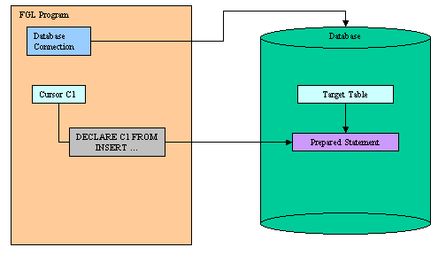
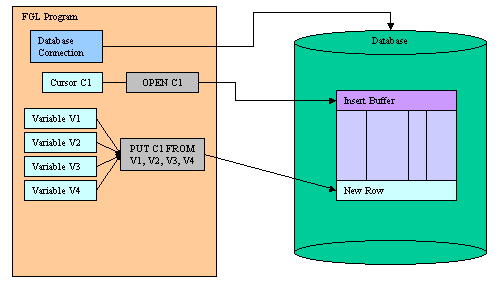
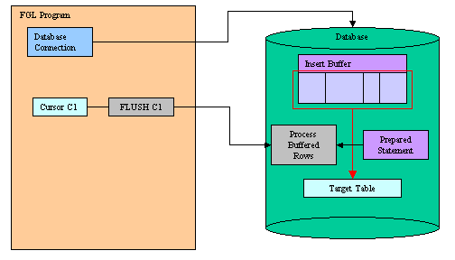
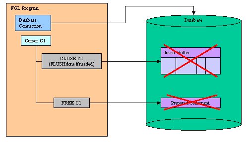

[Back to Contents](../index.html)

------------------------------------------------------------------------

# [SQL Insert Cursors]{#PAGE_HEADER}

Summary:

- [What is an Insert Cursor?](#WHAT_IS_INSCURS)
- [Declaring the Insert Cursor](#IC_DECLARE) (`DECLARE`)
- [Initializing the Insert Cursor](#IC_OPEN) (`OPEN`)
- [Adding Rows to the Buffer](#IC_PUT) (`PUT`)
- [Flushing the insert Buffer](#IC_FLUSH) (`FLUSH`)
- [Finalizing the Insert Cursor](#IC_CLOSE) (`CLOSE`)
- [Freeing Allocated Resources](#IC_FREE) (`FREE`)
- [Examples](#EXAMPLES)

*See also:* [Transactions](Transactions.html), [Static
SQL](StaticSql.html), [Dynamic SQL](DynamicSql.html), [Result
Sets](ResultSets.html), [SQL Errors](Exceptions.html#SQLERRORS).

------------------------------------------------------------------------

### [What is an Insert Cursor?]{#WHAT_IS_INSCURS}

An Insert Cursor is a database cursor declared with a restricted form of
the [INSERT](StaticSql.html#SS_INSERT) statement, designed to perform
buffered row insertion in database tables.

The insert cursor simply inserts rows of data; it cannot be used to
[fetch data](ResultSets.html). When an insert cursor is opened, a buffer
is created in memory to hold a block of rows. The buffer receives rows
of data as the program executes [PUT](#IC_PUT) statements. The rows are
written to disk only when the buffer is full. You can use the
[CLOSE](#IC_CLOSE), [FLUSH](#IC_FLUSH), or [COMMIT
WORK](Transactions.html#TI_COMMIT_WORK) statement to flush the buffer
when it is less than full. You must close an insert cursor to insert any
buffered rows into the database before the program ends. You can lose
data if you do not close the cursor properly.

When the database server supports buffered inserts, an insert cursor
increases processing efficiency (compared with embedding the `INSERT`
statement directly). This process reduces communication between the
program and the database server and also increases the speed of the
insertions.

Before using the insert cursor, you must declare it with the
[DECLARE](#IC_DECLARE) instruction using an `INSERT` statement:

{border="0" width="504" height="288"}

Once declared, you can open the insert cursor with the [OPEN](#IC_OPEN)
instruction. This instruction prepares the insert buffer. When the
insert cursor is opened, you can add rows to the insert buffer with the
[PUT](#IC_PUT) statement:

{border="0" width="504" height="288"}

Rows are automatically added to the database table when the insert
buffer is full. To force row insertion in the table, you can use the
[FLUSH](#IC_FLUSH) instruction:

{border="0" width="504" height="288"}

Finally, when all rows are added, you can [CLOSE](#IC_CLOSE) the cursor
and if you no longer need it, you can de-allocate resources with the
[FREE](#IC_FREE) instruction:

{border="0" width="504" height="288"}

By default, insert cursors must be opened inside a [transaction
block](Transactions.html), with `BEGIN WORK` and `COMMIT WORK`, and they
are automatically closed at the end of the transaction. If needed, you
can declare insert cursors with the `WITH HOLD` clause, to allow
uninterrupted row insertion across multiple transactions. See [example
3](#EXAMPLE_3) at the bottom of this page.

------------------------------------------------------------------------

### [DECLARE]{#IC_DECLARE}

#### Purpose:

Declares a new insert cursor in the [current database
session](Connections.html).

#### Syntax:

`DECLARE cid CURSOR `[`[`]{.underline}`WITH HOLD`[`]`]{.underline}` FOR `[`{`]{.underline}` `*`insert-statement `[`|`]{.underline}` sid`*` `[`}`]{.underline}

#### Notes:

1.  *cid* is the identifier of the insert cursor.
2.  *insert-statement* is an `INSERT` statement defined in [Static
    SQL](StaticSql.html).
3.  *sid* is the identifier of a [prepared](DynamicSql.html#DS_PREPARE)
    `INSERT` statement including (`?`) question mark placeholders in the
    `VALUES` clause.
4.  The `INSERT` statement is parsed, validated and the execution plan
    is created.
5.  `DECLARE` must precede any other statement that refers to the cursor
    during program execution.
6.  The scope of reference of the *cid* cursor identifier is local to
    the module where it is declared.
7.  When declaring a cursor with a static *insert-statement*, the
    statement can include a list of [variables](Variables.html) in the
    `VALUES` clause. These variables are automatically read by the
    [PUT](#IC_PUT) statement; you do not have to provide the list of
    variables in that statement. See [Example 1](#EXAMPLE_1) for more
    details.
8.  When declaring a cursor with a prepared *sid* statement, the
    statement can include (`?`) question mark placeholders for SQL
    parameters. In this case you must provide a list of
    [variables](Variables.html) in the `FROM` clause of the
    [PUT](#IC_PUT) statement. See [Example 2](#EXAMPLE_2) for more
    details.
9.  Use the `WITH HOLD` option to declare cursors that have
    uninterrupted inserts across multiple
    [transactions](Transactions.html).
10. Resources allocated by the `DECLARE` can be released later by the
    [FREE](ResultSets.html#RS_FREE) instruction.

#### Warnings:

1.  The number of declared cursors in a single program is limited by the
    database server and the available memory. Make sure that you
    [free](ResultSets.html#RS_FREE) the resources when you no longer
    need the declared insert cursor.
2.  The identifier of a cursor that was declared in one module cannot be
    referenced from another module.

------------------------------------------------------------------------

### [OPEN]{#IC_OPEN}

#### Purpose:

Opens an insert cursor in the [current database
session](Connections.html).

#### Syntax:

`OPEN `*`cid`*` `

1.  *cid* is the identifier of the insert cursor.
2.  A subsequent `OPEN` statement closes the cursor and then reopens it.
3.  With the [CLOSE](ResultSets.html#RS_CLOSE) instruction, you can
    release resources allocated for the [insert
    buffer](#WHAT_IS_INSCURS) on the database server.

#### Warnings:

1.  When used with an insert cursor, the `OPEN`  instruction cannot
    include a `USING` clause.
2.  If the insert cursor was not declared `WITH HOLD` option, the `OPEN`
    instruction generates an SQL error if there is no current
    [transaction](Transactions.html) started.
3.  If you release cursor resources with a
    [FREE](ResultSets.html#RS_FREE) instruction, you cannot use the
    cursor unless you [declare](ResultSets.html#RS_DECLARE) the cursor
    again.

------------------------------------------------------------------------

### [PUT]{#IC_PUT}

#### Purpose:

Adds a new row to the insert cursor buffer in the [current database
session](Connections.html).

#### Syntax:

`PUT `*`cid`*` FROM `*`paramvar`*` `[`[,...]`]{.underline}

#### Notes:

1.  *cid* is the identifier of the insert cursor.
2.  *paramvar* is a program [variable](Variables.html), a
    [record](Records.html) or an [array](Arrays.html) used as a
    parameter buffer to provide SQL parameter values.

#### Warnings:

1.  If the insert cursor was not declared `WITH HOLD` option, the `PUT`
    instruction generates an SQL error if there is no current
    [transaction](Transactions.html) started.
2.  If the insert buffer has no room for the new row when the statement
    executes, the buffered rows are written to the database in a block,
    and the buffer is emptied. As a result, some `PUT` statement
    executions cause rows to be written to the database, and some do
    not.

------------------------------------------------------------------------

### [FLUSH]{#IC_FLUSH}

#### Purpose:

Flushes the buffer of an insert cursor in the [current database
session](Connections.html).

#### Syntax:

`FLUSH `*`cid`*

#### Notes:

1.  *cid* is the identifier of the insert cursor.
2.  All buffered rows are inserted into the target table.
3.  The insert buffer is cleared.

#### Warnings:

1.  The insert buffer may be automatically flushed by the runtime system
    if there no room when a new row is added with the `PUT` instruction.

------------------------------------------------------------------------

### [CLOSE]{#IC_CLOSE}

#### Purpose:

Closes an insert cursor in the [current database
session](Connections.html).

#### Syntax:

`CLOSE `*`cid`*

#### Notes:

1.  *cid* is the identifier of the insert cursor.
2.  If rows are present in the insert buffer, they are inserted into the
    target table.
3.  The insert buffer is discarded.
4.  This instruction releases the resources allocated for the insert
    buffer on the database server.
5.  After using the `CLOSE` instruction, you must re-open the cursor
    with [OPEN](#IC_OPEN) before adding new rows with [PUT](#IC_PUT) /
    [FLUSH](#IC_FLUSH).

------------------------------------------------------------------------

### [FREE]{#IC_FREE}

#### Purpose:

Releases resources allocated for an insert cursor in the [current
database session](Connections.html).

#### Syntax:

`FREE `*`cid`*

#### Notes:

1.  *cid* is the identifier of the insert cursor.
2.  All resources allocated to the insert cursor are released.
3.  The cursor should be explicitly [closed](ResultSets.html#RS_CLOSE)
    before it is freed.

#### Warnings:

1.  If you release cursor resources with this instruction, you cannot
    use the cursor unless you [declare](#IC_DECLARE) the cursor again.

------------------------------------------------------------------------

### [Examples]{#EXAMPLES}

#### [Example 1]{#EXAMPLE_1}: Insert Cursor declared with a Static INSERT

``` linenumber
01 MAIN
02    DEFINE i INTEGER
03    DEFINE rec RECORD
04            key INTEGER,
05            name CHAR(30)
06          END RECORD
07    DATABASE stock
08    DECLARE ic CURSOR FOR
09      INSERT INTO item VALUES (rec.*)
10    BEGIN WORK
11      OPEN ic
12      FOR i=1 TO 100
13          LET rec.key = i
14          LET rec.name = "Item #" || i
15          PUT ic
16          IF i MOD 50 = 0 THEN
17              FLUSH ic
18          END IF
19      END FOR
20      CLOSE ic
21    COMMIT WORK
22    FREE ic
23 END MAIN
```

#### [Example 2]{#EXAMPLE_2}: Insert Cursor declared with a Prepared INSERT

``` linenumber
01 MAIN
02    DEFINE i INTEGER
03    DEFINE rec RECORD
04            key INTEGER,
05            name CHAR(30)
06          END RECORD
07    DATABASE stock
08    PREPARE is FROM "INSERT INTO item VALUES (?,?)"
09    DECLARE ic CURSOR FOR is
10    BEGIN WORK
11      OPEN ic
12      FOR i=1 TO 100
13          LET rec.key = i
14          LET rec.name = "Item #" || i
15          PUT ic FROM rec.*
16          IF i MOD 50 = 0 THEN
17              FLUSH ic
18          END IF
19      END FOR
20      CLOSE ic
21    COMMIT WORK
22    FREE ic
23    FREE is
24 END MAIN
```

#### [Example 3]{#EXAMPLE_3}: Insert Cursor declared with \'hold\' option

``` linenumber
01 MAIN
02    DEFINE name CHAR(30)
03    DATABASE stock
04    DECLARE ic CURSOR WITH HOLD FOR
05      INSERT INTO item VALUES (1,name)
06    OPEN ic
07    LET name = "Item 1"
08    PUT ic
09    BEGIN WORK
10      UPDATE refs SET name="xyz" WHERE key=123
11    COMMIT WORK
12    PUT ic
13    PUT ic
14    FLUSH ic
15    CLOSE ic
16    FREE ic
17 END MAIN
```
