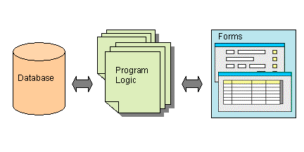
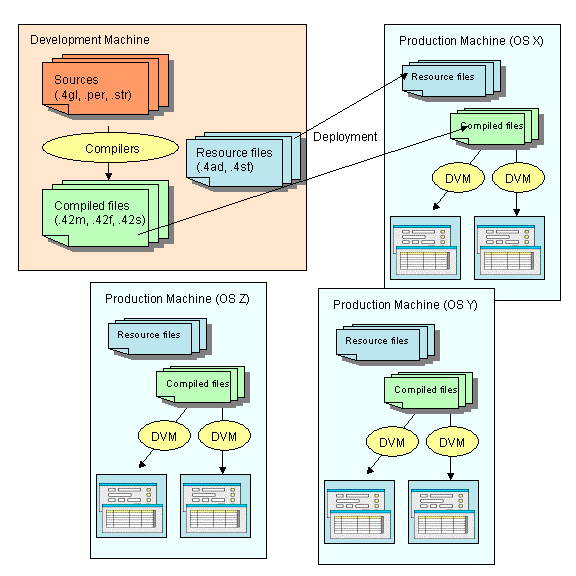
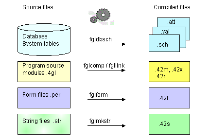
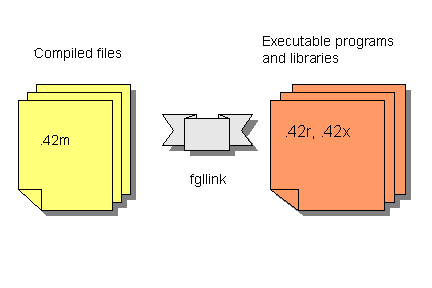
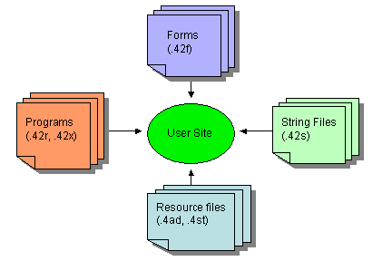

[Back to Contents](../index.html)

------------------------------------------------------------------------

# Introduction: Genero BDL Concepts

Summary:

- [Overview](#Overview)
  - [Separating Business Logic and User Interface](#SepBLandUI)
  - [Portability: Write once, deploy anywhere](#Portability)
  - [Advanced programming tools](#ProgTools)
  - [Reports](#Reports)
  - [Internationalization](#Internationalization)
  - [User Extensions](#UserExt)
- [The Language](#Language)
  - [Database access](#DatabaseAccess)
  - [Interactive statements](#InteractiveStatements)
  - [Language library](#LanguageLibrary)
- [Forms](#Forms)
- [The User Interface](#UserInterface)
- [Compiling a BDL Application](#Compiling)
- [Deploying a BDL Application](#Deploying)
- [Resources for Programmers](#ResourcesforProgrammers)

------------------------------------------------------------------------

## [Overview]{#Overview} 

You typically use Genero to build an *interactive database application*,
a program that handles the interaction between a user and a database.
The database schema that organizes data into relational tables gives
shape to one side of the program. The needs of your user shape the other
side. You write the program logic that bridges the gap between them.

{border="0" width="432" height="216"}

An  important feature of Genero BDL is the ease with which you can
design applications that allow the user to access and modify data in a
database. The Genero BDL language contains a set of SQL statements to
[manipulate the database](#DatabaseAccess), and [interactive
instructions](#InteractiveStatements) that provide simple record input,
read-only list handling, updateable list handling, and query by example
(to search the database) using [forms](#Forms) to facilitate
interaction.

Genero BDL is compiled to *p-code*, which can be interpreted on
different platforms by the *Dynamic Virtual Machine* (the Runtime
system).

### **[Separation of Business Logic and User Interface]{#SepBLandUI}**

Genero separates business logic and the user interface to provide
maximum flexibility:

- The *business logic* is written in text files (.4gl source code
  modules). High-level interactive instructions let you write a form
  controller in a few lines of code.
- *Forms* for the user interface are designed in a simple-to-understand
  and simple-to-read [form definition](FormSpecFiles.html) syntax..
- *Action views* (buttons, menu items, toolbar icons) in the form
  definition can trigger *actions* defined in the business logic.
- Compiling a form definition file translates it into XML. The
  *XML-based presentation layer* ensures that user interface development
  is completely separated from deployment.
- The user interface can be manipulated at runtime, as a tree of objects
  called the *[Abstract User Interface](DynamicUI.html#ABSTRACTUI)*
  (*AUI*).

### [Portability - write once, deploy anywhere]{#Portability}

Genero provides the ability to support different kinds of display
devices using the same source code. One production release supports all
major versions of Unix, Linux, Windows NT/2000/XP and Mac OS X. The same
application can be displayed with a graphical device
([GUI](FglTerms.html#GRAPHICAL_USER_INTERFACE) mode) as well as on a
simple dumb terminal ([TUI](FglTerms.html#TEXT_USER_INTERFACE) mode).

A single code stream can be written to support HTML, Java, Windows,
X.11, WML, MacIntosh OS X and ASCII interfaces simultaneously. 

{border="0" width="576" height="576"}

### [Advanced programming tools]{#ProgTools}

Genero BDL comes with a set of useful programming tools, to help you in
the application development process:

- [Program debugger](Debugger.html)
- [Performance profiler](Profiler.html)
- [Source documentation generator](AutoDoc.html)

### [Reports]{#Reports}

You can easily design and generate [Reports](Reports.html). The output
from a report can be formatted so that the eye of the reader can easily
pick out the important facts. Page headers and footers, with page
numbers, can be defined. Data can be grouped together, with  group
totals and subtotals shown. The output from a report can be sent to the
screen, to a printer, to a file, or (through a pipe) to another program,
and report output can even be redirected to an SAX filter in order to
write XML.

### [Internationalization]{#Internationalization}

Genero BDL supports multi-byte character sets by using the POSIX
standard functions of the C library. Genero BDL uses
byte-length-semantics to specify the length of a character string (i.e.
CHAR(10) means 10 bytes). You must make sure that the database client
locale matches the runtime system locale. For more details about
internationalization support, see [Localization](Localization.html).

The *[Localized Strings](LocalizedStrings.html)* feature allows you to
customize your application for specific subsets of your user population,
whether it is for a particular language or a particular business
segment.

### [User Extensions]{#UserExt}

When the standard Genero built-in functions and classes are not
sufficient, you can write your own plug-ins by using the [Dynamic C
Extensions](CExtensions.html). This allows you to implement specific
function libraries in C, which can be called from the BDL modules.
Typical User Extensions interface with C libraries to drive specific
devices, such as barcode scanners or biometric identification devices.

You can instantiate Java objects from Genero by using the [Java
Interface](JavaBridge.html). This allows you to take benefit of the huge
class library of Java.

------------------------------------------------------------------------

## [The Language]{#Language}

Genero BDL is a high-level, fourth generation language with an open,
readable syntax that encourages good individual or group programming
style. You write your program logic in text files, or *program source
modules*, which are compiled and linked into programs that can be
executed by the Runtime system. Programs are easily enhanced and
extended. This makes it easy for programmers to become productive
quickly, no matter what programming languages they know. See
[Programs](Programs.html), [Flow Control](FlowControl.html),
[Functions](Functions.html) for additional information.

### [Database access]{#DatabaseAccess}

- A set of SQL statements are included as part of the language syntax
  and can be used directly in the source code, as a normal procedural
  instruction. The [Static SQL Statements](StaticSql.html) are parsed
  and validated at compile time. At runtime, these SQL statements are
  automatically prepared and executed by the runtime system. Program
  variables are detected by the compiler and handled as SQL parameters.
- [Dynamic SQL](DynamicSql.html) management allows you to execute any
  SQL statement that is valid for your database version, in addition to
  those that are included as part of the language. The statement can be
  hard-coded or created at runtime, with or without SQL parameters,
  returning or not returning a result set.
- Through the native drivers of the Open Database Interface, the same
  Genero program can open [database connections](Connections.html) to
  any of the supported databases.

For additional information, see [SQL Programming](SqlProgramming.html).

### [Interactive Statements]{#InteractiveStatements}

Writing the code for interactive database applications has been
simplified for you in Genero BDL; single statements automatically
compile into the lines of program code required for the common tasks
associated with such applications. These interactive statements allow
the program to respond to user input. Genero BDL introduces a major
improvement with the [DIALOG](IntroBDL.html) instruction, allowing parts
of a form that have different functionality to be handled
simultaneously. 

#### Using Windows and Forms

In Genero, programs manipulate [Window and
Form](WindowsAndForms.html#WHAT_IS) objects to define display areas for
interactive statements within your program. The Abstract User Interface
(AUI) tree contains a definition of these objects. You can open as many
windows and forms as needed, subject only to the limits of memory and
the maximum number of open files on the platform you are using.

The [OPEN WINDOW](WindowsAndForms.html#OPEN_WINDOW) statement creates
and opens a new window on the user\'s screen. The runtime system
maintains a stack of all open windows. When you execute this statement
to open a new window, it is added to the window stack and becomes the
current window. You can modify the window stack with the [CURRENT
WINDOW](WindowsAndForms.html#CURRENT_WINDOW) and [CLOSE
WINDOW](WindowsAndForms.html#CLOSE_WINDOW) statements. With the [OPEN
WINDOW \... WITH FORM](WindowsAndForms.html#OPEN_WINDOW) statement you
open a window on the screen, load a compiled form from disk into memory,
and make it ready for use.

#### Displaying data and managing data input and query

The [DISPLAY](MessageDisplay.html#DISPLAY) instruction allows you to
display program variable data in the fields of a form and continue the
program flow without giving control to the end user.

The [MENU](Menus.html) instruction is typically used in *Text User
Interface* applications to handle user choices and activate a specific
function of the application.

The [DISPLAY ARRAY](DisplayArray.html) instruction can be used to show a
list of records. It allows the user to view the contents of a program
array of records, scrolling the record list on the screen and choosing a
specific record.

The [INPUT](RecordInput.html) instruction is designed for simple record
input. It enables the fields in a form for input, waits while the user
types data into the fields, and proceeds after the user accepts or
cancels the dialog.

The [INPUT ARRAY](InputArray.html) instruction supports record list
input. It allows the user to alter the contents of records of a program
array, and to insert and delete records.

The [CONSTRUCT](Construct.html) instruction is designed to let the user
enter search criteria for a database query. The user can enter a value
or a range of values for one or several form fields, and your program
looks up the database rows that satisfy the requirements.

The [DIALOG](MultipleDialogs.html) statement allows you to combine
INPUT, DISPLAY ARRAY, INPUT ARRAY and CONSTRUCT functionality within the
same window/form.

#### Responding to actions by the user

User [actions](InteractionModel.html) can fire the execution of program
of code called *action handlers*. The actions can be displayed to the
user as [*action views*](InteractionModel.html#CTRLGACTIONS) - buttons,
toolbars, or pull-down menus in the application window. When the user
makes a selection, the corresponding action is executed. 

The interactive [MENU](Menus.html) statement can be used to define the
list of action handlers that can be triggered. Or, the ON ACTION clause
of interactive instructions, such as [INPUT](RecordInput.html), [INPUT
ARRAY](InputArray.html), [DISPLAY ARRAY](DisplayArray.html),
[CONSTRUCT](Construct.html), and [DIALOG](MultipleDialogs.html), can be
used to implement the code to be executed for a given action.

Common actions, such as **accept** (dialog validation) and **cancel**
(dialog cancellation), are already
[pre-defined](InteractionModel.html#PREDEFACTIONS) for you in accordance
with the interactive instruction.

[*Action Defaults*](ActionDefaults.html) allow you to define default
decoration attributes (text, image) and functional attributes
(accelerator keys) for the graphical objects associated with actions.

### [Language library]{#LanguageLibrary}

The BDL language provides [built-in functions](BuiltInFunctions.html) to
perform many basic tasks, as well as [built-in
classes](BuiltInClasses.html) that can be used to manipulate the user
interface. Dynamic C Extension libraries are part of the standard
package; see [File Manipulation functions](Ext_os_Path.html) and
[Mathematical functions](Ext_util_Math.html).

------------------------------------------------------------------------

## [Forms]{#Forms}

The end-user of a program does not know about the database schema or
your carefully designed program logic. As the user sees it, the
application screens, and the menus that invoke them, are the
application. The arrangement of fields, labels, and other form objects,
and the behavior of the form as the user presses different keys or
buttons and selects different menu options, create the personality of
the program.

You can define the application screens, or forms, in text-based *[Form
Specification Files](FormSpecFiles.html)* (.per) These form files are
translated by the [Form Compiler](Tools.html#TL_FGLFORM) to produce the
*Runtime Form Files* (.42f) that are deployed in production
environments. Since form files are separate from the other parts of your
program, the *[Runtime Form Files](Tools.html#TL_FGLFORM)* can be used
with different programs.

Unlike compiled program files, the translated *Runtime Form Files* are
XML documents that describe the form elements, enabling portability
across display devices. The XML file can also be written directly, or it
can be generated or modified from your program code using the methods
provided with Genero [Built-in Classes](BuiltInClasses.html).

You can design your form to group objects in [horizontal and vertical
boxes](FormSpecFiles.html#FF_CONTAINER_HBOX), display it as a
[folder](FormSpecFiles.html#FF_CONTAINER_FOLDER) of pages, and use
[menus](FormSpecFiles.html#SECTION_TOPMENU),
[toolbars](FormSpecFiles.html#SECTION_TOOLBAR), or
[buttons](FormSpecFiles.html#FF_ITEMTYPE_BUTTON) to trigger
[actions](InteractionModel.html).  You can associate an
[array](Arrays.html) of data in the program with an array of fields on
the form ([screen-array](FormSpecFiles.html#SECTION_INSTRUCTIONS)), so
the user can see multiple rows of data on the screen. In addition to the
form fields and screen records, your form can contain objects such as
[progressbars](FormSpecFiles.html#FF_ITEMTYPE_PROGRESSBAR),
[checkboxes](FormSpecFiles.html#FF_ITEMTYPE_CHECKBOX),
[radiogroups](FormSpecFiles.html#FF_ITEMTYPE_RADIOGROUP),
[comboboxes](FormSpecFiles.html#FF_ITEMTYPE_COMBOBOX), and
[images](FormSpecFiles.html#FF_ITEMTYPE_IMAGE). See [Form Specification
Files](FormSpecFiles.html) for additional information.

The appearance of form objects can be standardized using [Presentation
Styles](PresentationStyles.html) and [Action
Defaults](ActionDefaults.html).

Different parts of the form can be handled simultaneously using the BDL
instruction [DIALOG](MultipleDialogs.html). 

------------------------------------------------------------------------

## [The User Interface]{#UserInterface}

What happens when a user executes a Genero BDL application? The Genero
Runtime System creates the [Abstract User
Interface](DynamicUI.html#ABSTRACTUI) tree, and the Genero Front End
makes this abstract tree visible on the Front End Client, such as the
Genero Desktop Client, Genero Web Client, and Genero Java Client. When a
[user interaction statement](#InteractiveStatements) takes control of
the application, the copy of the tree on the Front End is automatically
synchronized with the Runtime system tree by the *Front End Protocol*,
an internal protocol used by the Runtime System.

{border="0" width="504" height="288"}\
\
The Genero BDL language provides [Built-in Classes](BuiltInClasses.html)
that implement methods to manage the objects on the user\'s screen.
Methods can be invoked by passing parameters and/or returning values,
allowing the User Interface to be modified completely at runtime.

Default XML files describe the appearance (decoration) of some of the
graphic objects on the user\'s screen. These files may be customized, or
replaced with your own versions.

- **default.4ad** - default decoration and accelerators for [action
  views](InteractionModel.html)
- **default.4st** - default definition of [presentation
  style](PresentationStyles.html) attributes 

A special [StartMenu](StartMenus.html), used to start different programs
on the application server where the runtime system executes, can be
defined in an XML file with the extension **.4sm**.

A set of [XML Utilities](XmlUtils.html) are provided to allow you to
create and modify XML documents.

------------------------------------------------------------------------

## [Compiling a Genero BDL Application]{#Compiling}

A Genero BDL program can consist of a single source code module, but
generally it will be organized in multiple modules as well as form
specification files and perhaps localized string files.  Database schema
files are also required, if you have defined program data types and
variables in the terms of an existing database column or table by using
the [DEFINE \... LIKE](Variables.html#DATABASE_TYPES) statement.

The [tools](Tools.html) that Genero provides to compile the various
files that will make up your application, and the file extensions of the
source code and  corresponding compiled files, are listed below, and an
explanation follows:

      {border="0" width="432" height="288"}

The compiled source code modules can be linked into a .42r program that
can be executed by the Runtime System. Compiled modules can also be
grouped together into a .42x library that can then be used to build .42r
programs:

            {border="0" width="432"
height="288"}

It is also possible to declare what modules are needed by the current
module, in order to define the dependency between 4gl modules. When
using this language feature, it is no longer required to link modules
together to build a program. For more details, see the [IMPORT FGL
instruction](Programs.html#IMPORT).

### [Database Schema Files]{#SchemaFiles} - tool fgldbsch

Database Schema Files are used during program compilation to define data
types, default values, display attributes and validation rules for form
fields and program variables. You must generate database schema files
each time the database structure changes, before compiling any other
parts of your application.

The [SCHEMA](Programs.html#DB_SCHEMA) statement in program source files
and form files identifies the database schema file to be used. The
[FGLDBPATH](EnvironmentVariables.html#EV_FGLDBPATH) environment variable
can be used to define a list of directories where the compiler can find
database schema files.

The [Schema Extractor](Tools.html#TL_FGLDBSCH)
[(fgldbsch)](Tools.html#TL_FGLDBSCH) is the tool provided to generate
the database schema files from a real database. Database schema files
are generated from the system tables.

**Example:**

> fgldbsch -db <database_name>

It is important that the schema file of the development database
corresponds to the production database; otherwise, the elements defined
in the compiled version of your modules and forms will not match the
table structures of the production database.

The primary file produced by the utility is:

***     \<database\>.*sch** - the file containing the data type
definition of all columns selected during schema extraction.

### [Program Source Modules]{#ProgramSourceModules} - tools fglcomp, fgllink

Genero BDL provides a source code *compiler* named fglcomp, which
generates hardware-independent pseudo-machine code (P-code). This code
is not directly executable by the operating system: it is interpreted by
the Genero BDL *runtime system* (a program named **fglrun**, and called
\"runner\").

The compiled P-code modules are binary. The files are not printable or
editable as text.

- [Tool fglcomp](Tools.html#TL_FGLCOMP) - Module compiler

> This tool compiles a program source module into a p-code version. The
> compiled module has an extension of **.42m**.
>
> If a compilation error occurs, the text file \<***filenam*e\>.err**
> flagging the errors is created. You can display directly the
> compilation errors by using the -M option.
>
> Example:
>
>     fglcomp <modulename>.4gl
>
> Running the program:
>
>     fglrun <modulename>.42m
>
> If your program consists of more than one module, the modules must be
> linked together prior to execution, by the **fgllink** tool.

- [Tool fgllink](Tools.html#TL_FGLLINK)** **- Module linker

  This tool assembles multiple p-code modules compiled with fglcomp into
  a single **.42r** program or a **.42x** library.

  Example to create a program:

      fgllink -o <programname>.42r <module1name>.42m <module2name>.42m  ...

  Running the program:

      fglrun <programname>.42r

  Example to create a library that can be linked into other programs:

      fgllink -o <libraryname>.42x <module1name>.42m <module2name>.42m  ...

### [Form Specification Files]{#FormSpecificationFiles} - tool fglform** **

Form specification files are used by the [Form Compiler
(fglform)](Tools.html#TL_FGLFORM) to produce the *[Runtime Form
Files](Tools.html#TL_FGLFORM)* that are deployed in production
environments. The form files have an extension of **.per** . Unlike
compiled program files, the generated Runtime Form File is an XML
document that describes the form elements. The Runtime Form Files have
an extension of **.42f**.

If a compilation error occurs, the text file \<***filenam*e\>.err**
flagging the errors is created. You can directly display the compilation
error by using the -M option.

Example:

    fglform <formname>.per

### [C-like Source Preprocessor]{#Preprocessor}

The fgl preprocessor can be used with the 4gl compiler and the form
compiler to transform your sources before compilation, based on
preprocessor directives. It allows you to include other files, to define
macros that will be expanded when used in the source, and to compile
conditionally.

See [The Genero BDL Preprocessor](Preprocessor.html) for details.

### [Localized String Files]{#LocalizedStringFiles} - tool fglmkstr

*[Source String Files](LocalizedStrings.html#SOURCES)*
(*\<filename\>*.str ) containing the text of the [Localized
Strings](LocalizedStrings.html) that are used in your application must
be compiled to binary files in order to be used at runtime. By default
the runtime system expects that the Source String file will have the
same filename as your program. The compiled file has an extension of* *
**.42s**.

Example:

    fglmkstr <filename>.str

As an assistance in creating the *[Source String
Files](LocalizedStrings.html#SOURCES)*, the **-m** option of the
[fglcomp](Tools.html#TL_FGLCOMP) and [fglform](Tools.html#TL_FGLFORM)
tools can be used to extract all the localized strings that are used in
your source code modules and forms.

Example:

    fglcomp -m <modulename>.4gl

The output file will be **\<***modulename*\>.str . This extracted file
can be edited to assign text to the localized strings, and combined with
other extracted files into a single \<*programname*\>.str file.

**Note**: Windows or Unix-based *makefiles* may be used to automate the
process of compiling and linking programs.

------------------------------------------------------------------------

## [Deploying a Genero BDL Application]{#Deploying}

    {border="0" width="432" height="288"}

The following program files must be deployed at the user site:

- **.42r**, **.42x, .42m ** - Executable programs and libraries,
  compiled modules
- **.42f** - Runtime Form Files
- **.42s** - compiled Localized String Files, if used in your
  applications
- **.4sm** - your custom Start Menu XML file, if created 
- **.4ad**, **.4st** - these default XML files, provided with Genero,
  must be distributed with the runtime system files; if you have
  customized these files, or created your own versions, your versions
  must be deployed instead.

[Front-end clients](#UserInterface), such as Genero Desktop Client and
Genero Web Client, make the application available to the user.

The [FGLPROFILE](FglProfile.html) configuration file can be used to
change the behavior of programs, and [environment
variables](EnvironmentVariables.html) can be set for Genero BDL.

------------------------------------------------------------------------

## [Resources for Programmers]{#ResourcesforProgrammers}

### Documentation

This [Business Development Language Manual (User Guide)](../index.html)
is a complete guide to Genero BDL language features, with explanations
and sample code:

- **Genero BDL Concepts**  - the following pages may be especially
  helpful in understanding the concepts underlying Genero BDL:
  - [Dynamic User Interface](DynamicUI.html)
  - [Windows and Forms](WindowsAndForms.html)
  - [Programs](Programs.html)
  - [Connections](Connections.html)
  - [Transactions](Transactions.html)
  - [SQL Programming](SqlProgramming.html)
  - [Compiling Programs](CompilingPrograms.html)
  - [Built-In Classes](BuiltInClasses.html)
  - [Presentation Styles](PresentationStyles.html)
- **The Business Development Language Tutorial** - contains examples of
  basic BDL program development, with sample code; see
  [Summary](TutIndex.html)
- **Migrating to Genero BDL** -  the following pages may be especially
  helpful if you are migrating an application from an earlier product:
  - [New Features](NewFeatures.html)
  - [Frequently Asked Questions](FAQList.html)
  - [Tools and Components](Tools.html)
  - [Layout - Form Rendering](Layout.html)
  - [I4GL/BDS Migration Issues](Mig0000.html)
- **Open Database Interface Adaptation guides** - these pages are
  provided for each relational database that Genero supports.

### Code examples

- Short example programs in the **demo** subdirectory of the BDL
  software installation directory illustrate the use of Genero BDL
  features. These programs may be compiled and executed.
- The [User Guide](../index.html) has extensive code samples.
- The [Tutorial](TutIndex.html) has code samples for each chapter with
  embedded comments. 

### Training

On-line and self-paced Genero BDL training classes are offered. 
Instructor-led classes are also available; please call your regional
sales office for information.
