[Back to Contents](../index.html)

------------------------------------------------------------------------

# [Form Rendering]{#PAGE_HEADER}

Summary:

- [Introduction](#INTRO)
- [A character-based grid](#CHAR_BASED_GRID)
  - [Character set usage](#CBG_CHARSET_USAGE)
  - [Grid layout rules](#CBG_GRID_RULES)
  - [Size computing](#CBG_SIZE_COMPUTING)
  - [Complex example](#CBG_COMPLEX_EXAMPLE)
- [Grid dependencies](#GRID_DEPENDENCIES)
  - [A large number of cells for large widgets](#GD_LARGE_WIDGETS)
  - [HBox Tags](#HBOX_TAGS)
    - [Mechanism](#HT_MECH)
    - [SpacerItems](#HT_SPACERS)
- [Packed Grid](#PACKED_GRID)
  - [General rule](#PG_RULE)
  - [Group exception](#PG_GROUPS)
- [Automatic Horizontal and Vertical Boxes](#AUTO_HVBOX)

------------------------------------------------------------------------

## [Introduction]{#INTRO}

Genero has introduced a form rendering system. Forms are not based on
fixed text-mode screen, but can display complex layouts. In order to
support .per files, the rendering system has to manage a character-based
definition, which implies very specific graphical rules. This document
explains the graphical rendering of a .per form.

------------------------------------------------------------------------

## [A character-based grid]{#CHAR_BASED_GRID}

**Warning: Scrollgrid and Groups (without ` gridchildreninparent`
attribute) behave the same way as Grids.**

The grid container is the most important container - it contains all
'final' widgets (fields, buttons...). The .per file defines a form which
is character based; each character defines a cell of the grid:

    GRID
    {
    First Name [fname  ]
    Last Name  [lname  ]
    }
    END 

Above .per file layout specification can be show in a character grid as
follows:

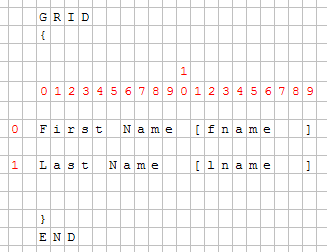{border="0" width="327" height="252"}

With a fixed-font based front end, there is no problem, but Genero
introduced Windows look and feel and proportional fonts. Objects are
then created and added to the grid; each object has a starting position
(defined by `posX` and `posY` attributes) and the number of cells taken
(`gridwidth`, `gridheight` attributes).

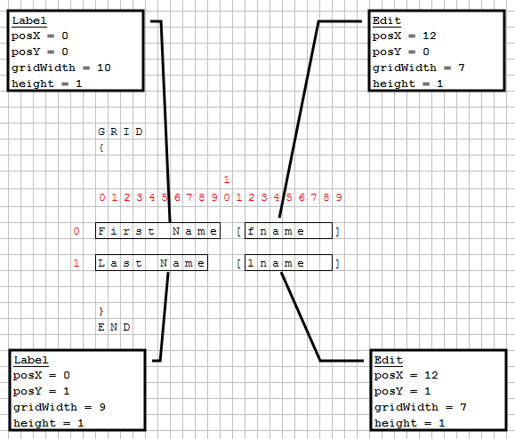{border="0" width="579" height="494"}

------------------------------------------------------------------------

### [Grid layout rules]{#CBG_GRID_RULES}

Front-ends grid layout follows these important rules:

1.  Empty lines and empty columns take 0 pixels.
2.  The size of a cell depends on the size of the widgets inside the
    grid.
3.  Widget\'s minimum size is computed via its size attribute.
4.  Widget\'s real size is computed to completely fill the cells in the
    GRID (this depends on the `sizepolicy` attribute).
5.  A small spacing is applied in non-empty cells.
6.  Element position and sizes are computed from the character\'s width.

------------------------------------------------------------------------

### [Character set usage]{#CBG_CHARSET_USAGE}

The character set used to edit and compile .per form files is defined by
the [current locale](Localization.html). Form elements (typically,
labels) can be written with non-ASCII characters of the current codeset.
The next example shows a little .per file using labels in the French
language:

    GRID
    {
    Numéro de compte: [f001                    ]
    Intérêts:         [f002  ]
    }
    END

The form element positions and sizes are determined by counting the
width of characters, rather than the number of bytes identifying the
characters in the current codeset. This rule can be ignored when using a
single-byte character set such as ISO-8859-1 or CP-1252, where each
character has width of 1 and codepoint of 1 byte. But this is important
when using a multi-byte character set like BIG5 or UTF-8.

For example, in the UTF-8 multi-byte codeset, a Chinese ideogram is
encoded with three bytes, while the visual width of the character is
twice the size of a latin character. In the next example, the labels
with three Chinese characters have the same width as the labels using
six latin characters. As a result, the labels will get the same size (6
cells), and all fields will be aligned properly in the GUI form:

    GRID
    {
    叽哱唶 [f001  ]   abcdef [f002  ]
    abcdef [f003  ] 叽哱唶 [f004  ]   
    }
    END

Note however that it is recommended to write all .per files in ASCII
codeset, and use [Localized Strings](LocalizedStrings.html) to
internationalize your forms.

------------------------------------------------------------------------

### [Size computing]{#CBG_SIZE_COMPUTING}

Each widget\'s minimum size is computed according to its `size` and
`sizepolicy` (rule #3); the size of cells of the grid is then computed
(rule #1 and #2), and the widget\'s size can change to fill the cells
(rule #4).

  ------------------------------------------------------------------ ------------------------------------------------------------------
  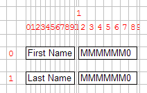{border="0" width="212" height="134"}   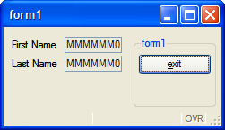{border="0" width="251" height="145"}
  ------------------------------------------------------------------ ------------------------------------------------------------------

------------------------------------------------------------------------

### [Complex example]{#CBG_COMPLEX_EXAMPLE}

This Grid contains several fields.

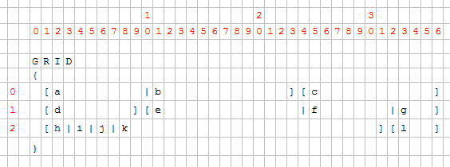{border="0" width="564" height="210"}

For each field, the position and the number of cells is computed by the
form compiler. Then the front-end creates the widgets and sets them on
the grid.

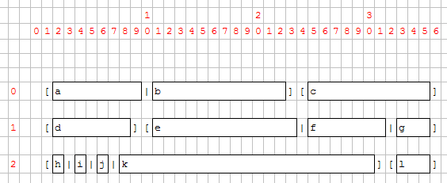{border="0" width="564" height="231"}

Once widgets are on the grid, their minimum size is computed according
to their `size` and `sizepolicy` attributes. Then the grid cells are
computed.

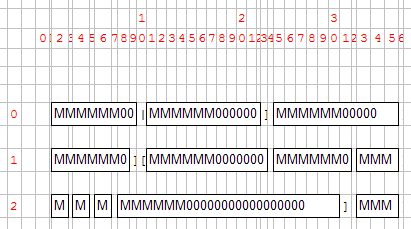{border="0" width="411" height="229"}

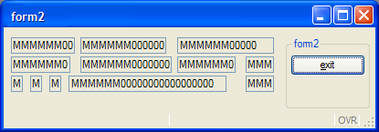{border="0" width="415" height="145"}

You can see that fields k and c are much bigger than expected:

- Field g and l make columns 33, 34 and 35 bigger than the other,
- Field f extends columns 25 to 31.
- As field c has to fill columns 25 to 35, its size grows; the same for
  field k.

Some fields are proportionally bigger than others because some
parameters are variable, others fixed. Field width is computed as
follows:

::: {align="center"}
+:---------------------------------------------------------------------:+
| \                                                                     |
| The width of the content (depending on `sizepolicy` and `sample`, but |
| by default a combination of \'M\' and \'0\'), plus the border.\       |
+-----------------------------------------------------------------------+
:::

For example, a field of 1 will be as wide as 2 borders + 1 \'M\'. A
field of 10 will be as wide as 2 borders + 6 \'M\' + 4 \'0\'. This means
that a field of 1 is far from being 10 times smaller than a field of 10.

------------------------------------------------------------------------

## [Grid dependencies]{#GRID_DEPENDENCIES}

[Rule 2](#CBG_GRID_RULES) (the size of a cell depends on the size of the
widgets inside the grid) is useful to keep text-mode alignment:

    GRID
    {
      [a      ]
      [b      ]
    }
    END

This .per implies that a and b start at the same position and have the
same size, whatever a and b are.

------------------------------------------------------------------------

### [A large number of cells for large widgets]{#GD_LARGE_WIDGETS}

This rule could lead to very different results, especially when a large
widget is assigned into a small number of cells.

Example:

    LAYOUT
    GRID
    {
    [a|b   ][f     ]
    [c|d]   [e     ]
    }
    END
    END

    ATTRIBUTES
    CHECKBOX a = formonly.a, TEXT="A Checkbox";
    EDIT b = formonly.b;
    EDIT c = formonly.c;
    CHECKBOX d = formonly.d, TEXT="Another Checkbox";
    EDIT e = formonly.e;
    EDIT f = formonly.f;
    END

As seen previously, the grid will be computed regarding characters:

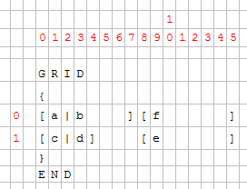{border="0" width="272" height="208"}

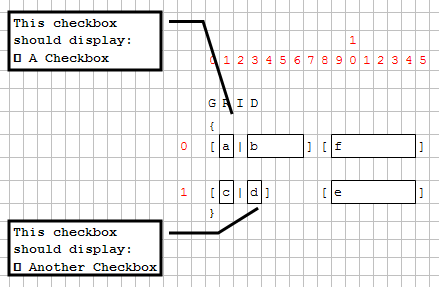{border="0" width="439" height="287"}

Then the minimum size of each widget and the layout is computed. Cells
(0,1) and (1,3) contain a checkbox; these checkboxes will enlarge
columns 1 and 3.

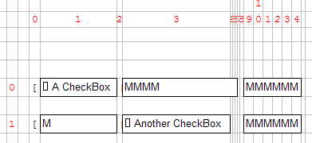{border="0" width="391" height="180"}

 As Edit \"c\" is defined to have the same width as checkbox \"a\", it
will be much larger as expected: 

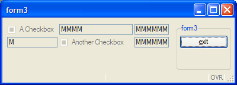{border="0" width="400" height="145"}

To avoid this "strange" result, the form designer should assign a
realistic number of cells for each object:

`GRID`\
`{`\
`[a        |b   ][f     ]`\
`[c|d           ][e     ]`\
`} `

Even if the LAYOUT section is wider, the result will be smaller:

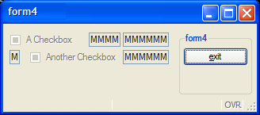{border="0" width="328" height="145"}

------------------------------------------------------------------------

### [HBox Tags]{#HBOX_TAGS}

------------------------------------------------------------------------

#### [Mechanism]{#HT_MECH}

To get rid of the "character-based" grid, HBox Tags have been
introduced. This mechanism defines a "widget container" that will gather
the widget horizontally, like the HBOX layout container. All widgets
inside this container are no longer dependent on the parent grid:

    GRID
    {
    [a:b:c   ]
    [d|e|f   ]
    }
    END

The notation ":" defines the HBox Tag. A container is created and will
contain widgets a, b and c. These widgets won't be aligned in the Grid:

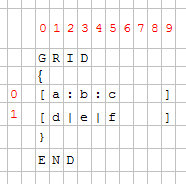{border="0" width="186" height="184"}

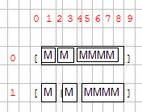{border="0" width="176" height="139"}

This mechanism is useful when you have large widgets in a small number
of cells in one row and don't want to have dependencies:

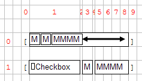{border="0" width="237" height="135"}

If we take the "form3" example again, and modify it with HBox Tags:

    GRID
    {
    [a:b   ][f     ]
    [c:d   ][e     ]
    }
    END

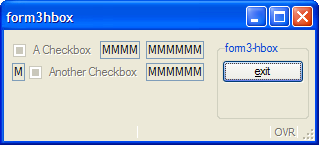{border="0" width="319" height="145"}

------------------------------------------------------------------------

#### [Spacer Items in HBox tags]{#HT_SPACERS}

HBox tags also introduces the SpacerItems concept: when a grid HBox is
created, the content may be smaller than the container:

{border="0" width="237" height="135"}

Because of the checkbox, the cell 1 is very large, and then the HBox is
larger than the three fields. A SpacerItem object is automatically
created by the form compiler; the role of the SpacerItem is to take all
the free space in the container. Then all the widgets are packed at the
left.

By default, a SpacerItem is created at the right of the container, but
the spacer can also be defined in another place:

    GRID
    {
    [a       :b       :c       ] <- default: spacer on the right
    [ :d     :e       :f       ] <- spacer on the left
    [g       :      :h         ] <- spacer between g and h
    [i: :j: :k      : :l       ] <- multiple spacers (between i and j, j and k, k and l
    }
    END

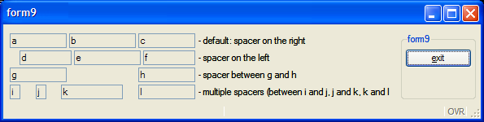{border="0" width="595" height="150"}

------------------------------------------------------------------------

## [Packed Grid]{#PACKED_GRID}

------------------------------------------------------------------------

### **[General rule]{#PG_RULE}**

When you resize a window, the content will either grow with the window
or be packed in the top left position. The rule followed by the
front-end is that the grid is packed (horizontally / vertically / both)
if nothing can grow in that direction.

The following widgets can grow horizontally:

- Tables
- Images (`stretch`=both or `stretch`=`x`)
- TextEdits (`stretch`=both or `stretch`=`x`)

The following widgets can grow vertically:

- Tables (without `wantfixedpagesize`)
- Images (`stretch`=both or `stretch`=`y`)
- TextEdits (`stretch`=both or `stretch`=`y`)

------------------------------------------------------------------------

### **[Group exception]{#PG_GROUPS}**

In general, a `GRID` can grow if any object inside the `GRID` can grow.

The exception to this rule: If there is only one `GROUP` (defined
without the
[`GRIDCHILDRENINPARENT`](FSFAttributes.html#FA_GRIDCHILDRENINPARENT)
attribute) inside a `GRID` and nothing else, the grid can grow.

This exception allows better rendering of a grouped grid:

- A packed grid:

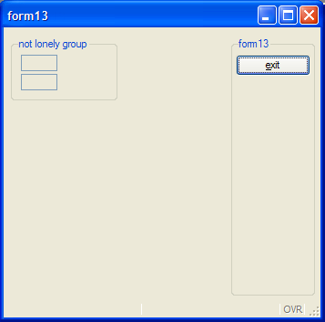{border="0" width="357" height="353"}

- An unpacked grid:

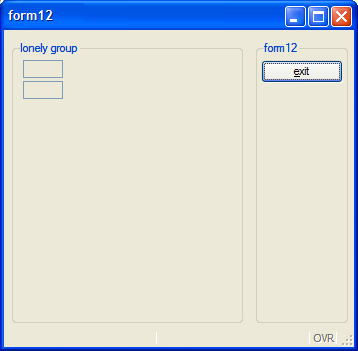{border="0" width="358" height="351"}

------------------------------------------------------------------------

## [Automatic Horizontal and Vertical Boxes]{#AUTO_HVBOX}

When using layout tags in a `GRID` container, the
[fglform](Tools.html#TL_FGLFORM) compiler will automatically add HBox or
VBox containers with splitter in the following conditions:

- HBox is created when two or more stretchable elements are stacked side
  by side and touch each other (no space between).
- VBox is created when two or more stretchable elements are stacked
  vertically and touch each other (no space between).

Stretchable elements are containers such as
[TABLEs](FormSpecFiles.html#FF_ITEMTYPE_TABLE), or form items like
[IMAGEs](FormSpecFiles.html#FF_ITEMTYPE_IMAGE),
[TEXTEDITs](FormSpecFiles.html#FF_ITEMTYPE_TEXTEDIT) with [STRETCH
attribute](FSFAttributes.html#FA_STRETCH).

**Warning: No HBox or VBox will be created if the elements are in a
[SCROLLGRID](FormSpecFiles.html#FF_ITEMTYPE_SCROLLGRID) container.**

The example below defines two tables stacked vertically, generating a
VBox with splitter (note that ending tags are omitted):

``` linenumber
01 <T table1         >
02 [colA  |colB      ]
03 [colA  |colB      ]
04 [colA  |colB      ]
05 [colA  |colB      ]
06 <T table2         >
07 [colC  |colD      ]
08 [colC  |colD      ]
```

Below the layout defines two stretchable
[TEXTEDITs](FormSpecFiles.html#FF_ITEMTYPE_TEXTEDIT) placed side by side
which would generate an automatic HBox with splitter. Note that to make
both textedits touch you need to use a pipe delimiter in between:

``` linenumber
01 [textedit1         |textedit2                ]
02 [                  |                         ]
03 [                  |                         ]
04 [                  |                         ]
```

For more details, see [Layout Tags](FormSpecFiles.html#FF_LAYOUT_TAG) in
the Form Specification File page.
