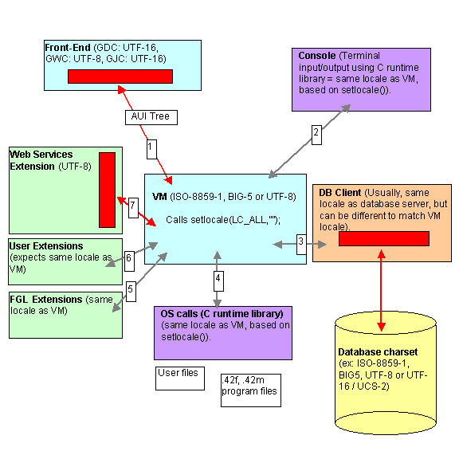

[Back to Contents](../index.html)

------------------------------------------------------------------------

# [Localization]{#PAGE_HEADER}

Summary:

- [Localization Support](#DEFINITION)
- [Quick guide for locale settings](#QUICK_GUIDE)
- [Locale and character set basics](#LOCALE_BASICS)
  - [Why do I need to care about the locale and character
    set?](#LOCALE_BASICS_WHY)
  - [Characters, code points, character sets, glyphs and
    fonts](#LOCALE_BASICS_DEFINITIONS)
  - [What is ASCII?](#LOCALE_BASICS_ASCII)
  - [What is a single-byte character set (SBCS)?](#LOCALE_BASICS_SBCS)
  - [What is a double-byte character set (DBCS)?](#LOCALE_BASICS_DBCS)
  - [What is a multi-byte character set (MBCS)?](#LOCALE_BASICS_MBCS)
  - [What is UNICODE?](#LOCALE_BASICS_UNICODE)
  - [When do I need a UNICODE character
    set?](#LOCALE_BASICS_WHEN_UNICODE)
  - [What is the standard?](#LOCALE_BASICS_WHEN_UNICODE)
  - [What is my current character set?](#LOCALE_BASICS_CURRENT_CHAR_SET)
- [Understanding locale settings](#LOCALE_SETTINGS)
- [Defining the locale (Runtime settings)](#RUNTIME)
  - [Language Settings](#LANGUAGE_SETTINGS)
  - [Numeric and Currency Settings](#NUMERIC_SETTINGS)
  - [Date and Time Settings](#DATETIME_SETTINGS)
- [Writing Programs](#WRITINGPROGS)
  - [Runtime character set must match development character
    set](#WP_RT_DV_CHARSET)
  - [Byte length semantics vs. Character length semantics](#WP_BLS_CLS)
  - [Avoid complex sub-string expressions](#WP_SUBSTRINGS)
- [Database Client Settings](#DBCLIENT)
- [Front-end Settings](#FRONTEND)
- [Runtime System Messages](#RTMSG)
- [Using the charmap.alias file](#TRB_CHARMAP_ALIAS)
- [Using the Ming Guo date format](#MING_GUO)
- [Troubleshooting](#TROUBLESHOOT)
  - [Locale settings (LANG) corrupted on Microsoft
    platforms](#TRB_WINDOWS_LANG)
  - [A form is displayed with invalid characters](#TRB_INVCHARS)
  - [Checking the locale configuration on UNIX
    platforms](#TRB_CHECKLOCALE)
  - [Verifying if the locale is properly supported by the runtime
    system](#TRB_VERIFY)
  - [How to retrieve the list of available locales on the
    system](#TRB_LOCALES)
  - [How to retrieve the list of available codesets on the
    system](#TRB_CODESETS)

*See also:* [Localized Strings](LocalizedStrings.html)

------------------------------------------------------------------------

### [Localization support]{#DEFINITION}

Localization support allows you to write BDL programs that follow a
specific language and cultural rules. This includes single and
multi-byte character set support, language-specific messages, as well as
lexical/numeric/currency conventions.

Beside the support of a [locale]{.underline} specification described in
this page, the internationalization (I18N) of an application consist to
extract and centralize all strings of the sources that are subject of
translation. Genero BDL helps you in this task with the [Localized
Strings](LocalizedStrings.html) feature. 

The [locale]{.underline} defines the language (for messages),
country/territory (for currency symbols, date formats) and code set
(character set encoding). A BDL program needs to be able to determine
its [locale]{.underline} and act accordingly, to be portable to
different languages and character sets.

**Warning: Since character set conversions can be symmetrical (the same
[code point](#LOCALE_BASICS_DEFINITIONS) can represent different
characters in different character sets), an invalid locale configuration
in one of the components can result in invalid characters in the
database. Read carefully the sections [\"Locale and character set
basics\"](#LOCALE_BASICS) and [\"Understand locale
settings\"](#LOCALE_SETTINGS). For example, a client application is
configured to display glyphs (font) for CP437. If the application gets a
0x82 (130) code point, it displays an é character. Now imagine that the
DB client is configured with character set CP1252. In this character
set, the cope point 0x82 is actually a curved quote. As a result, if you
insert the é char (0x82 in CP437) in the database, it will actually be
seen as curved quote (0x82 in CP1252) by the database server. When
fetching that curved quote back to the client, the database server
returns the 0x82 code point, which displays correctly as é on the CP437
client - so you think everything is ok. But if you query the database
with another application, configured properly with CP1252 and DB client
codeset, you don\'t see the é, you see a curved quote.**

------------------------------------------------------------------------

### [Quick guide for locale settings]{#QUICK_GUIDE}

Below is a quick step-by-step guide to configure your Genero application
properly. We still highly recommend that you read the rest of the page
for more information:

1.  Identify the [character set used by the program files]{.underline}
    (this can be **42m**, **42f** or **[42s](LocalizedStrings.html)**
    files). The encoding used by these files is the character set that
    was configured at compile time on the development machine. Let\'s
    call this the Application Locale. 
2.  Set the [operating system locale](#RUNTIME) corresponding to the
    Application Locale.
    - [On a UNIX server]{.underline}, define the LANG (or LC_ALL)
      environment variable. Use *locale -a* command to check if the
      locale exists on the machine. If not, it must be installed. If not
      set, LANG defaults to POSIX (ASCII).
    - [On a Windows server]{.underline}, check if the regional settings
      for non-UNICODE applications match the Genero application locale.
      If the regional settings do no match, you can define the LANG
      environment variable with a locale name supported by Microsoft C
      Runtime Library, such as *French_France.1252*.
3.  Check the [charmap.alias file in FGLDIR/etc](#TRB_CHARMAP_ALIAS) and
    verify that the name of the Application Locale is mapped to a
    normalized name. The normalized name will be sent to front-ends to
    enable charset conversion.
4.  Set the [database client software locale](#DBCLIENT) with a
    character set corresponding to the Application Locale. For example,
    with Informix, this is defined with the CLIENT_LOCALE environment
    variable. Note that the name of the DB Client Locale will certainly
    be a little bit different from the Application Locale. But remember
    the Application and DB Client character sets **MUST** match. Note
    the database server locale can be different from the db client
    locale.
5.  Set the [front-end software locale and font](#FRONTEND). By
    front-end, we mean the program the end user interacts with. This can
    be a Genero client like GDC or a terminal emulator like Gnome-term,
    Putty, or a Windows Console. When using a Genero GUI front-end, the
    front-end character set is fixed by the type of the front end and
    conversion from/to application character set is automatic, but you
    may need to select a font different from the system default. If you
    want to execute a TUI application in a terminal emulator, you must
    be sure that the terminal is configured to display the correct
    character set. This is for example defined with the *chcp* command
    on Windows, or in the \"*Set Character Encoding*\" menu option of a
    Gnome-term.

------------------------------------------------------------------------

### [Locale and character set basics]{#LOCALE_BASICS}

Before starting with application/database design, configuration and
settings, you must know some basics concerning language and character
sets on computers. In this section, we attempt to describe these basics,
but we strongly recommend you to carefully read the operating system and
database server manuals covering localization or character set handling.
You can also find a lot of information about character sets and
character encoding on the internet.

#### [Why do I need to care about the locale and character set?]{#LOCALE_BASICS_WHY}

If you don\'t know what you are doing with character sets, the end user
might get strange characters displayed on the screen, and will probably
not be able to input non-ASCII characters. In the worst case, as
character set conversion can be symmetric for single-byte character
sets, the end user might see correct characters on the workstation,  but
on the back-end you can get invalid characters in the database files. By
upgrading to a newer OS, Genero BDL runtime or database system, or if a
character set mapping utility was used somewhere in the chain, you can
even get mixed character encoding in the database files. 

#### [Characters, code points, character sets, glyphs and fonts]{#LOCALE_BASICS_DEFINITIONS}

In computers, a [character]{.underline} is the unit of information
corresponding to a symbol of a natural language. This can be a letter, a
digit, a punctuation mark, a mathematic or even musical symbol. To
represent a character in memory or in a file, computers must encode the
character in a specific numeric value called [code point]{.underline}.
This code point uniquely identifies a character in a given [character
set]{.underline}. Mapping a character to a code point is called
[character encoding]{.underline}. The same code point might represent a
different character in several character sets. The [glyph]{.underline}
is the graphical representation of the character. In other words, it\'s
the way the character is drawn on the screen or on a printer. Computers
implement the glyph of characters with [fonts]{.underline}, by mapping a
code point to a bitmap image or drawing instructions based on math
formulas or vector graphics.

#### [What is ASCII?]{#LOCALE_BASICS_ASCII}

ASCII stands for the American Standard Code for Information Interchange.
ASCII is a well-known character encoding based on the English alphabet.
Characters are encoded in a single byte, using the 7 lower bits only. Up
to 127 characters, printable and not printable (like control
characters), are defined in ASCII. Nearly all other character sets
(using 8 bits or multiple bytes) define the first 127 characters as the
ASCII character set. Aliases for ASCII include ISO646-US,
ANSI_X3.4-1968, IBM367, cp367, and more.

#### [What is a single-byte character set (SBCS)?]{#LOCALE_BASICS_SBCS}

A single-byte character set defines the encoding for characters on a
unique byte. The size of a character is always one byte.\
Example of single-byte character sets include ISO-8859-1, MS code page
CP1252.\
Genero BDL supports single-byte character sets.

#### [What is a double-byte character set (DBCS)?]{#LOCALE_BASICS_DBCS}

A double-byte character set defines the encoding for characters on two
bytes. The size of a character is always two bytes.\
Example of double-byte character sets include UCS-2, used by SQL Server
in NCHAR and NVARCHAR columns. Note that UTF-16 is not a (fixed)
double-byte character set: You can have characters encoded on 2 or 4
bytes. UCS-2 is actually a sub-set of UTF-16.

**Warning: Genero BDL does not support double-byte character sets.**

#### [What is a multi-byte character set (MBCS)?]{#LOCALE_BASICS_MBCS}

A multi-byte character set defines the encoding for characters on a
variable number of bytes. The size of a character can be one (usually
ASCII chars), two, three or more bytes, depending on the character set.\
Example of multi-byte character sets are BIG5, EUC-JP, and UTF-8. BIG5
and EUC-JP characters can be one or two bytes long, while UTF-8
characters can be 1, 2, 3 or 4 bytes long (usually a maximum of 3 is
sufficient).\
Genero BDL supports multi-byte character sets.

#### [What is UNICODE?]{#LOCALE_BASICS_UNICODE}

UNICODE is a standard specification to map all possible characters to a
numeric value, in order to cover all possible languages in a unique
character set. UNICODE defines the mapping of characters to integer
codes, but it does not define the exact implementation (i.e. encoding)
for a character. Several character sets are based on the UNICODE
standard, such as UTF-7, UTF-8, UTF-16, UTF-32, UCS-2,  and UCS-4. Each
of these character sets use a different encoding method. For example,
with UTF-8, the letter **Æ** is encoded with two bytes as 0xC3 and 0xB6,
while the same character will be encoded 0x00C6 with UTF-16.

**Tip:** On a Windows and Linux systems, you can see the UNICODE value
for characters of a given font by running the \"Character Map\" utility.

**Warning: When Microsoft Windows users talk about UNICODE, they
typically mean UCS-2 or UTF-16, while Unix users typically mean UTF-8.**

#### [When do I need a UNICODE character set?]{#LOCALE_BASICS_WHEN_UNICODE}

With internationalization, people want to use different languages within
the same application; for example, to have Chinese, Japanese, English,
French and German addresses of customers in their database. UNICODE is a
character encoding specification that defines characters for all
languages. More and more databases will use a UNICODE character set on
the database server, because it \"standardizes\" all data from different
client applications. If needed, the client application can then use a
different character set like ISO-8859-1 or BIG5: The database software
takes care of character set conversions. However, if the end user needs
to deal with different languages, all components of the system (from
database back-end to GUI front-end) must work in UNICODE.

#### [What is the standard?]{#LOCALE_BASICS_STANDARDS}

At this time, UNICODE tends to be the standard, but unfortunately not
all platforms/systems use the same UNICODE character set. Recent UNIX
distributions define UTF-8 as the default character set locale, XML
files are UTF-8 by default, while Microsoft Windows standard is UTF-16
(NTFS) / UCS-2 (SQL Server).

#### [What is my current character set?]{#LOCALE_BASICS_CURRENT_CHAR_SET}

On a UNIX box, you have the LANG / LC_ALL environment variables to
define the locale. Each process / terminal can set its own locale. By
default this is en_US.utf8 on recent UNIX systems. You can query for
available locales with the *locale -a* command. Some systems come with
only a few locales installed, you must then install an additional
package to get more languages. You must also define the correct
character set in the terminal (xterm or gnome-term), otherwise non-ASCII
characters will not display properly.

On Windows platforms, for non-UNICODE (i.e. non-UTF-16/UCS-2)
applications, you have ACP and OEMCP code pages. ACP stands for ANSI
Code Page and were designed by Microsoft for first GUI applications,
while OEMCP defines old code pages for MS/DOS console applications. You
can select the default ACP/OEMCP code pages for non-UNICODE application
in the language and regional settings panel of Windows (make sure you
define the settings for [non-UNICODE applications]{.underline}, this is
done in the \"Advanced\" panel on Windows XP). Code page can be changed
in each console window with the *chcp* command. Note that with Genero,
you can use the LANG environment variable on Windows to define the
character set to be used by BDL.

------------------------------------------------------------------------

### [Understanding locale settings]{#LOCALE_SETTINGS}

It is critical to understand how the different components of a BDL
process handle locale settings. Each component (i.e. runtime system,
database client software, front-end, terminal) has to be configured
properly to get the correct character set conversions through the whole
chain. The chain starts on the end-user workstation with front-end
windows and ends in the database storage files.

The schema below shows the different components of a BDL process.

- The red rectangles show where character set conversion occurs.
  Conversion can happen in the front-end side, for C-based Web Services
  extension and in the database client. No conversion is done by the
  fglrun runtime system.
- In the BDL runtime system (fglrun), the locale and code set support is
  based on the POSIX C runtime libraries driven by the **setlocale()**
  standard function. This locale setting is defined by the LC_ALL (or
  LANG) environment variable. The locale of the runtime system must
  match the code set of the deployed program modules (42m and 42f
  files). See [Runtime Settings](#RUNTIME) for more details.
- The terminal (for TUI applications) and the C runtime library are
  represented in magenta rectangles. These elements will use the locale
  of the runtime system.
- The locale of the database client must match the locale of the runtime
  system. Each database vendor uses it\'s own locale configuration
  system. See [Database Client Settings](#DBCLIENT) for more details.
- The database server uses it\'s own locale settings, which can be
  different from the runtime system / db client locale. You can for
  example store the data in UTF-8 but have programs using ISO-8859-1. 

{border="0"}

The typical mistake is to forget to set the database client software
locale. Most database servers can\'t detect that the locale of the db
client is invalid and don\'t raise any error. A character string is just
a set of bytes; The same code might represent different characters in
different code sets. For example, the Latin letter **é** with acute
(UNICODE: U+00E9) will be encoded as 0xE9/233 in CP1252 but will get the
code 0x82/130 in CP437. The codes 233 or 130 are valid characters in
both code sets, so if the database uses CP1252, 233 will represent an
**é** and 130 will represent a curved quote. If the client application
used CP437, the **é** will be encoded as 130, stored as curved quotes
but are retrieved from the database as is and displayed back as **é** in
the CP437 code page. From the front-end side, you can\'t see that the
character in the database in wrong. 

**Warning: On recent UNIX systems, the default locale is set to UTF-8.
If your application has been developed on an older system, it is
probably using a single-byte character set like ISO-8859-1 or CP1252,
and program need to be executed in this locale, not in the UTF-8
locale.**

It is important to define / know what is the database server character
set (i.e. in what code set the characters are stored in the database).

The best way to test if the characters inserted in the database are
correct is to use the database vendor SQL interpreter and select rows
inserted from a BDL program. The rows most hold non-ASCII data to check
if the code of the characters is correct. Some databases support the
ASCII() or better, the UNICODE() SQL function to check the code of a
character. Use such function to determine the value of a character in
the database field. If the character code does not correspond to the
expected value in the character set of the database server, there is a
configuration mistake somewhere.

**Warning: If you run a BDL application in TUI mode (or a batch program
doing DISPLAYs), you must properly configure the code set in the
terminal window (X11 xterm, Windows CMD, putty, etc). If the terminal
code set does not match the runtime system locale, you will get invalid
characters displayed on the screen. On Windows platforms, the OEM code
page of the CMD window can be queried/changed with the chcp command. On
a Gnome terminal, go to the menu \"Terminal\" - \"Set Character
Encoding\".**

------------------------------------------------------------------------

### [Defining the locale]{#DEFINING_LOCALE} ([Runtime settings]{#RUNTIME})

This section describes the settings defining the [locale]{.underline},
changing the behavior of the compilers and runtime system.

#### [Language Settings]{#LANGUAGE_SETTINGS}

The Genero BDL compilers and runtime system use the standard C library
functions (*setlocale*) to handle character sets. The **LANG** (or
**LC_ALL**) environment variable defines the global settings for the
language used by the application. The locale settings matters at compile
time and at runtime. At runtime, the **LANG** variable changes the
behavior of the character handling functions, such as
[UPSHIFT](BuiltInFunctions.html#BF_UPSHIFT),
[DOWNSHIFT](BuiltInFunctions.html#BF_DOWNSHIFT). It also changes the
handling of the character strings, which can be single byte or
multi-byte encoded. Note that an invalid locale setting will cause
compilation errors if the .4gl or .per source file contains characters
that do not exist in the encoding defined by the **LANG** variable.

**Warning: On Windows platforms, if you don\'t specify the LANG
environment variable, the language and character set defaults to the
system locale which is defined by the regional settings for non-Unicode
applications. For example, on a US-English Windows, this defaults to the
1252 code page. You typically leave the default on Windows platforms
(i.e. you should not set the LANG variable, except if your application
uses a different character set as the Windows system locale). On UNIX
platforms, you should always define LANG or LC_ALL.**

With the **LANG** environment variable (or **LC_ALL**, on UNIX), you
define the *language*, the *territory* (aka country) and the *codeset*
(aka character set or code page) to be used. The format of the value is
normalized as follows, but may be specific on some operating systems: 

*`language`*`_`*`territory`*`.`*`codeset`*

For example:

`$ LANG=en_US.iso88591; export LANG`

**Warning: Usually OS vendors define a specific set of values for the
*language*, *territory* and *codeset*. For example, on a UNIX platform,
you typically have the value \"en_US.ISO8859-1\" for a US English
locale, while Microsoft Windows requires the \"English_USA.1252\" value.
For more details about supported locales, please refer to the OS
documentation. On UNIX platforms, you can do a *man locale* or *man
setlocale* to understand how the standard C library defines locale
settings. For Windows, search in the MSDN library.**

Note that on Windows platforms, the syntax of the LANG variable is:

*`  language`*`[_`*`territory`*`[.`*`codeset`*`]]`\
`| .`*`codeset`*

For example:

`C:\ set LANG=English_USA.1252`

A list of available locales can be found on UNIX platform by running the
*locale -a* command. You may also want to read the man pages of the
*locale* command and the *setlocale* function. On Windows platforms,
search the [MSDN documentation](http://msdn.microsoft.com) for
\"Language and Country/Region Strings\".

See also [Troubleshooting](#TROUBLESHOOT) to learn how to check if a
locale is properly set, and list the locales installed on your system.

#### [Numeric and Currency Settings]{#NUMERIC_SETTINGS}

To perform [decimal](DataTypes.html#DT_DECIMAL) to/from string
conversions, the runtime system uses the
[DBMONEY](EnvironmentVariables.html#EV_DBMONEY) or
[DBFORMAT](EnvironmentVariables.html#EV_DBFORMAT) environment variables.
These variables define hundreds / decimal separators and currency
symbols for [MONEY](DataTypes.html#DT_MONEY) data types.

Note that the standard C library environment variables **LC_MONETARY**
and **LC_NUMERIC** are [ignored]{.underline}.

#### [Date and Time Settings]{#DATETIME_SETTINGS}

To perform [date](DataTypes.html#DT_DATE) to/from string conversions,
the runtime system uses by default the
[DBDATE](EnvironmentVariables.html#EV_DBDATE) environment variable.

When using the [FORMAT](FSFAttributes.html#FA_FORMAT) field attribute or
the [USING](Operators.html#OP_USING) operator to format
[dates](DataTypes.html#DT_DATE) with abbreviated day and month names -
by using **ddd** / **mmm** markers - the system uses English-language
based texts for the conversion. This means, day (ddd) and month (mmm)
abbreviations are not localized according to the locale settings, they
will always be in English.

Note that the standard C library environment variable **LC_TIME** is
[ignored]{.underline}.

------------------------------------------------------------------------

### [Writing Programs]{#WRITINGPROGS}

#### [Runtime character set must match development character set]{#WP_RT_DV_CHARSET}

When writing a form or program source file, you use a specific character
set. This character set depends upon the text editor or operating system
settings you are using on the development platform. For example, when
writing a string constant in a 4gl module, containing Arabic characters,
you probably use the ISO-8859-6 character set. The character set used at
runtime (during program execution) must match the character set used to
write programs.

At runtime, a Genero program can only work in a specific character set.
However, by using [Localized Strings](LocalizedStrings.html), you can
start multiple instances of the same compiled program using different
locales. For a given program instance the character set used by the
strings resource files must correspond to the locale. Make sure the
string identifiers use ASCII only.

#### [Byte length semantics vs. Character length semantics]{#WP_BLS_CLS}

Genero BDL uses byte length semantics: When defining a character data
type like [CHAR](DataTypes.html#DT_CHAR)(n) or
[VARCHAR](DataTypes.html#DT_VARCHAR)(n), n represents as a [number of
bytes]{.underline}, not a number of characters. In a single-byte
character set like ISO-8859-1, any character is encoded on a unique
byte, so the number of bytes equals the number of characters. But in a
multi-byte character set, encoding requires more that one byte, so the
number of bytes to store a multi-byte string is bigger as the number of
characters. For example, in a BIG5 encoding, one Chinese character needs
2 bytes, so if you want to hold a BIG5 string with a maximum of 10
Chinese characters, you must define a CHAR(20). When using a
variable-length encoding like UTF-8, characters can take one, two or
more bytes, so you need to choose the right average to define CHAR or
VARCHAR variables.

The definition and length semantics of character data types such as
CHAR, VARCHAR, NCHAR and NVARCHAR varies from one database vendor to
another. Some use byte length semantics, other use character length
semantics, and other support both ways. For example, Informix uses byte
length semantics only while with Oracle you can define character columns
with a number of bytes \"CHAR(10 BYTE)\" or a number of characters
\"CHAR(10 CHAR)\". SQL Server supports non-UCS-2 character sets (Latin1,
BIG5) in CHAR/VARCHAR/TEXT columns, using a byte length for the size,
while NCHAR/NVARCHAR/NTEXT columns store double-byte UCS-2 characters
and use char length semantics.

Next table shows the character data type length semantics of database
servers supported by Genero:

  ----------------------- --------------------------------- -----------------------
  **Database Engine**     **Length semantics in character   **Summary**
                          data types**                      

  Genero db               Uses Byte Length Semantics for    **BLS**
                          the size of character columns.\   
                          Data is stored in UTF-8 when      
                          CHARACTER_SET=UTF-8 configuration 
                          parameter is defined.             

  Oracle                  Supports both Byte or Character   **BLS/CLS**
                          Length Semantics in character     
                          type definition, can be defined   
                          globally for the database or at   
                          column level.\                    
                          Data is stored in database        
                          character set for CHAR/VARCHAR    
                          columns and in national character 
                          set for NCHAR/NVARCHAR columns.   

  Informix                Uses Byte Length Semantics for    **BLS**
                          the size of character columns.\   
                          Data is stored in the database    
                          character set defined by          
                          DB_LOCALE.                        

  IBM DB2                 Uses Byte Length Semantics for    **BLS**
                          the size of character columns.\   
                          Data is stored in the database    
                          character set defined by the      
                          CODESET of CREATE DATABASE.       

  Microsoft SQL Server    CHAR/ VARCHAR sizes are specified **BLS/CLS**
                          in bytes; Data is stored in the   
                          character set defined by the      
                          database collation.\              
                          NCHAR/ NVARCHAR sizes are         
                          specified in characters; Data is  
                          stored in UCS-2.\                 
                          See [ODI Adaptation               
                          Guide](odiagmsv.html#ODIMSV040)   
                          for more details.                 

  PostgreSQL              Uses Character Length Semantics   **CLS**
                          for the size of character         
                          columns.\                         
                          Data is stored in the database    
                          character set defined by WITH     
                          ENCODING of CREATE DATABASE.      

  MySQL                   Uses Character Length Semantics   **CLS**
                          for the size of character         
                          columns.\                         
                          Data is stored in the server      
                          character set defined by a        
                          configuration parameter.          

  Sybase Adaptive Server  CHAR/ VARCHAR sizes are specified **BLS/CLS**
  Enterprise (ASE)        in bytes; Data is stored in the   
                          db character set.\                
                          NCHAR/NVARCHAR sizes are          
                          specified in characters; Data is  
                          stored the db character set.\     
                          UNICHAR/UNIVARCHAR sizes are      
                          specified in characters; Data is  
                          stored in UTF-16.\                
                          See [ODI Adaptation               
                          Guide](odiagase.html#ODIASE011)   
                          for more details.                 

  Sybase Adaptive Server  CHAR/ VARCHAR sizes are can be    **BLS/CLS**
  Anywhere (ASA)          specified in bytes by default,    
                          unless you add the CHAR\[ACTER\]  
                          keyword as part of the length;    
                          Data is stored in db character    
                          set.\                             
                          NCHAR/ NVARCHAR sizes are         
                          specified in characters; Data is  
                          stored in UTF-8.                  
  ----------------------- --------------------------------- -----------------------

Other SQL elements like functions and operators are affected by the
length semantic. For example, Informix LENGTH() function always returns
a number of bytes, while Oracle\'s LENGTH() function returns a number of
characters (use LENGTHB() to get the number of bytes with Oracle).

It is important to understand properly how the database servers handle
multi-byte character sets. Check your database server reference manual:
In most documentations you will find a \"Localization\" chapter which
describes those concepts in detail.

For portability, we recommend to use byte length semantic based
character data types in databases, because this corresponds to the
length semantics used by Genero BDL (this is important when declaring
variables by using [DEFINE LIKE](Variables.html), which is based on
database schemas).

#### [Avoid complex sub-string expressions]{#WP_SUBSTRINGS}

Since Genero BDL is using Byte Length Semantics, all character positions
in strings are actually byte positions. In a multi-byte environment, if
you don\'t pay attention to this, you can end up with invalid characters
in strings. For example if you use the [sub-script operator
\[x,y\]](Operators.html#OP_SUBSTRING), you might point to the second or
third byte of a multi-byte character, while you should always use byte
positions of the first byte of a character.

------------------------------------------------------------------------

### [Database Client Settings]{#DBCLIENT}

This section describes the settings defining the [locale]{.underline}
for the database client. Each database software has its own client
character set configuration.

**Warning: You must properly configure the database client locale in
order to send/receive data to the database server, according to the
locale used by your application. Both database client locale and
application locale settings must match (you cannot have a database
client locale in Japanese and a runtime locale in Chinese).**

Here is the list of environment variables defining the locale used by
the application, for each supported database client:

+-----------------------------------+-----------------------------------+
| **Database Client**               | **Settings**                      |
+-----------------------------------+-----------------------------------+
| Genero db                         | The character set used by the     |
|                                   | client is defined by the          |
|                                   | **characterset** ODBC DSN         |
|                                   | configuration parameter. If this  |
|                                   | parameter is not set, it defaults |
|                                   | to ASCII.\                        |
|                                   | Before version 3.80, the          |
|                                   | character set was defined by the  |
|                                   | **ANTS_CHARSET** environment      |
|                                   | variable.                         |
+-----------------------------------+-----------------------------------+
| Oracle                            | The client locale settings can be |
|                                   | set with environment variables    |
|                                   | like **NLS_LANG**, or after       |
|                                   | connection, with the ALTER        |
|                                   | SESSION instruction. By default,  |
|                                   | the client locale is set from the |
|                                   | database server locale.           |
+-----------------------------------+-----------------------------------+
| Informix                          | The client locale is defined by   |
|                                   | the **CLIENT_LOCALE** environment |
|                                   | variable. For backward            |
|                                   | compatibility, if CLIENT_LOCALE   |
|                                   | is not defined, other settings    |
|                                   | are used if defined (DBDATE /     |
|                                   | DBTIME / GL_DATE / GL_DATETIME,   |
|                                   | as well as standard LC\_\*        |
|                                   | variables).                       |
+-----------------------------------+-----------------------------------+
| IBM DB2                           | The client locale is defined by   |
|                                   | the **DB2CODEPAGE** profile       |
|                                   | variable. You must set this       |
|                                   | variable with the db2set command. |
|                                   | If DB2CODEPAGE is not set, DB2    |
|                                   | uses the operating system code    |
|                                   | page on Windows and the LANG      |
|                                   | environment variable on Unix.     |
+-----------------------------------+-----------------------------------+
| Microsoft SQL Server              | For **MSV** and **SNC** drivers   |
|                                   | on Windows platforms, the         |
|                                   | database client locale is defined |
|                                   | by the language settings for      |
|                                   | non-Unicode applications. The     |
|                                   | current ANSI code page (ACP) is   |
|                                   | used by the SQL Server client and |
|                                   | the Genero runtime system.        |
|                                   +-----------------------------------+
|                                   | When using the **FTM** (FreeTDS)  |
|                                   | driver, the client character set  |
|                                   | is defined by the **client        |
|                                   | charset** parameter in            |
|                                   | freetds.conf or with the          |
|                                   | **ClientCharset** parameter in    |
|                                   | the DSN of the odbc.ini file.     |
|                                   +-----------------------------------+
|                                   | When using the **ESM** (EasySoft) |
|                                   | driver, the client character set  |
|                                   | is defined by the **Client_CSet** |
|                                   | parameter in the DSN of the       |
|                                   | odbc.ini file. When using         |
|                                   | CHAR/VARCHAR types in the         |
|                                   | database and when the database    |
|                                   | collation is different from the   |
|                                   | client locale, you must also set  |
|                                   | the Server_CSet parameter to an   |
|                                   | iconv name corresponding to the   |
|                                   | database collation. For example,  |
|                                   | if Client_CSet=BIG5 and the db    |
|                                   | collation is                      |
|                                   | Chinese_Taiwan_Stroke_BIN, you    |
|                                   | must set Server_CSet=BIG5HKSCS,   |
|                                   | otherwise invalid data will be    |
|                                   | returned from the server.         |
+-----------------------------------+-----------------------------------+
| PostgreSQL                        | The client locale can be set with |
|                                   | the **PGCLIENTENCODING**          |
|                                   | environment variable, with the    |
|                                   | *client_encoding* configuration   |
|                                   | parameter in postgresql.conf, or  |
|                                   | after connection, with the SET    |
|                                   | CLIENT_ENCODING instruction.      |
|                                   | Check the *pg_conversion* system  |
|                                   | table for available character set |
|                                   | conversions.                      |
+-----------------------------------+-----------------------------------+
| MySQL                             | The client locale is defined by   |
|                                   | the ***default-character-set***   |
|                                   | option in the configuration file, |
|                                   | or after connection, with the SET |
|                                   | NAMES and SET CHARACTER SET       |
|                                   | instructions.                     |
+-----------------------------------+-----------------------------------+
| Sybase Adaptive Server Enterprise | By default, the Sybase database   |
| (ASE)                             | client character set is defined   |
|                                   | by the **operating system         |
|                                   | locale** where the database       |
|                                   | client runs. On Windows, it is    |
|                                   | the ANSI code page of the login   |
|                                   | session (can be overwritten by    |
|                                   | setting the LANG environment      |
|                                   | variable), on UNIX it is defined  |
|                                   | by the LC_CTYPE, LC_ALL or LANG   |
|                                   | environment variable. Note that   |
|                                   | you may need to edit the          |
|                                   | \$SYBASE/locales/locales.dat file |
|                                   | to map the OS locale name to a    |
|                                   | known Sybase character set.\      |
|                                   | See Sybase ODBC documentation for |
|                                   | more details regarding character  |
|                                   | set configuration.                |
+-----------------------------------+-----------------------------------+
| Sybase Adaptive Server Anywhere   | The client locale is defined by   |
| (ASA)                             | the operating **system locale**   |
|                                   | where the database client is      |
|                                   | installed.                        |
+-----------------------------------+-----------------------------------+

See database vendor documentation for more details.

------------------------------------------------------------------------

### [Front-End Settings]{#FRONTEND}

The host operating system on the front-end workstation must be able to
handle the character set and fonts. For instance, a Western-European
Windows is not configured to handle Arabic applications. If you start an
Arabic application, some graphical problems may occur (for instance the
title bar won\'t display Arabic characters, but unwanted characters
instead).

The GUI front-end software must support the conversion of the runtime
system character set to/from the character set used internally by the
client, and must be configured with the correct font to display the
characters used by the application. For example, the default font for a
GDC installed on an English Windows system might not be able to display
Japanese characters. You must the change the font in the GDC
configuration panel. Refer to the front-end documentation to see how
character set conversion and fonts can be configured.

When using a TUI program in a terminal emulator such as Putty, XTerm or
even the Windows Console, make sure the terminal is configured properly
to display the characters of the application locale. For example, on a
Windows Console you can use the *chcp* command to change the current
code page.

------------------------------------------------------------------------

### [Runtime System Messages]{#RTMSG}

Predefined runtime system error messages are stored in the **.iem**
system message files. The system message files use the same technique as
user defined message files (See [Message Files](MessageFiles.html)). The
default message files are located in the **FGLDIR/msg/en_US** directory
(**.msg** sources are provided).

For backward compatibility with Informix 4gl, some of these system error
messages are used by the runtime system to report a \"normal\" error
during a dialog instruction. For example, end users may get the error
-1309 \"There are no more rows in the direction you are going\" when
scrolling an a [DISPLAY ARRAY](DisplayArray.html) list.

Here are some examples of system messages that can appear during a
dialog:

  ---------------- --------------------------------------------------------
  **Number**       **Description**
  -1204            Invalid year in date.
  -1304            Error in field.
  -1305            This field requires an entered value.
  -1306            Please type again for verification.
  -1307            Cannot insert another row - the input array is full.
  -1309            There are no more rows in the direction you are going.
  *and more\...*   
  ---------------- --------------------------------------------------------

While it is recommended to use [Localized
Strings](LocalizedStrings.html) to internationalize application
messages, you will need to translated some of the system messages to a
specific locale and language, or you might just want to customize the
English messages.

With this technique, you can deploy multiple message files in different
languages and locales in the same FGLDIR/msg directory.

To use your own customized system messages, do the following:

1.  Create a new directory under \$FGLDIR/msg, using the same name as
    your current locale.\
    For example, if `LANG=fr_FR.ISO8859-1`, you must create
    `$FGLDIR/msg/fr_FR.ISO8859-1`.
2.  Copy the original system message source files (.msg) from
    `$FGLDIR/msg/en_US` to the locale-specific directory.
3.  Edit the source files with the **.msg** suffix and translate the
    messages.
4.  Re-compile the message files with the
    [fglmkmsg](Tools.html#TL_FGLMKMSG) tool to produce **.iem** files.
    Make sure you have set the correct locale!
5.  Run a program to check if the new messages are used. 

#### Tips:

1.  You can use the [fglmkmsg](Tools.html#TL_FGLMKMSG) tool with the
    **-r** option to revert a **.iem** file to a source **.msg** file.
2.  There is no need to translate all messages of the **.msg** files:
    Most of the error messages are unexpected during a program execution
    and therefore can stay in English. The messages subject of
    translation can be found in the **4glusr.msg** and **rds.msg**
    files.

#### Warnings:

1.  The locale can be set with different environment variables (see
    setlocale manual pages for more details). To identify the locale
    name, the runtime system first looks for the LC_ALL value, then
    LC_CTYPE and finally LANG.
2.  Pay attention to locale settings when editing message files and
    compiling with [fglmkmsg](Tools.html#TL_FGLMKMSG): The current
    locale must match the locale used in the .msg files.
3.  The **.iem** files used at runtime must match the current locale
    used by programs. This should be automatic, as long as you put the
    correct files in the corresponding `$FGLDIR/msg/$LANG` directory\...

------------------------------------------------------------------------

### [Using the charmap.alias file]{#TRB_CHARMAP_ALIAS}

The name of the codeset can be different from one system to another. The
file \$FGLDIR/etc/charmap.alias is used to provide the translation of
the local name to a generic name. The generic name is the name sent to
the front-end. It is the translated name that appears when the command
\'fglrun -i mbcs\' is used. The local codeset name is the value obtained
using the system call \'nl_langinfo(CODESET)\'. You can add more entries
to the charmap.alias file according to the need.

An example of locale configuration on HP

``` per
$ export LANG=en_US.iso88591
$ locale
LANG=en_US.iso88591
LC_CTYPE="en_US.iso88591"
LC_COLLATE="en_US.iso88591"
LC_MONETARY="en_US.iso88591"
LC_NUMERIC="en_US.iso88591"
LC_TIME="en_US.iso88591"
LC_MESSAGES="en_US.iso88591"
LC_ALL=
$ locale charmap
"iso88591.cm"
```

The charmap.alias file contains the following line:

``` per
iso88591 ISO8859-1
```

The name sent to the client is ISO-8859-1 instead of iso88591.

The following C program should compile, and outputs the current codeset
name.

``` per
#include <stdio.h>
#include <stdlib.h>
#include <locale.h>
#include <langinfo.h>
int main()
{
  setlocale(LC_ALL, "");
  printf("%s\n", nl_langinfo(CODESET));
  exit(0);
}
```

With the previous example this program outputs:

``` per
iso88591
```

------------------------------------------------------------------------

### [Using the Ming Guo date format]{#MING_GUO}

The Ming Guo (or Minguo) calendar is still used in some Asian regions
like Taiwan. This calendar is equivalent to the Gregorian calendar,
except that the years are numbered with a different base: In the Ming
Guo calendar, the first year (1) corresponds to the Gregorian year 1912,
the year the Republic Of China was founded.

Digit-based year Ming Guo date format can be enabled by adding the C1
modifier at the end of the value set for the
[DBDATE](EnvironmentVariables.html#EV_DBDATE) environment variable:

    $ DBDATE="Y3MD/C1"
    $ export DBDATE

With the above DBDATE setting, dates will be displayed with a year
following the Ming Guo calendar, and date input will also be interpreted
based on that calendar. For example, if the user enters 90/3/24, it is
equivalent to an input of 2002/3/24 when using the Gregorian calendar.
Basically, the runtime system will subtract 1912 or add 1912
respectively when displaying or reading date values).

When using the C1 modifier, the possible values for the Yn symbol are
Y4, Y3, Y2.

The [MDY() operator](Operators.html#OP_MDY) is sensitive to the C1
modifier usage in DBDATE. For example, if DBDATE=Y3MD/C1, MDY(3,24,1)
will build a date the corresponds in the Gregorian to MDY(3,24,1912).

The [USING operator](Operators.html#OP_USING) supports the c1 modifier
as well. The c1 modifier must be specified at the end of the format. You
can for example use the following format string: \"yyyy-mm-ddc1\".

The C2 modifier to use Era names is not supported.

Unlike Informix 4gl, when using negative years, the minus sign is placed
over the left-most zero of the year, to avoid miss-aligned dates.

For example, if DBDATE=Y3MD/C1:

    MDY(3,2, 1) USING "yyy/mm/ddc1"
    MDY(3,2,-1) USING "yyy/mm/ddc1"

will align properly as follows:

    0001/03/02
    -001/03/02

**Warning: Front-ends may not support the Ming Guo calendar for widgets
like [DATEEDIT](FormSpecFiles.html#FF_ITEMTYPE_DATEEDIT).**

------------------------------------------------------------------------

### [Troubleshooting]{#TROUBLESHOOT}

#### [Locale settings (LANG) corrupted on Microsoft platforms]{#TRB_WINDOWS_LANG}

On Microsoft Windows XP / 2000 platforms, some system updates (Services
Pack 2) or Office versions do set the LANG environment variable with a
value for Microsoft applications (for example 1033). Such value is not
recognized by Genero as a valid locale specification. Make sure that the
LANG environment variable is properly set in the context of Genero
applications.

#### [A form is displayed with invalid characters]{#TRB_INVCHARS}

You may have different codesets on the client workstation and the
application server. The typical mistake that can happen is the
following: You have edited a form-file with the encoding CP1253; you
compile this form-file on a UNIX-server (encoding ISO-8859-7). When
displaying the form, invalid characters will appear. This is usually the
case when you write your source file under a Windows system (that uses
Microsoft Code Page encodings), and use a Linux server (that uses ISO
codepages).

**Warning: All source files must be created/edited in the encoding of
the server (where fglcomp and fglrun will be executed).**

#### [Checking the locale configuration on Unix platforms]{#TRB_CHECKLOCALE}

On Unix systems, the **locale** command without parameters outputs
information about the current locale environment.

Once the **LANG** environment variable is set, check that the locale
environment is correct:

``` per
$ export LANG=en_US.ISO8859-1
$ locale
LANG=en_US.ISO8859-1
LC_CTYPE="en_US.ISO8859-1"
LC_NUMERIC="en_US.ISO8859-1"
LC_TIME="en_US.ISO8859-1"
LC_COLLATE="en_US.ISO8859-1"
LC_MONETARY="en_US.ISO8859-1"
LC_MESSAGES="en_US.ISO8859-1"
LC_PAPER="en_US.ISO8859-1"
LC_NAME="en_US.ISO8859-1"
LC_ADDRESS="en_US.ISO8859-1"
LC_TELEPHONE="en_US.ISO8859-1"
LC_MEASUREMENT="en_US.ISO8859-1"
LC_IDENTIFICATION="en_US.ISO8859-1"
LC_ALL=
```

If the locale environment is not correct, then you should check the
value of the following environment variables : LC_ALL, LC_CTYPE,
LC_NUMERIC, LC_TIME, LC_COLLATE, \... value.

The following examples show the effect of LC_ALL and LC_CTYPE on locale
configuration. The LC_ALL variable overrides all other LC\_\....
variables values.

``` per
$ export LANG=en_US.ISO8859-1
$ export LC_ALL=POSIX
$ export LC_CTYPE=fr_FR.ISO8859-15
$ locale
LANG=en_US.ISO8859-1
LC_CTYPE="POSIX"
LC_NUMERIC="POSIX"
LC_TIME="POSIX"
LC_COLLATE="POSIX"
LC_MONETARY="POSIX"
LC_MESSAGES="POSIX"
LC_PAPER="POSIX"
LC_NAME="POSIX"
LC_ADDRESS="POSIX"
LC_TELEPHONE="POSIX"
LC_MEASUREMENT="POSIX"
LC_IDENTIFICATION="POSIX"
LC_ALL=POSIX
$ fglrun -i mbcs
LANG honored : yes
Charmap      : ANSI_X3.4-1968
Multibyte    : no
Stateless    : yes
```

The charset used is the ASCII charset. Clearing the LC_ALL environment
variable produces the following output:

``` per
$ unset LC_ALL
$ locale
LANG=en_US.ISO8859-1
LC_CTYPE=fr_FR.ISO8859-15
LC_NUMERIC="en_US.ISO8859-1"
LC_TIME="en_US.ISO8859-1"
LC_COLLATE="en_US.ISO8859-1"
LC_MONETARY="en_US.ISO8859-1"
LC_MESSAGES="en_US.ISO8859-1"
LC_PAPER="en_US.ISO8859-1"
LC_NAME="en_US.ISO8859-1"
LC_ADDRESS="en_US.ISO8859-1"
LC_TELEPHONE="en_US.ISO8859-1"
LC_MEASUREMENT="en_US.ISO8859-1"
LC_IDENTIFICATION="en_US.ISO8859-1"
LC_ALL=
$ fglrun -i mbcs
Error: locale not supported by C library, check LANG.
$ locale charmap
ANSI_X3.4-1968
```

After clearing the LC_ALL value, the value of the variable LC_CTYPE is
used. It appears that it is not correct. After clearing this value we
get the following output:

``` per
$ unset LC_CTYPE
$ locale
LANG=en_US.ISO8859-1
LC_CTYPE="en_US.ISO8859-1"
LC_NUMERIC="en_US.ISO8859-1"
LC_TIME="en_US.ISO8859-1"
LC_COLLATE="en_US.ISO8859-1"
LC_MONETARY="en_US.ISO8859-1"
LC_MESSAGES="en_US.ISO8859-1"
LC_PAPER="en_US.ISO8859-1"
LC_NAME="en_US.ISO8859-1"
LC_ADDRESS="en_US.ISO8859-1"
LC_TELEPHONE="en_US.ISO8859-1"
LC_MEASUREMENT="en_US.ISO8859-1"
LC_IDENTIFICATION="en_US.ISO8859-1"
LC_ALL=
$ locale charmap
ISO-8859-1
$ fglrun -i mbcs
LANG honored : yes
Charmap      : ISO-8859-1
Multibyte    : no
Stateless    : yes
```

#### [Verifying if the locale is properly supported by the runtime system]{#TRB_VERIFY}

You can check if the **LANG** locale is supported properly by using the
**-i mbcs** option of the compilers and runner programs:

    $ fglcomp -i mbcs
    LANG honored : yes
    Charmap      : ANSI_X3.4-1968
    Multibyte    : no
    Stateless    : yes

The lines printed with **-i info** option indicate if the locale can be
supported by the operating system libraries. Here is a short description
of each line:

+-----------------------------------+-----------------------------------+
| **Verification Parameter**        | **Description**                   |
+-----------------------------------+-----------------------------------+
| LANG Honored                      | This line indicates that the      |
|                                   | current locale configuration has  |
|                                   | been correctly set.\              |
|                                   | *Check if the indicator shows     |
|                                   | \'yes\'.*                         |
+-----------------------------------+-----------------------------------+
| Charmap                           | This is the name of the character |
|                                   | set used by the runtime system.   |
+-----------------------------------+-----------------------------------+
| Multibyte                         | This line indicates if the        |
|                                   | character set is multi-byte.\     |
|                                   | *Can be \'yes\' or \'no\'.*       |
+-----------------------------------+-----------------------------------+
| Stateless                         | A few character sets are using an |
|                                   | internal state that can change    |
|                                   | during the character flow. Only   |
|                                   | stateless character sets can be   |
|                                   | supported by Genero.\             |
|                                   | *Check if the indicator shows     |
|                                   | \'yes\'.*                         |
+-----------------------------------+-----------------------------------+

#### [How to retrieve the list of available locales on the system]{#TRB_LOCALES}

On Unix systems, the locale command with the parameter \'-a\' writes the
names of available locales.

``` per
$ locale -a
...
en_US
en_US.iso885915
en_US.utf8
en_ZA
en_ZA.utf8
en_ZW
...
```

#### [How to retrieve the list of available codesets on the system]{#TRB_CODESETS}

On Unix systems, the locale command with the parameter \'-m\' writes the
names of available codesets.

``` per
$ locale -m
...
ISO-8859-1
ISO-8859-10
ISO-8859-13
ISO-8859-14
ISO-8859-15
...
```
