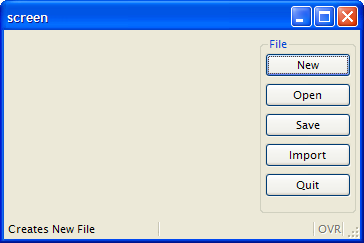
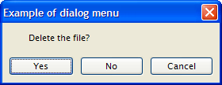
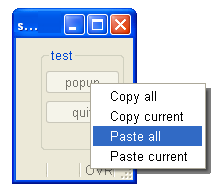
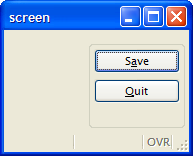

[Back to Contents](../index.html)

------------------------------------------------------------------------

# [Menus]{#PAGE_HEADER}

Summary:

- [Basics](#BASICS)
  - [What is a MENU?](#WHAT_IS_MENU)
  - [Rendering options](#RENDERING)
    - [Default renderings for MENU](#DEFAULT_REDERINGS)
    - [Binding explicit action views](#BINDING_VIEWS)
- [Syntax](#SYNTAX)
- [Usage](#USAGE)
  - [Programming Steps](#PROG_STEPS)
  - [Instruction Configuration](#INSTRUCTION_CONFIG)
  - [Default Actions](#DEFAULT_ACTIONS)
  - [Control Blocks](#CONTROL_BLOCKS)
  - [Interaction Blocks](#INTERACTION_BLOCKS)
  - [Control Instructions](#CONTROL_INSTRUCTIONS)
  - [Default Accelerator Keys](#DEFAULT_ACCELERATOR_KEYS)
  - [Using the COMMAND clause](#COMMAND)
  - [Using the COMMAND KEY clause](#CMDKEYS)
- [Examples](#EXAMPLES)
  - [Example 1: Abstract action controller](#EXAMPLE_1)
  - [Example 2: Simple menu (old Informix 4GL style)](#EXAMPLE_2)
  - [Example 3: Using a modal menu](#EXAMPLE_3)
  - [Example 4: Using a popup menu](#EXAMPLE_4)

*See also:* [Dynamic User Interface](DynamicUI.html)

------------------------------------------------------------------------

### [Basics]{#BASICS}

#### [What is a MENU?]{#WHAT_IS_MENU}

A Menu defines a list of options (also called actions) that can trigger
program routines. The `MENU` statement is an interactive instruction
defining the possible actions that can be executed in a specific context
at a given place in the program. One Menu can only define a set of
options for a given level. You cannot define all menu options of your
program in a unique Menu; you must use nested Menu calls. A typical
application starts with a global Menu, defining general options to
access sub-routines, which in turn implement specific Menus with options
like \'Append\', \'Delete\', \'Modify\', and \'Search\' that trigger
sub-routines to manage database records.

#### [Rendering options]{#RENDERING}

##### [Default renderings for MENU]{#DEFAULT_REDERINGS}

By default, if no explicit action views are associated with Menu
options, these options are displayed as simple push buttons in a
specific area, depending on the front end. The following screen is
produced by the program shown in [Example 2](#EXAMPLE_2) with the
desktop front-end:



You can display a Menu in a modal dialog window by setting some
attributes, as shown in the source code of [Example 3](#EXAMPLE_3). In
this case, if the user clicks on an options, the `MENU` instruction will
automatically exit and the modal dialog window will be clause (there is
no need for an `EXIT MENU` command):



Menus can also be displayed as popup choice lists, as illustrated in
[Example 4](#EXAMPLE_4). Like for modal dialog menus, there is no need
for an `EXIT MENU` command to leave the `MENU` instruction, it will
close automatically when an option is selected by the user:

{border="0"}

##### [Binding explicit action views]{#BINDING_VIEWS}

A `MENU` statement is a controller for user actions.  You bind actions
views with Menu options *by name*. For example, if your Menu contains
`ON` ` ACTION` `sendmail`, you can specify which action view the user
would use to trigger the sendmail action by:

- Set the name attribute with the action name (`sendmail`) for a
  *Toolbar* button (see [Toolbars](Toolbars.html) for more details).
- Set the name attribute with the action name (`sendmail`) for a
  *TopMenu* button (see [Topmenus](Topmenus.html) for more details).
- Set the item-name with the action name (`sendmail`) for a *Button*
  widget (see [Form Specification Files](FormSpecFiles.html) for more
  details).

Action views are bound to an action controller *by name*. See the
[Interaction Model](InteractionModel.html#BINDING_ACTIONS) description
for more details.

#### Warning: When binding action views to menu option clauses, the action name is case sensitive. The compiler converts `COMMAND` labels and `ON ACTION` identifiers to lowercase for the action. It is recommended that you use all lowercase letters when providing the action name for the action view.

For more details about default and explicit action views, see
[Interaction Model](InteractionModel.html).

------------------------------------------------------------------------

### [MENU]{#MENU}

#### Purpose:

The ` MENU` instruction defines a set of user choices.

#### [Syntax]{#SYNTAX}:

`MENU `[`[`]{.underline}*`title`*[`]`]{.underline}*\*
`    `[`[`]{.underline}` ATTRIBUTES ( `*`control-attributes`*` ) `[`]`]{.underline}\
`   `[`[`]{.underline}` BEFORE MENU`\
`       `*`menu-statement`\
`      `*` `[`[...]`]{.underline}\
`   `[`]`]{.underline}\
`   `*`menu-option`*\
`   `[`[...]`\]{.underline}
` END MENU`

where *menu-option* is one of:

` `[`{`]{.underline}` COMMAND `*`option-name`*` `[`[`]{.underline}*`option-comment`*[`]`]{.underline}` `[`[`]{.underline}` `` HELP `*`help-number`*` `[`]`]{.underline}\
`    `*`menu-statement`\
`   `*` `[`[...]`]{.underline}\
[`|`]{.underline}` COMMAND KEY ( `*`key-name`*` ) `*`option-name`*` `[`[`]{.underline}*`option-comment`*[`]`]{.underline}` `[`[`]{.underline}` `` HELP `*`help-number`*` `[`]`]{.underline}\
`    `*`menu-statement`\
`   `*` `[`[...]`]{.underline}\
[`|`]{.underline}` COMMAND KEY ( `*`key-name`*` )`\
`    `*`menu-statement`\
`   `*` `[`[...]`]{.underline}\
[`|`]{.underline}` ON ACTION `*`action-name`*\
`    `*`menu-statement`\
`   `*` `[`[...]`]{.underline}\
[`|`]{.underline}` ON IDLE `*`idle-seconds`*\
`    `*`menu-statement`\
`   `*` `[`[...]`]{.underline}\
[`}`]{.underline}` `

where *menu-statement* is:

[`{`]{.underline}` `*`statement`*\
[`|`]{.underline}` CONTINUE MENU`\
[`|`]{.underline}` EXIT MENU`\
[`|`]{.underline}` NEXT OPTION `*`option`*\
[`|`]{.underline}` SHOW OPTION `[`{`]{.underline}` ALL `[`|`]{.underline}` `*`option`*` `[`[,...]`]{.underline}` `[`}`]{.underline}\
[`|`]{.underline}` HIDE OPTION `[`{`]{.underline}` ALL `[`|`]{.underline}` `*`option`*` `[`[,...]`]{.underline}` `[`}`]{.underline}\
[`}`]{.underline}

#### Notes:

1.  *title* is a [string expression](Expressions.html#EX_STRING)
    defining the title of the menu.
2.  *control-attributes* is a list of attributes that defines the
    behavior and presentation of the menu.
3.  *key-name* is an hot-key identifier (like `F11` or `Control-z`).
4.  *option-name* is a [string expression](Expressions.html#EX_STRING)
    defining the label of the menu option and identifying the
    [action](InteractionModel.html) that can be executed by the user.
5.  *option-comment* is a [string
    expression](Expressions.html#EX_STRING) containing a description for
    the menu option, displayed when *option-name* is the current.
6.  *help-number* is an integer that allows you to associate a [help
    message](MessageFiles.html) number with the menu *option.*
7.  *action-name* identifies an [action](InteractionModel.html) that can
    be executed by the user.
8.  *idle-seconds* is an [integer literal](Literals.html) or
    [variable](Variables.html) that defines a number of seconds.
9.  *action-name* identifies an [action](InteractionModel.html) that can
    be executed by the user.
10. *bool-expr* is an [integer expression](Expressions.html#EX_INTEGER)
    that must evaluate to 0 or 1.
11. *variable* is a [program variable](Variables.html) that receives the
    return of the `GET` instruction.

The following table shows the *control-attributes* supported by the
`MENU` statement:

::: {align="center"}
  ------------------------ -----------------------------------------------------------------------------------------
  **Attribute**            **Description**
  `STYLE = `*`string`*     Defines the type of the menu. Values can be \'`default`\', \'`dialog`\' or \'`popup`\'.
  `COMMENT = `*`string`*   Defines the message associated with this menu.
  `IMAGE = `*`string`*     Defines the icon file associated with this menu.
  ------------------------ -----------------------------------------------------------------------------------------
:::

------------------------------------------------------------------------

### [Usage]{#USAGE}

The ` MENU` instruction can be used to control user actions. See
[Interaction Model](InteractionModel.html) for more details about
actions.

#### Warnings:

1.  It is recommended that you do not use the `COMMAND KEY` clause to
    handle user actions; use the `ON ACTION` clause instead.
2.  The compiler converts the `ON ACTION` identifiers to lowercase for
    internal storage. `ON ACTION APPEND` is equivalent to
    `ON ACTION append`.
3.  When using `COMMAND "`*`label`*`"`, you can use uppercase letters:
    The compiler converts the command label to lowercase for the action
    name. `COMMAND "Append"` is equivalent to `ON ACTION append`, except
    that the text and comment attributes are defined at the program
    level.
4.  For backward compatibility, it is possible to use simple characters
    and multiple keys in the `COMMAND KEY` clause, but this is not
    recommended. If multiple keys are defined in the `COMMAND KEY`
    clause, only the last element will be used as accelerator key.

#### Tips:

1.  Window close events can be trapped with `COMMAND KEY(INTERRUPT)`
    clause. See [Interaction Model](InteractionModel.html#XCROSS_CLOSE)
    for more details.
2.  Default presentation of menu buttons can be shown in different
    positions in the window, according to the [Window
    Style](WindowsAndForms.html#WINDOW_STYLES).

#### [Programming Steps]{#PROG_STEPS}

The typical usage of a `MENU` instruction is show in the following
example, using a set of `ON ACTION` control blocks:

``` linenumber
01 MENU
02    ON ACTION new
03      CALL newFile()
04    ON ACTION open
05      CALL openFile()
06    ON ACTION quit
07      EXIT PROGRAM
08 END MENU
```

The `COMMAND` clause defines both the action name and the label of the
menu option, which is by default decorated on the front end side as a
push-button in a specific area. The `ON ACTION` clause defines an action
trigger clause as described in Interaction Model, [Controlling User
Actions](InteractionModel.html#CTRLGACTIONS) section. To write abstract
code, we recommend that you use the `ON ACTION` clause instead of
`COMMAND`. However, when using \'dialog\' menus, you might only need to
provide the title of the buttons; in such situations, you can use
`COMMAND` clauses.

#### [Instruction Configuration]{#INSTRUCTION_CONFIG}

When the `STYLE` instruction attribute is set to \'`default`\' or when
you do not specify the menu type, the runtime system generates a default
decoration as a set of buttons in a specific area of the current window.
When this attribute is set to \'`dialog`\', the menu options appear as
buttons at the bottom in a temporary modal window, in which you can
define the message and the icon with the `COMMENT` and `IMAGE`
attributes. When the `STYLE` is set to \'`popup`\', the menu appears as
a popup menu (contextual menu).

**Warning:** If the menu is a \"`dialog`\" or \"`popup`\", the dialog is
automatically exited after any action clause such as `ON ACTION`,
`COMMAND` or `ON IDLE`.

#### [Default Actions]{#DEFAULT_ACTIONS}

When an `MENU` instruction executes, the runtime system creates a set of
[default actions](InteractionModel.html#PREDEFACTIONS). The following
table lists the default actions created for this dialog:

  ----------------------------------- --------------------------------------------
  **Default action**                  **Control Block execution order**

  `close `                            Created to execute `COMMAND KEY(INTERRUPT)`
                                      if used (can be overwritten with
                                      `ON ACTION close`)\
                                      Default action view is hidden. See [Windows
                                      closed by the
                                      user](InteractionModel.html#XCROSS_CLOSE).

  `help`                              Shows the help topic defined by the `HELP`
                                      clause.\
                                      Default action view is hidden.
  ----------------------------------- --------------------------------------------

#### [Control Blocks]{#CONTROL_BLOCKS}

If the menu block contains a `BEFORE MENU` clause, statements within
this clause will be executed before the menu is displayed.

#### [Interaction Blocks]{#INTERACTION_BLOCKS}

The `ON ACTION `*`action-name`* clause defines a set of instructions to
be executed when an action is fired.

When you enter a `MENU` statement, you are entering an interactive
instruction, also known as a *dialog*. During a dialog, you can enable
or disable an action with the `setActionActive()` method of the
[DIALOG](ClassDialog.html) object. You can also hide and show the
default action view with the `setActionHidden()` method  of the
[DIALOG](ClassDialog.html) object. 

``` linenumber
01 ...
02    BEFORE MENU
03       CALL DIALOG.setActionActive("query",FALSE)
04       CALL DIALOG.setActionHidden("adduser",TRUE)
05 ...
```

The `ON IDLE `*`idle-seconds`* clause defines a set of instructions that
must be executed after *idle-seconds* of inactivity. This can be used to
quit the dialog after the user has not interacted with the program for a
specified period of time. The parameter *idle-seconds* must be an
[integer literal](Literals.html) or [variable](Variables.html). If it
evaluates to zero, the timeout is disabled.

``` linenumber
01 ...
02    ON IDLE 10
03       IF ask_question("Do you want to leave the dialog?") THEN
04          EXIT MENU
05       END IF
06 ...
```

#### [Control Instructions]{#CONTROL_INSTRUCTIONS}

` CONTINUE MENU` statement causes the runtime system to ignore the
remaining instructions in the current block and redisplay the menu.

` EXIT MENU` statement terminates the ` MENU` block without executing
any other statement.

The ` NEXT OPTION `*`option`* statement defines *option* as the default.
This cannot apply to a hidden option, and works only with default action
views created when an explicit view is not used.

The `SHOW OPTION` and `HIDE OPTION`  statements are provided for
backward compatibility only. The `SHOW OPTION` statement  is used to
make the default action view visible and the explicit action views
enabled. The ` HIDE OPTION` statement  is used to make the default
action view invisible and the explicit action views disabled. The ` ALL`
clause can be used to specify all options. It is now recommended that
you hide and show action views with the `setActionHidden()` method  of
the [DIALOG](ClassDialog.html) object.

#### [Default Accelerator Keys]{#DEFAULT_ACCELERATOR_KEYS}

When a Menu instruction executes, the first letter of the display text
on the action view is, by default, underscored. For an action views
where the underscored letter is not shared with other action views,
pressing the key corresponding to that letter will execute that action.
For an action view where the underscored letter is shared with other
action views surfaced by the Menu statement, pressing the key
corresponding to that letter will toggle the focus between all action
views that share the same letter. For example:

``` linenumber
01 MENU 
02   COMMAND "Start"
03     DISPLAY "Start"     
04   COMMAND "cmdone"
05     DISPLAY "Command 1"
06   COMMAND "cmdtwo"
07     DISPLAY "Command 2"     
08   COMMAND "Quit"
09     EXIT MENU
10 END MENU
```

In this example, if you press \"S\", the action \"`start`\" will be
performed. If you press \"C\", the focus will toggle between
\"`cmdone`\" and \"`cmdtwo`\". If you press \"Q\", the action \"`quit`\"
will be performed.

For information on specifying an alternate accelerator key using the
ampersand (&), see \"[Using the COMMAND clause](#COMMAND)\" below.

#### [Using the COMMAND clause]{#COMMAND}

When using the `COMMAND` clause, the name of the action will be the
option text converted to lowercase letters. The *text* and *comment*
decoration attributes [for the default action view]{.underline} will get
the value of the option text and comment text of the menu clause. As
these attributes are defined by the program, the corresponding *text*
and *comment* attributes in [Action Defaults](ActionDefaults.html) are
not applied to these menu options. For example, when you define a
`COMMAND "Hello" "This is the Hello option"` menu option, the name of
the action will be \"`hello`\", the button text will be \"`Hello`\", and
the comment will be \"`This is the Hello option`\", even if an action
default defines a different text or comment for the action \"`hello`\".

With the COMMAND clause, if the user includes an ampersand (&) in the
option text, the system transforms it as an accelerator for the next
character. The ampersand is not considered when determining the name of
the action. For example:

``` linenumber
01 MENU 
02    COMMAND "S&ave"
03      ... 
04    COMMAND "&Quit"
05       EXIT MENU
06 END MENU 
```

In the first COMMAND clause of this example, the name of the action will
be \"`save`\", the button text will be \"S[a]{.underline}ve\" (with the
\"a\" underscored), and the accelerator key for this command will be
Alt+A. In the second COMMAND clause in this example, the name of the
action will be \"`quit`\", the button text will be
\"[Q]{.underline}uit\" (with the \"Q\" underscored), and the accelerator
key for this command will be Alt+Q.

{border="0"}

#### [Using the COMMAND KEY clause]{#CMDKEYS}

When the `COMMAND KEY` specifies an option text (as in
`COMMAND KEY(F10,F12) "Hello"`) the name of the action is defined by the
option text, in lowercase letters (i.e. \"`hello`\"). If the
`COMMAND KEY` does not specify the option text, the action name defaults
to the [last key]{.underline} of the list in lowercase letters. For
example, if you write `COMMAND KEY(F10,F12,Control-Z)`, the name of the
action will be \"`control-z`\". So if you want to define action defaults
for a `COMMAND KEY` using multiple keys, you must use the last key for
the name of the action.

A `COMMAND KEY` clause implicitly defines up to four accelerator
attributes for the action. The corresponding [Action
Defaults](ActionDefaults.html) accelerators will be ignored. For
backward compatibility, the `COMMAND KEY` instruction supports up to
four keys. Each four keys are used to initialize the *acceleratorName*,
*acceleratorName2*, *acceleratorName3* and *acceleratorName4* attributes
of the action. Missing accelerators will be assigned from Action
Defaults. For example, when you define a `COMMAND KEY(F10,F12) "Hello"`
menu option, *acceleratorName* will be \"`F10`\" and *acceleratorName2*
will be \"`F12`\", even if an Action Defaults for the action \"`hello`\"
defines *acceleratorName* as \"`F5`\" and *acceleratorName2* as
\"`control-f`\". However, you can set the third accelerator with the
*acceleratorName3* attribute in Action Defaults.

#### Warning: In [TUI](FglTerms.html#TEXT_USER_INTERFACE) mode, actions created with COMMAND \[KEY\] do not get accelerators of Action defaults; Only actions defined with ON ACTION will get accelerators of Action Defaults.

By default, `COMMAND KEY` actions are not decorated with a default
button in the action frame (i.e. [default action
view](InteractionModel.html#DEFAULT_ACTION_VIEWS)). You can show the
default button by configuring a `text` attribute with the [Action
Defaults](ActionDefaults.html#ACTDEFTEXT).

------------------------------------------------------------------------

### [Examples]{#EXAMPLES}

#### [Example 1]{#EXAMPLE_1}: Abstract action controller

``` linenumber
01 MENU
02    ON ACTION new
03      CALL newFile()
04    ON ACTION open
05      CALL openFile()
06    ON ACTION save
07      CALL saveFile()
08    ON ACTION import
09      LOAD FROM "infile.dat" INSERT INTO table
10    ON ACTION quit
11      EXIT PROGRAM
12 END MENU
```

#### [Example 2]{#EXAMPLE_2}: Simple menu (old Informix 4GL style)

``` linenumber
01 MENU "File"
02    COMMAND KEY ( CONTROL-N ) "New" "Creates New File" HELP 101
03      CALL newFile()
04    COMMAND KEY ( CONTROL-O ) "Open" "Open existing File" HELP 102
05      CALL openFile()
06    COMMAND KEY ( CONTROL-S ) "Save" "Save Current File" HELP 103
07      CALL saveFile()
08    COMMAND "Import"
09      LOAD FROM "infile.dat" INSERT INTO table
10    COMMAND KEY ( CONTROL-Q ) "Quit" "Quit Program" HELP 201
11      EXIT PROGRAM
12 END MENU
```

#### [Example 3]{#EXAMPLE_3}: Using a modal menu

``` linenumber
01 MAIN
02    MENU "Example of dialog menu"
03       ATTRIBUTES ( STYLE="dialog", COMMENT="Delete the file?" )
04       COMMAND "Yes"
05         DISPLAY "Yes"
06       COMMAND "No"
07         DISPLAY "No"
08       COMMAND "Cancel"
09         DISPLAY "Cancel"
10    END MENU
11 END MAIN
```

#### [Example 4]{#EXAMPLE_4}: Using a popup menu

``` linenumber
01 MAIN
02    DEFINE r INTEGER
03    MENU "test"
04        COMMAND "popup" DISPLAY popup()
05        COMMAND "quit" EXIT MENU
06        END MENU
07 END MAIN
08
09 FUNCTION popup()
10    DEFINE r INTEGER
11    LET r = -1
12    MENU "unused" ATTRIBUTES ( STYLE="popup" )
13        COMMAND "Copy all" LET r = 1
14        COMMAND "Copy current" LET r = 2
15        COMMAND "Paste all" LET r = 3
16        COMMAND "Paste current" LET r = 4
17    END MENU
18    RETURN r
19 END FUNCTION
```
