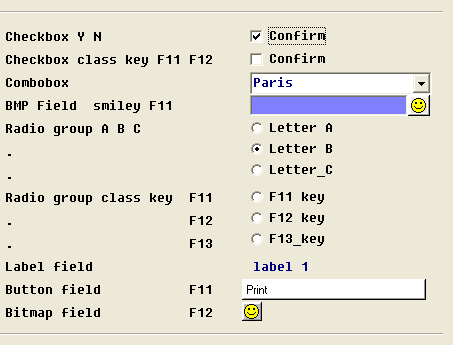
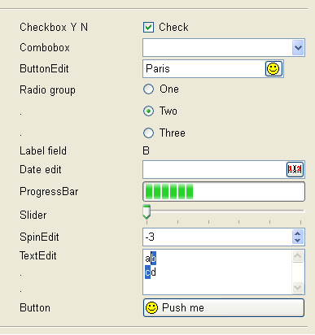

[Back to Contents](../index.html)

------------------------------------------------------------------------

# Migrating from Four Js BDS to Genero

This page describes product changes you must be aware of when migrating
from Four Js BDS 3.xx to the most recent Genero BDL version.

Summary:

1.  [Installation and Setup topics](#install_setup)
    - [License Controller](#license-controller)
    - [Runner linking is no longer needed](#dynamic_fglrun)

    <!-- -->

    - [Localization support in Genero](#localization_support)
    - [Database schema extractor](#fglschema-fgldbsch)

    <!-- -->

    - [C-Code compilation is de-supported](#c-code_compilation)
    - [De-supported environment variables](#env-vars)
    - [De-supported FGLPROFILE entries](#FGLPROFILE_diffs)
2.  [User Interface topics](#ui_issues)
    - [Easy user interface migration with traditional
      mode](#easy_ui_migration)
    - [Front-end compatibility](#FrontEndCompatibility)
    - [FGLGUI is 1 by default](#FGLGUI_default)
    - [FGLPROFILE: GUI configuration](#profdiffs_gui)
    - [Key labels versus Action
      Defaults](#key_labels_vs_action_defaults)

    <!-- -->

    - [Migrating form field widgets](#ff_widgets)

    <!-- -->

    - [SCREEN versus LAYOUT](#SCREEN_vs_LAYOUT)

    <!-- -->

    - [Migrating screen arrays to tables](#arrays_to_tables)

    <!-- -->

    - [Review TUI specifics](#review_tui_specifics)

    <!-- -->

    - [The default SCREEN window](#SCREEN_window)

    <!-- -->

    - [Specifying WINDOW position and size](#window_pos_size)
    - [Front-end configuration tools](#configuration-manager)
    - [Function key mapping](#function-key-mapping)
3.  [4GL Programming topics](#4gl_issues)
    - [FGLPROFILE: VM configuration](#profdiffs_fglrun)
    - [Calling fgl_init4gl() initialization function](#fgl_init4js)
    - [Static versus Dynamic Arrays](#static_vs_dynamic_arrays)

    <!-- -->

    - [Debugger syntax change](#debugger_syntax)
    - [FGL_SYSTEM function](#FGL_SYSTEM)
    - [The Channel:: methods](#Channel::)
    - [SQL Blocks are de-supported](#SQL-Blocks)
    - [STRING versus CHAR/VARCHAR](#STRING_vs_CHAR_VARCHAR)
    - [Review user-made C routines](#user_cext_routines)
    - [Strict variable identification in SQL
      statements](#strict_sql_params)
    - [Default action of WHENEVER ANY ERROR](#WHENEVER_ANY_ERROR)

------------------------------------------------------------------------

## [1. Installation and Setup topics]{#install_setup}

### [1.1. License Controller]{#license-controller}

With Four Js BDS, you must license the product with the **licencef4gl**
command line tool. Starting with Genero, the command line tool to
license the product is **fglWrt**. Run fglWrt with the -h option for the
possible options.

### [1.2. Runner linking is no longer needed]{#dynamic_fglrun}

With Four Js BDS, you need to create the fglrun binary with the fglmkrun
tool, by specifying the type of the database driver and C Extensions
libraries to be linked with the runtime system. Since Genero 2.00,
fglrun dynamically loads both database drivers and C extension libraries
at runtime.

When migrating to Genero BDL, you must review your C Extensions to
provide them as shared libraries. To easy migration, Genero searches
automatically the **userextension** share library (or DLL). See [C
Extensions](CExtensions.html) for more details.

The database drivers are provided as shared libraries ready to use; you
just need to specify the driver to be loaded. See
[Connections](Connections.html) for more details.

### [1.3. Localization support in Genero]{#localization_support}

To support language-specific and country-specific locales as well as
multi-byte character sets like BIG5, Informix 4GL and Four Js use the
Informix GLS library. That solution was straightforward in the context
of an Informix database platform. But if you want to connect with BDS to
an Oracle server, using a BIG5 locale for the BDS application, you need
to install the Oracle DB client to connect to the database, and Informix
DB client to get the GLS library.

Like BDS, Genero supports the Open Database Interface to access other
database servers as Informix. But concerning locale support, Genero does
not use the Informix GLS library any longer, to be independent from
Informix. Genero uses the standard C library locale functions, based on
the POSIX setlocale() implementation provided by the operating system.

While I4GL/BDS need the CLIENT_LOCALE environment variable to define the
locale for the application, you must now use the LANG/LC_ALL environment
variables to specify the locale of the Genero application. Note,
however, that CLIENT_LOCALE is still needed when connecting to an
Informix database.

In Four Js BDS, you could select the locale library with the fglmode
tool, to select either GLS or ASCII mode. This tool is no longer needed
in Genero.

For more details about locale support, see
[Localization](Localization.html).

### [1.4. Database schema extractor]{#fglschema-fgldbsch}

Before compiling .4gl or .per files with Four Js BDS, you need to
extract the database schema with the **fglschema** tool. This will
produce .sch, and optionally, .val and .att files.

Genero also needs the database schema files to compile programs and
forms, but the tool name is now **fgldbsch**. The fglschema tool could
only extract schemas from Informix databases. The new tool can extract
database schemas from Informix, and from other databases like Oracle,
SQL Server, DB2, PostgreSQL, MySQL and Genero db. The fglschema tool is
still supported in Genero for backward compatibility, but fglschema
actually calls fgldbsch. You should use fgldbsch now, with the new
command line options.

Note that Genero allows you to centralize new widget types and
attributes in the .val file.

For more details about fgldbsch, see the [Database
Schema](DatabaseSchema.html) page.

### [1.5. C-Code compilation is de-supported]{#c-code_compilation}

Four Js BDS fglcomp could compile to p-code or c-code. For now Genero
does not support C-Code generation (the P-Code interpreter is fast).

If you experience performance problems when comparing Genero to Four Js
BDS, please contact your local support center.

### [1.6. De-supported environment variables]{#env-vars}

The table below lists the Four Js BDS environment variables which are no
longer supported or replaced by others in Genero:

+-----------------------+-----------------------+-----------------------+
| **Entry**             | **Description of the  | **Genero equivalent** |
|                       | BDS environment       |                       |
|                       | variable**            |                       |
+-----------------------+-----------------------+-----------------------+
| `FGLDBS`              | FGLDBS defines the    | This is not needed    |
|                       | type and version of   | any longer in         |
|                       | the database driver,  | Genero:\              |
|                       | used when linking     | Database drivers are  |
|                       | fglrun with fglmkrun. | loaded dynamically by |
|                       |                       | fglrun.               |
+-----------------------+-----------------------+-----------------------+
| `FGLCC`               | FGLCC defines the     | This is not needed    |
|                       | name of the C         | any longer in         |
|                       | compiler.             | Genero:\              |
|                       |                       | The fglrun tool does  |
|                       |                       | not need to be        |
|                       |                       | created, it\'s fully  |
|                       |                       | dynamic.              |
+-----------------------+-----------------------+                       |
| `FGLLIBSQL`           | FGLLIBSQL defines the |                       |
|                       | list of database      |                       |
|                       | client software       |                       |
|                       | libraries to be used  |                       |
|                       | to link fglrun with   |                       |
|                       | fglmkrun.             |                       |
+-----------------------+-----------------------+                       |
| `FGLLIBSYS`           | FGLLIBSYS defines the |                       |
|                       | list of system        |                       |
|                       | libraries to be used  |                       |
|                       | to link fglrun with   |                       |
|                       | fglmkrun.             |                       |
+-----------------------+-----------------------+-----------------------+
| `FGLSHELL`            | FGLSHELL defined the  | This is not needed    |
|                       | name of the fglrun    | any longer in         |
|                       | program, for example  | Genero:\              |
|                       | when using tools like | The runtime system    |
|                       | fglschema.            | tool is fglrun and    |
|                       |                       | does not need to be   |
|                       |                       | changed.              |
+-----------------------+-----------------------+-----------------------+

### [1.7. De-supported FGLPROFILE entries]{#FGLPROFILE_diffs}

Genero comes with redesigned software components and features,
especially regarding GUI. Thus, some BDS/WTK specific
[FGLPROFILE](FglProfile.html) entries have been de-supported. This
section describes what configurations settings are no longer supported,
and point to Genero equivalent features if they exist.

For more details, see:

- [FGLPROFILE: VM configuration](#profdiffs_fglrun)
- [FGLPROFILE: GUI configuration](#profdiffs_gui)

------------------------------------------------------------------------

## [2. User Interface topics]{#ui_issues}

### [2.1. Easy user interface migration with traditional mode]{#easy_ui_migration}

This topic also concerns Informix 4gl migration, see the [I4GL
Migration](MigI4GL.html#easy_ui_migration) page for mode details.

### [2.2. Front-end compatibility]{#FrontEndCompatibility}

When migrating to Genero BDL, you must use one of the Genero Front Ends;
the **WTK**, **WebFE** and **JavaFE** front-ends are not compatible with
the Genero fglrun runtime system. Note also that the UNIX version of
Genero does not include the **fglX11d** front-end any longer. You must
use the GDC front-end on Unix.

### [2.3. FGLGUI is 1 by default]{#FGLGUI_default}

In Four Js BDS, when the [FGLGUI](EnvironmentVariables.html#EV_FGLGUI)
environment variable is not set, the application starts in
[TUI](FglTerms.html#TEXT_USER_INTERFACE) mode (FGLGUI=0). With Genero,
the default is [GUI](FglTerms.html#GRAPHICAL_USER_INTERFACE) mode
(FGLGUI=1). Therefore, when migrating from Informix 4gl, you should set
FGLGUI=0 to run the application in text mode as a first step.

### [2.4. FGLPROFILE: GUI configuration]{#profdiffs_gui}

The next table shows BDS/WTK FGLPROFILE entries related to GUI
configuration which are de-supported in Genero. See
[FGLPROFILE](FglProfile.html#ENTRYLIST) description page for supported
entries:

+--------------------------------------+------------------------------------+-----------------------------------------------------------+
| **Entry**                            | **Description of the BDS feature** | **Genero equivalent**                                     |
+--------------------------------------+------------------------------------+-----------------------------------------------------------+
| `fglrun.interface`\                  | These entries defined the TCL      | *There is no equivalent in Genero.*                       |
| `fglrun.scriptName`\                 | configuration and script to be     |                                                           |
|                                      | send to the WTK front-end.         |                                                           |
+--------------------------------------+------------------------------------+-----------------------------------------------------------+
| `fglrun.guiProtocol.*`               | These entries could be used to     | In Genero you can control this with [gui.protocol         |
|                                      | configure the communication        | entries](FEProtocol.html).                                |
|                                      | protocol with WTK front-end.       |                                                           |
+--------------------------------------+------------------------------------+-----------------------------------------------------------+
| `fglrun.error.line.number`           | This entry was used to define the  | You can control the aspect of the error line with the     |
|                                      | number of lines to be displayed in | [Window style](PresentationStyles.html#STYATT_WINDOW)     |
|                                      | the error message line.            | attribute called **statusBarType**.                       |
+--------------------------------------+------------------------------------+-----------------------------------------------------------+
| `gui.useOOB.interrupt`\              | These entries could be used to     | Genero supports interruption event handling with a        |
| `fglrun.signalOOB`                   | configure or disable Out Of Band   | predefined action name called **interrupt**. You can bind |
|                                      | signal on the GUI protocol socket  | any sort of action view (button in form, toolbar or       |
|                                      | to avoid problems on platforms not | topmenu item) with this name.\                            |
|                                      | supporting that feature.\          | Interrupt events are sent asynchronously with the new     |
|                                      | OOB signal was used to send        | Genero GUI protocol and don\'t use OOB signals any        |
|                                      | interruption events the program    | longer.\                                                  |
|                                      | executed is processing.            | See [Interaction                                          |
|                                      |                                    | Model](InteractionModel.html#INTERRUPTION) for more       |
|                                      |                                    | details.                                                  |
+--------------------------------------+------------------------------------+                                                           |
| `Sleep.minTime`                      | This entry was used to define the  |                                                           |
|                                      | number of seconds before the       |                                                           |
|                                      | interrupt key button appeared on   |                                                           |
|                                      | the screen window when the program |                                                           |
|                                      | is processing.                     |                                                           |
+--------------------------------------+------------------------------------+                                                           |
| `gui.watch.delay`                    | This entry was used to define the  |                                                           |
|                                      | number of seconds before the mouse |                                                           |
|                                      | cursor displays as a wait cursor,  |                                                           |
|                                      | when the program is processing.    |                                                           |
+--------------------------------------+------------------------------------+-----------------------------------------------------------+
| `gui.bubbleHelp.* `                  | These entries could be used to     | Genero front-ends display bubble-help with field COMMENT  |
|                                      | enable and configure tooltips      | text by default.                                          |
|                                      | displaying field COMMENT text.     |                                                           |
+--------------------------------------+------------------------------------+-----------------------------------------------------------+
| `gui.controlFrame.scroll.* `         | These entries could be used to     | Genero front-ends display control frame scrolling buttons |
|                                      | show and configure a scrollbar in  | by default when needed.\                                  |
|                                      | the control frame displaying ON    | See also [Window                                          |
|                                      | KEY or COMMAND buttons.            | style](PresentationStyles.html#STYATT_WINDOW) attributes  |
|                                      |                                    | like **ringMenuScroll**.                                  |
+--------------------------------------+------------------------------------+-----------------------------------------------------------+
| `screen.scroll `                     | This entry could be used to get    | With Genero, by default, each program window is rendered  |
|                                      | scrollbars in the main window when | as a distinct GUI window by the front-end. Window aspect  |
|                                      | the form was too big for the       | can be controlled with style attributes. See [Window      |
|                                      | screen resolution of the           | style](PresentationStyles.html#STYATT_WINDOW) attributes  |
|                                      | workstation.                       | for more details.                                         |
+--------------------------------------+------------------------------------+-----------------------------------------------------------+
| `gui.screen.size.x`\                 | These entries could be used to     | In Genero, each program window is rendered as a distinct  |
| `gui.screen.size.y`\                 | configure the size and position of | GUI window by the front-end. There is no equivalent for   |
| `gui.screen.x`\                      | the main screen window with the    | these options. However, you can use the [traditional      |
| `gui.screen.y`\                      | WTK front-end.                     | mode](DynamicUI.html#TRADITIONAL_MODE) to render program  |
| `gui.screen.incrx`\                  |                                    | windows in a single parent screen window and with         |
| `gui.screen.incry`\                  |                                    | BDS/WTK.                                                  |
+--------------------------------------+------------------------------------+-----------------------------------------------------------+
| `gui.screen.withvm`\                 | This entry could be used to        | *There is no equivalent in Genero.*                       |
|                                      | integrate with the X11 window      |                                                           |
|                                      | manager (allowing move and resize  |                                                           |
|                                      | actions).                          |                                                           |
+--------------------------------------+------------------------------------+-----------------------------------------------------------+
| `gui.preventClose.message`           | This entry could be used to        | In Genero, each program window is rendered as a distinct  |
|                                      | display an error message to the    | GUI window by the front-end. You can use the **close**    |
|                                      | user attempting to close the main  | action to control window close events.\                   |
|                                      | GUI window with CTRL-F4 or the     | See [Interaction                                          |
|                                      | cross-button on the right of the   | Model](InteractionModel.html#XCROSS_CLOSE) for more       |
|                                      | GUI window title bar.              | details.\                                                 |
|                                      |                                    | See also [ON CLOSE                                        |
|                                      |                                    | APPLICATION](Programs.html#options-on-close-application)  |
|                                      |                                    | program option.                                           |
+--------------------------------------+------------------------------------+-----------------------------------------------------------+
| `gui.key.doubleClick.left`           | This entry could be used to define | You can use the                                           |
|                                      | the key to be returned to the      | [DOUBLECLICK](FSFAttributes.html#FA_DOUBLECLICK)          |
|                                      | program when the user              | attribute to define the action to be fired when the user  |
|                                      | double-clicks on the left button   | double-clicks on a Table container.                       |
|                                      | of the mouse.                      |                                                           |
+--------------------------------------+------------------------------------+-----------------------------------------------------------+
| `gui.key.click.right`                | This entry could be used to define | You can configure contextual menus with the               |
|                                      | the key to be returned to the      | **contextMenu** attribute in [Action                      |
|                                      | program when the user clicks on    | Defaults](ActionDefaults.html).                           |
|                                      | the right button of the mouse.     |                                                           |
+--------------------------------------+------------------------------------+-----------------------------------------------------------+
| `gui.key.add_function`               | Could be used to define the offset | *There is no equivalent in Genero.*                       |
|                                      | to identify SHIFT+Fx keys.         |                                                           |
+--------------------------------------+------------------------------------+-----------------------------------------------------------+
| `gui.key.`*`x`*`.translate`          | These entries could be used to map | *There is no equivalent in Genero.*                       |
|                                      | keys. For example, when the user   |                                                           |
|                                      | pressed Control-U, it could be     |                                                           |
|                                      | mapped to F5 for the program.      |                                                           |
+--------------------------------------+------------------------------------+-----------------------------------------------------------+
| `gui.key.radiocheck.invokeexit`      | Could be used to define the key to | *There is no equivalent in Genero.*                       |
|                                      | select the RADIO or CHECK field    |                                                           |
|                                      | and move to the next field.        |                                                           |
+--------------------------------------+------------------------------------+-----------------------------------------------------------+
| `gui.mswindow.button`                | This entry defined the aspect of   | *There is no equivalent in Genero: Front-ends will use    |
|                                      | buttons on Windows platforms.      | the current platform theme when possible.*                |
+--------------------------------------+------------------------------------+-----------------------------------------------------------+
| `gui.mswindow.scrollbar`             | Could be used to get MS Windows    | *There is no equivalent in Genero: Front-ends will use    |
|                                      | scrollbar style.                   | the current platform theme when possible.*                |
+--------------------------------------+------------------------------------+-----------------------------------------------------------+
| `gui.scrollbar.expandwindow`         | When set to true, the WTK          | *There is no equivalent in Genero.*                       |
|                                      | front-end expanded the window      |                                                           |
|                                      | automatically if scrollbars are    |                                                           |
|                                      | needed in a screen array.          |                                                           |
+--------------------------------------+------------------------------------+-----------------------------------------------------------+
| `gui.fieldButton.style`              | Could be used to define the style  | *There is no equivalent in Genero.*                       |
|                                      | of BMP field buttons.              |                                                           |
+--------------------------------------+------------------------------------+-----------------------------------------------------------+
| `gui.BMPbutton.style`                | Could be used to define the style  | *There is no equivalent in Genero.*                       |
|                                      | of FIELD_BMP field buttons.        |                                                           |
+--------------------------------------+------------------------------------+-----------------------------------------------------------+
| `gui.entry.style`                    | This entry defines the underlying  | *There is no equivalent in Genero.*                       |
|                                      | widgets to be used to manage form  |                                                           |
|                                      | fields.                            |                                                           |
+--------------------------------------+------------------------------------+-----------------------------------------------------------+
| `gui.user.font.choice`               | This entry could be set to true to | Genero front-ends allow the user to change the font.\     |
|                                      | let the end user change the font   | See front-end specific documentation for option           |
|                                      | of the application screen window.  | configuration.                                            |
+--------------------------------------+------------------------------------+-----------------------------------------------------------+
| `gui.interaction.`\                  | This entry could be used to        | Current row highlighting can be controlled in Genero with |
| `  inputarray.usehighlightcolor`     | highlight the current row during   | the [Table style](PresentationStyles.html#STYATT_TABLE)   |
|                                      | an [INPUT ARRAY](InputArray.html). | attribute **highlightCurrentRow**.                        |
+--------------------------------------+------------------------------------+-----------------------------------------------------------+
| `gui.form.foldertab.multiline`\      | These entries could be used to     | Genero supports folder tabs with the                      |
| `gui.folderTab.input.sendNextField`\ | configure folder tabs and define   | [FOLDER](FormSpecFiles.html#FF_CONTAINER_FOLDER)          |
| `gui.folderTab.`*`x`*`.selection`    | the keys to be sent when a page is | container in LAYOUT. An action can be defined for each    |
|                                      | selected by the user.              | folder [PAGE](FormSpecFiles.html#FF_CONTAINER_PAGE).      |
+--------------------------------------+------------------------------------+-----------------------------------------------------------+
| `gui.keyButton.position`\            | These entries could be used to     | Default action views aspect and position can be           |
| `gui.keyButton.style`\               | define the aspect of control frame | controlled with [Action Defaults](ActionDefaults.html)    |
| `gui.button.width`                   | buttons associated to ON KEY       | attributes and with [Window                               |
|                                      | actions in dialogs like            | style](PresentationStyles.html#STYATT_WINDOW) attributes. |
|                                      | [INPUT](RecordInput.html).         |                                                           |
+--------------------------------------+------------------------------------+-----------------------------------------------------------+
| `Menu.style`\                        | These entries could be used to     | Default action views aspect and position can be           |
| `gui.menu.timer`\                    | define the aspect of control frame | controlled with [Action Defaults](ActionDefaults.html)    |
| `gui.menu.horizontal.*`\             | buttons associated to COMMAND      | attributes and with [Window                               |
| `gui.menu.showPagerArrows`\          | \[KEY\] actions in                 | style](PresentationStyles.html#STYATT_WINDOW) attributes. |
| `gui.menuButton.position`\           | [MENU](Menus.html).                |                                                           |
| `gui.menuButton.style`               |                                    |                                                           |
+--------------------------------------+------------------------------------+-----------------------------------------------------------+
| `gui.empty.button.visible`           | This entry could be used to hide   | Default action views aspect can be controlled with        |
|                                      | control frame buttons without      | [Action Defaults](ActionDefaults.html) attributes. Use    |
|                                      | text. By default, the empty        | for example the **defaultView** attribute to display a    |
|                                      | buttons are visible but disabled.  | default button for an action.                             |
+--------------------------------------+------------------------------------+-----------------------------------------------------------+
| `gui.containerType`\                 | These entries could be used to     | To define MDI containers and children in Genero, use the  |
| `gui.containerName`\                 | configure MDI Windows in BDS.      | ui.Interface methods.\                                    |
| `gui.mdi.*`                          |                                    | See [MDI Windows](MDIWindows.html) for more details.      |
+--------------------------------------+------------------------------------+-----------------------------------------------------------+
| `gui.toolBar.*`                      | These entries define the toolbar   | Toolbar definition has been extended in Genero.\          |
|                                      | aspect in BDS.                     | See [ToolBars](Toolbars.html) for more details.           |
+--------------------------------------+------------------------------------+-----------------------------------------------------------+
| `gui.statusBar.*`                    | These entries define the status    | The StatusBars are defined with Window presentation style |
|                                      | aspect in BDS.                     | attributes.\                                              |
|                                      |                                    | See [Presentation                                         |
|                                      |                                    | Styles](PresentationStyles.html#STYATT_WINDOW) for more   |
|                                      |                                    | details.                                                  |
+--------------------------------------+------------------------------------+-----------------------------------------------------------+
| `gui.directory.images`               | This entry defines the path to the | See front-end documentation for image files located on    |
|                                      | directories where images (toolbar  | the workstation. With Genero, image files can be located  |
|                                      | icons) are located, on the         | on the application server and automatically transmitted   |
|                                      | front-end workstation.             | to the front-end according to the                         |
|                                      |                                    | [FGLIMAGEPATH](EnvironmentVariables.html#EV_FGLIMAGEPATH) |
|                                      |                                    | environment variable.                                     |
+--------------------------------------+------------------------------------+-----------------------------------------------------------+
| `gui.display.<`*`source`*`>`         | These entries could be used to     | The rendering of ERROR, MESSAGE or COMMENT can be         |
|                                      | redirect the ERROR / MESSAGE /     | configured with Window style attributes in Genero.        |
|                                      | COMMENT text to a specific place   | However, it is not possible to customize keyboard NumLock |
|                                      | on the GUI screen.                 | / CapsLock status in Genero.\                             |
|                                      |                                    | See [Presentation                                         |
|                                      |                                    | Styles](PresentationStyles.html#STYATT_WINDOW) for more   |
|                                      |                                    | details.                                                  |
+--------------------------------------+------------------------------------+-----------------------------------------------------------+
| `gui.local.edit`\                    | These entry could be used to       | Cut/Copy/Paste are defined as front-end local actions in  |
| `gui.local.edit.error`\              | enable and configure               | Genero. You can bind action views with **editcut**,       |
| `gui.key.cut`\                       | cut/copy/paste local keys in WTK.  | **editcopy**, **editpaste** predefined action names.\     |
| `gui.key.copy`\                      |                                    | See [Interaction                                          |
| `gui.key.paste`                      |                                    | Model](InteractionModel.html#PREDEFACTIONS) for more      |
|                                      |                                    | details.                                                  |
+--------------------------------------+------------------------------------+-----------------------------------------------------------+
| `gui.key.*`                          | These entries were used to map     | Cut/Copy/Paste are defined as front-end local actions in  |
|                                      | physical key to a a virtual key    | Genero. You can bind action views with editcut, editcopy, |
|                                      | used in programs.\                 | editpaste predefined action names.\                       |
|                                      | For example:\                      | See [Interaction                                          |
|                                      | `gui.key.interrupt = "control-c"`\ | Model](InteractionModel.html#PREDEFACTIONS) for more      |
|                                      |                                    | details.                                                  |
+--------------------------------------+------------------------------------+-----------------------------------------------------------+
| `gui.workSpaceFrame.nolist`          | This entry could be used to define | *There is no equivalent in Genero.*                       |
|                                      | the aspect of fixed size screen    |                                                           |
|                                      | arrays in forms, to render each    |                                                           |
|                                      | array cell as an individual edit   |                                                           |
|                                      | field.                             |                                                           |
+--------------------------------------+------------------------------------+-----------------------------------------------------------+

### [2.5. Key labels versus Action Defaults]{#key_labels_vs_action_defaults}

In Four Js BDS, you could define a text for a specific key like
**accept**, **F10** or **Control-Z**. With this feature, it was possible
to easily decorate [ON KEY](RecordInput.html#ON_KEY_block) or [COMMAND
KEY](Menus.html#CMDKEYS) blocks with a button in the control frame.

With Genero, you can now define dialog actions with the [ON ACTION
blocks](InteractionModel.html#CTRLGACTIONS). These action handlers are
more abstract than `ON KEY`: You identify an action by a name, while
decoration is defined in form files ([ACTION DEFAULTS
section](FormSpecFiles.html#SECTION_ACTDEFS)) or in global configuration
files ([.4ad file](ActionDefaults.html)).

When adapting your code for Genero, you are free to use the traditional
`ON KEY` blocks or the new `ON ACTION` blocks. Genero still supports the
[key label settings as in Four Js
BDS](DynamicUI.html#SETTING_KEY_LABELS). Note however that key label
settings will overwrite action defaults settings.

See also [Interaction Model](InteractionModel.html) for more details
about action handlers and action views.

### [2.6. Migrating form field widgets]{#ff_widgets}

To get combo-boxes or check-boxes in Four Js BDS, **.per** forms could
define fields with the [WIDGET attribute](FSFAttributes.html#FA_WIDGET).
To ease migration, the `WIDGET` attribute and the corresponding form
field widgets are still supported in Genero, but these are now
deprecated: You should use new Genero form item types instead.

Screenshot of Four Js BDS-specific widgets:

{border="0" width="454" height="346"}

The following table shows new Genero form item types corresponding to
old BDS WIDGET fields:

  ----------------------- ----------------------- ----------------------------------------------------
  **WIDGET= **            **Description**         **Genero equivalent**

  `WIDGET="Canvas"`       Drawing area for        [CANVAS item
                          fgldraw functions       type](FormSpecFiles.html#FF_ITEMTYPE_CANVAS)

  `WIDGET="BUTTON"`       Text push button firing [BUTTON item
                          key event               type](FormSpecFiles.html#FF_ITEMTYPE_BUTTON)

  `WIDGET="BMP"`          Image push button       [BUTTON item
                          firing key event        type](FormSpecFiles.html#FF_ITEMTYPE_BUTTON)

  `WIDGET="CHECK"`        Checkbox field          [CHECKBOX item
                                                  type](FormSpecFiles.html#FF_ITEMTYPE_CHECKBOX)

  `WIDGET="CHECK"`\       Checkbox field firing   [CHECKBOX item
  `+ CLASS="KEY"`         key event               type](FormSpecFiles.html#FF_ITEMTYPE_CHECKBOX) + [ON
                                                  CHANGE trigger in
                                                  program](RecordInput.html#ON_CHANGE_block)

  `WIDGET="COMBO"`        Combobox field          [COMBOBOX item
                                                  type](FormSpecFiles.html#FF_ITEMTYPE_COMBOBOX)

  `WIDGET="FIELD_BMP"`    Edit field with push    [BUTTONEDIT item
                          button                  type](FormSpecFiles.html#FF_ITEMTYPE_BUTTONEDIT)

  `WIDGET="LABEL"`        Label field (no input)  [LABEL item
                                                  type](FormSpecFiles.html#FF_ITEMTYPE_LABEL)

  `WIDGET="RADIO"`        Radio group field       [RADIOGROUP item
                                                  type](FormSpecFiles.html#FF_ITEMTYPE_RADIOGROUP)

  `WIDGET="RADIO"`\       Radio group field       [RADIOGROUP item
  `+ CLASS="KEY"`         firing key event        type](FormSpecFiles.html#FF_ITEMTYPE_RADIOGROUP) +
                                                  [ON CHANGE trigger in
                                                  program](RecordInput.html#ON_CHANGE_block)
  ----------------------- ----------------------- ----------------------------------------------------

Genero introduced more form item types like
[DATEEDIT](FormSpecFiles.html#FF_ITEMTYPE_DATEEDIT),
[PROGRESSBAR](FormSpecFiles.html#FF_ITEMTYPE_PROGRESSBAR):

{border="0" width="387" height="412"}

For more details, see [form item
types](FormSpecFiles.html#SECTION_ATTRIBUTES).

### [2.7. SCREEN versus LAYOUT]{#SCREEN_vs_LAYOUT}

This topic also concerns Informix 4gl migration, see the [I4GL
Migration](MigI4GL.html#SCREEN_vs_LAYOUT) page for mode details.

### [2.8. Migrating screen arrays to tables]{#arrays_to_tables}

This topic also concerns Informix 4gl migration, see the [I4GL
Migration](MigI4GL.html#arrays_to_tables) page for mode details.

### [2.9. Review TUI specifics]{#review_tui_specifics}

This topic also concerns Informix 4gl migration, see the [I4GL
Migration](MigI4GL.html#review_tui_specifics) page for mode details.

### [2.10. The default SCREEN window]{#SCREEN_window}

This topic also oncerns Informix 4gl migration, see the [I4GL
Migration](MigI4GL.html#SCREEN_window) page for mode details.

### [2.11. Specifying WINDOW position and size]{#window_pos_size}

This topic also concerns Informix 4gl migration, see the [I4GL
Migration](MigI4GL.html#window_pos_size) page for mode details.

### [2.12. Front-end configuration tools]{#configuration-manager}

Four Js BDS provided WTK front-end and X11 front-end specific
configuration tools called \"Configuration Manager\" / confdesi. These
tools could be used to define widget aspect (color, borders, fonts). 

In Genero, the form items can be decorated with [Presentation
Styles](PresentationStyles.html) for all sorts of front-ends. 

### [2.13. Function key mapping]{#function-key-mapping}

With Four Js BDS, when the user pressed a key modifier plus a function
key (like Shift-F4 or Control-F6), the key combination was mapped to a
regular function key F(n+offset), because *Shift* and *Control* key
modifiers are not handled in the 4GL language. The number of function
keys of the keyboard was defined by the gui.key.add_function
[FGLPROFILE](FglProfile.html) entry. For example, when this entry is set
to 12 (the default), a Shift-F4 was received as F16 (4 + 12) in the
program.

This feature and FGLPROFILE entry is still supported by Genero when
using the [traditional mode](DynamicUI.html#TRADITIONAL_MODE).

------------------------------------------------------------------------

## [3. 4GL Programming topics]{#4gl_issues}

### [3.1. FGLPROFILE: VM configuration]{#profdiffs_fglrun}

Genero comes with redesigned software components and features. Some
BDS/WTK specific [FGLPROFILE](FglProfile.html) entries have been
de-supported. This section describes what configurations settings are no
longer supported, and point to Genero equivalent features if they exist.

The following table shows BDS FGLPROFILE entries related to runtime
system configuration which are de-supported in Genero. See the
[FGLPROFILE](FglProfile.html#ENTRYLIST) description page for supported
entries:

  --------------------------------- ----------------------- ------------------------------------
  **Entry**                         **Description of the    **Genero equivalent**
                                    BDS feature**           

  `fglrun.checkDecimalPrecision `   Controls decimal        *There is no equivalent in Genero.\
                                    variable assignment     By default Genero assigns NULL to a
                                    when overflow occurs.   decimal when overflow occurs. Can be
                                    For example, a value of trapped by WHENEVER ANY ERROR.*
                                    1000.0 does not fit in  
                                    a DECIMAL(2,0).\        
                                    Is false by default =   
                                    no overflow error,      
                                    value assigned.         

  `fglrun.ix6 `                     Controls Informix       *There is no equivalent in Genero.\
                                    version 6.x             By default Genero is compatible to
                                    compatibility.\         Informix 4gl 7.32.*
                                    By default BDS is       
                                    compatible with I4GL    
                                    4.x                     

  `fglrun.cmd.winnt`\               Defines the command     With Genero the command program can
  `fglrun.cmd.win95 `               line to be executed for be defined with the
                                    a RUN WITHOUT WAITING   [COMSPEC](Programs.html#RUN)
                                    on Windows platforms.   environment variable.

  `fglrun.database.listvar`\        Was used by Informix    *There is no equivalent in Genero.*
  `fglrun.remote.envvar`            driver to set           
                                    environment variables   
                                    with the ifx_putenv()   
                                    function on Windows     
                                    platforms.              

  `fglrun.setenv.*`\                These entries could be  *There is no equivalent in Genero.*
  `fglrun.defaultenv.*`             used to define          
                                    environment variables   
                                    for all programs.       

  `fgllic.*`                        License controller      With Genero you configure license
                                    related entries         settings with the `flm.*` entries.\
                                                            See license manager documentation
                                                            for more details.

  `fglrun.server.*`                 These entries could be  In Genero this can be configured
                                    used to define X11      with `gui.server.autostart.*`
                                    front-end automatic     entries.\
                                    startup.                See [automatic front-end
                                                            startup](DynamicUI.html#AUTOSTART)
                                                            for more details. 
  --------------------------------- ----------------------- ------------------------------------

### [3.2. Calling fgl_init4gl() initialization function]{#fgl_init4js}

Four Js BDS provided a few utility functions in the libfgl4js.42x
library. This library had to be initialized with a call to
fgl_init4js():

``` linenumber
01 MAIN
02    ...
03   CALL fgl_init4js()
04    ...
05 END MAIN
```

Genero still supports the fgl_init4js() function, but only for backward
compatibility. Calling this function has no effect in Genero.

### [3.3. Static versus Dynamic Arrays]{#static_vs_dynamic_arrays}

This topic also concerns Informix 4gl migration, see the [I4GL
Migration](MigI4GL.html#dynamic_arrays) page for more details.

### [3.4. Debugger syntax changed]{#debugger_syntax}

This topic also concerns Informix 4gl migration, see the [I4GL
Migration](MigI4GL.html#debugger_syntax) page for more details.

### [3.5. FGL_SYSTEM function]{#FGL_SYSTEM}

The [FGL_SYSTEM()](BuiltInFunctions.html#BF_FGL_SYSTEM) function is
still supported, but it does not raise a terminal window on the
front-end as with BDS/WTK. However, some front-ends implement a
workaround for this feature, based on the detection of special strings
displayed to stdout by fglrun. See front-end documentation for more
details.

### [3.6. The Channel:: methods]{#Channel::}

Genero provides file, socket and process I/O with the [Channel built-in
class](ClassChannel.html), while Four Js BDS has the `Channel::`
functions. You must review your code and replace `Channel::` calls with
the new API.

### [3.7. SQL-Blocks are de-supported]{#SQL-Blocks}

This topic also concerns Informix 4gl migration, see the [I4GL
Migration](MigI4GL.html#SQL-Blocks) page for mode details.

### [3.8. STRING versus CHAR/VARCHAR]{#STRING_vs_CHAR_VARCHAR}

This topic also concerns Informix 4gl migration, see the [I4GL
Migration](MigI4GL.html#STRING_vs_CHAR_VARCHAR) page for mode details.

### [3.9. Review user-made C routines]{#user_cext_routines}

This topic also concerns Informix 4gl migration, see the [I4GL
Migration](MigI4GL.html#SQL-Blocks) page for mode details.

### [3.10 Strict variable identification in SQL statements]{#strict_sql_params}

This topic applies also to older Genero versions, see the [Genero 2.20
Migration](Mig0004.html#strict_sql_params) page for more details.

### [3.11 Default action of WHENEVER ANY ERROR]{#WHENEVER_ANY_ERROR}

With older Four Js BDS versions like 2.10, expression evaluation errors
such as a division by zero stop the program with an error message.
Genero behaves like Informix 4gl and recent Four Js BDS versions like
3.55: By default, the WHENEVER ANY ERROR action is to CONTINUE the
program flow. You can change this behavior by setting the next
FGLPROFILE entry to true:

`fglrun.mapAnyErrorToError = true`

See [Exceptions](Exceptions.html) for more details.
