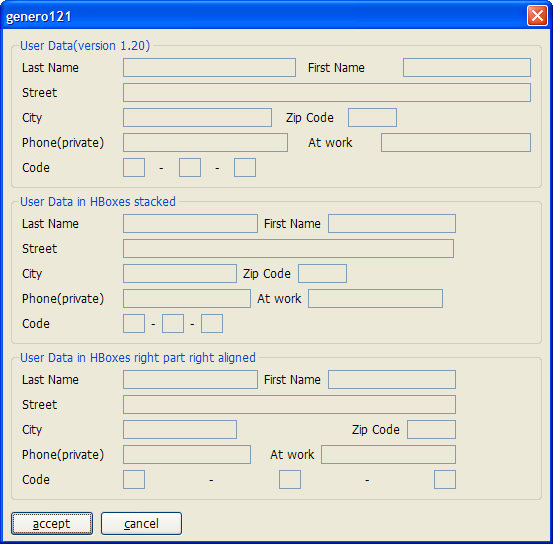
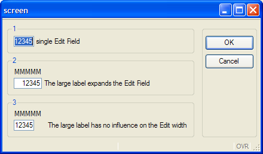
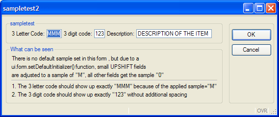
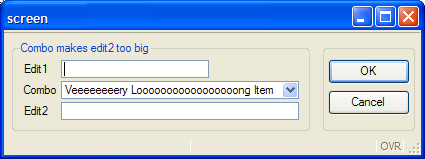
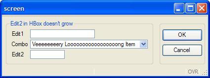
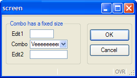
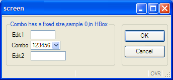

[Back to Contents](../index.html)

------------------------------------------------------------------------

# 1.3x Upgrade Guide

This page describes product changes you must be aware of when upgrading
from version **1.2x** to version **1.3x** of Genero BDL.

**Warning: This is an incremental upgrade guide that covers only topics
related to a specific version of Genero. Also check prior upgrade guides
if you migrate from an earlier version.**

Summary:

1.  [Front-end compatibility](#FrontEndCompatibility)
2.  [Action and Field activation](#ActionAndFieldActivation)
3.  [HBox Tags](#HBoxTags)
    - [HBox Tags limitations](#HBoxLimit)
4.  [Elements inside HBoxes get their real sizes](#RealSize)
5.  [Width of ButtonEdit/DateEdit/ComboBox](#Button)
6.  [Default Sample](#sample)
7.  [SizePolicy for ComboBoxes](#SizePolicy)
8.  [Action Defaults at Form level](#ActionDefaults)
9.  [MySQL 3.23 is desupported](#DesupMySQL323)

------------------------------------------------------------------------

## [1. Front-end compatibility]{#FrontEndCompatibility}

When migrating to a **1.3x** runtime system, you need to upgrade all
front-end clients to any **1.3x** version. Front-end clients and runtime
systems are compatible if the major version number and the first minor
number are the same (**X.Y?**). A front-end of version **1.31** works
with a **1.30** runtime system, but if you try to use a **1.20** client
with a **1.30** runtime system, you will get an error message.

------------------------------------------------------------------------

## [2. Action and Field activation]{#ActionAndFieldActivation}

Version **1.30** provides dialog methods to control action and field
activation:

[ui.Dialog.setActionActive( *action-name*, TRUE/FALSE
)](ClassDialog.html#setActionActive)\
[ui.Dialog.setFieldActive( *field-name*, TRUE/FALSE
)](ClassDialog.html#setFieldActive)

Previous versions allowed to modify directly the \'active\' attribute of
the underlying DOM node in the AUI tree; This is now forbidden: It is
mandatory to use the above methods to enable/disable action or fields.
The dialog will synchronize the \'active\' attribute in the AUI tree
according to the value passed to the methods and according to the
context (some actions or fields can be automatically disabled). 

------------------------------------------------------------------------

## [3. HBox tags]{#HBoxTags}

HBox Tags allow you to stack form items horizontally without being
influenced by elements above or below. In an HBox there is a free mix of
Form Fields, labels, and Spacer Items possible.

A typical usage of an HBox Tag is to have zip-code/city form fields side
by side with predictable spacing in-between.

The \"classic\" layout would look like the following form definition:

` <G "User Data(version 1.20)"                                      >`\
` Last Name     [l_name           ]First Name[f_name          ]`\
` Street        [street                                       ]`\
` City          [city          ]Zip Code[zip  ]`\
` Phone(private)[phone           ] At work [                  ]`\
` Code          [aa]-[ab]-[ac]`

In [the screenshot](#Picture1) you will notice that the distance between
\"`l_name`\" and \"`First Name`\" is smaller than between
\"`First Name`\" and \"`f_name`\". How can this be? Two lines below
there is the \"zip\" field which affects this distance.

If we put HBox Tags around the fields we want to group horizontally
together, we get the predictable spacing between \"`l_name`\",
\"`First Name`\" and \"`f_name`\".

` <G "User Data in HBoxes stacked"                                  >`\
`Last Name     [l_nameh          :"First Name":f_nameh         ]`\
`Street        [streeth                                       :]`\
`City          [cityh         :"Zip Code":ziph :               ]`\
`Phone(private)[phoneh          :"At work":phonewh           : ]`\
`Code          [ba:"-":bb:"-":bc:                              ] `

Here \"`l_nameh`\",\"`First Name`\" and \"`f_nameh`\" are together in
one HBox; the \"`:`\" colon acts as a separator between the 3 elements.

The width of an element is calculated from the space between \"`[`\"
and  \"`:"` (width of `cityh` is 14), or from the space between \"`:`\"
and \"`:`\" (width of \"`bb`\" is 2), or from the space between \"`:`\"
and \"`]`\" (width of \"`f_nameh`\" is 16). The \"`zip`\" field in the
version 1.20 example has a width of five and the \"`ziph`\" field has
also a width of five.

In the second Groupbox in [the screenshot](#Picture1) you will notice
that the HBox is smaller than the first one, even though it uses two
characters more in the screen definition. The reason is that each HBox
occupies only ONE cell in the parent grid, and the content in one HBox
is independent of the content in another HBox. This relaxes the parent
grid; it has to align only the edges of the HBoxes and the labels left
of the HBoxes. The two extra characters in the Form file for the second
Group come from the fact that the labels need quoting to distinguish
them from field definitions. Of course, you could use a Label field if
the two extra characters are unwanted (which is done in the third
Groupbox).

The third Groupbox shows how the alignment in an HBox can be affected by
putting empty elements (`:  :)` inside the HBox Tag:

` <G "User Data in HBoxes right part right aligned"                 >`\
`Last Name     [l_nameh2         : :lfirsth2:f_nameh2        ]`\
`Street        [streeth2                                     ]`\
`City          [cityh2        :                   :lzip:ziph2]`\
`Phone(private)[phoneh2         :     :latw:phonewh2         ]`\
`Code          [ca:   "-"        :cb:       "-"           :cc] `

Between \"`l_nameh2`\" and \"`lfirsth2`\" there are two \"`:`\" signs
with a white space between them. This means: put a Spacer Item between
`l_nameh2` and `lfirsth2`, which gets all the additional space if the
HBox is bigger than the sum of  `l_nameh2`, `lfirsth2` and `f_nameh2`.
The number of spaces, however, has no effect. The spacer item between
` cityh2` and ` lzip` has the same force as the spacer between
` l_nameh2` and `lfirsth2`.

You can treat a spacer item like a spring. The spacer item between
` cityh2` and ` lzip` presses ` cityh2` to the left-hand side, and the
rest of the fields to the right-hand side. In the \"`Code`\" line there
is more than one spacer item; they share the additional space among
them. (The \"`Code`\" HBox sample in the third line is only to show how
spacer items work; we always advise using \"`Code`\" as in the second
Groupbox, or to use a picture)

In general we advise using the approach shown in the second Groupbox:
stack the items horizontally by replacing field ends with \"`:`\". This
is the easy way to remove unwanted horizontal spacing.

The resulting screenshot:

[{border="0" width="553"
height="544"}]{#Picture1}

### [HBox Tags limitations]{#HBoxLimit}

- HBox Tags don\'t work for fields of Screen Arrays or Tables; you will
  get a form compiler error. The reason is that the current AUI
  structure does not allow this. The front end needs a ` Matrix` element
  directly in a ` Grid` or a ` ScrollGrid` to perform the necessary
  positioning calculations for the individual fields.

------------------------------------------------------------------------

## [4. Elements inside HBoxes get their real sizes]{#RealSize}

A big advantage in using elements in an HBox is that the fields get
their real sizes according to the .per definition.

` LAYOUT`\
`GRID`\
`{`\
`<G g1 >`\
`[a    ] single Edit Field`\
\
`<G g2 >`\
` MMMMM`\
`[b    ] The large label expands the Edit Field`\
\
`<G g3 >`\
` MMMMM`\
`[c   :]The large label has no influence on the Edit width `\
\
`}`\
`END`\
`END`\
`ATTRIBUTES`\
`EDIT a = formonly.a, sample="0", default="12345";`\
`EDIT b = formonly.b, sample="0", default="12345";`\
`EDIT c = formonly.c, sample="0", default="12345";`\
`END`

In the second Groupbox, the edit field is expanded to be as large as the
label above; using an HBox prevents this:

{border="0" width="433" height="257"}

Note: in this example, we use a sample of \"0\" to display *exactly*
five numbers.

------------------------------------------------------------------------

## [5. Width of ButtonEdit/DateEdit/ComboBox]{#Button}

The problem with BUTTONEDIT, DATEEDIT and COMBOBOX in previous versions
is that a field `[b  ]` got the width 3, the same width as an edit field
with the same layout.

For example:

`LAYOUT`\
`GRID`\
`{`\
`  [e  ]`\
`  [b  ]`\
`}`\
`END`\
`END`\
`ATTRIBUTES`\
`EDIT e=formonly.e;`\
`BUTTONEDIT b=formonly.b;`\
`END`

In this example, the outer (visual) width of both elements was the same,
but the edit portion of \"`b`\" was much smaller, because the button did
not count at all. (In practice this meant that on average only one and a
half characters of \"`b`\" was visible). However, you could input 3
characters! This made a `BUTTONEDIT` where you could see only one
character and input only one character without tricks impossible.

Now, for the Button,  the Form Compiler subtracts two character
positions from the width of `BUTTONEDIT`/`COMBOBOX`/`DATEEDIT`. This is
possible because now the form compiler differentiates the width of the
widget from the width of the entry part.

In fact, there is no *visual* difference between version 1.20 and 1.30
regarding this example, but in version 1.30 you can only enter one
character, which is visually more correct.

In the example the ` BUTTONEDIT` aligns with the Edit; that\'s why the
Edit part of the ` BUTTONEDIT` is usually still a bit bigger than one
character (this depends on the button size, but if a button edit is
contained by an HBox, it will get the exact size of \"width\" multiplied
by the [average character pixel width](#sample). 

To express  the `BUTTONEDIT`/`COMBOBOX`/`DATEEDIT` layout more
visually, it is possible to specify:

`   [e  ]`\
`  [b- ] `

the \"`-`\" sign marks the end of the edit portion and the beginning of
the button portion ( edit width =\"1\", widget width =\"3\" ).

The two characters are also subtracted for a `BUTTONEDIT` which is child
of an HBox.

`   [b  :]`

gets also width=\"1\" , but no widget width, because the HBox stacks the
elements horizontally without needing widget width definition. 

The two extra characters are only used to show the real size relations
more WYSIWYG, and to have the same calculation as in a field without an
HBox parent.

`   [e1:e2:e3:     ]`\
`  [b1  :b2  :b3  ]`

shows that three `BUTTONEDIT` fields are much larger than three `EDIT`
fields with the same width.

You can even write:

`   [e1:e2:e3:     ]`\
`  [b1- :b2- :b3- ]`

or: 

`  [e1:e2:e3:  ]`\
`  [b1-:b2-:b3-] `

to use slim buttons and

`   [e1:e2:e3:        ]`\
`  [b1-  :b2-  :b3-  ]`

if one uses large buttons to get the maximum WYSIWYG effect.

Please note that buttons do not grow if two characters \"`- ` \" is
expanded to three characters \"`-  `\"; the button always computes its
size from the image used, it\'s just to reserve more space in the form
to match the real size.

------------------------------------------------------------------------

## [6. Default Sample]{#sample}

If no [SAMPLE](FSFAttributes.html#FA_SAMPLE) attribute is specified in
the form files, the client uses an algorithm to compute the field width.
In this case, a very pessimistic algorithm is used to compute the field
widths: The client assumes a default
[SAMPLE](FSFAttributes.html#FA_SAMPLE) of \"M\" for the first six
characters and then \"0\" for the subsequent characters and applies this
algorithm to all fields, except some field types like `DATEEDIT` fields.

The default algorithm tends to produce larger forms compared to forms
used in BDL V3 and very first versions of Genero. Do not hesitate to
modify the [SAMPLE](FSFAttributes.html#FA_SAMPLE) attribute in the form
file, to make your fields shorter.

If you do not want to touch all your forms, a more tailored automatic
solution would be to specify a ui.form.setDefaultInitiallizer()
function, to set the [SAMPLE](FSFAttributes.html#FA_SAMPLE) depending on
the AUI tag. In the following example small ` UPSHIFT` fields get a
[sample](FSFAttributes.html#FA_SAMPLE) of \"M\"; all other fields get a
sample of  \"0\". This will preserve the original width for ` UPSHIFT`
fields, however numeric and normal String fields will get the sample of 
\"0\" and make the overall width of the form smaller.

Program:

`# this demo program shows how to affect the "sample" attribute in a`\
`# ui.form.setDefaultInitializer function`\
`# the main concern is to set a default sample of "0" and to`\
`# correct the sample attribute for small UPSHIFT fields to "M"`\
`# to be able to display full uppercase letter for fields with a small width`\
\
`MAIN`\
`  DEFINE three_char_upshift CHAR(3)`\
`  DEFINE three_digit_number Integer`\
`  DEFINE longstring CHAR(100)`\
`  CALL ui.form.setDefaultInitializer("myinit")`\
`  OPEN form f from "sampletest2"`\
`  DISPLAY form f`\
`  INPUT BY NAME three_char_upshift,three_digit_number,longstring`\
`END MAIN`\
\
`FUNCTION myInit(f)`\
`  DEFINE f ui.Form`\
`  CALL checkSampleRecursive(f.getNode())`\
`END FUNCTION`\
\
`FUNCTION checkSampleRecursive(node)`\
`  DEFINE node,child om.DomNode`\
`  LET child= node.getFirstChild()`\
`  WHILE child IS NOT NULL`\
`    CALL checkSampleRecursive(child)`\
`    CALL setSample(child)`\
`    LET child=child.getNext()`\
`  END WHILE`\
`END FUNCTION`\
\
`FUNCTION setSample(node)`\
`  DEFINE node,parent om.DomNode`\
`  LET parent=node.getParent()`\
`  -- only set the "sample" for FormFields in this example`\
`  IF parent.getTagName()<>"FormField" THEN`\
`    RETURN`\
`  END IF`\
`  IF node.getAttribute("shift")="up" AND node.getAttribute("width")<=6 THEN`\
`    CALL node.setAttribute("sample","M")`\
`  ELSE`\
`    CALL node.setAttribute("sample","0")`\
`  END IF`\
`  DISPLAY "set sample attribute of ",node.getId()," to \"",node.getAttribute("sample"),"\""`\
`END FUNCTION`

Form File:

` LAYOUT(text="sampletest2")`\
`GRID`\
`{`\
` <G sampletest                                                                       >`\
`  3 Letter Code: [a ] 3 digit code:[b ] Description:[longstring ]`\
\
` <G "What can be seen"                                                               >`\
`  There is no default sample set in this form, but due to a`\
`  ui.form.setDefaultInitializer function, small UPSHIFT fields`\
`  are adjusted to a sample of "M", all other fields get the sample "0"`\
`  -----------------------------------------------------------------------------------`\
`  1. The 3 letter code should show up exactly "MMM" because of the applied sample="M"`\
`  2. The 3 letter digit code should show up exactly "123" without additional  spacing`\
`}`\
`END`\
`END`\
`ATTRIBUTES`\
`EDIT a=formonly.three_char_upshift,UPSHIFT,default="MMM";`\
`EDIT b=formonly.three_digit_number,default="123";`\
`EDIT longstring=formonly.longstring,UPSHIFT,default="DESCRIPTION OF THE ITEM",SCROLL;`\
`END`

{border="0" width="569" height="240"}

*Please refer to the* [*SAMPLE*](FSFAttributes.html#FA_SAMPLE)
*documentation for more information.*

------------------------------------------------------------------------

## [7. Size Policy for comboboxes]{#SizePolicy}

`COMBOBOX` items were VERY special in previous versions because they
adapted their size to the maximum item of the value list. On one hand,
this is very convenient because the programmer doesn\'t have to find the
biggest string in the value list, and to estimate how large it will be
on the screen (with proportional fonts the string with the highest
number of  characters is not automatically the largest string). On the
other hand, this behavior often led to an unpredictable layout if the
programmer didn\'t reserve enough space for the `COMBOBOX`.

The [SIZEPOLICY](FSFAttributes.html#FA_SIZEPOLICY) attribute gives
better control of the result.

`<G "Combo makes edit2 too big" >`\
` [edit1]`\
` [combo   ]`\
` [edit2   ]`\
`...`\
`ATTRIBUTES`\
`EDIT edit1=formonly.edit1;`\
`COMBOBOX combo=formonly.combo,`\
`   ITEMS=((0,"Veeeeeeeery Loooooooooooooooong Item"),(1,"hallo")),`\
`   DEFAULT=0;`\
`EDIT edit2=formonly.edit2;`\
`END`

{border="0" width="425" height="159"}

In this case, the \"`combo"` field gets very large as does \"`edit2`\",
because it ends  in the same grid column. It will confuse the end user
if he can input only eight characters and the field is apparently much
bigger. Two possibilities exist to surround this:

Use an HBox to prevent the `edit2` from growing, and use HBoxes for all
fields which start together with `combo` and are as large or bigger than
`combo`

` <G "Edit2 in HBox doesn't grow" >`\
`[edit1]`\
`[combo   :]`\
`[edit2   :]`\
`...`

{border="0" width="425" height="159"}

Use the new [SIZEPOLICY](FSFAttributes.html#FA_SIZEPOLICY) attribute,
and set it to `fixed` to prevent `combo` from getting bigger than the
initial six characters (6+Button)

` <G "Combo has a fixed size" >`\
`...`\
`[combo   ]`\
`[edit2   ]`\
`...`\
`ATTRIBUTES`\
`...`\
`COMBOBOX combo=formonly.combo,`\
`   ITEMS = ((0,"Veeeeeeeery Looooooooooooooooong Item"),(1,"hallo")),`\
`   DEFAULT=0, SIZEPOLOCY=FIXED ;`\
`....`

{border="0" width="280" height="159"}

Note that in this example the `edit2` dictates the maximum size of
`combo`, because even if the SIZEPOLICY is *fixed*, the elements are
aligned by the Grid.

To prevent this and  have *exactly* six characters (numbers) in the
ComboBox, you need to decouple `combo` from `edit2 `by using an HBox.

` <G "Combo has a fixed size,sample 0,in HBox" >`\
`...`\
`Combo [combo   :]`\
`Edit2 [edit2   :]`\
`...`\
`COMBOBOX combo=formonly.combo,`\
`   ITEMS = ((0,"12345678 Looooooooooooooooong Item"),(1,"hallo")),`\
`   DEFAULT=0, SIZEPOLICY=FIXED, SAMPLE="0";`

{border="0" width="344" height="159"}

Now the wanted six numbers are displayed and `combo` does not grow to
the size of `edit2`.

*Please refer to the [SIZEPOLICY](FSFAttributes.html#FA_SIZEPOLICY)
documentation for more information.*

------------------------------------------------------------------------

## [8. Action Defaults at Form level]{#ActionDefaults}

It is now possible to define [action defaults](ActionDefaults.html) in
forms. In previous versions you had to define a global action default
file; this works for defining common global action attributes, but there
is a need to define specific action attributes in some forms. A typical
zoom window may have search and navigation actions, while data input
windows need to define add/delete/update actions instead.

It is now possible to define an [action default section in the form
file](FormSpecFiles.html#SECTION_ACTDEFS), and you can also load action
defaults with [ui.Form.loadActionDefaults()](ClassForm.html).

#### Tips:

1.  Use the preprocessor to include action default sections in your
    forms.

------------------------------------------------------------------------

## [9. MySQL 3.23 is de-supported]{#DesupMySQL323}

Version **1.32** supports **MySQL 3.23.x**, but there is no support for
recent MySQL versions.

Version **1.33** now de-supports MySQL **3.23.x**, but supports **MySQL
4.1.2** and higher (**5.0**).

For technical reasons, MySQL **4.0.x** cannot be supported.
