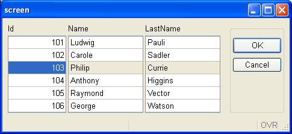
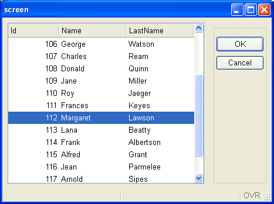

[Back to Contents](../index.html)

------------------------------------------------------------------------

# Migrating from IBM Informix 4gl to Genero

This page describes product differences you must be aware of when
migrating from IBM Informix 4gl to the most recent Genero BDL version.

Summary:

- [1. Introduction to I4GL migration issues](#intro)
  - [1.1. Why are IBM I4GL and Genero products different?](#why_diffs)
  - [1.2. IBM Informix 4gl reference version](#i4gl_ref)
- [2. Installation and Setup topics](#install_setup)
  - [2.1. Using C Extensions](#c_extensions)

  <!-- -->

  - [2.2. Localization support in Genero](#localization_support)
  - [2.3. Database schema extractor](#fglschema-fgldbsch)
  - [2.4. Compiling 4GL to C](#4GL_to_C)
- [3. User Interface topics](#ui_issues)
  - [3.1. Easy user interface migration with traditional
    mode](#easy_ui_migration)

  <!-- -->

  - [3.2. SCREEN versus LAYOUT](#SCREEN_vs_LAYOUT)

  <!-- -->

  - [3.3. Migrating screen arrays to tables](#arrays_to_tables)

  <!-- -->

  - [3.4. Review TUI specifics](#review_tui_specifics)

  <!-- -->

  - [3.5. The default SCREEN window](#SCREEN_window)

  <!-- -->

  - [3.6. Specifying WINDOW position and size](#window_pos_size)
- [4. 4GL Programming topics](#4gl_issues)
  - [4.1. Dynamic Arrays](#dynamic_arrays)

  <!-- -->

  - [4.2. Debugger command syntax](#debugger_syntax)
  - [4.3. SQL Blocks are not supported](#SQL-Blocks)
  - [4.4. Unmatching global variable definitions](#unmatching_globals)
  - [4.5. Strict function signature checking](#strict_func_check)
  - [4.6. STRING versus CHAR/VARCHAR](#STRING_vs_CHAR_VARCHAR)
  - [4.7. Review user-created C routines](#user_cext_routines)
  - [4.8. Web Services support](#web_services)
  - [4.9. File I/O statements and APIs](#file_io)

------------------------------------------------------------------------

## [1. Introduction to I4GL migration issues]{#intro}

### [1.1. Why are IBM I4GL and Genero products different?]{#why_diffs}

IBM Informix 4gl (aka I4GL) and Genero BDL are distinct developments
tools designed and implemented by different companies. The purpose of
Genero BDL is to be as compatible as possible with I4GL, and it is very
close. The success of Genero BDL depends on the ability to compile and
run legacy 4gl code with minimum code changes. For text-mode
applications, the migration steps are often reduced to
recompile-and-run. 

However, Genero BDL extends the I4GL language with advanced features
such as a Graphical User Interface and SQL access to non-Informix
databases. This leads to some differences that you have to deal with,
but these incompatibilities are minor compared to the added value of
these extensions.

In some rare cases, the Genero BDL team decided to take a different path
to implement an I4GL feature, because we considered that the IBM
Informix 4gl solution was not adapted. For example, the [dynamic arrays
in I4GL and Genero BDL have different semantics](#dynamic_arrays). 

This guide will help you identify the differences and find solutions to
make the migration from IBM Informix 4gl easier.

### [1.2. IBM Informix 4gl reference version ]{#i4gl_ref}

The history of the IBM Informix 4gl language is very long. It started in
the mid-80s with I4GL version 4.x; then came version 6.x in 1996. I4GL
version 7.2 was released in 1998; then came 7.31, 7.32, and finally the
latest version: 7.50. There have been several bug fixes and enhancements
over the life of I4GL, resulting in releases that slightly differ.
Supporting strict compatibility with all versions of I4GL is not
possible for Genero BDL; we have to rely on a specific version of I4GL.

Therefore, the Genero BDL compatibility level with IBM Informix 4gl is
achieved by comparing with the latest version of I4GL, which is version
**7.50** at the time of this writing.

------------------------------------------------------------------------

## [2. Installation and Setup topics]{#install_setup}

### [2.1. Using C extensions]{#c_extensions}

With IBM Informix 4gl, you can extend the **fglgo** runtime executable
or link your binary programs with **c4gl** by adding your own C
functions.

When migrating to Genero, you must review your C Extensions in order to
provide them as shared libraries. To simplify migration, Genero searches
the **userextension** shared library (or DLL) automatically.

If you have C extensions as  ESQL/C modules (**.ec**) executing SQL
instructions, Genero provides the FESQLC compiler to compile the .ec
sources, which can then be linked with the Genero BDL runtime library to
build a C extension library.

See [C Extensions](CExtensions.html) and ask your support to see how to
get the FESQLC compiler, this tool is distributed as a separate product.

### [2.2. Localization support in Genero]{#localization_support}

To support language-specific and country-specific locales, as well as
multi-byte character sets like BIG5, IBM Informix 4gl uses the Informix
GLS library.

For locale support, Genero BDL does not use the Informix GLS library, in
order to be independent from Informix; Genero uses the standard C
library locale functions, based on the POSIX setlocale() implementation
provided by the operating system.

I4GL uses the CLIENT_LOCALE environment variable to define the locale
for the application. With Genero, you must use the LANG/LC_ALL
environment variables to specify the locale of the application. Note,
however, that CLIENT_LOCALE is still needed to define the locale for the
IBM Informix database client.

For more details about locale support, see
[Localization](Localization.html).

### [2.3. Database schema extractor]{#fglschema-fgldbsch}

Before compiling .4gl or .per files with Genero BDL, you must extract
the database schema with the **fgldbsch** tool. This will produce an
.sch file, and optionally, .val and .att files. The fgldbsch tool can
extract database schemas from Informix, and from other databases like
Oracle, SQL Server, DB2, PostgreSQL, MySQL and Genero db.

For more details about fgldbsch, see the [Database
Schema](DatabaseSchema.html) page.

### [2.4. Compiling 4GL to C]{#4GL_to_C}

The IBM Informix 4gl compilers include a pseudo-code based runtime
system called RDS as well as a C-compiled solution, the c4gl compiler.
The RDS solution is typically used in a development environment,
supporting a debugger, while the Informix 4gl C compiler is
traditionally used to maximize performance on production sites. However,
the C compiled binaries need to be built on the same target platform as
the production system.

Unlike IBM Informix 4gl, Genero supports only a pseudo-code solution,
which is as fast as the C-compiled version of IBM Informix 4gl. Since
p-code files are portable, you can develop your application on a
platform that is different from the production platform, saving porting
procedures and simplifying deployment tasks.

Note however that Genero supports [C extensions](#c_extensions).

------------------------------------------------------------------------

## [3. User Interface topics]{#ui_issues}

### [3.1. Easy user interface migration with traditional mode]{#easy_ui_migration}

IBM Informix 4gl and Genero BDL handle windows and form content
rendering differently. I4GL is [TUI](FglTerms.html#TEXT_USER_INTERFACE)
centric, while Genero is closer to real GUI rendering, using resizable
windows and proportional fonts. To simplify migration from TUI-style
products, Genero supportes the [Traditional GUI
mode](DynamicUI.html#TRADITIONAL_MODE).

### [3.2. SCREEN versus LAYOUT]{#SCREEN_vs_LAYOUT}

To design a form with IBM Informix 4gl, you organize labels and fields
in the `SCREEN` section of a **.per** [Form Specification
File](FormSpecFiles.html). Genero introduced a new
[LAYOUT](FormSpecFiles.html#SECTION_LAYOUT) section to place form
elements. The new `LAYOUT` section allows more sophisticated form design
than `SCREEN`, having parent/child containers, layout tags, and new
widgets.

When writing new programs for
[GUI](FglTerms.html#GRAPHICAL_USER_INTERFACE) applications, you should
use a `LAYOUT` section instead of `SCREEN`. However, the `SCREEN`
section is not de-supported in Genero; it must be used to design
[TUI](FglTerms.html#TEXT_USER_INTERFACE) mode forms.

The next picture shows a form using a `SCREEN` section in TUI mode:

{border="0" width="572" height="337"}

and here is a form using a `LAYOUT` section in GUI mode:

{border="0" width="653" height="494"}

### [3.3. Migrating screen arrays to tables]{#arrays_to_tables}

With IBM Informix 4gl, if you want to display a list of records on the
screen, you must use a static screen array with a finite number of lines
in the `SCREEN` section of the form specification file:

``` linenumber
01 DATABASE stores
02 SCREEN
03 {
04  Id       First name   Last name
05 [f001    |f002        |f003        ]
06 [f001    |f002        |f003        ]
07 [f001    |f002        |f003        ]
08 [f001    |f002        |f003        ]
09 [f001    |f002        |f003        ]
10 [f001    |f002        |f003        ]
11 }
12 END
13 TABLES
14   customer
15 END
16 ATTRIBUTES
17   f001 = customer.customer_num ;
18   f002 = customer.fname ;
19   f003 = customer.lname ;
20 END
21 INSTRUCTIONS
22   SCREEN RECORD sr_cust[6]( customer.* );
23 END
```

The display of the above form specification file looks like this in GUI
mode:

{border="0" width="485" height="222"}

With Genero, you can still use a static screen array for applications
displayed in dumb terminals, but for new GUI applications you should use
the new [TABLE container](FormSpecFiles.html#FF_CONTAINER_TABLE) or a
[Table layout tag](FormSpecFiles.html#FF_LAYOUT_TAG) in a `GRID`
(modified lines are underlined):

``` linenumber
01 DATABASE stores
02 LAYOUT
03 TABLE
04 {
05  Id       First name   Last name
06 [f001    |f002        |f003        ]
07 [f001    |f002        |f003        ]
08 [f001    |f002        |f003        ]
09 [f001    |f002        |f003        ]
10 [f001    |f002        |f003        ]
11 [f001    |f002        |f003        ]
12 }
13 END
14 END
15 TABLES
16   customer
17 END
18 ATTRIBUTES
19   f001 = customer.customer_num ;
20   f002 = customer.fname ;
21   f003 = customer.lname ;
22 END
23 INSTRUCTIONS
24   SCREEN RECORD sr_cust( customer.* );
25 END
```

The display of the above form specification file is a real table widget,
which is resizable. Note that the .4gl source is untouched:

{border="0" width="467" height="349"}

 

Further, Genero also supports [SCROLLGRID
containers](FormSpecFiles.html#FF_CONTAINER_SCROLLGRID), to display a
record list where each record is displayed in a static sub-section of
the form.

### [3.4. Review TUI specifics]{#review_tui_specifics}

Many IBM Informix 4gl programmers are accustomed to the
[TUI](FglTerms.html#TEXT_USER_INTERFACE) mode and often exploit all the
display possibilities of these products. Some language instructions are
specific to character terminals and should be reviewed when migrating to
Genero BDL.

For example, you can display data records in a screen array with a
`DISPLAY `*`array`*`[`*`array-index`*`].* TO `*`screen-array`*`[`*`screen-line`*`]`
instruction, optionally with the `ATTRIBUTE` clause to use some TTY
attributes like colors, `REVERSE`, `BOLD`. When scrolling a list, I4GL
actually uses the terminal scrolling capabilities to preserve the TTY
attributes in each row. This applies only to the current rows visible on
the screen, but it was a commonly used feature. 

Because Genero BDL implements a new technique to handle user interface
elements [generically and dynamically](DynamicUI.html) for different
types of front-ends, there are some TUI specifics which can\'t be
supported any longer. The example above,  with TTY attributes and screen
array scrolling, can\'t be supported by Genero BDL. A good replacement
for `DISPLAY ... TO ... ATTRIBUTE()` in `DISPLAY ARRAY` or `INPUT ARRAY`
is to use the new
[DIALOG.setArrayAttributes()](ClassDialog.html#setArrayAttributes)
method.

Genero BDL still supports TUI-specific instructions like [DISPLAY
AT](WindowsAndForms.html#DISPLAY_AT), [CLEAR
SCREEN](WindowsAndForms.html#CLEAR_SCREEN), [CLEAR
WINDOW](WindowsAndForms.html#CLEAR_WINDOW) as well as [TTY
attributes](WindowsAndForms.html#ATTRIBUTES). But you should use those
instructions for TUI programs only. New GUI programs should use new
Genero user interface possibilities. For example, a good replacement for
TTY attributes is to use [Presentation Styles](PresentationStyles.html).

In this documentation, language elements specific to TUI (Text User
Interface) mode are marked **TUI Only!**

### [3.5. The default SCREEN window]{#SCREEN_window}

When the first interactive instruction is reached in a Genero BDL
program, a default window named `SCREEN `is created.

You are free to use the default `SCREEN` window and open one or more
successive forms in this window; it can also be closed, with the
`CLOSE WINDOW SCREEN` instruction. If you don\'t close the default
`SCREEN` window, and you open a new window with the `OPEN WINDOW`
command, an empty default `SCREEN` window will be displayed.

When writing a [GUI](FglTerms.html#GRAPHICAL_USER_INTERFACE) application
with Genero, you typically open the main form in the `SCREEN` window,
and display other forms with the [OPEN WINDOW name WITH
FORM](WindowsAndForms.html#WITHFORM) instruction: 

``` linenumber
01 MAIN
02   DEFER INTERRUPT
03   OPTIONS INPUT WRAP
04    ...
05   OPEN FORM f_main FROM "custfrm"
06   DISPLAY FORM f_main
07    ...
08 END MAIN
```

The `SCREEN` window is not visible in
[TUI](FglTerms.html#TEXT_USER_INTERFACE) mode because program windows
are rendered as simple boxes and `SCREEN` is created without borders.
The size of the `SCREEN` window is 80x25 in TUI mode.

### [3.6. Specifying WINDOW position and size]{#window_pos_size}

When writing an IBM Informix 4gl program for
[TUI](FglTerms.html#TEXT_USER_INTERFACE) mode, you typically create
application windows with the [OPEN WINDOW](WindowsAndForms.html#POSDIM)
instruction by specifying an X,Y position on the screen in characters;
sometimes even the size of the window is specified, for example when you
don\'t use a form to create the window. This is still supported by
Genero BDL of course, especially for
[TUI](FglTerms.html#TEXT_USER_INTERFACE) mode applications.

However, with Genero BDL the TUI mode window position and sizes are
ignored in [GUI](FglTerms.html#GRAPHICAL_USER_INTERFACE) mode. We
recommend that you create a window with a form by using the [OPEN WINDOW
name WITH FORM](WindowsAndForms.html#WITHFORM) instruction. In GUI mode
the window position is defined by the window manager, and the size
adapts to the form displayed. Some front-ends like GDC keep the position
and the size of windows in the workstation registry, and apply the saved
position/size when the same window is reopened.

------------------------------------------------------------------------

## [4. 4GL Programming topics]{#4gl_issues}

### [4.1. Dynamic Arrays]{#dynamic_arrays}

Both IBM Informix 4gl and Genero BDL implement static arrays with a
fixed size. Static arrays cannot be extended:

``` linenumber
01 DEFINE arr ARRAY[100] OF RECORD LIKE customer.*
```

IBM Informix introduced dynamic arrays in version **7.32**. Unlike
Genero BDL, I4GL requires you to explicitly associate memory storage
with a dynamic array by using the `ALLOCATE ARRAY` statement, and to
free the storage with `DEALLOCATE ARRAY`. With I4GL, you can resize a
dynamic array with the `RESIZE ARRAY` statement. However, one important
limitation of I4GL dynamic arrays is that interactive instructions
cannot use them.

``` linenumber
01 DEFINE arr DYNAMIC ARRAY OF RECORD LIKE customer.*
02 ALLOCATE ARRAY arr[10]
03 RESIZE ARRAY arr[100]
02 LET arr[50].cust_name = "Smith"
04 DEALLOCATE ARRAY arr
```

Genero BDL supports dynamic arrays in a slightly different way than IBM
Informix 4gl. There are no allocation, resizing, or de-allocation
instructions for dynamic array in Genero, because the memory for element
storage is automatically allocated when needed. Further, you can use
dynamic arrays with interactive instructions in Genero BDL, making a
`DISPLAY ARRAY` or `INPUT ARRAY` unlimited.

``` linenumber
01 DEFINE arr DYNAMIC ARRAY OF RECORD LIKE customer.*
02 LET arr[50].cust_name = "Smith"
```

The main difference between static arrays and dynamic arrays is the
memory usage; when you use dynamic arrays, elements are allocated on
demand. With static arrays, memory is allocated for the complete array
when the variable is created.

**Warning: The semantics of dynamic arrays is very similar to static
arrays, but there are some small differences. Keep in mind that the
runtime system automatically allocates a new element for a dynamic array
when needed. For example, when a `DISPLAY arr[100].*`  is executed with
a dynamic array, the element at index 100 is automatically created if
does not exist.**

For more details about dynamic arrays, see the [Arrays
page](Arrays.html). 

### [4.2. Debugger command syntax]{#debugger_syntax}

IBM Informix 4gl provides a program debugger using the Informix-specific
debugger commands and syntax.

Genero BDL implements a program debugger with a new set of commands,
compatible with the well-known gdb tool. The Genero debugger can be used
alone in command line mode, or with a graphical shell compatible with
gdb, such as **ddd**:

`ddd --debugger "fglrun -d myprog"`

For more details, see the [Debugger page](Debugger.html).

### [4.3. SQL-Blocks are not supported]{#SQL-Blocks}

IBM Informix 4gl version 7 introduced a special syntax to integrate any
SQL syntax into the program code, to avoid the limitations of the static
SQL syntax:

``` linenumber
01 MAIN
02    ...
03   SQL
04      SELECT * INTO $rec.* FROM customer
05         WHERE cust_id = $id
06   END SQL
07    ...
08 END MAIN
```

The SQL block syntax was a bit confusing, and the statement was not
fully parsed, unlike traditional static SQL statements:

``` linenumber
01 MAIN
02    ...
03   SELECT * INTO $rec.* FOR customer -- invalid syntax will give compilation error
04      WHERE cust_id = $id
05    ...
06 END MAIN
```

Genero BDL supports static SQL and dynamic SQL only, as in the first
versions of IBM Informix 4gl. You can execute any type of SQL statement
by using [Dynamic SQL](DynamicSql.html).

If you have SQL Blocks in your code, these must be replaced by [EXECUTE
IMMEDIATE](DynamicSql.html#DS_EXECUTE_IMMEDIATE) if no SQL parameters /
fetch variables are used, or by [PREPARE](DynamicSql.html#DS_PREPARE) +
[EXECUTE USING INTO](DynamicSql.html#DS_EXECUTE) if SQL parameters
and/or fetch variables are used. You can also declare cursors with the
new dynamic SQL instruction [DECLARE FROM](ResultSets.html#RS_DECLARE).

For more details about SQL support in Genero, see [SQL
Programming](SqlProgramming.html).

### [4.4. Unmatching global variable definitions]{#unmatching_globals}

IBM Informix 4gl allows global variable declarations of the same
variable with different data types. Each different declaration found by
the IBM Informix 4gl compiler defines a distinct global variable, which
can be used separately. This can actually be very confusing (the same
global variable name can, for example, reference a `DATE` value in
module A and an `INTEGER` in module B).

The next code example shows two .4gl modules defining the same global
variable with different data types:

main.4gl:

``` linenumber
01 GLOBALS
02   DEFINE v INTEGER
03 END GLOBALS
04 ...
05 MAIN
06    ...
07   LET v = 123
08    ...
09 END MAIN
```

module.4gl:

``` linenumber
01 GLOBALS
02   DEFINE v DATE
03 END GLOBALS
04 ...
05 FUNCTION test()
06    ...
07   LET v = TODAY
08    ...
09 END FUNCTION
```

Genero [fglcomp](Tools.html#TL_FGLCOMP) compiles both modules separately
without problem, but when linking with [fgllink](Tools.html#TL_FGLLINK),
the linker raises error [-1337](FglErrors.html#-1337):

**\"The variable *variable-name* has been redefined with a different
type or length, definition in *module1*.4gl, redefinition in
*module2*.4gl\"**

You must review your code and use the same [data type](DataTypes.html)
for all global variables having the same name.

### [4.5. Strict function signature checking]{#strict_func_check}

IBM Informix 4gl is not very strict when it comes to function signature
checking at link time. With I4GL, you can, for example, define a
function in module A that returns three values, and call that function
in module B with a returning clause specifying two variables:

Module A:

``` linenumber
01 FUNCTION func( )
02    RETURN "abc", "def", "ghi"
03 END FUNCTION
```

Module B (main):

``` linenumber
01 MAIN
02    DEFINE v1, v2 VARCHAR(100)
03    CALL func() RETURNING v1, v2
04 END MAIN
```

The c4gl compiler (7.32) compiles and links these modules without error,
but at execution time you get the following runtime error:

`Program stopped at  "main.4gl", line number 3.`\
`FORMS statement error number -1320.`\
`A function has not returned the correct number of values`\
`expected by the calling function.`

When using Genero BDL, the mistake will be detected at link time, and
you won\'t need to run your program to check for these programming
errors:

`ERROR(-6200): Module 'main': The function module_a.func(0,3) will be called as func(0,2).`

Similarly, IBM Informix 4gl does not detect an invalid number of
parameters passed to a function defined in a different module:

Module A:

``` linenumber
01 FUNCTION func( p )
02    DEFINE p INTEGER
03    DISPLAY p
04 END FUNCTION
```

Module B (main):

``` linenumber
01 MAIN
02    CALL func(1,2)
03 END MAIN
```

The c4gl compiler (7.32) compiles and links these modules without error,
but at execution time, you get the following runtime error:

`Program stopped at  "main.4gl", line number 2.`\
`FORMS statement error number -1318.`\
`A parameter count mismatch has occurred between the calling`\
`function and the called function.`

When using Genero BDL, the error will be detected at link time:

`ERROR(-6200): Module 'main': The function module_a.func(1,0) will be called as func(2,0).`

Note, however, that Genero BDL does not check function signatures when
several [RETURN](Functions.html) instructions are found by the compiler.
This is necessary in order to be compatible with IBM Informix 4gl. The
next code example compiles and runs with both I4GL and Genero BDL:

``` linenumber
01 MAIN
02    DEFINE v1, v2 VARCHAR(100)
03    CALL func(1) RETURNING v1
04    DISPLAY v1
05    CALL func(2) RETURNING v1, v2
06    DISPLAY v1, v2
07 END MAIN
08
09 FUNCTION func( n )
10    DEFINE n INTEGER
11    IF n == 1 THEN
12       RETURN "abc"
13    ELSE
14       RETURN "abc", "def"
15    END IF
16 END FUNCTION
```

However, this type of programming is not recommended.

### [4.6. STRING versus CHAR/VARCHAR]{#STRING_vs_CHAR_VARCHAR}

Genero BDL introduces a new data type named `STRING`, which is similar
to `VARCHAR`, but without a size limit. The `STRING` data type does not
exist in IBM Informix 4gl. The `STRING` data type implementation is
optimized for memory usage; unlike `CHAR`/`VARCHAR`, Genero will only
allocate the memory needed to hold the actual character string value in
a `STRING` variable.

You typically use a `STRING` within utility functions (for example, to
hold the path to a file). Another typical usage is with
[CONSTRUCT](Construct.html); instead of declaring a `CHAR(5000)` or
`VARCHAR(5000)` to hold the SQL condition produced by a `CONSTRUCT`
statement, you can use a `STRING` variable. This ` STRING` variable can
then be completed to build the SQL text and passed to the
[PREPARE](DynamicSql.html#DS_PREPARE) or
[DECLARE](ResultSets.html#RS_DECLARE) instruction.

However, because of SQL assignment and comparison rules, you cannot use
`STRING` variables for SQL parameters (in the `USING` clause of
[EXECUTE](DynamicSql.html#DS_EXECUTE) or
[OPEN](ResultSets.html#RS_OPEN)/[FOREACH](ResultSets.html#RS_FOREACH)):
For SQL parameters, you must use [CHAR](DataTypes.html#DT_CHAR) or
[VARCHAR](DataTypes.html#DT_VARCHAR), because the maximum size is used
to bind SQL parameters to pass or fetch values to/from the database
server.

For more details, see the [STRING data type](DataTypes.html#DT_STRING).

### [4.7. Review user-made C routines]{#user_cext_routines}

IBM Informix 4gl-based applications often need additional utility C
routines to be implemented as C Extensions, for example to access the
file-system and read the content of a directory. Writing C Extensions is
an important cost in cross-platform portability and maintenance.

Genero BDL provides a set of utility libraries that include functions
and classes which can probably replace some of the routines you wrote
for your IBM Informix 4gl application. For example, Genero implements
typical [file-system functions](Ext_os_Path.html) to search directories
and files.

If portability is a concern (for example if you want to move from a UNIX
platform to a Microsoft Windows or Mac OS-X platform), you should review
your C routines and check whether there is a replacement built into the
Genero runtime system library.

With Genero BDL (given that a JRE is installed on the application
server), you even have access to the huge Java class library with the
[Java Interface](JavaBridge.html).

### [4.8. Web Services support]{#web_services}

Starting with IBM Informix 4gl version **7.50**, you can deploy I4GL
functions as Web Services. The published functions can be subscribed
from programs that run on a Web client in another programming language,
such as 4gl.

Web Services support was introduced in Genero before IBM Informix 4gl
introduced the feature in version 7.50. Each implementation is quite
different but the basic principles are the same: publishing 4gl
functions as Web Services, by handling WS requests and supporting easy
input and output parameter conversions between WS data formats and 4GL
variables.

See the Genero Web Services documentation for more details.

### [4.9. File I/O statements and APIs]{#file_io}

IBM Informix 4gl version **7.50.xC4** introduced file manipulation
instructions to access files on the operating system running the
application. These instructions can be used to open, read, write, seek
and close files:

``` linenumber
01 MAIN
02    DEFINE fd1, fd2 INTEGER, v1,v2 VARCHAR(10)
03    OPEN FILE fd1 FROM "/tmp/file1" OPTIONS (READ, FORMAT="CVS")
04    OPEN FILE fd2 FROM "/tmp/file2" OPTIONS (WRITE, APPEND, CREATE, FORMAT="CVS")
05    READ FROM fd1 INTO v1, v2
06    SEEK ON fd2 TO 0 FROM LAST INTO v1
07    WRITE TO fd2 USING v1, v2
08    CLOSE FILE fd1
09    CLOSE FILE fd2
10 END MAIN
```

Genero BDL implements file I/O support with the *base.Channel* built-in
class. This class allows you to handle files, but it can also open
streams to sub-processes (i.e. pipes) and sockets. See [The Channel
class](ClassChannel.html) for more details.

*Enhancement reference: BZ#19156*
