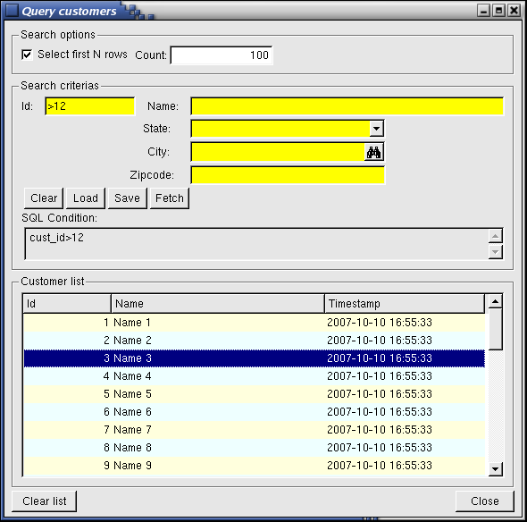

[Back to Contents](../index.html)

------------------------------------------------------------------------

# [Multiple Dialogs]{#PAGE_HEADER}

Summary:

- [Basics](#BASICS)
- [Syntax](#DIALOG)
  - [DIALOG block](#SYNTAX_DIALOG)
  - [INPUT block](#SYNTAX_INPUT)
  - [CONSTRUCT block](#SYNTAX_CONSTRUCT)
  - [DISPLAY ARRAY block](#SYNTAX_DISPLAY_ARRAY)
  - [INPUT ARRAY bock](#SYNTAX_INPUT_ARRAY)
- [Usage](#USAGE)
  - [Programming Steps](#PROG_STEPS)
  - [Sub-dialogs](#sub-dialogs)
  - [Programming with DIALOG](#dialog-model-view)
  - [DIALOG and sub-dialogs configuration clauses](#attributes-clauses)
  - [Default Actions](#DEFAULT_ACTIONS)
  - [Data Blocks](#DATA_BLOCKS)
  - [Control Blocks](#CONTROL_BLOCKS)
  - [Control Blocks Execution Order](#CTRLBLOCK_EXECUTION)
  - [Interaction Blocks](#INTERACTION_BLOCKS)
  - [Control Instructions](#CONTROL_INSTRUCTIONS)
  - [Control Class](#CONTROL_CLASS)
  - [Control Functions](#CONTROL_FUNCTIONS)
- [Examples](#EXAMPLES)
  - [Example 1: Two Lists](#example-1)
  - [Example 2: Query and List](#example-2)

*See also:* [Arrays](Arrays.html), [Records](Records.html), [Result
Sets](ResultSets.html), [Programs](Programs.html),
[Windows](WindowsAndForms.html), [Forms](FormSpecFiles.html), [Display
Array](DisplayArray.html)

------------------------------------------------------------------------

## [Basics]{#BASICS}

The `DIALOG` instruction handles different parts of a form
simultaneously, including simple display fields, simple input fields,
read-only list of records, editable list of records, query by example
fields, and action views.  The `DIALOG` instruction acts as a collection
of singular dialogs which work in parallel.

While the `DIALOG` instruction re-uses some of the semantics and
behaviors of singular interactive instructions, there are some
differences. By \"singular interactive instructions\", we mean the
[INPUT](RecordInput.html), [CONSTRUCT](Construct.html), [DISPLAY
ARRAY](DisplayArray.html) and [INPUT ARRAY](InputArray.html)
instructions. The differences are discussed further within this topic.

 Like the singular interactive instructions, `DIALOG` is an interactive
instruction. You can execute a `DIALOG` instruction from one of the
singular dialogs, or execute a singular dialog from a `DIALOG` block.
The parent dialog will be disabled until the child dialog returns.

The `DIALOG` instruction binds [program variables](Variables.html) such
as [simple records](Records.html) or [arrays of records](Arrays.html)
with a [screen-record or
screen-array](FormSpecFiles.html#SECTION_INSTRUCTIONS) defined in a
[form](FormSpecFiles.html), allowing the user to view and update
application data.

When a `DIALOG` block executes, it activates the current form (the form
most recently displayed or the form in the [current
window](WindowsAndForms.html)). When the statement completes execution,
the form is de-activated.

The following screen shot is from a demo program called
**QueryCustomers** that you can find in FGLDIR/demo/MultipleDialogs.
This demo involves a ` DIALOG` block that contains a simple
[INPUT](#sub-dialog-INPUT) block, a [CONSTRUCT](#sub-dialog-CONSTRUCT)
block, and a [DISPLAY ARRAY](#sub-dialog-DISPLAY-ARRAY) block:

{border="0" width="590" height="584"}

------------------------------------------------------------------------

## [DIALOG]{#DIALOG}

#### Purpose:

The `DIALOG` block is an interactive instruction that executes multiple
kinds of sub-controllers simultaneously to drive different parts of a
form.

#### [Syntax]{#SYNTAX}:

[`DIALOG`]{#SYNTAX_DIALOG}\
`  `[`[`]{.underline}` ATTRIBUTE ( `[`{`]{.underline}` `*[`dialog-control-attribute`](#dialog-control-attributes)*` `[`}`]{.underline}` `[`[,...]`]{.underline}` ) `[`]`]{.underline}\
\
`  `[`{`]{.underline}` `*[`record-input-block`](#record-input-block)\
` `*` `[`|`]{.underline}` `*[`construct-block`](#construct-block)\
` `*` `[`|`]{.underline}` `*[`display-array-block`](#display-array-block)\
` `*` `[`|`]{.underline}` `*[`input-array-block`](#input-array-block)*\
`  `[`}`]{.underline}\
`  `[`[...]`]{.underline}\
\
[`[`]{.underline}\
`  `[`{`]{.underline}` `*[`dialog-control-block`](#dialog-control-block)*`  `[`}`]{.underline}\
`  `[`[...]`]{.underline}\
[`]`]{.underline}\
\
`END DIALOG`

[where *record-input-block* is:]{#record-input-block}

` `[`{`]{.underline}\
[`INPUT BY NAME`]{#SYNTAX_INPUT}` `[`{`]{.underline}` `*[`variable`](#variable)` `[`|`]{.underline}` `[`record`](#record)`.*`*` } [,...]`\
[`|`\]{.underline}
`INPUT `[`{`]{.underline}` `*[`variable`](#variable)` `[`|`]{.underline}` `[`record`](#record)`.*`*` } [,...]  FROM `*[`field-list`](#field-list)*\
[`}`]{.underline}\
`  `[`[`]{.underline}` ATTRIBUTE ( `[`{`]{.underline}` `*[`input-control-attribute`](#input-control-attributes)*` `[`}`]{.underline}` `[`[,...]`]{.underline}` ) `[`]`]{.underline}\
`  `[`{`]{.underline}` `*[`input-control-block`](#input-control-block)*`  `[`}`]{.underline}\
`  `[`[...]`]{.underline}\
`END INPUT`

[where *input-control-block* is one of:]{#input-control-block}

` `[`{`]{.underline}` BEFORE INPUT`\
[`|`]{.underline}` BEFORE FIELD `*[`field-spec`](#field-spec)*` `[`[,...]`]{.underline}\
[`|`]{.underline}` ON CHANGE `*[`field-spec`](#field-spec)*` `[`[,...]`]{.underline}\
[`|`]{.underline}` AFTER FIELD `*[`field-spec`](#field-spec)*` `[`[,...]`]{.underline}\
[`|`]{.underline}` AFTER INPUT`\
[`|`]{.underline}` ON ACTION `*[`action-name`](#action-name)*` `[`[`]{.underline}`INFIELD `*[`field-spec`](#field-spec)*[`]`]{.underline}\
[`|`]{.underline}` ON KEY ( `*[`key-name`](#key-name)*` `[`[,...]`]{.underline}` )`\
[`}`\]{.underline}
`      `*[`dialog-statement`](#dialog-statement)*\
`     `[`[...]`]{.underline}` `

[where *construct-block* is:]{#construct-block}

` `[`{`\]{.underline}
[`CONSTRUCT BY NAME`]{#SYNTAX_CONSTRUCT}` `*[`variable`](#variable)*` ON `*[`column-list`](#column-list)*\
[`|`]{.underline}\
`CONSTRUCT `*[`variable`](#variable)*` ON `*[`column-list`](#column-list)*` FROM `*[`field-list`](#field-list)*\
[`}`\]{.underline}
`   `[`[`]{.underline}` ATTRIBUTE ( `[`{`]{.underline}` `*[`construct-control-attribute`](#construct-control-attributes)*` `[`}`]{.underline}` `[`[,...]`]{.underline}` ) `[`]`]{.underline}\
`  `[`{`]{.underline}` `*[`construct-control-block`](#construct-control-block)*`  `[`}`]{.underline}\
`  `[`[...]`]{.underline}\
`END CONSTRUCT`

[where *construct-control-block* is one of:]{#construct-control-block}

` `[`{`]{.underline}` BEFORE CONSTRUCT`\
[`|`]{.underline}` BEFORE FIELD `*[`field-spec`](#field-spec)*` `[`[,...]`]{.underline}\
[`|`]{.underline}` ON CHANGE `*[`field-spec`](#field-spec)*` `[`[,...]`]{.underline}\
[`|`]{.underline}` AFTER FIELD `*[`field-spec`](#field-spec)*` `[`[,...]`]{.underline}\
[`|`]{.underline}` AFTER CONSTRUCT`\
[`|`]{.underline}` ON ACTION `*[`action-name`](#action-name)*` `[`[`]{.underline}`INFIELD `*[`field-spec`](#field-spec)*[`]`]{.underline}\
[`|`]{.underline}` ON KEY ( `*[`key-name`](#key-name)*` `[`[,...]`]{.underline}` )`\
[`}`\]{.underline}
`      `*[`dialog-statement`](#dialog-statement)*\
`     `[`[...]`]{.underline}` `

[where *display-array-block* is:]{#display-array-block}

[`DISPLAY ARRAY`]{#SYNTAX_DISPLAY_ARRAY}` `*[`array`](#array)*` TO `*[`screen-array`](#screen-array)*`.*`\
`  `[`[`]{.underline}` ATTRIBUTE ( `[`{`]{.underline}` `*[`display-array-control-attribute`](#display-array-control-attributes)*` `[`}`]{.underline}` `[`[,...]`]{.underline}` ) `[`]`]{.underline}\
`  `[`{`]{.underline}` `*[`display-array-control-block`](#display-array-control-block)*`  `[`}`]{.underline}\
`  `[`[...]`]{.underline}\
`END DISPLAY `

[where *display-array-control-block* is one
of:]{#display-array-control-block}

` `[`{`]{.underline}` BEFORE DISPLAY`\
[`|`]{.underline}` BEFORE ROW`\
[`|`]{.underline}` AFTER ROW`\
[`|`]{.underline}` AFTER DISPLAY`\
[`|`]{.underline}` ON ACTION `*[`action-name`](#action-name)*\
[`|`]{.underline}` ON KEY ( `*[`key-name`](#key-name)*` `[`[,...]`]{.underline}` )`\
[`|`]{.underline}` ON FILL BUFFER`\
[`|`]{.underline}` ON EXPAND ( `*[`row-index`](#row-index)*` )`\
[`|`]{.underline}` ON COLLAPSE ( `*[`row-index`](#row-index)*` )`\
` `[`|`]{.underline}` ON DRAG_START ( `*[`dnd-object`](#dnd-object)*` )`\
[`|`]{.underline}` ON DRAG_FINISH ( `*[`dnd-object`](#dnd-object)*` )`\
[`|`]{.underline}` ON DRAG_ENTER ( `*[`dnd-object`](#dnd-object)*` )`\
[`|`]{.underline}` ON DRAG_OVER ( `*[`dnd-object`](#dnd-object)*` )`\
[`|`]{.underline}` ON DROP ( `*[`dnd-object`](#dnd-object)*` )`\
[`}`\]{.underline}
`      `*[`dialog-statement`](#dialog-statement)*\
`     `[`[...]`]{.underline}` `

[where *input-array-block* is:]{#input-array-block}

[`INPUT ARRAY`]{#SYNTAX_INPUT_ARRAY}` `*[`array`](#array)*` FROM `*[`screen-array`](#screen-array)*`.*`\
`  `[`[`]{.underline}` ATTRIBUTE ( `[`{`]{.underline}` `*[`input-array-control-attribute`](#input-array-control-attributes)*` `[`}`]{.underline}` `[`[,...]`]{.underline}` ) `[`]`]{.underline}\
`  `[`{`]{.underline}` `*[`input-array-control-block`](#input-array-control-block)*`  `[`}`]{.underline}\
`  `[`[...]`]{.underline}\
`END INPUT`

[where *input-array-control-block* is one
of:]{#input-array-control-block}

` `[`{`]{.underline}` BEFORE INPUT`\
[`|`]{.underline}` BEFORE ROW`\
[`|`]{.underline}` BEFORE FIELD `*[`field-spec`](#field-spec)*` `[`[,...]`]{.underline}\
[`|`]{.underline}` ON CHANGE `*[`field-spec`](#field-spec)*` `[`[,...]`]{.underline}\
[`|`]{.underline}` AFTER FIELD `*[`field-spec`](#field-spec)*` `[`[,...]`]{.underline}\
[`|`]{.underline}` ON ROW CHANGE`\
[`|`]{.underline}` AFTER ROW`\
[`|`]{.underline}` BEFORE DELETE`\
[`|`]{.underline}` AFTER DELETE`\
[`|`]{.underline}` BEFORE INSERT`\
[`|`]{.underline}` AFTER INSERT`\
[`|`]{.underline}` AFTER INPUT`\
[`|`]{.underline}` ON ACTION `*[`action-name`](#action-name)*` `[`[`]{.underline}`INFIELD `*[`field-spec`](#field-spec)*[`]`]{.underline}\
[`|`]{.underline}` ON KEY ( `*[`key-name`](#key-name)*` `[`[,...]`]{.underline}` )`\
[`}`\]{.underline}
`      `*[`dialog-statement`](#dialog-statement)*\
`     `[`[...]`]{.underline}` `

[where *dialog-control-block* is one of:]{#dialog-control-block}

` `[`{`]{.underline}` BEFORE DIALOG`\
[`|`]{.underline}` ON ACTION `*[`action-name`](#action-name)*\
[`|`]{.underline}` ON KEY ( `*[`key-name`](#key-name)*` `[`[,...]`]{.underline}` )`\
[`|`]{.underline}` ON IDLE `*[`idle-seconds`](#idle-seconds)*\
[`|`]{.underline}` COMMAND `*[`option-name`](#option-name)*` `[`[`]{.underline}` `*[`option-comment`](#option-comment)*` `[`]`]{.underline}` `[`[`]{.underline}` HELP `*[`help-number`](#help-number)*` `[`]`]{.underline}\
[`|`]{.underline}` COMMAND KEY ( `*[`key-name`](#key-name)*` `[`[,...]`]{.underline}` ) `*[`option-name`](#option-name)*` `[`[`]{.underline}` `*[`option-comment`](#option-comment)*` `[`]`]{.underline}` `[`[`]{.underline}` HELP `*[`help-number`](#help-number)*` `[`]`]{.underline}\
[`|`]{.underline}` AFTER DIALOG`\
[`}`\]{.underline}
`      `*[`dialog-statement`](#dialog-statement)*\
`     `[`[...]`]{.underline}` `

[where *dialog-statement* is one of:]{#dialog-statement}

[`{`]{.underline}` `*[`statement`](#statement)\*
` `[`|`]{.underline}` ACCEPT DIALOG`\
[`|`]{.underline}` CONTINUE DIALOG`\
[`|`]{.underline}` EXIT DIALOG`\
[`|`]{.underline}` NEXT FIELD `[`{`]{.underline}` CURRENT `[`|`]{.underline}` NEXT `[`|`]{.underline}` PREVIOUS `[`|`]{.underline}` `*[`field-name`](#field-name)*` `[`}`]{.underline}\
[`}`]{.underline}

[where *field-list* defines a list of fields with one or more
of:]{#field-list}

[`{`]{.underline}` `*[`field-name`](#field-name)*\
[`|`]{.underline}` `*[`table-name`](#table-name)*`.*`\
[`|`]{.underline}` `*[`table-name`](#table-name)*`.`*[`field-name`](#field-name)*\
[`|`]{.underline}` `*[`screen-array`](#screen-array)*`[`*[`line`](#screen-array-line)*`].*`\
[`|`]{.underline}` `*[`screen-array`](#screen-array)*`[`*[`line`](#screen-array-line)*`].`*[`field-name`](#field-name)*\
[`|`]{.underline}` `*[`screen-record`](#screen-record)*`.*`\
[`|`]{.underline}` `*[`screen-record`](#screen-record)*`.`*[`field-name`](#field-name)*\
[`}`]{.underline}` `[`[,...]`]{.underline}` `

[where *field-spec* identifies a unique field with one of:]{#field-spec}

[`{`]{.underline}` `*[`field-name`](#field-name)*\
[`|`]{.underline}` `*[`table-name`](#table-name)*`.`*[`field-name`](#field-name)*\
[`|`]{.underline}` `*[`screen-array`](#screen-array)*`.`*[`field-name`](#field-name)*\
[`|`]{.underline}` `*[`screen-record`](#screen-record)*`.`*[`field-name`](#field-name)*\
[`}`]{.underline}` `

[where *column-list* defines a list of database columns
as:]{#column-list}

[`{`]{.underline}` `*[`column-name`](#column-name)*\
[`|`]{.underline}` `*[`table-name`](#table-name)*`.*`\
[`|`]{.underline}` `*[`table-name`](#table-name)*`.`*[`column-name`](#column-name)*\
[`}`]{.underline}` `[`[,...]`]{.underline}` `

#### Notes:

1.  *[array]{#array}* is the [array of records](Arrays.html) used by the
    `DIALOG` statement.
2.  *[help-number]{#help-number}* is an integer that allows you to
    associate a [help message](MessageFiles.html) number with the
    command.
3.  *[field-name]{#field-name}* is the identifier of a
    [field](FormSpecFiles.html#SECTION_ATTRIBUTES) of the [current
    form](WindowsAndForms.html).
4.  *[option-name]{#option-name}* is a [string
    expression](Expressions.html#EX_STRING) defining the label of the
    action and identifying the [action](InteractionModel.html) that can
    be executed by the user.
5.  *[option-comment]{#option-comment}* is a [string
    expression](Expressions.html#EX_STRING) containing a description for
    the menu option, displayed when *option-name* is the current.
6.  *[column-name]{#column-name}* is the identifier of a [database
    column](FormSpecFiles.html#SECTION_ATTRIBUTES) of the [current
    form](WindowsAndForms.html).
7.  *[table-name]{#table-name}* is the identifier of a [database
    table](FormSpecFiles.html#SECTION_TABLES) of the [current
    form](WindowsAndForms.html).
8.  *[variable]{#variable}* is a simple [program
    variable](Variables.html) (not a record).
9.  *[record]{#record}* is a [program record](Records.html) (structured
    variable).
10. *[screen-array]{#screen-array}* is the [screen
    array](FormSpecFiles.html#SECTION_INSTRUCTIONS) that will be used in
    the [current form](WindowsAndForms.html).
11. [*line*]{#screen-array-line} is a screen array line in the form.
12. *[screen-record]{#screen-record}* is the identifier of a [screen
    record](FormSpecFiles.html#SECTION_INSTRUCTIONS) of the [current
    form](WindowsAndForms.html).
13. *[action-name]{#action-name}* identifies an
    [action](InteractionModel.html) that can be executed by the user.
14. *[idle-seconds]{#idle-seconds}* is an [integer
    literal](Literals.html) or [variable](Variables.html) that defines a
    number of seconds.
15. *[key-name]{#key-name}* is a hot-key identifier (like `F11` or
    `Control-z`).
16. *[row-index]{#row-index}* identifies the program variable which
    holds the row index corresponding to the [tree node](TreeViews.html)
    that has been expanded or collapsed.
17. *[dnd-object]{#dnd-object}* references a
    [ui.DragDrop](ClassDragDrop.html) variable defined in the scope of
    the dialog.
18. *[statement]{#statement}* is any instruction supported by the
    language.

The following table shows the
*[dialog-control-attributes]{#dialog-control-attributes}* supported by
the `DIALOG` statement:

::: {align="center"}
  ---------------------------------------------------------------- -----------------------------------------------------------------------------------------------------------------------------------------------------------------------------------------------------------------------------------------------------------------------------------------------------------------------------------------------------------------------------------------------------------------------
  **Attribute**                                                    **Description**
  `FIELD ORDER FORM`                                               Indicates that the tabbing order of fields is defined by the [TABINDEX](FSFAttributes.html#FA_TABINDEX) attribute of form fields. The default order in which the focus moves from field to field is determined by the order of the program variables bound to the `DIALOG` statement. The [program options](Programs.html#PROGRAM_OPTIONS) instruction can also change this behavior with `FIELD ORDER FORM` options.
  `UNBUFFERED `[`[`]{.underline}` =`*`bool`*[`]`]{.underline}` `   Indicates that the dialog must be sensitive to program variable changes. The *bool* parameter can be an [integer literal](Literals.html#LT_INTEGER) or a [program variable](Variables.html).
  ---------------------------------------------------------------- -----------------------------------------------------------------------------------------------------------------------------------------------------------------------------------------------------------------------------------------------------------------------------------------------------------------------------------------------------------------------------------------------------------------------
:::

The following table shows the
*[input-control-attributes]{#input-control-attributes}* supported by the
`INPUT` sub-dialog of the `DIALOG` statement:

::: {align="center"}
  ------------------------------------------------------------------ ------------------------------------
  **Attribute**                                                      **Description**

  `HELP = `*`int-expr`*                                              Defines the help number of the [help
                                                                     message](MessageFiles.html) to use
                                                                     when help is invoked by the user.

  `NAME = `*`string`*                                                Identifies the sub-dialog by
                                                                     providing a unique name.

  `WITHOUT DEFAULTS `[`[`]{.underline}`=`*`bool`*[`]`]{.underline}   Indicates whether or not `INPUT`
                                                                     fields are initially filled with the
                                                                     column default values defined in the
                                                                     [form specification
                                                                     file](FormSpecFiles.html) or the
                                                                     [database schema
                                                                     files](DatabaseSchema.html). If set
                                                                     to [FALSE](Programs.html#PC_FALSE),
                                                                     fields are initially populated with
                                                                     the column default values. If set to
                                                                     [TRUE](Programs.html#PC_TRUE),
                                                                     default values are ignored. *bool*
                                                                     can be an [integer
                                                                     literal](Literals.html#LT_INTEGER)
                                                                     or a [program
                                                                     variable](Variables.html) that
                                                                     evaluates to
                                                                     [TRUE](Programs.html#PC_TRUE) or
                                                                     [FALSE](Programs.html#PC_FALSE).\
                                                                     For more details, see [WITHOUT
                                                                     DEFAULTS in
                                                                     INPUT](#input-without-defaults).
  ------------------------------------------------------------------ ------------------------------------
:::

The following table shows the
*[display-array-control-attributes]{#display-array-control-attributes}*
supported by the `DISPLAY ARRAY` sub-dialog of the `DIALOG` statement:

::: {align="center"}
  --------------------------------------------------------------------- ------------------------------------------------------------------------------------------------------------------------------------------------------------------------------------------------------------------------------------------
  **Attribute**                                                         **Description**
  `COUNT = `*`row-count`*                                               Defines the number of data rows when using a static array or the total number of rows in paged mode (can be -1 for infinite). *row-count* can be an [integer literal](Literals.html#LT_INTEGER) or a [program variable](Variables.html).
  `HELP = `*`int-expr`*                                                 Defines the help number of the [help message](MessageFiles.html) to use when help is invoked by the user.
  `KEEP CURRENT ROW `[`[`]{.underline}`=`*`bool`*[`]`]{.underline}` `   Keeps current row highlighted after execution of the instruction.
  --------------------------------------------------------------------- ------------------------------------------------------------------------------------------------------------------------------------------------------------------------------------------------------------------------------------------
:::

The following table shows the
*[input-array-control-attributes]{#input-array-control-attributes}*
supported by the `INPUT ARRAY` sub-dialog of the `DIALOG` statement:

::: {align="center"}
  --------------------------------------------------------------------- ----------------------------------------
  **Attribute**                                                         **Description**

  `HELP = `*`int-expr`*                                                 Defines the help number of the [help
                                                                        message](MessageFiles.html) to use when
                                                                        help is invoked by the user.

  `WITHOUT DEFAULTS `[`[`]{.underline}`=`*`bool`*[`]`]{.underline}      Indicates whether or not `INPUT ARRAY`
                                                                        rows are initially filled with the
                                                                        program array elements when the dialog
                                                                        starts. If set to
                                                                        [FALSE](Programs.html#PC_FALSE), program
                                                                        array elements are ignored and the
                                                                        dialog will start with an empty list. If
                                                                        set to [TRUE](Programs.html#PC_TRUE),
                                                                        the program array values are used.
                                                                        *bool* can be an [integer
                                                                        literal](Literals.html#LT_INTEGER) or a
                                                                        [program variable](Variables.html) that
                                                                        evaluates to
                                                                        [TRUE](Programs.html#PC_TRUE) or
                                                                        [FALSE](Programs.html#PC_FALSE).\
                                                                        For more details, see [WITHOUT DEFAULTS
                                                                        in INPUT
                                                                        ARRAY](#input-array-without-defaults).

  `COUNT = `*`row-count`*                                               Defines the number of data rows in the
                                                                        static array. *row-count* can be an
                                                                        [integer
                                                                        literal](Literals.html#LT_INTEGER) or a
                                                                        [program variable](Variables.html).

  `MAXCOUNT = `*`row-count`*                                            Defines the maximum number of data rows
                                                                        that can be entered in the program
                                                                        array. *row-count* can be an [integer
                                                                        literal](Literals.html#LT_INTEGER) or a
                                                                        [program variable](Variables.html).

  `APPEND ROW `[`[`]{.underline}` =`*`bool`*[`]`]{.underline}` `        Defines if the user can append new rows
                                                                        at the end of the list. *bool* can be an
                                                                        [integer
                                                                        literal](Literals.html#LT_INTEGER) or a
                                                                        [program variable](Variables.html) that
                                                                        evaluates to
                                                                        [TRUE](Programs.html#PC_TRUE) or
                                                                        [FALSE](Programs.html#PC_FALSE).

  `INSERT ROW `[`[`]{.underline}` =`*`bool`*[`]`]{.underline}           Defines if the user can insert new rows
                                                                        inside the list. *bool* can be an
                                                                        [integer
                                                                        literal](Literals.html#LT_INTEGER) or a
                                                                        [program variable](Variables.html) that
                                                                        evaluates to
                                                                        [TRUE](Programs.html#PC_TRUE) or
                                                                        [FALSE](Programs.html#PC_FALSE).

  `DELETE ROW `[`[`]{.underline}` =`*`bool`*[`]`]{.underline}           Defines if the user can delete
                                                                        rows. *bool* can be an [integer
                                                                        literal](Literals.html#LT_INTEGER) or a
                                                                        [program variable](Variables.html) that
                                                                        evaluates to
                                                                        [TRUE](Programs.html#PC_TRUE) or
                                                                        [FALSE](Programs.html#PC_FALSE).

  `AUTO APPEND `[`[`]{.underline}` =`*`bool`*[`]`]{.underline}          Defines if a temporary row will be
                                                                        created automatically when
                                                                        needed. *bool* can be an [integer
                                                                        literal](Literals.html#LT_INTEGER) or a
                                                                        [program variable](Variables.html) that
                                                                        evaluates to
                                                                        [TRUE](Programs.html#PC_TRUE) or
                                                                        [FALSE](Programs.html#PC_FALSE).

  `KEEP CURRENT ROW `[`[`]{.underline}`=`*`bool`*[`]`]{.underline}` `   Keeps current row highlighted after
                                                                        execution of the instruction.
  --------------------------------------------------------------------- ----------------------------------------
:::

The following table shows the
*[construct-control-attributes]{#construct-control-attributes}*
supported by the `CONSTRUCT` sub-dialog of the `DIALOG` statement:

::: {align="center"}
  ----------------------- -----------------------------------------------------------------------------------------------------------
  **Attribute**           **Description**
  `HELP = `*`int-expr`*   Defines the help number of the [help message](MessageFiles.html) to use when help is invoked by the user.
  `NAME = `*`string`*     Identifies the sub-dialog by providing a unique name.
  ----------------------- -----------------------------------------------------------------------------------------------------------
:::

------------------------------------------------------------------------

## [Usage]{#USAGE}

Use the `DIALOG` instruction if you want to handle different parts of a
form at the same time. The `DIALOG` instruction acts as a combination of
classical / singular dialogs. The syntax of the `DIALOG` instruction is
very close to singular dialogs, using common triggers such as
`BEFORE FIELD`, `ON ACTION`, and so on. Despite the similarities, the
behavior and semantics of `DIALOG` are a bit different from singular
dialogs.

The following example is of a `DIALOG` instruction that includes both an
`INPUT` and a `DISPLAY ARRAY` sub-dialog:

``` linenumber
01 SCHEMA stores 
02
03 DEFINE p_customer RECORD LIKE customer.*
04 DEFINE p_orders DYNAMIC ARRAY OF RECORD LIKE order.*
05
06 FUNCTION customer_dialog()
07
08   DIALOG ATTRIBUTES(UNBUFFERED, FIELD ORDER FORM)
09
10     INPUT BY NAME p_customer.*
11       AFTER FIELD cust_name
12         CALL setup_dialog(DIALOG)
13     END INPUT
14
15     DISPLAY ARRAY p_orders TO s_orders.*
16       BEFORE ROW
17         CALL setup_dialog(DIALOG)
18     END DISPLAY
19
20     ON ACTION close
21       EXIT DIALOG
22
23   END DIALOG
24
25 END FUNCTION
```

The main differences between multiple dialogs and singular dialogs are:

1.  While `DIALOG` supports the compatible `BUFFERED` mode, it is
    strongly recommended that you use the `UNBUFFERED` mode, in order to
    synchronize views (form fields) with data models (program
    variables).
2.  The `DIALOG` instruction does not use the
    [INT_FLAG](Programs.html#PV_INT_FLAG) variable. You must implement
    `ON ACTION accept` or `ON ACTION cancel` to handle dialog validation
    / cancellation. These actions do not exist by default in `DIALOG`.
3.  Unlike singular dialogs creating implicit accept and cancel actions,
    by default there is no way to quit the `DIALOG` instruction. You
    must implement your own action handler and execute `EXIT DIALOG` or
    `ACCEPT DIALOG`.
4.  All elements of the dialog are active at the same time, so you must
    handle tabbing order properly. By default - as in singular dialogs -
    the tabbing order is driven by the binding list (order of program
    variables). It is strongly recommended that you use the
    `FIELD ORDER FORM` option and the
    [TABINDEX](FSFAttributes.html#FA_TABINDEX) field attributes instead.
5.  Like the singular [INPUT ARRAY](InputArray.html) instruction,
    `DIALOG` creates implicit *insert*, *append* and *delete* actions.
    These actions are only active when the focus is in the list.

#### Tips:

1.  Don\'t touch working programs: The purpose of the `DIALOG`
    instruction is not to replace singular dialogs, which are still
    supported and useful in most cases.
2.  It is recommended that you use singular dialogs if no multiple
    dialog is required. For example, you would typically implement a
    master/detail form with `DIALOG`, and execute a singular
    [CONSTRUCT](Construct.html) instruction as a nested dialog called
    from the master/detail `DIALOG`.
3.  Write a common *setup_dialog(ui.dialog)* function to centralize all
    field and action activations according to the context. You can then
    call that setup function at any place in the `DIALOG` code.
4.  While static arrays are supported by the `DIALOG` instruction, it is
    strongly recommended that you use [dynamic arrays](Arrays.html)
    instead. With a dynamic array, the actual number of rows is
    automatically defined by the array variable, while static arrays
    need an additional step to define the total number of rows.

------------------------------------------------------------------------

### [Programming Steps]{#PROG_STEPS}

The following steps describe how to use the `DIALOG` statement:

1.  Create a [form specification file](FormSpecFiles.html) containing
    [screen record(s)](FormSpecFiles.html#SECTION_INSTRUCTIONS) and/or
    [screen array(s)](FormSpecFiles.html#SECTION_INSTRUCTIONS). The
    screen records and screen arrays identify the presentation elements
    to be used by the runtime system to display the data models (i.e.
    the content of program variables bound to the `DIALOG` instruction).
2.  With the [DEFINE](Variables.html) instruction, declare program
    variables that will be used as data models. For record lists
    (`DISPLAY ARRAY` or `INPUT ARRAY`), the members of the program array
    must correspond to the elements of the screen array, by number and
    data types. To handle record lists, use [dynamic
    arrays](Arrays.html) instead of static arrays.
3.  Open and display the form, using a [OPEN
    WINDOW](WindowsAndForms.html#OPEN_WINDOW) with the `WITH FORM`
    clause or the [OPEN FORM / DISPLAY
    FORM](WindowsAndForms.html#OPEN_FORM) instructions.
4.  Fill the program variables with data. For lists, you typically use a
    [result set cursor](ResultSets.html).
5.  Implement the `DIALOG` instruction block to handle interaction.
    Define each sub-dialog with program variables to be used as data
    models. The sub-dialogs will define how variables will be used
    (display or input). 
6.  Inside the `DIALOG` instruction, control the behavior of the
    instructions with [control blocks](#CONTROL_BLOCKS), such as
    `BEFORE DIALOG`, `AFTER ROW`, `BEFORE FIELD`, or `ON ACTION`.
7.  To end the DIALOG instruction, implement an `ON ACTION close` or
    `ON ACTION accept` / `ON ACTION cancel` to handle dialog validation
    and cancellation, with the `ACCEPT DIALOG` and `EXIT DIALOG`
    [control instructions](#CONTROL_INSTRUCTIONS). Note that the
    [INT_FLAG](Programs.html#PV_INT_FLAG) variable will **not** be set
    as it would in singular dialogs.

------------------------------------------------------------------------

### [Sub-dialogs]{#sub-dialogs}

A `DIALOG` instruction is made of one or several **sub-dialogs**, plus
global control blocks and action handlers. The sub-dialogs bind program
variables to form fields and define the type of interaction that will
take place for the data model (simple input, list input or query). The
sub-dialogs implement individual [control blocks](#CONTROL_BLOCKS) which
let you control the behavior of the interactive instruction. Sub-dialogs
can also hold action handlers, which will define local [sub-dialog
actions](#binding-actions).

There are four types of `DIALOG` sub-dialogs:

1.  Simple record input with the [INPUT sub-dialog](#sub-dialog-INPUT).
2.  Read-only record list handling with the [DISPLAY ARRAY
    sub-dialog](#sub-dialog-DISPLAY-ARRAY).
3.  Editable record list handling with the [INPUT ARRAY
    sub-dialog](#sub-dialog-INPUT-ARRAY).
4.  Query By Example handling with the [CONSTRUCT
    sub-dialog](#sub-dialog-CONSTRUCT).

For more details about defining sub-dialogs:

- [The INPUT sub-dialog](#sub-dialog-INPUT)
  - [Identifying the INPUT sub-dialog](#identifying-input)
  - [Control blocks in INPUT](#input-control-blocks)
- [The DISPLAY ARRAY sub-dialog](#sub-dialog-DISPLAY-ARRAY)
  - [Identifying the DISPLAY ARRAY
    sub-dialog](#identifying-display-array)
  - [Control blocks in DISPLAY ARRAY](#display-array-control-blocks)
- [The INPUT ARRAY sub-dialog](#sub-dialog-INPUT-ARRAY)
  - [Identifying the INPUT ARRAY sub-dialog](#identifying-input-array)
  - [Control blocks in INPUT ARRAY](#input-array-control-blocks)
- [The CONSTRUCT sub-dialog](#sub-dialog-CONSTRUCT)
  - [Identifying the CONSTRUCT sub-dialog](#identifying-construct)
  - [Control blocks in CONSTRUCT](#construct-control-blocks)
  - [Query Operators](#QUERY_OPERATORS)

------------------------------------------------------------------------

#### [The INPUT sub-dialog]{#sub-dialog-INPUT}

When using the `INPUT` sub-dialog, you bind each [record member
variable](Records.html) to the corresponding field of a [screen
record](FormSpecFiles.html#SECTION_INSTRUCTIONS) so the `DIALOG`
instruction can manipulate the values that the user enters in the form
fields.

The `INPUT` clause can be used in two forms:

1.  `INPUT BY NAME `*`variable-list`*
2.  `INPUT `*`variable-list`*` FROM `*`field-list`*

The `BY NAME` clause implicitly binds the fields to the
[variables](Variables.html) that have the same identifiers as the field
names. You must first declare variables with the same names as the
fields from which they accept input. The runtime system ignores any
record name prefix when making the match. The unqualified names of the
variables and of the fields must be unique and unambiguous within their
respective domains. If they are not, the runtime system generates an
[exception](Exceptions.html), and sets the
[STATUS](Programs.html#PV_STATUS) variable to a negative value.

``` linenumber
01 DEFINE p_cust RECORD
02        cust_num INTEGER,
03        cust_name VARCHAR(50),
04        cust_address VARCHAR(100)
05    END RECORD
06    ...
07 DIALOG
08    INPUT BY NAME p_cust.*
09       BEFORE FIELD cust_name
10        ...
11    END INPUT
12    ...
13 END DIALOG
```

The `FROM` clause explicitly binds the fields in the [screen
record](FormSpecFiles.html#SECTION_INSTRUCTIONS) to a list of program
variables that can be simple [variables](Variables.html) or
[records](Records.html). The number of [variables](Variables.html) or
[record](Records.html) members must equal the number of fields listed in
the `FROM` clause. Each variable must be of the same (or a compatible)
[data type](DataTypes.html) as the corresponding screen field. When the
user enters data, the runtime system checks the entered value against
the data type of the variable, not the data type of the screen field.

``` linenumber
01 DEFINE custname VARCHAR(50)
02    ...
03 DIALOG
04    INPUT cust_name FROM customer.cust_name
05       BEFORE FIELD cust_name
06        ...
07    END INPUT
08    ...
09 END DIALOG
```

##### [Identifying an INPUT sub-dialog]{#identifying-input}

The name of an `INPUT` sub-dialog can be used to qualify [sub-dialog
actions](#binding-actions) with a prefix.

In order to identify the `INPUT` sub-dialog with a specific name, you
can use the `ATTRIBUTES` clause to set the `NAME` attribute:

``` linenumber
01    INPUT BY NAME p_cust.* ATTRIBUTES (NAME = "cust")
02      ...
```

For more details about the possible attributes, see [INPUT ATTRIBUTE
clause](#input-attributes-clause).

##### [Control blocks in INPUT]{#input-control-blocks}

Simple record input declared with the `INPUT` sub-dialog can raise the
following triggers:

- [BEFORE INPUT](#before-input-block)
- [BEFORE FIELD](#before-field-block)
- [ON CHANGE](#on-change-block)
- [AFTER FIELD](#after-field-block)
- [AFTER INPUT](#after-input-block)

Note that in the singular [INPUT](RecordInput.html) instruction,
`BEFORE INPUT` and `AFTER INPUT` blocks are typically used as
initialization and finalization blocks. In an `INPUT` sub-dialog of a
`DIALOG` instruction, `BEFORE INPUT` and `AFTER INPUT` blocks will be
executed each time the focus goes to (`BEFORE`) or leaves (`AFTER`) the
group of fields defined by this sub-dialog.

------------------------------------------------------------------------

#### [The DISPLAY ARRAY sub-dialog]{#sub-dialog-DISPLAY-ARRAY}

The ` DISPLAY ARRAY` sub-dialog binds the members of the flat record (or
the primitive member) of an [array](Arrays.html) to the [screen-array or
screen-record](FormSpecFiles.html#SECTION_INSTRUCTIONS) fields specified
with the `TO` keyword. The number of variables in each record of the
program array must be the same as the number of fields in each screen
record (that is, in a single row of the screen array).

You typically bind a program array to a screen-array in order to display
a page of records. However, the `DIALOG` instruction can also bind the
program array to a simple flat screen-record. In this case, only one
record will be visible at a time.

The next code example defines an array with a flat record and binds it
to a screen array:

``` linenumber
01 DEFINE p_items DYNAMIC ARRAY OF RECORD
02        item_num INTEGER,
03        item_name VARCHAR(50),
04        item_price DECIMAL(6,2)
05    END RECORD
06    ...
07 DIALOG
08    DISPLAY ARRAY p_items TO sa.*
09       BEFORE ROW
10       ...
11    END DISPLAY
12    ...
13 END DIALOG
```

If the screen array is defined with one field only, you can bind an
array defined with a primitive type:

``` linenumber
01 DEFINE p_names DYNAMIC ARRAY OF VARCHAR(50)
02    ...
03 DIALOG
04    DISPLAY ARRAY p_names TO sa.*
05       BEFORE DELETE
06       ...
07    END DISPLAY
08    ...
09 END DIALOG
```

##### [Identifying a DISPLAY ARRAY sub-dialog]{#identifying-display-array}

The name of the screen array specified with the `TO` clause identifies
the list. The dialog class method such as takes the name of the screen
array as the parameter, identifying the list. For example, you would use
[DIALOG.getCurrentRow(\"screen-array\")](ClassDialog.html#getCurrentRow)
to query for the current row in the list identified by \'screen-array\'.
The name of the screen-array is also used to qualify [sub-dialog
actions](#binding-actions) with a prefix.

##### [Control blocks in DISPLAY ARRAY]{#display-array-control-blocks}

Read-only record lists declared with the `DISPLAY ARRAY` sub-dialog can
raise the following triggers:

- [BEFORE DISPLAY](#before-display-block)
- [BEFORE ROW](#before-row-block)
- [AFTER ROW](#after-row-block)
- [AFTER DISPLAY](#after-display-block)

Note that in the singular [DISPLAY ARRAY](DisplayArray.html)
instruction, `BEFORE DISPLAY` and `AFTER DISPLAY` blocks are typically
used as initialization and finalization blocks. In a `DISPLAY ARRAY`
sub-dialog of a `DIALOG` instruction, `BEFORE DISPLAY` and
`AFTER DISPLAY` blocks will be executed each time the focus goes to
(`BEFORE`) or leaves (`AFTER`) the group of fields defined by this
sub-dialog. 

------------------------------------------------------------------------

#### [The INPUT ARRAY sub-dialog]{#sub-dialog-INPUT-ARRAY}

The `INPUT ARRAY` sub-dialog binds the members of the flat record (or
the primitive member) of an [array](Arrays.html) to the [screen-array or
screen-record](FormSpecFiles.html#SECTION_INSTRUCTIONS) fields specified
with the `FROM` keyword. The number of variables in each record of the
program array must be the same as the number of fields in each screen
record (that is, in a single row of the screen array).

Note that you typically bind a program array to a screen-array in order
to display a page of records. However, the `DIALOG` instruction can also
bind the program array to a simple flat screen-record. In this case,
only one record will be visible at a time.

The next code example defines an array with a flat record and binds it
to a screen array:

``` linenumber
01 DEFINE p_items DYNAMIC ARRAY OF RECORD
02        item_num INTEGER,
03        item_name VARCHAR(50),
04        item_price DECIMAL(6,2)
05    END RECORD
06    ...
07 DIALOG
08    INPUT ARRAY p_items FROM sa.*
09       BEFORE INSERT
10       ...
11    END INPUT
12    ...
13 END DIALOG
```

If the screen array is defined with one field only, you can bind an
array defined with a primitive type:

``` linenumber
01 DEFINE p_names DYNAMIC ARRAY OF VARCHAR(50)
02    ...
03 DIALOG
04    INPUT ARRAY p_names FROM sa.*
05       BEFORE DELETE
06       ...
07    END INPUT
08    ...
09 END DIALOG
```

##### [Identifying an INPUT ARRAY sub-dialog]{#identifying-input-array}

The name of the screen array specified with the `FROM` clause will be
used to identify the list. For example, the dialog class method such as
[DIALOG.getCurrentRow(\"screen-array\")](ClassDialog.html#getCurrentRow)
takes the name of the screen array as the parameter, to identify the
list you want to query for the current row. The name of the screen-array
is also used to qualify [sub-dialog actions](#binding-actions) with a
prefix.

##### [Control blocks in INPUT ARRAY]{#input-array-control-blocks}

Editable record lists declared with the `INPUT ARRAY` sub-dialog can
raise the following triggers:

- [BEFORE INPUT](#before-input-block)
- [BEFORE ROW](#before-row-block)
- [BEFORE FIELD](#before-field-block)
- [ON CHANGE](#on-change-block)
- [AFTER FIELD](#after-field-block)
- [ON ROW CHANGE](#on-row-change-block)
- [AFTER ROW](#after-row-block)
- [BEFORE DELETE](#before-delete-block)
- [AFTER DELETE](#after-delete-block)
- [BEFORE INSERT](#before-insert-block)
- [AFTER INSERT](#after-insert-block)
- [AFTER INPUT](#after-input-block)

Note that in the singular [INPUT ARRAY](InputArray.html) instruction,
`BEFORE INPUT` and `AFTER INPUT` blocks are typically used as
initialization and finalization blocks. In the `INPUT ARRAY` sub-dialog
of a `DIALOG` instruction, `BEFORE INPUT` and `AFTER INPUT` blocks will
be executed each time the focus goes to (`BEFORE`) or leaves (`AFTER`)
the group of fields defined by this sub-dialog. 

------------------------------------------------------------------------

#### [The CONSTRUCT sub-dialog]{#sub-dialog-CONSTRUCT}

The `CONSTRUCT` sub-dialog binds a character string variable with
[screen fields](FormSpecFiles.html#SECTION_ATTRIBUTES), to implement
Query By Example (QBE). When such a sub-dialog is used, the `DIALOG`
instruction produces an SQL condition corresponding to search criteria
that a user specifies in the fields. The instruction fills the character
variable with the SQL condition, and you can use the content of this
variable to create the `WHERE` clause of a `SELECT` statement to query
the database.

``` linenumber
01 DEFINE sql_condition STRING
02    ...
03 DIALOG
04    CONSTRUCT BY NAME sql_condition ON customer.cust_name, customer.cust_address
05       BEFORE FIELD cust_name
06       ...
07    END CONSTRUCT
08    ...
09 END DIALOG
```

You must make sure the character string variable is large enough to
store all possible SQL conditions. It is better to use a
[STRING](DataTypes.html#DT_STRING) data type to avoid any size problems.

#### **Warnings:**

1.  `CONSTRUCT` uses the field data types defined in the current form
    file to produce the SQL conditions. This is different from other
    interactive instructions, where the data types of the program
    variables define the way to handle input/display. It is *strongly*
    recommended (but not mandatory) that the form field data types
    correspond to the data types of the program variables used for
    input. This is implicit if both form fields and program variables
    are based on the [database schema file](DatabaseSchema.html).

The `CONSTRUCT` clause can be used in two forms:

1.  `CONSTRUCT BY NAME `*`string-variable`*` ON `*`column-list`*
2.  `CONSTRUCT `*`string-variable`*` ON `*`column-list`*` FROM `*`field-list`*

The `BY NAME` clause implicitly binds the form fields to the columns,
where the form field identifiers match the column names specified in the
column-list  after the `ON` keyword. You can specify the individual
column names (separated by commas) or use the `tablename.*` shortcut to
include all columns defined for a table in the [database schema
file](DatabaseSchema.html).

The `FROM` clause explicitly binds the form fields listed after the
`FROM` keyword with the column definitions listed after the `ON`
keyword.

In both cases, the name of the columns in *column-list* will be used to
produce the SQL condition in *string-variable*.

**[Identifying a CONSTRUCT sub-dialog]{#identifying-construct}**

The name of a `CONSTRUCT` sub-dialog can be used to qualify [sub-dialog
actions](#binding-actions) with a prefix. In order to identify the
`CONSTRUCT` sub-dialog with a specific name, use the `ATTRIBUTES` clause
to set the `NAME` attribute:

``` linenumber
01    CONSTRUCT BY NAME sql_condition ON customer.* ATTRIBUTES (NAME = "q_cust")
02        ...
```

For more details about the possible attributes, see [CONSTRUCT ATTRIBUTE
clause](#construct-attributes-clause).

**[Control blocks in CONSTRUCT]{#construct-control-blocks}**

A Query By Example declared with the `CONSTRUCT` clause can raise the
following triggers:

- [BEFORE CONSTRUCT](#before-construct-block)
- [BEFORE FIELD](#before-field-block)
- [AFTER FIELD](#after-field-block)
- [AFTER CONSTRUCT](#after-construct-block)

Note that in the singular [CONSTRUCT](Construct.html) instruction,
`BEFORE CONSTRUCT` and `AFTER CONSTRUCT` blocks are typically used as
initialization and finalization blocks. In `DIALOG` instruction,
`BEFORE CONSTRUCT` and `AFTER CONSTRUCT` blocks will be executed each
time the focus goes to (`BEFORE`) or leaves (`AFTER`) the group of
fields defined by this sub-dialog.

**[Query Operators]{#QUERY_OPERATORS}**

The following table lists all relational operators that can be used
during a Query By Example input:

::: {align="center"}
+------------------+-------------------------+-------------------------+
| **Symbol**       | **Meaning**             | **Pattern**             |
+------------------+-------------------------+-------------------------+
| Any simple data type                                                 |
+------------------+-------------------------+-------------------------+
| `=`              | Is Null                 | =                       |
+------------------+-------------------------+-------------------------+
| `==`             | Equal to                | == *value*              |
+------------------+-------------------------+-------------------------+
| `>`              | Greater than            | \> *value*              |
+------------------+-------------------------+-------------------------+
| `>=`             | Greater than or equal   | \>= *value*             |
|                  | to                      |                         |
+------------------+-------------------------+-------------------------+
| `<`              | Less than               | \< *value*              |
+------------------+-------------------------+-------------------------+
| `<=`             | Less than or equal to   | \<= *value*             |
+------------------+-------------------------+-------------------------+
| `<> `*`or`*` !=` | Not equal to            | != *value*, \<\>        |
|                  |                         | *value*                 |
+------------------+-------------------------+-------------------------+
| `: `*`or`*` ..`  | Range                   | *value1*:*value2*,      |
|                  |                         | *value1*..*value2*      |
+------------------+-------------------------+-------------------------+
| `|`              | List of values          | *value1* \| *value2*    |
+------------------+-------------------------+-------------------------+
| Character data types only                                            |
+------------------+-------------------------+-------------------------+
| `*`              | Wildcard for any string | \*x, x\*, \*x\*         |
+------------------+-------------------------+-------------------------+
| `?`              | Single-character        | ?x, x?, ?x?, x??        |
|                  | wildcard                |                         |
+------------------+-------------------------+-------------------------+
| `[`*`c`*`]`      | A set of characters     | \[a-z\]\*, \[xy\]?      |
+------------------+-------------------------+-------------------------+
:::

------------------------------------------------------------------------

### [Programming with `DIALOG`]{#dialog-model-view}

The following sections describe the concepts you must understand in
order to program a `DIALOG` instruction. The following topics are
covered:

- [Global configuration settings in FGLPROFILE](#global-settings)
- [Identifying sub-dialogs with a name](#identifying-sub-dialogs)
- [Binding program variables](#binding-variables)
- [Binding Action Views to Action Handlers in DIALOG](#binding-actions)
- [The Buffered and Unbuffered modes](#buff-unbuff-modes)
- [The WITHOUT DEFAULTS option](#without-defaults-option)
  - [WITHOUT DEFAULTS in INPUT](#input-without-defaults)
  - [WITHOUT DEFAULTS in INPUT ARRAY](#input-array-without-defaults)
- [Disabling fields](#disabling-fields)
- [Disabling actions](#disabling-actions)
- [Which form item has the focus?](#what-form-item-has-focus)
- [Giving the focus to a field or list by
  program](#give-focus-by-program)
- [The \"touched\" flag of input fields](#touched-flag)
- [Executing form-level validation rules](#form-level-validation)
- [Handling the Tabbing Order](#tabbing-order)
- [Detecting focus changes](#focus-changes)
- [Detecting data modification immediately](#detecting-changes)
- [Defining the total number of rows in a list](#row-count)
- [Handling the current row in a list](#current-row-in-list)
- [The paged mode of read-only lists](#paged-mode)
- [Controlling the built-in sort in lists](#table-sort)
- [Implementing tree-view lists](#tree-views)
- [Inserting and deleting rows in a list](#insert-delete-rows)
- [Handling temporary row creation](#temporary-rows)
- [Implementing the close action](#close-action)
- [Setting cell color attributes](#cell-attributes)
- [Using multi-row selection](#multi-row-selection)
- [Implementing Drag & Drop](#drag-and-drop)

------------------------------------------------------------------------

#### [Global settings in FGLPROFILE]{#global-settings}

By setting global parameters in [FGLPROFILE](FglProfile.html), you can
control the behavior of all dialogs of the program. These options are
provided as global parameters to define a common pattern for all dialogs
of your application. A complete description is available in the [Runtime
Configuration](Programs.html#RUNTIMECONFIG) section.

List of FGLPROFILE entries affecting the behavior of dialogs:

1.  [Dialog.fieldOrder](Programs.html#Dialog_fieldOrder) (only used by
    singular dialogs like [INPUT](RecordInput.html))

2.  [Dialog.currentRowVisibleAfterSort](Programs.html#Dialog_fieldOrder)

------------------------------------------------------------------------

#### [Identifying sub-dialogs by a name]{#identifying-sub-dialogs}

The `DIALOG` instruction is a collection of [sub-dialogs](#sub-dialogs)
that act as controllers for different parts of a form. In order to
program a DIALOG instruction, there must be a unique identifier for each
sub-dialog. For example, to set the current row of a screen array with
the [setCurrentRow()](ClassDialog.html#setCurrentRow) method, you pass
the name of the screen array to specify the sub-dialog to be affected.
Sub-dialog identifiers are also used as a prefix  to specify [actions
for the sub-dialog](#binding-actions).

The following links describe how to specify the names of the different
types of `DIALOG` sub-dialogs:

- [Identifying the INPUT sub-dialog](#identifying-input)
- [Identifying the DISPLAY ARRAY sub-dialog](#identifying-display-array)
- [Identifying the INPUT ARRAY sub-dialog](#identifying-input-array)
- [Identifying the CONSTRUCT sub-dialog](#identifying-construct)

------------------------------------------------------------------------

#### [Binding program variables]{#binding-variables}

Sub-dialogs requiring data input (i.e. `INPUT` or `INPUT ARRAY`) need
program variables to store data used during the dialog execution. When
declaring the sub-dialog, you specify what program variables must be
used:

``` linenumber
01 DIALOG
02    INPUT BY NAME custrec.* ...
03       ...
04    END INPUT
05    ...
06 END DIALOG
```

There are different manners to bind program variables to screen record
fields: See [sub-dialog definitions](#sub-dialogs) for more details.

**Warning: When binding program variables with a screen record followed
by a .\* (dot star), keep in mind that program variables are bound to
screen record fields by position, so you must make sure that the program
variables are defined (or listed) in the same order as the screen array
fields. This is true for `INPUT`, `DISPLAY ARRAY` and `INPUT ARRAY`.**

The program variables can be of any [data type](DataTypes.html); the
runtime system will adapt input and display rules to the variable type.
When the user enters data for an `INPUT` or `INPUT ARRAY` instruction,
the runtime system checks the entered value against the data type of the
variable, not the data type of the form field. For example, if you want
to use a [DATE](DataTypes.html#DT_DATE) variable, the `DIALOG`
instruction will check for a valid date value when the user enters a
value in the corresponding form field.

However, the field data types defined in the form, are used when doing a
`CONSTRUCT`, since no program variables are used for each field during a
`CONSTRUCT` (only one string variable is bound to that type of
sub-dialog, to hold the generate SQL condition).

You typically define program variables using a [LIKE](Variables.html)
clause, ensuring the form field matches the underlying database column.
If a variable is declared `LIKE` a SERIAL/SERIAL8/BIGSERIAL column, the
runtime system will treat the field as if it was defined as
[NOENTRY](FSFAttributes.html#FA_NOENTRY) in the form file: Since values
of serial columns are automatically generated by the database server, no
user input is required for such fields. New generated serials are
available in the [SQLCA.SQLERRD\[2\]
register](Connections.html#SQLCA_RECORD) for SERIAL columns, and with
dbinfo(\'bigserial\') for BIGSERIAL columns.

Some data validation rules can be defined at the form level, such as
[NOT NULL](FSFAttributes.html#FA_NOT_NULL),
[REQUIRED](FSFAttributes.html#FA_REQUIRED) and
[INCLUDE](FSFAttributes.html#FA_INCLUDE) attributes. Data validation is
discussed later in this documentation.

If the program record or array has the same structure as a database
table (this is the case when the variable is defined with a
[LIKE](Variables.html#VA_DEFINE) clause), you may not want to
display/use some of the columns. You can achieve this by used [PHANTOM
fields](FormSpecFiles.html#FF_PHANTOM_FIELDS) in the screen array
definition. Phantom fields will only be used to bind program variables,
and will not be transmitted to the front-end for display.

------------------------------------------------------------------------

#### [Binding Action Views to Action Handlers in `DIALOG`]{#binding-actions}

In forms, actions views like
[BUTTONs](FormSpecFiles.html#FF_ITEMTYPE_BUTTON) are bound to
`ON ACTION` handlers [by name]{.underline}. Within the `DIALOG`
instruction, we distinguish *dialog actions* from *sub-dialog actions*.
You can also define *field-specific actions* with the
`ON ACTION INFIELD` handlers.

The next code example shows several `ON ACTION` definitions, at dialog,
sub-dialog and field level:

``` linenumber
01 DIALOG
02    INPUT BY NAME ... ATTRIBUTES (NAME = "cust")
03       ...
04       ON ACTION zoom INFIELD cust_city    -- field-specific action "cust.cust_city.zoom"
05       ...
06       ON ACTION zoom INFIELD cust_state   -- field-specific action "cust.cust_state.zoom"
07       ...
08       ON ACTION check                   -- sub-dialog action "cust.check"
09       ...
10    END INPUT
11    DISPLAY ARRAY arr_orders TO sr_ord.*
12       ...
13       ON ACTION check                   -- sub-dialog action "sr_ord.check"
14       ...
15    END DISPLAY
16    BEFORE DIALOG
17       ...
18    ON ACTION close                      -- dialog action "close"
19       ...
20 END DIALOG
```

See also: [ON ACTION](#on-action-block) handlers, and especially
[Binding Action Views to Action
Handlers](InteractionModel.html#BINDING_ACTIONS) for information about
this feature.

------------------------------------------------------------------------

#### [The Buffered and Unbuffered modes]{#buff-unbuff-modes}

The variables act as a data model to display data or to get user input
through the `DIALOG` instruction. Always use the variables if you want
to change some field values programmatically.

When you use the default \"buffered\" mode, program variable changes are
not automatically displayed to form fields; you need to execute
`DISPLAY TO` or `DISPLAY BY NAME`. Additionally, if an action is
triggered, the value of the current field is not validated and is not
copied into the corresponding program variable. The only way to get the
text of a field is to use [GET_FLDBUF()](Operators.html#OP_GET_FLDBUF)
or [DIALOG.getFieldBuffer()](ClassDialog.html#getFieldBuffer). Note that
these functions return the current text, which might not be a valid
representation of a value of the field datatype.

When you use the `UNBUFFERED` attribute, program variables and form
fields are automatically synchronized, and the instruction is sensitive
to program variable changes: You don\'t need to display values
explicitly with `DISPLAY TO` or `DISPLAY BY NAME`. When an action is
triggered, the value of the current field is validated and is copied
into the corresponding program variable. If you need to display new data
during the `DIALOG` execution, just assign the values to the program
variables; the runtime system will automatically display the values to
the screen:

``` linenumber
01 DIALOG ATTRIBUTES(UNBUFFERED)
02  INPUT BY NAME p_items.*
03    ON CHANGE code
04       IF p_items.code = "A34" THEN
05          LET p_items.desc = "Item A34"
06       END IF
07    ...
08  END INPUT
09 END DIALOG
```

During data input, values entered by the user in form fields are
automatically validated and copied into the program variables. Actually
the value entered in form fields is first available in the form field
buffer. This buffer can be queried with built-in functions or dialog
class methods. When you use the `UNBUFFERED` mode, the field buffer is
used to synchronize program variables each time control returns to the
runtime system -  for example, when the user clicks on a button to
execute an action.

When you use the `UNBUFFERED` mode, you may want to prevent data
validation for some actions like *cancel* or *close*. To avoid field
validation for a given action, you can set the `validate` Action Default
attribute to \"no\", in the **.4ad** file or in the [ACTION DEFAULTS
section](FormSpecFiles.html#SECTION_ACTDEFS) of the form file:

``` linenumber
01 ACTION DEFAULTS
02    ACTION undo (TEXT = "Undo", VALIDATE = NO)
03    ...
04 END
```

Note that some [predefined actions](InteractionModel.html#PREDEFACTIONS)
are already configured with `validate=no` in the **default.4ad** file.

If field validation is disabled for an action, the code executed in the
`ON ACTION` block acts as if the dialog was in `BUFFERED` mode: The
program variable is not set; however, the input buffer of the current
field is updated. When returning from the user code, the dialog will not
synchronize the form fields with program variables, and the current
field will display the input buffer content. Therefore, if you change
the value of the program variable during an `ON ACTION` block where
validation is disabled, you must explicitly
[DISPLAY](RecordDisplay.html#DISPLAY_BY_NAME) the values to the fields.

To illustrate this case, imagine that you want to implement an *undo*
action to allow the modifications done by the user to be reverted
(before these have been saved to the database of course). You typically
copy the current record into a clone variable when the dialog starts,
and copy these old values back to the input record when the *undo*
action is fired. An *undo* action is a good candidate to avoid field
validation, since you want to ignore current values. If you don\'t
re-display the values, the input buffer of the current field will remain
when returning from the `ON ACTION` block:

``` linenumber
01 DIALOG ATTRIBUTES(UNBUFFERED)
02  INPUT BY NAME p_cust.*
03    BEFORE INPUT
04      LET p_cust_copy.* = p_cust.*
05    ON ACTION undo -- Defined with VALIDATE=NO
06      LET p_cust.* = p_cust_copy.*
07      DISPLAY BY NAME p_cust.*
08  END INPUT
09 END DIALOG
```

------------------------------------------------------------------------

#### [The WITHOUT DEFAULTS option]{#without-defaults-option}

The `INPUT` and `INPUT ARRAY` sub-dialogs support the `WITHOUT DEFAULTS`
option in the binding clause or as an `ATTRIBUTE`. When used in the
syntax of the binding clause, the option is defined statically at
compile time as `TRUE`. When used as an `ATTRIBUTE` option, it can be
specified with an [integer expression](Expressions.html) that is
evaluated when the `DIALOG` interactive instruction starts:

``` linenumber
01   INPUT BY NAME p_cust.* ATTRIBUTE (WITHOUT DEFAULTS = NOT new)
03    ...
03   END INPUT
```

**[The WITHOUT DEFAULTS clause in INPUT]{#input-without-defaults}**

In the default mode, the `INPUT` sub-dialog clears the program variables
and assigns the values defined by the
[DEFAULT](FSFAttributes.html#FA_DEFAULT) attribute in the form file (or
indirectly, the default value defined in the [database schema
files](DatabaseSchema.html)). This mode is typically used to input and
INSERT a new record in the database. The
[REQUIRED](FSFAttributes.html#FA_REQUIRED) field attributes are checked
to make sure that the user has entered all data that is mandatory. Note
that `REQUIRED` only forces the user to enter the field, and can leave
the value `NULL` unless the [NOT NULL](FSFAttributes.html#FA_NOT_NULL)
attribute is used. Therefore, if you have an `AFTER FIELD` or
`ON CHANGE` control block with validation rules, you can use the
`REQUIRED` attribute to force the user to enter the field and trigger
that block.

In contrast, the `WITHOUT DEFAULTS` option starts the dialog with the
existing values of program variables. This mode is typically used in
order to UPDATE an existing database row. Existing values are considered
valid, thus the [REQUIRED](FSFAttributes.html#FA_REQUIRED) attributes
are ignored when this option is used.

**[The WITHOUT DEFAULTS clause in INPUT
ARRAY]{#input-array-without-defaults}**

With the [INPUT ARRAY sub-dialog](#sub-dialog-INPUT-ARRAY), the
`WITHOUT DEFAULT` clause defines whether the program array is populated
when the dialog begins. Once the dialog is started, existing rows are
always handled as records to be updated in the database (i.e.
`WITHOUT DEFAULTS=TRUE`), while newly created rows are handled as
records to be inserted in the database (i.e. `WITHOUT DEFAULTS=FALSE`).
In other words, column default values defined in the [form specification
file](FormSpecFiles.html) or the [database schema
files](DatabaseSchema.html) are only used for new created rows.

It is unusual to implement an [INPUT ARRAY
sub-dialog](#sub-dialog-INPUT-ARRAY) with no `WITHOUT DEFAULTS` option,
because the data of the program variables would be cleared and the list
empty. So, you typically use the `WITHOUT DEFAULT` clause in
`INPUT ARRAY`. Note this is the default in `INPUT ARRAY` used inside
`DIALOG`, but in singular `INPUT ARRAY`, the default is
`WITHOUT DEFAULTS=FALSE`.

------------------------------------------------------------------------

#### [Disabling fields]{#disabling-fields}

The form fields bound to a dialog are generally used for input or at
least for display, and in this case, they are [active]{.underline}. But
in some situations, you may want to [disable]{.underline} fields that do
not require user input, and re-activate them later during the dialog
execution. For example, imagine a form containing an \"Industry\"
[COMBOBOX field](FormSpecFiles.html#FF_ITEMTYPE_COMBOBOX), with the
options *Healthcare*, *Education*, *Government*, *Manufacturing*, and
*Other*. If the user selects \"Other\", an secondary
[EDIT](FormSpecFiles.html#FF_ITEMTYPE_EDIT) field should be activated
automatically, to let the user input the specific description of the
industry. But if one of the predefine values is selected, there is no
need for the additional field, so secondary field can be left disabled.

You can achieve such behavior by enabling/disabling fields with the
[ui.Dialog.setFieldActive()](ClassDialog.html#setFieldActive) method
according to the context. The \"Industry\" field case described above
can be implemented as follows:

``` linenumber
01 DIALOG ATTRIBUTES(UNBUFFERED)
02    INPUT BY NAME rec.*
03       ON CHANGE industry
04          -- A value of 99 corresponds to the "Other" item
05          CALL DIALOG.setFieldActive( "cust.industry", (rec.industry!=99) )
06      ...
07    END INPUT
08    BEFORE DIALOG
09      CALL DIALOG.setFieldActive( "cust.industry", FALSE )
10      ...
11 END DIALOG
```

You may consider centralizing field activation/de-activation in a single
setup method, passing the `DIALOG` object as parameter.

You should not disable all fields of a dialog, otherwise the dialog
execution stops (at least one field must get the focus during a dialog
execution).

Note that it is also possible to hide fields with the
[ui.Form.setFieldHidden()](ClassForm.html#setFieldHidden) method of the
form objects. The dialog considers hidden fields as disabled (i.e. there
is no need to disable fields that are already hidden). But hiding form
elements changes the space used in the window layout and the form may be
displayed in unexpected way, except when hiding elements in containers
prepared to that, such as tables.

------------------------------------------------------------------------

#### [Disabling actions]{#disabling-actions}

By default dialog actions are enabled, to let the user fire the action
handler by clicking on the corresponding action view (button) or by
pressing its accelerator key. In most situations actions remain active
during the whole dialog execution. However, to follow GUI standards, you
may want to disable some actions according to the context. For example,
imagine you have an \[print\] action in your dialog: If no record is
currently shown in the  form, there is nothing to print and thus the
\[print\] action/button should be disabled. But after a query, when the
form is be filled with a given record, you want to see the \[print\]
action active.

You can achieve such behavior by enabling/disabling actions with the
[ui.Dialog.setActionActive()](ClassDialog.html#setActionActive) method
according to the context. The \[print\] action case described above can
be implemented as follows:

``` linenumber
01 DIALOG ATTRIBUTES(UNBUFFERED)
02      ...
03    BEFORE DIALOG
04      CALL DIALOG.setActionActive( "print", FALSE )
05      ...
06    ON ACTION query
07      -- query the database and fill the record
08      CALL DIALOG.setActionActive( "print", row_was_found )
09      ...
10 END DIALOG
```

You may consider centralizing action activation/de-activation in a
single setup method, passing the `DIALOG` object as parameter.

Note that some [predefined dialog
actions](InteractionModel.html#PREDEFACTIONS) such as `INPUT ARRAY`
*insert*/*append*/*delete* actions are automatically enabled/disabled
according to the context. For example, if the maximum number of rows
(`MAXCOUNT`) is reached, *insert* and *append* are disabled.

------------------------------------------------------------------------

#### [Which form item has the focus?]{#what-form-item-has-focus}

Since several parts of a form can now be active at the same time, you
may need to know which form item is current. For example, if you have
several lists driven by multiple [DISPLAY
ARRAY](#sub-dialog-DISPLAY-ARRAY) sub-dialogs, you may need to know what
is the current list.

To get the name of the current form item, use the
[DIALOG.getCurrentItem()](ClassDialog.html#getCurrentItem) method. This
method is the new version of the former
[fgl_dialog_getfieldname()](BuiltInFunctions.html#BF_FGL_DIALOG_GETFIELDNAME)
built-in function. It has been extended to return identifiers for
fields, lists or actions identifiers.

``` linenumber
01 DIALOG ATTRIBUTES(UNBUFFERED)
02    DISPLAY ARRAY p_orders TO orders.*
03      ...
04    END DISPLAY
05    DISPLAY ARRAY p_items TO items.*
06      ...
07    END DISPLAY
08    ...
09       IF DIALOG.getCurrentItem() == "items" THEN
10          ...
11       END IF
12    ...
13 END DIALOG
```

Note that you can also detect when you enter or leave a field or a group
of fields by using control blocks such as `BEFORE INPUT` or
`AFTER DISPLAY`. See [Detecting focus changes](#focus-changes) for more
details.

------------------------------------------------------------------------

#### [Giving the focus to a form element by program]{#give-focus-by-program}

Sometimes it\'s needed to force the focus by program, to move or stay in
a specific form element. You can do this by using the `NEXT FIELD`
instruction. The `NEXT FIELD` instruction expects a form field name.
When the specified field is the first column identifier of a sub-dialog
driven by a [DISPLAY ARRAY](#sub-dialog-DISPLAY-ARRAY) block, the
read-only list gets the focus. 

``` linenumber
01 DIALOG ATTRIBUTES(UNBUFFERED)
02    INPUT BY NAME p_cust ATTRIBUTES(NAME="cust")
03      ...
04    END DISPLAY
03    DISPLAY ARRAY p_orders TO orders.*
03      ...
04    END DISPLAY
08    ON ACTION go_to_header
09       NEXT FIELD cust_num
10    ON ACTION go_to_detail
11       NEXT FIELD order_lineno
12    ...
13 END DIALOG
```

For more details, see the [NEXT FIELD](#NEXT_FIELD) instruction.

------------------------------------------------------------------------

#### [The \"touched\" flag of input fields]{#touched-flag}

Each input field has a \"touched\" flag: This flag is used to execute
form-level validation rules and trigger `ON CHANGE` blocks. The flag can
also be queried to detect if a field was touched/changed during the
`DIALOG` instruction, for example with the
[FIELD_TOUCHED()](Operators.html#OP_FIELD_TOUCHED) operator or with
[ui.Dialog.getFieldTouched()](ClassDialog.html#getFieldTouched).

Both [FIELD_TOUCHED()](Operators.html#OP_FIELD_TOUCHED) and
[ui.Dialog.getFieldTouched()](ClassDialog.html#getFieldTouched) accept a
list of fields and/or the *screen-record.\** notation in order to check
the \"touched\" flag of multiple fields in a unique function call. You
can also pass a simple \"\*\" star as parameter, to reference all fields
used by the dialog.

The \"touched\" flag is set to `TRUE` when the user enters data in a
field, or when the program executes a [DISPLAY TO / DISPLAY BY
NAME](RecordDisplay.html#DISPLAY_BY_NAME) instruction. The flag can be
set to `TRUE` or reset to `FALSE` with the
[ui.Dialog.setFieldTouched(\"*field-name*\",
*value*)](ClassDialog.html#setFieldTouched) method.

The \"touched\" flags of all fields are automatically reset by the
interactive instruction in the following cases:

- When a `DIALOG` instruction starts, all \"touched\" flags are set to
  `FALSE`.
- With an [INPUT sub-dialog](#sub-dialog-INPUT) or a [CONSTRUCT
  sub-dialog](#sub-dialog-CONSTRUCT), the \"touched\" flags are reset to
  `FALSE` when entering the group of fields.
- With an [INPUT ARRAY sub-dialog](#sub-dialog-INPUT), the \"touched\"
  flags are reset to `FALSE` when moving to another row or when creating
  a new row.
- With a [DISPLAY ARRAY sub-dialog](#sub-dialog-INPUT), the \"touched\"
  flags are set to `TRUE` for all fields. Read the warning below:

**Warning: When using a `DISPLAY ARRAY` sub-dialog, the \"touched\"
flags are set to `TRUE` for all fields. This behavior exists because of
backward compatibility (actually `DISPLAY ARRAY` acts like a
`DISPLAY BY NAME` concerning the \"touched\" flag). You should not have
to use the \"touched\" flags in `DISPLAY ARRAY`, since this sub-dialog
does not allow data input. However, you must pay attention when
implementing nested dialogs, because `DISPLAY ARRAY` will set the
\"touched\" flags of the fields driven by the parent dialog, for example
when executing a `DISPLAY ARRAY` from an `INPUT ARRAY`.**

You can query the \"touched\" flags with the
[ui.Dialog.getFieldTouched()](ClassDialog.html) method. Note that this
flag can be queried in the [AFTER INPUT](#after-input-block), [AFTER
CONSTRUCT](#after-construct-block), [AFTER INSERT](#after-insert-block)
or [AFTER ROW](#after-row-block) control blocks.

To emulate user input by program or to reset the \"touched\" flags after
data was saved in the database, you might want to reset \"touched\"
flags with a call to [ui.Dialog.setFieldTouched(\"*field-name*\",
FALSE)](ClassDialog.html).

Note that when using a list driven by an [INPUT ARRAY
binding](#sub-dialog-INPUT-ARRAY), a [temporary row](#temporary-rows)
added at the end of the list will be automatically removed if
[none]{.underline} of the \"touched\" flags is set.

For typical [EDIT](FormSpecFiles.html#FF_ITEMTYPE_EDIT) fields, the
\"touched\" flag is set when leaving the field. If you want to detect
data modification earlier, you should use the
[dialogtouched](#detecting-changes) predefined action. However, this
event is only an indicator that the user started to modify a field, the
value will not be available in the program variables.

------------------------------------------------------------------------

#### [Executing form-level validation rules]{#form-level-validation}

Form-level validation rules can be defined for each field with form
specification attributes such as [NOT
NULL](FSFAttributes.html#FA_NOT_NULL),
[REQUIRED](FSFAttributes.html#FA_REQUIRED) and
[INCLUDE](FSFAttributes.html#FA_INCLUDE). These attributes are part of
the business rules of the application and must be checked before saving
data into the database.

**Implicit validation rule checking**

The `DIALOG` instruction [automatically]{.underline} executes form-level
validation rules in the following cases:

- The [NOT NULL](FSFAttributes.html#FA_NOT_NULL) attribute is satisfied
  if a value is in the field.\
  `NOT NULL` is checked:
  - when the user moves to a different row in a list controlled by an
    `INPUT ARRAY`;\
    *Note: If the row is [temporary](#temporary-rows) and none of the
    fields is touched, the attribute is ignored.*
  - when focus leaves the sub-dialog controlling the field;
  - when  `NEXT FIELD` gives the focus to a field in a different
    sub-dialog than the current sub-dialog.
  - when the `DIALOG` instruction ends with `ACCEPT DIALOG`.
- The [REQUIRED](FSFAttributes.html#FA_REQUIRED) attribute is satisfied
  if the field [is \"touched\"](#touched-flag), if a
  [DEFAULT](FSFAttributes.html#FA_DEFAULT) value is defined, or if the
  [WITHOUT DEFAULTS](#without-defaults-option) option is used.\
  `REQUIRED` is checked:
  - when the user moves to a different row in a list controlled by an
    `INPUT ARRAY`;\
    *Note: If the row is [temporary](#temporary-rows) and none of the
    fields is touched, the attribute is ignored.*
  - when focus leaves the sub-dialog controlling the field;
  - when  `NEXT FIELD` gives the focus to a field in a different
    sub-dialog than the current sub-dialog.
  - when the `DIALOG` instruction ends with `ACCEPT DIALOG`.
- The [INCLUDE](FSFAttributes.html#FA_INCLUDE) attribute is satisfied if
  the value is in the list defined by the attribute.\
  `INCLUDE` is checked when the target program variable must be
  assigned. This happens:
  - when [UNBUFFERED mode](#buff-unbuff-modes) is used, focus is in the
    field, and an action is fired;
  - when the focus leaves the field;
  - when the user moves to a different row in a list controlled by an
    `INPUT ARRAY`;\
    *Note: If the row is [temporary](#temporary-rows) and none of the
    fields is touched, the attribute is ignored.*
  - when focus leaves the sub-dialog controlling the field;
  - when  `NEXT FIELD` gives the focus to a field in a different
    sub-dialog than the current sub-dialog.
  - when the `DIALOG` instruction ends with `ACCEPT DIALOG`.

Note that automatic validation occurs when the focus leaves a sub-dialog
of the `DIALOG` instruction.

**Explicit validation rule checking** 

The `DIALOG` instruction can be used as in singular interactive
instructions, with the typical OK / Cancel buttons (i.e. accept / cancel
actions) to finish the instruction. This lets the user input or modify
one record at a time, and program flow must re-enter the `DIALOG`
instruction to edit or create another record. To implement this, you can
use the default behavior of the `DIALOG` instruction, and have it
execute the form-level validation rules automatically when focus is lost
for a sub-dialog or when leaving the dialog with [ACCEPT
DIALOG](#ACCEPT_DIALOG) (raised by the OK button). However, you may want
to stay in the `DIALOG` instruction and let the user input / modify
multiple records. In this case, you need a way to execute the form-level
validation rules defined for each field, before saving the data to the
database. Form-level validation rules are defined by the [NOT
NULL](FSFAttributes.html#FA_NOT_NULL),
[REQUIRED](FSFAttributes.html#FA_REQUIRED) and
[INCLUDE](FSFAttributes.html#FA_INCLUDE) attributes.

To validate a sub-set of fields controlled by the `DIALOG` instruction,
use the [ui.Dialog.validate(\"field-list\")](ClassDialog.html#validate)
method, as shown in the following example:

``` linenumber
01    ON ACTION save
02       IF DIALOG.validate("cust.*") < 0 THEN
03         CONTINUE DIALOG
04       END IF
05       CALL customer_save()
```

Note that this method automatically displays an error message and
registers the next field in case of error. It is mandatory to execute a
`CONTINUE DIALOG` instruction if the function returns an error.

------------------------------------------------------------------------

#### [Handling the Tabbing Order]{#tabbing-order}

When a dialog is executing, the end-user can jump from field to field
with the keyboard by using the *tab* and *control-tab* keys. The order
in which the fields can be visited with the *tab* key can be controlled
with a form field attribute. This feature is called \"Field Tabbing
Order\". Note that the end user can to tab out of an [INPUT
ARRAY](#input-array-block) sub-dialog with *control-tab* and
*shit-control-tab* accelerators (in `INPUT ARRAY`, *tab* and *shift-tab*
loop in the fields of the current row).

The [FIELD ORDER](#dialog-attribute-field-order) dialog attribute
defines the way tabbing order works. Tabbing order can be based on the
dialog binding list (`FIELD ORDER CONSTRAINED`, the default) or it can
be based on the form tabbing order (`FIELD ORDER FORM`). It is
recommended that you use the `FIELD ORDER FORM` option, to use the
tabbing order specified in the form file.

The [TABINDEX](FSFAttributes.html#FA_TABINDEX) field attribute allows
tabbing order in the form to be defined for each form item. By default,
the form compiler assigns a tabbing index for each form item according
to the position of the item in the layout.

Form elements that can get the focus are:

- Simple form fields controlled by [INPUT](#sub-dialog-INPUT) or
  [CONSTRUCT](#sub-dialog-CONSTRUCT),
- Read-only lists controlled by [DISPLAY
  ARRAY](#sub-dialog-DISPLAY-ARRAY),
- Editable list cells controlled by [INPUT
  ARRAY](#sub-dialog-INPUT-ARRAY),
- Simple buttons controlled by a [COMMAND](#command-block) interaction
  block.

If you use the keyboard to tab in form element, the focus will go to the
next (or previous) element that is [visible]{.underline} and
[activated]{.underline}. In other words, if a form item is hidden or
disabled, it is removed from the tabbing list.

Note that the tabbing position of a read-only list driven by a
`DISPLAY ARRAY` binding is defined by the `TABINDEX` of the [first
field]{.underline}.

The [NEXT FIELD](#NEXT_FIELD) instruction can also use the tabbing
order, when executing `NEXT FIELD NEXT` and `NEXT FIELD PREVIOUS`.

If the form uses a [TABLE](FormSpecFiles.html#FF_CONTAINER_TABLE)
container, the front-end resets the tab indexes when the user moves
columns around. This way, the visual column order always corresponds to
the input tabbing order. If the order of the columns in an editable list
shouldn\'t be changed, you can freeze the table columns with the
[UNMOVABLECOLUMNS](FSFAttributes.html#FA_UNMOVABLECOLUMNS) attribute.

------------------------------------------------------------------------

#### [Detecting focus changes]{#focus-changes}

We have seen that a `DIALOG` block can handle different parts of a form
simultaneously. You may want to execute some code when a part of the
form gets (or loses) the focus.

To detect when a group of fields, a row or a specific field gets the
focus, use the following control blocks:

- [BEFORE INPUT](#before-input-block) (a field of this `INPUT` or
  `INPUT ARRAY` sub-dialog gets the focus and none of its fields had
  focus before)
- [BEFORE CONSTRUCT](#before-construct-block) (a field of this
  `CONSTRUCT` sub-dialog gets the focus and none of its fields had focus
  before)
- [BEFORE DISPLAY](#before-display-block) (this `DISPLAY ARRAY`
  sub-dialog gets the focus and none of its fields had focus before)
- [BEFORE ROW](#before-row-block) (a new row gets the focus inside a
  `DISPLAY ARRAY` or `INPUT ARRAY` list)
- [BEFORE FIELD](#before-field-block) (a specific field (or group of
  fields) gets the focus)

Note that these triggers are also executed by [NEXT
FIELD](#NEXT_FIELD). 

To detect when a specific field, a row or a group of fields loses the
focus:

- [AFTER FIELD](#after-field-block) (the field (or group of fields)
  loses focus)
- [AFTER ROW](#after-row-block) (a row inside a `DISPLAY ARRAY` or
  `INPUT ARRAY` list loses focus)
- [AFTER DISPLAY](#after-display-block) (this `DISPLAY ARRAY` sub-dialog
  loses the focus = focus goes to another sub-dialog)
- [AFTER CONSTRUCT](#after-construct-block) (this `CONSTRUCT` sub-dialog
  loses the focus = focus goes to another sub-dialog)
- [AFTER INPUT](#after-input-block) (this `INPUT` or `INPUT ARRAY`
  sub-dialog loses focus = focus goes to another sub-dialog)

------------------------------------------------------------------------

#### [Detecting data modification immediately]{#detecting-changes}

Unlike singular interactive instruction such as
[INPUT](RecordInput.html) that are quit frequently with a *cancel* or
*accept* action, the `DIALOG` instruction can be used continuously for
several data operations, such as navigation, creation, or modification.
For example, you can implement a `DIALOG` that is by default in
navigation mode, and as soon as the user starts to modify a field, it
switches to modification mode.

In such case, you typically want to get the control when the user starts
to modify the current record, in order to enable a *save* action. To
achieve this, you can use the *dialogtouched* predefined action. When
the *dialogtouched* action is defined, the front-end knows that it must
send the action when the end-user modifies the current field (without
leaving that field), just by a simple keystroke. If you want to use this
feature, just create an ` ON ACTION dialogtouched` block as shown in the
example below.

**Warning: Note that you must disable / enable the *dialogtouched*
action in accordance with the status of the dialog: If this action is
enabled, the `ON ACTION` block will be fired each time the user types
characters (or modifies the value with copy/paste) in the current field;
This can generate a lot of network traffic.**

The typical programming pattern is to detect when the data is being
modified with an `ON ACTION dialogtouched` block, enable dialog actions
like *save* according to the new status (editing mode), disable the
*dialogtouched* action, let the user modify other fields and after the
*save* action was executed and data changes have been successfully
committed in the database, return to the navigation mode by disabling
actions like *save* and enabling *dialogtouched* back:

``` linenumber
01  DIALOG
02    ...
03    ON ACTION dialogtouched
04       CALL setup_dialog(DIALOG,TRUE)
05    ...
06    ON ACTION save
07       CALL save_record()
08       CALL setup_dialog(DIALOG,FALSE)
09    ...
10  END DIALOG
11  
12  FUNCTION setup_dialog(d,e)
13    DEFINE d ui.Dialog, e BOOLEAN
14     LET editing = e
15     CALL DIALOG.setActionActive("dialogtouched", NOT editing)
16     CALL DIALOG.setActionActive("save", editing)
17     CALL DIALOG.setActionActive("query", NOT editing)
18  END FUNCTION
```

------------------------------------------------------------------------

#### [Defining the total number of rows in a list]{#row-count}

Before [dynamic arrays](Arrays.html), the language only supported
[static arrays](Arrays.html), and you had to specify the number of rows
the `DISPLAY ARRAY` and `INPUT ARRAY` interactive instructions must
handle. When using a static array, you must specify the actual number of
rows with the [SET_COUNT()](BuiltInFunctions.html#BF_SET_COUNT) built-in
function or with the [COUNT](#display-array-attribute-count) attribute.
Both of them are only taken into account when the interactive
instruction starts. Further, when using multiple lists in `DIALOG`, the
`SET_COUNT()` built-in function is unusable, as it defines the total
number of rows for all lists. Thus, the only way to define the number of
rows when using a static array in multiple dialogs is to use the `COUNT`
attribute. Remember the `COUNT` attribute is only taken into account
when the dialog starts.

Even if `DIALOG` is able to handle static arrays, it is strongly
recommended that you use dynamic arrays in `DISPLAY ARRAY` or
`INPUT ARRAY` sub-dialogs. When using a dynamic array, the total number
of rows is automatically defined by the array variable (i.e. by
[array.getLength()](Arrays.html)). Note that special consideration has
to be taken when using the [paged mode](#paged-mode). In this mode the
dynamic array only holds a page of the row set: You must specify the
total number of rows with the
[ui.Dialog.setArrayLength()](ClassDialog.html#setArrayLength) method.

See [Example 1](#example-1) for dynamic array usage with `DIALOG`.

------------------------------------------------------------------------

#### [The paged mode of read-only lists]{#paged-mode}

When implementing a read-only list with a [DISPLAY
ARRAY](#sub-dialog-DISPLAY-ARRAY) sub-dialog, it is possible to use the
[paged mode](DisplayArray.html#PAGEDMODE) by using the `ON FILL BUFFER`
block. The *paged mode* allows the program to display a very large
number of rows without copying all database rows into the program array.
Lists are actually displayed by pages; the `DIALOG` instruction executes
the instructions in the `ON FILL BUFFER` block when it needs a given
page of rows. You must use a dynamic array to implement a paged list.

In paged mode, the dynamic array holds a page of rows, not all rows of
the result set. Therefore, you must specify the total number of rows
with the `COUNT` attribute in the `ATTRIBUTES` clause of
`DISPLAY ARRAY`. The number of rows can be changed during dialog
execution with the
[ui.Dialog.setArrayLength()](ClassDialog.html#setArrayLength) method.
Note that in singular `DISPLAY ARRAY` instructions, you define the total
number of rows of a paged mode with the
[SET_COUNT()](BuiltInFunctions.html#BF_SET_COUNT) built-in function or
the [COUNT attribute](#display-array-attribute-count). But these are
only taken into account when the dialog starts. If the total number of
rows changes during the execution of the dialog, the only way to specify
the number of rows is `setArrayLength()`.

The `ON FILL BUFFER` clause is used to fill a page of rows in the
dynamic array, according to an offset and a number of rows. The offset
can be retrieved with the
[FGL_DIALOG_GETBUFFERSTART()](BuiltInFunctions.html#BF_FGL_DIALOG_GETBUFFERSTART)
built-in function, and the number of rows to provide is defined by the
[FGL_DIALOG_GETBUFFERLENGTH()](BuiltInFunctions.html#BF_FGL_DIALOG_GETBUFFERLENGTH)
built-in function.

You can start the dialog with an undefined number of rows by specifying
-1. The dialog will continue to ask for rows with `ON FILL BUFFER`,
until you provide less rows as expected for the page, or if you reset
the total number of rows to a value higher value as -1 with
[ui.Dialog.setArrayLength()](ClassDialog.html#setArrayLength). However,
with an undefined number of rows, the dialog cannot support [multi-row
selection](#multi-row-selection).

It is not possible to use [treeview](TreeViews.html) decoration when the
dialog uses the paged mode with `ON FILL BUFFER`: The dialog needs the
complete set of open nodes with parent/child relations to handle the
treeview display. With the  paged mode only a short window of the
dataset is known by the dialog. If you use a treeview with a paged mode
`DISPLAY ARRAY`, the program will raise an error at runtime.

A typical paged ` DISPLAY ARRAY` implementation consists of a scroll
cursor providing the list of records to be displayed. Scroll cursors use
a static result set. If you want to display fresh data, you can
implement an advanced paged mode by using a scroll cursor that provides
the primary keys of the referenced result set, plus a prepared cursor to
fetch rows on demand in the `ON FILL BUFFER` clause. In this case you
may need to check whether a row still exists when fetching a record with
the second cursor.

The following example shows a ` DISPLAY ARRAY` implementation using a
scroll cursor to fill pages of records in `ON FILL BUFFER`, specifying
an undefined number of rows (`COUNT=-1`).

``` linenumber
01 MAIN
02   DEFINE arr DYNAMIC ARRAY OF RECORD
03             id INTEGER,
04             fname CHAR(30),
05             lname CHAR(30)
06         END RECORD 
07   DEFINE cnt, ofs, len, row, i INTEGER
08   DATABASE stores7
09   OPEN FORM f1 FROM "custlist"
10   DISPLAY FORM f1
11   DECLARE c1 SCROLL CURSOR FOR
12          SELECT customer_num, fname, lname FROM customer
13   OPEN c1
14   DIALOG ATTRIBUTES(UNBUFFERED)
15     DISPLAY ARRAY arr TO sa.* ATTRIBUTES(COUNT=-1)
16       ON FILL BUFFER
17         CALL arr.clear()
18         LET ofs = fgl_dialog_getBufferStart()
19         LET len = fgl_dialog_getBufferLength()
20         LET row = ofs
21         FOR i=1 TO len
22           FETCH ABSOLUTE row c1 INTO arr[i].*
23           IF SQLCA.SQLCODE!=0 THEN
24             CALL DIALOG.setArrayLength("sa",row-1)
25             EXIT FOR
26           END IF
27           LET row = row + 1
28         END FOR
29     END DISPLAY
30     ON ACTION ten_first_rows_only
31       CALL DIALOG.setArrayLength("sa", 10)
32     ON ACTION quit
33        EXIT DIALOG
34   END DIALOG
35 END MAIN
```

------------------------------------------------------------------------

#### [Controlling the built-in sort in lists]{#table-sort}

When a `DISPLAY ARRAY` or `INPUT ARRAY` dialog (or sub-dialog) is
combined with a [TABLE](FormSpecFiles.html#FF_CONTAINER_TABLE)
container, the row sorting feature is available implicitly. Row sorting
is also supported on [TREE](TreeViews.html#BUILT_IN_SORT) containers,
but only with `DISPLAY ARRAY` dialogs.

To sort rows in a list, the end user must click on a column header of
the table. Clicking on a table column header triggers a GUI event that
instructs the runtime system to re-order the rows displayed in the list
container.

In fact, the rows are only sorted from a visual point of view; the data
rows in the program array (the model) are left untouched. Therefore,
when rows are sorted, the visual position of the current row might be
different from the current row index in the program array.

To sort rows, the runtime system uses the standard collation order of
the system, following the current [locale](Localization.html) settings.
As result, the rows might be ordered a bit differently than when using
the database server to sort rows (with an `ORDER BY` clause of the
`SELECT` statement), since database servers can define their own
collation sequences to sort character data. 

The sorting feature is disabled when using the [paged mode](#paged-mode)
of `DISPLAY ARRAY`, because not all result set rows are known by the
runtime system in this mode.

When an application window is closed, the selected sort column and order
is stored by the front-end in the user settings database of the system
(for example, on Windows platforms it\'s the registry database). The
sort will be automatically re-applied the next time the window is
created. This way, the rows will appear sorted when the program
restarts. The saved sort column and order is specific to each list
container.

The built-in sort is enabled by default. To prevent sorting in a `TABLE`
or `TREE`, you must use the
[UNSORTABLECOLUNMS](FSFAttributes.html#FA_UNSORTABLECOLUMNS) attribute
at the list container level, or set the
[UNSORTABLE](FSFAttributes.html#FA_UNSORTABLE) attribute at the
column/field level. You may want to use the `UNSORTABLECOLUMNS`
attribute for tables controlled by `INPUT ARRAY`.

------------------------------------------------------------------------

#### [Implementing tree-view lists]{#tree-views}

It is possible to implement a tree-view controller with a [DISPLAY
ARRAY](#sub-dialog-DISPLAY-ARRAY) sub-dialog inside a `DIALOG`
instruction. The tree node structure is defined by the program array
rows, and the form must define a `TREE` container.

See the [Tree Views](TreeViews.html) page for more details.

------------------------------------------------------------------------

#### [Handling the current row in a list]{#current-row-in-list}

To set the current row in a list driven by a [DISPLAY
ARRAY](#sub-dialog-DISPLAY-ARRAY) or [INPUT
ARRAY](#sub-dialog-INPUT-ARRAY) sub-dialog, use the
[ui.Dialog.setCurrentRow(\"*screen-array*\",
*pos*)](ClassDialog.html#setCurrentRow) method: 

``` linenumber
01 DIALOG ATTRIBUTES(UNBUFFERED)
02    DISPLAY ARRAY p_items TO sa.*
03    ...
04    ON ACTION move_to_x
05       LET row = askForNewRow()
06       CALL DIALOG.setCurrentRow("sa", row)
07       NEXT FIELD item_num
08    ...
09 END DIALOG
```

Calling the `setCurrentRow()` method will not execute control blocks
such as `BEFORE ROW` and `AFTER ROW`, and will not set the focus. If you
want to set the focus to the list, you must use the `NEXT FIELD`
instruction (this works with `DISPLAY ARRAY` as well as with
`INPUT ARRAY`).

The method to query the current row of a list is
[ui.Dialog.getCurrentRow(\"*screen-array*\")](ClassDialog.html#getCurrentRow).

The singular-dialog specific functions
[FGL_SET_ARR_CURR()](BuiltInFunctions.html#BF_FGL_SET_ARR_CURR),
[ARR_CURR()](BuiltInFunctions.html#BF_ARR_CURR) and
[ARR_COUNT()](BuiltInFunctions.html#BF_ARR_COUNT) are also supported.
These functions work in the context of the current list having the
focus. Note however that `FGL_SET_ARR_CURR()` triggers control blocks
such as `BEFORE ROW`, while `ui.Dialog.setCurrentRow()` does not trigger
any control block.

------------------------------------------------------------------------

#### [Inserting and deleting rows in a list]{#insert-delete-rows}

You can implement an editable record list by using an [INPUT
ARRAY](#sub-dialog-INPUT-ARRAY) sub-dialog. This controller allows the
user to directly edit existing rows and to create or remove rows with
implicit actions.

New rows can be created with *append* or *insert* actions, and can be
removed with the *delete* action. These three implicit actions are
automatically created by the `DIALOG` instruction (you do not write [ON
ACTION blocks](#on-action-block) for these actions):

- The *insert* action will insert a new row before the current row. If
  there are no rows in the list, *insert* adds a new row.

- The *append* action creates a new row after the last row of the list.

- The *delete* action deletes the current row.

Each of the implicit actions can be prevented by setting the [APPEND
ROW](#input-array-attribute-append-row), [INSERT
ROW](#input-array-attribute-insert-row) and/or [DELETE
ROW](#input-array-attribute-delete-row) control attributes to `FALSE`,
and if you want to fully deny row addition, you might also want to set
the [AUTO APPEND](#input-array-attribute-auto-append) attribute to
`FALSE`:

``` linenumber
01 DIALOG ATTRIBUTES(UNBUFFERED)
02    INPUT ARRAY p_items FROM sa.* ATTRIBUTES(APPEND ROW=FALSE, AUTO APPEND=FALSE, INSERT ROW=FALSE, DELETE ROW=FALSE)
03    ...
04    END INPUT
05 END DIALOG
```

Specific control blocks (predefined triggers)  are available to take
control when a row is deleted or created:

- [BEFORE DELETE](#before-delete-block) and [AFTER
  DELETE](#after-delete-block) control blocks can be used with row
  deletion.\
  You can cancel row deletion with the [CANCEL DELETE](#CANCEL_DELETE)
  instruction in `BEFORE DELETE`. 
- [BEFORE INSERT](#before-insert-block) and [AFTER
  INSERT](#after-insert-block) control blocks can be used with  row
  creation.\
  You can cancel a row creation with [CANCEL INSERT](#CANCEL_INSERT) in
  `BEFORE INSERT` or `AFTER INSERT` blocks.

The [dynamic arrays](Arrays.html) and the [ui.Dialog
class](ClassDialog.html) provide methods such as `array.deleteElement()`
or `ui.Dialog.appendRow()` to modify the list. When using these methods,
the predefined triggers described above are not executed. While it is
safe to use these methods within a `DISPLAY ARRAY`, you must take care
when using an ` INPUT ARRAY`. For example, you should not call such
methods in triggers like [BEFORE ROW](#before-row-block), [AFTER
INSERT](#after-insert-block), [BEFORE DELETE](#before-delete-block). 

Users can append *temporary* rows by moving to the end of the list or by
executing the *append* action. Appending temporary rows is a bit
different from doing an *insert* action, because the row is considered
temporary until the user modifies a field; inserted rows are not
temporary, they are permanent. For more details, see [Temporary
rows](#temporary-rows) below.

Note that by default (i.e. `AUTO APPEND` is not defined as `FALSE`),
when the last row is removed by a *delete* action, the interactive
instruction will automatically create a new temporary row at the same
position. The visual effect of this behavior can be misinterpreted - if
no data was entered in the last row, you can\'t see any difference.
However, the last row is really deleted and a new row is created, and
the `BEFORE DELETE` / `AFTER DELETE` / `AFTER ROW` / `BEFORE ROW` /
`BEFORE INSERT` control block sequence is executed.

The *insert*, *append* or *delete* actions might be automatically
disabled according to the context: If the `INPUT ARRAY` is using a
static array that is full, or if the
[MAXCOUNT](#input-array-attribute-maxcount) attribute is reached, both
*insert* and *append* actions will be disabled. The *delete* action is
automatically disabled if [AUTO APPEND =
FALSE](#input-array-attribute-auto-append) and there are no more rows in
the array.

------------------------------------------------------------------------

#### [[Handling temporary row creation]{#temporary-rows}]{.underline}

If a list is driven by an `INPUT ARRAY` sub-dialog,  the user can create
a new temporary row at the end of the list. The new row is called
\"*temporary*\" because it will be automatically removed if the user
leaves the row [without entering data]{.underline}. If data is entered
by the user or by program (setting the [touched flag](#touched-flag)),
the temporary row becomes permanent.

Temporary to permanent row creation is achieved under certain conditions
described below. You must also distinguish *explicit* temporary row
creation from *automatic* temporary row creation.

Note that temporary row creation is different from adding new rows with
the [ui.Dialog.appendRow()](ClassDialog.html#appendRow) method; in that
case, the row is considered permanent and remains in the list even if
the user did not enter data in fields.

##### Conditions to make a temp row permanent

The temporary row is made permanent (i.e. kept in the list), when moving
down to the next new temporary row, or if the \'touched\' flag of one of
the fields is set. The \'touched\' flag of a field is typically set when
the user enters data in the form field and tabs to another field (or
validates the dialog), but this modification flag can also be set by
program, with a ` DISPLAY TO / BY NAME` instruction or with the
[ui.Dialog.setFieldTouched()](ClassDialog.html#setFieldTouched) method.
When the \'touched flag\' is set by program, NOENTRY fields are ignored,
however, fields dynamically disabled by
[ui.Dialog.setFieldActive()](ClassDialog.html#setFieldActive) are taken
into account. See [\'touched\' flag](#touched-flag) for more details.

##### *Explicit* temporary row creation

Explicit temporary row creation takes place when the user decided to
append a new row. The following user actions will trigger a temporary
row creation (as long as the `APPEND ROW` attribute is `TRUE` - the
default):

- When the implicit *append* action is fired, for example by pressing a
  button bound to the *append* action. Note that when no rows exist in
  the list, an *insert* action will have the same effect as an *append*
  action (i.e. a temporary row will be created at position 1).

##### *Automatic* temporary row creation

By default, to follow the traditional behavior of singular [INPUT
ARRAY](InputArray.html) instructions, automatic temporary row creation
takes place when:

- The user tries to move below the last row, with a DOWN keystroke or
  with the mouse.
- The user presses the TAB key when in the left-most field of the last
  row.
- The list has no rows and gets the focus. A new row is created to let
  the user enter data immediately.
- The list has the focus and the last row of the list is deleted by an
  implicit *delete* action.
- The list has the focus and the last row of the list is deleted by a
  [ui.Dialog.deleteRow()](ClassDialog.html#deleteRow) or
  [ui.Dialog.deleteAllRows()](ClassDialog.html#deleteAllRows) call.

##### Avoiding temporary row creation

Temporary row creation is useful because, in most cases, `INPUT ARRAY`
is used to edit existing rows and append new rows at the end of the
list. However, you might want to deny row addition or at least avoid the
*automatic* temporary row creation when the last row is deleted or when
an empty list gets the focus. 

To avoid *explicit* temporary row creation (i.e. remove the default
*append* action), set the [APPEND
ROW](#input-array-attribute-append-row) attribute to `FALSE` in the
`ATTRIBUTE` clause of the `INPUT ARRAY` sub-dialog:

``` linenumber
01 DIALOG ATTRIBUTES(UNBUFFERED)
02    INPUT ARRAY p_items FROM sa.* ATTRIBUTES(APPEND ROW=FALSE)
03    ...
04    END INPUT
05 END DIALOG
```

Even if `APPEND ROW` / `INSERT ROW` attributes are set to `FALSE`,
*automatic* temporary row can occur when the user deletes the last row
of the list or if the list is empty and gets the focus. This is the
traditional behavior, like in singular [INPUT ARRAY](InputArray.html)
instructions. Without automatic temporary row creation, a singular
`INPUT ARRAY` instruction would have no rows to edit if the dialog is
started with an empty array. However, with multiple dialogs, it is
common that an editable list controlled by an `INPUT ARRAY` sub-dialog
can be empty and get the focus (for example, in a master/detail form
with order header and order lines, when creating a new order, it has no
lines). By default, when the focus goes to an `INPUT ARRAY` sub-dialog,
it will behave as the singular `INPUT ARRAY` (i.e. create an *automatic*
temporary row if the list is empty). If needed, you can avoid
*automatic* temporary row creation by setting the [AUTO
APPEND](#input-array-attribute-auto-append) attribute to `FALSE`:

``` linenumber
01 DIALOG ATTRIBUTES(UNBUFFERED)
02    INPUT ARRAY p_items FROM sa.* ATTRIBUTES(AUTO APPEND=FALSE)
03    ...
04    END INPUT
05 END DIALOG
```

Therefore, to fully deny row addition, you must set both [APPEND
ROW](#input-array-attribute-append-row) and [AUTO
APPEND](#input-array-attribute-auto-append) to `FALSE`.

Note that if both `APPEND ROW` and `INSERT ROW` attributes are set to
`FALSE`, the dialog will deny *explicit* temporary row creation but also
*automatic* temporary row creation, as if `AUTO APPEND = FALSE` would be
used.

##### Row creation control blocks for temporary rows

In order to control row creation, the ` DIALOG` instruction provides the
[BEFORE INSERT](#before-insert-block) and [AFTER
INSERT](#after-insert-block) control blocks. The `BEFORE INSERT` trigger
is fired after a new row was inserted [or appended]{.underline}, just
before the user gets control to enter data in fields. Concerning
temporary rows, the `AFTER INSERT` block is fired if data has been
entered and you leave the new row (for example, when the focus moves to
another row or leaves the current list), or if the dialog is validated
with [ACCEPT DIALOG](#ACCEPT_DIALOG). No `AFTER INSERT` block is fired
if the user did not enter data: The temporary row is automatically
deleted. 

In the [BEFORE INSERT](#before-insert-block) control block, you can tell
if a row is a temporary appended one by comparing the current row
([DIALOG.getCurrentRow()](ClassDialog.html#getCurrentRow) or
[ARR_CURR()](BuiltInFunctions.html#BF_ARR_CURR)) with the total number
of rows ([DIALOG.getArrayLength()](ClassDialog.html#getArrayLength) or
[ARR_COUNT()](BuiltInFunctions.html#BF_ARR_COUNT)). If current row
equals the row count, then you are in a temporary row.

See also [BEFORE INSERT](#before-insert-block) and [AFTER
INSERT](#after-insert-block) for more details.

##### AFTER ROW and temporary rows

When a temporary row as automatically removed, the `AFTER ROW` block
will be executed for the temporary row, but
[ui.Dialog.getCurrentRow()](ClassDialog.html#getCurrentRow) /
[ARR_CURR()](BuiltInFunctions.html#BF_ARR_CURR) will be one row greater
as [ui.Dialog.getArrayLength()](ClassDialog.html#getArrayLength) /
[ARR_COUNT()](BuiltInFunctions.html#BF_ARR_COUNT). In this case, you
should ignore the `AFTER ROW` event.

See [AFTER ROW](#after-row-block) for more details.

------------------------------------------------------------------------

#### [Implementing the close action]{#close-action}

The *close* action is a [predefined
action](InteractionModel.html#PREDEFACTIONS) used for the X cross button
in the upper-right corner of graphical windows. Unlike singular
interactive instructions, the `DIALOG` instruction does not create an
implicit *close* action.

By default, the `DIALOG` instruction maps the *close* action to the
`ON ACTION cancel` block, if such a block is defined. If an
`ON ACTION close` block is defined, it is executed instead of the
`ON ACTION cancel` block. This behavior is implemented to execute the
cancel code automatically when the user closes the graphical window.

Note that the default action view of the *close* action is hidden.

For more details, read [Windows closed by the
user](InteractionModel.html#XCROSS_CLOSE).

------------------------------------------------------------------------

#### [Setting cell color attributes]{#cell-attributes}

When using the [DISPLAY ARRAY](#display-array-block) or [INPUT
ARRAY](#input-array-block) sub-dialogs, you can assign specific colors
to cells of a [Table](FormSpecFiles.html#FF_CONTAINER_TABLE) or
[ScrollGrid](FormSpecFiles.html#FF_CONTAINER_SCROLLGRID) with the
[DIALOG.setArrayAttributes()](ClassDialog.html#setArrayAttributes)
method. See method description for more details.

Note however that it\'s recommended to be in [UNBUFFERED
mode](#buff-unbuff-modes) to get a front-end synchronization when
changing cell attributes.

------------------------------------------------------------------------

#### [Using multi-row selection]{#multi-row-selection}

The [DISPLAY ARRAY](#display-array-block) sub-dialog now allows
multi-row selection. By default, the list permits single-row selection.
if you want multi-row selection, use the
[DIALOG.setSelectionMode()](ClassDialog.html#setSelectionMode) method.

When you use multi-row selection, you must distinguish between two
concepts: *row selection* and *current row*. In GUI mode, a selected
r*ow* usually has a blue background, while the current row has a dotted
focus rectangle. The current row may not be selected, or a selected row
may not be the current row. Selection flags can be queried with the
[DIALOG.isRowSelected()](ClassDialog.html#isRowSelected) method. To
change the selection flags for a range of rows, use the
[DIALOG.setSelectionRange()](ClassDialog.html#setSelectionRange). 

When the default single-row selection is used, the current row is always
selected automatically.

The [DISPLAY ARRAY](#display-array-block) dialog implements an implicit
row-copy feature: The selected rows can be dragged to another dialog or
external program, or the end-user can do an [*editcopy* predefined
action](InteractionModel.html#PREDEFACTIONS) (control-c shortcut), to
copy the selected rows to the front-end clipboard. Note that the
row-copy feature works also when multi-row selection is disabled, but
only the current row will be dragged or copied to the front-end
clipboard.

**Warnings:**

1.  Multi-row selection is GUI-specific and therefore can\'t be used in
    TUI mode.

2.  It is mandatory to specify the [UNBUFFERED
    attribute](#buff-unbuff-modes) for the DIALOG or DISPLAY ARRAY
    instruction, otherwise if selection flags are changed by program,
    the front-end will not be automatically synchronized.

3.  If you delete, insert or append rows in the program array with
    methods such as [array.deleteElement()](Arrays.html), selection
    information is not synchronized: You must use dialog methods, like
    [DIALOG.insertRow()](ClassDialog.html#insertRow) (or
    [DIALOG.insertNode()](ClassDialog.html#insertNode) for tree-views),
    to sync the selection flags with the data rows.

**Multi-row Selection ergonomics and keyboard shortcuts**

Concerning rendering and ergonomics, Genero follows the common GUI
standards defined by the major system vendors. The following keyboard
and mouse combinations can be used to select or de-select rows in a
list; this may vary according to the front-end type:

  ----------------------------------- -----------------------------------
  **Key/Mouse combination**           **Description of the result**

  `control + click`                   Toggles selection on the clicked
                                      row:\
                                      - On a non-selected row, adds the
                                      clicked row to the selection.\
                                      - On a selected row, de-selects the
                                      clicked row.

  `shift + click`                     Selects a group of rows:\
                                      Rows that were already selected are
                                      de-selected.\
                                      All rows from the last control +
                                      click row to the current clicked
                                      row will be selected.

  `control + shift + click`           Extends the selection to the
                                      clicked row and keeps previous
                                      selections.\
                                      All rows from the current row
                                      through the clicked row will be
                                      selected.

  `control-A`                         Selects all rows.

  `control-`*`navikey`*               Moves to the new row without
                                      changing existing selections.\
                                      See (1) for possible navigation
                                      keys.

  `shift-`*`navikey`*                 Moves to and selects new rows from
                                      the current row to the destination,
                                      and cleans older selections.\
                                      - When you move away from the
                                      original selected row, you extend
                                      the selected rows.\
                                      - When you move back to the
                                      original selected row, you reduce
                                      the selected rows.\
                                      See (1) for possible navigation
                                      keys.

  `control-shift-`*`navikey`*         Moves to and selects new rows from
                                      the current row to the destination,
                                      and keeps older selections.\
                                      See (1) for possible navigation
                                      keys.

  `spacebar`                          Selects the current row (current
                                      row must be de-selected).

  `control-spacebar`                  Toggles selection for current row.
  ----------------------------------- -----------------------------------

1.  Possible navigation keys are: UP, DOWN, PAGEUP, PAGEDOWN, HOME, END.

**Behavior of ui.Dialog class methods with multi-row selection**

The table below describes the effect of [ui.Dialog
class](ClassDialog.html) methods on selection flags when multi-range
selection is enabled:

  ----------------------------------------------------------- -----------------------------------
  **Dialog class method**                                     **Effect on multi-row selection**

  [`appendRow()`](ClassDialog.html#appendRow)                 Selection flags of existing rows
                                                              are [unchanged]{.underline}.\
                                                              New row is appended at the end of
                                                              the list with selection flag set to
                                                              zero.

  [`appendNode()`](ClassDialog.html#appendNode)               Selection flags of existing rows
                                                              are [unchanged]{.underline}.\
                                                              New node is appended at the end of
                                                              the tree with selection flag set to
                                                              zero.

  [`deleteAllRows()`](ClassDialog.html#deleteAllRows)         Selection flags of all rows are
                                                              [cleared]{.underline}.

  [`deleteRow()`](ClassDialog.html#deleteRow)                 Selection flags of existing rows
                                                              are [unchanged]{.underline}.\
                                                              Selection information is
                                                              synchronized (i.e., shifted up) for
                                                              all rows after the deleted row.

  [`deleteNode()`](ClassDialog.html#deleteNode)               Selection flags of existing rows
                                                              are [unchanged]{.underline}.\
                                                              Selection information is
                                                              synchronized (i.e., shifted up) for
                                                              all nodes after the deleted node.

  [`insertRow()`](ClassDialog.html#insertRow)                 Selection flags of existing rows
                                                              are [unchanged]{.underline}.\
                                                              Selection information is
                                                              synchronized (i.e., shifted down)
                                                              for all rows after the new inserted
                                                              row.

  [`insertNode()`](ClassDialog.html#insertNode)               Selection flags of existing rows
                                                              are [unchanged]{.underline}.\
                                                              Selection information is
                                                              synchronized (i.e., shifted down)
                                                              for all nodes after the new
                                                              inserted node.

  [`setArrayLength()`](ClassDialog.html#setArrayLength)       Selection flags of existing rows
                                                              are [unchanged]{.underline}.\
                                                              If the new array length is larger
                                                              than the previous length, selection
                                                              flags of new rows are not
                                                              initialized to zero.

  [`setCurrentRow()`](ClassDialog.html#setCurrentRow)         Selection flags of all rows are
                                                              [reset]{.underline}, and the new
                                                              current row gets selected.

  [`setSelectionMode()`](ClassDialog.html#setSelectionMode)   When you switch off multi-row
                                                              selection, the selection flags of
                                                              existing rows are
                                                              [cleared]{.underline}.
  ----------------------------------------------------------- -----------------------------------

------------------------------------------------------------------------

#### [Implementing Drag & Drop]{#drag-and-drop}

The [DISPLAY ARRAY](#display-array-block) sub-dialog now supports Drag &
Drop. This feature is enabled by using `ON DRAG*` and `ON DROP`
interaction blocks.

For more details, read the [Drag & Drop page](DragAndDrop.html).

------------------------------------------------------------------------

### [DIALOG and sub-dialog configuration clauses]{#attributes-clauses}

This sections describes the ATTRIBUTES clause attributes that can be
used to configure a `DIALOG` instruction and its sub-dialogs:

- [DIALOG ATTRIBUTES clause](#dialog-attributes-clause)
  - [FIELD ORDER option](#dialog-attribute-field-order)
  - [UNBUFFERED option](#dialog-attribute-unbuffered)
- [INPUT ATTRIBUTES clause](#input-attributes-clause)
  - [NAME option](#input-attribute-name)
  - [HELP option](#input-attribute-help)
  - [WITHOUT DEFAULTS option](#input-attribute-without-defaults)
- [DISPLAY ARRAY ATTRIBUTES clause](#display-array-attributes-clause)
  - [HELP option](#display-array-attribute-help)
  - [COUNT option](#display-array-attribute-count)
- [INPUT ARRAY ATTRIBUTES clause](#input-array-attributes-clause)
  - [INSERT ROW option](#input-array-attribute-insert-row)
  - [APPEND ROW option](#input-array-attribute-append-row)
  - [DELETE ROW option](#input-array-attribute-delete-row)
  - [AUTO APPEND option](#input-array-attribute-auto-append)
  - [COUNT option](#input-array-attribute-count)
  - [MAXCOUNT option](#input-array-attribute-maxcount)
  - [HELP option](#input-array-attribute-help)
  - [KEEP CURRENT ROW option](#input-array-attribute-keep-current-row)
  - [WITHOUT DEFAULTS option](#input-array-attribute-without-defaults)
- [CONSTRUCT ATTRIBUTES clause](#construct-attributes-clause)
  - [NAME option](#construct-attribute-name)
  - [HELP option](#construct-attribute-help)

------------------------------------------------------------------------

#### [DIALOG ATTRIBUTES clause]{#dialog-attributes-clause}

The ` ATTRIBUTES` clause specifications override all default attributes
and temporarily override any display attributes that the
[OPTIONS](Programs.html#PROGRAM_OPTIONS) or the [OPEN
WINDOW](WindowsAndForms.html#OPEN_WINDOW) statement specified for these
fields.

**[FIELD ORDER FORM option]{#dialog-attribute-field-order}**

By default, the form tabbing order is defined by the variable list in
the [binding specification](#sub-dialogs). You can control the tabbing
order by using the `FIELD ORDER FORM` attribute; when this attribute is
used, the tabbing order is defined by the
[TABINDEX](FSFAttributes.html#FA_TABINDEX) attribute of the form items.

The field order mode can also be specified globally with the [OPTIONS
FIELD ORDER](Programs.html#PROGRAM_OPTIONS) instruction.

With `FIELD ORDER FORM`, if the user changes the focus from field A to a
distant field X with the mouse, the dialog does not execute the
`BEFORE FIELD` / `AFTER FIELD` triggers of intermediate fields which
appear in the binding specification between field A and field X. If the
default `FIELD ORDER CONSTRAINT` mode is used, all intermediate triggers
are executed unless you set the
[Dialog.fieldOrder](Programs.html#Dialog_fieldOrder) FGLPROFILE entry to
false (this entry is actually ignored when using `FIELD ORDER FORM`). 

See also [Handling the Tabbing Order](#tabbing-order).

**[UNBUFFERED option]{#dialog-attribute-unbuffered}**

The `UNBUFFERED` attribute indicates that the dialog must be sensitive
to program variable changes. When using this option, you bypass the
compatible \"buffered\" mode.

Note that the \"unbuffered\" mode can be set globally for all `DIALOG`
instructions with a [ui.Dialog](ClassDialog.html) class method:

``` linenumber
01 CALL ui.Dialog.setDefaultUnbuffered(TRUE)
02 DIALOG -- Will work in UNBUFFERED mode
03    ...
04 END DIALOG
```

See also [Buffered and Unbuffered mode](#buff-unbuff-modes).

------------------------------------------------------------------------

#### [INPUT ATTRIBUTES clause]{#input-attributes-clause}

**[NAME option]{#input-attribute-name}**

The `NAME` attribute can be used to identify the `INPUT` sub-dialog,
especially useful to qualify [sub-dialog actions](#binding-actions).

**[HELP option]{#input-attribute-help}**

The `HELP` attribute defines the help number of the text to be displayed
when invoked and focus is in one of the fields controlled by the `INPUT`
sub-dialog.

**[WITHOUT DEFAULTS option]{#input-attribute-without-defaults}**

By default, sub-dialogs use the default values defined in the form
files. If you want to use the values stored in the program variables
bound to the dialog, you must use the `WITHOUT DEFAULTS` attribute. For
more details see [WITHOUT DEFAULTS option](#without-defaults-option).

------------------------------------------------------------------------

#### [DISPLAY ARRAY ATTRIBUTES clause]{#display-array-attributes-clause}

**[HELP option]{#display-array-attribute-help}**

The `HELP` attribute defines the help number of the text to be displayed
when invoked and focus is in the list controlled by the `DISPLAY ARRAY`
sub-dialog.

**[COUNT option]{#display-array-attribute-count}**

The `COUNT` attribute defines the number of valid rows in the [static
array](Arrays.html) to be displayed as default rows. If you do not use
the `COUNT` attribute, the runtime system cannot determine how much data
to display, so the screen array remains empty. The `COUNT` option is
ignored when using a [dynamic array](Arrays.html), unless page mode is
used. In this case, the `COUNT` attribute must be used to define the
total number of rows, because the dynamic array will only hold a page of
the entire row set. If the value of `COUNT` is negative or zero, it
defines an empty list.

------------------------------------------------------------------------

#### [INPUT ARRAY ATTRIBUTES clause]{#input-array-attributes-clause}

INPUT ARRAY specific attributes can be defined in the ATTRIBUTE clause
of the sub-dialog header:

**[APPEND ROW option]{#input-array-attribute-append-row}**

The `APPEND ROW` attribute can be set to [FALSE](Programs.html#PC_FALSE)
to avoid the creation of the *append* default action, and prevent the
user from adding rows at the end of the list. However, even if
`APPEND ROW = FALSE`, the user can still insert rows in the middle of
the list. Use the `INSERT ROW` attribute to prevent the user from
inserting rows. Additionally, even with `APPEND ROW = FALSE`, you can
still get [automatic temporary row creation](#temporary-rows) if
`AUTO APPEND` is not set to [FALSE](Programs.html#PC_FALSE).

**[INSERT ROW option]{#input-array-attribute-insert-row}**

The `INSERT ROW` attribute can be set to [FALSE](Programs.html#PC_FALSE)
to avoid the *insert* default action, and prevent the user from
inserting new rows in the middle of the list. However, even if
`INSERT ROW = FALSE` , the user can still append rows at the end of the
list. Use the `APPEND ROW` attribute to prevent the user from appending
rows. Additionally, even with `APPEND ROW = FALSE`, you can still get
[implicit temporary row creation](#temporary-rows) if `AUTO APPEND` is
not set to [FALSE](Programs.html#PC_FALSE).

**[DELETE ROW option]{#input-array-attribute-delete-row}**

When the `DELETE ROW` attribute is set to
[FALSE](Programs.html#PC_FALSE), the default *delete* action is not
created, so the user cannot delete rows from the list. It is possible,
however,  to create new rows, unless the `INSERT ROW` and `APPEND ROW`
attributes are set to `FALSE` as well.

**[AUTO APPEND option]{#input-array-attribute-auto-append}**

By default, an `INPUT ARRAY` controller creates a temporary row when
needed. For example, when the user deletes the last row of the list, an
new row will be automatically created. You can prevent this default
behavior by setting the `AUTO APPEND` attribute to
[FALSE](Programs.html#PC_FALSE). When this attribute is set to `FALSE`,
the only way to create a [new temporary row](#temporary-rows) is to
execute the *append* action.

**Warning: If both the `APPEND ROW` and `INSERT ROW` attributes are set
to `FALSE`, the dialog automatically behaves as if `AUTO APPEND` equals
`FALSE`.**

**[COUNT option]{#input-array-attribute-count}**

The `COUNT` attribute defines the number of valid rows in the [static
array](Arrays.html) to be displayed as default rows. If you do not use
the `COUNT` attribute, the runtime system cannot determine how much data
to display, so the screen array remains empty. The `COUNT` option is
ignored when using a [dynamic array](Arrays.html). If you specify the
`COUNT` attribute, the `WITHOUT DEFAULTS` option is not required because
it is implicit. If the `COUNT` attribute is greater than `MAXCOUNT`, the
runtime system will take `MAXCOUNT` as the actual number of rows. If the
value of `COUNT` is negative or zero, it defines an empty list.

**[MAXCOUNT option]{#input-array-attribute-maxcount}**

The `MAXCOUNT` attribute defines the [maximum]{.underline} number of
rows that can be inserted in the program array. This attribute allows
you to give an upper limit of the total number of rows the user can
enter, when using both [static or dynamic arrays](Arrays.html). 

When binding a [static]{.underline} array, `MAXCOUNT` is used as upper
limit if it is lower or equal to the actual declared static array size.
If `MAXCOUNT` is greater than the array size, the size of the static
array is used as the upper limit. If `MAXCOUNT` is lower than the
`COUNT` attribute (or to the
[SET_COUNT()](BuiltInFunctions.html#BF_SET_COUNT) parameter when using a
singular [INPUT ARRAY](InputArray.html)), the actual number of rows in
the array will be reduced to `MAXCOUNT`.

When binding a [dynamic]{.underline} array, the user can enter an
infinite number of rows unless the `MAXCOUNT` attribute is used. If
`MAXCOUNT` is lower than the actual size of the dynamic array, the
number of rows in the array will be reduced to `MAXCOUNT`.

If `MAXCOUNT` is negative or equal to zero, the user cannot insert rows.

**[HELP option]{#input-array-attribute-help}**

The `HELP` attribute defines the help number of the text to be displayed
when invoked and focus is in the list controlled by the `INPUT ARRAY`
sub-dialog.

**[KEEP CURRENT ROW option]{#input-array-attribute-keep-current-row}**

The current row of a list is highlighted during the execution of the
dialog, and cleared when the `DIALOG` instruction ends. You can change
this default behavior by using the `KEEP CURRENT ROW` attribute, to
force the runtime system to keep the current row highlighted. 

**[WITHOUT DEFAULTS option]{#input-array-attribute-without-defaults}**

You typically use the `INPUT ARRAY` sub-dialog with the
`WITHOUT DEFAULTS` attribute. If this attribute is not set when using an
`INPUT ARRAY` sub-dialog, the list is empty even if the array holds
data. For more details see [WITHOUT DEFAULTS
option](#without-defaults-option).

------------------------------------------------------------------------

#### [CONSTRUCT ATTRIBUTES clause]{#construct-attributes-clause}

**[NAME option]{#construct-attribute-name}**

The `NAME` attribute can be used to identify the `CONSTRUCT` sub-dialog;
this is especially useful to qualify [sub-dialog
actions](#binding-actions).

**[HELP option]{#construct-attribute-help}**

The `HELP` attribute defines the help number of the text to be displayed
when invoked and focus is in one of the fields controlled by the
`CONSTRUCT` sub-dialog.

------------------------------------------------------------------------

#### [Default Actions]{#DEFAULT_ACTIONS}

According to the sub-dialogs defined in the `DIALOG` instruction, the
runtime system creates a set of [default
actions](InteractionModel.html). These actions are provided to ease the
implementation of the controller. For example, when using an INPUT ARRAY
sub-dialog, the dialog instruction will automatically create the
`insert`, `append` and `delete` default actions.

The following table lists the default actions created for the `DIALOG`
interactive instruction, according to the sub-dialogs defined:

  ----------------------------------- -----------------------------------
  **Default action**                  **Control Block execution order**

  `help`                              Shows the help topic defined by the
                                      `HELP` clause.\
                                      *Only created when a* ` HELP`
                                      *clause or option is defined for
                                      the sub-dialog.*

  `insert`                            Inserts a new row before current
                                      row.\
                                      *Only created if* `INPUT ARRAY` is
                                      *used; action creation can be
                                      avoided with* ` INSERT ROW = FALSE`
                                      *attribute.*

  `append `                           Appends a new row at the end of the
                                      list.\
                                      *Only created if* `INPUT ARRAY` is
                                      *used; action creation can be
                                      avoided with* ` APPEND ROW = FALSE`
                                      *attribute.*

  `delete`                            Deletes the current row.\
                                      *Only created if* `INPUT ARRAY` is
                                      *used;* action *creation can be
                                      avoided with* ` DELETE ROW = FALSE`
                                      *attribute.*

  `nextrow`                           Moves to the next row in a list
                                      displayed in one row of fields.\
                                      *Only created if* `DISPLAY ARRAY`
                                      *or* `INPUT ARRAY` *used with a
                                      screen record having only one row.*

  `prevrow`                           Moves to the previous row in a list
                                      displayed in one row of fields.\
                                      *Only created if* `DISPLAY ARRAY`
                                      *or* `INPUT ARRAY` *used with a
                                      screen record having only one row.*

  `firstrow`                          Moves to the first row in a list
                                      displayed in one row of fields.\
                                      *Only created if* `DISPLAY ARRAY`
                                      *or* `INPUT ARRAY` *used with a
                                      screen record having only one row.*

  `lastrow`                           Moves to the last row in a list
                                      displayed in one row of fields.\
                                      *Only created if* `DISPLAY ARRAY`
                                      *or* `INPUT ARRAY` *used with a
                                      screen record having only one row.*
  ----------------------------------- -----------------------------------

The `insert`, `append` and `delete` default actions can be avoided with
dialog control attributes:

``` linenumber
01  INPUT ARRAY arr TO sr.* ATTRIBUTE( INSERT ROW=FALSE, APPEND ROW=FALSE, ... )
02       ...
```

------------------------------------------------------------------------

### [Data Blocks]{#DATA_BLOCKS}

Data blocks are dialog triggers which are fired when the dialog
controller needs data to feed the view with values. Such blocks are
typically used when record list data is provided dynamically, with the
paged mode of when implementing dynamic tree-views.

- [ON FILL BUFFER block](#paged-mode)
- [ON EXPAND block](#tree-views)
- [ON COLLAPSE block](#tree-views)

------------------------------------------------------------------------

### [Control Blocks]{#CONTROL_BLOCKS}

Control blocks are predefined triggers where you can implement specific
code to control the interactive instruction, by using
[ui.Dialog](ClassDialog.html) class methods or dialog specific
instructions such as [NEXT FIELD](#NEXT_FIELD) or [CONTINUE
DIALOG](#CONTINUE_DIALOG).

- [BEFORE DIALOG block](#before-dialog-block)
- [AFTER DIALOG block](#after-dialog-block)
- [BEFORE FIELD block](#before-field-block)
- [AFTER FIELD block](#after-field-block)
- [ON CHANGE block](#on-change-block)
- [BEFORE INPUT block](#before-input-block)
- [AFTER INPUT block](#after-input-block)
- [BEFORE CONSTRUCT block](#before-construct-block)
- [AFTER CONSTRUCT block](#after-construct-block)
- [BEFORE DISPLAY block](#before-display-block)
- [AFTER DISPLAY block](#after-display-block)
- [BEFORE ROW block](#before-row-block)
- [ON ROW CHANGE block](#on-row-change-block)
- [AFTER ROW block](#after-row-block)
- [BEFORE INSERT block](#before-insert-block)
- [AFTER INSERT block](#after-insert-block)
- [BEFORE DELETE block](#before-delete-block)
- [AFTER DELETE block](#after-delete-block)

------------------------------------------------------------------------

#### [BEFORE DIALOG block]{#before-dialog-block}

The `BEFORE DIALOG` block is executed one time as the first trigger when
the `DIALOG` instruction is starts, before the runtime system gives
control to the user. You can implement variable initialization and
dialog configuration in this block.

In the following example, the `BEFORE DIALOG` block performs some dialog
setup and gives the focus to a specific field:

``` linenumber
01    BEFORE DIALOG
02      CALL DIALOG.setActionActive("save",FALSE)
03      CALL DIALOG.setFieldActive("cust_status", is_admin())
04      IF cust_is_new() THEN
05         NEXT FIELD cust_name
06      END IF
```

A `DIALOG` instruction can include no more than one `BEFORE DIALOG`
control block.

------------------------------------------------------------------------

#### [AFTER DIALOG block]{#after-dialog-block}

The `AFTER DIALOG` block is executed one time as the last trigger when
the `DIALOG` instruction terminates, typically after the user has
validated or canceled the dialog, and before the runtime system executes
the instruction that appears just after the `END DIALOG` keywords. You
typically implement dialog finalization in this block.

The dialog [terminates]{.underline} when an [ACCEPT
DIALOG](#ACCEPT_DIALOG) or [EXIT DIALOG](#EXIT_DIALOG) control
instruction is executed. However, the `AFTER DIALOG` block is
[not]{.underline} executed if an `EXIT DIALOG` is performed.

If you execute one of the following control instructions in an
`AFTER DIALOG` block, the dialog will not terminate and it will give
control back to the user:

1.  `NEXT FIELD`
2.  `NEXT OPTION`
3.  `CONTINUE DIALOG`

In the next example, the `AFTER DIALOG` block checks whether a field
value is correct and gives control back to the dialog if the value is
wrong:

``` linenumber
01    AFTER DIALOG
02      IF NOT cust_is_valid_status(p_cust.cust_status) THEN
03         ERROR "Customer state is not valid"
04         NEXT FIELD cust_status
05      END IF
```

------------------------------------------------------------------------

#### [BEFORE FIELD block]{#before-field-block}

In parts of a dialog driven by a simple [INPUT](#sub-dialog-INPUT) or by
a [CONSTRUCT](#sub-dialog-CONSTRUCT) sub-dialog, the `BEFORE FIELD`
block is executed every time the cursor enters into the specified field.
For editable lists driven by [INPUT ARRAY](#sub-dialog-INPUT-ARRAY),
this block is executed when moving the focus from field to field in the
same row, or when moving to another row in the same column. The `BEFORE`
`FIELD` block is also executed when using [NEXT FIELD](#NEXT_FIELD).

The `BEFORE FIELD` keywords must be followed by a list of form field
specification. The screen-record name can be omitted.

`BEFORE FIELD` is executed [after]{.underline} `BEFORE INPUT`, 
`BEFORE CONSTRUCT`, `BEFORE ROW` and `BEFORE INSERT`. For more details,
see [Control Block Execution Order](#CTRLBLOCK_EXECUTION).

You typically do some field value initialization or message display in a
`BEFORE FIELD` block:

``` linenumber
01    BEFORE FIELD cust_status
02      LET p_cust.cust_comment = NULL
03      MESSAGE "Enter customer status"
```

Note that the `BEFORE FIELD` block is also executed when  [NEXT
FIELD](#NEXT_FIELD) is executed programmatically. The `BEFORE FIELD`
trigger is fired even if the field is not editable, for example when
declared as [NOENTRY](FSFAttributes.html#FA_NOENTRY), hidden or disabled
with
[ui.Dialog.setFieldActive(\"*field-name*\",FALSE)](ClassDialog.html#setFieldActive).
If you execute `NEXT FIELD CURRENT` or `NEXT FIELD `*`current-field`*
and *current-field* is the current field,
`BEFORE FIELD `*`current-field`* is also executed; However,
`AFTER FIELD `*`current-field`* is not executed.

**Warning: When using the default `FIELD ORDER CONSTRAINT` mode, the
dialog executes the `BEFORE FIELD` block of the field corresponding to
the first variable of an ` INPUT` or ` INPUT ARRAY`, even if that field
is not editable ([NOENTRY](FSFAttributes.html#FA_NOENTRY), hidden or
disabled). The block is executed when you enter the dialog and every
time you create a new row in the case of `INPUT ARRAY`. This behavior is
supported for backward compatibility. The block is [not]{.underline}
executed when using the `FIELD ORDER FORM`, the mode recommended for
`DIALOG` instructions.**

**Warning: With the `FIELD ORDER FORM` mode, for each dialog executing
the first time with a specific form, the `BEFORE FIELD` block might be
fired for the first field of the initial tabbing list defined by the
form, even if that field was hidden or moved around in a table. The
dialog then behaves as if a `NEXT FIELD first-visible-column` would have
been done in the `BEFORE FIELD` of that field.**

When [form-level validation](#form-level-validation) occurs and a field
contains an invalid value, the dialog gives the focus to the field, but
no `BEFORE FIELD` trigger will be executed.

------------------------------------------------------------------------

#### [AFTER FIELD block]{#after-field-block}

In dialog parts driven by a simple [INPUT](#sub-dialog-INPUT) or by a
[CONSTRUCT](#sub-dialog-CONSTRUCT) sub-dialog, the `AFTER FIELD` block
is executed every time the user moves to another form item. For editable
lists driven by [INPUT ARRAY](#sub-dialog-INPUT-ARRAY), this block is
executed when moving the focus from field to field in the same row, or
when moving to another row in the same column.

The `AFTER FIELD` keywords must be followed by a list of form field
specifications. The screen-record name can be omitted.

`AFTER FIELD` is executed [before]{.underline} `AFTER INSERT`,
`ON ROW CHANGE`, `AFTER ROW`, `AFTER INPUT` or `AFTER CONSTRUCT`. For
more details, see [Control Block Execution Order](#CTRLBLOCK_EXECUTION).

When a [NEXT FIELD](#NEXT_FIELD) instruction is executed in an
`AFTER FIELD` block, the cursor moves to the specified field, which can
be the current field. This can be used to prevent the user from moving
to another field / row during data input.

Note that the `AFTER FIELD` block of the current field is not executed
when performing a [NEXT FIELD](#NEXT_FIELD); only `BEFORE INPUT`,
`BEFORE CONSTRUCT`, `BEFORE ROW`, and `BEFORE FIELD` of the target item
might be executed, based on the sub-dialog type.

You typically code some validation rules in an `AFTER FIELD` block:

``` linenumber
01    AFTER FIELD item_quantity
02      IF p_item.item_quantity <= 0 THEN
03         ERROR "Item quantity cannot be negative or zero"
04         LET p_item.item_quantity = 0
05         NEXT FIELD item_quantity
06      END IF
```

When [ACCEPT DIALOG](#ACCEPT_DIALOG) is used, the `AFTER FIELD` trigger
of the current field will be executed.

------------------------------------------------------------------------

#### [ON CHANGE block]{#on-change-block}

The `ON CHANGE` block can be used to detect that a field changed by user
input. The `ON CHANGE` block is executed if the value has changed since
the field got the focus [and]{.underline} if the [TOUCHED
flag](#touched-flag) is set. The `ON CHANGE` block can only be used in
[INPUT](#sub-dialog-INPUT) and [INPUT ARRAY](#sub-dialog-INPUT-ARRAY)
sub-dialogs, it is not available in [CONSTRUCT](#sub-dialog-CONSTRUCT).

For fields defined as
[RadioGroup](FormSpecFiles.html#FF_ITEMTYPE_RADIOGROUP),
[ComboBox](FormSpecFiles.html#FF_ITEMTYPE_COMBOBOX),
[SpinEdit](FormSpecFiles.html#FF_ITEMTYPE_SPINEDIT),
[Slider](FormSpecFiles.html#FF_ITEMTYPE_SLIDER), and
[CheckBox](FormSpecFiles.html#FF_ITEMTYPE_CHECKBOX) views, the
`ON CHANGE` block is fired immediately when the user changes the value.
For other type of fields (like
[Edits](FormSpecFiles.html#FF_ITEMTYPE_EDIT)), the `ON CHANGE` block is
fired when leaving the field. You leave the field when you validate the
dialog, when you move to another field, or when you move to another row
in an [INPUT ARRAY](InputArray.html). Note that the [dialogtouched
predefined action](InteractionModel.html#DIRTY) can also be used to
detect field changes immediately, but with this action you can\'t get
the data in the target variables (should only be used to detect that the
user has started to modify data).

If both an `ON CHANGE` block and `AFTER FIELD` block are defined for a
field, the `ON CHANGE` block is executed [before]{.underline} the
`AFTER FIELD` block. For more details, see [Control Block Execution
Order](#CTRLBLOCK_EXECUTION).

When changing the value of the current field programmatically in an
`ON ACTION` block, the `ON CHANGE `*`current-field`* block will be
executed when leaving the field if the value is different from the
reference value [and]{.underline} if the [TOUCHED flag](#touched-flag)
is set.

When using the [NEXT FIELD](#CONTROL_INSTRUCTIONS) instruction, the
comparison value is re-assigned as if the user had left and re-entered
the field. Therefore, when using `NEXT FIELD` in an `ON CHANGE` block
[or]{.underline} in an `ON ACTION` block, the `ON CHANGE` block will
only be fired again if the value is different from the reference value.
For this reason, it is not recommended that you attempt field validation
in `ON CHANGE` blocks; it is better to perform validations in
`AFTER FIELD` blocks.

------------------------------------------------------------------------

#### [BEFORE INPUT block]{#before-input-block}

The `BEFORE INPUT` block is executed when the focus goes to a group of
fields driven by an [INPUT](#sub-dialog-INPUT) or [INPUT
ARRAY](#sub-dialog-INPUT-ARRAY) sub-dialog. This trigger is only fired
if a field of the sub-dialog gets the focus, and none of the other
fields had the focus. When the focus is in a list driven by an
`INPUT ARRAY` sub-dialog, moving to a different row will not fire the
`BEFORE INPUT` block.

Note that in singular [INPUT](RecordInput.html#BEFORE_INPUT_block) and
[INPUT ARRAY](InputArray.html#before-input-block) instructions, the
`BEFORE INPUT` is only executed once when the dialog is started, while
the `BEFORE INPUT` block of the `DIALOG` instruction is executed each
time the group of fields gets the focus. Thus, it is not designed to be
used as an initialization block, but rather as a trigger to detect focus
changes and activate the possible actions for the current group.

`BEFORE INPUT` is executed [after]{.underline} the `BEFORE DIALOG` block
and [before]{.underline} the `BEFORE ROW`, `BEFORE FIELD` blocks. For
more details, see [Control Block Execution Order](#CTRLBLOCK_EXECUTION).

When using an [INPUT ARRAY](#sub-dialog-INPUT-ARRAY) sub-dialog, the
[ui.Dialog.getCurrentRow(\"*screen-array*\")](ClassDialog.html#getCurrentRow)
function returns the index of the current row when it is called in the
`BEFORE INPUT` block.

In the following example, the `BEFORE INPUT` block is used to set up a
specific action and display a message:

``` linenumber
01    INPUT BY NAME p_order.*
02      BEFORE INPUT
03       CALL DIALOG.setActionActive("validate_order", TRUE)
04       MESSAGE "Enter order information"
```

------------------------------------------------------------------------

#### [AFTER INPUT block]{#after-input-block}

The `AFTER INPUT` block is executed when the focus is lost by a group of
fields driven by an [INPUT](#sub-dialog-INPUT) or [INPUT
ARRAY](#sub-dialog-INPUT-ARRAY) sub-dialog. This trigger is fired if a
field of the sub-dialog loses the focus, and a field of a different
sub-dialog gets the focus. If the focus leaves the current group of
fields and goes to an action view, `AFTER INPUT` is not executed,
because the focus did not go to another sub-dialog yet. When the focus
is in a list driven by an `INPUT ARRAY` sub-dialog, moving to a
different row will not fire the `AFTER INPUT` block.

Note that in singular [INPUT](RecordInput.html#AFTER_INPUT_block) and
[INPUT ARRAY](InputArray.html#after-input-block) instructions, the
`AFTER INPUT` is only executed once when dialog ends, while the
`AFTER INPUT` block of the `DIALOG` instruction is executed each time
the group of fields loses the focus. Thus, it is not designed to be used
as an finalization block, but rather as a trigger to detect focus
changes and implement validation rules. 

`AFTER INPUT` is executed [after]{.underline} the `AFTER FIELD`,
`AFTER ROW` blocks and [before]{.underline} the `AFTER DIALOG` block.
For more details, see [Control Block Execution
Order](#CTRLBLOCK_EXECUTION).

When using an [INPUT ARRAY](#sub-dialog-INPUT-ARRAY) sub-dialog, the
[ui.Dialog.getCurrentRow(\"*screen-array*\")](ClassDialog.html#getCurrentRow)
function returns the index of the current row when it is called in the
`AFTER INPUT` block.

Executing a [NEXT FIELD](#NEXT_FIELD) in the `AFTER INPUT` control block
will keep the focus in the group of fields. Within an [INPUT
ARRAY](#sub-dialog-INPUT-ARRAY) sub-dialog, `NEXT FIELD` will keep the
focus in the list and stay in the current row. You typically use this
behavior to control user input.

In the following example, the `AFTER INPUT` block is used to validate
data and disable an action that can only be used in the current group:

``` linenumber
01    INPUT BY NAME p_order.*
02      AFTER INPUT
03       IF NOT check_order_data(DIALOG) THEN
04         NEXT FIELD CURRENT
05       END IF
06       CALL DIALOG.setFieldActive("validate_order", FALSE)
```

------------------------------------------------------------------------

#### [BEFORE CONSTRUCT block]{#before-construct-block}

The `BEFORE CONSTRUCT` block is executed when the focus goes to a group
of fields driven by a [CONSTRUCT](#sub-dialog-CONSTRUCT) sub-dialog.
This trigger is only fired if a field of the sub-dialog gets the focus,
and none of the other fields had the focus.

Note that in the singular
[CONSTRUCT](Construct.html#BEFORE_CONSTRUCT_block) instruction, the
`BEFORE CONSTRUCT` is only executed once when dialog is started, while
the `BEFORE CONSTRUCT` block of the `DIALOG` instruction is executed
each time the group of fields gets the focus. Thus, it is not designed
to be used as an initialization block, but rather as a trigger to detect
focus changes and activate the possible actions for the current group.

`BEFORE CONSTRUCT` is executed [after]{.underline} the `BEFORE DIALOG`
block and [before]{.underline} the `BEFORE FIELD` blocks. For more
details, see [Control Block Execution Order](#CTRLBLOCK_EXECUTION).

In the following example, the `BEFORE CONSTRUCT` block is used to
display a message:

``` linenumber
01    CONSTRUCT BY NAME sql ON customer.*
02      BEFORE CONSTRUCT
03       MESSAGE "Enter customer search filter"
```

------------------------------------------------------------------------

#### [AFTER CONSTRUCT block]{#after-construct-block}

The `AFTER CONSTRUCT` block is executed when the focus is lost by a
group of fields driven by a [CONSTRUCT](#sub-dialog-CONSTRUCT)
sub-dialog. This trigger is fired if a field of the sub-dialog loses the
focus, and a field of a different sub-dialog gets the focus. If the
focus leaves the current group of fields and goes to an action view,
`AFTER CONSTRUCT` is not executed, because the focus did not yet go the
another sub-dialog.

Note that in the singular
[CONSTRUCT](Construct.html#AFTER_CONSTRUCT_block) instruction, the
`AFTER CONSTRUCT` is only executed once when the dialog ends, while the
`AFTER CONSTRUCT` block of the `DIALOG` instruction is executed each
time the group of fields loses the focus. Thus, it is not designed to be
used as an finalization block, but rather as a trigger to detect focus
changes and implement validation rules. 

`AFTER CONSTRUCT` is executed [after]{.underline} the `AFTER FIELD` and
[before]{.underline} the `AFTER DIALOG` block. For more details, see
[Control Block Execution Order](#CTRLBLOCK_EXECUTION).

Executing a [NEXT FIELD](#NEXT_FIELD) in the `AFTER CONSTRUCT` control
block will keep the focus in the group of fields.

In the following example, the `AFTER CONSTRUCT` block is used to build
the SELECT statement:

``` linenumber
01    CONSTRUCT BY NAME sql ON customer.*
02      AFTER CONSTRUCT
03       LET sql = "SELECT * FROM customers WHERE " || sql
```

------------------------------------------------------------------------

#### [BEFORE DISPLAY block]{#before-display-block}

The `BEFORE DISPLAY` block is executed when a [DISPLAY
ARRAY](#sub-dialog-DISPLAY-ARRAY) list gets the focus.

Note that in the singular [DISPLAY
ARRAY](DisplayArray.html#BEFORE_DISPLAY_block) instruction,
`BEFORE DISPLAY` is only executed once when the dialog is started, while
the `BEFORE DISPLAY` block of the `DIALOG` instruction is executed each
time the list gets the focus. Thus, it is not designed to be used as an
initialization block, but rather as a trigger to detect focus changes
and activate the possible actions for the current list.

`BEFORE DISPLAY` is executed [before]{.underline} the `BEFORE ROW`
block. For more details, see [Control Block Execution
Order](#CTRLBLOCK_EXECUTION).

When called in this block, the
[ui.Dialog.getCurrentRow(\"*screen-array*\")](ClassDialog.html#getCurrentRow)
function returns the index of the current row.

In the following example the` BEFORE DISPLAY` block enables an action
and displays a message:

``` linenumber
01    DISPLAY ARRAY p_items TO s_items.*
02      BEFORE DISPLAY
03       CALL DIALOG.setActionActive("clear_item_list", TRUE)
04       MESSAGE "You are now in the list of items"
```

------------------------------------------------------------------------

#### [AFTER DISPLAY block]{#after-display-block}

The `AFTER DISPLAY` block is executed when a [DISPLAY
ARRAY](#sub-dialog-DISPLAY-ARRAY) list loses the focus and goes to
another sub-dialog. If the focus leaves the current list and goes to an
action view, `AFTER DISPLAY` is not executed, because the focus did not
go to another sub-dialog yet.

Note that in the singular [DISPLAY
ARRAY](DisplayArray.html#AFTER_DISPLAY_block) instruction, the
`AFTER DISPLAY` is only executed once when the dialog ends, while the
`AFTER DISPLAY` block of the `DIALOG` instruction is executed each time
the list loses the focus. Thus, it is not designed to be used as an
finalization block, but rather as a trigger to detect focus lost and
disable actions specific to the current list.

`AFTER DISPLAY` is executed [after]{.underline} the `AFTER ROW` block.
For more details, see [Control Block Execution
Order](#CTRLBLOCK_EXECUTION).

When called in this block, the
[ui.Dialog.getCurrentRow(\"*screen-array*\")](ClassDialog.html#getCurrentRow)
function returns the index of the row that you are leaving.

In the following example, the `AFTER DISPLAY` block disables an action
that is specific to the current list:

``` linenumber
01    DISPLAY ARRAY p_items TO s_items.*
02      AFTER DISPLAY
03       CALL DIALOG.setActionActive("clear_item_list", FALSE)
```

------------------------------------------------------------------------

#### [BEFORE ROW block]{#before-row-block}

The `BEFORE ROW` block is executed when a [DISPLAY
ARRAY](#sub-dialog-DISPLAY-ARRAY) or [INPUT
ARRAY](#sub-dialog-INPUT-ARRAY) list gets the focus, or when the user
moves to another row inside a list. This trigger can also be executed in
other situations, for example when you delete a row, or when the user
tries to insert a row but the maximum number of rows in the list is
reached (see [Control Blocks Execution Order](#CTRLBLOCK_EXECUTION) for
more details).

You typically do some dialog setup / message display in the `BEFORE ROW`
block, because it indicates that the user selected a new row. Do not use
this trigger to detect focus changes; You better use the [BEFORE
DISPLAY](#before-display-block) or [BEFORE INPUT](#before-input-block)
blocks instead.

`BEFORE ROW` is executed [before]{.underline} the `BEFORE INSERT` and
`BEFORE FIELD` blocks and [after]{.underline} the `BEFORE DISPLAY` or
`BEFORE INPUT` blocks. For more details, see [Control Block Execution
Order](#CTRLBLOCK_EXECUTION).

Note that when the dialog starts, `BEFORE ROW` will only be executed if
the list has received the focus and there is a current row (i.e. the
array is not empty). If you have other elements in the form which can
get the focus before the list, `BEFORE ROW` will not be triggered when
the dialog starts. You must pay attention to this, because this behavior
is new compared to singular [DISPLAY ARRAY](DisplayArray.html) or [INPUT
ARRAY](InputArray.html). In singular dialogs, the `BEFORE ROW` block is
always executed when the dialog starts (and there are rows in the
array), since only the list can get the focus.

When called in this block, the
[ui.Dialog.getCurrentRow(\"*screen-array*\")](ClassDialog.html#getCurrentRow)
function returns the index of the current row.

In the following example the `BEFORE ROW` block gets the new row number
and displays it in a message:

``` linenumber
01    DISPLAY ARRAY p_items TO s_items.*
02      BEFORE ROW
03        MESSAGE "We are in items, on row #", DIALOG.getCurrentRow("s_items")
```

------------------------------------------------------------------------

#### [ON ROW CHANGE block]{#on-row-change-block}

The `ON ROW CHANGE` block is executed in a list driven by an [INPUT
ARRAY](#sub-dialog-INPUT) when you leave the current row and the row has
been modified since it got the focus. This is typically used to detect
whether the user has changed a value in the current row.

The `ON ROW CHANGE` block is only executed if at least one field value
in the current row has changed since the row was entered, and the
[TOUCHED](#touched-flag) flags of the modified fields are set. The
modified field(s) might not be the current field, and several field
values can be changed. Values might have been changed by the user or by
the program. Note that the TOUCHED flag is reset for all fields when
entering another row, when going to another sub-dialog, or when leaving
the dialog instruction.

`ON ROW CHANGE` is executed [after]{.underline} the `AFTER FIELD` block
and [before]{.underline} the `AFTER ROW` block. For more details, see
[Control Block Execution Order](#CTRLBLOCK_EXECUTION).

When called in this block, the
[ui.Dialog.getCurrentRow(\"*screen-array*\")](ClassDialog.html#getCurrentRow)
function returns the index of the current row.

You can, for example, code database modifications (`UPDATE`) in the
`ON ROW CHANGE` block:

``` linenumber
01    INPUT ARRAY p_items FROM s_items.*
02     ...
03     ON ROW CHANGE
04       LET r = DIALOG.getCurrentRow("s_items")
05       UPDATE items SET
06               items.item_code        = p_items[r].item_code,
07               items.item_description = p_items[r].item_description,
08               items.item_price       = p_items[r].item_price,
09               items.item_updatedate  = TODAY
10              WHERE items.item_num = p_items[r].item_num
```

------------------------------------------------------------------------

#### [AFTER ROW block]{#after-row-block}

The `AFTER ROW` block is executed when a [DISPLAY
ARRAY](#sub-dialog-DISPLAY-ARRAY) or [INPUT
ARRAY](#sub-dialog-INPUT-ARRAY) list loses the focus, or when the user
moves to another row in a list. This trigger can also be executed in
other situations, for example when you delete a row, or when the user
inserts a new row (see [Control Blocks Execution
Order](#CTRLBLOCK_EXECUTION) for more details).

`AFTER ROW` is executed [after]{.underline} the `AFTER FIELD`,
`AFTER INSERT` and [before]{.underline} `AFTER DISPLAY` or `AFTER INPUT`
blocks. For more details, see [Control Block Execution
Order](#CTRLBLOCK_EXECUTION).

When called in this block, the
[ui.Dialog.getCurrentRow(\"*screen-array*\")](ClassDialog.html#getCurrentRow)
function returns the index of the row that you are leaving.

For both `INPUT ARRAY` and `DISPLAY ARRAY` sub-dialogs, a [NEXT
FIELD](#NEXT_FIELD) executed in the `AFTER ROW` control block will keep
the focus in the list and stay in the current row. Thus you can use this
to implement row input validation and prevent the user from leaving the
list or moving to another row. However, `NEXT FIELD` will be ignored in
some situations, see warning below.

**Warning: After creating a [temporary row](#temporary-rows) at the end
of the list, if you leave that row to a previous row without data input,
the temporary row will be automatically removed. The `AFTER ROW` block
will be executed for the temporary row, but
[ui.Dialog.getCurrentRow()](ClassDialog.html#getCurrentRow) /
[ARR_CURR()](BuiltInFunctions.html#BF_ARR_CURR) will be one row greater
as [ui.Dialog.getArrayLength()](ClassDialog.html#getArrayLength) /
[ARR_COUNT()](BuiltInFunctions.html#BF_ARR_COUNT). In this case, you
should not try to access the dynamic array with a row index that is
greater as the total number of rows, otherwise the runtime system will
adapt the total number of rows to the actual number of rows in the
program array.**

In the following example, the `AFTER ROW` block checks the current row
index and verifies a variable value to forces the focus to stay in the
current row if the value is wrong:

``` linenumber
01    INPUT ARRAY p_items FROM s_items.*
02     ...
03     AFTER ROW
04       LET r = DIALOG.getCurrentRow("s_items")
05       IF r <= DIALOG.getArrayLength("s_items") THEN
06         IF NOT item_is_valid_quantity(p_item[r].item_quantity) THEN
07            ERROR "Item quantity is not valid"
08            NEXT FIELD item_quantity
09          END IF
10       END IF
```

Another way to handle the case of temporary rows in `AFTER ROW` is to
use a flag to know if the [AFTER INSERT](#after-insert-block) block was
executed: The `AFTER INSERT` block is not executed if the temporary row
is automatically removed. By setting a first value in `BEFORE INSERT`
and changing the flag in `AFTER INSERT`, you can detect if the row was
permanently added to the list: 

``` linenumber
01 INPUT ARRAY p_items FROM s_items.*
02    ...
03    BEFORE INSERT
04       LET op = "T"
05       ...
06    AFTER INSERT
07       LET op = "I"
08       ...
09    AFTER ROW
10       IF op == "I" THEN
11         IF NOT item_is_valid_quantity(p_item[arr_curr()].item_quantity) THEN
12            ERROR "Item quantity is not valid"
13            NEXT FIELD item_quantity
14         END IF
15         WHENEVER ERROR CONTINUE
16         INSERT INTO items (item_num, item_name, item_quantity) VALUES ( p_item[arr_curr()].* )
17         WHENEVER ERROR STOP
18         IF SQLCA.SQLCODE<0 THEN
19            ERROR "Could not insert the record into database!"
20            NEXT FIELD CURRENT
21         ELSE
22            MESSAGE "Record has been inserted successfully"
23         END IF
24      END IF
25 ...
```

------------------------------------------------------------------------

#### [BEFORE INSERT block]{#before-insert-block}

The `BEFORE INSERT` block is executed when a new row ins inserted or
when a [temporary row](#temporary-rows) is appended in an [INPUT
ARRAY](#sub-dialog-INPUT-ARRAY). You typically use this trigger to set
some default values in the new created row.

The `BEFORE INSERT` block is executed [after]{.underline} the
`BEFORE ROW` block and [before]{.underline} the `BEFORE FIELD` block.
For more details, see [Control Block Execution
Order](#CTRLBLOCK_EXECUTION).

When called in this block, the
[ui.Dialog.getCurrentRow(\"*screen-array*\")](ClassDialog.html#getCurrentRow)
function returns the index of the new created row.

To distinguish row insertion from an appended row, compare the current
row
([DIALOG.getCurrentRow(\"*screen-array*\")](ClassDialog.html#getCurrentRow))
with the total number of rows
([DIALOG.getArrayLength(\"*screen-array*\")](ClassDialog.html#getArrayLength)).
If these correspond, you are in a temporary row.

You can cancel row creation by using the [CANCEL APPEND](#CANCEL_INSERT)
instruction inside `BEFORE INSERT`.

In the following example, the `BEFORE INSERT` block checks if the user
can create rows and denies new row creation if needed; otherwise, it
sets some default values:

``` linenumber
01    INPUT ARRAY p_items FROM s_items.*
02     ...
03     BEFORE INSERT
04       IF NOT user_can_append THEN
05          ERROR "You are not allowed to append rows"
06          CANCEL INSERT
07       END IF
08       LET r = DIALOG.getCurrentRow("s_items")
09       LET p_items[r].item_num = get_new_serial("items")
10       LET p_items[r].item_name = "undefined"
```

------------------------------------------------------------------------

#### [AFTER INSERT block]{#after-insert-block}

The `AFTER INSERT` block is executed when a new created row of an [INPUT
ARRAY](#sub-dialog-INPUT-ARRAY) list is validated. In this block, you
typically implement SQL to insert a new row in the database table.

The `AFTER INSERT` block is executed [after]{.underline} the
`AFTER FIELD` block and [before]{.underline} the `AFTER ROW` block. For
more details, see [Control Block Execution Order](#CTRLBLOCK_EXECUTION).

When called in this block, the
[ui.Dialog.getCurrentRow(\"*screen-array*\")](ClassDialog.html#getCurrentRow)
function returns the index of the last row.

**Warning: When the user appends a new row at the end of the list, then
moves UP to another row or validates the dialog, the `AFTER INSERT`
block is only executed if at least one field was edited. If no data
entry is detected, the dialog automatically removes the new appended row
and thus does not trigger the `AFTER INSERT` block.**

When executing a [NEXT FIELD](#NEXT_FIELD) in the `AFTER INSERT` block,
the dialog will keep the focus in the list and stay in the current row.
You can use this to implement row input validation and prevent the user
from leaving the list or moving to another row. However, this will not
cancel the row insertion and will not fire the `BEFORE INSERT` /
`AFTER INSERT` triggers again. The only way to keep the focus in the
current row after this is to execute a `NEXT FIELD` in the [AFTER
ROW](#after-row-block) block.

In the following example, the `AFTER INSERT` block inserts a new row in
the database and cancels the operation if the SQL command fails:

``` linenumber
01    INPUT ARRAY p_items FROM s_items.*
02     ...
03     AFTER INSERT
04       WHENEVER ERROR CONTINUE
05       INSERT INTO items VALUES ( p_items[DIALOG.getCurrentRow("s_items")].* )
06       WHENEVER ERROR STOP
07       IF SQLCA.SQLCODE<>0 THEN
08          ERROR SQLERRMESSAGE
09          CANCEL INSERT
10       END IF
```

------------------------------------------------------------------------

#### [BEFORE DELETE block]{#before-delete-block}

The `BEFORE DELETE` block is executed each time the user deletes a row
of an [INPUT ARRAY](#sub-dialog-INPUT-ARRAY) list, [before]{.underline}
the row is removed from the list.

You typically code the database table synchronization in the
`BEFORE DELETE` block, by executing a DELETE SQL statement using the
primary key of the current row. In the `BEFORE DELETE` block, the row to
be deleted still exists in the program array, so you can access its data
to identify what record needs to be removed.

The `BEFORE DELETE` block is executed [before]{.underline} the
`AFTER DELETE` block. For more details, see [Control Block Execution
Order](#CTRLBLOCK_EXECUTION).

If needed, the deletion can be canceled with the [CANCEL
DELETE](#CANCEL_DELETE) instruction.

When called in this block,
[ui.Dialog.getCurrentRow(\"*screen-array*\")](ClassDialog.html#getCurrentRow)
returns the index of the row that will be deleted.

The next example uses the `BEFORE DELETE` block to remove the row from
the database table and cancels the deletion operation if an SQL error
occurs:

``` linenumber
01   INPUT ARRAY p_items FROM s_items.*
02    BEFORE DELETE
03       LET r = DIALOG.getCurrentRow("s_items")
04       WHENEVER ERROR CONTINUE
05       DELETE FROM items WHERE item_num = p_items[r].item_num
06       WHENEVER ERROR STOP
07       IF SQLCA.SQLCODE<>0 VALUES
08          ERROR SQLERRMESSAGE
09          CANCEL DELETE
10       END IF
11 ...
```

------------------------------------------------------------------------

#### [AFTER DELETE block]{#after-delete-block}

The `AFTER DELETE` block is executed each time the user deletes a row of
an [INPUT ARRAY](#sub-dialog-INPUT-ARRAY) list, [after]{.underline} the
row has been deleted from the list.

The `AFTER DELETE` block is executed [after]{.underline} the
`BEFORE DELETE` block and [before]{.underline} the `AFTER ROW` block for
the deleted row and the `BEFORE ROW` block of the new current row. For
more details, see [Control Block Execution Order](#CTRLBLOCK_EXECUTION).

When an `AFTER DELETE` block executes, the program array has already
been modified; the deleted row no longer exists in the array (except in
the special case when deleting the last row, see warning below). Note
that the [ARR_CURR()](BuiltInFunctions.html#BF_ARR_CURR) function or the
[ui.Dialog.getCurrentRow(\"*screen-array*\")](ClassDialog.html#getCurrentRow)
method returns the same index as in `BEFORE ROW`, but it is the index of
the new current row. Note that the `AFTER ROW` block is also executed
just after the `AFTER DELETE` block.

**Warning: When deleting the last row of the list, `AFTER DELETE` is
executed for the delete row, and
[ui.Dialog.getCurrentRow()](ClassDialog.html#getCurrentRow) /
[ARR_CURR()](BuiltInFunctions.html#BF_ARR_CURR) will be one higher as
[ui.Dialog.getArrayLength()](ClassDialog.html#getArrayLength) /
[ARR_COUNT()](BuiltInFunctions.html#BF_ARR_COUNT). You should not access
a dynamic array with a row index that is greater as the total number of
rows, otherwise the runtime system will adapt the total number of rows
to the actual number of rows in the program array. When using a static
array, you must ignore the values in the rows after ARR_COUNT().**

Here the `AFTER DELETE` block is used to re-number the rows with a new
item line number (note that
[ui.Dialog.getArrayLength()](ClassDialog.html#getArrayLength) may return
zero) :

``` linenumber
01  INPUT ARRAY p_items FROM s_items.*
02    AFTER DELETE
03       LET r = DIALOG.getCurrentRow("s_items")
04       FOR i=r TO DIALOG.getArrayLength("s_items")
05           LET p_items[i].item_lineno = i
06       END FOR
07 ...
```

It is not possible to use the [CANCEL DELETE](#CANCEL_DELETE)
instruction in an` AFTER DELETE` block. At this time it is too late to
cancel row deletion, as the data row no longer  exists in the program
array.

------------------------------------------------------------------------

### [Control Block Execution Order]{#CTRLBLOCK_EXECUTION}

The following table shows the order in which the runtime system executes
the control blocks in the `DIALOG` instruction, according to the context
and user action:

::: {align="center"}
+-----------------------------------+----------------------------------------+
| **Context / User action**         | **Control Block execution order**      |
+-----------------------------------+----------------------------------------+
| Entering the dialog               | 1.  `BEFORE DIALOG`                    |
|                                   | 2.  `BEFORE INPUT`,` BEFORE CONSTRUCT` |
|                                   |     or `BEFORE DISPLAY` (first         |
|                                   |     sub-dialog getting focus)          |
|                                   | 3.  `BEFORE ROW `(if focus goes to a   |
|                                   |     list)                              |
|                                   | 4.  `BEFORE FIELD `(if focus goes to a |
|                                   |     field)                             |
+-----------------------------------+----------------------------------------+
| When the focus goes to an `INPUT` | 1.  *Triggers raised by the context of |
| or to a `CONSTRUCT` from a        |     the sub-dialog you leave*          |
| different sub-dialog              | 2.  `BEFORE INPUT` or                  |
|                                   |     `BEFORE CONSTRUCT` (new sub-dialog |
|                                   |     getting focus)                     |
|                                   | 3.  `BEFORE FIELD `                    |
+-----------------------------------+----------------------------------------+
| When the focus leaves an `INPUT`  | 1.  `ON CHANGE `(if INPUT and value of |
| or a `CONSTRUCT` to a different   |     current field has changed)         |
| sub-dialog                        | 2.  `AFTER FIELD ` (for the current    |
|                                   |     field)                             |
|                                   | 3.  `AFTER INPUT` or `AFTER CONSTRUCT` |
|                                   |     (current sub-dialog losing focus)  |
|                                   | 4.  *Triggers raised by the context of |
|                                   |     the sub-dialog you enter*          |
+-----------------------------------+----------------------------------------+
| When the focus goes to a          | 1.  *Triggers raised by the context of |
| `DISPLAY ARRAY` list or to an     |     the sub-dialog you leave*          |
| `INPUT ARRAY` list from a         | 2.  `BEFORE INPUT` or `BEFORE DISPLAY` |
| different sub-dialog              |     (new sub-dialog getting focus)     |
|                                   | 3.  `BEFORE ROW `(the row that was     |
|                                   |     selected in the list)              |
|                                   | 4.  `BEFORE FIELD `(if it\'s an INPUT  |
|                                   |     ARRAY)                             |
+-----------------------------------+----------------------------------------+
| When the focus leaves a           | 1.  `ON CHANGE `(if INPUT ARRAY and    |
| `DISPLAY ARRAY` or `INPUT ARRAY`  |     value of current field has         |
| list to a different sub-dialog    |     changed)                           |
|                                   | 2.  `AFTER FIELD `(if it\'s an INPUT   |
|                                   |     ARRAY)                             |
|                                   | 3.  `AFTER INSERT `(if INPUT ARRAY and |
|                                   |     current row was just created)\     |
|                                   |     or\                                |
|                                   |     `ON ROW CHANGE `(if INPUT ARRAY    |
|                                   |     and a value in the row has         |
|                                   |     changed)                           |
|                                   | 4.  `AFTER ROW `(the current row in    |
|                                   |     the list you leave)                |
|                                   | 5.  `AFTER INPUT` or `AFTER DISPLAY`   |
|                                   |     (current sub-dialog losing focus)  |
|                                   | 6.  *Triggers raised by the context of |
|                                   |     the sub-dialog you enter*          |
+-----------------------------------+----------------------------------------+
| Moving from field A to field B in | 1.  `ON CHANGE `( if value of current  |
| an `INPUT` or `CONSTRUCT`         |     field has changed)                 |
| sub-dialog or in the same row of  | 2.  `AFTER FIELD A`                    |
| an `INPUT ARRAY` list             | 3.  `BEFORE FIELD B`                   |
+-----------------------------------+----------------------------------------+
| Moving from field A of an `INPUT` | 1.  `ON CHANGE `(if value of current   |
| or `CONSTRUCT` sub-dialog to      |     field has changed)                 |
| field B in another `INPUT` or     | 2.  `AFTER FIELD A`                    |
| `CONSTRUCT` sub-dialog            | 3.  `AFTER INPUT` or `AFTER CONSTRUCT` |
|                                   |     (for sub-dialog of field A)        |
|                                   | 4.  `BEFORE INPUT` or                  |
|                                   |     `BEFORE CONSTRUCT` (for sub-dialog |
|                                   |     of field B)                        |
|                                   | 5.  `BEFORE FIELD B`                   |
+-----------------------------------+----------------------------------------+
| Moving to a different row in a    | 1.  `AFTER ROW `(the row you leave)    |
| `DISPLAY ARRAY` list              | 2.  `BEFORE ROW `(the new current row) |
+-----------------------------------+----------------------------------------+
| Moving to a different row in an   | 1.  `ON CHANGE `(if value of current   |
| `INPUT ARRAY` list when current   |     field has changed)                 |
| row was newly created             | 2.  `AFTER FIELD `(for field A in the  |
|                                   |     row you leave)                     |
|                                   | 3.  `AFTER INSERT `(the newly created  |
|                                   |     row)                               |
|                                   | 4.  `AFTER ROW `(the newly created     |
|                                   |     row)                               |
|                                   | 5.  `BEFORE ROW `(the new current row) |
|                                   | 6.  `BEFORE FIELD `(field in the new   |
|                                   |     current row)                       |
+-----------------------------------+----------------------------------------+
| Moving to a different row in an   | 1.  `ON CHANGE `(if value of current   |
| `INPUT ARRAY` list when current   |     field has changed)                 |
| row was modified                  | 2.  `AFTER FIELD `(for field A in the  |
|                                   |     row you leave)                     |
|                                   | 3.  `ON ROW CHANGE `(the values in     |
|                                   |     current row have changed)          |
|                                   | 4.  `AFTER ROW `(for the row that was  |
|                                   |     modified)                          |
|                                   | 5.  `BEFORE ROW `(the new current row) |
|                                   | 6.  `BEFORE FIELD `(field in the new   |
|                                   |     current row)                       |
+-----------------------------------+----------------------------------------+
| Inserting or appending a new row  | 1.  *Triggers raised by the context of |
| in an `INPUT ARRAY` list          |     the sub-dialog you leave*          |
|                                   | 2.  `BEFORE INSERT `(for the new       |
|                                   |     current row)                       |
|                                   | 3.  `BEFORE ROW `(the new current row) |
|                                   | 4.  `BEFORE FIELD `(field in the new   |
|                                   |     current row)                       |
+-----------------------------------+----------------------------------------+
| Deleting a row in an              | 1.  `BEFORE DELETE `(for the current   |
| `INPUT ARRAY` list                |     row to be deleted)                 |
|                                   | 2.  `AFTER DELETE `(now the deleted    |
|                                   |     row is removed)                    |
|                                   | 3.  `AFTER ROW `(for the deleted row)  |
|                                   | 4.  `BEFORE ROW `(the new current row) |
+-----------------------------------+----------------------------------------+
| Validating the dialog with        | 1.  `ON CHANGE `(if focus is in input  |
| `ACCEPT DIALOG`                   |     field and value has changed)       |
|                                   | 2.  `AFTER FIELD `(if focus is in      |
|                                   |     input field)                       |
|                                   | 3.  `AFTER INSERT `(if INPUT ARRAY and |
|                                   |     current row was just created)\     |
|                                   |     or\                                |
|                                   |     `ON ROW CHANGE `(if INPUT ARRAY    |
|                                   |     and a value in the row has         |
|                                   |     changed)                           |
|                                   | 4.  `AFTER ROW `(if focus is in a      |
|                                   |     list)                              |
|                                   | 5.  `AFTER INPUT`, `AFTER CONSTRUCT`   |
|                                   |     or `AFTER CONSTRUCT` (current      |
|                                   |     sub-dialog)                        |
|                                   | 6.  `AFTER DIALOG`                     |
+-----------------------------------+----------------------------------------+
| Canceling the dialog with         | None of the control blocks will be     |
| `EXIT DIALOG`                     | executed; we just leave the dialog     |
|                                   | instruction.                           |
+-----------------------------------+----------------------------------------+
:::

------------------------------------------------------------------------

### [Interaction Blocks]{#INTERACTION_BLOCKS}

Interaction blocks are fired by user actions. The `DIALOG` block
supports the following interaction blocks:

- [ON IDLE block](#on-idle-block)
- [ON ACTION block](#on-action-block)
- [ON KEY block](#on-key-block)
- [COMMAND \[KEY\] block](#command-block)

------------------------------------------------------------------------

#### [ON IDLE block]{#on-idle-block}

The `ON IDLE `*`idle-seconds`* clause defines a set of instructions that
must be executed after *idle-seconds* of inactivity. The parameter
*idle-seconds* must be an [integer literal](Literals.html) or
[variable](Variables.html). If it evaluates to zero, the timeout is
disabled.

You should not use the `ON IDLE` trigger with a short timeout period
such as 1 or 2 seconds; The purpose of this trigger is to give the
control back to the program after a relatively long period of inactivity
(10, 30 or 60 seconds). This is typically the case when the end user
leaves the workstation, or got a phone call. The program can then
execute some code before the user gets the control back.

The `ON IDLE` trigger can, for example, be used to reload the data from
the database after the user has not interacted with the program for a
specified period of time:

``` linenumber
01 FUNCTION my_dialog()
02    DIALOG
03      ...
04      ON IDLE 30
05         IF ask_question("No activity detected after 30 seconds, do you want to refresh the data?") THEN
06              -- Reload data from the database...
07         END IF
08 ... 
```

Note that the timeout value is taken into account when the dialog
initializes its internal data structures. If you use a program variable
instead of an integer constant, any change of the variable will have no
effect if the variable is changed after the dialog has initialized. The
`BEFORE DIALOG` block is not part of the internal dialog initialization.
Thus, if you what to change the value of the timeout variable, it must
be done before the `DIALOG` block.

------------------------------------------------------------------------

#### [ON ACTION block]{#on-action-block}

The `ON ACTION` blocks execute a sequence of instructions when the user
triggers a specific action. This is the preferred solution compared to
`ON KEY` blocks, because `ON ACTION` blocks use abstract names to
control user interaction.

Action blocks will be bound by name to [action
views](InteractionModel.html) in the current form. Typical actions views
are [form buttons](FormSpecFiles.html#FF_ITEMTYPE_BUTTON), [toolbar
buttons](FormSpecFiles.html#SECTION_TOOLBAR), [topmenu
options](FormSpecFiles.html#SECTION_TOPMENU). When an action block is
defined in a ` DIALOG` instruction, all corresponding action views will
be automatically enabled on the front-end side. When the user clicks on
one of the action views or presses one of the accelerator keys defined
for the action, the corresponding action block is executed on the
application server side.

The name of the action must follow the `ON ACTION` keywords. Note that
the [fglcomp](Tools.html#TL_FGLCOMP) and
[fglform](Tools.html#TL_FGLFORM) compilers convert action names to
lowercase, but some resource files such as **.4ad** [Action
Defaults](ActionDefaults.html) files are XML files where action names
are case-sensitive. To avoid any confusion, always write your action
names in lowercase.

The next example defines an action block to open a typical zoom window
and let the user select a customer record:

``` linenumber
01    ON ACTION zoom
02       CALL zoom_customers() RETURNING st, cust_id, cust_name
```

The `DIALOG` instruction supports *dialog actions* and *sub-dialog
actions*. The *dialog actions* are global to the dialog and can be fired
wherever the focus is. You defined a *dialog action* by writing the
`ON ACTION` block [outside]{.underline} any [sub-dialog](#sub-dialogs).
The *sub-dialog actions* are specific to sub-dialogs. You create a
*sub-dialog action* when the `ON ACTION` block is defined
[inside]{.underline} a [sub-dialog](#sub-dialogs). The *sub-dialog*
actions get an implicit prefix [identifying the
sub-dialog](#identifying-sub-dialogs):

``` linenumber
01 DIALOG
02    INPUT BY NAME ... ATTRIBUTES (NAME = "cust")
03       ON ACTION suspend -- this is the local sub-dialog action "cust.suspend"
04       ...
05    END INPUT
06    BEFORE DIALOG
07       ...
08    ON ACTION close -- this is the dialog action "close"
09       ...
10 END DIALOG
```

Actions can be individually enabled or disabled with a dialog class
method called [setActionActive()](ClassDialog.html):

``` linenumber
01    BEFORE ROW s_items
02       CALL DIALOG.setActionActive("show_item_details", TRUE)
```

In [`BUFFERED`](#dialog-model-view) mode, when the user triggers an
action, `DIALOG` suspends input to the current field and preserves the
input buffer that contains the characters typed by the user before the
`ON ACTION` block is executed. After the block is executed, `DIALOG`
restores the input buffer to the current field and resumes input on the
same field, unless a [control instruction](#CONTROL_INSTRUCTIONS) such
as `NEXT FIELD` or `EXIT DIALOG` was issued in the block.

In [`UNBUFFERED`](#dialog-model-view) mode, before an `ON ACTION` block
is executed, the value of the current field is validated and copied to
the program variable. You can prevent field validation by using the
[validate action default attribute](ActionDefaults.html).

Some action names such as *close* and *interrupt* are predefined for a
specific purpose. The *close* action will be automatically bound to the
top-right button of the window, to trigger specific code when the user
wants to close the window. The *interrupt* action is dedicated to
sending an interruption event when the program is processing in a batch
loop. The *interrupt* action does not require an ` ON ACTION` block: Any
action view with this name will automatically be enabled when the
program is in processing mode. For more details about these specific
actions, see [Predefined Actions](InteractionModel.html#PREDEFACTIONS),
[Interruption Handling](InteractionModel.html#INTERRUPTION) and
[Implementing the close action](#close-action).

**Warning: When a** ` ON ACTION` **uses the same name as an implicit
action such as insert, append or delete, either the implicit action or
the user action will be executed, according to the context: The implicit
action is always executed if the focus is in the sub-dialog of fields
the action is designed for. Otherwise, the user code will be executed
instead. For example,** ` ON ACTION` **delete user action will only be
executed if there is no** ` INPUT ARRAY` **having the focus. Note that
you can avoid list implicit actions with the** ` INSERT ROW` **/**
` APPEND ROW` **/** ` DELETE ROW` **sub-dialog attributes.**

You can add the [INFIELD
*field-spec*](InteractionModel.html#ON_ACTION_INFIELD) clause to the
`ON ACTION `*`action-name`* statement to make the runtime system
enable/disable the action automatically when the focus enters/leaves the
specified field:

``` linenumber
01    ON ACTION zoom INFIELD customer_city
02       LET rec.customer_city = zoom_city()
```

For more details about `ON ACTION` and binding action views, see
[Binding Action Views to Actions Handlers in DIALOG](#binding-actions)
section.

------------------------------------------------------------------------

#### [ON KEY block]{#on-key-block}

You can use `ON KEY` blocks to execute a sequence of instructions when
the user presses a specific key. This clause allows you to define
accelerator keys triggering actions. It is supported to simplify legacy
code migration and is especially useful when writing
[TUI](FglTerms.html#TEXT_USER_INTERFACE) programs.

You must specify the key name between braces:

``` linenumber
01    ON KEY (F5)
```

When you declare an `ON KEY` block, you actually define an `ON ACTION`
block with an implicit accelerator key. The name of the action will be
the key name in lowercase letters. Note that the [Default Action
View](InteractionModel.html#DEFAULT_ACTION_VIEWS) will be hidden (i.e.
no automatic button will appear for this action on the front-end).

For backward compatibility, the `ON KEY` syntax allows multiple key
names. If you specify multiple keys in an `ON KEY` clause, the `DIALOG`
instruction will create an `ON ACTION` equivalent for each key:

``` linenumber
01    ON KEY (F5, CONTROL-P, CONTROL-Z)
```

Concerning [`BUFFERED/UNBUFFERED`](#dialog-model-view) modes driving the
input buffer and variable synchronization, the same rules apply for
`ON KEY` and `ON ACTION`. See [ON ACTION block](#on-action-block) for
more details.

The table below shows the key names that are accepted by the compiler:

::: {align="center"}
  --------------------------- -----------------------------------------------------------------------------------------
  **Key Name**                **Description**
  `ACCEPT`                    The validation key.
  `INTERRUPT`                 The interruption key.
  `ESC` or `ESCAPE`           The ESC key (not recommended, use `ACCEPT` instead).
  `TAB`                       The TAB key (not recommended).
  `Control-`*`char`*          A control key where *char* can be any character except A, D, H, I, J, K, L, M, R, or X.
  `F1` through `F255`         A function key.
  `DELETE`                    The key used to delete a new row in an array.
  `INSERT`                    The key used to insert a new row in an array.
  `HELP`                      The help key.
  `LEFT`                      The left arrow key.
  `RIGHT`                     The right arrow key.
  `DOWN`                      The down arrow key.
  `UP`                        The up arrow key.
  `PREVIOUS` or `PREVPAGE`    The previous page key.
  `NEXT` or `NEXTPAGE`        The next page key.
  --------------------------- -----------------------------------------------------------------------------------------
:::

An `ON KEY` block defines one to four different action objects that will
be identified by the key name in lowercase
(`ON KEY(F5,F6) = creates Action f5 + Action f6`). Each action object
will get an *acceleratorName* assigned. In
[GUI](FglTerms.html#GRAPHICAL_USER_INTERFACE) mode, Action Defaults are
applied for `ON KEY` actions by using the name of the key. You can
define secondary accelerator keys, as well as default decoration
attributes like button text and image, by using the key name as action
identifier. Note that the action name is always in lowercase letters.
See [Action Defaults](ActionDefaults.html) for more details.

**Warning: Check carefully the `ON KEY CONTROL-?` statements because
they may result in having duplicate accelerators for multiple actions
due to the accelerators defined by [Action
Defaults](ActionDefaults.html). Additionally, `ON KEY` statements used
with` ESC`,` TAB`,` UP`,` DOWN`,` LEFT`,` RIGHT`,` HELP`,` NEXT`,` PREVIOUS`,` INSERT`,` CONTROL-M`,` CONTROL-X`,` CONTROL-V`,` CONTROL-C`
and `CONTROL-A` should be avoided for use in GUI programs, because it\'s
very likely to clash with default accelerators defined in the Action
Defaults.**

By default, `ON KEY` actions are not decorated with a default button in
the action frame (i.e. [default action
view](InteractionModel.html#DEFAULT_ACTION_VIEWS)). You can show the
default button by configuring a `text` attribute with the [Action
Defaults](ActionDefaults.html#ACTDEFTEXT).

------------------------------------------------------------------------

#### [COMMAND \[KEY\] block]{#command-block}

You can use `COMMAND [KEY]` blocks to execute a sequence of instructions
when the user clicks on a button or presses a specific key. This clause
allows you to define *text* and *comment* action view decoration
attributes as well as *accelerator keys* for a specific action.
`COMMAND` is especially useful when writing
[TUI](FglTerms.html#TEXT_USER_INTERFACE) programs, however, it\'s legal
to use such handler when programming new
[GUI](FglTerms.html#GRAPHICAL_USER_INTERFACE) dialogs.

When you declare a `COMMAND` block, it is similar to an `ON ACTION`
block with an implicit *text* and *comment* decoration attribute. The
name of the action will be the command text converted to lowercase
letters:

``` linenumber
01    COMMAND "Open" "Opens a new file"    -- creates action with name "open"
```

[Action Defaults](ActionDefaults.html) will be applied by using the
action name. However, *text*, *comment* and *accelerators* specified in
the `COMMAND` handler will take precedence over the attributes defined
in Action Defaults.

Inside `DIALOG` instruction, `COMMAND` blocks can only be defined as
[global dialog actions](#binding-actions); You cannot define sub-dialog
specific `COMMAND` handlers. When binding a simple form
[BUTTON](FormSpecFiles.html#FF_ITEMTYPE_BUTTON) to a `COMMAND` handler,
the button can get the focus and will be managed in the tabbing list
when using [FIELD ORDER FORM](#tabbing-order).

Unlike `ON KEY` actions, the [Default Action
View](InteractionModel.html#DEFAULT_ACTION_VIEWS) will be visible (i.e.
the automatic button will appear for this action on the front-end).

If you specify the optional `KEY` clause, you also define an implicit
*accelerator key*. When using the optional `KEY` clause, you must
specify the key name between parentheses:

``` linenumber
01    COMMAND KEY (F5) "Open" "Opens a new file"
```

For backward compatibility, the `COMMAND KEY` syntax allows multiple key
names. If you specify multiple keys in an `COMMAND KEY` clause, the
`DIALOG` instruction will create only [one]{.underline} `ON ACTION`
equivalent, and use the specified keys as accelerators:

``` linenumber
01    COMMAND KEY (F5, CONTROL-P, CONTROL-Z) "Open" "Opens a new file"
```

The `COMMAND [KEY]` block specification can define a help number, to
display the corresponding text of the current [help
file](Programs.html#options-help-file).

``` linenumber
01    COMMAND "Open" "Opens a new file" HELP 34
```

------------------------------------------------------------------------

### [Control Instructions]{#CONTROL_INSTRUCTIONS}

The control instructions are used to control the behavior of the
interactive instruction. `DIALOG` supports the following control
instructions:

- [CLEAR instruction](#CLEAR_FIELDLIST)
- [DISPLAY TO /  BY NAME instruction](#DISPLAY_FIELDLIST)
- [NEXT FIELD instruction](#NEXT_FIELD)
- [CONTINUE DIALOG instruction](#CONTINUE_DIALOG)
- [EXIT DIALOG instruction](#EXIT_DIALOG)
- [ACCEPT DIALOG instruction](#ACCEPT_DIALOG)
- [CANCEL DELETE instruction](#CANCEL_DELETE)
- [CANCEL INSERT instruction](#CANCEL_INSERT)

------------------------------------------------------------------------

#### [NEXT FIELD instruction]{#NEXT_FIELD}

The `NEXT FIELD `*`field-name`* instruction gives the focus to the
specified field (or read-only list when using `DISPLAY ARRAY`).

You typically use the `NEXT FIELD` instruction to control field input
dynamically, in `BEFORE FIELD`, `ON CHANGE` or `AFTER FIELD` blocks, or
to control row validation in `AFTER ROW`. You can also give the focus to
a specific field with the `NEXT FIELD` instruction. When using a
read-only list driven by a `DISPLAY ARRAY` binding, it is possible to
give the focus to the list by using `NEXT FIELD`; just specify the first
field used by the `DISPLAY ARRAY` controller.

If the target field specified in the `NEXT FIELD` instruction is
[inside]{.underline} the current [sub-dialog](#sub-dialogs), neither
`AFTER FIELD` nor `AFTER ROW` will be fired for the field or list you
are leaving. However, the `BEFORE FIELD` control blocks of the
destination field / list will be executed.

If the target field specified in the `NEXT FIELD` instruction is
[outside]{.underline} the current [sub-dialog](#sub-dialogs), the
`AFTER FIELD`, `AFTER INSERT`, `AFTER ROW` and
`AFTER INPUT/DISPLAY/CONSTRUCT` control blocks will be fired for the
field or list you are leaving. [Form-level validation
rules](#form-level-validation) will also be checked, as if the user had
selected the new sub-dialog himself. This is required to guarantee that
the current sub-dialog is left in a consistent state. Of course, the
`BEFORE INPUT/DISPLAY/CONSTRUCT`, `BEFORE ROW` and the `BEFORE FIELD`
control blocks of the destination field / list will be executed after
that.

Abstract field identification is supported with the `CURRENT`, `NEXT`
and `PREVIOUS` keywords. These keywords represent  the current, next and
previous fields respectively. When using `FIELD ORDER FORM`, the `NEXT`
and `PREVIOUS` options follow the tabbing order defined by the form, as
when the end-user presses the tab/shift-tab keys. Otherwise,
`NEXT FIELD NEXT/PREVIOUS` follow the order defined by the [binding
list](#sub-dialogs). If the focus is in the [first]{.underline} field of
an `INPUT` or `CONSTRUCT` [sub-dialog](#sub-dialogs),
`NEXT FIELD PREVIOUS` will jump out of the current sub-dialog and set
the focus to the previous sub-dialog. If the focus is in the
[last]{.underline} field of an `INPUT` or `CONSTRUCT` sub-dialog,
`NEXT FIELD NEXT` will jump out of the current sub-dialog and set the
focus to the next sub-dialog. `NEXT FIELD NEXT` or `NEXT FIELD PREVIOUS`
does also jump to another sub-dialog when the focus is in a
`DISPLAY ARRAY` sub-dialog. However, when using an `INPUT ARRAY`
sub-dialog, `NEXT FIELD NEXT` from within the last column will loop to
the first column of the current row, and `NEXT FIELD PREVIOUS` from
within the first column will jump to the last column of the current row
(i.e. the focus stays in the current `INPUT ARRAY` sub-dialog). When
another sub-dialog gets the focus because of a
`NEXT FIELD NEXT/PREVIOUS`, the new selected field depends on the
sub-dialog type, following the tabbing order as if the end-user had
pressed the tab or shift-tab key combination. 

Non-editable fields are fields defined with the
[NOENTRY](FSFAttributes.html#FA_NOENTRY) attribute, fields disabled with
[ui.Dialog.setFieldActive(\"*field-name*\",
FALSE)](ClassDialog.html#setFieldActive), or fields using a widget that
does not allow input, such as a
[LABEL](FormSpecFiles.html#FF_ITEMTYPE_LABEL). If a `NEXT FIELD`
instruction selects a non-editable field, the next editable field gets
the focus (defined by the [FIELD ORDER](#dialog-attribute-field-order)
mode used by the dialog). However, the `BEFORE FIELD` and `AFTER FIELD`
blocks of non-editable fields are executed when a `NEXT FIELD`
instruction selects such a field. Note that when selecting a
non-editable field with `NEXT FIELD PREVIOUS`, the runtime system will
re-select the current field since it is the next editable field in the
dialog. As a result the end user sees no change.

When using `NEXT FIELD` in `AFTER ROW` or in `ON ROW CHANGE`, the dialog
will stay in the current row and give control back to the user. This
behavior allows you to implement data input rules:

``` linenumber
01    AFTER ROW
02       IF NOT int_flag AND
03        arr[arr_curr()].it_count * arr[arr_curr()].it_value > maxval THEN
04          ERROR "Amount of line exceeds max value."
05          NEXT FIELD item_count
06       END IF
```

Note that you can also use the
[ui.Dialog.nextField(\"*field-name*\")](ClassDialog.html#nextField)
method to register a field when the name is not known at compile time.
However, this method does only register the field: It does not stop code
execution as the `NEXT FIELD` instruction. You must issue a [CONTINUE
DIALOG](#CONTINUE_DIALOG) to get the same behavior.

**Warning: With the `NEXT FIELD` instruction, fields are identified by
the form field name specification, not the program variable name used by
the dialog. Remember form fields are bound to program variables with the
binding clause of dialog instruction
(`INPUT `*`variable-list`*` FROM `*`field-list`*,
`INPUT BY NAME `*`variable-list`*,
`CONSTRUCT BY NAME `*`sql`*` ON `*`column-list`*,
`CONSTRUCT `*`sql`*` ON `*`column-list`*` FROM `*`field-list`*,
`INPUT ARRAY `*`array-name`*` FROM `*`screen-array.*`*).**

The field name specification can be any of the following:

- *field-name*
- *table-name.field-name*
- *screen-record-name.field-name*
- FORMONLY*.field-name*

Here are some examples:

- \"`cust_name`\",
- \"`customer.cust_name`\",
- \"`cust_screen_record.cust_name`\",
- \"`item_screen_array.item_label`\",
- \"`formonly.total`\"

When no field name prefix is used, the first form field matching that
simple field name will be used.

**Warning: When using a prefix in the field name specification, it must
match the [field prefix]{.underline} assigned by the dialog according to
the field binding method used at the beginning of the interactive
statement: When no screen-record has been explicitly specified in the
field binding clause (for example, when using
`INPUT BY NAME `*`variable-list`*), the [field prefix]{.underline} must
be the database table name (or `FORMONLY`) used in the form file, or any
valid screen-record using that field. But when the `FROM` clause of the
dialog specifies an explicit screen-record (for example, in
`INPUT `*`variable-list`*` FROM `*`screen-record.* / field-list-with-screen-record-prefix`*
or `INPUT ARRAY `*`array-name`*` FROM `*`screen-array.*`*) the [field
prefix]{.underline} must be the screen-record name used in the `FROM`
clause.**

------------------------------------------------------------------------

#### [CLEAR instruction]{#CLEAR_FIELDLIST}

The `CLEAR `*`field-list`* instruction clears the value buffer of
specified form fields. The [CLEAR](RecordDisplay.html#CLEAR_FIELD)
instruction changes the buffers directly in the current form, not the
program variables bound to the dialog. It can be used outside any dialog
instruction, such as the [DISPLAY](RecordDisplay.html#DISPLAY_BY_NAME)
instruction. 

As `DIALOG` is typically used with the [UNBUFFERED
mode](#buff-unbuff-modes), there is no reason to clear field buffers in
a `DIALOG` block since any variable assignment will synchronize field
buffers. Actually, changing the field buffers with
[DISPLAY](RecordDisplay.html#DISPLAY_BY_NAME) or
[CLEAR](RecordDisplay.html#CLEAR_FIELD) instruction will have no visual
effect if the fields are used by a dialog working in `UNBUFFERED` mode,
because the variables bound to the dialog will be used to reset the
field buffer just before giving control back to the user. So if you want
to clear fields, just set the variables to `NULL` and the fields will be
cleared. However, when using a [CONSTRUCT
binding](#sub-dialog-CONSTRUCT), you may want to clear fields with this
`CLEAR` instruction, as there are no program variables bound to fields
(with `CONSTRUCT`, only one string variable is bound to hold the SQL
condition).

You can specify a single field, a screen record or screen array (with or
without a screen-line specification) as described in the following
table:

::: {align="center"}
  ---------------------------------------------------- ---------------------------------------------------------------------
  **CLEAR instruction**                                **Result**
  `CLEAR `*`field-name`*` `                            Clears the specified field in the current line of the screen array.
  `CLEAR `*`screen-array`*`.* `                        Clears all fields in the current line of the screen array.
  `CLEAR `*`screen-array`*`[`*`n`*`].*`                Clears all fields in line *n* of the screen array.
  `CLEAR `*`screen-array`*`[`*`n`*`]`*`.field-name`*   Clears the specified field in line *n* of the screen array.
  ---------------------------------------------------- ---------------------------------------------------------------------
:::

Note that a screen array with a screen-line specification doesn\'t make
much sense in a GUI application using
[TABLE](FormSpecFiles.html#FF_CONTAINER_TABLE) containers.

------------------------------------------------------------------------

#### [DISPLAY TO / BY NAME instruction]{#DISPLAY_FIELDLIST}

The `DISPLAY `*`variable-list`*` TO `*`field-list`* or
`DISPLAY BY NAME `*`variable-list`* instruction fills the value buffers
of specified form fields with the values contained in the specified
program variables. The [DISPLAY](RecordDisplay.html#DISPLAY_BY_NAME)
instruction changes the buffers directly in the current form, not the
program variables bound to the dialog. `DISPLAY` can be used outside any
dialog instruction, in the same way as the
[CLEAR](RecordDisplay.html#CLEAR_FIELD) instruction. `DISPLAY` also sets
the [TOUCHED flag](#touched-flag).

As `DIALOG` is typically used with the [UNBUFFERED
mode](#buff-unbuff-modes), there is no reason to set field buffers in a
`DIALOG` block since any variable assignment will synchronize field
buffers. Actually, changing the field buffers with the
[DISPLAY](RecordDisplay.html#DISPLAY_BY_NAME) or
[CLEAR](RecordDisplay.html#CLEAR_FIELD) instruction will have no visual
effect if the fields are used by a dialog working in `UNBUFFERED` mode,
because the variables bound to the dialog will be used to reset the
field buffer just before giving control back to the user. So if you want
to set field values, just assign the variables and the fields will be
synchronized. However, when using a [CONSTRUCT
binding](#sub-dialog-CONSTRUCT), you may want to set field buffers with
this `DISPLAY` instruction, as there are no program variables bound to
fields (with `CONSTRUCT`, only one string variable is bound to hold the
SQL condition).

Note that if you are used to performing a `DISPLAY` to set the [TOUCHED
flag](#touched-flag) of fields to simulate user input, you can now use
the
[ui.Dialog.setFieldTouched(](ClassDialog.html#setFieldTouched)[\"*field-name*\",
*value*](ClassDialog.html)[)](ClassDialog.html#setFieldTouched) method
instead.

------------------------------------------------------------------------

#### [CONTINUE DIALOG instruction]{#CONTINUE_DIALOG}

The `CONTINUE DIALOG` statement continues the execution of the `DIALOG`
instruction, skipping all statements appearing after this instruction.
Control returns to the dialog instruction, which executes remaining
control blocks as if the program reached the end of the current control
block. Then the control goes back to the user and the dialog waits for a
new event.

The `CONTINUE DIALOG` statement is useful when program control is nested
within multiple conditional statements, and you want to return control
to the user by skipping the rest of the statements.

In the following code example, an `ON ACTION` block gives control back
to the dialog, skipping all instructions below line 04:

``` linenumber
01    ON ACTION zoom
02       IF p_cust.cust_id IS NULL OR p_cust.cust_name IS NULL THEN
03         ERROR "Zoom window cannot be opened if there is no info to identify the customer"
04         CONTINUE DIALOG
05       END IF
06       IF p_cust.cust_address IS NULL THEN
07       ...
```

If `CONTINUE DIALOG` is called in a control block that is not
`AFTER DIALOG`, further control blocks might be executed according to
the context. Actually, `CONTINUE DIALOG` just instructs the dialog to
continue as if the code in the control block was terminated (i.e. it\'s
a kind of `GOTO end_of_control_block`). However, when executed in
`AFTER DIALOG`, the focus returns to the current field or read-only
list. In this case the `BEFORE ROW` and `BEFORE FIELD` triggers will be
fired.

A `CONTINUE DIALOG` in `AFTER FIELD`, `AFTER INPUT`, `AFTER DISPLAY` or
`AFTER CONSTRUCT` will only stop the program flow of the current block
of statements (i.e. instructions after `CONTINUE DIALOG` will not be
executed). If the user has selected a field in a different sub-dialog,
this new field will get the focus and all necessary AFTER / BEFORE
control blocks will be executed.

In case of input error in a field, the best practice is to use a [NEXT
FIELD](#NEXT_FIELD) instruction to stay in the dialog and set the focus
to the field that the user has to correct.

------------------------------------------------------------------------

#### [EXIT DIALOG instruction]{#EXIT_DIALOG}

The `EXIT DIALOG` statement just terminates the `DIALOG` block without
any further control block execution. Program flow resumes at the
instruction following the `END DIALOG` keywords.

``` linenumber
01    ON ACTION quit
02       EXIT DIALOG
```

When leaving the `DIALOG` instruction, all form items used by the dialog
will be disabled until another interactive statement takes control.

------------------------------------------------------------------------

#### [ACCEPT DIALOG instruction]{#ACCEPT_DIALOG}

The `ACCEPT DIALOG` statement validates all input fields bound to the
`DIALOG` instruction and leaves the block if no error is raised. Control
blocks such as `ON CHANGE`, `AFTER FIELD`, `AFTER ROW`,
`AFTER INPUT/DISPLAY/CONSTRUCT` will be executed according to the dialog
structure. The statements appearing after the `ACCEPT DIALOG` will be
skipped.

You typically code an `ACCEPT DIALOG` in an `ON ACTION accept` block:

``` linenumber
01    ON ACTION accept
02       ACCEPT DIALOG
```

Input field validation is a process that does several successive
validation tasks, as listed below:

1.  The current field value is checked, according to the program
    variable data type (for example, the user must input a valid date in
    a DATE field).
2.  [NOT NULL](FSFAttributes.html#FA_NOT_NULL) field attributes are
    checked for all input fields. This attribute forces the field to
    have a value set by program or entered by the user. If the field
    contains no value, the constraint is not satisfied. Note that input
    values are right-trimmed, so if the user inputs only spaces, this
    corresponds to a NULL value which does not fulfill the NOT NULL
    constraint.
3.  [REQUIRED](FSFAttributes.html#FA_REQUIRED) field attributes are
    checked for all input fields. This attribute forces the field to
    have a default value, or to be [TOUCHED](#touched-flag) by the user
    or programmatically. If the field was not edited during the dialog,
    the constraint is not satisfied.
4.  [INCLUDE](FSFAttributes.html#FA_INCLUDE) field attributes are
    checked for all input fields. This attribute forces the field to
    contain a value that is listed in the include list. If the field
    contains a value that is not in the list, the constraint is not
    satisfied.

If a field does not satisfy one of the above constraints, dialog
termination is canceled, an error message is displayed, and the focus
goes to the first field causing a problem.

After input field validation has succeeded, different types of [control
blocks](#CONTROL_BLOCKS) will be executed based on the context and type
of [dialog bindings](#sub-dialogs) used. For more details, see [Control
Block Execution Order](#CTRLBLOCK_EXECUTION).

You may want to validate some parts of the dialog without leaving the
block. To do so, you can use the
[ui.Dialog.validate()](ClassDialog.html#validate) method.

------------------------------------------------------------------------

#### [CANCEL DELETE instruction]{#CANCEL_DELETE}

In a list driven by an [INPUT ARRAY](#sub-dialog-INPUT) sub-dialog, row
deletion can be canceled by using the `CANCEL DELETE` instruction in the
`BEFORE DELETE` block. Using this instruction in a different place will
generate a compilation error.

When the `CANCEL DELETE` instruction is executed, the current
`BEFORE DELETE` block is terminated without any other trigger execution
(no `BEFORE ROW` or `BEFORE FIELD` is executed), and the program
execution continues in the user event loop.

You can, for example, prevent row deletion based on some condition:

``` linenumber
01    BEFORE DELETE
02       IF user_can_delete() == FALSE THEN
03          ERROR "You are not allowed to delete rows"
04          CANCEL DELETE
05       END IF
```

The instructions that appear after `CANCEL DELETE` will be skipped.

Note that you can also disable the *delete* action to prevent the user
from performing a delete row action with:

``` linenumber
01    CALL DIALOG.setActionActive("delete", FALSE)
```

On the other hand, you can prevent the user from deleting rows by using
the `DELETE ROW = FALSE` option in the [ATTRIBUTE
clause](#input-array-attributes-clause).

See also [BEFORE DELETE](#before-delete-block) and [AFTER
DELETE](#after-delete-block) control blocks.

------------------------------------------------------------------------

#### [CANCEL INSERT instruction]{#CANCEL_INSERT}

In a list driven by an [INPUT ARRAY](#sub-dialog-INPUT) sub-dialog, row
creation can be canceled by the program with the `CANCEL INSERT`
instruction. This instruction can only be used in the [BEFORE
INSERT](#before-insert-block) and [AFTER INSERT](#after-insert-block)
control blocks. If it appears at a different place, the compiler will
generate an error.

The instructions that appear after `CANCEL INSERT` will be skipped.

Note that you can also disable the *insert* and/or *append* actions to
prevent the user from creating new rows with actions:

``` linenumber
01    CALL DIALOG.setActionActive("insert", FALSE)
02    CALL DIALOG.setActionActive("append", FALSE)
```

However, this will not prevent the user from appending a new temporary
row at the end of the list with a mouse click or the Down key. If you
want to prevent row creation completely, you can use the
`INSERT ROW = FALSE` and `APPEND ROW = FALSE` options in the [ATTRIBUTE
clause](#input-array-attributes-clause).

##### [CANCEL INSERT in BEFORE INSERT]{#CANCEL_INSERT_in_BEFORE_INSERT}

A `CANCEL INSERT` executed inside a `BEFORE INSERT` block prevents the
new row creation. The following tasks are performed:

1.  No new row will be created (the new row is not yet shown to the
    user).
2.  The `BEFORE INSERT` block is terminated (further instructions are
    skipped).
3.  The `BEFORE ROW` and `BEFORE FIELD` triggers are executed.
4.  Control goes back to the user.

You can, for example, cancel a row creation if the user is not allowed
to create rows:

``` linenumber
01    BEFORE INSERT
02       IF NOT user_can_insert THEN
03          ERROR "You are not allowed to insert rows"
04          CANCEL INSERT
05       END IF
```

**Warning: Executing `CANCEL INSERT` in `BEFORE INSERT` will also cancel
a [temporary row](#temporary-rows) creation, except when there are no
more rows in the list. In this case, `CANCEL INSERT` will just be
ignored and leave the new row as is (otherwise, the instruction would
loop without end). Note that you can prevent automatic temporary row
creation with the [AUTO APPEND](#input-array-attribute-auto-append)
attribute. If `AUTO APPEND=FALSE` and a `CANCEL INSERT` is executed in
`BEFORE INSERT` (user has fired an explicit *append* action), the
temporary row will be deleted and list will remain empty if it was the
last row. **

##### [CANCEL INSERT in AFTER INSERT]{#CANCEL_INSERT_in_AFTER_INSERT}

A `CANCEL INSERT` executed inside an `AFTER INSERT` block removes the
newly created row. The following tasks are performed:

1.  The newly created row is removed from the list (the row exists now
    and user has entered data).
2.  The `AFTER INSERT` block is terminated (further instructions are
    skipped).
3.  The `BEFORE ROW` and `BEFORE FIELD` triggers are executed.
4.  The control goes back to the user.

You can, for example, cancel a row insertion if a database error occurs
when you try to insert the row into a database table:

``` linenumber
01    AFTER INSERT
02       WHENEVER ERROR CONTINUE
03       LET r = DIALOG.getCurrentRow("s_items")
04       INSERT INTO items VALUES ( p_items[r].* )
05       WHENEVER ERROR STOP
06       IF SQLCA.SQLCODE<>0 THEN
07          ERROR SQLERRMESSAGE
08          CANCEL INSERT
09       END IF
```

------------------------------------------------------------------------

### [Control Class]{#CONTROL_CLASS}

- [Purpose of the ui.Dialog class](#DIALOG-class-purpose)
- [The predefined DIALOG object reference](#DIALOG-object)
- [Using DIALOG class methods](#using-dialog-methods)

#### [Purpose of the ui.Dialog class]{#DIALOG-class-purpose}

When using a `DIALOG` instruction, you typically use the [control
instructions](#CONTROL_INSTRUCTIONS) such as `EXIT DIALOG` to drive the
dialog behavior. But some operations need parameters to be passed or
values to be returned from the dialog. In this case, you must use the
[ui.Dialog](ClassDialog.html) built-class 

#### [The predefined DIALOG object reference]{#DIALOG-object}

Inside the dialog instruction, the predefined keyword `DIALOG`
represents the current dialog object. It can be used to execute methods
provided in the [dialog](ClassDialog.html) built-in class.

This keyword can be used as if it was defined as a ui.Dialog variable,
but it cannot appear outside of the `DIALOG` block. If this is the case,
you will get a compilation error. Note that the DIALOG object reference
can be passed to functions, as in the following example:

``` linenumber
01    BEFORE DIALOG
02       CALL setup_dialog(DIALOG)
```

#### [Using DIALOG class methods]{#using-dialog-methods}

The DIALOG class can be used to manipulate dialog properties and control
the behavior of the interactive instruction: 

``` linenumber
01    ON CHANGE cust_name
02       CALL DIALOG.setFieldActive( "cust_addr", (rec.cust_name IS NOT NULL) )
```

See [ui.Dialog](ClassDialog.html) class for more details.

------------------------------------------------------------------------

### [Control Functions]{#CONTROL_FUNCTIONS}

For backward compatibility, the language provides several [built-in
functions](BuiltInFunctions.html) and [operators](Operators.html) to use
in a `DIALOG` block. You can use the following built-in functions to
keep track of the relative states of the current row, the program array,
and the screen array, or to access the field buffers and keystroke
buffers: [ARR_CURR()](BuiltInFunctions.html#BF_ARR_CURR),
[ARR_COUNT()](BuiltInFunctions.html#BF_ARR_COUNT),
[FGL_SET_ARR_CURR()](BuiltInFunctions.html#BF_FGL_SET_ARR_CURR),
[SET_COUNT()](BuiltInFunctions.html#BF_SET_COUNT),
[FIELD_TOUCHED()](Operators.html#OP_FIELD_TOUCHED),
[GET_FLDBUF()](Operators.html#OP_GET_FLDBUF),
[INFIELD()](Operators.html#OP_INFIELD),
[FGL_DIALOG_GETFIELDNAME()](BuiltInFunctions.html#BF_FGL_DIALOG_GETFIELDNAME),
[FGL_DIALOG_GETBUFFER()](BuiltInFunctions.html#BF_FGL_DIALOG_GETBUFFER).

These functions and operators are provided for backward compatibility;
you should use [ui.Dialog](#DIALOG-class-purpose) methods instead.

The [ARR_CURR()](BuiltInFunctions.html#BF_ARR_CURR),
[ARR_COUNT()](BuiltInFunctions.html#BF_ARR_COUNT) and
[FGL_SET_ARR_CURR()](BuiltInFunctions.html#BF_FGL_SET_ARR_CURR)
functions will work as in singular interactive instructions, when a
`DISPLAY ARRAY` or `INPUT ARRAY` list has the focus.

------------------------------------------------------------------------

## [Examples]{#EXAMPLES}

### [Example 1: Two Lists]{#example-1}

Form file:

``` linenumber
01 LAYOUT
02 GRID
03 {
04 <t t1              >
05 [f11  |f12         ]
06 <                  >
07 <t t2              >
08 [f21  |f22         ]
09 <                  >
10 }
11 END
12 END
13 ATTRIBUTES
14 EDIT f11 = FORMONLY.column_11;
15 EDIT f12 = FORMONLY.column_12;
16 EDIT f21 = FORMONLY.column_21;
17 EDIT f22 = FORMONLY.column_22;
18 END
19 INSTRUCTIONS
20 SCREEN RECORD sr1(FORMONLY.column_11,FORMONLY.column_12);
21 SCREEN RECORD sr2(FORMONLY.column_21,FORMONLY.column_22);
22 END
```

Program file:

``` linenumber
01 DEFINE
02    arr1 DYNAMIC ARRAY OF RECORD 
03         column_11 INTEGER,
04         column_12 VARCHAR(10)
05    END RECORD,
06    arr2 DYNAMIC ARRAY OF RECORD 
07         column_21 INTEGER,
08         column_22 VARCHAR(10)
09    END RECORD
10
11 MAIN
12  DEFINE i INTEGER 
13  FOR i = 1 TO 20
14     LET arr1[i].column_11 = i
15     LET arr1[i].column_12 = "aaa "||i
16     LET arr2[i].column_21 = i
17     LET arr2[i].column_22 = "aaa "||i
18  END FOR
19  OPTIONS INPUT WRAP
20  OPEN FORM f FROM "lists"
21  DISPLAY FORM f
22  DIALOG ATTRIBUTES(UNBUFFERED)
23     DISPLAY ARRAY arr1 TO sr1.*
24       BEFORE DISPLAY
25         MESSAGE "We are in list one"
26     END DISPLAY
27     DISPLAY ARRAY arr2 TO sr2.*
28       BEFORE DISPLAY
29         MESSAGE "We are in list two"
30     END DISPLAY
31     ON ACTION close
32       EXIT DIALOG
33  END DIALOG
34 END MAIN
```

### [Example 2: Query and Lists]{#example-2}

Form file:

``` linenumber
01 LAYOUT ( TEXT = "Query customers", STYLE = "dialog3" )
02 GRID
03{
04 >g g1                                                               <
05  Id: [f1        ] Name: [f2                                        ]
06                  State: [f3                       ]
07                   City: [f4                       ]
08                Zipcode: [f5                       ]
09 [                                                    :cc     :sr    ]
10 <                                                                   >
11 >g g2                                                               <
12  >t t1                                                             <
13   Id        Name                          Timestamp
14  [c1       |c2                           |c3                       ]
15  [c1       |c2                           |c3                       ]
16  [c1       |c2                           |c3                       ]
17  [c1       |c2                           |c3                       ]
18  [c1       |c2                           |c3                       ]
19  [c1       |c2                           |c3                       ]
20  [c1       |c2                           |c3                       ]
21  [c1       |c2                           |c3                       ]
22  <                                                                 >
23 <                                                                   >
24[                                                              :cw    ]
25}
26 END
27 END
28
29 ATTRIBUTES
30
31 GROUP g1 : TEXT = "Search criteria";
32 EDIT f1 = FORMONLY.cust_id TYPE INTEGER;
33 EDIT f2 = FORMONLY.cust_name TYPE VARCHAR;
34 COMBOBOX f3 = FORMONLY.cust_state TYPE VARCHAR,
35   QUERYEDITABLE, DEFAULT="CA", INITIALIZER=combo_fill_states;
36 BUTTONEDIT f4 = FORMONLY.cust_city TYPE CHAR, ACTION=zoom_city, IMAGE="find";
37 EDIT f5 = FORMONLY.cust_zipcode TYPE VARCHAR;
38
39 GROUP g2 : TEXT = "Customer list";
40 EDIT c1 = FORMONLY.c_id TYPE INTEGER;
41 EDIT c2 = FORMONLY.c_name TYPE VARCHAR;
42 DATEEDIT c3 = FORMONLY.c_ts TYPE DATETIME YEAR TO SECOND;
43
44 BUTTON cc : clear, TEXT="Clear";
45 BUTTON sr : fetch, TEXT="Fetch";
46
47 BUTTON cw : close;
48
49 END
50
51 INSTRUCTIONS
52 SCREEN RECORD sr (FORMONLY.c_id THROUGH FORMONLY.c_ts);
53 END
```

Program file:

``` linenumber
01 MAIN
02    DEFINE custarr DYNAMIC ARRAY OF RECORD
03             c_id INTEGER,
04             c_name VARCHAR(50),
05             c_ts DATETIME YEAR TO SECOND
06           END RECORD
07    DEFINE where_clause STRING
08
09    OPTIONS INPUT WRAP 
10
11    OPEN FORM f1 FROM "QueryCustomers"
12    DISPLAY FORM f1
13
14    LET custarr[1].c_id = 123
15    LET custarr[1].c_name = "Parker"
16    LET custarr[1].c_ts = CURRENT YEAR TO SECOND
17    LET custarr[2].c_id = 124
18    LET custarr[2].c_name = "Duran"
19    LET custarr[2].c_ts = CURRENT YEAR TO SECOND
20
21    DIALOG ATTRIBUTES(FIELD ORDER FORM, UNBUFFERED)
22
23        CONSTRUCT BY NAME where_clause
24             ON cust_id, cust_name, cust_state, cust_city, cust_zipcode
25           ON ACTION clear
26             CLEAR cust_id, cust_name, cust_state, cust_city, cust_zipcode
27        END CONSTRUCT
28
29        DISPLAY ARRAY custarr TO sr.*
30          BEFORE ROW
31            MESSAGE SFMT("Row: %1/%2", DIALOG.getCurrentRow("sr"), DIALOG.getArrayLength("sr"))
32        END DISPLAY
33
34        ON ACTION fetch
35           DISPLAY where_clause
36           -- Execute SQL query here to fill custarr ...
37
38        ON ACTION close
39           EXIT DIALOG
40
41    END DIALOG
42
43 END MAIN
```
