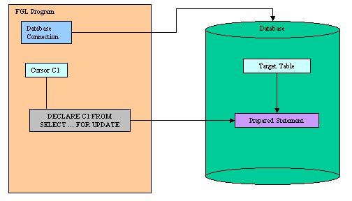
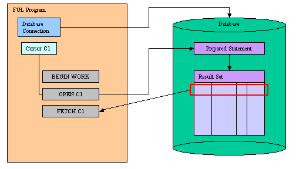
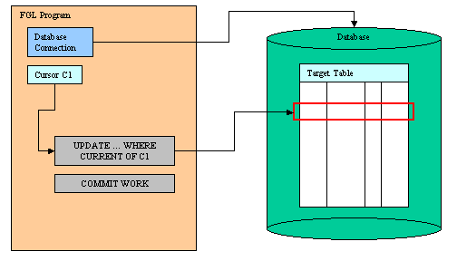

[Back to Contents](../index.html)

------------------------------------------------------------------------

# [SQL Positioned Updates]{#PAGE_HEADER}

Summary:

- [What is a Positioned Update?](#WHAT_IS_POSUPD)
- [Declaring a cursor for update](#PU_DECLARE) (`DECLARE`)
- [Updating a row by cursor position](#PU_UPDATE)
  (`UPDATE ... WHERE CURRENT OF`)
- [Deleting a row by cursor position](#PU_DELETE)
  (`DELETE ... WHERE CURRENT OF`)
- [Examples](#EXAMPLES)

*See also:* [Transactions](Transactions.html), [Static
SQL](StaticSql.html), [Dynamic SQL](DynamicSql.html), [Result
Sets](ResultSets.html), [SQL Errors](Exceptions.html#SQLERRORS).

------------------------------------------------------------------------

### [What is a Positioned Update?]{#WHAT_IS_POSUPD}

When declaring a [database cursor](ResultSets.html) with a `SELECT`
statement using a unique table and including the `FOR UPDATE` keywords,
you can update or delete database rows by using the `WHERE CURRENT OF`
keywords in the [UPDATE](StaticSql.html#SS_UPDATE) or
[DELETE](StaticSql.html#SS_DELETE) statements. Such an operation is
called Positioned Update or Positioned Delete.

Some database servers do not support **hold** cursors (`WITH HOLD`)
declared with a `SELECT` statement including the `FOR UPDATE` keywords.
The SQL standards require \'for update\' cursors to be automatically
closed at the end of a transaction. Therefore, it is strongly
recommended that you use positioned updates in a [transaction
block](Transactions.html).

Do not confuse positioned update with the use of `SELECT FOR UPDATE`
statements that are not associated with a [database
cursor](ResultSets.html). Executing `SELECT FOR UPDATE` statements is
supported by the language, but you cannot perform positioned updates
since there is no cursor identifier associated to the result set. 

To perform a positioned update or delete, you must
[declare](ResultSets.html#RS_DECLARE) the database cursor with a
`SELECT FOR UPDATE` statement:

{border="0" width="504" height="288"}

Then, [start a transaction](Transactions.html#TI_BEGIN_WORK), [open the
cursor](ResultSets.html#RS_OPEN) and [fetch a
row](ResultSets.html#RS_FETCH):

{border="0" width="504" height="288"}

Finally, you [update](StaticSql.html#SS_UPDATE) or
[delete](StaticSql.html#SS_DELETE) the current row and you
[commit](Transactions.html#TI_COMMIT_WORK) the transaction:

{border="0" width="504" height="288"}

------------------------------------------------------------------------

### [DECLARE]{#PU_DECLARE}

#### Purpose:

Use this instruction to associate a database cursor with a `SELECT`
statement to perform positioned updates in the [current
connection](Connections.html).

#### Syntax:

`DECLARE `*`cid`*` `[`[`]{.underline}`SCROLL`[`]`]{.underline}` CURSOR `[`[`]{.underline}`WITH HOLD`[`]`]{.underline}` FOR `[`{`]{.underline}` `*`select-statement `[`|`]{.underline}` sid`*` `[`}`]{.underline}

#### Notes:

1.  *cid* is the identifier of the database cursor.
2.  *select-statement* is a `SELECT` statement defined in [Static
    SQL](StaticSql.html).
3.  To perform [positioned updates](#WHAT_IS_POSUPD), the
    *select-statement* must include the `FOR UPDATE` keywords.
4.  *sid* is the identifier of a [prepared](DynamicSql.html#DS_PREPARE)
    `SELECT` statement including the `FOR UPDATE` keywords.
5.  See the `DECLARE` instruction description in [Result Sets
    Processing](ResultSets.html).
6.  `DECLARE` must precede any other statement that refers to the cursor
    during program execution.

#### Warnings:

1.  The scope of reference of the *cid* cursor identifier is local to
    the module where it is declared. Therefore, you must execute the
    `DECLARE`, `UPDATE` or `DELETE` instructions in the same module.
2.  Use the `WITH HOLD` option carefully, because this feature is
    specific to IBM Informix servers. Other database servers do not
    behave as Informix does with such cursors. For example, if the
    `SELECT` is not declared `FOR UPDATE`, most database servers keep
    cursors open after the end of a [transaction](Transactions.html),
    but IBM DB2 automatically closes all cursors when the transaction is
    [rolled back](Transactions.html#TI_ROLLBACK_WORK).

------------------------------------------------------------------------

### [UPDATE \... WHERE CURRENT OF]{#PU_UPDATE}

#### Purpose:

Updates the current row in a result set of a database cursor declared
for update.

#### Syntax:

`UPDATE `*`table-specification`\*
`   SET`\
`       `*`column`*` = `[`{`]{.underline}` `*`variable`*` `[`|`]{.underline}` `*`literal`*` `[`|`]{.underline}` NULL `[`}`]{.underline}\
`       `[`[,...]`]{.underline}\
`   WHERE CURRENT OF `*`cid`*

#### Notes:

1.  *table-specification* identifies the target table (see
    [UPDATE](StaticSql.html#SS_UPDATE) for more details).
2.  *column* is a name of a table column.
3.  *variable* is a program [variable](Variables.html), a
    [record](Records.html) or an [array](Arrays.html) used as a
    parameter buffer to provide values.
4.  *literal* is any [literal expression](Literals.html) supported by
    the language.
5.  *cid* is the identifier of the database cursor declared [for
    update](#PU_DECLARE).
6.  The `UPDATE` statement does not advance the cursor to the next row,
    so the current row position remains unchanged.

#### Warnings:

1.  The scope of reference of the *cid* cursor identifier is local to
    the module where it is declared. Therefore, you must execute the
    `DECLARE`, `UPDATE` or `DELETE` instructions in the same module.
2.  There must be a current row in the result set. Make sure that the
    SQL status returned by the last [FETCH](ResultSets.html#RS_FETCH) is
    equal to zero.
3.  If the `DECLARE` statement that created the cursor specified one or
    more columns in the `FOR UPDATE` clause, you are restricted to
    updating only those columns in a subsequent
    `UPDATE ... WHERE CURRENT OF` statement.

------------------------------------------------------------------------

### [DELETE \... WHERE CURRENT OF]{#PU_DELETE}

#### Purpose:

Deletes the current row in a result set of a database cursor declared
for update.

#### Syntax:

`DELETE FROM `*`table-specification`\*
`    WHERE CURRENT OF `*`cid`*

#### Notes:

1.  *table-specification* identifies the target table (see
    [DELETE](StaticSql.html#SS_DELETE) for more details).
2.  *cid* is the identifier of the database cursor declared [for
    update](#PU_DECLARE).
3.  After the deletion, no current row exists; you cannot use the cursor
    to delete or update a row until you re-position the cursor with a
    [FETCH](ResultSets.html#RS_FETCH) statement.

#### Warnings:

1.  The scope of reference of the *cid* cursor identifier is local to
    the module where it is declared. Therefore, you must execute the
    `DECLARE`, `UPDATE` or `DELETE` instructions in the same module.
2.  There must be a current row in the result set. Make sure that the
    SQL status returned by the last [FETCH](ResultSets.html#RS_FETCH) is
    equal to zero.

------------------------------------------------------------------------

### [Examples]{#EXAMPLES}

#### [Example 1]{#EXAMPLE_1}:

``` linenumber
01 MAIN
02    DEFINE pname CHAR(30)
03    DATABASE stock
04    DECLARE uc CURSOR FOR
05      SELECT name FROM item WHERE key=123 FOR UPDATE
06    BEGIN WORK
07      OPEN uc
08      FETCH uc INTO pname
09      IF sqlca.sqlcode=0 THEN
10         LET pname = "Dummy"
11         UPDATE item SET name=pname WHERE CURRENT OF uc
12      END IF
13      CLOSE uc
14    COMMIT WORK
15    FREE uc
16 END MAIN
```
