[Back to Contents](../index.html)

------------------------------------------------------------------------

# Presentation Styles

Summary:

- [Introduction](#INTRO)
- [Syntax](#SYNTAX)
- [Usage](#USAGE)
  - [Defining a Style](#DEF_STYLE)
  - [Pseudo selectors](#PSEUDO_SELECTORS)
  - [Using a specific style](#USING_A_STYLE)
  - [Combining styles](#COMBINING_STYLES)
  - [Style attribute inheritance](#STYLE_INHER)
  - [Styles in the AUI tree](#STYLES_IN_AUI)
  - [Loading Presentation Styles](#XML_STYLE_FILE)
  - [Example of 4st file content](#4ST_EXAMPLE)
  - [Example of 4st file loading](#LOAD_EXAMPLE)
  - [Combining TTY and Style attributes](#TTY_VS_STYLE_ATT)
- [Element Types](#Element_Types)
- [Colors](#COLORS)
- [Using Fonts](#USING_FONTS)
- [Font Families](#FONTFAMILY)
- [Font Sizes](#FONTSIZE)
- [Style Attributes Reference](#STYATT_REFERENCE)
  - [Common Style Attributes](#STYATT_COMMON)
  - [Window Style Attributes](#STYATT_WINDOW)
  - [StartMenu Style Attributes](#STYATT_STARTMENU)
  - [MDI Container Style Attributes](#STYATT_MDI)
  - [Folder Style Attributes](#STYATT_FOLDER)
  - [Action Style Attributes](#STYATT_ACTION)
  - [Button Style Attributes](#STYATT_BUTTON)
  - [ButtonEdit Style Attributes](#STYATT_BUTTONEDIT)
  - [Table Style Attributes](#STYATT_TABLE)
  - [ComboBox Style Attributes](#STYATT_COMBOBOX)
  - [DateEdit Style Attributes](#STYATT_DATEEDIT)
  - [Label Style Attributes](#STYATT_LABEL)
  - [Image Style Attributes](#STYATT_IMAGE)
  - [Menu Style Attributes](#STYATT_MENU)
  - [Message Style Attributes](#STYATT_MESSAGE)
  - [ProgressBar Style Attributes](#STYATT_PROGRESSBAR)
  - [RadioGroup Style Attributes](#STYATT_RADIOGROUP)
  - [TextEdit Style Attributes](#STYATT_TEXTEDIT)
  - [Toolbar Style Attributes](#STYATT_TOOLBAR)

*See also:* [Dynamic User Interface](DynamicUI.html).

------------------------------------------------------------------------

## [Introduction]{#INTRO}

Presentation Styles allow you to define a set of decoration properties
to be used in graphical objects. Presentation Styles are provided to
centralize attributes related to the appearance of user interface
elements.

Typical presentation attributes define font properties and foreground
and background colors. Some presentation attributes will be specific to
a given class of widgets (like the first day of week in a DATEEDIT).

Presentation Styles are defined in a resource file having an extension
of **4st,**  which must be distributed with other runtime files.

------------------------------------------------------------------------

## [Syntax]{#SYNTAX}

`<StyleList>`\
`  <Style name="`*`style-identifier`*`" >`\
`     <StyleAttribute name="`*`attribute-name`*`" value="`*`attribute-value`*`" />`\
`     `[`[...]`]{.underline}\
`  </Style>`\
`  `[`[...]`]{.underline}\
`</StyleList>`

where *style-identifier* can be:

[`{`]{.underline}` *`\
[`|`]{.underline}` `*`element-type`*\
[`|`]{.underline}` .s`*`tyle-name`*\
[`|`]{.underline}` `*`element-type`*`.s`*`tyle-name`*` `[`}`]{.underline}

#### Notes:

1.  *element-type* defines the type of the graphical object (for
    example, ` Window`).
2.  *style-name* is the name of a specific style referenced by graphical
    objects using the `style` attribute.
3.  *attribute-name* defines the name of the attribute.
4.  *attribute-value* defines the value to be assigned to
    *attribute-name*.

------------------------------------------------------------------------

## [Usage]{#USAGE}

Presentation Styles centralize the attributes related to the decoration
of the elements of the user interface. Note that Presentation Styles are
only supported for the GUI front-ends. If you design an application for
the TUI mode, you can use TTY attributes. Styles are applied implicitly
by using global styles, or explicitly by naming a specific style in the
` style` attribute of the element.

### [[Defining a style]{#DEF_STYLE}]{.underline}

 In the definition of a style, the \'name\' attribute is used as a
selector to apply style attributes to graphical elements.

You can define a style as global or specific:

- A style identified by a star (\*) is a global style that is
  automatically applied to all elements:

> ``` linenumber
> 01 <Style name="*" >
> ```

- A style identified by an *element-type* is a global style that is
  automatically applied to all objects of this type:

> ``` linenumber
> 01 <Style name="Window" >
> 02 <Style name="Edit" >
> 03 <Style name="ComboBox" >
> ```

- A style identified by a *style-name* is a specific style that can be
  applied to any element types using that style: 

> ``` linenumber
> 01 <Style name=".important" >
> 02 <Style name=".smallfont" >
> ```

- A style identified by an *element-type* followed by a dot and a
  *style-name* is a specific style that will only be applied to elements
  of the given type: 

> ``` linenumber
> 01 <Style name="Window.main" >
> 02 <Style name="Edit.mandatory" >
> ```

[Priority:]{style="text-decoration: underline"} When different styles
can be applied to an element, the following priority, from the most
precise to the most generic, is used to determine the correct style  :

1.  `element-type.style-name`
2.  `.style-name`
3.  `element-type`
4.  `*`

For instance, to find the style which will be applied to an `Edit`
having the style attribute set to \'`mandatory`\', the following styles
will be analyzed:

1.  `Edit.mandatory`
2.  `.mandatory`
3.  `Edit`
4.  `*`

### [[Pseudo selectors]{#PSEUDO_SELECTORS}]{.underline}

You can define a pseudo selector to make your style apply only when some
conditions are fulfilled. You must precede it with a colon. You can also
combine the  pseudo selectors. If you do so, the style will be applied
if all pseudo selector conditions are fulfilled.

``` linenumber
01 <Style name="Table:even:input" >
02 <Style name="Edit:focus" >
03 <Style name="Edit.important:focus" >
```

Pseudo selectors have different priorities, and the style with the most
important pseudo selector will be used when several styles match.

  -------------- ---------------------- --------------------------------------------------------------------------------------------
  **Priority**   **Pseudo selectors**   **Condition**
  1              `focus`                the widget has the focus
  2              `query`                the widget is in construct mode
  3              `display`              the widget is in a display array
  4              `input`                the widget is in an input array, input or construct
  5              `even`                 this widget is on an even row if an array (only Table)
  6              `odd`                  this widget is on an odd row if an array (only Table)
  7              `inactive`             the widget is inactive
  8              `active`               the widget is active
  9              `message`              applies only to text displayed with the [MESSAGE instruction](MessageDisplay.html#MESSAGE)
  10             `error`                applies only to text displayed with the [ERROR instruction](MessageDisplay.html#ERROR)
  -------------- ---------------------- --------------------------------------------------------------------------------------------

Pseudo selectors also define the priority of your styles;: a more
generic style will be used if the pseudo-selector has higher priority.

For instance: you want all important edits to have red text, but you
want the current field to be displayed in blue:

``` linenumber
01 <Style name="Edit.important" >
02 <Style name=":focus" >
```

Style \":focus\" may be more generic than Edit.important; it will be
used for the focused item, as the pseudo selector is more precise.

### [[Using a specific style]{#USING_A_STYLE}]{.underline}

To apply a specific style, set the *style-name* in the `style` attribute
of the node representing the graphical element in the Abstract User
Interface tree.

There are different ways to set the `style` attribute of a element:

- In the `ATTRIBUTES` clause of instructions such as [OPEN
  WINDOW](WindowsAndForms.html), [MESSAGE](MessageDisplay.html#MESSAGE),
  [ERROR](MessageDisplay.html#ERROR).
- As a form element attribute, in the [Form Specification
  File](FormSpecFiles.html).
- Dynamically by a program, using the DOM API or a built-in class method
  like [setElementStyle()](ClassForm.html).

For example,  to define a style in a form file for a input field:

``` linenumber
01 EDIT f001 = customer.fname, STYLE = "info";
```

### [[Combining styles]{#COMBINING_STYLES}]{.underline}

You can combine several styles by using the space character as a
separator in the `style` attribute:

``` linenumber
01 EDIT f001 = customer.fname, STYLE = "info highlight mandatory";
```

When several styles are combined, the same presentation attribute might
be defined by different styles. In this case, the first style listed
that defines the attribute takes precedence over the other styles.

For example, if the `textColor` presentation attribute is defined as
follows by the styles *info*, *highlight* and *mandatory*:

- *info* style does not define `textColor`.
- *highlight* style defines `textColor` as **blue**.
- *mandatory* style defines `textColor` as **red**.

Then the widgets having a style set to `"info highlight mandatory"` have
`textColor` of **blue.**

### [[Style Attribute Inheritance]{#STYLE_INHER}]{.underline}

A style attribute may be inherited by the descendants of a given node in
the Abstract User Interface tree. For example, when using a style
defining a `fontFamily` in a `GROUPBOX` container, you would expect that
all the children in that groupbox would have the same font. However,
some style attributes should not be inherited, such as
`backgroundImage`.

Style inheritance is implicitly defined based on the attribute. The
following sections contain tables with descriptions of style attributes,
including the implicit inheritance for each attribute.

### [[Presentation Styles in the Abstract User Interface tree]{#STYLES_IN_AUI}]{.underline}

Presentation Styles are defined in the [Abstract User Interface
tree](DynamicUI.html), under the `UserInterface` node, in a `StyleList`
node following the syntax described above. The `StyleList` node holds a
list of `Style` nodes that define a set of attribute values. Attribute
values are defined in `StyleAttribute` nodes, with a `name` and a
`value` attribute.

### [[Loading Presentation Styles]{#XML_STYLE_FILE}]{.underline}

Presentation Styles can be defined in an XML file that has the **4st**
extension. By default, the runtime system searches for a file named
\"`default.4st`\" in the current directory. If this file does not exist,
it searches in the directories defined in the
[DBPATH](EnvironmentVariables.html#EV_DBPATH)/[FGLRESOURCEPATH](EnvironmentVariables.html#EV_FGLRESOURCEPATH)
environment variable. If the file was not found using
DBPATH/FGLRESOURCEPATH, standard Genero presentation styles are loaded
from \"`FGLDIR/lib/default.4st`\" file.

You can overwrite the default search by loading a specific Presentation
Style file with the [ui.Interface.loadStyles()](ClassInterface.html)
method. This method accepts an absolute path [with]{.underline} the
**4st** extension, or a simple file name [without]{.underline} the
**4st** extension. If you give a simple file name, for example
\"`mystyles`\", the runtime system searches for the \"`mystyles.4st`\"
file in the current directory. If the file does not exist, it searches
in the directories defined in the
[DBPATH](EnvironmentVariables.html#EV_DBPATH)/[FGLRESOURCEPATH](EnvironmentVariables.html#EV_FGLRESOURCEPATH)
environment variable.

#### Warnings:

1.  The presentation styles must be defined in a unique **4st** file.
    When loading a styles file with the
    [ui.Interface.loadStyles()](ClassInterface.html) method, current
    styles created from the default file or from a prior load will be
    replaced. The styles will not be combined when loading several
    files.
2.  The default styles file located in `FGLDIR/lib` should not be
    modified directly: your changes would be lost if you upgrade Genero
    FGL. You better make a copy if the original file into the program
    directory of your application.

### [[Example of 4st file content]{#4ST_EXAMPLE}]{.underline}

``` linenumber
01 <StyleList>
02 <Style name="*" >
03  <StyleAttribute name="fontFamily" value="serif" />
04 </Style>
05 <Style name=".important" >
06  <StyleAttribute name="textColor" value="#ff0000" />
07 </Style>
08 <Style name="Window" >
09  <StyleAttribute name="toolBarPosition" value="top" />
10  <StyleAttribute name="statusBarType" value="default" />
11 </Style>
12 <Style name="Window.dialog" >
13  <StyleAttribute name="toolBarPosition" value="none" />
14  <StyleAttribute name="statusBarType" value="node" />
15 </Style>
16 </StyleList>
```

### [[Example of 4st file loading]{#LOAD_EXAMPLE}]{.underline}

``` linenumber
01 MAIN
02    CALL ui.Interface.loadStyles("mystyles")
03    ...
04 END MAIN
```

### [Combining TTY and Style attributes]{#TTY_VS_STYLE_ATT}

TTY attributes can be [specific]{.underline} to a form element or can be
[inherited]{.underline} by an element from a parent node (i.e. the
form/window). Specific element TTY attributes are directly set in the
element node in the AUI tree; they can, for example, be defined with the
[COLOR](FSFAttributes.html#FA_COLOR) attribute of form items. Inherited
TTY attributes are taken from the the parent nodes of the leaf element
to be displayed. For example, when a form is displayed with [DISPLAY
FORM](WindowsAndForms.html#DISPLAY_FORM) followed by an `ATTRIBUTE`
clause containing TTY color, font option and/or video attributes, all
static [LABELs](FormSpecFiles.html#FF_ITEMTYPE_LABEL) will be displayed
with the TTY attributes of the form. Note however that the form elements
controlled by interactive instructions (i.e. form fields) will
explicitly get the TTY attributes defined by the `ATTRIBUTE` clause of
[OPEN WINDOW](WindowsAndForms.html#OPEN_WINDOW), [OPEN
FORM](WindowsAndForms.html#OPEN_FORM), [DISPLAY TO / BY
NAME](RecordDisplay.html#DISPLAY_BY_NAME) or the current dialog
statement, and must be considered specific TTY attributes for the
element.

Specific TTY attributes defined for a form element have a [higher
priority]{.underline} than style attributes, while inherited TTY
attributes (set on one of the parent elements) have a [lower
priority]{.underline} than style attributes defined for the element.

To illustrate this rule, imagine a form defining 2 static labels and 2
fields, with all items using the *mystyle* presentation style, and one
of the labels and fields defining a specific blue text color:

``` linenumber
01 LABEL lab01: TEXT="Field 1:", COLOR = BLUE, STYLE = "mystyle";
02 EDIT fld01 = FORMONLY.field01, COLOR = BLUE, STYLE = "mystyle";
03 LABEL lab02: TEXT="Field 2:", STYLE = "mystyle";
04 EDIT fld02 = FORMONLY.field02, STYLE = "mystyle";
```

The program displays the form (or window) with an `ATTRIBUTES` clause
using a red color, and the fields are used by an `INPUT` dialog (with no
`ATTRIBUTES` clause, so the default TTY attributes are gotten from the
`OPEN FORM` instruction):

``` linenumber
01 OPEN FORM f FROM "ttyform"
02 DISPLAY FORM f ATTRIBUTES(RED)
03 INPUT BY NAME field01, field02 WITHOUT DEFAULTS
```

The .4st styles file defines the *mystyle* attributes as follows:

``` linenumber
01 <StyleList>
02   <Style name="Edit.mystyle" >
03      <StyleAttribute name="textColor" value="green" />
04   </Style>
02   <Style name="Label.mystyle" >
03      <StyleAttribute name="textColor" value="magenta" />
04   </Style>
16 </StyleList>
```

The text in the form field *fld01* is displayed in blue (from the
specific `COLOR` attribute), while *fld02* is displayed in red (the TTY
attribute of the form, the style *Edit.mystyle* being ignored).

Since labels are not used by the interactive instructions, *lab01* is
displayed in blue (from the specific `COLOR` attribute), while *lab02*
is displayed in magenta (from the style *Label.mystyle*, the form TTY
attribute red being ignored).

------------------------------------------------------------------------

## [Element Types]{#Element_Types}

Styles may apply to any graphical elements of the user interface, such
as the following:

+-----------------------------------+-----------------------------------+
| - Button                          | - Label                           |
| - ButtonEdit                      | - RadioGroup                      |
| - CheckBox                        | - Slider                          |
| - ComboBox                        | - SpinEdit                        |
| - DateEdit                        | - Table                           |
| - Edit                            | - TimeEdit                        |
| - Form                            | - Window                          |
| - Image                           |                                   |
+-----------------------------------+-----------------------------------+

The name of the element when used in a style file is case-sensitive
(CheckBox, not checkbox).

## [Colors]{#COLORS}

This section describes how to specify a value for style attributes
defining colors, such as `textColor`.

### Syntax:

[`{`]{.underline}` `*`generic-color`*` `[`|`]{.underline}` #`*`rrggbb`*` `[`}`]{.underline}

### Notes:

1.  *generic-color* is any of the predefined colors supported by the
    language.
2.  *#rrggbb* is a numerical color defined by a red/green/blue
    specification.

### Usage:

The language defines a set of generic colors, interpreted by the front
end according to the graphical capability of the workstation.

  ------------------------ --------------- ------------------
  **Generic color name**   **RGB Value**   **Color sample**
  `white`                  `#FFFFFF`       
  `black`                  `#000000`        
  `darkGray`               `#A9A9A9`        
  `gray`                   `#808080`        
  `lightGray`              `#D3D3D3`        
  `darkBlue`               `#00008B`        
  `blue`                   `#0000FF`        
  `lightBlue`              `#ADD8E6`        
  `darkCyan`               `#008B8B`        
  `cyan`                   `#00FFFF`        
  `lightCyan`              `#E0FFFF`        
  `darkMagenta`            `#8B008B`        
  `magenta`                `#FF00FF`        
  `lightMagenta`           `#FFC0FF`        
  `darkOlive`              `#505000`        
  `olive`                  `#808000`        
  `lightOlive`             `#AAAA44`        
  `darkGreen`              `#006400`        
  `green`                  `#00FF00`        
  `lightGreen`             `#90EE90`        
  `darkTeal`               `#005050`        
  `teal`                   `#008080`        
  `lightTeal`              `#33CCCC`        
  `darkRed`                `#8B0000`        
  `red`                    `#FF0000`        
  `lightRed`               `#FF8080`        
  `darkOrange`             `#FF8C00`        
  `orange`                 `#FFA500`        
  `lightOrange`            `#FFCC00`        
  `darkYellow`             `#AAAA00`        
  `yellow`                 `#FFFF00`        
  `lightYellow`            `#FFFFE0`        
  ------------------------ --------------- ------------------

You can also specify a generic system color:

  ------------------------------- ----------------------------------------------------
  **Generic system color name**   **Meaning**
  `window`                        Window background.
  `windowText`                    Text in Windows.
  `buttonFace`                    Face color for three-dimensional display elements.
  `buttonText`                    Text on PushButtons.
  `highLight`                     Item(s) selected in a control.
  `highLightText`                 Text of item(s) selected in a control
  `infoBackground`                Background color for tooltip controls.
  `infoText`                      Text color for tooltip controls.
  `grayText`                      Grayed (disabled) text. 
  `appWorkSpace`                  Background color of multiple document interface
  `background`                    Desktop background
  ------------------------------- ----------------------------------------------------

You can also specify a color with the RGB notation, starting with a \#
dash character.

Each value of the RGB color specification must be provided in
hexadecimal, in the range \[00-FF\].

### Examples:

`<StyleAttribute name="textColor" value="blue" />`\
`<StyleAttribute name="textColor" value="#00FF45" />`

------------------------------------------------------------------------

## [Using Fonts]{#USING_FONTS}

A desktop application should follow the current desktop settings. The
[front-end](FglTerms.html#FRONT_END) tries to determine the default font
for the desktop, and also offers a global font chooser to let the
end-user define which font best matches his expectations.

In most cases it is not possible to know what a potential end-user might
expect regarding the font family. Therefore, the configuration should
**avoid** using explicit font families and use only the
`fontWeight`/`fontStyle`/`fontSize` properties. Only if the client
can\'t determine a proper default font family for the desired platform
should a known font family be added to the configuration.

Use abstract font sizes such as `medium`, `large`, `small`, or sizes
relative to the user-chosen font (`em`{.sample} units), rather than
absolute point values. In an HTML browser you can choose two fonts
(proportional/fixed), and a well-designed document should not use more
than 2 fonts. This is also valid for applications.

------------------------------------------------------------------------

## [Font Families]{#FONTFAMILY}

This section describes the possible values of the `fontFamily` style
attribute.

### Syntax:

*`font-family`*` `[`[`]{.underline}`,...`[`]`]{.underline}

### Notes:

1.  *font-family* defines a generic font family or a specific font
    family.
2.  You can specify a comma-separated list of fonts.

### Usage:

The language defines a set of generic font families, interpreted by the
front end according to the graphical capability of the workstation:

  ------------------------------ ----------------------------------------------- -------------------------------------------------------------
  **Generic font family name**   **Real font family example**                    **Text sample**
  `serif`                        [Times]{style="font-family: Western"}           [**This is a nice font!**]{style="font-family: serif"}
  `sans-serif`                   [Arial]{style="font-family: Western"}           [**This is a nice font!**]{style="font-family: sans-serif"}
  `cursive`                      [Comic Sans Ms]{style="font-family: Western"}   **This is a nice font!**
  `fantasy`                      [Algerian]{style="font-family: Western"}        **This is a nice font!**
  `monospace`                    [Courier New]{style="font-family: Western"}     **This is a nice font!**
  ------------------------------ ----------------------------------------------- -------------------------------------------------------------

Any other name is interpreted as a specific font family, which
identifies a local font supported by the front-end. Usually, it is one
of the fonts installed on the workstation operating system. See
front-end documentation for a list of supported local fonts.

Any font name containing white-spaces must be quoted, with single
quotes.

You can specify a comma-separated list of font families.

### Examples:

`<StyleAttribute name="fontFamily" value="sans-serif" />`\
`<StyleAttribute name="fontFamily" value="'Courier New'" />`\
`<StyleAttribute name="fontFamily" value="'Times New Roman',Times,serif" />`

------------------------------------------------------------------------

## [Font Sizes]{#FONTSIZE}

This section describes the possible values of the `fontSize` style
attribute.

### Syntax:

[`{`]{.underline}` `*`generic-size`*` `[`|`]{.underline}` `*`nn`*`pt `[`|`]{.underline}` `*`xx`*`em `[`}`]{.underline}

### Notes:

1.  *generic-size* is one of the generic sizes such as \'`small`\' or
    \'`xx-large`\'.
2.  *nn* defines an absolute size in number of points ( 1pt = 1/72
    inches ).
3.  *xx* defines an relative size in the size units of the client ( 1em
    = as large as the font chosen in the client )

### Usage:

The language defines a set of generic font sizes, interpreted by the
front end according to the graphical capability of the workstation.

`xx-small, x-small, small, medium, large, x-large, xx-large.`

You can also specify an absolute font size, by giving a numeric value
followed by the units (pt):

### Examples:

`<StyleAttribute name="fontSize" value="medium" />`\
`<StyleAttribute name="fontSize" value="xx-large" />`\
`<StyleAttribute name="fontSize" value="12pt" />`\
`<StyleAttribute name="fontSize" value="1em" />`

------------------------------------------------------------------------

## [Style Attributes Reference]{#STYATT_REFERENCE}

A Style attribute may be a common attribute that can be applied to any
graphical element. Other Style attributes apply only to a specific
graphical element (see below).

### [Common Style Attributes]{#STYATT_COMMON}

The style attributes described in this section apply to any graphical
elements, such as windows, layout containers, or form items.

  ---------------------------------------------- --------------------------------- ------------------------------------------------------------------------------------------------
  **Attribute**                                   **[Inheritance](#STYLE_INHER)**  **Description**

  `backgroundImage`                                             No                 Defines an image file to be displayed in the background.**\**
                                                                                   Value can be a simple local image file name without the extension, or an URL.**\**
                                                                                   Default is no value (no background image).

  `backgroundColor`                                             No                 Defines the color to be used to fill the background of the object.**\**
                                                                                   For possible values, see [Colors](#COLORS).\
                                                                                   Default is no value (default color of the object).

  `fontFamily`                                                  Yes                Defines the name of the font.\
                                                                                   For possible values, see [Font Families](#FONTFAMILY).\
                                                                                   Default is no value (default object font or inherited font).

  `fontSize`                                                    Yes                Defines the size of the characters.\
                                                                                   For possible values, see [Font Sizes](#FONTSIZE).\
                                                                                   Default is no value (default object font or inherited font).

  `fontStyle`                                                   Yes                Defines the style of characters.\
                                                                                   Values can be `"normal",` `"italic"` or  `"oblique"`. \
                                                                                   Default is no value  (default object font or inherited font).

  `fontWeight`                                                  Yes                Defines the weight of the characters.\
                                                                                   Values can be `"light"`, `"normal"`, ` "bold"`, `"demi-bold"` or  `"black"`.\
                                                                                   Default is no value  (default object font or inherited font).

  `textColor`                                                   Yes                Defines the color to be used to paint the text of the object.**\**
                                                                                   For possible values, see [Colors](#COLORS).\
                                                                                   Default is no value (default object color or inherited color).

  `textDecoration`                                              Yes                Defines the decoration for the text.\
                                                                                   Values can be `"overline"`, `"underline"` or  `"line-through"`.\
                                                                                   Default is no value (default object font or inherited font).

  `border`                                                      No                 Defines the border for the widget.\
                                                                                   If Value is `"none"`, it removes the border.\
                                                                                   Default is no value (the widget gets its default appearance).\
                                                                                   This attribute especially applies to Image, Edit, ButtonEdit, DateEdit, RadioGroup, Group,
                                                                                   Button, Action, MenuAction, Menu, and Dialog.

  [`localAccelerators`]{#localAccelerators}` `                  No                 Defines how the widget must behaves regarding key strokes.\
                                                                                   If value is `"yes"` (default), the local accelerators have higher priority.\
                                                                                   Ex: \"HOME\" key moves the cursor to the first position.\
                                                                                   If value is `"no"`, the application accelerators have higher priority.\
                                                                                   Ex: \"HOME\" key selects the first row of the current array.\
                                                                                   The following keys are managed \"locally\" if attribute defined to `"yes"`.\
                                                                                   [TextEdits:]{.underline}
                                                                                   `left, right, up, down, (control+)home, (control+)end, (control+)backspace, (control+)delete`\
                                                                                   [Edits Based widgets:]{.underline}
                                                                                   `left, right, home, end, (control+)backspace, (control+)delete`

  [`imageCache`]{#imageCache}` `                                No                 Defines if the image of the item can be cached of not by the front end. If value is `"yes"` the
                                                                                   front-end can cache the image locally. By default, Image for image fields are not cached and
                                                                                   image for form items (Button, TopMenu item, Toolbar item) are cached..
  ---------------------------------------------- --------------------------------- ------------------------------------------------------------------------------------------------

\

------------------------------------------------------------------------

### [Window Style Attributes]{#STYATT_WINDOW} {#window-style-attributes dir="ltr"}

The following table shows the presentation attributes for
[Windows](WindowsAndForms.html):

**Attribute**

**[Inheritance](#STYLE_INHER)**

**Description**

`windowType`

No

Defines the basic type of the window. Values can be `"normal"` or
`"modal"`.\
Normal windows are displayed as typical application windows. Modal
windows are displayed at the top of all other windows, typically used
for temporary dialogs.**\**
Default is `"normal"`.

`windowState`

No

Defines the initial state of a window. Values can be `"normal"` or
`"maximized"`.\
Default is `"normal"`.

`ignoreMinimizeSetting`

No

Defines if the stored settings \"state=minimize\" must be ignored when
loading settings.\
To be used when minimized windows should not be shown minimized again
when reopen.\
Values can be `"yes"` or `"no"` (default).

`windowOptionClose`

No

Defines if the window can be closed with a system menu option or window
header button. Values can be `"yes"`, `"no"` or `"auto"`. When value is
`"auto"`, the option is enabled according to the window type.\
Default is `"auto"`.\
**Warning:** This attribute may have different behavior depending on the
front end operating system. For example, when no system menu is used, it
may not be possible to have this option enabled. 

`windowOptionMinimize`

No

Defines if the window can be minimized with a system menu option or
window header button. Values can be `"yes"`, `"no"` or `"auto"`. When
value is `"auto"`, the option is enabled according to the window type.\
Default is `"auto"`.\
**Warning:** This attribute may have different behavior depending on the
front end operating system. For example, when no system menu is used, it
may not be possible to have this option enabled. 

`windowOptionMaximize`

No

Defines if the window can be maximized with a system menu option or
window header button. Values can be `"yes"`, `"no"` or `"auto"`. When
value is `"auto"`, the option is enabled according to the window type.\
Default is `"auto"`.\
**Warning:** This attribute may have different behavior depending on the
front end operating system. For example, when no system menu is used, it
may not be possible to have this option enabled. 

`windowSystemMenu`

No

Defines if the window shows a system menu. Values can be `"yes"`, `"no"`
or `"auto"`. When value is `"auto"`, the system menu is enabled
according to the window type.\
Default is `"auto"`.

`sizable`

No

Defines if the window can be resized by the user. Values can be `"yes"`,
`"no"` or `"auto"`. When using `"auto"`, the window becomes resizable if
the content of the first displayed form has resizable elements, for
example when using a form with a
[TABLE](FormSpecFiles.html#FF_CONTAINER_TABLE) container or an
[TEXTEDIT](FormSpecFiles.html#FF_ITEMTYPE_TEXTEDIT) with
[STRETCH](FSFAttributes.html#FA_STRETCH) attribute.\
**Warning:** On Linux, most of window managers don\'t take into account
`sizable` set to `"no"`.\
When using `"auto"`, the window becomes resizable based on the first
form used in the window; the content of further forms is ignored.\
Default is `"yes"`.

`position`

No

Indicates the initial position of the window. Values can be `"default"`,
`"field"`, `"previous"`, `"center"` or `"center2"`.\
When using `"default"`, the windows are displayed according to the
window manager rules.\
When using `"field"` the window is displayed below the current field
(works as `"default"` when current field does not exist).\
When using `"previous"` the window is displayed at the same position
(top left corner) as the previous window. (works as `"default"` when
there is no previous window).\
With `"center"`, the window is displayed in the center of the screen.\
With `"center2"`, the window is displayed in the center of the current
window.\
Default is `"default"`.\
**[Warning:]{style="color: #ff0000"}** for front-ends using stored
settings, `"field"`, `"previous"` [
]{style="color: #800000; font-family: Courier New"}and `"previous"` have
higher priority than the settings.

`border`

No

Defines the border type of the window. Values can be `"normal"`,
`"frame"`, `"tool"` or `"none"`. When using `"normal"`, the border is
standard, with a normal window header with a caption. When using
`"frame"`, only a frame appears, typically without a window header. When
using `"tool"`, a small window header is used. When using `"none"`, the
window has no border.\
Default is `"normal"`\
**[Warning:]{style="color: #ff0000"}**: On Linux KDE 3.x client
machines, any application that is started on the Genero Desktop Client
with window style attribute `"border"` set to `"tool"` seems to
disappear when you click elsewhere than on the window itself. But you
can make it appear again by clicking on the GDC console. KDE also allows
to configure this behavior: Press Alt-F3, then \"Configure Window
Behavior\" =\> \"Advanced\" =\> uncheck \"Hide utility windows for
inactive applications\".\

`forceDefaultSettings`

No

Indicates if the window content must be initialized with the saved
positions and sizes. By default, windows are re-opened at the position
and with the size they had when they were closed. You can force the use
of the initial settings with this attribute. This applies also to column
position and width in tables.\
Default is `"0"`.

`actionPanelPosition`

No

Defines the position of the action button frame (OK/Cancel).  Values can
be `"none"`, `"top"`, `"left"`, `"bottom"` or `"right"`.\
Default is `"right"`.

`actionPanelButtonSize`

No

Defines the width of buttons. Values can be `"normal"`, `"shrink"`,
`"tiny"`, `"small"`, `"medium"`, `"large"` or `"huge"`. When using
`"normal"` and `"shrink"`, buttons are sized according to the text or
image, where `"shrink"` uses the minimum size needed to display the
content of the button.\
Default is `"normal"`.

`actionPanelButtonSpace`

No

Defines the space between buttons. Values can be `"none"`, `"tiny"`,
`"small"`, `"medium"`, `"large"` or `"huge"`.\
Default is `"medium"`.

`actionPanelButtonTextAlign`

No

Defines the text alignment inside buttons. Values can be `"left"`,
`"center"`, `"right"` Default is `"left"` when the button have an icon,
`"center"` otherwise.

`actionPanelDecoration`

No

Defines the decoration of the action panel. Values can be `"auto"`,
`"yes"`, `"no"` and `"dockable"`.\
Default is `"auto"`.

`actionPanelScroll`

No

Defines if the action panel is \"ring\" - that is,  when  the last
button is shown, pressing on the \"down\" button will show the first one
again. Values can be `"0"` or` "1"`. Default is `"1"`.

`actionPanelScrollStep`

No

Defines how the action panel should scroll when clicking the \"down\"
button, to shown the next visible buttons. Values can be `"line"` or
`"page"`, default is `"line"`. When ` "line"`, the panel will scroll by
one line, and then show only the next button. When `"page"`, the
scrolling will be done page by page.

`actionPanelHAlign`

No

Defines the alignment of the action panel when `actionPanelPosition ` is
`"top"` or `"bottom"`. Values can be `"left"`, `"right"` or `"center"`.\
Default is `"left"`.

`ringMenuPosition`

No

Defines the position of the ring menu frame ([MENU](Menus.html)). 
Values can be `"none"`, `"top"`, `"left"`, `"bottom"` or `"right"`.\
Default is `"right"`.

`ringMenuButtonSize`

No

Defines the width of buttons. Values can be `"normal"`, `"shrink"`,
`"tiny"`, `"small"`, `"medium"`, `"large"` or `"huge"`. When using
`"normal"` and `"shrink"`, buttons are sized according to the text or
image, where `"shrink"` uses the minimum size needed to display the
content of the button.\
Default is `"normal"`.

`ringMenuButtonTextAlign`

No

Defines the text alignment inside buttons. Values can be `"left"`,
`"center"`, `"right"` Default is `"left"` when the button have an icon,
`"center"` otherwise.

`ringMenuButtonSpace`

No

Defines the space between buttons. Values can be `"none"`, `"tiny"`,
`"small"`, `"medium"`, `"large"` or `"huge"`.\
Default is `"medium"`.

`ringMenuDecoration`

No

Defines the decoration of the menu panel. Values can be `"auto"`,
`"yes"`, `"no"` and `"dockable"`.\
Default is `"auto"`.

`ringMenuScroll`

No

Defines if the ring menu is \"ring\" - that is. when the last button is
shown, pressing on the \"down\" button or using the \"down\" key will
show the first one again. Values can be `"0"` or` "1"`. Default is
`"1"`.

`ringMenuScrollStep`

No

Defines how the ring menu should scroll when clicking \"down\" when the
visible button is selected, to show the next buttons. Values can be
`"line"` or `"page"`, default is `"line"`. When `"line"`, the menu will
scroll  by one line, and show only the next button. When `"page"`, the
scrolling will be done page by page.

`ringMenuHAlign`

No

Defines the alignment of the ring menu when `ringMenuPosition` is
`"top"` or `"bottom"`. Values can be `"left"`, `"right"` or `"center"`.\
Default is `"left"`.

`toolBarPosition`

No

Indicates the position of the [toolbar](Toolbars.html), when a toolbar
is defined. Values can be `"none"`, `"top"`, `"left"`, `"bottom"` or
`"right"`.\
Default is `"top"`.

`toolBarDocking`

No

Defines if the toolbar is movable and floatable.\
Values can be `"yes"` (default), ` "no"`.

`commentPosition`

No

Defines the output type of the status bar comment field. Values can be
`"statusbar"`, `"popup"`, `"statustip"`, `"both"`.\
`"popup"` will bring a window popup to the front; it should be used with
care, since it can annoy the user. `"statustip"` will add a small
\"down\" arrow button that will show the popup once the user clicks on
it; this can be useful to display very long text. ` "both"` will display
the comment text in a popup window and then in the status bar.\
Default is `"statusbar"`.

`messagePosition`

No

Defines the output type of the status bar message field. Values can be
`"statusbar"`, `"popup"`, `"statustip"`, `"both"`.\
` "popup"` will bring a window popup to the front; it should be used
with care, since it can annoy the user. `"statustip"` will add a small
\"down\" arrow button that will show the popup once the user clicks on
it; this can be useful to display very long text. ` "both"` will display
the message text in a popup window and then in the status bar.\
Default is `"statusbar"`.

`errorMessagePosition`

No

Defines the output type of the status bar error field. Values can be
`"statusbar"`, `"popup"`, `"statustip"`, `"both"`.\
` "popup"` will bring a window popup to the front; it should be used
with care, since it can annoy the user. `"statustip"` will add a small
\"down\" arrow button that will show the popup once the user clicks on
it; this can be useful to display very long text. ` "both"` will display
the error text in a popup window and then in the status bar.\
Default is `"statusbar"`.

`formScroll`

No

Defines if scrollbars should always be displayed when the form is bigger
than screen, or only when the window is maximized. Values can be `"yes"`
or `"no"`.\
Default is `"yes"`.

`statusBarType`

No

Defines the type of status bar the window will display. [See
below](#STATUSBAR_TYPES) for all possible values.\
Default is `"default"`.

#### [Status bar types:]{#STATUSBAR_TYPES} {#status-bar-types dir="ltr"}

The next table shows all possible status bar types you can set with the
**statusBarType** attribute for Windows:

::: {align="center"}
  ----------- ------------------------------------------------------------------
  **Value**   **Screenshot**
  `default`   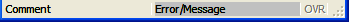{height="22" width="349" border="0"}
  `lines1`    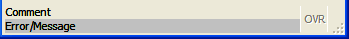{height="39" width="349" border="0"}
  `lines2`    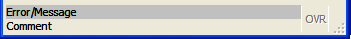{height="39" width="351" border="0"}
  `lines3`    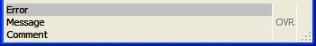{height="52" width="351" border="0"}
  `lines4`    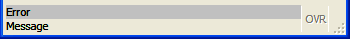{height="39" width="350" border="0"}
  `lines5`    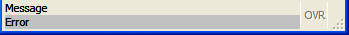{height="35" width="349" border="0"}
  `lines6`    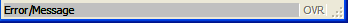{height="23" width="348" border="0"}
  `panels1`   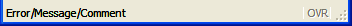{height="26" width="352" border="0"}
  `panels2`   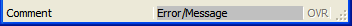{height="26" width="352" border="0"}
  `panels3`   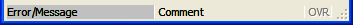{height="25" width="353" border="0"}
  `panels4`   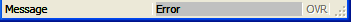{height="22" width="351" border="0"}
  `panels5`   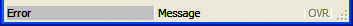{height="26" width="353" border="0"}
  `panels6`   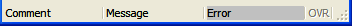{border="0" width="352" height="27"}
  `panels7`   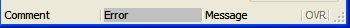{border="0" width="350" height="28"}
  `none`      
  ----------- ------------------------------------------------------------------
:::

------------------------------------------------------------------------

### [StartMenu Style Attributes]{#STYATT_STARTMENU} {#startmenu-style-attributes dir="ltr"}

The following Window style attributes modify how the window will manage
StartMenus.

  -------------------------- --------------------------------- -------------------------------
  **Attribute**               **[Inheritance](#STYLE_INHER)**  **Description**

  `startMenuPosition`                       No                 Indicates the position of the
                                                               [startmenu](StartMenus.html),
                                                               when one is defined. Values can
                                                               be `"none"`, `"tree"`, `"menu"`
                                                               or `"poptree"`.\
                                                                `"tree"` -  the startmenu is
                                                               displayed as a treeview, always
                                                               visible on the right side of
                                                               the window.\
                                                               `"menu"` -  the startmenu is
                                                               displayed as a pull-down menu,
                                                               always visible at the top of
                                                               the window.\
                                                                `"poptree"` -  the startmenu
                                                               is displayed as a treeview in a
                                                               popup window that can be opened
                                                               with a short-cut (see
                                                               `startMenuShortcut`).  \
                                                               Default is `"none"`.

  `startMenuSize`                           No                 Defines the size of the
                                                               [startmenu](StartMenus.html),
                                                               when one is defined and the
                                                               position is defined as `"tree"`
                                                               or `"poptree"`. The values can
                                                               be `"tiny"`, `"small"`,
                                                               `"medium"`, `"large"` or
                                                               `"huge"`.\
                                                               Default is `"medium"`.\
                                                               Note: the size will also depend
                                                               on the font used for the
                                                               startmenu.

  `startMenuShortcut`                       No                 Defines the shortcut key to
                                                               open a
                                                               [startmenu](StartMenus.html),
                                                               when the position is defined as
                                                               `"poptree"`.\
                                                               Default is
                                                               `"control-shift-F12"`.

  `startMenuAccelerator`\                   No                 Defines the shortcut keys to
  `startMenuExecShortcut2`                                     execute the select
                                                               [startmenu](StartMenus.html)
                                                               item, when the position is
                                                               defined as `"tree"` or
                                                               `"poptree"`.\
                                                               By default, `"space"`,
                                                               `"enter"` and ` "return"` start
                                                               the application linked to the
                                                               current item.
  -------------------------- --------------------------------- -------------------------------

------------------------------------------------------------------------

### [MDI Container Style Attributes]{#STYATT_MDI} {#mdi-container-style-attributes dir="ltr"}

The following table shows the presentation attributes for the [MDI
container](MDIWindows.html):

+------------------------------+:-------------------------------:+-----------------------+
| **Attribute**                | **[Inheritance](#STYLE_INHER)** | **Description**       |
+------------------------------+---------------------------------+-----------------------+
| `windowMenu`                 | No                              | Defines if the MDI    |
|                              |                                 | Container should      |
|                              |                                 | display an automatic  |
|                              |                                 | \"Window\" menu,      |
|                              |                                 | which holds the       |
|                              |                                 | *Cascade* and *Tile*  |
|                              |                                 | features, and list of |
|                              |                                 | open Windows.\        |
|                              |                                 | Values can be         |
|                              |                                 | `"yes"`, `"no"`       |
|                              |                                 | (default).            |
+------------------------------+---------------------------------+-----------------------+
| `tabbedContainer`            | No                              | Defines if the MDI    |
|                              |                                 | Container must        |
|                              |                                 | display the child     |
|                              |                                 | application windows   |
|                              |                                 | in a folder tab.\     |
|                              |                                 | Values can be `"no"`  |
|                              |                                 | (default), `"yes"`.   |
+------------------------------+---------------------------------+-----------------------+
| `tabbedContainerCloseMethod` | No                              | Defines the folder    |
|                              |                                 | tab method of the MDI |
|                              |                                 | Container when        |
|                              |                                 | `tabbedContainer` is  |
|                              |                                 | set to `"yes"`.\      |
|                              |                                 | Values can be         |
|                              |                                 | `"container"`         |
|                              |                                 | (default), `"page"`,  |
|                              |                                 | `"both"`, `"none"`.\  |
|                              |                                 | - `"container"`       |
|                              |                                 | (default) container   |
|                              |                                 | gets a close button   |
|                              |                                 | in the tab.\          |
|                              |                                 | - `"page"` each page  |
|                              |                                 | has its own close     |
|                              |                                 | button\               |
|                              |                                 | - `"both"` each page  |
|                              |                                 | and the container has |
|                              |                                 | its close button.\    |
|                              |                                 | - `"none"` no close   |
|                              |                                 | button is shown.      |
+------------------------------+---------------------------------+-----------------------+

------------------------------------------------------------------------

### [Folder Style Attributes]{#STYATT_FOLDER} {#folder-style-attributes dir="ltr"}

The following table shows the presentation attributes for the [Folder
container](FormSpecFiles.html#FF_CONTAINER_FOLDER):

+-----------------------+:-------------------------------:+-----------------------+
| **Attribute**         | **[Inheritance](#STYLE_INHER)** | **Description**       |
+-----------------------+---------------------------------+-----------------------+
| `position`            | No                              | Defines the position  |
|                       |                                 | of the folder tabs.\  |
|                       |                                 | Values can be `"top"` |
|                       |                                 | (default), `"left"`,  |
|                       |                                 | `"right"`,            |
|                       |                                 | `"bottom"`.           |
+-----------------------+---------------------------------+-----------------------+

------------------------------------------------------------------------

### [Action Style Attributes]{#STYATT_ACTION} {#action-style-attributes dir="ltr"}

The following table shows the presentation attributes for
[Action](FormSpecFiles.html#SECTION_ACTDEFS):

  ----------------------- --------------------------------- -----------------------
  **Attribute**            **[Inheritance](#STYLE_INHER)**  **Description**

  `scaleIcon`                            No                 Defines if the scaling
                                                            behaviors of the
                                                            associated icon.\
                                                            Independently of the
                                                            style value, if an icon
                                                            must be scaled, the
                                                            source image will never
                                                            be upscaled to avoid as
                                                            much as possible
                                                            pixellization or
                                                            blurring the image. The
                                                            notable exception is
                                                            when the image come
                                                            from an SVG file which
                                                            can be upscaled or
                                                            downscaled without any
                                                            penalty. If the icon
                                                            must anyway be made
                                                            bigger, the image will
                                                            be centered and a
                                                            transparent border will
                                                            be added around to
                                                            \"fill\" the empty
                                                            space. It will allow
                                                            user to mix big icon
                                                            with smaller one but
                                                            also to keep widget
                                                            alignment\
                                                            If a scaling take
                                                            place, the aspect ratio
                                                            of the original image
                                                            will be kept, keeping
                                                            non square source as
                                                            non square scaled
                                                            icon.\
                                                            Values can be
                                                            `"not set"` (default),
                                                            `"yes"`, `"no"` and
                                                            `"<XXX>px"`\
                                                            -`"not set"`: Image are
                                                            scaled down to match a
                                                            fixed value of 16\*16
                                                            pixels.\
                                                            -`"yes"`: Image are
                                                            scaled down according
                                                            to the height of the
                                                            button. Setting a
                                                            \"big\" font, may
                                                            result with a \"big\"
                                                            icon.\
                                                            -`"no"`: No scalling
                                                            occurs at all, the
                                                            image are taken \"as
                                                            is\". It\'s up to the
                                                            user to resize the
                                                            source image to avoid
                                                            misalignment.\
                                                            -`"<XX>px"`: Image are
                                                            scaled down according
                                                            to the (\"XX\") pixels
                                                            size. Thus, specifying
                                                            scaleIcon=\"128px\"
                                                            will make every icon to
                                                            have no more than
                                                            128\*128 pixels, but at
                                                            least one side equal to
                                                            128 pixels, depending
                                                            if the source image is
                                                            square or not.\
  ----------------------- --------------------------------- -----------------------

------------------------------------------------------------------------

### [Button Style Attributes]{#STYATT_BUTTON} {#button-style-attributes dir="ltr"}

The following table shows the presentation attributes for
[Button](FormSpecFiles.html#FF_ITEMTYPE_BUTTON):

  ----------------------- --------------------------------- -----------------------
  **Attribute**            **[Inheritance](#STYLE_INHER)**  **Description**

  `buttonType`                           No                 Defines the rendering
                                                            of a button.\
                                                            Values can be
                                                            `"normal"` (default),
                                                            `"link"`.

  `scaleIcon`                            No                 Defines if the scaling
                                                            behaviors of the
                                                            associated icon.\
                                                            Independently of the
                                                            style value, if an icon
                                                            must be scaled, the
                                                            source image will never
                                                            be upscaled to avoid as
                                                            much as possible
                                                            pixellization or
                                                            blurring the image. The
                                                            notable exception is
                                                            when the image come
                                                            from an SVG file which
                                                            can be upscaled or
                                                            downscaled without any
                                                            penalty. If the icon
                                                            must anyway be made
                                                            bigger, the image will
                                                            be centered and a
                                                            transparent border will
                                                            be added around to
                                                            \"fill\" the empty
                                                            space. It will allow
                                                            user to mix big icon
                                                            with smaller one but
                                                            also to keep widget
                                                            alignment\
                                                            If a scaling take
                                                            place, the aspect ratio
                                                            of the original image
                                                            will be kept, keeping
                                                            non square source as
                                                            non square scaled
                                                            icon.\
                                                            Values can be
                                                            `"not set"` (default),
                                                            `"yes"`, `"no"` and
                                                            `"<XXX>px"`\
                                                            -`"not set"`, `"no"`:
                                                            No scalling occurs at
                                                            all, the image are
                                                            taken \"as is\". It\'s
                                                            up to the user to
                                                            resize the source image
                                                            to avoid button
                                                            misalignment.\
                                                            -`"yes"`: Image are
                                                            scaled down according
                                                            to the height of the
                                                            button. Setting a
                                                            \"big\" font may result
                                                            with a \"big\" icon.\
                                                            -`"<XX>px"`: Image are
                                                            scaled down according
                                                            to the (\"XX\") pixels
                                                            size. Thus, specifying
                                                            scaleIcon=\"128px\"
                                                            will make every icon to
                                                            have no more than
                                                            128\*128 pixels, but at
                                                            least one side equal to
                                                            128 pixels, depending
                                                            if the source image is
                                                            square or not.\
  ----------------------- --------------------------------- -----------------------

------------------------------------------------------------------------

### [ButtonEdit Style Attributes]{#STYATT_BUTTONEDIT} {#buttonedit-style-attributes dir="ltr"}

The following table shows the presentation attributes for
[ButtonEdit](FormSpecFiles.html#FF_ITEMTYPE_BUTTONEDIT):

  ----------------------- --------------------------------- -----------------------
  **Attribute**            **[Inheritance](#STYLE_INHER)**  **Description**

  `scaleIcon`                            No                 Defines if the scaling
                                                            behaviors of the
                                                            associated icon.\
                                                            Independently of the
                                                            style value, if an icon
                                                            must be scaled, the
                                                            source image will never
                                                            be upscaled to avoid as
                                                            much as possible
                                                            pixellization or
                                                            blurring the image. The
                                                            notable exception is
                                                            when the image come
                                                            from an SVG file which
                                                            can be upscaled or
                                                            downscaled without any
                                                            penalty. If the icon
                                                            must anyway be made
                                                            bigger, the image will
                                                            be centered and a
                                                            transparent border will
                                                            be added around to
                                                            \"fill\" the empty
                                                            space. It will allow
                                                            user to mix big icon
                                                            with smaller one but
                                                            also to keep widget
                                                            alignment\
                                                            If a scaling take
                                                            place, the aspect ratio
                                                            of the original image
                                                            will be kept, keeping
                                                            non square source as
                                                            non square scaled
                                                            icon.\
                                                            Values can be
                                                            `"not set"` (default),
                                                            `"yes"`, `"no"` and
                                                            `"<XXX>px"`\
                                                            -`"not set"`, `"no"`:
                                                            No scalling occurs at
                                                            all, the image are
                                                            taken \"as is\". It\'s
                                                            up to the user to
                                                            resize the source image
                                                            to avoid misalignment.\
                                                            -`"yes"`: Image are
                                                            scaled down according
                                                            to the height of the
                                                            Edit field and will
                                                            match the scaling
                                                            behaviors of a DateEdit
                                                            field when style
                                                            `"buttonIcon;` is used.
                                                            Setting a \"big\" font
                                                            may result with a
                                                            \"big\" icon.\
                                                            -`"<XX>px"`: Image are
                                                            scaled down according
                                                            to the (\"XX\") pixels
                                                            size. Thus, specifying
                                                            scaleIcon=\"128px\"
                                                            will make every icon to
                                                            have no more than
                                                            128\*128 pixels, but at
                                                            least one side equal to
                                                            128 pixels, depending
                                                            if the source image is
                                                            square or not.\
  ----------------------- --------------------------------- -----------------------

------------------------------------------------------------------------

### [Table Style Attributes]{#STYATT_TABLE}

The following table shows the presentation attributes for
[Table](FormSpecFiles.html#FF_ITEMTYPE_TABLE):

  ------------------------- --------------------------------- -----------------------
  **Attribute**              **[Inheritance](#STYLE_INHER)**  **Description**

  `forceDefaultSettings`                   No                 Indicates if the table
                                                              must be initialized
                                                              with the saved columns
                                                              positions and sizes. By
                                                              default, tables are
                                                              re-opened with column
                                                              positions and sizes
                                                              they had when the
                                                              window was closed. You
                                                              can force the use of
                                                              the initial settings
                                                              with this attribute.\
                                                              Values can be `"yes"`,
                                                              `"no"` (default).

  `highlightColor`                         No                 Defines the highlight
                                                              color of rows for the
                                                              table, used for
                                                              selected rows.\
                                                              For possible values,
                                                              see [Colors](#COLORS).

  `highlightTextColor`                     No                 Defines the highlighted
                                                              text color of rows for
                                                              the table, used for
                                                              selected rows.\
                                                              For possible values,
                                                              see [Colors](#COLORS).

  `highlightCurrentRow`                    No                 Indicates if the
                                                              current row must be
                                                              highlighted in a table
                                                              during an INPUT ARRAY.\
                                                              Values can be `"yes"`,
                                                              `"no"` (default). (1 or
                                                              0 on older
                                                              front-ends).\
                                                              By default, when a
                                                              Table is in read-only
                                                              mode (DISPLAY ARRAY),
                                                              the front-end
                                                              automatically
                                                              highlights the current
                                                              row. But in editable
                                                              mode (INPUT ARRAY), no
                                                              row highlighting is
                                                              done by default. You
                                                              can change this
                                                              behavior by setting
                                                              this attribute to
                                                              `"yes"`.

  `highlightCurrentCell`                   No                 Indicates if the
                                                              current cell must be
                                                              highlighted in a
                                                              table.\
                                                              Values can be `"yes"`,
                                                              `"no"` (default). (1 or
                                                              0 on older
                                                              front-ends).\
                                                              By default the current
                                                              edit cell in table has
                                                              a white background. You
                                                              can change this
                                                              behavior by setting
                                                              this attribute to
                                                              `"yes"`, to use the
                                                              same color as when
                                                              highlightCurrentRow is
                                                              used. Only some type of
                                                              cells, checkboxes for
                                                              example, can be
                                                              highlighted. Normal
                                                              editor cells stay in
                                                              white, because this is
                                                              the editor background
                                                              color.

  `showGrid`                               No                 Indicates if the grid
                                                              lines must be visible
                                                              in a table.\
                                                              Values can be `"yes"`
                                                              (default), `"no"`. (1
                                                              or 0 on older
                                                              front-ends).\
                                                              By default, when a
                                                              Table is in editable
                                                              mode (INPUT ARRAY), the
                                                              front-end displays grid
                                                              lines in the table. You
                                                              can change this
                                                              behavior by setting
                                                              this attribute to
                                                              `"no"`.

  `headerAlignment`                        No                 Defines the column\'s
                                                              header alignment in a
                                                              table.\
                                                              Values can be
                                                              `"default"` (default),
                                                              `"left"`, `"center"`,
                                                              `"right"`, `"auto"`.\
                                                              `"default"` will use
                                                              the sytem default. In
                                                              most case it is left
                                                              aligned.\
                                                              `"left"` will force all
                                                              column\'s header to be
                                                              left aligned\
                                                              `"center"` will force
                                                              all column\'s header to
                                                              be centered\
                                                              `"right"` will force
                                                              all column\'s header to
                                                              be right aligned\
                                                              `"auto"` will first try
                                                              to align each
                                                              columns\'s header
                                                              according to the
                                                              `"justify"` attribute
                                                              of the column\'s
                                                              widget. If no
                                                              `"justify"` attribute
                                                              is set, the column\'s
                                                              header will be aligned
                                                              according to the type
                                                              of data: right for
                                                              numeric data, left for
                                                              text data.

  `headerHidden`                           No                 Defines if the
                                                              horizontal header must
                                                              be visible in a table.\
                                                              Values can be `"yes"`,
                                                              `"no"` (default). (1 or
                                                              0 on older front-ends).

  `resizeFillsEmptySpace`                  No                 Defines if the resize
                                                              of the table adapts the
                                                              size of the last column
                                                              to avoid unused space.\
                                                              Values can be `"yes"`,
                                                              `"no"` (default). (1 or
                                                              0 on older front-ends).

  `tableType`                              No                 Defines the rendering
                                                              type of the table.\
                                                              Values can be
                                                              `"normal"` (default),
                                                              `"pictureFlow"`.\
                                                              When using
                                                              `"pictureFlow"`, the
                                                              first column of the
                                                              table will be used to
                                                              define the list of
                                                              images to be used in
                                                              the picture flow. Other
                                                              columns will not be
                                                              used.
  ------------------------- --------------------------------- -----------------------

------------------------------------------------------------------------

### [ComboBox Style Attributes]{#STYATT_COMBOBOX}

The following table shows the presentation attributes for
[ComboBox](FormSpecFiles.html#FF_ITEMTYPE_COMBOBOX):

  ----------------------- --------------------------------- -----------------------
  **Attribute**            **[Inheritance](#STYLE_INHER)**  **Description**

  `autoSelectionStart`                   No                 Defines the item from
                                                            which the
                                                            auto-selection will
                                                            start, when pressing
                                                            keys.\
                                                            Possible values are
                                                            ` "first"`,
                                                            ` "current"`. With
                                                            `"first"`, the
                                                            auto-selection will
                                                            look for the first
                                                            corresponding item
                                                            after the first item of
                                                            the object. With
                                                            `"current"`, it will
                                                            look for the first
                                                            corresponding item
                                                            after the current item
                                                            of the object.\
                                                            Default is
                                                            ` "current"`.
  ----------------------- --------------------------------- -----------------------

------------------------------------------------------------------------

### [DateEdit Style Attributes]{#STYATT_DATEEDIT}

The following table shows the presentation attributes for
[DateEdit](FormSpecFiles.html#FF_ITEMTYPE_DATEEDIT):

  ----------------------- --------------------------------- -----------------------
  **Attribute**            **[Inheritance](#STYLE_INHER)**  **Description**

  `firstDayOfWeek`                       No                 Defines the first day
                                                            of the week to be
                                                            displayed in the
                                                            calendar.\
                                                            Possible values are
                                                            ` "monday"`,
                                                            ` "tuesday"`,
                                                            ` "wednesday"`,
                                                            ` "thursday"`,
                                                            ` "friday"`,
                                                            ` "saturday"`,
                                                            ` "sunday"`.\
                                                            Default is
                                                            ` "saturday"`.

  `daysOff`                              No                 Defines the days of the
                                                            week that are grayed
                                                            out.\
                                                            Possible values are
                                                            ` "monday"`,
                                                            ` "tuesday"`,
                                                            ` "wednesday"`,
                                                            ` "thursday"`,
                                                            ` "friday"`,
                                                            ` "saturday"`,
                                                            ` "sunday"`.\
                                                            Default is
                                                            ` "saturday sunday"`.
                                                            The days of week can be
                                                            combined, as shown.

  `buttonIcon`                           No                 Defines the icon name
                                                            to use for the button.
  ----------------------- --------------------------------- -----------------------

------------------------------------------------------------------------

### [Label Style Attributes]{#STYATT_LABEL}

The following table shows the presentation attributes for
[Label](FormSpecFiles.html#FF_ITEMTYPE_LABEL):

  ----------------------- --------------------------------- -----------------------
  **Attribute**            **[Inheritance](#STYLE_INHER)**  **Description**

  `textFormat`                           No                 Defines the rendering
                                                            of the content of the
                                                            widget.\
                                                            Possible values are
                                                            ` "plain"`, ` "html"`.
                                                            With ` "plain"`, the
                                                            value assigned to this
                                                            widget is interpreted
                                                            as plain text. With
                                                            `"html"`, it is
                                                            interpreted as HTML
                                                            (with hyperlinks).
  ----------------------- --------------------------------- -----------------------

------------------------------------------------------------------------

### [Image Style Attributes]{#STYATT_IMAGE}

The following table shows the presentation attributes for
[Image](FormSpecFiles.html#FF_ITEMTYPE_IMAGE):

  ----------------------- --------------------------------- ---------------------------------------
  **Attribute**            **[Inheritance](#STYLE_INHER)**  **Description**

  `alignment`                            No                 Defines the image alignment when the
                                                            container is bigger than the image
                                                            itself.\
                                                            Possible values are a pair of
                                                            horizontal (`"left"`,
                                                            `"horizontalCenter"`, `"right"`) and
                                                            vertical alignments (` "top"`,
                                                            `"verticalCenter"`, `"bottom"`). It can
                                                            also be the single ` "center"`, which
                                                            is equivalent to
                                                            `"horizontalCenter, verticalCenter"`.
                                                            The default value is `"top, left"`.
  ----------------------- --------------------------------- ---------------------------------------

------------------------------------------------------------------------

### [Menu Style Attributes]{#STYATT_MENU}

The following table shows the presentation attributes for
[Menu](Menus.html):

  ----------------------- --------------------------------- -----------------------
  **Attribute**            **[Inheritance](#STYLE_INHER)**  **Description**

  `position`                             No                 Defines the position of
                                                            the automatic menu for
                                                            \"popup\" menus.\
                                                            Values can be
                                                            `"cursor"` (default),
                                                            `"field"`, ` "center"`,
                                                            ` "center2"`.\
                                                            With `"cursor"`, the
                                                            popup menu appears at
                                                            the cursor position.
                                                            With `"field"`, the
                                                            popup menu appears
                                                            below the current
                                                            field. With `"center"`,
                                                            the popup menu appears
                                                            at the center of the
                                                            screen. With
                                                            `"center2"`, the popup
                                                            menu appears at the
                                                            center of the current
                                                            window.
  ----------------------- --------------------------------- -----------------------

------------------------------------------------------------------------

### [Message Style Attributes]{#STYATT_MESSAGE}

Pseudo selectors \":message\" or \":error\" can be used to specify a
different style for text displayed with the [ERROR and MESSAGE
instructions](MessageDisplay.html). These pseudo selectors have to be
used with the *Message* class: \"Message:error\" corresponds to the
[ERROR](MessageDisplay.html#ERROR) instruction, and \"Message:message\"
corresponds to the [MESSAGE](MessageDisplay.html#MESSAGE) instruction.

The `ERROR` and `MESSAGE` instructions have been extended to let you
specify a `STYLE` attribute in the `ATTRIBUTES` clause:

``` linenumber
01 MESSAGE "No rows have been found." ATTRIBUTES(STYLE = "info")
```

A limited set of common style attributes are supported for error/message
display. In addition to the attributes described in the section, you can
only define [font style attributes](#STYATT_COMMON) for messages.

Note that, like simple form fields, [TTY attributes](#TTY_VS_STYLE_ATT)
have a higher priority than style attributes. By default, ` ERROR` has
the TTY attribute `REVERSE`, which explains why ` ERROR` messages have a
reverse background even when you use a [backgroundColor](#STYATT_COMMON)
style attribute.

The following table shows the presentation attributes for [ERROR and
MESSAGE instructions](MessageDisplay.html):

**Attribute**

**[Inheritance](#STYLE_INHER)**

**Description**

`position`

No

Defines the output type of the status bar message field.\
Values can be ` "statusbar"`, ` "popup"`, ` "statustip"`, ` "both"`.
Default is ` "statusbar"`.\
` "popup"` will bring a window popup to the front; it should be used
with care, since it can annoy the user. `"statustip"` will add a small
\"down\" arrow button that will show the popup once the user clicks on
it; this can be useful to display very long text. ` "both"` will display
the text in a popup window and then in the status bar.\
Default is `"statusbar".`

`textFormat`

No

Defines the rendering of the content of the widget.\
Possible values are ` "plain"` or `"html"`. With ` "plain"`, the value
assigned to this widget is interpreted as plain text. With ` "html"`, it
is interpreted as HTML (with hyperlinks).\
Default is ` "plain".`

------------------------------------------------------------------------

### [ProgressBar Style Attributes]{#STYATT_PROGRESSBAR}

The following table shows the presentation attributes for
[ProgressBar](FormSpecFiles.html#FF_ITEMTYPE_PROGRESSBAR):

  ----------------------- --------------------------------- -----------------------
  **Attribute**            **[Inheritance](#STYLE_INHER)**  **Description**

  `percentageVisible`                    No                 Defines whether the
                                                            current progress value
                                                            is displayed.\
                                                            Possible values are
                                                            ` "center"`,
                                                            ` "system"` and
                                                            ` "no"`. With
                                                            `"center"`, the
                                                            progress will be
                                                            displayed in the middle
                                                            of the progressbar.
                                                            With ` "system"`, it
                                                            will follow the system
                                                            theme. With `"no"`, no
                                                            progress is displayed.\
                                                            Default is ` "no"`.
  ----------------------- --------------------------------- -----------------------

------------------------------------------------------------------------

### [RadioGroup Style Attributes]{#STYATT_RADIOGROUP}

The following table shows the presentation attributes for
[Radiogroup](FormSpecFiles.html#FF_ITEMTYPE_RADIOGROUP):

  ----------------------- --------------------------------- -----------------------
  **Attribute**            **[Inheritance](#STYLE_INHER)**  **Description**

  `autoSelectionStart`                   No                 Defines the item from
                                                            which the
                                                            auto-selection will
                                                            start, when pressing
                                                            keys.\
                                                            Possible values are
                                                            ` "first"`,
                                                            ` "current"`. With
                                                            ` "first"`, the
                                                            auto-selection will
                                                            look for the first
                                                            corresponding item
                                                            after the first item of
                                                            the object. With
                                                            ` "current"`, it will
                                                            look for the first
                                                            corresponding item
                                                            after the current item
                                                            of the object.\
                                                            Default is
                                                            ` "current"`.
  ----------------------- --------------------------------- -----------------------

------------------------------------------------------------------------

### [TextEdit Style Attributes]{#STYATT_TEXTEDIT}

The following table shows the presentation attributes for
[TextEdit](FormSpecFiles.html#FF_ITEMTYPE_TEXTEDIT):

  ----------------------- --------------------------------- ----------------------------------------------------------------
  **Attribute**            **[Inheritance](#STYLE_INHER)**  **Description**

  `integratedSearch`                     No                 Defines if the textedit field allows search facility
                                                            (Control-F).\
                                                            Values can be `"yes"`, ` "no"` (default).

  `textFormat`                           No                 Defines the rendering of the content of the widget.\
                                                            Possible values are ` "plain"`, ` "html"`. With ` "plain"`, the
                                                            value assigned to this widget is interpreted as plain text. With
                                                            ` "html"`, it is interpreted as HTML (with hyperlinks).

  `showEditToolBox`                      No                 Defines if the toolbox for the rich text editing should be
                                                            shown.\
                                                            Possible values are ` "auto"`(default), ` "yes"`, ` "no"`.\
                                                            Only available if textFormat style attribute is set to
                                                            ` "html"`.

  `textSyntaxHighlight`                  No                 Defines syntax highlighting for the widget.\
                                                            The value is currently limited to ` "per"` for .per files syntax
                                                            highlighting.

  `wrapPolicy`                           No                 Defines where the text can be wrapped in word wrap mode.\
                                                            Possible values are ` "atWordBoundary"` - the text will wrap at
                                                            word boundaries, and ` "anywhere"`. - the text breaks anywhere,
                                                            including within words.\
                                                            Default is ` "atWordBoundary"`

  `spellCheck`                           No                 Defines if the textedit field includes a spelling checker.\
                                                            Values are the two dictionary files needed for each language
                                                            (one .aff and one .dic). These files can be downloaded
                                                            [here](http://wiki.services.openoffice.org/wiki/Dictionaries).
                                                            Specify in the style the two files for the \"spellCheck\"
                                                            StyleAttribute, using the following format:
                                                            ` " my_affix_file.aff|my_dictionnary_file.dic"`
  ----------------------- --------------------------------- ----------------------------------------------------------------

### [Toolbar Style Attributes]{#STYATT_TOOLBAR}

The following table shows the presentation attributes for
[Toolbar](FormSpecFiles.html#SECTION_TOOLBAR):

  ----------------------- --------------------------------- -----------------------
  **Attribute**            **[Inheritance](#STYLE_INHER)**  **Description**

  `toolBarTextPosition`                  Yes                Defines the text
                                                            position of a
                                                            ToolbarItem.\
                                                            Values can be
                                                            `"textBesideIcon"`,
                                                            ` "textUnderIcon"`
                                                            (default).

  `scaleIcon`                            Yes                Defines if the scaling
                                                            behaviors of the
                                                            associated icon.\
                                                            Independently of the
                                                            style value, if an icon
                                                            must be scaled, the
                                                            source image will never
                                                            be upscaled to avoid as
                                                            much as possible
                                                            pixellization or
                                                            blurring the image. The
                                                            notable exception is
                                                            when the image come
                                                            from an SVG file which
                                                            can be upscaled or
                                                            downscaled without any
                                                            penalty. If the icon
                                                            must anyway be made
                                                            bigger, the image will
                                                            be centered and a
                                                            transparent border will
                                                            be added around to
                                                            \"fill\" the empty
                                                            space. It will allow
                                                            user to mix big icon
                                                            with smaller one but
                                                            also to keep widget
                                                            alignment\
                                                            If a scaling take
                                                            place, the aspect ratio
                                                            of the original image
                                                            will be kept, keeping
                                                            non square source as
                                                            non square scaled
                                                            icon.\
                                                            Values can be
                                                            `"not set"` (default),
                                                            `"yes"`, `"no"` and
                                                            `"<XXX>px"`\
                                                            -`"not set"`: Image are
                                                            scaled down to match a
                                                            fixed value of 16\*16
                                                            pixels.\
                                                            -`"yes"`: Image are
                                                            scaled down according
                                                            to the height of the
                                                            button. Setting a
                                                            \"big\" font with text
                                                            beside icon, may result
                                                            with a \"big\" icon.\
                                                            -`"no"`: No scalling
                                                            occurs at all, the
                                                            image are taken \"as
                                                            is\". It\'s up to the
                                                            user to resize the
                                                            source image to avoid
                                                            toolbutton text
                                                            misalignment.\
                                                            -`"<XX>px"`: Image are
                                                            scaled down according
                                                            to the (\"XX\") pixels
                                                            size. Thus, specifying
                                                            scaleIcon=\"128px\"
                                                            will make every icon to
                                                            have no more than
                                                            128\*128 pixels, but at
                                                            least one side equal to
                                                            128 pixels, depending
                                                            if the source image is
                                                            square or not.\
  ----------------------- --------------------------------- -----------------------
