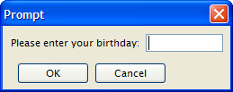

[Back to Contents](../index.html)

------------------------------------------------------------------------

# [Prompt for Values]{#PAGE_HEADER}

Summary:

- [Basics](#BASICS)
- [Syntax](#SYNTAX)
- [Usage](#USAGE)
  - [Programming Steps](#PROG_STEPS)
  - [Instruction Configuration](#INSTRUCTION_CONFIG)
  - [Default Actions](#DEFAULT_ACTIONS)
  - [Interaction Blocks](#INTERACTION_BLOCKS)
- [Examples](#EXAMPLES)
  - [Example 1: Simple PROMPT](#EXAMPLE_1)
  - [Example 2: PROMPT with interrupt checking](#EXAMPLE_2)
  - [Example 3: PROMPT with ATTRIBUTE and ON ACTION
    handlers](#EXAMPLE_3)

*See also:* [Record Input](RecordInput.html), [Programs](Programs.html),
[Variables](Variables.html)

------------------------------------------------------------------------

## [Basics]{#BASICS}

The `PROMPT` instruction can be used to query for a single value from
the user.

In [GUI](FglTerms.html#GRAPHICAL_USER_INTERFACE) mode, the `PROMPT`
instruction opens a modal window with an OK button and a Cancel button.

     {border="0"}

------------------------------------------------------------------------

## [Syntax]{#PROMPT}

### Purpose:

The `PROMPT` statement assigns a user-supplied value to a
[variable](Variables.html).

### [Syntax]{#SYNTAX}:

`PROMPT `*`question`\
` `*` `[`[`]{.underline}` ATTRIBUTES ( `*`question-attribute`*` `[`[,...]`]{.underline}` ) `[`]`]{.underline}\
`  FOR `[`[`]{.underline}`CHAR`[`[`]{.underline}`ACTER`[`]]`]{.underline}` `*`variable`*\
`  `[`[`]{.underline}` HELP `*`number`*` `[`]`]{.underline}\
`  `[`[`]{.underline}` ATTRIBUTES ( `*`input-attribute`*` `[`[,...]`]{.underline}` ) `[`]`]{.underline}\
[`[`]{.underline}` `*`dialog-control-block`\
` `*` `[`[...]`]{.underline}*\*
` END PROMPT `[`]`]{.underline}

where *dialog-control-block* is one of :

[`{`]{.underline}` ON IDLE `*`idle-seconds`*\
[`|`]{.underline}` ON ACTION `*`action-name`*\
[`|`]{.underline}` ON KEY ( `*`key-name`*` `[`[,...]`]{.underline}` )`\
[`}`\]{.underline}
`  `*`statement`*\
`  `[`[...]`]{.underline}

#### Notes:

1.  *question* is a [string expression](Expressions.html#EX_STRING)
    displayed as a message for the input of the value.
2.  *question-attribute* defines the display attributes for the
    *question.* See below for more details.
3.  *variable* is the name of the [variable](Variables.html) that
    receives the data typed by the user.
4.  The `FOR CHAR` clause exits the prompt statement when the first
    character has been typed.
5.  *number* is the [help message](MessageFiles.html) number to be
    displayed when the user presses the [help
    key](Programs.html#PROGRAM_OPTIONS).
6.  *input-attribute* is a display and control attribute for the input
    area. See below for more details.
7.  *key-name* is an hot-key identifier (such as `F11` or `Control-z`).
8.  *action-name* identifies an [action](InteractionModel.html) that can
    be executed by the user.
9.  *idle-seconds* is an [integer literal](Literals.html) or
    [variable](Variables.html) that defines a number of seconds.
10. *statement* is an instruction that is executed when the user presses
    the key defined by *key-name.*

The following display attributes can be used for both
*question-attribute* and *input-attribute*:

::: {align="center"}
  --------------------------------------------------------- ------------------------------------------------
  **Attribute**                                             **Description**
  `BLACK, BLUE, CYAN, GREEN, MAGENTA, RED, WHITE, YELLOW`   The TTY color of the displayed text.
  `BOLD, DIM, INVISIBLE, NORMAL`                            The TTY font attribute of the displayed text.
  `REVERSE, BLINK, UNDERLINE`                               The TTY video attribute of the displayed text.
  --------------------------------------------------------- ------------------------------------------------
:::

The following control attributes can be used for *input-attribute*:

::: {align="center"}
  ------------------------------------------------------------------- --------------------------------------------------------------------------------------------------------------------------------
  **Attribute**                                                       **Description**
  `CENTURY = `*`string`*                                              Specify a year format indicator as defined in the [CENTURY attribute of form files](FSFAttributes.html#FA_CENTURY).
  `FORMAT = `*`string`*                                               Specify a display format as defined in the [FORMAT attribute of form files](FSFAttributes.html#FA_FORMAT).
  `PICTURE = `*`string`*                                              Specify an input picture as defined in the [PICTURE attribute of form files](FSFAttributes.html#FA_PICTURE).
  `SHIFT = `*`string`*                                                Specify uppercase or lowercase shift. Values can be `'up'` or `'down'`.
  `WITHOUT DEFAULTS `[`[`]{.underline}` =`*`bool`*[`]`]{.underline}   Prompt must show by default the value of the program variable.
  `CANCEL = `*`bool`*                                                 Indicates if the default *cancel* action should be added to the dialog. If not specified, the action is added (`CANCEL=TRUE`).
  `ACCEPT = `*`bool`*                                                 Indicates if the default *accept* action should be added to the dialog. If not specified, the action is added (`ACCEPT=TRUE`).
  ------------------------------------------------------------------- --------------------------------------------------------------------------------------------------------------------------------
:::

\

------------------------------------------------------------------------

## [Usage]{#USAGE}

You can use the `PROMPT` instruction to manage a single value input. You
provide the text of the question to be displayed to the user and the
variable that receives the value entered by the user. The runtime system
displays the question in the prompt area (typically a popup window),
waits for the user to enter a value, reads whatever value was entered
until the user validates (for example with the RETURN key), and stores
this value in a response variable. The prompt dialog remains visible
until the user enters a response.

#### Warnings:

1.  Make sure that the [INT_FLAG](Programs.html#PV_INT_FLAG) variable is
    set to [FALSE](Programs.html#PC_FALSE) before entering the `PROMPT`
    block.
2.  The `ON KEY` blocks are provided for backward compatibility; use
    `ON ACTION` instead.
3.  The prompt finishes after `ON IDLE`, `ON ACTION`, or `ON KEY` block
    execution (to ensure backwards compatibility).

### [Programming Steps]{#PROG_STEPS}

To use the `PROMPT` statement, you must:

1.  Declare a program variable with the
    [DEFINE](Variables.html#VA_DEFINE) statement.
2.  Set the [INT_FLAG](Programs.html#PV_INT_FLAG) variable to
    [FALSE](Programs.html#PC_FALSE).
3.  Describe the `PROMPT` statement, with *dialog-control-blocks* to
    control the instruction.
4.  After executing the `PROMPT`, check the
    [INT_FLAG](Programs.html#PV_INT_FLAG) variable to determine whether
    the input was validated or canceled by the user. See [Example
    2](#EXAMPLE_2) below.

------------------------------------------------------------------------

### [Instruction Configuration]{#INSTRUCTION_CONFIG}

#### HELP option

The `HELP` clause specifies the number of a [help
message](MessageFiles.html) to display if the user invokes the help
while executing the instruction. The predefined *help* action is
automatically created by the runtime system. You can bind [action
views](InteractionModel.html) to the *help* action.

#### ACCEPT option

The `ACCEPT` attribute can be set to [FALSE](Programs.html#PC_FALSE) to
avoid the automatic creation of the *accept* default action.

#### CANCEL option

The `CANCEL` attribute can be set to [FALSE](Programs.html#PC_FALSE) to
avoid the automatic creation of the *cancel* default action. If the
`CANCEL=FALSE` option is set, no [*close
action*](InteractionModel.html#XCROSS_CLOSE) will be created, and you
must write an `ON ACTION close` control block to create a close action.

------------------------------------------------------------------------

### [Default Actions]{#DEFAULT_ACTIONS}

When an `PROMPT` instruction executes, the runtime system creates a set
of [default actions](InteractionModel.html).

The following table lists the default actions created for this dialog:

  ----------------------------------- --------------------------------------------
  **Default action**                  **Description**

  `accept`                            Validates the `PROMPT` dialog (validates
                                      field criterias)\
                                      *Creation can be avoided with the* `ACCEPT`
                                      *attribute.*

  `cancel`                            Cancels the `PROMPT` dialog (no validation,
                                      int_flag is set)\
                                      *Creation can be avoided with the* `CANCEL`
                                      *attribute.*

  `close`                             By default, cancels the `PROMPT` dialog (no
                                      validation, int_flag is set)\
                                      Default action view is hidden. See [Windows
                                      closed by the
                                      user](InteractionModel.html#XCROSS_CLOSE).

  `help`                              Shows the help topic defined by the `HELP`
                                      clause.\
                                      *Only created when a* `HELP` *clause is
                                      defined.*
  ----------------------------------- --------------------------------------------

\

------------------------------------------------------------------------

### [Interaction Blocks]{#INTERACTION_BLOCKS}

#### ON ACTION block

You can use `ON ACTION` blocks to execute a sequence of instructions
when the user raises a specific action. This is the preferred solution
compared to `ON KEY` blocks, because `ON ACTION` blocks use abstract
names to control user interaction.

**Warning: Because of backward compatibility, the prompt is finished
after `ON IDLE`, `ON ACTION`, `ON KEY` block execution.**

For more details about `ON ACTION`, see [Interaction Model
page](InteractionModel.html).

#### ON IDLE block

The `ON IDLE `*`idle-seconds`* clause defines a set of instructions that
must be executed after *idle-seconds* of inactivity. The parameter
*idle-seconds* must be an [integer literal](Literals.html) or
[variable](Variables.html). If it evaluates to zero, the timeout is
disabled.

You should not use the `ON IDLE` trigger with a short timeout period
such as 1 or 2 seconds; The purpose of this trigger is to give the
control back to the program after a relatively long period of inactivity
(10, 30 or 60 seconds). This is typically the case when the end user
leaves the workstation, or got a phone call. The program can then
execute some code before the user gets the control back.

#### ON KEY block

For backward compatibility, you can use `ON KEY` blocks to execute a
sequence of instructions when the user presses a specific key. The
following key names are accepted by the compiler:

::: {align="center"}
  --------------------------- -----------------------------------------------------------------------------------------
  **Key Name**                **Description**
  `ACCEPT`                    The validation key.
  `INTERRUPT`                 The interruption key.
  `ESC` or `ESCAPE`           The ESC key (not recommended, use `ACCEPT` instead).
  `TAB`                       The TAB key (not recommended).
  `Control-`*`char`*          A control key where *char* can be any character except A, D, H, I, J, K, L, M, R, or X.
  `F1` through `F255`         A function key.
  `DELETE`                    The key used to delete a new row in an array.
  `INSERT`                    The key used to insert a new row in an array.
  `HELP`                      The help key.
  `LEFT`                      The left arrow key.
  `RIGHT`                     The right arrow key.
  `DOWN`                      The down arrow key.
  `UP`                        The up arrow key.
  `PREVIOUS` or `PREVPAGE`    The previous page key.
  `NEXT` or `NEXTPAGE`        The next page key.
  --------------------------- -----------------------------------------------------------------------------------------
:::

\
An `ON KEY` block defines one to four different action objects that will
be identified by the key name in lowercase
(`ON KEY(F5,F6) = creates Action f5 + Action f6`). Each action object
will get an *acceleratorName* assigned. In
[GUI](FglTerms.html#GRAPHICAL_USER_INTERFACE) mode, Action Defaults are
applied for `ON KEY` actions by using the name of the key. You can
define secondary accelerator keys, as well as default decoration
attributes like button text and image, by using the key name as action
identifier. Note that the action name is always in lowercase letters.
See [Action Defaults](ActionDefaults.html) for more details.

**Warning: Check carefully the `ON KEY CONTROL-?` statements because
they may result in having duplicate accelerators for multiple actions
due to the accelerators defined by [Action
Defaults](ActionDefaults.html). Additionally, `ON KEY` statements used
with` ESC`,` TAB`,` UP`,` DOWN`,` LEFT`,` RIGHT`,` HELP`,` NEXT`,` PREVIOUS`,` INSERT`,` CONTROL-M`,` CONTROL-X`,` CONTROL-V`,` CONTROL-C`
and `CONTROL-A` should be avoided for use in GUI programs, because it\'s
very likely to clash with default accelerators defined in the Action
Defaults.**

------------------------------------------------------------------------

## [Examples]{#EXAMPLES}

#### [Example 1: Simple PROMPT]{#EXAMPLE_1}

    01 MAIN
    02   DEFINE birth DATE
    03   DEFINE chkey CHAR(1)
    04   PROMPT "Please enter your birthday: " FOR birth
    05   DISPLAY "Your birthday is : " || birth
    06   PROMPT "Now press a key... " FOR CHAR chkey
    07   DISPLAY "You pressed: " || chkey
    08 END MAIN

#### [Example 2: Simple PROMPT with Interrupt Checking]{#EXAMPLE_2}

    01 MAIN
    02   DEFINE birth DATE
    03   LET INT_FLAG = FALSE
    04   PROMPT "Please enter your birthday: " FOR birth
    05   IF INT_FLAG THEN
    06     DISPLAY "Interrupt received."
    07   ELSE
    08     DISPLAY "Your birthday is : " || birth
    09   END IF
    10 END MAIN

#### [Example 3: PROMPT with ATTRIBUTES and ON ACTION handlers]{#EXAMPLE_3}

    01 MAIN
    02   DEFINE birth DATE
    03   LET birth = TODAY
    04   PROMPT "Please enter your birthday: " FOR birth
    05      ATTRIBUTES(WITHOUT DEFAULTS)
    06         ON ACTION action1
    07            DISPLAY "Action 1"
    08   END PROMPT
    09   DISPLAY "Your birthday is " || birth
    10 END MAIN
