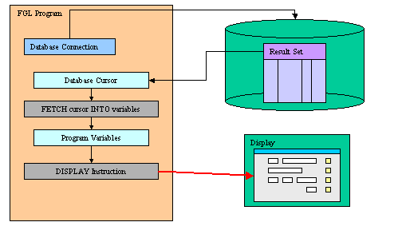

[Back to Contents](../index.html)

------------------------------------------------------------------------

# [Displaying Data to Forms]{#PAGE_HEADER}

Summary:

- [How to display data to form fields](#HOW_TO)
- [Displaying data to specific form fields](#DISPLAY_TO) (`DISPLAY TO`)
- [Displaying data to form fields by name](#DISPLAY_BY_NAME)
  (`DISPLAY BY NAME`)
- [Clearing all form fields](#CLEAR_FORM) (`CLEAR FORM`)
- [Clearing specific form fields](#CLEAR_FIELD) (`CLEAR `*`field`*)

*See also:* [Variables](Variables.html), [Records](Records.html),
[Windows](WindowsAndForms.html), [Forms](FormSpecFiles.html), [Record
Input](RecordInput.html), [Display Array](DisplayArray.html)

------------------------------------------------------------------------

### [How to display data to form fields]{#HOW_TO}

Programs retrieve data from the database into
[variables](Variables.html) with a [cursor](ResultSets.html) or a
[static SELECT statement](StaticSql.html#SS_SELECT), and display the
variable values to the [current form](WindowsAndForms.html) with the
`DISPLAY` instruction:

{border="0" width="504" height="288"}

------------------------------------------------------------------------

### [DISPLAY TO]{#DISPLAY_TO}

#### Purpose:

The `DISPLAY TO` instruction displays data to form fields explicitly.

#### Syntax:

`DISPLAY `*`expression`*` `[`[,...]`]{.underline}` TO `*`field-list`*` `[`[,...]`]{.underline}\
`  `[`[`]{.underline}` ATTRIBUTE ( `*`display-attribute`*` `[`[,...]`]{.underline}` ) `[`]`]{.underline}

where *field-list* is :

[`{`]{.underline}` `*`field-name`*\
[`|`]{.underline}` `*`table-name`*`.*`\
[`|`]{.underline}` `*`table-name`*`.`*`field-name`*\
[`|`]{.underline}` `*`screen-array`*`[`*`line`*`].*`\
[`|`]{.underline}` `*`screen-array`*`[`*`line`*`].`*`field-name`*\
[`|`]{.underline}` `*`screen-record`*`.*`\
[`|`]{.underline}` `*`screen-record`*`.`*`field-name`*\
[`}`]{.underline}` `[`[,...]`]{.underline}` `

#### Notes:

1.  *expression* is any [expression](Expressions.html) supported by the
    language.\
    This is typically a list of [variables](Variables.html) or a
    [record](Records.html) with the `.*` notation.
2.  *field-name* is the identifier of a
    [field](FormSpecFiles.html#SECTION_ATTRIBUTES) of the [current
    form](WindowsAndForms.html).
3.  *table-name* is the identifier of a [database
    table](FormSpecFiles.html#SECTION_TABLES) of the [current
    form](WindowsAndForms.html).
4.  *screen-record* is the identifier of a [screen
    record](FormSpecFiles.html#SECTION_INSTRUCTIONS) of the [current
    form](WindowsAndForms.html).
5.  *screen-array* is the [screen
    array](FormSpecFiles.html#SECTION_INSTRUCTIONS) that will be used in
    the form.
6.  *display-attribute* is one of the display attributes supported in
    this instruction. See below for more details.

#### Warning: The `DISPLAY TO` statement changes the \'touched\' status of the target fields. When you modify a field value with this instruction, the [FIELD_TOUCHED()](Operators.html#OP_FIELD_TOUCHED) operator returns [TRUE](Programs.html#PC_TRUE) and the [ON CHANGE](RecordInput.html) trigger may be fired if the current field value was changed with a `DISPLAY TO`. During an `INPUT` or `INPUT ARRAY`, we recommend you to use the `UNBUFFERED` attribute to display data automatically to fields without changing the \'touched\' status of fields.

#### Usage:

If the variables do not have the same names as the [form
fields](FormSpecFiles.html#SECTION_ATTRIBUTES), you must use the `TO`
clause to explicitly map the variables to fields. You can list the
fields individually, or you can use the *`screen-record`*`.*` or
*`screen-record`*`[n].*` notation, where *`screen-record`*`[n].*`
specifies all the fields in line `n` of a screen array.

In a `DISPLAY TO` statement, any screen attributes specified in the
`ATTRIBUTE` clause apply to all the fields that you specify after the
`TO` keyword.

In the following example, the values in the **p_items** program record
are displayed in the first row of the **s_items** screen array:

``` linenumber
01 DISPLAY p_items.* TO s_items[1].*
```

The expanded list of screen fields must correspond in order and in
number to the expanded list of identifiers after the ` DISPLAY` keyword.
Identifiers and their corresponding fields must have the same or
compatible data types. For example, the next `DISPLAY` statement
displays the values in the **p_customer** program record in fields of
the **s_customer** screen record:

``` linenumber
01 DISPLAY p_customer.* TO s_customer.*
```

For this example, the **p_customer** [program record](Records.html) and
the **s_customer** [screen
record](FormSpecFiles.html#SECTION_INSTRUCTIONS) require compatible
declarations. The following [DEFINE](Variables.html) statement declares
the **p_customer** program record:

``` linenumber
01 DEFINE p_customer RECORD
02   customer_num LIKE customer.customer_num,
03   fname LIKE customer.fname,
04   lname LIKE customer.lname,
05   phone LIKE customer.phone
05 END RECORD
```

This fragment of a form specification declares the **s_customer** screen
record:

``` linenumber
01 ATTRIBUTES
02  f000 = customer.customer_num;
03  f001 = customer.fname;
04  f002 = customer.lname;
05  f003 = customer.phone;
06 END
```

The `ATTRIBUTE` clause temporarily overrides any default display
attributes or any attributes specified in the
[OPTIONS](Programs.html#PROGRAM_OPTIONS) or [OPEN
WINDOW](WindowsAndForms.html#OPEN_WINDOW) statements for the fields.
When the `DISPLAY` statement completes execution, the default display
attributes are restored.

The following table shows the *display-attributes* supported by the
`DISPLAY TO` statement.  The *display-attributes* affect console-based
applications only, they do not affect GUI-based applications.

::: {align="center"}
  --------------------------------------------------------- ------------------------------------------------
  **Attribute**                                             **Description**
  `BLACK, BLUE, CYAN, GREEN, MAGENTA, RED, WHITE, YELLOW`   The TTY color of the displayed data.
  `BOLD, DIM, NORMAL`                                       The TTY font attribute of the displayed data.
  `REVERSE, BLINK, UNDERLINE`                               The TTY video attribute of the displayed data.
  --------------------------------------------------------- ------------------------------------------------
:::

The `REVERSE`, `BLINK`, `INVISIBLE`, and `UNDERLINE` attributes are not
sensitive to the color or monochrome status of the terminal, if the
terminal is capable of displaying these intensity modes. The `ATTRIBUTE`
clause can include zero or more of the `BLINK`, `REVERSE`, and
`UNDERLINE` attributes, and zero or one of the other attributes. That
is, all of the attributes except `BLINK`, `REVERSE`, and `UNDERLINE` are
mutually exclusive.

The `DISPLAY` statement ignores the `INVISIBLE` attribute, regardless of
whether you specify it in the `ATTRIBUTE` clause.

------------------------------------------------------------------------

### [DISPLAY BY NAME]{#DISPLAY_BY_NAME}

#### Purpose:

The `DISPLAY BY NAME` instruction displays data to form fields
explicitly *by name*.

#### Syntax:

`DISPLAY BY NAME `[`{`]{.underline}` `*`variable `[`|`]{.underline}` record`*`.* `[`}`]{.underline}` `[`[,...]`]{.underline}\
`  `[`[`]{.underline}` ATTRIBUTE ( `*`display-attribute`*` `[`[,...]`]{.underline}` ) `[`]`]{.underline}

#### Notes:

1.  *variable* is a [program variable](Variables.html) that has the same
    name as a form field.
2.  *record.\** is a [record variable](Variables.html#STRUCTURED) that
    has members with the same names as form fields. The record name
    prefix is ignored.
3.  *display-attribute* is one of the display attributes supported in
    this instruction. See below for more details.

#### Warning: The `DISPLAY BY NAME` statement changes the \'touched\' status of the target fields. When you modify a field value with this instruction, the [FIELD_TOUCHED()](Operators.html#OP_FIELD_TOUCHED) operator returns [TRUE](Programs.html#PC_TRUE) and the [ON CHANGE](RecordInput.html) trigger may be fired if the current field value was changed with a `DISPLAY BY NAME`. During an `INPUT` or `INPUT ARRAY`, we recommend that you use the `UNBUFFERED` attribute to display data to fields automatically without changing the \'touched\' status of fields.

#### Usage:

If the variables to be displayed have the same name as [form
fields](FormSpecFiles.html#SECTION_ATTRIBUTES), you can use the
`BY NAME` clause. The `BY NAME` clause binds the fields to variables. To
use this clause, you must define variables with the same name as the
form fields where they will be displayed. The language ignores any
[record](Records.html) name prefix when matching the names. The names
must be unique and unambiguous;  if not, this option results in an
error, and the runtime system sets [STATUS](Programs.html#PV_STATUS) to
a negative value.

For example, the following statement displays the values for the
specified variables in the [form
fields](FormSpecFiles.html#SECTION_ATTRIBUTES) with corresponding names
(`company` and `address1`):

``` linenumber
01 DISPLAY BY NAME p_customer.company, p_customer.address1
```

This ` BY NAME` clause displays data to the screen fields of the default
[screen records](FormSpecFiles.html#SECTION_INSTRUCTIONS). The default
screen records are those having the names of the tables defined in the
[TABLES](FormSpecFiles.html#SECTION_TABLES) section of the [form
specification file](FormSpecFiles.html). To use a screen array, you
define a screen array in addition to the default screen record. This
default screen record holds only the first line of the screen array.

For example, the following DISPLAY statement displays the **ordno**
variable only in the first line of the screen array (the default screen
record):

``` linenumber
01 DISPLAY BY NAME p_stock[1].ordno
```

To display **ordno** in all elements of the [screen
array](FormSpecFiles.html#SECTION_INSTRUCTIONS), you can use the
[DISPLAY ARRAY](DisplayArray.html) statement, or `DISPLAY TO`, as in the
next example:

``` linenumber
01 FOR i=1 TO 10
02    DISPLAY p_stock[i].ordno TO sc.stock[i].ordno
03    ...
04 END FOR
```

The following table shows the *display-attributes* supported by the
`DISPLAY BY NAME` statement:

::: {align="center"}
  --------------------------------------------------------- --------------------------------------------
  **Attribute**                                             **Description**
  `BLACK, BLUE, CYAN, GREEN, MAGENTA, RED, WHITE, YELLOW`   The color of the displayed data.
  `BOLD, DIM, NORMAL`                                       The font attribute of the displayed data.
  `REVERSE, BLINK, UNDERLINE`                               The video attribute of the displayed data.
  --------------------------------------------------------- --------------------------------------------
:::

------------------------------------------------------------------------

### [CLEAR FORM]{#CLEAR_FORM}

#### Purpose:

The `CLEAR FORM` instruction clears all fields in the [current
form](WindowsAndForms.html).

#### Syntax:

`CLEAR FORM`

#### Notes:

1.  This instruction has no effect on any part of the screen display
    except the form fields.

#### Example:

``` linenumber
01 MAIN
02    OPEN WINDOW w1 AT 1,1 WITH FORM "custlist"
03    CLEAR FORM
04    CLOSE WINDOW w1
05 END FOR
```

------------------------------------------------------------------------

### [CLEAR *field*]{#CLEAR_FIELD}

#### Purpose:

The `CLEAR `*`field`* instruction clears specific fields in the [current
form](WindowsAndForms.html).

#### Syntax:

`CLEAR `*`field-list`*

where *field-list* is :

[`{`]{.underline}` `*`field-name`*\
[`|`]{.underline}` `*`table-name`*`.*`\
[`|`]{.underline}` `*`table-name`*`.`*`field-name`*\
[`|`]{.underline}` `*`screen-array`*`[`*`line`*`].*`\
[`|`]{.underline}` `*`screen-array`*`[`*`line`*`].`*`field-name`*\
[`|`]{.underline}` `*`screen-record`*`.*`\
[`|`]{.underline}` `*`screen-record`*`.`*`field-name`*\
[`}`]{.underline}` `[`[,...]`]{.underline}` `

#### Notes:

1.  *field-name* is the identifier of a
    [field](FormSpecFiles.html#SECTION_ATTRIBUTES) of the [current
    form](WindowsAndForms.html).
2.  *table-name* is the identifier of a [database
    table](FormSpecFiles.html#SECTION_TABLES) of the [current
    form](WindowsAndForms.html).
3.  *screen-record* is the identifier of a [screen
    record](FormSpecFiles.html#SECTION_INSTRUCTIONS) of the [current
    form](WindowsAndForms.html).
4.  *screen-array* is the [screen
    array](FormSpecFiles.html#SECTION_INSTRUCTIONS) that will be used in
    the form.

#### Example:

``` linenumber
01 FOR i=1 TO 10
02    CLEAR s_items[i].*
03 END FOR
```
