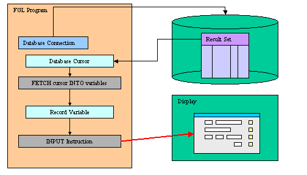
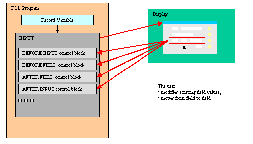
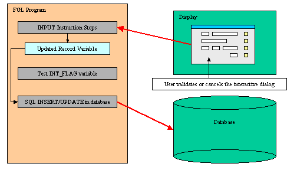

[Back to Contents](../index.html)

------------------------------------------------------------------------

# [Record Input]{#PAGE_HEADER}

Summary:

- [Basics](#BASICS)
- [Syntax](#SYNTAX)
- [Usage](#USAGE)
  - [Programming Steps](#PROG_STEPS)
  - [Variable Binding](#VARIABLE_BINDING)
  - [Instruction Configuration](#INSTRUCTION_CONFIG)
  - [Default Actions](#DEFAULT_ACTIONS)
  - [Control Blocks](#CONTROL_BLOCKS)
  - [Control Blocks Execution Order](#CTRLBLOCK_EXECUTION)
  - [Interaction Blocks](#INTERACTION_BLOCKS)
  - [Control Instructions](#CONTROL_INSTRUCTIONS)
  - [Control Class](#CONTROL_CLASS)
  - [Control Functions](#CONTROL_FUNCTIONS)
- [Examples](#EXAMPLES)
  - [Example 1: Simple INPUT statement using screen record
    specification](#EXAMPLE_1)
  - [Example 2: Complex INPUT statement using the BY NAME clause and
    control blocks](#EXAMPLE_2)

*See also:* [Variables](Variables.html), [Records](Records.html),
[Windows](WindowsAndForms.html), [Forms](FormSpecFiles.html), [Record
Display](RecordDisplay.html), [Display Array](DisplayArray.html)

------------------------------------------------------------------------

### [Basics]{#BASICS}

The programs maintain data in [variables](Variables.html) and use the
`INPUT` statement to bind variables to
[screen-records](FormSpecFiles.html#SECTION_INSTRUCTIONS) or
[screen-arrays](FormSpecFiles.html#SECTION_INSTRUCTIONS) of
[forms](WindowsAndForms.html) for data entry into [form
fields](FormSpecFiles.html#SECTION_ATTRIBUTES). The `INPUT` statement
activates the current form (the form that was most recently displayed or
the form in the [current window](WindowsAndForms.html)):

{border="0" width="504" height="288"}

During the `INPUT` statement execution, the user can edit the record
fields, while the program controls the behavior of the instruction with
control blocks:

{border="0" width="504" height="288"}

To terminate the `INPUT` execution, the user can validate (or cancel)
the dialog to commit (or invalidate) the modifications made in the
record:

{border="0" width="504" height="288"}

When the statement completes execution, the form is de-activated. After
the user terminates the input (for example, with the Accept key), the
program must test the [INT_FLAG](Programs.html#PV_INT_FLAG) variable to
check if the dialog was validated (or canceled), and then can use the
[INSERT](StaticSql.html#SS_INSERT) or [UPDATE](StaticSql.html#SS_UPDATE)
SQL statements to modify the appropriate database tables.

------------------------------------------------------------------------

### [INPUT]{#SYNTAX}

#### Purpose:

The `INPUT` statement supports data entry into the fields of the
[current form](WindowsAndForms.html).

#### Syntax 1: [Implicit field-to-variable mapping]{#INPUT_BY_NAME}

`INPUT BY NAME `[`{`]{.underline}` `*[`variable`](#variable)*` `[`|`]{.underline}` `*[`record`](#record)`.*`*` } [,...]`\
`  `[`[`]{.underline}` WITHOUT DEFAULTS `[`]`]{.underline}\
`  `[`[`]{.underline}` ATTRIBUTES ( `[`{`]{.underline}` `*[`display-attribute`](#display-attributes)*` `[`|`]{.underline}` `*[`control-attribute`](#control-attributes)*` `[`}`]{.underline}` `[`[,...]`]{.underline}` `
` ` `) `[`]`\]{.underline}
`   `[`[`]{.underline}` HELP `*[`help-number`](#help-number)*` `[`]`]{.underline}\
[`[`]{.underline}` `*[`dialog-control-block`](#dialog-control-block)\
` `*` `[`[...]`]{.underline}*\*
` END INPUT `[`]`]{.underline}` `

#### Syntax 2: [Explicit field-to-variable mapping]{#INPUT}

`INPUT `[`{`]{.underline}` `*[`variable`](#variable)*` `[`|`]{.underline}` `*[`record`](#record)`.*`*` } [,...]`\
`  `[`[`]{.underline}` WITHOUT DEFAULTS `[`]`]{.underline}\
`  FROM `*[`field-list`](#field-list)*\
`  `[`[`]{.underline}` ATTRIBUTES ( `[`{`]{.underline}` `*[`display-attribute`](#display-attributes)*` `[`|`]{.underline}` `*[`control-attribute`](#control-attributes)*` `[`}`]{.underline}` `[`[,...]`]{.underline}` `` `
`) `[`]`\]{.underline}
`   `[`[`]{.underline}` HELP `*[`help-number`](#help-number)*` `[`]`]{.underline}\
[`[`]{.underline}` `*[`dialog-control-block`](#dialog-control-block)\
` `*` `[`[...]`]{.underline}*\*
` END INPUT `[`]`]{.underline}` `

where *[dialog-control-block]{#dialog-control-block}* is one of:

` `[`{`]{.underline}` BEFORE INPUT`\
[`|`]{.underline}` AFTER INPUT`\
[`|`]{.underline}` BEFORE FIELD `*[`field-spec`](#field-spec)*` `[`[,...]`]{.underline}\
[`|`]{.underline}` AFTER FIELD `*[`field-spec`](#field-spec)*` `[`[,...]`]{.underline}\
[`|`]{.underline}` ON CHANGE `*[`field-spec`](#field-spec)*` `[`[,...]`]{.underline}\
[`|`]{.underline}` ON IDLE `*[`idle-seconds`](#idle-seconds)*\
[`|`]{.underline}` ON ACTION `*[`action-name`](#action-name)*` `[`[`]{.underline}`INFIELD `*[`field-spec`](#field-spec)*[`]`]{.underline}\
[`|`]{.underline}` ON KEY ( `*[`key-name`](#key-name)*` `[`[,...]`]{.underline}` )`\
[`}`\]{.underline}
`     `*[`dialog-statement`](#dialog-statement)*\
`    `[`[...]`]{.underline}

where *[dialog-statement]{#dialog-statement}* is one of:

` `[`{`]{.underline}` `*[`statement`](#statement)\*
` `[`|`]{.underline}` ACCEPT INPUT`\
[`|`]{.underline}` CONTINUE INPUT`\
[`|`]{.underline}` EXIT INPUT`\
[`|`]{.underline}` NEXT FIELD `[`{`]{.underline}` CURRENT `[`|`]{.underline}` NEXT `[`|`]{.underline}` PREVIOUS `[`|`]{.underline}` `*[`field-spec`](#field-spec)*` `[`}`]{.underline}\
[`}`]{.underline}

where *[field-list]{#field-list}* defines a list of fields with one or
more of:

[`{`]{.underline}` `*[`field-name`](#field-name)*\
[`|`]{.underline}` `*[`table-name`](#table-name)*`.*`\
[`|`]{.underline}` `*[`table-name`](#table-name)*`.`*[`field-name`](#field-name)*\
[`|`]{.underline}` `*[`screen-array`](#screen-array)*`[`*[`line`](#screen-array-line)*`].*`\
[`|`]{.underline}` `*[`screen-array`](#screen-array)*`[`*[`line`](#screen-array-line)*`].`*[`field-name`](#field-name)*\
[`|`]{.underline}` `*[`screen-record`](#screen-record)*`.*`\
[`|`]{.underline}` `*[`screen-record`](#screen-record)*`.`*[`field-name`](#field-name)*\
[`}`]{.underline}` `[`[,...]`]{.underline}` `

where *[field-spec]{#field-spec}* identifies a unique field with one of:

[`{`]{.underline}` `*[`field-name`](#field-name)*\
[`|`]{.underline}` `*[`table-name`](#table-name)*`.`*[`field-name`](#field-name)*\
[`|`]{.underline}` `*[`screen-array`](#screen-array)*`.`*[`field-name`](#field-name)*\
[`|`]{.underline}` `*[`screen-record`](#screen-record)*`.`*[`field-name`](#field-name)*\
[`}`]{.underline}` `

#### Notes:

1.  *[variable]{#variable}* is a [program variable](Variables.html) that
    will be filled by the `INPUT` statement.
2.  *[record]{#record}.\** is a [record
    variable](Variables.html#STRUCTURED) that will be filled by the
    `INPUT` statement.
3.  *[help-number]{#help-number}* is an integer that allows you to
    associate a [help message](MessageFiles.html) number with the
    instruction.
4.  *[field-name]{#field-name}* is the identifier of a
    [field](FormSpecFiles.html#SECTION_ATTRIBUTES) of the [current
    form](WindowsAndForms.html).
5.  *[table-name]{#table-name}* is the identifier of a [database
    table](FormSpecFiles.html#SECTION_TABLES) of the [current
    form](WindowsAndForms.html).
6.  *[screen-record]{#screen-record}* is the identifier of a [screen
    record](FormSpecFiles.html#SECTION_INSTRUCTIONS) of the [current
    form](WindowsAndForms.html).
7.  *[screen-array]{#screen-array}* is the [screen
    array](FormSpecFiles.html#SECTION_INSTRUCTIONS) that will be used in
    the form.
8.  *[line]{#screen-array-line}* is a screen array line in the form.
9.  *[key-name]{#key-name}* is a hot-key identifier (like `F11` or
    `Control-z`).
10. *[idle-seconds]{#idle-seconds}* is an [integer
    literal](Literals.html) or [variable](Variables.html) that defines a
    number of seconds.
11. *[action-name]{#action-name}* identifies an
    [action](InteractionModel.html) that can be executed by the user.
12. *[statement]{#statement}* is any instruction supported by the
    language.

The following table shows the *[options]{#options}* supported by the
`INPUT` statement:

::: {align="center"}
  ------------------------ --------------------------------------------------------------------------------------------------------------------------------------------------------------------------------------------------------------------------------------------------------------------------------------------------
  **Attribute**            **Description**
  `HELP `*`help-number`*   Defines the help number when help is invoked by the user, where *help-number* is an [integer literal](Literals.html#LT_INTEGER) or a [program variable](Variables.html). **See Warning below!**
  `WITHOUT DEFAULTS`       Indicates that the data rows are not filled ([TRUE](Programs.html#PC_TRUE)) with the column default values defined in the [form specification file](FormSpecFiles.html) or the [database schema files](DatabaseSchema.html) (Default is [FALSE](Programs.html#PC_FALSE)). **See Warning below!**
  ------------------------ --------------------------------------------------------------------------------------------------------------------------------------------------------------------------------------------------------------------------------------------------------------------------------------------------
:::

The following table shows the
*[display-attributes]{#display-attributes}* supported by the `INPUT`
statement. The *display-attributes* affect console-based applications
only, they do not affect GUI-based applications.

::: {align="center"}
  --------------------------------------------------------- ------------------------------------------------
  **Attribute**                                             **Description**
  `BLACK, BLUE, CYAN, GREEN, MAGENTA, RED, WHITE, YELLOW`   The TTY color of the displayed data.
  `BOLD, DIM, INVISIBLE, NORMAL`                            The TTY font attribute of the displayed data.
  `REVERSE, BLINK, UNDERLINE`                               The TTY video attribute of the displayed data.
  --------------------------------------------------------- ------------------------------------------------
:::

The following table shows the
*[control-attributes]{#control-attributes}* supported by the `INPUT`
statement:

::: {align="center"}
  ------------------------------------------------------------------ ---------------------------------------------------------------------------------------------------------------------------------------------------------------------------------------------------------------------------------------------------------------------------------------------------------------------------------------------------------------------------------------------------------------------------------
  **Attribute**                                                      **Description**
  `NAME = `*`string`*                                                Identifies the dialog statement with a clear name.
  `HELP = `*`help-number`*                                           Defines the help number when help is invoked by the user, where *help-number* is an [integer literal](Literals.html#LT_INTEGER) or a [program variable](Variables.html). **See Warning below!**
  `WITHOUT DEFAULTS `[`[`]{.underline}`=`*`bool`*[`]`]{.underline}   Indicates if the data rows must be filled ([FALSE](Programs.html#PC_FALSE)) or not ([TRUE](Programs.html#PC_TRUE)) with the column default values defined in the [form specification file](FormSpecFiles.html) or the [database schema files](DatabaseSchema.html). The *bool* parameter can be an [integer literal](Literals.html#LT_INTEGER) or a [program variable](Variables.html). **See Warning below!**
  `FIELD ORDER FORM`                                                 Indicates that the tabbing order of fields is defined by the [TABINDEX](FSFAttributes.html#FA_TABINDEX) attribute of form fields. The default order in which the focus moves from field to field in the screen array is determined by the order of the variables used by the `INPUT` statement. The [program options](Programs.html#PROGRAM_OPTIONS) instruction can also change this behavior with `FIELD ORDER FORM` options.
  `UNBUFFERED `[`[`]{.underline}` =`*`bool`*[`]`]{.underline}` `     Indicates that the dialog must be sensitive to program variable changes. The *bool* parameter can be an [integer literal](Literals.html#LT_INTEGER) or a [program variable](Variables.html).
  `CANCEL = `*`bool`*` `                                             Indicates if the default *cancel* action should be added to the dialog. If not specified, the action is registered. The *bool* parameter can be an [integer literal](Literals.html#LT_INTEGER) or a [program variable](Variables.html).
  `ACCEPT = `*`bool`*` `                                             Indicates if the default *accept* action should be added to the dialog. If not specified, the action is registered. The *bool* parameter can be an [integer literal](Literals.html#LT_INTEGER) or a [program variable](Variables.html).
  ------------------------------------------------------------------ ---------------------------------------------------------------------------------------------------------------------------------------------------------------------------------------------------------------------------------------------------------------------------------------------------------------------------------------------------------------------------------------------------------------------------------
:::

------------------------------------------------------------------------

### [Usage]{#USAGE}

#### Warnings:

1.  Make sure that the [INT_FLAG](Programs.html#PV_INT_FLAG) variable is
    set to [FALSE](Programs.html#PC_FALSE) before entering the `INPUT`
    block.
2.  Although the `ON KEY` block is supported for backward compatibility,
    it is recommended that you use `ON ACTION` instead.
3.  For new programs, specify `UNBUFFERED` mode rather than using the
    default buffered mode.
4.  For the `HELP `and `WITHOUT DEFAULTS` [options](#options), the
    appearance order is important : **the last option overrides the
    previous one!**

#### [Programming Steps]{#PROG_STEPS}

The following steps describe how to use the `INPUT` statement:

1.  Create a [form specification file](FormSpecFiles.html), with an
    optional [screen record](FormSpecFiles.html#SECTION_INSTRUCTIONS).
    The screen record identifies the presentation elements to be used by
    the runtime system to display the records. if you omit the
    declaration of the screen record in the form file, the runtime
    system will use the default screen records created by the form
    compiler for each table listed in the
    [TABLES](FormSpecFiles.html#SECTION_TABLES) section and for the
    `FORMONLY` pseudo-table.
2.  Make sure that the program controls interruption handling with
    [DEFER INTERRUPT](Programs.html#SIGNAL_HANDLING), to manage the
    validation/cancellation of the interactive dialog.
3.  Define a [program record](Arrays.html) with the
    [DEFINE](Variables.html) instruction. The members of the program
    record must correspond to the elements of the screen record, by
    number and data types. 
4.  Open and display the form, using an [OPEN
    WINDOW](WindowsAndForms.html#OPEN_WINDOW) with the `WITH FORM`
    clause or the [OPEN FORM / DISPLAY
    FORM](WindowsAndForms.html#OPEN_FORM) instructions.
5.  If needed, fill the program record with data, for example with a
    [result set cursor](ResultSets.html).
6.  Set the [INT_FLAG](Programs.html#PV_INT_FLAG) variable to
    [FALSE](Programs.html#PC_FALSE).
7.  Write the `INPUT` statement to handle data input.
8.  Inside the `INPUT` statement, control the behavior of the
    instruction with `BEFORE INPUT`, `BEFORE FIELD`, `AFTER FIELD`,
    `AFTER INPUT` and `ON KEY` blocks.
9.  After the interaction statement block, test the
    [INT_FLAG](Programs.html#PV_INT_FLAG) pre-defined variable to check
    if the dialog was canceled ([INT_FLAG](Programs.html#PV_INT_FLAG) =
    [TRUE](Programs.html#PC_TRUE)) or validated
    ([INT_FLAG](Programs.html#PV_INT_FLAG) =
    [FALSE](Programs.html#PC_FALSE)). If the `INT_FLAG` variable is
    `TRUE`, you should reset it to `FALSE` to not disturb code that
    relies on this variable to detect interruption events from the GUI
    front-end or TUI console.

------------------------------------------------------------------------

#### [Variable Binding]{#VARIABLE_BINDING}

The program [record member variables](Records.html) are bound to the
fields of a [screen record](FormSpecFiles.html#SECTION_INSTRUCTIONS), so
the `INPUT` instruction can manipulate the values that the user enters
in the form fields.

The `BY NAME` clause implicitly binds the fields to the
[variables](Variables.html) that have the same identifiers as the field
names. You must first declare variables with the same names as the
fields from which they accept input. The runtime system ignores any
record name prefix when making the match. The unqualified names of the
variables and of the fields must be unique and unambiguous within their
respective domains. If they are not, the runtime system generates an
[exception](Exceptions.html), and sets the
[STATUS](Programs.html#PV_STATUS) variable to a negative value.

The `FROM` clause explicitly binds the fields in the [screen
record](FormSpecFiles.html#SECTION_INSTRUCTIONS) to a list of program
variables that can be simple [variables](Variables.html) or
[records](Records.html). The form can include other fields that are not
part of the specified variable list, but the number of
[variables](Variables.html) or [record](Records.html) members must equal
the number of fields listed in the `FROM` clause. Each variable must be
of the same (or a compatible) [data type](DataTypes.html) as the
corresponding screen field. When the user enters data, the runtime
system checks the entered value against the data type of the variable,
not the data type of the screen field.

**Warning: When using the `FROM` clause with a screen record followed by
a .\* (dot star), keep in mind that program variables are bound to
screen record fields by position, so you must make sure that the program
variables are defined (or listed) in the same order as the screen array
fields.**

The program variables can be of any [data type](DataTypes.html): The
runtime system will adapt input and display rules to the variable type.
If a variable is declared with the [LIKE](Variables.html) clause and
uses a column defined as SERIAL/SERIAL8/BIGSERIAL, the runtime system
will treat the field as if it was defined as
[NOENTRY](FSFAttributes.html#FA_NOENTRY) in the form file: Since values
of serial columns are automatically generated by the database server, no
user input is required for such fields. New generated serials are
available in the [SQLCA.SQLERRD\[2\]
register](Connections.html#SQLCA_RECORD) for SERIAL columns, and with
dbinfo(\'bigserial\') for BIGSERIAL columns.

The variables act as data model to display data or to get user input
through the ` INPUT` instruction. Always use the variables if you want
to change some field values programmatically. When using the
`UNBUFFERED` attribute, the instruction is sensitive to program variable
changes: If you need to display new data during the `INPUT` execution,
just assign the values to the program variables; the runtime system will
automatically display the values to the screen:

``` linenumber
01 INPUT p_items.* FROM s_items.* ATTRIBUTES (UNBUFFERED)
02    ON CHANGE code
03       IF p_items.code = "A34" THEN
04          LET p_items.desc = "Item A34"
05       END IF
06 END INPUT
```

When the `INPUT` instruction executes, any column default values are
displayed in the screen fields, unless you specify the
`WITHOUT DEFAULTS` keywords. The column default values are specified in
the [form specification file](FormSpecFiles.html) with the
[DEFAULT](FSFAttributes.html#FA_DEFAULT) attribute, or in the [database
schema files](DatabaseSchema.html).

If you specify the `WITHOUT DEFAULTS` option, however, the form fields
display the current values of the variables when the `INPUT` statement
begins. This option is available with both the `BY NAME` and the `FROM`
binding clauses.

``` linenumber
01 LET p_items.code = "A34"
02 INPUT p_items.* FROM s_items.* WITHOUT DEFAULTS
03    BEFORE INPUT
04       MESSAGE "You should see A34 in field 'code'..."
05 END INPUT
```

If the program record has the same structure as a database table (this
is the case when the record is defined with a
[LIKE](Variables.html#VA_DEFINE) clause), you may not want to
display/use some of the columns. You can achieve this by used [PHANTOM
fields](FormSpecFiles.html#FF_PHANTOM_FIELDS) in the screen array
definition. Phantom fields will only be used to bind program variables,
and will not be transmitted to the front-end for display.

------------------------------------------------------------------------

#### [Instruction Configuration]{#INSTRUCTION_CONFIG}

The ` ATTRIBUTES` clause specifications override all default attributes
and temporarily override any display attributes that the
[OPTIONS](Programs.html#PROGRAM_OPTIONS) or the [OPEN
WINDOW](WindowsAndForms.html#OPEN_WINDOW) statement specified for these
fields. While the `INPUT` statement is executing, the runtime system
ignores the `INVISIBLE` attribute.

- [HELP option](#HELP_option)
- [WITHOUT DEFAULTS option](#WITHOUT_DEFAULTS_option)
- [FIELD ORDER FORM option](#FIELD_ORDER)
- [Input wrap option](#Input_wrap_option)
- [UNBUFFERED option](#UNBUFFERED_option)
- [ACCEPT option](#ACCEPT_option)
- [CANCEL option](#CANCEL_option)

##### [HELP option]{#HELP_option}

The `HELP` clause specifies the number of a [help
message](MessageFiles.html) to display if the user invokes the help
while the focus is in any field used by the instruction. The predefined
\'help\' action is automatically created by the runtime system. You can
bind [action views](InteractionModel.html) to the \'help\' action.

**Warning: The HELP *option* overrides the HELP *attribute*!**

##### [WITHOUT DEFAULTS option]{#WITHOUT_DEFAULTS_option}

Indicates if the data rows must be filled
([FALSE](Programs.html#PC_FALSE)) or not ([TRUE](Programs.html#PC_TRUE))
with the column default values defined in the [form specification
file](FormSpecFiles.html) or the [database schema
files](DatabaseSchema.html).

##### [FIELD ORDER FORM option]{#FIELD_ORDER}

By default, the tabbing order is defined by the [variable binding
list](#VARIABLE_BINDING) in the instruction description. You can control
the tabbing order by using the `FIELD ORDER FORM` attribute: When this
attribute is used, the tabbing order is defined by the
[TABINDEX](FSFAttributes.html#FA_TABINDEX) attribute of the form fields.
If this attribute is used, the
[Dialog.fieldOrder](Programs.html#Dialog_fieldOrder) FGLPROFILE entry is
ignored.

##### [Input wrap option]{#Input_wrap_option}

The default order in which the focus moves from field to field in the
screen array is determined by the order of the variables used by the
`INPUT` statement. The [program options](Programs.html#PROGRAM_OPTIONS)
instruction can also change the behavior of the `INPUT` instruction,
with the `INPUT WRAP` or `FIELD ORDER FORM` options.

##### [UNBUFFERED option]{#UNBUFFERED_option}

Indicates that the dialog must be sensitive to program variable
changes. When using this option, you bypass the traditional \"buffered\"
mode.

When using the traditional \"buffered\" mode, program variable changes
are not automatically displayed to form fields; You need to execute a
`DISPLAY TO` or `DISPLAY BY NAME`. Additionally, if an action is
triggered, the value of the current field is not validated and is not
copied into the corresponding program variable. The only way to get the
text of the current field is to use
[GET_FLDBUF()](Operators.html#OP_GET_FLDBUF).

If the \"unbuffered\" mode is used, program variables and form fields
are automatically synchronized. You don\'t need to display explicitly
values with a `DISPLAY TO` or `DISPLAY BY NAME`. When an action is
triggered, the value of the current field is validated and is copied
into the corresponding program variable.

##### [ACCEPT option]{#ACCEPT_option}

The `ACCEPT` attribute can be set to [FALSE](Programs.html#PC_FALSE) to
avoid the automatic creation of the *accept* default action. This option
can be used for example when you want to write a specific validation
procedure, by using [ACCEPT INPUT](#ACCEPT_INPUT).

##### [CANCEL option]{#CANCEL_option}

The `CANCEL` attribute can be set to [FALSE](Programs.html#PC_FALSE) to
avoid the automatic creation of the *cancel* default action. This is
useful for example when you only need a validation action (accept), or
when you want to write a specific cancellation procedure, by using [EXIT
INPUT](#EXIT_INPUT).

Note that if the `CANCEL=FALSE` option is set, no *[close
action](InteractionModel.html#XCROSS_CLOSE)* will be created, and you
must write an `ON ACTION close` control block to create an explicit
action.

------------------------------------------------------------------------

#### [Default Actions]{#DEFAULT_ACTIONS}

When an `INPUT` instruction executes, the runtime system creates a set
of [default actions](InteractionModel.html). See the [control block
execution order](#CTRLBLOCK_EXECUTION) to understand what control blocks
are executed when a specific action is fired.

The following table lists the default actions created for this dialog:

  ----------------------------------- --------------------------------------------
  **Default action**                  **Description**

  `accept`                            Validates the `INPUT` dialog (validates
                                      fields)\
                                      *Creation can be avoided with* `ACCEPT`
                                      *attribute.*

  `cancel`                            Cancels the `INPUT` dialog (no validation,
                                      int_flag is set)\
                                      *Creation can be avoided with* `CANCEL`
                                      *attribute.*

  `close `                            By default, cancels the `INPUT` dialog (no
                                      validation, int_flag is set)\
                                      Default action view is hidden. See [Windows
                                      closed by the
                                      user](InteractionModel.html#XCROSS_CLOSE).

  `help`                              Shows the help topic defined by the `HELP`
                                      clause.\
                                      *Only created when a* ` HELP` *clause is
                                      defined.*
  ----------------------------------- --------------------------------------------

The `accept` and `cancel` default actions can be avoided with the
`ACCEPT` and `CANCEL` dialog control attributes:

``` linenumber
01  INPUT BY NAME field1 ATTRIBUTES ( CANCEL=FALSE )
02       ...
```

------------------------------------------------------------------------

#### [Control Blocks]{#CONTROL_BLOCKS}

- [BEFORE INPUT block](#BEFORE_INPUT_block)
- [AFTER INPUT block](#AFTER_INPUT_block)
- [BEFORE FIELD block](#BEFORE_FIELD_block)
- [ON CHANGE block](#ON_CHANGE_block)
- [AFTER FIELD block](#AFTER_FIELD_block)

##### [BEFORE INPUT block]{#BEFORE_INPUT_block}

The `BEFORE INPUT` block is executed one time, before the runtime system
gives control to the user. You can implement initialization in this
block.

##### [AFTER INPUT block]{#AFTER_INPUT_block}

The `AFTER INPUT` block is executed one time, after the user has
validated or canceled the dialog, and before the runtime system executes
the instruction that appears just after the `INPUT` block. You typically
implement dialog finalization in this block. The `AFTER INPUT` block is
not executed if  `EXIT INPUT `executes.` `

##### [BEFORE FIELD block]{#BEFORE_FIELD_block}

A `BEFORE FIELD` block is executed each time the cursor enters into the
specified field, when moving the focus from field to field. The `BEFORE`
`FIELD` block is also executed when using [NEXT FIELD](#NEXT_FIELD).

**Warning: When using the default `FIELD ORDER CONSTRAINT` mode, the
dialog executes the `BEFORE FIELD` block of the field corresponding to
the first variable of the ` INPUT`, even if that field is not editable
([NOENTRY](FSFAttributes.html#FA_NOENTRY), hidden or disabled). The
block is executed when you enter the dialog. This behavior is supported
for backward compatibility. The block is [not]{.underline} executed when
using the `FIELD ORDER FORM`.**

**Warning: With the `FIELD ORDER FORM` mode, for each dialog executing
the first time with a specific form, the `BEFORE FIELD` block might be
fired for the first field of the initial tabbing list defined by the
form, even if that field was hidden or moved around in a table. The
dialog then behaves as if a `NEXT FIELD first-visible-column` would have
been done in the `BEFORE FIELD` of that field.**

##### [ON CHANGE block]{#ON_CHANGE_block}

The `ON CHANGE` block is executed when another field is selected, if the
value of the specified field has changed since the field got the focus
[and]{.underline} if the \"touched\" field flag is set. The \"touched\"
flag is set on user input or when doing a [DISPLAY
TO](RecordDisplay.html#DISPLAY_TO) or a [DISPLAY BY
NAME](RecordDisplay.html#DISPLAY_BY_NAME). Once set, the \"touched\"
flag is not reset until the end of the dialog.

For fields defined as
[RadioGroup](FormSpecFiles.html#FF_ITEMTYPE_RADIOGROUP),
[ComboBox](FormSpecFiles.html#FF_ITEMTYPE_COMBOBOX),
[SpinEdit](FormSpecFiles.html#FF_ITEMTYPE_SPINEDIT),
[Slider](FormSpecFiles.html#FF_ITEMTYPE_SLIDER), and
[CheckBox](FormSpecFiles.html#FF_ITEMTYPE_CHECKBOX) views, the
`ON CHANGE` block is fired immediately when the user changes the value.
For other type of fields (like
[Edits](FormSpecFiles.html#FF_ITEMTYPE_EDIT)), the `ON CHANGE` block is
fired when leaving the field. You leave the field when you validate the
dialog, when you move to another field, or when you move to another row
in an [INPUT ARRAY](InputArray.html). Note that the [dialogtouched
predefined action](InteractionModel.html#DIRTY) can also be used to
detect field changes immediately, but with this action you can\'t get
the data in the target variables (should only be used to detect that the
user has started to modify data)

If both an `ON CHANGE` block and `AFTER FIELD` block are defined for a
field, the `ON CHANGE` block is executed before the `AFTER FIELD` block.

When changing the value of the current field by program in an
`ON ACTION` block, the `ON CHANGE` block will be executed when leaving
the field if the value is different from the reference value
[and]{.underline} if the \"touched\" flag is set (after previous user
input or [DISPLAY TO](RecordDisplay.html#DISPLAY_TO) / [DISPLAY BY
NAME](RecordDisplay.html#DISPLAY_BY_NAME)).

When using the [NEXT FIELD](#CONTROL_INSTRUCTIONS) instruction, the
comparison value is re-assigned as if the user had leaved and re-entered
the field. Therefore, when using `NEXT FIELD` in `ON CHANGE` block
[or]{.underline} in an `ON ACTION` block, the `ON CHANGE` block will
only be fired again if the value is different from the reference value.
This denies to do field validation in `ON CHANGE` blocks: you better do
validations in `AFTER FIELD` blocks and/or `AFTER INPUT` blocks.

##### [AFTER FIELD block]{#AFTER_FIELD_block}

An `AFTER FIELD` block is executed each time the cursor leaves the
specified field, when moving the focus from field to field.

The `AFTER FIELD` block is also executed when you validate the dialog or
when you move to another row in an [INPUT ARRAY](InputArray.html).

------------------------------------------------------------------------

#### [Control Block Execution Order]{#CTRLBLOCK_EXECUTION}

The following table shows the order in which the runtime system executes
the control blocks in the `INPUT` instruction, according to the user
action:

::: {align="center"}
+-----------------------------------+-----------------------------------+
| **Context / User action**         | **Control Block execution order** |
+-----------------------------------+-----------------------------------+
| Entering the dialog               | 1.  `BEFORE INPUT`                |
|                                   | 2.  `BEFORE FIELD `(first field)  |
+-----------------------------------+-----------------------------------+
| Moving from field A to field B    | 1.  `ON CHANGE `(if value has     |
|                                   |     changed for field A)          |
|                                   | 2.  `AFTER FIELD `(for field A)   |
|                                   | 3.  `BEFORE FIELD `(for field B)  |
+-----------------------------------+-----------------------------------+
| Changing the value of a field     | 1.  `ON CHANGE`                   |
| with a specific field like        |                                   |
| checkbox                          |                                   |
+-----------------------------------+-----------------------------------+
| Validating the dialog             | 1.  `ON CHANGE `(if value has     |
|                                   |     changed in current field)     |
|                                   | 2.  `AFTER FIELD`                 |
|                                   | 3.  `AFTER INPUT`                 |
+-----------------------------------+-----------------------------------+
| Canceling the dialog              | 1.  `AFTER INPUT`                 |
+-----------------------------------+-----------------------------------+
:::

------------------------------------------------------------------------

#### [Interaction Blocks]{#INTERACTION_BLOCKS}

- [ON IDLE block](#ON_IDLE_block)
- [ON ACTION block](#ON_ACTION_block)
- [ON KEY block](#ON_KEY_block)

##### [ON IDLE block]{#ON_IDLE_block}

The `ON IDLE `*`idle-seconds`* clause defines a set of instructions that
must be executed after *idle-seconds* of inactivity. This can be used,
for example, to quit the dialog after the user has not interacted with
the program for a specified period of time. The parameter *idle-seconds*
must be an [integer literal](Literals.html) or
[variable](Variables.html). If it evaluates to zero, the timeout is
disabled.

You should not use the `ON IDLE` trigger with a short timeout period
such as 1 or 2 seconds; The purpose of this trigger is to give the
control back to the program after a relatively long period of inactivity
(10, 30 or 60 seconds). This is typically the case when the end user
leaves the workstation, or got a phone call. The program can then
execute some code before the user gets the control back.

``` linenumber
01 ...
02    ON IDLE 30
03       IF ask_question("Do you want to leave the dialog?") THEN
04          EXIT INPUT
05       END IF
06 ...
```

##### [ON ACTION block]{#ON_ACTION_block}

You can use `ON ACTION` blocks to execute a sequence of instructions
when the user raises a specific action. This is the preferred solution
compared to `ON KEY` blocks, because `ON ACTION` blocks use abstract
names to control user interaction.

``` linenumber
01 ...
02    ON ACTION zoom
03       CALL zoom_customers() RETURNING st, cust_id, cust_name
04       ...
```

You can add the [INFIELD
*field-spec*](InteractionModel.html#ON_ACTION_INFIELD) clause to the
`ON ACTION `*`action-name`* statement to make the runtime system
enable/disable the action automatically when the focus enters/leaves the
specified field:

``` linenumber
01    ON ACTION zoom INFIELD customer_city
02       LET rec.customer_city = zoom_city()
```

For more details about `ON ACTION` and binding action views, see
[Interaction Model](InteractionModel.html#CTRLGACTIONS).

##### [ON KEY block]{#ON_KEY_block}

For backward compatibility, you can use `ON KEY` blocks to execute a
sequence of instructions when the user presses a specific key. The
following key names are accepted by the compiler:

::: {align="center"}
  --------------------------- -----------------------------------------------------------------------------------------
  **Key Name**                **Description**
  `ACCEPT`                    The validation key.
  `INTERRUPT`                 The interruption key.
  `ESC` or `ESCAPE`           The ESC key (not recommended, use `ACCEPT` instead).
  `TAB`                       The TAB key (not recommended).
  `Control-`*`char`*          A control key where *char* can be any character except A, D, H, I, J, K, L, M, R, or X.
  `F1` through `F255`         A function key.
  `DELETE`                    The key used to delete a new row in an array.
  `INSERT`                    The key used to delete a new row in an array.
  `HELP`                      The help key.
  `LEFT`                      The left arrow key.
  `RIGHT`                     The right arrow key.
  `DOWN`                      The down arrow key.
  `UP`                        The up arrow key.
  `PREVIOUS` or `PREVPAGE`    The previous page key.
  `NEXT` or `NEXTPAGE`        The next page key.
  --------------------------- -----------------------------------------------------------------------------------------
:::

An `ON KEY` block defines one to four different action objects that will
be identified by the key name in lowercase
(`ON KEY(F5,F6) = creates Action f5 + Action f6`). Each action object
will get an *acceleratorName* assigned. In
[GUI](FglTerms.html#GRAPHICAL_USER_INTERFACE) mode, Action Defaults are
applied for `ON KEY` actions by using the name of the key. You can
define secondary accelerator keys, as well as default decoration
attributes like button text and image, by using the key name as action
identifier. Note that the action name is always in lowercase letters.
See [Action Defaults](ActionDefaults.html) for more details.

**Warning: Check carefully the `ON KEY CONTROL-?` statements because
they may result in having duplicate accelerators for multiple actions
due to the accelerators defined by [Action
Defaults](ActionDefaults.html). Additionally, `ON KEY` statements used
with` ESC`,` TAB`,` UP`,` DOWN`,` LEFT`,` RIGHT`,` HELP`,` NEXT`,` PREVIOUS`,` INSERT`,` CONTROL-M`,` CONTROL-X`,` CONTROL-V`,` CONTROL-C`
and `CONTROL-A` should be avoided for use in GUI programs, because it\'s
very likely to clash with default accelerators defined in the Action
Defaults.**

By default, `ON KEY` actions are not decorated with a default button in
the action frame (i.e. [default action
view](InteractionModel.html#DEFAULT_ACTION_VIEWS)). You can show the
default button by configuring a `text` attribute with the [Action
Defaults](ActionDefaults.html#ACTDEFTEXT).

------------------------------------------------------------------------

#### [Control Instructions]{#CONTROL_INSTRUCTIONS}

- [CONTINUE INPUT instruction](#CONTINUE_INPUT)
- [EXIT INPUT instruction](#EXIT_INPUT)
- [ACCEPT INPUT instruction](#ACCEPT_INPUT)
- [NEXT FIELD instruction](#NEXT_FIELD)
- [CLEAR field-list instruction](#CLEAR_fieldlist)

##### [Continuing the dialog]{#CONTINUE_INPUT}: CONTINUE INPUT

`CONTINUE INPUT` skips all subsequent statements in the current control
block and gives the control back to the dialog. This instruction is
useful when program control is nested within multiple conditional
statements, and you want to return the control to the dialog. Note that
if this instruction is called in a control block that is not
`AFTER INPUT`, further control blocks might be executed according to the
context. Actually, `CONTINUE INPUT` just instructs the dialog to
continue as if the code in the control block was terminated (i.e. it\'s
a kind of `GOTO end_of_control_block`). However, when executed in
`AFTER INPUT`, the focus returns to the most recently occupied field in
the current form, giving the user another chance to enter data in that
field. In this case the `BEFORE FIELD` of the current field will be
fired.

Note that you can also use the `NEXT FIELD` control instruction to give
the focus to a specific field and force the dialog to continue. However,
unlike `CONTINUE INPUT`, the `NEXT FIELD` instruction will also skip the
further control blocks that are normally executed.

##### [Leaving the dialog]{#EXIT_INPUT}: EXIT INPUT

You can use the `EXIT INPUT` statement to terminate the `INPUT`
instruction and resume the program execution at the instruction
following the `INPUT` block.

##### [Validating the dialog]{#ACCEPT_INPUT}: ACCEPT INPUT

The `ACCEPT INPUT` instruction validates the `INPUT` instruction and
exits the `INPUT` instruction if no error is raised. The `AFTER FIELD`,
`ON CHANGE`, etc. control blocks will be executed. Statements after the
`ACCEPT INPUT` will not be executed.

##### [Moving to a field]{#NEXT_FIELD}: NEXT FIELD

The `NEXT FIELD `*`field-name`* instruction gives the focus to the
specified field. You typically use this instruction to control field
input dynamically, in `BEFORE FIELD` or `AFTER FIELD` blocks.

Abstract field identification is supported with the `CURRENT`, `NEXT`
and `PREVIOUS` keywords. These keywords represent  the current, next and
previous fields respectively. When using `FIELD ORDER FORM`, the `NEXT`
and `PREVIOUS` options follow the tabbing order defined by the form.
Otherwise, they follow the order defined by the input binding list (with
the `FROM` or `BY NAME` clause). Note that when selecting a non-editable
field with `NEXT FIELD NEXT`, the runtime system will re-select the
current field since it is the next editable field in the dialog. As a
result the end user sees no change.

Non-editable fields are fields defined with the
[NOENTRY](FSFAttributes.html#FA_NOENTRY) attribute, fields disabled with
[ui.Dialog.setFieldActive(\"*field-name*\",
FALSE)](ClassDialog.html#setFieldActive), or fields using a widget that
does not allow input, such as a
[LABEL](FormSpecFiles.html#FF_ITEMTYPE_LABEL). If a `NEXT FIELD`
instruction selects a non-editable field, the next editable field gets
the focus (defined by the [FIELD ORDER](#FIELD_ORDER) mode used by the
dialog). However, the `BEFORE FIELD` and `AFTER FIELD` blocks of
non-editable fields are executed when a `NEXT FIELD` instruction selects
such a field.

##### [Clearing the form fields]{#CLEAR_fieldlist}: [CLEAR field-list]{#CLEAR field-list}

The `CLEAR `*`field-list`* instruction can be used to clear a specific
field or all fields in a line of the screen record. You can specify the
screen record as described in the following table:

::: {align="center"}
  -------------------------------- -------------------------------------------------
  **CLEAR instruction**            **Result**
  `CLEAR `*`field-name`*` `        Clears the specified field.
  `CLEAR `*`screen-record`*`.* `   Clears all fields members of the screen record.
  -------------------------------- -------------------------------------------------
:::

**Warning: When using the UNBUFFERED attribute, it is not recommended
that you use the CLEAR instruction; always use program variables to set
field values to NULL.**

------------------------------------------------------------------------

#### [Control Class]{#CONTROL_CLASS}

Inside the dialog instruction, the predefined keyword `DIALOG`
represents the current dialog object. It can be used to execute methods
provided in the [dialog](ClassDialog.html) built-in class.

For example, you can enable or disable an action with the
[ui.Dialog.setActionActive()](ClassDialog.html#setActionActive) dialog
method, or you can hide or show the default action view with
[ui.Dialog.setActionHidden()](ClassDialog.html#setActionHidden):

``` linenumber
01 ...
02    BEFORE INPUT
03       CALL DIALOG.setActionActive("zoom",FALSE)
04    AFTER FIELD field1
05       CALL DIALOG.setActionHidden("zoom",1)
06 ...
```

The [ui.Dialog.setFieldActive()](ClassDialog.html#setFieldActive) method
can be used to enable or disable a field during the dialog. This
instruction takes an integer expression as argument.

``` linenumber
01 ...
02    ON CHANGE custname
03       CALL DIALOG.setFieldActive( "custaddr", (rec.custname IS NOT NULL) )
04 ...
```

------------------------------------------------------------------------

#### [Control Functions]{#CONTROL_FUNCTIONS}

The language provides several [built-in
functions](BuiltInFunctions.html) and [operators](Operators.html) to use
in a `INPUT` statement. For example:
[FIELD_TOUCHED()](Operators.html#OP_FIELD_TOUCHED),
[FGL_DIALOG_GETFIELDNAME()](BuiltInFunctions.html#BF_FGL_DIALOG_GETFIELDNAME),
[FGL_DIALOG_GETBUFFER()](BuiltInFunctions.html#BF_FGL_DIALOG_GETBUFFER).

------------------------------------------------------------------------

### [Examples]{#EXAMPLES}

#### [Example 1]{#EXAMPLE_1}: Simple INPUT statement using screen record specification

Form definition file (FormFile.per):

``` linenumber
01 DATABASE stores
02
03 LAYOUT
04 GRID
05 {
06   Customer : [f001    ]
07   Name     : [f002                    ]
08   Last Name: [f003                    ]
09 } 
10 END
11 END
12 
13 TABLES
14   customer
15 END
16 
17 ATTRIBUTES
18   f001 = customer.customer_num ;
19   f002 = customer.fname, default = "<no name>", upshift ;
20   f003 = customer.lname ;
21 END
22 
23 INSTRUCTIONS
24   SCREEN RECORD sr_cust(
25     customer.customer_num,
26     customer.fname,
27     customer.lname);
28 END
```

Program source code:

``` linenumber
01 MAIN
02 
03     DEFINE custrec RECORD
04             id INTEGER,
05             first_name CHAR(30),
06             last_name CHAR(30)
07     END RECORD
09 
10     OPTIONS INPUT WRAP
11 
12     OPEN FORM f FROM "FormFile"
13     DISPLAY FORM f
14 
15     LET INT_FLAG = FALSE
16     INPUT custrec.* FROM sr_cust.*
17 
18     IF INT_FLAG = FALSE THEN
19        DISPLAY custrec.*
20        LET INT_FLAG = FALSE
21     END IF
22
23 END MAIN
```

#### [Example 2]{#EXAMPLE_2}: Complex INPUT statement using the BY NAME clause and control blocks

Form definition file (FormFile.per):

``` linenumber
01 DATABASE stores
02
03 LAYOUT
04 GRID
05 {
06   Customer : [f001    ]
07   Name     : [f002                    ]
08   Last Name: [f003                    ]
09 } 
10 END
11 END
12 
13 TABLES
14   customer
15 END
16 
17 ATTRIBUTES
18   f001 = customer.customer_num ;
19   f002 = customer.fname, upshift ;
20   f003 = customer.lname ;
21 END
```

Program source code:

``` linenumber
01 MAIN
02 
03     DEFINE custrec RECORD
04             customer_num INTEGER,
05             fname CHAR(30),
06             lname CHAR(30)
07     END RECORD
09 
10     OPTIONS INPUT WRAP
11 
12     OPEN FORM f FROM "FormFile"
13     DISPLAY FORM f
14 
15     LET custrec.customer_num = 0
16     LET custrec.fname = "<no name>"
17     LET custrec.lname = NULL
18     LET INT_FLAG = FALSE
19     INPUT BY NAME custrec.* WITHOUT DEFAULTS
20        BEFORE INPUT
21          MESSAGE "Enter customer details..."
22        AFTER FIELD fname
23          IF FIELD_TOUCHED(custrec.fname)
24             AND custrec.fname IS NULL THEN
25             LET custrec.lname = NULL
26             DISPLAY BY NAME custrec.lname
27          END IF
28        BEFORE FIELD lname
29          IF NOT canEditLastName() THEN
30            NEXT FIELD fname
31          END IF
32        AFTER INPUT
33          MESSAGE "Input terminated..."
34     END INPUT
35 
36     IF INT_FLAG = FALSE THEN
37        DISPLAY custrec.*
38        LET INT_FLAG = FALSE
39     END IF
40
41 END MAIN
```
