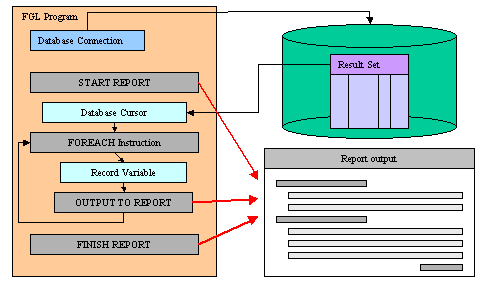

[Back to Contents](../index.html)

------------------------------------------------------------------------

# [Reports]{#PAGE_HEADER}

Summary:

- [What are reports?](#DEFINITION)
- [XML output for reports](#RPT_XML)
- [Report Engine Configuration](#RPT_CONFIG)
- [Report Driver Instructions](#RPT_DRIVER)
- [Report Routine Structure](#RPT_DEFINITION)
  - [The DEFINE section](#RPT_DF_DEFINE)
  - [The OUTPUT section](#RPT_DF_OUTPUT)
  - [The ORDER BY section](#RPT_DF_ORDERBY)
  - [The FORMAT section](#RPT_DF_FORMAT)
- [Statements in Report Routine](#RPT_STMT)
- [Report Routine Prototype](#RPT_PROTOTYPE)
- [Two-Pass Reports](#RPT_TWOPASS)
- Report Instructions
  - [EXIT REPORT](#RPT_STMT_EXIT)
  - [PRINT](#RPT_STMT_PRINT)
  - [PRINTX](#RPT_STMT_PRINTX)
  - [NEED](#RPT_STMT_NEED)
  - [PAUSE](#RPT_STMT_PAUSE)
  - [SKIP](#RPT_STMT_SKIP)
- Report Operators
  - [COLUMN](Operators.html#OP_COLUMN)
  - [LINENO](#RPT_OPER_LINENO)
  - [PAGENO](#RPT_OPER_PAGENO)
  - [SPACES](#RPT_OPER_SPACES)
  - [WORDWRAP](#RPT_OPER_WORDWRAP)
  - [USING](Operators.html#OP_USING)
  - [ASCII](Operators.html#OP_ASCII)
- Report Aggregate Functions
  - [COUNT(\*)](#RPT_AGGR_COUNT)
  - [PERCENT(\*)](#RPT_AGGR_PERCENT)
  - [SUM()](#RPT_AGGR_SUM)
  - [AVG()](#RPT_AGGR_AVG)
  - [MIN()](#RPT_AGGR_MIN)
  - [MAX()](#RPT_AGGR_MAX)

*See also:* [Programs](Programs.html), [Variables](Variables.html),
[Result set](ResultSets.html)

------------------------------------------------------------------------

### [Definition]{#DEFINITION}

A report can arrange and format the data according to your instructions
and display the output on the screen, send it to a printer, or store it
as a file for future use.

To implement a report, a program must include two distinct components:

- The [Report Driver](#RPT_DRIVER) specifies what data the report
  includes.
- The [Report Routine](#RPT_DEFINITION) formats the data for output.

The Report Driver retrieves the specified rows from a database, stores
their values in program variables, and sends these - one input record at
a time - to the Report Routine. After the last input record is received
and formatted, the runtime system calculates any aggregate values based
on all the data and sends the entire report to some output device.

{border="0"}

By separating the two tasks of data retrieval and data formatting, the
runtime system simplifies the production of recurrent reports and makes
it easy to apply the same report format to different data sets.

The report engine supports the following features:

- The option to display [report output](#RPT_DF_OUTPUT) to the screen
  for editing.
- Full control over page layout for your report, including [first page
  header](#RPT_FMT_FPH) and generic [page headers](#RPT_FMT_PH), [page
  trailers](#RPT_FMT_PT), [columnar presentation](#RPT_STMT_PRINT), and
  special formatting [before groups](#RPT_FMT_BAG) and [after
  groups](#RPT_FMT_BAG) sorted by value.
- Facilities for creating the report either from the rows returned by a
  cursor or from input records assembled from any other source, such as
  output from several different `SELECT` statements through the [Report
  Driver](#RPT_DRIVER).
- Control blocks to manipulate data from a database cursor on a
  row-by-row basis, either before or after the row is formatted by the
  report.
- Aggregate functions that can calculate and display
  [frequencies](#RPT_AGGR_COUNT), [percentages](#RPT_AGGR_PERCENT),
  [sums](#RPT_AGGR_SUM), [averages](#RPT_AGGR_AVG),
  [minimum](#RPT_AGGR_MIN), and [maximum](#RPT_AGGR_MAX) values.
- The `USING` operator and other [built-in
  functions](BuiltInFunctions.html) and [operators](Operators.html) for
  formatting and displaying information in output from the report.
- The `WORDWRAP` operator to format long character strings that occupy
  multiple lines of output from the report.
- The option to update the database or execute any sequence of SQL and
  other statements while writing a report, if the intermediate values
  calculated by the report meet specified criteria; for example, to
  write an alert message containing a second report.
- Stopping a report in the report definition code, with [EXIT
  REPORT](#RPT_STMT_EXIT) or [TERMINATE REPORT](#RPT_DRV_TERMINATE).
- Generation of XML output with the [TO XML HANDLER](#RPT_XML) clause.

The report engine supports one-pass reports and two-pass reports. The
one-pass requires sorted data to be produced by the report driver in
order to handle before/after groups properly. The two-pass record
handles sort internally and does not need sorted data from the report
driver. During the first pass, the report engine sorts the data and
stores the sorted values in a temporary file in the database. During the
second pass, it calculates any aggregate values and produces output from
data in the temporary files.

------------------------------------------------------------------------

### [XML output for reports]{#RPT_XML}

For better integration with external tools based on XML standards,
Genero BDL introduced the [PRINTX](#RPT_STMT_PRINTX) instruction to
generate XML output from reports.

The purpose of XML-based  reports is to sort and group data, not to
decorate. Data decoration and formatting can be done by external tools,
or you can redirect the XML report output to a [SAX Document
Handler](ClassSaxDocumentHandler.html) object to process the output and
generate for example HTML pages.

To produce an XML report, you must start the report with the [TO XML
HANDLER](#RPT_DRV_START) clause in the `START REPORT` instruction, and
then use the [PRINTX](#RPT_STMT_PRINTX) statement inside the report
routine:

``` linenumber
01 MAIN
02   ...
03   START REPORT orders_report TO XML HANDLER om.XmlWriter.createFileWriter("orders.xml")
04   ...
05 END MAIN
06 REPORT order_report(rec)
07   ...
08   FORMAT
09     ON EVERY ROW
10        PRINTX NAME = order rec.*
11   ...
12 END REPORT
```

If all the reports of the program must generate XML output, you can also
use the global function
[fgl_report_set_document_handler()](BuiltInFunctions.html#BF_FGL_REPORT_SET_DOCUMENT_HANDLER).

The generated XML output contains the structure of the formatted pages,
with page header, page trailer and group sections. Every PRINTX
instruction will generate a `<Print>` node with a list of `<Item>` nodes
containing the data. The XML processor can use this structure to format
and render the output as needed.

If a new report is started with `START REPORT` instruction inside a
`REPORT` routine producing XML, and if there is no destination specified
in the `START REPORT` instruction, the sub-report inherits the XML
output target of the parent, and sub-report nodes will be merged into
the parent XML output.

The output of an XML report will have the following node structure:

    <Report ...>
       <PageHeader pageNo="...">
          ...
       </PageHeader>
       <Group>
          <BeforeGroup>
             <Print name="...">
                 <Item name="..." type="..." value="..." isoValue="..." />
                 <Item name="..." type="..." value="..." isoValue="..." />
                 ...
             </Print>
             ...
          </BeforeGroup>
          <OnEveryRow>
             <Print name="...">
                 <Item name="..." type="..." value="..." isoValue="..." />
                 <Item name="..." type="..." value="..." isoValue="..." />
                 ...
             </Print>
             ...
          </OnEveryRow>

          ...
          <AfterGroup>
             <Print name="...">
                 <Item name="..." type="..." value="..." isoValue="..." />
                 <Item name="..." type="..." value="..." isoValue="..." />
                 ...
             </Print>
          </AfterGroup>
          ...
       </Group>
       ...

       <OnLastRow ...>
          ...
       </OnLastRow>

       <PageTrailer ...>
          ...
       </PageTrailer>

    </Report>

#### [Output of conditional statements used in the report]{#XML_CONDITIONAL_NODES}

If `PRINTX` commands are used inside program flow control instructions
like `IF`, `CASE`, `FOR`, `FOREACH` and `WHILE`, the XML output will
contain additional nodes to identify such conditional print
instructions:

    <For>
      <ForItem>
        <Print name="...">
          <Item name="..." type="..." value="..." isoValue="..." />
        </Print>
        ...
      </ForItem>
      ...
    </For>

    <While>
      <WhileItem>
        <Print name="...">
          <Item name="..." type="..." value="..." isoValue="..." />
        </Print>
        ...
      </WhileItem>
      ...
    </While>

    <Foreach>
      <ForeachItem>
        <Print name="...">
          <Item name="..." type="..." value="..." isoValue="..." />
        </Print>
        ...
      </ForeachItem>
      ...
    </Foreach>

    <Case>
      <When id="position">
        <Print name="...">
          <Item name="..." type="..." value="..." isoValue="..." />
        </Print>
        ...
      </When>
      ...
    </Case>

    <If>
      <IfThen>
        <Print name="...">
          <Item name="..." type="..." value="..." isoValue="..." />
        </Print>
        ...
      </IfThen>
      <IfElse>
        <Print name="...">
          <Item name="..." type="..." value="..." isoValue="..." />
        </Print>
        ...
      </IfElse>
    </If>

That information can be useful to process an XML report output.

------------------------------------------------------------------------

### [Report Engine Configuration]{#RPT_CONFIG}

By default, GROUP aggregate functions such as [SUM()](#RPT_AGGR_SUM)
return a [NULL](Programs.html#PC_NULL) value if all items values are
[NULL](Programs.html#PC_NULL). You can force the report engine to return
a zero decimal value with the following [FGLPROFILE](FglProfile.html)
setting:

`Report.aggregateZero = `[`{`]{.underline}`true`[`|`]{.underline}`false`[`}`]{.underline}

When this entry is set to true, aggregate functions return zero when all
values are [NULL](Programs.html#PC_NULL).

Default value is : false (Aggregate functions evaluate to
[NULL](Programs.html#PC_NULL) if all items are
[NULL](Programs.html#PC_NULL))

------------------------------------------------------------------------

### [The Report Driver]{#RPT_DRIVER}

The Report Driver retrieves data, starts the report engine and sends the
data (as input records) to be formatted by the `REPORT` routine.

#### Usage:

A report driver can be part of the `MAIN` program block, or it can be in
one or more [functions](Functions.html).

The report driver typically consists of a loop (such as
[WHILE](FlowControl.html#FC_WHILE), [FOR](FlowControl.html#FC_FOR), or
[FOREACH](ResultSets.html#RS_FOREACH)) with the following statements to
process the report:

::: {align="center"}
  ---------------------------------------- ---------------------------------------------------------------
  **Instruction**                          **Description**
  [START REPORT](#RPT_DRV_START)           This statement is required to instantiate the report driver. 
  [OUTPUT TO REPORT](#RPT_DRV_OUTPUT)      Provide data for one row to the report driver.
  [FINISH REPORT](#RPT_DRV_FINISH)         Normal termination of the report.
  [TERMINATE REPORT](#RPT_DRV_TERMINATE)   Cancels the processing of the report.
  ---------------------------------------- ---------------------------------------------------------------
:::

A report driver is started by the `START REPORT` instruction. Once
started, data can be provided to the report driver through the
`OUTPUT TO REPORT` statement. To instruct the report engine to terminate
output processing, use the `FINISH REPORT` instruction. To cancel a
report from outside the report routine, use `TERMINATE REPORT` (from
inside the report routine, you cancel the report with `EXIT REPORT`).

In order to handler report interruption, the report driver can check if
the [INT_FLAG](Programs.html#PV_INT_FLAG) variable is
[TRUE](Programs.html#PC_TRUE) to stop the loop when the user asked to
interrupt the report execution (see example below).

It is possible to execute several report drivers at the same time. It is
even possible to invoke a report driver inside a `REPORT` routine, which
is different from the current driver.

The programmer must make sure that the runtime system will always
execute these instructions in the following order:

1.  `START REPORT`
2.  `OUTPUT TO REPORT`
3.  `FINISH REPORT`

#### Example:

``` linenumber
01 DATABASE stores7
02 MAIN
03   DEFINE rcust RECORD LIKE customer.*
04   DECLARE cu1 CURSOR FOR SELECT * FROM customer
05   LET int_flag = FALSE
06   START REPORT myrep
07   FOREACH cu1 INTO rcust.*
08      IF int_flag THEN EXIT FOREACH END IF
09      OUTPUT TO REPORT myrep(rcust.*)
10   END FOREACH
11   IF int_flag THEN
12     TERMINATE REPORT myrep
13   ELSE
14     FINISH REPORT myrep
15   END IF
16 END MAIN
```

------------------------------------------------------------------------

### [START REPORT]{#RPT_DRV_START}

#### Syntax:

` START REPORT `*`report-name`*` `[\]{.underline}
`   `[`[`]{.underline}` TO `*[`to-clause`](#to-clause)*` `[`]`\]{.underline}
`  `[`[`]{.underline}` WITH `*[`dimension-option`](#dimension-option)*` `[`[`]{.underline}`,`[`...]`]{.underline}` `[`]`]{.underline}` `

[where *to-clause* is one of:]{#to-clause}

[`{`]{.underline}` SCREEN`\
[`|`]{.underline}` PRINTER`\
[`|`]{.underline}` `[`[`]{.underline}`FILE`[`]`]{.underline}` `*`filename`\*
[`|`]{.underline}` PIPE `*`program`*` `[`[`]{.underline}` IN FORM MODE `[`|`]{.underline}` IN LINE MODE `[`]`]{.underline}\
[`|`]{.underline}` XML HANDLER `*`sax-handler-object`*\
[`|`]{.underline}` OUTPUT `*[`destination-option`](#destination-option)*\
[`}`]{.underline}

[where *destination-option* is one of:]{#destination-option}

[`{`]{.underline}` "SCREEN"`*\*
` `[`|`]{.underline}` "PRINTER"`\
[`|`]{.underline}` "FILE" DESTINATION `*`filename`*\
[`|`]{.underline}` "PIPE `[`{`]{.underline}` IN FORM MODE `[`|`]{.underline}` IN LINE MODE `[`}`]{.underline}`" DESTINATION `*`program`*`  `\
[`|`]{.underline}` `*`variable`*` `[`[`]{.underline}` `` DESTINATION `[`{`]{.underline}` `*`program`*` | `*`filename`*` `[`}`]{.underline}` `[`]`]{.underline}\
[`}`]{.underline}` `

[where *dimension-option* is one of:]{#dimension-option}

[`{`]{.underline}\
`  LEFT MARGIN = `*`m-left`*\
[`|`]{.underline}` RIGHT MARGIN  = `*`m-right`*\
[`|`]{.underline}` TOP MARGIN = `*`m-top`*\
[`|`]{.underline}` BOTTOM MARGIN = `*`m-bottom`*\
[`|`]{.underline}` PAGE LENGTH = `*`m-length`*\
[`|`]{.underline}` TOP OF PAGE = `*`c-top`*[\
`}`]{.underline}` `

#### Notes:

1.  *report-name* is a report that has been defined as a `REPORT`
    routine.
2.  *filename* is a [string expression](Expressions.html#EX_STRING)
    specifying the file that receives output.
3.  *program* is a [string expression](Expressions.html#EX_STRING)
    specifying a program, a shell script, or a command line to receive
    output.
4.  *variable* is a [variable](Variables.html) of type
    [STRING](DataTypes.html#DT_STRING) that specifies one of: `SCREEN`,
    `PRINTER`, `FILE`, `PIPE`, `PIPE IN LINE MODE`,
    ` PIPE IN FORM MODE`.  If `PRINTER` is specified, the
    [`DBPRINT`](EnvironmentVariables.html#EV_DBPRINT) environment
    variable specifies which printer.
5.  *sax-handler-object* is a variable referencing an
    [om.SaxDocumentHandler](ClassSaxDocumentHandler.html) instance.
6.  *m-left* is the left margin in number of characters.
7.  *m-right* is the right margin in number of characters.
8.  *m-top* is the top margin in number of lines.
9.  *m-bottom* is the bottom margin in number of lines.
10. *m-length* is the total number of lines on the page.
11. *c-top* is a string that defines the page-eject character sequence.

#### Example:

``` linenumber
01 DEFINE file_name VARCHAR(200), page_size INTEGER
02 ...
03 START REPORT myrep
04   TO FILE file_name
05   WITH PAGE LENGTH = page_size
```

#### Usage:

The `START REPORT` statement initializes a report. The instruction
allows you to specify the report output destination and the page
dimensions and margins.

`START REPORT` typically precedes a loop instruction such as [FOR,
FOREACH, or WHILE](FlowControl.html) in which [OUTPUT TO
REPORT](#RPT_DF_OUTPUT) feeds the report routine with data. After the
loop terminates, [FINISH REPORT](#RPT_DRV_FINISH) completes the
processing of the output.

#### Warnings:

1.  If a `START REPORT` statement references a report that is already
    running, the report is re-initialized; any output might be
    unpredictable.

##### Output specification

The `TO` clause can be used to specify a destination for output. If you
omit the `TO` clause, the Genero runtime system sends report output to
the destination specified in the [REPORT definition](#RPT_DEFINITION).
If the REPORT routine does not define an [OUTPUT
clause](#RPT_DF_OUTPUT), the report output is sent by default to the
report viewer when in GUI mode, or to the screen when in TUI mode.

Report output can be specified dynamically as follows:

- The `TO FILE` option can specify the *filename* as a character
  variable that is assigned at runtime.

- The `TO PIPE` option can specify the *program* as a character variable
  that is assigned at runtime.

- The `TO OUTPUT` option can specify the report output with a string
  expression, described later in detail.

The `SCREEN` option specifies that output is to the report window. The
way the report is displayed to the end user depends on whether you are
in TUI mode or GUI mode. In TUI mode, the report output displays to the
terminal screen. In GUI mode, the report output displays in a dedicated
popup window called the Report Viewer.

The `PRINTER` option instructs the runtime system to output the report
to the device or program defined by the
[DBPRINT](EnvironmentVariables.html#EV_DBPRINT) environment variable.

When using the `FILE` option, you can specify a file name as the report
destination. Output will be sent to the specified file. If the file
exists, its content will be overwritten by the new report output. Note
that the `FILE` keyword is optional, but it\'s best to include it to
make your code more readable.

The `PIPE` option defines a program, shell script, or command line to
which the report output must be sent, using the standard input channel.
When using the TUI mode, you can use the `IN [LINE|FORM] MODE` option to
specify whether the program is in line mode or in formatted mode when
report output is sent to a pipe. See [screen
modes](Programs.html#options-run) for more details.

The `TO OUTPUT` option allows you to specify one of the above output
options dynamically at runtime. The character string expression must be
one of: `"SCREEN"`, `"PRINTER"`, `"FILE"`, `"PIPE"`,
`"PIPE IN LINE MODE"`, `" PIPE IN FORM MODE"`. If the expression
specifies `"FILE"` or `"PIPE"`, you can also specify a *filename* or
*program* in a character variable following the `DESTINATION` keyword.

The `XML HANDLER` option indicates that the report output will be
generated as XML and re-directed to a SAX-document handler. When using
XML output, the report result can be shown in the Genero Report Engine
installed on the front-end workstation. See [XML output](#RPT_XML) for
more details.

##### Page dimensions specification

The `WITH` clause defines the dimensions of each report page and the
left, top, right and bottom margins. The values corresponding to a
margin and page length must be valid [integer
expressions](Expressions.html#EX_INTEGER). The margins can be defined in
any order, but a comma \",\" is required to separate two [page
dimensions options](#dimension-option).

- The `LEFT MARGIN` clause defines the number of blank spaces to include
  at the start of each new line of output. The default is 5.

- The `RIGHT MARGIN` clause defines the total number of characters in
  each line of output, including the left margin. If you omit this but
  specify `FORMAT EVERY ROW`, the default is 132.

- The `TOP MARGIN` clause specifies how many blank lines appear above
  the first line of text on each page of output. The default is 3.

- The `BOTTOM MARGIN` clause specifies how many blank lines follow the
  last line of output on each page. The default is 3.

- The `PAGE LENGTH `clause specifies the total number of lines on each
  page, including data, the margins, and any page headers or page
  trailers from the `FORMAT` section. The default page length is 66
  lines.

In addition to the page dimension options, the `TOP OF PAGE` clause can
specify a page-eject sequence for a printer. On some systems, specifying
this value can reduce the time required for a large report to produce
output, because [SKIP TO TOP OF PAGE](#RPT_STMT_SKIP) can substitute
this value for multiple linefeeds.

------------------------------------------------------------------------

### [OUTPUT TO REPORT]{#RPT_DRV_OUTPUT}

#### Syntax:

`OUTPUT TO REPORT `*`report-name`*` ( `*`parameters`*` )`

#### Notes:

1.  *report-name* is the name of the report to which the *parameters*
    should be sent.
2.  *parameters* is the data that needs to be sent to the report. As in
    a [function call](FlowControl.html#FC_CALL), *parameters* must match
    the [DEFINE section](#RPT_DF_DEFINE) of the report routine.

#### Usage:

The `OUTPUT TO REPORT` instruction feeds the [Report
Routine](#RPT_DEFINITION) with a single set of data values (called an
*input record*), which corresponds usually to one printed line in the
report output.

An *input record* is the ordered set of values returned by the
expressions that you list between the parentheses following the report
name in the `OUTPUT TO REPORT` statement. The specified values are
passed to the report routine, as part of the *input record*. The *input
record* typically corresponds to a retrieved row from the database. The
set of values is usually grouped in a [RECORD](Records.html) variable
and best practice is to define a [User Type](UserTypes.html) in order to
ease the variable definitions required in the code implementing the
report driver and the report routine definition, for example:

``` linenumber
01 SCHEMA stores
02 TYPE t_cust RECORD LIKE customer.*
03 ...
04 DEFINE r_cust t_cust
05 ...
06   OUTPUT TO REPORT cust_report(r_cust.*)
07 ...
08 REPORT cust_report(r)
09    DEFINE r t_cust
10   ...
```

You typically include the `OUTPUT TO REPORT` statement within a
[WHILE](FlowControl.html#FC_WHILE), [FOR](FlowControl.html#FC_FOR), or
[FOREACH](ResultSets.html#RS_FOREACH) loop, so that the program passes
data to the report one *input record* at a time. The next example uses a
`FOREACH` loop to fetch data from the database and pass it as *input
record* to a report:

``` linenumber
01 SCHEMA stores
02 DEFINE o LIKE orders.*
03 ...
04 DECLARE order_c CURSOR FOR
05     SELECT orders.*
06       FROM orders ORDER BY ord_cust
07   START REPORT order_list 
08   FOREACH order_c INTO o.*
09     OUTPUT TO REPORT order_list(o.*)
10   END FOREACH
11   FINISH REPORT order_list
12 ...
```

Special consideration should be taken regarding row ordering with
reports: For example if the report groups rows with [BEFORE GROUP
OF](#RPT_FMT_BAG) and/or [AFTER GROUP OF](#RPT_FMT_BAG) sections, the
rows must be ordered by the column specified in these sections, and rows
should preferably be ordered by the *report driver* to avoid [two-pass
reports](#RPT_TWOPASS).

If `OUTPUT TO REPORT` is not executed, none of the control blocks of the
report routine are executed, even if the program also includes the
[START REPORT](#RPT_DRV_START) and [FINISH REPORT](#RPT_DRV_FINISH)
statements.

#### Warnings:

1.  The members of the *input record* that you specify in the expression
    list of the `OUTPUT TO REPORT` statement must correspond to elements
    of the formal argument list in the REPORT definition in their number
    and their position, and must be of compatible data types.  At
    compile time, the number of parameters passed with the
    `OUTPUT TO REPORT` instruction is not checked against the [DEFINE
    section](#RPT_DF_DEFINE) of the report routine. This is a known
    behavior of the language.
2.  Arguments of the [TEXT](DataTypes.html#DT_TEXT) and
    [BYTE](DataTypes.html#DT_BYTE) data types are passed by reference
    rather than by value; arguments of other data types are passed by
    value. A report can use the [WORDWRAP](#RPT_OPER_WORDWRAP) operator
    with the [PRINT](#RPT_STMT_PRINT) statement to display TEXT values.
    A report cannot display BYTE values; the character string \<byte
    value\> in output from the report indicates a BYTE value.

------------------------------------------------------------------------

### [FINISH REPORT]{#RPT_DRV_FINISH}

#### Syntax:

`FINISH REPORT `*`report-name`*

#### Notes:

1.  *report-name* is the name of the report to be ended.
2.  `FINISH REPORT` must be the last statement in the report driver.

#### Usage:

`FINISH REPORT` closes the report driver. Therefore, it must be the last
statement in the report driver and must follow a `START REPORT`
statement that specifies the name of the same report.

`FINISH REPORT` does the following:

1.  Completes the second pass, if report is a [two-pass
    report](#RPT_TWOPASS). These \'second pass\' activities handle the
    calculation and output of any aggregate values that are based on all
    the input records in the report, such as `COUNT(*)` or `PERCENT(*)`
    with no `GROUP` qualifier.
2.  Executes any `AFTER GROUP OF` control blocks.
3.  Executes any `PAGE HEADER`, `ON LAST ROW`, and `PAGE TRAILER`
    control blocks to complete the report.
4.  Copies data from the output buffers of the report to the
    destination.
5.  Closes the Select cursor on any temporary table that was created to
    order the input records or to perform aggregate calculations.

------------------------------------------------------------------------

### [TERMINATE REPORT]{#RPT_DRV_TERMINATE}

#### Syntax:

`TERMINATE REPORT `*`report-name`*

#### Notes:

1.  *report-name* is the name of the report to be canceled.

#### Usage:

`TERMINATE REPORT` cancels the report processing. It is typically used
when the program (or the user) becomes aware that a problem prevents the
report from producing part of its intended output, or when the user
interrupted the report processing.

`TERMINATE REPORT` has the following effects:

- Terminates the processing of the current report.
- Deletes any intermediate files or temporary tables that were created
  in processing the report.

The [EXIT REPORT](#RPT_STMT_EXIT) instruction has the same effect,
except that it can be used inside the report definition.

------------------------------------------------------------------------

### [Report Definition]{#RPT_DEFINITION}

#### [Syntax:]{#SYNTAX}

`[PUBLIC|PRIVATE] REPORT `*`report-name`*` (`*`argument-list`*`)`\
`    `[`[`]{.underline}` `*`define-section `*` `[`]`]{.underline}\
`    `[`[`]{.underline}` `*`output-section `*` `[`]`]{.underline}\
`    `[`[`]{.underline}` `*`sort-section`*` `[`]`]{.underline}\
`    `[`[`]{.underline}` `*`format-section `*` `[`]`]{.underline}\
`END REPORT `

where *define-section* is:

`DEFINE `*`variable-definition`*` `[`[,...]`]{.underline}

where *output-section* is:

`OUTPUT `\
[`[`]{.underline}\
`  REPORT TO`\
`  `[`{`]{.underline}\
`      SCREEN`\
`    `[`|`]{.underline}` PRINTER`\
`    `[`|`]{.underline}` `[`[`]{.underline}` FILE `` `[`]`]{.underline}` `*`filename`\
`   `*` `[`|`]{.underline}` PIPE `*`program`*` `[`[`]{.underline}` IN FORM MODE `[`|`]{.underline}` IN LINE MODE `[`]`]{.underline}\
`  `[`}`]{.underline}\
[`]`]{.underline}\
[`[`]{.underline}\
`  `[`[`]{.underline}` WITH `[`]`\]{.underline}
`   `[`[`]{.underline}` LEFT MARGIN `*`m-left`*` `[`]`]{.underline}` `\
`  `[`[`]{.underline}` RIGHT MARGIN `*`m-right`*` `[`]`]{.underline}` `\
`  `[`[`]{.underline}` TOP MARGIN `*`m-top`*` `[`]`]{.underline}` `\
`  `[`[`]{.underline}` BOTTOM MARGIN `*`m-bottom`*` `[`]`]{.underline}` `\
`  `[`[`]{.underline}` PAGE LENGTH `*`m-length`*` `[`]`]{.underline}` `\
`  `[`[`]{.underline}` TOP OF PAGE `*`c-top `*[`]`]{.underline}` `\
[`]`]{.underline}` `

where *sort-section* is:

` ORDER `[`[`]{.underline}` EXTERNAL `[`]`]{.underline}` BY `*`report-variable`*` `[`[,...]`]{.underline}

where *format-section* is:

`FORMAT EVERY ROW`

or:

` FORMAT`\
`   `*`control-block`*\
`      `[`[`]{.underline}` `*`report-only-fgl-statement `[`|`]{.underline}` sql-statement `[`|`]{.underline}` `[`report-statement`](#RPT_STMT_ONLY)*` `[`]`]{.underline}\
`      `[`[...]`]{.underline}\
`    `[`[...]`]{.underline}

where *control-block* can be one of:

[`{`]{.underline}\
[`[`]{.underline}` FIRST `[`]`]{.underline}` PAGE HEADER`\
[`|`]{.underline}`  ON EVERY ROW`\
[`|`]{.underline}`  BEFORE GROUP OF `*`report-variable`\*
` `[`|`]{.underline}`  AFTER GROUP OF `*`report-variable`\*
` `[`|`]{.underline}`  PAGE TRAILER `*\*
[`|`]{.underline}`  ON LAST ROW`\
[`}`]{.underline}

#### Notes:

1.  *variable-definition* follows the [DEFINE](Variables.html#VA_DEFINE)
    instruction syntax and declares *report-variables*.
2.  *report-variable* is the name of a variable declared in the DEFINE
    section.
3.  *report-only-fgl-statement* is a sub-set of all the regular language
    statements (see warning below).
4.  *sql-statement* is a valid static SQL statement.

#### Usage:

The report definition formats input records. Like the `FUNCTION` or
`MAIN` statement, it is a program block that can be the scope of local
variables. It is not, however, a function; it is not reentrant, and
[`CALL`](FlowControl.html#FC_CALL) cannot invoke it. The report
definition receives data from its driver in sets called input records.
These records can include program records, but other data types are also
supported. Each input record is formatted and printed as specified by
control blocks and statements within the report definition. Most
statements and functions can be included in a report definition, and
certain specialized statements and operators for formatting output can
appear only in a report definition.

Like `MAIN` or `FUNCTION`, the report definition must appear outside any
other program block. It must begin with the `REPORT` statement and must
end with the `END REPORT` keywords.

**Warning: Some statements are prohibited in a `REPORT` routine control
block. For example, it is not possible to use `CONSTRUCT`, `INPUT`,
`DEFER`, `DEFINE`, `REPORT`, `RETURN` instructions in a control block of
a report. **

By default, report routines are public; They can be called by any other
module of the program. If a report routine is only used by the current
module, you may want to hide that routine to other modules, to make sure
that it will not be called by mistake. To keep a report routine local to
the module, add the `PRIVATE` keyword before the report header. Private
report routines are only hidden to external modules, all function of the
current module can still call local private report routines.

The *[define-section](#RPT_DF_DEFINE)* declares the data types of local
variables used within the report, and of any variables (the input
records) that are passed as arguments to the report by the calling
statement. Reports without arguments or local variables do not require a
`DEFINE` section.

The *[output-section](#RPT_DF_OUTPUT)* can set margin and page size
values, and can also specify where to send the formatted output. Output
from the report consists of successive pages, each containing a fixed
number of lines whose margins and maximum number of characters are
fixed.

The *[sort-section](#RPT_DF_ORDERBY)* specifies how the rows have to be
sorted. The specified sort order determines the order in which the
runtime system processes any `GROUP OF` control blocks in the `FORMAT`
section.

The *[format-section](#RPT_DF_FORMAT)* is required. It specifies the
appearance of the report, including page headers, page trailers, and
aggregate functions of the data. It can also contain control blocks that
specify actions to take before or after specific groups of rows are
processed. (Alternatively, it can produce a default report by only
specifying `FORMAT EVERY ROW`).

------------------------------------------------------------------------

### [The DEFINE Section]{#RPT_DF_DEFINE}

#### Syntax:

The syntax of the report `DEFINE` section is the same as for the [DEFINE
statement](Variables.html#VA_DEFINE), except that you cannot define
arrays or array members for records.

#### Usage:

This section declares a data type for each formal argument in the
`REPORT` prototype and for any additional local variables that can be
referenced only within the `REPORT` program block. The `DEFINE` section
is required if you pass arguments to the report or if you reference
local variables in the report.

For declaring local report variables, the same rules apply to the
`DEFINE` section as to the [DEFINE](Variables.html#VA_DEFINE) statement
in `MAIN` and `FUNCTION` program blocks. There are some differences and
exceptions, however:

- Report arguments cannot be of type `ARRAY`.
- Report arguments cannot be records that include `ARRAY` members.
- Report local variables are not allocated on the stack at every
  `OUTPUT TO REPORT` call: The scope of the variables in the `DEFINE`
  section is local to the report routine, but the lifetime is the
  duration of the program, like module or global variables. In other
  words, report variables persist across `OUTPUT TO REPORT` calls.

Data types of local variables that are not formal arguments are
unrestricted. You must include arguments in the report prototype and
declare them in the `DEFINE` section, if any of the following conditions
is true:

- If you specify `FORMAT EVERY ROW` to create a default report, you must
  pass all the values for each record of the report.
- If an [ORDER BY section](#RPT_DF_ORDERBY) is included, you must pass
  all the values that `ORDER BY` references for each input record of the
  report.
- If you use the `AFTER GROUP OF` control block, you must pass at least
  the arguments that are named in that control block.
- If an aggregate that depends on all records of the report appears
  anywhere except in the `ON LAST ROW` control block, you must pass each
  of the records of the report through the argument list.

Aggregates dependent on all records include:

- `GROUP PERCENT(*)` (anywhere in a report).
- Any aggregate without the `GROUP` keyword (anywhere outside the
  `ON LAST ROW` control block).

If your report calls an aggregate function, an error might result if any
argument of an aggregate function is not also a format argument of the
report. You can, however, use global or module variables as arguments of
aggregates if the value of the variable does not change while the report
is executing.

A report can reference variables of global or module scope that are not
declared in the `DEFINE` section. Their values can be printed, but they
can cause problems in aggregates and in `BEFORE GROUP OF` and
`AFTER GROUP OF` clauses. Any references to non-local variables can
produce unexpected results, however, if their values change while a
[two-pass report](#RPT_TWOPASS) is executing.

------------------------------------------------------------------------

### [The OUTPUT Section]{#RPT_DF_OUTPUT}

#### Syntax:

` OUTPUT `\
[`[`]{.underline}\
`  REPORT TO`\
`  `[`{`]{.underline}\
`      SCREEN`\
`    `[`|`]{.underline}` PRINTER`\
`    `[`|`]{.underline}` `[`[`]{.underline}` FILE `` `[`]`]{.underline}` `*`filename`\*
`     `[`|`]{.underline}` PIPE `[`[`]{.underline}` IN FORM MODE `[`|`]{.underline}` IN LINE MODE `[`]`]{.underline}` `*`program`*`  `\
`  `[`}`]{.underline}\
[`]`]{.underline}\
[`[`]{.underline}\
`  `[`[`]{.underline}` WITH `[`]`\]{.underline}
`   `[`[`]{.underline}` LEFT MARGIN `*`m-left`*` `[`]`]{.underline}` `\
`  `[`[`]{.underline}` RIGHT MARGIN `*`m-right`*` `[`]`]{.underline}` `\
`  `[`[`]{.underline}` TOP MARGIN `*`m-top`*` `[`]`]{.underline}` `\
`  `[`[`]{.underline}` BOTTOM MARGIN `*`m-bottom`*` `[`]`]{.underline}` `\
`  `[`[`]{.underline}` PAGE LENGTH `*`m-length`*` `[`]`]{.underline}` `\
`  `[`[`]{.underline}` TOP OF PAGE `*`c-top `*[`]`]{.underline}` `\
[`]`]{.underline}` `

#### Notes:

1.  *program* is a [string](DataTypes.html#DT_STRING)
    [literal](Literals.html#LT_STRING), [global](Globals.html), or
    [constant](Constants.html) specifying the name of a program, shell
    script, command receiving the output.
2.  *filename* is a [string](DataTypes.html#DT_STRING)
    [literal](Literals.html#LT_STRING), [global](Globals.html), or
    [constant](Constants.html) specifying the file which receives the
    output of the report.
3.  *m-left* is the left margin in number of characters.
4.  *m-right* is the right margin in number of characters.
5.  *m-top* is the top margin in number of lines.
6.  *m-bottom* is an integer the bottom margin in number of lines.
7.  *c-top* is a string that defines the page-eject character sequence.

#### Usage:

The `OUTPUT` section can specify the destination and dimensions for
output from the report and the page-eject sequence for the printer. If
you omit the `OUTPUT` section, the report uses default values to format
each page. This section is superseded by any corresponding
` `[`START REPORT`](#RPT_DRV_START) specifications.

The `OUTPUT` section can direct the output from the report to a printer,
file, or pipe, and can initialize the page dimensions and margins of
report output.  If `PRINTER` is specified, the
[`DBPRINT`](EnvironmentVariables.html#EV_DBPRINT) environment variable
specifies which printer.

The ` `[`START REPORT`](#RPT_DRV_START) statement of the report driver
can override all of these specifications by assigning another
destination in its `TO` clause or by assigning other dimensions,
margins, or another page-eject sequence in the `WITH` clause.

Because the size specifications for the dimensions and margins of a page
of report output that the `OUTPUT` section can specify must be literal
integers, you might prefer to reset these values in the `START REPORT`
statement, where you can use variables to assign these values
dynamically at runtime.

------------------------------------------------------------------------

### [The ORDER BY Section]{#RPT_DF_ORDERBY}

#### Purpose:

This section specifies how the variables of the input records are to be
sorted. It is required if the report driver does not send sorted data to
the report. The specified sort order determines the order in which the
runtime system processes any `GROUP OF` control blocks in the
[FORMAT](#RPT_DF_FORMAT) section.

#### Syntax:

`ORDER `[`[`]{.underline}` EXTERNAL `[`]`]{.underline}` BY `*`report-variable`*` `[`[`]{.underline}` DESC `[`|`]{.underline}` ASC `[`]`]{.underline}` `[`[`]{.underline}`,...`[`]`]{.underline}

#### Notes:

1.  *report-variable *identifies one of the [variables](Variables.html)
    passed to the report routine to be used for sorting rows.\
    The variables must be separated by a comma.

#### Usage:

The `ORDER BY` section specifies a sort list for the input records.
Include this section if values that the report definition receives from
the report driver are significant in determining how `BEFORE GROUP OF`
or `AFTER GROUP OF` control blocks will process the data in the
formatted report output.

If you omit the `ORDER BY` section, the runtime system processes input
records in the order received from the [report driver](#RPT_DRIVER) and
processes any `GROUP OF` control blocks in their order of appearance in
the `FORMAT` section. If records are not sorted in the [report
driver](#RPT_DRIVER), the `GROUP OF` control blocks might be executed at
random intervals (that is, after any input record) because unsorted
values tend to change from record to record.

If you specify only one variable in the `GROUP OF` control blocks, and
the input records are already sorted in sequence on that variable by the
`SELECT` statement, you do not need to include an `ORDER BY` section in
the report.

Specify `ORDER EXTERNAL BY` if the input records have already been
sorted by the `SELECT` statement used by the [report
driver](#RPT_DF_OUTPUT). The list of variables after the keywords
`ORDER EXTERNAL BY` control the execution order of `GROUP BY` control
blocks.

Without the `EXTERNAL` keyword, the report becomes a [two-pass
report](#RPT_TWOPASS), meaning that the report engine processes the set
of input records twice. During the first pass, the report engine sorts
the data and stores the sorted values in a temporary table in the
database. During the second pass, it calculates any aggregate values and
produces output from data in the temporary files.

With the `EXTERNAL` keyword, the report engine only needs to make a
single pass through the data: it does not need to build the temporary
table in the database for sorting the data. However, note that if the
report routine contains aggregations functions such as [GROUP
PERCENT(\*)](#RPT_AGGR_PERCENT), the report will become a [two-pass
report](#RPT_TWOPASS) because such aggregation function needs all rows
to compute the value.

The `DESC` or `ASC` clause defines the sort order.

------------------------------------------------------------------------

### [The FORMAT Section]{#RPT_DF_FORMAT}

#### Purpose:

A report definition must contain a `FORMAT` section. The `FORMAT`
section determines how the output from the report will look. It works
with the values that are passed to the `REPORT` program block through
the argument list or with global or module variables in each record of
the report. In a source file, the `FORMAT` section begins with the
`FORMAT` keyword and ends with the ` END REPORT` keywords.

#### Syntax:

Default format:

` FORMAT EVERY ROW`

Custom format:

` FORMAT`\
`   `*`control-block`*\
`      `[`[`]{.underline}` `*`report-only-fgl-statement `[`|`]{.underline}` sql-statement `[`|`]{.underline}` `[`report-statement`](#RPT_STMT_ONLY)*` `[`]`]{.underline}\
`      `[`[...]`]{.underline}\
`    `[`[...]`]{.underline}

where *control-block* can be one of:

[`{`]{.underline}\
[`[`]{.underline}` FIRST `[`]`]{.underline}` PAGE HEADER`\
[`|`]{.underline}`  ON EVERY ROW`\
[`|`]{.underline}`  BEFORE GROUP OF `*`report-variable`\*
` `[`|`]{.underline}`  AFTER GROUP OF `*`report-variable`\*
` `[`|`]{.underline}`  PAGE TRAILER `*\*
[`|`]{.underline}`  ON LAST ROW`\
[`}`]{.underline}

#### Notes:

1.  *report-only-fgl-statement* is any language instruction supported in
    the report routine.
2.  *sql-statement* is any SQL statement supported by the language.
3.  *[report-statement](#RPT_STMT_ONLY)* is any report-specific
    instruction.
4.  *report-variable* is the name of a variable declared in the DEFINE
    section.
5.   

#### Usage:

The `FORMAT` section is made up of the following *Control Blocks*:

- [FIRST PAGE HEADER](#RPT_FMT_FPH)
- [PAGE HEADER](#RPT_FMT_PH)
- [PAGE TRAILER](#RPT_FMT_PT)
- [BEFORE GROUP OF](#RPT_FMT_BAG)
- [AFTER GROUP OF](#RPT_FMT_BAG)
- [ON EVERY ROW](#RPT_FMT_OEROW)
- [ON LAST ROW](#RPT_FMT_LROW)

If you use the `FORMAT EVERY ROW`, no other statements or control blocks
are valid. The `EVERY ROW` keywords specify a default output format,
including every input record that is passed to the report.

Control blocks define the structure of a report by specifying one or
more statements to be executed when specific parts of the report are
processed.

If a report driver includes `START REPORT` and `FINISH REPORT`
statements, but no data records are passed to the report, no control
blocks are executed. That is, unless the report executes an
`OUTPUT TO REPORT` statement that passes at least one input record to
the report; then neither the `FIRST PAGE HEADER` control block nor any
other control block is executed

Apart from `BEFORE GROUP OF` and `AFTER GROUP OF`, each control block
must appear only one time.

More complex `FORMAT` sections can contain control blocks like
`ON EVERY ROW` or `BEFORE GROUP OF`, which contain statements to execute
while the report is being processed. Control blocks can contain report
execution statements and other executable statements.

See also [statements and report format section](#RPT_STMT).

A control block may invoke most *fgl-statements* and *sql-statements*,
except those listed in [prohibited statements](#RPT_STMT_PROHIB).

The `BEFORE/AFTER GROUP OF` control blocks can include aggregate
functions to instruct the report engine to automatically compute such
values.

A *[report-statement](#RPT_STMT_ONLY)* is a statement specially designed
for the report format section. It cannot be used in any other part of
the program.

The sequence in which the `BEFORE GROUP OF` and `AFTER GROUP OF` control
blocks are executed depends on the sort list in the
` `[`ORDER BY`](#RPT_DF_ORDERBY) section, regardless of the physical
sequence in which these control blocks appear within the `FORMAT`
section.

------------------------------------------------------------------------

### [FORMAT EVERY ROW]{#RPT_FMT_EROW}

A report routine written with `FORMAT EVERY ROW` formats the report in a
simple default format, containing only the values that are passed to the
`REPORT` program block through its arguments, and the names of the
arguments. You cannot modify the `EVERY ROW` statement with any of the
statements listed in [report execution statements](#RPT_STMT_ONLY), and
neither can you include any control blocks in the `FORMAT` section.

The report engine uses as column headings the names of the variables
that the report driver passes as arguments at runtime. If all fields of
each input record can fit horizontally on a single line, the default
report prints the names across the top of each page and the values
beneath. Otherwise, it formats the report with the names down the left
side of the page and the values to the right, as in the previous
example. When a variable contains a null value, the default report
prints only the name of the variable, with nothing for the value.

The following example is a brief report specification that uses
`FORMAT EVERY ROW`. We assume here that the cursor that retrieved the
input records for this report was declared with an `ORDER BY` clause, so
that no `ORDER BY` section is needed in this report definition:

``` linenumber
01 DATABASE stores7
02
03 REPORT simple( order_num, customer_num, order_date )
04
05   DEFINE order_num LIKE orders.order_num,
06         customer_num LIKE orders.customer_num,
07         order_date LIKE orders.order_date
08
09   FORMAT EVERY ROW
10
11 END REPORT
```

The above example would produce the following output:

    order_num customer_num order_date
         1001         104  01/20/1993
         1002         101  06/01/1993
         1003         104  10/12/1993
         1004         106  04/12/1993
         1005         116  12/04/1993
         1006         112  09/19/1993
         1007         117  03/25/1993
         1008         110  11/17/1993
         1009         111  02/14/1993
         1010         115  05/29/1993
         1011         104  03/23/1993
         1012         117  06/05/1993

------------------------------------------------------------------------

### [FIRST PAGE HEADER]{#RPT_FMT_FPH}

This control block specifies the action that the runtime system takes
before it begins processing the first input record. You can use it, for
example, to specify what appears near the top of the first page of
output from the report.

Because the runtime system executes the `FIRST PAGE HEADER` control
block before generating any output, you can use this control block to
initialize variables that you use in the `FORMAT` section.

If a report driver includes `START REPORT` and `FINISH REPORT`
statements, but no data records are passed to the report, this control
block is not executed. That is, unless the report executes an
`OUTPUT TO REPORT` statement that passes at least one input record to
the report, neither the `FIRST PAGE HEADER` control block nor any other
control block is executed.

As its name implies, you can also use a `FIRST PAGE HEADER` control
block to produce a title page as well as column headings. On the first
page of a report, this control block overrides any `PAGE HEADER` control
block. That is, if both a `FIRST PAGE HEADER` and a `PAGE HEADER`
control block exist, output from the first appears at the beginning of
the first page, and output from the second begins all subsequent pages.

The `TOP MARGIN` (set in the `OUTPUT` section) determines how close the
header appears to the top of the page.

#### Warnings:

1.  You cannot include a `SKIP` integer `LINES` statement inside a loop
    within this control block.
2.  The `NEED` statement is not valid within this control block.
3.  If you use an `IF`...`THEN`...`ELSE` statement within this control
    block, the number of lines displayed by any `PRINT` statements
    following the `THEN` keyword must be equal to the number of lines
    displayed by any `PRINT` statements following the `ELSE` keyword.
4.  If you use a `CASE`, `FOR`, or `WHILE` statement that contains a
    `PRINT` statement within this control block, you must terminate the
    `PRINT` statement with a semicolon ( ; ). The semicolon suppresses
    any `LINEFEED` characters in the loop, keeping the number of lines
    in the header constant from page to page.
5.  You cannot use a `PRINT` filename statement to read and display text
    from a file within this control block

Corresponding restrictions also apply to `CASE`, `FOR`, `IF`, `NEED`,
`SKIP`, `PRINT`, and `WHILE` statements in `PAGE HEADER` and
`PAGE TRAILER` control blocks.

------------------------------------------------------------------------

### [PAGE HEADER]{#RPT_FMT_PH}

This control block is executed whenever a new page is added to the
report. The `PAGE HEADER` control block specifies the action that the
runtime takes before it begins processing each page of the report. It
can specify what information, if any, appears at the top of each new
page of output from the report.

The `TOP MARGIN` specification (in the [OUTPUT](#RPT_DF_OUTPUT) section)
affects how many blank lines appear above the output produced by
statements in the `PAGE HEADER` control block.

You can use the `PAGENO` operator in a `PRINT` statement within a
`PAGE HEADER` control block to automatically display the current page
number at the top of every page.

The `FIRST PAGE HEADER` control block overrides this control block on
the first page of a report.

New group values can appear in the `PAGE HEADER` control block when this
control block is executed after a simultaneous end-of-group and
end-of-page situation.

The runtime system delays the processing of the `PAGE HEADER` control
block until it encounters the first `PRINT`, `SKIP`, or `NEED` statement
in the `ON EVERY ROW`, `BEFORE GROUP OF`, or `AFTER GROUP OF` control
block. This order guarantees that any group columns printed in the
`PAGE HEADER` control block have the same values as the columns printed
in the `ON EVERY ROW` control block.

#### Warnings:

1.  Warnings that apply to [FIRST PAGE HEADER](#RPT_FMT_FPH) also apply
    to `PAGE HEADER`. 

------------------------------------------------------------------------

### [PAGE TRAILER]{#RPT_FMT_PT}

The `PAGE TRAILER` control block specifies what information, if any,
appears at the bottom of each page of output from the report.

The runtime system executes the statements in the `PAGE TRAILER` control
block before the `PAGE HEADER` control block when a new page is needed.
New pages can be initiated by any of the following conditions:

- `PRINT` attempts to print on a page that is already full.
- `SKIP TO TOP OF PAGE` is executed.
- `SKIP` n `LINES` specifies more lines than are available on the
  current page.
- `NEED` specifies more lines than are available on the current page.

You can use the `PAGENO` operator in a `PRINT` statement within a
`PAGE TRAILER` control block to automatically display the page number at
the bottom of every page, as in the following example:

``` linenumber
01 PAGE TRAILER
02    PRINT COLUMN 28, PAGENO USING "page <<<<"
```

The `BOTTOM MARGIN` specification (in the [OUTPUT
section](#RPT_DF_OUTPUT)) affects how close to the bottom of the page
the output displays the page trailer.

#### Warnings:

1.  Warnings that apply to [FIRST PAGE HEADER](#RPT_FMT_FPH) also apply
    to `PAGE TRAILER`. 

------------------------------------------------------------------------

### [BEFORE/AFTER GROUP OF]{#RPT_FMT_BAG}

The `BEFORE/AFTER GROUP OF` control blocks specify what action the
runtime system takes respectively before or after it processes a group
of input records. Group hierarchy is determined by the `ORDER BY`
specification in the `SELECT` statement or in the report definition.

A group of records is all of the input records that contain the same
value for the variable whose name follows the `AFTER GROUP OF` keywords.
This group variable must be passed through the report arguments. A
report can include no more than one `AFTER GROUP OF` control block for
any group variable.

When the runtime system executes the statements in a
`BEFORE/AFTER GROUP OF` control block, the report variables have the
values from the first / last record of the new group. From this
perspective, the `BEFORE/AFTER GROUP OF` control block could be thought
of as the \"on first / last record of group\" control block.

Each `BEFORE GROUP OF` block is executed in order, from highest to
lowest priority, at the start of a report (after any `FIRST PAGE HEADER`
or `PAGE HEADER` control blocks, but before processing the first record)
and on these occasions:

- Whenever the value of the group variable changes (after any
  `AFTER GROUP OF` block for the old value completes execution)
- Whenever the value of a higher-priority variable in the sort list
  changes (after any `AFTER GROUP OF` block for the old value completes
  execution)

The runtime system executes the `AFTER GROUP OF` control block on these
occasions:

- Whenever the value of the group variable changes.
- Whenever the value of a higher-priority variable in the sort list
  changes.
- At the end of the report (after processing the last input record but
  before the runtime system executes any `ON LAST ROW` or `PAGE TRAILER`
  control blocks). In this case, each `AFTER GROUP OF` control block is
  executed in ascending priority.

How often the value of the group variable changes depends in part on
whether the input records have been sorted by the `SELECT` statement:

- If records are already sorted, the `BEFORE/AFTER GROUP OF` block
  executes before the runtime system processes the first record of the
  group.
- If records are not sorted, the `BEFORE GROUP OF` block might be
  executed after any record because the value of the group variable can
  change with each record. If no `ORDER BY` section is specified, all
  `BEFORE/AFTER GROUP OF` control blocks are executed in the same order
  in which they appear in the `FORMAT` section. The
  `BEFORE/AFTER GROUP OF` control blocks are designed to work with
  sorted data.

You can sort the records by specifying a sort list in either of the
following areas:

- An `ORDER BY` section in the report definition
- The `ORDER BY` clause of the `SELECT` statement in the report driver

To sort data in the report definition (with an `ORDER BY` section), make
sure that the name of the group variable appears in both the `ORDER BY`
section and in the `BEFORE GROUP OF` control block.

To sort data in the `ORDER BY` clause of a `SELECT` statement, perform
the following tasks:

- Use the column name in the `ORDER BY` clause of the `SELECT` statement
  as the group variable in the `BEFORE GROUP OF` control block.
- If the report contains `BEFORE` or `AFTER GROUP OF` control blocks,
  make sure that you include an `ORDER EXTERNAL BY` section in the
  report to specify the precedence of variables in the sort list.

If you specify sort lists in both the report driver and the report
definition, the sort list in the `ORDER BY` section of the `REPORT`
takes precedence.\
When the runtime system starts to generate a report, it first executes
the `BEFORE GROUP OF` control blocks in descending order of priority
before it executes the `ON EVERY ROW` control block. If the report is
not already at the top of the page, the `SKIP TO TOP OF PAGE` statement
in a `BEFORE GROUP OF` control block causes the output for each group to
start at the top of a page.

If the sort list includes more than one variable, the runtime system
sorts the records by values in the first variable (highest priority).
Records that have the same value for the first variable are then ordered
by the second variable and so on until records that have the same values
for all other variables are ordered by the last variable (lowest
priority) in the sort list.

The `ORDER BY` section determines the order in which the runtime system
processes `BEFORE GROUP OF` and `AFTER GROUP OF` control blocks. If you
omit the `ORDER BY` section, the runtime system processes any `GROUP OF`
control blocks in the lexical order of their appearance within the
`FORMAT` section.

If you include an `ORDER BY` section, and the `FORMAT` section contains
more than one `BEFORE GROUP OF` or `AFTER GROUP OF` control block, the
order in which these control blocks are executed is determined by the
sort list in the `ORDER BY` section. In this case, their order within
the `FORMAT` section is not significant because the sort list overrides
their lexical order.

The runtime system processes all the statements in a `BEFORE GROUP OF`
or `AFTER GROUP OF` control block on these occasions:

- Each time the value of the current group variable changes.
- Each time the value of a higher-priority variable changes. How often
  the value of the group variable changes depends in part on whether the
  input records have been sorted. If the records are sorted,
  `AFTER GROUP OF` executes after the runtime system processes the last
  record of the group of records; `BEFORE GROUP OF` executes before the
  runtime system processes the first records with the same value for the
  group variable. If the records are not sorted, the `BEFORE GROUP OF`
  and `AFTER GROUP OF` control blocks might be executed before and after
  each record because the value of the group variable might change with
  each record. All the `AFTER GROUP OF` and `BEFORE GROUP OF` control
  blocks are executed in the same lexical order in which they appear in
  the `FORMAT` section.

In the `AFTER GROUP OF` control block, you can include the `GROUP`
keyword to qualify aggregate report functions like `AVG()`, `SUM()`,
`MIN()`, or `MAX()`:

``` linenumber
01  AFTER GROUP OF r.order_num
02    PRINT r.order_date, 7 SPACES,
03         r.order_num USING"###&", 8 SPACES,
04         r.ship_date, " ",
05         GROUP SUM(r.total_price) USING"$$$$,$$$,$$$.&&"
06  AFTER GROUP OF r.customer_num
07    PRINT 42 SPACES, "-------------------"
08    PRINT 42 SPACES, GROUP SUM(r.total_price) USING"$$$$,$$$,$$$.&&"
```

Using the `GROUP` keyword to qualify an aggregate function is only valid
within the `AFTER GROUP OF` control block. It is not valid, for example,
in the `BEFORE GROUP OF` control block.

After the last input record is processed, the runtime system executes
the `AFTER GROUP OF` control blocks before it executes the `ON LAST ROW`
control block.

------------------------------------------------------------------------

### [ON EVERY ROW]{#RPT_FMT_OEROW}

The `ON EVERY ROW` control block specifies the action to be taken by the
runtime system for every input record that is passed to the report
definition.

The runtime system executes the statements within the `ON EVERY ROW`
control block for each new input record that is passed to the report.
The following example is from a report that lists all the customers,
their addresses, and their telephone numbers across the page:

``` linenumber
01  ON EVERY ROW
02    PRINT r.fname, " ", r.lname, " ",
03         r.address1, " ", r.cust_phone
```

The runtime system delays processing the `PAGE HEADER` control block (or
the `FIRST PAGE HEADER` control block, if it exists) until it encounters
the first `PRINT`, `SKIP`, or `NEED` statement in the `ON EVERY ROW`
control block.

If a `BEFORE GROUP OF` control block is triggered by a change in the
value of a variable, the runtime system executes all appropriate
`BEFORE GROUP OF` control blocks (in the order of their priority) before
it executes the `ON EVERY ROW` control block. Similarly, if execution of
an `AFTER GROUP OF` control block is triggered by a change in the value
of a variable, the runtime system executes all appropriate
`AFTER GROUP OF` control blocks (in the reverse order of their priority)
before it executes the `ON EVERY ROW` control block.

------------------------------------------------------------------------

### [ON LAST ROW]{#RPT_FMT_LROW}

The `ON LAST ROW` control block specifies the action that the runtime
system is to take after it processes the last input record that was
passed to the report definition and encounters the `FINISH REPORT`
statement.

The statements in the `ON LAST ROW` control block are executed after the
statements in the `ON EVERY ROW` and `AFTER GROUP OF` control blocks if
these blocks are present.

When the runtime system processes the statements in an `ON LAST ROW`
control block, the variables that the report is processing still have
the values from the final record that the report processed. The
`ON LAST ROW` control block can use aggregate functions to display
report totals.

------------------------------------------------------------------------

### [Statements in Report Definition Routine]{#RPT_STMT}

#### [Prohibited Statements]{#RPT_STMT_PROHIB}

Language statements that have no meaning inside a report definition
routine are prohibited. The following table shows some of the statements
that are not valid within any control block of the `FORMAT` section of a
`REPORT` program block:

::: {align="center"}
  ----------------- --------------- ----------
  `CONSTRUCT`       `FUNCTION`      `MENU`
  `DEFER`           `INPUT`         `PROMPT`
  `DEFINE`          `INPUT ARRAY`   `REPORT`
  `DISPLAY ARRAY`   `MAIN`          `RETURN`
  ----------------- --------------- ----------
:::

A compile-time error is issued if you attempt to include any of these
statements in a control block of a report. You can call a function that
includes some of these statements, but this is not recommended.

#### [Report Control Statements]{#RPT_STMT_ONLY}

The following statements can appear only in control blocks of the
`FORMAT` section of a report definition:

::: {align="center"}
  --------------- ----------------------------------------------------------------------------------------------------------------------------------------------
  **Statement**   **Effect**
  `EXIT REPORT`   Cancels processing of the report from within the report definition.
  `NEED`          Forces a page break unless some specified number of lines is available on the current page of the report.
  `PAUSE`         Allows the user to control scrolling of screen output (This statement has no effect if output is sent to any destination except the screen.)
  `PRINT`         Appends a specified item to the output of the report.
  `SKIP`          Inserts blank lines into a report or forces a page break.
  --------------- ----------------------------------------------------------------------------------------------------------------------------------------------
:::

------------------------------------------------------------------------

### [The Report Prototype]{#RPT_PROTOTYPE}

When defining a report routine, the report name must immediately follow
the `REPORT` keyword. The name must be unique among function and report
names within the program. Its scope is the entire program.

The list of formal arguments of the report must be enclosed in
parentheses and separated by commas. These are local variables that
store values that the calling routine passes to the report. The compiler
issues an error unless you declare their [data types](DataTypes.html) in
the subsequent [DEFINE](#RPT_DF_DEFINE) section. You can include a
[program record](Records.html) in the formal argument list, but you
cannot append the `.*` symbols to the name of the record. Arguments can
be of any data type except [ARRAY](Arrays.html), or a record with an
ARRAY member.

When you call a report, the formal arguments are assigned values from
the argument list of the [OUTPUT TO REPORT](#RPT_DRV_OUTPUT) statement.
These actual arguments that you pass must match, in number and position,
the formal arguments of the ` REPORT` routine. The [data
types](DataTypes.html) must be compatible, but they need not be
identical. The runtime system can perform some
[conversions](DataConversions.html) between compatible data types.

The names of the actual arguments and the formal arguments do not have
to match.

You must include the following items in the list of formal arguments:

- All the values for each row sent to the report in the following cases:
  - If you include an [ORDER BY](#RPT_DF_ORDERBY) section or
    ` GROUP PERCENT(*)` function
  - If you use a global aggregate function (one over all rows of the
    report) anywhere in the report, except in the [ON LAST
    ROW](#RPT_FMT_LROW) control block
  - If you specify the [FORMAT EVERY ROW](#RPT_FMT_EROW) default format
- Any variables referenced in the following group control blocks:
  - [AFTER GROUP OF](#RPT_FMT_BAG)
  - [BEFORE GROUP OF](#RPT_FMT_BAG)

------------------------------------------------------------------------

### [Two-Pass Reports]{#RPT_TWOPASS}

The report engine supports one-pass reports and two-pass reports. The
one-pass report requires sorted data to be produced by the report driver
in order to handle before/after groups properly. The two-pass report
handles sorts internally and does not need sorted data from the report
driver. During the first pass, the report engine sorts the data and
stores the sorted values in a temporary file in the database. During the
second pass, it calculates any aggregate values and produces output from
data in the temporary files.

A report is defined as a two-pass report if it includes any of the
following items:

- An [ORDER BY](#RPT_DF_ORDERBY) section without the `EXTERNAL` keyword.
- The ` GROUP PERCENT(*)` aggregate function anywhere in the report.
- Any aggregate function that has no ` GROUP` keyword in any control
  block other than [ON LAST ROW](#RPT_FMT_LROW).

Two-pass reports create temporary tables. The [FINISH
REPORT](#RPT_DRV_FINISH) statement uses values from these tables to
calculate any global aggregates, and then deletes the tables.

#### Warnings:

1.  A two-pass report is one that creates a temporary table. Therefore,
    the report engine requires that the program be connected to a
    database when the report runs. Make sure that the database server
    and the database driver supports temporary table creation and
    indexes creation on temporary tables.

------------------------------------------------------------------------

### [EXIT REPORT]{#RPT_STMT_EXIT}

#### Syntax:

`EXIT REPORT`

#### Usage:

`EXIT REPORT` cancels the report processing. It must appear in the
[FORMAT](#RPT_DF_FORMAT) section of the report definition. It is useful
after the program (or the user) becomes aware that a problem prevents
the report from producing part of its intended output.

`EXIT REPORT` has the following effects:

- Terminates the processing of the current report.
- Deletes any intermediate files or temporary tables that were created
  in processing the report.

You cannot use the [RETURN](Functions.html) statement as a substitute
for `EXIT REPORT`. An error is issued if ` RETURN` is encountered within
the definition of a report.

------------------------------------------------------------------------

### [PRINT]{#RPT_STMT_PRINT}

#### Syntax:

`PRINT`\
` `[`{`]{.underline}` `\
`    `*`expression`*\
`  `[`|`]{.underline}` COLUMN `*`left-offset`*\
`  `[`|`]{.underline}` PAGENO`\
`  `[`|`]{.underline}` LINENO`\
`  `[`|`]{.underline}` `*`num-spaces`*` SPACES`\
`  `[`|`]{.underline}` `[`[`]{.underline}`GROUP`[`]`]{.underline}` COUNT(*) `[`[`]{.underline}` WHERE `*`condition`*` `[`]`]{.underline}\
`  `[`|`]{.underline}` `[`[`]{.underline}`GROUP`[`]`]{.underline}` PERCENT(*) `[`[`]{.underline}` WHERE `*`condition`*` `[`]`]{.underline}\
`  `[`|`]{.underline}` `[`[`]{.underline}`GROUP`[`]`]{.underline}` AVG( `*`variable`*` ) `[`[`]{.underline}` WHERE `*`condition`*` `[`]`]{.underline}\
`  `[`|`]{.underline}` `[`[`]{.underline}`GROUP`[`]`]{.underline}` SUM( `*`variable`*` ) `[`[`]{.underline}` WHERE `*`condition`*` `[`]`]{.underline}\
`  `[`|`]{.underline}` `[`[`]{.underline}`GROUP`[`]`]{.underline}` MIN( `*`variable`*` ) `[`[`]{.underline}` WHERE `*`condition`*` `[`]`]{.underline}\
`  `[`|`]{.underline}` `[`[`]{.underline}`GROUP`[`]`]{.underline}` MAX( `*`variable`*` ) `[`[`]{.underline}` WHERE `*`condition`*` `[`]`]{.underline}\
`  `[`|`]{.underline}` `*`char-expression`*` WORDWRAP `[`[`]{.underline}` RIGHT MARGIN `*`rm`*` `[`]`]{.underline}\
`  `[`|`]{.underline}` FILE `*`"file-name`*`"`\
` `[`}`]{.underline}` `[`[,...]`\]{.underline}
`   `[`[`]{.underline}` ; `[`]`]{.underline}

#### Notes:

1.  *expression* is any legal language [expression](Expressions.html).
2.  *left-offset* is described in [COLUMN](Operators.html#OP_COLUMN).
3.  *num-spaces* is described in [SPACES](#RPT_OPER_SPACES).
4.  *char-expression* is a [string
    expression](Expressions.html#EX_STRING) or a [TEXT
    variable](DataTypes.html#DT_TEXT).
5.  *file-name* is a [string expression](Expressions.html#EX_STRING), or
    a quoted string, that specifies the name of a text file to include
    in the output from the report.

#### Warnings:

1.  You cannot use `PRINT` to display a [BYTE](DataTypes.html#DT_BYTE)
    value. The string \"\<byte value\>\" is the only output from `PRINT`
    of any object that is not of the [TEXT](DataTypes.html#DT_TEXT) data
    type.

#### Usage:

This statement can include character data in the form of an ASCII file,
a [TEXT](DataTypes.html#DT_TEXT) variable, or a comma-separated
expression list of character expressions in the output of the report.
(For [TEXT](DataTypes.html#DT_TEXT) variable or filename, you cannot
specify additional output in the same `PRINT` statement.) You cannot
display a [BYTE](DataTypes.html#DT_BYTE) value. Unless its scope of
reference is global or the current module, any program variable in
expression list must be declared in the [DEFINE](#RPT_DF_DEFINE)
section.

The `PRINT FILE` statement reads the contents of the specified filename
into the report, beginning at the current character position. This
statement permits you to insert a multiple-line character string into
the output of a report. If *file-name* stores the value of a TEXT
variable, the `PRINT FILE `*`file-name`* statement has the same effect
as specifying `PRINT `*`text-variable`*. (But only PRINT variable can
include the [WORDWRAP](#RPT_OPER_WORDWRAP) operator)

`PRINT` statement output begins at the current character position,
sometimes called simply the current position. On each page of a report,
the initial default character position is the first character position
in the first line. This position can be offset horizontally and
vertically by margin and header specifications and by executing any of
the following statements:

- The [SKIP](#RPT_STMT_PRINT) statement moves it down to the left margin
  of a new line.
- The [NEED](#RPT_STMT_EXIT) statement can conditionally move it to a
  new page.
- The `PRINT` statement moves it horizontally (and sometimes down).

Unless you use the keyword `CLIPPED` or `USING`, values are displayed
with widths (including any sign) that depend on their declared data
types.

::: {align="center"}
  --------------- ---------------------------------------------------------------------------------------------------------------------------------------------------------------------------------------------
  **Data Type**   **Default Print With**
  `BYTE`          N/A
  `CHAR`          Length of character data type declaration.
  `DATE`          [DBDATE](EnvironmentVariables.html#EV_DBDATE) dependant, 10 if DBDATE = \"MDY4/\"
  `DATETIME`      From 2 to 25, as implied in the data type declaration.
  `DECIMAL`       (2 + p + s), where p is the precision and s is the scale from the data type declaration.
  `FLOAT`         14
  `INTEGER`       11
  `INTERVAL`      From 3 to 25, as implied in the data type declaration.
  `MONEY`         (2 + c + p + s), where c is the length of the currency defined by [DBMONEY](EnvironmentVariables.html#EV_DBMONEY) and p is the precision and s is the scale from the data type declaration.
  `NCHAR`         Length of character data type declaration.
  `NVARCHAR`      Length current value in the variable.
  `SMALLFLOAT`    14
  `SMALLINT`      6
  `STRING`        Length current value in the variable.
  `TEXT`          Length current value in the variable.
  `VARCHAR`       Length current value in the variable.
  --------------- ---------------------------------------------------------------------------------------------------------------------------------------------------------------------------------------------
:::

Unless you specify the `FILE` or `WORDWRAP` option, each `PRINT`
statement displays output on a single line. For example, this fragment
displays output on two lines:

``` linenumber
01  PRINT fname, lname
02  PRINT city, ", ", state, " ", zipcode
```

If you terminate a `PRINT` statement with a semicolon, however, you
suppress the implicit LINEFEED character at the end of the line. The
next example has the same effect as the `PRINT` statements in the
previous example:

``` linenumber
01  PRINT fname;
02  PRINT lname
03  PRINT city, ", ", state, " ", zipcode
```

The expression list of a `PRINT` statement returns one or more values
that can be displayed as printable characters. The expression list can
contain [report variables](#RPT_DF_DEFINE), [built-in
functions](BuiltInFunctions.html) and [operators](Operators.html). Some
of these can appear only in a `REPORT` program block such as `PAGENO`,
`LINENO`, `PERCENT`.

If the expression list applies the [USING](Operators.html#OP_USING)
operator to format a [DATE](DataTypes.html#DT_DATE) or
[MONEY](DataTypes.html#DT_MONEY) value, the format string of the `USING`
operator takes precedence over the [DBDATE](EnvironmentVariables.html),
[DBMONEY](EnvironmentVariables.html), and
[DBFORMAT](EnvironmentVariables.html) environment variables.

Aggregate report functions summarize data from several records in a
report. The syntax and effects of aggregates in a report resemble those
of SQL aggregate functions but are not identical.

The expression (in parentheses) that [SUM( )](#RPT_AGGR_SUM), [AVG(
)](#RPT_AGGR_AVG), [MIN( )](#RPT_AGGR_MIN), or [MAX( )](#RPT_AGGR_MAX)
takes as an argument is typically of a number or
[INTERVAL](DataTypes.html#DT_INTERVAL) data type; [ARRAY](Arrays.html),
[BYTE](DataTypes.html#DT_BYTE), [RECORD](Records.html), and
[TEXT](DataTypes.html#DT_TEXT) are not valid. The [SUM(
)](#RPT_AGGR_SUM), [AVG( )](#RPT_AGGR_AVG), [MIN( )](#RPT_AGGR_MIN), and
[MAX( )](#RPT_AGGR_MAX) aggregates ignore input records for which their
arguments have null values, but each returns
[NULL](Programs.html#PC_NULL) if every record has a null value for the
argument.

The `GROUP` keyword is an optional keyword that causes the aggregate
function to include data only for a group of records that have the same
value for a variable that you specify in an [AFTER GROUP
OF](#RPT_FMT_BAG) control block. An aggregate function can only include
the `GROUP` keyword within an [AFTER GROUP OF](#RPT_FMT_BAG) control
block.

The optional `WHERE` clause allows you to select among records passed to
the report, so that only records for which the [Boolean
expression](Expressions.html#EX_BOOLEAN) is
[TRUE](Programs.html#PC_TRUE) are included.

#### Example:

The following example is from the [FORMAT](#RPT_DF_FORMAT) section of a
report definition that displays both quoted strings and values from rows
of the customer table:

``` linenumber
01  FIRST PAGE HEADER
02     PRINT COLUMN 30, "CUSTOMER LIST"
03     SKIP 2 LINES
04     PRINT "Listings for the State of ", thisstate
05  SKIP 2 LINES
06     PRINT "NUMBER", COLUMN 12, "NAME", COLUMN 35, "LOCATION",
07           COLUMN 57, "ZIP", COLUMN 65, "PHONE"
08     SKIP 1 LINE
09  PAGE HEADER
10     PRINT "NUMBER", COLUMN 12, "NAME", COLUMN 35, "LOCATION",
11            COLUMN 57, "ZIP", COLUMN 65, "PHONE"
12     SKIP 1 LINE
13  ON EVERY ROW
14     PRINT customer_num USING "###&", COLUMN 12, fname CLIPPED,
15          1 SPACE, lname CLIPPED, COLUMN 35, city CLIPPED, ", ",
16          state, COLUMN 57, zipcode, COLUMN 65, phone
```

------------------------------------------------------------------------

### [PRINTX]{#RPT_STMT_PRINTX}

#### Syntax:

`PRINTX [NAME = `*`identifier`*`] `*`expression`*

#### Notes:

1.  *identifier* is the name to be used in the XML node.
2.  *expression* is any legal language [expression](Expressions.html).

#### Usage:

The `PRINTX` statement is similar to [PRINT](#RPT_STMT_PRINT), except
that it prints data in XML format. You typically write a complete report
with `PRINTX` statements, to generate an XML output.

To generate XML output, you must redirect the report output into a [SAX
document handler](ClassSaxDocumentHandler.html) by calling the
[fgl_report_set_document_handler()](BuiltInFunctions.html#BF_FGL_REPORT_SET_DOCUMENT_HANDLER)
global function or with the `TO XML HANDLER` clause of [START
REPORT](#RPT_DRV_START):

``` linenumber
01 MAIN
02   ...
03   START REPORT orders_report TO XML HANDLER om.XmlWriter.createFileWriter("orders.xml")
04   ...
05 END MAIN
```

Note that unlike normal ` PRINT` instructions, the ` PRINTX` outputs
both [TEXT](DataTypes.html#DT_TEXT) and [BYTE](DataTypes.html#DT_BYTE)
data. The ` BYTE` data is encoded to **Base64** before output.

------------------------------------------------------------------------

### [NEED]{#RPT_STMT_NEED}

#### Syntax:

`NEED `*`num-lines`*` LINE`[`[`]{.underline}`S`[`]`]{.underline}

#### Notes:

1.  *num-lines* is the number of lines.

#### Usage:

This statement has the effect of a conditional [SKIP TO TOP OF
PAGE](#RPT_STMT_SKIP) statement, the condition being that the number to
which the integer expression evaluates is greater than the number of
lines that remain on the current page.

The `NEED` statement can prevent the report from dividing parts of the
output that you want to keep together on a single page. In the following
example, the `NEED` statement causes the [PRINT](#RPT_STMT_PRINT)
statement to send output to the next page unless at least six lines
remain on the current page:

``` linenumber
01  AFTER GROUP OF r.order_num
02    NEED 6 LINES
03    PRINT " ", r.order_date, "  ", GROUP SUM(r.total_price)
```

The `LINES` value specifies how many lines must remain between the line
above the current character position and the bottom margin for the next
` PRINT` statement to produce output on the current page. If fewer than
`LINES` remain on the page, the report engine prints both the [PAGE
TRAILER](#RPT_FMT_PT) and the [PAGE HEADER](#RPT_FMT_PH).

The ` NEED` statement does not include the ` BOTTOM MARGIN` value when
it compares `LINES` to the number of lines remaining on the current
page. ` NEED` is not valid in [FIRST PAGE HEADER](#RPT_FMT_FPH), [PAGE
HEADER](#RPT_FMT_PH), or [PAGE TRAILER](#RPT_FMT_PT) blocks.

------------------------------------------------------------------------

### [PAUSE]{#RPT_STMT_PAUSE} **TUI mode Only!**

#### Syntax:

`PAUSE `[`[`]{.underline}` "`*`comment`*`" `[`]`]{.underline}

#### Notes:

1.  *comment* is an optional comment to be displayed.

#### Usage:

Output is sent by default to the screen unless the [START
REPORT](#RPT_DRV_START) statement or the [OUTPUT](#RPT_DF_OUTPUT)
section specifies a destination for report output.

The `PAUSE` statement can be executed only if the report sends its
output to the screen. It has no effect if you include a `TO` clause in
either of these contexts:

- In the [OUTPUT](#RPT_DF_OUTPUT) section of the report definition.
- In the [START REPORT](#RPT_DRV_START) statement of the report driver.

Include the `PAUSE` statement in the [PAGE HEADER](#RPT_FMT_PH) or [PAGE
TRAILER](#RPT_FMT_PT) block of the report. For example, the following
code causes the runtime system to skip a line and pause at the end of
each page of report output displayed on the screen:

``` linenumber
01  PAGE TRAILER
02    SKIP 1 LINE
03    PAUSE "Press return to continue"
```

------------------------------------------------------------------------

### [SKIP]{#RPT_STMT_SKIP}

#### Syntax:

`SKIP `[`{`]{.underline}` `*`num-lines`*` LINE`[`[`]{.underline}`S`[`]`]{.underline}` `[`|`]{.underline}` TO TOP OF PAGE `[`}`]{.underline}

#### Notes:

1.  *num-lines* is the number of lines.
2.  The `LINE` and `LINES` keywords are synonyms in the SKIP statement.

#### Warnings:

1.  The `SKIP n LINES` statement cannot appear within a
    [CASE](FlowControl.html#FC_CASE) statement, a
    [FOR](FlowControl.html#FC_FOR) loop, or a
    [WHILE](FlowControl.html#FC_WHILE) loop.
2.  The `SKIP TO TOP OF PAGE` statement cannot appear in a [FIRST PAGE
    HEADER](#RPT_FMT_FPH), [PAGE HEADER](#RPT_FMT_PH) or [PAGE
    TRAILER](#RPT_FMT_PT) control block.

#### Usage:

The `SKIP` statement allows you to insert blank lines into report output
or to skip to the top of the next page as if you had included an
equivalent number of [PRINT](#RPT_STMT_PRINT) statements without
specifying any expression list.

Output from any [PAGE HEADER](#RPT_FMT_PH) or [PAGE
TRAILER](#RPT_FMT_PT) control block appears in its usual location.

#### Example:

``` linenumber
01  FIRST PAGE HEADER
02    PRINT "Customer List"
03    SKIP 2 LINES
04    PRINT "Number        Name               Location"
05    SKIP 1 LINE
06  PAGE HEADER
07    PRINT "Number        Name               Location"
08    SKIP 1 LINE
09  ON EVERY ROW
10    PRINT r.customer_num, r.fname, r.city
```

------------------------------------------------------------------------

### [LINENO]{#RPT_OPER_LINENO}

#### Syntax:

`LINENO`

#### Usage:

This operator takes no operand but returns the value of the line number
of the report line that is currently printing. The report engine
calculates the line number by calculating the number of lines from the
top of the current page, including the [TOP MARGIN](#RPT_DRV_START).

#### Example:

In the following example, a `PRINT` statement instructs the report to
calculate and display the current line number, beginning in the tenth
character position after the left margin:

``` linenumber
01  ON EVERY ROW
02    IF LINENO > 9 THEN
03      PRINT COLUMN 10, "Line:", LINENO USING "<<<"
04    END IF
```

------------------------------------------------------------------------

### [PAGENO]{#RPT_OPER_PAGENO}

#### Syntax:

`PAGENO`

#### Usage:

This operator takes no operand but returns the number of the page the
report engine is currently printing.

You can use `PAGENO` in the [PAGE HEADER](#RPT_FMT_PH) or [PAGE
TRAILER](#RPT_FMT_PT) block, or in other control blocks to number the
pages of a report sequentially.

#### Example:

If you use the SQL aggregate `COUNT(*)` in the `SELECT` statement to
find how many records are returned by the query, and if the number of
records that appear on each page of output is both fixed and known, you
can calculate the total number of pages, as in the following example:

``` linenumber
01  FIRST PAGE HEADER
02    SELECT COUNT(*) INTO cnt FROM customer
03    LET y = cnt/50 -- Assumes 50 records per page
04  ON EVERY ROW
05    PRINT COLUMN 10, r.customer_num, ...
06  PAGE TRAILER
07    PRINT PAGE PAGENO USING "<<" OF cnt USING "<<"
```

If the calculated number of pages was 20, the first page trailer would
be:

`Page 1 of 20`

`PAGENO` is incremented with each page, so the last page trailer would
be:

`Page 20 of 20`

------------------------------------------------------------------------

### [SPACES]{#RPT_OPER_SPACES}

#### Syntax:

*`num-spaces`*` SPACES`

#### Notes:

1.  *num-spaces* is the number of spaces.

#### Usage:

This operator returns a string of blanks, equivalent to a quoted string
containing the specified number of blanks.

In a [PRINT](#RPT_STMT_PRINT) statement, these blanks are inserted at
the current character position.

Its operand must be an [integer expression](Expressions.html#EX_INTEGER)
that returns a positive number, specifying an offset (from the current
character position) no greater than the difference (right margin -
current position). After `PRINT SPACES` has executed, the new current
character position has moved to the right by the specified number of
characters.

Outside [PRINT](#RPT_STMT_PRINT) statements, `SPACES` and its operand
must appear within parentheses: `(`*`n`*` SPACES)`.

#### Example:

``` linenumber
01 ON EVERY ROW
02    LET s = (6 SPACES), "=ZIP"
03    PRINT r.fname, 2 SPACES, r.lname, s
```

------------------------------------------------------------------------

### [WORDWRAP]{#RPT_OPER_WORDWRAP}

#### Syntax:

`WORDWRAP `[`[`]{.underline}` RIGHT MARGIN `*`position`*` `[`]`]{.underline}

#### Notes:

1.  *position* defines the temporary right margin, as a number of
    characters, counting from the left.

#### Usage:

The `WORDWRAP` operator automatically wraps successive segments of long
character strings onto successive lines of report output. Any string
value that is too long to fit between the current position and the right
margin is divided into segments and displayed between temporary margins:

- The current character position becomes the temporary left margin.
- Unless you specify `RIGHT MARGIN`, the right margin defaults to 132,
  or to the size value from the `RIGHT MARGIN` clause of the
  [OUTPUT](#RPT_DF_OUTPUT) section or [START REPORT](#RPT_DRV_START)
  instruction.

Specify `WORDWRAP RIGHT MARGIN `*`integer`*  to set a temporary right
margin as a number of characters, counting from the left edge of the
page. This value cannot be smaller than the current character position
or greater than right margin defined for the report. The current
character position becomes the temporary left margin. These temporary
values override the specified or default left and right margins of the
report.

After the [PRINT](#RPT_STMT_PRINT) statement has executed, any explicit
or default margins defined in the `RIGHT MARGIN` clause of the
[OUTPUT](#RPT_DF_OUTPUT) section or [START REPORT](#RPT_DRV_START)
instruction are restored.

The following [PRINT](#RPT_STMT_PRINT) statement specifies a temporary
left margin in column 10 and a temporary right margin in column 70 to
display the character string that is stored in the variable called
*mynovel*:

``` linenumber
01  PRINT COLUMN 10, mynovel WORDWRAP RIGHT MARGIN 70 
```

The data string can include printable ASCII characters. It can also
include the TAB (ASCII 9), LINEFEED (ASCII 10), and ENTER (ASCII 13)
characters to partition the string into words that consist of
sub-strings of other printable characters. Other nonprintable characters
might cause runtime errors. If the data string cannot fit between the
margins of the current line, the report engine breaks the line at a word
division, and pads the line with blanks at the right.

From left to right, the report engine expands any TAB character to
enough blank spaces to reach the next tab stop. By default, tab stops
are in every eighth column, beginning at the left-hand edge of the page.
If the next tab stop or a string of blank characters extends beyond the
right margin, the report engine takes these actions:

1.  Prints blank characters only to the right margin.
2.  Discards any remaining blanks from the blank string or tab.
3.  Starts a new line at the temporary left margin.
4.  Processes the next word.

The report engine starts a new line when a word plus the next blank
space cannot fit on the current line. If all words are separated by a
single space, this action creates an even left margin. The following
rules are applied (in descending order of precedence) to the portion of
the data string within the right margin:

- Break at any LINEFEED, or ENTER, or LINEFEED, ENTER pair.
- Break at the last blank (ASCII 32) or TAB character before the right
  margin.
- Break at the right margin, if no character farther to the left is a
  blank, ENTER, TAB, or LINEFEED character.

The report engine maintains page discipline under the ` WORDWRAP`
option. If the string is too long for the current page, the report
engine executes the statements in any page trailer and header control
blocks before continuing output onto a new page.

For Japanese locales, a suitable break can also be made between the
Japanese characters. However, certain characters must not begin a new
line, and some characters must not end a line. This convention creates
the need for KINSOKU processing, whose purpose is to format the line
properly, without any prohibited word at the beginning or ending of a
line.

Reports use the wrap-down method for WORDWRAP and KINSOKU processing.
The wrap-down method forces down to the next line characters that are
prohibited from ending a line. A character that precedes another that is
prohibited from beginning a line can also wrap down to the next line.
Characters that are prohibited from beginning or ending a line must be
listed in the locale. 4GL tests for prohibited characters at the
beginning and ending of a line, testing the first and last visible
characters. The KINSOKU processing only happens once for each line. That
is, no further KINSOKU processing occurs, even if prohibited characters
are still on the same line after the first KINSOKU processing.

------------------------------------------------------------------------

### [COUNT]{#RPT_AGGR_COUNT}

#### Syntax:

[`[`]{.underline}`GROUP`[`]`]{.underline}` COUNT(*) `[`[`]{.underline}` WHERE `*`condition`*` `[`]`]{.underline}

#### Usage:

This aggregate returns the total number of records qualified by the
optional `WHERE` condition. 

#### Warnings:

1.  You must include the `(*)` symbol.

#### Example:

The following fragment of a report definition uses the [AFTER GROUP
OF](#RPT_FMT_BAG) control block and `GROUP` keyword to form sets of
records according to how many items are in each order. The last
[PRINT](#RPT_STMT_PRINT) statement calculates the total price of each
order, adds a shipping charge, and prints the result. Because no
` WHERE` clause is specified here, GROUP SUM( ) combines the
*total_price* of every item in the group included in the order.

``` linenumber
01  AFTER GROUP OF number
02    SKIP 1 LINE
03    PRINT 4 SPACES, "Shipping charges for the order: ",
04          ship_charge USING "$$$$.&&"
05    PRINT 4 SPACES, "Count of small orders: ",
06         GROUP COUNT(*) WHERE total_price < 200.00 USING "##,###"
07    SKIP 1 LINE
08    PRINT 5 SPACES, "Total amount for the order: ",
09          ship_charge + GROUP SUM(total_price) USING "$$,$$$,$$$.&&"
```

------------------------------------------------------------------------

### [PERCENT]{#RPT_AGGR_PERCENT}

#### Syntax:

[`[`]{.underline}`GROUP`[`]`]{.underline}` PERCENT(*) `[`[`]{.underline}` WHERE `*`condition`*` `[`]`]{.underline}

#### Usage:

This aggregate returns the percentage of the total number of records
qualified by the optional `WHERE` condition.

#### Warnings:

1.  Makes a [two-pass report](#RPT_TWOPASS) when not using the `GROUP`
    keyword and is used in any control block other than `ON LAST ROW`,
    or when using the `GROUP PERCENT(*)` anywhere in the report.

------------------------------------------------------------------------

### [SUM]{#RPT_AGGR_SUM}

#### Syntax:

[`[`]{.underline}`GROUP`[`]`]{.underline}` SUM( `*`expression`*` ) `[`[`]{.underline}` WHERE `*`condition`*` `[`]`]{.underline}

#### Usage:

This aggregate evaluates as the total of expression among all records or
among records qualified by the optional `WHERE` clause and any `GROUP`
specification.

#### Warnings:

1.  Makes a [two-pass report](#RPT_TWOPASS) when not using the `GROUP`
    keyword and is used in any control block other than `ON LAST ROW`.
2.  If one of the values is [NULL](Programs.html#PC_NULL), it is
    ignored.
3.  By default, if all values are [NULL](Programs.html#PC_NULL), the
    result of the aggregate is [NULL](Programs.html#PC_NULL). *See
    also:* [Report Engine Configuration](#RPT_CONFIG).

------------------------------------------------------------------------

### [AVG]{#RPT_AGGR_AVG}

#### Syntax:

[`[`]{.underline}`GROUP`[`]`]{.underline}` AVG( `*`expression`*` ) `[`[`]{.underline}` WHERE `*`condition`*` `[`]`]{.underline}

#### Usage:

This aggregate evaluates as the average (that is, the arithmetic mean
value) of expression among all records or among records qualified by the
optional `WHERE` clause and any `GROUP` specification.

#### Warnings:

1.  Makes a [two-pass report](#RPT_TWOPASS) when not using the `GROUP`
    keyword and is used in any control block other than `ON LAST ROW`.
2.  If one of the values is [NULL](Programs.html#PC_NULL), it is
    ignored.
3.  By default, if all values are [NULL](Programs.html#PC_NULL), the
    result of the aggregate is [NULL](Programs.html#PC_NULL). *See
    also:* [Report Engine Configuration](#RPT_CONFIG).

------------------------------------------------------------------------

### [MIN]{#RPT_AGGR_MIN}

#### Syntax:

[`[`]{.underline}`GROUP`[`]`]{.underline}` MIN( `*`expression`*` ) `[`[`]{.underline}` WHERE `*`condition`*` `[`]`]{.underline}

#### Usage:

For number, currency, and interval values, `MIN(`*`expression`*`)`
returns the minimum value for *expression* among all records or among
records qualified by the `WHERE` clause and any `GROUP` specification.
For DATETIME or DATE data values, greater than means later and less than
means earlier in time. Character strings are sorted according to their
first character. If your program is executed in the default (U.S.
English) locale, for character data types, greater than means after in
the ASCII collating sequence, where a\> A\> 1, and less than means
before in the ASCII sequence, where 1\< A\< a.

#### Warnings:

1.  Makes a [two-pass report](#RPT_TWOPASS) when not using the `GROUP`
    keyword and is used in any control block other than `ON LAST ROW`.

------------------------------------------------------------------------

### [MAX]{#RPT_AGGR_MAX}

#### Syntax:

[`[`]{.underline}`GROUP`[`]`]{.underline}` MAX( `*`expression`*` ) `[`[`]{.underline}` WHERE `*`condition`*` `[`]`]{.underline}

#### Usage:

For number, currency, and interval values, `MAX(`*`expression`*`)`
returns the maximum value for *expression* among all records or among
records qualified by the `WHERE` clause and any `GROUP` specification.
For DATETIME or DATE data values, greater than means later and less than
means earlier in time. Character strings are sorted according to their
first character. If your program is executed in the default (U.S.
English) locale, for character data types, greater than means after in
the ASCII collating sequence, where a\> A\> 1, and less than means
before in the ASCII sequence, where 1\< A\< a.

#### Warnings:

1.  Makes a [two-pass report](#RPT_TWOPASS) when not using the `GROUP`
    keyword and is used in any control block other than `ON LAST ROW`.
