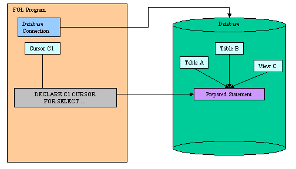
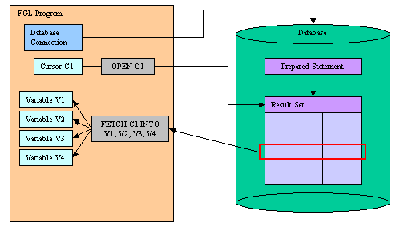
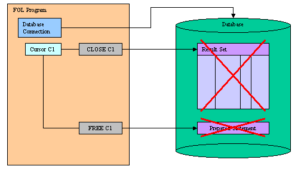

[Back to Contents](../index.html)

------------------------------------------------------------------------

# [Database Result Set Processing]{#PAGE_HEADER} (Cursor)

Summary:

- [What is a database result set?](#RESULTSET)
- [Cursor declaration](#RS_DECLARE) (`DECLARE`)
- [Opening cursors](#RS_OPEN) (`OPEN`)
- [Retrieving data](#RS_FETCH) (`FETCH`)
- [Closing cursors](#RS_CLOSE) (`CLOSE`)
- [Freeing cursors](#RS_FREE) (`FREE`)
- [Browsing rows in a loop](#RS_FOREACH) (`FOREACH`)

*See also:* [Transactions](Transactions.html), [Positioned
Updates](PositionedUpdates.html), [Static SQL](StaticSql.html), [Dynamic
SQL](DynamicSql.html), [SQL Errors](Exceptions.html#SQLERRORS).

------------------------------------------------------------------------

### [What is a database result set?]{#RESULTSET}

A Database Result Set is a set of rows generated by an SQL statement
that produces rows, such as `SELECT`. The result set is maintained by
the database server. In a program, you handle a result set with a
Database Cursor.

First you must declare the database cursor with the
[DECLARE](#RS_DECLARE) instruction. This instruction sends the SQL
statement to the database server for parsing, validation and to generate
the execution plan.

{border="0" width="504" height="288"}

The result set is produced after execution of the SQL statement, when
the database cursor is associated with the result set by the
[OPEN](#RS_OPEN) instruction. At this point, no data rows are
transmitted to the program. You must use the [FETCH](#RS_FETCH)
instruction to retrieve data rows from the database server.

{border="0" width="504" height="288"}

When finished with the result set processing, you must
[CLOSE](#RS_CLOSE) the cursor to release the resources allocated for the
result set on the database server. The cursor can be re-opened if
needed. If the SQL statement is no longer needed, you can free the
resources allocated to statement execution with the [FREE](#RS_FREE)
instruction.

{border="0" width="504" height="288"}

The scope of reference of a database cursor is local to a module, so a
cursor that was declared in one source file cannot be referenced in a
statement in another file.

The language supports *sequential* and *scrollable* cursors. Sequential
cursors, which are unidirectional, are used to retrieve rows for a
[report](Reports.html), for example.  Scrollable cursors allow you to
move backwards or to an absolute or relative position in the result set.
Specify whether a cursor is scrollable with the `SCROLL` option of the
[DECLARE](#RS_DECLARE) instruction.

------------------------------------------------------------------------

### [DECLARE]{#RS_DECLARE}

#### Purpose:

This instruction associates a database cursor with an SQL statement in
the [current connection](Connections.html).

#### Syntax 1: Cursor declared with a static SQL statement.

`DECLARE `*`cid`*` `[`[`]{.underline}`SCROLL`[`]`]{.underline}` CURSOR `[`[`]{.underline}`WITH HOLD`[`]`]{.underline}` FOR `*`select-statement`*` `

#### Syntax 2: Cursor declared with a prepared statement.

`DECLARE `*`cid`*` `[`[`]{.underline}`SCROLL`[`]`]{.underline}` CURSOR `[`[`]{.underline}`WITH HOLD`[`]`]{.underline}` FOR `*`sid`*` `

#### Syntax 3: Cursor declared with a string expression.

`DECLARE `*`cid`*` `[`[`]{.underline}`SCROLL`[`]`]{.underline}` CURSOR `[`[`]{.underline}`WITH HOLD`[`]`]{.underline}` FROM `*`expr`*

#### Notes:

1.  *cid* is the identifier of the database cursor.
2.  *select-statement* is a `SELECT` statement defined in [Static
    SQL](StaticSql.html).
3.  *sid* is the identifier of a [prepared](DynamicSql.html#DS_PREPARE)
    SQL statement.
4.  *expr* is any expression that evaluates to a string.
5.  In all supported syntaxes, you can use the ? question mark as a
    parameter placeholder. 

#### Warnings:

1.  The maximum number of declared cursors in a single program is
    limited by the database server and the available memory. Make sure
    that you [free](#RS_FREE) the resources when you no longer need the
    declared cursor.
2.  The identifier of a cursor that was declared in one module cannot be
    referenced from another module.
3.  When declaring a cursor with a static *select-statement*, the
    statement can include an `INTO` clause. However, this is not
    recommended, to be consistent with prepared statements.  If you
    prepare the statement, you must omit the `INTO` clause in the SQL
    text provided to the [PREPARE](DynamicSql.html#DS_PREPARE)
    instruction and use the `INTO` clause of the [FETCH](#RS_FETCH)
    statement to retrieve the values from the result set.
4.  You can add the `FOR UPDATE` clause in the `SELECT` statement to
    declare an [update cursor](PositionedUpdates.html). You can use the
    update cursor to modify (update or delete) the current row.
5.  Use the `WITH HOLD` option carefully, because this feature is
    specific to IBM Informix servers. Other database servers do not
    behave as Informix does with this type of  cursor. For example, if
    the `SELECT` is not declared `FOR UPDATE`, most database servers
    keep cursors open after the end of a
    [transaction](Transactions.html), but IBM DB2 automatically closes
    all cursors when the transaction is [rolled
    back](Transactions.html#TI_ROLLBACK_WORK).

#### Tips:

1.  With most database servers, [scrollable]{.underline} cursors take
    quite a few resources to hold a static copy of the result set.
    Therefore you should consider optimizing scrollable cursor usage
    with a good programming pattern as described in [SQL
    Programming](SqlProgramming.html#PROG_SCROLL_CURSORS).

#### Usage:

The `DECLARE` instruction allocates resources for an SQL statement
handle, in the context of the [current connection](Connections.html).
The SQL text is sent to the database server for parsing, validation and
to generate the execution plan.

After declaring the cursor, you can use the [OPEN](#RS_OPEN) instruction
to execute the SQL statement and produce the result set.

`DECLARE` must precede any other statement that refers to the cursor
during program execution.

The scope of reference of the *cid* cursor identifier is local to the
module where it is declared.

Resources allocated by the `DECLARE` can be released later by the
[FREE](#RS_FREE) instruction.

##### Forward only cursors

If you use only the `DECLARE CURSOR` keywords, you create a **sequential
cursor**, which can fetch only the next row in sequence from the result
set. The sequential cursor can read through the result set only once
each time it is opened. If you are using a sequential cursor for a
select cursor, on each execution of the [FETCH](#RS_FETCH) statement,
the database server returns the contents of the current row and locates
the next row in the result set.

Example 1: Declaring a cursor with a static SELECT statement.

``` linenumber
01 MAIN
02    DATABASE stores
03    DECLARE c1 CURSOR FOR SELECT * FROM customer
04 END MAIN
```

Example 2: Declaring a cursor with a prepared statement.

``` linenumber
01 MAIN
02   DEFINE key INTEGER
03   DEFINE cust RECORD
04            num INTEGER,
05            name CHAR(50)
06          END RECORD
07   DATABASE stores
08   PREPARE s1
09      FROM "SELECT customer_num, cust_name FROM customer WHERE customer_num>?"
10   DECLARE c1 CURSOR FOR s1
11   LET key=101
12   FOREACH c1 USING key INTO cust.*
13      DISPLAY cust.*
14   END FOREACH
15 END MAIN
```

##### Scrollable cursors

Use the `DECLARE SCROLL CURSOR` keywords to create a **scrollable
cursor**, which can fetch rows of the result set in any sequence. Until
the cursor is closed, the database server retains the result set of the
cursor in a static data set (for example, in a temporary table like
Informix). You can fetch the first, last, or any intermediate rows of
the result set as well as [fetch](#RS_FETCH) rows repeatedly without
having to close and reopen the cursor. On a multi-user system, the rows
in the tables from which the result set rows were derived might change
after the cursor is opened and a copy of the row is made in the static
data set. If you use a scroll cursor within a transaction, you can
prevent copied rows from changing, either by setting the [isolation
level](Transactions.html#TI_SET_ISOLATION) to Repeatable Read or by
locking the entire table in share mode during the
[transaction](Transactions.html). Scrollable cursors cannot be declared
`FOR UPDATE`.

The `DECLARE [SCROLL] CURSOR FROM` syntax allows you to declare a cursor
directly with a string expression, so that you do not have to use the
`PREPARE` instruction. This simplifies the source code and speeds up the
execution time for non-Informix databases, because the SQL statement is
not parsed twice.

Example 3: Declaring a scrollable cursor with string expression.

``` linenumber
01 MAIN
02   DEFINE key INTEGER
03   DEFINE cust RECORDs
04            num INTEGER,
05            name CHAR(50)
06          END RECORD
07   DATABASE stores
08   DECLARE c1 SCROLL CURSOR
09      FROM "SELECT customer_num, cust_name FROM customer WHERE customer_num>?"
10   LET key=101
11   FOREACH c1 USING key INTO cust.*
12      DISPLAY cust.*
13   END FOREACH
14 END MAIN
```

##### Hold cursors

**Informix only:** Use the `WITH HOLD` option to create a **hold
cursor**. A hold cursor allows uninterrupted access to a set of rows
across multiple transactions. Ordinarily, all cursors close at the end
of a transaction. A hold cursor does not close; it remains open after a
transaction ends. A hold cursor can be either a sequential cursor or a
scrollable cursor. Hold cursors are only supported by Informix database
engines.

You can use the `?` question mark place holders with prepared or static
SQL statements, and  provide the parameters at execution time with the
`USING` clause of the [OPEN](#RS_OPEN) or [FOREACH](#RS_FOREACH)
instructions.

Example 4: Declaring a hold cursor with ? parameter place holders.

``` linenumber
01 MAIN
02   DEFINE key INTEGER
03   DEFINE cust RECORDs
04            num INTEGER,
05            name CHAR(50)
06          END RECORD
07   DATABASE stores
08   DECLARE c1 CURSOR WITH HOLD
09      FOR SELECT customer_num, cust_name FROM customer WHERE customer_num > ?
10   LET key=101
11   FOREACH c1 USING key INTO cust.*
12      BEGIN WORK
13      UPDATE cust2 SET name=cust.cust_name WHERE num=cust.num
14      COMMIT WORK
15   END FOREACH
16 END MAIN
```

------------------------------------------------------------------------

### [OPEN]{#RS_OPEN}

#### Purpose:

Executes the SQL statement associated with a database cursor
[declared](#RS_DECLARE) in the [same connection](Connections.html).

#### Syntax:

`OPEN `*`cid`\
`  `*` `[`[`]{.underline}` USING `*`pvar`*` `[`{`]{.underline}`IN`[`|`]{.underline}`OUT`[`|`]{.underline}`INOUT`[`}`]{.underline}` `[`[,...]`]{.underline}` `[`]`]{.underline}\
`   `[`[`]{.underline}` WITH REOPTIMIZATION `[`]`]{.underline}

#### Notes:

1.  *cid* is the identifier of the database cursor.
2.  *pvar* is a program [variable](Variables.html), a
    [record](Records.html), or an [array](Arrays.html) used as a
    parameter buffer to provide SQL parameter values.

#### Usage:

The `OPEN` instruction executes the SQL statement of a [declared
cursor](#RS_DECLARE). The result set is produced on the server side and
rows can be fetched.

The `USING` clause is required to provide the SQL parameters as [program
variables](Variables.html), if the cursor was [declared](#RS_DECLARE)
with a [prepared statement](DynamicSql.html) that includes (`?`)
question mark placeholders.

A subsequent `OPEN` statement closes the cursor and then reopens it.
When the database server reopens the cursor, it creates a new result
set, based on the current values of the [variables](Variables.html) in
the `USING` clause. If the variables have changed since the previous
`OPEN` statement, reopening the cursor can generate an entirely
different result set.

The `IN`, `OUT` or `INOUT` options can be used to call stored procedures
having input / output parameters and generating a result set. Use the
`IN`, `OUT` or `INOUT` options to indicate if a parameter is
respectively for input, output or both. For more details about stored
procedure calls, see [SQL Programming](SqlProgramming.html).

Sometimes, query execution plans need to be re-optimized when SQL
parameter values change. Use the `WITH REOPTIMIZATION` clause to
indicate that the query execution plan has to be re-optimized on the
database server (this operation is normally done during the
[DECLARE](#RS_DECLARE) instruction).  If this option is not supported by
the database server, it is ignored.

In a IBM Informix database that is ANSI-compliant, you receive an error
code if you try to open a cursor that is already open. **Informix
only!**

A cursor is closed with the [CLOSE](#RS_CLOSE) instruction, or when the
parent [connection](Connections.html) is terminated (typically, when the
program ends). By using the [CLOSE](#RS_CLOSE) instruction explicitly,
you release resources allocated for the result set in the db client
library and on the database server.

#### Warnings:

1.  You cannot use string or numeric constants in the ` USING` list. All
    elements must be [program variables](Variables.html).
2.  The database server evaluates the values that are named in the
    `USING` clause of the `OPEN` statement only when it opens the
    cursor. While the cursor is open, subsequent changes to program
    variables in the `OPEN` clause do not change the result set of the
    cursor; you must re-open the cursor to re-execute the statement.
3.  If you release cursor resources with a [FREE](#RS_FREE) instruction,
    you cannot use the cursor unless you [declare](#RS_DECLARE) the
    cursor again.
4.  The `IN`, `OUT` or `INOUT` options can only be used for simple
    variables, you cannot specify those options for a complete record
    with the record.\* notation.

#### Example:

``` linenumber
01 MAIN
02    DEFINE k INTEGER
03    DEFINE n VARCHAR(50)
04    DATABASE stores
05    DECLARE c1 CURSOR FROM "SELECT cust_name FROM customer WHERE cust_id>?"
06    LET k = 102
07    OPEN c1 USING k
08    FETCH c1 INTO n
09    LET k = 103
10    OPEN c1 USING k
11    FETCH c1 INTO n
12 END MAIN
```

------------------------------------------------------------------------

### [FETCH]{#RS_FETCH}

#### Purpose:

Moves a cursor to a new row in the corresponding result set and
retrieves the row values into fetch buffers.

#### Syntax:

`FETCH `[`[`]{.underline}` `*`direction`*` `[`]`]{.underline}` `*`cid`*` `[`[`]{.underline}` INTO `*`fvar`*` `[`[,...]`]{.underline}` `[`]`]{.underline}

where *direction* is one of:

[`{`]{.underline}\
`  NEXT`\
[`|`]{.underline}` `[`{`]{.underline}` PREVIOUS `[`|`]{.underline}` PRIOR `[`}`]{.underline}\
[`|`]{.underline}` CURRENT`\
[`|`]{.underline}` FIRST`\
[`|`]{.underline}` LAST`\
[`|`]{.underline}` ABSOLUTE `*`position`*\
[`|`]{.underline}` RELATIVE `*`offset`*\
[`}`]{.underline}

#### Notes:

1.  *cid* is the identifier of the database cursor.
2.  *fvar* is a program [variable](Variables.html), a
    [record](Records.html) or an [array](Arrays.html) used as a fetch
    buffer to receive a row value.
3.  *direction* options different from `NEXT` can only be used with
    [scrollable cursors](#RS_DECLARE).
4.  *position* is an positive [integer
    expression](Expressions.html#EX_INTEGER).
5.  *offset* is a positive or negative [integer
    expression](Expressions.html#EX_INTEGER).

#### Usage:

The `FETCH` instruction retrieves a row from a result set of an [opened
cursor](#RS_OPEN). The cursor must be opened before using the `FETCH`
instruction.

The `INTO` clause can be used to provide the fetch buffers that receive
the result set column values.

A sequential cursor can fetch only the next row in sequence from the
result set.

The `NEXT` clause (the default) retrieves the next row in the result
set. If the row pointer was on the last row before executing the
instruction, the [SQL Code](Connections.html#SQLCA_RECORD) is set to 100
(`NOTFOUND`), and the row pointer remains on the last row. (if you issue
a `FETCH PREVIOUS` at this time, you get the next-to-last row).

The `PREVIOUS` clause retrieves the previous row in the result set. If
the row pointer was on the first row before executing the instruction,
the [SQL Code](Connections.html#SQLCA_RECORD) is set to 100
(`NOTFOUND`), and the row pointer remains on the first row. (if you
issue a `FETCH NEXT` at this time, you get the second row).

The `CURRENT` clause retrieves the current row in the result set.

The `FIRST` clause retrieves the first row in the result set.

The `LAST` clause retrieves the last row in the result set.

The `ABSOLUTE` clause retrieves the row at *position* in the result set.
If the *position* is not correct, the [SQL
Code](Connections.html#SQLCA_RECORD) is set to 100
([NOTFOUND](Programs.html#PC_NOTFOUND)). Absolute row positions are
numbered from 1.

The `RELATIVE` clause moves *offset* rows in the result set and returns
the row at the current position. The offset can be a negative value.  If
the *offset* is not correct, the [SQL
Code](Connections.html#SQLCA_RECORD) is set to 100 (`NOTFOUND`). If
*offset* is zero, the current row is fetched.

#### Warnings:

1.  Fetching rows can have specific behavior when the cursor was
    declared `FOR UPDATE`. See [Positioned
    Updates](PositionedUpdates.html) for more details.

#### Example:

``` linenumber
01 MAIN
02    DEFINE cnum INTEGER
03    DEFINE cname CHAR(20)
04    DATABASE stores
05    DECLARE c1 SCROLL CURSOR FOR SELECT customer_num, cust_name FROM customer
06    OPEN c1
07    FETCH c1 INTO cnum, cname
08    FETCH LAST c1 INTO cnum, cname
09    FETCH PREVIOUS c1 INTO cnum, cname
10    FETCH FIRST c1 INTO cnum, cname
11    FETCH LAST c1
12    FETCH FIRST c1
13 END MAIN
```

------------------------------------------------------------------------

### [CLOSE]{#RS_CLOSE}

#### Purpose:

Closes a database cursor and frees resources allocated on the database
server for the result set.

#### Syntax:

`CLOSE `*`cid`*

#### Notes:

1.  *cid* is the identifier of the database cursor.

#### Usage:

The `CLOSE` instruction releases the resources allocated for the result
set on the database server.

After using the `CLOSE` instruction, you must re-open the cursor with
[OPEN](#RS_OPEN) before retrieving values with [FETCH](#RS_FETCH).

#### Tips:

1.  Close the cursor when the result set is no longer used, this saves
    resources on the database client and database server side.

#### Example:

``` linenumber
01 MAIN
02    DATABASE stores
03    DECLARE c1 CURSOR FOR SELECT * FROM customer
04    OPEN c1
05    CLOSE c1
06    OPEN c1
07    CLOSE c1
08 END MAIN
```

------------------------------------------------------------------------

### [FREE]{#RS_FREE}

#### Purpose:

This instruction releases resources allocated to the database cursor
with the [DECLARE](#RS_DECLARE) instruction.

#### Syntax:

`FREE `*`cid`*

#### Notes:

1.  *cid* is the identifier of the database cursor.

#### Usage:

The `FREE` instruction takes the name of a cursor as parameter.

All resources allocated to the database cursor are released.

The cursor should be explicitly [closed](#RS_CLOSE) before it is freed.

#### Warnings:

1.  If you release cursor resources with this instruction, you cannot
    use the cursor unless you [declare](#RS_DECLARE) the cursor again.

#### Tips:

1.  Free the cursor when the result set is no longer used; this saves
    resources on the database client and database server side.

#### Example:

``` linenumber
01 MAIN
02    DEFINE i, j INTEGER
03    DATABASE stores
04    FOR i=1 TO 10
05        DECLARE c1 CURSOR FOR SELECT * FROM customer
06        FOR j=1 TO 10
07            OPEN c1
08            FETCH c1
09            CLOSE c1
10        END FOR
11        FREE c1
12    END FOR
13 END MAIN
```

------------------------------------------------------------------------

### [FOREACH]{#RS_FOREACH}

#### Purpose:

A `FOREACH` block applies a series of actions to each row of data that
is returned from a database cursor.

#### Syntax:

`FOREACH `*`cid`*\
*`  `*` `[`[`]{.underline}` USING `*`pvar`*` `[`{`]{.underline}`IN`[`|`]{.underline}`OUT`[`|`]{.underline}`INOUT`[`}`]{.underline}` `[`[,...]`]{.underline}` `[`]`]{.underline}\
`   `[`[`]{.underline}` INTO `*`fvar`*` `[`[,...]`]{.underline}` `[`]`]{.underline}\
`   `[`[`]{.underline}` WITH REOPTIMIZATION `[`]`]{.underline}\
`       `[`{`]{.underline}\
`         `*`statement`*\
`       `[`|`]{.underline}` CONTINUE FOREACH`\
`       `[`|`]{.underline}` EXIT FOREACH`\
`       `[`}`]{.underline}\
`       `[`[...]`]{.underline}\
`END FOREACH`

#### Notes:

1.  *cid* is the identifier of the database cursor.
2.  *pvar* is a program [variable](Variables.html), a
    [record](Records.html) or an [array](Arrays.html) used as a
    parameter buffer to provide SQL parameter values.
3.  *fvar* is a program [variable](Variables.html), a
    [record](Records.html) or an [array](Arrays.html) used as a fetch
    buffer to receive a row value.

#### Usage:

Use the `FOREACH` instruction to retrieve and process database rows that
were selected by a query. This instruction is equivalent to using the
[OPEN](#RS_OPEN), [FETCH](#RS_OPEN) and [CLOSE](#RS_OPEN) cursor
instructions:

1.  Open the specified cursor
2.  Fetch the rows selected
3.  Close the cursor (after the last row has been fetched)

You must declare the cursor (by using the [DECLARE](#RS_DECLARE)
instruction) before the `FOREACH` instruction can retrieve the rows. A
compile-time error occurs unless the cursor was declared prior to this
point in the source module. You can reference a [sequential
cursor](#RS_DECLARE), a [scroll cursor](#RS_DECLARE), a [hold
cursor](#RS_DECLARE), or an [update cursor](PositionedUpdates.html), but
`FOREACH` only processes rows in sequential order.

The `FOREACH` statement performs successive fetches until all rows
specified by the `SELECT` statement are retrieved. Then the cursor is
automatically [closed](#RS_CLOSE). It is also closed if a
`WHENEVER NOT FOUND` [exception handler](Exceptions.html) within the
`FOREACH` loop detects a `NOTFOUND` condition (that is, SQL Code = 100).

The `USING` clause is required to provide the SQL parameter buffers, if
the cursor was [declared](#RS_DECLARE) with a [prepared
statement](DynamicSql.html) that includes (`?`) question mark
placeholders.

The `IN`, `OUT` or `INOUT` options can be used to call stored procedures
having input / output parameters and generating a result set. Use the
`IN`, `OUT`, or `INOUT` options to indicate if a parameter is
respectively for input, output, or both. For more details about stored
procedure calls, see [SQL Programming](SqlProgramming.html).

The `INTO` clause can be used to provide the fetch buffers that receive
the row values.

Use the `WITH REOPTIMIZATION` clause to indicate that the query
execution plan has to be re-optimized.

The `CONTINUE FOREACH` instruction interrupts processing of the current
row and starts processing the next row. The runtime system fetches the
next row and resumes processing at the first statement in the block.

The `EXIT FOREACH` instruction interrupts processing and ignores the
remaining rows of the result set.

#### Warnings:

1.  Infinite loops may occur if the cursor preparation failed.
2.  The `IN`, `OUT`, or `INOUT` options can only be used for simple
    variables; you cannot specify those options for a complete record
    with the record.\* notation.

#### Example:

``` linenumber
01 MAIN
02    DEFINE clist ARRAY[200] OF RECORD
03            cnum INTEGER,
04            cname CHAR(50)
05           END RECORD
06    DEFINE i INTEGER
07    DATABASE stores
08    DECLARE c1 CURSOR FOR SELECT customer_num, cust_name FROM customer
09    LET i=0
10    FOREACH c1 INTO clist[i+1].*
11       LET i=i+1
12       DISPLAY clist[i].*
13    END FOREACH
14    DISPLAY "Number of rows found: ", i
15 END MAIN
```
