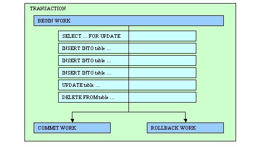

[Back to Contents](../index.html)

------------------------------------------------------------------------

# [Database Transactions]{#PAGE_HEADER}

Summary:

- [What is a database transaction?](#DBTRANS)
- [Transaction Management Model](#TRANSMM)
- [Starting a transaction](#TI_BEGIN_WORK) (`BEGIN WORK`)
- [Validating a transaction](#TI_COMMIT_WORK) (`COMMIT WORK`)
- [Cancelling a transaction](#TI_ROLLBACK_WORK) (`ROLLBACK WORK`)
- [Setting the Isolation Level](#TI_SET_ISOLATION) (`SET ISOLATION`)
- [Setting the Lock Mode](#TI_SET_LOCK_MODE) (`SET LOCK MODE`)
- [Examples](#EXAMPLES)

*See also:* [Connections](Connections.html), [Static
SQL](StaticSql.html), [Dynamic SQL](DynamicSql.html), [Result
Sets](ResultSets.html), [SQL Errors](Exceptions.html#SQLERRORS),
[Programs](Programs.html).

------------------------------------------------------------------------

### [What is a database transaction?]{#DBTRANS}

A Database Transaction delimits a set of database operations that are
processed as a whole. Database operations included inside a transaction
are validated or canceled as a unique operation.

{border="0" width="504" height="288"}

The database server is in charge of *Data Concurrency* and *Data
Consistency* control. Data Concurrency control allows the simultaneous
access of the same data by many users, while Data Consistency control
gives each user a consistent view of the database.

Without adequate concurrency and consistency controls, data could be
changed improperly, compromising data integrity. If you want to write
applications that can work with different kinds of database servers, you
must adapt the program logic to the behavior of the database servers
regarding concurrency and consistency management. This requires good
knowledge of [multi-user]{.underline} application programming,
[transactions]{.underline}, [locking]{.underline} mechanisms, [isolation
levels]{.underline} and [wait mode]{.underline}. If you are not familiar
with these concepts, carefully read the documentation of each database
server that covers this subject.

Usually, database servers set [exclusive locks]{.underline} on rows that
are modified or deleted inside a transaction. These locks are held until
the end of the transaction to control concurrent access to that data.
Some database servers like Oracle implement row versioning (before
modifying a row, the server makes a copy). This technique allows readers
to see a consistent copy of the rows that are updated during a
transaction not yet committed. When the isolation level is high
(Repeatable Read) or when using a `SELECT FOR UPDATE` statement, the
database server sets [shared locks]{.underline} on read rows to prevent
other users from changing the data fetched by the reader. Again, these
locks are held until the end of the transaction. Some database servers
like Informix allow read locks to be held regardless of the transactions
(`WITH HOLD` cursor option), but this is not a standard.

Processes accessing the database can change transaction parameters such
as the isolation level or lock wait mode. The main problem is to find a
configuration which results in similar behavior on every database
engine. Programs using Informix-specific behavior must be adapted to
work with other database servers.

Here is the recommended configuration to get common behavior with all
kinds of database engines:

- The database must support transactions; this is usually the case.
- Transactions must be as short as possible (a few seconds).
- The Isolation Level must be at least \"Committed Read\" (= \"Cursor
  Stability\").
- The Wait Mode for locks must be \"WAIT\" or \"WAIT n\" (timeout).

When using this configuration, the locking granularity does not have to
be set at the row level. For example, to improve performance with
Informix databases, you can use the \"LOCK MODE PAGE\" locking level,
which is the default.

A lot of applications have been developed for old Informix SE databases
that do not manage transaction logging. These applications often work in
the default lock wait mode which is \"NOT WAIT\". Additionally,
applications using databases without transactions usually do not change
the isolation level, which defaults to \"Dirty Read\". You must review
the program logic of these applications in order to conform to the
portable configuration.

------------------------------------------------------------------------

### [Transaction Management Model]{#TRANSMM}

To write portable SQL applications, programmers use the instructions
described in this section to delimit transaction blocks and define
concurrency parameters such as the isolation level and the lock wait
mode. At runtime, the database driver generates the appropriate SQL
commands to be used with the target database server.

If you initiate a transaction with a `BEGIN WORK` statement, you must
issue a `COMMIT WORK` statement at the end of the transaction. If you
fail to issue the `COMMIT WORK` statement, the database server rolls
back any modifications that the transaction made to the database. If you
do not issue a `BEGIN WORK` statement to start a transaction, each
statement executes within its own transaction. These single-statement
transactions do not require either a `BEGIN WORK` statement or a
`COMMIT WORK` statement.

For historical reasons, the language is based on IBM Informix SQL
language, which defines the transaction management instructions. IBM
Informix database servers can work in different transaction logging
modes:

1.  **Native**, without logging
2.  **Native**, non-buffered logging
3.  **Native**, buffered logging
4.  **ANSI**, buffered logging

The first mode does not allow transaction management and should be
avoided. In the second and third modes, you can use the `BEGIN WORK`,
`COMMIT WORK` and `ROLLBACK WORK` statements. In **ANSI** mode, you can
only use the `COMMIT` and `ROLLBACK` statements, because transactions
are implicit.

When using Informix databases, the type of logging defines the way you
manage transactions in your programs. For example, when using an
ANSI-compliant Informix database, you do not have to start transactions
with `BEGIN WORK`, since these are implicit.

When using the Standard Database Interface (SDI) architecture, you are
free to use any type of transaction logging with Informix databases.
When using the Open Database Interface (ODI) architecture you are free
to use the native transaction management statements supported by the
underlying database server, but it is recommended that you follow the
default (native) Informix logging, by using `BEGIN WORK`, `COMMIT WORK`
and `ROLLBACK WORK` to manage transactions. At runtime, the database
drivers can manage the execution of the appropriate instructions for the
target database server. This allows you to use the same source code for
different kinds of database servers.      

The instructions described in this section must be executed as [Static
SQL](StaticSql.html) statements. Even if it is supported by the Informix
API, it is not recommended that you use the [Dynamic
SQL](DynamicSql.html) instructions to `PREPARE` and `EXECUTE`
transaction management statements, because it can result in unexpected
behavior when using other database servers.

------------------------------------------------------------------------

### [BEGIN WORK]{#TI_BEGIN_WORK}

#### Purpose:

Starts a database transaction in the current
[connection](Connections.html).

#### Syntax:

`BEGIN WORK`

#### Usage:

Use this instruction to indicate where the database transaction starts
in your program. If supported by the database server, the underlying
database driver starts a transaction. Each row that an UPDATE, DELETE,
or INSERT statement affects during a transaction is locked and remains
locked throughout the transaction. When using a non-Informix database,
the ODI driver executes the native SQL statement corresponding to
`BEGIN WORK`.

#### Warnings:

1.  Some database servers do not support a Data Definition Language
    statement (like `CREATE TABLE`) inside transactions, or even
    auto-commit the transaction when such a statement is executed.
    Therefore, it is strongly recommended that you avoid DDL statements
    inside transactions.
2.  A transaction that contains statements that affect many rows can
    exceed the limits that your operating system or the database server
    configuration imposes on the maximum number of simultaneous locks.

#### Tips:

1.  Include a limited number of SQL operations in a transaction to
    execute short transactions. In a standard database session
    configuration (wait mode), it is not recommended that you have a
    transaction block running a long time, since it may block concurrent
    processes which want to access the same data.

------------------------------------------------------------------------

### [COMMIT WORK]{#TI_COMMIT_WORK}

#### Purpose:

Validates and terminates a database transaction in the current
[connection](Connections.html).

#### Syntax:

`COMMIT WORK`

#### Usage:

Use this instruction to commit all modifications made to the database
from the beginning of a transaction. The database server takes the
required steps to make sure that all modifications that the transaction
makes are completed correctly and saved to disk. The `COMMIT WORK`
statement releases all exclusive locks. With some databases like
Informix, shared locks are [not released]{.underline} if the
`FOR UPDATE` cursor is declared `WITH HOLD` option. The `COMMIT WORK`
statement closes all cursors not declared with the `WITH HOLD` option.
When using a non-Informix database, the ODI driver executes the native
SQL statement corresponding to `COMMIT WORK`.

------------------------------------------------------------------------

### [ROLLBACK WORK]{#TI_ROLLBACK_WORK}

#### Purpose:

Cancels and terminates a database transaction in the current
[connection](Connections.html).

#### Syntax:

`ROLLBACK WORK`

#### Usage:

Use this instruction to cancel the current transaction and invalidate
all changes since the beginning of the transaction. After the execution
of this instruction, the database is restored to the state that it was
in before the transaction began. All row and table locks that the
canceled transaction holds are released. If you issue this statement
when no transaction is pending, an error occurs. When using a
non-Informix database, the ODI driver executes the native SQL statement
corresponding to `ROLLBACK WORK`.

#### Warnings:

1.  Normally, the `ROLLBACK WORK` statement closes all cursors [not
    declared]{.underline} with the `WITH HOLD` option. This is not the
    case with some databases like IBM DB2, which closes all kind of
    cursors when doing a `ROLLBACK`.

------------------------------------------------------------------------

### [SET ISOLATION]{#TI_SET_ISOLATION}

#### Purpose:

Defines the transaction isolation level for the current
[connection](Connections.html).

#### Syntax:

`SET ISOLATION TO`\
`  `[`{`]{.underline}` DIRTY READ`\
`  `[`|`]{.underline}` COMMITTED READ [LAST COMMITTED] [RETAIN UPDATE LOCKS]`\
`  `[`|`]{.underline}` CURSOR STABILITY`\
`  `[`|`]{.underline}` REPEATABLE READ `[`}`]{.underline}

#### Usage:

Sets the isolation level for the current connection. See database
concepts in your database server documentation for more details about
isolation levels and concurrency management.

When using a non-Informix database, the ODI driver executes the native
SQL statement that corresponds to the specified isolation level.

#### Warnings:

1.  When using the `DIRTY READ` isolation level, the database server
    might return a phantom row, which is an uncommitted row that was
    inserted or modified within a transaction that has subsequently
    rolled back. No other isolation level allows access to a phantom
    row.

#### Tips:

1.  On most database servers, the default isolation level is usually
    `COMMITTED READ`, which is appropriate to portable database
    programming. Therefore, we do not recommend that you change the
    isolation level.
2.  The `LAST COMMITTED` and `RETAIN UPDATE LOCKS` options have been
    added to the language syntax for conformance with Informix IDS 11.
    Note that the `LAST COMMITTED` option can be turned on implicitly
    with a server configuration parameter, saving un-necessary code
    changes.

------------------------------------------------------------------------

### [SET LOCK MODE]{#TI_SET_LOCK_MODE}

#### Purpose:

Defines the behavior of the program that tries to access a locked row or
table.

#### Syntax:

`SET LOCK MODE TO `[`{`]{.underline}` NOT WAIT `[`|`]{.underline}` WAIT `[`[`]{.underline}` `*`seconds`*` `[`]`]{.underline}` `[`}`]{.underline}

#### Notes:

1.  This instruction defines the timeout for lock acquisition for the
    current [connection](Connections.html).
2.  When possible, the underlying database driver sets the corresponding
    connection parameter to define the timeout for lock acquisition. But
    some database servers may not support setting the lock timeout
    parameter. In this case, the runtime system generates an
    [exception](Exceptions.html).
3.  When using the `NOT WAIT` clause, the timeout is set to zero. If the
    resource is locked, the database server ends the operation
    immediately and returns an [SQL Error](Exceptions.html#SQLERRORS).
4.  *seconds* defines the number of seconds to wait for lock
    acquisition. If the resource is locked, the database server ends the
    operation after the elapsed time and returns an [SQL
    Error](Exceptions.html#SQLERRORS).
5.  When using the `WAIT` clause without a number of seconds, the
    database server waits for lock acquisition for an infinite time.
6.  On most database servers, the default is to wait for locks to be
    released.

#### Warnings:

1.  Make sure that the database server and corresponding database driver
    both support a lock acquisition timeout option, otherwise the
    program would generate an exception. For example, the IBM DB2 V8.1
    database server does not support this option at the session level.

------------------------------------------------------------------------

### [Examples]{#EXAMPLES}

#### Example 1:

``` linenumber
01 MAIN
02    DATABASE stock
03    BEGIN WORK
04    INSERT INTO items VALUES ( ... )
04    UPDATE items SET ...
05    COMMIT WORK
06 END MAIN
```
