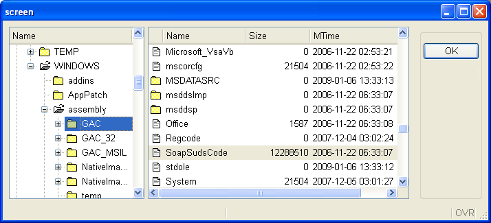
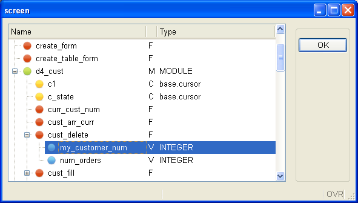

[Back to Contents](../index.html)

------------------------------------------------------------------------

# [Tree Views]{#PAGE_HEADER}

Summary:

- [Basics](#BASICS)
- [Usage](#USAGE)
  - [Defining a TREE container](#DEFINING_TREE_CONTAINER)
  - [Defining the program array to hold TREE data](#DEFINING_TREE_ARRAY)
  - [Filling the program array with rows](#FILLING_ARRAY)
  - [The DISPLAY ARRAY instruction](#DISPLAY_ARRAY)
  - [Using regular DISPLAY ARRAY control blocks](#DISPLAY_ARRAY_BLOCKS)
  - [Dynamic filling of very large trees](#DYNAMIC_FILLING)
  - [Built-in sort and tree-views](#BUILT_IN_SORT)
  - [Multi-row selection and tree-views](#MULTI_ROW_SELECTION)
  - [Drag & Drop in tree-views](#DRAG_AND_DROP)
- [Examples](#EXAMPLES)
  - [Static tree view (filled before dialog starts)](#EXAMPLE_1)
  - [Dynamic tree view (filled on demand)](#EXAMPLE_2)

*See also:* [Arrays](Arrays.html), [Records](Records.html), [Result
Sets](ResultSets.html), [Programs](Programs.html),
[Windows](WindowsAndForms.html), [Forms](FormSpecFiles.html), [Display
Array](DisplayArray.html), [Drag andDrop](DragAndDrop.html).

------------------------------------------------------------------------

### [Basics]{#BASICS}

Before reading these lines, you should be familiar with form [TABLE
containers](FormSpecFiles.html#FF_ITEMTYPE_TABLE) and you must know how
to program a singular [DISPLAY ARRAY](DisplayArray.html) or a
`DISPLAY ARRAY` sub-dialog within a [DIALOG
instruction](MultipleDialogs.html). 

Typical GUI tree-views can be implemented with Genero by using a
`DISPLAY ARRAY` instruction with a
[screen-array](FormSpecFiles.html#SECTION_INSTRUCTIONS) bound to a [TREE
container](FormSpecFiles.html#FF_CONTAINER_TREE) with tree-view specific
attributes. TREE containers are very similar to [TABLE
containers](FormSpecFiles.html#FF_CONTAINER_TABLE), except that the
first columns are used to display a tree of nodes on the right of the
widget.

The next screen-shot shows a typical file browser written in Genero,
this example implements a [DIALOG](MultipleDialogs.html) instruction
with two `DISPLAY ARRAY` sub-dialogs. The first `DISPLAY ARRAY`
sub-dialog controls the tree-view while the second one controls the file
list on the right side:

{border="0" width="714" height="325"}

The data used to display tree-view nodes must be provided in a [program
array](Arrays.html) and controlled by a `DISPLAY ARRAY`. It is possible
to control a tree-view table with a singular `DISPLAY ARRAY` or with a
`DISPLAY ARRAY` sub-dialog within a `DIALOG` instruction.

[In Genero]{#PARENT_CHILD}, a tree-view model is implemented with a flat
program array (i.e. a list of rows), where each row defines parent/child
node identifiers to describe the structure of the tree; so, the order of
the rows matters:

> > Tree structure                            parent-id        child-id
> >     Node 1                                    NULL              1
> >          Node 1.1                              1                1.1
> >          Node 1.2                              1                1.2
> >              Node 1.2.1                        1.2              1.2.1
> >              Node 1.2.2                        1.2              1.2.2
> >              Node 1.2.3                        1.2              1.2.3
> >          Node 1.3                              1                1.3
> >              Node 1.3.1                        1.3              1.3.1
> >       ...                                      ...              ....

Depending on your need, you can fill the program array with all rows of
the tree before dialog execution, or you can fill or reduce the list of
nodes dynamically upon expand / collapse action events. In the second
case, you must provide additional information for each row of the
program array, to indicate whether the node has children. A dynamic
build of the tree-view allows you to implement programs displaying very
large trees, for example in a bill of materials application, where
thousands of elements can be assembled together.

Note that tree-views can display additional columns for each node, to
show specific row data as in a regular table:

{border="0" width="591" height="335"}

------------------------------------------------------------------------

### [Usage]{#USAGE}

------------------------------------------------------------------------

#### [Defining a TREE container]{#DEFINING_TREE_CONTAINER}

Create a [form specification file](FormSpecFiles.html) containing a
[TREE container](FormSpecFiles.html#FF_CONTAINER_TREE) bound to a
[screen array](FormSpecFiles.html#SECTION_INSTRUCTIONS). The screen
array identifies the presentation elements to be used by the runtime
system to display the tree-view and the additional columns.

A `TREE` container must be present in the [LAYOUT
section](FormSpecFiles.html#SECTION_LAYOUT) of the form, defining the
columns of the tree-view list. The `TREE` container must hold at least
one column defining the node texts (or names). This column will be used
on the front-end side to display the tree-view widget. Additional
columns can be added in the `TREE` container to display node
information. The `TREE` container attributes must be declared in the
[ATTRIBUTES section](FormSpecFiles.html#SECTION_ATTRIBUTES), as
explained below.

Secondary form fields have to be used to hold tree node information such
as icon image, parent node id, current node id, expanded flag and parent
flag. While these secondary fields can be defined as regular [form
fields](FormSpecFiles.html#FF_FORM_FIELD) and displayed in the tree-view
list, we recommend that you use [PHANTOM
fields](FormSpecFiles.html#FF_PHANTOM_FIELDS) instead: Phantom fields
can be listed in the screen-array but do not need to be part of the
[LAYOUT section](FormSpecFiles.html#SECTION_LAYOUT). Phantom fields will
only be used by the runtime system to build the tree of nodes.

``` linenumber
01 LAYOUT
02 GRID
03 {
04 <Tree tv                             >
05  Tree
06 [name                      |desc     ]
07 [name                      |desc     ]
08 [name                      |desc     ]
09 [name                      |desc     ]
10 [name                      |desc     ]
11 <                                    >
12 }
13 END
14 END
15 ATTRIBUTES
16 TREE tv : mytree,
17      PARENTIDCOLUMN=parentid, IDCOLUMN=id,
18      EXPANDEDCOLUMN=expanded, ISNODECOLUMN=isnode;
19 EDIT name = FORMONLY.name, IMAGECOLUMN=image;
20 PHANTOM FORMONLY.image;
21 PHANTOM FORMONLY.parentid;
22 PHANTOM FORMONLY.id;
23 PHANTOM FORMONLY.expanded;
24 PHANTOM FORMONLY.isnode;
25 EDIT desc = FORMONLY.description;
26 END
27 INSTRUCTIONS
28 SCREEN RECORD sr( FORMONLY.* );
29 END
```

**Warning: The first visual column (*name* in above example) must be the
field defining the node names, and the widget must be an EDIT or
LABEL.**

In the [ATTRIBUTES section](FormSpecFiles.html#SECTION_ATTRIBUTES), you
must define the [TREE form element](FormSpecFiles.html#FF_ITEMTYPE_TREE)
with the following attributes:

- The `PARENTIDCOLUMN` and `IDCOLUMN` attributes: These attributes are
  respectively used to identify the form field containing the
  identifiers of the parent and child nodes, defining the [structure of
  the tree](#PARENT_CHILD). Note that you must specify form field column
  names, not item tag identifiers (used to reference a form item in the
  layout section). If these attributes are not specified, the parent
  node id and node id field names default respectively to \"*parentid*\"
  and \"*id*\".
- The `EXPANDEDCOLUMN` attribute can be used to define the form field
  holding the flag indicating that a node is expanded (i.e. opened).
- If the `ISNODECOLUMN` attribute is used, it defines the form field
  indicating that a node has children, even if the program array does
  not contain child nodes for that parent node. This attribute must be
  used to implement [dynamic filling of tree-views](#DYNAMIC_FILLING).
- The `IMAGEEXPANDED`, `IMAGECOLLAPSED` and the `IMAGELEAF` attributes
  are optional attributes defining global images for expanded, collapsed
  and leaf nodes. You should uses these attributes if you want to
  display the same icons for all nodes.
- The `IMAGEEXPANDED` and `IMAGECOLLAPSED` instruct Genero to set a
  specific icon when a node gets expanded or collapsed. The `IMAGELEAF`
  attribute defines the global icon for leaf nodes. This saves the
  programmer from writing code to display common node images.

The other items of the `ATTRIBUTES` section define tree-view form fields
grouped in a [screen-array](FormSpecFiles.html#FF_SCREEN_ARRAY) declared
in the [INSTRUCTIONS section](FormSpecFiles.html#SECTION_INSTRUCTIONS).
The form fields required to declare a tree-view table are the following:

  ------------------------------------------------------------------------ --------------- ------------------ -----------------------------------------------------------------------------------------------------
  **Fields**                                                                **Mandatory**   **Default name**  **Description**
  Field #1, used to hold the node names                                          yes              N/A         Defines the text to be displayed for a node
  Field #2, with *fieldname* defined by `PARENTIDCOLUMN`                         yes            parentid      Holds the parent node id, defaults to \"*parentid*\" if the `PARENTIDCOLUMN` attribute is not used.
  Field #3, with *fieldname* defined by `IDCOLUMN`                               yes               id         Holds the id of the current node, defaults to \"*id*\" if the `IDCOLUMN` attribute is not used.
  Field #3, with *fieldname* defined by `IMAGECOLUMN `of the first field         no               N/A         Defines the icon image for a node
  Field #4, with *fieldname* defined by `EXPANDEDCOLUMN`                         no                no         Indicator set to 1 if the node is expanded
  Field #5, with *fieldname* defined by `ISNODECOLUMN`                           no                no         Indicator set to 1 if the node has children
  ------------------------------------------------------------------------ --------------- ------------------ -----------------------------------------------------------------------------------------------------

**Warning: The first three fields (node text, parent id and node id) are
mandatory.**

The first field can define the
[IMAGECOLUMN](FSFAttributes.html#FA_IMAGECOLUMN) attribute, if you need
to display node-specific images. The images will then be specified
within the field defined by the `IMAGECOLUMN` attribute. Alternatively
you can globally define images for all nodes with the
[IMAGEEXPANDED](FSFAttributes.html#FA_IMAGEEXPANDED),
[IMAGECOLLAPSED](FSFAttributes.html#FA_IMAGECOLLAPSED) and the
[IMAGELEAF](FSFAttributes.html#FA_IMAGELEAF) attributes of the `TREE`
form element.

------------------------------------------------------------------------

#### [Defining the program array to hold TREE data]{#DEFINING_TREE_ARRAY}

In the program code, you must define a [dynamic array of
records](Arrays.html) with the [DEFINE](Variables.html) instruction. The
Genero runtime system will use that program array as the model for the
tree-view list. A tree of nodes will be automatically built according to
the data found in the program array. The front-end can then render the
tree of nodes in a tree-view list.

The members of the program array must correspond to the elements of the
[screen-array](FormSpecFiles.html#FF_SCREEN_ARRAY) of the tree table, by
number and data types.

The name of the array members does not matter; the purpose of each
member is defined by the name of the corresponding screen-array members
declared in the form file. Program array members and screen-array
members are bound by position.

The next code example defines a program array with a member structure
corresponding to the screen-array defined in the form example of the
[previous section](#DEFINING_TREE_CONTAINER).

``` linenumber
01     DEFINE tree_arr DYNAMIC ARRAY OF RECORD
02            name STRING,         -- text to be displayed for the node
03            image STRING,        -- name of the image file for the node (can be null)
04            pid STRING,          -- id of the parent node
05            id STRING,           -- id of the current node
06            expanded BOOLEAN,    -- node expansion flag (TRUE/FALSE) (optional)
07            isnode BOOLEAN,       -- children indicator flag (TRUE/FALSE) (optional)
08            description STRING   -- user field describing the node
09     END RECORD
```

The *name, image, pid, id* members are mandatory. These hold
respectively the node text, icon, parent and current node identifiers
that define the [structure of the tree](#PARENT_CHILD).

The *expanded* member can be used to handle node expansion by program.
You can query this member to check whether a node is expanded, or set
the value to expand a specific node.

The *isnode* member can be used to indicate whether a given node has
children, without filling the array with rows defining the child nodes.
This information will be used by front-ends to decorate a node as a
parent, even if no children are present. The program should then fill
the array with child nodes when an *expand* action is fired (see
[Dynamic filling of very large trees](#DYNAMIC_FILLING)).

Note that the program array can hold more columns (like the
*description* field), which can be displayed in regular table columns as
part of a node\'s data.

Remember the order of the program array members must match the
screen-array members in the form file, but this order can be different
from the column order used in the layout, with the exception of the
first column defining the text of nodes (i.e. *name* field in above
example).

------------------------------------------------------------------------

#### [Filling the program array with rows]{#FILLING_ARRAY}

Once the program array is defined according to the screen-array of the
tree-view table, you must fill the rows with the correct parent/child
relationships defining the [structure of the tree](#PARENT_CHILD).

**Warning: You can safely fill the program array directly before the
dialog execution or in** `BEFORE DISPLAY` **/** `BEFORE DIALOG`
**control blocks. However, once the dialog has started, you must use
DIALOG methods such as [insertNode()](ClassDialog.html#insertNode) if
you want to modify the tree, otherwise secondary data information like
multi-range selection and cell attributes will not be synchronized.**

The rows must be filled in the correct order, to reflect the
parent/child relationship.

**Warning: If a row defines a tree-view node with a parent identifier
that does not exist, or if the child row is inserted under the wrong
parent row, the orphan row will become a new node at the root of the
tree.**

In order to fill the program array with database rows defining the tree
structure, you will need to write a recursive function, keeping track of
the current level of the nodes to be created for a given parent.

The next example shows how to fill the array with data coming from a
database table having the following structure:

    CREATE TABLE dbtree (
         id SERIAL NOT NULL,
         parentid INTEGER NOT NULL,
         name VARCHAR(20) NOT NULL
       )

The difficulty with fetching a tree from a database table is in the
cursor management, which can not be used recursively. A workaround for
this problem is to fetch all the children of a given node at once, then
call the function recursively for each of the fetched nodes:

``` linenumber
01 TYPE tree_t RECORD
02        id INTEGER,
03        parentid INTEGER,
04        name VARCHAR(20)
05     END RECORD
06 
07 DEFINE tree_arr tree_t
08 
09 FUNCTION fetch_tree(pid)
10     DEFINE pid, i, j, n INTEGER
11     DEFINE a DYNAMIC ARRAY OF tree_t
12     DEFINE t tree_t
13    
14     DECLARE cu1 CURSOR FOR SELECT * FROM dbtree WHERE parentid = pid
15     LET n = 0
16     FOREACH cu1 INTO t.*
17        LET n = n + 1
18        LET a[n].* = t.*
19     END FOREACH
20
21     FOR i = 1 TO n
22         LET j = tree_arr.getLength() + 1
23         LET tree_arr[j].name = a[i].name
24         LET tree_arr[j].id = a[i].id
25         LET tree_arr[j].parentid = a[i].parentid
26         CALL fetch_tree(a[i].id)
27     END FOR
28
29 END FUNCTION
```

------------------------------------------------------------------------

#### [The DISPLAY ARRAY instruction]{#DISPLAY_ARRAY}

After the program array has been filled, you must execute a
`DISPLAY ARRAY` instruction. This can be a singular [DISPLAY
ARRAY](DisplayArray.html) or a [DISPLAY ARRAY
sub-dialog](MultipleDialogs.html#sub-dialog-DISPLAY-ARRAY) within a
`DIALOG` instruction.

The next code example implements a `DISPLAY ARRAY` binding the program
array called *tree_arr* to the *sr* screen-array, attaching the dialog
to the tree table defined in the form:

``` linenumber
01    DISPLAY ARRAY tree_arr TO sr.* ATTRIBUTES(UNBUFFERED)
02     BEFORE DISPLAY
03        CALL fell_tree(tree_arr)
04     BEFORE ROW
05        DISPLAY "Current row is: ", DIALOG.getCurrentRow("sr")
06   END DISPLAY
```

**Warning: It is not possible to use the [paged
mode](DisplayArray.html#PAGEDMODE) (ON FILL BUFFER) when the decoration
is a treeview list. The dialog needs the complete set of open nodes with
parent/child relation to handle the treeview display, with the  paged
mode only a given window of the dataset is known by the dialog. If you
use a the paged mode in `DISPLAY ARRAY` with a treeview as decoration,
the program will raise an error at runtime. TreeViews can be filled
dynamically with `ON EXPAND` / `ON COLLAPSE` triggers. See [Dynamic
filling of very large trees](#DYNAMIC_FILLING) for more details.**

------------------------------------------------------------------------

#### [Using regular DISPLAY ARRAY control blocks]{#DISPLAY_ARRAY_BLOCKS}

If needed, you can implement traditional ` DISPLAY ARRAY` control blocks
like ` BEFORE ROW` or ` AFTER ROW`:

``` linenumber
01    DISPLAY ARRAY tree_arr TO sr.* ATTRIBUTES(UNBUFFERED)
02     BEFORE ROW
03        DISPLAY "BEFORE ROW - Current row is: ", DIALOG.getCurrentRow("sr")
04     AFTER ROW
05        DISPLAY "AFTER ROW  - Current row is: ", DIALOG.getCurrentRow("sr")
06   END DISPLAY
```

------------------------------------------------------------------------

#### [Dynamic filling of very large trees]{#DYNAMIC_FILLING}

When a huge tree needs to be displayed (for example, when implementing a
bill of materials application), you should optimize tree data filling by
creating the nodes on demand. There is no need to fill the complete
program array with all possible nodes (down to the last leaf), when only
the first levels/branches of the tree are displayed on the screen.

To implement a dynamically filled tree, you need first to define an
additional column in the tree-table, to indicate whether a given node
has children. That field will be used by Genero to render a node with a
\[+\] button, and let the end user click on the node to expand it, even
if no child nodes are created yet.

In the `DISPLAY ARRAY` code, if a node is expanded (or collapsed), the
dialog will fire the ` ON EXPAND` (or ` ON COLLAPSE`) triggers, to let
the program add (or remove) rows in the array, to adapt the tree data
dynamically according to navigation events.

``` linenumber
01    DEFINE row_index INTEGER
02    ...
03    DISPLAY ARRAY tree_arr TO sr.* ATTRIBUTES(UNBUFFERED)
04     ON EXPAND (row_index)
05        DISPLAY "EXPAND   - Expanded row is : ", row_index
06        -- Fill with children nodes for tree_arr[row_index]
07     ON COLLAPSE (row_index)
08        DISPLAY "COLLAPSE - Collapsed row is: ", row_index
09        -- Remove children nodes of tree_arr[row_index]
10   END DISPLAY
```

**Warning: While you can safely fill the program array directly before
the dialog execution, once the dialog has started, you must use DIALOG
methods such as [insertNode()](ClassDialog.html#insertNode) to modify
the tree, otherwise secondary data information like multi-range
selection and cell attributes will not be synchronized. This is
typically the case when implementing a dynamically-filled tree with**
`ON EXPAND` **/** `ON COLLAPSE` **triggers.**

See also [Example 2](#EXAMPLE_2) implementing dynamic tree filling.

------------------------------------------------------------------------

#### [Built-in sort and tree-views]{#BUILT_IN_SORT}

By default, the built-in sort is enabled when you use a [TREE
container](FormSpecFiles.html#FF_CONTAINER_TREE); when the end user
clicks on column headers, the runtime system sorts the visual
representation of the program array. Tree nodes are ordered by levels;
the children nodes are ordered inside a given parent node.

This is a powerful built-in feature. However, in some cases, the tree
structure must be static (i.e.  the order of the nodes must not change)
and you don\'t want the end user to sort the rows. To prevent the
built-in sort, use the
[UNSORTABLECOLUMNS](FSFAttributes.html#FA_UNSORTABLECOLUMNS) attribute
for the TREE container:

``` linenumber
01 LAYOUT
02 ...
03 END
04 ATTRIBUTES
05 TREE tv : mytree, UNSORTABLECOLUMNS, ...
06 ...
```

------------------------------------------------------------------------

#### [Multi-row selection and tree-views]{#MULTI_ROW_SELECTION}

Multi-row selection can be used with a `DISPLAY ARRAY` controlling a
[TREE container](FormSpecFiles.html#FF_CONTAINER_TREE). However, because
of the tree-view ergonomic differences with simple tables, the selection
of tree nodes follows some specific rules:

1.  When selecting a range if nodes, only visible nodes will get the
    selection flag. For example, if you select all nodes with control-a,
    and if the root node is collapsed, only the root node will be
    selected. This applies also when selecting nodes by program with
    [DIALOG.setSelectionRange()](ClassDialog.html#setSelectionRange).
2.  Collapsing a node will de-select all children nodes.

See also the topic discussing [multi-row
selection](MultipleDialogs.html#multi-row-selection).

------------------------------------------------------------------------

#### [Drag and Drop in tree-views]{#DRAG_AND_DROP}

It is possible to implement Drag and Drop with a `DISPLAY ARRAY`
controlling a [TREE container](FormSpecFiles.html#FF_CONTAINER_TREE).
The nodes can be moved around in the same tree, can be dropped outside
the tree or can be inserted in the tree from external sources. 

For more details, see [Drag & Drop](DragAndDrop.html).

------------------------------------------------------------------------

### [Examples]{#EXAMPLES}

#### [Example 1: Static tree view (filled before dialog starts)]{#EXAMPLE_1}

Form file:

``` linenumber
01  LAYOUT 
02  GRID
03  {
04  <Tree t1                       >
05   Name                   Index
06  [c1                     |c2    ]
07  [c1                     |c2    ]
08  [c1                     |c2    ]
09  [c1                     |c2    ]
10  }
11  END 
12  END
13  
14  ATTRIBUTES
15  LABEL c1 = FORMONLY.name;
16  LABEL c2 = FORMONLY.idx;
17  PHANTOM FORMONLY.pid;
18  PHANTOM FORMONLY.id;
19  PHANTOM FORMONLY.exp;
20  TREE t1: tree1
21      IMAGEEXPANDED  = "open", 
22      IMAGECOLLAPSED = "folder",
23      IMAGELEAF = "file",
24      PARENTIDCOLUMN = pid,
25      IDCOLUMN = id,
26      EXPANDEDCOLUMN = exp;
27  END
28  
29  INSTRUCTIONS
30  SCREEN RECORD sr_tree(name, pid, id, idx, exp);
31  END
```

Static tree DISPLAY ARRAY:

``` linenumber
01  DEFINE tree DYNAMIC ARRAY OF RECORD
02      name STRING,
03      pid STRING,
04      id STRING,
05      idx INT,
06      expanded BOOLEAN
07  END RECORD
08  
09  MAIN
10      OPEN FORM f FROM "stat-tree"
11      DISPLAY FORM f
12      CALL fill(4)
13      DISPLAY ARRAY tree TO sr_tree.* ATTRIBUTE(UNBUFFERED)
14      BEFORE ROW
15          DISPLAY "Current row : ", arr_curr()
16      END DISPLAY
17  END MAIN
18  
19  FUNCTION fill(max_level)
20      DEFINE max_level, p INT
21      CALL tree.clear()
22      LET p = fill_tree(max_level, 1, 0, NULL)
23  END FUNCTION
24  
25  FUNCTION fill_tree(max_level, level, p, pid)
26      DEFINE max_level, level INT
27      DEFINE p INT
28      DEFINE i INT
29      DEFINE id, pid STRING
30      DEFINE name STRING
31      IF level < max_level THEN
32          LET name = "Node "
33      ELSE
34          LET name = "Leaf "
35      END IF
36      FOR i = 1 TO level
37          LET p = p + 1
38          IF pid IS NULL THEN
39              LET id = i
40          ELSE
41              LET id = pid || "." || i
42          END IF
43          LET tree[p].id = id
44          LET tree[p].pid = pid
45          LET tree[p].idx = p
46          LET tree[p].expanded = FALSE
47          LET tree[p].name = name || level || '.' || i
48          IF level < max_level THEN
49              LET p = fill_tree(max_level, level + 1, p, id)
50          END IF
51      END FOR
52      RETURN p
53  END FUNCTION
```

#### [Example 2: Dynamic tree view (filled on demand)]{#EXAMPLE_2}

Form file:

``` linenumber
01  LAYOUT 
02  GRID
03  {
04  <Tree t1                       >
05   Name             Description
06  [c1              |c2           ]
07  [c1              |c2           ]
08  [c1              |c2           ]
09  [c1              |c2           ]
10  }
11  END 
12  END
13  
14  ATTRIBUTES
15  LABEL c1 = FORMONLY.name;
16  PHANTOM FORMONLY.pid;
17  PHANTOM FORMONLY.id;
18  PHANTOM FORMONLY.hasChildren;
19  LABEL c2 = FORMONLY.descr;
20  TREE t1: tree1
21      IMAGEEXPANDED  = "open", 
22      IMAGECOLLAPSED = "folder",
23      IMAGELEAF = "file",
24      PARENTIDCOLUMN = pid,
25      IDCOLUMN = id,
26      ISNODECOLUMN = hasChildren;
27  END
28  
29  INSTRUCTIONS
30  SCREEN RECORD sr_tree(FORMONLY.*);
31  END
```

Dynamic tree DISPLAY ARRAY:

``` linenumber
01  DEFINE tree DYNAMIC ARRAY OF RECORD
02      name STRING,
03      pid STRING,
04      id STRING,
05      hasChildren BOOLEAN,
06      description STRING
07  END RECORD
08  
09  MAIN
10      DEFINE id INTEGER
11  
12      OPEN FORM f FROM "dyna-tree"
13      DISPLAY FORM f
14  
15      LET tree[1].pid = 0
16      LET tree[1].id = 1
17      LET tree[1].name = "Root"
18      LET tree[1].hasChildren = TRUE
19      DISPLAY ARRAY tree TO sr_tree.* ATTRIBUTE(UNBUFFERED)
20      BEFORE DISPLAY
21          CALL DIALOG.setSelectionMode("sr_tree",1)
22      ON EXPAND(id)
23          CALL expand(DIALOG,id)
24      ON COLLAPSE(id)
25          CALL collapse(DIALOG,id)
26      END DISPLAY
27  END MAIN
28  
29  FUNCTION collapse(d,p)
30      DEFINE d ui.Dialog
31      DEFINE p INT
32      WHILE p < tree.getLength()
33          IF tree[p + 1].pid != tree[p].id THEN EXIT WHILE END IF
34          CALL d.deleteNode("sr_tree", p + 1)
35      END WHILE
36  END FUNCTION
37  
38  FUNCTION expand(d,p)
39      DEFINE d ui.Dialog
40      DEFINE p INT
41      DEFINE id STRING
42      DEFINE i, x INT
43      FOR i = 1 TO 4
44          LET x = d.appendNode("sr_tree", p)
45          LET id = tree[p].id || "." || i
46          LET tree[x].id = id
47          -- tree[x].pid is implicitly set by the appendNode() method...
48          LET tree[x].name = "Node " || id
49          IF i MOD 2 THEN
50              LET tree[x].hasChildren = TRUE
51          ELSE
52              LET tree[x].hasChildren = FALSE
54          END IF
55          LET tree[x].description = "This is node " || tree[x].name
56      END FOR
57  END FUNCTION
```
