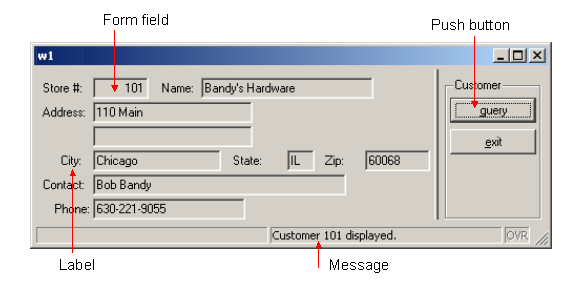
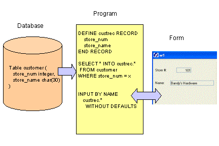

[Back to Summary](TutIndex.html)

------------------------------------------------------------------------

# Tutorial Chapter 3: Displaying Data (Windows/Forms)

Summary:

- [Application Overview](#ApplicationOverview)
- [The .4gl File- Program Logic](#4glFile)
  - [Opening Windows and Forms](#windows)
  - [Interacting with the User](#definemenu)
    - [Defining Actions - the MENU statement](#definemenu)
    - [Displaying Messages and Errors](#Displaymsg)
    - [Example: dispcust.4gl (MAIN)](#Example1)
  - [Retrieving and Displaying Data](#WorkingwithRecords)
    - [Defining a Record](#definerecord)
    - [Using SQL to Retrieve Data](#RetrievingData)
    - [Displaying a Record](#displaybyname)
    - [Example: dispcust.4gl (query_cust function)](#Example2)
- [The Form Specification File](#FormSpec)
  - Overview
  - [SCHEMA section (optional)](#SCHEMASection)
  - [The ACTION DEFAULTS, TOPMENU, and TOOLBAR sections
    (optional)](#OtherSections)
  - [LAYOUT section](#LAYOUTSection)
  - [TABLES section (optional)](#TABLESSection)
  - [ATTRIBUTES section](#ATTRIBUTES)
  - [INSTRUCTIONS section (optional)](#INSTRUCTIONSSection)
  - [Example: custform.per](#Exampleform)
- [Compiling the program and form](#Compiling)

------------------------------------------------------------------------

## [Application Overview]{#ApplicationOverview}

This example program opens a [WINDOW](WindowsAndForms.html#WHAT_IS)
containing a [FORM](WindowsAndForms.html) to display information to the
user. The appearance of the form is defined in a separate form
definition file. The program logic to display information on the form is
written in the .4gl program module. The same form file can be used with
different applications. This separation of user interface and business
logic provides maximum flexibility.

The options to retrieve data or exit are defined as *actions* in a
[MENU](Menus.html) statement in the .4gl file.  By default, push buttons
are displayed on the form corresponding to the actions listed in the
MENU statement. When the user presses the \"query\" button, the code
listed for the action statement is executed - in this case, an SQL
SELECT statement retrieves a single row from the customer table and
displays it on the form.

A FORM can contain [form fields](FormSpecFiles.html#FF_FORM_FIELD) for
entering and displaying data; explanatory text (labels); and other form
objects such as Buttons, Topmenus (dropdown menus), toolbar icons,
folders, tables, and CheckBoxes. Form objects that are associated with
an action are called *action views*. Messages providing information to
the user can be displayed on the form.

    {border="0" width="576" height="288"}

                                                Display on Windows
platforms

------------------------------------------------------------------------

## [The .4gl File]{#4glFile} - [Opening Windows and Forms]{#windows}

A program creates a window with the [OPEN
WINDOW](WindowsAndForms.html#OPEN_WINDOW) instruction, and destroys a
window with the [CLOSE WINDOW](WindowsAndForms.html#CLOSE_WINDOW)
instruction. The [OPEN WINDOW \... WITH
FORM](WindowsAndForms.html#OPEN_WINDOW) instruction can be used to
automatically open a window containing a specified form:

         OPEN WINDOW custwin WITH FORM "custform"

When you are using a graphical front end, windows are created as
independent resizable windows. By default windows are displayed as
normal application windows, but you can specify a [Presentation
Style](PresentationStyles.html).  The standard window styles are defined
in the default Presentation Style file (FGLDIR/lib/default.4st):

If the WITH FORM option is used in opening a window, the CLOSE WINDOW
statement closes both the window and the form.

         CLOSE WINDOW custwin

When the runtime system starts a program, it creates a default window
named SCREEN. This default window can be used as another window, but it
can be closed if not needed.

         CLOSE WINDOW SCREEN

**Note**: The appropriate Genero Front-end Client must be running for
the program to display the window and form.

------------------------------------------------------------------------

## The .4gl File - [Interacting with the User]{#Interacting}

### [Defining Actions - the MENU statement]{#definemenu}

Your form can display options  to the user using [action
views](InteractionModel.html#CTRLGACTIONS) -  buttons, dropdown menus
(top menus),  toolbars, and other items on the window. See [Form
Specification Files](FormSpecFiles.html) for a complete list of form
items. 

An [action](InteractionModel.html#CTRLGACTIONS) defined in the .4gl
module, which identifies the program routine to be executed, can be
associated with each action view shown on the form.. You define the
program logic to be executed for each action in  the .4gl module.

- In this BDL program, the [MENU](Menus.html) statement supplies the
  list of actions and the statements to be executed for each action. The
  actions are specified with ON ACTION clauses:

> >    ON ACTION query
> >           CALL query_cust()

- The ON ACTION clause defines the action name and the statements to be
  executed for the action. The presentation attributes - title, font,
  comment, etc. - for the graphical object that serves as the action
  view are defined in a separate [action defaults
  file](ActionDefaults.html), or in the [Action Defaults
  section](FormSpecFiles.html#SECTION_ACTDEFS) of the form file.  This
  allows you to standardize the appearance of the views for common
  actions.  Action Defaults are illustrated in [chapter
  5](TutChap05.html).

> You can also use ON ACTION clauses with some other interactive BDL
> statements, such as [INPUT](RecordInput.html), [INPUT
> ARRAY](InputArray.html), [DIALOG](MultipleDialogs.html), and [DISPLAY
> ARRAY](DisplayArray.html).

- When the [MENU](Menus.html) statement in your program is executed, the
  [action views](InteractionModel.html#CTRLGACTIONS) for the
  [actions](InteractionModel.html#CTRLGACTIONS) (**query,** in the
  example)  that are listed in the interactive MENU statement are
  enabled. Only the action views for the actions in the specific MENU
  statement are enabled, so you must be sure to include a means of
  exiting the MENU statement. If there is no action view defined in your
  [form specification file](FormSpecFiles.html) for a listed action, a
  simple push button action view is automatically displayed in the
  window. Control is turned over to the user, and the program waits
  until the user responds by selecting one of enabled action views or
  exiting the form. Once an action view is selected, the corresponding
  program routine (action) is executed. 

.See [MENUs](Menus.html) for a complete discussion of the statement and
all its options.

### [Displaying Messages and Errors]{#Displaymsg}

The [MESSAGE](MessageDisplay.html#MESSAGE) and
[ERROR](MessageDisplay.html#ERROR) statements are used to display text
containing a message to the user. The text is displayed in a specific
area, depending on the front end configuration and window style.  The
MESSAGE text is displayed until it is replaced by another MESSAGE
statement or field comment. You can specify any combination of
[variables](Variables.html) and [strings](DataTypes.html#DT_STRING) for
the text. BDL generates the message to display by replacing any
variables with their values and concatenating the strings:

         MESSAGE "Customer " || l_custrec.store_num , || " retrieved."

The [Localized Strings](LocalizedStrings.html) feature can be used to
customize the messages for specific user communities. This is discussed
in [Chapter 10](TutChap10.html).

### [Example: dispcust.4gl]{#Example1}

This portion of the **dispcust.4gl** program connects to a database,
opens a window and displays a form and a menu.

+-----------------------------------------------------------------------+
|  **Program** **dispcust.4gl**                                         |
+-----------------------------------------------------------------------+
| ``` linenumber                                                        |
| 01 -- dispcust.4gl                                                    |
| 02 SCHEMA custdemo                                                    |
| 03                                                                    |
| 04 MAIN                                                               |
| 05                                                                    |
| 06   CONNECT TO "custdemo"                                            |
| 07                                                                    |
| 08   CLOSE WINDOW SCREEN                                              |
| 09   OPEN WINDOW custwin WITH FORM "custform"                         |
| 10   MESSAGE "Program retrieves customer 101"                         |
| 11                                                                    |
| 12   MENU "Customer"                                                  |
| 13     ON ACTION query                                                |
| 14       CALL query_cust()                                            |
| 15     ON ACTION exit                                                 |
| 16       EXIT MENU                                                    |
| 17   END MENU                                                         |
| 18                                                                    |
| 19   CLOSE WINDOW custwin                                             |
| 20                                                                    |
| 21   DISCONNECT CURRENT                                               |
| 22                                                                    |
| 23 END MAIN                                                           |
| ```                                                                   |
+-----------------------------------------------------------------------+

**Notes:**

- Line `02`{.linenumber} The **SCHEMA** statement is required since
  variables are defined as [
  [LIKE](Variables.html#VA_DEFINE)]{style="text-decoration: none"} a
  database table in the function query_cust.
- Line `06 `{.linenumber}opens the
  [connection](Connections.html#DC_CONNECT_TO) to the **custdemo**
  database.
- Line `08`{.linenumber} closes the default window named **SCREEN,**
  which is opened each time the runtime system starts a program
  containing interactive statements
- Line `09`{.linenumber} uses the [WITH
  FORM](WindowsAndForms.html#OPEN_WINDOW) syntax to open a
  [window](WindowsAndForms.html#OPEN_WINDOW) having the identifier
  **custwin** containing the [form](#FormSpec) identified as
  **custform.  ** The window name must be unique among all windows
  defined in the program. Its scope is the entire program. You can use
  the window\'s name to reference any open window in other modules with
  other statements.  Although there can be multiple open windows, only
  one window may be current at a given time.  \
  By default, the window that opens will be a normal application
  window.\
  The [form identifier](WindowsAndForms.html#OPEN_WINDOW) is the name of
  the compiled **.42f file** (**custform.42f**).  The form identifier
  must be unique among form names in the program. Its scope of reference
  is the entire program.
- Line `10`{.linenumber} displays a string as a
  [MESSAGE](MessageDisplay.html#MESSAGE) to the user. The message will
  be displayed until it is replaced by a different string. 
- Lines` 12`{.linenumber} through `17`{.linenumber} contain the
  interactive [MENU](Menus.html) statement.  By default,  the menu
  options **query** and **exit** are displayed as buttons in the window,
  with C**ustomer** as the menu title.  When the MENU statement is
  executed,  the buttons are enabled, and control is turned over to the
  user. \
  If the user selects the **query** button, the function **query_cust**
  will be executed.  Following execution of the function, the [action
  views](InteractionModel.html#CTRLGACTIONS) (buttons in this case) are
  re-enabled and the program waits for the user to select an action
  again. \
  If the user selects the **exit** button, the [MENU](Menus.html)
  statement is terminated, and the program continues with line 19. 
- Line `19 `{.linenumber}The window **custwin** is
  [closed](WindowsAndForms.html#CLOSE_WINDOW)**,** which automatically
  closes the [form](#FormSpec), removing both objects from the
  application\'s memory.  
- Line `21`{.linenumber}  The program
  [disconnects](Connections.html#DC_DISCONNECT) from the database; as
  there are no more statements in MAIN, the program terminates.

------------------------------------------------------------------------

## [The .4gl File - Retrieving and Displaying Data]{#WorkingwithRecords}

### [Defining a Record]{#definerecord}

In addition to defining individual [variables](Variables.html), the
[DEFINE](Variables.html#DEFINITION) statement can define a
[record](Records.html)**,** a collection of variables each having its
own data type and name. You put the variables in a record so you can
treat them as a group. Then, you can access any member of a record by
writing the name of the record, a dot (known as dot notation), and the
name of the member. 

        DEFINE custrec RECORD
                store_num  LIKE customer.store_num
                store_name LIKE customer.store_name
              END RECORD

        DISPLAY custrec.store_num

Your [record](Records.html) can contain [variables](Variables.html) for
the columns of a database table.  At its simplest, you write RECORD LIKE
*tablename.*\* to define a record that includes members that match in
[data type](DataTypes.html) all the columns in a database table. 
However, if your database schema changes often, it\'s best to list each
member individually, so that a change in the structure of the database
table won\'t break your code.  Your record can also contain members that
are not defined in terms of a database table.  

### [Using SQL to Retrieve the Data]{#RetrievingData}

A subset of SQL, known as [Static SQL](StaticSql.html),  is provided as
part of the BDL language and can be embedded in the program. At runtime,
these SQL statements are automatically [prepared and
executed](DynamicSql.html) by the Runtime System.  

> SELECT store_num, store_name INTO custrec.* FROM customer

Only a limited number of SQL instructions are supported this way.
However, [Dynamic SQL Management](DynamicSql.html) allows you to execute
any kind of SQL statement.

### Displaying a Record: [DISPLAY BY NAME]{#displaybyname}

A common technique is to use the names of database columns as the names
of both the members of a [program record](Records.html) and the
[fields](FormSpecFiles.html#FF_FORM_FIELD) in a form.  Then,
the [DISPLAY BY NAME](RecordDisplay.html#DISPLAY_BY_NAME) statement can
be used to display  the program [variables](Variables.html).  By
default, a [screen record](FormSpecFiles.html#SECTION_INSTRUCTIONS)
consisting of the [form fields](FormSpecFiles.html#FF_FORM_FIELD)
associated with each database table column  is automatically
created. BDL will match the [variable](Variables.html) name to the name
of the form field, ignoring any record name prefix:

         DISPLAY BY NAME custrec.*

The program [variables](Variables.html) serve as the intermediary
between the database and the [form](#FormSpec) that is displayed to the
user.  Values from a row in the database table are retrieved into the
program variables by an SQL SELECT statement, and are then displayed on
the form. In [Chapter 6](TutChap06.html) you will see how the user can
change the values in the form, resulting in changes to the program
variables, which could then be used in SQL statements to modify the data
in the database. 

{border="0" width="432" height="288"}

------------------------------------------------------------------------

### [Example: dispcust.4gl (function query_cust)]{#Example2}

This function retrieves a row from the customer table and displays it in
a form.

+-----------------------------------------------------------------------+
| **Function query_cust**                                               |
+-----------------------------------------------------------------------+
| ``` linenumber                                                        |
| 01 FUNCTION query_cust()      -- displays one row                     |
| 02   DEFINE  l_custrec RECORD                                         |
| 03      store_num    LIKE customer.store_num,                         |
| 04      store_name   LIKE customer.store_name,                        |
| 05      addr         LIKE customer.addr,                              |
| 06      addr2        LIKE customer.addr2,                             |
| 07      city         LIKE customer.city,                              |
| 08      state        LIKE customer.state,                             |
| 09      zipcode      LIKE customer.zipcode,                           |
| 10      contact_name LIKE customer.contact_name,                      |
| 11      phone        LIKE customer.phone                              |
| 12     END RECORD                                                     |
| 13                                                                    |
| 14   SELECT store_num,                                                |
| 15          store_name,                                               |
| 16          addr,                                                     |
| 17          addr2,                                                    |
| 18          city,                                                     |
| 19          state,                                                    |
| 20          zipcode,                                                  |
| 21          contact_name,                                             |
| 22          phone                                                     |
| 23      INTO l_custrec.*                                              |
| 24      FROM customer                                                 |
| 25      WHERE store_num = 101                                         |
| 26                                                                    |
| 27   DISPLAY BY NAME l_custrec.*                                      |
| 28   MESSAGE "Customer " || l_custrec.store_num ||                    |
| 29          " displayed."                                             |
| 30 END FUNCTION                                                       |
| ```                                                                   |
+-----------------------------------------------------------------------+

**Notes:**

- Line `01 `{.linenumber} is the beginning of the function
  **query_cust**.  No [variables](Variables.html) are passed to the
  function.
- Lines `02 `{.linenumber} thru
  `12 `{.linenumber}[DEFINE](Variables.html#DEFINITION) a
  [record](Records.html) **l_custrec** as
  [LIKE](Variables.html#DATABASE_TYPES) columns in the **customer**
  database table, listing each [variable](Variables.html) separately.
- Line `14 `{.linenumber}thru `25`{.linenumber} SELECT **..** INTO can
  be used, since the statement will retrieve only one row from the
  database. The SELECT statement lists each column name to be retrieved,
  rather than using SELECT \*. This allows for the possibility that
  additional columns might be added to a table at a future date. Since
  the SELECT list retrieves values for all the
  [variables](Variables.html) in the program [record](Records.html), in
  the order listed in the [DEFINE](Variables.html#DEFINITION) statement,
  the shorthand INTO l_custrec.\*  can be used.
- Line `27`{.linenumber}  The names in the program
  [record](Records.html) **l_custrec** match the names of screen fields
  on the [form](#FormSpec), so [DISPLAY BY
  NAME](RecordDisplay.html#DISPLAY_BY_NAME) can be used. l_custrec.\*
  indicates that all of the members of the program record are to be
  displayed.
- Lines `28`{.linenumber} and `29`{.linenumber}  A string for the
  [MESSAGE](MessageDisplay.html#MESSAGE) statement is concatenated
  together using the double pipe ( \|\| ) operator and displayed. The
  message consists of the string \"**Customer** \", the value of
  **l_custrec.store_num**, and the string \" **displayed**\".

There are no additional statements in the function, so the program
returns to the [MENU](Menus.html) statement, awaiting the user\'s next
action.

------------------------------------------------------------------------

## [The Form Specification File]{#FormSpec}

### [Overview]{#Overview}

You can specify the layout of a form in a [form specification
file](FormSpecFiles.html), which is compiled separately from your
program. The form specification file defines the initial settings for
the form, which can be changed programmatically at runtime.

Form specification files have a file extension of **.per** . The
structure of the form is independent of the use of the form. For
example, one function can use a form to display a database row, another
can let the user enter a new database row, and still another can let the
user enter criteria for selecting database rows.

A Form can contain the following types of items:

- [Container](FormSpecFiles.html#CONTAINERS) - groups other form items.
  Every form item must be in a container. A
  [GRID](FormSpecFiles.html#FF_CONTAINER_GRID) is the basic container,
  frequently used to display a single row of database data.
  [TABLE](FormSpecFiles.html#FF_CONTAINER_TABLE) containers can provide
  record-list presentation in columns and rows. Other containers, such
  as a [FOLDER](FormSpecFiles.html#FF_CONTAINER_PAGE) or
  [GROUP](FormSpecFiles.html#FF_CONTAINER_GROUP), provide additional
  options for organizing the data that is displayed.
- [FormField](FormSpecFiles.html#FF_FORM_FIELD) -  defines an area where
  the user can view and edit data. The data is stored in variables
  defined in the .4gl source code file. The
  [EDIT](FormSpecFiles.html#FF_ITEMTYPE_EDIT) formfield provides a
  simple line-edit field. Other form items, such as a
  [COMBOBOX](FormSpecFiles.html#FF_ITEMTYPE_COMBOBOX) or
  [RADIOGROUP](FormSpecFiles.html#FF_ITEMTYPE_RADIOGROUP), provide a
  user-friendly interface to the data stored in the underlying
  formfield. The data type of a formfield can be [defined by a database
  table column](FormSpecFiles.html#FF_DATABASE_FIELDS), or it can be
  [FORMONLY](FormSpecFiles.html#FF_FORMONLY_FIELD) - defined
  specifically in the form. 
- [Action view](InteractionModel.html#BINDING_ACTIONS) - allows the user
  to trigger [actions](InteractionModel.html#BINDING_ACTIONS) specified
  in the .4gl file. An Action view can be a
  [BUTTON](FormSpecFiles.html#FF_ITEMTYPE_BUTTON), [Toolbar
  icon](FormSpecFiles.html#SECTION_TOOLBAR), or [Topmenu
  option](FormSpecFiles.html#SECTION_TOPMENU), for example.
- Other - items that enhance the display or provide read-only
  information (an [IMAGE](FormSpecFiles.html#FF_ITEMTYPE_IMAGE) or
  [LABEL](FormSpecFiles.html#FF_ITEMTYPE_LABEL), for example).

Each form and form item has [attributes](FSFAttributes.html) that
control its appearance and behavior. See [Form Specification
Files](FormSpecFiles.html), [Form Specification File
Attributes](FSFAttributes.html), and [The Interaction
Model](InteractionModel.html) for additional information about form
items.

Styles from a [Presentation Styles](PresentationStyles.html) file can be
applied to the form and form items.

A basic form specification consists of the following sections:

### [The SCHEMA section]{#SCHEMASection} (optional)

This specifies the [database schema file](IntroBDL.html#SchemaFiles) to
be used when the form is compiled.  It is required if any form items are
defined as data types based on a column of a database table.  

         SCHEMA custdemo

### [The ACTION DEFAULTS, TOPMENU, and TOOLBAR sections]{#OtherSections} (optional)

These sections are provided to allow you to define the decoration for
action views ([action defaults](FormSpecFiles.html#SECTION_ACTDEFS)), as
well as to define [Topmenus](FormSpecFiles.html#SECTION_TOPMENU) and
[Toolbars](FormSpecFiles.html#SECTION_TOOLBAR) for the form. In this
case, the definitions are specific to the form.  If your definitions are
in external XML files instead, they can be applied to any form.

This is discussed in [chapter 5](TutChap05.html).

### [The LAYOUT section]{#LAYOUTSection}

This section defines the appearance of a form using a [layout
tree](FormSpecFiles.html#SECTION_LAYOUT) of containers, which can hold
other containers or can define a screen area. Some of the available
containers are [GRID](FormSpecFiles.html#FF_CONTAINER_GRID),
[VBOX](FormSpecFiles.html#FF_CONTAINER_VBOX),
[HBOX](FormSpecFiles.html#FF_CONTAINER_HBOX),
[GROUP](FormSpecFiles.html#FF_CONTAINER_GROUP),
[FOLDER](FormSpecFiles.html#FF_CONTAINER_FOLDER), and
[PAGE](FormSpecFiles.html#FF_CONTAINER_PAGE).

The simplest layout tree could have only a
[GRID](FormSpecFiles.html#FF_CONTAINER_GRID) container defining the
dimensions and the position of the logical elements of a screen:

> LAYOUT
>       GRID
>         grid-area
>       END
>     END

The END keyword is mandatory to define the end of a container block.

The *[grid-area](FormSpecFiles.html#FF_CONTAINER_GRID)* is delimited by
curly braces. Within this area, you can specify the position of form
items or interactive objects such as
[BUTTON](FormSpecFiles.html#FF_ITEMTYPE_BUTTON),
[COMBOBOX](FormSpecFiles.html#FF_ITEMTYPE_COMBOBOX), 
[CHECKBOX](FormSpecFiles.html#FF_ITEMTYPE_CHECKBOX), 
[RADIOGROUP](FormSpecFiles.html#FF_ITEMTYPE_RADIOGROUP),
[PROGRESSBAR](FormSpecFiles.html#FF_ITEMTYPE_PROGRESSBAR)**,** etc.

Simple [form fields](FormSpecFiles.html#FF_FORM_FIELD), delimited by
square brackets ( \[ \] ), are [form
items](FormSpecFiles.html#FF_FORM_ITEM) used to display data and take
input. Generally, the number of characters in the space between the
brackets defines the width of the region to be used by the item.  For
example, in the grid-area, the following field could be defined:

         [f01            ]

This form field has an [item tag](FormSpecFiles.html#FF_ITEM_TAG) of
**f01**, which will be used to link the field to its definition in the
[ATTRIBUTES](FormSpecFiles.html#SECTION_ATTRIBUTES) section of the form
specification.

Interactive form items, such as
[COMBOBOX](FormSpecFiles.html#FF_ITEMTYPE_COMBOBOX),
[CHECKBOX](FormSpecFiles.html#FF_ITEMTYPE_CHECKBOX),  and
[RADIOGROUP](FormSpecFiles.html#FF_ITEMTYPE_RADIOGROUP), can be used
instead of simple form fields to represent the values in the underlying
formfield. Special width calculations are done for some of these form
items, such as [COMBOBOX](FormSpecFiles.html#FF_ITEMTYPE_COMBOBOX),
[BUTTONEDIT](FormSpecFiles.html#FF_ITEMTYPE_BUTTONEDIT), and
[DATEEDIT](FormSpecFiles.html#FF_ITEMTYPE_DATEEDIT). If the default
width generated by the form compiler does not fit, the - dash symbol can
be used to define the real width of the item.

Text in the grid-area that is outside brackets is display-only text, as
in the word **Company** below: 

         Company [f01            ]

### [The TABLES section (optional)]{#TABLESSection}

If a database table or database view is referenced elsewhere in the form
specification file, in the
[ATTRIBUTES](FormSpecFiles.html#SECTION_ATTRIBUTES) section for example,
the table or view must be listed in the TABLES section:

        TABLES 
          customer 
        END

A *[default screen record](#displaybyname)* is automatically created for
the [form fields](FormSpecFiles.html#FF_FORM_FIELD) associated with each
table listed in this section.

### [The ATTRIBUTES section]{#ATTRIBUTES}

The [ATTRIBUTES](FormSpecFiles.html#SECTION_ATTRIBUTES) section defines
properties of the items used in the form.

#### Form Fields

For form fields (items that can be used to display data or take input)
the definition is:

        <item-type> <item-tag> = <item-name>, <attribute-list> ;

- The *[item-type](FormSpecFiles.html#SECTION_ATTRIBUTES)* defines the
  kind of graphical object which must be used to display the form
  element.
- The [*item-tag*](FormSpecFiles.html#FF_ITEM_TAG) identifies the form
  item in the display area.
- The [*item-name*](FormSpecFiles.html) provides the name of the form
  item.
- The optional *[attribute-list](FormSpecFiles.html#FF_ATTRIBUTE_LIST)*
  defines the aspect and behavior of the form item.

#### Examples:

        EDIT f01 = customer.cust_num, REQUIRED;
        COMBOBOX f03 = customer.state;
        CHECKBOX f04 = formonly.propcheck;

 The most commonly used item-type,
[EDIT](FormSpecFiles.html#FF_ITEMTYPE_EDIT), defines a simple line edit
box for data input or display. This example uses an EDIT item-type for
the form field f01.The
[COMBOBOX](FormSpecFiles.html#FF_ITEMTYPE_COMBOBOX) and
[CHECKBOX](FormSpecFiles.html#FF_ITEMTYPE_CHECKBOX) item types present
the data contained in the form fields f03 and f04 in a user-friendly
way. 

The *[item-name](FormSpecFiles.html#FF_DATABASE_FIELDS)* must specify a
database column as the name of the display field, or must be FORMONLY
(fields defined as FORMONLY are discussed in [chapter
11](TutChap11.html).) Fields are associated with database columns only
during the compilation of the form specification file, to identify the
data type for the form field based on the database schema.  After the
form compiler identifies the data types,  the association between fields
and database columns is broken, and the item-name is associated with the
[screen record](FormSpecFiles.html#SECTION_INSTRUCTIONS).

Form field and form item definitions can optionally include an
*[attribute-list](FSFAttributes.html)* to specify the appearance and
behavior of the item. For example, you can define acceptable input
values, on-screen comments, and default values for fields; you can
insure that a value is entered in the field during the input of a new
row ([REQUIRED](FSFAttributes.html#FA_REQUIRED)); columns in a table can
be specified as sortable or non-sortable; numbers and dates can be
formatted for display; data entry patterns can be defined and input data
can be upshifted or downshifted.

A form field can be an [EDIT](FormSpecFiles.html#FF_ITEMTYPE_EDIT),
[BUTTONEDIT](FormSpecFiles.html#FF_ITEMTYPE_BUTTONEDIT),
[CHECKBOX](FormSpecFiles.html#FF_ITEMTYPE_CHECKBOX),
[COMBOBOX](FormSpecFiles.html#FF_ITEMTYPE_COMBOBOX),
[DATEEDIT](FormSpecFiles.html#FF_ITEMTYPE_DATEEDIT),
[IMAGE](FormSpecFiles.html#FF_ITEMTYPE_IMAGE),
[LABEL](FormSpecFiles.html#FF_ITEMTYPE_LABEL),
[PROGRESSBAR](FormSpecFiles.html#FF_ITEMTYPE_PROGRESSBAR),
[RADIOGROUP](FormSpecFiles.html#FF_ITEMTYPE_RADIOGROUP), or
[TEXTEDIT](FormSpecFiles.html#FF_ITEMTYPE_TEXTEDIT).

#### Other form items

For form items that are not form fields
([BUTTON](FormSpecFiles.html#FF_ITEMTYPE_BUTTON),
[CANVAS](FormSpecFiles.html#FF_ITEMTYPE_CANVAS),
[GROUP](FormSpecFiles.html#FF_ITEMTYPE_GROUP), static
[IMAGE](FormSpecFiles.html#FF_ITEMTYPE_IMAGE), static
[LABEL](FormSpecFiles.html#FF_ITEMTYPE_LABEL),
[SCROLLGRID](FormSpecFiles.html#FF_ITEMTYPE_SCROLLGRID), and
[TABLE](FormSpecFiles.html#FF_ITEMTYPE_TABLE)) the definition is:

        <item-type> <item-tag> : <item-name> , <attribute-list> ;

Examples:

        BUTTON btn1: print, TEXT = "Print Report";
        LABEL lab1 : label1, TEXT ="Customer";

### [The INSTRUCTIONS]{#INSTRUCTIONSSection} section (optional)

The [INSTRUCTIONS](FormSpecFiles.html#SECTION_INSTRUCTIONS) section is
used to define explicit screen records or screen arrays. This is
discussed in [Chapter 7](TutChap07.html). 

------------------------------------------------------------------------

### [Example:  Form Specification File custform.per]{#Exampleform}

This form specification file is used with the **dispcust.4gl** program
to display program variables to the user. This form uses a layout with a
simple [GRID](FormSpecFiles.html#FF_CONTAINER_GRID) to define the
display area.

+-----------------------------------------------------------------------+
| **custform.per**                                                      |
+-----------------------------------------------------------------------+
| ``` linenumber                                                        |
| 01 SCHEMA custdemo                                                    |
| 02                                                                    |
| 03 LAYOUT                                                             |
| 04   GRID                                                             |
| 05   {                                                                |
| 06    Store #:[f01  ] Name:[f02                 ]                     |
| 07    Address:[f03                 ]                                  |
| 08            [f04                 ]                                  |
| 09       City:[f05             ]State:[f6]Zip:[f07   ]                |
| 10    Contact:[f08                           ]                        |
| 11      Phone:[f09                ]                                   |
| 12                                                                    |
| 13   }                                                                |
| 14   END   --grid                                                     |
| 15 END  -- layout                                                     |
| 16                                                                    |
| 17 TABLES                                                             |
| 18     customer                                                       |
| 19 END                                                                |
| 20                                                                    |
| 21 ATTRIBUTES                                                         |
| 22 EDIT f01 = customer.store_num, REQUIRED;                           |
| 23 EDIT f02 = customer.store_name, COMMENT="Customer name";           |
| 24 EDIT f03 = customer.addr;                                          |
| 25 EDIT f04 = customer.addr2;                                         |
| 26 EDIT f05 = customer.city;                                          |
| 27 EDIT f6  = customer.state;                                         |
| 28 EDIT f07 = customer.zipcode;                                       |
| 29 EDIT f08 = customer.contact_name;                                  |
| 30 EDIT f09 = customer.phone;                                         |
| 31 END                                                                |
| ```                                                                   |
+-----------------------------------------------------------------------+

#### Notes:

- Line `01`{.linenumber} lists the [database schema
  file](IntroBDL.html#SchemaFiles) from which the [form
  field](FormSpecFiles.html#FF_FORM_FIELD) data types will be obtained.
- Lines `03`{.linenumber} through ` 15`{.linenumber} delimit the
  [LAYOUT](#LAYOUTSection) section of the form.
- Lines `04`{.linenumber} thru `14`{.linenumber} delimit the 
  [GRID](FormSpecFiles.html#FF_CONTAINER_GRID) area, indicating what
  will be displayed to the user between the curly brackets on lines
  `05`{.linenumber} and `13`{.linenumber}.
- Line `17`{.linenumber} The [TABLES](#TABLESSection) statement is
  required since the field descriptions reference the columns of the
  database table **customer**.
- Within the grid area, the [form
  fields](FormSpecFiles.html#FF_FORM_FIELD) have [item
  tags](FormSpecFiles.html#FF_ITEM_TAG) linking them to descriptions in
  the [ATTRIBUTES](FormSpecFiles.html#SECTION_ATTRIBUTES) section, in
  lines `20`{.linenumber} thru `28`{.linenumber}.  As an example, f01 is
  the display area for a program variable having the same data type
  definition as the **store_num** column in the **customer** table of
  the **custdemo** database.  
- Line `22`{.linenumber} All of the item-tags in the form layout section
  are listed in the [ATTRIBUTES](FormSpecFiles.html#SECTION_ATTRIBUTES)
  section. For example, the item-tag f01 is listed as having an
  item-type of **EDIT**.  This field will be used for display only in
  this program, but the same form will be used for input in a later
  program. An additional attribute,
  [REQUIRED](FSFAttributes.html#FA_REQUIRED), indicates that when this
  form is used for input, an entry in the field f01 must be made.  This
  prevents the user from trying to add a row with a NULL **store_num**
  to the **customer** table, which would result in an error message from
  the database.
- Line `23`{.linenumber} The second field is defined with the attribute
  [COMMENT](FSFAttributes.html#FA_COMMENT), which specifies text to be
  displayed when this field gets the focus, or as a tooltip when the
  mouse goes over the field.

------------------------------------------------------------------------

## [Compiling the Program and Form]{#Compiling}

When this form is compiled (translated) using the
**[fglform](Tools.html#TL_FGLFORM)** tool, an XML file is generated that
has a file extension of **.42f**.  The runtime system uses this file
along with your programs to define the Abstract User Interface**.**

Compile the form:

         fglform custform.per

Compile the single module program:

> fglcomp dispcust.4gl

Execute the program:

> fglrun dispcust.42m
