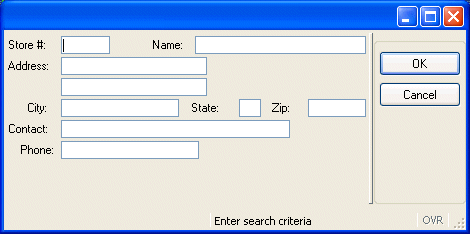

[Back to Summary](TutIndex.html)

------------------------------------------------------------------------

# Tutorial Chapter 4: Query by Example

Summary:

- [Implementing Query-by-Example](#QBE)
  - [CONSTRUCT and STRING variables](#CONSTRUCT)
  - [PREPARE Statement](#Preparing)
- [Allowing the User to Cancel the Query](#UserCancel)
  - [Pre-defined Actions (accept/cancel)](#PredefinedActions)
  - [DEFER INTERRUPT and INT_FLAG](#DEFERINTERRUPT)
  - [Conditional Logic: IF and CASE](#ConditionalLogic)
  - [The Query Program](#QueryProgram)
  - [Example: custmain.4gl](#Examplecustmain)
  - [Example: custquery..4gl (function query_cust)](#Excustquery.4gl)
  - [Example: custquery.4gl (function get_cust_cnt)](#get_cust_cnt)
- [Retrieving Data from the Database](#Retrievingdata)
  - [Use of Cursors](#Cursors)
  - [The SQLCA.SQLCODE](#SQLCA.SQLCODE)
  - [Example: custquery.4gl (function cust_select)](#cust_select)
  - [Example: custquery.4gl (function fetch_cust)](#fetch_cust)
  - [Example: custquery.4gl (function fetch_rel_cust) ](#fetch_rel_cust)
  - [Example: custquery.4gl (function display_cust)](#display_cust)
- [Compiling and Linking a Multiple-module Program](#CompileLink)
- [Modifying the Program to Handle Errors](#ModifyingtheProgram)
  - [WHENEVER ERROR statement](#WHENEVER)
  - [Negative SQLCA.SQLCODE](#NegativeSQLCA.SQLCODE)
  - [Using SQLERRMESSAGE](#SQLERRMESSAGE)
  - [Example: custquery.4gl (function cleanup)](#cleanup)
  - [Error if Cursor is Not Open:](#CursorError)

------------------------------------------------------------------------

This program  implements query-by-example, using the
[CONSTRUCT](#CONSTRUCT) statement to allow the user to enter search
criteria in a form. The criteria is used to build an SQL
[SELECT](StaticSql.html#SS_SELECT) statement which will retrieve rows
from the customer database table.  A [SCROLL CURSOR](#Cursors) is
defined in the program, to allow the user to scroll back and forth
between the rows of the result set.  The [SQLCA.SQLCODE](#SQLCA.SQLCODE)
is used to test the success of the SQL statements.  Handling errors, and
allowing the user to cancel the query, is illustrated.

## {border="0" width="470" height="234"}

                                 Display on Windows platforms

## [Implementing Query-by-Example]{#QBE}

[Query-by-Example](Construct.html) allows users to enter a value or a
range of values for one or several form fields. Then your program looks
up the database rows that satisfy the requirements. The BDL statement
that makes this possible is [CONSTRUCT](Construct.html).  

### Steps:

1.  Define fields linked to database columns in a [form specification
    file](FormSpecFiles.html).
2.  Define a [STRING](DataTypes.html#DT_STRING) variable in your program
    to hold the query criteria.
3.  Open a window and display the form.
4.  Activate the form with the interactive dialog statement
    [CONSTRUCT](Construct.html), for entry of the query criteria.
    Control is turned over to the user to enter his criteria.
5.  The user enters his criteria in the fields specified in the
    [CONSTRUCT](Construct.html) statement.  The
    [CONSTRUCT](Construct.html) statement accepts [logical
    operators](Construct.html#QUERY_OPERATORS) in any of the fields to
    indicate ranges, comparisons, sets, and partial matches. Using the
    form in this program, for example, the user can enter a specific
    value, such as **IL** in the **state** field, to retrieve all the
    rows from the **customer** table where the **state** column =
    **IL**.  Or he can enter relational tests, such as **\> 103**, in
    the **Store \#** field, to retrieve only those rows where the
    **store_num** column is greater than **103**.
6.  After entering his criteria, the user selects OK, to instruct your
    program to continue with the query, or Cancel to terminate the
    dialog.\
    In this program, the [action
    views](InteractionModel.html#CTRLGACTIONS) for accept (OK) and
    cancel are displayed as buttons on the screen.
7.  If the user accepts the dialog, the [CONSTRUCT](Construct.html)
    statement creates a Boolean expression by generating a logical
    expression for each field with a value and then applying unions (and
    relations) to the field statements.  This expression is stored in
    the character string that you specified in the
    [CONSTRUCT](Construct.html) statement.
8.  You can then use the Boolean expression to create a
    [STRING](DataTypes.html#DT_STRING) variable containing a complete
    [SELECT](StaticSql.html#SS_SELECT) statement.  You must supply the
    WHERE keyword to convert the Boolean expression into a WHERE clause.
    Make sure that you supply the spaces required to separate the
    constructed Boolean expression from the other parts of the
    [SELECT](StaticSql.html#SS_SELECT) statement.
9.  Execute the statement to retrieve the row(s) from the database
    table, after preparing it or declaring a cursor for
    [SELECT](StaticSql.html#SS_SELECT) statements that might retrieve
    more than one row.

### [Using CONSTRUCT and STRING variables]{#CONSTRUCT}

A basic [CONSTRUCT](Construct.html) statement has the following format:

         CONSTRUCT <variable-name> ON <column-list> FROM <field-list

This statement temporarily binds the specified form fields to database
columns. It allows you to identify database columns for which the user
can enter search criteria.  Each field and [CONSTRUCT](Construct.html)
corresponding column must be the same or compatible data types.  You can
use the BY NAME clause when the fields on the screen form have the same
names as the corresponding columns in the ON clause. The user can query
only the screen fields implied in the BY NAME clause.

         CONSTRUCT BY NAME <variable-name> ON <column-list>

The runtime system converts the entered criteria into a Boolean SQL
condition that can appear in the WHERE clause of a
[SELECT](StaticSql.html#SS_SELECT) statement. The variable to hold the
query condition can be defined as a [STRING](DataTypes.html#DT_STRING) 
data type. Strings are a variable length, dynamically allocated
character string data type, without a size limitation. The
[STRING](DataTypes.html#DT_STRING) variable can be concatenated, using
the double pipe operator (\|\|), with the text required to form a
complete SQL [SELECT](StaticSql.html#SS_SELECT) statement. The
[LET](Variables.html#VA_LET) statement can be used to assign a value to
the variable. For example:

         DEFINE where_clause, sqltext STRING
         CONSTRUCT BY NAME where_clause ON customer.*
         LET sql_text = "SELECT COUNT(*) FROM customer WHERE " || where_clause

       

                          Display on Windows Platform

In this example the user has entered the criteria **\> 101** in the
**store_num** field.  The **where_clause** would be generated as 

         "store_num > 101"

and the complete **sql_text** would be 

         "SELECT COUNT(*) FROM customer WHERE store_num > 101"

### [Preparing the SQL Statement]{#Preparing} 

The [STRING](DataTypes.html#DT_STRING) created in the example is not
valid for execution.  The [PREPARE](DynamicSql.html#DS_PREPARE)
instruction sends the text of the string to the database server for
parsing, validation, and to generate the execution plan.  The scope of a
prepared SQL statement is the module in which it is declared.

         PREPARE cust_cnt_stmt FROM sql_text

A prepared SQL statement can be executed with the
[EXECUTE](DynamicSql.html#DS_EXECUTE) instruction. 

         EXECUTE cust_cnt_stmt INTO cust_cnt

Since the SQL statement will only return one row (containing the count)
the **INTO** syntax of the [EXECUTE](DynamicSql.html#DS_EXECUTE)
instruction can be used to store the count in the local variable
**cust_cnt**. (The function **cust_select**  illustrates the use of
database [cursors](#Cursors) with SQL [SELECT](StaticSql.html#SS_SELECT)
statements.)

When a prepared statement is no longer needed, the
[FREE](DynamicSql.html#DS_FREE) instruction will release the resources
associated with the statement.

         FREE cust_cnt_stmt

------------------------------------------------------------------------

## [Allowing the User to Cancel the Query Operation]{#UserCancel}

### [Predefined Actions (accept/cancel)]{#PredefinedActions}

The language [pre-defines some
actions](InteractionModel.html#PREDEFACTIONS) and associated names for
common operations, such as **accept** or **cancel**, used during
interactive dialogs with the user such as [CONSTRUCT](Construct.html). 
You do not have to define these
[actions](InteractionModel.html#CTRLGACTIONS) in the interactive
instruction block, the runtime system interprets predefined actions. For
example, when the **accept** action is caught, the dialog is validated.

You can define [action views](InteractionModel.html#CTRLGACTIONS) (such
as buttons, toolbar icons, menu items) in your form using these
pre-defined names; the corresponding action will automatically be
attached to the view.  If you do not define any [action
views](InteractionModel.html#CTRLGACTIONS) for the actions, default
buttons (such as OK/Cancel) for these actions will be displayed on the
form as appropriate when interactive dialog statements are executed.

When the [CONSTRUCT](Construct.html) statement executes, buttons
representing **accept** and **cancel** actions will be displayed by
default, allowing the user to validate or cancel the interactive dialog
statement. If the user selects Cancel, the
[INT_FLAG](Programs.html#PV_INT_FLAG) is automatically set to
[TRUE](Programs.html#PC_TRUE). Once
[INT_FLAG](Programs.html#PV_INT_FLAG) is set to TRUE, your program must
re-set it to [FALSE](Programs.html#PC_TRUE) to detect a new
cancellation. You typically set INT_FLAG to FALSE before you start a
dialog instruction, and you test it just after (or in the AFTER
CONSTRUCT / AFTER INPUT block) to detect if the dialog was canceled:

::: {align="left"}
``` {align="LEFT"}
     LET INT_FLAG = FALSE
     CONSTRUCT BY NAME where_part
        ...
     END CONSTRUCT
     IF INT_FLAG = TRUE THEN
        ...
     END IF
```
:::

### [DEFER INTERRUPT and the INT_FLAG]{#DEFERINTERRUPT}

The statement [DEFER INTERRUPT](Programs.html#SIGNAL_HANDLING) in your
MAIN program block will prevent your program from terminating abruptly
if a SIGINT signal is received. When using a GUI interface, the user can
generate an interrupt signal if you have an action view named
\'interrupt\' (the predefined **interrupt** action).  If an interrupt
event is received, [TRUE](Programs.html#PC_TRUE) is assigned to the
built-in global integer variable [INT_FLAG](Programs.html#PV_INT_FLAG).

It is up to the programmer to manage the interruption event (stop or
continue with the program), by testing the value of
[INT_FLAG](Programs.html#PV_INT_FLAG) variable.

Interruption handling is discussed in the report example, in [chapter
9](TutChap09.html).

### [Conditional Logic]{#ConditionalLogic}

Once the CONSTRUCT statement is completed, you must test whether the
INT_FLAG was set to [TRUE](Programs.html#PC_TRUE) (whether the user
cancelled the dialog). Genero BDL provides the conditional logic
statements [IF](FlowControl.html#FC_IF) or
[CASE](FlowControl.html#FC_CASE) to test a set of conditions.

### [The IF statement]{#IF}

         IF <condition> THEN
           ....
         ELSE
           ....
         END IF

[IF](FlowControl.html#FC_IF) statements can be nested. The `ELSE` clause
may be omitted.

If *condition* is [TRUE](Programs.html#PC_TRUE), the runtime system
executes the block of statements following `THEN`, until it reaches
either the `ELSE` keyword or the `END IF` keywords. Your program resumes
execution after` END IF`. If *condition* is
[FALSE](Programs.html#PC_FALSE), the runtime system executes the block
of statements between `ELSE` and `END IF`.

::: {align="left"}
``` {align="LEFT"}
 IF (INT_FLAG = TRUE) THEN
       LET INT_FLAG = FALSE
       LET cont_ok = FALSE
     ELSE
       LET cont_ok = TRUE
     END IF
```
:::

### [The CASE statement]{#CASE}

 The [CASE](FlowControl.html#FC_CASE) statement specifies statement
blocks to be executed conditionally, depending on the value of an
expression. Unlike [IF](FlowControl.html#FC_IF) statements,` CASE` does
not restrict the logical flow of control to only two branches. 
Particularly if you have a series of  nested `IF` statements, the `CASE`
statement may be more readable. In the previous example, the `CASE`
statement could have been substituted for the `IF` statement:

         CASE
         WHEN (INT_FLAG = TRUE)
           LET INT_FLAG = FALSE
           LET cont_ok = FALSE     
         OTHERWISE
           LET cont_ok = TRUE 
         END CASE

Usually, there would be several conditions to check.  The following
statement uses an alternative syntax, since all the conditions check the
value of **var1**:

         CASE var1
         WHEN 100
           CALL routine_100()
         WHEN 200
           CALL routine_200()
         OTHERWISE
           CALL error_routine() 
         END CASE

The first `WHEN` condition in the [CASE](FlowControl.html#FC_CASE)
statement will be evaluated.  If the condition is true(**var1=100**),
the statement block is executed and the` CASE` statement is exited. If
the condition is not true, the next `WHEN` condition will be evaluated,
and so on through subsequent `WHEN` statements until a condition is
found to be true, or `OTHERWISE` or `END CASE` is encountered.  The
`OTHERWISE` clause of the `CASE` statement can be used as a catch-all
for unanticipated cases.

See [Flow Control](FlowControl.html) for other examples of
[IF](FlowControl.html#FC_IF) and [CASE](FlowControl.html#FC_CASE) syntax
and the additional conditional statement` WHILE`.

------------------------------------------------------------------------

## [The Query program]{#QueryProgram}

The Query program consists of two modules.  The **custmain.4gl** module
must be linked with the **custquery.4gl** module in order for the
program to be run.  The line numbers shown in the code are for reference
only, and are not a part of the code.

------------------------------------------------------------------------

### [Example: Module custmain.4gl]{#Examplecustmain}

This module contains the MAIN program block for the query program, and
the [MENU](Menus.html) that drives the query actions. 

+-----------------------------------------------------------------------+
| **Module custmain.4gl**                                               |
+-----------------------------------------------------------------------+
| ``` linenumber                                                        |
| 01 MAIN                                                               |
| 02                                                                    |
| 03   DEFER INTERRUPT                                                  |
| 04                                                                    |
| 05   CONNECT TO "custdemo"                                            |
| 06   CLOSE WINDOW SCREEN                                              |
| 07   OPEN WINDOW w1 WITH FORM "custform"                              |
| 08                                                                    |
| 09   MENU "Customer"                                                  |
| 10     ON ACTION query                                                |
| 11       CALL query_cust()                                            |
| 12     ON ACTION next                                                 |
| 13        CALL fetch_rel_cust(1)                                      |
| 14     ON ACTION previous                                             |
| 15        CALL fetch_rel_cust(-1)                                     |
| 16     ON ACTION exit                                                 |
| 17       EXIT MENU                                                    |
| 18   END MENU                                                         |
| 19                                                                    |
| 20   CLOSE WINDOW w1                                                  |
| 21                                                                    |
| 22   DISCONNECT CURRENT                                               |
| 23                                                                    |
| 24 END MAIN                                                           |
| ```                                                                   |
+-----------------------------------------------------------------------+

**Notes:**

- Line `01`{.linenumber} Beginning of the MAIN block. The
  [SCHEMA](Programs.html#DB_SCHEMA) statement is not needed since this
  module does not define any program [variables](Variables.html) in
  terms of a database table.
- Line `03`{.linenumber} uses the [DEFER INTERRUPT](#DEFERINTERRUPT)
  statement to prevent the user from terminating the program prematurely
  by pressing the INTERRUPT key.
- Line ` 07 `{.linenumber}[opens a window](TutChap03.html#windows) with
  the same form that was used in the [Chapter 3](TutChap03.html)
  example.
- Lines ` 09`{.linenumber} thru ` 18`{.linenumber} contains the
  [MENU](Menus.html) for the query program.  Four actions - **query**,
  **next**, **previous**, and **quit** - will be displayed as buttons on
  the form. The [pre-defined
  actions](InteractionModel.html#PREDEFACTIONS) accept (OK button) and
  cancel will automatically be displayed as buttons when the
  [CONSTRUCT](Construct.html) statement is executed.
- Line ` 11`{.linenumber} calls the function **query_cust** in the
  **cust_query.4gl** module.
- Line ` 13`{.linenumber} calls the function **fetch_rel_cust** in the
  **cust.query.4gl** module.  The literal value **1** is passed to the
  function, indicating that the [cursor](ResultSets.html#RESULTSET)
  should move forward to the next row.
- Line ` 15`{.linenumber} calls the function **fetch_rel_cust** also,
  but passes the literal value **-1**, indicating that the
  [cursor](ResultSets.html#RESULTSET) should move backwards to retrieve
  the previous row in the results set.
- Line ` 17`{.linenumber} exits the MENU statement.
- Line ` 20`{.linenumber} closes the window that was opened.
- Line ` 22`{.linenumber} disconnects from the database.

There are no further statements so the Query program terminates.

------------------------------------------------------------------------

### [Example: Module custquery.4gl]{#Excustquery.4gl}

This module of the Query program contains the logic for querying the
database and displaying the data retrieved.  The function **query_cust**
is called by the \"query\" option of the [MENU](Menus.html) in
**custmain.4gl**.

+-----------------------------------------------------------------------+
| **Module custquery.4gl (and function query_cust)**                    |
+-----------------------------------------------------------------------+
| ``` linenumber                                                        |
| 01 -- custquery.4gl                                                   |
| 02                                                                    |
| 03 SCHEMA custdemo                                                    |
| 04                                                                    |
| 05 DEFINE  mr_custrec RECORD                                          |
| 06  store_num    LIKE customer.store_num,                             |
| 07  store_name   LIKE customer.store_name,                            |
| 08  addr         LIKE customer.addr,                                  |
| 09  addr2        LIKE customer.addr2,                                 |
| 10  city         LIKE customer.city,                                  |
| 11  state        LIKE customer.state,                                 |
| 12  zipcode      LIKE customer.zipcode,                               |
| 13  contact_name LIKE customer.contact_name,                          |
| 14  phone          LIKE customer.phone                                |
| 15 END RECORD                                                         |
| 16                                                                    |
| 17 FUNCTION query_cust()                                              |
| 18   DEFINE cont_ok      SMALLINT,                                    |
| 19         cust_cnt     SMALLINT,                                     |
| 20         where_clause STRING                                        |
| 21   MESSAGE "Enter search criteria"                                  |
| 22   LET cont_ok = FALSE                                              |
| 23                                                                    |
| 24   LET INT_FLAG = FALSE                                             |
| 25   CONSTRUCT BY NAME where_clause                                   |
| 26      ON customer.store_num,                                        |
| 27         customer.store_name,                                       |
| 28         customer.city,                                             |
| 29         customer.state,                                            |
| 30         customer.zipcode,                                          |
| 31         customer.contact_name,                                     |
| 32         customer.phone                                             |
| 33                                                                    |
| 34   IF (INT_FLAG = TRUE) THEN                                        |
| 35     LET INT_FLAG = FALSE                                           |
| 36     CLEAR FORM                                                     |
| 37     LET cont_ok = FALSE                                            |
| 38     MESSAGE "Canceled by user."                                    |
| 39   ELSE                                                             |
| 40     CALL get_cust_cnt(where_clause)                                |
| 41       RETURNING cust_cnt                                           |
| 42     IF (cust_cnt > 0) THEN                                         |
| 43       MESSAGE cust_cnt USING "<<<<",                               |
| 44                  " rows found."                                    |
| 45        CALL cust_select(where_clause)                              |
| 46          RETURNING cont_ok                                         |
| 47     ELSE                                                           |
| 48       MESSAGE "No rows found."                                     |
| 49       LET cont_ok = FALSE                                          |
| 50     END IF                                                         |
| 51   END IF                                                           |
| 52                                                                    |
| 53   IF (cont_ok = TRUE) THEN                                         |
| 54     CALL display_cust()                                            |
| 55   END IF                                                           |
| 56                                                                    |
| 57 END FUNCTION                                                       |
| ```                                                                   |
+-----------------------------------------------------------------------+

**Notes:**

- Line ` 03`{.linenumber}  is required to identify the [database schema
  file](IntroBDL.html#SchemaFiles) to be used when compiling the module.
- Lines` 05 `{.linenumber} thru ` 15`{.linenumber} define a
  [RECORD](Records.html#DEFINITION), **mr_custrec**, that is modular in
  scope, since it is at the top of the module and outside any function.
  The values of this record will be available to, and can be set by, any
  function in this module.
- Line `17`{.linenumber}: **Function query_cust**. This is the beginning
  of the function **query_cust**.
- Line ` 18`{.linenumber} defines **cont_ok**, a local  variable of data
  type [SMALLINT](DataTypes.html#DT_SMALLINT), to be used as a flag to
  indicate whether the query should be continued.  The keywords
  [TRUE](Programs.html#PC_TRUE) and [FALSE](Programs.html#PC_FALSE) are
  used to set the value of the variable (0=FALSE, \<\>0=TRUE).
- Line ` 19`{.linenumber} defines another local
  [SMALLINT](DataTypes.html#DT_SMALLINT) variable, **cust_cnt**,  to
  hold the number of rows returned by the
  [SELECT](StaticSql.html#SS_SELECT) statement.
- Line ` 20`{.linenumber} defines **where_clause** as a local
  [STRING](DataTypes.html#DT_STRING) variable  to hold the boolean
  condition resulting from the [CONSTRUCT](Construct.html) statement.
- Line ` 21`{.linenumber} displays a message to the user that will
  remain until it is replaced by another
  [MESSAGE](MessageDisplay.html#MESSAGE) statement.
- Line ` 22`{.linenumber} sets cont_ok to
  [FALSE](Programs.html#PC_FALSE), prior to executing the statements of
  the function.
- Line ` 24`{.linenumber} sets [INT_FLAG](Programs.html#PV_INT_FLAG) to
  [FALSE](Programs.html#PC_FALSE). It is common to set this global flag
  to [FALSE](Programs.html#PC_FALSE) immediately prior to the execution
  of an interactive dialog, so your program can test whether the user
  attempted to cancel the dialog.
- Lines ` 25`{.linenumber} thru ` 32`{.linenumber}: The
  [CONSTRUCT](Construct.html) statement lists the database columns for
  which the user may enter search criteria.  The program does not permit
  the user to enter search criteria for the address columns.  The BY
  NAME syntax matches the database columns to form fields having the
  same name.
- Line ` 34`{.linenumber} is the beginning of
  an [IF](FlowControl.html#FC_IF) statement testing the value of
  [INT_FLAG](Programs.html#PV_INT_FLAG).  This test appears immediately
  after the [CONSTRUCT](Construct.html) statement, to test whether the
  user terminated the [CONSTRUCT](Construct.html) statement
  ([INT_FLAG](Programs.html#PV_INT_FLAG) would be set  by the runtime
  system to [TRUE](Programs.html#PC_TRUE)).
- Lines ` 35`{.linenumber} thru ` 38`{.linenumber} are executed only if
  the value of [INT_FLAG](Programs.html#PV_INT_FLAG) is
  [TRUE](Programs.html#PC_TRUE).  The
  [INT_FLAG](Programs.html#PV_INT_FLAG) is immediately re-set to
  [FALSE](Programs.html#PC_FALSE), since it is a global variable which
  other parts of your program will test.  The form is cleared of any
  criteria that the user has entered,  the **cont_ok** flag is set to
  [FALSE](Programs.html#PC_FALSE), and a message is displayed to the
  user.  The program will continue with the statements after the END IF
  on line `49`{.linenumber}.
- Lines ` 40`{.linenumber} thru `50`{.linenumber}: contain the logic to
  be executed if [INT_FLAG](Programs.html#PV_INT_FLAG) was not set to
  [TRUE](Programs.html#PC_TRUE) (the user did not cancel the query).
  - In lines ` 40`{.linenumber} and `41`{.linenumber}, the
    **get_cust_cnt** function is called, to retrieve the number of rows
    that would be returned by the query criteria.  The **where_clause**
    variable is passed to the function, and the value returned will be
    stored in the **cust_cnt** variable.
  - Lines ` 42`{.linenumber} is the beginning of a nested
    [IF](FlowControl.html#FC_IF) statement,  testing the value of
    **cust_cnt**.
  - Lines ` 43`{.linenumber} thru ` 46`{.linenumber} are executed if the
    value of **cust_cnt** is greater than zero; a message with the
    number of rows returned is displayed to the user, and the function
    **cust_select** is called.  The **where_clause** is passed to this
    function, and the returned value is stored in **cont_ok**. 
    Execution continues with the statement after the END IF on line
    `51`{.linenumber}.
  - Lines ` 48`{.linenumber} and ` 49`{.linenumber} are executed if the
    value is zero (no rows found); a message is displayed to the user,
    and **cont_ok** is set to [FALSE](Programs.html#PC_FALSE). 
    Execution continues after the END IF on line `51`{.linenumber}.
- Line `49`{.linenumber} is the end of the [IF](FlowControl.html#FC_IF)
  statement beginning on line `33`{.linenumber}.
- Lines `53`{.linenumber} thru ` 55`{.linenumber} test the value of
  **cont_ok**, which will have been set during the preceding
  [IF](FlowControl.html#FC_IF) statements and in the function
  **cust_select**.  If **cont_ok** is [TRUE](Programs.html#PC_TRUE), the
  function **display_cust** is called.
- Line ` 57`{.linenumber} is the end of the **query_cust** function.

------------------------------------------------------------------------

### [Example: custquery.4gl (Function get_cust_cnt) ]{#get_cust_cnt}

This function is called by the function **query_cust** to return the
count of rows that would be retrieved by the SELECT statement.  The
criteria previously entered by the user and stored in the variable
**where_clause** is used.

+-----------------------------------------------------------------------+
|   **Function get_cust_cnt**                                           |
+-----------------------------------------------------------------------+
| ``` linenumber                                                        |
| 01 FUNCTION get_cust_cnt(p_where_clause)                              |
| 02   DEFINE p_where_clause STRING,                                    |
| 03         sql_text STRING,                                           |
| 04         cust_cnt SMALLINT                                          |
| 05                                                                    |
| 06   LET sql_text =                                                   |
| 07    "SELECT COUNT(*) FROM customer" ||                              |
| 08    " WHERE " || p_where_clause                                     |
| 09                                                                    |
| 10   PREPARE cust_cnt_stmt FROM sql_text                              |
| 11   EXECUTE cust_cnt_stmt INTO cust_cnt                              |
| 12   FREE cust_cnt_stmt                                               |
| 13                                                                    |
| 14   RETURN cust_cnt                                                  |
| 15                                                                    |
| 16 END FUNCTION                                                       |
| ```                                                                   |
+-----------------------------------------------------------------------+

**Notes:**

- Line ` 01`{.linenumber} The function accepts as a parameter the value
  of **where_clause**, stored in the local variable **p_where_clause**
  defined on Line `60`{.linenumber}.
- Line ` 02`{.linenumber} defines a local
  [STRING](DataTypes.html#DT_STRING) variable, **sql_txt**,  to hold the
  complete text of the SQL [SELECT](StaticSql.html#SS_SELECT) statement.
- Line ` 04`{.linenumber} defines a local variable **cust_cnt**  to hold
  the count returned by the [SELECT](StaticSql.html#SS_SELECT)
  statement.
- Lines ` 06`{.linenumber} thru ` 08`{.linenumber} create the string
  containing the complete SQL [SELECT](StaticSql.html#SS_SELECT)
  statement, concatenating **p_where_clause** at the end using the \|\|
  operator.  Notice that the word WHERE must be provided in the string.
- Line ` 10`{.linenumber} uses the [PREPARE](DynamicSql.html#DS_PREPARE)
  statement to convert the [STRING](DataTypes.html#DT_STRING) into an
  executable SQL statement, parsing the statement and storing it in
  memory.  The prepared statement is modular in scope.  The prepared
  statement has the identifier **cust_cnt_stmt**, which does not have to
  be defined.
- Line ` 11`{.linenumber} executes the SQL
  [SELECT](StaticSql.html#SS_SELECT) statement contained in
  **cust_cnt_stmt**, using the [EXECUTE  \...
  INTO](DynamicSql.html#DS_EXECUTE) syntax to store the value returned
  by the statement in the variable **cust_cnt**.  This syntax can be
  used if the SQL statement returns a single row of values.
- Line ` 12`{.linenumber} The [FREE](DynamicSql.html#DS_FREE) statement
  releases the memory associated with the
  [PREPARE](DynamicSql.html#DS_PREPARE)d statement, since this statement
  is no longer needed.
- Line ` 14`{.linenumber} returns the value of **cust_cnt** to the
  calling function, **query_cust**.
- Line ` 16`{.linenumber} is the end of the **get_cust_cnt** function.

------------------------------------------------------------------------

## [Retrieving data from the Database]{#Retrievingdata}

### [Using Cursors]{#Cursors}

When an SQL [SELECT](StaticSql.html#SS_SELECT) statement in your
application will retrieve more than one row, a
[cursor](ResultSets.html#RESULTSET) must be used to pass the selected
data to the program one row at a time.  The
[cursor](ResultSets.html#RESULTSET) is a data structure that represents
a specific location within the active set of rows that the
[SELECT](StaticSql.html#SS_SELECT) statement retrieved.

- Sequential cursor - reads through the active set only once each time
  it is opened, by moving the cursor forward one row each time a row is
  requested.
- Scroll cursor - fetches the rows of the active set in any sequence. 
  To implement a scroll cursor, the database server creates a temporary
  table to hold the active set.

The scope of a [cursor](ResultSets.html#RESULTSET) is the module in
which it is declared. Cursor names must be unique within a module.

The general sequence of  program statements when using a
[SELECT](StaticSql.html#SS_SELECT) cursor for Query-by-Example is:

- [DECLARE](ResultSets.html#RS_DECLARE) - the program declares a cursor
  for the [STRING](DataTypes.html#DT_STRING) that contains the SQL
  [SELECT](StaticSql.html#SS_SELECT) statement.  This allocates storage
  to hold the cursor. Note that the string does not have to be prepared
  using the PREPARE statement.
- [OPEN](ResultSets.html#RS_OPEN) - the program opens the cursor.  The
  active set associated with the [cursor](ResultSets.html#RESULTSET) is
  identified, and the cursor is positioned before the first row of the
  set.
- [FETCH](ResultSets.html#RS_FETCH) - the program fetches a row of data
  into host [variables](Variables.html) and processes it.  The syntax
  FETCH NEXT \<*cursor-identifier*\> INTO \<*variable-names*\> can be
  used with a [SCROLL CURSOR](#Cursors) to fetch  the next row relative
  to the current position of the [cursor](ResultSets.html#RESULTSET) in
  the SQL result set.  Using FETCH PREVIOUS \... moves the
  [cursor](ResultSets.html#RESULTSET) back one row in the SQL result
  set.
- [CLOSE](ResultSets.html#RS_CLOSE) - the program closes the
  [cursor](ResultSets.html#RESULTSET) after the last row desired is
  fetched.  This releases the active result set associated with the
  cursor.  The cursor can be re-opened.
- [FREE](ResultSets.html#RS_FREE) - when the
  [cursor](ResultSets.html#RESULTSET) is no longer needed, the program
  frees the cursor to release the storage area holding the cursor.  Once
  a [cursor](ResultSets.html#RESULTSET) has been freed, it must be
  declared again before it can be re-opened.

The [cursor](ResultSets.html#RESULTSET) program statements must appear
physically within the module in the order listed.

------------------------------------------------------------------------

### The [SQLCA.SQLCODE]{#SQLCA.SQLCODE}

The \"SQLCA\" name stands for \"SQL Communication Area\".  The
[SQLCA](Exceptions.html#SQLERRORS) variable is a predefined record
containing information on the execution of an SQL statement. The 
[SQLCA](Exceptions.html#SQLERRORS) record is filled after any SQL
statement execution.  The SQLCODE member of this record contains the SQL
execution code:

  -------------------- --------------------------------------
  **Execution Code**   **Description**
  **0**                SQL statement executed successfully.
  **100**              No rows were found.
  **\<0**              An SQL error occurred.
  -------------------- --------------------------------------

The [NOTFOUND](Programs.html#PC_NOTFOUND) constant is a predefined
integer value that evaluates to 100. This constant is typically used to
test the execution status of an SQL statement returning a result set, to
check if rows have been found.

------------------------------------------------------------------------

### [Example custquery.4gl (function cust_select)]{#cust_select}

This function is called by the function **query_cust**, if the row count
returned by the function **get_cust_cnt** indicates that the criteria
previously entered by the user and stored in the variable
**where_clause** would produce an SQL SELECT result set.

+-----------------------------------------------------------------------+
|   **Function cust_select**                                            |
+-----------------------------------------------------------------------+
| ``` linenumber                                                        |
| 01 FUNCTION cust_select(p_where_clause)                               |
| 02   DEFINE p_where_clause STRING,                                    |
| 03         sql_text STRING,                                           |
| 04         fetch_ok SMALLINT                                          |
| 05                                                                    |
| 06   LET sql_text = "SELECT store_num, " ||                           |
| 07    " store_name, addr, addr2, city, " ||                           |
| 08    " state, zipcode, contact_name, phone " ||                      |
| 09    " FROM customer WHERE " || p_where_clause ||                    |
| 10    " ORDER BY store_num"                                           |
| 11                                                                    |
| 12   DECLARE cust_curs SCROLL CURSOR FROM sql_text                    |
| 13   OPEN cust_curs                                                   |
| 14   CALL fetch_cust(1)   -- fetch the first row                      |
| 15      RETURNING fetch_ok                                            |
| 16   IF NOT (fetch_ok) THEN                                           |
| 17      MESSAGE "no rows in table."                                   |
| 18   END IF                                                           |
| 19                                                                    |
| 20   RETURN fetch_ok                                                  |
| 21                                                                    |
| 22 END FUNCTION                                                       |
| ```                                                                   |
+-----------------------------------------------------------------------+

**Notes:**

- Line ` 01 `{.linenumber} The function **cust_select** accepts as a
  parameter the **where_clause**, storing it in the local variable
  **p_where_clause**.
- Lines` 06`{.linenumber} thru `10 `{.linenumber}concatenate the entire
  text of the SQL statement into the local
  [STRING](DataTypes.html#DT_STRING) variable **sql_txt**.
- Line ` 12`{.linenumber} declares a [SCROLL CURSOR](#Cursors) with the
  identifier **cust_curs**, for the [STRING](DataTypes.html#DT_STRING)
  variable **sql_text**.
- Line ` 13`{.linenumber} opens the [cursor](ResultSets.html#RESULTSET),
  positioning before the first row of the result set.  Note that these
  statements are physically in the correct order within the module. 
- Lines ` 14`{.linenumber} and` 15`{.linenumber} call the function
  **fetch_cust**, passing as a parameter the literal value **1**, and
  returning a value stored in the local variable **fetch_ok**.  Passing
  the value **1** to **fetch_cust** will result in the NEXT row of the
  result set being fetched (see the logic in the function
  **fetch_cust**), which is this case would be the first row.  
- Line `16`{.linenumber} Since **fetch_ok** is defined as a
  [SMALLINT](DataTypes.html#DT_SMALLINT), it can be used as a flag
  containing the values [TRUE](Programs.html#PC_TRUE) or
  [FALSE](Programs.html#PC_FALSE).  The value returned from the function
  **fetch_cust** indicates whether the fetch was successful.
- Line `17 `{.linenumber}displays a message to the user if the
  [FETCH](ResultSets.html#RS_FETCH) was not successful.  Since this is
  the fetch of the first row in the result set, another user must have
  deleted the  rows after the program selected the count. 
- Line ` 20 `{.linenumber} returns the value of **fetch_ok** to the
  calling function. This determines whether the function
  **display_cust** is called.
- Line `22 `{.linenumber}is the end of the function **cust_select**.

#### Tips:

1.  Lines `15`{.linenumber} and `16`{.linenumber} could be combined to
    shorten the code:

<!-- -->

          IF NOT fetch_cust(1) THEN ...

> This syntax would call the function **fetch_cust** implicitly, passing
> the parameter **1**; the function returns
> [TRUE](Programs.html#PC_TRUE) or [FALSE](Programs.html#PC_FALSE),
> which would be tested by the [IF](FlowControl.html#FC_IF) statement.

------------------------------------------------------------------------

### [Example: custquery.4gl (function fetch_cust)]{#fetch_cust}

This function is designed so that it can be re-used each time a row is
to be fetched from the **customer** database table; a variable is passed
to indicate whether the [cursor](ResultSets.html#RESULTSET) should move
forward one row or backward one row.

+-----------------------------------------------------------------------+
|   **Function fetch_cust**                                             |
+-----------------------------------------------------------------------+
| ``` linenumber                                                        |
| 01 FUNCTION fetch_cust(p_fetch_flag)                                  |
| 02    DEFINE p_fetch_flag SMALLINT,                                   |
| 03           fetch_ok SMALLINT                                        |
| 04                                                                    |
| 05   LET fetch_ok = FALSE                                             |
| 06   IF (p_fetch_flag = 1) THEN                                       |
| 07     FETCH NEXT cust_curs                                           |
| 08       INTO mr_custrec.*                                            |
| 09   ELSE                                                             |
| 10     FETCH PREVIOUS cust_curs                                       |
| 11       INTO mr_custrec.*                                            |
| 12   END IF                                                           |
| 13                                                                    |
| 14   IF (SQLCA.SQLCODE = NOTFOUND) THEN                               |
| 15     LET fetch_ok = FALSE                                           |
| 16   ELSE                                                             |
| 17     LET fetch_ok = TRUE                                            |
| 18   END IF                                                           |
| 19                                                                    |
| 20   RETURN fetch_ok                                                  |
| 21                                                                    |
| 22 END FUNCTION                                                       |
| ```                                                                   |
+-----------------------------------------------------------------------+

**Notes:**

- Line `01`{.linenumber} The function **fetch_cust** accepts a parameter
  and stores it in the local [variable](Variables.html)
  **p_fetch_flag**.
- Line ` 03`{.linenumber} defines a [variable](Variables.html),
  **fetch_ok,** to serve as an indicator whether the
  [FETCH](ResultSets.html#RS_FETCH) was successful.
- Lines `06 `{.linenumber}thru ` 12`{.linenumber} tests the value of
  **p_fetch_flag**, moving the [cursor](ResultSets.html#RESULTSET)
  forward with FETCH NEXT if the value is **1**, and backward with FETCH
  PREVIOUS if the value is **-1**.  The values of the row in the
  **customer** database table are fetched into the program
  [variables](Variables.html) of the **mr_custrec** record.  The INTO
  mr_custrec.\* syntax requires that the program
  [variables](Variables.html) in the [record](Records.html)
  **mr_custrec** are in the same order as the columns are listed in the
  [SELECT](StaticSql.html#SS_SELECT) statement.
- Lines ` 14`{.linenumber} thru `15 `{.linenumber}tests
  **SQLCA.SQLCODE** and sets the value of **fetch_ok** to
  [FALSE](Programs.html#PC_FALSE) if the fetch did not return a row.  If
  the [FETCH](ResultSets.html#RS_FETCH) was successful, **fetch_ok** is
  set to [TRUE](Programs.html#PC_TRUE).
- Line ` 20`{.linenumber} returns the value of **fetch_ok** to the
  calling function.
- Line ` 22`{.linenumber} is the end of the function **fetch_cust.**

------------------------------------------------------------------------

### [Example: querycust.4gl (function fetch_rel_cust)]{#fetch_rel_cust}

This function is called by the [MENU](Menus.html) options \"next\" and
\"previous\" in the **custmain.4gl** module.

+-----------------------------------------------------------------------+
| **Function fetch_rel_cust**                                           |
+-----------------------------------------------------------------------+
| ``` linenumber                                                        |
| 01 FUNCTION fetch_rel_cust(p_fetch_flag)                              |
| 02   DEFINE p_fetch_flag SMALLINT,                                    |
| 03         fetch_ok SMALLINT                                          |
| 04                                                                    |
| 05   MESSAGE " "                                                      |
| 06   CALL fetch_cust(p_fetch_flag)                                    |
| 07     RETURNING fetch_ok                                             |
| 08                                                                    |
| 09   IF (fetch_ok) THEN                                               |
| 10     CALL display_cust()                                            |
| 11   ELSE                                                             |
| 12     IF (p_fetch_flag = 1) THEN                                     |
| 13       MESSAGE "End of list"                                        |
| 14     ELSE                                                           |
| 15       MESSAGE "Beginning of list"                                  |
| 16     END IF                                                         |
| 17   END IF                                                           |
| 18                                                                    |
| 19 END FUNCTION                                                       |
| ```                                                                   |
+-----------------------------------------------------------------------+

**Notes:**

- Line ` 01`{.linenumber} The parameter passed to it, **p_fetch_flag**
  will be **1** or -**1**, depending on the direction in which the
  [SCROLL CURSOR](#Cursors) is to move.
- Line ` 05`{.linenumber} re-sets the
  [MESSAGE](MessageDisplay.html#MESSAGE) display to blanks.
- Line ` 06`{.linenumber} calls the function **fetch_cust**, passing it
  the value of **p_fetch_flag**.  The function **fetch_cust** uses the
  [SCROLL CURSOR](#Cursors) to retrieve the next row in the direction
  indicated, returning [FALSE](Programs.html#PC_FALSE) if there was no
  row found.
- Lines ` 09`{.linenumber} and ` 10`{.linenumber} If a row was found
  (the **fetch_cust** function returned [TRUE](Programs.html#PC_TRUE))
  the **display_cust** function is called to display the row in the
  form.
- Line ` 13`{.linenumber} If no rows were found and the direction is
  forward, indicated by **p_fetch_flag** of **1**, the
  [cursor](ResultSets.html#RESULTSET) is past the end of the result set.
- Line ` 15`{.linenumber} If no rows were found and the direction is
  backward, indicated by **p_fetch_flag** of **-1**, the
  [cursor](ResultSets.html#RESULTSET) is prior to the beginning of the
  result set.
- Line ` 19`{.linenumber} is the end of the function **fetch_rel_cust**.

------------------------------------------------------------------------

### [Example: custquery.4gl (function display_cust)]{#display_cust}

This function displays the contents of the **mr_custrec** record in the
form.  It is called by the functions **query_cust** and
**fetch_rel_cust**.

+-----------------------------------------------------------------------+
| **Function display_cust**                                             |
+-----------------------------------------------------------------------+
| ``` linenumber                                                        |
| 01 FUNCTION display_cust()                                            |
| 02   DISPLAY BY NAME mr_custrec.*                                     |
| 03 END FUNCTION                                                       |
| ```                                                                   |
+-----------------------------------------------------------------------+

**Notes:**

- Line `02`{.linenumber} uses the [DISPLAY BY
  NAME](TutChap03.html#displaybyname) syntax to display the contents of
  the program record **mr_custrec** to the form fields having the same
  name.

------------------------------------------------------------------------

## [Compiling and Linking the Program]{#CompileLink}

The two example modules must be compiled and  then linked into a single
program.

From the command line:

       fglcomp custmain.4gl 

       fglcomp custquery.4gl 

This produces the object modules **custmain.42m** and **custquery.42m**,
which must be linked to produce the program **cust.42r**:

       fgllink -o cust.42r custmain.42m custquery.42m

Or, compile both modules and link at the same time:

       fgl2p -o cust.42r custmain.4gl custquery.4gl

------------------------------------------------------------------------

## [Modifying the Program to Handle Errors]{#ModifyingtheProgram}

### [The WHENEVER ERROR statement]{#WHENEVER}

Since program statements that access the database may be expected to
fail occasionally (the row is locked, etc.) the [WHENEVER
ERROR](Exceptions.html#DEFINITION) statement can be used to handle this
type of error.

By default, when a runtime error occurs the program will stop.  To
prevent this happening when SQL statements that access the database
fail, surround the SQL statement with [WHENEVER
ERROR](Exceptions.html#DEFINITION) statements, as in the following
example based on the **fetch_cust** function in the **custquery.4gl**
program module:

     01 IF (p_fetch_flag = 1) THEN
     02    WHENEVER ERROR CONTINUE
     03    FETCH NEXT cust_curs
     04       INTO mr_custrec.*
     05    WHENEVER ERROR STOP
     06 ...

[WHENEVER ERROR](Exceptions.html#DEFINITION) statements are modular in
scope, and generate additional code for exception handling when the
module is compiled. This exception handling is valid until the end of
the module or until a new [WHENEVER ERROR](Exceptions.html#DEFINITION)
instruction is encountered by the compiler.

When the example code is compiled, WHENEVER ERROR CONTINUE will generate
code to prevent the program from stopping if the
[FETCH](ResultSets.html#RS_FETCH) statement fails. Immediately after the
[FETCH](ResultSets.html#RS_FETCH) statement, the WHENEVER ERROR STOP
instruction will generate the code to re-set the default behavior for
the rest of the module.

You can write your own error function to handle SQL errors, and use the
[WHENEVER ERROR CALL](Exceptions.html#DEFINITION) \<*function-name*\>
syntax to activate it.  Run-time errors may be logged to an [error
log](Exceptions.html#TRACE).

### [Negative SQLCA.SQLCODE]{#NegativeSQLCA.SQLCODE}

The database server returns an execution code whenever an SQL statement 
is executed, available in [SQLCA.SQLCODE](#SQLCA.SQLCODE).  If the code
is a negative number,  an SQL error has occurred.  Just as we checked
the [SQLCA.SQLCODE](#SQLCA.SQLCODE) for the
[NOTFOUND](Programs.html#PC_NOTFOUND) condition, we can also check the
code for database errors (negative SQLCODE).  The SQLCA.SQLCODE should
be checked immediately after each SQL statement that may fail,
including  DECLARE, OPEN, FETCH, etc. For simplicity of the examples,
the error handling in these programs is minimal.

### [SQLERRMESSAGE]{#SQLERRMESSAGE}

If an SQL error occurs, the
[SQLERRMESSAGE](Operators.html#OP_SQLERRMESSAGE) operator returns the
error message associated with the error code.  This is a character
string that can be displayed to the user with the
[ERROR](TutChap03.html#Displaymsg) instruction.

``` linenumber
     ERROR SQLERRMESSAGE 
```

+-----------------------------------------------------------------------+
| **Changes to function fetch_cust (custquery.4gl)**                    |
+-----------------------------------------------------------------------+
| ``` linenumber                                                        |
| 01 FUNCTION fetch_cust (p_fetch_flag)                                 |
| 02    DEFINE p_fetch_flag SMALLINT,                                   |
| 03           fetch_ok     SMALLINT                                    |
| 04                                                                    |
| 05   LET fetch_ok = FALSE                                             |
| 06   IF (p_fetch_flag = 1) THEN                                       |
| 07      WHENEVER ERROR CONTINUE                                       |
| 08     FETCH NEXT cust_curs                                           |
| 09       INTO mr_custrec.*                                            |
| 10     WHENEVER ERROR STOP                                            |
| 11   ELSE                                                             |
| 12      WHENEVER ERROR CONTINUE                                       |
| 13     FETCH PREVIOUS cust_curs                                       |
| 14       INTO mr_custrec.*                                            |
| 15     WHENEVER ERROR STOP                                            |
| 16   END IF                                                           |
| 17                                                                    |
| 18   CASE                                                             |
| 19   WHEN (SQLCA.SQLCODE = 0)                                         |
| 20      LET fetch_ok = TRUE                                           |
| 21   WHEN (SQLCA.SQLCODE = NOTFOUND)                                  |
| 22      LET fetch_ok = FALSE                                          |
| 23   WHEN (SQLCA.SQLCODE < 0)                                         |
| 24      LET fetch_ok = FALSE                                          |
| 25     ERROR SQLERRMESSAGE                                            |
| 26   END CASE                                                         |
| 27                                                                    |
| 28   RETURN fetch_ok                                                  |
| 29                                                                    |
| 30 END FUNCTION                                                       |
| ```                                                                   |
+-----------------------------------------------------------------------+

**Notes:**

- Lines `08`{.linenumber}, `09`{.linenumber}, `13`{.linenumber},
  `14 `{.linenumber}The SQL statements are surrounded by WHENEVER ERROR
  statements. If an error occurs during the SQL statements, the program
  will continue.  The error handling is re-set to the default (STOP)
  immediately after each SQL statement so that failures of other program
  statements will not be ignored.
- Lines ` 18`{.linenumber} to `26 `{.linenumber} Immediately after the
  WHENEVER ERROR STOP statement, the SQLCA.SQLCODE is checked, to see
  whether the SQL statement succeeded.  A CASE statement is used, since
  there are more than two conditions to be checked.

### [Close and Free the Cursor]{#cleanup}

Closing and freeing the cursor when you no longer need it is good
practice, especially if the modules are part of a larger program. This
function must be placed in the same module as the DECLARE/OPEN/FETCH
statements and in sequence, so this is the last function in the
**query_cust** module.  However, the function can be called from
**cust_main**, as a final \"cleanup\" routine.  

+-----------------------------------------------------------------------+
| **Function cleanup (custquery.4gl)**                                  |
+-----------------------------------------------------------------------+
| ``` linenumber                                                        |
| 01 FUNCTION cleanup()                                                 |
| 02   WHENEVER ERROR CONTINUE                                          |
| 03   CLOSE cust_curs                                                  |
| 04   FREE cust_curs                                                   |
| 05   WHENEVER ERROR STOP                                              |
| 06 END FUNCTION                                                       |
| ```                                                                   |
+-----------------------------------------------------------------------+

**Notes:**

- Line `03`{.linenumber} Closes the cursor used to retrieve the database
  rows.
- Line ` 04 `{.linenumber}Frees the memory associated with the cursor.
- Lines `02`{.linenumber} and `05 `{.linenumber}The WHENEVER ERROR
  statements prevent a program error if the user exited the program
  without querying, and the cursor was never created).

------------------------------------------------------------------------

## [Error if Cursor is not Open]{#CursorError}

In the example program in this chapter, if the user selects the Next or
Previous action from the [MENU](Menus.html#SYNTAX) before he has
queried, the program returns an error (\"Program stopped at line \....
Fetch attempted on unopened cursor.\"). One way to prevent this error
would be to add a variable to the program to indicate whether the user
has queried for a result set, and to prevent him from executing the
actions associated with Next or Previous until he has done so.

+-----------------------------------------------------------------------+
| **Changes to function query_cust (custquery.4gl)**                    |
+-----------------------------------------------------------------------+
| ``` linenumber                                                        |
| 01 FUNCTION query_cust()                                              |
| 02   DEFINE cont_ok      SMALLINT,                                    |
| 03         cust_cnt     SMALLINT,                                     |
| 04         where_clause STRING                                        |
| 05   MESSAGE "Enter search criteria"                                  |
| 06   LET cont_ok = FALSE                                              |
| 07                                                                    |
| ...                                                                   |
| 08                                                                    |
| 09   IF (cont_ok = TRUE) THEN                                         |
| 10     CALL display_cust()                                            |
| 11   END IF                                                           |
| 12                                                                    |
| 13   RETURN cont_ok                                                   |
| 14                                                                    |
| 15 END FUNCTION                                                       |
| ```                                                                   |
+-----------------------------------------------------------------------+

**Notes:**

- Line `13 `{.linenumber}A single line is added to the **query_cust**
  function to return the value of **cont_ok,** which indicates whether
  the query was successful**,** to the calling function in
  **custmain.4gl**. 

+-----------------------------------------------------------------------+
| **Changes to module custmain.4gl**                                    |
+-----------------------------------------------------------------------+
| ``` linenumber                                                        |
| 01 MAIN                                                               |
| 02   DEFINE query_ok SMALLINT                                         |
| 03                                                                    |
| 04   DEFER INTERRUPT                                                  |
| 05                                                                    |
| 06   CONNECT TO "custdemo"                                            |
| 07   CLOSE WINDOW SCREEN                                              |
| 08   OPEN WINDOW w1 WITH FORM "custform"                              |
| 09   LET query_ok = FALSE                                             |
| 10                                                                    |
| 11   MENU "Customer"                                                  |
| 12     ON ACTION query                                                |
| 13       CALL query_cust() RETURNING query_ok                         |
| 14     ON ACTION next                                                 |
| 15       IF (query_ok) THEN                                           |
| 16         CALL fetch_rel_cust(1)                                     |
| 17       ELSE                                                         |
| 18         MESSAGE "You must query first."                            |
| 19       END IF                                                       |
| 20     ON ACTION previous                                             |
| 21       IF (query_ok) THEN                                           |
| 22         CALL fetch_rel_cust(-1)                                    |
| 23       ELSE                                                         |
| 24         MESSAGE "You must query first."                            |
| 25       END IF                                                       |
| 26     ON ACTION quit                                                 |
| 27       EXIT MENU                                                    |
| 28   END MENU                                                         |
| 29                                                                    |
| 30   CLOSE WINDOW w1                                                  |
| 31   CALL cleanup()                                                   |
| 32   DISCONNECT CURRENT                                               |
| 33                                                                    |
| 34 END MAIN                                                           |
| ```                                                                   |
+-----------------------------------------------------------------------+

**Notes:**

- Line `03`{.linenumber} defines the [variable](Variables.html)
  **query_ok**, which will be used to indicate whether the user has
  queried.
- Line `09`{.linenumber} sets the initial value of **query_ok** to
  [FALSE](Programs.html#PC_FALSE).
- Line `13`{.linenumber} the function **query_cust** now returns a value
  for **query_ok**.
- Lines `15 `{.linenumber}thru `19 `{.linenumber}and Lines
  `21`{.linenumber} thru `25:`{.linenumber} these sections test the
  value of **query_ok** when Next or Previous has been selected.  If 
  **query_ok**  is [TRUE](Programs.html#PC_TRUE), the function
  **fetch_rel_cust** is called; otherwise, a message is displayed to the
  user.
- Line `31 `{.linenumber} calls the **cleanup** function to close the
  cursor used to fetch the database rows.
