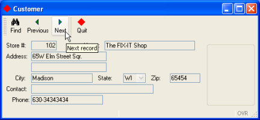
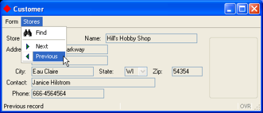
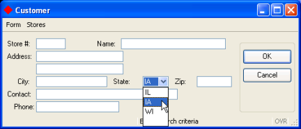

[Back to Summary](TutIndex.html)

------------------------------------------------------------------------

# Tutorial Chapter 5: Enhancing the Form

Summary:

- [Adding a Toolbar](#Toolbar)
- [Adding a Topmenu](#TopMenu)
- [Adding a ComboBox form item](#combobox)
- [Changing the Window Appearance](#ChangeWindow)
- [Examples](#Exampetitleicon)
- [Managing actions](#ManageActions)
  - [Disable/enable actions](#DisEnabActions)
  - [The close action](#CloseAction)
- [Example: custmain.4gl](#Exampcustmain)
- [Action Defaults](#ActionDefaults)
- [MENU/Action Defaults Interaction](#MENUActionDefaults)

------------------------------------------------------------------------

You can change the way that program options are displayed in a form in a
variety of ways. This example program illustrates some of the simple
changes that can be made:

- By changing the form specification file, you can provide the user with
  a valid list of abbreviations for the state field and add a
  [Toolbar](FormSpecFiles.html) or pulldown menu
  ([Topmenu](FormSpecFiles.html)). The program business logic in the BDL
  program need not change.  Once you recompile the form file, it can be
  used by the program with no additional changes required.
- You can change the appearance of the application window, adding a
  custom title and icon.
- You can disable and enable actions dynamically to control the options
  available to the user.

The program also illustrates some of the Genero BDL [action
defaults](ActionDefaults.html) that standardize the presentation of
common actions.

------------------------------------------------------------------------

## [Adding a Toolbar]{#Toolbar}

{border="0" width="432" height="200"}

                Display on Windows platforms

The [TOOLBAR](FormSpecFiles.html#SECTION_TOOLBAR) section of a [form
specification file](FormSpecFiles.html) defines a Toolbar with buttons
that are bound to [actions](InteractionModel.html#BINDING_ACTIONS). A
Toolbar definition can contain the following elements:

- an ITEM - specifies the action that is bound to the Toolbar button
- a SEPARATOR  - a vertical line

Values can be assigned to [TEXT,](FSFAttributes.html#FA_TEXT)
[COMMENT](FSFAttributes.html#FA_COMMENT), and
[IMAGE](FSFAttributes.html#FA_IMAGE) attributes for each item in the
Toolbar.

The [TOOLBAR](FormSpecFiles.html#SECTION_TOOLBAR) commands are enabled
by [actions](InteractionModel.html)defined by the current interactive
BDL instruction, which in our example is the [MENU](Menus.html)
statement in the **custquery.4gl** module. When a Toolbar button is
selected by the user, the program triggers the
[action](InteractionModel.html#BINDING_ACTIONS)to which the Toolbar
button is bound.

### [Example: (in custform.per)]{#Exampletb}

This [TOOLBAR](FormSpecFiles.html#SECTION_TOOLBAR) will display  buttons
for **find**, **next,** **previous**, and **quit** actions.

+------------------------------------------------------------------------+
| **Form (custform.per)**                                                |
+------------------------------------------------------------------------+
| ``` linenumber                                                         |
| 01 SCHEMA custdemo                                                     |
| 02                                                                     |
| 03 TOOLBAR                                                             |
| 04   ITEM find                                                         |
| 05   ITEM previous                                                     |
| 06   ITEM next                                                         |
| 07   SEPARATOR                                                         |
| 08   ITEM quit (TEXT="Quit", COMMENT="Exit the program", IMAGE="exit") |
| 09 END                                                                 |
| 10                                                                     |
| ...                                                                    |
| ```                                                                    |
+------------------------------------------------------------------------+

#### Notes:

- Line ` 04`{.linenumber} The ITEM command-identifier **find** will be
  bound to the [MENU](Menus.html) statement
  [action](InteractionModel.html) **find** on line `14`{.linenumber} in
  the **custmain.4gl** file shown below. The word **find** must be
  identical in both the TOOLBAR ITEM and the MENU statement action, and
  must always be in lower-case. The other command-identifiers are
  similarly bound.
- Line ` 08`{.linenumber} Although attributes such as TEXT or COMMENT
  are defined for the ITEM **quit**, the ITEMS  **find**, **previous**,
  and **next** do not have any attributes defined in the [form
  specification file](FormSpecFiles.html).  These actions are common
  actions that have default attributes defined in the [action defaults
  file](#ActionDefaults).

------------------------------------------------------------------------

## [Adding a Topmenu]{#TopMenu}

The same options that were displayed to the user as a
[TOOLBAR](FormSpecFiles.html#SECTION_TOOLBAR) can also be defined as
buttons on a pull-down menu ( a
[TOPMENU](FormSpecFiles.html#SECTION_TOPMENU)).  To change the
presentation of the menu options to the user, simply modify and
recompile the [form specification file](FormSpecFiles.html).

{border="0" width="432" height="186"}

                  Display on Windows platforms

The [TOPMENU](FormSpecFiles.html#SECTION_TOPMENU) section of  the [form
specification](FormSpecFiles.html) allows you to design the pull-down
menu. The TOPMENU section must appear after
[SCHEMA](FormSpecFiles.html#SECTION_SCHEMA), and must contain a tree of
GROUP elements that define the pull-down menu.  The GROUP
[TEXT](FSFAttributes.html#FA_TEXT) value is the title for the pull-down
menu group.

A GROUP can contain the following elements:

- a COMMAND - specifies the action the menu option must be bound to
- a SEPARATOR  - a horizontal line
- GROUP children - a subgroup within a group.

Values can be assigned to attributes such as
[TEXT,](FSFAttributes.html#FA_TEXT)
[COMMENT](FSFAttributes.html#FA_COMMENT), and
[IMAGE.](FSFAttributes.html#FA_IMAGE) for each item in the
[TOPMENU](FormSpecFiles.html#SECTION_TOPMENU).

As in a Toolbar, the [TOPMENU](FormSpecFiles.html#SECTION_TOPMENU)
commands are enabled by [actions](InteractionModel.html) defined by the
current interactive BDL instruction (dialog), which in our example is
the [MENU](Menus.html) statement in the **custquery.4gl** module.  When
a TOPMENU option is selected by the user, the program triggers the
[action](InteractionModel.html) to which the TOPMENU command is bound.

### [Example ( in custform.per)]{#Exampletm}:

+-----------------------------------------------------------------------------+
| **Form custform.per**                                                       |
+-----------------------------------------------------------------------------+
| ``` linenumber                                                              |
| 01 SCHEMA custdemo                                                          |
| 02                                                                          |
| 03 TOPMENU                                                                  |
| 04   GROUP form (TEXT="Form")                                               |
| 05     COMMAND quit (TEXT="Quit", COMMENT="Exit the program", IMAGE="exit") |
| 06   END                                                                    |
| 07   GROUP stores (TEXT="Stores")                                           |
| 08     COMMAND find                                                         |
| 09     SEPARATOR                                                            |
| 13     COMMAND next                                                         |
| 14     COMMAND previous                                                     |
| 15  END                                                                     |
| 16 END                                                                      |
| 17                                                                          |
| ...                                                                         |
| ```                                                                         |
+-----------------------------------------------------------------------------+

#### Notes:

- Lines ` 04`{.linenumber} and `07`{.linenumber} This example
  [TOPMENU](FormSpecFiles.html#SECTION_TOPMENU) will consist of two
  groups on the menu bar of the form.  The
  [TEXT](FSFAttributes.html#FA_TEXT) displayed on the menu bar for the
  first group will be **Form**, and the second group will be **Stores**.
- Line `08`{.linenumber} to `14`{.linenumber}: Under the menu bar item
  **Stores**, the command-identifier **find** on line ` 05`{.linenumber}
  will be bound to the [MENU](Menus.html) statement action **find** on
  line ` 14`{.linenumber} in the **custmain.4gl** file shown below.  The
  word **find** must be identical (including case) in both the
  [TOPMENU](FormSpecFiles.html#SECTION_TOPMENU) command and the MENU
  statement action.  The other command-identifiers are similarly bound.

The revised [form specification file](FormSpecFiles.html) must be
re-compiled before it can be used in the program.

------------------------------------------------------------------------

## [Adding a COMBOBOX form item]{#combobox}

In this example application the only valid values for the **state**
column of the database table **customer** are IL, IA, and WI.  The form
item used to display the **state** field can be changed to a
[COMBOBOX](FormSpecFiles.html#FF_ITEMTYPE_COMBOBOX) displaying a
dropdown list of valid state values. The COMBOBOX is active during an
INPUT, INPUT ARRAY, or CONSTRUCT statement, allowing the user to select
a value for the state field. 

{border="0" width="432" height="186"}       

                        Display on Windows platforms 

The values of the list are defined by the ITEMS attribute:

         COMBOBOX f6=customer.state, ITEMS = ("IL", "IA", "WI");

In this example, the value displayed on the form and the real value (the
value to be stored in the program variable corresponding to the form
field) are the same.  You can choose to define different display and
real values;  in the following example, the values Paris, Madrid, and
London would be displayed to the user, but the value stored in the
corresponding program variable would be 1, 2, or 3:

> COMBOBOX f9 = formonly.cities, ITEMS =  ((1,"Paris"),(2,"Madrid"),(3,"London"));  

Although the list of values for the
[COMBOBOX](FormSpecFiles.html#FF_ITEMTYPE_COMBOBOX) is contained in the
form specification file in this example program, you could also set the
[INITIALIZER](FSFAttributes.html#FA_INITIALIZER) attribute to define a
function that will provide the values. The initialization function would
be invoked at runtime when the form is loaded, to fill the COMBOBOX item
list dynamically with database records, for example.

See [form file item-types](FSFAttributes.html) for a complete list of
the item types that can be used on a form.

------------------------------------------------------------------------

## [Changing the Window Appearance]{#ChangeWindow}

Genero provides [attributes](FSFAttributes.html) that can be used to
customize the appearance of windows, forms, and form objects in your
application.  In addition, you can create [Presentation
Styles](PresentationStyles.html) to standardize the appearance of window
and form objects across applications.

Some of the simple changes that you can make are:

- ### Title

> The default title for a window is the name of the object in the [OPEN
> WINDOW](WindowsAndForms.html#OPEN_WINDOW) statement. For example, in
> the programs we\'ve seen so far, the title of the window is w1:

              OPEN WINDOW w1 WITH FORM "custform"

> In the form specification file, the attribute
> [TEXT](FSFAttributes.html#FA_TEXT) of the
> [LAYOUT](FormSpecFiles.html#SECTION_LAYOUT) section can be used to
> change the title of the parent window:

              LAYOUT (TEXT="Customer") 

- ### Icon

> The Genero runtime system provides [built-in
> classes](BuiltInClasses.html), or object templates, which contain
> methods, or functions, that you can call from your programs. The
> classes are grouped together into packages. One package, **ui**,
> contains the \"[Interface](ClassInterface.html)\" class, allowing you
> to manipulate the user interface. For example, the **setImage** method
> can be used to set the default icon for the windows of your program.
> You may simply call the method, prefixing it with the package name and
> class name; you do not need to create an Interface object.

              CALL ui.Interface.setImage("imagename")

- ### Window Style

> By default windows are displayed as normal application windows, but
> you can choose a specific style using the
> [WINDOWSTYLE](FSFAttributes.html#FA_WINDOWSTYLE) attribute of the
> [LAYOUT](FormSpecFiles.html#SECTION_LAYOUT) section of the form file.
> The default [window styles](WindowsAndForms.html#WINDOW_STYLES) are
> defined as a set of attributes in an external file (**default.4st)**.

::: {align="left"}
``` {align="left"}
          LAYOUT (WINDOWSTYLE="dialog") 
```
:::

------------------------------------------------------------------------

### [Example: (in custform.per)]{#Exampetitleicon}

+-----------------------------------------------------------------------+
| **Form custform.per**                                                 |
+-----------------------------------------------------------------------+
| ``` linenumber                                                        |
| ...                                                                   |
| 18 LAYOUT (TEXT="Customer")                                           |
| 19  GRID                                                              |
| 20  {                                                                 |
| 21   Store #:[f01  ]       Name:[f02                 ]                |
| 22   Address:[f03                 ]                                   |
| 23           [f04                 ]                                   |
| 24      City:[f05             ]State:[f6  ]Zip:[f07   ]               |
| 25   Contact:[f08                           ]                         |
| 26     Phone:[f09                ]                                    |
| 27  }                                                                 |
| 28  END                                                               |
| 29 END                                                                |
| 30 TABLES                                                             |
| 31   customer                                                         |
| 32 END                                                                |
| 33 ATTRIBUTES                                                         |
| 34 EDIT f01=customer.store_num,                                       |
| 35   REQUIRED, COMMENT="This is the co-op store number";              |
| 36 EDIT f02=customer.store_name;                                      |
| 37 EDIT f03=customer.addr;                                            |
| 38 EDIT f04=customer.addr2;                                           |
| 39 EDIT f05=customer.city;                                            |
| 40 COMBOBOX f6=customer.state,                                        |
| 41   REQUIRED, ITEMS = ("IL", "IA", "WI");                            |
| 41 EDIT f07=customer.zipcode;                                         |
| 42 EDIT f08=customer.contact_name;                                    |
| 43 EDIT f09=customer.phone;                                           |
| 43 END                                                                |
| ```                                                                   |
+-----------------------------------------------------------------------+

#### Notes:

- Line `18`{.linenumber}, the title of the window is set to
  **Customer**.  Since this is a normal application window, the default
  window style is used.
- Line `40`{.linenumber}, a
  [COMBOBOX](FormSpecFiles.html#FF_ITEMTYPE_COMBOBOX) is substituted for
  a simple Edit form field.
- Line `35`{.linenumber} and `41 `{.linenumber} The
  [REQUIRED](FSFAttributes.html#FA_REQUIRED) attribute forces the user
  to enter or select a value for this field when a new record is being
  added.  See the [attributes list](FSFAttributes.html) for a complete
  list of the attributes that can be defined for a form field.

### Example: (in custmain.4gl)

Changing the icon for the application windows:

+-----------------------------------------------------------------------+
| **Module custmain.4gl**                                               |
+-----------------------------------------------------------------------+
| ``` linenumber                                                        |
| ...                                                                   |
| 04 MAIN                                                               |
| 05   DEFINE query_ok SMALLINT                                         |
| 06                                                                    |
| 07   DEFER INTERRUPT                                                  |
| 08                                                                    |
| 09   CONNECT TO "custdemo"                                            |
| 10   CLOSE WINDOW SCREEN                                              |
| 11   CALL ui.Interface.setImage("smiley")                             |
| 12   OPEN WINDOW w1 WITH FORM "custform"                              |
| 13                                                                    |
| ...                                                                   |
| ```                                                                   |
+-----------------------------------------------------------------------+

#### Notes:

- Line `11`{.linenumber}  For convenience, the image used is the
  **smiley** image from the **pics** directory, which is the default
  image directory of the Genero Desktop Client.

------------------------------------------------------------------------

## [Managing Actions]{#ManageActions}

### [Disable/Enable Actions]{#DisEnabActions}

In the example in the previous lesson, if the user clicks the Next or
Previous buttons on the application form without first querying
successfully, a message displays and no action is taken. You can disable
and enable the actions instead, providing visual cues to the user when
the actions are not available. The [ui.Dialog](ClassDialog.html)
built-in class provides an interface to the BDL interactive dialog
statements, such as CONSTRUCT and MENU.  The method **setActionActive**
enables and disables actions. To call a method of this class, use the
pre-defined **DIALOG** object within the interactive instruction block.

For example:

         MENU
            BEFORE MENU
             CALL DIALOG.setActionActive("actionname" , state)
           ...
         END MENU

where *actionname* is the name of the action, *state* is an integer,
**0** (disable) or **1** (enable).

You must be within an interactive instruction in order to use the DIALOG
object in your program, but you can pass the object to a function. Using
this technique, you could create a function that enables/disables an
action, and call the function from the MENU statement, for example. See
[ui.Dialog](ClassDialog.html) for further information.

### [The Close Action]{#CloseAction}

In Genero applications, when the user clicks the X button in the
upper-right corner of the application window, a predefined **close**
action is sent to the program. What happens next depends on the
interactive dialog statement:

- When the program is in a [MENU](Menus.html) dialog statement, the
  **close** action is converted to an INTERRUPT key press. If there is a
  COMMAND KEY (INTERRUPT) block in the MENU statement, the statements in
  that control block are executed.  Otherwise, no action is taken.
- When the program is in an [INPUT](RecordInput.html), [INPUT
  ARRAY](InputArray.html), [CONSTRUCT](Construct.html) or [DISPLAY
  ARRAY](DisplayArray.html) statement,  the **close** action cancels the
  dialog, and the **int_flag** is set to TRUE. Your program can check
  the value of **int_flag** and take appropriate action.

You can change this default behavior by overwriting the **close** action
within the interactive statement.  For example, to exit the MENU
statement when the user clicks this button:

        MENU
          ...
          ON ACTION close
             EXIT MENU
        END MENU

By default the action view for the **close** action is hidden and does
not display on the form.

------------------------------------------------------------------------

### [Example: (custmain.4gl)]{#Exampcustmain}

+-----------------------------------------------------------------------+
| **Module custmain.4gl**                                               |
+-----------------------------------------------------------------------+
| ``` linenumber                                                        |
| 01                                                                    |
| 02 MAIN                                                               |
| 03 DEFINE query_ok SMALLINT                                           |
| 04                                                                    |
| 05 DEFER INTERRUPT                                                    |
| 06 CONNECT TO "custdemo"                                              |
| 07 CLOSE WINDOW SCREEN                                                |
| 08 CALL ui.Interface.setImage("smiley")                               |
| 09 OPEN WINDOW w1 WITH FORM "custform"                                |
| 10                                                                    |
| 11 LET query_ok = FALSE                                               |
| 12                                                                    |
| 13 MENU                                                               |
| 14   BEFORE MENU                                                      |
| 15     CALL DIALOG.setActionActive("next",0)                          |
| 16     CALL DIALOG.setActionActive("previous",0)                      |
| 17   ON ACTION find                                                   |
| 18     CALL DIALOG.setActionActive("next",0)                          |
| 19     CALL DIALOG.setActionActive("previous",0)                      |
| 20     CALL query_cust() RETURNING query_ok                           |
| 21     IF (query_ok) THEN                                             |
| 22       CALL DIALOG.setActionActive("next",1)                        |
| 23       CALL DIALOG.setActionActive("previous",1)                    |
| 24     END IF                                                         |
| 25   ON ACTION next                                                   |
| 26      CALL fetch_rel_cust(1)                                        |
| 27   ON ACTION previous                                               |
| 28     CALL fetch_rel_cust(-1)                                        |
| 29   ON ACTION quit                                                   |
| 30     EXIT MENU                                                      |
| 31   ON ACTION close                                                  |
| 32     EXIT MENU                                                      |
| 33 END MENU                                                           |
| 34                                                                    |
| 35 CLOSE WINDOW w1                                                    |
| 36                                                                    |
| 37 DISCONNECT CURRENT                                                 |
| 38                                                                    |
| 39 END MAIN                                                           |
| ```                                                                   |
+-----------------------------------------------------------------------+

**Notes:**

- Line `08`{.linenumber}  The icon for the application windows is set to
  the \"exit\" image.
- Lines `15`{.linenumber}, `16`{.linenumber}  Before the menu is first
  displayed, the **next** and **previous** actions are disabled.
- Lines `18`{.linenumber}, `19`{.linenumber} Before the **query_cust**
  function is executed the **next** and **previous** actions are
  disabled
- Lines `21`{.linenumber} thru `24 `{.linenumber}If the query was
  successful the **next** and **previous** actions are enabled.
- Line `31`{.linenumber} The **close** action is included in the menu,
  although an action view won\'t display on the form.  If the user
  clicks the X button in the top right of the window, the action on line
  `32`{.linenumber}, EXIT MENU, will be taken.

------------------------------------------------------------------------

## [Action Defaults]{#ActionDefaults}

The Genero BDL runtime system includes an XML file, **default.4ad, ** in
the **lib** subdirectory of the installation directory
[FGLDIR](EnvironmentVariables.html#EV_FGLDIR), that defines presentation
attributes for some commonly used
[actions](InteractionModel.html#DEFAULT_ACTION_VIEWS). If you match the
action names used in this file exactly when you define your [action
views](InteractionModel.html#CTRLGACTIONS)
([TOOLBAR](FormSpecFiles.html#SECTION_TOOLBAR) or
[TOPMENU](FormSpecFiles.html#SECTION_TOPMENU) items, buttons, etc.)  in
the [form specification file](FormSpecFiles.html), the presentation
attributes defined for this action will be used.  All action names must
be in lower-case.

For example, the following line in the **default.4ad** file:

    <ActionDefault name="find" text="Find"
                   image="find" comment="Search" />

defines presentation attributes for a **find**
[action](InteractionModel.html)- the text to be displayed on the action
view **find** defined in the form, the image file to be used as the icon
for the action view, and the comment to be associated with the action
view. The attribute values are case-sensitive,so the action name in the
form specification file must be \"find\", not \"Find\".

The following line in the **default.4ad** file defines presentation
attributes for the [pre-defined
action](TutChap04.html#PredefinedActions) **cancel**. An [accelerator
key](InteractionModel.html#ACCELNAMES) is assigned as an alternate means
of invoking the action:

    <ActionDefault name="cancel" text="Cancel"
                   acceleratorName="Escape" />

You can override a default presentation attribute in your program. For
example, by specifying a  [TEXT](FSFAttributes.html#FA_TEXT) attribute
for the action **find** in the form specification file, the default TEXT
value of \"Find \" will be replaced with the value \"Looking\".

``` linenumber
03 TOPMENU
04
...   
07   GROUP stores (TEXT="Stores")
08     COMMAND find (TEXT="Looking")
```

You can create your own **.4ad** file to standardize the presentation
attributes for all the common [actions](InteractionModel.html) used by
your application.  See [Action Defaults](ActionDefaults.html) for
additional details.

------------------------------------------------------------------------

## [MENU/Action Defaults Interaction]{#MENUActionDefaults}

The attributes of the [action views](InteractionModel.html#CTRLGACTIONS)
for the [MENU](Menus.html) actions in the **custmain.4gl** example will
be determined as shown in the table below.  Attributes defined in the
[form specification file](FormSpecFiles.html) override attributes
defined in the **.4ad** file.

  ----------------- ------------------------------------------- ---------------------------------- ---------------------------------------------
  **Action**        **From the form \                           **From the default.4ad file**      **From the MENU statement \
                    specification file**                                                           in the .4gl file**

  **find**          No attributes listed                        TEXT=\"Find\"\                     Over-ridden by default.4ad
                                                                IMAGE=\"find\"\                    
                                                                COMMENT=\"Search\"                 

  **next**          No attributes listed                        TEXT=\"Next\" \                    Over-ridden by default.4ad
                                                                IMAGE=\"goforw\"\                  
                                                                COMMENT=\"Next record\"            

  **previous**      No attributes listed                        TEXT=\"Previous\"\                 Over-ridden by default.4ad
                                                                IMAGE=\"gorev\"\                   
                                                                COMMENT=\"Previous record\"        

  **close**         Not listed in the form file                 attributes are listed in           Over-ridden by default.4ad ([pre-defined
                                                                default.4ad but the action view is action](TutChap04.html#PredefinedActions))
                                                                not displayed on form by default   

  **quit**          \                                            [Action](InteractionModel.html)   Over-ridden by the form specification file.\
                    For both [TOPMENU](#TopMenu) and            is not listed in the file          
                    [TOOLBAR](#Toolbar), the [action                                               
                    view](InteractionModel.html#CTRLGACTIONS)                                      
                    has the attributes TEXT=\"Quit\", \                                            
                    COMMENT=\"Exit the program\", \                                                
                    IMAGE=\"exit\".\                                                               

  **\*accept **     Not listed in the form file.                TEXT=\"OK\"\                       This action is not defined in a MENU
                                                                AcceleratorName=\"Return\" \       instruction ([pre-defined
                                                                AcceleratorName2=\"Enter\"         action](TutChap04.html#PredefinedActions).)

  **\*cancel **     Not listed in the form file.                TEXT=\"Cancel\"\                   This action is not defined in a MENU
                                                                AcceleratorName=\"Escape\"         instruction ([pre-defined
                                                                                                   action](TutChap04.html#PredefinedActions).)
  ----------------- ------------------------------------------- ---------------------------------- ---------------------------------------------

\* The [pre-defined actions](TutChap04.html#PredefinedActions)
**accept** and **cancel** do not have [action
views](InteractionModel.html#CTRLGACTIONS) defined in the form
specification file; by default, they appear on this form as buttons in
the righthand section of the form when the CONSTRUCT statement is
active.  Their attributes are taken from the **default.4ad** file.

### Images

The image files specified in these definitions are among the files
provided with the **Genero Desktop Client**, in the **pics**
subdirectory.
