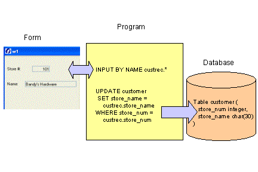

[Back to Summary](TutIndex.html)

------------------------------------------------------------------------

# Tutorial Chapter 6: Add/Update/Delete

Summary:

- [Entering data on a form (INPUT statement)](#INPUT)
  - [INPUT attribute (UNBUFFERED)](#UNBUFFERED)
  - [INPUT attribute (WITHOUT DEFAULTS)](#WITHOUTDEFAULTS)
- [Updating database tables](#SQL)
  - [SQL transactions](#SQL)
  - [Concurrency and Consistency](#CONCURRENCY)
- [Adding a new row](#Addrow)
  - [INPUT statement control blocks](#AFTERFIELD)
  - [Example: Add a row to the customer table](#ADDEXAMP)
- [Updating an existing row](#UpdatingdbRow)
  - [Using a work record](#workrecord)
  - [SELECT \... FOR UPDATE](#SELUPDATE)
  - [CURSOR WITH HOLD](#HOLDCURSOR)
  - [Example: Update a row in the customer table](#UPDEXAMP)
- [Deleting a row](#DeletingRow)
  - [Using a modal Menu to prompt for validation](#dialogMENU)
  - [Example: Deleting a row in the customer table](#DELEXAMP)

------------------------------------------------------------------------

This program allows the user to insert/update/delete rows in the
customer table. [Embedded SQL statements](StaticSql.html)
(UPDATE/INSERT/DELETE) are used to update the table, based on the values
stored in the program record.  SQL [transactions](Transactions.html),
and [concurrency and consistency](Transactions.html#DBTRANS) issues are
discussed.  Prior to deleting a row, a [dialog window](#dialogMENU) is
displayed to prompt the user to verify the deletion.

## {border="0" width="432" height="288"}

------------------------------------------------------------------------

## [Entering data on a form: INPUT statement]{#INPUT}

The [INPUT](RecordInput.html) statement allows the user to enter or
change the values in a [program record](TutChap03.html#definerecord),
which can then be used as the data for new rows in a database table, or
to update existing rows.  In the [INPUT](RecordInput.html) statement you
list:

- The program [variables](Variables.html) that are to receive data from
  the form
- The corresponding [form fields](FormSpecFiles.html#FF_FORM_FIELD) that
  the user will use to supply the data

<!-- -->

          INPUT <program-variables> FROM <form-fields>

The FROM clause explicitly binds the fields in the screen record to the
program [variables](Variables.html), so the [INPUT](RecordInput.html)
instruction can manipulate values that the user enters in the [screen
record](FormSpecFiles.html#SECTION_INSTRUCTIONS). The number of record
members must equal the number of
[fields](FormSpecFiles.html#FF_FORM_FIELD) listed in the FROM clause.
Each variable must be of the same (or a compatible) data type as the
corresponding screen field. When the user enters data, the runtime
system checks the entered value against the data type of the variable,
not the data type of the screen field.

When invoked, the INPUT statement enables the specified fields of the
form in the current BDL window, and waits for the user to supply data
for the fields. The user moves the cursor from field to field and types
new values.  Each time the cursor leaves a field, the value typed into
that field is deposited into the corresponding program variable.  You
can write blocks of code as [clauses in the INPUT
statement](RecordInput.html) that will be called automatically during
input, so that you can monitor and control the actions of your user
within this statement.

The INPUT statement ends when the user selects the **accept** or
**cancel** [actions](InteractionModel.html#CTRLGACTIONS).

INPUT supports the same shortcuts for naming records as the
[DISPLAY](RecordDisplay.html#DISPLAY_BY_NAME) statement. You can ask for
input to all members of a [record](TutChap03.html#definerecord), from
all fields of a [screen
record](FormSpecFiles.html#SECTION_INSTRUCTIONS), and you can ask for
input BY NAME from fields that have the same names as the program
variables.

         INPUT BY NAME <programrecord>.*

### [UNBUFFERED attribute]{#UNBUFFERED}

By default, field values are buffered.  The UNBUFFERED attribute makes
the INPUT dialog \"sensitive\", allowing you to easily change some [form
field](FormSpecFiles.html#FF_FORM_FIELD) values programmatically during
[INPUT](RecordInput.html) execution.  When you assign a value to a
program [variable](Variables.html), the runtime system will
automatically display that value in the form; when you input values in a
form field, the runtime system will automatically store that value in
the corresponding program variable.  Using the UNBUFFERED attribute is
**strongly** recommended.

### [WITHOUT DEFAULTS attribute]{#WITHOUTDEFAULTS}

The same [INPUT](RecordInput.html) statement can be used, with the
WITHOUT DEFAULTS attribute, to allow the user to make changes to an
existing [program record](TutChap03.html#definerecord) representing a
row in the database. This attribute prevents BDL from automatically
displaying any default values that have been defined for the [form
fields](FormSpecFiles.html#FF_FORM_FIELD) when INPUT is invoked,
allowing you to display the existing database values on the screen
before the user begins editing the data.  In this case, when the INPUT
statement is used to allow the user to add a new row, any existing
values in the program record must first be nulled out.

------------------------------------------------------------------------

## [Updating Database Tables]{#SQL}

The values of the program [variables](Variables.html) that have been
input through the [form](TutChap03.html#FormSpec) can be used in [SQL
statements](StaticSql.html) that update tables in a database.  

### [SQL transactions]{#SQL}

The embedded [SQL statements](StaticSql.html) INSERT, UPDATE, and DELETE
can be used to make changes to the contents of a database table. If your
database has transaction logging, you can use the [BEGIN
WORK](Transactions.html#TI_BEGIN_WORK) and [COMMIT
WORK](Transactions.html#TI_COMMIT_WORK) commands to delimit a 
[transaction](Transactions.html#DBTRANS) block, usually consisting of
multiple [SQL statements](StaticSql.html). If you do not issue a BEGIN
WORK statement to start a transaction, each statement executes within
its own transaction. These single-statement transactions do not require
either a BEGIN WORK statement or a COMMIT WORK statement. At runtime,
the Genero database driver generates the appropriate SQL commands to be
used with the target database server.

To eliminate concurrency problems, keep transactions as short as
possible. 

###  [Concurrency and Consistency]{#CONCURRENCY}

While your program is modifying data, another program may also be
reading or modifying the same data. To prevent errors, database servers
use a system of [locks.](Transactions.html#TI_SET_LOCK_MODE)  When
another program requests the data, the database server either makes the
program wait or turns it back with an error. BDL provides a combination
of statements to control the effect that locks have on your data access:

- SET LOCK MODE TO {WAIT [n]| NOT WAIT }

> This defines the timeout for lock acquisition for the current
> connection.  The timeout period can be specified in seconds (**n**). 
> If no period is specified, the timeout is infinite.  If the [LOCK
> MODE](Transactions.html#TI_SET_LOCK_MODE) is set to NOT WAIT, an
> exception is returned immediately if a lock cannot be acquired.
>
> **Warning:  This feature is not supported by all databases.  When
> possible, the database driver sets the corresponding connection
> parameter to define the timeout.  If the database server does not
> support setting the lock timeout parameter, the runtime system
> generates an exception.**

- SET ISOLATION LEVEL TO { DIRTY READ
                             | COMMITTED READ
                             | CURSOR STABILITY
                             | REPEATABLE READ }

> This defines the [ISOLATION LEVEL](Transactions.html#TI_SET_ISOLATION)
> for the current connection.  When possible, the database driver
> executes the native [SQL statement](StaticSql.html) that corresponds
> to the specified isolation level.

  For portable database programming, the following is recommended:

- [Transactions](Transactions.html) must be enabled in your database.
- The [ISOLATION LEVEL](Transactions.html#TI_SET_ISOLATION) must be at
  least COMMITTED READ.  On most database servers, this is usually the
  default isolation level and need not be changed.
- The [LOCK MODE](Transactions.html#TI_SET_LOCK_MODE) must be set to
  WAIT or WAIT \<*timeperiod*\>**, ** if this is supported by your
  database server.

See [Transactions](Transactions.html) in the BDL Reference Manual for a
more complete discussion.  The ODI Adaptation Guides provide detailed
information about the behavior of specific database servers.

------------------------------------------------------------------------

## [Adding a new row]{#Addrow}

### [INPUT Statement Control blocks]{#AFTERFIELD}

Genero BDL provides some optional control blocks for the
[INPUT](RecordInput.html) statement that are called automatically as the
user moves the cursor through the
[fields](FormSpecFiles.html#FF_FORM_FIELD) of a form.  This allows your
program to initialize field contents when adding a new row, for example,
or to validate the user\'s input.

For example:

- [BEFORE FIELD](RecordInput.html) control blocks are executed
  immediately prior to the focus moving to the specified field. The
  example program uses this control block to prevent the user from
  changing the store number during an Update, by immediately moving the
  focus to the store name field (the [NEXT FIELD](RecordInput.html)
  instruction ).
- An [ON CHANGE](RecordInput.html) is used to verify the uniqueness of
  the store number that was entered, and to make sure that the store
  name is not left blank. The user receives notification of a problem
  with the value of a field as soon as the field is exited. Validating
  these values as they are completed is less disruptive than notifying
  the user of several problems after the entire record has been entered.

See the [INPUT](RecordInput.html) statement for a complete list of
control blocks.

------------------------------------------------------------------------

## [Example: add a new row to the customer table]{#ADDEXAMP} 

### Module custmain.4gl

The [MENU](Menus.html#SYNTAX) statement  in the module **custmain.4gl**
is modified to call functions for adding, updating, and deleting the
rows in the customer table.

+-----------------------------------------------------------------------+
| **The MAIN block (custmain.4gl)**                                     |
+-----------------------------------------------------------------------+
| ``` linenumber                                                        |
| 01 -- custmain.4gl                                                    |
| 02                                                                    |
| 03 MAIN                                                               |
| 04   DEFINE query_ok INTEGER                                          |
| 05                                                                    |
| 06   DEFER INTERRUPT                                                  |
| 07   CONNECT TO "custdemo"                                            |
| 08   SET LOCK MODE TO WAIT 6                                          |
| 09   CLOSE WINDOW SCREEN                                              |
| 10   OPEN WINDOW w1 WITH FORM "custform"                              |
| 11                                                                    |
| 12   MENU                                                             |
| 13    ON ACTION find                                                  |
| 14      LET query_ok = query_cust()                                   |
| 15    ON ACTION next                                                  |
| 16      IF (query_ok) THEN                                            |
| 17        CALL fetch_rel_cust(1)                                      |
| 18      ELSE                                                          |
| 19        MESSAGE "You must query first."                             |
| 20      END IF                                                        |
| 21    ON ACTION previous                                              |
| 22      IF (query_ok) THEN                                            |
| 23        CALL fetch_rel_cust(-1)                                     |
| 24      ELSE                                                          |
| 25        MESSAGE "You must query first."                             |
| 26      END IF                                                        |
| 27    COMMAND "Add"                                                   |
| 28      IF (inpupd_cust("A")) THEN                                    |
| 29        CALL insert_cust()                                          |
| 30      END IF                                                        |
| 31    COMMAND "Delete"                                                |
| 32      IF (delete_check()) THEN                                      |
| 33        CALL delete_cust()                                          |
| 34     END IF                                                         |
| 35    COMMAND "Modify"                                                |
| 36      IF inpupd_cust("U") THEN                                      |
| 37        CALL update_cust()                                          |
| 38     END IF                                                         |
| 39    ON ACTION quit                                                  |
| 40      EXIT MENU                                                     |
| 41  END MENU                                                          |
| 42                                                                    |
| 43  CLOSE WINDOW w1                                                   |
| 44                                                                    |
| 45  DISCONNECT CURRENT                                                |
| 46                                                                    |
| 47 END MAIN                                                           |
| ```                                                                   |
+-----------------------------------------------------------------------+

**Notes:**

- Line `08 `{.linenumber}sets the [lock timeout
  period](Transactions.html#TI_SET_LOCK_MODE) to 6 seconds.
- Lines `12`{.linenumber} thru `41`{.linenumber} define the main menu of
  the program.
- Lines `27`{.linenumber} thru `30`{.linenumber} The
  [MENU](Menus.html#SYNTAX) option \"Add\"  now calls an **inpupd_cust**
  function.  Since this same function will also be used for updates, the
  value \"A\", indicating an Add of a new row, is passed.  If
  **inpupd_cust** returns [TRUE](Programs.html#PC_TRUE), the
  **insert_cust** function is called.
- Lines `31`{.linenumber} thru `34`{.linenumber} The
  [MENU](Menus.html#SYNTAX) option \"Delete\" now calls a
  **delete_check** function.  If **delete_check** returns
  [TRUE](Programs.html#PC_TRUE), the **delete_cust** function is called.
- Lines `35 `{.linenumber}thru ` 38`{.linenumber} are added to the
  [MENU](Menus.html#SYNTAX) statement for the \"Modify\" option, calling
  the **inpud_cust** function.  The value \"U\", for an Update of a new
  row, is passed as a parameter.  If **inpupd_cust** returns
  [TRUE](Programs.html#PC_TRUE), the **update_cust** function is called.

### Module custquery.4gl (function inpupd_cust) 

A new function, **inpupd_cust,** is added to the **custquery.4gl**
module, allowing the user to insert values for a new customer row into
the form.

+-----------------------------------------------------------------------+
| **Function inpupd_cust (custquery.4gl)**                              |
+-----------------------------------------------------------------------+
| ``` linenumber                                                        |
| 01 FUNCTION inpupd_cust(au_flag)                                      |
| 02   DEFINE au_flag CHAR(1),                                          |
| 03          cont_ok SMALLINT                                          |
| 04                                                                    |
| 05   LET cont_ok = TRUE                                               |
| 07                                                                    |
| 08   IF (au_flag = "A") THEN                                          |
| 09     MESSAGE "Add a new customer"                                   |
| 10     INITIALIZE mr_custrec.* TO NULL                                |
| 12   END IF                                                           |
| 13                                                                    |
| 14   LET INT_FLAG = FALSE                                             |
| 15                                                                    |
| 16   INPUT BY NAME mr_custrec.*                                       |
| 17         WITHOUT DEFAULTS ATTRIBUTES(UNBUFFERED)                    |
| 18                                                                    |
| 19    ON CHANGE store_num                                             |
| 20     IF (au_flag = "A") THEN                                        |
| 21      SELECT store_name,                                            |
| 22            addr,                                                   |
| 23            addr2,                                                  |
| 24            city,                                                   |
| 25            state,                                                  |
| 26            zipcode,                                                |
| 27            contact_name,                                           |
| 28            phone                                                   |
| 29        INTO mr_custrec.*                                           |
| 30       FROM customer                                                |
| 31       WHERE store_num = mr_custrec.store_num                       |
| 32      IF (SQLCA.SQLCODE = 0)THEN                                    |
| 33       ERROR "Store number already exists."                         |
| 34         LET cont_ok = FALSE                                        |
| 35         CALL display_cust()                                        |
| 36        EXIT INPUT                                                  |
| 37      END IF                                                        |
| 38     END IF                                                         |
| 39                                                                    |
| 40   AFTER FIELD store_name                                           |
| 41     IF (mr_custrec.store_name IS NULL) THEN                        |
| 42       ERROR "You must enter a company name."                       |
| 43       NEXT FIELD store_name                                        |
| 44     END IF                                                         |
| 45                                                                    |
| 46  END INPUT                                                         |
| 47                                                                    |
| 48  IF (INT_FLAG) THEN                                                |
| 49    LET INT_FLAG = FALSE                                            |
| 50    LET cont_ok = FALSE                                             |
| 51    MESSAGE "Operation cancelled by user"                           |
| 52    INITIALIZE mr_custrec.* TO NULL                                 |
| 53  END IF                                                            |
| 54                                                                    |
| 55  RETURN cont_ok                                                    |
| 56                                                                    |
| 57 END FUNCTION                                                       |
| ```                                                                   |
+-----------------------------------------------------------------------+

#### Notes:

- Line `01`{.linenumber} The function accepts a parameter defined as
  CHAR(1).  In order to use the same function for both the input of a
  new record and the update of an existing one, the CALL to this
  function in the [MENU](Menus.html#SYNTAX) statement in **main.4gl**
  will pass a value \"**A**\" for add, and \"**U**\" for update.
- Line ` 06`{.linenumber} The [variable](Variables.html) **cont_ok** is
  a flag to indicate whether the update operation should continue; set
  initially to [TRUE](Programs.html#PC_TRUE).
- Lines `08`{.linenumber} thru ` 12`{.linenumber} test the value of the
  parameter **au_flag**.  If  the value of **au_flag** is \"**A**\" the
  operation is an Add of a new record, and a
  [MESSAGE](MessageDisplay.html#MESSAGE) is displayed.  Since this is an
  Add, the modular program record values are initialized to NULL prior
  to calling the [INPUT](RecordInput.html) statement, so the user will
  have empty [form fields](FormSpecFiles.html#FF_FORM_FIELD) in which to
  enter data.
- Line `14`{.linenumber} sets the [INT_FLAG](Programs.html#PV_INT_FLAG)
  global variable to [FALSE](Programs.html#PC_FALSE) prior to the
  [INPUT](RecordInput.html) statement, so the program can determine if
  the user cancels the dialog.
- Line `17`{.linenumber} The UNBUFFERED and WITHOUT DEFAULTS clauses of
  the [INPUT](RecordInput.html) statement are used. The WITHOUT DEFAULTS
  clause is required since this statement will also be used for Updates,
  to prevent the existing values displayed on the form from being erased
  or replaced with default values.
- Lines `19`{.linenumber} thru `38 `{.linenumber}Each time the value in
  **store_num** changes,  the **customer** table is searched to see if
  that **store_num** already exists.  If so, the values in the
  **mr_custrec** record are displayed in the form, the
  [variable](Variables.html) **cont_ok** is set to FALSE, and the
  [INPUT](RecordInput.html) statement is immediately terminated.
- Lines ` 40`{.linenumber} thru ` 44`{.linenumber} The [AFTER
  FIELD](RecordInput.html) control block verifies that **store_name**
  was not left blank. If so, the [NEXT FIELD](RecordInput.html)
  statement returns the focus to the **store_name** field so the user
  may enter a value.
- Line `46`{.linenumber} END INPUT is required when any of the optional
  control blocks of the [INPUT](RecordInput.html) statement are used.
- Lines `48`{.linenumber} thru `53`{.linenumber} The
  [INT_FLAG](Programs.html#PV_INT_FLAG) is checked to see if the user
  has cancelled the input. If so, the [variable](Variables.html)
  **cont_ok** is set to [FALSE](Programs.html#PC_FALSE), and the
  [program record](TutChap03.html#definerecord) **mr_custrec** is NULLED
  out.  The [UNBUFFERED](#UNBUFFERED) attribute of the INPUT statement
  assures that the NULL values in the program record are automatically
  displayed on the form.
- Line `55`{.linenumber} returns the value of **cont_ok**, indicating
  whether the input was successful.  

### Module custquery.4gl (function insert_cust)

A new function, **insert_cust**,  in the **custquery.4gl** module,
contains the logic to add the new row to the customer table.

+-----------------------------------------------------------------------+
| **Function insert_cust**                                              |
+-----------------------------------------------------------------------+
| ``` linenumber                                                        |
| 01 FUNCTION insert_cust()                                             |
| 02                                                                    |
| 03  WHENEVER ERROR CONTINUE                                           |
| 04  INSERT INTO customer (                                            |
| 05     store_num,                                                     |
| 06     store_name,                                                    |
| 07     addr,                                                          |
| 08     addr2,                                                         |
| 09     city,                                                          |
| 10     state,                                                         |
| 11     zipcode,                                                       |
| 12     contact_name,                                                  |
| 13     phone                                                          |
| 14     ) VALUES (mr_custrec.*)                                        |
| 15  WHENEVER ERROR STOP                                               |
| 16                                                                    |
| 17  IF (SQLCA.SQLCODE = 0) THEN                                       |
| 18     MESSAGE "Row added"                                            |
| 19  ELSE                                                              |
| 20     ERROR SQLERRMESSAGE                                            |
| 21  END IF                                                            |
| 22                                                                    |
| 23 END FUNCTION                                                       |
| ```                                                                   |
+-----------------------------------------------------------------------+

**Notes:**

- Lines `04`{.linenumber} thru `14`{.linenumber} contain an embedded
  [SQL statement](StaticSql.html) to insert the values in the [program
  record](TutChap03.html#definerecord) **mr_custrec** into the
  **customer** table.  This syntax can be used when the order in which
  the members of the [program record](TutChap03.html#definerecord) were
  defined matches the order of the columns listed in the SELECT
  statement.  Otherwise, the individual members of the [program
  record](TutChap03.html#definerecord) must be listed separately. Since
  there is no [BEGIN WORK](Transactions.html#TI_BEGIN_WORK)/[COMMIT
  WORK](Transactions.html#TI_COMMIT_WORK) syntax used here, this
  statement will be treated as a singleton
  [transaction](Transactions.html#DBTRANS) and the database driver will
  automatically send the appropriate COMMIT statement.  The INSERT
  statement is surrounded by [WHENEVER
  ERROR](Exceptions.html#DEFINITION) statements.
- Lines `17`{.linenumber} thru `21`{.linenumber} test the
  [SQLCA.SQLCODE](TutChap04.html#SQLCA.SQLCODE) that was returned from
  the INSERT statement.  If the INSERT was not successful, the
  corresponding [error message](MessageDisplay.html#ERROR) is displayed
  to the user.

------------------------------------------------------------------------

## [Updating an existing Row]{#UpdatingdbRow}

Updating an existing row in a database table provides more opportunity
for [concurrency and consistency](Transactions.html) errors that
inserting a new row. Using the following techniques can help to minimize
these errors.

### [Using a work record]{#workrecord}

A work record and a local record, both identical to the program record,
are defined to allow the program to compare the values.

1.  A [SCROLL CURSOR](TutChap04.html#Cursors) is used to allow the user
    to scroll through a result set generated by a query.  The scroll
    cursor is declared [WITH HOLD](Transactions.html#DBTRANS) so it will
    not be closed when a [COMMIT WORK](Transactions.html#TI_COMMIT_WORK)
    or [ROLLBACK WORK](Transactions.html#TI_ROLLBACK_WORK) is executed.
2.  When the user chooses Update, the values in the current program
    record are copied to the work record.
3.  The [INPUT](RecordInput.html) statement accepts the user\'s input
    and stores it in the program record.  The WITHOUT DEFAULTS keywords
    are used to insure that the original values retrieved from the
    database were not replaced with default values.
4.  If the user accepts the input, a
    [transaction](Transactions.html#DBTRANS) is started with [BEGIN
    WORK](Transactions.html#TI_BEGIN_WORK).
5.  The primary key stored in the program record is used to SELECT the
    same row into the local record.  FOR UPDATE locks the row.
6.  The [SQLCA.SQLCODE](TutChap04.html#SQLCA.SQLCODE) is checked, in
    case the database row was deleted after the initial query.
7.  The work record and the local record are compared, in case the
    database row was changed after the initial query.
8.  If the work and local records are identical,  the database row is
    updated using the new program record values input by the user.
9.  If the UPDATE is successful, a COMMIT WORK is issued.  Otherwise, a
    ROLLBACK WORK is issued.
10. The SCROLL CURSOR has remained open, allowing the user to continue
    to scroll through the query result set.

### S[ELECT \... FOR UPDATE]{#SELUPDATE}

To explicitly lock a database row prior to updating, a SELECT \... FOR
UPDATE statement may be used to instruct the database server to lock the
row that was selected.  SELECT \... FOR UPDATE cannot be used outside of
an explicit [transaction](Transactions.html#DBTRANS).  The locks are
held until the end of the transaction.

### [SCROLL CURSOR WITH HOLD]{#HOLDCURSOR}

Like many programs that perform database maintenance, the Query program
uses a [SCROLL CURSOR](TutChap04.html#Cursors) to move through an SQL
[result set](ResultSets.html), updating or deleting the rows as needed. 
BDL cursors are automatically closed by the database interface when a
[COMMIT WORK](Transactions.html#TI_COMMIT_WORK) or [ROLLBACK
WORK](Transactions.html#TI_ROLLBACK_WORK) statement is performed. To
allow the user to continue to scroll through the result set, the  SCROLL
CURSOR can be [declared WITH HOLD](ResultSets.html#RS_DECLARE), keeping
it open across multiple transactions.

------------------------------------------------------------------------

## [Example: Updating a Row]{#UPDEXAMP} in the customer table

### Module custquery.4gl

The module has been modified to define a **work_custrec** record that
can be used as working storage when a row is being updated.

+-----------------------------------------------------------------------+
| **Module custquery.4gl   **                                           |
+-----------------------------------------------------------------------+
| ``` linenumber                                                        |
| 01                                                                    |
| 02 SCHEMA custdemo                                                    |
| 03                                                                    |
| 04 DEFINE  mr_custrec, work_custrec RECORD                            |
| 05     store_num    LIKE customer.store_num,                          |
| 06     store_name   LIKE customer.store_name,                         |
| 07     addr         LIKE customer.addr,                               |
| 08     addr2        LIKE customer.addr2,                              |
| 09     city         LIKE customer.city,                               |
| 10     state        LIKE customer.state,                              |
| 11     zipcode      LIKE customer.zipcode,                            |
| 12     contact_name LIKE customer.contact_name,                       |
| 13     phone        LIKE customer.phone                               |
| 14    END RECORD                                                      |
| ...                                                                   |
| ```                                                                   |
+-----------------------------------------------------------------------+

**Notes:**

- Lines ` 04`{.linenumber} thru ` 15`{.linenumber}
  [define](Variables.html#DEFINITION) a **work_custrec** record that is
  modular in scope and contains the identical structure as the
  **mr_custrec** [program record](TutChap03.html#definerecord).

------------------------------------------------------------------------

The function **inpupd_cust** in the **custquery.4gl** module has been
modified so it can also be used to obtain values for the Update of
existing rows in the **customer** table.

+-----------------------------------------------------------------------+
| **Function inpupd_cust (custquery.4gl)**                              |
+-----------------------------------------------------------------------+
| ``` linenumber                                                        |
| 01 FUNCTION inpupd_cust(au_flag)                                      |
| 02   DEFINE au_flag  CHAR(1),                                         |
| 03          cont_ok  SMALLINT                                         |
| 04                                                                    |
| 05   INITIALIZE work_custrec.* TO NULL                                |
| 06   LET cont_ok = TRUE                                               |
| 07                                                                    |
| 08   IF (au_flag = "A") THEN                                          |
| 09     MESSAGE "Add a new customer"                                   |
| 10     LET mr_custrec.* = work_custrec.*                              |
| 11   ELSE                                                             |
| 12     MESSAGE "Update customer"                                      |
| 13     LET work_custrec.* = mr_custrec.*                              |
| 14   END IF                                                           |
| 15                                                                    |
| 16   LET INT_FLAG = FALSE                                             |
| 17                                                                    |
| 18   INPUT BY NAME mr_custrec.*                                       |
| 19      WITHOUT DEFAULTS ATTRIBUTES(UNBUFFERED)                       |
| 20                                                                    |
| 21     BEFORE FIELD store_num                                         |
| 22      IF (au_flag = "U") THEN                                       |
| 23        NEXT FIELD store_name                                       |
| 24      END IF                                                        |
| 25                                                                    |
| 26     ON CHANGE store_num                                            |
| 27      IF (au_flag = "A") THEN                                       |
| ...                                                                   |
| 28     AFTER FIELD store_name                                         |
| 29      IF (mr_custrec.store_name IS NULL) THEN                       |
| ...                                                                   |
| 30                                                                    |
| 31   END INPUT                                                        |
| ```                                                                   |
+-----------------------------------------------------------------------+

**Notes:**

- Line `05`{.linenumber} sets the **work_custrec** [program
  record](TutChap03.html#definerecord) to [NULL](Programs.html#PC_NULL).
- Line `10`{.linenumber} For an Add, the **mr_custrec** [program
  record](TutChap03.html#definerecord) is set equal to the
  **work_custrec** record, in effect setting **mr_custrec** to
  [NULL](Programs.html#PC_NULL).  The [LET](Variables.html#VA_LET)
  statement uses less resources than
  [INITIALIZE](Variables.html#VA_INITIALIZE).  
- Line ` 13 `{.linenumber}For an Update, the values in the
  **mr_custrec** [program record](TutChap03.html#definerecord) are
  copied into **work_custrec**, saving them for comparison later.
- Lines ` 21`{.linenumber} thru ` 24`{.linenumber} A [BEFORE
  FIELD](#AFTERFIELD) **store_num** clause has been added to the
  [INPUT](RecordInput.html) statement.  If this is an Update, the user
  should not be allowed to change **store_num**, and the [NEXT
  FIELD](#AFTERFIELD) instruction moves the focus to the **store_name**
  field.
- Line ` 26`{.linenumber} The [ON CHANGE](#AFTERFIELD) **store_num**
  control block, which will only execute if the au_flag is set to \"A\"
  (the operation is an Add) remains the same.
- Line ` 28`{.linenumber} The [AFTER FIELD](#AFTERFIELD) **store_name**
  control block remains the same, and will execute if the operation is
  an Add or an Update.

------------------------------------------------------------------------

A new function **update_cust** in the **custquery.4gl** module updates
the row in the customer table.

+-----------------------------------------------------------------------+
| **Function update_cust (custquery.4gl)**                              |
+-----------------------------------------------------------------------+
| ``` linenumber                                                        |
| 01 FUNCTION update_cust()                                             |
| 02   DEFINE l_custrec RECORD                                          |
| 03     store_num    LIKE customer.store_num,                          |
| 04     store_name   LIKE customer.store_name,                         |
| 05     addr         LIKE customer.addr,                               |
| 06     addr2        LIKE customer.addr2,                              |
| 07     city         LIKE customer.city,                               |
| 08     state        LIKE customer.state,                              |
| 09     zipcode      LIKE customer.zipcode,                            |
| 10     contact_name LIKE customer.contact_name,                       |
| 11     phone        LIKE customer.phone                               |
| 12    END RECORD,                                                     |
| 13    cont_ok INTEGER                                                 |
| 14                                                                    |
| 15   LET cont_ok = FALSE                                              |
| 16                                                                    |
| 17   BEGIN WORK                                                       |
| 18                                                                    |
| 19   SELECT store_num,                                                |
| 20       store_name,                                                  |
| 21       addr,                                                        |
| 22       addr2,                                                       |
| 23       city,                                                        |
| 24       state,                                                       |
| 25       zipcode,                                                     |
| 26       contact_name,                                                |
| 27       phone                                                        |
| 28     INTO l_custrec.* FROM customer                                 |
| 29     WHERE store_num = mr_custrec.store_num                         |
| 30     FOR UPDATE                                                     |
| 31                                                                    |
| 32   IF (SQLCA.SQLCODE = NOTFOUND) THEN                               |
| 33     ERROR "Store has been deleted"                                 |
| 34     LET cont_ok = FALSE                                            |
| 35   ELSE                                                             |
| 36     IF (l_custrec.* = work_custrec.*) THEN                         |
| 37      WHENEVER ERROR CONTINUE                                       |
| 38      UPDATE customer SET                                           |
| 39         store_name = mr_custrec.store_name,                        |
| 40        addr = mr_custrec.addr,                                     |
| 41        addr2 = mr_custrec.addr2,                                   |
| 42        city = mr_custrec.city,                                     |
| 43        state = mr_custrec.state,                                   |
| 44        zipcode = mr_custrec.zipcode,                               |
| 45        contact_name = mr_custrec.contact_name,                     |
| 46        phone = mr_custrec.phone                                    |
| 47       WHERE store_num = mr_custrec.store_num                       |
| 48      WHENEVER ERROR STOP                                           |
| 49      IF (SQLCA.SQLCODE = 0) THEN                                   |
| 50        LET cont_ok = TRUE                                          |
| 51        MESSAGE "Row updated"                                       |
| 52      ELSE                                                          |
| 53        LET cont_ok = FALSE                                         |
| 54        ERROR SQLERRMESSAGE                                         |
| 55      END IF                                                        |
| 56    ELSE                                                            |
| 57      LET cont_ok = FALSE                                           |
| 58      LET mr_custrec.* = l_custrec.*                                |
| 59      MESSAGE "Row updated by another user."                        |
| 60    END IF                                                          |
| 61  END IF                                                            |
| 62                                                                    |
| 63  IF (cont_ok = TRUE) THEN                                          |
| 64    COMMIT WORK                                                     |
| 65  ELSE                                                              |
| 66    ROLLBACK WORK                                                   |
| 67  END IF                                                            |
| 68                                                                    |
| 69 END FUNCTION                                                       |
| ```                                                                   |
+-----------------------------------------------------------------------+

**Notes:**

- Lines `02`{.linenumber} thru `12`{.linenumber} define a local record,
  **l_custrec** with the same structure as the modular [program
  records](TutChap03.html#definerecord) **mr_custrec** and
  **work_custrec**.
- Line `15`{.linenumber} The **cont_ok** [variable](Variables.html) will
  be used as a flag to determine whether the Update should be committed
  or rolled back.
- Line `17`{.linenumber} Since this will be a multiple-statement
  [transaction](Transactions.html#DBTRANS), the [BEGIN
  WORK](Transactions.html#TI_BEGIN_WORK) statement is used to start the
  transaction.
- Lines `19`{.linenumber} thru `30`{.linenumber} use the **store_num**
  value in the [program record](TutChap03.html#definerecord) to
  re-select the row. [FOR UPDATE](#SELUPDATE) locks the database row
  until the [transaction](Transactions.html#DBTRANS) ends.
- Lines `32`{.linenumber} thru `34`{.linenumber} check
  [SQLCA.SQLCODE](TutChap04.html#SQLCA.SQLCODE) to make sure the record
  has not been deleted by another user. If so, an [error
  message](MessageDisplay.html#ERROR) is displayed, and the
  [variable](Variables.html) **cont_ok** is set to
  [FALSE](Programs.html#PC_FALSE).
- Lines `36`{.linenumber} thru `60`{.linenumber} are to be executed if
  the database row was found.
- Line `36`{.linenumber} compares the values in the **l_custrec** local
  [record](TutChap03.html#definerecord) with the **work_custrec** record
  that contains the original values of the database row.  All the values
  must match for the condition to be [TRUE](Programs.html#PC_TRUE).
- Lines `37`{.linenumber} thru `55`{.linenumber} are executed if the
  values matched.  An embedded [SQL statement](StaticSql.html) is used
  to UPDATE the row in the customer table using the values which the
  user has previously entered in the **mr_custrec** [program
  record](TutChap03.html#definerecord). The SQL UPDATE statement is
  surrounded by [WHENEVER ERROR](Exceptions.html#DEFINITION)
  statements.  The [SQLCA.SQLCODE](TutChap04.html#SQLCA.SQLCODE) is
  checked after the UPDATE, and if it indicates the update was not
  successful the [variable](Variables.html) **cont_ok** is set to
  [FALSE](Programs.html#PC_FALSE) and an [error
  message](MessageDisplay.html#ERROR) is displayed.
- Lines `57`{.linenumber} through `59`{.linenumber} are executed if the
  values in **l_custrec** and **work_custrec** did not match.  The
  [variable](Variables.html) **cont_ok** is set to
  [FALSE](Programs.html#PC_FALSE).  The values in the **mr_custrec**
  [program record](TutChap03.html#definerecord) are set to the values in
  the **l_custrec** record (the current values in the database row,
  retrieved by the SELECT .. FOR UPDATE statement.)   The UNBUFFERED
  attribute of the [INPUT](RecordInput.html) statement assures that the
  values will be automatically displayed in the form.  A
  [message](MessageDisplay.html#MESSAGE) is displayed indicating the row
  had been changed by another user.
- Lines `63`{.linenumber} thru `67`{.linenumber}  If the
  [variable](Variables.html) **cont_ok** is
  [TRUE](Programs.html#PC_TRUE) (the update was successful) the program
  issues a [COMMIT WORK](Transactions.html#TI_COMMIT_WORK) to end the
  [transaction](Transactions.html#DBTRANS) begun on Line
  `278`{.linenumber}.  If not, a [ROLLBACK
  WORK](Transactions.html#TI_ROLLBACK_WORK) is issued.  All locks placed
  on the database row are automatically released.

------------------------------------------------------------------------

## [Deleting a Row]{#DeletingRow}

The SQL DELETE statement can be used to delete rows from the database
table. The primary key of the row to be deleted can be obtained from the
values in the program record.

### [Using a dialog Menu to prompt for validation]{#dialogMENU}

The [MENU](Menus.html) statement has an optional STYLE attribute that
can be set to \'dialog\', automatically opening a temporary modal
window. You can also define a message and icon with the COMMENT and
IMAGE attributes. This provides a simple way to prompt the user to
confirm some action or operation that has been selected.

The menu options appear as buttons at the bottom of the window. Unlike
standard menus, the dialog menu is automatically exited after any action
clause such as ON ACTION, COMMAND or ON IDLE. You do not need an EXIT
MENU statement.

            {border="0" width="206"
height="112"}

------------------------------------------------------------------------

## [Example: Deleting a Row]{#DELEXAMP}

Function **delete_check** is added to the **custquery.4gl** module  to
check whether a store has any orders in the database before allowing the
user to delete the store from the customer table. If there are no
existing orders, a dialog [MENU](Menus.html#SYNTAX) is used to prompt
the user for confirmation.

+-----------------------------------------------------------------------+
| **Function delete_check (custquery.4gl)**                             |
+-----------------------------------------------------------------------+
| ``` linenumber                                                        |
| 01 FUNCTION delete_check()                                            |
| 02   DEFINE del_ok SMALLINT,                                          |
| 03          ord_count SMALLINT                                        |
| 04                                                                    |
| 05   LET del_ok = FALSE                                               |
| 06                                                                    |
| 07   SELECT COUNT(*) INTO ord_count                                   |
| 08     FROM orders                                                    |
| 09     WHERE orders.store_num =                                       |
| 10        mr_custrec.store_num                                        |
| 11                                                                    |
| 12   IF ord_count > 0 THEN                                            |
| 13    MESSAGE "Store has existing orders"                             |
| 14   ELSE                                                             |
| 15    MENU "Delete" ATTRIBUTES (STYLE="dialog",                       |
| 16      COMMENT="Delete the row?")                                    |
| 17    COMMAND "Yes"                                                   |
| 18      LET del_ok = TRUE                                             |
| 19    COMMAND "No"                                                    |
| 20      MESSAGE "Delete canceled"                                     |
| 21    END MENU                                                        |
| 22  END IF                                                            |
| 23                                                                    |
| 24  RETURN del_ok                                                     |
| 25                                                                    |
| 26 END FUNCTION                                                       |
| ```                                                                   |
+-----------------------------------------------------------------------+

**Notes:**

- Line `02 `{.linenumber} defines a [variable](Variables.html)
  **del_ok** to be used as a flag to determine if the Delete should
  continue.
- Line `05`{.linenumber} sets **del_ok** to FALSE.
- Lines `07`{.linenumber} thru `10`{.linenumber} use the **store_num**
  value in the **mr_custrec** [program
  record](TutChap03.html#definerecord)  in an [SQL
  statement](StaticSql.html) to determine whether there are orders in
  the database for that **store_num.** The [variable](Variables.html)
  **ord_count** is used to store the value returned by the SELECT
  statement.
- Lines `12 `{.linenumber} thru `13 `{.linenumber}If the count is
  greater than zero, there are existing rows in the **orders** table for
  the **store_num**.  A [message](MessageDisplay.html#MESSAGE) is
  displayed to the user. del_ok remains set to FALSE.
- Lines `15 `{.linenumber}thru `21`{.linenumber}  If the count is zero,
  the Delete can continue.  A [MENU](Menus.html#SYNTAX) statement is
  used to prompt the user to confirm the Delete action. The STYLE
  attribute is set to \"dialog\" to automatically display the
  [MENU](Menus.html#SYNTAX) in a modal dialog window.  If the user
  selects \"Yes\", the [variable](Variables.html) **del_ok** is set to
  [TRUE](Programs.html#PC_TRUE).  Otherwise a
  [message](MessageDisplay.html#MESSAGE) is displayed to the user
  indicating the Delete will be canceled.
- Line `24 `{.linenumber} returns the value of **del_ok** to the
  **delete_cust** function.

------------------------------------------------------------------------

The function **delete_cust** is added to the **custquery.4gl** module to
delete the row from the customer table.

+-----------------------------------------------------------------------+
| **Function delete_cust (custquery.4gl)**                              |
+-----------------------------------------------------------------------+
| ``` linenumber                                                        |
| 01 FUNCTION delete_cust()                                             |
| 02                                                                    |
| 03   WHENEVER ERROR CONTINUE                                          |
| 04   DELETE FROM customer                                             |
| 05      WHERE store_num = mr_custrec.store_num                        |
| 06   WHENEVER ERROR STOP                                              |
| 07   IF SQLCA.SQLCODE = 0 THEN                                        |
| 08      MESSAGE "Row deleted"                                         |
| 09      INITIALIZE mr_custrec.* TO NULL                               |
| 10   ELSE                                                             |
| 11      ERROR SQLERRMESSAGE                                           |
| 12   END IF                                                           |
| 13                                                                    |
| 14 END FUNCTION                                                       |
| ```                                                                   |
+-----------------------------------------------------------------------+

**Notes:**

- Lines `04 `{.linenumber}and ` 05`{.linenumber} contains an [embedded
  SQL DELETE statement](StaticSql.html) that uses the **store_num**
  value in the [program record](TutChap03.html#definerecord) 
  **mr_custrec** to delete the database row. The SQL statement is
  surrounded by [WHENEVER ERROR](Exceptions.html#DEFINITION)
  statements.  This is a singleton
  [transaction](Transactions.html#DBTRANS) that will be automatically
  [committed](#CONCURRENCY) if it is successful.
- Lines `07`{.linenumber} thru `12`{.linenumber} check the
  [SQLCA.SQLCODE](TutChap04.html#SQLCA.SQLCODE) returned for the SQL
  DELETE statement. If the DELETE was successful, a message is displayed
  and the **mr_custrec** [program record](TutChap03.html#definerecord)
  values are set to [NULL](Programs.html#PC_NULL) and automatically
  displayed on the form. Otherwise, an [error
  message](MessageDisplay.html#ERROR) is displayed.
