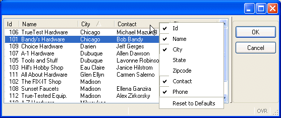

[Back to Summary](TutIndex.html)

------------------------------------------------------------------------

# Tutorial Chapter 7: Array Display

Summary:

- [Defining the Form](#DefiningForm)
  - [Screen Arrays](#ScreenArray)
  - [Table Container](#TABLECONTAINER)
  - [Instructions Section](#INSTRUCTIONS)
- [Form example: manycust.per](#formexample)
- [Creating the Function](#CreatingFunction)
  - [Program Arrays](#ProgramArray)
  - [Loading the Array: FOREACH](#FOREACH)
  - [The DISPLAY ARRAY Statement](#DISPLAYARRAY)
- [The DISPLAY ARRAY Statement](#DISPLAYARRAY)
  - [The COUNT attribute](#COUNTattribute)
  - [The ARR_CURR function](#ARR_CURRfunction)
- [Example: library function to display an Array](#libexample)
- [Compiling and using a library](#Compiling)
- [Paged mode of DISPLAY ARRAY](#PagedMode)

------------------------------------------------------------------------

Unlike the previous programs, this example displays multiple customer
records at once.  The program defines a [program array](Arrays.html) to
hold the records, and displays the records in a form containing a
[TABLE](FormSpecFiles.html#FF_CONTAINER_TABLE) and a [screen
array](FormSpecFiles.html#SECTION_INSTRUCTIONS).  The user can scroll
through the records in the table, sort the table by a specific column,
and hide or display columns.

This example is written as a library function so it can be used in
multiple programs. This type of code re-use maximizes your programming
efficiency. As you work through the examples in the other tutorial
lessons, look for additional candidates for library functions.

{border="0" width="557" height="234"}

                                   Display on Windows platform

In the illustration, the table is sorted by City.  A right mouse click
has displayed a dropdown list of the columns, with check boxes allowing
the user to hide or show a specific column. After the user validates the
row selected, the store number and store name are returned to the
calling function.

To implement this type of scrolling display, the example must:

- Create a [form specification file](FormSpecFiles.html) containing a
  [screen array](FormSpecFiles.html#SECTION_INSTRUCTIONS) of screen
  records
- Define an [program array](Arrays.html) of records, each record having
  members that correspond to the fields of the [screen
  records](FormSpecFiles.html#SECTION_INSTRUCTIONS).

The function will use the [DISPLAY ARRAY](DisplayArray.html) statement
to display all the records in the [program array](Arrays.html)  into the
rows of the [screen array](FormSpecFiles.html#SECTION_INSTRUCTIONS).
Typically the [program array](Arrays.html) has many more rows of data
than will fit on the screen.

------------------------------------------------------------------------

## [Defining the Form]{#DefiningForm}

### [Screen Array]{#ScreenArray}s

A [screen array](FormSpecFiles.html#SECTION_INSTRUCTIONS) is usually a
repetitive array of fields in the
[LAYOUT](FormSpecFiles.html#SECTION_LAYOUT) section of a form
specification, each containing identical groups of screen fields. Each
"row" of a screen array is a [screen
record](FormSpecFiles.html#SECTION_INSTRUCTIONS). Each "column" of a
[screen array](FormSpecFiles.html#SECTION_INSTRUCTIONS) consists of
fields with the same [item tag](TutChap03.html#LAYOUTSection) in the
[LAYOUT](FormSpecFiles.html#SECTION_LAYOUT) section of the form
specification file. You must declare screen arrays in the
[INSTRUCTIONS](FormSpecFiles.html#SECTION_INSTRUCTIONS) section.

### [TABLE Containers]{#TABLECONTAINER}

The [TABLE](FormSpecFiles.html#FF_CONTAINER_TABLE) container in a form
defines the presentation of a list of records, bound to a [screen
array](FormSpecFiles.html#SECTION_INSTRUCTIONS). When this layout
container is used with curly braces defining the container area, the
position of the static labels and [item
tags](TutChap03.html#LAYOUTSection) is automatically detected by the
form compiler to build a graphical object displaying a list of records.

The first line of the [TABLE](FormSpecFiles.html#FF_CONTAINER_TABLE)
area contains text entries defining the column titles.  The second  line
contains field [item tags](TutChap03.html#LAYOUTSection) that define the
columns of the table receiving the data. This line is repeated to allow
the display of multiple records at once.

The user can sort the rows displayed in the form table by a mouse-click
on the title of the column that is to be used for the sort. This sort is
performed on the client side only.  The columns and the entire form can
be stretched and re-sized.  A right-mouse-click on a column title
displays a dropdown list-box of column names, with radio buttons
allowing the user to indicate whether a specific column is to be hidden
or shown.

### [The INSTRUCTIONS section]{#INSTRUCTIONS}

You must declare a [screen
array](FormSpecFiles.html#SECTION_INSTRUCTIONS) in the
[INSTRUCTIONS](FormSpecFiles.html#SECTION_INSTRUCTIONS) section of the
form with the [SCREEN RECORD](FormSpecFiles.html#SECTION_INSTRUCTIONS)
keyword. You can reference the names of the screen array in the [DISPLAY
ARRAY](DisplayArray.html) statement of  the program.

------------------------------------------------------------------------

## [Form example]{#formexample}: manycust.per

+-------------------------------------------------------------------------+
| **Module** **custmain.4gl**                                             |
+-------------------------------------------------------------------------+
| ``` linenumber                                                          |
| 01 SCHEMA custdemo                                                      |
| 02                                                                      |
| 03 LAYOUT                                                               |
| 04  TABLE                                                               |
| 05  {                                                                   |
| 06   Id   Name           ...   Zipcode   Contact          Phone         |
| 07  [f01][f02           ]     [f05     ][f06            ][f07         ] |
| 08  [f01][f02           ]     [f05     ][f06            ][f07         ] |
| 09  [f01][f02           ]     [f05     ][f06            ][f07         ] |
| 10  [f01][f02           ]     [f05     ][f06            ][f07         ] |
| 11  [f01][f02           ]     [f05     ][f06            ][f07         ] |
| 12  [f01][f02           ]     [f05     ][f06            ][f07         ] |
| 13  }                                                                   |
| 14  END                                                                 |
| 15 END                                                                  |
| 16                                                                      |
| 17 TABLES                                                               |
| 18   customer                                                           |
| 19 END                                                                  |
| 20                                                                      |
| 21 ATTRIBUTES                                                           |
| 22 EDIT f01=customer.store_num;                                         |
| 23 EDIT f02=customer.store_name;                                        |
| 24 EDIT f03=customer.city;                                              |
| 25 EDIT f04=customer.state;                                             |
| 26 EDIT f05=customer.zipcode;                                           |
| 27 EDIT f06=customer.contact_name;                                      |
| 28 EDIT f07=customer.phone;                                             |
| 29 END                                                                  |
| 30                                                                      |
| 31 INSTRUCTIONS                                                         |
| 32 SCREEN RECORD sa_cust (customer.*);                                  |
| 33 END                                                                  |
| ```                                                                     |
+-------------------------------------------------------------------------+

#### Notes:

In order to fit on the page, the layout section of the form is
truncated, not displaying the city and state columns.

- Line ` 01`{.linenumber} The **custdemo** schema will be used by the
  compiler to determine the [data types](DataTypes.html) of the [form
  fields](FormSpecFiles.html#FF_FORM_FIELD).
- Line ` 06`{.linenumber} contains the titles for the columns in the
  [TABLE](FormSpecFiles.html#FF_CONTAINER_TABLE).
- Lines ` 07`{.linenumber} thru ` 12`{.linenumber} define the display
  area for the [screen
  records](FormSpecFiles.html#SECTION_INSTRUCTIONS).  These rows must be
  identical in a TABLE. (The fields for **city** and **state** are
  indicated by **\....** so the layout will fit on this page.)
- Line ` 21`{.linenumber} thru ` 29`{.linenumber} In the
  [ATTRIBUTES](FormSpecFiles.html#SECTION_ATTRIBUTES) section the field
  [item tags](TutChap03.html#LAYOUTSection) are linked to the field
  description. Although there are multiple occurrences of each item tags
  in the form, the description is listed only once for each unique field
  item tag.
- Line ` 32`{.linenumber} defines the [screen
  array](FormSpecFiles.html#SECTION_INSTRUCTIONS) in the
  [INSTRUCTIONS](FormSpecFiles.html#SECTION_INSTRUCTIONS) section. The
  screen record must contain the same number of elements as the records
  in the TABLE container. This example defines the screen record with
  all fields defined with the **customer** prefix, but you can list each
  field name individually.

------------------------------------------------------------------------

## [Creating the Function]{#CreatingFunction}

### [Program Array]{#ProgramArray}s

A [program array](Arrays.html)  is an ordered set of elements all of the
same data type. You can create one-, two-, or three-dimensional arrays.
The elements of the array can be simple types or they can be records.

Arrays can be:

- [static](Arrays.html) -  defined with an explicit size for all
  dimensions.
- [dynamic](Arrays.html) - has a variable size.  Dynamic arrays have no
  theoretical size limit.

All elements of static arrays are initialized even if the array is not
used. Therefore, defining huge static arrays may use a lot of memory.
The elements of dynamic arrays are allocated automatically by the
runtime system, as needed.

Example of a dynamic array of records definition:

``` linenumber
01 DEFINE cust_arr DYNAMIC ARRAY OF RECORD 
02                    store_num LIKE customer.store_num,
03                    city      LIKE customer.city
04                  END RECORD
```

This [array variable](Variables.html#STRUCTURED) is named **cust_arr**;
each element of the array contains the members **store_num** and
**city**.  The size of the [array](Arrays.html) will be determined by
the runtime system, based on the program logic that is written to fill
the array.  The first element of any array is indexed with subscript 1.
You would access the **store_num** member of the 10th element of the
array by writing **cust_arr\[10\].store_num**. 

### [Loading the Array:]{#FOREACH} the FOREACH Statement

To load the [program array](Arrays.html) in the example, you must
retrieve the values from the result set of a query and load them into
the elements of the array. You must
[DECLARE](ResultSets.html#RS_DECLARE) the cursor before the FOREACH
statement can retrieve the rows.The
[FOREACH](ResultSets.html#RS_FOREACH) statement is equivalent to using
the [OPEN](ResultSets.html#RS_OPEN), [FETCH](ResultSets.html#RS_FETCH)
and [CLOSE](ResultSets.html#RS_CLOSE) statements to retrieve and process
all the rows selected by a query, and is especially useful when loading
arrays.

``` linenumber
01  DECLARE custlist_curs CURSOR FOR 
02        SELECT store_num, city FROM customer
03  CALL cust_arr.clear()
04  FOREACH custlist_curs INTO cust_rec.*
05      CALL cust_arr.appendElement()
06     LET cust_arr[cust_arr.getLength()].* = cust_rec.*
07   END FOREACH 
```

The [FOREACH](ResultSets.html#RS_FOREACH) statement shown above:

1.  Opens the **custlist_curs** [cursor](ResultSets.html#RESULTSET).
2.  Clears the **cust_arr** array.
3.  Fetches a row into the record **cust_rec**. This record must be
    defined as having the same structure as a single element of the
    **cust_arr** array (store_num, city).
4.  Appends an empty element to the **cust_arr** array.
5.  Copies the cust_rec record into the
    [array](Variables.html#STRUCTURED) **cust_arr** using the getLength
    method  to determine the index of the element that was newly
    appended to the array.
6.  Repeats steps 3, 4 and 5 until no more rows are retrieved from the
    database table (automatically checks for the
    [NOTFOUND](Programs.html#PC_NOTFOUND) condition).  
7.  Closes the cursor and exits from the
    [FOREACH](ResultSets.html#RS_FOREACH) loop.

### [The DISPLAY ARRAY Statement]{#DISPLAYARRAY}

The [DISPLAY ARRAY](DisplayArray.html) statement lets the user view the
contents of an [array](Variables.html#STRUCTURED) of records, scrolling
through the display, but the user cannot change them.

#### The [COUNT attribute]{#COUNTattribute}

- With static arrays

> When using a static array, the number of rows to be displayed is
> defined by the [COUNT](DisplayArray.html)  attribute. If you do not
> use the COUNT attribute, the runtime system cannot determine how much
> data to display, and so the [screen
> array](FormSpecFiles.html#SECTION_INSTRUCTIONS) remains empty.

- With dynamic arrays

> When using a dynamic array, the number of rows to be displayed is
> defined by the number of elements in the dynamic array; the COUNT
> attribute is ignored.

#### Example:

``` linenumber
01   DISPLAY ARRAY cust_arr TO sa_cust.*
```

This statement will display the [program array](Arrays.html)
**cust_arr** to the [form fields](FormSpecFiles.html#FF_FORM_FIELD)
defined in the **sa_cust** [screen
array](FormSpecFiles.html#SECTION_INSTRUCTIONS) of the form.

By default, the [DISPLAY ARRAY](DisplayArray.html) statement does not
terminate until the user accepts or cancels the dialog; the Accept and
Cancel [actions](TutChap04.html#PredefinedActions) are predefined and
display on the form. Your program can accept the dialog instead, using
the [ACCEPT DISPLAY](DisplayArray.html#CONTROL_INSTRUCTIONS)
instruction.

#### The [ARR_CURR function]{#ARR_CURRfunction}

When the user accepts or cancels a dialog, the
[ARR_CURR](BuiltInFunctions.html#BF_ARR_CURR) built-in function returns
the index (subscript number) of the row in the [program
array](Arrays.html) that was selected (current).

------------------------------------------------------------------------

### [Example Library module: cust_lib.4gl]{#libexample}

+-----------------------------------------------------------------------+
| **Module** **cust_lib.4gl**                                           |
+-----------------------------------------------------------------------+
| ``` linenumber                                                        |
| 01 SCHEMA custdemo                                                    |
| 02                                                                    |
| 03 FUNCTION display_custarr()                                         |
| 04                                                                    |
| 05   DEFINE cust_arr DYNAMIC ARRAY OF RECORD                          |
| 06          store_num    LIKE customer.store_num,                     |
| 07          store_name   LIKE customer.store_name,                    |
| 08          city         LIKE customer.city,                          |
| 09          state        LIKE customer.state,                         |
| 10          zipcode      LIKE customer.zipcode,                       |
| 11          contact_name LIKE customer.contact_name,                  |
| 12          phone        LIKE customer.phone                          |
| 13    END RECORD,                                                     |
| 14    cust_rec RECORD                                                 |
| 15          store_num    LIKE customer.store_num,                     |
| 16          store_name   LIKE customer.store_name,                    |
| 17          city         LIKE customer.city,                          |
| 18          state        LIKE customer.state,                         |
| 19          zipcode      LIKE customer.zipcode,                       |
| 20          contact_name LIKE customer.contact_name,                  |
| 21          phone        LIKE customer.phone                          |
| 22    END RECORD,                                                     |
| 23    ret_num LIKE customer.store_num,                                |
| 24    ret_name LIKE customer.store_name,                              |
| 25    curr_pa SMALLINT                                                |
| 26                                                                    |
| 27    OPEN WINDOW wcust WITH FORM "manycust"                          |
| 28                                                                    |
| 29    DECLARE custlist_curs CURSOR FOR                                |
| 30      SELECT store_num,                                             |
| 31            store_name,                                             |
| 32            city,                                                   |
| 33            state,                                                  |
| 34            zipcode,                                                |
| 35            contact_name,                                           |
| 36            phone                                                   |
| 37        FROM customer                                               |
| 38        ORDER BY store_num                                          |
| 39                                                                    |
| 40                                                                    |
| 41   CALL cust_arr.clear()                                            |
| 42   FOREACH custlist_curs INTO cust_rec.*                            |
| 43    CALL cust_arr.appendElement()                                   |
| 44    LET cust_arr[cust_arr.getLength()].* = cust_rec.*               |
| 45   END FOREACH                                                      |
| 46                                                                    |
| 47   LET ret_num = 0                                                  |
| 48   LET ret_name = NULL                                              |
| 49                                                                    |
| 50   IF (cust_arr.getLength() > 0) THEN                               |
| 51    DISPLAY ARRAY cust_arr TO sa_cust.*                             |
| 52    IF (NOT INT_FLAG) THEN                                          |
| 53       LET curr_pa = arr_curr()                                     |
| 54       LET ret_num = cust_arr[curr_pa].store_num                    |
| 55       LET ret_name = cust_arr[curr_pa].store_name                  |
| 56    END IF                                                          |
| 57                                                                    |
| 58                                                                    |
| 59   CLOSE WINDOW wcust                                               |
| 60   RETURN ret_num, ret_name                                         |
| 61                                                                    |
| 62 END FUNCTION                                                       |
| ```                                                                   |
+-----------------------------------------------------------------------+

**Notes:**

- Lines `05 `{.linenumber}thru ` 13 `{.linenumber}define a local
  [program array](Arrays.html), **cust_arr**.
- Lines `14 `{.linenumber}thru `22 `{.linenumber}define a local [program
  record](Variables.html), **cust_rec**. This record is used as
  temporary storage for the row data retrieved by the FOREACH loop in
  line 42.
- Lines `23 `{.linenumber}and `24 `{.linenumber}define local
  [variables](Variables.html) to hold the store number and name values
  to be returned to the calling function.
- Line `25`{.linenumber} defines a [variable](Variables.html) to store
  the value of the program array index.
- Line `27`{.linenumber} opens a window with the form containing the
  [array](Arrays.html).
- Lines `29`{.linenumber} thru `38`{.linenumber}
  [DECLARE](ResultSets.html#RS_DECLARE) the
  [cursor](ResultSets.html#RESULTSET) **custlist_curs** to retrieve the
  rows from the customer table. 
- Line `40`{.linenumber} sets the variable **idx** to 0, this variable
  will be incremented in the FOREACH loop.
- Line `41`{.linenumber} clear the dynamic array.
- Line `42 uses `{.linenumber}FOREACH to retrieve each row from the
  result set into the program record, **cust_rec**. 
- Lines `43`{.linenumber} thru `44`{.linenumber} are executed for each
  row that is retrieved by the FOREACH. They append a new element to the
  array cust_arr, nd transfer the data from the program record into new
  element, using the method getLength to identify the index of the
  element.  When  the [FOREACH](ResultSets.html#RS_FOREACH) statement
  has retrieved all the rows the [cursor](ResultSets.html#RESULTSET) is
  closed and the FOREACH is exited.
- Lines `47`{.linenumber} and `48`{.linenumber}  Initialize the
  variables used to return the customer number and customer name.
- Lines `50`{.linenumber} thru `57`{.linenumber}  If the length of the
  **cust_arr** array is greater than 0, the
  [FOREACH](ResultSets.html#RS_FOREACH) statement did retrieve some
  rows. 
- Line `52`{.linenumber} [DISPLAY ARRAY](DisplayArray.html) turns
  control over to the user, and waits for the user to accept or cancel
  the dialog.  
- Line `52`{.linenumber} The [INT_FLAG](Programs.html#PV_INT_FLAG)
  variable is tested to check if the user validated the dialog.
- Line `53`{.linenumber} If the user has validated the dialog, the
  built-in function [ARR_CURR](BuiltInFunctions.html#BF_ARR_CURR) is
  used to store the index for the [program array](Arrays.html) element
  the user had selected (corresponding to the highlighted row in the
  [screen array](FormSpecFiles.html#SECTION_INSTRUCTIONS)) in the
  variable **curr_pa**.
- Lines `54`{.linenumber} and `55`{.linenumber} The variable **curr_pa**
  is used  to retrieve the current values of **store_num** and
  **store_name** from the program array and store them in the
  [variables](Variables.html) **ret_num** and **ret_name**.
- Line `59`{.linenumber} closes the window.
- Line `60`{.linenumber} returns **ret_num** and **ret_name** to the
  calling function.

------------------------------------------------------------------------

## [Compiling and using a Library]{#Compiling}

Since this is a [function](Functions.html) that could be used by other
programs that reference the **customer** table, the function will be
[compiled](Tools.html#TL_FGLCOMP) into a library.  The library can then
be linked into any program, and the function called.  The function will
always return **store_num** and **store_name**.  If the
[FOREACH](ResultSets.html#RS_FOREACH) fails, or returns no rows, the
calling program will have a **store_num** of zero and a NULL
**store_name** returned.

The function is contained in a file named **cust_lib.4gl**.  This file
would usually contain additional [library](Tools.html#TL_FGLCOMP)
functions. To compile (and link, if there were additional .4gl files to
be included in the library):

         fgl2p -o cust_lib.42x cust_lib.4gl

Since a library has no [MAIN](Programs.html#MAIN_BLOCK) function, we
will need to create a small stub program if we want to test the library
function independently.  This program contains the minimal functionality
to test the function.

### Example: cust_stub.4gl

+-----------------------------------------------------------------------+
| **Module cust_stub.4gl**                                              |
+-----------------------------------------------------------------------+
| ``` linenumber                                                        |
| 01 SCHEMA custdemo                                                    |
| 02                                                                    |
| 03 MAIN                                                               |
| 04   DEFINE store_num  LIKE customer.store_num,                       |
| 05         store_name LIKE customer.store_name                        |
| 06                                                                    |
| 07  DEFER INTERRUPT                                                   |
| 08  CONNECT TO "custdemo"                                             |
| 09  CLOSE WINDOW SCREEN                                               |
| 10                                                                    |
| 11  CALL display_custarr()                                            |
| 12            RETURNING store_num, store_name                         |
| 13  DISPLAY store_num, store_name                                     |
| 14                                                                    |
| 15  DISCONNECT CURRENT                                                |
| 16                                                                    |
| 17 END MAIN                                                           |
| ```                                                                   |
+-----------------------------------------------------------------------+

**Notes:**

- Lines `04`{.linenumber} and ` 05`{.linenumber} define variables to
  hold the values returned by the display_custarr function.
- Lines `07`{.linenumber} thru `09`{.linenumber} are required simply for
  the test program, to set the program up and connect to the database.
- Line `11`{.linenumber} calls the library function **display_custarr**.
- Line `13`{.linenumber} displays  the returned values to standard
  output for the purposes of the test.

Now we can compile the form file and the test program, and link the
library, and then test to see if it works properly.

         fglform manycust.per

         fgl2p -o test.42r cust_stub.4gl cust_lib.42x

         fglrun test.42r                                                                                                              

------------------------------------------------------------------------

## [Paged Mode of DISPLAY ARRAY]{#PagedMode}

The previous example retrieves all the rows from the customer table into
the [program array](Arrays.html) prior to the data being displayed by
the [DISPLAY ARRAY](DisplayArray.html) statement. Using this full list
mode, you must copy into the array all the data you want to display. 
Using the DISPLAY ARRAY statement in
\"[paged](DisplayArray.html#PAGEDMODE)\" mode allows you to provide data
rows dynamically during the dialog, using a dynamic array to hold one
page of data.

The following example modifies the program to use a [SCROLL
CURSOR](ResultSets.html) to retrieve only the **store_num** values from
the customer table. As the user scrolls thru the [result
set](ResultSets.html), statements in the ON FILL BUFFER clause of the
[DISPLAY ARRAY](DisplayArray.html) statement are used to retrieve and
display the remainder of each row, a page of data at a time.  This helps
to minimize the possibility that the rows have been changed, since the
rows are re-selected immediately prior to the page being displayed.

### What is the \"Paged mode\"?

A \"page\" of data is the total number of  rows of data  that can be
displayed in the form at one time.  The length of a page can change
dynamically, since the user has the option of re-sizing the window
containing the form.  The run-time system automatically keeps track of
the current length of a page.

The [ON FILL BUFFER](DisplayArray.html#PAGEDMODE) clause feeds the
[DISPLAY ARRAY](DisplayArray.html) instruction with pages of data. The
following [built-in functions](BuiltInFunctions.html) are used in the ON
FILL BUFFER clause to provide the rows of data for the page:

- [FGL_DIALOG_GETBUFFER
  START()](BuiltInFunctions.html#BF_FGL_DIALOG_GETBUFFERSTART) -
  retrieves the offset in the [SCROLL CURSOR](ResultSets.html) result
  set, and is used to determine the starting point for retrieving and
  displaying the complete rows.
- [FGL_DIALOG_GETBUFFERLENGTH()](BuiltInFunctions.html#BF_FGL_DIALOG_GETBUFFERLENGTH) -
  retrieves the current length of the page, and is used to determine the
  number of rows that must be provided.

The statements in the ON FILL BUFFER clause of [DISPLAY
ARRAY](DisplayArray.html) are executed automatically by the runtime
system each time a new page of data is needed.  For example, if the
current size of the window indicates that ten rows can be displayed at
one time,  the statements in the ON FILL BUFFER clause will
automatically maintain the [dynamic array](Arrays.html) so that the
relevant ten rows are retrieved and/or displayed as the user scrolls up
and down through the table on the form.  If the window is re-sized by
the user, the statements in the ON FILL BUFFER clause will automatically
retrieve and display the new number of rows.

### [AFTER DISPLAY block]{#AFTERDISPLAY}

The [AFTER DISPLAY](DisplayArray.html) block is executed one time, after
the user has accepted or canceled the dialog, but before executing the
next statement in the program.  In this program, the statements in this
block determine the current position of the
[cursor](ResultSets.html#RESULTSET) when user pressed OK or Cancel, so
the correct store number and name can be returned to the calling
[function](Functions.html).

------------------------------------------------------------------------

## Example of paged mode

In the first example, the records in the customer table are loaded into
the [program array](Arrays.html) and the user uses the form to scroll
through the program array. In this example, the user is actually
scrolling through the [result set](ResultSets.html) created by a 
[SCROLL CURSOR](ResultSets.html).  This  SCROLL CURSOR retrieves only
the store number, and another SQL [SELECT](StaticSql.html#SS_SELECT)
statement is used to retrieve the remainder of the row as needed.

+-----------------------------------------------------------------------+
| **Module cust_lib2.4gl**                                              |
+-----------------------------------------------------------------------+
| ``` linenumber                                                        |
| 01 SCHEMA custdemo                                                    |
| 02                                                                    |
| 03 FUNCTION display_custarr()                                         |
| 04                                                                    |
| 05  DEFINE cust_arr DYNAMIC ARRAY OF RECORD                           |
| 06         store_num     LIKE customer.store_num,                     |
| 07         store_name    LIKE customer.store_name,                    |
| 08         city          LIKE customer.city,                          |
| 09         state         LIKE customer.state,                         |
| 10         zipcode       LIKE customer.zipcode,                       |
| 11         contact_name  LIKE customer.contact_name,                  |
| 12         phone         LIKE customer.phone                          |
| 13     END RECORD,                                                    |
| 14     ret_num      LIKE customer.store_num,                          |
| 15     ret_name     LIKE customer.store_name,                         |
| 16     ofs, len, i  SMALLINT,                                         |
| 17      sql_text     STRING,                                          |
| 18      rec_count    SMALLINT,                                        |
| 19      curr_pa      SMALLINT                                         |
| 20                                                                    |
| 21  OPEN WINDOW wcust WITH FORM "manycust"                            |
| 22                                                                    |
| 23  LET rec_count = 0                                                 |
| 24  SELECT COUNT(*) INTO rec_count FROM customer                      |
| 25  IF (rec_count == 0) THEN                                          |
| 26     RETURN 0, NULL                                                 |
| 27  END IF                                                            |
| 28                                                                    |
| 29  LET sql_text =                                                    |
| 30     "SELECT store_num, store_name, city,"                          |
| 31     || " state, zipcode, contact_name,"                            |
| 32     || " phone"                                                    |
| 33     || " FROM customer WHERE store_num = ?"                        |
| 34  PREPARE rec_all FROM sql_text                                     |
| 35                                                                    |
| 36  DECLARE num_curs SCROLL CURSOR FOR                                |
| 37         SELECT store_num FROM customer                             |
| 38  OPEN num_curs                                                     |
| 39                                                                    |
| 40  DISPLAY ARRAY cust_arr TO sa_cust.*                               |
| 41       ATTRIBUTES(UNBUFFERED, COUNT=rec_count)                      |
| 42                                                                    |
| 43     ON FILL BUFFER                                                 |
| 44      LET ofs = FGL_DIALOG_GETBUFFERSTART()                         |
| 45      LET len = FGL_DIALOG_GETBUFFERLENGTH()                        |
| 46      FOR i = 1 TO len                                              |
| 47        WHENEVER ERROR CONTINUE                                     |
| 48        FETCH ABSOLUTE ofs+i-1 num_curs                             |
| 49                    INTO cust_arr[i].store_num                      |
| 50         EXECUTE rec_all INTO cust_arr[i].*                         |
| 51                 USING cust_arr[i].store_num                        |
| 52        WHENEVER ERROR STOP                                         |
| 53        IF (SQLCA.SQLCODE = NOTFOUND) THEN                          |
| 54          MESSAGE "Row deleted" by another user."                   |
| 55          CONTINUE FOR                                              |
| 56        ELSE                                                        |
| 57          IF (SQLCA.SQLCODE < 0) THEN                               |
| 58            ERROR SQLERRMESSAGE                                     |
| 59            CONTINUE FOR                                            |
| 60          END IF                                                    |
| 61        END IF                                                      |
| 62      END FOR                                                       |
| 62                                                                    |
| 64     AFTER DISPLAY                                                  |
| 65      IF (INT_FLAG) THEN                                            |
| 66         LET ret_num = 0                                            |
| 67         LET ret_name = NULL                                        |
| 68      ELSE                                                          |
| 69         LET curr_pa = ARR_CURR()- ofs + 1                          |
| 70         LET ret_num = cust_arr[curr_pa].store_num                  |
| 71         LET ret_name = cust_arr[curr_pa].store_name                |
| 72      END IF                                                        |
| 73                                                                    |
| 74  END DISPLAY                                                       |
| 75                                                                    |
| 76  CLOSE num_curs                                                    |
| 77  FREE num_curs                                                     |
| 78  FREE rec_all                                                      |
| 79                                                                    |
| 80  CLOSE WINDOW wcust                                                |
| 81  RETURN ret_num, ret_name                                          |
| 82                                                                    |
| 83 END FUNCTION                                                       |
| ```                                                                   |
+-----------------------------------------------------------------------+

**Notes:**

- Lines `16`{.linenumber} thru `19`{.linenumber} define some new
  [variables](Variables.html) to be used, including **cont_disp** to
  indicate whether the function should continue.

- Line `24`{.linenumber} uses an embedded [SQL
  statement](StaticSql.html) to store the total number of rows in the
  customer table in the variable **rec_count**.

- Lines `25`{.linenumber} thru `27`{.linenumber} If the total number of
  rows is zero, function returns immediately 0 and NULL.

- Lines `29`{.linenumber} thru `33`{.linenumber} contain the text of an
  SQL [SELECT](StaticSql.html#SS_SELECT) statement to retrieve values
  from a single row in the **customer** table. The **?** placeholder
  will be replaced with the store number when the statement is
  executed.  This text is assigned to a
  [STRING](DataTypes.html#DT_STRING) variable, **sql_text**.

- Line `34`{.linenumber} uses the SQL
  [PREPARE](DynamicSql.html#DS_PREPARE) statement to convert the
  [STRING](DataTypes.html#DT_STRING) into an executable statement,
  **rec_all**.  This statement will be executed when needed, to populate
  the rest of the values in the row of the [program array](Arrays.html).

- Lines `36`{.linenumber} thru `37`{.linenumber}
  [DECLARE](ResultSets.html#RS_DECLARE) a  [SCROLL
  CURSOR](ResultSets.html) **num_curs** to retrieve only the store
  number from the customer table.

- Line `38`{.linenumber} opens the  [SCROLL CURSOR](ResultSets.html)
  **num_curs**.

- Lines `40`{.linenumber} and `41`{.linenumber} call the [DISPLAY
  ARRAY](DisplayArray.html) statement, providing the
  [COUNT](DisplayArray.html) to let the statement know the total number
  of rows in the SQL result set.

- Lines `43`{.linenumber} thru `62`{.linenumber} contain the logic for
  the ON FILL BUFFER clause of the [DISPLAY ARRAY](DisplayArray.html)
  statement.  This control block will be executed automatically whenever
  a new page of data is required.

- Line `44`{.linenumber} uses the [built-in
  function](BuiltInFunctions.html) to get the offset for the page, the
  starting point for the retrieval of rows, and stores it in the
  [variable](Variables.html) **ofs**.

- Line `45`{.linenumber} uses the [built-in
  function](BuiltInFunctions.html) to get the page length, and stores it
  in the [variable](Variables.html) **len**.

- Lines `46`{.linenumber} thru `62`{.linenumber} contain a
  [FOR](FlowControl.html#FC_FOR) loop to populate each row in the page
  with values from the customer table.  The [variable](Variables.html)
  **i** is incremented to populate successive rows.  The first value of
  **i** is 1.

- Lines `48`{.linenumber} and `49`{.linenumber} use the [SCROLL
  CURSOR](ResultSets.html) **num_curs** with the syntax [FETCH
  ABSOLUTE](ResultSets.html#RS_FETCH) **\<***row_number***\>** to
  retrieve the store number from a specified row in the [result
  set,](ResultSets.html) and to store it in row **i** of the [program
  array](Arrays.html). Since **i** was started at 1, the following
  calculation is used to determine the row number of the row to be
  retrieved:

         (Offset for the page) PLUS i MINUS 1 

> Notice that rows 1 thru (*page\_ length*) of the [program
> array](Arrays.html) are filled each time a new page is required.

- Lines `50`{.linenumber} and `51`{.linenumber} execute the
  [prepared](DynamicSql.html#DS_PREPARE) statement **rec_all** to
  retrieve the rest of the values for row **i** in the [program
  array](Arrays.html), using the store number retrieved by the  [SCROLL
  CURSOR](ResultSets.html).  Although this statement is within the
  [FOR](FlowControl.html#FC_FOR) loop, it was prepared earlier in the
  program, outside of the loop, to avoid unnecessary re-processing each
  time the loop is executed.

- Lines `53`{.linenumber} thru `61`{.linenumber} test whether fetching
  the entire row was successful. If not, a message is displayed to the
  user, and the CONTINUE FOR instruction continues the
  [FOR](FlowControl.html#FC_FOR) loop with the next iteration.

- Lines `64`{.linenumber} thru `72`{.linenumber} use an [AFTER
  DISPLAY](DisplayArray.html) statement to get the row number of the row
  in the array that the user had selected.  If the dialog was cancelled,
  **ret_num** is set to 0 and **ret_name** is set to blanks.  Otherwise
  the values of **ret_num** and **ret_name** are set based on the row
  number.  The row number in the  [SCROLL CURSOR](ResultSets.html)
  result set does not correlate directly to the [program
  array](Arrays.html) number,  because the program array was filled
  starting at row 1 each time.  So the following calculation is used to
  return the correct row number of the program array:

        (Row number returned by ARR_CURR) MINUS 
                        (Offset for the page) PLUS 1

- Line `74`{.linenumber} is the end of the [DISPLAY
  ARRAY](DisplayArray.html) statement.

- Lines ` 76`{.linenumber} and `77`{.linenumber} close and free the
  cursor.

- Line `78`{.linenumber} frees the prepared statement.

- Line `81`{.linenumber} closes the window.

- Line `82`{.linenumber} returns the values of the
  [variables](Variables.html) **ret_num** and **ret_name** to the
  calling function.
