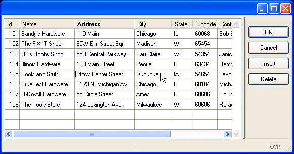

[Back to Summary](TutIndex.html)

------------------------------------------------------------------------

# Tutorial Chapter 8: Array Input

Summary:

- [INPUT ARRAY statement](#INPUTARRAY)
- [WITHOUT DEFAULTS clause](#WITHOUT_DEFAULTS)
- [The UNBUFFERED attribute](#UNBUFFERED)
- [COUNT and MAXCOUNT attributes](#COUNT)
- [Control Blocks](#ControlBlocks)
- [Built-in Functions  - ARR_CURR()](#ARR_CURR)
- [Predefined Actions - insert and delete](#PredefinedActions)
- [Example: Using a Screen Array to Modify Data](#Example)
  - [Form Specification File](#FormFile)
  - [The Main Block](#MainBlock)
  - [Function load_custall](#Function_load_custall)
  - [Function inparr_custall](#Function_inparr_custall)
  - [Function store_num_ok](#Function_store_num_ok)
  - [Function insert_cust](#Function_insert_cust)
  - [Function update_cust](#Function_update_cust)
  - [Function delete_cust](#Function_delete_cust)

------------------------------------------------------------------------

This program uses a form and a screen array to allow the user to view
and change multiple records of a program array at once.  The [INPUT
ARRAY](InputArray.html) statement and its control blocks are used by the
program to control and monitor the changes made by the user to the
records. As each record in the program array is Added, Updated, or
Deleted,  the program logic makes corresponding changes in the rows of
the **customer** database table.

The example window shown below has been re-sized to fit on this page.

{border="0" width="581" height="305"}

                                             Display on Windows platform

------------------------------------------------------------------------

## [The INPUT ARRAY statement]{#INPUTARRAY}

The [INPUT ARRAY](InputArray.html) statement supports data entry by
users into a [screen array](FormSpecFiles.html#SECTION_INSTRUCTIONS),
and stores the entered data in a [program array](Arrays.html) of
records. During the INPUT ARRAY execution, the user can edit or delete
existing records, insert new records, and move inside the list of
[records](TutChap03.html#definerecord).  The program can then use the
[INSERT](StaticSql.html#SS_INSERT), [DELETE](StaticSql.html#SS_DELETE)
or [UPDATE](StaticSql.html#SS_UPDATE) SQL statements to modify the
appropriate database tables. The INPUT ARRAY statement does not
terminate until the user validates or cancels the dialog.

       INPUT ARRAY cust_arr WITHOUT DEFAULTS FROM sa_cust.* 
            ATTRIBUTES (UNBUFFERED)

The example INPUT ARRAY statement binds the screen array fields in
**sa_cust **to the member records of the program array **cust_arr**. The
number of [variables](Variables.html) in each record of the program
array must be the same as the number of
[fields](FormSpecFiles.html#FF_FORM_FIELD) in each [screen
record](FormSpecFiles.html#SECTION_INSTRUCTIONS) (that is, in a single
row of the screen array). Each mapped variable must have the same [data
type](DataTypes.html) or a compatible data type as the corresponding
field.

## [WITHOUT DEFAULTS clause]{#WITHOUT_DEFAULTS}

The [WITHOUT DEFAULTS](TutChap06.html#WITHOUTDEFAULTS) clause prevents
BDL from displaying any default values that have been defined for form
fields. You must use this clause if you want to see the values of the
program array.

## [The UNBUFFERED attribute]{#UNBUFFERED}

As in the [INPUT](RecordInput.html#SYNTAX) statement, when the
[UNBUFFERED](InputArray.html) attribute is used, the [INPUT
ARRAY](InputArray.html) statement is sensitive to program variable
changes. If you need to display new data during the execution, use the
UNBUFFERED attribute and assign the values to the [program
array](Arrays.html) row; the runtime system will automatically display
the values to the screen.  This sensitivity applies to [ON
ACTION](InputArray.html) control blocks, as well.

## [COUNT and MAXCOUNT attribute]{#COUNT}s

Some other attributes that can be used with an [INPUT
ARRAY](InputArray.html) statement are:

- The [COUNT](InputArray.html) attribute of INPUT ARRAY defines the
  number of valid rows in the [program array](Arrays.html) to be 
  displayed as default rows.
  - When using a static array, if you do not use the COUNT attribute,
    the runtime system cannot determine how much data to display, so the
    [screen array](FormSpecFiles.html#SECTION_INSTRUCTIONS) remains
    empty.
  - When using a [dynamic array](Arrays.html), the COUNT attribute is
    ignored: The number of elements in the dynamic array is used.
- The [MAXCOUNT](InputArray.html) attribute defines the maximum number
  of data rows that can be entered in the program array. In a [dynamic
  array](Arrays.html), the user can enter an infinite number of rows if
  the MAXCOUNT attribute is not set.

## [Control Blocks]{#ControlBlocks}

Your program can control and monitor the changes made by the user by
using control blocks with the [INPUT ARRAY](InputArray.html) statement.
The control blocks that are used in the example program are:

- The [BEFORE INPUT](InputArray.html) block - executed one time, before
  the runtime system gives control to the user. You can implement
  initialization in this block.
- The [BEFORE ROW](InputArray.html) block  - executed each time the user
  moves to another row, after the destination row is made the current
  one.
- The [ON ROW CHANGE](InputArray.html) block  - executed when the user
  moves to another row after modifications have been made to the current
  row.
- The [ON CHANGE](InputArray.html) \<fieldname\> block  - executed when
  the [cursor](ResultSets.html#RESULTSET) leaves a specified
  [field](FormSpecFiles.html#FF_FORM_FIELD) and the value was changed by
  the user after the field got the focus.
- The [BEFORE INSERT](InputArray.html) block -  executed each time the
  user inserts a new row in the array, before the new row is created and
  made the current one.
- The [AFTER INSERT](InputArray.html) block - executed each time the
  user inserts a new row in the array, after the new row is created. You
  can cancel the insert operation with the [CANCEL
  INSERT](InputArray.html) keywords.
- The [BEFORE DELETE](InputArray.html) block - executed each time the
  user deletes a row from the array, before the row is removed from the
  list. You can cancel the delete operation with the [CANCEL
  DELETE](InputArray.html) keywords.
- The [AFTER ROW](InputArray.html#after-row-block) block - executed each
  time the user moves to another row,  before the current row is left.
  This trigger can also be executed in other situations, such as when
  you delete a row, or when the user inserts a new row.

For a more detailed explanation of the priority of control blocks see
[Input Array](InputArray.html#CTRLBLOCK_EXECUTION). 

## [Built-in Functions - ARR_CURR]{#ARR_CURR}

The language provides several [built-in
functions](BuiltInFunctions.html) to use in an [INPUT
ARRAY](InputArray.html) statement. The example program uses the
[ARR_CURR](BuiltInFunctions.html#BF_ARR_CURR) function to tell which
array element is being changed.  This function returns the row number
within the [program array](Arrays.html) that is displayed in the current
line of a [screen array](FormSpecFiles.html#SECTION_INSTRUCTIONS).

## [Predefined actions]{#PredefinedActions}

There are some [pre-defined actions](TutChap04.html#PredefinedActions)
that are specific to the [INPUT ARRAY](InputArray.html) statement, to
handle the insertion and deletion of rows in the [screen
array](FormSpecFiles.html#SECTION_INSTRUCTIONS) automatically:

- The **insert** action inserts a new row before current row. When the
  user has filled this record, BDL inserts the data into the [program
  array](Arrays.html).
- The **delete** action deletes the current
  [record](TutChap03.html#definerecord) from the display of the screen
  array and from the program array, and redraws the screen array so that
  the deleted record is no longer shown.
- The **append** action adds a new row at the end of the list. When the
  user has filled this record, BDL inserts the data into the [program
  array](Arrays.html).

As with the [pre-defined actions](TutChap04.html#PredefinedActions)
**accept** and **cancel** actions discussed in [Chapter
4](TutChap04.html), if your [form specification](FormSpecFiles.html)
does not contain [action views](InteractionModel.html#CTRLGACTIONS) for
these actions, default action views
([buttons](FormSpecFiles.html#FF_ITEMTYPE_BUTTON) on the form) are
automatically created. Control attributes of the [INPUT
ARRAY](InputArray.html) statement allow you to prevent the creation of
these actions and their accompanying buttons. 

------------------------------------------------------------------------

## [Example: Using a Screen Array to modify Data]{#Example}

### [The Form Specification File]{#FormFile}

The **custallform.per** form specification file displays multiple
records at once, and is similar to the form used in [chapter
7](TutChap07.html).  The item type of field **f6**, containing the
**state** values, has been changed to
[COMBOBOX](FormSpecFiles.html#FF_ITEMTYPE_COMBOBOX) to provide the user
with a dropdown list when data is being entered.

+-----------------------------------------------------------------------+
| **Form file (custallform.per)**                                       |
+-----------------------------------------------------------------------+
| ``` linenumber                                                        |
| 01 SCHEMA custdemo                                                    |
| 02                                                                    |
| 03 LAYOUT                                                             |
| 04  TABLE                                                             |
| 05  {                                                                 |
| 06   Id   Name         ..  Zipcode   Contact          Phone           |
| 07  [f01][f02         ]   [f07     ][f08            ][f09         ]   |
| 08  [f01][f02         ]   [f07     ][f08            ][f09         ]   |
| 09  [f01][f02         ]   [f07     ][f08            ][f09         ]   |
| 10  [f01][f02         ]   [f07     ][f08            ][f09         ]   |
| 11  [f01][f02         ]   [f07     ][f08            ][f09         ]   |
| 12  [f01][f02         ]   [f07     ][f08            ][f09         ]   |
| 13  }                                                                 |
| 14  END                                                               |
| 15 END                                                                |
| 16                                                                    |
| 17 TABLES                                                             |
| 18  customer                                                          |
| 19 END                                                                |
| 20                                                                    |
| 21 ATTRIBUTES                                                         |
| 22 EDIT     f01 = customer.store_num, REQUIRED;                       |
| 23 EDIT     f02 = customer.store_name, REQUIRED;                      |
| 24 EDIT     f03 = customer.addr;                                      |
| 25 EDIT     f04 = customer.addr2;                                     |
| 26 EDIT     f05 = customer.city;                                      |
| 27 COMBOBOX f6  = customer.state, ITEMS = ("IA", "IL", "WI");         |
| 28 EDIT     f07 = customer.zipcode;                                   |
| 29 EDIT     f08 = customer.contact_name;                              |
| 30 EDIT     f09 = customer.phone;                                     |
| 31 END                                                                |
| 32                                                                    |
| 33 INSTRUCTIONS                                                       |
| 34 SCREEN RECORD sa_cust (customer.*);                                |
| 35 END                                                                |
| ```                                                                   |
+-----------------------------------------------------------------------+

------------------------------------------------------------------------

### [The Main block]{#MainBlock}

The single module program **custall.4gl** allows the user to update the
**customer** table using a form that displays multiple records at once.

+-----------------------------------------------------------------------+
| **Main block  (custall.4gl)**                                         |
+-----------------------------------------------------------------------+
| ``` linenumber                                                        |
| 01 SCHEMA custdemo                                                    |
| 02                                                                    |
| 03 DEFINE cust_arr DYNAMIC ARRAY OF RECORD                            |
| 04         store_num    LIKE customer.store_num,                      |
| 05         store_name   LIKE customer.store_name,                     |
| 06         addr         LIKE customer.addr,                           |
| 07         addr2        LIKE customer.addr2,                          |
| 08         city         LIKE customer.city,                           |
| 09         state        LIKE customer.state,                          |
| 10         zipcode      LIKE customer.zipcode,                        |
| 11         contact_name LIKE customer.contact_name,                   |
| 12         phone        LIKE customer.phone                           |
| 13        END RECORD                                                  |
| 14                                                                    |
| 15                                                                    |
| 16 MAIN                                                               |
| 17   DEFINE idx SMALLINT                                              |
| 18                                                                    |
| 19   DEFER INTERRUPT                                                  |
| 20   CONNECT TO "custdemo"                                            |
| 21   CLOSE WINDOW SCREEN                                              |
| 22   OPEN WINDOW w3 WITH FORM "custallform"                           |
| 23                                                                    |
| 24   CALL load_custall() RETURNING idx                                |
| 25   IF idx > 0 THEN                                                  |
| 26      CALL inparr_custall()                                         |
| 27   END IF                                                           |
| 28                                                                    |
| 29   CLOSE WINDOW w3                                                  |
| 30   DISCONNECT CURRENT                                               |
| 31                                                                    |
| 32 END MAIN                                                           |
| ```                                                                   |
+-----------------------------------------------------------------------+

**Notes:**

- Lines `03`{.linenumber} thru `13`{.linenumber} define a  [dynamic
  array](Arrays.html) **cust_arr** having the same structure as the
  **customer** table.  The [array](Arrays.html) is modular is scope.
- Line `17`{.linenumber} defines a local [variable](Variables.html)
  **idx**, to hold the returned value from the **load_custall**
  function.
- Line `20`{.linenumber} connects to the **custdemo** database.
- Line `22`{.linenumber} opens a
  [window](WindowsAndForms.html#OPEN_WINDOW) with the form
  **manycust.**  This form contains a [screen
  array](FormSpecFiles.html#SECTION_INSTRUCTIONS) **sa_cust** which is
  referenced in the program.
- Line `24`{.linenumber} thru `27 `{.linenumber}call the function
  l**oad_custall** to load the [array](Arrays.html), which returns the
  index of the array.  If the load was successful (the returned index is
  greater than 0) the function **inparr_custall** is called. This
  function contains the logic for the Input/Update/Delete of rows.
- Line `29 `{.linenumber} closes the
  [window](WindowsAndForms.html#OPEN_WINDOW).
- Line `30`{.linenumber} disconnects from the database.

------------------------------------------------------------------------

### [Function load_custall]{#Function_load_custall}

This function loads the [program array](Arrays.html) with rows from the
**customer** database table. The logic to load the rows is identical to
that in [Chapter 7](TutChap07.html). Although this program loads all the
rows from the **customer** table, the program could be written to allow
the user to query first, for a subset of the rows.  A
[query-by-example](TutChap04.html#QBE), as illustrated in [chapter
4](TutChap04.html), can also be implemented using a form containing a
[screen array](FormSpecFiles.html#SECTION_INSTRUCTIONS) such as
**manycust**.

+-----------------------------------------------------------------------+
| **Function load_custall (custall.4gl)**                               |
+-----------------------------------------------------------------------+
| ``` linenumber                                                        |
| 01 FUNCTION load_custall()                                            |
| 02   DEFINE cust_rec RECORD LIKE customer.*                           |
| 03                                                                    |
| 04                                                                    |
| 05   DECLARE custlist_curs CURSOR FOR                                 |
| 06      SELECT store_num,                                             |
| 07          store_name,                                               |
| 08          addr,                                                     |
| 09          addr2,                                                    |
| 10          city,                                                     |
| 11          state,                                                    |
| 12          zipcode,                                                  |
| 13          contact_name,                                             |
| 14          phone                                                     |
| 15        FROM customer                                               |
| 16        ORDER BY store_num                                          |
| 17                                                                    |
| 18                                                                    |
| 19   CALL cust_arr.clear()                                            |
| 20   FOREACH custlist_curs INTO cust_rec.*                            |
| 21      CALL cust_arr.appendElement()                                 |
| 22      LET cust_arr[cust_arr.getLength()].* = cust_rec.*             |
| 23   END FOREACH                                                      |
| 24                                                                    |
| 25   IF (cust_arr.getLength() == 0) THEN                              |
| 26      DISPLAY "No rows loaded."                                     |
| 27   END IF                                                           |
| 28                                                                    |
| 29   RETURN cust_arr.getLength()                                      |
| 30                                                                    |
| 31 END FUNCTION                                                       |
| ```                                                                   |
+-----------------------------------------------------------------------+

**Notes:**

- Line `02`{.linenumber} defines a local [record
  variable](Variables.html), **cust_rec**, to hold the rows fetched in
  [FOREACH](ResultSets.html#RS_FOREACH).
- Lines `05`{.linenumber} thru `16`{.linenumber} declare the
  [cursor](ResultSets.html#RESULTSET) **custlist_curs** to retrieve the
  rows from the **customer** table.
- Lines `20`{.linenumber} thru `23`{.linenumber} retrieve the rows from
  the [result set](ResultSets.html) into the [program
  array](Arrays.html).
- Lines `25`{.linenumber} thru `27`{.linenumber}  If the array is empty,
  we display a warning message. 
- Line `29`{.linenumber} returns the number of rows to the
  [MAIN](Programs.html#MAIN_BLOCK) function.

------------------------------------------------------------------------

### [Function inparr_custall]{#Function_inparr_custall}

This is the primary function of the program, driving the logic for
inserting, deleting, and changing rows in the **customer** database
table.  Each time a row in the array on the form is added, deleted, or
changed, the values from the corresponding row in the [program
array](InputArray.html#array) are used to update the **customer**
database table. The variable **opflag** is used by the program to
indicate the status of the current operation:

- N - no action; set in the [BEFORE
  ROW](InputArray.html#before-row-block) control block; this will
  subsequently be changed if an insert or update of a row in the array
  is performed.
- T - temporary; set in the [BEFORE
  INSERT](InputArray.html#before-insert-block) control block; indicates
  that an insert of a new row has been started.
- I -  insert; set in the [AFTER
  INSERT](InputArray.html#after-insert-block) control block; indicates
  that the insert of the new row was completed.
- U - update; set in the [ON ROW
  CHANGE](InputArray.html#on-change-block) control block; indicates that
  a change has been made to an existing row.

The value of **opflag** is tested in an [AFTER
ROW](InputArray.html#after-row-block) control block to determine whether
an SQL INSERT or SQL UPDATE of the database table is performed.

Since multiple control blocks are triggered by an operation, the [order
of execution](InputArray.html#CTRLBLOCK_EXECUTION) of the blocks is
important. This is discussed in detail in the [INPUT
ARRAY](InputArray.html) page of this manual.  The example below
illustrates how the order of execution of the control blocks is used by
the program to set the **opflag** variable appropriately:

+-----------------------------------------------------------------------+
| **Function inparr_custall (custall.4gl)**                             |
+-----------------------------------------------------------------------+
| ``` linenumber                                                        |
| 01 FUNCTION inparr_custall(idx)                                       |
| 02                                                                    |
| 03   DEFINE curr_pa SMALLINT,                                         |
| 04          opflag  CHAR(1)                                           |
| 05                                                                    |
| 06  INPUT ARRAY cust_arr WITHOUT DEFAULTS                             |
| 07      FROM sa_cust.*                                                |
| 08      ATTRIBUTES (UNBUFFERED)                                       |
| 09                                                                    |
| 10   BEFORE INPUT                                                     |
| 11    MESSAGE "OK exits/" ||                                          |
| 12    "Cancel exits & cancels current operation"                      |
| 13                                                                    |
| 14   BEFORE ROW                                                       |
| 15     LET curr_pa = ARR_CURR()                                       |
| 16     LET opflag = "N"                                               |
| 17                                                                    |
| 18   BEFORE INSERT                                                    |
| 19     LET opflag = "T"                                               |
| 20                                                                    |
| 21   AFTER INSERT                                                     |
| 22     LET opflag = "I"                                               |
| 23                                                                    |
| 24   BEFORE DELETE                                                    |
| 25     IF NOT (delete_cust(curr_pa)) THEN                             |
| 26         CANCEL DELETE                                              |
| 27       END IF                                                       |
| 28                                                                    |
| 29    ON ROW CHANGE                                                   |
| 30      IF (opflag <> "I") THEN                                       |
| 31        LET opflag = "U"                                            |
| 32       END IF                                                       |
| 33                                                                    |
| 34   BEFORE FIELD store_num                                           |
| 35    IF (opflag <> "T") THEN                                         |
| 36      NEXT FIELD store_name                                         |
| 37    END IF                                                          |
| 38                                                                    |
| 39   ON CHANGE store_num                                              |
| 40    IF (opflag = "T") THEN                                          |
| 41       IF NOT store_num_ok(curr_pa) THEN                            |
| 42        MESSAGE "Store already exists"                              |
| 43        LET cust_arr[curr_pa].store_num = NULL                      |
| 44        NEXT FIELD store_num                                        |
| 45      END IF                                                        |
| 46    END IF                                                          |
| 47                                                                    |
| 48    AFTER ROW                                                       |
| 49      IF (INT_FLAG) THEN EXIT INPUT END IF                          |
| 50      CASE                                                          |
| 51      WHEN opflag = "I"                                             |
| 52          CALL insert_cust(curr_pa)                                 |
| 53        WHEN opflag = "U"                                           |
| 54          CALL update_cust(curr_pa)                                 |
| 55      END CASE                                                      |
| 56                                                                    |
| 57  END INPUT                                                         |
| 58                                                                    |
| 59  IF (INT_FLAG) THEN                                                |
| 60    LET INT_FLAG = FALSE                                            |
| 61  END IF                                                            |
| 62                                                                    |
| 63 END FUNCTION -- inparr_custall                                     |
| ```                                                                   |
+-----------------------------------------------------------------------+

**Notes:**

- Line `03`{.linenumber} defines the [variable](Variables.html)
  **curr_pa**, to hold the index number of the current
  [record](TutChap03.html#definerecord) in the [program
  array](Arrays.html).
- Line `04`{.linenumber} defines the [variable](Variables.html)
  **opflag**, to indicate whether the operation being performed on a
  [record](TutChap03.html#definerecord) is an Insert (\"I\") or an
  Update (\"U\").
- Lines `06`{.linenumber} thru `57`{.linenumber} contain the [INPUT
  ARRAY](InputArray.html) statement, associating the [program
  array](Arrays.html) **cust_arr** with the **sa_cust** [screen
  array](FormSpecFiles.html#SECTION_INSTRUCTIONS) on the form. The
  attribute [WITHOUT DEFAULTS](#COUNT) is used so the same statement can
  handle both Updates and Inserts of new
  [records](TutChap03.html#definerecord). The [UNBUFFERED](#UNBUFFERED)
  attribute insures that values entered into the program array are
  automatically displayed in the screen array on the form.
- Lines `10`{.linenumber} thru `12`{.linenumber}  [BEFORE
  INPUT](#ControlBlocks) control block: before the [INPUT
  ARRAY](InputArray.html) statement is executed a
  [MESSAGE](MessageDisplay.html#MESSAGE) is displayed to the user.
- Lines ` 14`{.linenumber} thru `16 `{.linenumber}[BEFORE
  ROW](#ControlBlocks) control block: when called in this block, the
  [ARR_CURR](BuiltInFunctions.html#BF_ARR_CURR) function returns the
  index of the [record](TutChap03.html#definerecord) that the user is
  moving into (which will become the current record).  This is stored in
  a variable **curr_pa**, so the index can be passed to other control
  blocks. We also initialize the **opflag** to \"N\":  This will be its
  value unless an update or insert is performed. 
- Lines ` 18`{.linenumber} and ` 19`{.linenumber} [BEFORE
  INSERT](#ControlBlocks) control block: just before the user is allowed
  to enter the values for a new [record](TutChap03.html#definerecord),
  the variable **opflag** is set to \"**T**\", indicating an Insert
  operation is in progress.
- Lines ` 21`{.linenumber} and ` 22`{.linenumber} [AFTER
  INSERT](#ControlBlocks) control block sets the **opflag** to \"**I**\"
  after the insert operation has been completed.
- Lines ` 24`{.linenumber} thru `27`{.linenumber} [BEFORE
  DELETE](#ControlBlocks) control block: Before the
  [record](TutChap03.html#definerecord) is removed from the program
  array, the function **delete_cust** is called, which verifies that the
  user wants to delete the current record. In this function, when the
  user verifies the delete, the index of the record is used to remove
  the corresponding row from the database. Unless the **delete_cust**
  function returns [TRUE](Programs.html#PC_TRUE), the
  [record](TutChap03.html#definerecord) is not removed from the [program
  array](Arrays.html). 
- Lines ` 29`{.linenumber} thru `32`{.linenumber} [ON ROW
  CHANGE](#ControlBlocks) control block: After row modification,  the
  program checks whether the modification was an insert of a new row. If
  not, the **opflag** is set to \"**U**\" indicating an update of an
  existing row.
- Lines `34 `{.linenumber}thru ` 37`{.linenumber} [BEFORE
  FIELD](#ControlBlocks) **store_num** control block: the **store_num**
  [field](FormSpecFiles.html#FF_FORM_FIELD) should not be entered by the
  user unless the operation is an Insert of a new row, indicated by the
  \"**T**\" value of **opflag**. The **store_num** column in the
  **customer** database table is a primary key and cannot be
  updated. If the operation is not an insert, the NEXT FIELD statement
  is used to move the cursor to the next field in the [program
  array](Arrays.html), **store_name,** allowing the user to change all
  the fields in the [record](TutChap03.html#definerecord) of the program
  array except **store_num**.
- Lines ` 39`{.linenumber} thru ` 46`{.linenumber} [ON
  CHANGE](#ControlBlocks) **store_num** control block: if the operation
  is an Insert, the **store_num_ok** function is called to verify that
  the value that the user has just entered into the
  [field](FormSpecFiles.html#FF_FORM_FIELD) **store_num** of the current
  [program array](Arrays.html) does not already exist in the
  **customer** database table. If the store number does exist, the value
  entered by the user is nulled out, and the cursor is returned to the
  **store_num** field.
- Lines ` 48`{.linenumber} thru ` 55`{.linenumber} [AFTER
  ROW](#ControlBlocks) control block: First, the program checks
  [INT_FLAG](Programs.html#PV_INT_FLAG) to see whether the user wants to
  interrupt the INPUT operation. If not, the **opflag** is checked in a
  CASE statement, and the **insert_cust** or **update_cust** function is
  called based on the **opflag** value. The index of the current
  [record](TutChap03.html#definerecord) is passed to the function so the
  database table can be modified.
- Line ` 57`{.linenumber} indicates the end of the INPUT statement.
- Lines ` 59`{.linenumber}` `thru ` 61`{.linenumber} check the value of
  the interrupt flag [INT_FLAG](Programs.html#PV_INT_FLAG) and re-set it
  to [FALSE](Programs.html#PC_FALSE) if necessary.

------------------------------------------------------------------------

### [Function store_num_ok]{#Function_store_num_ok}

When a new [record](TutChap03.html#definerecord) is being inserted into
the [program array](Arrays.html), this function verifies that the store
number does not already exist in the **customer** database table. The
logic in this function is virtually identical to that used in [Chapter
5](TutChap05.html).

+-----------------------------------------------------------------------+
| **Function store_num_ok (custall.4gl)**                               |
+-----------------------------------------------------------------------+
| ``` linenumber                                                        |
| 01 FUNCTION store_num_ok(idx)                                         |
| 02   DEFINE idx SMALLINT,                                             |
| 03         checknum LIKE customer.store_num,                          |
| 04         cont_ok SMALLINT                                           |
| 05                                                                    |
| 06   LET cont_ok = FALSE                                              |
| 07   WHENEVER ERROR CONTINUE                                          |
| 08   SELECT store_num INTO checknum                                   |
| 09     FROM customer                                                  |
| 10     WHERE store_num =                                              |
| 11          cust_arr[idx].store_num                                   |
| 12   WHENEVER ERROR STOP                                              |
| 13   IF (SQLCA.SQLCODE = NOTFOUND) THEN                               |
| 14     LET cont_ok = TRUE                                             |
| 15   ELSE                                                             |
| 16     LET cont_ok = FALSE                                            |
| 17     IF (SQLCA.SQLCODE = 0) THEN                                    |
| 18       MESSAGE "Store Number already exists."                       |
| 19     ELSE                                                           |
| 20       ERROR SQLERRMESSAGE                                          |
| 21     END IF                                                         |
| 22   END IF                                                           |
| 23                                                                    |
| 24   RETURN cont_ok                                                   |
| 25                                                                    |
| 26 END FUNCTION                                                       |
| ```                                                                   |
+-----------------------------------------------------------------------+

**Notes:**

- Line `02`{.linenumber} The index of the current
  [record](TutChap03.html#definerecord) in the [program
  array](Arrays.html) is stored in the [variable](Variables.html)
  **idx,** passed to this function from the [INPUT
  ARRAY](InputArray.html) control block [ON CHANGE](#ControlBlocks)
  **store_num**.
- Line `03 `{.linenumber}The [variable](Variables.html) **checknum** is
  defined to hold the **store_num** returned by the
  [SELECT](StaticSql.html#SS_SELECT) statement.
- Line `06`{.linenumber} sets the [variable](Variables.html) **cont_ok**
  to an initial value of [FALSE](Programs.html#PC_FALSE). This variable
  is used to indicate whether the store number is unique.
- Lines `07`{.linenumber} thru `12 `{.linenumber}use an embedded SQL
  [SELECT](StaticSql.html#SS_SELECT) statement to check whether the
  s**tore_num** already exists in the customer table. The index passed
  to this function is used to obtain the value that was entered into the
  store_num [field](FormSpecFiles.html#FF_FORM_FIELD) on the form.  The
  entire database row is not retrieved by the SELECT statement since the
  only information required by this program is whether the store number
  already exists in the table. The  SELECT is surrounded by [WHENEVER
  ERROR](Exceptions.html) statements.
- Lines `13`{.linenumber} thru `22`{.linenumber} test
  [SQLCA.SQLCODE](TutChap04.html#SQLCA.SQLCODE) to determine the success
  of the [SELECT](StaticSql.html#SS_SELECT) statement. The
  [variable](Variables.html) **cont_ok** is set to indicate whether the
  store number entered by the user is unique.
- Line `24`{.linenumber} returns the value of **cont_ok** to the calling
  function.

------------------------------------------------------------------------

### [Function insert_cust]{#Function_insert_cust}

This function inserts a new row into the **customer** database table.

+-----------------------------------------------------------------------+
| **Function insert_cust (custall.4gl)**                                |
+-----------------------------------------------------------------------+
| ``` linenumber                                                        |
| 01 FUNCTION insert_cust(idx)                                          |
| 02   DEFINE idx SMALLINT                                              |
| 03                                                                    |
| 04   WHENEVER ERROR CONTINUE                                          |
| 05   INSERT INTO customer                                             |
| 06       (store_num,                                                  |
| 07        store_name,                                                 |
| 08        addr,                                                       |
| 09        addr2,                                                      |
| 10        city,                                                       |
| 11        state,                                                      |
| 12        zipcode,                                                    |
| 13        contact_name,                                               |
| 14        phone)                                                      |
| 15     VALUES (cust_arr[idx].* )                                      |
| 16   WHENEVER ERROR STOP                                              |
| 17                                                                    |
| 18   IF (SQLCA.SQLCODE = 0) THEN                                      |
| 19     MESSAGE "Store added"                                          |
| 20   ELSE                                                             |
| 21     ERROR SQLERRMESSAGE                                            |
| 22   END IF                                                           |
| 23                                                                    |
| 24 END FUNCTION                                                       |
| ```                                                                   |
+-----------------------------------------------------------------------+

**Notes:**

- Line `02`{.linenumber} This function is called from the [AFTER
  INSERT](#ControlBlocks) control block of the [INPUT
  ARRAY](InputArray.html) statement.  The index of the
  [record](TutChap03.html#definerecord) that was inserted into the
  **cust_arr** [program array](Arrays.html) is passed to the function
  and stored in the [variable](Variables.html) **idx**.
- Lines `04`{.linenumber} thru `16`{.linenumber} uses an embedded SQL
  [INSERT](StaticSql.html#SS_INSERT) statement to insert a row into the
  **customer** database table. The values to be inserted into the
  **customer** table are obtained from the
  [record](TutChap03.html#definerecord) just inserted into the [program
  array](Arrays.html). The [INSERT](StaticSql.html#SS_INSERT)  is
  surrounded by [WHENEVER ERROR](Exceptions.html) statements.
- Lines `18`{.linenumber} thru `22`{.linenumber} test the
  [SQLCA.SQLCODE](TutChap04.html#SQLCA.SQLCODE) to see if the insert
  into the database was successful, and return an appropriate message to
  the user.

------------------------------------------------------------------------

### [Function update_cust]{#Function_update_cust}

This function updates a  row in the **customer** database table.  The
functionality is very simple for illustration purposes, but it could be
enhanced with additional error checking routines similar to the example
in [chapter 6](TutChap06.html).

+-----------------------------------------------------------------------+
| **Function update_cust (custall.4gl)**                                |
+-----------------------------------------------------------------------+
| ``` linenumber                                                        |
| 01 FUNCTION update_cust(idx)                                          |
| 02   DEFINE idx SMALLINT                                              |
| 03                                                                    |
| 04   WHENEVER ERROR CONTINUE                                          |
| 05   UPDATE customer                                                  |
| 06    SET                                                             |
| 07     store_name   = cust_arr[idx].store_name,                       |
| 08     addr         = cust_arr[idx].addr,                             |
| 09     addr2        = cust_arr[idx].addr2,                            |
| 10     city         = cust_arr[idx].city,                             |
| 11     state        = cust_arr[idx].state,                            |
| 12     zipcode      = cust_arr[idx].zipcode,                          |
| 13     contact_name = cust_arr[idx].contact_name,                     |
| 14     phone        = cust_arr[idx].phone                             |
| 15    WHERE store_num = cust_arr[idx].store_num                       |
| 16   WHENEVER ERROR STOP                                              |
| 17                                                                    |
| 18   IF (SQLCA.SQLCODE = 0) THEN                                      |
| 19      MESSAGE "Dealer updated."                                     |
| 20   ELSE                                                             |
| 21      ERROR SQLERRMESSAGE                                           |
| 22   END IF                                                           |
| 23                                                                    |
| 24 END FUNCTION                                                       |
| ```                                                                   |
+-----------------------------------------------------------------------+

**Notes:**

- Line `02`{.linenumber}  The index of the current
  [record](TutChap03.html#definerecord) in the cust_arr [program
  array](Arrays.html) is passed as **idx** from the [ON ROW
  CHANGE](#ControlBlocks)  control block.
- Lines `04`{.linenumber} thru `16`{.linenumber} use an embedded SQL
  [UPDATE](StaticSql.html#SS_UPDATE) statement to update a row in the
  **customer** database table. The index of the current
  [record](TutChap03.html#definerecord) in the [program
  array](Arrays.html) is used to obtain the value of **store_num** that
  is to be matched in the **customer** table.  The **customer** row is
  updated with the values stored in the current record of the program
  array.  The [UPDATE](StaticSql.html#SS_UPDATE) is surrounded by
  [WHENEVER ERROR](Exceptions.html) statements.
- Lines `18`{.linenumber} thru `22`{.linenumber} test the
  [SQLCA.SQLCODE](TutChap04.html#SQLCA.SQLCODE) to see if the update of
  the row in the database was successful, and return an appropriate
  message to the user.

------------------------------------------------------------------------

### [Function delete_cust]{#Function_delete_cust}

This function deletes a row from the **customer** database table.  A
[modal Menu](TutChap06.html#dialogMENU) similar to that illustrated in
[Chapter 6](TutChap06.html) is used to verify that the user wants to
delete the row.

+-----------------------------------------------------------------------+
| **Function delete_cust (custall.4gl)**                                |
+-----------------------------------------------------------------------+
| ``` linenumber                                                        |
| 01 FUNCTION delete_cust(idx)                                          |
| 02   DEFINE idx     SMALLINT,                                         |
| 03         del_ok      SMALLINT                                       |
| 04                                                                    |
| 05   LET del_ok = FALSE                                               |
| 06                                                                    |
| 07   MENU "Delete" ATTRIBUTES (STYLE="dialog",                        |
| 08               COMMENT="Delete this row?")                          |
| 09    COMMAND "OK"                                                    |
| 10      LET del_ok = TRUE                                             |
| 11      EXIT MENU                                                     |
| 12    COMMAND "Cancel"                                                |
| 13      LET del_ok = FALSE                                            |
| 14      EXIT MENU                                                     |
| 15   END MENU                                                         |
| 16                                                                    |
| 17   IF del_ok = TRUE THEN                                            |
| 18     WHENEVER ERROR CONTINUE                                        |
| 20     DELETE FROM customer                                           |
| 21        WHERE store_num = cust_arr[idx].store_num                   |
| 22     WHENEVER ERROR STOP                                            |
| 23                                                                    |
| 24     IF (SQLCA.SQLCODE = 0) THEN                                    |
| 25       LET del_ok = TRUE                                            |
| 26       MESSAGE "Dealer deleted."                                    |
| 27     ELSE                                                           |
| 28       LET del_ok = FALSE                                           |
| 29       ERROR SQLERRMESSAGE                                          |
| 30     END IF                                                         |
| 31   END IF                                                           |
| 32                                                                    |
| 33   RETURN del_ok                                                    |
| 34                                                                    |
| 35 END FUNCTION                                                       |
| ```                                                                   |
+-----------------------------------------------------------------------+

**Notes:**

- Line `02`{.linenumber} The index of the current
  [record](TutChap03.html#definerecord) in the **cust_arr** [program
  array](Arrays.html) is passed from the [BEFORE DELETE](#ControlBlocks)
  control block of [INPUT ARRAY](InputArray.html), and stored in the
  variable **idx**.  The BEFORE DELETE  control block is executed
  immediately before the record is deleted from the program array,
  allowing the logic in this function to be executed before the record
  is removed from the program array.
- Line `05`{.linenumber} sets the initial value of **del_ok** to
  [FALSE](Programs.html#PC_FALSE).
- Lines `07 `{.linenumber}thru `15 `{.linenumber}display the [modal
  Menu](TutChap06.html#dialogMENU) to the user for confirmation of the
  Delete.
- Lines `18`{.linenumber} thru `22 `{.linenumber}use an embedded SQL
  [DELETE](StaticSql.html#SS_DELETE) statement to delete the row from
  the **customer** database table.  The variable **idx**  is used to
  determine the value of **store_num** in the [program
  array](Arrays.html) record that is to be used as criteria in the
  DELETE statement.  This [record](TutChap03.html#definerecord) in the
  program array has not yet been removed, since this **delete_cust**
  function was called in a [BEFORE DELETE](#ControlBlocks) control
  block. The DELETE is surrounded by [WHENEVER
  ERROR](Exceptions.html#DEFINITION) statements.
- Lines `24`{.linenumber} thru `30`{.linenumber} test the
  [SQLCA.SQLCODE](TutChap04.html#SQLCA.SQLCODE) to see if the update of
  the row in the database was successful, and return an appropriate
  message to the user.  The value **del_ok** is set based on the success
  of the SQL [DELETE](StaticSql.html#SS_DELETE) statement.
- Line `33 `{.linenumber}returns the variable **del_ok** to the [BEFORE
  DELETE](#ControlBlocks) control block, indicating whether the Delete
  of the **customer** row was successful.
