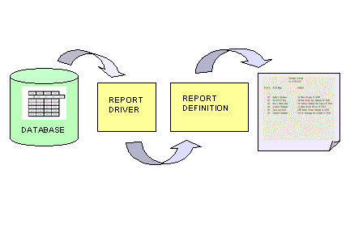
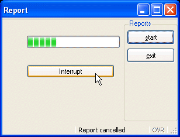

[Back to Summary](TutIndex.html)

------------------------------------------------------------------------

# Tutorial Chapter 9: Reports

Summary:

- [Genero BDL Reports](#Reports)
- [The Report Driver](#ReportDriver)
- [The Report Definition](#ReportDefinition)
  - [DEFINE section](#DEFINE)
  - [OUTPUT section](#OUTPUT)
  - [ORDER section](#ORDER)
  - [FORMAT section](#FORMAT)
- [Two-Pass Reports](#Two-pass)
- [Example: Customer Report](#ExCustomerReport)
- [Interrupting a Report](#Interrupt)
  - [The interrupt Action View](#nterruptactionview)
  - [Refreshing the Display](#Refresh)
  - [Using a ProgressBar](#ProgressBar)
- [Example: Interruption Handling](#Exampleprogbar)

------------------------------------------------------------------------

This program generates a simple report of the data in the **customer**
database table. The two parts of a report, the [report
driver](Reports.html#RPT_DRIVER) logic and the
[REPORT](Reports.html#RPT_DEFINITION) program block (report definition)
are illustrated.  Then the program is modified to display a window
containing a [Progressbar](FormSpecFiles.html#FF_ITEMTYPE_PROGRESSBAR),
and allowing the user to interrupt the report before it is finished.

{border="0" width="432" height="288"}

## [BDL Reports]{#Reports}

Genero BDL reports are easy to design and generate.  The output from a
report can be formatted so that the eye of the reader can easily pick
out the important data.

The program logic that specifies what data to report ([the report
driver](#ReportDriver)) is separate from the program logic that formats
the output of the report (the [report definition](#ReportDefinition)). 
This allows the report driver to supply data for multiple reports
simultaneously, if desired.  And, you can design template report
definitions that might be used with report drivers that access different
database tables.

## [The Report Driver]{#ReportDriver}

The part of a program that generates the rows of report data (also known
as input [records](TutChap03.html#definerecord)) is called the [report
driver](#ReportDriver). The primary concern of the row-producing logic
is the selection of rows of data. The actions of a report driver are:

1.  Use the [START REPORT](Reports.html#RPT_DRV_START) statement to
    initialize each report to be produced. We recommend that clauses
    regarding page setup and report destination be included in this
    statement.
2.  Use a forward-only database [cursor](ResultSets.html#RESULTSET) to
    read rows from a database, if that is the source of the report data.
3.  Whenever a row of report data is available, use [OUTPUT TO
    REPORT](Reports.html#RPT_DRV_OUTPUT) to send it to the report
    definition.
4.  If an error is detected, use [TERMINATE REPORT](Reports.html) to
    stop the report process.
5.  When the last row has been sent, use [FINISH
    REPORT](Reports.html#RPT_DRV_FINISH) to end the report.

From the standpoint of the row-producing side, these are the only
statements required to create a report.

## [The Report Definition]{#ReportDefinition}

The report definition uses a [REPORT](Reports.html#RPT_DEFINITION)
program block to format the input
[records](TutChap03.html#definerecord).  REPORT is global in scope. It
is not, however, a function; it is not reentrant, and CALL cannot invoke
it.

The code within a REPORT program block consists of several sections,
which must appear in the order shown:

- ### [The DEFINE section]{#DEFINE}

> Here you define the variables passed as parameter to the report, and
> the local variables. A report can have its own local
> [variables](Variables.html) for subtotals, calculated results, and
> other uses.

- ### [The OUTPUT section (optional)]{#OUTPUT}

> Although you can define page setup and destination information in this
> section, the format of the report will be static.  Providing this same
> information in the [START REPORT](Reports.html#RPT_DRV_START)
> statement provides more flexibility.

- ### [The ORDER BY section (optional)]{#ORDER}

> Here you specify the required order for the data rows, when using
> grouping.  Include this [ORDER BY](Reports.html#RPT_DF_ORDERBY)
> section if values that the report definition receives from the [report
> driver](Reports.html#RPT_DRIVER) are significant in determining how
> [BEFORE GROUP OF](#BEFOREGROUPOF) or [AFTER GROUP OF](#AFTERGROUPOF)
> control blocks will process the data in the formatted report output. 
> To avoid the creation of additional resources to sort the data, use
> the [ORDER EXTERNAL](Reports.html#RPT_DF_ORDERBY) statement in this
> section if the data to be used in the report has already been sorted
> by an ORDER BY clause in the [SQL
> statement](StaticSql.html#SS_SELECT).

- ### [The FORMAT section]{#FORMAT}

> Here you describe what is to be done at a particular stage of report
> generation. The code blocks you write in the
> [FORMAT](Reports.html#RPT_DF_FORMAT) section are the heart of the
> report program block and contain all its intelligence.  You can use
> most BDL statements in the FORMAT section of a report; you cannot,
> however, include any [SQL statements](StaticSql.html).
>
> BDL invokes the sections and blocks within a report program block
> non-procedurally, at the proper time, as determined by the report
> data. You do not have to write code to calculate when a new page
> should start, nor do you have to write comparisons to detect when a
> group of rows has started or ended. All you have to write are the
> statements that are appropriate to the situation, and BDL supplies the
> "glue" to make them work.
>
> You can write control blocks in the
> [FORMAT](Reports.html#RPT_DF_FORMAT) section to be executed for the
> following events:
>
> - Top (header) of the first page of the report ([FIRST PAGE
>   HEADER)](Reports.html#RPT_FMT_FPH){#FIRSTPAGEHEADER}
> - Top (header) of every page after the first ([PAGE
>   HEADER](Reports.html#RPT_FMT_PH){#PAGEHEADER})
> - Bottom (footer) of every page ([PAGE
>   TRAILER](Reports.html#RPT_FMT_PT){#PAGETRAILER})
> - Each new row as it arrives ([ON EVERY
>   ROW)](Reports.html#RPT_FMT_OEROW){#ONEVERYROW}
> - The start end of a group of rows  ([BEFORE GROUP
>   OF](Reports.html#RPT_FMT_BAG){#BEFOREGROUPOF}) - a group is one or
>   more rows having equal values in a particular column.
> - The end of a group of rows ([AFTER GROUP
>   OF](Reports.html#RPT_FMT_BAG){#AFTERGROUPOF}) - in this block, you
>   typically print subtotals and other aggregate data for the group
>   that is ending. You can use [aggregate functions](Reports.html) to
>   calculate and display frequencies, percentages, sums, averages,
>   minima, and maxima for this information.
> - After the last row has been processed ([ON LAST
>   ROW](Reports.html#RPT_FMT_LROW){#ONLASTROW}) - [aggregate
>   functions](Reports.html) calculated over all the rows of the report
>   are typically printed here.

## [Two-pass reports]{#Two-pass}

A two-pass report is one that creates temporary tables, therefore there
must be an active connection to the database. The two-pass report
handles sorts internally. During the first pass, the report engine sorts
the data and stores the sorted values in a temporary file in the
database. During the second pass, it calculates any aggregate values and
produces output from data in the temporary files.

If your [report definition](#ReportDefinition) includes any of the
following, a two-pass report is required:

- An [ORDER BY](Reports.html#RPT_DF_ORDERBY) section without the
  EXTERNAL keyword.
- The [GROUP PERCENT(\*)](Reports.html#RPT_AGGR_PERCENT) [aggregate
  function](Reports.html) anywhere in the report.
- Any [aggregate function](Reports.html) outside the [AFTER GROUP
  OF](#AFTERGROUPOF) control block.

#### Warning: Some databases do not support temporary tables. Avoid a two-pass report for performance reasons and for portability.

------------------------------------------------------------------------

## [Example:  Customer Report]{#ExCustomerReport}

### The Report Driver

+-----------------------------------------------------------------------+
| **Report Driver (custreport.4gl)**                                    |
+-----------------------------------------------------------------------+
| ``` linenumber                                                        |
| 01 SCHEMA custdemo                                                    |
| 02                                                                    |
| 03 MAIN                                                               |
| 04  DEFINE pr_custrec RECORD                                          |
| 05   store_num  LIKE customer.store_num,                              |
| 06   store_name LIKE customer.store_name,                             |
| 07   addr       LIKE customer.addr,                                   |
| 08   addr2      LIKE customer.addr2,                                  |
| 09   city       LIKE customer.city,                                   |
| 10   state      LIKE customer.state,                                  |
| 11   zipcode    LIKE customer.zipcode                                 |
| 12  END RECORD                                                        |
| 13                                                                    |
| 14  CONNECT TO "custdemo"                                             |
| 15                                                                    |
| 16  DECLARE custlist CURSOR FOR                                       |
| 17     SELECT store_num,                                              |
| 18            store_name,                                             |
| 19            addr,                                                   |
| 20            addr2,                                                  |
| 21            city,                                                   |
| 22            state,                                                  |
| 23            zipcode                                                 |
| 24       FROM customer                                                |
| 25       ORDER BY state, city                                         |
| 26                                                                    |
| 27  START REPORT cust_list TO FILE "customers.txt"                    |
| 28    WITH LEFT MARGIN = 5, TOP MARGIN = 2,                           |
| 29          BOTTOM MARGIN = 2                                         |
| 30                                                                    |
| 31  FOREACH custlist INTO pr_custrec.*                                |
| 32   OUTPUT TO REPORT cust_list(pr_custrec.*)                         |
| 33  END FOREACH                                                       |
| 34                                                                    |
| 35  FINISH REPORT cust_list                                           |
| 36                                                                    |
| 37  DISCONNECT CURRENT                                                |
| 38                                                                    |
| 39 END MAIN                                                           |
| ```                                                                   |
+-----------------------------------------------------------------------+

**Notes:**

- Lines `04`{.linenumber} thru `12`{.linenumber} define a local program
  [record](TutChap03.html#definerecord) **pr_custrec**, with a structure
  like the **customer** database table.
- Line `14`{.linenumber} connects to the **custdemo** database.
- Lines `16`{.linenumber} thru `25`{.linenumber} define a **custlist**
  [cursor](ResultSets.html#RESULTSET) to retrieve the **customer** table
  data rows, sorted by state, then city.
- Lines `27 `{.linenumber} thru` 29`{.linenumber} starts the
  [REPORT](Reports.html#RPT_DEFINITION) program block named
  **cust_list**, and includes a report destination and page formatting
  information.
- Lines `31`{.linenumber} thru `33`{.linenumber} retrieve the data rows
  one by one into the program [record](TutChap03.html#definerecord)
  **pr_custrec** and pass the record to the
  [REPORT](Reports.html#RPT_DEFINITION) program block.
- Line `35`{.linenumber} closes the [report
  driver](Reports.html#RPT_DRIVER) and executes any final
  [REPORT](Reports.html#RPT_DEFINITION) control blocks to finish the
  report.
- Line `37`{.linenumber} disconnects from the **custdemo** database.

------------------------------------------------------------------------

### The Report Definition

+-----------------------------------------------------------------------+
| **Report definition (custreport.4gl**                                 |
+-----------------------------------------------------------------------+
| ``` linenumber                                                        |
| 01 REPORT cust_list(r_custrec)                                        |
| 02  DEFINE r_custrec RECORD                                           |
| 03        store_num  LIKE customer.store_num,                         |
| 04        store_name LIKE customer.store_name,                        |
| 05        addr       LIKE customer.addr,                              |
| 06        addr2      LIKE customer.addr2,                             |
| 07        city       LIKE customer.city,                              |
| 08        state      LIKE customer.state,                             |
| 09        zipcode    LIKE customer.zipcode                            |
| 10       END RECORD                                                   |
| 11                                                                    |
| 12  ORDER EXTERNAL BY r_custrec.state, r_custrec.city                 |
| 13                                                                    |
| 14  FORMAT                                                            |
| 15                                                                    |
| 16   PAGE HEADER                                                      |
| 17     SKIP 2 LINES                                                   |
| 18     PRINT COLUMN 30, "Customer Listing"                            |
| 19     PRINT COLUMN 30, "As of ", TODAY USING "mm/dd/yy"              |
| 20     SKIP 2 LINES                                                   |
| 21                                                                    |
| 22     PRINT  COLUMN 2, "Store #",                                    |
| 23           COLUMN 12, "Store Name",                                 |
| 24           COLUMN 40, "Address"                                     |
| 25                                                                    |
| 26     SKIP 2 LINES                                                   |
| 27                                                                    |
| 28   ON EVERY ROW                                                     |
| 29     PRINT COLUMN 5, r_custrec.store_num USING "####",              |
| 30          COLUMN 12, r_custrec.store_name CLIPPED,                  |
| 31          COLUMN 40, r_custrec.addr CLIPPED;                        |
| 32                                                                    |
| 33     IF r_custrec.addr2 IS NOT NULL THEN                            |
| 34       PRINT 1 SPACE, r_custrec.addr2 CLIPPED, 1 space;             |
| 35     ELSE                                                           |
| 36        PRINT 1 SPACE;                                              |
| 37     END IF                                                         |
| 38                                                                    |
| 39     PRINT r_custrec.city CLIPPED, 1 SPACE,                         |
| 40          r_custrec.state, 1 SPACE,                                 |
| 41          r_custrec.zipcode CLIPPED                                 |
| 42                                                                    |
| 43   BEFORE GROUP OF r_custrec.city                                   |
| 44     SKIP TO TOP OF PAGE                                            |
| 45                                                                    |
| 46   ON LAST ROW                                                      |
| 47     SKIP 1 LINE                                                    |
| 48     PRINT "TOTAL number of customers: ",                           |
| 49             COUNT(*) USING "#,###"                                 |
| 50                                                                    |
| 51   PAGE TRAILER                                                     |
| 52     SKIP 2 LINES                                                   |
| 53     PRINT COLUMN 30, "-", PAGENO USING "<<", " -"                  |
| 54                                                                    |
| 55 END REPORT                                                         |
| ```                                                                   |
+-----------------------------------------------------------------------+

**Notes:**

- Line `01`{.linenumber}  The [REPORT](Reports.html#RPT_DEFINITION)
  control block has the **pr_custrec**
  [record](TutChap03.html#definerecord) passed as an argument.

- Lines ` 02`{.linenumber} thru ` 10`{.linenumber} define a local
  program [record](TutChap03.html#definerecord) **r_custrec** to store
  the values that the calling routine passes to the report.

- Line ` 12`{.linenumber} tells the
  [REPORT](Reports.html#RPT_DEFINITION) control block that the
  [records](TutChap03.html#definerecord) will be passed sorted in order
  by state, then city.  The [ORDER
  EXTERNAL](Reports.html#RPT_DF_ORDERBY) syntax is used to prevent a
  second sorting of the program [records](TutChap03.html#definerecord),
  since they have already been sorted by the [SQL
  statement](StaticSql.html) in the [report
  driver](Reports.html#RPT_DRIVER).

- Line ` 14`{.linenumber} is the beginning of the
  [FORMAT](Reports.html#RPT_DF_FORMAT) section.

- Lines `16`{.linenumber} thru `20`{.linenumber} The [PAGE
  HEADER](#PAGEHEADER) block specifies the layout generated at the top
  of each page.\
  Each [PRINT](Reports.html#RPT_STMT_PRINT) statement starts a new line
  containing text or a value. The PRINT statement can have multiple
  COLUMN clauses, which all print on the same line.  \
  The [COLUMN](Operators.html#OP_COLUMN) clause specifies the offset of
  the first character from the first position after the left margin. 
  The values to be printed can be program [variables](Variables.html),
  static text, or built-in functions.\
  The built-in [TODAY](Operators.html#OP_TODAY) operator generates the
  current date; the [USING](Operators.html#OP_USING) clauses formats
  this.\
  The [SKIP](Reports.html#RPT_STMT_SKIP) statement inserts empty lines.\
  The [PAGE HEADER](#PAGEHEADER) for this report will appear as follows:

          <skipped line>
          <skipped line>
                    Customer Listing
                    As of <date>
          <skipped line>
          <skipped line>
          Store #    Store Name          Address
          <skipped line>
          <skipped line>

- Lines ` 28`{.linenumber} thru ` 41`{.linenumber} specifies the layout
  generated for each row.  The data can be read more easily if each
  program [record](TutChap03.html#definerecord) passed to the report is
  printed on a single row. Although there are four
  [PRINT](Reports.html#RPT_STMT_PRINT) statements in this control block,
  the first three PRINT statements are terminated by semi-colons.  This
  suppresses the new line signal, resulting in just a single row of
  printing.\
  The [CLIPPED](Operators.html#OP_CLIPPED) keyword eliminates any
  trailing blanks after the name, addresses, and city values.\
  Any [IF](FlowControl.html#FC_IF) statement that is included in the
  [FORMAT](Reports.html#RPT_DF_FORMAT) section must contain the same
  number of
  [PRINT](Reports.html#RPT_STMT_PRINT)/[SKIP](Reports.html#RPT_STMT_SKIP)
  statements regardless of which condition is met.  Therefore, if
  **r_custrec.addr2** is not NULL, a
  [PRINT](Reports.html#RPT_STMT_PRINT) statement prints the value
  followed by a single space;  if it is NULL, a PRINT statement prints a
  single space.  As mentioned earlier, each PRINT statement is followed
  by a semicolon to suppress the new-line.\
  The output for each row will be as follows:

          106 TrueTest Hardware     6123 N. Michigan Ave Chicago IL 60104
          101 Bandy's Hardware      110 Main Chicago IL 60068

<!-- -->

- Lines ` 43`{.linenumber} and ` 44`{.linenumber} start a new page for
  each group containing the same value for **r_custrec.city**.
- Lines ` 46`{.linenumber} thru ` 49`{.linenumber} specify a control
  block to be executed after the statements in [ON EVERY
  ROW](Reports.html#RPT_FMT_OEROW) and [AFTER GROUP
  OF](Reports.html#RPT_FMT_BAG) control block. This prints at the end of
  the report.  The aggregate function
  [COUNT(\*)](Reports.html#RPT_AGGR_COUNT) is used to print the total
  number of [records](TutChap03.html#definerecord) passed to the
  report.  The [USING](Operators.html#OP_USING) keyword formats the
  number.  This appears as follows:

>     <skipped line>
>         Total number of customers:   <count>

- Lines ` 51`{.linenumber} thru ` 53`{.linenumber} specifies the layout
  generated at the bottom of each page. The built-in function
  [PAGENO](Reports.html#RPT_OPER_PAGENO) is used to print the page
  number.  The [USING](Operators.html#OP_USING) keyword formats the
  number, left-justified.\
  This appears as follows:

          <skipped line>
          <skipped line>
                        - <pageno> -

------------------------------------------------------------------------

## [Interrupting a Report]{#Interrupt}

When a program performs a long process like a loop, a report, or a
database query,  the lack of user interaction statements within the
process can prevent the user from interrupting it.  In this program, the
preceding example is modified to display a form containing start, exit,
and interrupt [buttons](FormSpecFiles.html#FF_ITEMTYPE_BUTTON), as well
as a [progress bar](FormSpecFiles.html#FF_ITEMTYPE_PROGRESSBAR) showing
how close the report is to completion.

> {border="0" width="308" height="234"}  

## [The interrupt action view]{#nterruptactionview}

In order to allow a user to stop a long-running report, for example, you
can define an [action view](InteractionModel.html#CTRLGACTIONS) with the
name \"interrupt\".  When the runtime system takes control of the
program, the client automatically enables a local
[interrupt](InteractionModel.html#INTERRUPTION) action to let the user
send an asynchronous request to the program.  This interruption request
is interpreted by the runtime system as a traditional interruption
signal, as if it was generated on the server side, and the
[INT_FLAG](Programs.html#PV_INT_FLAG) [variable](Variables.html) is set
to TRUE.

## [Refreshing the Displa]{#Refresh}y

The Abstract User Interface tree on the front end is synchronized with
the runtime system AUI tree when a user interaction instruction takes
the control. This means that the user will not see any display as long
as the program is doing batch processing, until an interactive statement
is reached.  If you want to show something on the screen while the
program is running in a batch procedure, you must force synchronization
with the front end.

The [Interface](ClassInterface.html) class is a built-in class provided
to manipulate the user interface. The **refresh()** method of this class
synchronizes the front end with the current AUI tree. You do not need to
instantiate this class before calling any of its methods:

         CALL ui.Interface.refresh()

## [Using a ProgressBar]{#ProgressBar}

One of the form item types is a
[PROGRESSBAR](FormSpecFiles.html#FF_ITEMTYPE_PROGRESSBAR), a horizontal
line with a progress indicator.  The position of the PROGRESSBAR is
defined by the value of the corresponding form field. The value can be
changed from within a BDL program by using the
[DISPLAY](MessageDisplay.html#DISPLAY) instruction to set the value of
the field.

This type of form item does not allow data entry; it is only used to
display integer values. The [VALUEMIN](FSFAttributes.html#FA_VALUEMIN)
and [VALUEMAX](FSFAttributes.html#FA_VALUEMAX) attributes of the
PROGRESSBAR define the lower and upper integer limit of the progress
information. Any value outside this range will not be displayed.

------------------------------------------------------------------------

## [Example:  Interruption Handling]{#Exampleprogbar}

### [The Form Specification File]{#Exampleprogbar}

A form containing a progress bar is defined in the [form specification
file](FormSpecFiles.html) **reportprog.per**.

+-----------------------------------------------------------------------+
| **Form (reportprog.per)**                                             |
+-----------------------------------------------------------------------+
| ``` linenumber                                                        |
| 01 LAYOUT (TEXT="Report")                                             |
| 02  GRID                                                              |
| 03  {                                                                 |
| 04                                                                    |
| 05        [f001                  ]                                    |
| 06                                                                    |
| 07        [ib                    ]                                    |
| 08                                                                    |
| 09                                                                    |
| 10  }                                                                 |
| 11  END                                                               |
| 12 END                                                                |
| 13                                                                    |
| 14 ATTRIBUTES                                                         |
| 15 PROGRESSBAR f001 = formonly.rptbar, VALUEMIN=1,VALUEMAX=10;        |
| 16 BUTTON ib : interrupt, TEXT="Stop";                                |
| 17 END                                                                |
| ```                                                                   |
+-----------------------------------------------------------------------+

**Notes:**

- Line `05 `{.linenumber} contains the [form
  field](FormSpecFiles.html#FF_FORM_FIELD) for the
  [PROGRESSBAR](FormSpecFiles.html#FF_ITEMTYPE_PROGRESSBAR).
- Line `07`{.linenumber} contains the form field for the interrupt
  [action view](InteractionModel.html#CTRLGACTIONS).
- Line `15`{.linenumber} defines the
  [PROGRESSBAR](FormSpecFiles.html#FF_ITEMTYPE_PROGRESSBAR) as formonly
  since its type is not derived from a database column.  The values
  range from 1 to 10.  The maximum value for the PROGRESSBAR was chosen
  arbitrarily, and was set rather low since there aren\'t many rows in
  the **customer** database table.
- Line `16`{.linenumber} defines the button **ib** as an interrupt
  [action view](InteractionModel.html#CTRLGACTIONS) with TEXT of
  \"Stop\".

------------------------------------------------------------------------

### Modifications to custreports.4gl

The [MAIN](Programs.html#MAIN_BLOCK) program block  has been modified to
open a window containing the form with a
[PROGRESSBAR](FormSpecFiles.html#FF_ITEMTYPE_PROGRESSBAR) and a
[MENU](Menus.html), to allow the user to start the report and to exit. A
new function, **cust_report**,  is added for interruption handling.  The
report definition, the **cust_list**
[REPORT](Reports.html#RPT_DEFINITION) block, remains the same as in the
previous example.

+-----------------------------------------------------------------------+
| **Changes to the MAIN program block (custreport2.4gl)**               |
+-----------------------------------------------------------------------+
| ``` linenumber                                                        |
| 01 MAIN                                                               |
| 02                                                                    |
| 03   DEFER INTERRUPT                                                  |
| 04   CONNECT TO "custdemo"                                            |
| 05   CLOSE WINDOW SCREEN                                              |
| 06   OPEN WINDOW w3 WITH FORM "reportprog"                            |
| 07                                                                    |
| 08   MENU "Reports"                                                   |
| 09   ON ACTION start                                                  |
| 10      MESSAGE "Report starting"                                     |
| 11       CALL cust_report()                                           |
| 12   ON ACTION exit                                                   |
| 13       EXIT MENU                                                    |
| 14   END MENU                                                         |
| 15                                                                    |
| 16   CLOSE WINDOW w3                                                  |
| 17   DISCONNECT CURRENT                                               |
| 18                                                                    |
| 19 END MAIN                                                           |
| ```                                                                   |
+-----------------------------------------------------------------------+

**Notes:**

- Line `03`{.linenumber} prevents the user from interrupting the program
  except by using the [interrupt](InteractionModel.html#INTERRUPTION)
  [action view](InteractionModel.html#CTRLGACTIONS).
- Line `06`{.linenumber} Opens the window and form containing the
  [PROGRESSBAR](FormSpecFiles.html#FF_ITEMTYPE_PROGRESSBAR).
- Lines `08`{.linenumber} thru `14`{.linenumber} define a
  [MENU](Menus.html) with two actions: **\
  start** - displays a [MESSAGE](MessageDisplay.html#MESSAGE) and calls
  the function **cust_report**.   **\
  exit** - quits the [MENU](Menus.html).

### The cust_report function

This new function contains the [report driver](Reports.html#RPT_DRIVER),
together with the logic to determine whether the user has attempted to
interrupt the report.

+-----------------------------------------------------------------------+
| **Function cust_report (custreport2.4gl)**                            |
+-----------------------------------------------------------------------+
| ``` linenumber                                                        |
| 21 FUNCTION cust_report()                                             |
| 22                                                                    |
| 23 DEFINE pr_custrec RECORD                                           |
| 24       store_num   LIKE customer.store_num,                         |
| 25       store_name  LIKE customer.store_name,                        |
| 26       addr        LIKE customer.addr,                              |
| 27       addr2       LIKE customer.addr2,                             |
| 28        city        LIKE customer.city,                             |
| 29       state       LIKE customer.state,                             |
| 30       zipcode     LIKE customer.zipcode                            |
| 31       END RECORD,                                                  |
| 32       rec_count, rec_total,                                        |
| 33       pbar, break_num  INTEGER                                     |
| 34                                                                    |
| 35   LET rec_count = 0                                                |
| 36   LET rec_total = 0                                                |
| 37   LET pbar = 0                                                     |
| 38   LET break_num = 0                                                |
| 39   LET INT_FLAG = FALSE                                             |
| 40                                                                    |
| 41   SELECT COUNT(*) INTO rec_total FROM customer                     |
| 42                                                                    |
| 43   LET break_num = (rec_total/10)                                   |
| 44                                                                    |
| 45   DECLARE custlist CURSOR FOR                                      |
| 46     SELECT store_num,                                              |
| 47        store_name,                                                 |
| 48        addr,                                                       |
| 49        addr2,                                                      |
| 50        city,                                                       |
| 51        state,                                                      |
| 52        zipcode                                                     |
| 53      FROM CUSTOMER                                                 |
| 54      ORDER BY state, city                                          |
| 55                                                                    |
| 56   START REPORT cust_list TO FILE "customers.txt"                   |
| 57   FOREACH custlist INTO pr_custrec.*                               |
| 58     OUTPUT TO REPORT cust_list(lr_custrec.*)                       |
| 59     LET rec_count = rec_count+1                                    |
| 60     IF (rec_count MOD break_num)= 0 THEN                           |
| 61       LET pbar = pbar+1                                            |
| 62       DISPLAY pbar TO rptbar                                       |
| 63       CALL ui.Interface.refresh()                                  |
| 64       IF (INT_FLAG) THEN                                           |
| 65         EXIT FOREACH                                               |
| 66       END IF                                                       |
| 67     END IF                                                         |
| 68   END FOREACH                                                      |
| 69                                                                    |
| 70   IF (INT_FLAG) THEN                                               |
| 71     LET INT_FLAG = FALSE                                           |
| 72     MESSAGE "Report cancelled"                                     |
| 73   ELSE                                                             |
| 74     FINISH REPORT cust_list                                        |
| 75     MESSAGE "Report finished"                                      |
| 76   END IF                                                           |
| 77                                                                    |
| 78 END FUNCTION                                                       |
| ```                                                                   |
+-----------------------------------------------------------------------+

**Notes:**

- Lines `23`{.linenumber} thru `31`{.linenumber}  now define the
  **pr_custrec** [record](TutChap03.html#definerecord) in this function.
- Lines `32`{.linenumber} thru `33`{.linenumber} define some additional
  [variables](Variables.html).
- Lines `35`{.linenumber} thru `39`{.linenumber} initialize the local
  [variables](Variables.html).
- Line `38`{.linenumber} sets [INT_FLAG](Programs.html#PV_INT_FLAG) to
  FALSE.
- Line `41`{.linenumber} uses an embedded [SQL
  statement](StaticSql.html) to retrieve the count of the rows in the
  **customer** table and stores it in the [variable](Variables.html)
  **rec_total**.
- Line `43`{.linenumber} calculates the value of **break_num** based on
  the maximum value of the
  [PROGRESSBAR](FormSpecFiles.html#FF_ITEMTYPE_PROGRESSBAR), which is
  set at 10.  After **break_num** rows have been processed, the program
  will increment the PROGRESSBAR.  The front end cannot handle
  interruption requests properly if the display generates a lot of
  network traffic, so we do not recommend refreshing the AUI and
  checking [INT_FLAG](Programs.html#PV_INT_FLAG) after every row.
- Lines `45`{.linenumber} thru `54`{.linenumber} declare the
  **custlist** [cursor](ResultSets.html#RESULTSET) for the customer
  table.
- Line ` 56`{.linenumber} starts the report, sending the output to the
  file **custout**.
- Lines `58`{.linenumber} thru ` 68`{.linenumber} contain the
  [FOREACH](ResultSets.html#RS_FOREACH) statement to output each
  [record](TutChap03.html#definerecord) to the same report **cust_list**
  used in the previous example.
- Line `59`{.linenumber} increments **rec_count** to keep track of how
  many [records](TutChap03.html#definerecord) have been output to the
  report.
- Line `60`{.linenumber} tests whether a break point has been reached,
  using the [MOD](Operators.html#OP_MODULUS) (Modulus) function.
- Line `61`{.linenumber} If a break point has been reached, the value of
  **pbar** is incremented.
- Line `62`{.linenumber} The **pbar** value is displayed to the
  **rptbar** [PROGRESSBAR](FormSpecFiles.html#FF_ITEMTYPE_PROGRESSBAR)
  [form field](FormSpecFiles.html#FF_FORM_FIELD).
- Line `63`{.linenumber} The front end is synced with the current AUI
  tree.
- Line `64`{.linenumber} thru `66`{.linenumber}  The value of
  [INT_FLAG](Programs.html#PV_INT_FLAG) is checked  to see whether the
  user has interrupted the program. If so, the
  [FOREACH](ResultSets.html#RS_FOREACH) loop is exited prematurely. 
- Lines ` 70`{.linenumber} thru `76`{.linenumber} test
  [INT_FLAG](Programs.html#PV_INT_FLAG) again and display a message
  indicating whether the report finished or was interrupted.  If the
  user did not interrupt the report,  the [FINISH
  REPORT](Reports.html#RPT_DRV_FINISH) statement is executed.
