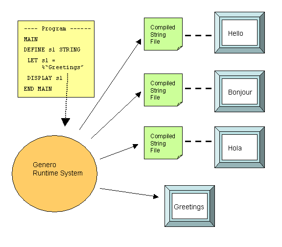
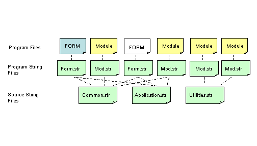
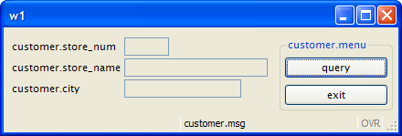
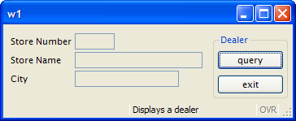

[Back to Summary](TutIndex.html)

------------------------------------------------------------------------

# Tutorial Chapter 10: Localization

Summary:

- [Localization Support](#Localization)
- [Localized Strings](#LocalizedStrings)
- [Programming Steps](#ProgrammingSteps) 
- [Strings in Sources](#StringsInSources)
- [Generating Source String Files](#Extracting)
- [Compiling Source String Files](#Compiling)
- [Deploying Compiled String Files](#Deploying)
- [Example](#Example)

------------------------------------------------------------------------

## [Localization Support]{#Localization}

Localization Support is a feature of the language that allows you to
write application supporting multi-byte character sets as well as date,
numeric and currency formatting in accordance with a
[locale]{.underline}.

Localization Support is based on the system libraries handling the
locale, a set of language and cultural rules.

See [Localization](Localization.html) for more details.

------------------------------------------------------------------------

## [Localized Strings]{#LocalizedStrings}

[Localized Strings](LocalizedStrings.html#DEFINITION) allow you to
internationalize your application using different languages, and to
customize it for specific industry markets in your user population.  Any
[string](DataTypes.html#DT_STRING) that is used in your Genero BDL
program, such as messages to be displayed or the text on a form, can be
defined as a Localized String. At runtime, the Localized String is
replaced with text stored in a [String
File](LocalizedStrings.html#SOURCES).

String Files must be compiled, and then deployed at the user site.

{border="0" width="576" height="504"}

------------------------------------------------------------------------

## [Programming Steps]{#ProgrammingSteps}

The following steps describe how to use localized strings in your
sources:

1.  Modify your [form specification files](FormSpecFiles.html) and
    program module files to contain [Localized
    Strings](LocalizedStrings.html#DEFINITION) by inserting the % sign
    in front of the strings that you wish to be replaced.
2.  Use the **-m** option of **fglform** to extract the [Localized
    Strings](LocalizedStrings.html#DEFINITION) from each form
    specification file into a separate [Source String
    File](LocalizedStrings.html#SOURCES) (extension **.str**).
3.  Use the -**m** option of **fglcomp** to extract the [Localized
    Strings](LocalizedStrings.html#DEFINITION) from each program module
    into a separate Source String File (extension **.str**).
4.  Concatenate the [Source String Files](LocalizedStrings.html#SOURCES)
    together logically; for example, you may have a **common.str**  file
    containing the strings common to all applications, a **utility.str**
    file containing the strings common to utilities, and an
    **application.str** file  with the strings specific to the
    particular application.

      {border="0" width="504" height="288"}

5.  At this point the names of the [Localized
    Strings](LocalizedStrings.html#DEFINITION) may be unwieldy, since
    they were derived from the actual strings in the program files.  You
    can modify the string names in your [Source String
    Files](LocalizedStrings.html#SOURCES) and the corresponding program
    files so they form keys that are logical.  For example:

<!-- -->

             $"common.accept" = "OK"
             $"common.cancel"= "Cancel"
             $"common.quit" = "Quit"

6.  Make the [Source String Files](LocalizedStrings.html#SOURCES)
    available to the programming teams for use as a reference when
    creating or modifying programs.
7.  Copy the Source String Files, and modify the replacement text for
    each of your market segments or user languages.
8.  Compile the Source String Files (**.42s**).
9.  Create the entries in [FGLPROFILE](FglProfile.html) to specify what
    string files must be used at runtime.
10. Deploy **.42s** compiled string files to user sites.

------------------------------------------------------------------------

## [Strings in Sources]{#StringsInSources}

A [Localized String](LocalizedStrings.html#DEFINITION) begins with a
percent sign (%), followed by the name of the string identifying the
replacement text to be loaded from the [Compiled String
File](LocalizedStrings.html#COMPILING).  Since the name is a
[string](DataTypes.html#DT_STRING), you can use any characters in the
name, including blanks.

> 
>     LET s1 = %"Greetings"

The [string](DataTypes.html#DT_STRING) \"Greetings\" is both the name of
the string and the default text which would be used if no string
resource files are provided at runtime.

[Localized Strings](LocalizedStrings.html#DEFINITION) can be used any
place where a [STRING](DataTypes.html#DT_STRING) literal can be used,
including [form specification files](FormSpecFiles.html).

 The [SFMT()](Operators.html#OP_SFMT) and
[LSTR()](Operators.html#OP_LSTR) operators can be used to manipulate the
contents of [Localized Strings](LocalizedStrings.html#DEFINITION).  For
example, the program line:

         DISPLAY SFMT( %"cust.valid", custnum )

reads from the associated [Compiled String
File](LocalizedStrings.html#COMPILING):

         "cust.valid"="customer %1 is valid"

resulting in the following display when the value of custnum is 200:

         "customer 200 is valid"

------------------------------------------------------------------------

## [Extracting Strings]{#Extracting}

You can generate a [Source String File](LocalizedStrings.html#SOURCES)
by extracting all of the [Localized
Strings](LocalizedStrings.html#DEFINITION) from your program module or
form specification file, using the **-m** option of
[fglcomp](Tools.html#TL_FGLCOMP) or [fglform](Tools.html#TL_FGLFORM):

        fglcomp -m mystring.4gl > mystring.str

The generated file would have the format:

        "Greetings" = "Greetings"

You could then change the replacement text in the file:

        "Greetings" = "Hello"

The source string file must have the extension **.str**.

------------------------------------------------------------------------

## [Compiling Source String Files]{#Compiling} ([fglmkstr](LocalizedStrings.html#COMPILING))

[Source String Files](LocalizedStrings.html#SOURCES) must be compiled to
binary files in order to be used at runtime:

         fglmkstr mystring.str

The resulting [Compiled String File](LocalizedStrings.html#COMPILING)
has the extension **.42s**  (**mystring.42s**).

------------------------------------------------------------------------

## [Deploying String Files]{#Deploying}

The [Compiled String Files](LocalizedStrings.html#COMPILING), produced
by the [fglmkstr](Tools.html#TL_FGLMKSTR) tool, must be deployed on the
production sites. The file extension is **.42s**.

By default, the runtime system searches for a **.42s** file with the
same name prefix as the current **.42r** program.

You can specify a list of string files with entries in the
[FGLPROFILE](EnvironmentVariables.html#EV_FGLPROFILE) configuration
file:

         fglrun.localization.file.count = 2
         fglrun.localization.file.1.name = "firstfile"
         fglrun.localization.file.2.name = "secondfile"

The current directory and the path defined in the
[DBPATH](EnvironmentVariables.html#EV_DBPATH)/[FGLRESOURCEPATH](EnvironmentVariables.html#EV_FGLRESOURCEPATH)environment
variable, are searched for the **.42s** Compiled String File.

**Tip:**

1.  Create several string files with the same names, but locate them in
    different directories. You can then easily switch from one set of
    string files to another, just by changing the
    [DBPATH](EnvironmentVariables.html#EV_DBPATH)/[FGLRESOURCEPATH](EnvironmentVariables.html#EV_FGLRESOURCEPATH)
    environment variable. You typically create one string file directory
    per language, and if needed, you can create subdirectories for each
    code-set (strings/english/iso8859-1, strings/french/windows1252).

------------------------------------------------------------------------

## [Example:]{#Example}

### **form.per**  - the form specification file

This [form specification file](FormSpecFiles.html) uses the
[LABEL](FormSpecFiles.html#FF_ITEMTYPE_LABEL) form [item
type](FormSpecFiles.html#SECTION_ATTRIBUTES) to display the text
associated with the [form fields](FormSpecFiles.html#FF_FORM_FIELD)
containing data from the **customer** database table. 
[LABEL](FormSpecFiles.html#FF_ITEMTYPE_LABEL) [item
types](FormSpecFiles.html#SECTION_ATTRIBUTES) contain read-only values.

+-----------------------------------------------------------------------+
| **form.per**                                                          |
+-----------------------------------------------------------------------+
|                                                                       |
|     01 SCHEMA custdemo                                                |
|     02                                                                |
|     03 LAYOUT                                                         |
|     04   GRID                                                         |
|     05   {                                                            |
|     06    [lab1      ] [f01  ]                                        |
|     07                                                                |
|     08    [lab2      ] [f02                 ]                         |
|     09                                                                |
|     10    [lab3      ] [f03             ]                             |
|     11   }                                                            |
|     12   END   --grid                                                 |
|     13 END  -- layout                                                 |
|     14                                                                |
|     15 TABLES customer                                                |
|     16                                                                |
|     17 ATTRIBUTES                                                     |
|     18 LABEL lab1 : TEXT=%"customer.store_num";                       |
|     19 EDIT  f01  = customer.store_num,                               |
|     20             COMMENT=%"customer.dealermsg";                     |
|     21 LABEL lab2 : TEXT=%"customer.store_name";                      |
|     22 EDIT  f02  = customer.store_name;                              |
|     23 LABEL lab3 : TEXT=%"customer.city";                            |
|     24 EDIT  f03  = customer.city;                                    |
|     25 END  -- attributes                                             |
+-----------------------------------------------------------------------+

**Notes:**

- Lines `06`{.linenumber} and `18`{.linenumber}:  The form contains a
  [LABEL](FormSpecFiles.html#FF_ITEMTYPE_LABEL), **lab1**; the TEXT of
  the [LABEL](FormSpecFiles.html#FF_ITEMTYPE_LABEL) is a [Localized
  String](LocalizedStrings.html#DEFINITION), **customer.store_num**.
- Line `20`{.linenumber}:  The COMMENT of the
  [EDIT](FormSpecFiles.html#FF_ITEMTYPE_EDIT) **f01** is a [Localized
  String](LocalizedStrings.html#DEFINITION), **customer.dealermsg**.
- Lines `08`{.linenumber} and `21`{.linenumber}:  The TEXT of the
  [LABEL](FormSpecFiles.html#FF_ITEMTYPE_LABEL) **lab2** is a [Localized
  String](LocalizedStrings.html#DEFINITION), **customer.store_name**.
- Lines `10`{.linenumber} and `23`{.linenumber}: The TEXT of the
  [LABEL](FormSpecFiles.html#FF_ITEMTYPE_LABEL) **lab3** is a [Localized
  String](LocalizedStrings.html#DEFINITION), **customer.city**.

These strings will be replaced at runtime.

### form.str - the [String File](LocalizedStrings.html#SOURCES) associated with this form

After translation, the string source file would look like this:

    01 "customer.store_num"="Store No"
    02 "customer.dealernummsg"="This is the dealer number"
    03 "customer.store_name"="Store Name"
    04 "customer.city"="City"

### prog.4gl - the program module

This program module opens the form containing [Localized
Strings](LocalizedStrings.html#DEFINITION):

+-----------------------------------------------------------------------+
| **Module prog.4gl**                                                   |
+-----------------------------------------------------------------------+
|                                                                       |
|     01 SCHEMA custdemo                                                |
|     02                                                                |
|     03 MAIN                                                           |
|     04  CONNECT TO "custdemo"                                         |
|     05  CLOSE WINDOW SCREEN                                           |
|     06  OPEN WINDOW w1 WITH FORM "stringform"                         |
|     07  MESSAGE %"customer.msg"                                       |
|     08  MENU %"customer.menu"                                         |
|     09     ON ACTION query                                            |
|     10       CALL query_cust()                                        |
|     11     ON ACTION exit                                             |
|     12       EXIT MENU                                                |
|     13  END MENU                                                      |
|     14  CLOSE WINDOW w1                                               |
|     15  DISCONNECT CURRENT                                            |
|     16 END MAIN                                                       |
|     17                                                                |
|     18 FUNCTION query_cust() -- displays one row                      |
|     19   DEFINE l_custrec RECORD                                      |
|     20          store_num LIKE customer.store_num,                    |
|     21          store_name LIKE customer.store_name,                  |
|     22          city LIKE customer.city                               |
|     23   END RECORD,                                                  |
|     24   msg STRING                                                   |
|     25                                                                |
|     26   WHENEVER ERROR CONTINUE                                      |
|     27   SELECT store_num, store_name, city                           |
|     28     INTO l_custrec.*                                           |
|     29     FROM customer                                              |
|     30     WHERE store_num = 101                                      |
|     31   WHENEVER ERROR STOP                                          |
|     32                                                                |
|     33   IF SQLCA.SQLCODE = 0 THEN                                    |
|     34      LET msg = SFMT( %"customer.valid",                        |
|     35                      l_custrec.store_num )                     |
|     36      MESSAGE msg                                               |
|     37      DISPAY BY NAME l_custrec.*                                |
|     38   ELSE                                                         |
|     39      MESSAGE %"customer.notfound"                              |
|     40   END IF                                                       |
|     41                                                                |
|     42 END FUNCTION                                                   |
+-----------------------------------------------------------------------+

**Notes:**

- Lines `07`{.linenumber}, `08`{.linenumber}, `34`{.linenumber} and
  `39`{.linenumber} contain [Localized
  Strings](LocalizedStrings.html#DEFINITION) for the messages that the
  program displays.

These strings will be replaced at runtime.

### prog.str - the [String File](LocalizedStrings.html#SOURCES) associated with this program module

After translation, the string source file would look like this:

    01 "customer.msg"="Displays a Dealer"
    02 "customer.menu"="Dealer"
    03 "customer.valid"="Customer %1 is valid"
    04 "customer.notfound"="Customer was not found"

------------------------------------------------------------------------

### Compiling the program

The program is compiled into **cust.42r. **

         fgl2p -o cust.42r prog.4gl

### Compiling the string files

Both string files must be compiled:

> 
>     fglmkstr form.str
>     fglmkstr prog.str

The resulting [Compiled String Files](LocalizedStrings.html#COMPILING)
are **form.42s** and **prog.42s**.

### Setting the list of compiled string files in FGLPROFILE 

The list of Compiled String Files is specified in the
[FGLPROFILE](FglProfile.html) configuration file. The runtime system
searches for a file with the \"`42s`\" extension in the current
directory and in the path list defined in the
[DBPATH](EnvironmentVariables.html#EV_DBPATH)/[FGLRESOURCEPATH](EnvironmentVariables.html#EV_FGLRESOURCEPATH)
environment variable. Specify the total number of files, and list each
file with an index number.  

#### Example file fglprofile: 

    01 fglrun.localization.file.count = 2
    02 fglrun.localization.file.1.name = "form"
    03 fglrun.localization.file.2.name = "prog"

### Setting the environment

Set the FGLPROFILE environment variable:

         export FGLPROFILE=./fglprofile

### Running the program

Run the program:

         fglrun cust

### The Resulting Form Display

Display of the form using the default values for the strings:

{border="0"}

Display of the form when the [Compiled String
File](LocalizedStrings.html#COMPILING) is deployed:

{border="0"}
