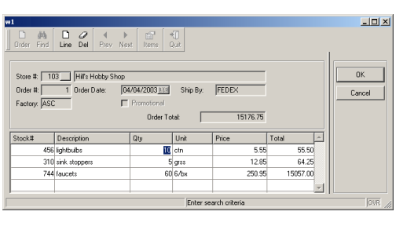

[Back to Summary](TutIndex.html)

------------------------------------------------------------------------

# Tutorial Chapter 11: Master/Detail

Summary:

- [The Master-Detail sample](#MasterDetailSample)
- [The Makefile](#Makefile)
- [The Customer List module](#CustListModule)
- [The Stock List module](#StockListModule)
- [The Master-Detail Form Specification File](#FormSpec)
- [The Orders Program](#OrdersProgram)
  - [The MAIN program block](#MAIN)
  - [Function setup_actions](#setup_actions)
  - [Function order_new](#order_new)
  - [Function order_insert](#order_insert)
  - [Function order_query](#order_query)
  - [Function order_fetch](#order_fetch)
  - [Function order_select](#order_select)
  - [Function order_fetch_rel](#order_fetch_rel)
  - [Function order_total](#order_total)
  - [Function order_close](#order_close)
  - [Function items_fetch](#items_fetch)
  - [Function items_show](#items_show)
  - [Function items_inpupd](#items_inpupd)
  - [Function items_line_total](#items_line_total)
  - [Function item_insert](#item_insert)
  - [Function item_update](#item_update)
  - [Function item_delete](#item_delete)
  - [Function get_stock_info](#get_stock_info)

------------------------------------------------------------------------

## [The Master-Detail sample]{#MasterDetailSample}

The example discussed in this chapter is designed for the input of order
information (headers and order lines), illustrating a typical
master-detail relationship. The form used by the example contains fields
from both the **orders** and **items** tables in the **custdemo**
database.

{border="0"}

####                                   Display on Windows platforms

Since there are multiple items associated with a single order, the rows
from the **items** table are stored in a program array and displayed in
a table container on the form.  Most of the functionality to
query/add/update/delete has been covered in previous chapters; this
chapter will focus on the master/detail form and the unique features of
the corresponding program.

**Note:** This type of relationship can also be handled with multiple
dialogs, as shown in [Chapter 13](TutChap13.html).

------------------------------------------------------------------------

## [The Makefile]{#Makefile}

The BDL modules and forms used by the application in this chapter are
compiled/linked by using a **Makefile**. This file is interpreted by the
\'**make**\' utility, which is a well-known tool to build large programs
based on multiple sources and forms.

The **make** utility reads the [dependency rules]{.underline} defined in
the **Makefile** for each program component, and executes the commands
associated with the rules.

This section only describes the **Makefile** used in this example. For
more details about Makefiles, see the **make** utility documentation.

+-----------------------------------------------------------------------+
| **Makefile**                                                          |
+-----------------------------------------------------------------------+
| ``` linenumber                                                        |
| 01  all:: orders                                                      |
| 02                                                                    |
| 03  orders.42m: orders.4gl                                            |
| 04          fglcomp -M orders.4gl                                     |
| 05                                                                    |
| 06  orderform.42f: orderform.per                                      |
| 07          fglform -M orderform.per                                  |
| 08                                                                    |
| 09  custlist.42m: custlist.4gl                                        |
| 10          fglcomp -M custlist.4gl                                   |
| 11                                                                    |
| 12  custlist.42f: custlist.per                                        |
| 13          fglform -M custlist.per                                   |
| 14                                                                    |
| 15  stocklist.42m: stocklist.4gl                                      |
| 16          fglcomp -M stocklist.4gl                                  |
| 17                                                                    |
| 18  stocklist.42f: stocklist.per                                      |
| 19          fglform -M stocklist.per                                  |
| 20                                                                    |
| 21  MODULES=\                                                         |
| 22   orders.42m\                                                      |
| 23   custlist.42m\                                                    |
| 24   stocklist.42m                                                    |
| 25                                                                    |
| 26  FORMS=\                                                           |
| 27   orderform.42f\                                                   |
| 28   custlist.42f\                                                    |
| 29   stocklist.42f                                                    |
| 30                                                                    |
| 31  orders:: $(MODULES) $(FORMS)                                      |
| 32        fgllink -o orders.42r $(MODULES)                            |
| 33                                                                    |
| 34  run::                                                             |
| 35        fglrun orders                                               |
| 36                                                                    |
| 37  clean::                                                           |
| 38          rm -f *.42?                                               |
| ```                                                                   |
+-----------------------------------------------------------------------+

**Notes:**

- Line `01`{.linenumber} defines the \'**all**\' dependency rule that
  will be executed by default, and depends from the rule \'**orders**\'
  described on line ` 31`{.linenumber}. You execute this rule with
  \'**make all**\', or \'**make**\' since this is the first rule in the
  Makefile.
- Lines `03`{.linenumber} and `04`{.linenumber} define a dependency to
  compile the **orders.4gl** module into **orders.42m**. The file on the
  left (**orders.42m**) depends from the file on the right
  (**orders.4gl**), and the command to be executed is **fglcomp -M
  orders.4gl**.
- Lines `06`{.linenumber} and `07`{.linenumber} define a dependency to
  compile the **orderform.per** form.
- Lines `09`{.linenumber} and `10`{.linenumber} define a dependency to
  compile the **custlist.4gl** module.
- Lines `12`{.linenumber} and `13`{.linenumber} define a dependency to
  compile the **custlist.per** form.
- Lines `15`{.linenumber} and `16`{.linenumber} define a dependency to
  compile the **stocklist.4gl** module.
- Lines `18`{.linenumber} and `19`{.linenumber} define a dependency to
  compile the **stocklist.per** form.
- Lines `21`{.linenumber} thru `24`{.linenumber} define the list of
  compiled modules, used in the global \'**orders**\' dependency rule.
- Lines `26`{.linenumber} thru `29`{.linenumber} define the list of
  compiled form files, used in the global \'**orders**\' dependency
  rule.
- Lines `31`{.linenumber} and `32`{.linenumber} is the global \'orders\'
  dependency rule, defining modules or form files to be created.
- Lines `34`{.linenumber} and `35`{.linenumber} define a rule and
  command to execute the program. You execute this rule with \'**make
  run**\'.
- Lines `37`{.linenumber} and `38`{.linenumber} define a rule and
  command to clean the directory. You execute this rule with \'**make
  clean**\'.

------------------------------------------------------------------------

## [The Customer List Module]{#CustListModule}

The **custlist.4gl** module defines a \'zoom\' module, to let the user
select a customer from a list. The module could be re-used for any
application that requires the user to select a customer from a list. 

This module uses the **custlist.per** form and is typical list handling
using the [DISPLAY ARRAY](DisplayArray.html) statement, as discussed in
[Chapter 07](TutChap07.html). The **display_custlist()** function in
this module returns the customer id and the name. See the
**custlist.4gl** source module for more details. 

In the application illustrated in this chapter, the main module
**orders.4gl** will call the **display_custlist()** function to retrieve
a customer selected by the user.

``` linenumber
01   ON ACTION zoom1
02      CALL display_custlist() RETURNING id, name
03      IF (id > 0) THEN
04         ...
```

------------------------------------------------------------------------

## [The Stock List Module]{#StockListModule}

The **stocklist.4gl** module defines a \'zoom\' module, to let the user
select a stock item from a list. This module uses the **stocklist.per**
form and is typical list handling using the [DISPLAY
ARRAY](DisplayArray.html) statement, as discussed in [Chapter
07](TutChap07.html). See the **stocklist.4gl** source module for more
details.

The main module **orders.4gl** will call the **display_stocklist()**
function of the **stocklist.4gl** module to retrieve a stock item
selected by the user.

The function returns the stock item id only:

``` linenumber
01   ON ACTION zoom2
02      LET id = display_stocklist()
03      IF (id > 0) THEN
04         ...
```

------------------------------------------------------------------------

## [The Master-Detail Form Specification File]{#FormSpec}

The [form specification file](FormSpecFiles.html) **orderform.per**
defines a form for the orders program, and displays fields containing
the values of a single order from the **orders** table.  The name of the
store is retrieved from the **customer** table, using the column
**store_num,** and displayed.

A [screen array](FormSpecFiles.html#SECTION_INSTRUCTIONS) displays the
associated rows from the **items** table.  Although **order_num** is
also one of the fields in the **items** table, it does not have to be
included in the screen array or in the [screen
record](FormSpecFiles.html#SECTION_INSTRUCTIONS), since the order number
will be the same for all the items displayed for a given order.  For
each item displayed in the screen array,  the values in the
**description** and **unit** columns from the **stock** table are also
displayed.

The values in [FORMONLY](FormSpecFiles.html#FF_FORMONLY_FIELD) fields
are not retrieved from a database; they are calculated by the BDL
program based on the entries in other fields.  In this form FORMONLY
fields are used to display the calculations made by the BDL program for
item line totals and the order total.

This form uses some of the attributes that can be assigned to fields in
a form.  See [Form Specification Files Attributes](FSFAttributes.html)
for a complete list of the available attributes.

+-----------------------------------------------------------------------+
| **Form orderform.per**                                                |
+-----------------------------------------------------------------------+
| ``` linenumber                                                        |
| 01 SCHEMA custdemo                                                    |
| 02                                                                    |
| 03 TOOLBAR                                                            |
| 04  ITEM new (TEXT="Order", IMAGE="new", COMMENT="New order")         |
| 05  ITEM find (TEXT="Find", IMAGE="find")                             |
| 06  SEPARATOR                                                         |
| 07  ITEM append (TEXT="Line", IMAGE="new", COMMENT="New order line")  |
| 08  ITEM delete (TEXT="Del", IMAGE="eraser")                          |
| 09  SEPARATOR                                                         |
| 10  ITEM previous (TEXT="Prev")                                       |
| 11  ITEM next (TEXT="Next")                                           |
| 12  SEPARATOR                                                         |
| 13  ITEM getitems (TEXT="Items", IMAGE="prop")                        |
| 14  SEPARATOR                                                         |
| 15  ITEM quit (TEXT="Quit", COMMENT="Exit the program", IMAGE="quit") |
| 16 END                                                                |
| 17                                                                    |
| 18 LAYOUT                                                             |
| 19 VBOX                                                               |
| 20 GROUP                                                              |
| 21 GRID                                                               |
| 22 {                                                                  |
| 23   Store #:[f01  ] [f02                                          ]  |
| 24   Order #:[f03  ]  Order Date:[f04         ] Ship By:[f06       ]  |
| 25   Factory:[f05  ]             [f07                              ]  |
| 26                                      Order Total:[f14           ]  |
| 27 }                                                                  |
| 28 END                                                                |
| 29 END -- GROUP                                                       |
| 30 TABLE                                                              |
| 31 {                                                                  |
| 32  Stock#  Description       Qty     Unit    Price       Total       |
| 33 [f08    |f09              |f10    |f11    |f12        |f13      ]  |
| 34 [f08    |f09              |f10    |f11    |f12        |f13      ]  |
| 35 [f08    |f09              |f10    |f11    |f12        |f13      ]  |
| 36 [f08    |f09              |f10    |f11    |f12        |f13      ]  |
| 37 }                                                                  |
| 38 END                                                                |
| 39 END                                                                |
| 40 END                                                                |
| 41                                                                    |
| 42 TABLES                                                             |
| 43   customer, orders, items, stock                                   |
| 44 END                                                                |
| 45                                                                    |
| 46 ATTRIBUTES                                                         |
| 47  BUTTONEDIT f01 = orders.store_num, REQUIRED, ACTION=zoom1;        |
| 48  EDIT       f02 = customer.store_name, NOENTRY;                    |
| 49  EDIT       f03 = orders.order_num, NOENTRY;                       |
| 50  DATEEDIT   f04 = orders.order_date;                               |
| 51  EDIT       f05 = orders.fac_code, UPSHIFT;                        |
| 52  EDIT       f06 = orders.ship_instr;                               |
| 53  CHECKBOX   f07 = orders.promo, TEXT="Promotional",                |
| 54                  VALUEUNCHECKED="N", VALUECHECKED="Y";             |
| 55  BUTTONEDIT f08 = items.stock_num, REQUIRED, ACTION=zoom2;         |
| 56  LABEL      f09 = stock.description;                               |
| 57  EDIT       f10 = items.quantity, REQUIRED;                        |
| 58  LABEL      f11 = stock.unit;                                      |
| 59  LABEL      f12 = items.price;                                     |
| 60  LABEL      f13 = formonly.line_total TYPE DECIMAL(9,2);           |
| 61  EDIT       f14 = formonly.order_total TYPE DECIMAL(9,2), NOENTRY; |
| 62 END                                                                |
| 63                                                                    |
| 64 INSTRUCTIONS                                                       |
| 65 SCREEN RECORD sa_items(                                            |
| 66   items.stock_num,                                                 |
| 67   stock.description,                                               |
| 68   items.quantity,                                                  |
| 69   stock.unit,                                                      |
| 70   items.price,                                                     |
| 71   line_total                                                       |
| 72 )                                                                  |
| 73 END                                                                |
| ```                                                                   |
+-----------------------------------------------------------------------+

#### Notes:

- Lines `03`{.linenumber} thru `16`{.linenumber} define a
  [TOOLBAR](FormSpecFiles.html#SECTION_TOOLBAR) section with typical
  actions.
- Lines `23`{.linenumber} and `48`{.linenumber}  The field **f02** is a
  [LABEL](FormSpecFiles.html#FF_ITEMTYPE_LABEL), allowing no editing. It
  displays the customer name associated with the **orders** store number
- Lines `19`{.linenumber} and `49`{.linenumber} Field **f03** is the
  order number from the **orders** table.
- Lines `25`{.linenumber} and `53`{.linenumber} The field **f07** is a
  [CHECKBOX](FormSpecFiles.html#FF_ITEMTYPE_CHECKBOX) displaying the
  values of the column **promo** in the **orders** table.  The box will
  appear checked if the value in the column is \"Y\", and unchecked if
  the value is \"N\".
- Lines `26`{.linenumber} and `61`{.linenumber}  The field **f14** is a
  [FORMONLY](FormSpecFiles.html#FF_FORMONLY_FIELD) field This field
  displays the order total calculated by the BDL program logic.
- Lines `30`{.linenumber} thru `38`{.linenumber} describe the
  [TABLE](FormSpecFiles.html#FF_CONTAINER_TABLE) container for the
  [screen array](FormSpecFiles.html#SECTION_INSTRUCTIONS).
- Lines `33`{.linenumber}, `56`{.linenumber} and `58 `{.linenumber}The
  fields **f09** and **f11** are
  [LABELS](FormSpecFiles.html#FF_ITEMTYPE_LABEL), and display the
  description and unit of measure for the **items** stock number. 
- Lines `33`{.linenumber} and ` 60`{.linenumber} the field **f13** is a
  [LABEL](FormSpecFiles.html#FF_ITEMTYPE_LABEL) and
  [FORMONLY](FormSpecFiles.html#FF_FORMONLY_FIELD). This field displays
  the line total calculated for each line in the screen array.
- Lines `42`{.linenumber} thru `44`{.linenumber} The
  [TABLES](FormSpecFiles.html#SECTION_TABLES) statement includes all the
  database tables that are listed for fields in the Attributes section
  of the form.
- Line `47`{.linenumber} The attribute
  [REQUIRED](FSFAttributes.html#FA_REQUIRED) forces the user to enter
  data in the field during an INPUT statement. 
- Line `51`{.linenumber} The attribute
  [UPSHIFT](FSFAttributes.html#FA_UPSHIFT) makes the runtime system
  convert lowercase letters to uppercase letters, both on the screen
  display and in the program variable that stores the contents of this
  field.
- Line `65`{.linenumber} The [screen
  record](FormSpecFiles.html#SECTION_INSTRUCTIONS) includes the names of
  all the fields shown in the [screen
  array](FormSpecFiles.html#SECTION_INSTRUCTIONS).

------------------------------------------------------------------------

## [The Orders Program orders.4gl]{#OrdersProgram}

Much of the functionality is identical to that in earlier programs.  The
query/add/delete/update of the orders table would be the same as the
examples in [Chapter 4](TutChap04.html) and [Chapter 6](TutChap06.html)
. Only append and query are included in this program, for simplicity. 
The add/delete/update of the **items** table is similar to that in
[Chapter 8](TutChap08.html).  The complete orders program is outlined
below, with examples of any new functionality.

------------------------------------------------------------------------

### [The MAIN program block]{#MAIN} 

This program block contains the menu for the Orders program.

+-----------------------------------------------------------------------+
| **MAIN program block (orders.4gl)**                                   |
+-----------------------------------------------------------------------+
| ``` linenumber                                                        |
| 01 SCHEMA custdemo                                                    |
| 02                                                                    |
| 03 DEFINE  order_rec RECORD                                           |
| 04            store_num    LIKE orders.store_num,                     |
| 05            store_name   LIKE customer.store_name,                  |
| 06            order_num    LIKE orders.order_num,                     |
| 07            order_date   LIKE orders.order_date,                    |
| 08            fac_code     LIKE orders.fac_code,                      |
| 09            ship_instr   LIKE orders.ship_instr,                    |
| 10            promo        LIKE orders.promo                          |
| 11         END RECORD,                                                |
| 12         arr_items DYNAMIC ARRAY OF RECORD                          |
| 13            stock_num    LIKE items.stock_num,                      |
| 14            description  LIKE stock.description,                    |
| 15            quantity     LIKE items.quantity,                       |
| 16            unit         LIKE stock.unit,                           |
| 17            price        LIKE items.price,                          |
| 18            line_total   DECIMAL(9,2)                               |
| 19         END RECORD                                                 |
| 20                                                                    |
| 21 CONSTANT msg01 = "You must query first"                            |
| 22 CONSTANT msg02 = "Enter search criteria"                           |
| 23 CONSTANT msg03 = "Canceled by user"                                |
| 24 CONSTANT msg04 = "No rows in table"                                |
| 25 CONSTANT msg05 = "End of list"                                     |
| 26 CONSTANT msg06 = "Beginning of list"                               |
| 27 CONSTANT msg07 = "Invalid stock number"                            |
| 28 CONSTANT msg08 = "Row added"                                       |
| 29 CONSTANT msg09 = "Row updated"                                     |
| 30 CONSTANT msg10 = "Row deleted"                                     |
| 31 CONSTANT msg11 = "Enter order"                                     |
| 32 CONSTANT msg12 = "This customer does not exist"                    |
| 33 CONSTANT msg13 = "Quantity must be greater than zero"              |
| 34                                                                    |
| 35 MAIN                                                               |
| 36   DEFINE has_order, query_ok SMALLINT                              |
| 37   DEFER INTERRUPT                                                  |
| 38                                                                    |
| 39   CONNECT TO "custdemo"                                            |
| 40   CLOSE WINDOW SCREEN                                              |
| 41                                                                    |
| 42   OPEN WINDOW w1 WITH FORM "orderform"                             |
| 43                                                                    |
| 44   MENU                                                             |
| 45     BEFORE MENU                                                    |
| 46        CALL setup_actions(DIALOG,FALSE,FALSE)                      |
| 47     ON ACTION new                                                  |
| 48      CLEAR FORM                                                    |
| 49        LET query_ok = FALSE                                        |
| 50        CALL close_order()                                          |
| 51        LET has_order = order_new()                                 |
| 52        IF has_order THEN                                           |
| 53           CALL arr_items.clear()                                   |
| 54           CALL items_inpupd()                                      |
| 55        END IF                                                      |
| 56        CALL setup_actions(DIALOG,has_order,query_ok)               |
| 57     ON ACTION find                                                 |
| 58        CLEAR FORM                                                  |
| 59        LET query_ok = order_query()                                |
| 60        LET has_order = query_ok                                    |
| 61        CALL setup_actions(DIALOG,has_order,query_ok)               |
| 62     ON ACTION next                                                 |
| 63        CALL order_fetch_rel(1)                                     |
| 64     ON ACTION previous                                             |
| 65        CALL order_fetch_rel(-1)                                    |
| 66     ON ACTION getitems                                             |
| 67        CALL items_inpupd()                                         |
| 68     ON ACTION quit                                                 |
| 69        EXIT MENU                                                   |
| 70   END MENU                                                         |
| 71                                                                    |
| 72   CLOSE WINDOW w1                                                  |
| 73                                                                    |
| 74 END MAIN                                                           |
| ```                                                                   |
+-----------------------------------------------------------------------+

**Notes:**

- Lines `03`{.linenumber} thru `11`{.linenumber} define a
  [record](TutChap03.html#definerecord) with fields for all the columns
  in the **orders** table, as well as **store_name** from the
  **customer** table.
- Lines `12`{.linenumber} through `19`{.linenumber} define a [dynamic
  array](Arrays.html) with fields for all the columns in the **items**
  table, as well as **quantity** and **unit** from the **stock** table,
  and a calculated field **line_total**.
- Lines `21`{.linenumber} thru ` 33`{.linenumber} define constants to
  hold the program messages. This centralizes the definition of the
  messages, which can be used in any function in the module.
- Lines `44`{.linenumber} thru ` 65`{.linenumber} define the main menu
  of the application.
- Line `46`{.linenumber} is executed before the menu is displayed; it
  calls the **setup_actions** function to disable navigation and item
  management actions by default. The DIALOG predefined object is passed
  as the first parameter to the function.
- Lines ` 47`{.linenumber} thru `56`{.linenumber} perform the \'add\'
  action to create a new order. The **order_new** function is called,
  and if it returns TRUE, the **items_inpupd** function is called to
  allow the user to enter items for the new order. Menu actions are
  enabled/disabled depending on the result of the operation, using the
  **setup_actions** function..
- Lines ` 57`{.linenumber} thru `61`{.linenumber} perform the \'find\'
  action to search for orders in the database. The **order_query**
  function is called and menu actions are enabled/disabled depending on
  the result of the operation, using the **setup_actions** function..
- Lines ` 62`{.linenumber} thru `65`{.linenumber} handle navigation in
  the order list after a search. Function **order_fetch_rel** is used to
  fetch the previous or next record.
- Line `67`{.linenumber} calls the function **items_inpupd** to allow
  the user to edit the **items** associated with the displayed
  **order**.
- Line `72`{.linenumber} closes the window before leaving the program.  

------------------------------------------------------------------------

### [Function setup_actions]{#setup_actions}

This function is used by the main menu to enable or disable actions 
based on the context.

+-----------------------------------------------------------------------+
| **Function setup_actions (orders.4gl)**                               |
+-----------------------------------------------------------------------+
| ``` linenumber                                                        |
| 01 FUNCTION setup_actions(d, has_order, query_ok)                     |
| 02   DEFINE d ui.Dialog,                                              |
| 03          has_order, query_ok SMALLINT                              |
| 04   CALL d.setActionActive("next",query_ok)                          |
| 05   CALL d.setActionActive("previous",query_ok)                      |
| 06   CALL d.setActionActive("getitems",has_order)                     |
| 07 END FUNCTION                                                       |
| ```                                                                   |
+-----------------------------------------------------------------------+

**Notes:**

- Line `01 `{.linenumber} Three parameters are passed to the function:

> - **d** - the predefined Dialog object
> - **has_order** - if the value is TRUE, indicates that there is a new
>   or existing order selected.
> - **query_ok** - if the value is TRUE, indicates that the search for
>   orders was successful.

- Lines `04`{.linenumber} and `05`{.linenumber} use the
  [ui.Dialog.setActionActive](ClassDialog.html) method to enable or
  disable \'**next**\' and \'**previous**\' actions based on the value
  of **query_ok,** which indicates whether the search for orders was
  successful.
- Line `06`{.linenumber} uses the same method to enable the
  \'**getitems**\' action based on the value of **has_order**, which
  indicates whether there is an order currently selected. 

------------------------------------------------------------------------

### [Function order_new]{#order_new}

This function handles the input of an order record.

+-----------------------------------------------------------------------+
| **Function order_new (orders.4gl)**                                   |
+-----------------------------------------------------------------------+
| ``` linenumber                                                        |
| 01 FUNCTION order_new()                                               |
| 02   DEFINE id INTEGER, name STRING                                   |
| 03                                                                    |
| 04   MESSAGE msg11                                                    |
| 05   INITIALIZE order_rec.* TO NULL                                   |
| 06   SELECT MAX(order_num)+1 INTO order_rec.order_num                 |
| 07     FROM orders                                                    |
| 08   IF order_rec.order_num IS NULL                                   |
| 09    OR order_rec.order_num == 0 THEN                                |
| 10      LET order_rec.order_num = 1                                   |
| 11   END IF                                                           |
| 12                                                                    |
| 13   LET int_flag = FALSE                                             |
| 14   INPUT BY NAME                                                    |
| 15       order_rec.store_num,                                         |
| 16       order_rec.store_name,                                        |
| 17       order_rec.order_num,                                         |
| 18       order_rec.order_date,                                        |
| 19       order_rec.fac_code,                                          |
| 20       order_rec.ship_instr,                                        |
| 21       order_rec.promo                                              |
| 22     WITHOUT DEFAULTS                                               |
| 23     ATTRIBUTES(UNBUFFERED)                                         |
| 24                                                                    |
| 25     BEFORE INPUT                                                   |
| 26        LET order_rec.order_date = TODAY                            |
| 27        LET order_rec.fac_code = "ASC"                              |
| 28        LET order_rec.ship_instr = "FEDEX"                          |
| 29        LET order_rec.promo = "N"                                   |
| 30                                                                    |
| 31     ON CHANGE store_num                                            |
| 32        SELECT store_name INTO order_rec.store_name                 |
| 33          FROM customer                                             |
| 34         WHERE store_num = order_rec.store_num                      |
| 35        IF (SQLCA.SQLCODE == NOTFOUND) THEN                         |
| 36           ERROR msg12                                              |
| 37           NEXT FIELD store_num                                     |
| 38        END IF                                                      |
| 39                                                                    |
| 40     ON ACTION zoom1                                                |
| 41        CALL display_custlist() RETURNING id, name                  |
| 42        IF (id > 0) THEN                                            |
| 43           LET order_rec.store_num = id                             |
| 44           LET order_rec.store_name = name                          |
| 45        END IF                                                      |
| 46                                                                    |
| 47   END INPUT                                                        |
| 48                                                                    |
| 49   IF (int_flag) THEN                                               |
| 50      LET int_flag=FALSE                                            |
| 51      CLEAR FORM                                                    |
| 52      MESSAGE msg03                                                 |
| 53      RETURN FALSE                                                  |
| 54   END IF                                                           |
| 55                                                                    |
| 56   RETURN order_insert()                                            |
| 57                                                                    |
| 58 END FUNCTION                                                       |
| ```                                                                   |
+-----------------------------------------------------------------------+

**Notes:**

- Lines `06`{.linenumber} and `11`{.linenumber} execute a SELECT to get
  a new order number from the database; if no rows are found, the order
  number is initialized to 1.
- Lines `14`{.linenumber} thru `47`{.linenumber} use the
  [INPUT](RecordInput.html) interactive dialog statement to let the user
  input the order data.
- Lines `25`{.linenumber} thru `29`{.linenumber} the BEFORE INPUT block
  initializes some members of the **order_rec** record, as default
  values for input.
- Lines `31`{.linenumber} thru `38`{.linenumber} the ON CHANGE block on
  the **store_num** field retrieves the customer name for the changed
  store_num from the customer table, and stores it in the **store_name**
  field.  If the customer doesn\'t exist in the customer table, an error
  message displays.
- Lines `40`{.linenumber} thru `45`{.linenumber} implement the code to
  open the zoom window of the **store_num** BUTTONEDIT field, when the
  action **zoom1** is triggered. The function **display_custlist**  in
  the [custlist.4gl module](#CustListModule) allows the user to select a
  customer from a list.  The action **zoom1** is enabled during the
  INPUT statement only.
- Line `56`{.linenumber} calls the **order_insert** function to perform
  the INSERT SQL statement.

------------------------------------------------------------------------

### [Function order_insert]{#order_insert}

This function inserts a new record in the orders database table.

+-----------------------------------------------------------------------+
| **Function order_insert (orders.4gl)**                                |
+-----------------------------------------------------------------------+
| ``` linenumber                                                        |
| 01 FUNCTION order_insert()                                            |
| 02                                                                    |
| 03   WHENEVER ERROR CONTINUE                                          |
| 04   INSERT INTO orders (                                             |
| 05      store_num,                                                    |
| 06      order_num,                                                    |
| 07      order_date,                                                   |
| 08      fac_code,                                                     |
| 09      ship_instr,                                                   |
| 10      promo                                                         |
| 11    ) VALUES (                                                      |
| 12      order_rec.store_num,                                          |
| 13      order_rec.order_num,                                          |
| 14      order_rec.order_date,                                         |
| 15      order_rec.fac_code,                                           |
| 16      order_rec.ship_instr,                                         |
| 17      order_rec.promo                                               |
| 18    )                                                               |
| 19    WHENEVER ERROR STOP                                             |
| 20                                                                    |
| 21    IF (SQLCA.SQLCODE <> 0) THEN                                    |
| 22      CLEAR FORM                                                    |
| 23      ERROR SQLERRMESSAGE                                           |
| 24      RETURN FALSE                                                  |
| 25    END IF                                                          |
| 27                                                                    |
| 28    MESSAGE "Order added"                                           |
| 29    RETURN TRUE                                                     |
| 30                                                                    |
| 31 END FUNCTION                                                       |
| ```                                                                   |
+-----------------------------------------------------------------------+

**Notes:**

- Lines `03`{.linenumber} thru `19`{.linenumber} implement the INSERT
  SQL statement to create a new row in the **orders** table.
- Lines `21`{.linenumber} thru `25`{.linenumber} handle potential SQL
  errors, and display a message and return FALSE if the insert was not
  successful..
- Lines `28`{.linenumber} and `29`{.linenumber} display a message and
  return TRUE in case of success.

------------------------------------------------------------------------

### [Function order_query]{#order_query}

This function allows the user to enter query criteria for the **orders**
table.  It calls the function **order_select** to retrieve the rows from
the database table.

+-----------------------------------------------------------------------+
| **Function order_query (orders.4gl)**                                 |
+-----------------------------------------------------------------------+
| ``` linenumber                                                        |
| 01 FUNCTION order_query()                                             |
| 02   DEFINE where_clause STRING,                                      |
| 03         id INTEGER, name STRING                                    |
| 04                                                                    |
| 05   MESSAGE msg02                                                    |
| 06                                                                    |
| 07   LET int_flag = FALSE                                             |
| 08   CONSTRUCT BY NAME where_clause ON                                |
| 09       orders.store_num,                                            |
| 10       customer.store_name,                                         |
| 11       orders.order_num,                                            |
| 12       orders.order_date,                                           |
| 13       orders.fac_code                                              |
| 14                                                                    |
| 15     ON ACTION zoom1                                                |
| 16        CALL display_custlist() RETURNING id, name                  |
| 17        IF id > 0 THEN                                              |
| 18           DISPLAY id TO orders.store_num                           |
| 19           DISPLAY name TO customer.store_name                      |
| 20        END IF                                                      |
| 21                                                                    |
| 22   END CONSTRUCT                                                    |
| 23                                                                    |
| 24   IF (int_flag) THEN                                               |
| 25      LET int_flag=FALSE                                            |
| 26      CLEAR FORM                                                    |
| 27      MESSAGE msg03                                                 |
| 28      RETURN FALSE                                                  |
| 29   END IF                                                           |
| 30                                                                    |
| 31   RETURN order_select(where_clause)                                |
| 32                                                                    |
| 33 END FUNCTION                                                       |
| ```                                                                   |
+-----------------------------------------------------------------------+

**Notes:**

- Lines `08`{.linenumber} thru `22`{.linenumber}  The
  [CONSTRUCT](TutChap04.html#CONSTRUCT) statement allows the user to
  query on specific fields, restricting the columns in the **orders**
  table that can be used for query criteria.
- Lines `15`{.linenumber} thru `20`{.linenumber} handle the
  \'**zoom1**\' action to let the user pick a customer from a list. The
  function **display_custlist** is called, it returns the customer
  number and name.
- Lines 24 through 29 check the value of the interrupt flag, and return
  FALSE if the user has interrupted the query. 
- Line `31`{.linenumber} the query criteria stored in the
  [variable](Variables.html) **where_clause** is passed to the function
  **order_select**. TRUE or FALSE is returned from the **order_select**
  function.   

------------------------------------------------------------------------

### [Function order_fetch]{#order_fetch}

This function retrieves the row from the **orders** table, and is
designed to be re-used each time a row is needed.  If the retrieval of
the row from the **orders** table is successful, the function
**items_fetch** is called to retrieve the corresponding rows from the
**items** table.

+-----------------------------------------------------------------------+
| **Function fetch_order (orders.4gl)**                                 |
+-----------------------------------------------------------------------+
| ``` linenumber                                                        |
| 01 FUNCTION order_fetch(p_fetch_flag)                                 |
| 02   DEFINE p_fetch_flag SMALLINT                                     |
| 03                                                                    |
| 04   IF p_fetch_flag = 1 THEN                                         |
| 05      FETCH NEXT order_curs INTO order_rec.*                        |
| 06   ELSE                                                             |
| 07      FETCH PREVIOUS order_curs INTO order_rec.*                    |
| 08   END IF                                                           |
| 09                                                                    |
| 10   IF (SQLCA.SQLCODE == NOTFOUND) THEN                              |
| 11      RETURN FALSE                                                  |
| 12   END IF                                                           |
| 13                                                                    |
| 14   DISPLAY BY NAME order_rec.*                                      |
| 15   CALL items_fetch()                                               |
| 16   RETURN TRUE                                                      |
| 17                                                                    |
| 18 END FUNCTION                                                       |
| ```                                                                   |
+-----------------------------------------------------------------------+

**Notes:**

- Line `05`{.linenumber} When the parameter passed to this function and
  stored in the [variable](Variables.html) **p_fetch_flag** is 1, the
  [FETCH](TutChap04.html#Cursors) statement retrieves the next row from
  the **orders** table.
- Line `07`{.linenumber} When the parameter passed to this function and
  stored in **p_fetch_flag** is not 1, the
  [FETCH](TutChap04.html#Cursors) statement retrieves the previous row
  from the **orders** table.
- Lines `10`{.linenumber} thru `12`{.linenumber} return FALSE if no row
  was found..
- Line `14`{.linenumber} uses [DISPLAY BY
  NAME](TutChap03.html#displaybyname) to display the record
  **order_rec**.
- Line `15`{.linenumber} calls the function **items_fetch**, to fetch
  all order lines. 
- Line `16`{.linenumber} returns TRUE indicating the fetch of the order
  was successful.

------------------------------------------------------------------------

### [Function order_select]{#order_select}

This function creates the [SQL statement](DynamicSql.html) for the query
and the corresponding [cursor](ResultSets.html#RESULTSET) to retrieve
the rows from the **orders** table.  It calls the function
**fetch_order**.

+-----------------------------------------------------------------------+
| **Function order_select (orders.4gl)**                                |
+-----------------------------------------------------------------------+
| ``` linenumber                                                        |
| 01 FUNCTION order_select(where_clause)                                |
| 02   DEFINE where_clause STRING,                                      |
| 03          sql_text STRING                                           |
| 04                                                                    |
| 05   LET sql_text = "SELECT "                                         |
| 05       || "orders.store_num, "                                      |
| 06       || "customer.store_name, "                                   |
| 07       || "orders.order_num, "                                      |
| 08       || "orders.order_date, "                                     |
| 09       || "orders.fac_code, "                                       |
| 10       || "orders.ship_instr, "                                     |
| 11       || "orders.promo "                                           |
| 12       || "FROM orders, customer "                                  |
| 13       || "WHERE orders.store_num = customer.store_num "            |
| 14       || "AND " || where_clause                                    |
| 15                                                                    |
| 16   DECLARE order_curs SCROLL CURSOR FROM sql_text                   |
| 17   OPEN order_curs                                                  |
| 18   IF (NOT order_fetch(1)) THEN                                     |
| 19      CLEAR FORM                                                    |
| 20      MESSAGE msg04                                                 |
| 21      RETURN FALSE                                                  |
| 22   END IF                                                           |
| 23                                                                    |
| 24   RETURN TRUE                                                      |
| 25                                                                    |
| 26 END FUNCTION                                                       |
| ```                                                                   |
+-----------------------------------------------------------------------+

**Notes:**

- Lines `05`{.linenumber} thru `14`{.linenumber} contain the text of the
  [SELECT](TutChap04.html#QBE) statement with the query criteria
  contained in the variable **where_clause**.
- Line `16`{.linenumber} declares a [SCROLL
  CURSOR](TutChap04.html#Cursors) for the SELECT statement stored in the
  variable **sql_text**.
- Line `17`{.linenumber} opens the SCROLL CURSOR.
- Line `18 `{.linenumber}thru ` 22`{.linenumber} call the function
  **order_fetch**, passing a parameter of 1 to fetch the next row, which
  in this case will be the first one. If the fetch is not successful,
  FALSE is returned.
- Line `24`{.linenumber} returns TRUE, indicating the fetch was
  successful.

------------------------------------------------------------------------

### [Function order_fetch_rel]{#order_fetch_rel}

This function calls the function **order_fetch** to retrieve the rows in
the database; the parameter p_fetch_flag indicates the direction for the
cursor movement.  If there are no more records to be retrieved, a
message is displayed to the user.

+-----------------------------------------------------------------------+
| **Function order_fetch_rel**                                          |
+-----------------------------------------------------------------------+
| ``` linenumber                                                        |
| 01 FUNCTION order_fetch_rel(p_fetch_flag)                             |
| 02   DEFINE p_fetch_flag SMALLINT                                     |
| 03                                                                    |
| 04   MESSAGE " "                                                      |
| 05   IF (NOT order_fetch(p_fetch_flag)) THEN                          |
| 06     IF (p_fetch_flag = 1) THEN                                     |
| 07       MESSAGE msg05                                                |
| 08     ELSE                                                           |
| 09       MESSAGE msg06                                                |
| 10     END IF                                                         |
| 11   END IF                                                           |
| 12                                                                    |
| 13 END FUNCTION                                                       |
| ```                                                                   |
+-----------------------------------------------------------------------+

**Notes:**

- Line `05`{.linenumber} calls the function **order_fetch**, passing the
  variable **p_fletch_flag** to indicate the direction of the cursor.
- Line `07`{.linenumber} displays a message to indicate that the cursor
  is at the bottom of the result set.
- Line `09`{.linenumber} displays a message to indicate that the cursor
  is at the top of the result set.

------------------------------------------------------------------------

### [Function order_total]{#order_total}

This function calculates the total price for all of the items contained
on a single order.

+-----------------------------------------------------------------------+
| **Function order_total (orders.4gl)**                                 |
+-----------------------------------------------------------------------+
| ``` linenumber                                                        |
| 01 FUNCTION order_total(arr_length)                                   |
| 02   DEFINE order_total DECIMAL(9,2),                                 |
| 03          i, arr_length SMALLINT                                    |
| 04                                                                    |
| 05   LET order_total = 0                                              |
| 06   IF arr_length > 0 THEN                                           |
| 07      FOR i = 1 TO arr_length                                       |
| 08         IF arr_items[i].line_total IS NOT NULL THEN                |
| 09           LET order_total = order_total + arr_items[i].line_total  |
| 10         END IF                                                     |
| 11      END FOR                                                       |
| 12   END IF                                                           |
| 13                                                                    |
| 14   DISPLAY BY NAME order_total                                      |
| 15                                                                    |
| 16 END FUNCTION                                                       |
| ```                                                                   |
+-----------------------------------------------------------------------+

**Notes:**

- Line `07`{.linenumber} thru `11`{.linenumber} contain a
  [FOR](FlowControl.html#FC_FOR) loop adding the values of
  **line_total** from each item in the program array **arr_items**, to
  calculate the total price of the order and store it in the variable
  **order_total.**
- Line ` 14`{.linenumber} displays the value of **order_total** on the
  form.

------------------------------------------------------------------------

### [Function order_close]{#order_close}

This function closes the cursor used to select orders from the database.

+-----------------------------------------------------------------------+
| **Function order_close (orders.4gl)**                                 |
+-----------------------------------------------------------------------+
| ``` linenumber                                                        |
| 01 FUNCTION close_order()                                             |
| 02   WHENEVER ERROR CONTINUE                                          |
| 03   CLOSE order_curs                                                 |
| 04   WHENEVER ERROR STOP                                              |
| 05 END FUNCTION                                                       |
| ```                                                                   |
+-----------------------------------------------------------------------+

**Notes:**

- Line `03`{.linenumber} closes the **order_curs** cursor. The statement
  is surrounded by WHENEVER ERROR, to trap errors if the cursor is not
  open.

------------------------------------------------------------------------

### [Function items_fetch]{#items_fetch}

This function retrieves the rows from the **items** table that match the
value of **order_num** in the order currently displayed on the form. The
**description** and **unit** values are retrieved from the **stock**
table, using the column **stock_num.**  The value for **line_total** is
calculated and retrieved.  After displaying the items on the form,  the
function **order_total** is called to calculate the total price of all
the items for the current order.

+-----------------------------------------------------------------------+
| **Function items_fetch (orders.4gl)**                                 |
+-----------------------------------------------------------------------+
| ``` linenumber                                                        |
| 01 FUNCTION items_fetch()                                             |
| 02   DEFINE item_cnt INTEGER,                                         |
| 03         item_rec RECORD                                            |
| 04            stock_num    LIKE items.stock_num,                      |
| 05            description  LIKE stock.description,                    |
| 06            quantity     LIKE items.quantity,                       |
| 07            unit         LIKE stock.unit,                           |
| 08            price        LIKE items.price,                          |
| 09            line_total   DECIMAL(9,2)                               |
| 10         END RECORD                                                 |
| 11                                                                    |
| 12   IF order_rec.order_num IS NULL THEN                              |
| 13      RETURN                                                        |
| 14   END IF                                                           |
| 15                                                                    |
| 16   DECLARE items_curs CURSOR FOR                                    |
| 17      SELECT items.stock_num,                                       |
| 18             stock.description,                                     |
| 19             items.quantity,                                        |
| 20             stock.unit,                                            |
| 21             items.price,                                           |
| 22             items.price * items.quantity line_total                |
| 23         FROM items, stock                                          |
| 24        WHERE items.order_num = order_rec.order_num                 |
| 25          AND items.stock_num = stock.stock_num                     |
| 26                                                                    |
| 27   LET item_cnt = 0                                                 |
| 28   CALL arr_items.clear()                                           |
| 29   FOREACH items_curs INTO item_rec.*                               |
| 30       LET item_cnt = item_cnt + 1                                  |
| 31       LET arr_items[item_cnt].* = item_rec.*                       |
| 32   END FOREACH                                                      |
| 33   FREE items_curs                                                  |
| 34                                                                    |
| 35   CALL items_show()                                                |
| 36   CALL order_total(item_cnt)                                       |
| 37                                                                    |
| 38 END FUNCTION                                                       |
| ```                                                                   |
+-----------------------------------------------------------------------+

**Notes:**

- Line `02`{.linenumber} defines a variable **item_cnt** to hold the
  array count.
- Line 12 returns from the function if the order number in the program
  record order_rec is null.
- Lines `16`{.linenumber} thru `25`{.linenumber} declare a
  [cursor](ResultSets.html#RESULTSET) for the
  [SELECT](StaticSql.html#SS_SELECT) statement to retrieve the rows from
  the **items** table that have the same order number as the value in
  the **order_num** field of the program
  [record](TutChap03.html#definerecord) **order_rec**.  The
  **description** and **unit** values are retrieved from the **stock**
  table, using the column **stock_num.**  The value for **line_total**
  is calculated.
- Lines `29 `{.linenumber}thru` 32`{.linenumber} the
  [FOREACH](TutChap07.html#FOREACH) statement loads the [dynamic
  array](Arrays.html) **arr_items**.
- Line `33 `{.linenumber}releases the memory associated with the cursor
  **items_curs**, which is no longer needed.
- Lines `35`{.linenumber} calls the **items_show** function to display
  the order lines to the form.
- Line `36`{.linenumber} calls the function **order_total** to calculate
  the total price of the items on the order.

------------------------------------------------------------------------

### [Function items_show]{#items_show}

This function displays the line items for the order in the screen array
and returns immediately.

+-----------------------------------------------------------------------+
| **Function items_show (orders.4gl)**                                  |
+-----------------------------------------------------------------------+
| ``` linenumber                                                        |
| 01 FUNCTION items_show()                                              |
| 02   DISPLAY ARRAY arr_items TO sa_items.*                            |
| 03       BEFORE DISPLAY                                               |
| 04         EXIT DISPLAY                                               |
| 05   END DISPLAY                                                      |
| 06 END FUNCTION                                                       |
| ```                                                                   |
+-----------------------------------------------------------------------+

**Notes:**

- Line `02`{.linenumber} executes a [DISPLAY ARRAY](DisplayArray.html)
  statement with the program array containing the line items.
- Line `03`{.linenumber} and `04`{.linenumber} exit the instruction
  before control is turned over to the user.

------------------------------------------------------------------------

### [Function items_inpupd]{#items_inpupd}

This function contains the program logic to allow the user to input a
new row in the **arr_items** array, or to change or delete an existing
row.

+-----------------------------------------------------------------------+
| **Function items_inpupd**                                             |
+-----------------------------------------------------------------------+
| ``` linenumber                                                        |
| 01 FUNCTION items_inpupd()                                            |
| 02   DEFINE opflag CHAR(1),                                           |
| 03          item_cnt, curr_pa SMALLINT,                               |
| 04          id INTEGER                                                |
| 05                                                                    |
| 06   LET opflag = "U"                                                 |
| 07                                                                    |
| 08   LET item_cnt = arr_items.getLength()                             |
| 09   INPUT ARRAY arr_items WITHOUT DEFAULTS FROM sa_items.*           |
| 10     ATTRIBUTES (UNBUFFERED, INSERT ROW = FALSE)                    |
| 11                                                                    |
| 12     BEFORE ROW                                                     |
| 13       LET curr_pa = ARR_CURR()                                     |
| 14       LET opflag = "U"                                             |
| 15                                                                    |
| 16     BEFORE INSERT                                                  |
| 17       LET opflag = "I"                                             |
| 18       LET arr_items[curr_pa].quantity = 1                          |
| 19                                                                    |
| 20     AFTER INSERT                                                   |
| 21       CALL item_insert(curr_pa)                                    |
| 22       CALL items_line_total(curr_pa)                               |
| 23                                                                    |
| 24     BEFORE DELETE                                                  |
| 25       CALL item_delete(curr_pa)                                    |
| 26                                                                    |
| 27     ON ROW CHANGE                                                  |
| 28       CALL item_update(curr_pa)                                    |
| 29       CALL items_line_total(curr_pa)                               |
| 30                                                                    |
| 31     BEFORE FIELD stock_num                                         |
| 32       IF opflag = "U" THEN                                         |
| 33          NEXT FIELD quantity                                       |
| 34       END IF                                                       |
| 35                                                                    |
| 36     ON ACTION zoom2                                                |
| 37        LET id = display_stocklist()                                |
| 38        IF id > 0 THEN                                              |
| 39           IF (NOT get_stock_info(curr_pa,id) ) THEN                |
| 40              LET arr_items[curr_pa].stock_num = NULL               |
| 41           ELSE                                                     |
| 42              LET arr_items[curr_pa].stock_num = id                 |
| 43           END IF                                                   |
| 44        END IF                                                      |
| 45                                                                    |
| 46     ON CHANGE stock_num                                            |
| 47        IF (NOT get_stock_info(curr_pa,                             |
| 48                       arr_items[curr_pa].stock_num) ) THEN         |
| 49           LET arr_items[curr_pa].stock_num = NULL                  |
| 50           ERROR msg07                                              |
| 51           NEXT FIELD stock_num                                     |
| 52        END IF                                                      |
| 53                                                                    |
| 54     ON CHANGE quantity                                             |
| 55        IF (arr_items[curr_pa].quantity <= 0) THEN                  |
| 56           ERROR msg13                                              |
| 57           NEXT FIELD quantity                                      |
| 58        END IF                                                      |
| 59                                                                    |
| 60   END INPUT                                                        |
| 61                                                                    |
| 62   LET item_cnt = arr_items.getLength()                             |
| 63   CALL ord_total(item_cnt)                                         |
| 64                                                                    |
| 65   IF (int_flag) THEN                                               |
| 66      LET int_flag = FALSE                                          |
| 67   END IF                                                           |
| 68                                                                    |
| 69 END FUNCTION                                                       |
| ```                                                                   |
+-----------------------------------------------------------------------+

**Notes:**

- Line `08`{.linenumber} uses the **getLength** [built-in
  function](BuiltInFunctions.html) to determine the number of rows in
  the array **arr_items**.
- Lines `9`{.linenumber} thru `60`{.linenumber} contain the I[NPUT
  ARRAY](TutChap08.html#ControlBlocks) statement.
- Lines ` 12`{.linenumber} and `14`{.linenumber}  use a [BEFORE
  ROW](TutChap08.html#ControlBlocks) clause to store the index of the
  current row of the array in the variable **curr_pa**. We also set the
  **opflag** flag to \"U\", in order to indicate we are in update mode.
- Lines `16`{.linenumber} thru `18`{.linenumber} use a [BEFORE
  INSERT](TutChap08.html#ControlBlocks) clause to set the value of
  **opflag** to \"I\" if the current operation is an Insert of a new row
  in the array. Line `18`{.linenumber} sets a default value for the
  quantity.
- Lines `20`{.linenumber} thru `22`{.linenumber} An [AFTER
  INSERT](TutChap08.html#ControlBlocks) clause calls the **item_insert**
  function to add the row to the database table, passing the index of
  the current row and calls the **items_line_total** function, passing
  the index of the current row.
- Lines `24`{.linenumber} thru `25`{.linenumber} use a [BEFORE
  DELETE](TutChap08.html#ControlBlocks) clause, to call the function
  **item_delete**, passing the index of the current row.
- Lines `27`{.linenumber} thru `29`{.linenumber} contain an [ON ROW
  CHANGE](TutChap08.html#ControlBlocks) clause to detect row
  modification. The **item_update** function and the
  **items_line_total** function are called, passing the index of the
  current row.
- Lines `31`{.linenumber} thru `34`{.linenumber} use a [BEFORE
  FIELD](TutChap08.html#ControlBlocks) clause to prevent entry in the
  **stock_num** field if the current operation is an Update of an
  existing row.
- Lines `36`{.linenumber} thru `44`{.linenumber} implement the code for
  the \'**zoom2**\' action, opening a list from the **stock** table for
  selection.
- Lines ` 46`{.linenumber} thru `52`{.linenumber} use an [ON
  CHANGE](TutChap08.html#ControlBlocks) clause to check whether the
  stock number for a new record that was entered in the field
  **stock_num** exists in the **stock** table.
- Line `62`{.linenumber} uses the **getLength** [built-in
  function](BuiltInFunctions.html) to determine the number of rows in
  the array after the [INPUT ARRAY](TutChap08.html#ControlBlocks)
  statement has terminated.
- Line `63`{.linenumber} calls the function **order_total**, passing the
  number of rows in the array.
- Lines `65`{.linenumber} thru `67`{.linenumber} re-set the
  [INT_FLAG](Programs.html#PV_INT_FLAG) to TRUE if the user has
  interrupted the INPUT statement.

------------------------------------------------------------------------

### [Function items_line_total]{#items_line_total}

This function calculates the value of **line_total** for any new rows
that are inserted into the **arr_items** array.

+-----------------------------------------------------------------------+
| **Function items_line_total**                                         |
+-----------------------------------------------------------------------+
| ``` linenumber                                                        |
| 01 FUNCTION items_line_total(curr_pa)                                 |
| 02   DEFINE curr_pa SMALLINT                                          |
| 03   LET arr_items[curr_pa].line_total =                              |
| 04       arr_items[curr_pa].quantity * arr_items[curr_pa].price       |
| 05 END FUNCTION                                                       |
| ```                                                                   |
+-----------------------------------------------------------------------+

**Notes:**

- Line `02`{.linenumber} The index of the current row in the array is
  passed to this function and stored in the variable **curr_pa**.
- Lines `03`{.linenumber} and `04`{.linenumber} calculate the line total
  for the current row in the array.

------------------------------------------------------------------------

### [Function item_insert]{#item_insert}

This function inserts a new row into the **items** database table using
the values input in the current array record on the form.

+-----------------------------------------------------------------------+
| **Function item_insert**                                              |
+-----------------------------------------------------------------------+
| ``` linenumber                                                        |
| 01 FUNCTION item_insert(curr_pa)                                      |
| 02   DEFINE curr_pa SMALLINT                                          |
| 03                                                                    |
| 04   WHENEVER ERROR CONTINUE                                          |
| 05   INSERT INTO items (                                              |
| 06      order_num,                                                    |
| 07      stock_num,                                                    |
| 08      quantity,                                                     |
| 09      price                                                         |
| 10   ) VALUES (                                                       |
| 11      order_rec.order_num,                                          |
| 12      arr_items[curr_pa].stock_num,                                 |
| 13      arr_items[curr_pa].quantity,                                  |
| 14      arr_items[curr_pa].price                                      |
| 15   )                                                                |
| 16   WHENEVER ERROR STOP                                              |
| 17                                                                    |
| 18   IF (SQLCA.SQLCODE == 0) THEN                                     |
| 19      MESSAGE msg08                                                 |
| 20   ELSE                                                             |
| 21      ERROR SQLERRMESSAGE                                           |
| 22   END IF                                                           |
| 23                                                                    |
| 24 END FUNCTION                                                       |
| ```                                                                   |
+-----------------------------------------------------------------------+

**Notes:**

- Line `02`{.linenumber} the index of the current row in the array is
  passed to this function and stored in the variable **curr_pa.**
- Lines `05`{.linenumber} thru `15`{.linenumber} The embedded SQL
  [INSERT](StaticSql.html#SS_INSERT) statement uses the value of
  **order_num** from the current order record displayed on the form,
  together with the values from the current row of  the **arr_items**
  array, to insert a new row in the **items** table.

------------------------------------------------------------------------

### [Function item_update]{#item_update}

This function updates a row in the **items** database table using the
changes made to the current array record in the form.

+-----------------------------------------------------------------------+
| **Function item_update**                                              |
+-----------------------------------------------------------------------+
| ``` linenumber                                                        |
| 01 FUNCTION item_update(curr_pa)                                      |
| 02   DEFINE curr_pa SMALLINT                                          |
| 03                                                                    |
| 04   WHENEVER ERROR CONTINUE                                          |
| 05   UPDATE items SET                                                 |
| 06     items.stock_num = arr_items[curr_pa].stock_num,                |
| 07     items.quantity  = arr_items[curr_pa].quantity                  |
| 08      WHERE items.stock_num = arr_items[curr_pa].stock_num          |
| 09        AND items.order_num = order_rec.order_num                   |
| 10   WHENEVER ERROR STOP                                              |
| 11                                                                    |
| 12   IF (SQLCA.SQLCODE == 0) THEN                                     |
| 13      MESSAGE msg09                                                 |
| 14   ELSE                                                             |
| 15      ERROR SQLERRMESSAGE                                           |
| 16   END IF                                                           |
| 17                                                                    |
| 18 END FUNCTION                                                       |
| ```                                                                   |
+-----------------------------------------------------------------------+

**Notes:**

- Line `02`{.linenumber} the index of the current row in the array is
  passed to this function and stored in the variable **curr_pa.**
- Lines `05`{.linenumber} thru `09`{.linenumber} The embedded SQL
  [UPDATE](StaticSql.html#SS_UPDATE) statement uses the value of
  **order_num** in the current **order_rec** record, and the value of
  **stock_num** in the current row in the a**rr_items** array, to locate
  the row in the **items** database table to be updated.

------------------------------------------------------------------------

### [Function item_delete]{#item_delete}

This function deletes a row from the **items** database table, based on
the values in the current record of the items array.

+-----------------------------------------------------------------------+
| **Function item_delete**                                              |
+-----------------------------------------------------------------------+
| ``` linenumber                                                        |
| 01 FUNCTION item_delete(curr_pa)                                      |
| 02   DEFINE curr_pa SMALLINT                                          |
| 03                                                                    |
| 04   WHENEVER ERROR CONTINUE                                          |
| 05   DELETE FROM items                                                |
| 06      WHERE items.stock_num = arr_items[curr_pa].stock_num          |
| 07      AND items.order_num = order_rec.order_num                     |
| 08   WHENEVER ERROR STOP                                              |
| 09                                                                    |
| 10   IF (SQLCA.SQLCODE == 0) THEN                                     |
| 11      MESSAGE msg10                                                 |
| 12   ELSE                                                             |
| 13      ERROR SQLERRMESSAGE                                           |
| 14   END IF                                                           |
| 15                                                                    |
| 16 END FUNCTION                                                       |
| ```                                                                   |
+-----------------------------------------------------------------------+

**Notes:**

- Line `02`{.linenumber} the index of the current row in the array is
  passed to this function and stored in the variable **curr_pa.**
- Lines `05`{.linenumber} thru `07`{.linenumber} The embedded SQL
  [DELETE](StaticSql.html#SS_DELETE) statement uses the value of
  **order_num** in the current **order_rec** record, and the value of
  **stock_num** in the current row in the **arr_items** array, to locate
  the row in the **items** database table to be deleted.  

------------------------------------------------------------------------

### [Function get_stock_info]{#get_stock_info}

This function verifies that the stock number entered for a new row in
the **arr_items** array exists in the **stock** table.  It retrieves the
description, unit of measure, and the correct price based on whether
promotional pricing is in effect for the order.

+-----------------------------------------------------------------------+
| **Function get_stock_info**                                           |
+-----------------------------------------------------------------------+
| ``` linenumber                                                        |
| 01 FUNCTION get_stock_info(curr_pa, id)                               |
| 02   DEFINE curr_pa SMALLINT,                                         |
| 03          id INTEGER,                                               |
| 04          sqltext STRING                                            |
| 05                                                                    |
| 06   IF id IS NULL THEN                                               |
| 07      RETURN FALSE                                                  |
| 08   END IF                                                           |
| 09                                                                    |
| 10   LET sqltext="SELECT description, unit,"                          |
| 11   IF order_rec.promo = "N" THEN                                    |
| 12      LET sqltext=sqltext || "reg_price"                            |
| 13   ELSE                                                             |
| 14      LET sqltext=sqltext || "promo_price"                          |
| 15   END IF                                                           |
| 16   LET sqltext=sqltext ||                                           |
| 17       " FROM stock WHERE stock_num = ? AND fac_code = ?"           |
| 18                                                                    |
| 19   WHENEVER ERROR CONTINUE                                          |
| 20   PREPARE get_stock_cursor FROM sqltext                            |
| 21   EXECUTE get_stock_cursor                                         |
| 22         INTO arr_items[curr_pa].description,                       |
| 23              arr_items[curr_pa].unit,                              |
| 24              arr_items[curr_pa].price                              |
| 25         USING id, order_rec.fac_code                               |
| 26   WHENEVER ERROR STOP                                              |
| 27                                                                    |
| 28   RETURN (SQLCA.SQLCODE == 0)                                      |
| 29                                                                    |
| 30 END FUNCTION                                                       |
| ```                                                                   |
+-----------------------------------------------------------------------+

**Notes:**

- Line `02`{.linenumber} the index of the current row in the array is
  passed to this function and stored in the variable **curr_pa**.
- Lines `10`{.linenumber} thru `17`{.linenumber} check whether the
  promotional pricing is in effect for the current order, and build a
  SELECT statement to retrieve the description, unit, and regular or
  promotional price from the **stock** table for a new item that is
  being added to the **items** table.
- Lines `20`{.linenumber} thru `25`{.linenumber} prepare and execute the
  SQL statement created before.
- Line `28`{.linenumber} checks
  [SQLCA.SQLCODE](TutChap04.html#SQLCA.SQLCODE) and returns TRUE if the
  database could be updated without error.
