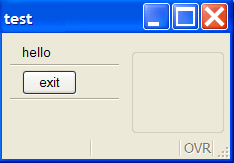
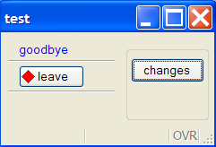
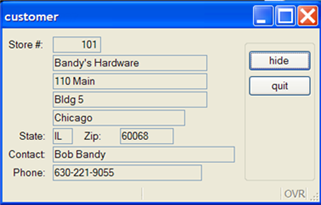
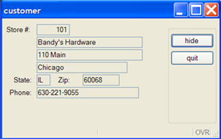
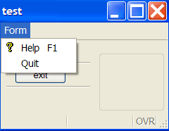
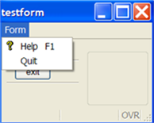
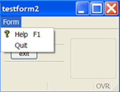
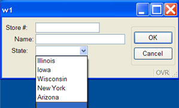

[Back to Summary](TutIndex.html)

------------------------------------------------------------------------

# Tutorial Chapter 12: Changing the User Interface Dynamically

Summary:

- [Built-in Classes](#Built-in_Classes)
- [Using the Classes (Window Class example)](#uiWindow)
  - [Getting a reference to the object](#getwinreference)
  - [Calling a method](#callmethod)
- [Working with Forms](#uiForm)
  - [Getting a reference to the object](#getformreference)
  - [Specifying the name of a form item](#elementname)
- [Changing the text, image, or style of a form
  item](#elementappearance)
- [Hiding form items](#elementhide)
- [Adding Toolbars, Topmenus, and Action Defaults](#tb-tm-ad)
- [Specifying a function to initialize all forms](#forminit)
- [Loading a ComboBox list](#loadcb)
- [Using the Dialog Class in an Interactive Statement](#uiDialog)
  - [Hiding Form Items](#hideaction)
  - [Enabling and Disabling Fields](#disablefield)
- [Using the Interface Class](#uiInterface)
  - [Refresh the Interface](#uirefresh)
  - [Load custom XML files](#uiloadfiles)
  - [Identify the Genero Client](#uiclient)

------------------------------------------------------------------------

## [Built-in Classes]{#Built-in_Classes}

Included in the predefined functions that are built into Genero are
special groups (classes) of functions (methods) that act upon the
objects that are created when your program is running. Each class of
methods interacts with a specific program object, allowing you to change
the appearance or behavior of the objects. Because these methods act
upon program objects, the syntax is somewhat different from that of
functions.

The classes are gathered together into packages:

- **ui** - classes related to the objects in the graphical user
  interface (GUI)
- **base** - classes related to non-GUI program objects 
- **om** - classes that provide DOM and SAX document handling utilities

This tutorial focuses on using the classes and methods in the **ui**
package to modify the user interface at runtime.

[**Note:** Variable names, class identifiers, and method names are not
case-sensitive; the capitalization used in the examples is for ease in
reading.]{style="background-color: #FFFFFF"}

------------------------------------------------------------------------

## [Using the Classes]{#uiWindow}

This example for the Window Class also presents the general process that
you should use.

The methods in the [Window Class](ClassWindow.html) interact with the
Window objects in your program.

### [Getting a reference to the object]{#getwinreference}

Before you can call any of the methods associated with Window objects,
you must identify the specific Window object that you wish to affect,
and obtain a reference to it:

- Define a variable to hold the reference to the Window object. The data
  type of the variable is the class identifier (ui.Window):

> 
>     DEFINE mywin ui.Window   

- Open a window in your program using the OPEN WINDOW  or OPEN WINDOW
  \... WITH FORM \... instruction:

> 
>     OPEN WINDOW w1 WITH FORM "testform"

- Get a reference to the specific Window object by using one of two
  \"class methods\" provided by the Window Class. Class methods are
  called using the class identifier (ui.Window). You can specify the
  Window object by name from among the open windows in your program, or
  choose the current window.

> 
>     LET mywin = ui.Window.getCurrent() -- returns a reference to 
>                                           the current window object
>             
>     LET mywin = ui.Window.forName("w1")-- returns a reference to 
>                                           the open window named "w1"

### [Calling a method]{#callmethod}

Now that you have a reference to the object, you can use that reference
to call any of the methods listed as \"object methods\" in the Window
Class documentation. For example, to change the window title for the
window referenced by mywin:

> 
>     CALL mywin.setText("test")

See [Window Class](ClassWindow.html) for a complete list of the methods
in this class.

#### Example 1:

    01 MAIN
    02  DEFINE mywin ui.Window
    03              
    04  OPEN WINDOW w1 WITH FORM "testform"
    05  LET mywin = ui.Window.getCurrent()
    06  CALL mywin.setText("test")
    07  MENU
    08   ON ACTION quit
    09     EXIT MENU
    10  END MENU
    11
    12 END MAIN

Display on Windows platforms:

     {border="0" width="234" height="163"}

------------------------------------------------------------------------

## [Working with Forms]{#uiForm}

The [Form Class](ClassForm.html) provides some methods that allow you to
change the appearance or behavior of items on a form.

### [Getting a reference to the Form object]{#getformreference}

In order to use the methods, you must get a reference to the form
object. The Window Class has a method to get the reference to its
associated form:

- Define variables for the references to the window object and to its
  form object. The data type for the variables is the class identifier
  (ui.Window, ui.Form):

      DEFINE f1 ui.Form, mywin ui.Window

- Open a form in your program using the OPEN WINDOW \... WITH FORM \...
  instruction:

> 
>     OPEN WINDOW w1 WITH FORM ("testform")

- Next, get a reference to the window object.  Then, use the
  **getForm()** class method of the [Window Class](ClassWindow.html) to
  get a reference to the form object opened in that window:

> 
>     LET mywin = ui.Window.getCurrent()
>     LET f1 = mywin.getForm() -- returns reference to form

Once you have the reference to the form object, you can call any of the
object methods for the Form class: 

         LET mywin = ui.Window.getCurrent()
         LET f1 = mywin.getForm() -- get reference to form 
         -- call a Form Class method   
         CALL f1.loadActionDefaults("mydefaults")

See the [Form Class](ClassForm.html) documentation for a complete list
of methods.

### [Specifying the name]{#elementname} of a form item

Some of the methods in the [Form Class](ClassForm.html) require you to
provide the name of the form item. The name of the form item in the
[Attributes](FormSpecFiles.html#SECTION_ATTRIBUTES) section of the form
specification file corresponds to the **name** attribute of an element
in the runtime form file. For example:

- In the Attributes section of the .per file

> 
>     LABEL a1 : lb1, TEXT = "State";
>     EDIT a2 = state.state_name;
>     BUTTON a3 : quit, TEXT = "exit";
>     EDIT a4 = FORMONLY.pflag TYPE CHAR; 

- In the runtime .42f file

> 
>     <Label name="lb1" width="9" text="State" posY="0" posX="6" gridWidth="9"/>
>     <FormField name="state.state_name" colName="state_name" sqlType="CHAR(15)" 
>         fieldId="0" sqlTabName="state" tabIndex="1">
>     <Button name="quit" width="5" text="exit" posY="4" posX="6" gridWidth="5"/>
>     <FormField name="formonly.pflag" colName="pflag" sqlType="CHAR" fieldId="1" 
>         sqlTabName="formonly" tabIndex="2">
>
> **Note:** Formfield names specified as FORMONLY (FORMONLY.pflag)  are
> converted to lowercase (formonly.pflag).

Although Genero BDL is not case-sensitive, XML is. When Genero creates
the runtime XML file, the form item types and attribute names are
converted using the CamelCase convention:

- Form item type -  the first letter is always capitalized, with
  subsequent letters in lower-case, unless the type consists of multiple
  words joined together. In that case, the first letter of every
  subsequent word is capitalized also (Label, FormField, Button).
- Attribute name - the first letter is always lower-case, with
  subsequent letters in lower-case, unless the name consists of multiple
  words joined together. In that case, the first letter of every
  subsequent word is capitalized also (text, gridWidth, colName).

If you use classes or methods in your code that require the form item
type or attribute name, respect the naming conventions.

------------------------------------------------------------------------

## [Changing the text, image, and style properties of a form item]{#elementappearance}

Some methods of the Form Class allow you to change the value of specific
properties of form items.

Call the methods using the reference to the form object. Provide the
[name](#elementname) of the form item and the value for the property:

- **Text** property - the value can be any text string.  To set the text
  of the label named \"lb1\":

> 
>     CALL f1.setElementText("lb1", "Newtext")

- **Image** property - the value can be a simple file name, a complete
  or relative path, or an URL ( Uniform Resource Locator) path to an
  image server. To set the image for the button named \"quit\":

> 
>     CALL f1.setElementImage("quit", "exit.png")

- **Style** property - the value can be a [presentation
  style](PresentationStyles.html) defined in the active Presentation
  Styles file (.4st file). To set the style for the label named \"lb1\":

> 
>     CALL f1.setElementStyle("lb1", "mystyle")
>
> The style \"mystyle\" is an example of a specific style that was
> defined in a custom Presentation Styles XML file,
> **customstyles.4st**. This style changes the text color to blue:
>
>
>     
>
> By default, the runtime system searches for the **default.4st**
> Presentation Style file.  Use the following method to load a different
> Presentation Style file:
>
>
>     CALL ui.interface.loadStyles("customstyles")
>
>  The [Load custom XML files](#uiloadfiles) section has more
> information about the Interface class. See [Presentation
> Style](PresentationStyles.html)s  for additional information about
> styles and the format of a Presentation Styles file.

####  Example 2:

    01 MAIN
    02   DEFINE mywin ui.Window,
    03          f1    ui.Form 
    04   CALL ui.interface.loadStyles("customstyles")
    05   OPEN WINDOW w1 WITH FORM "testform"
    06   LET mywin = ui.Window.getCurrent()
    07     CALL mywin.setText("test")
    08     LET f1 = mywin.getForm()
    09   MENU
    10     ON ACTION changes
    11       CALL f1.setElementText("lb1", "goodbye")
    12       CALL f1.setElementText("quit", "leave")
    13       CALL f1.setElementImage("quit", "exit.png")
    14       CALL f1.setElementStyle("lb1", "mystyle")
    15     ON ACTION quit
    16       EXIT MENU
    17   END MENU
    18 END MAIN

Display on Windows platform after the changes button has been clicked:

     {border="0" width="241" height="164"}

------------------------------------------------------------------------

## [Hiding Form Items]{#elementhide}

You can use Form Class methods to change the value of the **hidden**
property of form items, hiding parts of the form from the user. 
Interactive instructions such as INPUT or CONSTRUCT will automatically
ignore a [formfield](FormSpecFiles.html#FF_FORM_FIELD) that is hidden. 
The value can be:

- **0** - the form item is not hidden; it is visible
- **1** - the form item is hidden and cannot be made visible by the user
- **2** - the form item is hidden, but the user can make it visible,
  using the context menu for a table, for example

By default, all form items are visible.

Call the methods using the reference to the form object.  Provide the
name of the form item to the method and set the value for hidden.

-  **setFieldHidden()**  - this method can be used to hide formfields
  only. The prefix in the name of the formfield (*tablename.* or
  *formonly.*) is optional:

> 
>     CALL f1.setFieldHidden("state_name",1)

- **setElementHidden()**  - this method hides any form item, including
  formfields.  If the item is a formfield, the name must include the
  prefix:

<!-- -->

         CALL f1.setElementHidden("lb1", 1)

         CALL f1.setElementHidden("state.state_name",1)

         CALL f1.setElementHidden("formonly.pflag",1)

  Genero adjusts the display of the form to eliminate blank spaces
caused by hiding items, where possible.

#### Example 3:

    01 SCHEMA custdemo
    02 MAIN
    03  DEFINE win ui.Window,
    04         fm ui.Form,
    05         mycust record like customer.*
    06  CONNECT TO "custdemo"
    07  OPEN WINDOW w1 WITH FORM "hidecust"
    08  SELECT * INTO mycust.* FROM customer 
    09      WHERE store_num = 101
    10  DISPLAY BY NAME mycust.*
    11  LET win = ui.Window.getCurrent()
    12  LET fm = win.getForm()
    13  MENU
    14   ON ACTION hide
    15     CALL fm.setFieldHidden("contact_name",1)
    16     CALL fm.setFieldHidden("addr2", 1)
    17     -- hide the label for contact name 
    18     CALL fm.setElementHidden("lbl", 1)
    19   ON ACTION quit
    20     EXIT MENU
    21  END MENU
    22 END MAIN

Display on Windows platforms (before hiding):

 {border="0" width="321" height="205"}   \
 After hiding:

  {border="0" width="322" height="202"}  

------------------------------------------------------------------------

## [Adding toolbars, topmenus, and action default]{#tb-tm-ad}s

The Form Class provides methods that apply topmenus, toolbars, and
action defaults to a form, to assist you in standardizing forms.  The
topmenus, toolbars, or action defaults are defined in external XML files
having the following extensions:

- Action Defaults - **.4ad**
- Toolbar - **.4tb**
- Topmenu - **.4tm**

 Call the methods using the reference to the form object and give the
filename. Do not specify a path or file extension in the file name.  If
the file is not in the current directory and the path is not specified,
Genero will search the directories indicated by the
[DBPATH](EnvironmentVariables.html#EV_DBPATH)/[FGLRESOURCEPATH](EnvironmentVariables.html#EV_FGLRESOURCEPATH)
environment variable. 

- Action defaults file - default attributes for form items associated
  with actions; these action defaults are local to the form. See [Action
  Defaults](ActionDefaults.html) for information about the format and
  contents of the file.

> 
>     CALL f1.loadActionDefaults("mydefaults")

- Toolbar file - contains a toolbar definition to be used with the
  referenced form object. See [Toolbars](Toolbars.html) for information
  about the format and contents of the file.

> 
>     CALL f1.loadToolBar("mytoolbar")

- Topmenu file - contains a topmenu definition to be used with the
  referenced form object.  See [Topmenus](Topmenus.html) for information
  about the format and contents of the file.

> 
>     CALL f1.loadTopMenu("mytopmenu")

#### Example 4:

    01 MAIN
    02  DEFINE mywin ui.Window,
    03         f1    ui.Form 
    04  OPEN WINDOW w1 WITH FORM "testform"
    05  LET mywin = ui.Window.forName("w1")
    06  CALL mywin.setText("test")
    07  LET f1 = mywin.getForm()
    08  CALL f1.loadTopMenu("mytopmenu")
    09  MENU   
    10    ON ACTION quit
    11      EXIT MENU
    12  END MENU
    13 
    14 END MAIN

Display on Windows platforms:

     {border="0" width="240" height="186"}

------------------------------------------------------------------------

## [Specifying a Function to Initialize all Forms]{#forminit}

To assist in standardizing forms, you can create an
[initializer](ClassForm.html#EXAMPLES) function in your program that
will be called automatically whenever any form is opened. A reference to
the form object is passed by the runtime system to the function. 

Example initializer function:

    01 FUNCTION myforminit(f1)
    02   DEFINE f1 ui.Form
    03
    04   CALL f1.loadTopMenu("mytopmenu")
    05   ...
    06
    07 END FUNCTION

The setDefaultInitializer method applies to all forms, rather than to a
specific form object.  It is a class method, and you call it using the
class name as a prefix. Specify the name of the initializer function in
lower-case letters:

    CALL ui.Form.setDefaultInitializer("myforminit")  

You can call the **myforminit** function in your program as part of a
setup routine. The **myforminit** function can be in any module in the
program.

#### Example 5:

    01 MAIN
    02  CALL ui.Form.setDefaultInitializer("myforminit")
    03  OPEN WINDOW w1 WITH FORM "testform"
    04  MENU
    05   ON ACTION quit
    06    EXIT MENU
    07  END MENU
    08  OPEN WINDOW w2 WITH FORM "testform2"
    09  MENU
    10   ON ACTION quit
    11    EXIT MENU
    12  END MENU
    13 END MAIN

Display on Windows platforms:

   {border="0" width="194" height="155"} 

   {border="0" width="202" height="154"}

  

------------------------------------------------------------------------

## [Loading a ComboBox List]{#loadcb}

A ComboBox presents a list of values in a dropdown box on a form. The
values are for the underlying
[formfield](FormSpecFiles.html#FF_FORM_FIELD).  For example, the
following form specification file contains a ComboBox that represents
the formfield **customer.state**:

    01 SCHEMA custdemo
    02 LAYOUT
    03  GRID 
    04  {
    05   Store #:[a0  ]
    06      Name:[a1                 ]
    07     State:[a5      ]
    08  }
    09  END -- GRID
    10 END
    11 TABLES customer
    12 ATTRIBUTES
    13   EDIT a0=customer.store_num; 
    14   EDIT a1=customer.store_name;
    15  COMBOBOX a5=customer.state;
    16 END

During an INPUT, INPUT ARRAY or CONSTRUCT statement the ComboBox is
active, and the user can select a value from the dropdown list.  The
value selected will be stored in the formfield named **customer.state**.

### [Getting a reference to the objec]{#getcbreference}t

The [ComboBox Class](ClassComboBox.html) contains methods that manage
the values for a ComboBox. In order to use these methods you must first
obtain a reference to the ComboBox object:

- Define a variable for the reference to the ComboBox object. The data
  type for the variables is the class identifier (ui.ComboBox):

      DEFINE cb ui.ComboBox

- Open a form that contains a ComboBox using OPEN WINDOW \... WITH FORM
  \... :

> 
>     OPEN WINDOW w1 WITH FORM ("testcb")

- Next, get a reference to the ComboBox object using the method
  provided.  As a \"class method\", this method is called using the
  class identifier. Provide the [name](#elementname) of the formfield to
  the method:

> 
>     LET cb = ui.ComboBox.forName("customer.state")

 Once you have a reference to the ComboBox object, you can call any of
the methods defined in the class as \"object methods\":

- To add an item to a ComboBox list

> You can instruct the ComboBox to store a code (the \"name\") in the
> formfield that the ComboBox represents, but to display the description
> (the \"text\")  in the list to help the user make his selection. For
> example, to store the value \"IL\" (*name*) in the formfield, but to
> display \"Illinois\" (*text*) to the user:
>
>
>     CALL cb.additem("IL", "Illinois")
>
> If  *text* is NULL, *name* will be displayed.

- To clear the list of all values

> 
>     CALL cb.clear()

- To remove an item from the list; provide the *name*

> 
>     CALL cb.removeitem("IL")

See the [ComboBox Class](ClassComboBox.html) documentation for a
complete list of the methods.

### [Adding values to the ComboBox from a Database Table]{#addcbitem}

An example in  [Tutorial Chapter 5 GUI Options](TutChap05.html#combobox)
loads a ComboBox with static values. The following example retrieves the
valid list of values from a database table (state) instead:

#### Example 6:

    01 SCHEMA custdemo
    02 MAIN
    03  DEFINE cb ui.ComboBox
    04  CONNECT TO "custdemo"
    05  OPEN WINDOW w1 WITH FORM "testcb"
    06  LET cb = ui.ComboBox.forName("customer.state")
    07  IF cb IS NOT NULL THEN
    08   CALL loadcb(cb)
    09  END IF
    10 ...
    11 END MAIN
    12
    13 FUNCTION loadcb(cb)
    12  DEFINE cb ui.ComboBox,
    13         l_state_code LIKE state.state_code,
    14         l_state_name LIKE state.state_name
    15
    18  DECLARE mycurs CURSOR FOR
    19    SELECT state_code, state_name FROM state
    20  CALL cb.clear()
    21  FOREACH mycurs INTO l_state_code, l_state_name
    22  -- provide name and text for the ComboBox item
    23    CALL cb.addItem(l_state_code,l_state_name)
    24  END FOREACH
    26 END FUNCTION

Display on Windows platforms

{border="0" width="299" height="180"}

As an alternative to calling the **loadcb** function in your BDL
program, this function can be specified as the
[initializer](ClassComboBox.html#EXAMPLES) function for the ComboBox in
the form specification file.  When the form is opened, The initializer
function is called automatically and a reference to the ComboBox object
is passed to it. Provide the name of the initializer function in
lowercase:

> 
>     ATTRIBUTES
>     COMBOBOX a5=customer.state, INITIALIZER = loadcb;

------------------------------------------------------------------------

## [Using the Dialog Class in Interactive Statements]{#uiDialog}

The [Dialog Class](ClassDialog.html) provides methods that can only be
called from within an interactive instruction (dialog) such as MENU,
INPUT, INPUT ARRAY, DISPLAY ARRAY and CONSTRUCT. The methods are called
through the predefined variable DIALOG, which automatically provides a
reference to the Dialog object.

[Tutorial Chapter 5 Enhancing the Form](TutChap05.html#DisEnabActions)
illustrates the use of Dialog Class methods to disable/enable actions
during a MENU interactive statement.

### [Hiding Default Action View]{#hideaction}s

To hide default action views (the buttons that appear on the form when
there is no specific action view for an action), use the following
Dialog Class method. Values for the hidden state of the action view can
be:

- 0 - FALSE, the action is visible
- 1 - TRUE, the action is hidden

<!-- -->

        MENU
          BEFORE MENU
           CALL DIALOG.setActionHidden("next",1)
          ...
        END MENU

This example hides the action that has the name **next**. The reference
to the DIALOG object was provided by the runtime system.

### [Enabling and Disabling Fields]{#disablefield}

This method in the Dialog Class allows you to disable fields on a form
during the interactive statement; the field is still visible, but the
user cannot edit the value. Values for the active state of the field can
be:

- 0 - FALSE, the field is disabled
- 1 - TRUE, the field is enabled

The reference to the DIALOG object is provided by the runtime system.
Provide the [name](#elementname) of the field and its state to the
method.

The following example disables the **store_name** field during an INPUT
statement:

       INPUT BY NAME customer.*
        BEFORE INPUT
          CALL DIALOG.setFieldActive("customer.store_name",0)
        ...
       END INPUT

See the [Dialog Class](ClassDialog.html) documentation for a complete
list of its methods.

------------------------------------------------------------------------

## [Using the Interface Class]{#uiInterface}

Methods in the Interface Class allow you interact with the user
interface, as shown in the examples below.

You do not need to get an object reference to the Interface; call the
methods in the Interface Class using the class identifier,
[ui.Interface](ClassInterface.html).

### [Refresh the interface]{#uirefresh}

The User Interface on the Client is synchronized with the DOM tree of
the runtime system when an interactive statement is active. If you want
to show something on the screen while the program is running in a batch
procedure, you must force synchronization with the front end. 

As shown in the Tutorial Chapter 9 [Reports,](TutChap09.html#Refresh)
the changes made in the program to the value of the progress bar are not
displayed on the user\'s window, since the report is a batch process and
no user interaction is required.  To force the changes in the progress
bar to be reflected on the screen, the following method from the
Interface Class is used:

         CALL ui.Interface.refresh()

### [Load custom XML files]{#uiloadfiles}

- Start Menus, Toolbar icons, and Topmenus can each be defined in a
  unique XML file.

> Use the appropriate extension:
>
> - Start Menu - .4sm
> - Toolbar - .4tb
> - Topmenu - .4tm
>
> Use the corresponding method to load the file:
>
> > 
> >     CALL ui.Interface.loadStartMenu("mystartmenu")
> >
> >
> >     CALL ui.Interface.loadTopMenu("tmstandard")
> >
> >
> >     CALL ui.Interface.loadToolbar("tbstandard")
>
> Do not specify a path or file extension in the file name. The runtime
> system automatically searches for a file with the correct extension in
> the current directory and in the path list defined in the
> [DBPATH](EnvironmentVariables.html#EV_DBPATH)/[FGLRESOURCEPATH](EnvironmentVariables.html#EV_FGLRESOURCEPATH)
> environment variable.
>
> See the [Start Menu](StartMenus.html), [Topmenu](Topmenus.html), or
> [Toolbar](Toolbars.html) documentation for details on the format and
> contents of the files.

- Custom Presentation Styles and global Action Defaults must each be
  defined in a unique file.

> Use the appropriate extension:
>
> - Presentation Styles - .4st
>
> - Action Defaults - .4ad
>
>  Use the corresponding method to load the file:

::: {align="left"}
> > 
> >     CALL ui.Interface.loadStyles("mystyles")
> >
> >
> >     CALL ui.Interface.loadActionDefaults("mydefaults")
:::

> You can provide an absolute path with the corresponding extension, or
> a simple file name without the extension. If you give the simple file
> name, the runtime system searches for the file in the current
> directory. If the file does not exist, it searches in the directories
> defined in the
> [DBPATH](EnvironmentVariables.html#EV_DBPATH)/[FGLRESOURCEPATH](EnvironmentVariables.html#EV_FGLRESOURCEPATH)
> environment variable.
>
> The action defaults are applied only once, to newly created elements.
> For example, if you first load a toolbar, then you load a global
> Action defaults file, the attribute of the toolbar items will not be
> updated with the last loaded Action defaults.
>
> See [Presentation Styles](PresentationStyles.html) and [Action
> Defaults](ActionDefaults.html) for details on the format and contents
> of the file.

### [Identify the Genero client]{#uiclient}

You can use methods in the Interface Class to identify the type and
version of the Genero client currently being used by the program: 

> 
>     CALL ui.Interface.getFrontEndName() RETURNING typestring 
>
>
>     CALL ui.Interface.getFrontEndVersion() RETURNING versionstring

Each method returns a string.  The type will be \"Gdc\" or \"Console\".

Some of the other methods in the ui.Interface class allow you to:

- Set and retrieve program names and titles
- call Front End functions that reside on the Genero client
- work with MDI windows

See the [Interface Class](ClassInterface.html) documentation for a
complete list of the methods.

------------------------------------------------------------------------
