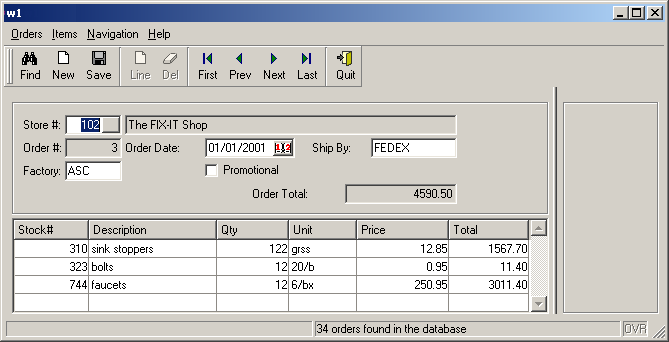

[Back to Summary](TutIndex.html)

------------------------------------------------------------------------

# Tutorial Chapter 13: Master/Detail using Multiple Dialogs

Summary:

- [The Master-Detail sample](#MasterDetailSample)
- [The Customer List Form](#CustListForm) 
- [The Customer List module](#CustListModule)
- [The Orders Form](#OrderItemsForm)
- [The Orders Program](#OrdersProgram)
  - [Module variables of order.4gl](#OrdersModuleVariables)
  - [Function orditems_dialog](#orditems_dialog)
  - [Function order_update](#order_update)
  - [Function order_new](#order_new)
  - [Function order_validate](#order_validate)
  - [Function order_query](#order_query)

------------------------------------------------------------------------

## [The Master-Detail sample]{#MasterDetailSample}

The example discussed in this chapter is designed for the input of order
information (headers and order lines), illustrating a typical
master-detail relationship. The form used by the example contains fields
from both the **orders** and **items** tables in the **custdemo**
database. The result is very similar to the example of chapter 11.
However, in this program the end user can input order and items data
simultaneously, because the form is driven by a [DIALOG
instruction](MultipleDialogs.html).

When the program starts, the existing rows from the orders and items
tables have already been retrieved and are displayed on the form.  The
user can browse through the orders and items to update or delete them,
add new orders or items, and search for specific orders by entering
criteria in the form. 

{border="0"}

#### Display on Windows platforms

There are different ways to implement a Master/Detail form with multiple
dialogs. This chapter shows one of them. Genero provides the basics
bricks, then it\'s up to you to adapt the programming pattern, according
to the ergonomics you want to expose to the end user.

------------------------------------------------------------------------

## [The Customer List Form]{#CustListForm}

The **custlist.per** form defines a typical \'zoom\' form with a filter
field and record list where the user can pick an element to be used in a
field of the main form.  Using this form, the user can scroll through
the list to pick a store, or can enter query criteria to filter the list
prior to picking.

The fields that make up the columns of the table that display the list
are defined as [FORMONLY](FormSpecFiles.html#FF_FORMONLY_FIELD) fields.
When TYPE is not defined, the default data type for FORMONLY fields is
[CHAR](DataTypes.html#DT_CHAR).

+-----------------------------------------------------------------------+
| **Form custlist.per**                                                 |
+-----------------------------------------------------------------------+
| ``` linenumber                                                        |
| 001 SCHEMA custdemo                                                   |
| 002                                                                   |
| 003 LAYOUT                                                            |
| 004 GRID                                                              |
| 005 {                                                                 |
| 006 <g g1                                        >                    |
| 007  Store name: [fc                      :fe   ]                     |
| 008 <                                            >                    |
| 009 <t t1                                        >                    |
| 010   Id   Name                  City                                 |
| 011  [f01 |f02                  |f03            ]                     |
| 012  [f01 |f02                  |f03            ]                     |
| 013  [f01 |f02                  |f03            ]                     |
| 014  [f01 |f02                  |f03            ]                     |
| 015 <                                            >                    |
| 016 }                                                                 |
| 017 END                                                               |
| 018 END                                                               |
| 019                                                                   |
| 020 TABLES                                                            |
| 021    customer                                                       |
| 022 END                                                               |
| 023                                                                   |
| 024 ATTRIBUTES                                                        |
| 025 GROUP g1: TEXT="Filter";                                          |
| 026 EDIT fc = customer.store_name;                                    |
| 027 BUTTON fe: fetch, IMAGE="filter";                                 |
| 028 EDIT f01=FORMONLY.s_num;                                          |
| 029 EDIT f02=FORMONLY.s_name;                                         |
| 030 EDIT f03=FORMONLY.s_city;                                         |
| 031 END                                                               |
| 032                                                                   |
| 033 INSTRUCTIONS                                                      |
| 034 SCREEN RECORD sa_cust (FORMONLY.*);                               |
| 035 END                                                               |
| ```                                                                   |
+-----------------------------------------------------------------------+

#### Notes:

- Line `001`{.linenumber} defines the [database
  schema](DatabaseSchema.html) to be used by this form.
- Lines `003`{.linenumber} thru `018`{.linenumber} define a
  [LAYOUT](FormSpecFiles.html#SECTION_LAYOUT) section that describes the
  layout of the form.
  - Lines `006`{.linenumber} thru `008`{.linenumber} define a
    [GROUPBOX](FormSpecFiles.html#FF_ITEMTYPE_GROUP) with the fc field
    where the user can enter a search criteria, and the fe button to
    trigger the query. 
  - Lines `009`{.linenumber} thru `015`{.linenumber} define a
    [TABLE](FormSpecFiles.html#FF_ITEMTYPE_TABLE) that will be used to
    display the result set of the query.
- Lines `020`{.linenumber} thru `022`{.linenumber} define a
  [TABLES](FormSpecFiles.html#SECTION_TABLES) section to reference
  database schema tables.
- Lines `024`{.linenumber} thru `031`{.linenumber} define an
  [ATTRIBUTES](FormSpecFiles.html#SECTION_ATTRIBUTES) section with the
  details of form fields.
  - Line `026`{.linenumber} defines the query field with a reference to
    the **customer.store_name** database column.\
    This will implicitly define the data type of the field and the
    [QBE](Construct.html) input rules. 
  - Line `027`{.linenumber} defines the
    [BUTTON](FormSpecFiles.html#FF_ITEMTYPE_BUTTON) that will fire the
    database query.
  - Lines `028`{.linenumber} thru `030`{.linenumber} define the columns
    of the table with the FORMONLY prefix.
- Lines `033`{.linenumber} thru `035`{.linenumber} define an
  [INSTRUCTIONS](FormSpecFiles.html#SECTION_INSTRUCTIONS) section to
  group item fields in a screen array.

------------------------------------------------------------------------

## [The Customer List Module]{#CustListModule}

The **custlist.4gl** module defines a \'zoom\' module, to let the user
select a customer from a list. The module could be re-used for any
application that requires the user to select a customer from a list. 

This module uses the **custlist.per** form and is implemented with a
DIALOG instruction defining a
[CONSTRUCT](MultipleDialogs.html#construct-block) sub-dialog and a
[DISPLAY ARRAY](MultipleDialogs.html#display-array-block) sub-dialog.
The **display_custlist()** function in this module returns the customer
id and the name.

In the application illustrated in this chapter, the main module
**orders.4gl** will call the **display_custlist()** function to retrieve
a customer selected by the user.

``` linenumber
01   ON ACTION zoom1
02      CALL display_custlist() RETURNING id, name
03      IF (id > 0) THEN
04         ...
```

Here is the complete source code of the **custlist.4gl** module:

+-----------------------------------------------------------------------+
| **Module custlist.4gl**                                               |
+-----------------------------------------------------------------------+
| ``` linenumber                                                        |
| 001 SCHEMA custdemo                                                   |
| 002                                                                   |
| 003 TYPE cust_t RECORD                                                |
| 004            store_num     LIKE customer.store_num,                 |
| 005            store_name    LIKE customer.store_name,                |
| 006            city          LIKE customer.city                       |
| 007        END RECORD                                                 |
| 008                                                                   |
| 009 DEFINE cust_arr DYNAMIC ARRAY OF cust_t                           |
| 010                                                                   |
| 011 FUNCTION custlist_fill(where_clause)                              |
| 012   DEFINE where_clause STRING                                      |
| 013   DEFINE idx SMALLINT                                             |
| 014   DEFINE cust_rec cust_t                                          |
| 015                                                                   |
| 016   DECLARE custlist_curs CURSOR FROM                               |
| 017     "SELECT store_num, store_name, city "||                       |
| 018     "  FROM customer"||                                           |
| 019     "  WHERE "||where_clause||                                    |
| 020     " ORDER BY store_num"                                         |
| 021                                                                   |
| 022   LET idx = 0                                                     |
| 023   CALL cust_arr.clear()                                           |
| 024   FOREACH custlist_curs INTO cust_rec.*                           |
| 025     LET idx = idx + 1                                             |
| 026     LET cust_arr[idx].* = cust_rec.*                              |
| 027   END FOREACH                                                     |
| 028                                                                   |
| 029 END FUNCTION                                                      |
| 030                                                                   |
| 031 FUNCTION display_custlist()                                       |
| 033   DEFINE ret_num LIKE customer.store_num                          |
| 034   DEFINE ret_name LIKE customer.store_name                        |
| 035   DEFINE where_clause STRING                                      |
| 036   DEFINE idx SMALLINT                                             |
| 037                                                                   |
| 038   OPEN WINDOW wcust WITH FORM "custlist"                          |
| 039                                                                   |
| 040   LET ret_num = 0                                                 |
| 041   LET ret_name = NULL                                             |
| 042                                                                   |
| 043   DIALOG ATTRIBUTES(UNBUFFERED)                                   |
| 044                                                                   |
| 045      CONSTRUCT BY NAME where_clause ON customer.store_name        |
| 046      END CONSTRUCT                                                |
| 047                                                                   |
| 048      DISPLAY ARRAY cust_arr TO sa_cust.*                          |
| 049      END DISPLAY                                                  |
| 050                                                                   |
| 051      BEFORE DIALOG                                                |
| 052         CALL custlist_fill("1 = 1")                               |
| 053                                                                   |
| 054      ON ACTION fetch                                              |
| 055         CALL custlist_fill(where_clause)                          |
| 056                                                                   |
| 057      ON ACTION accept                                             |
| 058         LET idx = DIALOG.getCurrentRow("sa_cust")                 |
| 059         IF idx > 0 THEN                                           |
| 060            LET ret_num = cust_arr[idx].store_num                  |
| 061            LET ret_name = cust_arr[idx].store_name                |
| 062            EXIT DIALOG                                            |
| 063         END IF                                                    |
| 064                                                                   |
| 065      ON ACTION cancel                                             |
| 066         EXIT DIALOG                                               |
| 067                                                                   |
| 068   END DIALOG                                                      |
| 069                                                                   |
| 070   CLOSE WINDOW wcust                                              |
| 071                                                                   |
| 072   RETURN ret_num, ret_name                                        |
| 073                                                                   |
| 074 END FUNCTION                                                      |
| ```                                                                   |
+-----------------------------------------------------------------------+

#### Notes:

- Line `001`{.linenumber} defines the [database
  schema](DatabaseSchema.html) to be used by this module.
- Lines `003`{.linenumber} thru `007`{.linenumber} define the
  **cust_t**  [TYPE](UserTypes.html) as a [RECORD](Records.html) with
  three members declared with a [LIKE](Variables.html#VA_DEFINE)
  reference to the database column.
- Line `009`{.linenumber} defines the **cust_arr** [program
  array](Arrays.html) with the type defined in previous lines.
- Lines `011`{.linenumber} thru `029`{.linenumber} define the
  **custlist_fill()** function which fills **cust_arr** with the values
  of database rows.
  - Lines `016`{.linenumber} thru `020`{.linenumber} declare the
    **custlist_curs** [SQL cursor](ResultSets.html) by using the
    **where_clause** condition passed as the parameter.
  - Lines `022`{.linenumber} thru `027`{.linenumber} fetch the database
    rows into **cust_arr**. 
- Lines `031`{.linenumber} thru `074`{.linenumber} implement the
  **display_custlist()** function to be called by the main module.
  - Lines `040`{.linenumber} and `041`{.linenumber} initialize the
    **ret_num** and **ret_name** variables. If the user cancels the
    dialog, the function will return these values to let the caller
    decide what to do. 
  - Lines `043`{.linenumber} thru `068`{.linenumber} define a
    [DIALOG](MultipleDialogs.html) instruction implementing the
    controller of the form.
    - Lines `045`{.linenumber} thru `046`{.linenumber} define the
      [CONSTRUCT sub-dialog](MultipleDialogs.html#construct-block)
      controlling the **customer.store_name** query field.
    - Lines `048`{.linenumber} thru `049`{.linenumber} define the
      [DISPLAY ARRAY
      sub-dialog](MultipleDialogs.html#display-array-block) controlling
      the **sa_cust** screen array.
    - Lines `051`{.linenumber} thru `052`{.linenumber} implement the
      [BEFORE DIALOG trigger](MultipleDialogs.html#before-dialog-block),
      to fill the list with an initial result set by passing the query
      criteria as \"1 =1\" to the **cust_list_fill** function.
    - Lines `054`{.linenumber} thru `055`{.linenumber} implement the
      **fetch** [ON ACTION
      trigger](MultipleDialogs.html#on-action-block), executed when the
      user presses the **fe** button in the form, to fill  the list with
      a result set by passing the query criteria in **where_clause** to
      the **cust_list_fill** function.
    - Lines `057`{.linenumber} thru `063`{.linenumber} implement the
      **accept** [ON ACTION
      trigger](MultipleDialogs.html#on-action-block), executed when the
      user validates the dialog with the OK button or with a
      double-click in a row of the list. The code initializes the return
      values **ret_num** and **ret_name** with the current row.
    - Lines `065`{.linenumber} thru `066`{.linenumber} implement the
      **cancel** [ON ACTION
      trigger](MultipleDialogs.html#on-action-block), to leave the
      dialog when the user hits the Cancel button.
  - Line `072`{.linenumber} returns the values of the **ret_num** and
    **ret_name** variables.

------------------------------------------------------------------------

## [The Orders Form]{#OrderItemsForm}

The [form specification file](FormSpecFiles.html) **orderform.per**
defines a form for the orders program, and displays fields containing
the values of a single order from the **orders** table.  The name of the
store is retrieved from the **customer** table, using the column
**store_num,** and displayed.

A [screen array](FormSpecFiles.html#SECTION_INSTRUCTIONS) displays the
associated rows from the **items** table.  Although **order_num** is
also one of the fields in the **items** table, it does not have to be
included in the screen array or in the [screen
record](FormSpecFiles.html#SECTION_INSTRUCTIONS), since the order number
will be the same for all the items displayed for a given order.  For
each item displayed in the screen array,  the values in the
**description** and **unit** columns from the **stock** table are also
displayed.

The values in [FORMONLY](FormSpecFiles.html#FF_FORMONLY_FIELD) fields
are not retrieved from a database; they are calculated by the BDL
program based on the entries in other fields.  In this form FORMONLY
fields are used to display the calculations made by the BDL program for
item line totals and the order total. Their data type is defined as
[DECIMAL](DataTypes.html#DT_DECIMAL).

This form uses some of the attributes that can be assigned to fields in
a form. See [Form Specification Files Attributes](FSFAttributes.html)
for a complete list of the available attributes.

The form defines a [toolbar](Toolbars.html) and a
[topmenu](Topmenus.html). The decoration of toolbar or topmenu action
views is centralized in an [Action Defaults](ActionDefaults.html)
section.

+---------------------------------------------------------------------------------------+
| **Form orderform.per**                                                                |
+---------------------------------------------------------------------------------------+
| ``` linenumber                                                                        |
| 001 SCHEMA custdemo                                                                   |
| 002                                                                                   |
| 003 ACTION DEFAULTS                                                                   |
| 004   ACTION find (TEXT="Find", IMAGE="find", COMMENT="Query database")               |
| 005   ACTION new (TEXT="New", IMAGE="new", COMMENT="New order")                       |
| 006   ACTION save (TEXT="Save", IMAGE="disk", COMMENT="Check and save order info")    |
| 007   ACTION append (TEXT="Line", IMAGE="new", COMMENT="New order line")              |
| 008   ACTION delete (TEXT="Del", IMAGE="eraser", COMMENT="Delete current order line") |
| 009   ACTION first (TEXT="First", COMMENT="Move to first order in list")              |
| 010   ACTION previous (TEXT="Prev", COMMENT="Move to previous order in list")         |
| 011   ACTION next (TEXT="Next", COMMENT="Move to next order in list")                 |
| 012   ACTION last (TEXT="Last", COMMENT="Move to last order in list")                 |
| 013   ACTION quit (TEXT="Quit", COMMENT="Exit the program", IMAGE="quit")             |
| 014 END                                                                               |
| 015                                                                                   |
| 016 TOPMENU                                                                           |
| 017   GROUP ord (TEXT="Orders")                                                       |
| 018     COMMAND find                                                                  |
| 019     COMMAND new                                                                   |
| 020     COMMAND save                                                                  |
| 021     SEPARATOR                                                                     |
| 022      COMMAND quit                                                                 |
| 023   END                                                                             |
| 024   GROUP ord (TEXT="Items")                                                        |
| 025     COMMAND append                                                                |
| 026     COMMAND delete                                                                |
| 027   END                                                                             |
| 028   GROUP navi (TEXT="Navigation")                                                  |
| 029     COMMAND first                                                                 |
| 030     COMMAND previous                                                              |
| 031     COMMAND next                                                                  |
| 032     COMMAND last                                                                  |
| 033   END                                                                             |
| 034   GROUP help (TEXT="Help")                                                        |
| 035     COMMAND about (TEXT="About")                                                  |
| 036   END                                                                             |
| 037 END                                                                               |
| 038                                                                                   |
| 039 TOOLBAR                                                                           |
| 040   ITEM find                                                                       |
| 041   ITEM new                                                                        |
| 042   ITEM save                                                                       |
| 043   SEPARATOR                                                                       |
| 044   ITEM append                                                                     |
| 045   ITEM delete                                                                     |
| 046   SEPARATOR                                                                       |
| 047   ITEM first                                                                      |
| 048   ITEM previous                                                                   |
| 049   ITEM next                                                                       |
| 050   ITEM last                                                                       |
| 051   SEPARATOR                                                                       |
| 052   ITEM quit                                                                       |
| 053 END                                                                               |
| 054                                                                                   |
| 055 LAYOUT                                                                            |
| 056 VBOX                                                                              |
| 057 GROUP                                                                             |
| 058 GRID                                                                              |
| 059 {                                                                                 |
| 060   Store #:[f01  ] [f02                                          ]                 |
| 061   Order #:[f03  ]  Order Date:[f04         ] Ship By:[f06       ]                 |
| 062   Factory:[f05  ]             [f07                              ]                 |
| 063                                      Order Total:[f14           ]                 |
| 064 }                                                                                 |
| 065 END                                                                               |
| 066 END -- GROUP                                                                      |
| 067 TABLE                                                                             |
| 068 {                                                                                 |
| 069  Stock#  Description       Qty     Unit    Price       Total                      |
| 070 [f08    |f09              |f10    |f11    |f12        |f13      ]                 |
| 071 [f08    |f09              |f10    |f11    |f12        |f13      ]                 |
| 072 [f08    |f09              |f10    |f11    |f12        |f13      ]                 |
| 073 [f08    |f09              |f10    |f11    |f12        |f13      ]                 |
| 074 }                                                                                 |
| 075 END                                                                               |
| 076 END                                                                               |
| 077 END                                                                               |
| 078                                                                                   |
| 079 TABLES                                                                            |
| 080   customer, orders, items, stock                                                  |
| 081 END                                                                               |
| 082                                                                                   |
| 083 ATTRIBUTES                                                                        |
| 084  BUTTONEDIT f01 = orders.store_num, REQUIRED, ACTION=zoom1;                       |
| 085  EDIT       f02 = customer.store_name, NOENTRY;                                   |
| 086  EDIT       f03 = orders.order_num, NOENTRY;                                      |
| 087  DATEEDIT   f04 = orders.order_date;                                              |
| 088  EDIT       f05 = orders.fac_code, UPSHIFT;                                       |
| 089  EDIT       f06 = orders.ship_instr;                                              |
| 090  CHECKBOX   f07 = orders.promo, TEXT="Promotional",                               |
| 091                  VALUEUNCHECKED="N", VALUECHECKED="Y";                            |
| 092  BUTTONEDIT f08 = items.stock_num, REQUIRED, ACTION=zoom2;                        |
| 093  LABEL      f09 = stock.description;                                              |
| 094  EDIT       f10 = items.quantity, REQUIRED;                                       |
| 095  LABEL      f11 = stock.unit;                                                     |
| 096  LABEL      f12 = items.price;                                                    |
| 097  LABEL      f13 = formonly.line_total TYPE DECIMAL(9,2);                          |
| 098  EDIT       f14 = formonly.order_total TYPE DECIMAL(9,2), NOENTRY;                |
| 099 END                                                                               |
| 100                                                                                   |
| 101 INSTRUCTIONS                                                                      |
| 102 SCREEN RECORD sa_items(                                                           |
| 103   items.stock_num,                                                                |
| 104   stock.description,                                                              |
| 105   items.quantity,                                                                 |
| 106   stock.unit,                                                                     |
| 107   items.price,                                                                    |
| 108   line_total                                                                      |
| 109 )                                                                                 |
| 110 END                                                                               |
| ```                                                                                   |
+---------------------------------------------------------------------------------------+

#### Notes:

- Line `001`{.linenumber} defines the [database
  schema](DatabaseSchema.html) to be used by this form.
- Lines `003`{.linenumber} thru `014`{.linenumber} define a [ACTION
  DEFAULTS](FormSpecFiles.html#SECTION_ACTDEFS) section with view
  defaults such as text and comments.
- Lines `016`{.linenumber} thru `037`{.linenumber} define a
  [TOPMENU](FormSpecFiles.html#SECTION_TOPMENU) section for a pull-down
  menu.
- Lines `039`{.linenumber} thru `053`{.linenumber} define a
  [TOOLBAR](FormSpecFiles.html#SECTION_TOOLBAR) section for a typical
  toolbar.
- Lines `055`{.linenumber} thru `077`{.linenumber} define a
  [LAYOUT](FormSpecFiles.html#SECTION_LAYOUT) section that describes the
  layout of the form.
- Lines `079`{.linenumber} thru `081`{.linenumber} define a
  [TABLES](FormSpecFiles.html#SECTION_TABLES) section to list all the
  database schema tables that are referenced for fields in the
  ATTRIBUTES section of the form.
- Lines `083`{.linenumber} thru `099`{.linenumber} define an
  [ATTRIBUTES](FormSpecFiles.html#SECTION_ATTRIBUTES) section with the
  details of form fields.
  - Lines `084`{.linenumber} and ` 092`{.linenumber} define
    [BUTTONEDIT](FormSpecFiles.html#FF_ITEMTYPE_BUTTONEDIT) fields, with
    buttons that allow the user to trigger actions defined in the .4gl
    module.
- Lines `101`{.linenumber} thru `110`{.linenumber} define an
  [INSTRUCTIONS](FormSpecFiles.html#SECTION_INSTRUCTIONS) section to
  group item fields in a screen array.

------------------------------------------------------------------------

## [The Orders Program orders.4gl]{#OrdersProgram}

The **orders.4gl** source implements the main form controller. Most of
the functionality has been described in previous chapters. In this
section we will only focus on the [DIALOG](MultipleDialogs.html)
instruction programming. The program implements a DIALOG instruction,
including an [INPUT BY NAME
sub-dialog](MultipleDialogs.html#record-input-block) for the order
fields input, and an [INPUT ARRAY
sub-dialog](MultipleDialogs.html#input-array-block) for the items input.

Unlike traditional 4GL programs using singular dialogs, you typically
start the program in the multiple dialog instruction, eliminating the
global [MENU](Menus.html) instruction.

------------------------------------------------------------------------

### [Module variables of orders.4gl]{#OrdersModuleVariables}

The module variables listed below are used by the **orders.4gl** module.

+------------------------------------------------------------------------------------------+
| **Module variables of orders.4gl**                                                       |
+------------------------------------------------------------------------------------------+
| ``` linenumber                                                                           |
| 001 SCHEMA custdemo                                                                      |
| 002                                                                                      |
| 003 TYPE order_t RECORD                                                                  |
| 004            store_name   LIKE customer.store_name,                                    |
| 005            order_num    LIKE orders.order_num,                                       |
| 006            order_date   LIKE orders.order_date,                                      |
| 007            fac_code     LIKE orders.fac_code,                                        |
| 008            ship_instr   LIKE orders.ship_instr,                                      |
| 009            promo        LIKE orders.promo                                            |
| 010       END RECORD,                                                                    |
| 011       item_t RECORD                                                                  |
| 012            stock_num    LIKE items.stock_num,                                        |
| 013            description  LIKE stock.description,                                      |
| 014            quantity     LIKE items.quantity,                                         |
| 015            unit         LIKE stock.unit,                                             |
| 016            price        LIKE items.price,                                            |
| 017            line_total   DECIMAL(9,2)                                                 |
| 018       END RECORD                                                                     |
| 019                                                                                      |
| 020 DEFINE order_rec order_t,                                                            |
| 021      arr_ordnums DYNAMIC ARRAY OF INTEGER,                                           |
| 022      orders_index INTEGER,                                                           |
| 023      arr_items DYNAMIC ARRAY OF item_t,                                              |
| 024      order_total DECIMAL(9,2)                                                        |
| 025                                                                                      |
| 026 CONSTANT title1 = "Orders"                                                           |
| 027 CONSTANT title2 = "Items"                                                            |
| 028                                                                                      |
| 029 CONSTANT msg01 = "You must query first"                                              |
| 030 CONSTANT msg02 = "Enter search criteria"                                             |
| 031 CONSTANT msg03 = "Canceled by user"                                                  |
| 032 CONSTANT msg04 = "No rows found, enter new search criteria"                          |
| 033 CONSTANT msg05 = "End of list"                                                       |
| 034 CONSTANT msg06 = "Beginning of list"                                                 |
| 035 CONSTANT msg07 = "Invalid stock number"                                              |
| 036 CONSTANT msg08 = "Row added to the database"                                         |
| 037 CONSTANT msg09 = "Row updated in the database"                                       |
| 038 CONSTANT msg10 = "Row deleted from the database"                                     |
| 039 CONSTANT msg11 = "New order record created"                                          |
| 040 CONSTANT msg12 = "This customer does not exist"                                      |
| 041 CONSTANT msg13 = "Quantity must be greater than zero"                                |
| 042 CONSTANT msg14 = "%1 orders found in the database"                                   |
| 043 CONSTANT msg15 = "There are no orders selected, exit program?"                       |
| 044 CONSTANT msg16 = "Item is not available in current factory %1"                       |
| 045 CONSTANT msg17 = "Order %1 saved in database"                                        |
| 046 CONSTANT msg18 = "Order input program, version 1.01"                                 |
| 047 CONSTANT msg19 = "To save changes, move focus to another row or to the order header" |
| 048                                                                                      |
| 049 CONSTANT move_first = -2                                                             |
| 050 CONSTANT move_prev  = -1                                                             |
| 051 CONSTANT move_next  = 1                                                              |
| 052 CONSTANT move_last  = 2                                                              |
| ```                                                                                      |
+------------------------------------------------------------------------------------------+

#### Notes:

- Line `001`{.linenumber} defines the [database
  schema](DatabaseSchema.html) to be used by this module.
- Lines `003`{.linenumber} thru `010`{.linenumber} define the
  **order_t** [TYPE](UserTypes.html) as a [RECORD](Records.html) with
  six members declared with a [LIKE](Variables.html#VA_DEFINE) reference
  to the database column. This type will be used for the order records.
- Lines `011`{.linenumber} thru `018`{.linenumber} define the **item_t**
  [TYPE](UserTypes.html) as a [RECORD](Records.html) to be used for the
  item records.
- Line `020`{.linenumber} defines the **order_rec** variable, to hold
  the data of the current order header.
- Line `021`{.linenumber} defines the **arr_ordnums** array, to hold the
  list of order numbers fetched from the last query. This array will be
  used to navigate in the current list of orders.
- Line `022`{.linenumber} defines the **orders_index** variable,
  defining the current order in the **arr_ordnums** array.
- Line `023`{.linenumber} defines the **arr_items** array with the
  **item_t** type, to hold the lines of the current order.
- Line `024`{.linenumber} defines the **order_total** variable,
  containing the order amount.
- Lines `026`{.linenumber} thru `047`{.linenumber} define string
  [constants](Constants.html) with text messages used by the
  **orders.4gl** module.
- Lines `049`{.linenumber} thru `052`{.linenumber} define numeric
  [constants](Constants.html) used for the **order_move()** navigation
  function.

------------------------------------------------------------------------

### [Function orditems_dialog]{#orditems_dialog}

This is the most important function of the program. It implements the
[multiple dialog](MultipleDialogs.html) instruction to control **order**
and **items** input simultaneously.

The function uses the **opflag** variable to determine the state of the
operations for **items**:

- N - no current operation
- T - temporary row was created
- I - row insertion was done in the list
- M - row in the list was modified

+--------------------------------------------------------------------------+
| **Function orditems_dialog  (orders.4gl)**                               |
+--------------------------------------------------------------------------+
| ``` linenumber                                                           |
| 001 FUNCTION orditems_dialog()                                           |
| 002   DEFINE query_ok SMALLINT,                                          |
| 003          id INTEGER,                                                 |
| 004          name LIKE customer.store_name,                              |
| 005          opflag CHAR(1),                                             |
| 006          curr_pa INTEGER                                             |
| 007                                                                      |
| 008   DIALOG ATTRIBUTES(UNBUFFERED)                                      |
| 009                                                                      |
| 010    INPUT BY NAME order_rec.*, order_total                            |
| 011      ATTRIBUTES(WITHOUT DEFAULTS, NAME="order")                      |
| 012                                                                      |
| 013     ON ACTION find                                                   |
| 014        IF NOT order_update(DIALOG) THEN NEXT FIELD CURRENT END IF    |
| 015        CALL order_query()                                            |
| 016                                                                      |
| 017     ON ACTION new                                                    |
| 018        IF NOT order_update(DIALOG) THEN NEXT FIELD CURRENT END IF    |
| 019        IF NOT order_new() THEN                                       |
| 020           EXIT PROGRAM                                               |
| 021        END IF                                                        |
| 022                                                                      |
| 023     ON ACTION save                                                   |
| 024        IF NOT order_update(DIALOG) THEN NEXT FIELD CURRENT END IF    |
| 025                                                                      |
| 026     ON CHANGE store_num                                              |
| 027        IF NOT order_check_store_num() THEN NEXT FIELD CURRENT END IF |
| 028                                                                      |
| 029     ON ACTION zoom1                                                  |
| 030        CALL display_custlist() RETURNING id, name                    |
| 031        IF id > 0 THEN                                                |
| 032           LET order_rec.store_num = id                               |
| 033           LET order_rec.store_name = name                            |
| 034           CALL DIALOG.setFieldTouched("store_num", TRUE)             |
| 035        END IF                                                        |
| 036                                                                      |
| 037     AFTER INPUT                                                      |
| 038        IF NOT order_update(DIALOG) THEN NEXT FIELD CURRENT END IF    |
| 039                                                                      |
| 040     ON ACTION first                                                  |
| 041        IF NOT order_update(DIALOG) THEN NEXT FIELD CURRENT END IF    |
| 042        CALL order_move(move_first)                                   |
| 043     ON ACTION previous                                               |
| 044        IF NOT order_update(DIALOG) THEN NEXT FIELD CURRENT END IF    |
| 045        CALL order_move(move_prev)                                    |
| 046     ON ACTION next                                                   |
| 047        IF NOT order_update(DIALOG) THEN NEXT FIELD CURRENT END IF    |
| 048        CALL order_move(move_next)                                    |
| 049     ON ACTION last                                                   |
| 050        IF NOT order_update(DIALOG) THEN NEXT FIELD CURRENT END IF    |
| 051        CALL order_move(move_last)                                    |
| 052                                                                      |
| 053   END INPUT                                                          |
| 054                                                                      |
| 055   INPUT ARRAY arr_items FROM sa_items.*                              |
| 056     ATTRIBUTES (WITHOUT DEFAULTS, INSERT ROW = FALSE)                |
| 057                                                                      |
| 058     BEFORE INPUT                                                     |
| 059       MESSAGE msg19                                                  |
| 060                                                                      |
| 061     BEFORE ROW                                                       |
| 062       LET opflag = "N"                                               |
| 063       LET curr_pa = DIALOG.getCurrentRow("sa_items")                 |
| 064       CALL DIALOG.setFieldActive("stock_num", FALSE)                 |
| 065                                                                      |
| 066     BEFORE INSERT                                                    |
| 067       LET opflag = "T"                                               |
| 068       LET arr_items[curr_pa].quantity = 1                            |
| 069       CALL DIALOG.setFieldActive("stock_num", TRUE)                  |
| 070                                                                      |
| 071     AFTER INSERT                                                     |
| 072       LET opflag = "I"                                               |
| 073                                                                      |
| 074     BEFORE DELETE                                                    |
| 075       IF opflag="N" THEN                                             |
| 076          IF NOT item_delete(curr_pa) THEN                            |
| 077             CANCEL DELETE                                            |
| 078          END IF                                                      |
| 079       END IF                                                         |
| 080                                                                      |
| 081     AFTER DELETE                                                     |
| 082       LET opflag="N"                                                 |
| 083                                                                      |
| 084     ON ROW CHANGE                                                    |
| 085       IF opflag != "I" THEN LET opflag = "M" END IF                  |
| 086                                                                      |
| 087     AFTER ROW                                                        |
| 088       IF opflag == "I" THEN                                          |
| 089          IF NOT item_insert(curr_pa) THEN                            |
| 090             NEXT FIELD CURRENT                                       |
| 091          END IF                                                      |
| 092          CALL items_line_total(curr_pa)                              |
| 093       END IF                                                         |
| 094       IF opflag == "M" THEN                                          |
| 095          IF NOT item_update(curr_pa) THEN                            |
| 096             NEXT FIELD CURRENT                                       |
| 097          END IF                                                      |
| 098          CALL items_line_total(curr_pa)                              |
| 099       END IF                                                         |
| 100                                                                      |
| 101     ON ACTION zoom2                                                  |
| 102        LET id = display_stocklist()                                  |
| 103        IF id > 0 THEN                                                |
| 104           IF NOT get_stock_info(curr_pa,id) THEN                     |
| 105              LET arr_items[curr_pa].stock_num = NULL                 |
| 106           ELSE                                                       |
| 107              LET arr_items[curr_pa].stock_num = id                   |
| 108           END IF                                                     |
| 109           CALL DIALOG.setFieldTouched("stock_num", TRUE)             |
| 110        END IF                                                        |
| 111                                                                      |
| 112     ON CHANGE stock_num                                              |
| 113        IF NOT get_stock_info(curr_pa,                                |
| 114                   arr_items[curr_pa].stock_num) THEN                 |
| 115           LET arr_items[curr_pa].stock_num = NULL                    |
| 116           CALL __mbox_ok(title2,msg07,"stop")                        |
| 117           NEXT FIELD stock_num                                       |
| 118        ELSE                                                          |
| 119           CALL items_line_total(curr_pa)                             |
| 120        END IF                                                        |
| 121                                                                      |
| 122     ON CHANGE quantity                                               |
| 123        IF arr_items[curr_pa].quantity <= 0 THEN                      |
| 124           CALL __mbox_ok(title2,msg13,"stop")                        |
| 125           NEXT FIELD quantity                                        |
| 126        ELSE                                                          |
| 127           CALL items_line_total(curr_pa)                             |
| 128        END IF                                                        |
| 129                                                                      |
| 130   END INPUT                                                          |
| 131                                                                      |
| 132   BEFORE DIALOG                                                      |
| 133      IF NOT order_select("1=1") THEN                                 |
| 134        CALL order_query()                                            |
| 135      END IF                                                          |
| 136                                                                      |
| 137   ON ACTION about                                                    |
| 138      CALL __mbox_ok(title1,msg18,"information")                      |
| 139                                                                      |
| 140   ON ACTION quit                                                     |
| 141      EXIT DIALOG                                                     |
| 142                                                                      |
| 143   END DIALOG                                                         |
| 144                                                                      |
| 145 END FUNCTION                                                         |
| ```                                                                      |
+--------------------------------------------------------------------------+

#### Notes:

- Lines `002`{.linenumber} thru `006`{.linenumber} define the variables
  used by this function. Other module variables are used by the function
- Lines `008`{.linenumber} thru `143`{.linenumber} define a
  [DIALOG](MultipleDialogs.html) instruction implementing the controller
  of the form.
  - Lines `010`{.linenumber} thru `053`{.linenumber} implement the
    [INPUT BY NAME sub-dialog](MultipleDialogs.html#record-input-block),
    controlling the **order_rec** record input.\
    All actions triggers declared inside the INPUT BY NAME sub-dialog
    will only be activated if the focus is in this sub-dialog.\
    Data validation will occur when focus is lost by this sub-dialog, or
    when the user presses the \"Save\" button.
    - Lines `013`{.linenumber} thru `015`{.linenumber} implement the
      **find** [ON ACTION
      trigger](MultipleDialogs.html#on-action-block), to execute a
      [Query By Example](Construct.html) with the **order_query()**
      function.\
      Before calling the query function, we must validate and save
      current modifications in the order record with the
      **order_update()** function. If the validation/save fails, the
      cursor remains in the current field (when the user clicks an
      action view, such as a [Toolbar](Toolbars.html) icon, the focus
      does not change.)
    - Lines `017`{.linenumber} thru `021`{.linenumber} implement the
      **new** [ON ACTION trigger](MultipleDialogs.html#on-action-block),
      to create a new order record.\
      Before calling the new function, we must validate and save current
      modifications in the order record with the **order_update()**
      function.
    - Lines `023`{.linenumber} thru `024`{.linenumber} implement the
      **save** [ON ACTION
      trigger](MultipleDialogs.html#on-action-block), to validate and
      save current modifications in the order record with the
      **order_update()** function.
    - Lines `026`{.linenumber} thru `027`{.linenumber} declare the [ON
      CHANGE trigger](MultipleDialogs.html#on-change-block) for the
      **store_num** field, to check if the number is a valid store
      identifier with the **order_check_store_num()** function. If the
      function returns `FALSE`, we execute a [NEXT
      FIELD](MultipleDialogs.html#NEXT_FIELD) to stay in the field.
    - Lines `029`{.linenumber} thru `035`{.linenumber} implement the
      **zoom1** [ON ACTION
      trigger](MultipleDialogs.html#on-action-block) for the **f01**
      field, to open a typical \"zoom\" window with the
      **display_custlist()** function. Note that if the user selects a
      customer from the list, we mark the field as touched with the
      [DIALOG.setFieldTouched()
      method](ClassDialog.html#setFieldTouched). This simulates a real
      user input.
    - Lines `037`{.linenumber} thru `038`{.linenumber} implement the
      [AFTER INPUT trigger](MultipleDialogs.html#after-input-block), to
      validate and save current modifications with the
      **order_update()** function when the focus is lost by the order
      header sub-dialog.
    - Lines `040`{.linenumber} thru `051`{.linenumber} implement the [ON
      ACTION triggers](MultipleDialogs.html#on-action-block) for the
      four navigation actions to move in the order list with the
      **order_move()** function.\
      Before calling the query function, we must validate and save
      current modifications with the **order_update()** function.
  - Lines `055`{.linenumber} thru `130`{.linenumber} implement the
    [INPUT ARRAY sub-dialog](MultipleDialogs.html#input-array-block),
    controlling the **arr_items** array input.\
    All actions triggers declared inside the INPUT ARRAY sub-dialog will
    only be activated if the focus is in this sub-dialog.\
    The sub-dialog uses the **opflag** technique to implement SQL
    instructions inside the dialog code and update the database on the
    fly.
    - Lines `058`{.linenumber} thru `059`{.linenumber} implement the
      [BEFORE INPUT trigger](MultipleDialogs.html#before-input-block),
      to display information message to the user, indicating that item
      row data will be validated and saved in the database when the user
      moves to another row or when the focus is lost by the item list.
    - Lines `061`{.linenumber} thru `064`{.linenumber} implement the
      [BEFORE ROW trigger](MultipleDialogs.html#before-row-block),
      initialize the **opflag** operation flag to \"N\" (no current
      operation), save the current row index in **curr_pa** variable and
      disable the **stock_num** field (only editable when creating a new
      line).
    - Lines `066`{.linenumber} thru `069`{.linenumber} implement the
      [BEFORE INSERT trigger](MultipleDialogs.html#before-row-block), to
      set the **opflag** to \"T\" (meaning [temporary
      row](MultipleDialogs.html#temporary-rows) was created). A row will
      be fully validated and ready for SQL INSERT when we reach the
      `AFTER INSERT` trigger, there we will set **opflag** to \"I\". The
      code initializes the quantity to 1 and enables the **stock_num**
      field for user input.
    - Lines `071`{.linenumber} thru `072`{.linenumber} implement the
      [AFTER INSERT trigger](MultipleDialogs.html#after-insert-block),
      to set the **opflag** to \"I\" (row insertion done in list). Data
      is now ready to be inserted in the database. This is done in the
      `AFTER ROW` trigger, according to **opflag**. 
    - Lines `074`{.linenumber} thru `079`{.linenumber} implement the
      [BEFORE DELETE trigger](MultipleDialogs.html#before-delete-block).
      We execute the SQL DELETE only if **opflag** equals \"N\",
      indicating that we are in a normal browse mode (and not inserting
      a new temporary row, which can be deleted from the list without
      any associated SQL instruction).
    - Lines `081`{.linenumber} thru `082`{.linenumber} implement the
      [AFTER DELETE trigger](MultipleDialogs.html#after-delete-block),
      to reset the **opflag** to \"N\" (no current operation). This is
      done to clean the flag after deleting a new inserted row, when
      data validation or SQL insert failed in `AFTER ROW`. In that case,
      **opflag** equals \"I\" in the next `AFTER DELETE` / `AFTER ROW`
      sequence and would fire validation rules again.
    - Lines `084`{.linenumber} thru `085`{.linenumber} implement the [ON
      ROW CHANGE trigger](MultipleDialogs.html#on-row-change-block), to
      set the **opflag** to \"M\" (row was modified), but only if we are
      not currently doing a row insertion: Row insertion can have failed
      in `AFTER ROW ` and` AFTER INSERT` would not be executed again,
      but `ON ROW CHANGE` would. The real SQL UPDATE will be done later
      in `AFTER ROW`.
    - Lines `087`{.linenumber} thru `099`{.linenumber} implement the
      [AFTER ROW trigger](MultipleDialogs.html#after-row-block),
      executing INSERT or UPDATE SQL instructions according to the
      **opflag** flag. If the SQL statement fails (for example, because
      a constraint is violated), we set the focus back to the current
      field with [NEXT FIELD CURRENT](MultipleDialogs.html#NEXT_FIELD)
      and keep the **opflag** value as is. If the SQL instruction
      succeeds, **opflag** will be reset to \"N\" in the next
      `BEFORE ROW`.
    - Lines `101`{.linenumber} thru `103`{.linenumber} implement the
      **zoom2** [ON ACTION
      trigger](MultipleDialogs.html#on-action-block) for the **f08**
      field, to open a typical \"zoom\" window with the
      **display_stocklist()** function. Note that if the user selects a
      stock from the list, we mark the field as touched with the
      [DIALOG.setFieldTouched()
      method](ClassDialog.html#setFieldTouched). This simulates a real
      user input.
    - Lines `112`{.linenumber} thru `120`{.linenumber} declare the [ON
      CHANGE trigger](MultipleDialogs.html#on-change-block) for the
      **stock_num** field, to check if the number is a valid stock
      identifier with the **get_stock_info()** lookup function. If the
      function returns `FALSE`, we execute a [NEXT
      FIELD](MultipleDialogs.html#NEXT_FIELD) to stay in the field,
      otherwise we re-calculate the line total with
      **items_line_total()**.
    - Lines `122`{.linenumber} thru `128`{.linenumber} declare the [ON
      CHANGE trigger](MultipleDialogs.html#on-change-block) for the
      **quantity** field, to check if the value is greater than zero. If
      the value is invalid, we execute a [NEXT
      FIELD](MultipleDialogs.html#NEXT_FIELD) to stay in the field,
      otherwise we re-calculate the line total with
      **items_line_total()**.
  - Lines `132`{.linenumber} thru `134`{.linenumber} implement the
    [BEFORE DIALOG trigger](MultipleDialogs.html#before-dialog-block),
    to fill the list of orders with an initial result set.
  - Lines `137`{.linenumber} thru `138`{.linenumber} implement the
    **about** [ON ACTION trigger](MultipleDialogs.html#on-action-block),
    to display a message box with the version of the program.
  - Lines `140`{.linenumber} thru `141`{.linenumber} implement the
    **quit** [ON ACTION trigger](MultipleDialogs.html#on-action-block),
    to leave the dialog (and quit the program).

------------------------------------------------------------------------

### [Function order_update]{#order_update}

This function validates that the values in the **order_rec** program
record are correct, and then executes an SQL statement to update the row
in the **orders** database table.

+-----------------------------------------------------------------------+
| **Function order_update  (orders.4gl)**                               |
+-----------------------------------------------------------------------+
|                                                                       |
|     01 FUNCTION order_update(d)                                       |
|     02   DEFINE d ui.Dialog                                           |
|     03                                                                |
|     04   IF NOT order_validate(d) THEN RETURN FALSE END IF            |
|     05                                                                |
|     06   WHENEVER ERROR CONTINUE                                      |
|     07   UPDATE orders SET                                            |
|     08           store_num  = order_rec.store_num,                    |
|     09           order_date = order_rec.order_date,                   |
|     10           fac_code   = order_rec.fac_code,                     |
|     11           ship_instr = order_rec.ship_instr,                   |
|     12           promo      = order_rec.promo                         |
|     13     WHERE orders.order_num = order_rec.order_num               |
|     14   WHENEVER ERROR STOP                                          |
|     15                                                                |
|     16   IF SQLCA.SQLCODE <> 0 THEN                                   |
|     17     CALL __mbox_ok(title1,SQLERRMESSAGE,"stop")                |
|     18     RETURN FALSE                                               |
|     19   END IF                                                       |
|     20                                                                |
|     21   CALL d.setFieldTouched("orders.*", FALSE)                    |
|     22   MESSAGE SFMT(msg17, order_rec.order_num)                     |
|     23                                                                |
|     24   RETURN TRUE                                                  |
|     25                                                                |
|     26 END FUNCTION                                                   |
+-----------------------------------------------------------------------+

### Notes:

- Line `01`{.linenumber} Since you cannot use the DIALOG keyword outside
  the [DIALOG](MultipleDialogs.html) statement, a dialog object is
  passed to this function in order to use the methods of the [DIALOG
  class](ClassDialog.html).
- Line `04`{.linenumber} calls the **order_validate** function, passing
  the [dialog object](ClassDialog.html).  If the fields in the dialog
  are not validated, the function returns without updating the database
  row.
- Lines `06`{.linenumber} thru `14`{.linenumber} execute the SQL
  statement to [update a row](StaticSql.html#SS_UPDATE) in the
  **orders** database table using values from the **order_rec** program
  record.
- Lines `16`{.linenumber} thru`18`{.linenumber} return an error and
  exits the function if the [SQLCA.SQLCODE](Exceptions.html#SQLERRORS)
  indicates the database update was not successful.
- Lines `21`{.linenumber} resets the [touched
  flags](MultipleDialogs.html#touched-flag) of the fields in the orders
  screen record, after the database is successfully updated, to get back
  to the initial state of the dialog.
- Line `22`{.linenumber} displays a message to the user indicating the
  database update was successful.
- Line `24`{.linenumber} returns [TRUE](Programs.html#PC_TRUE) to the
  calling function if the database update was successful.

------------------------------------------------------------------------

### [Function order_new]{#order_new}

This function inserts a new row in the database table **orders**, using
the values from the **order_rec** program record.

+-----------------------------------------------------------------------+
| **Function order_new**  (orders.4gl)                                  |
+-----------------------------------------------------------------------+
| ``` linenumber                                                        |
| 01 FUNCTION order_new()                                               |
| 02   SELECT MAX(order_num)+1 INTO order_rec.order_num                 |
| 03     FROM orders                                                    |
| 04   IF order_rec.order_num IS NULL                                   |
| 05    OR order_rec.order_num == 0 THEN                                |
| 06      LET order_rec.order_num = 1                                   |
| 07   END IF                                                           |
| 08   LET order_total = 0                                              |
| 09   -- We keep the same store...                                     |
| 10   LET order_rec.order_date = TODAY                                 |
| 11   LET order_rec.fac_code = "ASC"                                   |
| 12   LET order_rec.ship_instr = "FEDEX"                               |
| 13   LET order_rec.promo = "N"                                        |
| 14                                                                    |
| 15   WHENEVER ERROR CONTINUE                                          |
| 16   INSERT INTO orders (                                             |
| 17      store_num,                                                    |
| 18      order_num,                                                    |
| 19      order_date,                                                   |
| 20      fac_code,                                                     |
| 21      ship_instr,                                                   |
| 22      promo                                                         |
| 23   ) VALUES (                                                       |
| 24      order_rec.store_num,                                          |
| 25      order_rec.order_num,                                          |
| 26      order_rec.order_date,                                         |
| 27      order_rec.fac_code,                                           |
| 28      order_rec.ship_instr,                                         |
| 29      order_rec.promo                                               |
| 30   )                                                                |
| 31   WHENEVER ERROR STOP                                              |
| 32   IF SQLCA.SQLCODE <> 0 THEN                                       |
| 33      CLEAR FORM                                                    |
| 34      CALL __mbox_ok(title1,SQLERRMESSAGE,"stop")                   |
| 35      RETURN FALSE                                                  |
| 36   END IF                                                           |
| 37   CALL arr_ordnums.insertElement(1)                                |
| 38   LET arr_ordnums[1] = order_rec.order_num                         |
| 39   CALL arr_items.clear()                                           |
| 40   MESSAGE msg11                                                    |
| 41   RETURN TRUE                                                      |
| 42 END FUNCTION                                                       |
| ```                                                                   |
|                                                                       |
|                                                                       |
+-----------------------------------------------------------------------+

### Notes:

- Lines `02`{.linenumber} thru `07`{.linenumber} add the next unused
  order number to the **order_num** field of the **order_rec** program
  record, based on the existing order numbers in the **orders** database
  table.
- Lines `08`{.linenumber} thru `13`{.linenumber} set the order total to
  zero, and add default values to some **order_rec** fields.
- Lines `15`{.linenumber} thru `31`{.linenumber} execute the SQL
  statement to [insert a new row](StaticSql.html#SS_INSERT) in the
  orders database table using values from the order_rec program record.
- Lines `32`{.linenumber} thru `36`{.linenumber} [clear the
  form](RecordDisplay.html#CLEAR_FORM) and display an error message if
  the insert into the database table failed, and return
  [FALSE](Programs.html#PC_FALSE) to the calling function.
- Line `37`{.linenumber} inserts a new empty element into the
  **arr_ordnums** [array](Arrays.html) at the first position, after the
  successful insert into the **orders** table, and sets the value of the
  element to the order number of the **order_rec** program record. The
  **arr_ordnums** array keeps track of the order numbers of the orders
  that were retrieved from the database or newly inserted.
- Line `38`{.linenumber}
- Line `39`{.linenumber} [clears the program
  array](Arrays.html#FGL_ARRAY_METHODS) for **items**, preparing for the
  addition of items for the new order.
- Line `40`{.linenumber} displays a message indicating the insert of a
  new row in the **orders** database table was successful.
- Line `42`{.linenumber} returns [TRUE](Programs.html#PC_TRUE) to the
  calling function, indicating the insert into the **orders** database
  table was successful.

------------------------------------------------------------------------

## [Function order_validate]{#order_validate}

This function validates the entries in the fields of the **orders**
screen record.

+-----------------------------------------------------------------------+
| Function order_validate (orders.4gl)                                  |
+-----------------------------------------------------------------------+
| ``` linenumber                                                        |
| 01 FUNCTION order_validate(d)                                         |
| 02   DEFINE d ui.Dialog                                               |
| 03   IF NOT d.getFieldTouched("orders.*") THEN                        |
| 04      RETURN TRUE                                                   |
| 05   END IF                                                           |
| 06   IF d.validate("orders.*") < 0 THEN                               |
| 07      RETURN FALSE                                                  |
| 08   END IF                                                           |
| 09   IF NOT order_check_store_num() THEN                              |
| 10      RETURN FALSE                                                  |
| 11   END IF                                                           |
| 12   RETURN TRUE                                                      |
| 13 END FUNCTION                                                       |
| ```                                                                   |
|                                                                       |
|                                                                       |
+-----------------------------------------------------------------------+

### Notes:

- Line `01`{.linenumber} The dialog object is passed to this function,
  allowing the use of methods of the [DIALOG](ClassDialog.html) class.
- Lines `03`{.linenumber} thur `05`{.linenumber} return TRUE to the
  calling function if the fields in the orders record have not been
  touched.
- Lines `06`{.linenumber} thru `08`{.linenumber} call the
  [validate()](ClassDialog.html#validate) method of the dialog object to
  execute any [NOT NULL](FSFAttributes.html#FA_NOT_NULL),
  [REQUIRED](FSFAttributes.html#FA_REQUIRED), and
  [INCLUDE](FSFAttributes.html#FA_INCLUDE) validation rules defined in
  the form specification file for the fields in the **orders** screen
  record. If this validation fails, FALSE is returned to the calling
  function.
- Lines `09`{.linenumber} thru` 11`{.linenumber} call the
  **order_check_store_num** function to verify that the store_num value
  exists in the **customer** database table. If this validation fails,
  FALSE is returned to the calling function.
- Line `12`{.linenumber} returns TRUE to the calling function when the
  validation is successful.

------------------------------------------------------------------------

### [Function order_query]{#order_query}

This function allows the user to search for a specific order by entering
criteria into the form ([Query by Example](Construct.html)). This
CONSTRUCT statement is not a subdialog of a DIALOG statement. It is a
stand-alone statement called by the action **find**, triggered when the
user selects the corresponding menu item or toolbar icon on the form
**orderform**.

+-----------------------------------------------------------------------+
| ::: {style="background-color: #C0C0C0"}                               |
| Function order_query (orders.4gl)                                     |
| :::                                                                   |
+-----------------------------------------------------------------------+
| ``` linenumber                                                        |
| 01 FUNCTION order_query()                                             |
| 02   DEFINE where_clause STRING,                                      |
| 03         id INTEGER, name STRING                                    |
| 04                                                                    |
| 05   MESSAGE msg02                                                    |
| 06   CLEAR FORM                                                       |
| 07                                                                    |
| 08   WHILE TRUE                                                       |
| 09     LET int_flag = FALSE                                           |
| 10     CONSTRUCT BY NAME where_clause ON                              |
| 11       orders.store_num,                                            |
| 12       customer.store_name,                                         |
| 13       orders.order_num,                                            |
| 14       orders.order_date,                                           |
| 15       orders.fac_code                                              |
| 16                                                                    |
| 17       ON ACTION zoom1                                              |
| 18         CALL display_custlist() RETURNING id, name                 |
| 19         IF id > 0 THEN                                             |
| 20           DISPLAY id TO orders.store_num                           |
| 21           DISPLAY name TO customer.store_name                      |
| 22         END IF                                                     |
| 23                                                                    |
| 24       ON ACTION about                                              |
| 25         CALL __mbox_ok(title1,msg18,"information")                 |
| 26                                                                    |
| 27     END CONSTRUCT                                                  |
| 28                                                                    |
| 29     IF int_flag THEN                                               |
| 30       MESSAGE msg03                                                |
| 31       IF arr_ordnums.getLength()==0 THEN                           |
| 32         IF __mbox_yn(title1,msg15,"stop") THEN                     |
| 33           EXIT PROGRAM                                             |
| 34         END IF                                                     |
| 35         CONTINUE WHILE                                             |
| 36       END IF                                                       |
| 37       RETURN                                                       |
| 38     ELSE                                                           |
| 39       IF order_select(where_clause) THEN                           |
| 40         EXIT WHILE                                                 |
| 41       END IF                                                       |
| 42     END IF                                                         |
| 43   END WHILE                                                        |
| 44                                                                    |
| 45 END FUNCTION                                                       |
| ```                                                                   |
+-----------------------------------------------------------------------+

### Notes:

- Line `02`{.linenumber} defines a [string](DataTypes.html#DT_STRING)
  variable, **where_clause,** to hold the WHERE clause created from the
  criteria entered in the form fields by the user.
- Line`03`{.linenumber} defines an [integer](DataTypes.html#DT_INTEGER)
  variable, **id**, to hold the store number selected by the user after
  triggering the **display_cust** function of the [Customer List
  module](#CustListModule).
- Line `05`{.linenumber} displays a message instructing the user to
  enter search criteria.
- Lines `08`{.linenumber} thru `43`{.linenumber} contain the
  [WHILE](FlowControl.html#FC_WHILE) statement that is executed until an
  order is successfully selected or the user cancels the operation.
  - Lines `10`{.linenumber} thru `15`{.linenumber}` `{.linenumber}
    specify the form fields that will contain the search criteria for
    the [CONSTRUCT](Construct.html) statement.
  - Lines `11`{.linenumber} thru `22`{.linenumber} define an ON ACTION
    clause for the zoom1 button in the [orderform](#OrderItemsForm) form
    specification file. After the user selects the desired customer from
    the customer list that is displayed, the customer number and name
    are stored in the corresponding fields of **orderform**.
  - Lines `24`{.linenumber} thru` 25`{.linenumber} display the message
    when the user selects the **about** menu item on the orderform form.
- Lines `29`{.linenumber} thru `42`{.linenumber} test whether the user
  wants to [interrupt the dialog](Programs.html#PV_INT_FLAG) and
  responds accordingly.
  - Lines `31`{.linenumber} thru `37`{.linenumber} When the user
    interrupts, a message box is displayed if the order number array is
    empty, allowing the user to exit the program, or to continue. If the
    array is not empty, the function simply [returns](Functions.html).
  - Lines `39`{.linenumber} thru `42`{.linenumber} when the user has not
    interrupted, the **order_select** function is called to retrieve the
    order information; then the [WHILE](FlowControl.html#FC_WHILE) loop
    is exited.

------------------------------------------------------------------------
