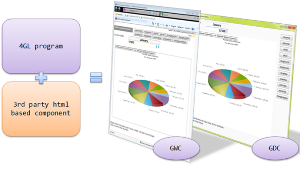
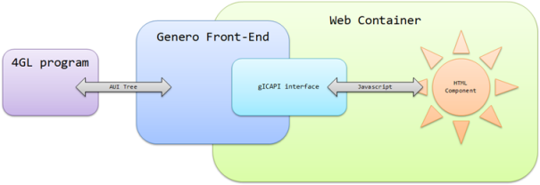
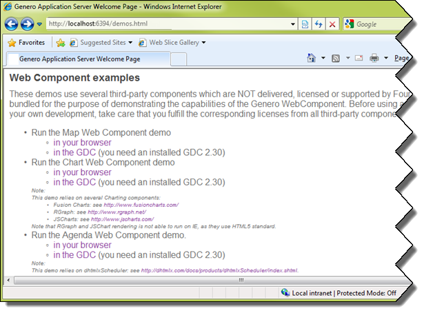

[Back to Contents](../index.html)

------------------------------------------------------------------------

# [Using Web Components in forms]{#PAGE_HEADER}

Summary:

- [Basics](#BASICS)
- [Usage](#USAGE)
  1.  [Implement the interface script on front-ends](#interface-script)
      - [From Component to Program](#component_to_program)
      - [From Program to Component](#program_to_component)
      - [Version-checking Function](#version-checking)
  2.  [Define a Web Component in form files](#webcomp-in-forms)
  3.  [Use the Web Component in programs](#webcomp-in-programs)
- [Web Component Examples](#EXAMPLES)

*See also:* [Forms](FormSpecFiles.html#FF_ITEMTYPE_WEBCOMPONENT)

------------------------------------------------------------------------

## [Basics]{#BASICS}

Starting with Genero **2.30**, you can integrate third party graphical
components into form files by using a new form item type called
[WEBCOMPONENT](FormSpecFiles.html#FF_ITEMTYPE_WEBCOMPONENT).

A `WEBCOMPONENT` field is an element defining an area in the form layout
for instantiating an external component, based on html (javascript,
ajax, flash\...).

The components that can be found on the web are designed for a specific
need, and usually have advanced and powerful features which can bring
greatly added value to your applications. You can, for example, find
chart/graph widgets, calendar widgets, drawing widgets, etc.
Such specialized widgets are not part of the standard GUI toolkits used
to implement Genero front-ends, so they need to be integrated as
external components.

Here\'s a 4GL application using a 3rd party Flash-based chart component
(http://www.fusionchart.com):

{border="0"}

Note that some web components are free, and some are licensed, so you
should take the cost into account before integrating a new web component
into the forms of your application.

Genero Desktop Client uses [WebKit](http://webkit.org/). Webkit plugins
are the same as Mozilla Firefox or Google Chrome plugins (not
extensions), so if you need to use a given plugin (like Adobe Flash
Player), you will need to install either the flash player plugin for
Firefox or the stand alone player. Having only Microsoft Internet
Explorer plugin is not enough as Webkit does not use Active X
technology.

------------------------------------------------------------------------

## [Usage]{#USAGE}

The following sections describe in detail the programming steps to
create an application using a ` WEBCOMPONENT` form item type:

1.  [Implement the Web Component interface script on the front-end
    side](#interface-script).\
    This step has to be done once, and then the script has to be
    deployed on production sites.
2.  [Define a ` WEBCOMPONENT` field in the form
    file](#webcomp-in-forms).
3.  [Use the Web Component in the dialog of the
    program](#webcomp-in-programs).

**Warning: Keep in mind that the interface script has to be deployed on
the front-ends of your production sites. For deployment tips, refer to
front-end specific documentation.**

------------------------------------------------------------------------

### 1. [Implement the Web Component interface script on front-ends]{#interface-script}

Web Components are implemented on the front-end side through an
interface script. The goal of this interface is to manage communication
between the 4GL program and the component.

{border="0"}

The Web Component API relies on a published global object named `gICAPI`
to:

- transmit data or requests [from the component to the 4GL
  program](#component_to_program).
- transmit data or events [from the 4GL program to the
  component](#program_to_component).

### [From Component to Program]{#component_to_program}:

The `gICAPI` provides the following methods:

+--------------------------------------------+----------------------------------+
| **Object Methods**                                                            |
+--------------------------------------------+----------------------------------+
| **Name**                                   | **Description**                  |
+--------------------------------------------+----------------------------------+
| [`SetData`](#SetData)`( data ``STRING`` )` | Data to be sent to the program.  |
+--------------------------------------------+----------------------------------+
| [`SetFocus`](#SetFocus)`( )`               | Generates a focus change         |
|                                            | request.                         |
+--------------------------------------------+----------------------------------+
| [`Action`](#Action)`( action `             | Triggers an action event.        |
| `STRING`` )`                               |                                  |
+--------------------------------------------+----------------------------------+

#### [SetData( data `STRING` )]{#SetData}

Identifies the data to be sent to the program. The corresponding form
field value will be updated with `data`. Data is transmitted as plain
text; sending a large amount of data is not recommended. The
corresponding form field must be the current one. In 4GL, only the
current field can be updated by the user.

#### [SetFocus( )]{#SetFocus}

Generates a focus change request. The focus is entirely managed by the
runtime system. The focus request may fail:

- if the current field does not satisfy validators (VERIFY, data type
  conversion\...)
- due to program logic (AFTER FIELD \... NEXT FIELD CURRENT).

If  the focus change request succeeds, [`gICAPI.onFocus()`](#onFocus)
will be called with the `true` parameter.

#### [Action( action `STRING` )]{#Action}

Generates an action event, which will trigger the corresponding
`ON ACTION` code. If the action named `action` is not available (not
active or does not exist), this function does nothing.

### [From Program to Component]{#program_to_component}:

The following methods of the `gICAPI` object will be called by the Web
Component Interface:

+-----------------------------------------+----------------------------------------------+
| **Object Methods**                                                                     |
+-----------------------------------------+----------------------------------------------+
| **Name**                                | **Description**                              |
+-----------------------------------------+----------------------------------------------+
| [`onFocus`](#onFocus)`( polarity`       | Called when program sets focus in or out.    |
| `BOOLEAN` `)`                           |                                              |
+-----------------------------------------+----------------------------------------------+
| [`onData`](#onData)`( data` `STRING`    | Called when FormField value changes.         |
| `)`                                     |                                              |
+-----------------------------------------+----------------------------------------------+
| [`onProperty`](#onProperty)`( property` | Called when a                                |
| `STRING` `)`                            | [property](FSFAttributes.html#FA_PROPERTIES) |
|                                         | has been added/removed, or its value has     |
|                                         | changed.                                     |
+-----------------------------------------+----------------------------------------------+

#### [onFocus( polarity `BOOLEAN` )]{#onFocus}

This function will be called when the focus changes; `polarity` is set
to `true` if the WebComponent gains the focus, `false` if the Component
loses the focus.

#### [onData( data `STRING` )]{#onData}

This function will be called when the program value of the form field
has been changed. The new value will be `data`.

#### [onProperty( property `STRING` )]{#onProperty}

This function will be called when one of the
[properties](FSFAttributes.html#FA_PROPERTIES) of the component has
changed (been created/removed or value changed). The format used to pass
properties is [JSON](http://en.wikipedia.org/wiki/JSON). The
[complete]{.underline} property set is sent in the parameter each time
this function is called.

### [Version-checking Function]{#version-checking}

The global function `onICHostReady( version ` `DECIMAL` `)` will be
called by the front end when the WebComponent Interface is ready. The
version passed in the parameter allows you to check that your component
is compatible with the API.

### Example:

``` linenumber
01 <SCRIPT LANGUAGE="JavaScript">                                           
02  // This function is called by the Genero Client Container                                   
03  // so the web component can initialize itself and initialize                               
04  // the gICAPI handlers                                                
05  onICHostReady = function(version) {
06      if ( version != 1.0 )                                                                             
07          alert('Invalid API version');
```

At this point the API is ready; the **gICAPI** object is now created.\
The next lines define the functions that must be called by the API to
transmit data from the program to the component:

                                                             
    08                                                                                                                                                                             
    09      // Initialize the focus handler called by the Genero Client        
    10      // Container when the DVM set/removes the focus to/from the         
    11      // component                                                       

A focus border will be added when the component has the focus.

                                                                                                      
    12      gICAPI.onFocus = function(polarity) {                                                     
    13          if ( polarity ) {                                                                              
    14              document.body.style.border = '1px solid blue';                                             
    15          } else {                                                                                       
    16              document.body.style.border = '1px solid grey';                                             
    17          }                                                                                              
    18      }
    19                                                                                                         
    20      // Initialize the data handler ...                                 
    21      // This component does not care about the data set by the DVM ...  
    22      // so there is nothing to do.                                               
    23      gICAPI.onData = function(dt) {                                                            
    24      }                                                                                                  
    25                                                                                                         
    26      // Initialize the properties handler ...                           
    27      // update the component when a property changes                    

A **div** section is used as the title. When the property \"title\" is
changed from the program, the **div** is updated. The JSON string is
evaluated using the `eval` built-in javascript function.

                                                                                                      
    28      gICAPI.onProperty = function(property) {                                                   
    29          var myObject = eval('(' + property + ')');                                            
    30          document.getElementById("title").innerHTML = myObject.title;                                   
    31      }                                                                                                  
    32  }                                                                                                      
    33

Now the following functions will be used to transmit the data or focus
request to the program. These functions will be called by the component
itself, and will use the **gICAPI** object.

                                                                                                             
    34                                                                                                          
    35  // When the user clicks on the document we ask the DVM to              
    36  // get the focus                                                         
    37  askFocus = function() {                                                                       
    38      gICAPI.SetFocus();                                                                                 
    39  }                                                                                                      
    41   
    42  // This function is called when the user clicks 
    43  // on an area of the map                         
    44  execAction = function(stateName) {                                      
    45      gICAPI.SetData(stateName); // Set the widget value so DVM knows it           
    46      gICAPI.Action("state");    // Raise an action                               
    47  }                                                                               
    48 </SCRIPT>                                                                
    49

The component itself can now be loaded. In this example, the component
is an image map. When one of the areas is clicked, the name of the area
(in this case, a state of the USA) will be transmitted as the value
(using `gICAPI.SetData`), and an action indicating the user clicked on a
state will be sent (using `gICAPI.Action`).


    50 <body onclick="askFocus()" style="border: 1px solid grey;margin: 0px;">                                                                            
    51     <center>                                                                                                                                       
    52         <H1 id="title">default title</H1>                                                                                                    
    53                                                                               
    54         <MAP NAME="USAMAP">                                                                                                                        
    55             <AREA SHAPE=POLY COORDS="230,35,294,38,299,57,299,79,228,79" onclick="execAction('North Dakota')" ALT = "North Dakota">                
    56             ...                                                                                                                                                      
    57             <AREA SHAPE=POLY COORDS="486,146,529,136,536,155,536,161,515,156,511,144" onclick="execAction('Maryland')" ALT = "Maryland">
    58         </MAP>                                                                                                                                  
    59     </center>                                                                                                                                   
    60 </body>                                                                                                                                         

------------------------------------------------------------------------

### 2. [Define a Web Component in form files]{#webcomp-in-forms}

In order to display and/or input data in a Web Component, you must
define a [form field](FormSpecFiles.html#FF_FORM_FIELD) with the
`WEBCOMPONENT` item type.

Since Web Component usage is usually very specific, the data of such
fields is often not stored \"as is\" in a database column; you generally
define the Web Component field name with the `FORMONLY` table prefix.

The [COMPONENTTYPE](FSFAttributes.html#FA_COMPONENTTYPE) attribute is
mandatory to define the type of Web Component to be loaded. This
attribute specifies a name that will be mapped to an interface script on
the front-end side.

In Genero Application Server configuration (see GAS documentation, GAS
Configuration Reference, Execution Component), the entry `WEB_COMPONENT`
defines the path where components are deployed:


    01      <WEB_APPLICATION_EXECUTION_COMPONENT Id="cpn.wa.execution.local">
    02        <ENVIRONMENT_VARIABLE Id="FGLDIR">$(res.fgldir)</ENVIRONMENT_VARIABLE>
    03        <ENVIRONMENT_VARIABLE Id="FGLGUI">$(res.fglgui)</ENVIRONMENT_VARIABLE>
    04        <ENVIRONMENT_VARIABLE Id="PATH">$(res.path)</ENVIRONMENT_VARIABLE>
    05        <ENVIRONMENT_VARIABLE Id="FGLLDPATH">$(res.fglldpath)</ENVIRONMENT_VARIABLE>
    06        <ENVIRONMENT_VARIABLE Id="LD_LIBRARY_PATH">$(res.ldlibrarypath)</ENVIRONMENT_VARIABLE>
    07        <DVM>$(res.dvm.wa)</DVM>
    08        <WEB_COMPONENT>$(connector.uri)/components</WEB_COMPONENT>
    09      </WEB_APPLICATION_EXECUTION_COMPONENT>

The component must be located in `WEB_COMPONENT`, in a directory named
`COMPONENTTYPE`, and the main file must be named `COMPONENTTYPE`.html.

Example:


    01 WEBCOMPONENT wc = FORMONLY.mychart,
    02          COMPONENTTYPE = "3DCharts";

The component and all related files should be located in
`$FGLASDIR/web/components/3DCharts` and the main file should be
`$FGLASDIR/web/components/3DCharts/3DCharts.html`.

Notes:

- Genero Web Client uses automatically the above definition to load web
  components
- Genero Desktop Client uses automatically the above definition when
  connected to the GAS
- When Genero Desktop Client is directly connected to the DVM (via SSH
  for instance), the base path for components is `$GDCDIR/webcomponents`
  and follows the same rule as above (ex:
  `$GDCDIR/webcomponents/3DChars/3DCharts.html))`.\
  This base path can be modified by the following frontcall:

<!-- -->


    01 CALL ui.interface.frontCall("standard", "setwebcomponentpath", [myUrl],[ret])

The url must be a well formatted url (e.g.
`"http://myserver/components"` or `"file:///c:/components"`)

Web Components are usually complex widgets displaying detailed
information on the screen, like charts, graphs, or calendars. Such
widgets are generally resizable; you can use the
[STRETCH](FSFAttributes.html#FA_STRETCH) attribute to let the end-user
control the resizing policy of a Web Component field.

Since Web Component field definitions are generic, you must use the
[PROPERTIES](FSFAttributes.html#FA_PROPERTIES) attribute to set specific
parameters of the widget. In the above example, the type of the Web
Component is identified by the name ` "3DCharts"`. The `PROPERTIES`
attribute defines the type of the chart (i.e. ` "bars"`), and the X / Y
axis labels.

The `PROPERTIES` attribute can define a list of:

- simple properties ( *`name`*` = `*`value`* ),
- array properties ( *`name`*` = ( `*`value1`*`, `*`value2`*`, ... )` )
  and
- map/dictionary properties (
  *`name`*` = ( `*`sub-name1`*` = `*`value1`*`, `*`sub-name2`*` = `*`value2`*`, ... )`
  )

where *name* is a simple identifier, and where *values* can be numeric
or string literals.

**Warning: The name of a property defined in the PROPERTIES attribute is
converted to lowercase by the form compiler. To avoid mistakes, a good
programming pattern is to define properties in lowercase, in both the
[interface script](#interface-script) and the [form definition
file](FSFAttributes.html#FA_PROPERTIES). Keep in mind that property
names are not checked at compile time, so nonexistent or mistyped
properties will be ignored at runtime.**

Example:


    01 LAYOUT
    02 GRID
    03{
    04 [wc                       ]
    05 [                         ]
    06 [                         ]
    07 [                         ]
    08 [                         ]
    09 }
    10 END
    11 END
    12 ATTRIBUTES
    13 WEBCOMPONENT wc = FORMONLY.mychart,
    14          COMPONENTTYPE = "3DCharts",
    15          STRETCH = BOTH,
    16          PROPERTIES = ( type = "bars",
    17                      x_label = "Months",
    18                      y_label = "Sales" );
    19 END

For more details about the syntax and possible attributes, see the [Form
Specification File](FormSpecFiles.html#FF_ITEMTYPE_WEBCOMPONENT) page.

------------------------------------------------------------------------

### 3. [Use the Web Component in programs]{#webcomp-in-programs}

Once a Web Component field is [defined in the form
file](#webcomp-in-forms), it can be used as a regular Edit field in
program dialogs.

For example:

``` linenumber
01 DEFINE mychart STRING
02 DEFINE data_array DYNAMIC ARRAY OF RECORD ...
03 ...
04 LET mychart = array_to_chart( data_array )
05 DISPLAY BY NAME mychart
06 ...
07 INPUT BY NAME mychart
08   AFTER FIELD mychart
09     CALL deserialize( mychart, data_array )
```

The data format is completely specific to the component. You will have
to serialize the data in the 4GL program, and de-serialize it in the
[onData](#onData) function.

Depending on your needs, you can also use the
[PROPERTIES](FSFAttributes.html#FA_PROPERTIES) attribute to pass the
data and use JSON to handle it in the [onProperty](#onProperty)
function.

**Warning: Keep in mind that all data will be transmitted via the
[Abstract User Interface](DynamicUI.html#ABSTRACTUI); transmitting a lot
of data will not be efficient and is likely to slow down your
application.**

------------------------------------------------------------------------

## Web Component [Examples]{#EXAMPLES}

Running examples can be tried on the GAS home page ( usually
http://localhost:6394/demos.html for a stand-alone installation ):\
\
{border="0"}\
