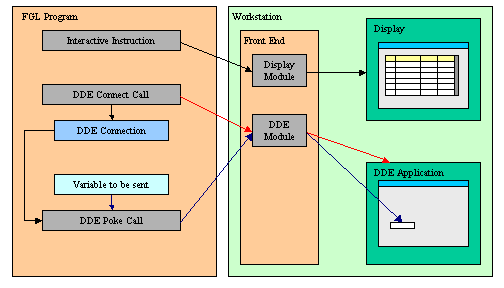

[Back to Contents](../index.html)

------------------------------------------------------------------------

# [Windows DDE Support]{#PAGE_HEADER}

Summary:

- [What is DDE?](#DEFINITION)
- [Using DDE API](#USAGE)
- [The DDE API](#DDEAPI)
- [Example](#EXAMPLE)
- [BDL Wrappers for DDE functions](#BDLFUNCLIST)

*See also:* [Built-in Functions](BuiltInFunctions.html).

------------------------------------------------------------------------

### [What is DDE?]{#DEFINITION}

DDE is a form of inter-process communication implemented by Microsoft
for Windows platforms. DDE uses shared memory to exchange data between
applications. Applications can use DDE for one-time data transfers, and
for ongoing exchanges in applications that send updates to one another
as new data becomes available.

Please refer to your Microsoft documentation for DDE compatibility
between existing versions. As an example, DDE commands were changed
between Office 97 and Office 98.

------------------------------------------------------------------------

### [Using DDE API]{#USAGE}

With DDE Support, you can invoke a Windows application and send data to
or receive data from it. To use this functionality, the program must use
the Windows Front End.

Before using the DDE functions, the TCP communication channel between
the application and the front end must be established with a display
(OPEN WINDOW, MENU, DISPLAY TO).

{border="0" width="504" height="288"}

The DDE API is used in a four-part procedure, as described in the
following steps:

1.  The application sends the Front End the DDE order using the TCP/IP
    channel.
2.  The Front End executes the DDE order and sends the data to the
    Windows application through the DDE API.
3.  The Windows application executes the command and sends the result,
    which can be data or an error code, to the Front End.
4.  The Windows Front End sends back the result to the application using
    the TCP/IP channel.

A DDE connection is uniquely identified by two values: The name of the
DDE Application and the document. Most DDE functions require these two
values to identify the DDE source or target.

------------------------------------------------------------------------

### [The DDE API]{#DDEAPI}

The DDE API is based on the front call technique described in [Front End
Functions](FrontEndFunctions.html). All DDE functions are grouped in the
**WINDDE** front end function module.

  -------------------------------------- --------------------------------------------------------------------------------------------
  **Function name**                      **Description**
  [DDEConnect](#WINDDE_DDECONNECT)       This function opens a DDE connection
  [DDEExecute](#WINDDE_DDEEXECUTE)       This function executes a command in the specified program
  [DDEFinish](#WINDDE_DDEFINISH)         This function closes a DDE connection
  [DDEFinishAll](#WINDDE_DDEFINISHALL)   This function closes all DDE connections, as well as the DDE server program
  [DDEError](#WINDDE_DDEERROR)           This function returns DDE error information about the last DDE operation
  [DDEPeek](#WINDDE_DDEPEEK)             This function retrieves data from the specified program and document using the DDE channel
  [DDEPoke](#WINDDE_DDEPOKE)             This function sends data to the specified program and document using the DDE channel
  -------------------------------------- --------------------------------------------------------------------------------------------

------------------------------------------------------------------------

### [DDEConnect]{#WINDDE_DDECONNECT}

#### Purpose:

This function opens a DDE connection.

#### Syntax:

`CALL ui.Interface.frontCall("WINDDE","DDEConnect",`\
`        [ `*`program, document, encoding`*` ], [`*`result`*`] )`

#### Notes:

1.  *program* is the name of the DDE application. 
2.  *document* is the document that is to be opened.
3.  *encoding* is an optional parameter. It allows to force the encoding
    to use between ASCII and wide char/unicode. When not specified,
    WinDDE will try to retrieve the correct encoding by itself. Possible
    values are: \"UNICODE\", \"ASCII\"
4.  *result* is an integer variable receiving the status.
5.  *result* is [TRUE](Programs.html#PC_TRUE) if the function succeeded,
    [FALSE](Programs.html#PC_FALSE) otherwise.
6.  If the function failed, use [DDEError](#WINDDE_DDEERROR) to get the
    description of the error.

#### Warnings:

1.  If the function failed with \"DMLERR_NO_CONV_ESTABLISHED\", then the
    DDE application was probably not running; use
    [execute](FrontEndFunctions.html) or
    [shellexec](FrontEndFunctions.html) front call to start the DDE
    application.
2.  In Microsoft Office 2010, the use of DDE is disabled by default. You
    need to uncheck \"Ignore other applications that use Dynamic Data
    Exchange(DDE)\" in advanced options, otherwise
    [DDEConnect](#WINDDE_DDECONNECT) will fail.

------------------------------------------------------------------------

### [DDEExecute]{#WINDDE_DDEEXECUTE}

#### Purpose:

This function executes a DDE command.

#### Syntax:

`CALL ui.Interface.frontCall("WINDDE","DDEExecute",`\
`        [ `*`program, document, command, encoding`*` ], [`*`result`*`] )`

#### Notes:

1.  *program* is the name of the DDE application. 
2.  *document* is the document that is to be used.
3.  *command* is the command that needs to be executed.
4.  *encoding* is an optional parameter. It allows to force the encoding
    to use between ASCII and wide char/unicode. When not specified,
    WinDDE will try to retrieve the correct encoding by itself. Possible
    values are: \"UNICODE\", \"ASCII\"
5.  Refer to the *program* documentation for the syntax of *command*.
6.  *result* is an integer variable receiving the status.
7.  *result* is [TRUE](Programs.html#PC_TRUE) if the function succeeded,
    [FALSE](Programs.html#PC_FALSE) otherwise.
8.  If the function failed, use [DDEError](#WINDDE_DDEERROR) to get the
    description of the error.

#### Warnings:

1.  The DDE connection must be opened; see
    [DDEConnect](#WINDDE_DDECONNECT).

------------------------------------------------------------------------

### [DDEFinish]{#WINDDE_DDEFINISH}

#### Purpose:

This function closes a DDE connection.

#### Syntax:

`CALL ui.Interface.frontCall("WINDDE","DDEFinish",`\
`        [ `*`program, document`*` ], [`*`result`*`] )`

#### Notes:

1.  *program* is the name of the DDE application. 
2.  *document* is the document that is to be closed.
3.  *result* is an integer variable receiving the status.
4.  *result* is [TRUE](Programs.html#PC_TRUE) if the function succeeded,
    [FALSE](Programs.html#PC_FALSE) otherwise.
5.  If the function failed, use [DDEError](#WINDDE_DDEERROR) to get the
    description of the error.

#### Warnings:

1.  The DDE connection must be opened, see
    [DDEConnect](#WINDDE_DDECONNECT).

------------------------------------------------------------------------

### [DDEFinishAll]{#WINDDE_DDEFINISHALL}

#### Purpose:

This function closes all DDE connections as well as the DDE server
program.

#### Syntax

`CALL ui.Interface.frontCall("WINDDE","DDEFinishAll", [], [`*`result`*`] )`

#### Notes:

1.  Closes all DDE connections.
2.  *result* is an integer variable receiving the status.
3.  *result* is [TRUE](Programs.html#PC_TRUE) if the function succeeded,
    [FALSE](Programs.html#PC_FALSE) otherwise.

------------------------------------------------------------------------

### [DDEError]{#WINDDE_DDEERROR}

#### Purpose:

This function returns the error information about the last DDE
operation.

#### Syntax:

`CALL ui.Interface.frontCall("WINDDE","DDEError", [], [`*`errmsg`*`] )`

#### Notes:

1.  *errmsg* is the error message. It is set to
    [NULL](Programs.html#PC_NULL) if no error occurred.

------------------------------------------------------------------------

### [DDEPeek]{#WINDDE_DDEPEEK}

#### Purpose:

This function retrieves data from the specified program and document
using the DDE channel.

#### Syntax:

`CALL ui.Interface.frontCall("WINDDE","DDEPeek",`\
`        [ `*`program, container, cells, encoding`*` ], [ `*`result, value`*` ] )`

#### Notes:

1.  *program* is the name of the DDE application. 
2.  *container* is the document or sub-document that is to be used.\
    A sub-document can, for example, be a sheet in Microsoft Excel.
3.  *cells* represents the working items; see the *program*
    documentation for the format of *cells*.
4.  *encoding* is an optional parameter. It allows to force the encoding
    to use between ASCII and wide char/unicode. When not specified,
    WinDDE will try to retrieve the correct encoding by itself. Possible
    values are: \"UNICODE\", \"ASCII\"
5.  *value* represents the data to be retrieved; see the *program*
    documentation for the format of *values*.
6.  *result* is an integer variable receiving the status.
7.  *result* is [TRUE](Programs.html#PC_TRUE) if the function succeeded,
    [FALSE](Programs.html#PC_FALSE) otherwise.
8.  If the function failed, use [DDEError](#WINDDE_DDEERROR) to get the
    description of the error.
9.  *value* is a variable receiving the cells values.

#### Warnings:

1.  The DDE connection must be opened; see
    [DDEConnect](#WINDDE_DDECONNECT).
2.  [DDEError](#WINDDE_DDEERROR) can only be called once to check if an
    error occurred.

------------------------------------------------------------------------

### [DDEPoke]{#WINDDE_DDEPOKE}

#### Purpose:

This function sends data to the specified program and document using the
DDE channel.

#### Syntax:

`CALL ui.Interface.frontCall("WINDDE","DDEPoke",`\
`        [ `*`program, container, cells, values, encoding`*` ], [`*`result`*`] )`

#### Notes:

1.  *program* is the name of the DDE application. 
2.  *container* is the document or sub-document that is to be used.\
    A sub-document can, for example, be a sheet in Microsoft Excel.
3.  *cells* represents the working items; see the *program*
    documentation for the format of *cells*.
4.  *values* represents the data to be sent; see the *program*
    documentation for the format of *values*.
5.  *encoding* is an optional parameter. It allows to force the encoding
    to use between ASCII and wide char/unicode. When not specified,
    WinDDE will try to retrieve the correct encoding by itself. Possible
    values are: \"UNICODE\", \"ASCII\"
6.  *result* is an integer variable receiving the status.
7.  *result* is [TRUE](Programs.html#PC_TRUE) if the function succeeded,
    [FALSE](Programs.html#PC_FALSE) otherwise.
8.  If the function failed, use [DDEError](#WINDDE_DDEERROR) to get the
    description of the error.

#### Warnings:

1.  The DDE connection must be opened; see
    [DDEConnect](#WINDDE_DDECONNECT).
2.  An error may occur if you try to set many (thousands of) cells in a
    single operation.

------------------------------------------------------------------------

### [Example]{#EXAMPLE}

#### dde_example.per

    01 DATABASE formonly
    02 SCREEN
    03 {
    04 Value to be given to top-left corner :
    05 [f00                                ]                                                                                                                                    
    06 Value found on top-left corner :
    07 [f01                                ]
    08 }                                                                                                                                    
    09 ATTRIBUTES
    10   f00 = formonly.val;
    11   f01 = formonly.rval, NOENTRY;

#### dde_example.4gl

    01 MAIN
    02   -- Excel must be open beforehand
    03   CONSTANT file = "Sheet1"
    04   CONSTANT prog = "EXCEL"
    05   DEFINE val, rval STRING
    06   DEFINE res INTEGER
    07   OPEN WINDOW w1 AT 1,1 WITH FORM "dde_example.per"
    08   INPUT BY NAME val
    09   CALL ui.Interface.frontCall("WINDDE","DDEConnect", [prog,file], [res] )
    10   CALL checkError(res)
    11   CALL ui.Interface.frontCall("WINDDE","DDEPoke", [prog,file,"R1C1",val], [res] );
    12   CALL checkError(res)
    13   CALL ui.Interface.frontCall("WINDDE","DDEPeek", [prog,file,"R1C1"], [res,rval] );
    14   CALL checkError(res)
    15   DISPLAY BY NAME rval
    16   INPUT BY NAME val WITHOUT DEFAULTS
    17   CALL ui.Interface.frontCall("WINDDE","DDEExecute", [prog,file,"[save]"], [res] );
    18   CALL checkError(res)
    19   CALL ui.Interface.frontCall("WINDDE","DDEFinish", [prog,file], [res] );
    20   CALL checkError(res)
    21   CALL ui.Interface.frontCall("WINDDE","DDEFinishAll", [], [res] );
    22   CALL checkError(res)
    23   CLOSE WINDOW w1
    24 END MAIN
    25
    26 FUNCTION checkError(res)
    27   DEFINE res INTEGER
    28   DEFINE mess STRING
    29   IF res THEN RETURN END IF
    30   DISPLAY "DDE Error:"
    31   CALL ui.Interface.frontCall("WINDDE","DDEError",[],[mess]);
    32   DISPLAY mess
    33   CALL ui.Interface.frontCall("WINDDE","DDEFinishAll", [], [res] );
    34   DISPLAY "Exit with DDE Error."
    35   EXIT PROGRAM (-1)
    36 END FUNCTION

------------------------------------------------------------------------

### [BDL Wrappers to DDE front end functions]{#BDLFUNCLIST}

The following functions are provided for backward compatibility. We
recommend that you use the front call functions if you write new code.

#### Warning: These functions (especially DDEExecute and DDEPoke) expect escaped TAB, CR and LF characters in the strings passed as parameters. For example, a TAB character must be written as `"\\t"` in a BDL string constant passed as parameter to the DDEPoke function. 

  ------------------------------------- --------------------------------------------------------------------------------------------
  **Function**                          **Description**
  [DDEConnect( )](#DF_DDECONNECT)       This function opens a DDE connection
  [DDEExecute( )](#DF_DDEEXECUTE)       This function executes a command in the specified program
  [DDEFinish( )](#DF_DDEFINISH)         This function closes a DDE connection
  [DDEFinishAll( )](#DF_DDEFINISHALL)   This function closes all DDE connections as well as the DDE server program
  [DDEGetError( )](#DF_DDEGETERROR)     This function returns DDE error information about the last DDE operation
  [DDEPeek( )](#DF_DDEPEEK)             This function retrieves data from the specified program and document using the DDE channel
  [DDEPoke( )](#DF_DDEPOKE)             This function sends data to the specified program and document using the DDE channel
  ------------------------------------- --------------------------------------------------------------------------------------------

------------------------------------------------------------------------

### [DDEConnect]{#DF_DDECONNECT}()

#### Purpose:

This function opens a DDE connection.

#### Syntax:

`CALL DDEConnect ( `*`program`*` STRING`*`, document`*` STRING ) RETURNING SMALLINT`

#### Notes:

1.  *program* is the name of the DDE application. 
2.  *document* is the document that is to be opened.
3.  The function returns [TRUE](Programs.html#PC_TRUE) if the connection
    succeeded, [FALSE](Programs.html#PC_FALSE) otherwise.
4.  If the return value is [FALSE](Programs.html#PC_FALSE), use
    [DDEGetError()](#DF_DDEGETERROR) to get the description of the
    error.

#### Warnings:

1.  If the function failed with \"DMLERR_NO_CONV_ESTABLISHED\", then the
    DDE application was probably not running; use
    [WinExec()](UtilityFunctions.html#UF_WINEXEC) or
    [WinShellExec()](UtilityFunctions.html#UF_WINSHELLEXEC) front call
    to start the DDE application.

------------------------------------------------------------------------

### [DDEExecute]{#DF_DDEEXECUTE}()

#### Purpose:

This function executes a DDE command.

#### Syntax:

`CALL DDEExecute ( `*`program`*` STRING`*`, document`*` STRING, `*`command`*` STRING ) RETURNING SMALLINT`

#### Notes:

1.  *program* is the name of the DDE application. 
2.  *document* is the document that is to be used.
3.  *command* is the command that needs to be executed.
4.  Refer to the *program* documentation for the syntax of *command*.
5.  The function returns [TRUE](Programs.html#PC_TRUE) if the command
    execution succeeded, [FALSE](Programs.html#PC_FALSE) otherwise.
6.  If the return value is [FALSE](Programs.html#PC_FALSE), use
    [DDEGetError()](#DF_DDEGETERROR) to get the description of the
    error.

#### Warnings:

1.  The DDE connection must be opened see
    [DDEConnect()](#DF_DDECONNECT).

------------------------------------------------------------------------

### [DDEFinish]{#DF_DDEFINISH}()

#### Purpose:

This function closes a DDE connection.

#### Syntax:

`CALL DDEFinish ( `*`program`*` STRING`*`, document`*` STRING ) RETURNING SMALLINT`

#### Notes:

1.  *program* is the name of the DDE application. 
2.  *document* is the document that is to be closed.
3.  The function returns [TRUE](Programs.html#PC_TRUE) if the function
    succeeded, [FALSE](Programs.html#PC_FALSE) otherwise.
4.  If the return value is [FALSE](Programs.html#PC_FALSE), use
    [DDEGetError()](#DF_DDEGETERROR) to get the description of the
    error.

#### Warnings:

1.  The DDE connection must be opened, see
    [DDEConnect()](#DF_DDECONNECT).

------------------------------------------------------------------------

### [DDEFinishAll]{#DF_DDEFINISHALL}()

#### Purpose:

This function closes all DDE connections, as well as the DDE server
program.

#### Syntax

`CALL DDEFinishAll()`

#### Notes:

1.  Closes all DDE connections.

------------------------------------------------------------------------

### [DDEGetError]{#DF_DDEGETERROR}()

#### Purpose:

This function returns the error information about the last DDE
operation.

#### Syntax:

`CALL DDEGetError() RETURNING STRING`

#### Notes:

1.  The function returns the error message or
    [NULL](Programs.html#PC_NULL) if no error occurred.

------------------------------------------------------------------------

### [DDEPeek]{#DF_DDEPEEK}()

#### Purpose:

This function retrieves data from the specified program and document
using the DDE channel.

#### Syntax:

`CALL DDEPeek ( `*`program`*` STRING`*`, container`*` STRING, `*`cells`*` STRING ) RETURNING `*`value`*

#### Notes:

1.  *program* is the name of the DDE application. 
2.  *container* is the document or sub-document that is to be used. A
    sub-document can, for example, be a sheet in Microsoft Excel.
3.  *cells* represents the working items; see the *program*
    documentation for the format of *cells*.
4.  *value* represents the data to be retrieved; see the *program*
    documentation for the format of *values*.
5.  If the function succeeded, [DDEGetError()](#DF_DDEGETERROR) function
    returns [NULL](Programs.html#PC_NULL).

#### Warnings:

1.  The DDE connection must be opened; see
    [DDEConnect()](#DF_DDECONNECT).
2.  [DDEGetError()](#DF_DDEGETERROR) can only be called once to check if
    an error occurred.

------------------------------------------------------------------------

### [DDEPoke]{#DF_DDEPOKE}()

#### Purpose:

This function sends data to the specified program and document using the
DDE channel.

#### Syntax:

`CALL DDEPoke ( `*`program`*` STRING`*`, container`*` STRING, `*`cells`*` STRING, `*`values`*` STRING ) RETURNING SMALLINT`

#### Notes:

1.  *program* is the name of the DDE application. 
2.  *container* is the document or sub-document that is to be used. A
    sub-document can, for example, be a sheet in Microsoft Excel.
3.  *cells* represents the working items; see the *program*
    documentation for the format of *cells*.
4.  *values* represents the data to be sent; see the *program*
    documentation for the format of *values*.
5.  The function returns [TRUE](Programs.html#PC_TRUE) if the function
    succeeded, [FALSE](Programs.html#PC_FALSE) otherwise.
6.  If the return value is [FALSE](Programs.html#PC_FALSE), use
    [DDEGetError()](#DF_DDEGETERROR) to get the description of the
    error.

#### Warnings:

1.  The DDE connection must be opened; see
    [DDEConnect()](#DF_DDECONNECT).
2.  An error may occur if you try to set many (thousands of) cells in a
    single operation.
